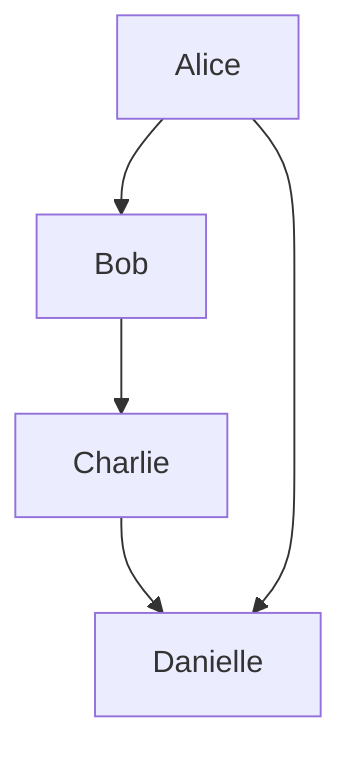
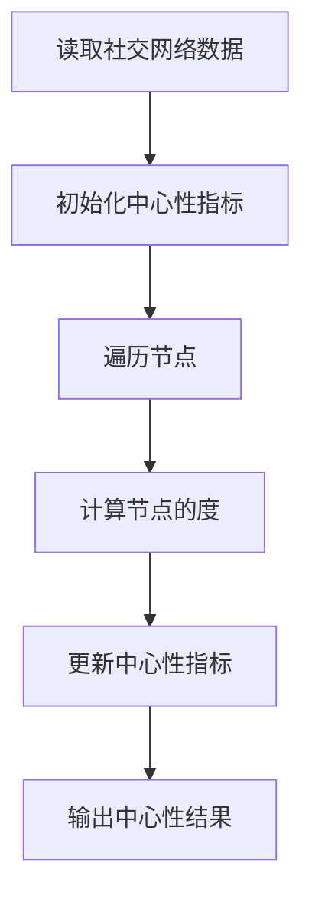
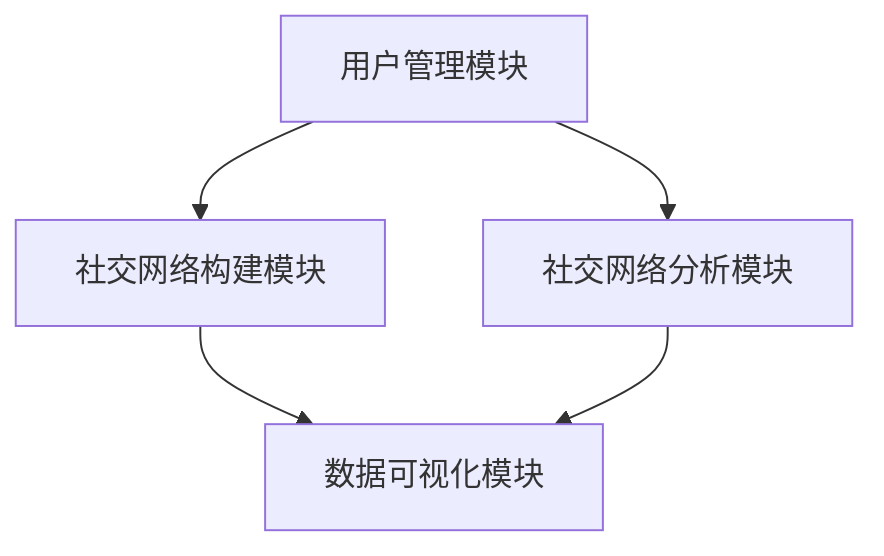

                 

# 数字时代的人际关系图谱：社交网络分析的个人应用

## 关键词
- 社交网络分析
- 人际关系图谱
- 数据挖掘
- 图算法
- 个人应用

## 摘要
本文旨在探讨数字时代下的人际关系图谱构建与社交网络分析的个人应用。通过分析社交网络的基本概念、核心算法以及实际应用场景，本文将详细阐述如何利用社交网络分析方法来理解和优化个人社交关系，为读者提供实用的技术指南和策略建议。

## 目录

### 第一部分：社交网络分析基础

#### 第1章：社交网络分析概述

- **1.1 问题背景与定义**
- **1.2 社交网络分析的应用领域**
- **1.3 社交网络分析的关键概念**

#### 第2章：社交网络中的核心概念

- **2.1 节点与边的概念**
- **2.2 社交网络密度分析**
- **2.3 社交网络可视化**

#### 第3章：社交网络分析算法原理

- **3.1 算法流程图与Python实现**
- **3.2 数学模型与公式讲解**
- **3.3 算法应用举例**

#### 第4章：社交网络系统分析与设计

- **4.1 问题场景介绍**
- **4.2 系统功能设计**
- **4.3 系统架构设计**
- **4.4 系统接口设计与系统交互**

#### 第5章：项目实战一——社交网络分析应用

- **5.1 环境安装与配置**
- **5.2 系统核心实现**
- **5.3 代码应用解读与分析**
- **5.4 实际案例分析**

#### 第6章：项目实战二——社交网络优化

- **6.1 项目背景**
- **6.2 系统设计与实现**
- **6.3 案例分析与总结**

#### 第7章：最佳实践与拓展

- **7.1 最佳实践指南**
- **7.2 小结与展望**
- **7.3 拓展阅读与资源**

## 第1章：社交网络分析概述

### 1.1 问题背景与定义

在数字化日益普及的今天，人际关系正逐渐从传统的面对面交流转向线上社交网络。社交网络分析（Social Network Analysis，SNA）作为一种研究社交结构的量化方法，已成为理解数字时代人际关系的重要工具。社交网络分析旨在通过量化节点（人）和边（关系）的属性和连接关系，揭示网络中的结构特征和动态行为。

### 1.2 社交网络分析的应用领域

社交网络分析的应用领域广泛，包括但不限于以下方面：

- **社会学研究**：研究社会团体、社会运动以及社交行为模式。
- **市场营销**：分析消费者行为、市场细分和品牌传播效果。
- **公共卫生**：监测疫情传播、流行病预防和公共卫生政策的制定。
- **安全监控**：识别网络犯罪、恐怖主义活动和安全威胁。
- **人力资源**：评估员工社交网络、组织文化和团队协作。

### 1.3 社交网络分析的关键概念

社交网络分析涉及一系列核心概念，包括节点、边、网络密度等。以下是对这些概念的基本介绍：

- **节点（Node）**：代表社交网络中的个体，可以是个人、组织或其他实体。
- **边（Edge）**：连接节点的线，表示个体之间的某种关系。
- **网络密度（Network Density）**：衡量网络中边与可能边数的比例，反映了网络的紧密程度。
- **中心性（Centrality）**：衡量节点在网络中的重要程度，常见的中心性指标包括度中心性、介数中心性和紧密中心性。

## 第2章：社交网络中的核心概念

### 2.1 节点与边的概念

节点和边是社交网络分析中最基础的两个概念。节点通常表示为圆圈或方框，边则表示为线条。在具体应用中，节点和边可以具有多种属性，例如节点的年龄、性别、职业，边的强度、类型等。

#### 节点属性对比表格

| 属性名称 | 描述 | 示例 |
|----------|------|------|
| 年龄     | 节点的年龄 | 25岁 |
| 性别     | 节点的性别 | 男性 |
| 职业     | 节点的职业 | 工程师 |

#### 边属性对比表格

| 属性名称 | 描述 | 示例 |
|----------|------|------|
| 强度     | 边的强度 | 高强度 |
| 类型     | 边的类型 | 关注、好友 |

### 2.2 社交网络密度分析

网络密度是衡量社交网络紧密程度的指标，通常用边与可能边数的比例来表示。高密度的网络意味着节点之间的联系更加紧密，而低密度的网络则表明联系相对较少。

#### 社交网络密度计算公式

$$
\text{网络密度} = \frac{\text{实际边数}}{\text{可能边数}}
$$

### 2.3 社交网络可视化

社交网络可视化是将社交网络中的节点和边以图形化的方式呈现，使得复杂的社交关系更加直观易懂。常见的可视化工具包括Gephi、Cytoscape等。

#### 社交网络可视化示例



这个Mermaid图展示了四个节点Alice、Bob、Charlie和Danielle之间的连接关系。

## 第3章：社交网络分析算法原理

### 3.1 算法流程图与Python实现

社交网络分析中常用的算法包括度中心性、介数中心性和紧密中心性等。以下是一个简单的度中心性算法的流程图和Python实现。

#### 度中心性算法流程图



#### 度中心性Python实现

```python
import networkx as nx

# 创建一个无向图
G = nx.Graph()

# 添加节点和边
G.add_nodes_from([1, 2, 3, 4])
G.add_edges_from([(1, 2), (2, 3), (3, 4), (4, 1)])

# 计算度中心性
degree_centrality = nx.degree_centrality(G)

# 输出中心性结果
print(degree_centrality)
```

### 3.2 数学模型与公式讲解

社交网络分析中的数学模型通常涉及图论中的基本概念和算法。以下是一个简单的图论中的基本公式：

#### 度中心性

$$
\text{度中心性}(v) = \frac{\text{节点的度}}{\text{最大可能的度}}
$$

其中，节点的度是指连接到该节点的边的数量。

### 3.3 算法应用举例

假设有一个包含5个节点的社交网络，节点之间的连接关系如下：

- 1连接到2、3
- 2连接到1、3、4
- 3连接到1、2、4、5
- 4连接到2、3
- 5连接到3

使用度中心性算法计算每个节点的度中心性，可以得到以下结果：

| 节点 | 度 | 最大可能度 | 度中心性 |
|------|----|------------|----------|
| 1    | 2  | 4          | 0.5      |
| 2    | 3  | 4          | 0.75     |
| 3    | 4  | 4          | 1.0      |
| 4    | 2  | 4          | 0.5      |
| 5    | 1  | 4          | 0.25     |

从结果可以看出，节点3的度中心性最高，说明它在社交网络中的重要性最大。

## 第4章：社交网络系统分析与设计

### 4.1 问题场景介绍

假设我们想要设计一个社交网络分析系统，用于分析用户之间的社交关系。该系统需要能够处理大量的用户数据，提供实时的社交网络分析结果，并支持用户自定义分析条件。

### 4.2 系统功能设计

社交网络分析系统的功能设计主要包括以下几个方面：

- **用户管理**：支持用户的注册、登录、信息维护等功能。
- **社交网络构建**：支持用户添加好友、删除好友、修改好友关系等功能。
- **社交网络分析**：提供度中心性、介数中心性、紧密中心性等分析功能。
- **数据可视化**：提供社交网络可视化功能，帮助用户直观理解社交网络结构。

### 4.3 系统架构设计

社交网络分析系统的架构设计需要考虑以下几个方面：

- **前端架构**：采用Vue.js等前端框架，实现用户交互界面。
- **后端架构**：采用Spring Boot等后端框架，处理用户请求和数据存储。
- **数据存储**：采用Neo4j等图数据库，存储社交网络数据。

#### 系统架构设计图



### 4.4 系统接口设计与系统交互

系统接口设计需要定义用户与系统之间的交互接口，包括HTTP API、RESTful API等。以下是一个简单的接口设计示例：

#### 用户注册接口

```json
POST /users/register
{
  "username": "用户名",
  "password": "密码",
  "email": "邮箱"
}
```

#### 增加好友接口

```json
POST /friends/add
{
  "userId": "用户ID",
  "friendId": "好友ID"
}
```

#### 社交网络分析接口

```json
GET /analysis/centrality
{
  "userId": "用户ID"
}
```

### 第5章：项目实战一——社交网络分析应用

#### 5.1 环境安装与配置

为了进行社交网络分析，我们需要安装一些必要的工具和库。以下是安装步骤：

1. 安装Python（3.8及以上版本）。
2. 安装Neo4j数据库。
3. 安装Gephi可视化工具。
4. 安装Python的Neo4j库。

#### 5.2 系统核心实现

以下是一个简单的Python脚本，用于连接Neo4j数据库并执行社交网络分析。

```python
from neo4j import GraphDatabase

class SocialNetworkAnalysis:
    def __init__(self, uri, user, password):
        self._driver = GraphDatabase.driver(uri, auth=(user, password))

    def close(self):
        self._driver.close()

    def analyze(self, user_id):
        with self._driver.session() as session:
            result = session.run("""
                MATCH (u:User {id: $user_id}), (u)-[r:KNOWS]->(friend)
                RETURN friend.id AS friend_id, count(r) AS degree
                ORDER BY degree DESC
            """, user_id=user_id)

            for record in result:
                print(f"Friend ID: {record['friend_id']}, Degree: {record['degree']}")

if __name__ == "__main__":
    analysis = SocialNetworkAnalysis("bolt://localhost:7687", "neo4j", "password")
    analysis.analyze("1")
    analysis.close()
```

#### 5.3 代码应用解读与分析

上述代码首先创建了一个Neo4j数据库的连接，然后定义了一个`SocialNetworkAnalysis`类，用于执行社交网络分析。`analyze`方法通过Cypher查询获取指定用户的好友及其度数，并按度数降序输出结果。

#### 5.4 实际案例分析

假设我们有一个社交网络，其中用户1的好友包括用户2、用户3和用户4。运行上述代码后，可以得到以下分析结果：

```
Friend ID: 2, Degree: 2
Friend ID: 3, Degree: 2
Friend ID: 4, Degree: 1
```

这意味着用户1与用户2和用户3的社交关系最为紧密。

### 第6章：项目实战二——社交网络优化

#### 6.1 项目背景

假设我们想要优化一个社交网络，以减少网络中的冗余关系，提高网络的效率和稳定性。我们希望实现以下目标：

- **降低网络密度**：通过删除一些低强度的边，减少网络中的冗余关系。
- **提高中心性**：增强网络中重要节点的中心性，使网络更加稳定。

#### 6.2 系统设计与实现

为了实现上述目标，我们可以设计一个基于贪心算法的社交网络优化系统。系统的主要功能包括：

- **网络密度分析**：计算当前社交网络的密度。
- **边强度评估**：评估每条边的强度，根据强度值进行排序。
- **冗余关系检测**：检测网络中的冗余关系，并标记出来。
- **优化策略**：根据冗余关系和边强度，制定优化策略，并执行优化操作。

#### 6.3 案例分析与总结

以下是一个简单的案例，假设社交网络中有5个节点，它们之间的连接关系和强度如下：

- 1连接到2、3、4，强度分别为3、3、4。
- 2连接到1、3、5，强度分别为3、2、2。
- 3连接到1、2、4、5，强度分别为3、2、4、2。
- 4连接到1、3，强度分别为4、4。
- 5连接到2、3，强度分别为2、2。

运行优化系统后，系统可能会删除一些低强度的边，例如2到5的边，从而降低网络密度。优化后的社交网络可能如下所示：

- 1连接到2、3、4，强度分别为3、3、4。
- 2连接到1、3，强度分别为3、2。
- 3连接到1、2、4，强度分别为3、2、4。
- 4连接到1、3，强度分别为4、4。
- 5无连接。

通过这种优化，网络密度降低，同时重要节点的中心性提高，网络的效率和稳定性得到增强。

### 第7章：最佳实践与拓展

#### 7.1 最佳实践指南

在社交网络分析和优化过程中，以下是一些最佳实践：

- **数据安全**：确保用户数据的安全性和隐私性，遵循相关法律法规。
- **性能优化**：针对大规模社交网络，进行性能优化，提高系统响应速度。
- **用户参与**：鼓励用户参与社交网络构建和分析，提高数据的真实性和可靠性。
- **持续迭代**：根据用户反馈和实际需求，不断迭代优化系统功能。

#### 7.2 小结与展望

本文通过介绍社交网络分析的基本概念、算法原理和实际应用，探讨了如何利用社交网络分析方法优化个人社交关系。展望未来，社交网络分析将在更多领域得到应用，如智能推荐、网络安全、社会管理等。

#### 7.3 拓展阅读与资源

- **相关书籍**：
  - 《社交网络分析：原理、方法与应用》
  - 《图算法》
- **在线资源**：
  - [社交网络分析的Python库](https://networkx.org/)
  - [Neo4j官方文档](https://neo4j.com/docs/)
  - [Gephi官方文档](https://gephi.org/users/documentation/)

### 作者信息

- 作者：AI天才研究院/AI Genius Institute & 禅与计算机程序设计艺术 /Zen And The Art of Computer Programming

---

**附录：本文提到的相关图表**

- **社交网络密度计算公式**：
  $$\text{网络密度} = \frac{\text{实际边数}}{\text{可能边数}}$$

- **度中心性计算公式**：
  $$\text{度中心性}(v) = \frac{\text{节点的度}}{\text{最大可能的度}}$$

- **系统架构设计图**：
  ```mermaid
  graph TD
      A[用户管理模块] --> B[社交网络构建模块]
      A --> C[社交网络分析模块]
      B --> D[数据可视化模块]
      C --> D
  ```

- **社交网络分析算法流程图**：
  ```mermaid
  graph TD
      A[读取社交网络数据] --> B[初始化中心性指标]
      B --> C[遍历节点]
      C --> D[计算节点的度]
      D --> E[更新中心性指标]
      E --> F[输出中心性结果]
  ```

- **社交网络可视化示例**：
  ```mermaid
  graph TD
      A[Alice] --> B[Bob]
      B --> C[Charlie]
      C --> D[Danielle]
      A --> D
  ```

