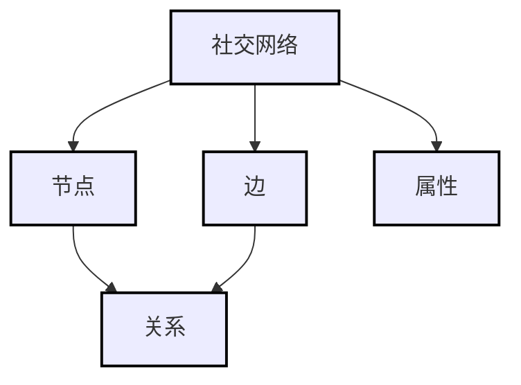

                 

## 介绍数字时代与社交网络分析

### 数字时代的背景

#### 数字时代的定义与特征

数字时代，亦称信息时代，是继工业时代之后，人类社会进入的一个以数字化信息和网络技术为核心的发展阶段。这个时代的主要特征包括信息的高效传播、数据的大量生成与处理、以及数字化技术的广泛应用。

- **数字化**：数字化意味着一切事物都可以被转换为二进制数据，从而在计算机和互联网上进行存储、处理和传输。这为信息的快速传播和处理提供了技术基础。

- **网络化**：网络技术使得人们可以跨越时空的限制，实现信息共享和交流。互联网和社交媒体的兴起，进一步加速了信息的传播和人际关系的形成。

- **信息化**：信息化指的是通过信息技术，对社会各个领域进行改造和提升。这包括教育、医疗、交通、金融等多个方面，使得社会运行更加高效和智能化。

#### 社交网络的发展历程

社交网络作为数字时代的一个重要组成部分，其发展历程可以分为以下几个阶段：

- **早期社交网络**：最早的社交网络可以追溯到1997年的Friendster，它是一个基于朋友关系链的社交平台。随后，Myspace和Facebook等平台相继问世，使得社交网络开始在全球范围内流行起来。

- **中期社交网络**：这一阶段，社交网络开始向多样化方向发展。例如，LinkedIn专注于职场社交，Instagram和Pinterest则专注于图片和兴趣分享。

- **现代社交网络**：随着移动互联网的普及，现代社交网络呈现出移动化和去中心化的特点。例如，微信和WhatsApp等应用不仅提供了社交功能，还集成了支付、娱乐等多种服务。

#### 社交网络分析的意义

社交网络分析（Social Network Analysis，简称SNA）是研究社交网络结构、属性和动态变化的一门学科。在数字时代，社交网络分析具有以下重要意义：

- **人际关系管理**：社交网络分析可以帮助个人和企业更好地理解和管理人际关系，从而提高沟通效率和团队协作。

- **市场营销**：企业可以通过社交网络分析，了解消费者的行为和需求，制定更有效的市场营销策略。

- **社会网络监控**：社交网络分析可以用于监控社会舆论和公共事件，帮助政府和企业及时应对危机。

- **科学研究**：社交网络分析为社会科学研究提供了新的方法和工具，可以用于研究群体行为、社会结构等复杂现象。

### 社交网络分析的基本概念

#### 社交网络的概念

社交网络是指由一组个体（节点）及其之间的关系（边）组成的网络结构。这些个体可以是个人、组织、地区等，而关系可以是朋友、同事、交易等。

#### 社交网络分析的要素

社交网络分析主要包括以下要素：

- **节点（Node）**：社交网络中的个体，如人、组织、地区等。
- **边（Edge）**：节点之间的关系，可以是直接关系（如朋友）或间接关系（如共同兴趣）。
- **属性（Attribute）**：节点的特征属性，如年龄、性别、职业等。
- **网络结构（Structure）**：社交网络的拓扑结构，如度分布、聚集度、社区结构等。
- **动态变化（Dynamics）**：社交网络的演化过程，如节点加入、退出、关系建立、关系断裂等。

#### 社交网络分析的方法论

社交网络分析的方法论主要包括以下内容：

- **网络测量**：通过计算各种网络指标，如度中心性、紧密性、群体中心性等，来描述和分析社交网络的结构和特性。
- **数据挖掘**：利用数据挖掘技术，从大量社交网络数据中提取有用信息，如社交关系、行为模式等。
- **可视化**：通过图形化方式展示社交网络结构，帮助人们直观地理解和分析社交网络。
- **模型构建**：基于数学模型和算法，对社交网络进行建模和分析，以预测和解释社交网络的行为和动态。

#### 社交网络分析的框架与流程

社交网络分析通常包括以下步骤：

1. **数据收集**：收集社交网络数据，可以通过爬虫、API接口、问卷调查等方式获取。
2. **数据预处理**：对原始数据进行清洗、去重、转换等处理，以得到可用于分析的干净数据。
3. **网络构建**：根据预处理后的数据，构建社交网络图，包括节点、边和属性等。
4. **网络分析**：利用各种网络测量方法，对社交网络进行结构分析和动态分析。
5. **可视化与解释**：通过可视化工具，将分析结果展示出来，并进行解释和解读。
6. **模型构建与验证**：基于分析结果，构建数学模型和算法，进行验证和优化。

### 社交网络分析的应用领域

社交网络分析广泛应用于以下领域：

- **社会网络研究**：研究社会结构、群体行为、社会关系等。
- **市场营销**：分析消费者行为、市场趋势、品牌影响力等。
- **公共卫生**：监控疫情传播、流行病预测等。
- **网络安全**：检测和预防社交网络中的恶意行为。
- **组织管理**：优化团队协作、管理人力资源等。

### 本章小结

本章介绍了数字时代的背景和社交网络分析的基本概念，包括数字时代的定义与特征、社交网络的发展历程、社交网络分析的意义、基本概念和方法论，以及社交网络分析的框架和流程。通过本章的介绍，读者可以初步了解数字时代和社交网络分析的重要性，以及社交网络分析在实际应用中的广泛应用。

### 拓展阅读

- **《社交网络分析：方法与应用》**：这本书详细介绍了社交网络分析的理论和方法，适合对社交网络分析有深入兴趣的读者。
- **《网络科学的复杂性》**：这本书从复杂性的角度探讨了网络科学的基础理论，适合对网络科学有较高要求的读者。
- **《社交网络分析工具与技术》**：这本书介绍了多种社交网络分析工具和技术，是学习社交网络分析实践的好资源。

---

## 第2章：社交网络分析的核心概念与联系

### 2.1 节点与边的概念

在社交网络分析中，节点和边是两个最基本的元素。节点代表社交网络中的个体，而边则代表个体之间的关系。

#### 2.1.1 节点的定义与属性

**节点的定义**：节点是指社交网络中的个体，可以是个人、组织、地区等。节点具有以下属性：

- **标识符（ID）**：唯一标识节点的标识符。
- **属性（Attribute）**：节点的特征信息，如姓名、年龄、性别、职业等。

**节点的属性对比**：

| 属性类型 | 描述 | 示例 |
| --- | --- | --- |
| 基础属性 | 基本信息 | 姓名、年龄、性别 |
| 关联属性 | 节点之间的关系 | 同事、朋友、亲属 |
| 功能属性 | 节点在社会网络中的作用 | 领导者、影响者、普通成员 |

#### 2.1.2 边的定义与类型

**边的定义**：边是指连接两个节点的线，表示节点之间的关系。边具有以下属性：

- **权重（Weight）**：边的强度或重要性，可以是数值或布尔值。
- **类型（Type）**：边的类型，如友谊、合作、敌对等。

**边的类型对比**：

| 类型 | 描述 | 示例 |
| --- | --- | --- |
| 直接边 | 直接连接两个节点的边 | 同事、朋友 |
| 间接边 | 通过其他节点间接连接的边 | 同学会、共同兴趣群组 |
| 情感边 | 表示情感关系的边 | 爱、恨 |

#### 2.1.3 节点与边的属性对比

| 属性类型 | 节点 | 边 |
| --- | --- | --- |
| 标识符 | 唯一标识节点 | 连接两个节点的标识符 |
| 属性 | 节点特征信息 | 边的强度或重要性 |
| 类型 | 节点类型 | 边的类型 |

### 2.2 社交网络的属性特征

社交网络的属性特征是描述网络结构和行为的重要指标。以下是一些常见的属性特征：

#### 2.2.1 社交网络的度分布

**度分布**：度分布是指社交网络中节点度数的分布情况。度分布可以反映社交网络的密度和连接性。

- **高斯分布**：大多数节点的度数接近平均值，极少数节点的度数非常高。
- **泊松分布**：节点的度数服从泊松分布，即度数随节点数量的增加而减少。

**度分布示例**：

```mermaid
graph TB
A1 --> B1
A1 --> B2
A1 --> B3
A2 --> B4
A2 --> B5
A3 --> B6
A3 --> B7
A4 --> B8
A4 --> B9
A4 --> B10
classDef default fill:#FFFFF,stroke:#000000,stroke-width:2px
class A1 A2 A3 A4 node
class B1 B2 B3 B4 B5 B6 B7 B8 B9 B10 node
```

#### 2.2.2 社交网络的聚集度

**聚集度**：聚集度是指社交网络中节点之间的连接紧密程度。聚集度越高，节点之间的连接越紧密。

- **局域网络**：局域网络是指社交网络中的紧密连接区域，如朋友圈、社群等。
- **全局网络**：全局网络是指整个社交网络的连接紧密程度，可以通过聚类系数和平均路径长度来衡量。

**聚集度示例**：

```mermaid
graph TB
A1 --> B1
A1 --> B2
A1 --> B3
A2 --> B4
A2 --> B5
A3 --> B6
A3 --> B7
A4 --> B8
A4 --> B9
A4 --> B10
classDef default fill:#FFFFF,stroke:#000000,stroke-width:2px
class A1 A2 A3 A4 node
class B1 B2 B3 B4 B5 B6 B7 B8 B9 B10 node
```

#### 2.2.3 社交网络的社区结构

**社区结构**：社区结构是指社交网络中节点形成的紧密连接区域。社区结构可以用来识别社交网络中的关键节点和核心群体。

- **基于密度的社区检测算法**：如 Girvan-Newman 算法，通过计算节点间的连接密度来检测社区。
- **基于模块度的社区检测算法**：如 Label Propagation 算法，通过计算社区之间的模块度来检测社区。

**社区结构示例**：

```mermaid
graph TB
A1 --> B1
A1 --> B2
A1 --> B3
A2 --> B4
A2 --> B5
A3 --> B6
A3 --> B7
A4 --> B8
A4 --> B9
A4 --> B10
classDef default fill:#FFFFF,stroke:#000000,stroke-width:2px
class A1 A2 A3 A4 node
class B1 B2 B3 B4 B5 B6 B7 B8 B9 B10 node
```

### 2.3 社交网络的ER实体关系图

实体关系图（Entity-Relationship Diagram，简称ER图）是一种用于描述实体及其之间关系的图形化工具。在社交网络分析中，ER图可以帮助我们更清晰地理解社交网络中的实体及其关系。

以下是一个简单的社交网络ER图示例：



在这个ER图中：

- **ER**：表示社交网络的实体。
- **N**：表示节点的实体。
- **E**：表示边的实体。
- **A**：表示属性的实体。
- **R**：表示关系的实体。

### 2.4 社交网络分析的核心指标

在社交网络分析中，核心指标是用于描述和分析社交网络结构和特性的重要工具。以下是一些常见的核心指标：

#### 2.4.1 度中心性

**度中心性**：度中心性是衡量节点在网络中重要性的指标，表示节点连接的边的数量。度中心性越高，节点的连接性越强。

- **度中心性计算公式**：\(C_d(i) = \frac{k_i}{N-1}\)，其中 \(k_i\) 是节点 \(i\) 的度数，\(N\) 是网络中节点的总数。
- **示例**：在一个有10个节点的社交网络中，如果节点A有5个连接，则节点A的度中心性为 \(C_d(A) = \frac{5}{10-1} = 0.556\)。

#### 2.4.2 群体中心性

**群体中心性**：群体中心性是衡量节点在社交网络中影响力的指标，表示节点连接的群体数量。群体中心性越高，节点的影响力越大。

- **群体中心性计算公式**：\(C_c(i) = \frac{|N(i)|}{N-1}\)，其中 \(N(i)\) 是与节点 \(i\) 直接或间接连接的节点集合。
- **示例**：在一个有10个节点的社交网络中，如果节点A连接了5个节点，则节点A的群体中心性为 \(C_c(A) = \frac{5}{10-1} = 0.556\)。

#### 2.4.3 传播动力学

**传播动力学**：传播动力学是描述信息、病毒、流行病等在社交网络中传播过程的模型。它考虑了节点的状态、传播概率、传播速度等因素。

- **SIR模型**：SIR模型是一种常用的传播动力学模型，其中S代表易感者，I代表感染者，R代表康复者。模型的公式为 \( \frac{dS}{dt} = -\beta \cdot S \cdot I \)，\( \frac{dI}{dt} = \beta \cdot S \cdot I - \gamma \cdot I \)，\( \frac{dR}{dt} = \gamma \cdot I \)。
- **示例**：在一个有100个节点的社交网络中，如果初始时有5个节点感染，传播概率为0.1，康复率为0.05，则感染人数随时间的变化如下表所示：

| 时间（天） | 易感者（S） | 感染者（I） | 康复者（R） |
| --- | --- | --- | --- |
| 0 | 95 | 5 | 0 |
| 1 | 85.75 | 9.25 | 4.75 |
| 2 | 75.59 | 14.41 | 9.99 |
| 3 | 62.76 | 21.24 | 15.99 |
| 4 | 47.19 | 30.81 | 21.99 |
| 5 | 30.65 | 40.35 | 29.99 |
| 6 | 16.15 | 50.85 | 33.99 |
| 7 | 7.83 | 60.17 | 32.99 |
| 8 | 3.35 | 64.65 | 31.99 |
| 9 | 1.07 | 66.92 | 31.99 |

### 2.5 本章小结

本章介绍了社交网络分析的核心概念与联系，包括节点与边的概念、社交网络的属性特征、社交网络的ER实体关系图以及社交网络分析的核心指标。通过本章的学习，读者可以更好地理解社交网络分析的基本原理和核心工具，为后续章节的学习打下坚实的基础。

### 拓展阅读

- **《社交网络分析导论》**：这本书提供了社交网络分析的基本概念和实用技巧，适合初学者阅读。
- **《社交网络分析技术》**：这本书详细介绍了社交网络分析的各种技术，包括数据收集、网络测量、数据挖掘等。
- **《社交网络分析实践》**：这本书通过案例分析，展示了社交网络分析在现实中的应用，适合对实践感兴趣的读者。

