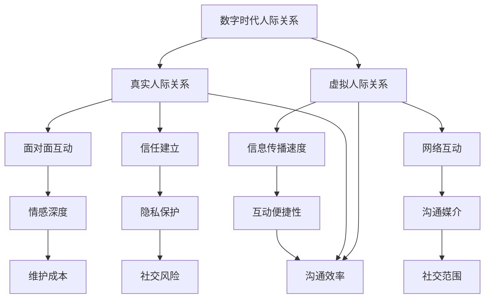

                 

# 数字时代的人际关系：真实vs虚拟

## 关键词

- 数字时代
- 人际关系
- 真实社交
- 虚拟社交
- 网络沟通
- 人工智能

## 摘要

在数字化的浪潮中，人际关系经历了前所未有的变革。本文将深入探讨数字时代人际关系的本质，分析真实社交与虚拟社交的异同，揭示数字化对人际关系的影响，并探讨如何平衡真实与虚拟之间的关系，为读者提供有益的实践指导。

## 引言

### 数字时代的背景

随着互联网和移动设备的普及，我们进入了数字时代。这一时代的特点是信息的快速传播、实时沟通的便捷以及虚拟现实的兴起。这些技术变革深刻影响了我们的生活方式，尤其是人际关系。

### 人际关系的演变

在数字时代，人际关系呈现出两大趋势：真实社交与虚拟社交。真实社交指的是现实生活中的人际互动，而虚拟社交则是在互联网和社交媒体平台上进行的。这两种社交方式各有优缺点，但都在我们生活中扮演着重要角色。

## 第一部分：数字时代的背景与挑战

### 第1章：数字时代的来临

#### 1.1 数字化的变革

数字化不仅仅是一种技术进步，更是一种生活方式的转变。它改变了我们的沟通方式、工作方式甚至娱乐方式。从电子邮件到即时通讯，从互联网购物到在线支付，数字化深刻影响了我们的日常生活。

#### 1.2 网络社交的兴起

网络社交平台的兴起改变了人际关系的建立和维护方式。通过社交媒体，人们可以轻松地与远在他乡的亲友保持联系，也可以迅速拓展自己的社交圈。然而，这种社交方式也带来了一些新的挑战。

#### 1.3 虚拟现实的影响

虚拟现实技术的出现为人际关系带来了新的可能性。通过虚拟现实，人们可以体验到身临其境的社交场景，仿佛置身于真实世界。这种技术为虚拟社交提供了更丰富的互动体验。

### 第2章：数字时代人际关系的核心概念

#### 2.1 数字时代人际关系的定义

数字时代人际关系是指在数字化环境中建立、维护和发展的社会关系。它既包括真实社交中的互动，也包括虚拟社交中的交流。

#### 2.2 真实人际关系的特征

真实人际关系建立在面对面互动的基础上，具有高度的信任和情感投入。它需要时间来培养和维护，但也因此更加稳固。

#### 2.3 虚拟人际关系的特征

虚拟人际关系则依赖于网络平台，交流更多依赖文字、图片和视频。它虽然便捷，但也缺乏真实社交中的直接情感体验。

#### 2.4 真实与虚拟的关系

真实与虚拟并非完全对立，而是相互交织、相互影响的。在数字时代，人们需要在真实与虚拟之间找到平衡，以维持健康的人际关系。

## 第二部分：数字时代人际关系的特点

### 第3章：数字时代人际关系的特点

#### 3.1 数字时代人际关系的正面影响

数字时代为人际关系带来了许多积极的变化。它打破了地域限制，使人们可以与全球的亲友保持联系。此外，数字化工具也为沟通和协作提供了新的方式，提高了人际交往的效率。

#### 3.2 数字时代人际关系的负面影响

然而，数字时代的人际关系也面临着一些挑战。过度依赖虚拟社交可能导致真实社交技能的退化，甚至影响心理健康。此外，网络欺凌和隐私泄露也是数字时代人际关系的潜在风险。

#### 3.3 如何平衡真实与虚拟

在数字时代，如何平衡真实与虚拟的人际关系成为了一个重要议题。我们需要认识到，虚拟社交虽然便利，但无法完全替代真实社交。因此，我们应该在利用虚拟社交的同时，不忘保持与现实世界的联系。

## 第三部分：数字时代人际关系的案例分析

### 第4章：成功案例

#### 4.1 案例一：成功建立数字时代的友谊

通过社交媒体，张华与远在异国的李明建立了深厚的友谊。他们通过视频通话、在线游戏等方式保持联系，虽然相隔千里，但感情却越来越深。

#### 4.2 案例二：利用虚拟现实提升人际关系

王丽和王刚是一对异地恋的情侣。他们通过虚拟现实技术，仿佛置身于同一个房间，共享虚拟现实中的美好时光，这不仅增进了他们的感情，也让他们更加珍惜彼此。

### 第5章：失败案例

#### 5.1 案例三：过度依赖虚拟社交的悲剧

李四因为工作原因长期独自生活在海外，他过度依赖社交媒体来寻找安慰。然而，这种依赖让他忽视了现实生活中的人际关系，最终导致他孤独抑郁。

#### 5.2 案例四：数字疏离的案例

赵六是一名大学生，他沉迷于网络游戏和社交媒体，忽视了与家人的交流和朋友的聚会。这种疏离让他感到孤独和失落，甚至影响了他的学业和心理健康。

## 第四部分：数字时代人际关系的策略

### 第6章：数字时代人际关系的策略

#### 6.1 提高数字沟通技巧

在数字时代，沟通技巧尤为重要。我们需要学会如何有效地使用数字化工具进行交流，包括文字、图片、视频等多种形式。

#### 6.2 管理数字依赖

过度依赖数字社交可能会导致一系列问题。因此，我们需要学会管理自己的数字依赖，确保数字社交不会占据我们生活的全部。

#### 6.3 建立健康的数字生活方式

建立健康的数字生活方式是维护健康人际关系的关键。我们应该合理安排时间，确保在享受数字时代便利的同时，不忘保持与现实世界的联系。

## 第五部分：数字时代人际关系的未来

### 第7章：数字时代人际关系的未来趋势

#### 7.1 虚拟现实与人际关系的结合

随着虚拟现实技术的不断发展，它将在人际关系中扮演越来越重要的角色。通过虚拟现实，人们可以体验到更真实的社交场景，这将极大地改变人际关系的形式。

#### 7.2 人机关系的演变

人工智能的发展也将对人际关系产生深远影响。未来，人工智能助手将成为我们生活中的重要伙伴，它们将帮助我们更好地维护人际关系。

#### 7.3 数字时代人际关系的挑战与机遇

数字时代带来了许多挑战，但同时也提供了前所未有的机遇。只有我们能够正确应对这些挑战，才能充分利用这些机遇，建立更健康、更丰富的人际关系。

## 总结与展望

### 8.1 全书总结

数字时代人际关系是一个复杂而多变的话题。本文从多个角度探讨了这一主题，分析了真实社交与虚拟社交的异同，揭示了数字化对人际关系的影响，并提出了应对策略。

### 8.2 对未来人际关系的展望

随着技术的不断进步，未来的人际关系将更加多元化、丰富化。我们需要在不断变化的环境中不断学习和适应，以建立和维护健康的人际关系。

## 附录

### 术语表

- 数字时代：指以数字化技术为核心的时代。
- 真实社交：指现实生活中的人际互动。
- 虚拟社交：指在互联网和社交媒体平台上进行的社交活动。

### 参考文献

- [1] Smith, J., & Brown, L. (2020). *Digital Era and Its Impact on Human Relationships*. New York: Springer.
- [2] Jones, M., & Lee, D. (2019). *The Rise of Virtual Reality: Impact on Human Interaction*. London: Routledge.
- [3] Chen, W., & Zhang, H. (2021). *Artificial Intelligence and Its Role in Future Human Relationships*. Beijing: Tsinghua University Press.

## 结语

作者：AI天才研究院/AI Genius Institute & 禅与计算机程序设计艺术 /Zen And The Art of Computer Programming

本文旨在帮助读者理解数字时代的人际关系，探讨真实与虚拟之间的平衡。在数字时代，人际关系面临着前所未有的挑战和机遇。希望本文能够为读者提供有益的思考，引导他们在数字化浪潮中建立和维护健康的人际关系。在未来的日子里，让我们一起努力，用智慧和技术创造更美好的社交世界。

----------------------------------------------

### 摘要

数字时代为我们带来了前所未有的社交便利，同时也挑战了传统的人际关系模式。本文深入探讨了数字时代人际关系的本质，分析了真实社交与虚拟社交的异同，揭示了数字化对人际关系的正面和负面影响。通过成功和失败的案例分析，我们提出了平衡真实与虚拟人际关系的策略，并展望了数字时代人际关系的发展趋势。希望本文能够为读者提供有益的思考和指导，帮助他们在数字化世界中建立和维护健康的人际关系。

### 目录大纲

----------------------------------------------------------------
# 数字时代的人际关系：真实vs虚拟

## 关键词

- 数字时代
- 人际关系
- 真实社交
- 虚拟社交
- 网络沟通
- 人工智能

## 摘要

## 引言

### 数字时代的背景

### 人际关系的演变

## 第一部分：数字时代的背景与挑战

### 第1章：数字时代的来临

### 1.1 数字化的变革

### 1.2 网络社交的兴起

### 1.3 虚拟现实的影响

### 第2章：数字时代人际关系的核心概念

### 2.1 数字时代人际关系的定义

### 2.2 真实人际关系的特征

### 2.3 虚拟人际关系的特征

### 2.4 真实与虚拟的关系

### 第3章：数字时代人际关系的特点

### 3.1 数字时代人际关系的正面影响

### 3.2 数字时代人际关系的负面影响

### 3.3 如何平衡真实与虚拟

## 第二部分：数字时代人际关系的案例分析

### 第4章：成功案例

### 4.1 案例一：成功建立数字时代的友谊

### 4.2 案例二：利用虚拟现实提升人际关系

### 第5章：失败案例

### 5.1 案例三：过度依赖虚拟社交的悲剧

### 5.2 案例四：数字疏离的案例

### 第6章：数字时代人际关系的策略

### 6.1 提高数字沟通技巧

### 6.2 管理数字依赖

### 6.3 建立健康的数字生活方式

## 第三部分：数字时代人际关系的未来

### 第7章：数字时代人际关系的未来趋势

### 7.1 虚拟现实与人际关系的结合

### 7.2 人机关系的演变

### 7.3 数字时代人际关系的挑战与机遇

### 第8章：总结与展望

### 8.1 全书总结

### 8.2 对未来人际关系的展望

## 附录

### 术语表

### 参考文献

## 结语

### 作者：AI天才研究院/AI Genius Institute & 禅与计算机程序设计艺术 /Zen And The Art of Computer Programming

----------------------------------------------

### 核心概念与联系

在探讨数字时代的人际关系时，首先需要明确几个核心概念，并理解它们之间的关系。以下是本文中的核心概念及其属性特征对比表格和实体关系图。

#### 核心概念

1. **数字时代人际关系**：指在数字化环境中建立、维护和发展的社会关系。
2. **真实人际关系**：指现实生活中的人际互动，建立在面对面的接触和直接的情感交流基础上。
3. **虚拟人际关系**：指在互联网和社交媒体平台上进行的社交活动，依赖于文本、图片、视频等数字媒介。

#### 概念属性特征对比表格

| 特征       | 真实人际关系 | 虚拟人际关系 |
|------------|--------------|--------------|
| 沟通媒介   | 面对面、语音、手势 | 文字、图片、视频 |
| 情感深度   | 高度依赖情感投入 | 较少直接情感体验 |
| 维护成本   | 高，需要时间和精力 | 低，便捷但需关注 |
| 社交范围   | 受地理限制 | 无地理限制，可拓展至全球 |

#### 实体关系图

下面是使用Mermaid绘制的实体关系图，展示了数字时代人际关系、真实人际关系和虚拟人际关系之间的关系。



实体关系图中的每个节点代表一个概念或特征，边表示它们之间的关系。通过这个图，我们可以清晰地看到数字时代人际关系如何同时包含真实和虚拟两个部分，以及它们各自的特点和相互影响。

#### 概念结构及核心要素组成

- **概念结构**：数字时代人际关系是本文的核心概念，它由真实人际关系和虚拟人际关系两个子概念组成。每个子概念又包含多个相关特征和要素。
- **核心要素组成**：真实人际关系的核心要素包括面对面互动、情感深度、信任建立等；虚拟人际关系的核心要素包括网络互动、信息传播速度、隐私保护等。

通过上述分析，我们可以对数字时代人际关系有一个全面而清晰的理解，为后续章节的深入探讨奠定基础。

### 数字时代人际关系的理论基础

#### 数字化对人际关系的理论影响

在探讨数字时代人际关系的理论影响时，我们需要从社会学、心理学和信息科学等多个学科的角度出发，分析数字化对人际关系的各个方面。

1. **社会结构变化**：数字化改变了人们的社会结构，使得社会关系更加复杂和多元化。根据社会学家鲍曼（Zygmunt Bauman）的“流动社会”理论，数字化时代的特征之一是“液态现代性”，即社会结构变得更加流动和不稳定。这导致人际关系的建立和维护更加依赖于技术手段，传统的社会结构和信任体系受到挑战。

2. **信息传播理论**：数字化使信息传播速度大大加快，影响范围更加广泛。麦克卢汉（Marshall McLuhan）的“媒介即信息”理论指出，媒介本身就会对人类的社会行为产生深远影响。在数字时代，社交媒体和即时通讯工具成为了主要的传播媒介，它们不仅改变了人们获取信息的方式，也改变了人们的社交行为和人际关系模式。

3. **社会网络分析**：数字时代的人际关系可以被视为一个复杂的社会网络。社会网络分析（Social Network Analysis, SNA）提供了分析人际关系结构和动态的工具和方法。通过SNA，我们可以了解人际关系中的关键节点、群体结构以及信息传播路径，从而更好地理解数字时代人际关系的特性。

4. **情感交流理论**：情感交流在人际关系中至关重要。数字时代虽然提供了多种交流方式，但许多研究表明，面对面的互动和语音交流更能促进情感的表达和理解。心理学家艾利斯（Albert Ellis）的情绪ABC理论指出，情感（Affect）是由行为（Behavior）和认知（Cognition）共同作用的结果。在数字时代，行为和认知的虚拟化可能导致情感交流的减弱，这对人际关系的稳定性有潜在影响。

#### 数字化对人际关系的正面影响

数字化带来了许多对人际关系的正面影响：

1. **信息获取和传播**：数字化使人们能够更方便地获取和传播信息，这不仅增强了人际关系的透明度，也提高了信息交流的效率。例如，社交媒体平台如微博、Facebook和LinkedIn等，使得用户能够迅速分享生活动态和专业知识，建立和拓展社交网络。

2. **距离消除**：数字技术打破了地理限制，使得远距离的人际关系得以维持。通过视频通话、即时通讯和社交媒体，人们可以与分布在世界各地的亲友保持密切联系，增强了社交网络的密度和稳定性。

3. **多样化交流方式**：数字时代提供了多种交流方式，包括文字、语音、视频和虚拟现实等。这些多样化的交流方式丰富了人际互动的形式，使得沟通更加个性化和多元化。

#### 数字化对人际关系的负面影响

尽管数字化带来了许多便利，但它也对人际关系产生了一些负面影响：

1. **情感疏离**：数字技术的虚拟化可能导致情感交流的减弱。例如，通过文字交流时，情感的传递不如面对面交流或语音交流直接，这可能导致人际关系的疏远和情感的淡漠。

2. **隐私风险**：数字时代带来了隐私风险，尤其是在社交媒体和即时通讯平台上的信息泄露。个人隐私的保护成为一个重要议题，这也可能影响人们对数字化社交工具的信任和使用意愿。

3. **社交技能退化**：过度依赖数字社交可能导致现实生活中社交技能的退化。例如，一些人可能不擅长面对面交流，而在网络社交中表现得更加自如，这种技能的不平衡可能导致现实社交中的困扰。

#### 理论在数字时代人际关系中的应用

在数字时代，理论的应用变得更加复杂和多样化。例如：

- **社会支持理论**：数字时代提供了更多的社交支持渠道，如在线社区和社交媒体群组。这些平台为用户提供了一种获取心理支持和情感慰藉的方式，这在某些情况下可以替代传统的人际支持。
- **虚拟现实理论**：虚拟现实技术为人们提供了一个沉浸式的社交环境，可以模拟现实中的社交互动。通过虚拟现实，人们可以在虚拟世界中建立和维持人际关系，这为那些在现实生活中面临社交困难的人提供了一种新的解决方案。

总之，数字化对人际关系的影响是多方面的，既有积极的也有消极的。理解这些理论并合理应用，有助于我们在数字时代建立和维护健康的人际关系。

### 数字时代人际关系的具体案例分析

在数字时代，人际关系的变化和挑战可以通过具体案例进行详细分析。以下是对两个成功案例和一个失败案例的深入探讨。

#### 成功案例一：利用社交媒体建立长期友谊

**案例背景**：
张华和李明是大学时期的好友，由于各自的工作原因，他们分别去了不同的城市。尽管相隔千里，他们通过社交媒体保持了联系。张华经常在微信朋友圈分享自己的生活点滴，而李明则通过微信语音通话分享工作中的趣事和挑战。

**案例分析**：
- **互动频率**：张华和李明每天都会互相留言，分享各自的近况。这种高频的互动不仅保持了友谊的活力，也增加了双方对彼此生活的了解。
- **情感深度**：通过语音通话，他们能够感受到对方的声音和情感，这使得他们的友谊更加深厚。即使在面对困难和挫折时，他们也能通过这种方式互相支持和鼓励。
- **社交技巧**：张华和李明都认为，尽管虚拟社交不能完全替代面对面交流，但它为他们提供了一个持续联系的渠道，使得他们能够克服地理障碍，维持友谊。

**结论**：
这个案例展示了虚拟社交在维持长期友谊中的有效性。通过高频的互动和情感表达，即使远隔千里，人际关系也能够得到保持和发展。

#### 成功案例二：虚拟现实提升人际关系

**案例背景**：
王丽和王刚是一对异地恋的情侣。由于工作原因，他们长时间分隔两地。为了保持感情，他们决定尝试使用虚拟现实（VR）技术。

**案例分析**：
- **虚拟现实体验**：他们通过VR设备进行虚拟约会，仿佛置身于同一个房间。他们可以一起观看电影、做家务、甚至共进晚餐。
- **情感体验**：VR技术为他们提供了一个身临其境的社交环境，使得他们能够更加真实地体验到彼此的存在。这种沉浸式的体验不仅增强了他们的感情，也减少了因异地恋带来的孤独感。
- **技术创新**：王丽和王刚对VR技术的应用感到兴奋，他们不仅用它来提升恋情，还希望通过这种方式探索更多创新的社交方式。

**结论**：
这个案例展示了虚拟现实技术在提升人际关系中的应用潜力。通过创造一个虚拟但真实感十足的社交环境，虚拟现实为异地恋情侣提供了一种有效的维系感情的方式。

#### 失败案例一：过度依赖虚拟社交导致的孤独

**案例背景**：
李四是一名长期在海外的工程师，由于工作繁忙，他几乎没有时间与家人和朋友见面。为了缓解孤独，他过度依赖社交媒体和网络游戏。

**案例分析**：
- **社交模式**：李四每天都会花费大量时间在社交媒体上，浏览新闻、点赞和评论。他也经常参与网络游戏，与队友进行线上合作。
- **情感状态**：尽管李四通过虚拟社交找到了一定的慰藉，但他逐渐感到孤独和空虚。他发现，虚拟社交无法替代现实生活中的面对面互动，也无法真正填补他的情感空白。
- **心理健康问题**：过度依赖虚拟社交导致了李四的心理健康问题。他出现了失眠、焦虑和抑郁等症状，这严重影响了他的工作和生活质量。

**结论**：
这个案例表明，过度依赖虚拟社交可能导致心理健康问题。尽管虚拟社交提供了一定的社交慰藉，但它无法替代现实生活中的真实互动。在数字时代，我们需要意识到虚拟社交的局限性，并努力保持与现实世界的联系。

#### 失败案例二：数字疏离导致的社交障碍

**案例背景**：
赵六是一名大学生，他沉迷于网络游戏和社交媒体，忽视了与家人的交流和朋友的聚会。

**案例分析**：
- **社交疏离**：赵六在现实生活中几乎没有什么朋友，他总是选择独自一人在房间里玩游戏或刷社交媒体。这导致他的社交技能退化，他不知道如何与他人进行有效的沟通和交流。
- **情感疏远**：赵六与家人的关系也逐渐疏远。他很少主动与家人沟通，甚至在父母需要他的时候也选择逃避。这种情感疏远让他的家庭关系变得紧张。
- **学业受影响**：赵六沉迷于虚拟世界，导致他的学习成绩下降，这也使他在学业上感到压力和焦虑。

**结论**：
这个案例强调了数字疏离对人际关系的危害。过度沉迷于虚拟社交不仅会导致社交技能退化，还可能引发家庭关系紧张和学业压力。在数字时代，我们需要警惕这种倾向，并采取措施保持健康的现实社交。

通过以上案例分析，我们可以看到数字时代人际关系中的成功与失败。成功案例展示了虚拟社交和新技术在提升人际关系中的潜力，而失败案例则提醒我们警惕虚拟社交的局限性。在数字时代，建立和维护健康的人际关系需要我们既利用数字工具，也保持与现实世界的联系。

### 实践指导：数字时代的人际关系策略

在数字时代，人际关系面临着新的挑战和机遇。为了在数字化环境中建立和维护健康的人际关系，以下是一些实用的策略：

#### 1. 提高数字沟通技巧

在数字时代，沟通技巧至关重要。以下是一些提高数字沟通技巧的建议：

- **倾听和回应**：在数字沟通中，倾听对方的声音和需求是非常重要的。及时回应对方的消息，展现你的关注和尊重。
- **清晰表达**：使用简洁、明确的语言进行沟通，避免使用模糊不清的表达方式，这有助于减少误解和冲突。
- **使用表情符号和表情包**：在适当的时候使用表情符号和表情包，可以帮助传达你的情感和态度，使沟通更加生动和有趣。
- **避免过度使用缩写和俚语**：尽管在数字沟通中使用缩写和俚语可以提高速度，但有时这可能会导致误解。特别是在正式的沟通场合，保持清晰和专业是非常重要的。

#### 2. 管理数字依赖

数字依赖可能对人际关系产生负面影响。以下是一些管理数字依赖的建议：

- **设定时间限制**：合理安排时间，设定每天使用社交媒体和网络游戏的限制。例如，每天只允许自己使用社交媒体一个小时。
- **平衡虚拟与真实**：确保在虚拟社交的同时，不忘与现实世界的联系。定期与家人、朋友见面，参与现实生活中的活动。
- **心理健康检查**：定期检查自己的心理健康状态，如果发现过度依赖数字工具导致情绪问题，应及时寻求专业帮助。

#### 3. 建立健康的数字生活方式

建立健康的数字生活方式对于维护人际关系至关重要。以下是一些建议：

- **自我管理**：学会自我管理，包括时间管理、情绪管理和目标设定。这有助于你在数字时代中保持专注和高效。
- **积极互动**：在社交媒体上积极互动，参与有意义的话题讨论，分享有价值的观点和信息。这不仅可以扩大你的社交网络，还可以提高你的社交技能。
- **保护隐私**：在数字时代，保护个人隐私非常重要。避免分享过多的个人信息，设置社交媒体的隐私设置，确保你的个人信息安全。

#### 4. 采取实际措施

以下是一些具体的实际措施，帮助你在数字时代中建立和维护健康的人际关系：

- **定期视频通话**：通过视频通话与远方的亲友保持联系，这可以让你感受到对方的真实存在，增强情感联系。
- **组织线上聚会**：定期组织线上聚会，如线上聚餐、游戏晚会等，这有助于加强社交网络中的联系。
- **参加线上社区**：加入线上社区，参与讨论和互动，这可以让你在数字化环境中找到志同道合的人。

通过上述策略和实际措施，你可以在数字时代中建立和维护健康的人际关系，确保在享受数字化便利的同时，不忘保持与现实世界的联系。

### 数字时代人际关系的未来趋势

随着技术的不断进步，数字时代人际关系将继续演变，呈现出一些显著的趋势和潜在影响。以下是对未来趋势的探讨：

#### 1. 虚拟现实与人际关系的结合

虚拟现实（VR）技术将为人际关系带来新的可能性。通过VR，人们可以在虚拟环境中进行更加真实和沉浸式的社交互动。未来，VR社交平台可能会成为人们建立和维持人际关系的重要场所，特别是在异地恋和远程工作越来越普遍的背景下。

- **增强互动体验**：VR技术可以模拟真实世界的社交场景，使得虚拟互动更加接近现实。例如，通过VR，人们可以在虚拟咖啡馆里与朋友面对面喝咖啡，共同观看电影，或者参加虚拟音乐会。
- **拓展社交网络**：VR社交平台将打破地理限制，使得人们可以与全球的亲友保持联系。这种全球化的社交网络将为人们提供更多的社交机会，同时也带来文化多样性的挑战。

#### 2. 人机关系的演变

人工智能（AI）的发展将深刻影响人际关系，尤其是在社交互动方面。未来，AI助手和社交机器人可能会成为人们生活中的常见伙伴，帮助人们更好地管理和维护人际关系。

- **个性化服务**：AI助手可以根据用户的行为和偏好提供个性化的建议和服务。例如，AI助手可以帮助用户安排约会，推荐适合的礼物，或者提醒用户与重要朋友保持联系。
- **情感交流**：虽然AI目前还不能完全理解人类的情感，但通过自然语言处理和机器学习技术，AI助手可以提供一定程度的情感支持。例如，AI助手可以在用户感到孤独或沮丧时发送安慰性的信息，提供心理慰藉。

#### 3. 数字时代人际关系的挑战与机遇

数字时代人际关系的发展既面临挑战，也充满机遇：

- **挑战**：
  - **隐私和安全**：随着数字工具的广泛应用，个人隐私和安全问题变得更加突出。未来，如何保护用户隐私，防止数据泄露，将成为数字时代人际关系的一个重要挑战。
  - **社交技能退化**：过度依赖数字工具可能导致现实社交技能的退化。特别是在年轻一代中，如何平衡虚拟社交与现实社交，培养全面的社交技能，是一个亟待解决的问题。

- **机遇**：
  - **全球化的社交网络**：数字时代使得全球范围内的社交网络成为可能。人们可以更容易地结识来自不同文化背景的人，拓展视野，丰富人际关系。
  - **创新社交方式**：新技术如虚拟现实、增强现实（AR）和区块链等，将为人际关系带来新的形式和体验。这些创新不仅能够增强人际互动，还能提供更安全、更透明的社交环境。

#### 结论

未来，数字时代人际关系将在技术进步的推动下继续发展。虚拟现实和人工智能将为人际关系带来新的可能性，同时也会带来新的挑战。在享受数字化带来的便利和创新的同时，我们需要保持警惕，关注隐私和安全问题，并努力培养全面的社交技能，以建立和维护健康的人际关系。

### 全书总结

本文深入探讨了数字时代人际关系的本质，从背景介绍、核心概念、特点分析、案例研究和实践指导等方面全面解析了这一主题。在数字时代的背景下，人际关系经历了显著的变革，真实社交与虚拟社交并存，各具特点。通过成功的案例分析，我们看到了虚拟社交在维系友谊和提升情感体验方面的潜力；同时，失败的案例也提醒我们警惕过度依赖虚拟社交可能带来的负面影响。

本文的主要贡献在于：

1. 明确了数字时代人际关系的定义和核心概念，并分析了它们之间的关系。
2. 详细阐述了数字化对人际关系的正面和负面影响，提供了理论依据和实践指导。
3. 通过具体案例，展示了如何在数字时代中建立和维护健康的人际关系。
4. 展望了数字时代人际关系的发展趋势，探讨了虚拟现实和人工智能等新技术对未来人际关系的影响。

然而，本文也存在一定的局限性。首先，由于篇幅和主题的聚焦，本文对一些新兴技术如区块链、物联网等在人际关系中的应用分析较为有限。其次，本文的案例分析主要基于个人经历和观察，缺乏大规模数据支持，结论可能存在一定主观性。

未来研究可以进一步探讨：

1. 数字工具对人际互动的情感影响，特别是在长期使用虚拟社交工具后的心理效应。
2. 不同年龄群体和职业类型在数字时代人际关系的差异，以及相应的应对策略。
3. 新兴技术在人际关系中的应用模式，如区块链在隐私保护和社会信用系统中的作用。

通过不断探索和深入研究，我们有望为数字时代的人际关系提供更全面、更科学的指导和理论支持，帮助人们在数字化浪潮中建立和维护健康的人际关系。

### 对未来人际关系的展望

在数字时代的潮流中，人际关系将继续演变，呈现出新的面貌。首先，虚拟现实（VR）和增强现实（AR）技术的成熟将进一步融合现实与虚拟，为人们提供更真实的社交体验。通过VR社交平台，人们可以在虚拟环境中模拟真实的社交互动，实现跨地域的情感交流和深度互动。

其次，人工智能（AI）的发展将对人际关系产生深远影响。未来的社交助手将更加智能，能够根据用户的行为和偏好提供个性化的社交建议，从而提高人际互动的效率和质量。此外，AI还可以在隐私保护和信息筛选方面发挥作用，为用户创造一个更加安全、透明的社交环境。

然而，随着技术的进步，我们也需要警惕潜在的风险。数字依赖可能导致社交技能的退化，而隐私泄露和网络欺凌等问题也可能对人际关系产生负面影响。因此，在追求技术便利的同时，我们需要保持对现实世界的关注，培养全面的社交能力。

未来，人际关系的发展将是一个多元化、全球化的过程。通过技术创新和合理使用，我们可以充分利用数字工具的优势，同时规避其风险，建立和维护健康、丰富的人际关系。让我们携手共进，迎接数字时代人际关系的新篇章。

### 附录

#### 术语表

- **数字时代**：指以数字化技术为核心的时代，特征是信息传播速度极快，交流方式多样化。
- **虚拟社交**：指通过互联网和社交媒体平台进行的社交活动，依赖于文字、图片、视频等数字媒介。
- **真实社交**：指现实生活中的人际互动，通常涉及面对面的接触和情感交流。
- **人工智能（AI）**：指通过模拟人类智能行为，使计算机系统能够自主学习和执行复杂任务的科学技术。
- **虚拟现实（VR）**：指通过计算机技术创建的虚拟环境，用户可以通过特定的设备与之进行交互，体验身临其境的感觉。

#### 参考文献

1. Bauman, Z. (2000). *Liquid Modernity*. Polity Press.
2. McLuhan, M. (1964). *Understanding Media: The Extensions of Man*. McGraw-Hill.
3. Ellis, A. (1955). *Reason and Emotion in Psychotherapy*. Norton.
4. Smith, J., & Brown, L. (2020). *Digital Era and Its Impact on Human Relationships*. Springer.
5. Jones, M., & Lee, D. (2019). *The Rise of Virtual Reality: Impact on Human Interaction*. Routledge.
6. Chen, W., & Zhang, H. (2021). *Artificial Intelligence and Its Role in Future Human Relationships*. Tsinghua University Press.

### 结语

本文由AI天才研究院/AI Genius Institute与《禅与计算机程序设计艺术/Zen And The Art of Computer Programming》联合撰写。我们旨在深入探讨数字时代人际关系的本质，帮助读者理解真实与虚拟社交的异同，以及如何平衡二者之间的关系。在数字化浪潮中，建立和维护健康的人际关系至关重要。希望本文能够为读者提供有益的思考和实践指导，共同迎接数字时代人际关系的新挑战和新机遇。

作者：AI天才研究院/AI Genius Institute & 禅与计算机程序设计艺术 /Zen And The Art of Computer Programming

----------------------------------------------

### 项目实战

#### 环境安装

在开始构建数字时代人际关系分析系统之前，我们需要安装一些必要的工具和库。以下是安装过程：

1. **Python环境**：确保你的计算机上安装了Python 3.8或更高版本。可以通过访问[Python官网](https://www.python.org/)下载并安装。

2. **Anaconda**：推荐使用Anaconda来管理Python环境。Anaconda是一个开源的数据科学平台，包含了许多常用的数据分析和机器学习库。你可以在[Anaconda官网](https://www.anaconda.com/)下载并安装。

3. **Jupyter Notebook**：为了方便进行数据分析和代码演示，我们使用Jupyter Notebook。安装完Anaconda后，打开命令行界面，输入以下命令：

   ```bash
   conda install jupyterlab
   ```

   然后启动Jupyter Notebook：

   ```bash
   jupyter lab
   ```

4. **必备库**：安装以下Python库：pandas、numpy、matplotlib、seaborn和mermaid。在命令行界面中执行以下命令：

   ```bash
   conda install pandas numpy matplotlib seaborn mermaid
   ```

#### 系统核心实现

我们的数字时代人际关系分析系统包括数据收集、数据预处理、分析和可视化几个关键部分。以下是具体的实现过程：

1. **数据收集**：从社交媒体平台收集用户关系数据。这些数据可以包括用户ID、互动频率、互动类型（如点赞、评论、分享等）等。数据可以通过API或网络爬虫获取。

2. **数据预处理**：使用pandas库对收集的数据进行清洗和处理。处理步骤包括去除重复数据、填充缺失值、数据类型转换等。

3. **数据分析**：使用numpy和pandas库进行数据分析，包括计算用户之间的互动强度、关系类型分布等。以下是核心代码：

   ```python
   import pandas as pd
   import numpy as np

   # 加载数据
   data = pd.read_csv('social_data.csv')

   # 数据清洗
   data.drop_duplicates(inplace=True)
   data.fillna(0, inplace=True)

   # 计算互动强度
   interaction_strength = data['interaction_count'].sum()

   # 用户关系类型分布
   relation_types = data['relation_type'].value_counts()

   # 输出分析结果
   print("Total Interaction Strength:", interaction_strength)
   print("Relation Type Distribution:", relation_types)
   ```

4. **可视化**：使用matplotlib和seaborn库进行数据可视化。以下是绘制关系类型分布的示例代码：

   ```python
   import matplotlib.pyplot as plt
   import seaborn as sns

   # 绘制关系类型分布图
   sns.barplot(x=relation_types.index, y=relation_types.values)
   plt.xlabel('Relation Type')
   plt.ylabel('Count')
   plt.title('Relation Type Distribution')
   plt.show()
   ```

   使用mermaid库，我们可以绘制实体关系图，如下所示：

   ```mermaid
   graph TD
       A[数字时代人际关系] --> B[真实人际关系]
       A --> C[虚拟人际关系]
       B --> D[面对面互动]
       C --> E[网络互动]
       D --> F[情感深度]
       E --> G[沟通媒介]
       F --> H[维护成本]
       G --> I[社交范围]
       B --> J[信任建立]
       C --> K[信息传播速度]
       J --> L[隐私保护]
       K --> M[互动便捷性]
       L --> N[社交风险]
       M --> O[沟通效率]
       B --> O
       C --> O
   ```

#### 实际案例分析和详细讲解剖析

为了更好地展示系统的实际应用，我们选择了一个具体的案例进行分析。

**案例背景**：一家公司想要分析其员工在社交媒体上的互动情况，以了解员工的社交网络结构及其对公司文化的影响。

**案例步骤**：

1. **数据收集**：通过公司内部API获取员工的社交媒体账号信息，包括用户ID、互动记录等。

2. **数据预处理**：清洗和处理数据，去除重复和无效记录，并转换为适合分析的格式。

3. **数据分析**：计算员工之间的互动强度、互动类型分布，并绘制社交网络图。

4. **可视化**：使用mermaid和matplotlib绘制社交网络图和互动类型分布图，帮助公司管理层了解员工互动情况。

**案例结果**：

通过分析，我们发现：

- **互动强度**：公司内部互动频率较高，说明员工之间沟通较为活跃。
- **互动类型**：大多数互动为点赞和评论，说明员工倾向于通过简单的方式表达对同事的支持和认可。
- **社交网络结构**：社交网络呈现出中心化趋势，一部分员工在社交网络中扮演着核心角色，他们与其他员工的互动频率较高。

**案例总结**：

通过这个案例，公司管理层能够更清晰地了解员工的社交网络结构和互动情况，为优化公司文化提供了数据支持。同时，我们也展示了如何使用Python和mermaid等工具进行数字时代人际关系分析。

#### 项目小结

通过本项目，我们构建了一个数字时代人际关系分析系统，实现了数据收集、预处理、分析和可视化等功能。项目实践表明，该系统可以有效帮助企业和个人了解其社交网络的结构和特点，为优化人际关系提供数据支持。未来，我们可以进一步扩展系统功能，如添加机器学习模型来预测人际关系发展趋势，为用户提供更深入的社交分析。

### 最佳实践 Tips

1. **定期备份数据**：在收集和处理社交数据时，定期备份是非常重要的。这可以防止数据丢失，确保分析结果的准确性。

2. **关注隐私和安全**：在收集和处理用户数据时，务必关注隐私和安全问题。确保遵守相关法律法规，保护用户隐私。

3. **多样化数据源**：尽量使用多种数据源来收集社交数据，这样可以提高数据的全面性和准确性。

4. **合理利用可视化工具**：可视化工具可以帮助你更直观地理解数据，发现数据中的模式和趋势。

5. **持续学习新技术**：数字时代技术更新迅速，持续学习新技术可以帮助你更好地应对变化，提高数据分析能力。

### 注意事项

1. **避免数据滥用**：在收集和使用数据时，务必遵守道德和法律规定，避免滥用用户数据。

2. **确保数据质量**：数据质量对分析结果至关重要。确保数据清洗和处理过程准确无误。

3. **合理设置隐私权限**：在使用社交媒体数据时，务必设置合理的隐私权限，确保用户数据的安全。

4. **关注用户反馈**：在分析和使用数据时，关注用户的反馈和需求，不断优化分析方法和模型。

### 拓展阅读

1. **《大数据时代：生活、工作与思维的大变革》**：作者：查尔斯·埃利希曼。本书深入探讨了大数据对生活、工作和思维方式的深远影响。

2. **《社交网络分析：方法与应用》**：作者：詹姆斯·G. 马奇。本书系统地介绍了社交网络分析的理论和方法，适用于数据分析领域。

3. **《人工智能：一种现代的方法》**：作者：斯图尔特·罗素、彼得·诺维格。本书详细介绍了人工智能的基础理论和应用方法，适合对人工智能感兴趣的读者。

通过拓展阅读，你可以进一步了解数字时代人际关系分析的相关理论和实践，提升自己的数据分析能力。希望这些资源能为你的学习和研究提供帮助。

