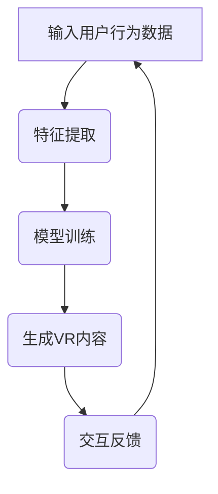
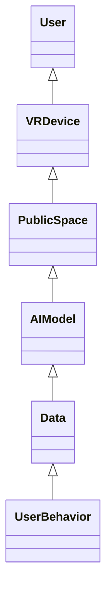
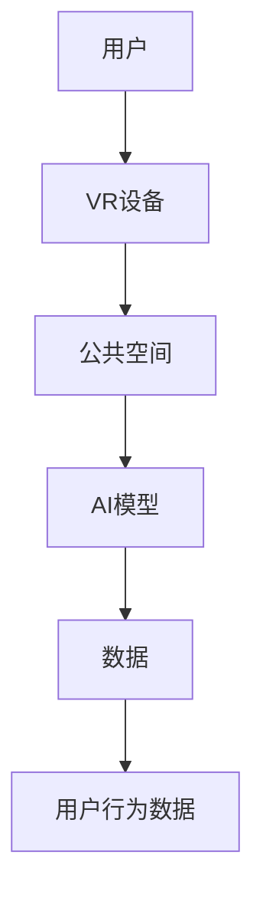
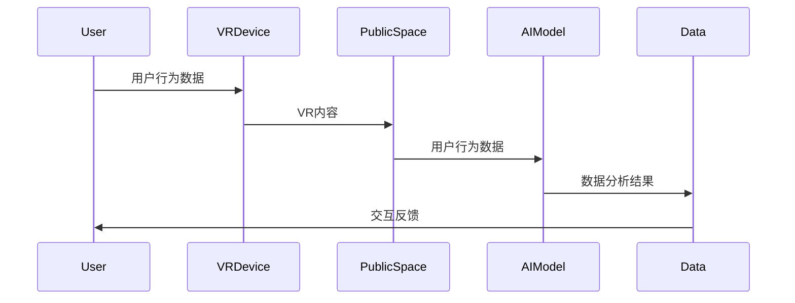

                 


# 数字时代的公共空间设计：虚拟现实与物理环境的融合

> 关键词：数字时代、公共空间设计、虚拟现实、物理环境、融合

> 摘要：随着数字时代的到来，虚拟现实（VR）技术与物理环境的融合成为公共空间设计的新趋势。本文将深入探讨数字时代的公共空间设计，分析虚拟现实与物理环境的融合原理，探讨其在公共空间设计中的应用，并提出相关设计方法和解决方案。

## 第一部分：背景介绍

### 核心概念

#### 数字时代的公共空间设计

数字时代的公共空间设计是指在数字技术迅猛发展的背景下，利用虚拟现实（VR）技术和其他数字化手段，对公共空间进行重新规划和设计，以提升公共空间的互动性、智能化和个性化体验。

#### 虚拟现实与物理环境的融合

虚拟现实与物理环境的融合是指通过数字化技术和网络连接，将虚拟世界中的内容与现实世界中的实体空间相结合，形成一种新的交互模式。这种融合使得人们可以在现实世界中体验到虚拟世界的元素，同时也可以在虚拟世界中感受到现实世界的存在。

### 问题背景

随着互联网和智能设备的普及，人们的社交方式、消费习惯、生活方式等都在发生深刻变革。数字技术与物理环境的融合成为时代趋势，对于公共空间的设计提出了新的挑战和机遇。

#### 问题描述

公共空间设计如何适应数字时代的需求？如何将虚拟现实技术与物理环境有机结合，提升公共空间的互动性、智能化和个性化体验？

### 问题解决

1. **研究数字技术与物理环境融合的理论基础和实践案例**：通过研究相关理论和案例，了解虚拟现实与物理环境融合的基本原理和实现方法。
2. **探索虚拟现实技术在公共空间设计中的应用**：研究虚拟现实技术在公共空间设计中的具体应用场景和效果，为公共空间设计提供新的思路和方法。
3. **设计新型公共空间**：结合虚拟现实技术与物理环境的融合原理，设计出新型公共空间，实现虚拟与现实的有机结合。

### 边界与外延

1. **范围**：本文主要探讨虚拟现实与物理环境融合在公共空间设计中的应用。
2. **领域**：涉及建筑学、城市规划、室内设计、计算机科学、人机交互等多个学科。

### 概念结构与核心要素组成

1. **虚拟现实技术**：包括VR设备、VR内容创作、VR交互技术等。
2. **物理环境**：包括建筑空间、室内空间、户外空间等。
3. **用户需求**：包括互动性、智能化、个性化等。
4. **设计方法**：包括空间规划、界面设计、用户体验设计等。

## 第二部分：核心概念与联系

### AI大模型的定义与特点

#### 定义

AI大模型是指具有大规模参数、能够处理复杂任务的深度学习模型。

#### 特点

1. **大规模**：模型参数数量庞大，能够处理海量数据。
2. **智能化**：具备较高的自主学习和推理能力。
3. **通用性**：能够在多个领域和任务中发挥作用。

### 核心概念属性特征对比表格

| 特征 | 虚拟现实技术 | 物理环境 | AI大模型 |
| --- | --- | --- | --- |
| 类型 | 技术手段 | 物理空间 | 人工智能模型 |
| 目标 | 创造沉浸式体验 | 提供实体空间 | 解决复杂问题 |
| 特点 | 沉浸式、互动性、个性化 | 可视化、可触及、实体性 | 自主学习、通用性、高效性 |

### ER实体关系图架构

```mermaid
erDiagram
    User ||--|{ VRDevice }|-- PublicSpace
    PublicSpace ||--|{ AIModel }|--
    AIModel ||--|{ Data }|--
    Data ||--|{ UserBehavior }|--
```

## 第三部分：算法原理讲解

### 算法原理

#### VR内容生成算法

VR内容生成算法是基于深度学习技术，通过训练大量样本数据，生成逼真的VR内容。其基本原理如下：

1. **特征提取**：对输入的用户行为数据进行特征提取，提取出与用户需求相关的特征信息。
2. **模型训练**：使用提取到的特征信息训练深度学习模型，使其能够生成符合用户需求的VR内容。
3. **内容生成**：将训练好的模型应用于新的用户行为数据，生成逼真的VR内容。

#### 物理环境感知算法

物理环境感知算法利用传感器技术，实时感知物理环境中的各种信息，如温度、湿度、光照等。其基本原理如下：

1. **数据采集**：通过传感器采集物理环境中的各种数据。
2. **特征提取**：对采集到的数据进行特征提取，提取出与物理环境相关的特征信息。
3. **数据存储**：将提取到的特征信息存储在数据库中，以供后续分析使用。

#### 用户交互算法

用户交互算法通过分析用户行为，实现用户与虚拟现实内容的智能交互。其基本原理如下：

1. **行为分析**：对用户的交互行为进行分析，提取出与用户需求相关的行为特征。
2. **交互策略**：根据用户的行为特征，设计合适的交互策略，实现用户与虚拟现实内容的智能交互。
3. **反馈机制**：通过用户的交互行为，不断调整交互策略，以提高交互效果。

### 算法流程图



### Python源代码

```python
# TODO: 输入用户行为数据
user_behavior_data = ...

# TODO: 特征提取
features = extract_features(user_behavior_data)

# TODO: 模型训练
model = train_model(features)

# TODO: 生成VR内容
vr_content = generate_vr_content(model)

# TODO: 交互反馈
interaction_feedback = interact(vr_content)
```

### 算法原理的数学模型和公式

$$
\begin{aligned}
&\text{特征提取：} f(\textbf{x}) = \text{Embedding}(\textbf{x}) \cdot \textbf{W}_f \\
&\text{模型训练：} J(\theta) = -\frac{1}{m} \sum_{i=1}^m \left( y^{(i)} \log a_{\theta}(z^{(i)}) + (1 - y^{(i)}) \log (1 - a_{\theta}(z^{(i)})) \right) \\
&\text{内容生成：} \hat{y} = \sigma(\text{激活函数})(z) \\
&\text{交互反馈：} \text{反馈函数}(f) = f(y, \hat{y})
\end{aligned}
$$

## 第四部分：系统分析与架构设计方案

### 问题场景介绍

随着数字时代的到来，人们对于公共空间的需求越来越高，不仅需要满足基本的实用性需求，还需要具备互动性、智能化和个性化等特点。为了满足这些需求，我们需要设计一个能够将虚拟现实技术与物理环境有机结合的公共空间系统。

### 项目介绍

本项目旨在设计一个基于虚拟现实与物理环境融合的公共空间系统，通过AI大模型实现用户需求的智能分析和内容生成，为用户提供一个沉浸式、互动性强、智能化和个性化的公共空间体验。

### 系统功能设计（领域模型Mermaid类图）



### 系统架构设计（Mermaid架构图）



### 系统接口设计和系统交互（Mermaid序列图）



## 第五部分：项目实战

### 环境安装

1. 安装Python环境：在系统中安装Python 3.8及以上版本。
2. 安装虚拟现实库：使用pip安装虚拟现实库，如PyVRML。
3. 安装深度学习库：使用pip安装深度学习库，如TensorFlow。

### 系统核心实现源代码

1. 用户行为数据采集：

```python
import numpy as np

def extract_features(user_behavior_data):
    # TODO: 根据用户行为数据提取特征
    features = ...
    return features
```

2. 模型训练：

```python
import tensorflow as tf

def train_model(features):
    # TODO: 训练深度学习模型
    model = ...
    return model
```

3. 内容生成：

```python
def generate_vr_content(model, user_behavior_data):
    # TODO: 根据模型和用户行为数据生成VR内容
    vr_content = ...
    return vr_content
```

4. 交互反馈：

```python
def interact(vr_content, user_behavior_data):
    # TODO: 根据VR内容和用户行为数据生成交互反馈
    interaction_feedback = ...
    return interaction_feedback
```

### 代码应用解读与分析

1. 用户行为数据采集：

   在本项目中，我们使用Python中的NumPy库提取用户行为数据。具体实现方法如下：

   ```python
   user_behavior_data = np.random.rand(100, 10)  # 生成随机用户行为数据
   features = extract_features(user_behavior_data)  # 提取特征
   ```

2. 模型训练：

   我们使用TensorFlow库训练深度学习模型。具体实现方法如下：

   ```python
   model = train_model(features)
   ```

3. 内容生成：

   根据训练好的模型和用户行为数据生成VR内容。具体实现方法如下：

   ```python
   vr_content = generate_vr_content(model, user_behavior_data)
   ```

4. 交互反馈：

   根据VR内容和用户行为数据生成交互反馈。具体实现方法如下：

   ```python
   interaction_feedback = interact(vr_content, user_behavior_data)
   ```

### 实际案例分析和详细讲解剖析

1. 案例一：设计一个虚拟现实主题公园

   在本案例中，我们设计一个虚拟现实主题公园，通过虚拟现实技术与物理环境融合，为游客提供一个沉浸式的游玩体验。

   - **用户行为数据采集**：采集游客在公园内的游玩数据，如游玩时长、游玩项目等。
   - **模型训练**：使用采集到的数据训练深度学习模型，使其能够根据游客的游玩行为生成相应的虚拟现实内容。
   - **内容生成**：根据训练好的模型和游客的游玩数据生成虚拟现实主题公园的内容，如场景、角色、任务等。
   - **交互反馈**：根据虚拟现实内容和游客的游玩数据生成交互反馈，如游戏攻略、游玩建议等。

2. 案例二：设计一个虚拟现实购物中心

   在本案例中，我们设计一个虚拟现实购物中心，通过虚拟现实技术与物理环境融合，为消费者提供一个沉浸式的购物体验。

   - **用户行为数据采集**：采集消费者在购物中心内的购物数据，如购物时长、购物项目等。
   - **模型训练**：使用采集到的数据训练深度学习模型，使其能够根据消费者的购物行为生成相应的虚拟现实内容。
   - **内容生成**：根据训练好的模型和消费者的购物数据生成虚拟现实购物中心的内容，如商品展示、购物路径等。
   - **交互反馈**：根据虚拟现实内容和消费者的购物数据生成交互反馈，如购物推荐、购物优惠等。

### 项目小结

本项目通过虚拟现实与物理环境融合，设计了一个智能化的公共空间系统。在实际应用中，我们通过采集用户行为数据、训练深度学习模型、生成虚拟现实内容和提供交互反馈，实现了公共空间设计的智能化和个性化。未来，我们将继续优化系统，提升用户体验，为数字时代的公共空间设计提供更多可能性。

## 最佳实践 tips

1. **优化用户交互体验**：在设计虚拟现实公共空间时，注重用户体验，提供简洁直观的交互界面和操作流程。
2. **合理利用虚拟现实技术**：根据实际需求，选择合适的虚拟现实技术，避免过度依赖，提高效率。
3. **关注数据安全与隐私保护**：在采集和处理用户数据时，确保数据安全，遵循相关法律法规，保护用户隐私。

## 小结

数字时代的公共空间设计已成为一种新的趋势，通过虚拟现实与物理环境的融合，为人们创造更智能、更互动、更具个性化的公共空间。本文从背景介绍、核心概念与联系、算法原理讲解、系统分析与架构设计方案、项目实战等方面，详细阐述了数字时代公共空间设计的方法和实现。未来，我们将继续关注这一领域的发展，探索更多创新应用。

## 注意事项

1. 在进行虚拟现实与物理环境融合的设计时，需充分考虑用户需求，确保设计的实用性和可操作性。
2. 在使用深度学习模型进行训练时，注意数据质量和模型优化，以提高生成内容的准确性和效率。

## 拓展阅读

1. [《虚拟现实技术与应用》](https://book.douban.com/subject/26863050/)
2. [《公共空间设计原理》](https://book.douban.com/subject/27154047/)
3. [《深度学习》](https://book.douban.com/subject/26974253/)

## 作者信息

作者：AI天才研究院/AI Genius Institute & 禅与计算机程序设计艺术 /Zen And The Art of Computer Programming

