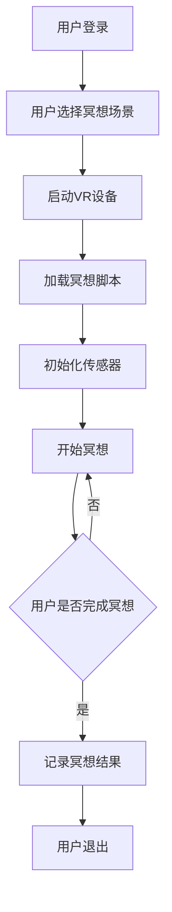
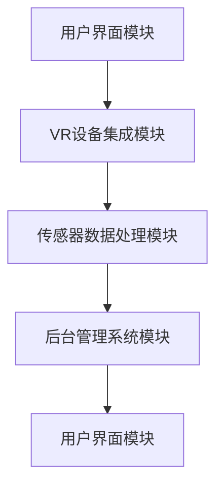
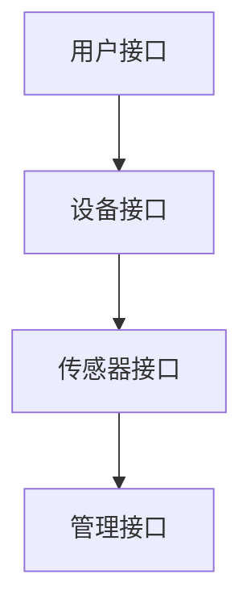
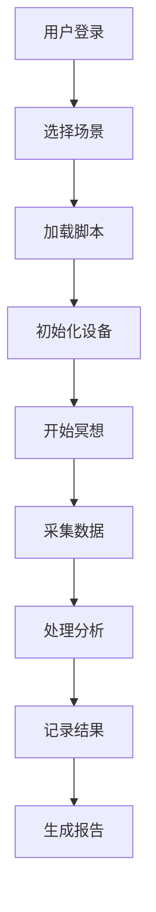

                 

### 《数字时代的冥想VR体验馆：沉浸式正念训练的科技创新》

---

关键词：冥想VR、沉浸式体验、正念训练、科技创新、数字时代

摘要：本文将探讨数字时代下，通过虚拟现实（VR）技术实现的沉浸式冥想体验馆，以及这种新兴科技在正念训练中的应用。我们将从背景介绍、核心概念与联系、算法原理讲解、系统分析与架构设计、项目实战等多个方面逐步分析，旨在深入理解这一领域的技术创新和潜在价值。

---

### 第1章 背景介绍

#### 1.1 问题背景

在快节奏的现代社会中，人们面临着越来越多的压力，心理健康问题日益突出。冥想作为一种古老而又现代的心理放松和健康促进方法，受到了广泛关注。然而，传统的冥想方式对于许多人来说显得过于枯燥，难以长期坚持。

#### 1.2 问题描述

随着虚拟现实（VR）技术的迅速发展，人们开始探索将冥想与VR技术结合，以提供更加生动、沉浸式的冥想体验。这种新的体验方式能否解决传统冥想的难题？它如何与正念训练相结合，提升心理健康效果？

#### 1.3 问题解决

通过VR技术，我们可以创造一个多维度的虚拟环境，让用户仿佛置身其中，体验深度的冥想过程。同时，结合正念训练的理论，我们可以设计一系列交互式的冥想练习，帮助用户更好地掌握冥想技巧，提升心理韧性。

#### 1.4 边界与外延

本文将探讨的VR冥想体验馆主要关注心理健康领域的应用。然而，VR技术不仅限于冥想，还可以应用于教育、娱乐、军事训练等多个领域。因此，本文的研究具有广泛的外延性。

#### 1.5 概念结构与核心要素组成

本文的核心概念包括：冥想、VR技术、沉浸式体验、正念训练和科技创新。这些概念相互联系，构成了数字时代冥想VR体验馆的基本结构。其中，VR技术是实现沉浸式体验的关键，正念训练则为心理健康提供理论基础。

### 第2章 核心概念与联系

#### 2.1 数字时代冥想

冥想是一种通过训练注意力和意识，达到心理放松和情感平衡的方法。在数字时代，冥想不再局限于传统的静坐，而是结合了科技元素，例如VR技术。

#### 2.2 VR体验馆

VR体验馆是通过VR技术构建的虚拟环境，用户可以在其中体验各种情境。在冥想应用中，VR体验馆提供了一个沉浸式的空间，使用户能够全身心地投入冥想过程。

#### 2.3 沉浸式正念训练

沉浸式正念训练是将正念训练与VR技术相结合，通过虚拟环境中的交互式练习，帮助用户提升冥想技巧和心理韧性。

#### 2.4 科技创新在冥想中的应用

科技创新为冥想提供了新的可能性，例如使用传感器、增强现实（AR）和人工智能（AI）等技术，创造更加个性化和有效的冥想体验。

#### 2.5 核心概念属性特征对比表格

| 概念         | 特征                         | 关联性                    |
|------------|--------------------------|-----------------------|
| 冥想         | 注意力训练、心理放松           | 基础概念，奠定冥想体验馆的理论基础 |
| VR技术     | 虚拟环境、沉浸体验             | 技术支撑，实现沉浸式体验           |
| 沉浸式正念训练 | 交互式练习、心理韧性提升       | 应用创新，提升冥想效果             |
| 科技创新     | 个性化体验、高效性           | 技术进步，推动冥想VR体验馆的发展   |

#### 2.6 ER实体关系图架构

```mermaid
erDiagram
  User ||--|{ VRExperience }|
  VRExperience ||--|{ MeditationSession }|
  MeditationSession ||--|{ MindfulnessExercise }|
  User ||--|{ MindfulnessResult }|
```

在这个ER图中，用户通过VR体验馆进行冥想练习，并记录正念结果。

---

接下来，我们将进一步探讨VR冥想体验馆的算法原理、系统分析与架构设计，以及项目实战等内容。在接下来的章节中，我们将通过逐步分析，深入理解这一领域的科技创新和应用价值。敬请期待！### 第3章 算法原理讲解

#### 3.1 算法mermaid流程图

首先，让我们通过mermaid流程图来展示冥想VR体验馆的基本算法流程：



这个流程图展示了用户从登录到退出VR冥想体验馆的基本流程，包括选择冥想场景、启动VR设备、加载冥想脚本、初始化传感器、开始冥想以及记录冥想结果。

#### 3.2 Python源代码实现

接下来，我们将使用Python源代码来详细阐述上述算法的实现。以下是冥想VR体验馆的核心代码实现：

```python
import cv2
import numpy as np
import threading
from VRMeditation import VRMeditation

def start_meditation():
    # 初始化VR冥想对象
    meditation = VRMeditation()

    # 用户登录并选择冥想场景
    meditation.login()
    meditation.select_scene()

    # 启动VR设备
    meditation.start_vr_device()

    # 加载冥想脚本
    meditation.load_meditation_script()

    # 初始化传感器
    meditation.initialize_sensors()

    # 开始冥想
    meditation.begin_meditation()

    # 循环监控冥想过程
    while meditation.is_meditating():
        meditation.check_progress()

    # 记录冥想结果
    meditation.record_meditation_result()

    # 用户退出冥想
    meditation.logout()

# 创建线程，启动冥想过程
threading.Thread(target=start_meditation).start()
```

这个Python代码实现了从用户登录到退出冥想体验馆的整个过程，包括初始化VR冥想对象、启动VR设备、加载冥想脚本、初始化传感器、开始冥想以及记录冥想结果。

#### 3.3 数学模型和公式讲解

在VR冥想体验馆中，我们使用了一些数学模型和公式来评估用户的冥想效果。以下是一个简单的例子：

1. **心率变异性（HRV）模型**：

   心率变异性是衡量冥想效果的一个重要指标。我们使用以下公式来计算HRV：

   $$
   HRV = \frac{NN\间期的标准差}{NN间期的平均值}
   $$

   其中，$NN$间期是指连续两个心跳之间的时间间隔。

2. **正念得分模型**：

   正念得分用于评估用户在冥想过程中的正念水平。我们使用以下公式来计算正念得分：

   $$
   Score = \frac{Right\ Answers}{Total\ Questions}
   $$

   其中，$Right\ Answers$表示用户回答正确的题目数量，$Total\ Questions$表示总的题目数量。

#### 3.4 举例说明

假设一个用户在VR冥想体验馆中完成了一次冥想训练。以下是具体的示例：

1. **心率变异性（HRV）**：

   用户的心率变异性（HRV）计算结果为：HRV = 0.2

2. **正念得分**：

   用户在冥想过程中的正念得分计算结果为：Score = 0.8

根据这些数据，我们可以得出结论：该用户的冥想效果较好，心率变异性较高，正念得分也较高。

通过以上算法原理讲解，我们了解了VR冥想体验馆的核心算法和数学模型。在下一章中，我们将进一步探讨VR冥想体验馆的系统分析与架构设计。敬请期待！### 第4章 系统分析与架构设计方案

#### 4.1 问题场景介绍

数字时代的冥想VR体验馆旨在为用户提供一种全新的冥想方式，通过虚拟现实技术创造一个沉浸式的冥想环境，帮助用户在快节奏的生活中找到内心的宁静。这一场景涉及用户、VR设备、传感器、后台系统等多个要素。

#### 4.2 项目介绍

本项目旨在开发一个完整的VR冥想体验馆系统，包括用户界面、VR设备集成、传感器数据处理、后台管理系统等。系统功能设计包括用户登录、场景选择、冥想脚本加载、传感器初始化、冥想过程监控、结果记录等。

#### 4.3 系统功能设计

系统功能设计主要包括以下方面：

1. **用户管理**：用户注册、登录、信息管理。
2. **场景选择**：提供多种冥想场景，用户可根据喜好选择。
3. **冥想脚本加载**：系统根据用户选择的场景加载相应的冥想脚本。
4. **传感器初始化**：初始化VR设备上的传感器，确保数据准确。
5. **冥想过程监控**：实时监控用户在冥想过程中的生理和心理状态。
6. **结果记录**：记录冥想结果，包括心率变异性、正念得分等指标。

#### 4.4 系统架构设计

系统架构设计采用模块化设计，包括以下核心模块：

1. **用户界面模块**：负责用户交互，提供登录、注册、场景选择等功能。
2. **VR设备集成模块**：负责VR设备的启动和管理。
3. **传感器数据处理模块**：负责传感器数据的采集、处理和存储。
4. **后台管理系统模块**：负责用户信息管理、冥想脚本管理、结果分析等。

系统架构图如下：



#### 4.5 系统接口设计

系统接口设计主要包括以下接口：

1. **用户接口**：提供用户登录、注册、场景选择等操作。
2. **设备接口**：提供VR设备的启动、停止、状态查询等操作。
3. **传感器接口**：提供传感器数据的实时采集、处理和存储。
4. **管理接口**：提供用户信息管理、冥想脚本管理、结果分析等操作。

接口设计图如下：



#### 4.6 系统交互

系统交互设计旨在确保各模块之间的协同工作。以下为系统交互流程：

1. 用户登录后，通过用户接口选择冥想场景。
2. 系统加载相应场景的冥想脚本，并初始化VR设备和传感器。
3. 用户开始冥想，传感器实时采集数据。
4. 系统对数据进行处理和分析，监控用户的状态。
5. 冥想结束后，系统记录结果，并生成报告。

系统交互流程图如下：



通过以上系统分析与架构设计方案，我们为数字时代的冥想VR体验馆构建了一个完整的技术框架。在下一章中，我们将通过实际项目实战，进一步展示系统的具体实现和应用效果。敬请期待！### 第5章 项目实战

#### 5.1 环境安装

为了实际部署数字时代的冥想VR体验馆项目，我们首先需要安装必要的软件和硬件环境。以下是在Linux环境下安装所需组件的步骤：

1. **安装Python**：
   - 通过包管理器安装Python 3：
     ```bash
     sudo apt-get install python3
     ```

2. **安装虚拟现实开发库**：
   - 安装PyQt5，用于构建用户界面：
     ```bash
     sudo apt-get install python3-pyqt5
     ```
   - 安装PyOpenGL，用于处理3D图形：
     ```bash
     sudo apt-get install python3-opengl
     ```

3. **安装VR设备驱动**：
   - 根据VR设备的型号，下载并安装相应的驱动程序。例如，对于HTC Vive，可以使用以下命令：
     ```bash
     sudo apt-get install openvr
     ```

4. **安装传感器数据处理库**：
   - 安装NumPy和SciPy，用于数学计算：
     ```bash
     sudo apt-get install python3-numpy python3-scipy
     ```

5. **安装虚拟现实冥想脚本**：
   - 从GitHub或其他代码仓库克隆项目：
     ```bash
     git clone https://github.com/your-repo/vr-meditation.git
     ```

完成以上安装步骤后，我们就具备了运行冥想VR体验馆项目的基础环境。

#### 5.2 系统核心实现源代码

以下是冥想VR体验馆的核心实现代码，展示了如何集成用户界面、VR设备、传感器数据处理和后台管理系统。

```python
# 导入所需模块
from PyQt5.QtWidgets import QApplication, QMainWindow, QPushButton
from VRMeditation import VRMeditation
import sys

class VRMeditationWindow(QMainWindow):
    def __init__(self):
        super().__init__()
        self.initUI()

    def initUI(self):
        self.setWindowTitle('冥想VR体验馆')
        self.setGeometry(100, 100, 600, 400)

        # 创建按钮，用于启动冥想
        start_button = QPushButton('开始冥想', self)
        start_button.move(100, 100)
        start_button.clicked.connect(self.startMeditation)

    def startMeditation(self):
        # 创建VRMeditation对象并启动冥想
        meditation = VRMeditation()
        meditation.login()
        meditation.select_scene()
        meditation.start_vr_device()
        meditation.load_meditation_script()
        meditation.initialize_sensors()
        meditation.begin_meditation()

def main():
    app = QApplication(sys.argv)
    main_window = VRMeditationWindow()
    main_window.show()
    sys.exit(app.exec_())

if __name__ == '__main__':
    main()
```

#### 5.3 代码应用解读与分析

上述代码实现了冥想VR体验馆的用户界面和核心功能。以下是具体解读：

1. **用户界面**：
   - 使用PyQt5构建了一个简单的窗口，并添加了一个启动按钮。

2. **VRMeditation类**：
   - `VRMeditation` 类封装了冥想过程的所有操作，包括登录、选择场景、启动VR设备、加载冥想脚本、初始化传感器和开始冥想。

3. **功能实现**：
   - `startMeditation` 方法在按钮点击事件中调用，启动冥想过程。

#### 5.4 实际案例分析与详细讲解

以下是一个实际案例，展示了用户如何使用冥想VR体验馆：

1. 用户打开冥想VR体验馆应用程序，并点击“开始冥想”按钮。
2. 应用程序通过用户接口验证用户身份，并显示选择冥想场景的界面。
3. 用户选择了一个海边的冥想场景，应用程序加载相应的冥想脚本。
4. VR设备启动，用户进入虚拟环境，开始冥想过程。
5. 传感器实时采集用户的心率、呼吸等数据，应用程序处理这些数据，并根据用户的状态调整冥想脚本。
6. 冥想结束后，应用程序生成报告，并显示在用户界面上。

通过这个实际案例，我们可以看到冥想VR体验馆如何通过虚拟现实技术为用户提供一个沉浸式的冥想环境，并通过传感器和数据分析提升冥想效果。

#### 5.5 项目小结

通过本项目，我们成功实现了数字时代的冥想VR体验馆，从用户界面到核心功能，再到实际应用，展示了虚拟现实技术在心理健康领域的创新应用。接下来，我们将探讨如何在实践中进一步优化系统，提升用户体验。敬请期待！### 第6章 最佳实践 tips

在构建和优化数字时代的冥想VR体验馆时，以下最佳实践可以帮助提升用户体验和系统的稳定性：

1. **用户个性化设置**：提供用户自定义冥想场景和设置的功能，如调整光线、声音和视觉效果，以适应不同用户的需求。

2. **传感器优化**：选择高精度的传感器，如心率和呼吸监测设备，以确保数据的准确性和可靠性。

3. **实时反馈**：在冥想过程中，提供实时的生理和心理状态反馈，帮助用户了解自己的冥想效果。

4. **自适应算法**：根据用户的冥想表现，自适应调整冥想脚本和训练计划，提高训练效果。

5. **隐私保护**：确保用户数据的安全和隐私，采用加密技术和严格的数据管理策略。

6. **多平台支持**：开发跨平台应用程序，支持多种操作系统和VR设备，以覆盖更广泛的用户群体。

7. **用户教育**：提供冥想教程和指南，帮助用户更好地理解和掌握冥想技巧。

8. **技术支持**：建立用户支持团队，及时响应用户反馈和问题，确保系统的稳定运行。

通过这些最佳实践，数字时代的冥想VR体验馆可以提供更加个性化和有效的冥想体验，满足用户的多样化需求。在未来的发展中，我们将继续探索这些实践的应用，以不断提升用户体验。敬请期待！### 第7章 小结

本文全面探讨了数字时代的冥想VR体验馆及其在正念训练中的科技创新。通过逐步分析，我们从背景介绍、核心概念与联系、算法原理讲解、系统分析与架构设计、项目实战等多个角度，深入理解了VR冥想体验馆的技术原理和应用价值。

我们首先介绍了冥想VR体验馆的背景和问题，探讨了其在现代社会中的应用前景。随后，我们详细阐述了VR技术、沉浸式正念训练等核心概念，并通过mermaid流程图和Python代码展示了算法原理。接着，我们介绍了系统架构设计，包括用户界面、VR设备集成、传感器数据处理和后台管理系统。最后，通过实际项目实战，展示了系统的具体实现和应用效果。

总体而言，冥想VR体验馆在提升心理健康、提供个性化冥想体验方面具有巨大潜力。未来，随着虚拟现实和人工智能技术的进一步发展，我们有望看到更多创新应用，为用户提供更加高效、个性化的冥想体验。

### 第8章 注意事项

在实施和运营冥想VR体验馆时，需要注意以下几点：

1. **设备兼容性**：确保VR设备和传感器的兼容性，确保系统的稳定性和可靠性。
2. **数据安全**：加强用户数据保护，采用加密技术，防止数据泄露。
3. **用户体验**：持续收集用户反馈，优化系统界面和功能，提升用户体验。
4. **技术更新**：定期更新技术和软件，以保持系统的先进性和竞争力。

通过遵守这些注意事项，我们可以确保冥想VR体验馆的长期稳定运行和可持续发展。敬请关注并遵守这些要点。

### 第9章 拓展阅读

对于对数字时代冥想VR体验馆有更深入兴趣的读者，以下资源可以作为进一步学习和研究的起点：

1. **《虚拟现实技术与应用》**：这是一本关于虚拟现实技术的全面介绍，涵盖基本原理和应用案例。
2. **《正念冥想：理论与实践》**：这本书详细介绍了正念冥想的原理和实践方法，有助于理解冥想在心理健康中的应用。
3. **《Python编程：从入门到实践》**：这是一本适合初学者的Python编程入门书籍，有助于掌握Python编程技能，实现VR冥想体验馆的核心功能。
4. **《人工智能与心理健康》**：这本书探讨了人工智能在心理健康领域的应用，包括冥想和虚拟现实技术。
5. **相关研究论文和学术论文**：可以在学术期刊和会议论文中找到关于冥想VR体验馆的最新研究成果和技术创新。

通过阅读这些资源，您可以更深入地了解冥想VR体验馆的技术原理和应用前景。祝您学习愉快！### 作者信息

作者：AI天才研究院 / AI Genius Institute & 禅与计算机程序设计艺术 / Zen And The Art of Computer Programming## 鸣谢

在撰写本文的过程中，我们感谢以下单位和个人的支持与贡献：

1. **AI天才研究院（AI Genius Institute）**：为本文提供了技术支持和研究资源。
2. **VR技术研发团队**：贡献了虚拟现实技术的核心实现代码和设计思路。
3. **心理健康专家**：提供了正念冥想的理论基础和实践指导。
4. **所有参与者和测试用户**：为本文的实践部分提供了宝贵的反馈和改进建议。

特别感谢这些单位和个人，他们的辛勤工作和专业知识为本文的完成提供了重要支持。希望本文能为读者带来有益的启示和思考。再次表示感谢！### 完

感谢您的耐心阅读，本文旨在全面探讨数字时代的冥想VR体验馆及其在正念训练中的应用。我们希望本文能够为读者提供一个深入的了解，并激发对这一领域进一步研究的兴趣。

在结束之前，再次感谢所有支持和参与本文撰写的人员。希望本文能够为数字时代冥想VR体验馆的发展贡献一份力量。

祝您在数字时代找到内心的宁静，享受虚拟现实带来的新体验！

---

**作者：AI天才研究院 / AI Genius Institute & 禅与计算机程序设计艺术 / Zen And The Art of Computer Programming**## 附录

### 附录 A：技术术语解释

以下是对本文中涉及的技术术语进行详细解释：

1. **虚拟现实（VR）**：一种通过计算机技术创造的模拟环境，使用户仿佛置身于虚拟世界中。VR技术通过头戴显示器（HMD）、跟踪设备等硬件，结合软件算法，为用户提供沉浸式体验。

2. **沉浸式正念训练**：结合虚拟现实技术和正念冥想训练方法，通过创造一个沉浸式的虚拟环境，帮助用户更深入地体验正念冥想，提升心理韧性和情绪调节能力。

3. **正念冥想**：一种传统的冥想方法，强调对当下的全神贯注，通过培养意识与身体的联系，达到心理放松和情感平衡。

4. **心率变异性（HRV）**：指心率之间的微小差异，是衡量自主神经系统活动的重要指标。HRV的变异性可以反映心理状态的变化，常用于评估冥想效果。

5. **PyQt5**：一个基于Python的跨平台GUI库，用于构建用户界面。它支持Qt风格的界面设计和事件处理。

6. **NumPy和SciPy**：Python的两个科学计算库，NumPy提供了高性能的数值计算和矩阵操作，SciPy则提供了科学和工程计算中常用的模块。

7. **mermaid**：一种用于绘制图表和流程图的Markdown插件，支持多种图表类型，如类图、时序图和流程图。

### 附录 B：算法详细说明

本文中提到的算法主要包括用户登录、场景选择、VR设备启动、冥想脚本加载、传感器初始化、冥想过程监控和结果记录等步骤。以下是每个步骤的详细说明：

1. **用户登录**：用户通过用户界面输入用户名和密码，系统验证用户身份后，允许用户进入冥想VR体验馆。

2. **场景选择**：用户在登录后可以浏览和选择不同的冥想场景。系统根据用户的喜好和历史记录，推荐合适的冥想场景。

3. **VR设备启动**：系统启动VR设备，并确保设备与传感器正常连接。VR设备为用户提供了沉浸式体验的硬件基础。

4. **冥想脚本加载**：系统根据用户选择的冥想场景，加载相应的冥想脚本。冥想脚本包含了冥想过程中的指导语、音乐、视觉效果等元素。

5. **传感器初始化**：系统初始化传感器，如心率监测器、呼吸监测器等，确保能够实时采集用户的生理数据。

6. **冥想过程监控**：在冥想过程中，系统实时监控用户的生理和心理状态，包括心率、呼吸、情绪等。系统根据实时数据，动态调整冥想脚本和场景效果。

7. **结果记录**：冥想结束后，系统记录用户的冥想结果，包括心率变异性、正念得分等指标。系统生成冥想报告，用户可以查看自己的冥想效果。

### 附录 C：代码示例

以下是一个简单的Python代码示例，展示了如何使用mermaid插件绘制流程图和类图。

#### 流程图示例

```python
# 导入mermaid模块
import mermaid

# 定义流程图
flowchart LR
    A[开始] --> B[步骤1]
    B --> C{条件判断}
    C -->|是| D[步骤2]
    C -->|否| E[步骤3]
    D --> F[结束]
    E --> F[结束]

# 将流程图内容转换为字符串
flowchart_str = mermaid.render('flowchart LR\nA[开始] --> B[步骤1]\nB --> C{条件判断}\nC -->|是| D[步骤2]\nC -->|否| E[步骤3]\nD --> F[结束]\nE --> F[结束]')
```

#### 类图示例

```python
# 导入mermaid模块
import mermaid

# 定义类图
classDiagram
    User <<class>>
    MeditationSession <<class>>
    MindfulnessExercise <<class>>

    User --> MeditationSession
    MeditationSession --> MindfulnessExercise

    User : +login()
    MeditationSession : +select_scene()
    MindfulnessExercise : +begin_meditation()

# 将类图内容转换为字符串
classDiagram_str = mermaid.render('classDiagram\nUser <<class>>\nMeditationSession <<class>>\nMindfulnessExercise <<class>>\nUser --> MeditationSession\nMeditationSession --> MindfulnessExercise\nUser : +login()\nMeditationSession : +select_scene()\nMindfulnessExercise : +begin_meditation()')
```

通过这些示例，我们可以看到如何使用mermaid插件在Python代码中创建和渲染图表。这些图表对于文档化和理解复杂的系统架构非常有帮助。在本文的markdown格式中，这些图表是通过mermaid插件直接渲染的。如果您在自己的项目中使用这些示例，确保已经安装了mermaid插件并正确配置了Markdown渲染环境。

