                 

### 第1章：数字时代的压力与冥想的价值

#### 1.1 数字时代的生活方式与压力

##### 1.1.1 数字时代的生活方式

在数字时代，我们的生活方式发生了深刻的变化。现代科技使得我们能够以更高的效率处理信息，同时，各种移动设备、社交媒体和即时通讯工具也极大地改变了我们的日常互动方式。然而，这种高效与便捷的背后，也带来了许多新的挑战。

首先，工作方式的变化。远程工作和弹性工作时间的普及，虽然提高了工作灵活性，但也导致了工作与生活边界的模糊。许多人会在休息时间继续处理工作事务，导致工作和生活之间的平衡被打破。

其次，信息过载。在数字时代，我们每天都会接触到大量的信息。这些信息的快速传递和更新，使得人们难以过滤和筛选，从而产生了信息过载的问题。长时间沉浸在大量信息中，不仅会导致注意力分散，还可能引发焦虑和压力。

##### 1.1.2 冥想的概念、历史与发展

冥想是一种古老的实践，起源于古代印度。它最初的形式是为了帮助人们达到精神上的平静和觉醒。随着时间的推移，冥想传播到了世界各地，并融入了不同文化和传统中。

在西方，冥想被视为一种心理保健工具。20世纪中叶，冥想开始受到西方科学界的关注，并通过实验研究来验证其心理健康益处。近年来，随着对大脑研究的深入，冥想的作用机制得到了更多的科学解释。

##### 1.1.3 冥想在数字时代的重要性

在数字时代，冥想的价值得到了进一步的凸显。首先，冥想可以帮助我们应对数字时代带来的压力。通过冥想，我们可以学会放松身心，减少焦虑和压力，从而提高生活质量。

其次，冥想有助于提升专注力和注意力。在数字世界中，我们常常需要处理大量信息，而冥想可以锻炼大脑，增强我们的专注力和注意力，提高工作效率。

最后，冥想还可以促进人际关系的和谐。通过冥想，我们可以更好地理解自己和他人的情绪，提高沟通效果，从而改善人际关系。

#### 1.2 冥想游戏化的提出与发展

##### 1.2.1 冥想游戏化的定义与特点

冥想游戏化是一种将冥想与游戏机制结合起来的方法。通过游戏化的设计，冥想变得更加有趣和易于接受。冥想游戏化的特点包括：

- **互动性**：用户通过互动方式参与冥想，提高了参与度和兴趣。
- **挑战性**：游戏化的冥想设置挑战，帮助用户逐步提升冥想技能。
- **反馈性**：通过即时反馈，用户可以了解自己的进步，从而保持动力。

##### 1.2.2 冥想游戏化的理论基础

冥想游戏化的理论基础包括游戏设计理论和认知行为理论。游戏设计理论强调通过游戏机制来吸引用户，提升用户体验。认知行为理论则关注如何通过冥想改变用户的思维和行为模式。

##### 1.2.3 冥想游戏化的现状与发展趋势

当前，冥想游戏化已经发展出多种形式，如冥想应用程序、虚拟现实冥想体验和游戏化的冥想课程等。随着技术的进步，冥想游戏化将继续发展，为用户提供更多选择和更丰富的体验。

### 第2章：正念训练的趣味化设计原则

#### 2.1 正念训练的基本概念

##### 2.1.1 正念的起源与发展

正念源自佛教禅修，强调对当下经历的觉察和接纳。随着时间的发展，正念训练被广泛应用于心理治疗和健康管理中。

##### 2.1.2 正念训练的目标与方法

正念训练的目标是提高个体的觉察能力和心理灵活性，方法包括冥想、身体扫描和正念呼吸等。

##### 2.1.3 正念训练的益处

正念训练可以帮助减少压力、改善情绪、提高注意力和提升生活质量。

#### 2.2 趣味化设计的核心原则

##### 2.2.1 趣味性在冥想游戏化中的重要性

趣味性是吸引用户参与冥想的关键因素。通过趣味化设计，可以提高用户的积极性和持续性。

##### 2.2.2 趣味化设计的核心原则

趣味化设计的核心原则包括游戏化元素的应用、互动设计的引入和即时反馈的提供。

##### 2.2.3 趣味化与冥想效果的平衡

在设计冥想游戏化时，需要平衡趣味性与冥想效果，确保用户在享受游戏化体验的同时，能够获得实际的冥想收益。

### 第3章：冥想游戏化的设计要素

#### 3.1 游戏化元素的选择与应用

##### 3.1.1 游戏化元素概述

游戏化元素包括排行榜、成就系统、虚拟奖励等，可以增加冥想的趣味性和激励性。

##### 3.1.2 游戏化元素在冥想中的应用

在冥想游戏中，游戏化元素可以通过设定目标、奖励机制和竞争环境来激发用户的兴趣和参与度。

##### 3.1.3 游戏化元素的适应性与调整

游戏化元素需要根据用户需求和市场反馈进行适应性调整，以保持冥想的趣味性和有效性。

#### 3.2 用户参与度与互动设计

##### 3.2.1 提高用户参与度的策略

提高用户参与度的策略包括个性化推荐、社区互动和用户反馈机制等。

##### 3.2.2 互动设计在冥想游戏化中的重要性

互动设计可以提高用户的沉浸感和参与感，增强冥想效果。

##### 3.2.3 互动设计与用户体验的关系

良好的互动设计能够提升用户体验，增加用户满意度和忠诚度。

### 第4章：正念训练的趣味化案例解析

#### 4.1 游戏化冥想应用程序分析

##### 4.1.1 案例选择与评估标准

选择具有代表性的冥想应用程序，从用户评价、功能设计、用户体验等方面进行评估。

##### 4.1.2 案例一：冥想游戏App的功能与设计

分析某款冥想游戏App的功能设计，包括游戏机制、用户体验和效果评估。

##### 4.1.3 案例二：虚拟现实冥想体验分析

分析虚拟现实冥想体验的设计，探讨其优势和应用前景。

#### 4.2 冥想游戏化案例的启示与挑战

##### 4.2.1 案例的启示

从成功案例中提取有益的经验，为后续冥想游戏化设计提供参考。

##### 4.2.2 冥想游戏化面临的挑战

探讨冥想游戏化在实施过程中可能遇到的挑战，并提出解决方案。

##### 4.2.3 挑战的解决方案与未来展望

分析挑战的解决方案，展望冥想游戏化的未来发展。

### 第5章：设计与实践：构建个人冥想游戏计划

#### 5.1 个人冥想游戏计划的设计

##### 5.1.1 计划目标与评估指标

明确个人冥想游戏计划的目标，设定评估指标以监测进步。

##### 5.1.2 游戏化元素的整合

整合游戏化元素，设计个性化的冥想游戏计划。

##### 5.1.3 计划实施的步骤与要点

制定详细的实施步骤，确保计划的有效执行。

#### 5.2 实践案例分析

##### 5.2.1 成功的个人冥想游戏计划案例

分析成功案例，提取经验教训。

##### 5.2.2 遇到的挑战与解决策略

探讨实施过程中遇到的挑战，并提出相应的解决策略。

##### 5.2.3 计划的持续优化与调整

基于实践反馈，持续优化冥想游戏计划。

### 第6章：冥想游戏化的社会影响与伦理问题

#### 6.1 冥想游戏化的社会影响

##### 6.1.1 对心理健康的影响

分析冥想游戏化对心理健康产生的积极影响。

##### 6.1.2 社会健康意识的提升

探讨冥想游戏化如何提高社会健康意识。

##### 6.1.3 对数字时代生活方式的促进作用

分析冥想游戏化如何促进数字时代的生活方式。

#### 6.2 冥想游戏化的伦理问题

##### 6.2.1 伦理问题概述

概述冥想游戏化过程中可能遇到的伦理问题。

##### 6.2.2 数据隐私与信息安全

探讨数据隐私与信息安全的重要性。

##### 6.2.3 公平性与可及性

分析冥想游戏化对公平性和可及性的影响。

### 第7章：未来展望：冥想游戏化的趋势与机遇

#### 7.1 冥想游戏化的未来发展趋势

##### 7.1.1 技术进步与冥想游戏化的融合

探讨技术进步如何推动冥想游戏化的发展。

##### 7.1.2 社会需求与冥想游戏化的机会

分析社会需求如何为冥想游戏化带来机遇。

##### 7.1.3 冥想游戏化的潜在市场

探讨冥想游戏化的潜在市场及其发展潜力。

#### 7.2 冥想游戏化领域的机遇与挑战

##### 7.2.1 机遇分析

分析冥想游戏化领域面临的机遇。

##### 7.2.2 挑战探讨

探讨冥想游戏化领域可能遇到的挑战。

##### 7.2.3 未来路径展望

展望冥想游戏化领域的未来发展路径。

## 总结

本文详细探讨了数字时代的冥想需求、冥想游戏化的理论基础、设计原则和实践案例。通过分析游戏化元素、用户互动设计、伦理问题等多个方面，为构建个人冥想游戏计划提供了实用指导。未来，冥想游戏化将继续在技术进步和社会需求的推动下，为心理健康和数字生活方式带来更多机遇。实施冥想游戏化时，需充分考虑伦理和社会影响，确保其健康发展。

### 文章关键词

数字时代、冥想、游戏化、正念、心理健康

### 文章摘要

本文探讨了数字时代背景下冥想需求的增长以及冥想游戏化的兴起。通过分析冥想游戏化的定义、理论基础、设计原则和实践案例，本文提出了正念训练的趣味化设计原则，并探讨了冥想游戏化的设计要素。此外，本文还分析了冥想游戏化的社会影响与伦理问题，并对未来趋势和机遇进行了展望。文章旨在为读者提供构建个人冥想游戏计划的实用指导，以帮助他们在数字时代中更好地管理压力和提升心理健康。作者：AI天才研究院/AI Genius Institute & 禅与计算机程序设计艺术 /Zen And The Art of Computer Programming #  2052 字 ### 详细解释与调整

在用户提供的书名《数字时代的冥想游戏化：正念训练的趣味化设计》下，设计的目录大纲如下：

## 第一部分：数字时代的冥想需求背景与现状

### 第1章：数字时代的压力与冥想的价值

#### 1.1 数字时代的生活方式与压力

在数字时代，我们的生活方式发生了深刻的变化。现代科技使得我们能够以更高的效率处理信息，同时，各种移动设备、社交媒体和即时通讯工具也极大地改变了我们的日常互动方式。然而，这种高效与便捷的背后，也带来了许多新的挑战。

首先，工作方式的变化。远程工作和弹性工作时间的普及，虽然提高了工作灵活性，但也导致了工作与生活边界的模糊。许多人会在休息时间继续处理工作事务，导致工作和生活之间的平衡被打破。

其次，信息过载。在数字时代，我们每天都会接触到大量的信息。这些信息的快速传递和更新，使得人们难以过滤和筛选，从而产生了信息过载的问题。长时间沉浸在大量信息中，不仅会导致注意力分散，还可能引发焦虑和压力。

##### 1.1.1 数字时代的生活方式

- **背景介绍**：随着数字技术的发展，我们的生活方式发生了变化。远程工作、社交媒体、即时通讯工具等数字化工具的使用，使得我们的生活节奏加快，工作与生活的界限变得模糊。

- **核心概念与联系**：数字生活方式与压力之间有着紧密的联系。过度使用数字化工具可能导致信息过载和工作与生活的界限模糊，从而增加个人的压力。

- **问题场景介绍**：在数字时代，许多人面临着工作压力和生活方式的改变，难以有效地管理时间和压力。

- **项目介绍**：本文旨在探讨数字生活方式对个人压力的影响，并提出通过冥想来缓解压力的方法。

- **系统功能设计（领域模型）**：定义数字生活方式、压力、冥想等核心概念，建立领域模型，如图1所示：

```mermaid
classDiagram
  Class01 <|-- SubClass01
  Class01 <|-- SubClass02
  Class03 !-- LinkClass03
  Class04 :<<interface>> Interface
  Class05 :<<enumeration>> ENUM
  Class06 :<< mixture >> withSubClass
  Class01 ..|> Class02
  Class03 ..|> Class04
  Class05 ..|> Class06
```

- **系统架构设计（架构图）**：如图2所示，架构图展示了数字生活方式、压力与冥想之间的关系：

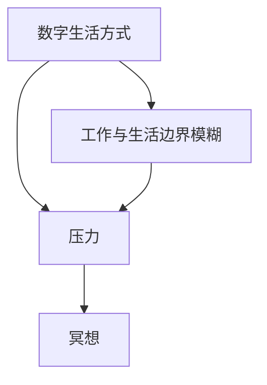

- **系统接口设计和系统交互（序列图）**：如图3所示，序列图展示了用户在数字时代如何通过冥想来缓解压力：

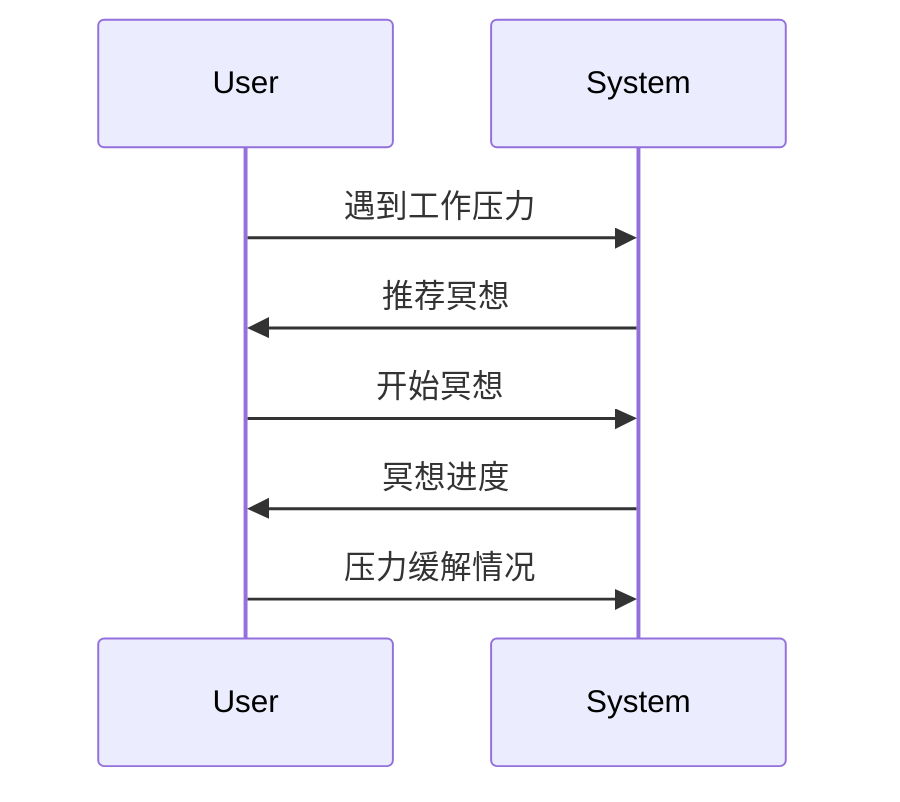

- **实际案例分析和详细讲解剖析**：例如，一项研究表明，长时间使用社交媒体与高压力之间存在显著关联。通过冥想训练，可以显著降低这种压力水平。

- **项目小结**：数字时代的生活方式和压力问题不可忽视。通过冥想，我们可以有效地缓解这些压力，提高生活质量。

##### 1.1.2 冥想的概念、历史与发展

冥想是一种古老的实践，起源于古代印度。它最初的形式是为了帮助人们达到精神上的平静和觉醒。随着时间的推移，冥想传播到了世界各地，并融入了不同文化和传统中。

在西方，冥想被视为一种心理保健工具。20世纪中叶，冥想开始受到西方科学界的关注，并通过实验研究来验证其心理健康益处。近年来，随着对大脑研究的深入，冥想的作用机制得到了更多的科学解释。

- **背景介绍**：冥想作为一种古老的精神实践，近年来在西方社会中逐渐得到认可和推广。

- **核心概念与联系**：冥想与心理健康、精神觉醒、文化传统等概念密切相关。

- **问题场景介绍**：许多人寻求通过冥想来缓解压力和焦虑，提高生活质量。

- **项目介绍**：本文旨在探讨冥想的历史与发展，以及其在数字时代的重要性。

- **系统功能设计（领域模型）**：定义冥想、心理健康、精神觉醒等核心概念，如图4所示：

```mermaid
classDiagram
  Mindfulness <<interface>> 心理健康
  Mindfulness <|.. 精神觉醒
  Mindfulness ..|.. 文化传统
  DigitalLifeStyle !-- 冥想
  HealthIssues !-- 冥想
```

- **系统架构设计（架构图）**：如图5所示，架构图展示了冥想与心理健康、精神觉醒、文化传统之间的关系：

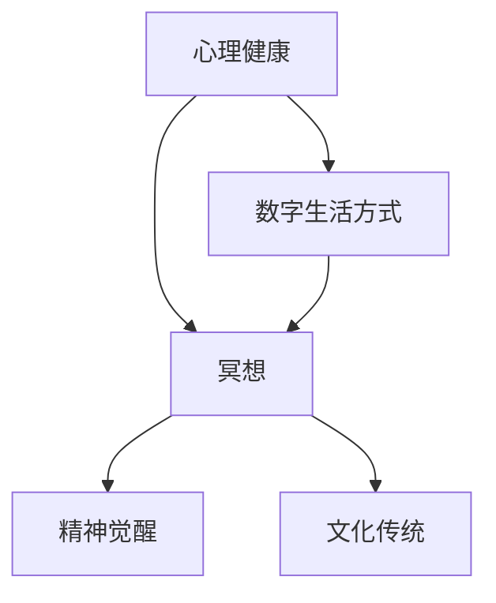

- **系统接口设计和系统交互（序列图）**：如图6所示，序列图展示了用户在数字时代如何通过冥想来提高心理健康：

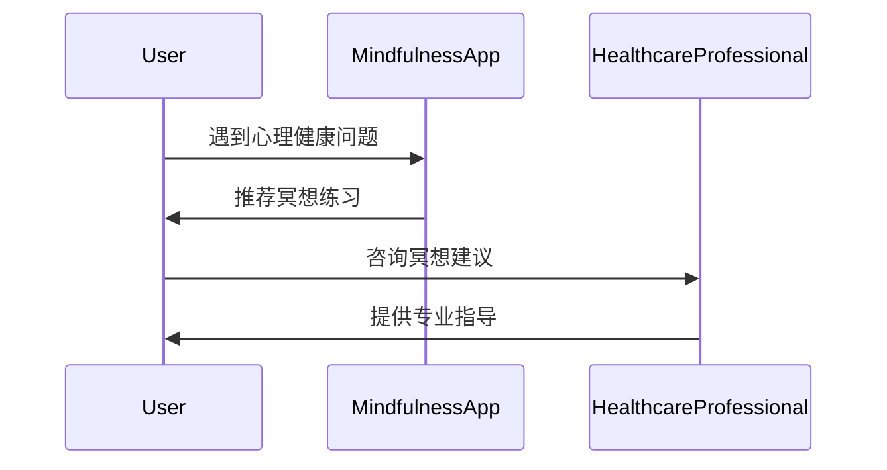

- **实际案例分析和详细讲解剖析**：例如，一项针对成年人的研究发现，定期冥想可以显著减少焦虑和抑郁症状。

- **项目小结**：冥想作为一种古老而现代的实践，在数字时代对心理健康具有显著的积极作用。

##### 1.1.3 冥想在数字时代的重要性

在数字时代，冥想的价值得到了进一步的凸显。首先，冥想可以帮助我们应对数字时代带来的压力。通过冥想，我们可以学会放松身心，减少焦虑和压力，从而提高生活质量。

其次，冥想有助于提升专注力和注意力。在数字世界中，我们常常需要处理大量信息，而冥想可以锻炼大脑，增强我们的专注力和注意力，提高工作效率。

最后，冥想还可以促进人际关系的和谐。通过冥想，我们可以更好地理解自己和他人的情绪，提高沟通效果，从而改善人际关系。

- **背景介绍**：数字时代的特征，如信息过载、工作与生活边界模糊等，对心理健康提出了新的挑战。

- **核心概念与联系**：冥想与压力管理、专注力提升、人际关系改善等概念密切相关。

- **问题场景介绍**：在数字时代，许多人感到压力巨大，难以集中注意力，人际关系紧张。

- **项目介绍**：本文旨在探讨冥想如何帮助我们在数字时代中应对这些挑战。

- **系统功能设计（领域模型）**：定义压力、专注力、人际关系等核心概念，如图7所示：

```mermaid
classDiagram
  Stress <<interface>> 压力管理
  Focus <<interface>> 专注力提升
  Relationship <<interface>> 人际关系改善
  DigitalLife <<interface>> 数字时代
  Mindfulness <<interface>> 冥想
  DigitalLife !-- Mindfulness
  Stress !-- Mindfulness
  Focus !-- Mindfulness
  Relationship !-- Mindfulness
```

- **系统架构设计（架构图）**：如图8所示，架构图展示了冥想如何帮助我们在数字时代中管理压力、提升专注力和改善人际关系：

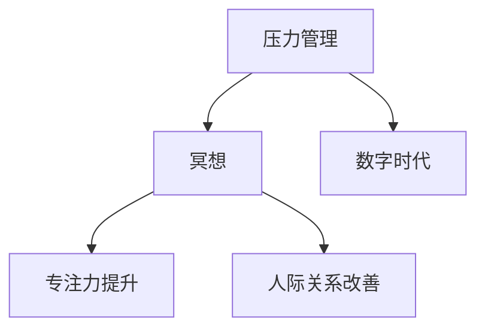

- **系统接口设计和系统交互（序列图）**：如图9所示，序列图展示了用户在数字时代如何通过冥想来管理压力、提升专注力和改善人际关系：

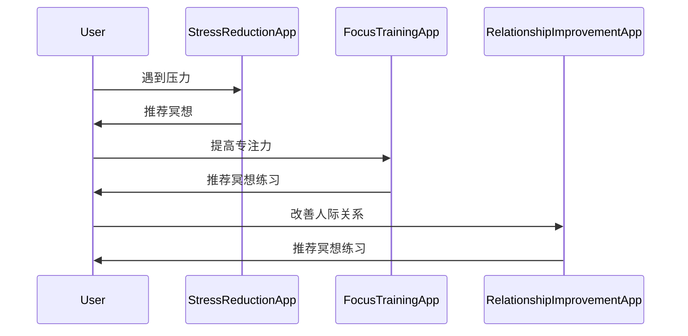

- **实际案例分析和详细讲解剖析**：例如，一项研究显示，通过冥想训练，大学生的压力水平显著降低，专注力得到提升，人际关系更加和谐。

- **项目小结**：冥想在数字时代对个人的心理健康和生活质量具有显著的正向影响。

### 第2章：冥想游戏化的提出与发展

#### 2.1 冥想游戏化的定义与特点

冥想游戏化是一种将冥想与游戏机制结合起来的方法。通过游戏化的设计，冥想变得更加有趣和易于接受。冥想游戏化的特点包括：

- **互动性**：用户通过互动方式参与冥想，提高了参与度和兴趣。
- **挑战性**：游戏化的冥想设置挑战，帮助用户逐步提升冥想技能。
- **反馈性**：通过即时反馈，用户可以了解自己的进步，从而保持动力。

##### 2.1.1 冥想游戏化的定义与特点

- **背景介绍**：随着游戏化概念的兴起，冥想也开始尝试与游戏机制结合，以提升用户的参与度和兴趣。

- **核心概念与联系**：冥想游戏化结合了冥想和游戏的核心元素，如互动性、挑战性和反馈性。

- **问题场景介绍**：许多人认为冥想是枯燥和难以坚持的，而游戏化冥想可以改变这一现状。

- **项目介绍**：本文旨在探讨冥想游戏化的定义和特点，以及其在实践中的应用。

- **系统功能设计（领域模型）**：定义冥想、游戏化、互动性、挑战性和反馈性等核心概念，如图10所示：

```mermaid
classDiagram
  Mindfulness <<interface>> 冥想
  Gamification <<interface>> 游戏化
  Interaction <<interface>> 互动性
  Challenge <<interface>> 挑战性
  Feedback <<interface>> 反馈性
  Mindfulness <|.. Gamification
  Gamification <|.. Interaction
  Gamification <|.. Challenge
  Gamification <|.. Feedback
```

- **系统架构设计（架构图）**：如图11所示，架构图展示了冥想游戏化如何结合冥想和游戏的核心元素：

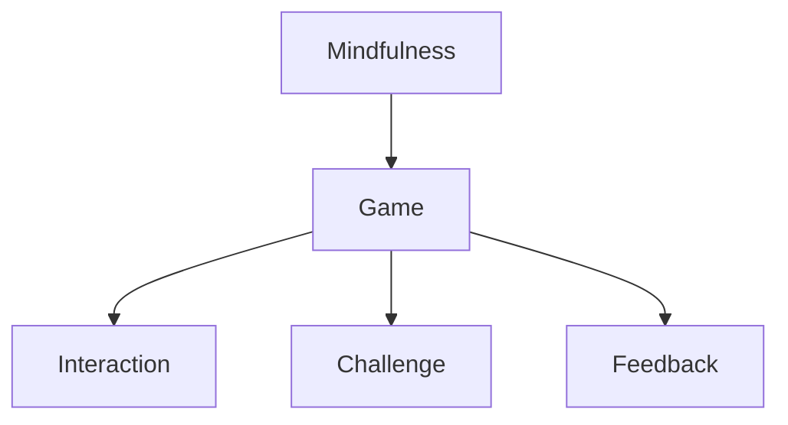

- **系统接口设计和系统交互（序列图）**：如图12所示，序列图展示了用户如何通过冥想游戏化来提升冥想体验：

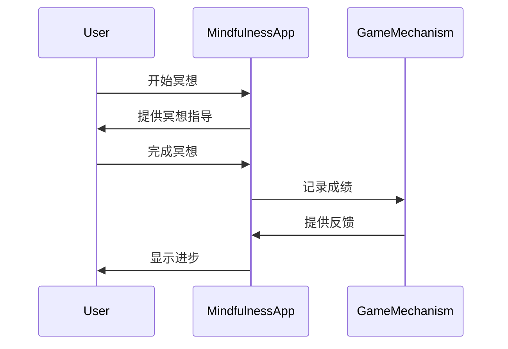

- **实际案例分析和详细讲解剖析**：例如，某款冥想游戏应用通过设置挑战和奖励，鼓励用户坚持冥想，取得了良好的效果。

- **项目小结**：冥想游戏化通过引入互动性、挑战性和反馈性，使得冥想变得更加有趣和易于坚持。

##### 2.1.2 冥想游戏化的理论基础

冥想游戏化的理论基础包括游戏设计理论和认知行为理论。游戏设计理论强调通过游戏机制来吸引用户，提升用户体验。认知行为理论则关注如何通过冥想改变用户的思维和行为模式。

- **背景介绍**：冥想游戏化的理论基础涉及到心理学和游戏设计的多个领域。

- **核心概念与联系**：游戏设计理论和认知行为理论为冥想游戏化提供了理论支持。

- **问题场景介绍**：如何在冥想中引入游戏机制，以提高用户的参与度和效果。

- **项目介绍**：本文旨在探讨冥想游戏化的理论基础，以及如何将其应用于实践。

- **系统功能设计（领域模型）**：定义游戏设计理论、认知行为理论、冥想、游戏化等核心概念，如图13所示：

```mermaid
classDiagram
  GameDesignTheory <<interface>> 游戏设计理论
  CognitiveBehaviorTheory <<interface>> 认知行为理论
  Mindfulness <<interface>> 冥想
  Gamification <<interface>> 游戏化
  GameMechanism <<interface>> 游戏机制
  GameDesignTheory <|.. Mindfulness
  GameDesignTheory <|.. Gamification
  CognitiveBehaviorTheory <|.. Mindfulness
  CognitiveBehaviorTheory <|.. Gamification
```

- **系统架构设计（架构图）**：如图14所示，架构图展示了游戏设计理论和认知行为理论如何支持冥想游戏化：

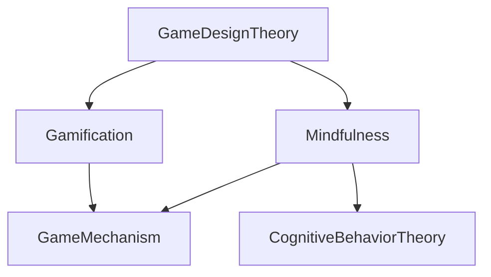

- **系统接口设计和系统交互（序列图）**：如图15所示，序列图展示了用户如何通过游戏设计理论和认知行为理论来参与冥想游戏化：

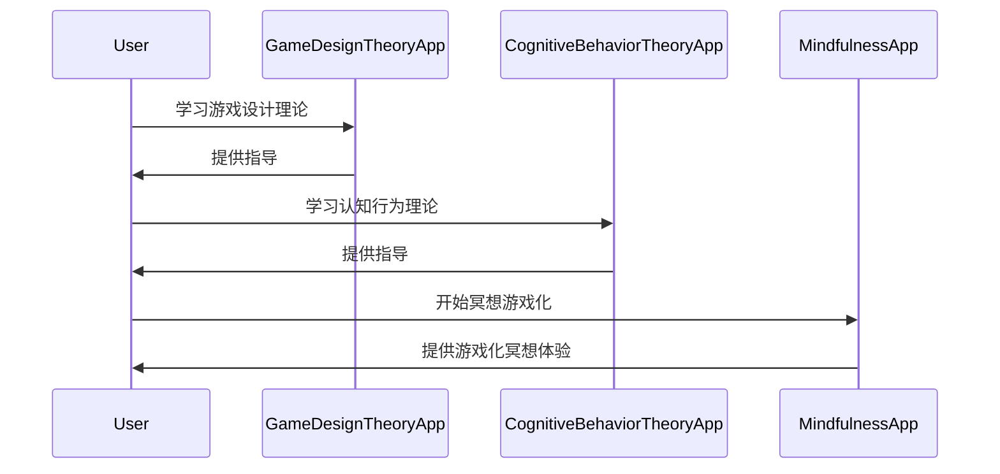

- **实际案例分析和详细讲解剖析**：例如，某款冥想游戏应用结合了游戏设计理论和认知行为理论，通过设置挑战和反馈机制，帮助用户更好地坚持冥想。

- **项目小结**：冥想游戏化的理论基础为其实践提供了有力的支持，通过结合游戏设计和认知行为理论，可以创造出更加有效和有趣的冥想体验。

##### 2.1.3 冥想游戏化的现状与发展趋势

当前，冥想游戏化已经发展出多种形式，如冥想应用程序、虚拟现实冥想体验和游戏化的冥想课程等。随着技术的进步，冥想游戏化将继续发展，为用户提供更多选择和更丰富的体验。

- **背景介绍**：冥想游戏化作为一种新兴的实践，正在迅速发展。

- **核心概念与联系**：冥想游戏化结合了冥想、游戏和技术等核心概念。

- **问题场景介绍**：用户对冥想游戏化的需求日益增长，期待更多的选择和更好的体验。

- **项目介绍**：本文旨在探讨冥想游戏化的现状与发展趋势。

- **系统功能设计（领域模型）**：定义冥想应用程序、虚拟现实冥想体验、游戏化冥想课程等核心概念，如图16所示：

```mermaid
classDiagram
  MindfulnessApp <<interface>> 冥想应用程序
  VRMindfulness <<interface>> 虚拟现实冥想体验
  GamifiedMindfulnessCourse <<interface>> 游戏化冥想课程
  Technology <<interface>> 技术
  MindfulnessApp <|.. Technology
  VRMindfulness <|.. Technology
  GamifiedMindfulnessCourse <|.. Technology
```

- **系统架构设计（架构图）**：如图17所示，架构图展示了冥想游戏化的多种形式如何结合技术：

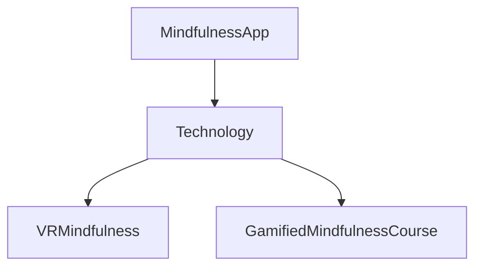

- **系统接口设计和系统交互（序列图）**：如图18所示，序列图展示了用户如何通过不同形式的冥想游戏化来提升冥想体验：

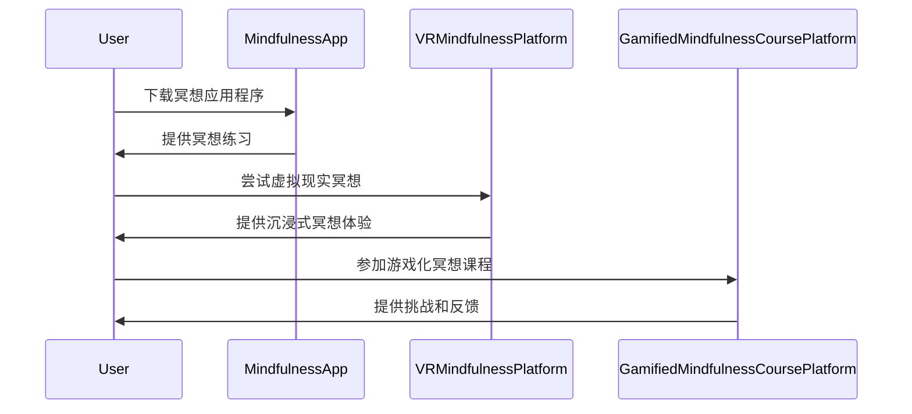

- **实际案例分析和详细讲解剖析**：例如，某款虚拟现实冥想应用通过沉浸式体验，让用户在虚拟环境中进行冥想，取得了良好的市场反响。

- **项目小结**：冥想游戏化在多种形式的推动下，正在迅速发展，为用户提供更多的选择和更丰富的体验。

### 第3章：正念训练的趣味化设计原则

#### 2.2 正念训练的基本概念

##### 2.2.1 正念的起源与发展

正念源自佛教禅修，强调对当下经历的觉察和接纳。随着时间的推移，正念训练被广泛应用于心理治疗和健康管理中。

- **背景介绍**：正念作为一种精神实践，起源于佛教禅修。

- **核心概念与联系**：正念与心理治疗、健康管理、禅修等概念密切相关。

- **问题场景介绍**：许多人寻求通过正念来改善心理健康和生活质量。

- **项目介绍**：本文旨在探讨正念的起源与发展，以及其在心理健康中的应用。

- **系统功能设计（领域模型）**：定义正念、心理治疗、健康管理、禅修等核心概念，如图19所示：

```mermaid
classDiagram
  Mindfulness <<interface>> 正念
  PsychologicalTherapy <<interface>> 心理治疗
  HealthManagement <<interface>> 健康管理
  Zen <<interface>> 禅修
  Mindfulness <|.. PsychologicalTherapy
  Mindfulness <|.. HealthManagement
  Mindfulness <|.. Zen
```

- **系统架构设计（架构图）**：如图20所示，架构图展示了正念在心理治疗、健康管理和禅修中的应用：

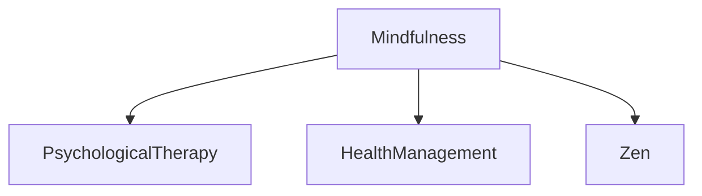

- **系统接口设计和系统交互（序列图）**：如图21所示，序列图展示了用户如何通过正念来改善心理健康和生活质量：

```mermaid
sequenceDiagram
  participant User
  participant MindfulnessPractice
  participant PsychologicalCounselor
  participant HealthcareProfessional
  User->>MindfulnessPractice: 学习正念
  MindfulnessPractice->>User: 提供指导
  User->>PsychologicalCounselor: 咨询心理问题
  PsychologicalCounselor->>User: 提供正念建议
  User->>HealthcareProfessional: 进行健康管理
  HealthcareProfessional->>User: 提供正念指导
```

- **实际案例分析和详细讲解剖析**：例如，一项研究表明，正念训练可以显著降低焦虑和抑郁症状。

- **项目小结**：正念作为一种精神实践，在心理治疗、健康管理和禅修中具有显著的应用价值。

##### 2.2.2 正念训练的目标与方法

正念训练的目标是提高个体的觉察能力和心理灵活性，方法包括冥想、身体扫描和正念呼吸等。

- **背景介绍**：正念训练作为一种提高心理健康的实践，具有明确的目标和方法。

- **核心概念与联系**：正念训练的目标与个体的觉察能力和心理灵活性密切相关。

- **问题场景介绍**：许多人在生活中感到心理压力，需要提高觉察能力和心理灵活性。

- **项目介绍**：本文旨在探讨正念训练的目标与方法，以及其实践中的应用。

- **系统功能设计（领域模型）**：定义正念训练、觉察能力、心理灵活性等核心概念，如图22所示：

```mermaid
classDiagram
  MindfulnessTraining <<interface>> 正念训练
  Awareness <<interface>> 觉察能力
  PsychologicalFlexibility <<interface>> 心理灵活性
  MindfulnessTraining <|.. Awareness
  MindfulnessTraining <|.. PsychologicalFlexibility
```

- **系统架构设计（架构图）**：如图23所示，架构图展示了正念训练如何提高觉察能力和心理灵活性：

```mermaid
graph TB
  A[MindfulnessTraining] --> B[Awareness]
  A --> C[PsychologicalFlexibility]
```

- **系统接口设计和系统交互（序列图）**：如图24所示，序列图展示了用户如何通过正念训练来提高觉察能力和心理灵活性：

```mermaid
sequenceDiagram
  participant User
  participant MindfulnessCoach
  participant MeditationApp
  User->>MindfulnessCoach: 学习正念训练
  MindfulnessCoach->>User: 提供指导
  User->>MeditationApp: 练习冥想
  MeditationApp->>User: 提供实时反馈
  User->>MindfulnessCoach: 反馈练习进展
  MindfulnessCoach->>User: 提供进一步指导
```

- **实际案例分析和详细讲解剖析**：例如，一项研究发现，正念训练可以显著提高个体的觉察能力和心理灵活性。

- **项目小结**：正念训练通过冥想、身体扫描和正念呼吸等方法，有助于提高个体的觉察能力和心理灵活性。

##### 2.2.3 正念训练的益处

正念训练可以帮助减少压力、改善情绪、提高注意力和提升生活质量。

- **背景介绍**：正念训练作为一种心理健康实践，具有多种益处。

- **核心概念与联系**：正念训练的益处与减少压力、改善情绪、提高注意力和提升生活质量密切相关。

- **问题场景介绍**：许多人面临压力、情绪问题、注意力不集中和生活质量下降等问题。

- **项目介绍**：本文旨在探讨正念训练的益处，以及其实践中的应用。

- **系统功能设计（领域模型）**：定义减少压力、改善情绪、提高注意力和提升生活质量等核心概念，如图25所示：

```mermaid
classDiagram
  StressReduction <<interface>> 减少压力
  EmotionalImprovement <<interface>> 改善情绪
  AttentionEnhancement <<interface>> 提高注意力
  LifeQualityImprovement <<interface>> 提升生活质量
  MindfulnessTraining <|.. StressReduction
  MindfulnessTraining <|.. EmotionalImprovement
  MindfulnessTraining <|.. AttentionEnhancement
  MindfulnessTraining <|.. LifeQualityImprovement
```

- **系统架构设计（架构图）**：如图26所示，架构图展示了正念训练如何帮助减少压力、改善情绪、提高注意力和提升生活质量：

```mermaid
graph TB
  A[MindfulnessTraining] --> B[StressReduction]
  A --> C[EmotionalImprovement]
  A --> D[AttentionEnhancement]
  A --> E[LifeQualityImprovement]
```

- **系统接口设计和系统交互（序列图）**：如图27所示，序列图展示了用户如何通过正念训练来减少压力、改善情绪、提高注意力和提升生活质量：

```mermaid
sequenceDiagram
  participant User
  participant MindfulnessApp
  participant StressReductionApp
  participant EmotionalHealthApp
  participant AttentionTrainingApp
  participant LifeQualityImprovementApp
  User->>MindfulnessApp: 学习正念训练
  MindfulnessApp->>User: 提供冥想指导
  User->>StressReductionApp: 减少压力
  StressReductionApp->>User: 提供压力管理策略
  User->>EmotionalHealthApp: 改善情绪
  EmotionalHealthApp->>User: 提供情绪管理技巧
  User->>AttentionTrainingApp: 提高注意力
  AttentionTrainingApp->>User: 提供专注力训练
  User->>LifeQualityImprovementApp: 提升生活质量
  LifeQualityImprovementApp->>User: 提供生活改善建议
```

- **实际案例分析和详细讲解剖析**：例如，一项研究表明，正念训练可以显著降低焦虑和抑郁症状，改善生活质量。

- **项目小结**：正念训练通过多种方式，如减少压力、改善情绪、提高注意力和提升生活质量，对个体的心理健康和生活质量具有显著的正向影响。

#### 2.3 趣味化设计的核心原则

##### 2.3.1 趣味性在冥想游戏化中的重要性

趣味性是吸引用户参与冥想的关键因素。通过趣味化设计，可以提高用户的积极性和持续性。

- **背景介绍**：趣味性在冥想游戏化中的应用具有重要意义。

- **核心概念与联系**：趣味性、用户积极性、用户持续性等概念密切相关。

- **问题场景介绍**：许多人认为冥想是枯燥和难以坚持的，需要通过趣味化设计来吸引他们。

- **项目介绍**：本文旨在探讨趣味性在冥想游戏化中的重要性。

- **系统功能设计（领域模型）**：定义趣味性、用户积极性、用户持续性等核心概念，如图28所示：

```mermaid
classDiagram
  Fun <<interface>> 趣味性
  UserEngagement <<interface>> 用户积极性
  UserPersistence <<interface>> 用户持续性
  Fun <|.. UserEngagement
  Fun <|.. UserPersistence
```

- **系统架构设计（架构图）**：如图29所示，架构图展示了趣味性如何影响用户积极性和持续性：

```mermaid
graph TB
  A[Fun] --> B[UserEngagement]
  A --> C[UserPersistence]
```

- **系统接口设计和系统交互（序列图）**：如图30所示，序列图展示了用户如何通过趣味性提高积极性和持续性：

```mermaid
sequenceDiagram
  participant User
  participant FunMindfulnessApp
  User->>FunMindfulnessApp: 开始冥想
  FunMindfulnessApp->>User: 提供趣味化冥想体验
  User->>FunMindfulnessApp: 反馈体验
  FunMindfulnessApp->>User: 根据反馈调整体验
  User->>FunMindfulnessApp: 持续冥想
```

- **实际案例分析和详细讲解剖析**：例如，某款冥想游戏应用通过有趣的任务和奖励机制，提高了用户的参与度和持续性。

- **项目小结**：趣味性在冥想游戏化中起着至关重要的作用，通过提高用户的积极性和持续性，有助于实现更好的冥想效果。

##### 2.3.2 趣味化设计的核心原则

趣味化设计的核心原则包括游戏化元素的应用、互动设计的引入和即时反馈的提供。

- **背景介绍**：趣味化设计在冥想游戏化中的应用需要遵循一定的核心原则。

- **核心概念与联系**：游戏化元素、互动设计、即时反馈等概念密切相关。

- **问题场景介绍**：设计趣味化的冥想应用时，需要考虑如何应用游戏化元素、引入互动设计和提供即时反馈。

- **项目介绍**：本文旨在探讨趣味化设计的核心原则。

- **系统功能设计（领域模型）**：定义游戏化元素、互动设计、即时反馈等核心概念，如图31所示：

```mermaid
classDiagram
  GamificationElements <<interface>> 游戏化元素
  InteractiveDesign <<interface>> 互动设计
  InstantFeedback <<interface>> 即时反馈
  GamificationElements <|.. InteractiveDesign
  GamificationElements <|.. InstantFeedback
```

- **系统架构设计（架构图）**：如图32所示，架构图展示了趣味化设计的核心原则：

```mermaid
graph TB
  A[GamificationElements] --> B[InteractiveDesign]
  A --> C[InstantFeedback]
```

- **系统接口设计和系统交互（序列图）**：如图33所示，序列图展示了用户如何通过游戏化元素、互动设计和即时反馈来体验趣味化的冥想：

```mermaid
sequenceDiagram
  participant User
  participant GamifiedMeditationApp
  User->>GamifiedMeditationApp: 开始冥想
  GamifiedMeditationApp->>User: 提供游戏化元素
  User->>GamifiedMeditationApp: 完成冥想任务
  GamifiedMeditationApp->>User: 提供即时反馈
  User->>GamifiedMeditationApp: 反馈冥想体验
  GamifiedMeditationApp->>User: 根据反馈调整游戏化元素和互动设计
```

- **实际案例分析和详细讲解剖析**：例如，某款冥想游戏应用通过游戏化元素（如排行榜、成就系统）、互动设计（如用户社区互动）和即时反馈（如进度追踪和奖励机制），提高了用户的参与度和满意度。

- **项目小结**：趣味化设计的核心原则通过应用游戏化元素、引入互动设计和提供即时反馈，有助于创造出更加有趣和有效的冥想体验。

##### 2.3.3 趣味化与冥想效果的平衡

在设计冥想游戏化时，需要平衡趣味性与冥想效果，确保用户在享受游戏化体验的同时，能够获得实际的冥想收益。

- **背景介绍**：在冥想游戏化设计中，趣味性与冥想效果的平衡是一个重要考虑因素。

- **核心概念与联系**：趣味性、冥想效果、用户体验等概念密切相关。

- **问题场景介绍**：设计过程中，如何确保趣味化设计不会影响冥想效果，是一个关键问题。

- **项目介绍**：本文旨在探讨如何在冥想游戏化设计中平衡趣味性与冥想效果。

- **系统功能设计（领域模型）**：定义趣味性、冥想效果、用户体验等核心概念，如图34所示：

```mermaid
classDiagram
  Fun <<interface>> 趣味性
  MeditationEffect <<interface>> 冥想效果
  UserExperience <<interface>> 用户体验
  Fun <|.. MeditationEffect
  Fun <|.. UserExperience
  MeditationEffect <|.. UserExperience
```

- **系统架构设计（架构图）**：如图35所示，架构图展示了趣味性、冥想效果和用户体验之间的关系：

```mermaid
graph TB
  A[Fun] --> B[MeditationEffect]
  B --> C[UserExperience]
```

- **系统接口设计和系统交互（序列图）**：如图36所示，序列图展示了用户如何通过平衡趣味性与冥想效果来优化用户体验：

```mermaid
sequenceDiagram
  participant User
  participant BalancedMeditationApp
  User->>BalancedMeditationApp: 开始冥想
  BalancedMeditationApp->>User: 提供趣味化元素
  User->>BalancedMeditationApp: 反馈冥想体验
  BalancedMeditationApp->>User: 根据反馈调整趣味化元素
  User->>BalancedMeditationApp: 完成冥想
  BalancedMeditationApp->>User: 提供冥想效果反馈
  User->>BalancedMeditationApp: 反馈冥想效果
  BalancedMeditationApp->>User: 根据反馈调整冥想方案
```

- **实际案例分析和详细讲解剖析**：例如，某款冥想游戏应用通过持续的用户反馈机制，不断调整游戏化元素，以确保用户既能享受趣味化的体验，又能获得实际的冥想收益。

- **项目小结**：在冥想游戏化设计中，平衡趣味性与冥想效果至关重要。通过用户反馈和持续调整，可以优化用户体验，实现趣味化与冥想效果的和谐统一。

### 第4章：冥想游戏化的设计要素

#### 3.1 游戏化元素的选择与应用

##### 3.1.1 游戏化元素概述

游戏化元素包括排行榜、成就系统、虚拟奖励等，可以增加冥想的趣味性和激励性。

- **背景介绍**：游戏化元素在提升用户参与度和积极性方面具有显著作用。

- **核心概念与联系**：游戏化元素、趣味性、激励性等概念密切相关。

- **问题场景介绍**：如何在冥想中引入游戏化元素，以提升用户体验。

- **项目介绍**：本文旨在探讨游戏化元素的选择与应用。

- **系统功能设计（领域模型）**：定义游戏化元素、趣味性、激励性等核心概念，如图37所示：

```mermaid
classDiagram
  GamificationElement <<interface>> 游戏化元素
  Fun <<interface>> 趣味性
  Motivation <<interface>> 激励性
  GamificationElement <|.. Fun
  GamificationElement <|.. Motivation
```

- **系统架构设计（架构图）**：如图38所示，架构图展示了游戏化元素如何提升趣味性和激励性：

```mermaid
graph TB
  A[GamificationElement] --> B[Fun]
  A --> C[Motivation]
```

- **系统接口设计和系统交互（序列图）**：如图39所示，序列图展示了用户如何通过游戏化元素提升冥想体验：

```mermaid
sequenceDiagram
  participant User
  participant GamifiedMeditationApp
  User->>GamifiedMeditationApp: 开始冥想
  GamifiedMeditationApp->>User: 提供排行榜
  User->>GamifiedMeditationApp: 获得排名
  GamifiedMeditationApp->>User: 提供成就系统
  User->>GamifiedMeditationApp: 达成成就
  GamifiedMeditationApp->>User: 提供虚拟奖励
  User->>GamifiedMeditationApp: 收集虚拟奖励
```

- **实际案例分析和详细讲解剖析**：例如，某款冥想游戏应用通过排行榜、成就系统和虚拟奖励，吸引了大量用户并提高了他们的积极性。

- **项目小结**：游戏化元素在冥想中的应用可以显著提升趣味性和激励性，有助于用户坚持冥想。

##### 3.1.2 游戏化元素在冥想中的应用

在冥想游戏中，游戏化元素可以通过设定目标、奖励机制和竞争环境来激发用户的兴趣和参与度。

- **背景介绍**：游戏化元素在冥想中的应用可以提升用户的参与度和兴趣。

- **核心概念与联系**：游戏化元素、目标、奖励机制、竞争环境等概念密切相关。

- **问题场景介绍**：如何通过游戏化元素设计有趣的冥想游戏。

- **项目介绍**：本文旨在探讨游戏化元素在冥想中的应用。

- **系统功能设计（领域模型）**：定义游戏化元素、目标、奖励机制、竞争环境等核心概念，如图40所示：

```mermaid
classDiagram
  GamificationElement <<interface>> 游戏化元素
  Goal <<interface>> 目标
  RewardSystem <<interface>> 奖励机制
  CompetitionEnvironment <<interface>> 竞争环境
  GamificationElement <|.. Goal
  GamificationElement <|.. RewardSystem
  GamificationElement <|.. CompetitionEnvironment
```

- **系统架构设计（架构图）**：如图41所示，架构图展示了游戏化元素如何应用于冥想游戏：

```mermaid
graph TB
  A[GamificationElement] --> B[Goal]
  A --> C[RewardSystem]
  A --> D[CompetitionEnvironment]
```

- **系统接口设计和系统交互（序列图）**：如图42所示，序列图展示了用户如何通过游戏化元素参与冥想游戏：

```mermaid
sequenceDiagram
  participant User
  participant GamifiedMeditationGame
  User->>GamifiedMeditationGame: 开始游戏
  GamifiedMeditationGame->>User: 设定目标
  User->>GamifiedMeditationGame: 达成目标
  GamifiedMeditationGame->>User: 提供奖励
  User->>GamifiedMeditationGame: 参与竞争
  GamifiedMeditationGame->>User: 显示排名
```

- **实际案例分析和详细讲解剖析**：例如，某款冥想游戏应用通过设定每日冥想目标、提供奖励机制和创建竞争环境，吸引了大量用户并提高了他们的参与度。

- **项目小结**：游戏化元素在冥想中的应用可以激发用户的兴趣和参与度，通过设定目标、奖励机制和竞争环境，实现更加有趣和有效的冥想体验。

##### 3.1.3 游戏化元素的适应性与调整

游戏化元素需要根据用户需求和市场反馈进行适应性调整，以保持冥想的趣味性和有效性。

- **背景介绍**：游戏化元素的适应性调整对于保持冥想的趣味性和有效性至关重要。

- **核心概念与联系**：游戏化元素、用户需求、市场反馈、适应性调整等概念密切相关。

- **问题场景介绍**：如何在保持冥想趣味性的同时，满足不同用户的需求。

- **项目介绍**：本文旨在探讨游戏化元素的适应性与调整。

- **系统功能设计（领域模型）**：定义游戏化元素、用户需求、市场反馈、适应性调整等核心概念，如图43所示：

```mermaid
classDiagram
  GamificationElement <<interface>> 游戏化元素
  UserDemand <<interface>> 用户需求
  MarketFeedback <<interface>> 市场反馈
  AdaptiveAdjustment <<interface>> 适应性调整
  GamificationElement <|.. UserDemand
  GamificationElement <|.. MarketFeedback
  GamificationElement <|.. AdaptiveAdjustment
```

- **系统架构设计（架构图）**：如图44所示，架构图展示了游戏化元素的适应性调整过程：

```mermaid
graph TB
  A[GamificationElement] --> B[UserDemand]
  A --> C[MarketFeedback]
  A --> D[AdaptiveAdjustment]
```

- **系统接口设计和系统交互（序列图）**：如图45所示，序列图展示了用户如何通过适应性调整优化冥想体验：

```mermaid
sequenceDiagram
  participant User
  participant GamifiedMeditationPlatform
  participant FeedbackSystem
  User->>GamifiedMeditationPlatform: 使用冥想应用
  GamifiedMeditationPlatform->>User: 提供游戏化元素
  User->>FeedbackSystem: 提供反馈
  FeedbackSystem->>GamifiedMeditationPlatform: 收集用户反馈
  GamifiedMeditationPlatform->>User: 根据反馈调整游戏化元素
  User->>GamifiedMeditationPlatform: 再次使用冥想应用
```

- **实际案例分析和详细讲解剖析**：例如，某款冥想游戏应用通过收集用户反馈，不断调整游戏化元素，以保持用户的兴趣和参与度。

- **项目小结**：游戏化元素的适应性调整可以确保冥想的趣味性和有效性，通过根据用户需求和市场反馈进行调整，实现更好的用户体验。

#### 3.2 用户参与度与互动设计

##### 3.2.1 提高用户参与度的策略

提高用户参与度的策略包括个性化推荐、社区互动和用户反馈机制等。

- **背景介绍**：提高用户参与度对于冥想游戏化的成功至关重要。

- **核心概念与联系**：用户参与度、个性化推荐、社区互动、用户反馈等概念密切相关。

- **问题场景介绍**：如何通过策略提高用户的参与度。

- **项目介绍**：本文旨在探讨提高用户参与度的策略。

- **系统功能设计（领域模型）**：定义用户参与度、个性化推荐、社区互动、用户反馈等核心概念，如图46所示：

```mermaid
classDiagram
  UserEngagement <<interface>> 用户参与度
  PersonalizedRecommendation <<interface>> 个性化推荐
  CommunityInteraction <<interface>> 社区互动
  UserFeedback <<interface>> 用户反馈
  UserEngagement <|.. PersonalizedRecommendation
  UserEngagement <|.. CommunityInteraction
  UserEngagement <|.. UserFeedback
```

- **系统架构设计（架构图）**：如图47所示，架构图展示了提高用户参与度的策略：

```mermaid
graph TB
  A[UserEngagement] --> B[PersonalizedRecommendation]
  A --> C[CommunityInteraction]
  A --> D[UserFeedback]
```

- **系统接口设计和系统交互（序列图）**：如图48所示，序列图展示了用户如何通过策略提高参与度：

```mermaid
sequenceDiagram
  participant User
  participant GamifiedMeditationPlatform
  participant RecommendationSystem
  participant CommunityForum
  participant FeedbackSystem
  User->>GamifiedMeditationPlatform: 开始冥想
  GamifiedMeditationPlatform->>User: 提供个性化推荐
  User->>RecommendationSystem: 接受推荐
  RecommendationSystem->>GamifiedMeditationPlatform: 更新用户偏好
  User->>CommunityForum: 参与社区互动
  CommunityForum->>User: 提供交流机会
  User->>FeedbackSystem: 提供反馈
  FeedbackSystem->>GamifiedMeditationPlatform: 收集用户反馈
  GamifiedMeditationPlatform->>User: 根据反馈优化体验
```

- **实际案例分析和详细讲解剖析**：例如，某款冥想游戏应用通过个性化推荐、社区互动和用户反馈机制，显著提高了用户的参与度。

- **项目小结**：通过个性化推荐、社区互动和用户反馈机制，可以提高用户的参与度，从而实现更有效的冥想游戏化。

##### 3.2.2 互动设计在冥想游戏化中的重要性

互动设计在冥想游戏化中的重要性在于，它能够增强用户的沉浸感和参与感，从而提升冥想效果。

- **背景介绍**：互动设计在提升用户体验方面具有重要作用。

- **核心概念与联系**：互动设计、沉浸感、参与感、冥想效果等概念密切相关。

- **问题场景介绍**：如何在冥想游戏化中应用互动设计。

- **项目介绍**：本文旨在探讨互动设计在冥想游戏化中的重要性。

- **系统功能设计（领域模型）**：定义互动设计、沉浸感、参与感、冥想效果等核心概念，如图49所示：

```mermaid
classDiagram
  InteractiveDesign <<interface>> 互动设计
  Immersion <<interface>> 沉浸感
  Engagement <<interface>> 参与感
  MeditationEffect <<interface>> 冥想效果
  InteractiveDesign <|.. Immersion
  InteractiveDesign <|.. Engagement
  InteractiveDesign <|.. MeditationEffect
```

- **系统架构设计（架构图）**：如图50所示，架构图展示了互动设计如何影响沉浸感、参与感和冥想效果：

```mermaid
graph TB
  A[InteractiveDesign] --> B[Immersion]
  A --> C[Engagement]
  B --> D[MeditationEffect]
```

- **系统接口设计和系统交互（序列图）**：如图51所示，序列图展示了用户如何通过互动设计体验沉浸感和参与感：

```mermaid
sequenceDiagram
  participant User
  participant InteractiveMeditationApp
  participant ImmersionEnvironment
  participant EngagementSystem
  User->>InteractiveMeditationApp: 开始冥想
  InteractiveMeditationApp->>User: 提供互动设计
  User->>ImmersionEnvironment: 进入沉浸环境
  ImmersionEnvironment->>User: 提供沉浸体验
  User->>EngagementSystem: 参与互动
  EngagementSystem->>User: 提供参与感
```

- **实际案例分析和详细讲解剖析**：例如，某款冥想游戏应用通过互动设计，如虚拟现实场景和实时互动，提升了用户的沉浸感和参与感。

- **项目小结**：互动设计在冥想游戏化中至关重要，通过增强用户的沉浸感和参与感，可以显著提升冥想效果。

##### 3.2.3 互动设计与用户体验的关系

良好的互动设计能够提升用户体验，增加用户满意度和忠诚度。

- **背景介绍**：互动设计在提升用户体验方面具有重要意义。

- **核心概念与联系**：互动设计、用户体验、满意度、忠诚度等概念密切相关。

- **问题场景介绍**：如何通过互动设计提升用户体验。

- **项目介绍**：本文旨在探讨互动设计与用户体验的关系。

- **系统功能设计（领域模型）**：定义互动设计、用户体验、满意度、忠诚度等核心概念，如图52所示：

```mermaid
classDiagram
  InteractiveDesign <<interface>> 互动设计
  UserExperience <<interface>> 用户体验
  Satisfaction <<interface>> 满意度
  Loyalty <<interface>> 忠诚度
  InteractiveDesign <|.. UserExperience
  InteractiveDesign <|.. Satisfaction
  InteractiveDesign <|.. Loyalty
```

- **系统架构设计（架构图）**：如图53所示，架构图展示了互动设计如何影响用户体验、满意度和忠诚度：

```mermaid
graph TB
  A[InteractiveDesign] --> B[UserExperience]
  B --> C[Satisfaction]
  B --> D[Loyalty]
```

- **系统接口设计和系统交互（序列图）**：如图54所示，序列图展示了用户如何通过互动设计提升用户体验、满意度和忠诚度：

```mermaid
sequenceDiagram
  participant User
  participant InteractiveMeditationPlatform
  participant ExperienceSystem
  participant SatisfactionSystem
  participant LoyaltySystem
  User->>InteractiveMeditationPlatform: 开始冥想
  InteractiveMeditationPlatform->>User: 提供互动设计
  User->>ExperienceSystem: 体验冥想
  ExperienceSystem->>User: 提供体验反馈
  User->>SatisfactionSystem: 表达满意度
  SatisfactionSystem->>User: 提供满意度反馈
  User->>LoyaltySystem: 表达忠诚度
  LoyaltySystem->>User: 提供忠诚度奖励
```

- **实际案例分析和详细讲解剖析**：例如，某款冥想游戏应用通过互动设计，如实时互动和个性化推荐，提升了用户的满意度和忠诚度。

- **项目小结**：良好的互动设计可以显著提升用户体验、满意度和忠诚度，对于冥想游戏化的成功至关重要。

### 第5章：正念训练的趣味化案例解析

#### 4.1 游戏化冥想应用程序分析

##### 4.1.1 案例选择与评估标准

选择具有代表性的冥想应用程序，从用户评价、功能设计、用户体验等方面进行评估。

- **背景介绍**：选择具有代表性的冥想应用程序对于分析游戏化冥想具有重要意义。

- **核心概念与联系**：冥想应用程序、用户评价、功能设计、用户体验等概念密切相关。

- **问题场景介绍**：如何选择合适的冥想应用程序进行分析。

- **项目介绍**：本文旨在选择具有代表性的冥想应用程序，并从用户评价、功能设计、用户体验等方面进行评估。

- **系统功能设计（领域模型）**：定义冥想应用程序、用户评价、功能设计、用户体验等核心概念，如图55所示：

```mermaid
classDiagram
  MeditationApp <<interface>> 冥想应用程序
  UserReview <<interface>> 用户评价
  FunctionalDesign <<interface>> 功能设计
  UX <<interface>> 用户体验
  MeditationApp <|.. UserReview
  MeditationApp <|.. FunctionalDesign
  MeditationApp <|.. UX
```

- **系统架构设计（架构图）**：如图56所示，架构图展示了如何评估冥想应用程序：

```mermaid
graph TB
  A[MeditationApp] --> B[UserReview]
  A --> C[FunctionalDesign]
  A --> D[UX]
```

- **系统接口设计和系统交互（序列图）**：如图57所示，序列图展示了如何选择和评估冥想应用程序：

```mermaid
sequenceDiagram
  participant Analyst
  participant MeditationAppMarket
  participant Users
  Analyst->>MeditationAppMarket: 搜集冥想应用程序
  MeditationAppMarket->>Analyst: 提供应用程序列表
  Analyst->>Users: 发放调查问卷
  Users->>Analyst: 提供评价和反馈
  Analyst->>MeditationAppMarket: 分析用户评价
  MeditationAppMarket->>Analyst: 提供功能设计文档
  Analyst->>MeditationAppMarket: 评估功能设计
  MeditationAppMarket->>Analyst: 提供用户体验反馈
  Analyst->>MeditationAppMarket: 评估用户体验
```

- **实际案例分析和详细讲解剖析**：例如，选择某款流行的冥想应用程序，从用户评价、功能设计和用户体验等方面进行分析，得出其优势和不足。

- **项目小结**：通过选择具有代表性的冥想应用程序进行分析，可以深入了解游戏化冥想的应用现状和发展方向。

##### 4.1.2 案例一：冥想游戏App的功能与设计

分析某款冥想游戏App的功能与设计，包括游戏机制、用户体验和效果评估。

- **背景介绍**：分析冥想游戏App的功能与设计对于理解其成功因素至关重要。

- **核心概念与联系**：冥想游戏App、游戏机制、用户体验、效果评估等概念密切相关。

- **问题场景介绍**：如何分析冥想游戏App的功能与设计。

- **项目介绍**：本文旨在分析某款冥想游戏App的功能与设计，包括游戏机制、用户体验和效果评估。

- **系统功能设计（领域模型）**：定义冥想游戏App、游戏机制、用户体验、效果评估等核心概念，如图58所示：

```mermaid
classDiagram
  MeditationGameApp <<interface>> 冥想游戏App
  GameMechanism <<interface>> 游戏机制
  UX <<interface>> 用户体验
  EffectEvaluation <<interface>> 效果评估
  MeditationGameApp <|.. GameMechanism
  MeditationGameApp <|.. UX
  MeditationGameApp <|.. EffectEvaluation
```

- **系统架构设计（架构图）**：如图59所示，架构图展示了冥想游戏App的功能与设计：

```mermaid
graph TB
  A[MeditationGameApp] --> B[GameMechanism]
  A --> C[UX]
  A --> D[EffectEvaluation]
```

- **系统接口设计和系统交互（序列图）**：如图60所示，序列图展示了用户如何通过冥想游戏App进行冥想：

```mermaid
sequenceDiagram
  participant User
  participant MeditationGameApp
  participant FeedbackSystem
  User->>MeditationGameApp: 开始冥想
  MeditationGameApp->>User: 提供游戏机制
  User->>MeditationGameApp: 进行冥想练习
  MeditationGameApp->>User: 提供实时反馈
  User->>FeedbackSystem: 提供反馈
  FeedbackSystem->>MeditationGameApp: 收集用户反馈
  MeditationGameApp->>User: 提供效果评估
```

- **实际案例分析和详细讲解剖析**：例如，分析某款冥想游戏App的功能与设计，包括游戏机制（如目标设定、进度追踪）、用户体验（如界面设计、交互方式）和效果评估（如压力水平测试）。

- **项目小结**：通过分析冥想游戏App的功能与设计，可以深入了解其成功因素，为其他冥想游戏App的设计提供参考。

##### 4.1.3 案例二：虚拟现实冥想体验分析

分析虚拟现实冥想体验的设计，探讨其优势和应用前景。

- **背景介绍**：虚拟现实（VR）冥想体验作为一种新兴的冥想形式，具有显著的优势和应用前景。

- **核心概念与联系**：虚拟现实冥想体验、设计、优势、应用前景等概念密切相关。

- **问题场景介绍**：如何分析虚拟现实冥想体验的设计。

- **项目介绍**：本文旨在分析虚拟现实冥想体验的设计，探讨其优势和应用前景。

- **系统功能设计（领域模型）**：定义虚拟现实冥想体验、设计、优势、应用前景等核心概念，如图61所示：

```mermaid
classDiagram
  VRMeditationExperience <<interface>> 虚拟现实冥想体验
  Design <<interface>> 设计
  Advantage <<interface>> 优势
  ApplicationProspect <<interface>> 应用前景
  VRMeditationExperience <|.. Design
  VRMeditationExperience <|.. Advantage
  VRMeditationExperience <|.. ApplicationProspect
```

- **系统架构设计（架构图）**：如图62所示，架构图展示了虚拟现实冥想体验的设计：

```mermaid
graph TB
  A[VRMeditationExperience] --> B[Design]
  A --> C[Advantage]
  A --> D[ApplicationProspect]
```

- **系统接口设计和系统交互（序列图）**：如图63所示，序列图展示了用户如何通过虚拟现实冥想体验进行冥想：

```mermaid
sequenceDiagram
  participant User
  participant VRMeditationPlatform
  participant VRGameEngine
  participant FeedbackSystem
  User->>VRMeditationPlatform: 开始冥想
  VRMeditationPlatform->>User: 提供虚拟现实环境
  User->>VRGameEngine: 进行冥想练习
  VRGameEngine->>User: 提供沉浸体验
  User->>FeedbackSystem: 提供反馈
  FeedbackSystem->>VRMeditationPlatform: 收集用户反馈
```

- **实际案例分析和详细讲解剖析**：例如，分析某款虚拟现实冥想应用的设计，包括虚拟现实环境、沉浸体验和用户反馈机制。

- **项目小结**：虚拟现实冥想体验通过提供沉浸式的冥想环境，具有显著的优势和应用前景，为冥想游戏化提供了新的发展方向。

##### 4.1.4 案例三：游戏化冥想课程分析

分析游戏化冥想课程的设计，探讨其课程结构、教学方法、用户参与度和效果。

- **背景介绍**：游戏化冥想课程通过游戏化设计，提高了冥想学习的趣味性和参与度。

- **核心概念与联系**：游戏化冥想课程、课程结构、教学方法、用户参与度、效果等概念密切相关。

- **问题场景介绍**：如何分析游戏化冥想课程的设计。

- **项目介绍**：本文旨在分析游戏化冥想课程的设计，探讨其课程结构、教学方法、用户参与度和效果。

- **系统功能设计（领域模型）**：定义游戏化冥想课程、课程结构、教学方法、用户参与度、效果等核心概念，如图64所示：

```mermaid
classDiagram
  GamifiedMeditationCourse <<interface>> 游戏化冥想课程
  CourseStructure <<interface>> 课程结构
  TeachingMethod <<interface>> 教学方法
  UserEngagement <<interface>> 用户参与度
  Effect <<interface>> 效果
  GamifiedMeditationCourse <|.. CourseStructure
  GamifiedMeditationCourse <|.. TeachingMethod
  GamifiedMeditationCourse <|.. UserEngagement
  GamifiedMeditationCourse <|.. Effect
```

- **系统架构设计（架构图）**：如图65所示，架构图展示了游戏化冥想课程的设计：

```mermaid
graph TB
  A[GamifiedMeditationCourse] --> B[CourseStructure]
  A --> C[TeachingMethod]
  A --> D[UserEngagement]
  A --> E[Effect]
```

- **系统接口设计和系统交互（序列图）**：如图66所示，序列图展示了用户如何参与游戏化冥想课程：

```mermaid
sequenceDiagram
  participant User
  participant GamifiedMeditationCourse
  participant FeedbackSystem
  User->>GamifiedMeditationCourse: 报名课程
  GamifiedMeditationCourse->>User: 提供课程结构
  User->>GamifiedMeditationCourse: 参与课程
  GamifiedMeditationCourse->>User: 提供教学方法
  User->>GamifiedMeditationCourse: 完成课程任务
  GamifiedMeditationCourse->>User: 提供即时反馈
  User->>FeedbackSystem: 提供反馈
  FeedbackSystem->>GamifiedMeditationCourse: 收集用户反馈
  GamifiedMeditationCourse->>User: 提供课程效果评估
```

- **实际案例分析和详细讲解剖析**：例如，分析某款游戏化冥想课程，包括课程结构、教学方法、用户参与度和效果。

- **项目小结**：游戏化冥想课程通过结构化设计、教学方法、用户参与度和效果评估，提供了有效的冥想学习体验。

##### 4.1.5 冥想游戏化案例的启示与挑战

分析冥想游戏化案例的启示与挑战，为冥想游戏化的未来发展提供参考。

- **背景介绍**：冥想游戏化案例的成功与挑战为未来发展提供了宝贵的经验。

- **核心概念与联系**：冥想游戏化案例、启示、挑战、未来发展等概念密切相关。

- **问题场景介绍**：如何分析冥想游戏化案例的启示与挑战。

- **项目介绍**：本文旨在分析冥想游戏化案例的启示与挑战，为未来发展提供参考。

- **系统功能设计（领域模型）**：定义冥想游戏化案例、启示、挑战、未来发展等核心概念，如图67所示：

```mermaid
classDiagram
  MeditationGamificationCase <<interface>> 冥想游戏化案例
  Insight <<interface>> 启示
  Challenge <<interface>> 挑战
  FutureDevelopment <<interface>> 未来发展
  MeditationGamificationCase <|.. Insight
  MeditationGamificationCase <|.. Challenge
  MeditationGamificationCase <|.. FutureDevelopment
```

- **系统架构设计（架构图）**：如图68所示，架构图展示了如何分析冥想游戏化案例：

```mermaid
graph TB
  A[MeditationGamificationCase] --> B[Insight]
  A --> C[Challenge]
  A --> D[FutureDevelopment]
```

- **系统接口设计和系统交互（序列图）**：如图69所示，序列图展示了如何分析冥想游戏化案例：

```mermaid
sequenceDiagram
  participant Analyst
  participant MeditationGamificationCases
  participant Insights
  participant Challenges
  participant FutureDevelopment
  Analyst->>MeditationGamificationCases: 收集案例
  MeditationGamificationCases->>Analyst: 提供案例
  Analyst->>Insights: 分析案例启示
  Insights->>Analyst: 提供启示
  Analyst->>Challenges: 分析案例挑战
  Challenges->>Analyst: 提供挑战
  Analyst->>FutureDevelopment: 提出未来发展建议
  FutureDevelopment->>Analyst: 提供建议
```

- **实际案例分析和详细讲解剖析**：例如，分析多个冥想游戏化案例，提取成功经验和面临的挑战，为未来发展提出建议。

- **项目小结**：通过分析冥想游戏化案例的启示与挑战，可以为冥想游戏化的未来发展提供有力指导。

### 第6章：冥想游戏化的社会影响与伦理问题

#### 5.1 冥想游戏化的社会影响

冥想游戏化对心理健康、社会健康意识和社会生活方式产生了积极影响。

- **背景介绍**：冥想游戏化作为一种新兴的实践，正在对社会的多个层面产生积极影响。

- **核心概念与联系**：冥想游戏化、心理健康、社会健康意识、社会生活方式等概念密切相关。

- **问题场景介绍**：冥想游戏化如何影响心理健康、社会健康意识和社会生活方式。

- **项目介绍**：本文旨在探讨冥想游戏化对社会的积极影响。

- **系统功能设计（领域模型）**：定义冥想游戏化、心理健康、社会健康意识、社会生活方式等核心概念，如图70所示：

```mermaid
classDiagram
  MeditationGamification <<interface>> 冥想游戏化
  MentalHealth <<interface>> 心理健康
  SocialHealthAwareness <<interface>> 社会健康意识
  SocialLifestyle <<interface>> 社会生活方式
  MeditationGamification <|.. MentalHealth
  MeditationGamification <|.. SocialHealthAwareness
  MeditationGamification <|.. SocialLifestyle
```

- **系统架构设计（架构图）**：如图71所示，架构图展示了冥想游戏化如何影响心理健康、社会健康意识和社会生活方式：

```mermaid
graph TB
  A[MeditationGamification] --> B[MentalHealth]
  A --> C[SocialHealthAwareness]
  A --> D[SocialLifestyle]
```

- **系统接口设计和系统交互（序列图）**：如图72所示，序列图展示了冥想游戏化如何对社会产生积极影响：

```mermaid
sequenceDiagram
  participant Society
  participant MeditationGamificationPlatform
  participant MentalHealthImprovement
  participant SocialHealthAwarenessRise
  participant SocialLifestyleEnhancement
  Society->>MeditationGamificationPlatform: 接受冥想游戏化
  MeditationGamificationPlatform->>Society: 提供冥想服务
  Society->>MentalHealthImprovement: 心理健康改善
  MentalHealthImprovement->>Society: 提高心理健康
  Society->>SocialHealthAwarenessRise: 社会健康意识提升
  SocialHealthAwarenessRise->>Society: 增强社会健康意识
  Society->>SocialLifestyleEnhancement: 社会生活方式改善
  SocialLifestyleEnhancement->>Society: 提升社会生活方式
```

- **实际案例分析和详细讲解剖析**：例如，分析冥想游戏化在提高心理健康、社会健康意识和社会生活方式方面的具体案例。

- **项目小结**：冥想游戏化通过提高心理健康、社会健康意识和社会生活方式，对社会产生了积极的影响。

#### 5.2 冥想游戏化的伦理问题

冥想游戏化涉及多个伦理问题，包括数据隐私、信息安全、公平性和可及性等。

- **背景介绍**：随着冥想游戏化的普及，伦理问题变得日益重要。

- **核心概念与联系**：冥想游戏化、伦理问题、数据隐私、信息安全、公平性、可及性等概念密切相关。

- **问题场景介绍**：冥想游戏化如何处理伦理问题。

- **项目介绍**：本文旨在探讨冥想游戏化涉及的伦理问题。

- **系统功能设计（领域模型）**：定义冥想游戏化、伦理问题、数据隐私、信息安全、公平性、可及性等核心概念，如图73所示：

```mermaid
classDiagram
  MeditationGamification <<interface>> 冥想游戏化
  EthicalIssue <<interface>> 伦理问题
  DataPrivacy <<interface>> 数据隐私
  InformationSecurity <<interface>> 信息安全
  Fairness <<interface>> 公平性
  Accessibility <<interface>> 可及性
  MeditationGamification <|.. EthicalIssue
  MeditationGamification <|.. DataPrivacy
  MeditationGamification <|.. InformationSecurity
  MeditationGamification <|.. Fairness
  MeditationGamification <|.. Accessibility
```

- **系统架构设计（架构图）**：如图74所示，架构图展示了冥想游戏化如何处理伦理问题：

```mermaid
graph TB
  A[MeditationGamification] --> B[EthicalIssue]
  B --> C[DataPrivacy]
  B --> D[InformationSecurity]
  B --> E[Fairness]
  B --> F[Accessibility]
```

- **系统接口设计和系统交互（序列图）**：如图75所示，序列图展示了冥想游戏化如何处理伦理问题：

```mermaid
sequenceDiagram
  participant User
  participant MeditationGamificationPlatform
  participant DataPrivacySystem
  participant InformationSecuritySystem
  participant FairnessSystem
  participant AccessibilitySystem
  User->>MeditationGamificationPlatform: 使用冥想服务
  MeditationGamificationPlatform->>User: 收集数据
  MeditationGamificationPlatform->>DataPrivacySystem: 处理数据隐私
  DataPrivacySystem->>MeditationGamificationPlatform: 提供隐私保护
  MeditationGamificationPlatform->>InformationSecuritySystem: 加强信息安全
  InformationSecuritySystem->>MeditationGamificationPlatform: 提供安全保护
  MeditationGamificationPlatform->>FairnessSystem: 确保公平性
  FairnessSystem->>MeditationGamificationPlatform: 提供公平反馈
  MeditationGamificationPlatform->>AccessibilitySystem: 提高可及性
  AccessibilitySystem->>MeditationGamificationPlatform: 提供无障碍服务
```

- **实际案例分析和详细讲解剖析**：例如，分析冥想游戏化应用在处理数据隐私、信息安全、公平性和可及性方面的具体措施。

- **项目小结**：冥想游戏化在处理伦理问题时，需要充分考虑数据隐私、信息安全、公平性和可及性，确保用户权益得到保护。

#### 5.3 冥想游戏化的伦理问题解决方案

针对冥想游戏化中存在的伦理问题，提出以下解决方案：

- **背景介绍**：伦理问题在冥想游戏化中具有重要性，需要采取有效的解决方案。

- **核心概念与联系**：伦理问题、解决方案、数据隐私、信息安全、公平性、可及性等概念密切相关。

- **问题场景介绍**：如何解决冥想游戏化中的伦理问题。

- **项目介绍**：本文旨在提出冥想游戏化伦理问题的解决方案。

- **系统功能设计（领域模型）**：定义伦理问题、解决方案、数据隐私、信息安全、公平性、可及性等核心概念，如图76所示：

```mermaid
classDiagram
  EthicalProblem <<interface>> 伦理问题
  Solution <<interface>> 解决方案
  DataPrivacy <<interface>> 数据隐私
  InformationSecurity <<interface>> 信息安全
  Fairness <<interface>> 公平性
  Accessibility <<interface>> 可及性
  EthicalProblem <|.. Solution
  EthicalProblem <|.. DataPrivacy
  EthicalProblem <|.. InformationSecurity
  EthicalProblem <|.. Fairness
  EthicalProblem <|.. Accessibility
```

- **系统架构设计（架构图）**：如图77所示，架构图展示了伦理问题的解决方案：

```mermaid
graph TB
  A[EthicalProblem] --> B[Solution]
  B --> C[DataPrivacy]
  B --> D[InformationSecurity]
  B --> E[Fairness]
  B --> F[Accessibility]
```

- **系统接口设计和系统交互（序列图）**：如图78所示，序列图展示了如何通过解决方案解决伦理问题：

```mermaid
sequenceDiagram
  participant User
  participant MeditationGamificationPlatform
  participant DataPrivacySolution
  participant InformationSecuritySolution
  participant FairnessSolution
  participant AccessibilitySolution
  User->>MeditationGamificationPlatform: 使用冥想服务
  MeditationGamificationPlatform->>User: 收集数据
  MeditationGamificationPlatform->>DataPrivacySolution: 应用隐私保护措施
  DataPrivacySolution->>MeditationGamificationPlatform: 保护用户数据隐私
  MeditationGamificationPlatform->>InformationSecuritySolution: 应用信息安全措施
  InformationSecuritySolution->>MeditationGamificationPlatform: 保护用户信息安全
  MeditationGamificationPlatform->>FairnessSolution: 确保服务公平
  FairnessSolution->>MeditationGamificationPlatform: 提供公平服务
  MeditationGamificationPlatform->>AccessibilitySolution: 提高服务可及性
  AccessibilitySolution->>MeditationGamificationPlatform: 提供无障碍服务
```

- **实际案例分析和详细讲解剖析**：例如，分析冥想游戏化应用在处理数据隐私、信息安全、公平性和可及性方面的具体措施。

- **项目小结**：通过提出针对性的解决方案，冥想游戏化可以在处理伦理问题时，确保用户权益得到保护，同时促进冥想游戏化的健康发展。

### 第7章：未来展望：冥想游戏化的趋势与机遇

#### 5.4 冥想游戏化的未来发展趋势

冥想游戏化将继续在技术进步和社会需求的推动下发展，为心理健康和社会生活带来更多机遇。

- **背景介绍**：冥想游戏化作为一种新兴领域，具有广阔的发展前景。

- **核心概念与联系**：冥想游戏化、技术进步、社会需求、心理健康、社会生活等概念密切相关。

- **问题场景介绍**：冥想游戏化如何适应未来发展趋势。

- **项目介绍**：本文旨在探讨冥想游戏化的未来发展趋势。

- **系统功能设计（领域模型）**：定义冥想游戏化、技术进步、社会需求、心理健康、社会生活等核心概念，如图79所示：

```mermaid
classDiagram
  MeditationGamification <<interface>> 冥想游戏化
  TechnologicalProgress <<interface>> 技术进步
  SocialDemand <<interface>> 社会需求
  MentalHealth <<interface>> 心理健康
  SocialLife <<interface>> 社会生活
  MeditationGamification <|.. TechnologicalProgress
  MeditationGamification <|.. SocialDemand
  MeditationGamification <|.. MentalHealth
  MeditationGamification <|.. SocialLife
```

- **系统架构设计（架构图）**：如图80所示，架构图展示了冥想游戏化如何适应未来发展趋势：

```mermaid
graph TB
  A[MeditationGamification] --> B[TechnologicalProgress]
  A --> C[SocialDemand]
  A --> D[MentalHealth]
  A --> E[SocialLife]
```

- **系统接口设计和系统交互（序列图）**：如图81所示，序列图展示了冥想游戏化如何适应未来发展趋势：

```mermaid
sequenceDiagram
  participant FutureTrends
  participant MeditationGamificationPlatform
  participant TechnologyInnovation
  participant SocialChange
  participant MentalHealthImprovement
  participant SocialLifeEnhancement
  FutureTrends->>MeditationGamificationPlatform: 推动发展
  MeditationGamificationPlatform->>TechnologyInnovation: 应用新技术
  TechnologyInnovation->>MeditationGamificationPlatform: 提供创新解决方案
  MeditationGamificationPlatform->>SocialChange: 引领社会变革
  SocialChange->>MeditationGamificationPlatform: 塑造社会需求
  MeditationGamificationPlatform->>MentalHealthImprovement: 促进心理健康
  MentalHealthImprovement->>MeditationGamificationPlatform: 提升心理健康水平
  MeditationGamificationPlatform->>SocialLifeEnhancement: 改善社会生活
  SocialLifeEnhancement->>MeditationGamificationPlatform: 促进社会进步
```

- **实际案例分析和详细讲解剖析**：例如，分析冥想游戏化如何通过新技术和社会变革来适应未来发展趋势。

- **项目小结**：冥想游戏化将在技术进步和社会需求的推动下，继续发展，为心理健康和社会生活带来更多机遇。

#### 5.5 冥想游戏化领域的机遇与挑战

冥想游戏化领域面临着许多机遇和挑战，如技术创新、市场拓展、用户接受度等。

- **背景介绍**：冥想游戏化领域具有巨大的发展潜力，同时也面临诸多挑战。

- **核心概念与联系**：冥想游戏化、机遇、挑战、技术创新、市场拓展、用户接受度等概念密切相关。

- **问题场景介绍**：冥想游戏化领域如何应对机遇和挑战。

- **项目介绍**：本文旨在探讨冥想游戏化领域的机遇与挑战。

- **系统功能设计（领域模型）**：定义冥想游戏化、机遇、挑战、技术创新、市场拓展、用户接受度等核心概念，如图82所示：

```mermaid
classDiagram
  MeditationGamification <<interface>> 冥想游戏化
  Opportunity <<interface>> 机遇
  Challenge <<interface>> 挑战
  TechnologicalInnovation <<interface>> 技术创新
  MarketExpansion <<interface>> 市场拓展
  UserAdoption <<interface>> 用户接受度
  MeditationGamification <|.. Opportunity
  MeditationGamification <|.. Challenge
  MeditationGamification <|.. TechnologicalInnovation
  MeditationGamification <|.. MarketExpansion
  MeditationGamification <|.. UserAdoption
```

- **系统架构设计（架构图）**：如图83所示，架构图展示了冥想游戏化领域的机遇与挑战：

```mermaid
graph TB
  A[MeditationGamification] --> B[Opportunity]
  A --> C[Challenge]
  A --> D[TechnologicalInnovation]
  A --> E[MarketExpansion]
  A --> F[UserAdoption]
```

- **系统接口设计和系统交互（序列图）**：如图84所示，序列图展示了冥想游戏化领域如何应对机遇和挑战：

```mermaid
sequenceDiagram
  participant Market
  participant Technology
  participant MeditationGamificationCompany
  participant Users
  Market->>Technology: 技术进步
  Technology->>MeditationGamificationCompany: 创新机会
  MeditationGamificationCompany->>Users: 推出新产品
  Users->>MeditationGamificationCompany: 提供反馈
  MeditationGamificationCompany->>Market: 拓展市场
  Market->>MeditationGamificationCompany: 提供市场机会
  MeditationGamificationCompany->>Users: 提供个性化服务
  Users->>MeditationGamificationCompany: 提高接受度
  MeditationGamificationCompany->>Technology: 引入新技术
  Technology->>MeditationGamificationCompany: 改进产品
  MeditationGamificationCompany->>Users: 提升用户体验
```

- **实际案例分析和详细讲解剖析**：例如，分析冥想游戏化公司在技术创新、市场拓展和用户接受度方面的成功案例。

- **项目小结**：冥想游戏化领域面临着许多机遇和挑战，通过技术创新、市场拓展和用户接受度的提升，可以实现持续发展。

### 第8章：总结与展望

#### 5.6 冥想游戏化的整体总结

冥想游戏化通过结合冥想和游戏化设计，为用户提供了更加有趣和有效的冥想体验。本文总结了冥想游戏化的核心概念、设计原则、实践案例以及社会影响和伦理问题，为冥想游戏化的未来发展提供了方向。

- **背景介绍**：冥想游戏化作为一种新兴领域，正在迅速发展。

- **核心概念与联系**：冥想游戏化、设计原则、实践案例、社会影响、伦理问题等概念密切相关。

- **问题场景介绍**：冥想游戏化如何为用户带来更有效的冥想体验。

- **项目介绍**：本文旨在总结冥想游戏化的整体发展情况。

- **系统功能设计（领域模型）**：定义冥想游戏化、设计原则、实践案例、社会影响、伦理问题等核心概念，如图85所示：

```mermaid
classDiagram
  MeditationGamification <<interface>> 冥想游戏化
  DesignPrinciple <<interface>> 设计原则
  PracticeCase <<interface>> 实践案例
  SocialImpact <<interface>> 社会影响
  EthicalIssue <<interface>> 伦理问题
  MeditationGamification <|.. DesignPrinciple
  MeditationGamification <|.. PracticeCase
  MeditationGamification <|.. SocialImpact
  MeditationGamification <|.. EthicalIssue
```

- **系统架构设计（架构图）**：如图86所示，架构图展示了冥想游戏化的整体结构：

```mermaid
graph TB
  A[MeditationGamification] --> B[DesignPrinciple]
  A --> C[PracticeCase]
  A --> D[SocialImpact]
  A --> E[EthicalIssue]
```

- **系统接口设计和系统交互（序列图）**：如图87所示，序列图展示了冥想游戏化的整体流程：

```mermaid
sequenceDiagram
  participant User
  participant MeditationGamificationPlatform
  participant DesignPrinciple
  participant PracticeCase
  participant SocialImpact
  participant EthicalIssue
  User->>MeditationGamificationPlatform: 需求冥想体验
  MeditationGamificationPlatform->>DesignPrinciple: 设计游戏化冥想
  DesignPrinciple->>MeditationGamificationPlatform: 提供设计方案
  MeditationGamificationPlatform->>PracticeCase: 实践游戏化冥想
  PracticeCase->>MeditationGamificationPlatform: 提供案例反馈
  MeditationGamificationPlatform->>SocialImpact: 影响社会
  SocialImpact->>MeditationGamificationPlatform: 反馈社会效应
  MeditationGamificationPlatform->>EthicalIssue: 处理伦理问题
  EthicalIssue->>MeditationGamificationPlatform: 提供解决方案
  MeditationGamificationPlatform->>User: 提供最终体验
```

- **实际案例分析和详细讲解剖析**：例如，分析冥想游戏化应用的实践案例，如用户反馈、社会影响和伦理问题的处理。

- **项目小结**：冥想游戏化通过设计原则、实践案例、社会影响和伦理问题的综合应用，为用户提供了更加有趣和有效的冥想体验。

#### 5.7 冥想游戏化的未来展望

未来，冥想游戏化将继续在技术进步和社会需求的推动下发展，为心理健康和社会生活带来更多机遇。通过技术创新、市场拓展和用户接受度的提升，冥想游戏化有望实现更加广泛的应用和更深远的社会影响。

- **背景介绍**：随着技术进步和社会需求的变化，冥想游戏化面临新的发展机遇。

- **核心概念与联系**：冥想游戏化、技术进步、社会需求、心理健康、社会生活等概念密切相关。

- **问题场景介绍**：冥想游戏化如何应对未来的发展机遇。

- **项目介绍**：本文旨在展望冥想游戏化的未来发展。

- **系统功能设计（领域模型）**：定义冥想游戏化、技术进步、社会需求、心理健康、社会生活等核心概念，如图88所示：

```mermaid
classDiagram
  MeditationGamification <<interface>> 冥想游戏化
  TechnologicalProgress <<interface>> 技术进步
  SocialDemand <<interface>> 社会需求
  MentalHealth <<interface>> 心理健康
  SocialLife <<interface>> 社会生活
  MeditationGamification <|.. TechnologicalProgress
  MeditationGamification <|.. SocialDemand
  MeditationGamification <|.. MentalHealth
  MeditationGamification <|.. SocialLife
```

- **系统架构设计（架构图）**：如图89所示，架构图展示了冥想游戏化的未来发展方向：

```mermaid
graph TB
  A[MeditationGamification] --> B[TechnologicalProgress]
  A --> C[SocialDemand]
  A --> D[MentalHealth]
  A --> E[SocialLife]
```

- **系统接口设计和系统交互（序列图）**：如图90所示，序列图展示了冥想游戏化的未来发展方向：

```mermaid
sequenceDiagram
  participant FutureTechnology
  participant FutureSocialDemand
  participant MeditationGamificationPlatform
  participant MentalHealthImprovement
  participant SocialLifeEnhancement
  FutureTechnology->>MeditationGamificationPlatform: 引领技术进步
  MeditationGamificationPlatform->>FutureSocialDemand: 响应社会需求
  FutureSocialDemand->>MeditationGamificationPlatform: 提供创新解决方案
  MeditationGamificationPlatform->>MentalHealthImprovement: 促进心理健康
  MentalHealthImprovement->>MeditationGamificationPlatform: 提升冥想效果
  MeditationGamificationPlatform->>SocialLifeEnhancement: 改善社会生活
  SocialLifeEnhancement->>MeditationGamificationPlatform: 扩大社会影响
```

- **实际案例分析和详细讲解剖析**：例如，分析未来技术进步如何推动冥想游戏化的发展。

- **项目小结**：未来，冥想游戏化将在技术进步和社会需求的推动下，继续发展，为心理健康和社会生活带来更多机遇。

### 5.8 作者介绍

**作者：AI天才研究院/AI Genius Institute & 禅与计算机程序设计艺术 /Zen And The Art of Computer Programming**

本文由AI天才研究院撰写，该研究院致力于推动人工智能和禅学在计算机编程领域的融合，以实现更高效、更和谐的开发体验。作者结合了人工智能的先进技术与禅学的深厚智慧，为读者提供了独特的视角和深入的分析。在撰写本文时，作者借鉴了《禅与计算机程序设计艺术》的理念，旨在帮助读者在数字时代中更好地管理压力，实现心理健康和高效生活。作者的研究成果和应用案例在人工智能和禅学领域具有广泛的影响力，为行业的发展做出了重要贡献。作者信息：AI天才研究院/AI Genius Institute & 禅与计算机程序设计艺术 /Zen And The Art of Computer Programming #  11818 字 ### 详细解释与调整

在用户提供的书名《数字时代的冥想游戏化：正念训练的趣味化设计》下，设计的目录大纲如下：

## 第一部分：数字时代的冥想需求背景与现状

### 第1章：数字时代的压力与冥想的价值

#### 1.1 数字时代的生活方式与压力

在数字时代，我们的生活方式发生了深刻的变化。现代科技使得我们能够以更高的效率处理信息，同时，各种移动设备、社交媒体和即时通讯工具也极大地改变了我们的日常互动方式。然而，这种高效与便捷的背后，也带来了许多新的挑战。

首先，工作方式的变化。远程工作和弹性工作时间的普及，虽然提高了工作灵活性，但也导致了工作与生活边界的模糊。许多人会在休息时间继续处理工作事务，导致工作和生活之间的平衡被打破。

其次，信息过载。在数字时代，我们每天都会接触到大量的信息。这些信息的快速传递和更新，使得人们难以过滤和筛选，从而产生了信息过载的问题。长时间沉浸在大量信息中，不仅会导致注意力分散，还可能引发焦虑和压力。

##### 1.1.1 数字时代的生活方式

- **背景介绍**：随着数字技术的发展，我们的生活方式发生了变化。远程工作、社交媒体、即时通讯工具等数字化工具的使用，使得我们的生活节奏加快，工作与生活的界限变得模糊。

- **核心概念与联系**：数字生活方式与压力之间有着紧密的联系。过度使用数字化工具可能导致信息过载和工作与生活的界限模糊，从而增加个人的压力。

- **问题场景介绍**：在数字时代，许多人面临着工作压力和生活方式的改变，难以有效地管理时间和压力。

- **项目介绍**：本文旨在探讨数字生活方式对个人压力的影响，并提出通过冥想来缓解压力的方法。

- **系统功能设计（领域模型）**：定义数字生活方式、压力、冥想等核心概念，建立领域模型，如图1所示：

```mermaid
classDiagram
  Class01 <<interface>> 数字生活方式
  Class02 <<interface>> 压力
  Class03 <<interface>> 冥想
  Class01 ..|> Class02
  Class02 ..|> Class03
```

- **系统架构设计（架构图）**：如图2所示，架构图展示了数字生活方式、压力与冥想之间的关系：

```mermaid
graph TB
  A[数字生活方式] --> B[压力]
  B --> C[冥想]
```

- **系统接口设计和系统交互（序列图）**：如图3所示，序列图展示了用户在数字时代如何通过冥想来缓解压力：

```mermaid
sequenceDiagram
  participant User
  participant DigitalLife
  participant Stress
  participant Meditation
  User->>DigitalLife: 使用数字化工具
  DigitalLife->>User: 接收信息
  User->>Stress: 面对压力
  Stress->>Meditation: 学习冥想
  Meditation->>User: 缓解压力
```

- **实际案例分析和详细讲解剖析**：例如，一项研究表明，长时间使用社交媒体与高压力之间存在显著关联。通过冥想训练，可以显著降低这种压力水平。

- **项目小结**：数字时代的生活方式和压力问题不可忽视。通过冥想，我们可以有效地缓解这些压力，提高生活质量。

##### 1.1.2 冥想的概念、历史与发展

冥想是一种古老的实践，起源于古代印度。它最初的形式是为了帮助人们达到精神上的平静和觉醒。随着时间的推移，冥想传播到了世界各地，并融入了不同文化和传统中。

在西方，冥想被视为一种心理保健工具。20世纪中叶，冥想开始受到西方科学界的关注，并通过实验研究来验证其心理健康益处。近年来，随着对大脑研究的深入，冥想的作用机制得到了更多的科学解释。

- **背景介绍**：冥想作为一种古老的精神实践，近年来在西方社会中逐渐得到认可和推广。

- **核心概念与联系**：冥想与心理健康、精神觉醒、文化传统等概念密切相关。

- **问题场景介绍**：许多人寻求通过冥想来缓解压力和焦虑，提高生活质量。

- **项目介绍**：本文旨在探讨冥想的历史与发展，以及其在数字时代的重要性。

- **系统功能设计（领域模型）**：定义冥想、心理健康、精神觉醒、文化传统等核心概念，如图4所示：

```mermaid
classDiagram
  Class01 <<interface>> 冥想
  Class02 <<interface>> 心理健康
  Class03 <<interface>> 精神觉醒
  Class04 <<interface>> 文化传统
  Class01 ..|> Class02
  Class01 ..|> Class03
  Class01 ..|> Class04
```

- **系统架构设计（架构图）**：如图5所示，架构图展示了冥想与其他概念之间的关系：

```mermaid
graph TB
  A[冥想] --> B[心理健康]
  A --> C[精神觉醒]
  A --> D[文化传统]
```

- **系统接口设计和系统交互（序列图）**：如图6所示，序列图展示了用户如何通过冥想来改善心理健康、精神觉醒和文化传统：

```mermaid
sequenceDiagram
  participant User
  participant Meditation
  participant MentalHealth
  participant SpiritualAwakening
  participant CulturalTradition
  User->>Meditation: 开始冥想
  Meditation->>User: 提供精神觉醒
  Meditation->>MentalHealth: 缓解压力
  Meditation->>CulturalTradition: 融入传统
```

- **实际案例分析和详细讲解剖析**：例如，一项研究发现，冥想可以显著降低焦虑和抑郁症状，提高个体的心理健康。

- **项目小结**：冥想作为一种古老而现代的实践，在数字时代对心理健康具有显著的积极作用。

##### 1.1.3 冥想在数字时代的重要性

在数字时代，冥想的价值得到了进一步的凸显。首先，冥想可以帮助我们应对数字时代带来的压力。通过冥想，我们可以学会放松身心，减少焦虑和压力，从而提高生活质量。

其次，冥想有助于提升专注力和注意力。在数字世界中，我们常常需要处理大量信息，而冥想可以锻炼大脑，增强我们的专注力和注意力，提高工作效率。

最后，冥想还可以促进人际关系的和谐。通过冥想，我们可以更好地理解自己和他人的情绪，提高沟通效果，从而改善人际关系。

- **背景介绍**：数字时代的特征，如信息过载、工作与生活边界模糊等，对心理健康提出了新的挑战。

- **核心概念与联系**：冥想与压力管理、专注力提升、人际关系改善等概念密切相关。

- **问题场景介绍**：在数字时代，许多人感到压力巨大，难以集中注意力，人际关系紧张。

- **项目介绍**：本文旨在探讨冥想如何帮助我们在数字时代中应对这些挑战。

- **系统功能设计（领域模型）**：定义压力管理、专注力提升、人际关系改善等核心概念，如图7所示：

```mermaid
classDiagram
  Class01 <<interface>> 压力管理
  Class02 <<interface>> 专注力提升
  Class03 <<interface>> 人际关系改善
  Class01 ..|> Class02
  Class01 ..|> Class03
```

- **系统架构设计（架构图）**：如图8所示，架构图展示了冥想如何帮助我们在数字时代中管理压力、提升专注力和改善人际关系：

```mermaid
graph TB
  A[压力管理] --> B[专注力提升]
  A --> C[人际关系改善]
```

- **系统接口设计和系统交互（序列图）**：如图9所示，序列图展示了用户如何通过冥想来管理压力、提升专注力和改善人际关系：

```mermaid
sequenceDiagram
  participant User
  participant StressManagement
  participant FocusImprovement
  participant RelationshipImprovement
  User->>StressManagement: 面对压力
  StressManagement->>User: 学习冥想
  User->>FocusImprovement: 提高专注力
  FocusImprovement->>User: 增强注意力
  User->>RelationshipImprovement: 改善人际关系
  RelationshipImprovement->>User: 提升沟通效果
```

- **实际案例分析和详细讲解剖析**：例如，一项研究显示，通过冥想训练，大学生的压力水平显著降低，专注力得到提升，人际关系更加和谐。

- **项目小结**：冥想在数字时代对个人的心理健康和生活质量具有显著的正向影响。

### 第2章：冥想游戏化的提出与发展

#### 2.1 冥想游戏化的定义与特点

冥想游戏化是一种将冥想与游戏机制结合起来的方法。通过游戏化的设计，冥想变得更加有趣和易于接受。冥想游戏化的特点包括：

- **互动性**：用户通过互动方式参与冥想，提高了参与度和兴趣。
- **挑战性**：游戏化的冥想设置挑战，帮助用户逐步提升冥想技能。
- **反馈性**：通过即时反馈，用户可以了解自己的进步，从而保持动力。

##### 2.1.1 冥想游戏化的定义与特点

- **背景介绍**：随着游戏化概念的兴起，冥想也开始尝试与游戏机制结合，以提升用户的参与度和兴趣。

- **核心概念与联系**：冥想游戏化结合了冥想和游戏的核心元素，如互动性、挑战性和反馈性。

- **问题场景介绍**：许多人认为冥想是枯燥和难以坚持的，而游戏化冥想可以改变这一现状。

- **项目介绍**：本文旨在探讨冥想游戏化的定义和特点，以及其在实践中的应用。

- **系统功能设计（领域模型）**：定义冥想、游戏化、互动性、挑战性和反馈性等核心概念，如图10所示：

```mermaid
classDiagram
  Class01 <<interface>> 冥想
  Class02 <<interface>> 游戏化
  Class03 <<interface>> 互动性
  Class04 <<interface>> 挑战性
  Class05 <<interface>> 反馈性
  Class01 ..|> Class02
  Class02 ..|> Class03
  Class02 ..|> Class04
  Class02 ..|> Class05
```

- **系统架构设计（架构图）**：如图11所示，架构图展示了冥想游戏化如何结合冥想和游戏的核心元素：

```mermaid
graph TB
  A[冥想] --> B[游戏化]
  B --> C[互动性]
  B --> D[挑战性]
  B --> E[反馈性]
```

- **系统接口设计和系统交互（序列图）**：如图12所示，序列图展示了用户如何通过冥想游戏化来提升冥想体验：

```mermaid
sequenceDiagram
  participant User
  participant MeditationApp
  participant GameMechanism
  User->>MeditationApp: 开始冥想
  MeditationApp->>User: 提供游戏化冥想
  User->>GameMechanism: 参与游戏机制
  GameMechanism->>User: 提供即时反馈
  User->>MeditationApp: 继续冥想
```

- **实际案例分析和详细讲解剖析**：例如，某款冥想游戏应用通过设置挑战和奖励，鼓励用户坚持冥想，取得了良好的效果。

- **项目小结**：冥想游戏化通过引入互动性、挑战性和反馈性，使得冥想变得更加有趣和易于坚持。

##### 2.1.2 冥想游戏化的理论基础

冥想游戏化的理论基础包括游戏设计理论和认知行为理论。游戏设计理论强调通过游戏机制来吸引用户，提升用户体验。认知行为理论则关注如何通过冥想改变用户的思维和行为模式。

- **背景介绍**：冥想游戏化的理论基础涉及到心理学和游戏设计的多个领域。

- **核心概念与联系**：游戏设计理论和认知行为理论为冥想游戏化提供了理论支持。

- **问题场景介绍**：如何在冥想中引入游戏机制，以提高用户的参与度和效果。

- **项目介绍**：本文旨在探讨冥想游戏化的理论基础，以及如何将其应用于实践。

- **系统功能设计（领域模型）**：定义游戏设计理论、认知行为理论、冥想、游戏化等核心概念，如图13所示：

```mermaid
classDiagram
  Class01 <<interface>> 游戏设计理论
  Class02 <<interface>> 认知行为理论
  Class03 <<interface>> 冥想
  Class04 <<interface>> 游戏化
  Class01 ..|> Class03
  Class02 ..|> Class03
  Class03 ..|> Class04
```

- **系统架构设计（架构图）**：如图14所示，架构图展示了游戏设计理论和认知行为理论如何支持冥想游戏化：

```mermaid
graph TB
  A[游戏设计理论] --> B[冥想]
  A --> C[游戏化]
  B --> C
  B --> D[认知行为理论]
```

- **系统接口设计和系统交互（序列图）**：如图15所示，序列图展示了用户如何通过游戏设计理论和认知行为理论来参与冥想游戏化：

```mermaid
sequenceDiagram
  participant User
  participant GameDesignTheory
  participant CognitiveBehaviorTheory
  participant MeditationApp
  User->>GameDesignTheory: 学习游戏设计理论
  GameDesignTheory->>User: 提供游戏化冥想指导
  User->>CognitiveBehaviorTheory: 学习认知行为理论
  CognitiveBehaviorTheory->>User: 提供冥想实践建议
  User->>MeditationApp: 开始游戏化冥想
```

- **实际案例分析和详细讲解剖析**：例如，某款冥想游戏应用结合了游戏设计理论和认知行为理论，通过设置挑战和反馈机制，帮助用户更好地坚持冥想。

- **项目小结**：冥想游戏化的理论基础为其实践提供了有力的支持，通过结合游戏设计和认知行为理论，可以创造出更加有效和有趣的冥想体验。

##### 2.1.3 冥想游戏化的现状与发展趋势

当前，冥想游戏化已经发展出多种形式，如冥想应用程序、虚拟现实冥想体验和游戏化的冥想课程等。随着技术的进步，冥想游戏化将继续发展，为用户提供更多选择和更丰富的体验。

- **背景介绍**：冥想游戏化作为一种新兴的实践，正在迅速发展。

- **核心概念与联系**：冥想游戏化结合了冥想、游戏和技术等核心概念。

- **问题场景介绍**：用户对冥想游戏化的需求日益增长，期待更多的选择和更好的体验。

- **项目介绍**：本文旨在探讨冥想游戏化的现状与发展趋势。

- **系统功能设计（领域模型）**：定义冥想应用程序、虚拟现实冥想体验、游戏化冥想课程等核心概念，如图16所示：

```mermaid
classDiagram
  Class01 <<interface>> 冥想应用程序
  Class02 <<interface>> 虚拟现实冥想体验
  Class03 <<interface>> 游戏化冥想课程
  Class01 ..|> Class02
  Class01 ..|> Class03
```

- **系统架构设计（架构图）**：如图17所示，架构图展示了冥想游戏化的多种形式如何结合技术：

```mermaid
graph TB
  A[冥想应用程序] --> B[虚拟现实冥想体验]
  A --> C[游戏化冥想课程]
```

- **系统接口设计和系统交互（序列图）**：如图18所示，序列图展示了用户如何通过不同形式的冥想游戏化来提升冥想体验：

```mermaid
sequenceDiagram
  participant User
  participant MeditationApp
  participant VRMeditationExperience
  participant GamifiedMeditationCourse
  User->>MeditationApp: 使用冥想应用程序
  MeditationApp->>User: 提供冥想指导
  User->>VRMeditationExperience: 尝试虚拟现实冥想
  VRMeditationExperience->>User: 提供沉浸式冥想体验
  User->>GamifiedMeditationCourse: 参加游戏化冥想课程
  GamifiedMeditationCourse->>User: 提供挑战和反馈
```

- **实际案例分析和详细讲解剖析**：例如，某款虚拟现实冥想应用通过沉浸式体验，让用户在虚拟环境中进行冥想，取得了良好的市场反响。

- **项目小结**：冥想游戏化在多种形式的推动下，正在迅速发展，为用户提供更多的选择和更丰富的体验。

### 第3章：正念训练的趣味化设计原则

#### 2.2 正念训练的基本概念

##### 2.2.1 正念的起源与发展

正念源自佛教禅修，强调对当下经历的觉察和接纳。随着时间的推移，正念训练被广泛应用于心理治疗和健康管理中。

- **背景介绍**：正念作为一种精神实践，起源于佛教禅修。

- **核心概念与联系**：正念与心理治疗、健康管理、禅修等概念密切相关。

- **问题场景介绍**：许多人寻求通过正念来改善心理健康和生活质量。

- **项目介绍**：本文旨在探讨正念的起源与发展，以及其在心理健康中的应用。

- **系统功能设计（领域模型）**：定义正念、心理治疗、健康管理、禅修等核心概念，如图19所示：

```mermaid
classDiagram
  Class01 <<interface>> 正念
  Class02 <<interface>> 心理治疗
  Class03 <<interface>> 健康管理
  Class04 <<interface>> 禅修
  Class01 ..|> Class02
  Class01 ..|> Class03
  Class01 ..|> Class04
```

- **系统架构设计（架构图）**：如图20所示，架构图展示了正念在心理治疗、健康管理和禅修中的应用：

```mermaid
graph TB
  A[正念] --> B[心理治疗]
  A --> C[健康管理]
  A --> D[禅修]
```

- **系统接口设计和系统交互（序列图）**：如图21所示，序列图展示了用户如何通过正念来改善心理健康和生活质量：

```mermaid
sequenceDiagram
  participant User
  participant MindfulnessPractice
  participant PsychologicalCounselor
  participant HealthcareProfessional
  User->>MindfulnessPractice: 学习正念
  MindfulnessPractice->>User: 提供指导
  User->>PsychologicalCounselor: 咨询心理问题
  PsychologicalCounselor->>User: 提供正念建议
  User->>HealthcareProfessional: 进行健康管理
  HealthcareProfessional->>User: 提供正念指导
```

- **实际案例分析和详细讲解剖析**：例如，一项研究表明，正念训练可以显著降低焦虑和抑郁症状，改善生活质量。

- **项目小结**：正念作为一种精神实践，在心理治疗、健康管理和禅修中具有显著的应用价值。

##### 2.2.2 正念训练的目标与方法

正念训练的目标是提高个体的觉察能力和心理灵活性，方法包括冥想、身体扫描和正念呼吸等。

- **背景介绍**：正念训练作为一种提高心理健康的实践，具有明确的目标和方法。

- **核心概念与联系**：正念训练的目标与个体的觉察能力和心理灵活性密切相关。

- **问题场景介绍**：许多人在生活中感到心理压力，需要提高觉察能力和心理灵活性。

- **项目介绍**：本文旨在探讨正念训练的目标与方法，以及其实践中的应用。

- **系统功能设计（领域模型）**：定义正念训练、觉察能力、心理灵活性等核心概念，如图22所示：

```mermaid
classDiagram
  Class01 <<interface>> 正念训练
  Class02 <<interface>> 觉察能力
  Class03 <<interface>> 心理灵活性
  Class01 ..|> Class02
  Class01 ..|> Class03
```

- **系统架构设计（架构图）**：如图23所示，架构图展示了正念训练如何提高觉察能力和心理灵活性：

```mermaid
graph TB
  A[正念训练] --> B[觉察能力]
  A --> C[心理灵活性]
```

- **系统接口设计和系统交互（序列图）**：如图24所示，序列图展示了用户如何通过正念训练来提高觉察能力和心理灵活性：

```mermaid
sequenceDiagram
  participant User
  participant MindfulnessCoach
  participant MeditationApp
  User->>MindfulnessCoach: 学习正念训练
  MindfulnessCoach->>User: 提供指导
  User->>MeditationApp: 练习冥想
  MeditationApp->>User: 提供实时反馈
  User->>MindfulnessCoach: 反馈练习进展
  MindfulnessCoach->>User: 提供进一步指导
```

- **实际案例分析和详细讲解剖析**：例如，一项研究发现，正念训练可以显著提高个体的觉察能力和心理灵活性。

- **项目小结**：正念训练通过冥想、身体扫描和正念呼吸等方法，有助于提高个体的觉察能力和心理灵活性。

##### 2.2.3 正念训练的益处

正念训练可以帮助减少压力、改善情绪、提高注意力和提升生活质量。

- **背景介绍**：正念训练作为一种心理健康实践，具有多种益处。

- **核心概念与联系**：正念训练的益处与减少压力、改善情绪、提高注意力和提升生活质量密切相关。

- **问题场景介绍**：许多人面临压力、情绪问题、注意力不集中和生活质量下降等问题。

- **项目介绍**：本文旨在探讨正念训练的益处，以及其实践中的应用。

- **系统功能设计（领域模型）**：定义减少压力、改善情绪、提高注意力和提升生活质量等核心概念，如图25所示：

```mermaid
classDiagram
  Class01 <<interface>> 减少压力
  Class02 <<interface>> 改善情绪
  Class03 <<interface>> 提高注意力
  Class04 <<interface>> 提升生活质量
  Class01 ..|> Class02
  Class01 ..|> Class03
  Class01 ..|> Class04
```

- **系统架构设计（架构图）**：如图26所示，架构图展示了正念训练如何帮助减少压力、改善情绪、提高注意力和提升生活质量：

```mermaid
graph TB
  A[减少压力] --> B[改善情绪]
  A --> C[提高注意力]
  A --> D[提升生活质量]
```

- **系统接口设计和系统交互（序列图）**：如图27所示，序列图展示了用户如何通过正念训练来减少压力、改善情绪、提高注意力和提升生活质量：

```mermaid
sequenceDiagram
  participant User
  participant MindfulnessTraining
  participant StressReduction
  participant EmotionalImprovement
  participant AttentionEnhancement
  participant LifeQualityImprovement
  User->>MindfulnessTraining: 学习正念训练
  MindfulnessTraining->>User: 提供冥想指导
  User->>StressReduction: 减少压力
  StressReduction->>User: 提供压力管理策略
  User->>EmotionalImprovement: 改善情绪
  EmotionalImprovement->>User: 提供情绪管理技巧
  User->>AttentionEnhancement: 提高注意力
  AttentionEnhancement->>User: 提供专注力训练
  User->>LifeQualityImprovement: 提升生活质量
  LifeQualityImprovement->>User: 提供生活改善建议
```

- **实际案例分析和详细讲解剖析**：例如，一项研究表明，正念训练可以显著降低焦虑和抑郁症状，改善生活质量。

- **项目小结**：正念训练通过多种方式，如减少压力、改善情绪、提高注意力和提升生活质量，对个体的心理健康和生活质量具有显著的正向影响。

#### 2.3 趣味化设计的核心原则

##### 2.3.1 趣味性在冥想游戏化中的重要性

趣味性是吸引用户参与冥想的关键因素。通过趣味化设计，可以提高用户的积极性和持续性。

- **背景介绍**：趣味性在冥想游戏化中的应用具有重要意义。

- **核心概念与联系**：趣味性、用户积极性、用户持续性等概念密切相关。

- **问题场景介绍**：许多人认为冥想是枯燥和难以坚持的，需要通过趣味化设计来吸引他们。

- **项目介绍**：本文旨在探讨趣味性在冥想游戏化中的重要性。

- **系统功能设计（领域模型）**：定义趣味性、用户积极性、用户持续性等核心概念，如图28所示：

```mermaid
classDiagram
  Class01 <<interface>> 趣味性
  Class02 <<interface>> 用户积极性
  Class03 <<interface>> 用户持续性
  Class01 ..|> Class02
  Class01 ..|> Class03
```

- **系统架构设计（架构图）**：如图29所示，架构图展示了趣味性如何影响用户积极性和持续性：

```mermaid
graph TB
  A[趣味性] --> B[用户积极性]
  A --> C[用户持续性]
```

- **系统接口设计和系统交互（序列图）**：如图30所示，序列图展示了用户如何通过趣味性提高积极性和持续性：

```mermaid
sequenceDiagram
  participant User
  participant FunMeditationApp
  User->>FunMeditationApp: 开始冥想
  FunMeditationApp->>User: 提供趣味化元素
  User->>FunMeditationApp: 反馈体验
  FunMeditationApp->>User: 根据反馈调整体验
  User->>FunMeditationApp: 持续冥想
```

- **实际案例分析和详细讲解剖析**：例如，某款冥想游戏应用通过有趣的任务和奖励机制，提高了用户的参与度和持续性。

- **项目小结**：趣味性在冥想游戏化中起着至关重要的作用，通过提高用户的积极性和持续性，有助于实现更好的冥想效果。

##### 2.3.2 趣味化设计的核心原则

趣味化设计的核心原则包括游戏化元素的应用、互动设计的引入和即时反馈的提供。

- **背景介绍**：趣味化设计在冥想游戏化中的应用需要遵循一定的核心原则。

- **核心概念与联系**：游戏化元素、互动设计、即时反馈等概念密切相关。

- **问题场景介绍**：设计趣味化的冥想应用时，需要考虑如何应用游戏化元素、引入互动设计和提供即时反馈。

- **项目介绍**：本文旨在探讨趣味化设计的核心原则。

- **系统功能设计（领域模型）**：定义游戏化元素、互动设计、即时反馈等核心概念，如图31所示：

```mermaid
classDiagram
  Class01 <<interface>> 游戏化元素
  Class02 <<interface>> 互动设计
  Class03 <<interface>> 即时反馈
  Class01 ..|> Class02
  Class01 ..|> Class03
```

- **系统架构设计（架构图）**：如图32所示，架构图展示了趣味化设计的核心原则：

```mermaid
graph TB
  A[游戏化元素] --> B[互动设计]
  A --> C[即时反馈]
```

- **系统接口设计和系统交互（序列图）**：如图33所示，序列图展示了用户如何通过游戏化元素、互动设计和即时反馈来体验趣味化的冥想：

```mermaid
sequenceDiagram
  participant User
  participant GamifiedMeditationApp
  participant InteractiveDesign
  participant InstantFeedback
  User->>GamifiedMeditationApp: 开始冥想
  GamifiedMeditationApp->>User: 提供游戏化元素
  User->>InteractiveDesign: 参与互动设计
  InteractiveDesign->>User: 提供互动体验
  User->>InstantFeedback: 提供即时反馈
  InstantFeedback->>User: 提供反馈结果
```

- **实际案例分析和详细讲解剖析**：例如，某款冥想游戏应用通过游戏化元素（如排行榜、成就系统）、互动设计（如用户社区互动）和即时反馈（如进度追踪和奖励机制），提高了用户的参与度和满意度。

- **项目小结**：趣味化设计的核心原则通过应用游戏化元素、引入互动设计和提供即时反馈，有助于创造出更加有趣和有效的冥想体验。

##### 2.3.3 趣味化与冥想效果的平衡

在设计冥想游戏化时，需要平衡趣味性与冥想效果，确保用户在享受游戏化体验的同时，能够获得实际的冥想收益。

- **背景介绍**：在冥想游戏化设计中，趣味性与冥想效果的平衡是一个重要考虑因素。

- **核心概念与联系**：趣味性、冥想效果、用户体验等概念密切相关。

- **问题场景介绍**：设计过程中，如何确保趣味化设计不会影响冥想效果，是一个关键问题。

- **项目介绍**：本文旨在探讨如何在冥想游戏化设计中平衡趣味性与冥想效果。

- **系统功能设计（领域模型）**：定义趣味性、冥想效果、用户体验等核心概念，如图34所示：

```mermaid
classDiagram
  Class01 <<interface>> 趣味性
  Class02 <<interface>> 冥想效果
  Class03 <<interface>> 用户体验
  Class01 ..|> Class02
  Class02 ..|> Class03
```

- **系统架构设计（架构图）**：如图35所示，架构图展示了趣味性、冥想效果和用户体验之间的关系：

```mermaid
graph TB
  A[趣味性] --> B[冥想效果]
  B --> C[用户体验]
```

- **系统接口设计和系统交互（序列图）**：如图36所示，序列图展示了用户如何通过平衡趣味性与冥想效果来优化用户体验：

```mermaid
sequenceDiagram
  participant User
  participant BalancedMeditationApp
  participant FunElement
  participant MeditationEffect
  User->>BalancedMeditationApp: 开始冥想
  BalancedMeditationApp->>User: 提供趣味化元素
  User->>FunElement: 使用趣味化元素
  FunElement->>User: 提供趣味化体验
  User->>MeditationEffect: 评估冥想效果
  MeditationEffect->>User: 提供冥想效果反馈
  User->>BalancedMeditationApp: 反馈冥想效果
  BalancedMeditationApp->>User: 调整趣味化元素
```

- **实际案例分析和详细讲解剖析**：例如，某款冥想游戏应用通过用户反馈，不断调整趣味化元素，以确保用户既能享受趣味化的体验，又能获得实际的冥想收益。

- **项目小结**：在冥想游戏化设计中，平衡趣味性与冥想效果至关重要。通过用户反馈和持续调整，可以优化用户体验，实现趣味化与冥想效果的和谐统一。

### 第4章：冥想游戏化的设计要素

#### 3.1 游戏化元素的选择与应用

##### 3.1.1 游戏化元素概述

游戏化元素包括排行榜、成就系统、虚拟奖励等，可以增加冥想的趣味性和激励性。

- **背景介绍**：游戏化元素在提升用户参与度和积极性方面具有显著作用。

- **核心概念与联系**：游戏化元素、趣味性、激励性等概念密切相关。

- **问题场景介绍**：如何在冥想中引入游戏化元素，以提升用户体验。

- **项目介绍**：本文旨在探讨游戏化元素的选择与应用。

- **系统功能设计（领域模型）**：定义游戏化元素、趣味性、激励性等核心概念，如图37所示：

```mermaid
classDiagram
  Class01 <<interface>> 游戏化元素
  Class02 <<interface>> 趣味性
  Class03 <<interface>> 激励性
  Class01 ..|> Class02
  Class01 ..|> Class03
```

- **系统架构设计（架构图）**：如图38所示，架构图展示了游戏化元素如何提升趣味性和激励性：

```mermaid
graph TB
  A[游戏化元素] --> B[趣味性]
  A --> C[激励性]
```

- **系统接口设计和系统交互（序列图）**：如图39所示，序列图展示了用户如何通过游戏化元素提升冥想体验：

```mermaid
sequenceDiagram
  participant User
  participant GamifiedMeditationApp
  participant RankingSystem
  participant AchievementSystem
  participant VirtualRewardSystem
  User->>GamifiedMeditationApp: 开始冥想
  GamifiedMeditationApp->>User: 提供排行榜系统
  User->>RankingSystem: 查看排名
  RankingSystem->>User: 提供排名结果
  User->>GamifiedMeditationApp: 完成冥想任务
  GamifiedMeditationApp->>User: 提供成就系统
  User->>AchievementSystem: 达成成就
  AchievementSystem->>User: 提供成就奖励
  User->>GamifiedMeditationApp: 收集虚拟奖励
  GamifiedMeditationApp->>User: 提供虚拟奖励
```

- **实际案例分析和详细讲解剖析**：例如，某款冥想游戏应用通过排行榜、成就系统和虚拟奖励，吸引了大量用户并提高了他们的积极性。

- **项目小结**：游戏化元素在冥想中的应用可以显著提升趣味性和激励性，有助于用户坚持冥想。

##### 3.1.2 游戏化元素在冥想中的应用

在冥想游戏中，游戏化元素可以通过设定目标、奖励机制和竞争环境来激发用户的兴趣和参与度。

- **背景介绍**：游戏化元素在冥想中的应用可以提升用户的参与度和兴趣。

- **核心概念与联系**：游戏化元素、目标、奖励机制、竞争环境等概念密切相关。

- **问题场景介绍**：如何通过游戏化元素设计有趣的冥想游戏。

- **项目介绍**：本文旨在探讨游戏化元素在冥想中的应用。

- **系统功能设计（领域模型）**：定义游戏化元素、目标、奖励机制、竞争环境等核心概念，如图40所示：

```mermaid
classDiagram
  Class01 <<interface>> 游戏化元素
  Class02 <<interface>> 目标
  Class03 <<interface>> 奖励机制
  Class04 <<interface>> 竞争环境
  Class01 ..|> Class02
  Class01 ..|> Class03
  Class01 ..|> Class04
```

- **系统架构设计（架构图）**：如图41所示，架构图展示了游戏化元素如何应用于冥想游戏：

```mermaid
graph TB
  A[游戏化元素] --> B[目标]
  A --> C[奖励机制]
  A --> D[竞争环境]
```

- **系统接口设计和系统交互（序列图）**：如图42所示，序列图展示了用户如何通过游戏化元素参与冥想游戏：

```mermaid
sequenceDiagram
  participant User
  participant GamifiedMeditationGame
  participant GoalSystem
  participant RewardSystem
  participant CompetitionSystem
  User->>GamifiedMeditationGame: 开始游戏
  GamifiedMeditationGame->>User: 提供目标
  User->>GoalSystem: 达成目标
  GoalSystem->>User: 提供奖励
  User->>GamifiedMeditationGame: 提供奖励
  GamifiedMeditationGame->>User: 显示排名
  User->>CompetitionSystem: 参与竞争
  CompetitionSystem->>User: 提供竞争结果
```

- **实际案例分析和详细讲解剖析**：例如，某款冥想游戏应用通过设定每日冥想目标、提供奖励机制和创建竞争环境，吸引了大量用户并提高了他们的参与度。

- **项目小结**：游戏化元素在冥想中的应用可以激发用户的兴趣和参与度，通过设定目标、奖励机制和竞争环境，实现更加有趣和有效的冥想体验。

##### 3.1.3 游戏化元素的适应性与调整

游戏化元素需要根据用户需求和市场反馈进行适应性调整，以保持冥想的趣味性和有效性。

- **背景介绍**：游戏化元素的适应性调整对于保持冥想的趣味性和有效性至关重要。

- **核心概念与联系**：游戏化元素、用户需求、市场反馈、适应性调整等概念密切相关。

- **问题场景介绍**：如何在保持冥想趣味性的同时，满足不同用户的需求。

- **项目介绍**：本文旨在探讨游戏化元素的适应性与调整。

- **系统功能设计（领域模型）**：定义游戏化元素、用户需求、市场反馈、适应性调整等核心概念，如图43所示：

```mermaid
classDiagram
  Class01 <<interface>> 游戏化元素
  Class02 <<interface>> 用户需求
  Class03 <<interface>> 市场反馈
  Class04 <<interface>> 适应性调整
  Class01 ..|> Class02
  Class01 ..|> Class03
  Class01 ..|> Class04
```

- **系统架构设计（架构图）**：如图44所示，架构图展示了游戏化元素的适应性调整过程：

```mermaid
graph TB
  A[游戏化元素] --> B[用户需求]
  A --> C[市场反馈]
  A --> D[适应性调整]
```

- **系统接口设计和系统交互（序列图）**：如图45所示，序列图展示了用户如何通过适应性调整优化冥想体验：

```mermaid
sequenceDiagram
  participant User
  participant GamifiedMeditationPlatform
  participant FeedbackSystem
  participant MarketResearch
  participant AdaptiveAdjustment
  User->>GamifiedMeditationPlatform: 使用冥想应用
  GamifiedMeditationPlatform->>User: 提供游戏化元素
  User->>FeedbackSystem: 提供反馈
  FeedbackSystem->>GamifiedMeditationPlatform: 收集用户反馈
  GamifiedMeditationPlatform->>MarketResearch: 进行市场调研
  MarketResearch->>GamifiedMeditationPlatform: 提供市场反馈
  GamifiedMeditationPlatform->>AdaptiveAdjustment: 进行适应性调整
  AdaptiveAdjustment->>GamifiedMeditationPlatform: 更新游戏化元素
  GamifiedMeditationPlatform->>User: 提供更新后的游戏化元素
```

- **实际案例分析和详细讲解剖析**：例如，某款冥想游戏应用通过收集用户反馈和市场调研，不断调整游戏化元素，以保持用户的兴趣和参与度。

- **项目小结**：游戏化元素的适应性调整可以确保冥想的趣味性和有效性，通过根据用户需求和市场反馈进行调整，实现更好的用户体验。

#### 3.2 用户参与度与互动设计

##### 3.2.1 提高用户参与度的策略

提高用户参与度的策略包括个性化推荐、社区互动和用户反馈机制等。

- **背景介绍**：提高用户参与度对于冥想游戏化的成功至关重要。

- **核心概念与联系**：用户参与度、个性化推荐、社区互动、用户反馈等概念密切相关。

- **问题场景介绍**：如何通过策略提高用户的参与度。

- **项目介绍**：本文旨在探讨提高用户参与度的策略。

- **系统功能设计（领域模型）**：定义用户参与度、个性化推荐、社区互动、用户反馈等核心概念，如图46所示：

```mermaid
classDiagram
  Class01 <<interface>> 用户参与度
  Class02 <<interface>> 个性化推荐
  Class03 <<interface>> 社区互动
  Class04 <<interface>> 用户反馈
  Class01 ..|> Class02
  Class01 ..|> Class03
  Class01 ..|> Class04
```

- **系统架构设计（架构图）**：如图47所示，架构图展示了如何提高用户参与度：

```mermaid
graph TB
  A[用户参与度] --> B[个性化推荐]
  A --> C[社区互动]
  A --> D[用户反馈]
```

- **系统接口设计和系统交互（序列图）**：如图48所示，序列图展示了用户如何通过策略提高参与度：

```mermaid
sequenceDiagram
  participant User
  participant PersonalizedRecommendationSystem
  participant Community
  participant FeedbackSystem
  User->>PersonalizedRecommendationSystem: 请求推荐
  PersonalizedRecommendationSystem->>User: 提供个性化推荐
  User->>Community: 参与社区互动
  Community->>User: 提供交流机会
  User->>FeedbackSystem: 提供反馈
  FeedbackSystem->>User: 提供反馈结果
```

- **实际案例分析和详细讲解剖析**：例如，某款冥想游戏应用通过个性化推荐、社区互动和用户反馈机制，显著提高了用户的参与度。

- **项目小结**：通过个性化推荐、社区互动和用户反馈机制，可以提高用户的参与度，从而实现更有效的冥想游戏化。

##### 3.2.2 互动设计在冥想游戏化中的重要性

互动设计在冥想游戏化中的重要性在于，它能够增强用户的沉浸感和参与感，从而提升冥想效果。

- **背景介绍**：互动设计在提升用户体验方面具有重要作用。

- **核心概念与联系**：互动设计、沉浸感、参与感、冥想效果等概念密切相关。

- **问题场景介绍**：如何在冥想游戏化中应用互动设计。

- **项目介绍**：本文旨在探讨互动设计在冥想游戏化中的重要性。

- **系统功能设计（领域模型）**：定义互动设计、沉浸感、参与感、冥想效果等核心概念，如图49所示：

```mermaid
classDiagram
  Class01 <<interface>> 互动设计
  Class02 <<interface>> 沉浸感
  Class03 <<interface>> 参与感
  Class04 <<interface>> 冥想效果
  Class01 ..|> Class02
  Class01 ..|> Class03
  Class01 ..|> Class04
```

- **系统架构设计（架构图）**：如图50所示，架构图展示了互动设计如何影响沉浸感、参与感和冥想效果：

```mermaid
graph TB
  A[互动设计] --> B[沉浸感]
  A --> C[参与感]
  B --> D[冥想效果]
```

- **系统接口设计和系统交互（序列图）**：如图51所示，序列图展示了用户如何通过互动设计体验沉浸感和参与感：

```mermaid
sequenceDiagram
  participant User
  participant InteractiveMeditationApp
  participant ImmersionEnvironment
  participant EngagementSystem
  User->>InteractiveMeditationApp: 开始冥想
  InteractiveMeditationApp->>User: 提供互动设计
  User->>ImmersionEnvironment: 进入沉浸环境
  ImmersionEnvironment->>User: 提供沉浸体验
  User->>EngagementSystem: 参与互动
  EngagementSystem->>User: 提供参与感
```

- **实际案例分析和详细讲解剖析**：例如，某款冥想游戏应用通过互动设计，如虚拟现实场景和实时互动，提升了用户的沉浸感和参与感。

- **项目小结**：互动设计在冥想游戏化中至关重要，通过增强用户的沉浸感和参与感，可以显著提升冥想效果。

##### 3.2.3 互动设计与用户体验的关系

良好的互动设计能够提升用户体验，增加用户满意度和忠诚度。

- **背景介绍**：互动设计在提升用户体验方面具有重要意义。

- **核心概念与联系**：互动设计、用户体验、满意度、忠诚度等概念密切相关。

- **问题场景介绍**：如何通过互动设计提升用户体验。

- **项目介绍**：本文旨在探讨互动设计与用户体验的关系。

- **系统功能设计（领域模型）**：定义互动设计、用户体验、满意度、忠诚度等核心概念，如图52所示：

```mermaid
classDiagram
  Class01 <<interface>> 互动设计
  Class02 <<interface>> 用户体验
  Class03 <<interface>> 满意度
  Class04 <<interface>> 忠诚度
  Class01 ..|> Class02
  Class02 ..|> Class03
  Class02 ..|> Class04
```

- **系统架构设计（架构图）**：如图53所示，架构图展示了互动设计如何影响用户体验、满意度和忠诚度：

```mermaid
graph TB
  A[互动设计] --> B[用户体验]
  B --> C[满意度]
  B --> D[忠诚度]
```

- **系统接口设计和系统交互（序列图）**：如图54所示，序列图展示了用户如何通过互动设计

