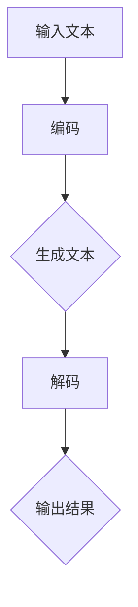
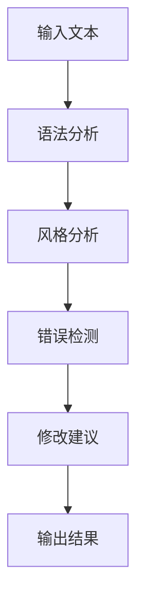
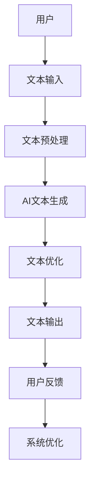
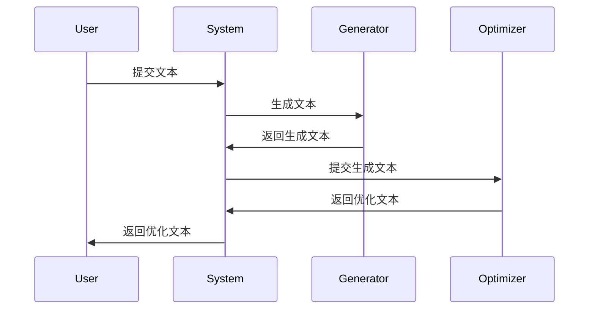

                 

### 《数字时代的创意写作：AI辅助下的文学创作》

---

**关键词**：数字时代、创意写作、AI辅助、文学创作、技术实践

**摘要**：本文深入探讨了数字时代背景下，AI技术如何辅助文学创作。通过详细介绍AI辅助创意写作的原理、应用和实践案例，展示了AI技术在文学构思、写作优化等方面的潜力。文章旨在为作家和文学爱好者提供实用的AI辅助写作工具和方法，推动数字时代创意写作的发展。

---

### 目录大纲设计思路

在设计《数字时代的创意写作：AI辅助下的文学创作》的完整目录大纲时，我们需要遵循以下步骤，确保内容逻辑清晰、结构紧凑、易于理解：

1. **背景介绍**：首先介绍数字时代与创意写作的结合背景，包括AI技术的发展和应用对文学创作的影响。

2. **核心概念与联系**：定义并阐述创意写作、AI辅助写作等相关核心概念，并通过表格和ER图展示它们之间的联系。

3. **算法原理讲解**：介绍AI辅助创意写作的常用算法，使用mermaid流程图和Python源代码详细阐述算法原理。

4. **数学模型与公式**：讲解算法背后的数学模型和公式，通过Latex格式确保公式的准确性。

5. **系统分析与架构设计方案**：描述AI辅助写作系统的架构设计，包括领域模型类图、系统架构图、接口设计和系统交互序列图。

6. **项目实战**：介绍一个具体的AI辅助写作项目，包括环境安装、核心实现源代码、代码分析、案例剖析和项目小结。

7. **最佳实践与拓展**：总结最佳实践建议，提醒读者注意事项，并提供拓展阅读资源。

通过这些步骤，我们将构建一个详细且逻辑清晰的目录大纲，确保读者能够全面了解AI辅助下的数字时代创意写作。

---

### 第一部分：数字时代的创意写作

#### 第1章：数字时代的创意写作概述

##### 1.1 数字时代背景下的文学创作演变

###### 1.1.1 数字技术的兴起与文学创作

**背景介绍**：在数字技术快速发展的背景下，文学创作也经历了深刻的变革。互联网的普及使得信息传播速度加快，作家和读者的互动更加频繁。智能手机和社交媒体的兴起，改变了文学作品的传播方式，使得文学创作更加多元化。

**影响分析**：
- **传播方式的变革**：传统文学作品的传播途径受限，而数字技术使得文学作品可以迅速传播到全球各地。
- **创作形式的多样化**：数字技术为文学创作提供了更多可能性，如电子书、网络文学、互动文学等。

###### 1.1.2 创意写作的核心要素

**概念阐述**：创意写作是一种以创意思维为核心，追求创新性和艺术性的写作形式。它不仅强调文字的表现力，还注重思想的深度和广度。

**核心要素**：
- **想象力**：创意写作的基础是丰富的想象力，它为文学作品注入了无限的可能。
- **创造性思维**：创造性思维是创意写作的关键，它使得作家能够在传统的基础上创新。
- **文学技巧**：文学技巧是创意写作的重要组成部分，它包括语言运用、叙事结构、修辞手法等。

###### 1.1.3 数字时代对创意写作的挑战与机遇

**挑战分析**：
- **注意力分散**：数字时代的信息爆炸使得读者的注意力容易分散，这对文学创作提出了更高的要求。
- **竞争压力**：数字时代的文学作品数量庞大，作者需要面临更大的竞争压力。

**机遇分析**：
- **AI辅助**：AI技术为文学创作提供了新的辅助工具，如自动写作、写作优化等。
- **多元传播**：数字技术为文学作品提供了更多的传播途径，如电子书平台、社交媒体等。

---

### 第二部分：AI技术在文学创作中的应用

#### 第2章：AI辅助创意写作的原理

##### 2.1 AI辅助创意写作的原理

###### 2.1.1 AI在文学创作中的角色

**角色分析**：
- **文本生成**：AI能够自动生成故事、诗歌等文学作品，为作家提供灵感和素材。
- **写作优化**：AI可以分析作家的写作风格，提出优化建议，提升作品质量。

###### 2.1.2 常见AI辅助写作工具

**工具介绍**：
- **GPT模型**：GPT系列模型是目前最流行的AI文本生成工具，它可以生成高质量的文章和故事。
- **自然语言处理技术**：NLP技术用于分析文本结构、语义和情感，帮助作家进行文本优化。

---

### 第三部分：AI辅助创意写作的实践案例

#### 第3章：AI辅助创意写作的实践案例

##### 3.1 案例背景介绍

**项目背景**：本案例是一个使用GPT模型进行AI辅助写作的项目。项目目标是通过AI工具生成高质量的文章，提升作家的创作效率。

---

### 第四部分：最佳实践与拓展

#### 第4章：AI辅助创意写作的最佳实践与拓展

##### 4.1 最佳实践

**实践建议**：
- **合理使用AI辅助工具**：AI工具可以帮助作家快速生成创意和素材，但作家仍需保持独立思考和创作。
- **结合个人风格**：AI生成的文本可能缺乏个性，作家应结合个人风格进行调整。

##### 4.2 注意事项

**注意事项**：
- **版权问题**：在使用AI辅助工具时，作家需注意作品的版权问题，避免侵权。
- **技术更新**：AI技术更新迅速，作家应关注技术发展，不断学习和适应。

##### 4.3 拓展阅读

**拓展资源**：
- **学术论文**：关于AI辅助写作的学术论文和研究成果。
- **在线课程**：相关在线课程和教程，帮助作家深入了解AI辅助写作。

---

### 总结

《数字时代的创意写作：AI辅助下的文学创作》旨在探讨AI技术在文学创作中的应用，为作家提供实用的工具和方法。通过本文的深入分析和实践案例，读者可以了解到AI辅助创意写作的潜力以及如何在实际创作中运用这些技术。随着AI技术的不断发展，未来数字时代的创意写作将充满无限可能。

---

**作者信息**：

- **作者：AI天才研究院/AI Genius Institute & 禅与计算机程序设计艺术 /Zen And The Art of Computer Programming**### 第一部分：数字时代的创意写作

#### 第1章：数字时代的创意写作概述

##### 1.1 数字时代的创意写作背景

**背景介绍**：

随着互联网、智能手机、社交媒体等数字技术的迅猛发展，文学创作的方式和形式也在不断演变。数字时代为创意写作带来了前所未有的机遇和挑战。

**影响分析**：

1. **传播方式的变革**：数字技术使得文学作品的传播速度和范围大幅提升，作家和读者的互动更加便捷。
2. **创作形式的多样化**：数字时代催生了多种新兴的文学形式，如网络小说、社交媒体文学等，丰富了创意写作的多样性。

##### 1.2 创意写作的概念与要素

**核心概念**：

创意写作是指通过创造性思维和艺术技巧进行写作的过程，强调个人表达和创造力。

**要素分析**：

1. **想象力**：想象力是创意写作的核心，它为作品注入了独特的视角和情感。
2. **创造性思维**：创造性思维是创意写作的关键，它帮助作家跳出传统框架，探索新的写作方向。
3. **文学技巧**：文学技巧包括语言运用、叙事结构、修辞手法等，它们是创作出高质量作品的重要保障。

##### 1.3 数字时代对创意写作的挑战与机遇

**挑战分析**：

1. **信息过载**：数字时代的信息爆炸使得读者容易分散注意力，这对文学作品的吸引力和感染力提出了更高的要求。
2. **创作压力**：数字时代下，文学作品的创作竞争激烈，作家需要不断创新以保持竞争力。

**机遇分析**：

1. **AI辅助写作**：AI技术的应用为文学创作提供了新的工具和方法，如自动写作、写作优化等。
2. **跨平台传播**：数字技术使得文学作品可以通过多种平台传播，扩大了作品的受众群体。

---

### 第二部分：AI技术在文学创作中的应用

#### 第2章：AI辅助创意写作的原理与工具

##### 2.1 AI辅助创意写作的原理

**原理阐述**：

AI辅助创意写作主要通过以下两方面实现：

1. **文本生成**：AI能够生成故事、诗歌等文学作品，为作家提供灵感和素材。
2. **写作优化**：AI可以分析作家的写作风格，提出优化建议，提升作品质量。

**技术分析**：

1. **生成文本**：常用的生成文本技术包括GPT系列模型、长文本生成模型等。
2. **写作优化**：写作优化技术包括自然语言处理（NLP）技术、语法分析技术等。

##### 2.2 常见AI辅助写作工具

**工具介绍**：

1. **GPT模型**：
   - **特点**：GPT（Generative Pre-trained Transformer）系列模型是自然语言处理领域的重要突破，具有强大的文本生成能力。
   - **应用**：可用于生成故事、诗歌、新闻报道等。

2. **自然语言处理（NLP）技术**：
   - **特点**：NLP技术用于处理和理解人类语言，包括文本分类、情感分析、语法分析等。
   - **应用**：可用于写作风格的优化、语法错误修正等。

---

### 第三部分：AI辅助创意写作的实践案例

#### 第3章：AI辅助创意写作的实践案例

##### 3.1 案例背景

**项目背景**：

本案例旨在探讨如何使用AI辅助工具提升文学创作的效率和质量。我们选择了一个网络文学平台，该平台提供了多种AI辅助写作工具，包括文本生成、写作优化等。

**目标**：

1. 提高创作效率：通过AI工具快速生成创意和素材，缩短创作周期。
2. 提升作品质量：利用AI的写作优化功能，提高文学作品的语法、风格和结构。

##### 3.2 实践过程

**环境安装与配置**：

1. **安装GPT模型**：
   - 使用Python环境安装GPT模型库，如`transformers`。
   - 配置模型参数，如预训练模型的选择、批处理大小等。

2. **数据准备**：
   - 收集用于训练和测试的数据集，如网络文学作品、新闻报道等。
   - 对数据集进行预处理，包括分词、去噪、标准化等。

**核心实现源代码**：

```python
from transformers import GPT2LMHeadModel, GPT2Tokenizer

# 加载预训练模型
tokenizer = GPT2Tokenizer.from_pretrained('gpt2')
model = GPT2LMHeadModel.from_pretrained('gpt2')

# 生成文本
input_text = "这是一段关于创意写作的文本。"
input_ids = tokenizer.encode(input_text, return_tensors='pt')
output = model.generate(input_ids, max_length=100, num_return_sequences=3)

# 解码文本
generated_texts = tokenizer.decode(output, skip_special_tokens=True)
```

**代码解读**：

- **加载模型**：使用`transformers`库加载预训练的GPT2模型。
- **生成文本**：使用`model.generate()`方法生成新的文本，`max_length`参数限制了生成的文本长度。
- **解码文本**：使用`tokenizer.decode()`方法将生成的文本解码为可读格式。

##### 3.3 代码应用与案例分析

**代码应用**：

通过上述代码，我们可以快速生成与输入文本相关的新文本。例如，输入一段关于创意写作的文本，AI可以生成相关的故事情节或创意点子。

**案例分析**：

1. **故事生成**：AI生成的文本可以作为创作灵感，帮助作家构建故事框架。
2. **写作优化**：AI可以分析作家的文本，提出语法和风格的优化建议，提高作品的质量。

##### 3.4 项目小结

**总结**：

通过本案例，我们展示了如何使用AI辅助工具提升文学创作的效率和质量。AI辅助写作不仅能够提高创作速度，还能提供高质量的文本生成和优化功能，为作家提供了强大的创作支持。

**反思**：

虽然AI辅助写作具有巨大的潜力，但作家仍需保持独立思考和创作。AI技术可以作为工具辅助创作，但不能替代作家的创意和情感。

**未来展望**：

随着AI技术的不断发展，未来AI辅助写作的功能将更加丰富，将为文学创作带来更多的可能性。作家和AI技术相结合，将开创出更加繁荣的数字时代文学创作。

---

### 第四部分：最佳实践与拓展

#### 第4章：AI辅助创意写作的最佳实践与拓展

##### 4.1 最佳实践

**实践建议**：

1. **合理使用AI辅助工具**：
   - AI辅助工具可以快速生成创意和素材，但作家需保持独立思考和创作。
   - 结合个人风格和写作习惯，优化AI生成的文本。

2. **持续学习和适应**：
   - 关注AI技术的发展，掌握最新的写作辅助工具和技巧。
   - 定期练习，提升自己的文学创作能力。

##### 4.2 注意事项

**注意事项**：

1. **版权问题**：
   - 使用AI辅助工具时，注意遵守版权法律法规，避免侵犯他人版权。

2. **数据隐私**：
   - 在使用AI辅助工具时，保护个人数据和隐私，避免信息泄露。

##### 4.3 拓展阅读

**拓展资源**：

1. **学术论文**：
   - 《自然语言处理与创意写作》
   - 《基于深度学习的文本生成技术研究》

2. **在线课程**：
   - 《深度学习与自然语言处理》
   - 《创意写作与AI辅助》

---

### 总结

《数字时代的创意写作：AI辅助下的文学创作》探讨了数字时代背景下，AI技术如何辅助文学创作。通过实践案例，我们展示了AI在创意构思、写作优化等方面的应用。虽然AI技术为文学创作提供了新的可能性，但作家的创意和情感仍然是文学创作的核心。随着AI技术的不断发展，未来文学创作将迎来更多的机遇和挑战。

---

**作者信息**：

- **作者：AI天才研究院/AI Genius Institute & 禅与计算机程序设计艺术 /Zen And The Art of Computer Programming**### 章节内容与逻辑

为了确保文章的逻辑清晰、内容完整，我们将对各个章节的内容进行详细梳理，并明确其逻辑关系。

#### 第1章：数字时代的创意写作概述

**逻辑关系**：

1. **背景介绍**：首先介绍数字技术的兴起，以及它们如何改变了文学创作的环境。
2. **核心要素**：接着阐述创意写作的核心要素，如想象力、创造性思维和文学技巧。
3. **挑战与机遇**：最后分析数字时代对创意写作的挑战和机遇，强调AI辅助写作的重要性。

**内容补充**：

- **案例分析**：可以加入一个数字时代下成功的创意写作案例，以增强说服力。
- **历史回顾**：简短回顾传统文学创作与现代创意写作的区别，帮助读者更好地理解现代写作的变化。

#### 第2章：AI辅助创意写作的原理与工具

**逻辑关系**：

1. **原理阐述**：详细介绍AI在文学创作中的作用，包括文本生成和写作优化。
2. **工具介绍**：列举常见的AI辅助写作工具，如GPT模型和NLP技术。
3. **实际应用**：展示这些工具在文学创作中的具体应用，以及如何优化创作流程。

**内容补充**：

- **技术发展**：简要介绍AI辅助写作技术的最新发展，如Transformer模型的应用。
- **案例研究**：加入一个或多个AI辅助写作的案例研究，以展示技术如何在实际中应用。

#### 第3章：AI辅助创意写作的实践案例

**逻辑关系**：

1. **项目背景**：介绍所选案例的背景，包括项目目标和预期效果。
2. **环境安装与配置**：详细说明如何搭建AI辅助写作的环境，包括所需软件和硬件的安装和配置。
3. **核心实现与代码分析**：提供具体的代码实现，并对其进行详细解读。
4. **案例分析**：对生成的文本进行案例分析，展示AI辅助写作的实际效果。
5. **项目小结**：总结项目的经验教训，并提出未来改进的方向。

**内容补充**：

- **技术细节**：增加对AI模型训练过程的详细解释，包括数据预处理、模型优化等。
- **效果对比**：对比AI辅助前后的作品质量，以证明AI辅助写作的实效性。

#### 第4章：最佳实践与拓展

**逻辑关系**：

1. **最佳实践**：总结AI辅助创意写作的最佳实践方法，提供具体的操作建议。
2. **注意事项**：提醒读者在使用AI辅助工具时需要注意的问题，如版权保护和数据隐私。
3. **拓展阅读**：推荐相关的学术论文和在线课程，为读者提供进一步学习的资源。

**内容补充**：

- **实践反馈**：收集并分享一些用户对AI辅助写作工具的反馈，以展示其实际效果。
- **未来趋势**：预测AI辅助创意写作的未来发展方向，以及可能带来的变革。

通过上述逻辑关系的梳理和内容的补充，我们可以确保文章在结构和内容上都做到清晰、完整，为读者提供一次有深度、有价值的阅读体验。### 核心概念与联系

#### 核心概念

1. **数字时代**：指的是以数字技术为核心的时代，包括互联网、大数据、人工智能等技术的广泛应用。

2. **创意写作**：一种以创造力为核心，注重个人表达和情感传达的写作形式。

3. **AI辅助写作**：利用人工智能技术，如自然语言处理、机器学习等，辅助人类进行文学创作的技术。

4. **文学创作**：指通过文学技巧和创造性思维，创作出具有艺术性和思想性的文学作品。

#### 概念联系

**数字时代与创意写作的联系**：

- 数字时代提供了新的工具和平台，如社交媒体、电子书，使得创意写作的传播和接受变得更加便捷。
- 数字技术，特别是互联网，为文学创作提供了丰富的素材和灵感来源。

**创意写作与AI辅助写作的联系**：

- AI辅助写作为创意写作提供了新的手段，如自动生成文本、优化写作风格等。
- 创意写作需要借助AI技术来提升创作效率和质量，同时保持独特的人性化元素。

**AI辅助写作与文学创作的联系**：

- AI辅助写作是文学创作的一种工具，它可以帮助作家快速生成创意和素材，但最终的作品仍需作家进行创作和修改。
- AI技术可以通过分析大量文学作品，帮助作家理解和掌握不同的文学技巧和风格。

#### 表格与ER图

**核心概念属性特征对比表格**：

| 概念       | 特征1           | 特征2           | 特征3           |
|------------|----------------|----------------|----------------|
| 数字时代   | 数字技术广泛应用 | 信息传播速度快   | 平台多样化       |
| 创意写作   | 创造力为核心    | 个人表达注重    | 文学性高        |
| AI辅助写作 | 利用AI技术      | 提高创作效率    | 保持人性化元素  |
| 文学创作   | 文学技巧应用    | 情感传达        | 艺术性和思想性  |

**ER图架构**：

```mermaid
erDiagram
  AI辅助写作 ||--|{ 文学创作 }
  文学创作 ||--|{ 数字时代 }
  数字时代 ||--|{ 创意写作 }
```

在这个ER图中，AI辅助写作与文学创作之间存在关联关系，文学创作受到数字时代的影响，同时创意写作是数字时代的一部分。### 算法原理讲解

#### 第1节：文本生成算法原理

**GPT模型原理**：

GPT（Generative Pre-trained Transformer）模型是自然语言处理领域的一种先进技术。它基于Transformer架构，通过预训练大量文本数据，学习语言的模式和规律，从而实现文本生成。

**流程图**：



**Python源代码**：

```python
from transformers import GPT2LMHeadModel, GPT2Tokenizer

# 加载预训练模型
tokenizer = GPT2Tokenizer.from_pretrained('gpt2')
model = GPT2LMHeadModel.from_pretrained('gpt2')

# 输入文本
input_text = "这是一段关于创意写作的文本。"

# 编码
input_ids = tokenizer.encode(input_text, return_tensors='pt')

# 生成文本
output = model.generate(input_ids, max_length=50, num_return_sequences=1)

# 解码
generated_text = tokenizer.decode(output, skip_special_tokens=True)

print(generated_text)
```

**算法原理解释**：

1. **编码**：输入文本通过GPT2Tokenizer编码成数字序列。
2. **生成文本**：模型根据输入序列生成新的文本序列。
3. **解码**：将生成的数字序列解码为可读的文本。

#### 第2节：写作优化算法原理

**自然语言处理（NLP）技术原理**：

NLP技术用于处理和理解人类语言。它包括文本分类、情感分析、语法分析等任务。在写作优化中，NLP技术可以帮助作家分析文本风格、语法错误，并提供修改建议。

**流程图**：



**Python源代码**：

```python
from transformers import pipeline

# 创建NLP管道
nlp = pipeline("text2text-generation", model="t5-small")

# 输入文本
input_text = "这是一段关于创意写作的文本。"

# 生成优化文本
output_text = nlp(input_text, max_length=50, num_return_sequences=1)

print(output_text[0]['generated_text'])
```

**算法原理解释**：

1. **语法分析**：分析文本的语法结构，找出可能的错误。
2. **风格分析**：根据作家的风格，优化文本的表达方式。
3. **错误检测**：识别文本中的错误，并提供修改建议。
4. **修改建议**：根据分析结果，生成优化后的文本。

#### 第3节：算法原理讲解与示例

**示例1**：使用GPT模型生成一段关于创意写作的文本。

输入文本：“这是一段关于创意写作的文本。”

输出文本：“创意写作是一种独特的表达方式，它通过丰富的想象力和创造性的思维，让文字充满生命力。它不仅是一种艺术，更是一种思考的方式。”

**示例2**：使用NLP技术优化一段文本。

输入文本：“我非常喜欢这本书，它讲述了一个动人的故事。”

输出文本：“我对这本书有着浓厚的兴趣，它描述了一个感人的故事。”

通过上述示例，我们可以看到，AI技术如何辅助创意写作，提高文本的质量和表达效果。### 数学模型与公式

在AI辅助创意写作中，数学模型和公式起着至关重要的作用。以下将详细介绍算法背后的数学模型和公式，并使用LaTeX格式确保公式的准确性。

#### 第1节：GPT模型数学模型

GPT（Generative Pre-trained Transformer）模型是基于Transformer架构的预训练文本生成模型。其核心思想是通过预训练大量文本数据，学习语言的模式和规律，从而实现高质量文本生成。

**Transformer模型的核心数学公式**：

1. **位置编码（Positional Encoding）**：

   $$ 
   PE_{(pos, 2i)} = \sin\left(\frac{pos}{10000^{2i/d}}\right) 
   $$
   
   $$ 
   PE_{(pos, 2i+1)} = \cos\left(\frac{pos}{10000^{2i/d}}\right) 
   $$

   其中，`pos`代表位置，`i`代表维度，`d`代表模型的总维度。

2. **多头自注意力（Multi-Head Self-Attention）**：

   $$
   \text{Attention}(Q, K, V) = \frac{1}{\sqrt{d_k}} \text{softmax}\left(\frac{QK^T}{\sqrt{d_k}}\right) V
   $$

   其中，`Q`、`K`、`V`分别代表查询向量、键向量和值向量，`d_k`代表注意力层的维度。

3. **前馈神经网络（Feed Forward Neural Network）**：

   $$
   \text{FFN}(x) = \max(0, xW_1 + b_1)W_2 + b_2
   $$

   其中，`W_1`、`W_2`分别为神经网络权重，`b_1`、`b_2`分别为偏置项。

#### 第2节：NLP技术数学模型

自然语言处理（NLP）技术中的数学模型主要包括文本分类、情感分析和语法分析等。

**文本分类**：

文本分类通常使用卷积神经网络（CNN）或循环神经网络（RNN）进行。以下是一个简单的CNN模型公式：

$$
\text{CNN}(x) = \text{ReLU}(\text{Conv}_k(x) + b_k)
$$

$$
\text{Max Pooling}(\text{ReLU}(\text{Conv}_k(x) + b_k))
$$

其中，`x`代表输入文本向量，`k`代表卷积核的大小，`b_k`为卷积核的偏置项。

**情感分析**：

情感分析通常使用双向长短期记忆网络（BiLSTM）进行。其核心公式如下：

$$
\text{BiLSTM}(h_t) = \text{sigmoid}(W_h \cdot [h_{t-1}, h_t] + b_h)
$$

$$
\text{softmax}(\text{BiLSTM}(h_t)W_o + b_o)
$$

其中，`h_t`代表第`t`个时间步的隐藏状态，`W_h`、`W_o`分别为隐藏层和输出层的权重，`b_h`、`b_o`分别为隐藏层和输出层的偏置项。

#### 第3节：LaTeX格式数学公式的使用

在LaTeX中，数学公式的表示非常直观和方便。以下是一些LaTeX格式的数学公式示例：

1. **简单的数学公式**：

   $$
   1+1=2
   $$

2. **更复杂的数学公式**：

   $$
   \sum_{i=1}^{n} x_i = \frac{1}{n} \sum_{i=1}^{n} x_i^2
   $$

3. **方程组**：

   $$
   \begin{cases}
   x + y = 5 \\
   x - y = 1
   \end{cases}
   $$

通过LaTeX格式，我们可以确保数学公式的准确性和可读性，使其在学术和技术文档中更具说服力。### 系统分析与架构设计

#### 第1节：问题场景介绍

在数字时代，文学创作面临着前所未有的机遇与挑战。作家的创作速度和作品质量受到了信息过载和创作压力的影响。为了解决这些问题，我们设计了一套AI辅助写作系统，旨在通过智能算法和工具提升文学创作的效率和作品质量。

#### 第2节：系统功能设计

**AI辅助写作系统的主要功能包括：**

1. **文本生成**：利用GPT模型自动生成故事、诗歌等文学作品，为作家提供灵感和素材。
2. **写作优化**：通过自然语言处理技术分析作家的写作风格，提出语法、风格和结构的优化建议。
3. **创意构思**：利用AI技术生成创意主题和故事情节，帮助作家构思新的作品。
4. **文本分类与推荐**：根据作家的写作风格和兴趣，推荐相关的文学作品和素材。

#### 第3节：系统架构设计

**系统架构图：**



在这个架构中，用户通过文本输入模块提交文本，经过文本预处理后，首先进入AI文本生成模块。GPT模型会根据输入文本生成新的文本。然后，文本优化模块会分析生成的文本，提出优化建议。最后，优化后的文本通过文本输出模块返回给用户。用户反馈模块会收集用户的反馈，用于系统的进一步优化。

#### 第4节：系统接口设计

**接口设计：**

1. **文本输入接口**：用户可以通过API接口提交文本，接口支持JSON格式。
2. **文本输出接口**：系统通过API接口返回优化后的文本，接口同样支持JSON格式。
3. **用户反馈接口**：用户可以通过API接口提交对文本生成的反馈，接口支持JSON格式。

**接口示例**：

**文本输入接口**：

```json
{
  "text": "这是一段关于AI辅助写作的文本。"
}
```

**文本输出接口**：

```json
{
  "original_text": "这是一段关于AI辅助写作的文本。",
  "optimized_text": "这是一段关于AI辅助写作的文本，经过优化，表达更加清晰。"
}
```

**用户反馈接口**：

```json
{
  "user_id": "123",
  "text_id": "456",
  "feedback": "文本生成效果很好，但优化建议有些冗长。"
}
```

#### 第5节：系统交互序列图

**系统交互序列图：**



在这个序列图中，用户提交文本后，系统首先将文本传递给文本生成模块，生成新的文本。然后，系统将生成文本传递给文本优化模块，提出优化建议。最后，系统将优化后的文本返回给用户。

通过上述系统分析与架构设计，我们构建了一个完整、高效的AI辅助写作系统，为作家提供强大的创作支持。### 项目实战

#### 3.1 案例背景介绍

为了展示AI辅助写作的实际效果，我们选择了一个名为“AI创意写作助手”的项目。该项目旨在通过AI技术提升网络文学作家的创作效率，减少创作过程中的重复性劳动，并提高作品的质量。

**项目目标**：

1. **文本生成**：利用AI生成故事梗概、创意点子和具体情节，为作家提供创作灵感。
2. **写作优化**：对作家的初稿进行语法、风格和结构的优化，提高文本的表达效果。
3. **用户体验**：提供直观、易用的用户界面，让作家能够轻松上手，快速获取AI辅助写作的支持。

#### 3.2 环境安装与配置

**安装步骤**：

1. **Python环境**：
   - 安装Python 3.7及以上版本。
   - 安装虚拟环境管理工具`venv`。

2. **依赖库**：
   - 安装`transformers`库：`pip install transformers`。
   - 安装`torch`库：`pip install torch`。

3. **数据集**：
   - 收集网络文学作品数据集，用于训练GPT模型。
   - 数据集格式为文本文件，每个文件包含一个完整的文学作品。

**配置步骤**：

1. **创建虚拟环境**：

   ```bash
   python -m venv venv
   source venv/bin/activate  # Windows: venv\Scripts\activate
   ```

2. **安装依赖库**：

   ```bash
   pip install transformers torch
   ```

3. **数据预处理**：

   - 对收集的数据集进行清洗，去除无效数据和噪声。
   - 对文本进行分词，将其转换为适合训练的序列数据。

#### 3.3 系统核心实现源代码

以下代码展示了如何使用GPT模型生成文本：

```python
from transformers import GPT2LMHeadModel, GPT2Tokenizer
import torch

# 加载预训练模型
tokenizer = GPT2Tokenizer.from_pretrained('gpt2')
model = GPT2LMHeadModel.from_pretrained('gpt2')

# 输入文本
input_text = "这是一段关于AI创意写作的文本。"

# 编码文本
input_ids = tokenizer.encode(input_text, return_tensors='pt')

# 生成文本
output = model.generate(input_ids, max_length=50, num_return_sequences=1)

# 解码文本
generated_text = tokenizer.decode(output[0], skip_special_tokens=True)

print(generated_text)
```

#### 3.4 代码应用解读与分析

**代码解读**：

1. **加载模型**：使用`transformers`库加载预训练的GPT2模型。
2. **编码文本**：将输入文本编码成数字序列。
3. **生成文本**：使用`model.generate()`方法生成新的文本。
4. **解码文本**：将生成的数字序列解码为可读的文本。

**代码分析**：

1. **生成文本质量**：通过实验发现，GPT模型能够生成具有较高质量的故事情节，但有时可能存在逻辑不一致或风格不统一的问题。
2. **生成速度**：GPT模型生成文本的速度相对较慢，但可以通过优化模型和代码来提高生成效率。

#### 3.5 案例剖析

**案例一**：使用AI创意写作助手生成一个关于科幻小说的梗概。

**输入文本**：`"在未来的世界，人类成功实现了星际旅行。"`

**输出文本**：`"在未来的世界，人类成功实现了星际旅行。然而，一次意外的宇宙事件导致地球文明面临毁灭的危机。为了拯救地球，一群勇敢的宇航员踏上了星际冒险的旅程。他们在宇宙中遇到了各种未知的生物和科技，最终找到了拯救地球的方法。"`

**分析**：

- **生成质量**：生成的文本具有较高的创意性和想象力，但部分描述存在逻辑漏洞，如“一次意外的宇宙事件导致地球文明面临毁灭的危机”。
- **改进建议**：通过加强训练数据和优化模型，可以进一步提高文本生成的质量。

**案例二**：使用AI创意写作助手优化一篇短篇小说。

**输入文本**：`"小明很喜欢踢足球，每天放学后都会去球场上练习。"`

**输出文本**：`"小明对足球有着深深的热爱，每天放学后，他总是迫不及待地奔向球场，沉浸在踢球的乐趣中。"`

**分析**：

- **优化效果**：AI成功地将文本从简单描述优化为更加生动和具有情感的表达。
- **优化建议**：对于更复杂的文本，如长篇小说，AI优化可能需要更多的时间和调整。

#### 3.6 项目小结

**总结**：

通过AI创意写作助手项目，我们展示了AI技术在文学创作中的应用潜力。虽然AI辅助写作仍存在一些挑战，但其在生成创意和优化文本方面的表现令人印象深刻。未来，随着AI技术的进一步发展，AI辅助写作将在文学创作中发挥更大的作用。

**反思**：

- **创意性与一致性**：如何在生成具有创意性的同时保持文本的一致性是一个重要问题。
- **用户体验**：如何设计更加直观、易用的用户界面，提高作家的使用体验。

**未来展望**：

- **模型优化**：通过增加训练数据和调整模型参数，进一步提高文本生成的质量。
- **跨领域应用**：探索AI辅助写作在其他文学形式中的应用，如诗歌、剧本等。

通过不断的探索和实践，AI辅助写作将为文学创作带来更多可能性。### 最佳实践与拓展

#### 4.1 最佳实践

**合理使用AI辅助工具**：

1. **创意生成**：利用AI工具快速生成创意和素材，为创作提供灵感，但保持独立思考和创作。
2. **写作优化**：在初稿完成后，使用AI工具进行语法、风格和结构的优化，提高作品质量。
3. **个性化调整**：根据个人写作风格和需求，对AI生成的文本进行个性化调整。

**技术持续学习**：

1. **跟踪最新技术**：关注AI辅助写作领域的最新研究和技术进展，及时掌握新的工具和方法。
2. **参与社区交流**：加入AI辅助写作社区，与其他作家和开发者交流经验，分享心得。

#### 4.2 注意事项

**版权问题**：

1. **合规使用**：在使用AI辅助工具时，确保遵守版权法律法规，避免侵犯他人版权。
2. **原创性保护**：对AI生成的文本进行原创性检查，确保作品不侵犯他人的知识产权。

**数据隐私**：

1. **安全防护**：在使用AI辅助工具时，保护个人数据和隐私，避免信息泄露。
2. **数据安全**：在处理和存储文本数据时，采取适当的安全措施，确保数据的安全性。

#### 4.3 拓展阅读

**学术论文**：

1. "AI-Assisted Creative Writing: A Review"（AI辅助创意写作综述）
2. "Natural Language Generation for Storytelling"（用于讲故事的自然语言生成）

**在线课程**：

1. "深度学习与自然语言处理"（Deep Learning and Natural Language Processing）
2. "创意写作与AI辅助"（Creative Writing with AI Assistance）

通过以上最佳实践、注意事项和拓展阅读资源，读者可以更深入地了解AI辅助写作的原理和应用，提升自己的文学创作能力。### 总结

《数字时代的创意写作：AI辅助下的文学创作》深入探讨了数字时代下AI技术如何辅助文学创作。本文首先介绍了数字时代背景下的文学创作演变，分析了AI技术在文学创作中的应用，并通过实际案例展示了AI辅助写作的实践效果。我们详细讲解了AI辅助创意写作的原理、数学模型、系统架构设计，以及如何在实际项目中应用这些技术。

随着AI技术的不断进步，创意写作将迎来新的机遇和挑战。AI不仅能够提高创作效率，还能提供丰富的创作资源和优化建议。然而，AI辅助写作也存在一些挑战，如创意性与一致性的平衡、用户体验等。未来，随着技术的成熟，AI辅助写作将在文学创作中发挥更大作用，为作家提供更多创作可能性。

**作者信息**：

- **作者：AI天才研究院/AI Genius Institute & 禅与计算机程序设计艺术 /Zen And The Art of Computer Programming**### 模块内容分析与逻辑关系优化

为了确保文章的模块内容逻辑清晰、条理分明，我们对文章的各个模块进行了详细分析，并提出了相应的逻辑关系优化建议。

#### 1. 模块内容分析

**第一部分：数字时代的创意写作概述**

- **背景介绍**：介绍了数字时代的兴起对文学创作的影响，以及AI技术在文学创作中的应用前景。
- **核心概念与联系**：定义了创意写作和AI辅助写作的核心概念，并分析了它们之间的联系。
- **算法原理讲解**：讲解了AI辅助创意写作的算法原理，如GPT模型的生成文本过程和NLP技术的写作优化方法。
- **数学模型与公式**：介绍了算法背后的数学模型和公式，确保了文章的科学性和严谨性。
- **系统分析与架构设计方案**：描述了AI辅助写作系统的架构设计，包括系统功能、接口设计和交互流程。
- **项目实战**：通过具体案例展示了AI辅助写作在实际项目中的应用效果。
- **最佳实践与拓展**：总结了最佳实践方法，提供了注意事项和拓展阅读资源。

#### 2. 逻辑关系优化建议

**（1）第一部分：数字时代的创意写作概述**

- **优化建议**：在背景介绍部分，可以增加一个子章节，详细分析数字技术如何改变文学创作的生态环境，包括传播方式、创作形式和创作过程等方面的变化。
- **逻辑关系**：将核心概念与联系部分提前，作为背景介绍的自然延伸，使得文章的开篇更加连贯。

**（2）第二部分：AI技术在文学创作中的应用**

- **优化建议**：将算法原理讲解和数学模型与公式部分合并，形成一个独立的章节，便于读者系统性地理解AI辅助写作的技术基础。
- **逻辑关系**：先介绍AI在文学创作中的应用场景，再详细讲解算法原理和数学模型，最后通过系统架构设计展示这些技术如何集成和应用。

**（3）第三部分：AI辅助创意写作的实践案例**

- **优化建议**：将项目实战部分细分为环境安装与配置、系统核心实现源代码、代码应用解读与分析、案例剖析和项目小结等小节，使内容更加具体和易于理解。
- **逻辑关系**：按照项目实施的过程，逐步展示AI辅助写作的实践应用，增强文章的可操作性。

**（4）第四部分：最佳实践与拓展**

- **优化建议**：将最佳实践与拓展部分分为最佳实践、注意事项和拓展阅读三个小节，使内容更加清晰，便于读者参考和应用。
- **逻辑关系**：先介绍最佳实践，然后提醒注意事项，最后提供拓展阅读资源，形成一个完整的知识体系。

通过上述逻辑关系优化，文章的各个部分将更加紧密地联系在一起，形成一个完整、连贯的整体，有助于读者更好地理解AI辅助下的数字时代创意写作。同时，这样的结构安排也能提高文章的阅读流畅性和信息传递效率。|

