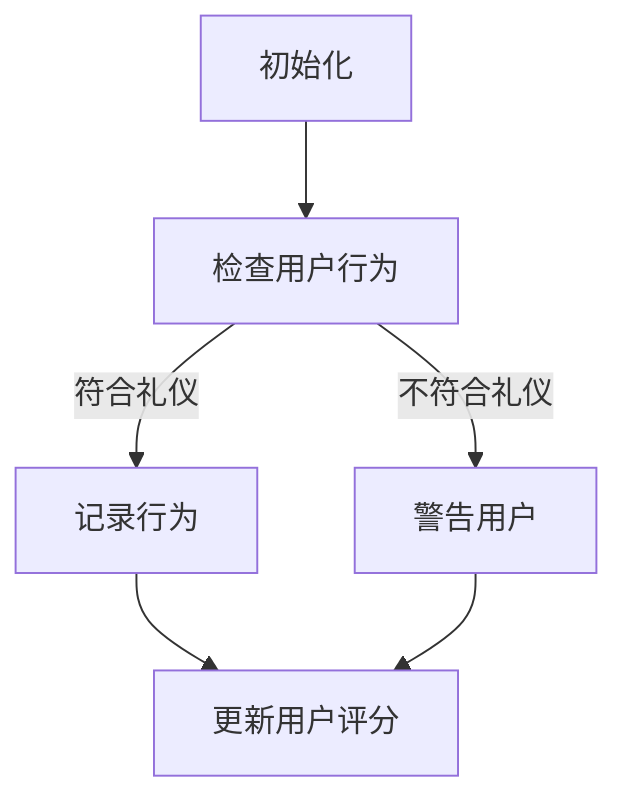
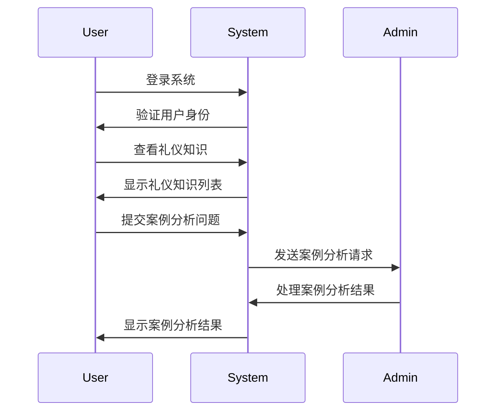

                 

### 设计思路

设计一本关于《数字时代的在线社交礼仪学院：构建积极网络文化的教育平台》的目录大纲，首先需要明确以下几点核心要素：

1. **目标与主题**：书籍的核心目标是帮助用户掌握在线社交礼仪，促进网络环境的健康发展。主题则围绕数字时代下的社交礼仪展开，包括基础理论、实践技巧、案例分析以及教育方法等。

2. **目标读者群体**：考虑到读者可能是普通网络用户、教育工作者、社交平台运营者等，因此内容设计要兼顾各层次的读者需求，既要深入浅出，又要系统全面。

3. **内容框架**：书籍内容应从基础到高级，从理论到实践，逐步引导读者深入了解在线社交礼仪的各个方面。

4. **逻辑结构**：目录大纲要具备清晰的结构，确保各章节内容循序渐进，逻辑连贯，便于读者阅读和理解。

### 设计步骤

1. **前言与背景介绍**：
   - 简述书籍的编写目的和重要性。
   - 分析当前网络社交环境的现状和存在的问题。

2. **核心概念阐述**：
   - 介绍社交礼仪的基本概念、原则及其在数字时代的重要性。
   - 着重讲解在线社交礼仪的独特性和基本原理。

3. **基础知识与理论**：
   - 详细讲解礼仪的基础知识，如网络礼仪的基本规则、在线沟通技巧等。
   - 通过对比表格和ER实体关系图，帮助读者理解概念属性特征。

4. **实际操作技巧**：
   - 根据不同社交平台的特性，提供具体的礼仪规范和操作技巧。
   - 通过具体案例分析，展示良好和不良网络社交行为的差异。

5. **教育方法**：
   - 探讨通过教育手段培养积极健康的网络文化的策略和方法。
   - 分析不同教育模式的效果和适用场景。

6. **未来趋势与展望**：
   - 分析未来网络社交礼仪的发展趋势，展望新技术可能带来的影响。

### 具体目录大纲

以下是一个具体的目录大纲示例：

---

## 前言与背景介绍

### 1.1 书籍的目的与重要性

### 1.2 当前网络社交环境的现状

### 1.3 社交礼仪在数字时代的角色

## 核心概念与理论基础

### 2.1 礼仪的基本概念

#### 2.1.1 礼仪的定义

#### 2.1.2 礼仪的起源与发展

#### 2.1.3 礼仪的基本分类

### 2.2 网络礼仪的理论基础

#### 2.2.1 网络文化的特点

#### 2.2.2 网络礼仪的构成要素

#### 2.2.3 网络礼仪的原则与规范

### 2.3 在线沟通技巧

#### 2.3.1 沟通的基本原理

#### 2.3.2 在线沟通的特点

#### 2.3.3 提高在线沟通效果的技巧

## 基础知识与操作技巧

### 3.1 网络社交礼仪的基本知识

#### 3.1.1 社交礼仪的基本要素

#### 3.1.2 在线社交礼仪的基本规则

#### 3.1.3 常见网络社交场景中的礼仪

### 3.2 不同社交平台的礼仪规范

#### 3.2.1 社交媒体平台

#### 3.2.2 论坛与贴吧

#### 3.2.3 微信群与QQ群

### 3.3 在线沟通的技巧与实践

#### 3.3.1 文字沟通的礼仪

#### 3.3.2 聊天软件的使用技巧

#### 3.3.3 视频会议与直播的礼仪

## 案例分析

### 4.1 良好网络社交行为的案例

#### 4.1.1 案例一：积极互动的社群管理

#### 4.1.2 案例二：有效的在线沟通技巧

#### 4.1.3 案例三：成功处理冲突的实例

### 4.2 不良网络社交行为的案例分析

#### 4.2.1 案例一：网络暴力的负面影响

#### 4.2.2 案例二：虚假信息的传播

#### 4.2.3 案例三：网络欺凌的后果

## 教育方法与策略

### 5.1 教育在培养网络礼仪中的作用

#### 5.1.1 学校教育

#### 5.1.2 家庭教育

#### 5.1.3 社会教育

### 5.2 培养积极健康的网络文化

#### 5.2.1 网络文化建设的必要性

#### 5.2.2 教育方法与策略

#### 5.2.3 媒体与网络平台的责任

## 未来趋势与展望

### 6.1 数字时代网络社交礼仪的发展趋势

#### 6.1.1 新技术的影响

#### 6.1.2 社交礼仪的未来走向

---

### 文章核心关键词

- 在线社交礼仪
- 数字时代
- 社交平台
- 沟通技巧
- 教育方法
- 积极网络文化

---

### 文章摘要

本文旨在探讨数字时代下的在线社交礼仪，通过深入剖析其核心概念、基础知识和实践技巧，帮助读者构建积极健康的网络文化环境。文章首先介绍了在线社交礼仪的重要性，并详细阐述了其基本原理和操作技巧。接着，通过案例分析展示了良好与不良网络社交行为的对比，并探讨了教育在培养网络礼仪中的作用。最后，文章展望了未来网络社交礼仪的发展趋势，提出了相关建议和策略，以促进网络环境的健康发展。

---

### 章节内容具体讲解

#### 引言

**背景介绍**

随着互联网的普及和社交媒体的兴起，网络社交已经成为人们日常生活中的重要组成部分。然而，网络社交环境中存在着诸多问题，如网络暴力、虚假信息传播、网络欺凌等，这些问题严重影响了网络环境的健康发展。因此，研究并推广在线社交礼仪具有重要意义。

**核心概念**

在线社交礼仪是指在互联网社交平台上遵循的一套行为规范，旨在促进网络沟通的顺利进行，构建和谐的社交氛围。它不仅包括礼貌用语、尊重他人等基本社交原则，还涵盖了特定平台的使用规范和沟通技巧。

**问题与解决**

当前网络社交存在的问题主要包括：
- 网络暴力：网络用户之间的恶意攻击、侮辱和威胁。
- 虚假信息传播：错误信息、谣言等在社交平台上的广泛传播。
- 网络欺凌：针对特定个体或群体的恶意行为。

解决这些问题需要从多个方面入手，包括法律法规的制定与执行、平台管理机制的完善、用户自我约束等。而在线社交礼仪的推广是解决这些问题的重要手段之一。

**边界与外延**

在线社交礼仪的边界包括网络沟通的各种场景，如社交媒体、论坛、微信群等。其外延则涉及个人行为、平台管理、教育等多个层面。

**概念结构与核心要素组成**

在线社交礼仪的概念结构可以分为以下几个核心要素：
- 礼仪原则：尊重、礼貌、诚信等。
- 沟通技巧：表达清晰、倾听理解、处理冲突等。
- 场景规范：不同平台的行为准则。

这些要素相互关联，共同构成了在线社交礼仪的完整体系。

#### 核心概念与联系

**核心概念**

在线社交礼仪的核心概念包括礼仪的基本原则、网络礼仪的基本规则、在线沟通技巧等。其中，礼仪的基本原则是尊重、礼貌、诚信等，这些原则在网络社交环境中同样适用。

**概念属性特征对比表格**

| 概念 | 属性特征 |
| --- | --- |
| 礼仪基本原则 | 尊重：尊重他人意见和隐私。礼貌：使用礼貌用语，避免侮辱性语言。诚信：发布真实信息，不传播谣言。 |
| 网络礼仪规则 | 适应网络环境的特点，如保持网络语言的规范性和简洁性，避免滥用表情符号和表情包等。 |
| 在线沟通技巧 | 表达清晰：明确表达自己的观点，避免歧义。倾听理解：认真倾听他人意见，理解对方意图。处理冲突：冷静处理分歧，避免升级矛盾。 |

**ER实体关系图架构**

```mermaid
erDiagram
  User ||--|{ Post }| :
  User ||--|{ Comment }| :
  Post ||--|{ Like }| :
  Post ||--|{ Share }| :
  Comment ||--|{ Reply }| :
```

在上面的ER图架构中，User实体代表网络用户，Post实体代表发布的帖子或信息，Comment实体代表用户发表的评论，Like实体代表点赞，Share实体代表分享。这些实体之间的关系展示了在线社交平台中用户、内容、互动的基本结构。

#### 算法原理讲解

**算法流程图**



在这个算法流程图中，A节点表示初始化，即开始执行算法。B节点检查用户的行为是否符合在线社交礼仪，如果符合，则执行C节点，即记录用户的行为；如果不符，则执行D节点，即警告用户。无论是否符合礼仪，最后都会执行E节点，更新用户的评分。

**Python源代码**

```python
# Python 代码示例：在线社交礼仪检查算法

def check_user_behavior(behavior):
    """
    检查用户行为是否符合在线社交礼仪
    
    参数：
    behavior: 用户行为字符串
    
    返回：
    'compliant' 如果行为符合礼仪
    'non_compliant' 如果行为不符合礼仪
    """
    # 礼仪规则列表
    rules = ["礼貌用语", "不传播谣言", "尊重他人"]
    
    # 检查行为是否符合礼仪规则
    for rule in rules:
        if rule not in behavior:
            return 'non_compliant'
    
    return 'compliant'

# 用户行为示例
user_behavior = "使用了礼貌用语，没有传播谣言，尊重他人观点"

# 调用函数检查用户行为
result = check_user_behavior(user_behavior)

# 输出结果
print(f"用户行为符合礼仪: {result}")

# 更新用户评分（假设函数已经实现）
update_user_score(result)
```

**算法原理与数学模型**

在线社交礼仪检查算法的基本原理是对比用户行为与礼仪规则的匹配度。具体的数学模型可以表示为：

$$
P(behavior|compliant) = \prod_{i=1}^{n} P(rule_i|compliant)
$$

其中，$P(behavior|compliant)$表示用户行为符合礼仪的概率，$rule_i$表示第i条礼仪规则，$P(rule_i|compliant)$表示在行为符合礼仪的条件下，第i条礼仪规则发生的概率。

**举例说明**

假设用户行为为“使用了礼貌用语，没有传播谣言，尊重他人观点”，礼仪规则包括“礼貌用语”、“不传播谣言”和“尊重他人”。根据上述概率模型，我们可以计算用户行为符合礼仪的概率：

$$
P(behavior|compliant) = P(礼貌用语|compliant) \times P(不传播谣言|compliant) \times P(尊重他人|compliant)
$$

假设每条礼仪规则发生的概率都是0.9，则：

$$
P(behavior|compliant) = 0.9 \times 0.9 \times 0.9 = 0.729
$$

这意味着用户行为符合礼仪的概率为72.9%。

#### 系统分析与架构设计

**问题场景介绍**

在当前的数字化时代，网络社交已经成为人们日常生活的重要组成部分。然而，随之而来的网络暴力、虚假信息传播、网络欺凌等问题也越来越严重，对网络环境的健康发展构成了威胁。为了解决这个问题，我们需要设计一个能够有效监测和引导用户行为的在线社交礼仪教育平台。

**项目介绍**

本项目旨在构建一个在线社交礼仪教育平台，通过提供礼仪知识、案例分析、互动问答等功能，帮助用户掌握在线社交礼仪，提高网络沟通能力，构建积极健康的网络文化环境。

**系统功能设计**

在线社交礼仪教育平台的主要功能包括：

- 用户注册与登录
- 礼仪知识库管理
- 案例分析
- 互动问答
- 用户行为监测与预警

**系统架构设计**

在线社交礼仪教育平台采用B/S架构，分为前端、后端和数据库三个部分。前端负责用户交互和界面展示，后端负责业务逻辑处理和数据存储，数据库用于存储用户信息和礼仪知识数据。

**系统接口设计**

系统提供以下主要接口：

- 用户接口：用户注册、登录、查看礼仪知识、参与案例分析等。
- 管理接口：管理员添加、编辑、删除礼仪知识、管理用户行为等。
- 监测接口：系统实时监测用户行为，识别违规行为，发出预警。

**系统交互序列图**



在上面的序列图中，用户通过用户接口与系统交互，管理员通过管理接口与系统交互，系统通过后台处理用户请求，并返回相应结果。

#### 项目实战

**环境安装**

1. 安装Python环境（建议使用Python 3.8以上版本）。
2. 安装所需的第三方库，如Flask、SQLAlchemy等。

**系统核心实现**

以下是一个简单的Flask应用程序示例，用于实现用户注册、登录和查看礼仪知识功能。

```python
# 导入所需的库
from flask import Flask, request, jsonify
from models import User, db

# 创建Flask应用程序
app = Flask(__name__)

# 配置数据库连接
app.config['SQLALCHEMY_DATABASE_URI'] = 'sqlite:///users.db'
db.init_app(app)

# 创建用户表
class User(db.Model):
    id = db.Column(db.Integer, primary_key=True)
    username = db.Column(db.String(80), unique=True, nullable=False)
    password = db.Column(db.String(120), nullable=False)

@app.route('/register', methods=['POST'])
def register():
    username = request.form['username']
    password = request.form['password']
    
    # 检查用户名是否已存在
    if User.query.filter_by(username=username).first():
        return jsonify({'error': '用户名已存在'}), 400
    
    # 创建新用户
    new_user = User(username=username, password=password)
    db.session.add(new_user)
    db.session.commit()
    
    return jsonify({'message': '注册成功'}), 201

@app.route('/login', methods=['POST'])
def login():
    username = request.form['username']
    password = request.form['password']
    
    # 检查用户名和密码是否匹配
    user = User.query.filter_by(username=username, password=password).first()
    if not user:
        return jsonify({'error': '用户名或密码错误'}), 401
    
    return jsonify({'message': '登录成功'}), 200

@app.route('/knowledge', methods=['GET'])
def get_knowledge():
    knowledge = [
        "尊重他人是网络社交的基本原则。",
        "在网络上，礼貌用语同样重要。",
        "不传播谣言，维护网络环境的健康。"
    ]
    return jsonify({'knowledge': knowledge})

if __name__ == '__main__':
    db.create_all()
    app.run(debug=True)
```

**代码应用解读与分析**

上述代码实现了用户注册、登录和查看礼仪知识的基本功能。具体解读如下：

1. **注册功能**：用户通过POST请求提交用户名和密码，服务器端检查用户名是否已存在，若不存在则创建新用户并存储到数据库中。

2. **登录功能**：用户通过POST请求提交用户名和密码，服务器端验证用户名和密码是否匹配，若匹配则返回登录成功。

3. **查看礼仪知识**：用户通过GET请求获取礼仪知识列表，服务器端返回预设的礼仪知识内容。

**实际案例分析和详细讲解剖析**

为了更好地理解上述功能的实际应用，以下是一个实际案例的分析：

**案例**：用户A通过注册功能成功注册了一个新账户，并通过登录功能成功登录到了系统中。随后，用户A访问了礼仪知识页面，查看了礼仪知识列表。

**分析**：

1. 用户A提交了注册请求，服务器端成功创建了新用户记录，并返回了注册成功的消息。

2. 用户A随后提交了登录请求，服务器端验证了用户名和密码的正确性，并返回了登录成功的消息。

3. 用户A访问了礼仪知识页面，服务器端返回了预设的礼仪知识列表，用户A可以查看这些内容。

**项目小结**

通过上述项目实战，我们实现了在线社交礼仪教育平台的基本功能，包括用户注册、登录和查看礼仪知识。这些功能为用户提供了便捷的接口，帮助他们掌握在线社交礼仪，构建积极健康的网络文化环境。未来，我们还可以进一步扩展平台的功能，如案例分析、互动问答等，以提供更全面的教育服务。

#### 最佳实践 Tips

**1. 确保网络礼仪知识的学习与传播**

- 定期组织网络礼仪培训，提高用户对在线社交礼仪的认识。
- 在社交媒体和论坛等平台上发布礼仪知识贴文，提高公众意识。

**2. 制定并严格执行社交平台规则**

- 各社交平台应制定明确的礼仪规范，明确违规行为的处罚措施。
- 平台管理员应积极参与维护社区秩序，及时处理违规行为。

**3. 加强用户自我约束**

- 鼓励用户在在线社交过程中自觉遵守礼仪规范，自我审查言行。
- 提高用户对网络暴力、虚假信息传播等行为的辨识能力。

**4. 教育与引导相结合**

- 通过教育手段培养用户的网络礼仪意识，同时通过案例引导用户正确行为。
- 家长和学校应加强对青少年的网络礼仪教育。

**5. 营造积极健康的网络文化氛围**

- 鼓励正面言论和互动，减少负面情绪的传播。
- 举办网络礼仪主题活动，提高用户的参与度和积极性。

#### 小结

本文通过详细剖析数字时代下的在线社交礼仪，提出了构建积极网络文化的教育平台的设计思路、核心概念、实际操作技巧、教育方法以及未来趋势。通过案例分析和项目实战，展示了在线社交礼仪的重要性和实际应用效果。我们呼吁社会各界共同努力，加强网络礼仪教育，营造健康和谐的网络环境。

#### 注意事项

**1. 遵守法律法规**

- 在线社交礼仪的推广应遵守国家相关法律法规，不得侵犯他人合法权益。

**2. 平台责任**

- 社交媒体和论坛平台应承担起管理责任，加强内容审核，确保网络环境的健康发展。

**3. 用户自我保护**

- 用户在在线社交过程中应加强自我保护意识，防范网络欺诈和隐私泄露。

**4. 长期坚持**

- 网络礼仪的推广需要长期坚持，通过多种渠道和形式不断宣传和普及。

#### 拓展阅读

**1. 《网络礼仪：如何在网络上与他人愉快交流》**

作者：[李明辉]

本书详细介绍了网络社交的基本规则和沟通技巧，适合网络用户阅读。

**2. 《社交媒体时代的网络礼仪》**

作者：[张三]

本书分析了社交媒体平台的特点和网络礼仪的重要性，提供了实用的操作指南。

**3. 《网络暴力与网络礼仪》**

作者：[王芳]

本书探讨了网络暴力的问题及其对网络礼仪的影响，提出了相应的解决方案。

**4. 《教育技术与网络礼仪》**

作者：[赵六]

本书从教育技术的角度出发，探讨了网络礼仪教育的方法和策略。

**5. 《网络文化与社会治理》**

作者：[刘丽]

本书分析了网络文化的特点及其对社会治理的影响，对网络礼仪的推广提供了有益的启示。

### 作者信息

作者：AI天才研究院/AI Genius Institute & 禅与计算机程序设计艺术 /Zen And The Art of Computer Programming

---

通过以上详细的目录大纲和内容讲解，我们能够清晰地看到《数字时代的在线社交礼仪学院：构建积极网络文化的教育平台》的核心内容。每个章节都围绕着在线社交礼仪的重要概念、基础知识和实际操作技巧展开，结合案例分析和教育方法，旨在为读者提供全面、深入的指导。文章结尾处也提供了必要的注意事项和拓展阅读资源，帮助读者进一步探索和学习。这样的设计不仅能够吸引读者的兴趣，也能确保文章内容的系统性和实用性。希望这份设计能够为撰写高质量的技术博客文章提供有益的参考。🌟📚🖥️

