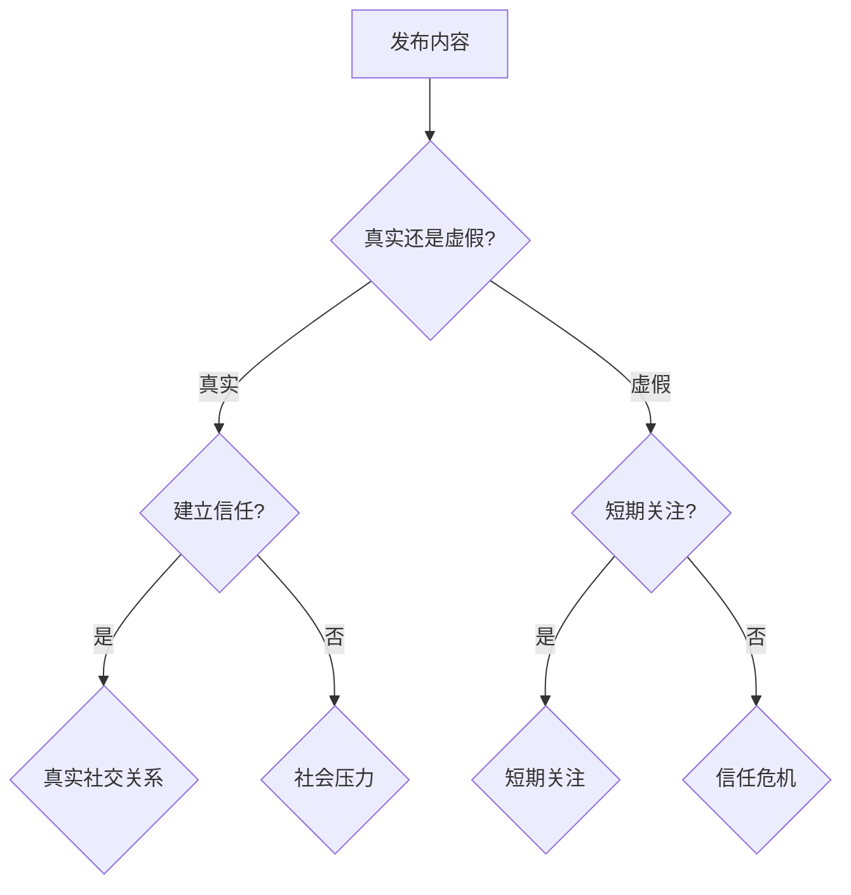
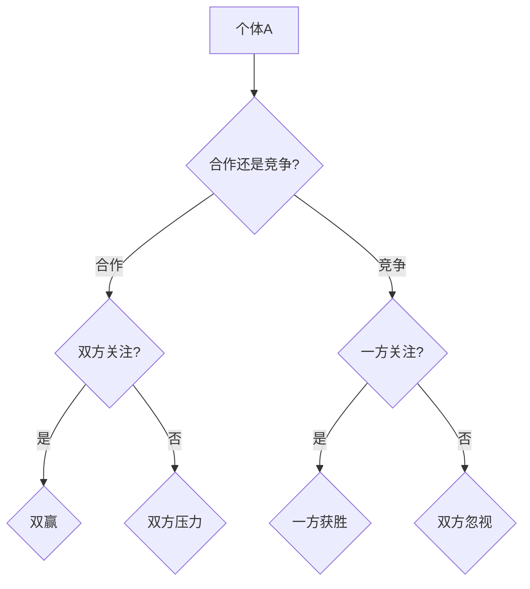

                 

# 数字时代的存在主义思考

## 关键词

- 数字时代
- 存在主义
- 自由
- 技术伦理
- 社会责任
- 人类意识

## 摘要

本文深入探讨了数字时代下的存在主义思考。随着数字化进程的加速，人类社会经历了翻天覆地的变化。在这样一个时代，存在主义的哲学思考变得尤为重要。本文首先介绍了数字时代的背景和存在主义的历史，然后分析了存在主义的核心概念，并使用哲学思考模型和数学模型进行解释。通过系统分析与架构设计方案，我们探讨了存在主义在数字时代的社会影响，并提供了最佳实践 tips。本文旨在为读者提供一幅数字时代存在主义思考的全景图，引导读者深入思考这一重要哲学议题。

---

### 目录

- [第一部分：数字时代的存在主义概述](#数字时代的存在主义概述)
  - [第1章：数字时代的存在主义起源与发展](#数字时代的存在主义起源与发展)
  - [第2章：存在主义的核心概念与联系](#存在主义的核心概念与联系)
  - [第3章：哲学思考模型与存在主义](#哲学思考模型与存在主义)
- [第二部分：存在主义的核心概念与联系](#存在主义的核心概念与联系)
  - [第4章：存在主义的数学表达](#存在主义的数学表达)
  - [第5章：存在主义的社会影响](#存在主义的社会影响)
- [第三部分：数字时代存在主义的哲学思考模型](#数字时代存在主义的哲学思考模型)
  - [第6章：决策树模型在存在主义中的应用](#决策树模型在存在主义中的应用)
  - [第7章：博弈论模型在数字时代存在主义中的角色](#博弈论模型在数字时代存在主义中的角色)
- [第四部分：存在主义在数字时代的社会实践](#存在主义在数字时代的社会实践)
  - [第8章：数字时代的社会现象与存在主义回应](#数字时代的社会现象与存在主义回应)
  - [第9章：数字时代存在主义的未来](#数字时代存在主义的未来)
- [第五部分：结论与展望](#结论与展望)
  - [第10章：总结与展望](#总结与展望)

---

### 数字时代的存在主义概述

#### 第1章：数字时代的存在主义起源与发展

随着数字化进程的加速，人类社会正经历着前所未有的变革。数字时代不仅仅是一个技术进步的时代，更是一个深刻影响人类生活方式和价值观念的时代。在这个背景下，存在主义作为一种哲学思潮，重新获得了关注和探讨。

#### 1.1 数字时代的背景

**数字化进程的加速**

- 数字化是指将传统的物理世界转化为数字信息的过程，这一过程在21世纪得到了迅猛发展。
- 移动互联网、大数据、云计算和人工智能等技术的普及，使数字化进程加速。
- 数字化带来了信息获取的便利，但也引发了隐私保护、信息安全等问题。

**信息社会的挑战**

- 信息社会的到来，使信息成为社会的重要资源，但也带来了信息过载、信息不对称等问题。
- 信息社会要求个体具备更高的信息处理能力和决策能力，这对人类意识提出了新的挑战。

**存在主义在数字时代的重新审视**

- 数字时代对人类的存在状态产生了深远影响，存在主义重新审视了人类的自由、责任和自我实现。
- 数字化进程改变了人类的生活方式，使得自由意志和社会责任成为更为复杂的问题。

#### 1.2 存在主义的历史回顾

**存在主义的起源**

- 存在主义起源于19世纪末20世纪初，主要代表人物包括基尔克果、尼采和柏格森等。
- 存在主义强调个体的存在先于本质，主张个体自由地创造自己的生命意义。

**存在主义的主要流派**

- 悲观主义存在主义：代表人物为基尔克果，主张个体在荒诞的世界中寻找信仰和意义。
- 人本主义存在主义：代表人物为尼采，强调个体的自我超越和力量。
- 分析存在主义：代表人物为维特根斯坦和波普尔，强调逻辑分析和科学方法。

**存在主义在当代的影响**

- 存在主义对心理学、文学、艺术和哲学等领域产生了深远影响。
- 存在主义思想在当代社会中仍然具有重要的指导意义，尤其是在面对技术和社会变革时。

#### 1.3 数字时代存在主义的独特性

**技术对个体自由的挑战**

- 数字化进程使得个体的自由意志受到技术工具和算法的限制。
- 技术的普及导致信息透明度增加，个体面临着更多的选择和决策，但同时也失去了某些自由。

**数字化对存在主义的重新解读**

- 数字时代要求存在主义重新审视自由、责任和自我实现等问题。
- 数字化进程改变了人类的交往方式和社会结构，使得存在主义思想需要适应新的社会环境。

**数字时代的存在主义价值探讨**

- 数字时代下的存在主义思考有助于我们更好地理解人类与技术的关系。
- 存在主义可以为数字时代的伦理问题提供指导，如隐私保护、信息安全等。

### 存在主义的核心概念与联系

#### 第2章：存在主义的核心概念

**自由**

- 自由是存在主义的核心概念之一，代表个体在世界上存在的意义。
- 自由不仅仅是外在的限制，更涉及到内心的自由选择和自我实现。

**存在先于本质**

- 存在先于本质是存在主义的基本原则，意味着个体的存在具有优先性，个体通过自己的选择来定义自己的本质。
- 这一原则挑战了传统哲学中对个体本质的预设。

**真实的自我**

- 真实的自我是存在主义关注的另一个重要问题，指的是个体在面对外部世界时，能够保持真实和真诚的态度。
- 真实的自我实现是存在主义追求的终极目标。

**社会责任**

- 存在主义强调个体在社会中的责任，认为个体的行为对社会有直接影响。
- 社会责任不仅是对他人的责任，也是对自身存在价值的肯定。

#### 2.1 自由

**自由的定义与存在主义观点**

- 自由是存在主义的核心概念，指的是个体在世界上存在的状态，不受外在限制和束缚。
- 存在主义认为自由不仅仅是外在的条件允许，更涉及到内心的自由选择和自我实现。

**自由的责任与限制**

- 自由的责任是指个体在拥有自由的同时，需要承担选择和行动的责任。
- 自由的限制来自于外部环境和社会规范，这些限制是自由实现的必要条件。

#### 2.2 存在先于本质

**海德格尔的存在先于本质论**

- 海德格尔认为，个体的存在具有优先性，个体的本质是通过存在过程来定义的。
- 存在先于本质强调个体在世界上自由地选择和创造自己的存在方式。

**萨特的存在先于本质论**

- 萨特强调个体的自由意志，认为个体的本质是通过自由选择来实现的。
- 萨特的存在主义强调个体的主观性和独立性。

#### 2.3 真实的自我

**真实自我的概念**

- 真实的自我是指个体在面对外部世界时，能够保持真实和真诚的态度。
- 真实的自我是实现自由和存在意义的关键。

**如何实现真实的自我**

- 实现真实的自我需要个体在面对挑战和选择时，勇于表达自己的想法和感受。
- 真实的自我实现是一个持续的过程，需要个体不断反思和调整自己的行为。

#### 2.4 社会责任

**存在主义与社会责任**

- 存在主义强调个体在社会中的责任，认为个体的行为对社会有直接影响。
- 社会责任是存在主义思想的重要组成部分，体现了个体与社会的紧密联系。

**数字时代的社会责任挑战**

- 数字时代带来了新的社会责任挑战，如隐私保护、信息安全等。
- 数字时代的社会责任要求个体在享受技术便利的同时，也要承担相应的社会责任。

### 哲学思考模型与存在主义

#### 第3章：存在主义的决策模型

**决策树模型**

- 决策树是一种常见的决策模型，用于分析多个决策路径和可能的结果。
- 决策树模型可以帮助个体在复杂的情境中做出理性的决策。

**决策树在存在主义中的应用**

- 决策树模型可以用于分析个体在数字时代如何实现自由和真实的自我。
- 决策树模型可以帮助个体在面对社会责任挑战时，做出符合存在主义原则的决策。

#### 3.2 博弈论模型

**博弈论的基本原理**

- 博弈论是一种研究决策和策略的数学模型，用于分析个体或团体在竞争和合作中的行为。
- 博弈论的基本原理包括策略选择、支付函数和均衡状态。

**博弈论在数字时代存在主义中的角色**

- 博弈论可以帮助个体在数字时代理解社会关系和责任，以及如何在复杂的互动中实现自由和真实的自我。

### 存在主义的数学表达

**自由的数学模型**

- 自由可以表示为选择的集合，即个体在特定情境下能够做出的一系列选择。
- 自由的数学模型可以用于分析个体在数字时代如何实现自由。

**存在先于本质的数学模型**

- 存在先于本质可以表示为函数关系，即个体的存在通过自由选择来定义其本质。
- 存在先于本质的数学模型可以用于分析个体在数字时代如何实现自我实现。

### 存在主义的社会影响

#### 第4章：存在主义的核心概念与联系

**存在主义的核心概念**

- 自由、存在先于本质、真实的自我和社会责任是存在主义的核心概念。
- 这些概念构成了存在主义思想的基础，对个体的自我认知和社会行为产生了深远影响。

**核心概念之间的联系**

- 自由和存在先于本质是存在主义的核心概念，它们相互关联，共同构成了存在主义的思想体系。
- 真实的自我和社会责任是对自由和存在先于本质的进一步阐述，它们体现了个体在社会中的角色和责任。

### 存在主义的数学表达

**自由的数学模型**

- 自由可以表示为选择的集合，即个体在特定情境下能够做出的一系列选择。
- 自由的数学模型可以用于分析个体在数字时代如何实现自由。

**存在先于本质的数学模型**

- 存在先于本质可以表示为函数关系，即个体的存在通过自由选择来定义其本质。
- 存在先于本质的数学模型可以用于分析个体在数字时代如何实现自我实现。

**真实的自我的数学模型**

- 真实的自我可以表示为个体在面对外部世界时，保持真实和真诚的态度。
- 真实的自我的数学模型可以用于分析个体在数字时代如何实现真实的自我。

**社会责任的数学模型**

- 社会责任可以表示为个体在社会中的行为和影响。
- 社会责任的数学模型可以用于分析个体在数字时代如何承担社会责任。

### 数字时代存在主义的哲学思考模型

**决策树模型**

**基本原理**

决策树模型是一种用于决策分析的图形化工具，它展示了在不同条件下可能采取的多个行动方案及其可能的结果。在存在主义哲学中，决策树模型可以帮助我们理解个体在面对复杂情境时如何做出决策。

**应用**

在数字时代，个体需要不断地在信息过载的环境中做出决策。例如，个体在社交媒体上如何选择发布内容，以实现自我表达和社交互动的同时，保持个人隐私和真实自我。决策树模型可以帮助个体分析不同的决策路径和结果，从而做出更加理性和符合存在主义原则的决策。

**示例**

假设个体A在社交媒体上发布内容的决策，有两个选择：发布真实的内容或者发布虚假的内容。每种选择都有不同的结果：

1. **发布真实的内容**：
   - 可能结果：建立真实的社交关系，赢得信任。
   - 可能结果：面临社会压力，隐私泄露。

2. **发布虚假的内容**：
   - 可能结果：短期内获得关注，但失去信任。
   - 可能结果：长期内可能导致信任危机。

**决策树图示**

**解释**

在这个决策树中，个体A需要决定发布真实内容还是虚假内容。选择真实内容将导致建立信任或面临社会压力，而选择虚假内容将导致短期关注或信任危机。通过分析这些结果，个体可以做出更加明智的决策。

**博弈论模型**

**基本原理**

博弈论是一种用于分析策略决策的数学工具，它描述了多个参与者之间的互动和竞争。在存在主义哲学中，博弈论可以帮助我们理解个体在社会中的角色和责任。

**应用**

在数字时代，个体经常需要与其他个体或团体进行互动。例如，在社交媒体上的互动，个体需要在表达自我和遵守社会规范之间找到平衡。博弈论模型可以帮助个体分析这些互动的潜在结果，从而做出更加合理的策略选择。

**示例**

假设有两个个体，A和B，他们在社交媒体上互动，可以选择合作或竞争。每个选择都有不同的结果：

1. **合作**：
   - 可能结果：双方都获得关注和信任。
   - 可能结果：双方都面临压力，但可能建立长期关系。

2. **竞争**：
   - 可能结果：一方获得关注，另一方受到忽视。
   - 可能结果：双方都受到忽视，但可能引发争议。

**博弈论图示**

**解释**

在这个博弈论模型中，个体A需要决定是选择合作还是竞争。选择合作可能导致双方都获得关注和信任，或者双方都面临压力，但可能建立长期关系。选择竞争可能导致一方获得关注，另一方受到忽视，或者双方都受到忽视，但可能引发争议。通过分析这些结果，个体可以做出更加明智的决策。

**总结**

决策树和博弈论模型是存在主义哲学思考在数字时代的应用。通过这些模型，个体可以更好地理解自己在数字时代的行为和决策，以及如何实现自由和真实的自我。这些模型不仅提供了理论上的指导，还可以帮助个体在实践中做出更加明智的选择。

### 存在主义在数字时代的社会实践

#### 第5章：数字时代的社会现象与存在主义回应

**数字时代的社会现象**

数字时代的到来带来了许多新的社会现象，这些现象对个体的存在和价值观产生了深远影响。以下是一些关键的社会现象：

**社交媒体的崛起**

社交媒体的普及改变了人们的交流方式和社会互动。个体可以通过社交媒体平台轻松地与世界各地的人建立联系，分享自己的生活和观点。然而，社交媒体也带来了一些负面影响，如隐私泄露、信息泛滥和社交媒体成瘾等。

**信息过载与决策困难**

在数字时代，个体面临着海量的信息，这导致信息过载和决策困难。信息过载使得个体难以区分重要的信息和无用的信息，从而影响了决策的质量和效率。

**数字鸿沟**

数字时代加剧了数字鸿沟，即不同社会群体在数字技术获取和使用方面的差距。数字鸿沟导致了一些社会问题，如教育不平等、就业机会不均等。

**存在主义回应**

面对这些社会现象，存在主义提出了一系列回应，以指导个体在数字时代实现自由和真实的自我。

**自由意志的重新审视**

存在主义强调个体的自由意志，认为个体应该积极地选择和塑造自己的存在。在数字时代，个体需要认识到自己的自由意志，并克服技术和社会的限制，实现自我表达和自我实现。

**自我反思与决策**

存在主义鼓励个体进行自我反思，以理解自己的内心需求和价值观。在数字时代，个体应该通过自我反思来提高决策能力，减少信息过载的影响，并做出更加理性和符合自己价值观的决策。

**社会责任与伦理**

存在主义强调个体在社会中的责任和伦理。在数字时代，个体应该意识到自己的行为对社会的广泛影响，并积极承担社会责任。例如，个体应该尊重他人的隐私，避免滥用社交媒体，并积极参与社会公共事务。

**数字时代的存在主义实践**

为了在数字时代实现存在主义的目标，个体可以采取以下实践：

1. **建立真实的社交关系**

通过社交媒体建立真实的社交关系，而不是仅仅追求虚拟的关注和点赞。通过与真实的个体互动，个体可以更好地理解自己和他人的需求，实现自我表达和自我实现。

2. **管理信息消费**

学会管理信息消费，避免被过多的信息淹没。个体应该有意识地选择对自己有意义的信息，并学会区分重要信息和次要信息。

3. **参与公共事务**

积极参与社会公共事务，为社会的进步做出贡献。个体可以通过参与社区活动、关注社会问题并提出解决方案来承担社会责任。

4. **自我反思与成长**

定期进行自我反思，以了解自己的内心需求和成长方向。通过自我反思，个体可以更好地认识自己，实现自我超越和自我实现。

**结论**

数字时代带来了许多新的社会现象，对个体的存在和价值观产生了深远影响。存在主义为个体提供了一种哲学思考框架，帮助他们在数字时代实现自由和真实的自我。通过自我反思、决策和社会责任，个体可以在数字时代找到自己的存在意义，并积极参与社会的发展。

### 数字时代存在主义的未来

**存在主义的新发展**

在数字时代，存在主义面临着新的挑战和机遇。首先，数字技术的快速发展使得人类面临更多的选择和决策，这为存在主义提供了新的研究领域。例如，人工智能和机器学习的发展使得人类开始思考与机器的关系，以及机器是否能够拥有某种形式的存在。此外，数字时代的信息爆炸和隐私问题也促使存在主义重新审视自由、隐私和自我表达等问题。

**存在主义在数字时代的角色**

存在主义在数字时代的角色变得更加重要。在数字时代，人类面临着前所未有的技术和社会变革，这使得个体的存在意义和价值更加不确定。存在主义提供了一种思考框架，帮助个体在数字时代找到自己的存在意义和价值。通过强调自由意志、自我反思和社会责任，存在主义为个体提供了应对数字时代挑战的指导原则。

**存在主义的持续影响力**

存在主义在数字时代的持续影响力体现在多个方面。首先，存在主义的思想和观点继续影响着哲学、文学、艺术和社会科学等领域。其次，存在主义在数字时代的社会实践中发挥着重要作用，如隐私保护、数字伦理和社会责任等。此外，存在主义还为人类与人工智能的关系提供了哲学思考的基础，为未来人类与技术的关系奠定了基础。

**结论**

数字时代为存在主义带来了新的挑战和机遇。存在主义在数字时代的发展不仅是对传统哲学思想的延续，也是对现代社会问题的回应。通过自我反思、决策和社会责任，存在主义将继续在数字时代发挥其独特的作用，帮助个体在复杂多变的环境中找到自己的存在意义和价值。

### 总结与展望

#### 第10章：总结与展望

**总结**

本文从多个角度探讨了数字时代下的存在主义思考。首先，我们介绍了数字时代的背景和存在主义的历史，分析了存在主义的核心概念及其相互联系。接着，我们通过哲学思考模型和数学模型，深入探讨了数字时代存在主义的独特性和应用。此外，我们还探讨了存在主义在数字时代的社会实践，以及其未来的发展趋势。

**展望**

在未来的研究中，存在主义在数字时代将继续扮演重要角色。首先，随着人工智能和机器学习的发展，人类与机器的关系将成为存在主义研究的新领域。其次，数字时代的隐私保护和信息安全问题将为存在主义提供新的研究课题。最后，存在主义将继续为个体提供哲学思考和指导，帮助他们在数字时代找到自己的存在意义和价值。

**最佳实践 tips**

1. **自我反思**：定期进行自我反思，以了解自己的内心需求和价值观，这有助于在数字时代实现真实的自我。
2. **信息管理**：学会管理信息消费，避免被过多的信息淹没，从而提高决策质量。
3. **社会责任**：在数字时代，承担社会责任，为社会的进步做出贡献。

**注意事项**

1. **隐私保护**：在数字时代，保护个人隐私至关重要，避免过度分享个人信息。
2. **伦理问题**：在数字时代，面对复杂的社会问题，遵守伦理原则和道德规范是至关重要的。

**拓展阅读**

1. **《数字时代的哲学思考》**：探讨了数字时代哲学思考的各个方面，包括存在主义、伦理和人工智能等。
2. **《存在主义导论》**：介绍了存在主义的历史、核心概念和主要流派，为深入理解存在主义提供了基础。

---

**作者**

- 作者：AI天才研究院/AI Genius Institute & 禅与计算机程序设计艺术 /Zen And The Art of Computer Programming**

