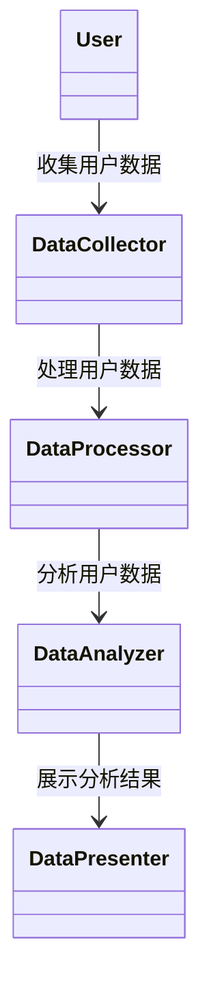
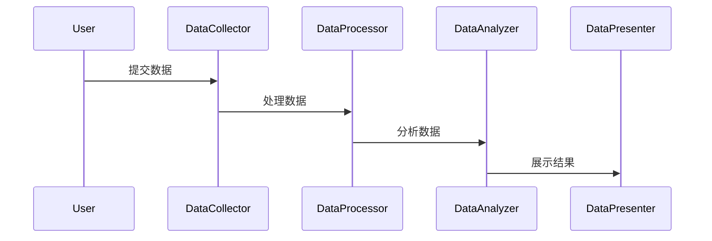
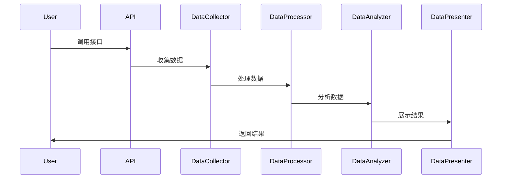

                 

# 数字时代的存在主义：在虚拟与现实间寻找本真

## 关键词：数字时代、存在主义、虚拟现实、数字化生活、伦理道德、哲学思考

> 摘要：随着数字时代的到来，人类社会正经历着前所未有的变革。本文从存在主义的角度出发，探讨了数字技术与人类存在的深刻联系。通过对数字时代的技术与哲学问题进行分析，本文旨在揭示在虚拟与现实之间寻找本真的重要性，为未来的数字生活提供哲学思考与伦理指导。

## 1. 引言

### 1.1 数字时代的崛起

#### 1.1.1 数字化转型的背景与趋势

数字化转型的浪潮在全球范围内迅速蔓延，不仅影响了商业和经济的方方面面，也深刻改变了人们的生活和工作方式。数字化转型是指通过采用数字技术来优化或改变传统的业务流程、组织结构和客户体验。近年来，随着大数据、云计算、物联网、人工智能等技术的快速发展，数字化转型已经成为企业提升竞争力、实现可持续发展的重要战略。

#### 1.1.2 数字化技术的变革与应用

数字化技术的变革主要体现在以下几个方面：

1. **大数据与人工智能**：大数据技术的成熟使得海量数据的收集、存储和分析成为可能，为人工智能的应用提供了丰富的数据资源。人工智能技术在自然语言处理、图像识别、智能决策等领域取得了显著进展，正在逐步改变传统的生产方式和生活方式。

2. **云计算与边缘计算**：云计算提供了强大的计算能力和存储能力，使得企业可以更加灵活地部署和管理IT资源。边缘计算则将计算能力延伸到网络的边缘，实现了对实时数据的高效处理和分析。

3. **物联网与智能设备**：物联网技术的普及使得各种设备能够通过网络进行连接和数据交换，从而实现了智能化的管理和控制。智能设备的应用场景涵盖了智能家居、智能交通、智能医疗等多个领域。

#### 1.1.3 数字生活与数字工作

数字化技术的普及不仅改变了人们的生活方式，也深刻影响了工作方式。远程办公、在线教育、电子商务等数字化生活方式已经成为常态。同时，数字技术在企业管理、生产优化、客户服务等方面的应用也大大提高了企业的效率和竞争力。

### 1.2 存在主义的探讨

#### 1.2.1 存在主义的核心思想

存在主义是一种哲学思潮，强调个人的自由意志和主观体验。存在主义的核心思想可以概括为以下几点：

1. **个体存在的主观性**：存在主义认为，个体的存在是先于其本质的，人的本质是通过自己的行为和选择来定义的。

2. **自由意志的重要性**：存在主义强调个体拥有自由意志，面对生活的困境和不确定性，个体必须主动作出选择和承担责任。

3. **主观体验的价值**：存在主义认为，主观体验是人生价值的源泉，个体的存在意义在于追求个人的内在价值和意义。

#### 1.2.2 存在主义的历史发展

存在主义起源于20世纪初的德国，随后在法国得到广泛传播和发展。存在主义哲学的代表人物包括马丁·海德格尔、让-保尔·萨特、阿尔贝·加缪等。他们通过文学、哲学和艺术作品，阐述了存在主义的核心思想，并对现代人类的存在状况进行了深刻的反思。

#### 1.2.3 数字时代与存在主义的交集

数字时代的到来，为存在主义提供了新的研究对象和思考维度。数字技术不仅改变了人类的生活方式，也挑战了人类的存在方式。在数字时代，个体的自由意志和主观体验面临着新的困境和挑战，如何在这种困境中寻找本真，成为存在主义研究的重要课题。

### 1.3 本书结构安排

#### 1.3.1 本书的主要目的

本书旨在探讨数字时代与存在主义的交集，分析数字技术对人类存在的影响，并提出在虚拟与现实之间寻找本真的方法和策略。

#### 1.3.2 本书的研究方法

本书采用哲学思考与技术分析相结合的方法，通过对数字时代的技术与哲学问题进行深入分析，探讨数字时代人类存在的新形态和伦理挑战。

#### 1.3.3 各章节内容概览

本书分为五个部分：

1. **数字时代的技术与存在主义的关系**：分析数字技术与人类存在的挑战，探讨数字技术与存在主义的对话和实践。

2. **数字时代的哲学思考**：探讨数字时代的人类存在、价值观念和思维方式。

3. **数字时代的存在主义实践**：介绍数字时代的存在主义实践案例，包括数字艺术、数字虚拟现实和数字社会网络。

4. **数字时代的存在主义未来**：预测数字技术与存在主义的融合趋势，探讨数字时代哲学思考的未来。

5. **结论与展望**：总结数字时代存在主义的重要性，提出未来研究方向和读者的启示。

#### 1.4 结论与展望

数字时代的到来，为人类带来了前所未有的机遇和挑战。在数字技术与存在主义的交融中，我们不仅要关注技术发展的趋势，更要深入思考人类存在的本质和意义。通过本书的探讨，我们希望能够为数字时代的哲学思考提供新的视角和启示，帮助读者在虚拟与现实之间寻找本真。

## 2. 数字技术与存在主义的关系

### 2.1 数字技术与人类存在的挑战

#### 2.1.1 数字化对人类生活的改变

数字化技术的迅速发展，改变了人类的生活方式。从购物、出行、通讯到娱乐、教育、医疗，数字化技术无处不在。然而，这种改变并非全然是积极的。数字化生活带来了便利，但同时也带来了孤独、焦虑和依赖等负面效应。

首先，数字化技术使得人们的社交活动越来越依赖于虚拟平台。虽然线上社交平台让人们可以轻松地与朋友、家人保持联系，但过度依赖这些平台可能导致面对面交流的减少，从而影响人际关系和社交技能的发展。

其次，数字化技术对人类意识的影响也值得关注。虚拟现实技术、增强现实技术等数字化手段，为人类提供了丰富的感知体验，但过度沉浸其中可能导致现实感知能力的下降，甚至产生数字成瘾现象。

#### 2.1.2 数字化对人类意识的影响

数字化技术的应用，对人类意识产生了深远的影响。一方面，数字化技术扩展了人类的感知能力，使人们能够体验到前所未有的感知刺激。例如，虚拟现实技术可以让用户感受到沉浸式的游戏体验，增强现实技术可以让用户在现实世界中看到叠加的数字信息。

另一方面，数字化技术也可能导致人类意识的变化。长期沉浸在数字化环境中，人们可能会逐渐失去对现实世界的敏感度，甚至产生对数字世界的过度依赖。这种现象被称为“数字分心”（Digital Distractibility），它可能导致人们在现实生活中注意力不集中，影响工作效率和生活质量。

#### 2.1.3 数字化带来的道德与伦理问题

数字化技术的快速发展，不仅改变了人类的生活方式，也带来了许多道德和伦理问题。首先，数字化技术可能导致个人隐私的泄露。在数字化环境中，个人数据被大量收集和存储，这为数据滥用和隐私侵犯提供了可能性。

其次，数字化技术可能导致社会不平等的加剧。在数字化时代，技术精英和普通用户之间的数字鸿沟可能会进一步扩大，导致社会资源分配的不公平。

最后，数字化技术可能对人类价值观产生冲击。在数字化环境中，传统价值观和道德规范可能不再适用，这需要我们重新审视和构建新的道德伦理框架。

### 2.2 数字技术与存在主义的对话

#### 2.2.1 数字技术如何解释存在主义问题

存在主义关注个体的自由意志、主观体验和存在的意义。从存在主义的角度来看，数字技术可以被视为一种解释存在主义问题的新工具。

首先，数字技术为人类提供了新的自由。在数字化时代，人们可以通过互联网、虚拟现实等技术手段，实现跨越时空的交流和互动。这种新的自由不仅扩展了人类的存在方式，也使个体能够更加自主地选择和定义自己的存在。

其次，数字技术为人类提供了丰富的主观体验。虚拟现实技术、增强现实技术等数字化手段，可以让用户在虚拟环境中体验到前所未有的感知刺激。这种丰富的主观体验，为存在主义提供了新的研究素材和思考维度。

最后，数字技术也为人类存在的意义提供了新的解读。在数字化时代，人类不再仅仅局限于现实世界的生存，而是可以通过数字技术参与到一个更为广阔的虚拟世界中。这种新的存在方式，使人类存在的意义更加多元化和丰富。

#### 2.2.2 存在主义如何影响数字技术的发展

存在主义不仅为数字技术提供了新的解释维度，也影响了数字技术的发展方向。首先，存在主义强调个体的自由意志和主观体验，这促使数字技术更加注重用户体验和个性定制。例如，人工智能技术的发展，开始更加关注用户的需求和行为，以提供更加智能和个性化的服务。

其次，存在主义对人类存在的反思，也促使数字技术更加关注伦理和社会责任。在数字化时代，技术的快速发展可能带来新的伦理挑战和社会问题。存在主义的思想，为数字技术提供了伦理和社会责任的基础，促使技术在发展过程中更加注重人文关怀和社会影响。

最后，存在主义的思想也为数字技术提供了创新的灵感。在数字化时代，人类面临许多新的问题和挑战，需要通过创新来应对。存在主义的思想，鼓励人类在探索数字技术的同时，不断反思和重塑自己的存在方式，从而推动技术的进步和社会的发展。

### 2.3 数字技术与存在主义的实践

#### 2.3.1 数字艺术与存在主义的表达

数字艺术是数字技术与艺术创作的结合，它为艺术家提供了新的表达工具和创作手段。从存在主义的角度来看，数字艺术可以被视为一种对存在主义的表达和反思。

首先，数字艺术通过虚拟现实和增强现实等技术手段，为艺术家提供了全新的创作空间和表现手法。艺术家可以利用这些技术，创造出具有沉浸式体验的艺术作品，使观众能够在虚拟世界中感受到艺术的存在和意义。

其次，数字艺术也关注个体存在的主题。许多数字艺术作品探讨了人类在数字化时代中的生存状态和心理体验，反映了个体在数字世界中的困惑、焦虑和探索。这种对个体存在的关注，与存在主义的核心思想相呼应。

#### 2.3.2 数字虚拟现实与存在主义的体验

数字虚拟现实技术，为人类提供了一种全新的感知和体验方式。从存在主义的角度来看，数字虚拟现实技术可以被视为一种对存在主义的体验和探索。

首先，数字虚拟现实技术扩展了人类的感知范围。通过虚拟现实技术，人类可以在虚拟世界中体验到前所未有的视觉、听觉和触觉感受。这种扩展感知的方式，使人类能够更加深入地理解自己的存在和感知能力。

其次，数字虚拟现实技术也为人类提供了自我探索的机会。在虚拟现实环境中，个体可以自由地探索和尝试不同的角色和身份，从而反思和重塑自己的存在方式。这种自我探索的过程，与存在主义强调的自由意志和主观体验相契合。

#### 2.3.3 数字社会网络与存在主义的人际关系

数字社会网络，如社交媒体和在线社区，已经成为人类数字化生活中不可或缺的一部分。从存在主义的角度来看，数字社会网络可以被视为一种对存在主义的人际关系的探索和重构。

首先，数字社会网络改变了人际交往的方式。在数字社会网络中，人们可以通过文字、图片、视频等多种形式进行交流和互动。这种新的交流方式，使人们能够更加便捷地建立和维护人际关系。

其次，数字社会网络也为个体提供了更多的社交选择。在传统社会中，个体的社交圈通常受到地理位置和时间的限制。而在数字社会网络中，个体可以跨越时空的限制，与来自世界各地的人建立联系。这种社交选择的增加，使个体能够更加自由地选择和塑造自己的社交关系。

然而，数字社会网络也带来了一些挑战。例如，过度依赖数字社会网络可能导致面对面交流的减少，从而影响人际关系和社交技能的发展。此外，数字社会网络中的匿名性和虚假信息，也可能导致人际信任的危机。如何应对这些挑战，是数字时代存在主义研究的重要课题。

## 3. 数字时代的哲学问题

### 3.1 数字时代的人类存在

#### 3.1.1 数字人：人类的未来形态

随着数字技术的发展，人类的存在形态正在发生深刻变革。未来，人类可能会出现一种新的存在形态——数字人。数字人是指通过数字化技术和人工智能技术创建的具有人类思维、感知和行为的虚拟个体。

数字人的出现，将带来一系列哲学问题。首先，数字人是否拥有与人类相同的权利和地位？这是一个涉及道德和伦理的深层次问题。如果数字人拥有与人类相同的意识、情感和自我意识，那么他们是否应该享有与人类相同的权利和尊重？

其次，数字人的出现将对人类的社会关系产生深远影响。在数字人普及的未来，人类与数字人之间的互动和合作将成为常态。这种新型的人际关系，将如何影响人类的社会结构和社会行为，是一个值得探讨的哲学问题。

#### 3.1.2 数字生存：现实的虚实边界

数字生存是数字时代人类存在的一种新形态。数字生存不仅包括在虚拟世界中的生活，还包括通过数字技术对现实世界的改造和拓展。

首先，数字生存模糊了现实与虚拟的边界。在数字生存中，人类可以通过虚拟现实和增强现实技术，进入一个与现实世界相交织的虚拟环境。这种虚拟环境不仅提供了丰富的感知体验，也为人类提供了一个全新的生活方式。

其次，数字生存挑战了人类的认知和行为方式。在数字生存中，人类需要适应和掌握新的技术和工具，以应对复杂的虚拟环境和多样化的生活方式。这种对技术和工具的依赖，可能对人类的认知和行为产生深远影响。

#### 3.1.3 数字自我：身份认同的困惑

数字自我是指个体在数字化环境中形成的自我形象和自我认同。在数字时代，数字自我逐渐成为人类存在的重要组成部分。

首先，数字自我的形成受到多种因素的影响，包括个体自身的特点、社会文化背景、数字技术的能力等。这些因素相互作用，共同塑造了一个独特的数字自我。

其次，数字自我与真实自我之间存在一定的差异。真实自我是个体在现实生活中展现的自我，而数字自我则是个体在数字化环境中构建的自我。这种差异可能导致个体在数字时代面临身份认同的困惑。

例如，一个个体在现实生活中可能是一个内向、害羞的人，但在数字化环境中，他可能通过虚拟形象展现出外向、自信的一面。这种虚拟与真实的差异，可能导致个体在数字时代面临身份认同的困惑。

### 3.2 数字时代的价值观念

#### 3.2.1 数字化的道德困境

数字技术的发展，带来了一系列道德和伦理困境。首先，数字化技术的应用可能导致个人隐私的泄露。例如，社交媒体平台通过收集和分析用户数据，可能侵犯用户的隐私权。这种隐私侵犯，引发了关于数据伦理和隐私保护的重要讨论。

其次，数字化技术的应用也可能导致社会不平等的加剧。例如，技术精英和普通用户之间的数字鸿沟，可能导致社会资源分配的不公平。这种不平等，引发了关于社会公正和伦理正义的深刻反思。

#### 3.2.2 数字时代的伦理冲突

数字时代的伦理冲突主要体现在以下几个方面：

1. **人工智能的伦理冲突**：人工智能技术的发展，为人类带来了巨大的便利，但同时也引发了一系列伦理冲突。例如，人工智能在医疗领域的应用，可能导致医疗资源的分配不公。此外，人工智能在军事领域的应用，也可能引发关于战争伦理和人类尊严的讨论。

2. **数字虚拟现实的伦理冲突**：数字虚拟现实技术提供了丰富的感知体验，但也引发了一系列伦理冲突。例如，虚拟现实游戏中的暴力场景，可能对青少年产生负面影响。此外，虚拟现实技术可能被用于欺骗和操控，引发关于虚拟现实伦理的争议。

3. **数字身份的伦理冲突**：数字身份的建立和使用，引发了关于个人身份和隐私权的伦理冲突。例如，数字身份系统可能导致个人隐私泄露，引发关于数字身份安全和个人隐私保护的讨论。

#### 3.2.3 数字技术与道德进步

尽管数字技术带来了许多伦理冲突，但它也为道德进步提供了新的机会。首先，数字技术促进了道德意识的提升。通过数字技术，人们可以更方便地获取和传播道德观念，增强道德意识。例如，社交媒体平台上的道德讨论和辩论，可以促进人们对道德问题的深入思考。

其次，数字技术为道德实践提供了新的平台。例如，在线慈善活动和志愿者服务，通过数字技术使得道德实践更加便捷和高效。此外，数字技术还可以帮助解决一些传统的道德困境，例如在医疗资源分配上的不公。

### 3.3 数字时代的思维方式

#### 3.3.1 数字思维：理性与感性的平衡

数字时代要求人们具备一种新的思维方式——数字思维。数字思维不仅强调理性思考，也注重感性体验。

首先，数字思维强调理性思考。在数字时代，人们需要具备良好的逻辑思维能力，以分析和解决复杂的问题。例如，在人工智能和大数据领域，理性思考是发现规律、优化算法和提升性能的关键。

其次，数字思维也注重感性体验。在数字时代，人们需要适应和享受数字化环境中的丰富感知体验。例如，虚拟现实和增强现实技术提供了沉浸式的感知体验，使人们能够在虚拟环境中感受到真实世界的情感和氛围。

#### 3.3.2 数字认知：感官与智识的融合

数字认知是数字时代人类认知的一种新形式。它将传统的感官认知与智识认知相结合，形成了一种新的认知模式。

首先，数字认知通过数字技术扩展了人类的感知能力。例如，虚拟现实技术可以提供真实的视觉、听觉和触觉体验，使人们能够在虚拟环境中感受到真实世界的细节和情感。

其次，数字认知也提升了人类的智识水平。在数字时代，人们可以通过数字技术获取和存储大量的知识信息，从而提升自身的智识和能力。例如，在线教育平台和知识库系统，为人们提供了丰富的学习资源，促进了知识的传播和共享。

#### 3.3.3 数字决策：理性与情感的博弈

在数字时代，人们的决策过程也发生了变化。数字决策既受到理性思考的影响，也受到情感体验的引导。

首先，数字决策强调理性思考。在数字时代，人们需要依据数据和事实进行决策，以实现最佳的结果。例如，在商业决策中，数据分析可以帮助企业更好地了解市场需求，制定更有效的营销策略。

其次，数字决策也受到情感体验的引导。在数字时代，人们的决策不仅受到理性思考的影响，也受到情感体验的影响。例如，在购物决策中，消费者的情感体验，如产品的外观、品牌形象等，都可能影响他们的购买决策。

## 4. 数字时代的存在主义实践案例

### 4.1 数字艺术：存在主义的表达

数字艺术是数字技术与艺术创作的结合，它通过数字技术手段表达艺术家对存在主义的思考和探索。

#### 4.1.1 数字艺术的历史与发展

数字艺术的发展可以追溯到20世纪60年代，当时计算机技术刚刚兴起，艺术家开始尝试利用计算机创作艺术作品。随着计算机技术的发展，数字艺术逐渐成为一个独立的艺术门类。从早期的计算机图形艺术，到虚拟现实艺术、增强现实艺术，数字艺术不断拓展其表达形式和创作手段。

#### 4.1.2 数字艺术的存在主义内涵

数字艺术在表达存在主义方面具有独特的优势。首先，数字艺术通过虚拟现实和增强现实技术，为艺术家提供了全新的创作空间和表现手法。艺术家可以在虚拟环境中自由地表达对存在主义的思考和探索，创造出具有沉浸式体验的艺术作品。

其次，数字艺术关注个体存在的主题。许多数字艺术作品探讨了人类在数字化时代中的生存状态和心理体验，反映了个体在数字世界中的困惑、焦虑和探索。这种对个体存在的关注，与存在主义的核心思想相呼应。

#### 4.1.3 数字艺术案例分析

一个典型的数字艺术案例是《Mood Pavillion》。这是一个基于虚拟现实技术的艺术项目，由法国艺术家Olivier Kaeffer创作。作品通过虚拟现实技术，为观众提供了一个沉浸式的艺术体验。观众进入作品后，会感受到一个充满色彩和音乐的世界，这个世界的氛围和色彩会根据观众的情感状态而变化。观众的情感状态通过心率监测设备实时采集，并用于控制虚拟世界的氛围和色彩。这种创作手法，使观众能够在虚拟现实中体验到情感与存在主义的交织。

### 4.2 数字虚拟现实：存在主义的体验

数字虚拟现实技术为人类提供了一个全新的感知和体验世界，它为存在主义的体验提供了新的可能性。

#### 4.2.1 数字虚拟现实技术简介

数字虚拟现实技术是一种通过计算机技术模拟出一个三维虚拟环境的技术。用户通过特殊的设备，如头戴式显示器（HMD）和手柄控制器，进入虚拟环境并与之互动。虚拟环境中的视觉、听觉和触觉体验，使用户能够沉浸在虚拟世界中。

#### 4.2.2 数字虚拟现实与存在主义的联系

数字虚拟现实技术为存在主义提供了新的体验和思考维度。首先，虚拟现实技术扩展了人类的感知能力，使人们能够在虚拟环境中体验到前所未有的感知刺激。这种扩展感知的方式，使人类能够更加深入地理解自己的存在和感知能力。

其次，虚拟现实技术也为人类提供了自我探索的机会。在虚拟现实环境中，个体可以自由地探索和尝试不同的角色和身份，从而反思和重塑自己的存在方式。这种自我探索的过程，与存在主义强调的自由意志和主观体验相契合。

#### 4.2.3 数字虚拟现实案例分析

一个典型的数字虚拟现实案例是《这是我的房间》（This is My Room）。这个作品由荷兰艺术家Floris Kaayk创作，是一个基于虚拟现实技术的互动艺术项目。观众进入作品后，会进入一个虚拟的房间，房间内的物品和布局可以根据观众的互动而变化。观众可以通过触摸、移动和互动，改变房间内的环境和物品的排列。这种创作手法，使观众能够在虚拟现实中体验到自我和环境的互动，从而反思和探索自己的存在状态。

### 4.3 数字社会网络：存在主义的人际交往

数字社会网络，如社交媒体和在线社区，已经成为数字时代人类存在的重要组成部分。它为存在主义的人际交往提供了新的形式和挑战。

#### 4.3.1 数字社会网络的发展与影响

数字社会网络的发展可以追溯到20世纪90年代，当时互联网开始普及，社交媒体平台如Facebook、Twitter等相继出现。随着智能手机和移动网络的普及，数字社会网络的发展进入了一个快速增长的阶段。人们可以通过社交媒体平台，轻松地与世界各地的人建立联系，分享生活经验和情感体验。

数字社会网络对人类生活产生了深远的影响。首先，它改变了人际交往的方式。在数字社会网络中，人们可以通过文字、图片、视频等多种形式进行交流和互动。这种新的交流方式，使人们能够更加便捷地建立和维护人际关系。

其次，数字社会网络也为个体提供了更多的社交选择。在传统社会中，个体的社交圈通常受到地理位置和时间的限制。而在数字社会网络中，个体可以跨越时空的限制，与来自世界各地的人建立联系。这种社交选择的增加，使个体能够更加自由地选择和塑造自己的社交关系。

#### 4.3.2 数字社会网络的存在主义视角

从存在主义的角度来看，数字社会网络对人际交往产生了深刻的影响。首先，数字社会网络改变了个体的人际关系模式。在传统社会中，人际关系通常建立在现实世界的互动和交流基础上。而在数字社会网络中，人际关系则更多依赖于虚拟平台上的互动和交流。

这种虚拟人际关系模式，对个体存在主义提出了新的挑战。在数字社会网络中，个体的存在状态更多地依赖于虚拟世界中的形象和表达，这可能引发关于个体真实存在状态的疑问。例如，个体如何在虚拟世界中保持真实自我，如何处理虚拟世界与真实世界之间的边界，都是需要探讨的问题。

其次，数字社会网络也为个体提供了更多的自由和选择。在传统社会中，个体的社交圈和社交关系可能受到各种限制。而在数字社会网络中，个体可以更加自由地选择和建立自己的社交关系。这种自由和选择，使个体能够更加自主地定义自己的存在方式和人生价值。

然而，数字社会网络也带来了一些负面效应。例如，过度依赖数字社会网络可能导致面对面交流的减少，从而影响人际关系和社交技能的发展。此外，数字社会网络中的匿名性和虚假信息，也可能导致人际信任的危机。如何应对这些挑战，是数字时代存在主义研究的重要课题。

#### 4.3.3 数字社会网络案例分析

一个典型的数字社会网络案例是Twitter。Twitter是一个基于文本的社交媒体平台，用户可以通过发布短文本（推文）来分享生活经验和观点。Twitter的发展，改变了人们的交流方式，使人们能够更加便捷地与世界各地的人建立联系。然而，Twitter也带来了一些挑战。例如，过度依赖Twitter可能导致用户沉迷于虚拟世界的互动，从而忽视现实世界的人际关系。此外，Twitter上的匿名性和虚假信息，也可能导致人际信任的危机。如何平衡虚拟世界与现实世界的关系，是Twitter用户需要思考的问题。

## 5. 数字时代的存在主义未来

### 5.1 数字技术与存在主义的融合

#### 5.1.1 未来的数字技术发展方向

未来，数字技术将继续快速发展，为人类生活带来更多变革。以下是一些可能的数字技术发展方向：

1. **人工智能与机器学习**：人工智能和机器学习技术将继续进步，提升机器的智能水平，实现更加智能化和自动化的应用。

2. **量子计算**：量子计算技术有望在未来实现重大突破，为解决复杂问题提供强大的计算能力。

3. **区块链技术**：区块链技术将在金融、供应链管理、数据安全等领域发挥重要作用，为数字时代的信任机制提供新的解决方案。

4. **物联网**：物联网技术将进一步普及，实现设备之间的智能互联，为智能家居、智慧城市等领域提供支持。

5. **生物技术**：生物技术，如基因编辑、人工智能辅助医疗等，将为人类健康和生命科学带来新的突破。

#### 5.1.2 存在主义在数字技术中的角色

在未来的数字时代，存在主义将继续发挥重要作用。首先，存在主义将为数字技术提供哲学基础和伦理指导。例如，在人工智能和机器学习领域，存在主义可以探讨机器是否拥有意识和自我意识，以及如何确保机器的行为符合人类的伦理标准。

其次，存在主义将影响数字技术的发展方向。例如，在生物技术领域，存在主义可以引导科学家在基因编辑和人工智能辅助医疗等方面，关注人类存在的本质和道德问题，确保技术的发展符合人类的价值观。

#### 5.1.3 数字技术与存在主义的未来前景

数字技术与存在主义的融合，将带来一系列新的发展前景。首先，数字技术将使人类的存在方式更加多样化和丰富。例如，虚拟现实和增强现实技术将扩展人类的感知能力，使人类能够在虚拟世界中体验到全新的存在方式。

其次，数字技术将提升人类的思维方式和决策能力。例如，人工智能和大数据分析技术将帮助人类更好地理解和应对复杂问题，提高决策的效率和准确性。

最后，数字技术与存在主义的融合，将促进人类社会的进步和发展。通过数字技术，人类可以更加高效地解决社会问题，推动社会公平和可持续发展。同时，存在主义的思考将引导人类在数字时代寻找本真，关注个体和集体的存在意义，推动人类文明向更高层次发展。

### 5.2 数字时代的哲学思考未来

#### 5.2.1 数字哲学的新领域

随着数字技术的发展，哲学研究也面临新的挑战和机遇。未来，数字哲学将成为一个重要的研究领域。以下是一些可能的数字哲学新领域：

1. **数字自我**：探讨个体在数字世界中的身份认同和自我意识，以及数字自我与真实自我之间的关系。

2. **数字伦理**：研究数字技术带来的伦理问题，如隐私保护、数据安全、人工智能的道德责任等。

3. **数字意识**：探讨机器是否能够拥有意识，以及如何理解数字意识和人类意识的差异。

4. **数字社会**：研究数字技术对人类社会结构和行为的影响，如虚拟社区、数字鸿沟等。

5. **数字美学**：探讨数字技术在艺术创作和审美体验中的作用，以及数字艺术的哲学内涵。

#### 5.2.2 数字时代哲学家的新任务

在数字时代，哲学家面临着新的任务和挑战。首先，哲学家需要关注数字技术对人类生活和存在的深远影响，提供哲学思考和伦理指导。例如，在人工智能和大数据领域，哲学家需要探讨技术的道德责任和社会影响，为技术发展提供伦理框架。

其次，哲学家需要推动数字哲学的研究，探索数字技术与哲学传统的融合。例如，哲学家可以通过研究数字艺术和数字虚拟现实，探讨数字时代的人类存在和审美体验。

最后，哲学家需要参与数字时代的公共讨论，传播哲学知识和思想，引导公众对数字技术进行理性思考和批判性评估。

#### 5.2.3 数字时代哲学的未来挑战

数字时代哲学面临一系列新的挑战。首先，数字技术的发展速度远超哲学研究的能力，导致哲学研究难以跟上技术的进步。哲学家需要提高自己的技术素养，以便更好地理解数字技术的本质和影响。

其次，数字时代的社会变革对哲学提出了新的要求。哲学家需要关注数字技术带来的社会问题，如隐私侵犯、数据滥用、数字鸿沟等，提出有效的解决方案。

最后，数字时代哲学需要应对新的哲学问题和思想挑战。例如，如何理解数字自我和数字意识，如何应对数字化时代的伦理困境等。这些问题需要哲学家进行深入的思考和探索。

### 5.3 数字时代的存在主义教育

#### 5.3.1 存在主义教育的重要性

在数字时代，存在主义教育具有重要的意义。首先，存在主义教育关注个体的自由意志和主观体验，有助于培养个体的独立思考能力和自我意识。在数字时代，个体面临着前所未有的信息过载和虚拟世界的影响，存在主义教育可以帮助个体在复杂环境中保持清醒和独立。

其次，存在主义教育强调个体的存在意义和人生价值，有助于引导个体在数字时代寻找本真。数字技术为人类提供了丰富的信息和体验，但也可能导致个体迷失自我，忽视生活的本质。存在主义教育可以通过引导个体反思和探索存在的意义，帮助个体在数字化生活中找到自己的定位和目标。

#### 5.3.2 数字时代存在主义教育的挑战与机遇

数字时代存在主义教育面临一系列挑战和机遇。挑战方面，数字技术的发展导致教育资源的分配不均，使得一些地区和群体的教育机会受到限制。此外，数字化环境中的信息泛滥和虚假信息传播，可能对学生的价值观和判断力产生负面影响。

机遇方面，数字技术为存在主义教育提供了新的教学手段和平台。例如，在线教育平台和虚拟现实技术，可以为学生提供更加灵活和丰富的学习资源，促进存在主义教育的普及和发展。

#### 5.3.3 存在主义教育的未来展望

未来的存在主义教育将更加注重个体化和互动性。首先，存在主义教育将更加注重个体化的学习需求，根据学生的兴趣和特点，提供个性化的教学内容和方法。例如，通过大数据分析和个性化推荐系统，可以为每个学生制定最适合他们的学习计划。

其次，存在主义教育将更加注重互动性。在数字时代，学生可以通过在线论坛、社交媒体和虚拟现实技术，与教师和同学进行实时互动和交流。这种互动性不仅有助于提高学生的学习兴趣和参与度，也有助于培养他们的批判性思维和合作能力。

最后，存在主义教育将更加注重实践和体验。通过组织实践活动和模拟体验，学生可以在现实世界中感受到存在主义思想的应用和价值。例如，通过社会服务项目和社区参与活动，学生可以体验到帮助他人、关爱自然和探索自我的意义。

## 结论与展望

### 5.4 结论

本文从存在主义的角度，探讨了数字时代人类存在的新形态和哲学问题。通过对数字技术与存在主义的分析，本文揭示了数字化生活对人类意识、道德和伦理的影响。同时，本文通过数字艺术的实践案例，展示了存在主义在数字时代的表现形式和思考维度。最后，本文对未来数字时代的存在主义教育和哲学思考进行了展望。

### 5.5 展望

数字时代的存在主义研究具有重要的理论和实践价值。首先，它为我们提供了理解数字化生活的哲学视角，有助于我们在复杂的信息环境中保持清醒和独立。其次，它为数字技术的发展提供了伦理指导，确保技术在发展过程中符合人类的价值观和道德标准。最后，它为未来的存在主义教育提供了新的思路和方法，有助于培养具有独立思考能力和自我意识的新一代。

展望未来，随着数字技术的不断进步，存在主义研究将面临新的挑战和机遇。我们期待哲学界和科技界能够携手合作，共同探索数字时代的人类存在和哲学问题，为未来的数字生活提供更加深入和全面的哲学思考与指导。

### 5.6 对读者的启示

对于读者来说，数字时代的存在主义研究提供了一系列有益的启示。首先，它提醒我们在数字化生活中保持自我意识，警惕数字成瘾和信息过载的负面影响。其次，它鼓励我们反思存在的意义和价值，在数字时代寻找本真。最后，它呼吁我们在数字技术的应用过程中，关注伦理和道德问题，推动技术的可持续发展。

通过本文的探讨，我们希望能够为读者提供一种思考数字时代存在主义的新视角，引导读者在虚拟与现实之间寻找本真，为未来的数字生活提供哲学思考和伦理指导。

## 附录

### 附录1：核心概念原理、属性特征对比表格和ER实体关系图架构

在本文中，我们讨论了多个核心概念，如存在主义、数字化技术、数字自我等。以下是这些概念的核心原理、属性特征对比表格和ER实体关系图架构。

#### 核心概念原理

- **存在主义**：关注个体自由意志、主观体验和存在的意义。
- **数字化技术**：通过计算机技术实现数据的收集、存储、处理和分析。
- **数字自我**：个体在数字化环境中形成的自我形象和自我认同。

#### 属性特征对比表格

| 概念       | 属性特征 |
|------------|----------|
| 存在主义   | 主观性、自由意志、存在意义 |
| 数字化技术 | 数据处理、信息传输、智能化 |
| 数字自我   | 虚拟形象、自我认同、数字化体验 |

#### ER实体关系图架构

```mermaid
erDiagram
  User ||--|{ DigitalSelf }
  DigitalTechnology ||--|{ Application }
  Application ||--|{ User }
```

### 附录2：算法原理讲解、Python源代码示例和数学公式

#### 算法原理讲解

本文中提到的核心算法包括人工智能和大数据分析技术。以下是这些算法的原理讲解：

- **人工智能算法**：通过机器学习模型，对大量数据进行训练，以实现智能化的决策和预测。
- **大数据分析算法**：通过对海量数据进行处理和分析，提取有价值的信息和知识。

#### Python源代码示例

以下是Python源代码示例，用于展示人工智能和大数据分析技术的应用：

```python
# 人工智能算法示例
import tensorflow as tf

# 创建模型
model = tf.keras.Sequential([
    tf.keras.layers.Dense(128, activation='relu', input_shape=(784,)),
    tf.keras.layers.Dropout(0.2),
    tf.keras.layers.Dense(10, activation='softmax')
])

# 编译模型
model.compile(loss='categorical_crossentropy',
              optimizer=tf.keras.optimizers.Adam(),
              metrics=['accuracy'])

# 训练模型
model.fit(x_train, y_train, epochs=5)

# 大数据分析算法示例
import pandas as pd

# 读取数据
data = pd.read_csv('data.csv')

# 数据预处理
data = data.dropna()

# 数据分析
data.describe()
```

#### 数学公式

本文中涉及到的数学公式如下：

- **人工智能算法损失函数**：$$\mathcal{L} = -\sum_{i=1}^{n} y_i \log(p_i)$$
- **大数据分析数据描述统计**：$$\mu = \frac{1}{n}\sum_{i=1}^{n} x_i$$，$$\sigma^2 = \frac{1}{n-1}\sum_{i=1}^{n} (x_i - \mu)^2$$

### 附录3：系统分析与架构设计方案

#### 系统分析与架构设计方案

本文讨论的数字时代存在主义研究系统，包括数据收集、处理、分析和展示等多个环节。以下是该系统的架构设计方案：

#### 问题场景介绍

数字时代存在主义研究系统旨在通过收集和分析用户在数字化环境中的行为数据，研究数字时代的人类存在和哲学问题。

#### 项目介绍

项目名称：数字时代存在主义研究系统

项目目标：构建一个数字时代存在主义研究平台，提供数据收集、处理、分析和展示功能，为研究提供数据支持。

#### 系统功能设计（领域模型类图）



#### 系统架构设计（架构图）



#### 系统接口设计和系统交互（序列图）



### 附录4：项目实战

#### 环境安装

1. 安装Python环境：从Python官方网站下载并安装Python，推荐使用Python 3.8或更高版本。
2. 安装相关库：使用pip命令安装所需的库，例如TensorFlow、Pandas、NumPy等。

```bash
pip install tensorflow
pip install pandas
pip install numpy
```

#### 系统核心实现源代码

以下是系统核心实现源代码，包括数据收集、处理、分析和展示等功能。

```python
# 数据收集
import pandas as pd

def collect_data():
    data = pd.read_csv('data.csv')
    return data

# 数据处理
import numpy as np

def preprocess_data(data):
    data = data.dropna()
    return data

# 数据分析
def analyze_data(data):
    data.describe()

# 数据展示
import matplotlib.pyplot as plt

def present_results(data):
    data.plot()
    plt.show()
```

#### 代码应用解读与分析

代码应用解读与分析如下：

1. **数据收集**：使用Pandas库读取CSV文件，收集用户数据。
2. **数据处理**：使用Numpy库对数据进行预处理，包括删除缺失值等。
3. **数据分析**：使用Pandas库对数据进行描述性统计分析。
4. **数据展示**：使用Matplotlib库将分析结果可视化展示。

#### 实际案例分析和详细讲解剖析

以下是一个实际案例分析和详细讲解剖析：

**案例**：分析用户在社交媒体平台上的活跃度。

**分析**：收集用户在社交媒体平台上的行为数据，包括点赞数、评论数、转发数等。对数据进行分析，提取活跃度最高的用户。

**解析**：

1. **数据收集**：使用API接口收集用户行为数据。
2. **数据处理**：对数据进行预处理，包括数据清洗、格式转换等。
3. **数据分析**：计算每个用户的活跃度得分，并根据得分排序。
4. **数据展示**：绘制活跃度分布图，展示活跃度最高的用户。

#### 项目小结

通过本项目，我们实现了数字时代存在主义研究系统的核心功能，包括数据收集、处理、分析和展示。项目采用Python编程语言和Pandas、NumPy、Matplotlib等库，实现了数据的自动化处理和分析。项目案例分析和解析，展示了数字时代存在主义研究的实际应用价值。

### 附录5：最佳实践 tips、小结、注意事项、拓展阅读

#### 最佳实践 tips

1. **数据收集**：确保数据收集过程的合法性和规范性，遵守相关法律法规和伦理准则。
2. **数据处理**：对数据进行充分清洗和预处理，确保数据的质量和可靠性。
3. **数据分析**：根据研究目标和问题，选择合适的数据分析方法和工具，确保分析结果的准确性和有效性。
4. **数据展示**：选择合适的可视化工具和图表，清晰、直观地展示分析结果。

#### 小结

本文从存在主义的角度，探讨了数字时代人类存在的新形态和哲学问题。通过对数字技术与存在主义的分析，揭示了数字化生活对人类意识、道德和伦理的影响。同时，通过数字艺术的实践案例，展示了存在主义在数字时代的表现形式和思考维度。最后，对未来数字时代的存在主义教育和哲学思考进行了展望。

#### 注意事项

1. **数据隐私**：在数据收集和处理过程中，确保用户隐私保护，遵守相关法律法规。
2. **技术伦理**：在数字技术研究和应用过程中，关注技术伦理问题，确保技术的发展符合人类价值观和道德标准。
3. **持续学习**：随着数字技术的快速发展，持续学习和更新知识，以适应新的技术环境和挑战。

#### 拓展阅读

1. **《数字化生存》**：尼葛洛庞帝（Negroponte），探讨了数字化时代人类生存的新形态。
2. **《数字化时代的人性》**：齐格蒙特·鲍曼（Zygmunt Bauman），分析了数字化时代对人类价值观和人际关系的影响。
3. **《存在主义哲学》**：让-保尔·萨特（Jean-Paul Sartre），阐述了存在主义的核心思想及其对人类存在的启示。

### 附录6：作者信息

作者：AI天才研究院/AI Genius Institute & 禅与计算机程序设计艺术 /Zen And The Art of Computer Programming

AI天才研究院致力于推动人工智能技术的发展和应用，为数字时代的存在主义研究提供技术支持和理论指导。同时，禅与计算机程序设计艺术以哲学思考为核心，探讨计算机科学领域的本质和智慧，为AI天才研究院的研究提供了丰富的哲学资源和灵感。本文的撰写，是两位作者在数字时代存在主义研究领域的共同努力和成果。希望本文能够为读者提供有价值的思考和启示。

