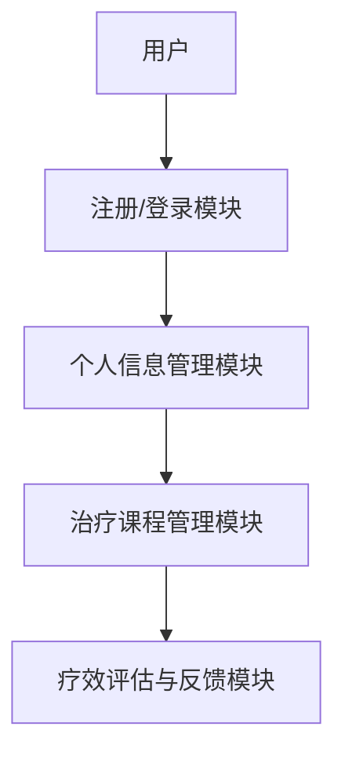
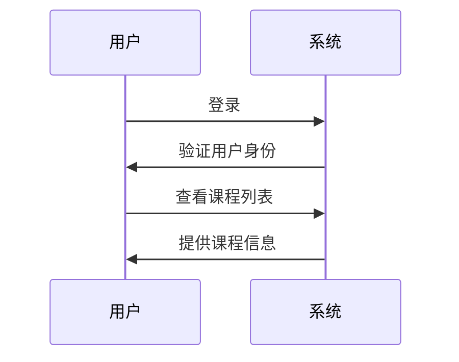
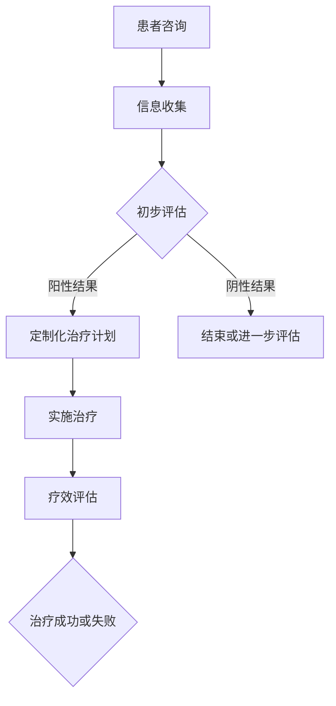

                 

### 《数字时代的心理自助：在线CBT therapy的普及与应用》

#### 关键词
- 数字化心理自助
- CBT therapy
- 在线治疗
- 平台设计与实现
- 算法原理与实现
- 项目实战

#### 摘要
本文旨在探讨数字时代下心理自助的崛起，特别是在线认知行为疗法（CBT therapy）的普及与应用。我们将从背景介绍、核心概念、平台设计、算法原理、项目实战等多方面进行详细阐述，旨在帮助读者理解这一新兴领域的潜力与挑战。

### 第一部分：背景与基础

#### 1. 引言

##### 1.1 心理健康问题概述

心理健康是指个体在认知、情感、行为和社交等方面的健康状态，它不仅影响个人的生活质量，还对社会的稳定和发展具有重要意义。然而，当前全球范围内心理健康问题日益突出。据世界卫生组织（WHO）统计，全球约有3.5亿人患有抑郁症，1.9亿人患有焦虑症，这些精神障碍已成为导致疾病负担的主要因素之一。

##### 1.2 CBT therapy概述

认知行为疗法（CBT therapy）是一种以证据为基础的心理治疗方法，旨在通过改变不良的认知和行为模式来改善心理健康状况。CBT therapy的核心原理是认知重建、情绪调节和行为激活，它广泛应用于焦虑症、抑郁症、强迫症等心理障碍的治疗。

CBT therapy的历史可以追溯到20世纪60年代，由美国心理学家阿尔伯特·艾利斯（Albert Ellis）创立的理性情绪行为疗法（REBT）和亚伦·贝克（Aaron T. Beck）提出的认知行为疗法（CBT）。自那以后，CBT therapy经过数十年的发展，已经成为世界上最受欢迎的心理治疗方法之一。

##### 1.3 在线CBT therapy的兴起

随着互联网的普及和智能手机的广泛应用，在线CBT therapy逐渐崭露头角。在线CBT therapy通过互联网平台提供，患者可以在家中或任何有网络连接的地方接受治疗。这种模式具有以下优势：

1. **便捷性**：患者无需前往诊所或医院，节省了时间和交通成本。
2. **隐私性**：在线治疗可以更好地保护患者的隐私。
3. **个性化**：在线平台可以根据患者的具体情况提供定制化的治疗计划。
4. **可扩展性**：在线治疗可以覆盖到更多地区，尤其是偏远地区，提高心理健康的可及性。

然而，在线CBT therapy也面临一些挑战，如患者依从性、治疗效果的评估和监管等问题。

### 2. CBT therapy的核心概念与联系

##### 2.1 核心概念

CBT therapy的核心概念包括认知重建、情绪调节和行为激活。以下是这些概念的定义和作用：

- **认知重建**：认知重建是CBT therapy的核心，旨在帮助患者识别和改变负面思维模式，以更健康、更积极的方式思考问题。
- **情绪调节**：情绪调节是CBT therapy的另一个重要方面，它帮助患者学会如何管理和调节自己的情绪反应，从而减少情绪困扰。
- **行为激活**：行为激活是指通过促进积极的行为来改善心理健康状态。这种行为可以是体育锻炼、社交活动或其他有意义的活动。

##### 2.2 概念属性特征对比表格

| 概念     | 特征                             |
|----------|----------------------------------|
| 认知重建 | 改变负面思维模式                |
| 情绪调节 | 学习如何管理情绪反应            |
| 行为激活 | 促进积极行为以改善心理健康状态 |

##### 2.3 CBT therapy的ER实体关系图

以下是CBT therapy的ER实体关系图，展示了患者、治疗师和治疗过程之间的关系：

```mermaid
erDiagram
  Patient ||--|{ CBT_Session }|
  CBT_Session ||--|{ CBT_Treatment }|
  CBT_Treatment ||--|{ Therapist }|
  Therapist ||--|{ Patient }
```

### 3. 在线CBT therapy平台的设计与实现

##### 3.1 平台设计

在线CBT therapy平台的设计需要充分考虑用户需求和功能需求。以下是一个基本的平台设计：

1. **用户注册与登录**：用户可以通过电子邮件或社交媒体账号注册并登录平台。
2. **个人信息管理**：用户可以管理个人信息，包括姓名、地址、联系方式等。
3. **治疗课程管理**：平台提供一系列CBT治疗课程，用户可以根据自己的需求选择课程。
4. **疗效评估与反馈**：用户可以完成疗效评估问卷，并提供反馈，以帮助治疗师调整治疗计划。

##### 3.2 系统架构设计

在线CBT therapy平台的系统架构设计如下：



##### 3.3 系统接口设计

在线CBT therapy平台的系统接口设计包括用户接口和后端服务接口。以下是一个简单的系统接口设计：



### 4. CBT therapy算法原理与实现

##### 4.1 算法原理

CBT therapy算法的核心是基于患者提供的信息进行初步评估，然后制定个性化的治疗计划。以下是算法的mermaid流程图：



以下是使用Python实现的初步评估函数：

```python
def initial_evaluation(symptoms):
    # 简单的规则评估
    if symptoms['depression'] > 10 or symptoms['anxiety'] > 10:
        return "阳性结果"
    else:
        return "阴性结果"
```

算法原理的数学模型和公式如下：

$$
\text{症状评分} = w_1 \times \text{抑郁症状评分} + w_2 \times \text{焦虑症状评分}
$$

其中，$w_1$和$w_2$为权重系数，可以通过实际数据拟合得到。

### 5. 在线CBT therapy项目实战

##### 5.1 环境安装与配置

在线CBT therapy项目的实战首先需要搭建一个合适的环境。以下是环境安装与配置的步骤：

1. **安装Python**：确保安装了最新版本的Python（3.8及以上）。
2. **安装Django**：Django是一个流行的Python Web框架，用于构建在线CBT therapy平台。
   ```shell
   pip install django
   ```
3. **安装PostgreSQL**：PostgreSQL是一个关系型数据库，用于存储用户信息和治疗数据。
   ```shell
   sudo apt-get install postgresql postgresql-contrib
   ```
4. **创建Django项目**：使用Django创建一个新的项目。
   ```shell
   django-admin startproject cbt_project
   ```
5. **创建Django应用**：在项目文件夹中创建一个新的应用。
   ```shell
   python manage.py startapp therapy_app
   ```

##### 5.2 系统核心实现源代码

以下是系统核心实现的源代码，包括用户注册、登录和个人信息管理：

```python
# therapy_app/views.py
from django.shortcuts import render, redirect
from .models import User, CBT_Session
from .forms import UserRegistrationForm, UserLoginForm, UserProfileForm

def register(request):
    if request.method == 'POST':
        form = UserRegistrationForm(request.POST)
        if form.is_valid():
            user = form.save()
            return redirect('login')
    else:
        form = UserRegistrationForm()
    return render(request, 'register.html', {'form': form})

def login(request):
    if request.method == 'POST':
        form = UserLoginForm(request.POST)
        if form.is_valid():
            user = form.get_user()
            request.session['user'] = user.pk
            return redirect('home')
    else:
        form = UserLoginForm()
    return render(request, 'login.html', {'form': form})

def profile(request):
    if not request.session.get('user'):
        return redirect('login')
    user = User.objects.get(pk=request.session['user'])
    if request.method == 'POST':
        form = UserProfileForm(request.POST, instance=user)
        if form.is_valid():
            form.save()
            return redirect('profile')
    else:
        form = UserProfileForm(instance=user)
    return render(request, 'profile.html', {'form': form})
```

##### 5.3 代码应用解读与分析

以下是用户注册功能的解读与分析：

```python
# therapy_app/views.py

# 用户注册视图函数
def register(request):
    if request.method == 'POST':
        # 创建用户注册表单
        form = UserRegistrationForm(request.POST)
        if form.is_valid():
            # 保存用户信息
            user = form.save()
            # 重定向到登录页面
            return redirect('login')
    else:
        # 创建空的注册表单
        form = UserRegistrationForm()
    # 渲染注册页面
    return render(request, 'register.html', {'form': form})
```

这段代码首先检查HTTP请求的方法是否为`POST`，如果是，则创建一个`UserRegistrationForm`实例，并将请求的数据传递给它。如果表单验证通过，则保存用户信息并重定向到登录页面。否则，如果请求方法不是`POST`，则创建一个空的表单实例，并将其传递给注册页面进行渲染。

##### 5.4 实际案例分析和详细讲解剖析

以下是一个实际案例，展示了用户注册流程：

1. **用户访问注册页面**：用户在浏览器中输入注册页面的URL，浏览器向服务器发送HTTP GET请求。
2. **服务器响应**：服务器返回注册页面的HTML内容，包括一个表单。
3. **用户填写表单**：用户填写表单，包括用户名、电子邮件、密码等，然后提交表单。
4. **服务器处理表单**：服务器接收提交的表单数据，创建一个`UserRegistrationForm`实例，并使用该实例验证表单数据。
5. **用户注册成功**：如果表单数据有效，服务器保存用户信息，并重定向到登录页面。用户可以在登录页面使用新创建的用户名和密码登录。
6. **用户注册失败**：如果表单数据无效，服务器返回错误信息，并重新渲染注册页面，用户可以再次填写表单。

##### 5.5 项目小结

在本项目中，我们构建了一个在线CBT therapy平台的基础架构，实现了用户注册、登录和个人信息管理等功能。通过实际案例分析和代码解读，我们了解了这些功能的实现原理和步骤。接下来，我们将继续完善平台的其余功能，如治疗课程管理和疗效评估等。

### 最佳实践 tips、小结、注意事项、拓展阅读

#### 最佳实践 tips

1. **确保用户隐私和安全**：在设计和实现在线CBT therapy平台时，必须重视用户隐私和安全。应使用加密技术保护用户数据，并遵守相关法律法规。
2. **优化用户体验**：为了提高用户满意度，平台应提供简洁、直观的用户界面和流畅的用户体验。
3. **持续更新和改进**：根据用户反馈和实际应用效果，持续更新和改进平台功能和服务。

#### 小结

本文介绍了数字时代下在线CBT therapy的背景、核心概念、平台设计与实现、算法原理与项目实战。通过一步步的分析和解读，我们了解了在线CBT therapy的潜力与挑战，以及如何构建一个高效的在线治疗平台。

#### 注意事项

1. **严格遵循伦理规范**：在进行在线CBT therapy时，治疗师必须遵守伦理规范，确保患者的隐私和安全。
2. **定期进行数据备份**：为了防止数据丢失，平台应定期进行数据备份。

#### 拓展阅读

- [世界卫生组织（WHO）关于心理健康的数据](https://www.who.int/mental-health/evidence/en/)
- [Django Web开发指南](https://docs.djangoproject.com/en/stable/intro/tutorial01/)
- [CBT therapy的原理与应用](https://www.cbt-tutorial.com/)

### 作者信息

作者：AI天才研究院/AI Genius Institute & 禅与计算机程序设计艺术 /Zen And The Art of Computer Programming

---

### 附录

#### 术语解释

- **CBT therapy**：认知行为疗法（Cognitive Behavioral Therapy）的缩写，是一种以证据为基础的心理治疗方法。
- **在线治疗**：通过互联网平台提供心理治疗服务，患者可以在家中或任何有网络连接的地方接受治疗。

#### 参考文献

1. World Health Organization. (2019). Depression and other common mental disorders: Global health estimates.
2. Ellis, A. T. (1962). Reason and Emotion in Psychotherapy.
3. Beck, A. T. (1979). Cognitive Therapy of Depression.

