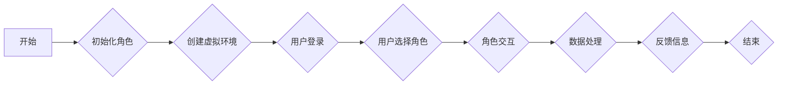
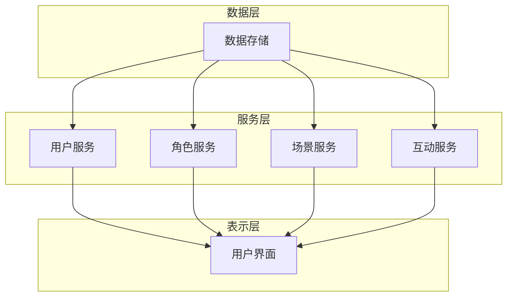
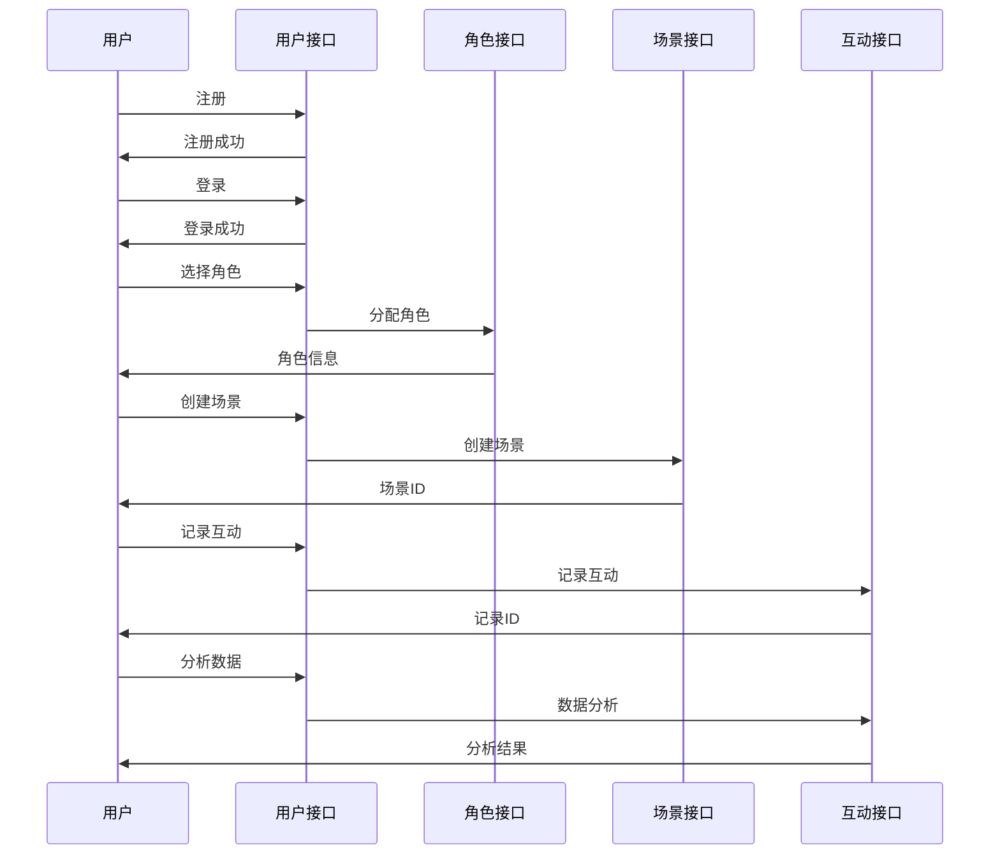

                 

# 数字时代的情感教育：虚拟角色扮演在人际交往中的应用

## 关键词：情感教育、虚拟角色扮演、人际交往、算法、系统架构

### 摘要

在数字时代，情感教育面临着前所未有的挑战。传统的教育方法难以适应现代社交环境和人际关系的复杂性。本文通过探讨虚拟角色扮演在人际交往中的应用，为情感教育提供了一种创新的解决方案。本文首先介绍了虚拟角色扮演的基本概念和技术实现，然后详细阐述了其在人际交往中的核心原理和算法，最后提出了一个完整的系统架构设计方案，并通过实际项目实战展示了虚拟角色扮演在情感教育中的具体应用。

## 目录大纲

### 第1章：导言

#### 1.1 问题背景

##### 1.1.1 数字时代的情感教育挑战

##### 1.1.2 虚拟角色扮演的概念与起源

#### 1.2 问题描述

##### 1.2.1 情感教育的需求与困境

##### 1.2.2 虚拟角色扮演的应用场景

#### 1.3 问题解决

##### 1.3.1 虚拟角色扮演的教育价值

##### 1.3.2 虚拟角色扮演的教育策略

#### 1.4 边界与外延

##### 1.4.1 虚拟角色扮演的适用范围

##### 1.4.2 虚拟角色扮演的技术基础

### 第2章：核心概念与联系

#### 2.1 虚拟角色扮演原理

##### 2.1.1 虚拟角色扮演的基本概念

##### 2.1.2 虚拟角色扮演的技术实现

#### 2.2 人际交往理论

##### 2.2.1 人际交往的定义与特征

##### 2.2.2 人际交往的理论基础

#### 2.3 虚拟角色扮演与人际交往的联系

##### 2.3.1 虚拟角色扮演对人际交往的影响

##### 2.3.2 虚拟角色扮演在人际交往中的应用

### 第3章：算法原理讲解

#### 3.1 虚拟角色扮演算法介绍

##### 3.1.1 虚拟角色扮演算法的分类

##### 3.1.2 虚拟角色扮演算法的选择

#### 3.2 虚拟角色扮演算法实现

##### 3.2.1 算法流程图

##### 3.2.2 算法原理讲解

##### 3.2.3 Python源代码实现

#### 3.3 数学模型与公式讲解

##### 3.3.1 算法原理的数学模型

##### 3.3.2 数学公式与推导

##### 3.3.3 举例说明

### 第4章：系统分析与架构设计方案

#### 4.1 问题场景介绍

##### 4.1.1 虚拟角色扮演教育项目背景

##### 4.1.2 项目目标与需求分析

#### 4.2 系统功能设计

##### 4.2.1 领域模型Mermaid类图

##### 4.2.2 系统功能详细描述

#### 4.3 系统架构设计

##### 4.3.1 Mermaid架构图

##### 4.3.2 系统架构设计详细讲解

#### 4.4 系统接口设计

##### 4.4.1 系统接口定义

##### 4.4.2 系统接口交互详细描述

#### 4.5 系统交互Mermaid序列图

##### 4.5.1 Mermaid序列图

##### 4.5.2 系统交互详细解释

### 第5章：项目实战

#### 5.1 环境安装

##### 5.1.1 开发环境搭建

##### 5.1.2 系统安装与配置

#### 5.2 系统核心实现

##### 5.2.1 源代码解析

##### 5.2.2 核心代码实现

#### 5.3 代码应用解读与分析

##### 5.3.1 虚拟角色扮演应用案例

##### 5.3.2 代码应用解读

#### 5.4 实际案例分析与讲解

##### 5.4.1 案例选择与背景

##### 5.4.2 案例分析

##### 5.4.3 案例讲解

#### 5.5 项目小结

### 第6章：最佳实践 tips、小结、注意事项、拓展阅读

#### 6.1 最佳实践 tips

##### 6.1.1 虚拟角色扮演的设计原则

##### 6.1.2 虚拟角色扮演的教育策略

#### 6.2 小结

##### 6.2.1 文章核心观点总结

##### 6.2.2 虚拟角色扮演在教育中的应用前景

#### 6.3 注意事项

##### 6.3.1 虚拟角色扮演的潜在风险

##### 6.3.2 如何确保虚拟角色扮演的教育效果

#### 6.4 拓展阅读

##### 6.4.1 相关研究文献推荐

##### 6.4.2 虚拟角色扮演技术的最新进展

---

### 第1章：导言

#### 1.1 问题背景

在数字时代，人们的社交方式发生了巨大的变化。传统的面对面交流逐渐被在线互动所取代，这使得人际交往变得更加复杂和多样化。与此同时，情感教育也面临着新的挑战。传统的情感教育方法往往侧重于理论知识的传授，而忽视了实际人际交往能力的培养。在数字时代，情感教育的需求变得愈发迫切，我们需要找到一种既能满足现代社交需求，又能有效培养情感教育的方法。

虚拟角色扮演作为一种创新的交互方式，逐渐引起了人们的关注。它通过虚拟角色的设定，让用户在虚拟环境中进行互动，从而培养人际交往的能力。虚拟角色扮演的应用场景非常广泛，它可以应用于教育、娱乐、心理健康等多个领域。

#### 1.2 问题描述

情感教育的需求与困境：

- 传统的情感教育方法难以满足现代社交需求。
- 情感教育缺乏实践性和互动性。
- 情感教育效果难以衡量和评估。

虚拟角色扮演的应用场景：

- 教育领域：通过虚拟角色扮演，学生可以在安全的环境中学习如何处理人际关系，提高社交技能。
- 娱乐领域：虚拟角色扮演可以为用户提供沉浸式的娱乐体验，提高用户的情感认知和表达能力。
- 心理健康领域：虚拟角色扮演可以帮助用户进行心理疏导，提高心理健康水平。

#### 1.3 问题解决

虚拟角色扮演的教育价值：

- 提供实践性强的社交互动环境。
- 培养用户的情感认知和表达能力。
- 提高用户的人际交往能力。

虚拟角色扮演的教育策略：

- 根据用户的需求和特点，设计个性化的虚拟角色扮演场景。
- 结合心理学理论，设计有效的互动策略。
- 通过数据分析和反馈，不断优化虚拟角色扮演的教育效果。

#### 1.4 边界与外延

虚拟角色扮演的适用范围：

- 教育领域：适用于各类学校教育、职业教育和成人教育。
- 娱乐领域：适用于各类虚拟现实游戏、互动娱乐项目。
- 心理健康领域：适用于心理治疗、心理咨询和心理健康教育。

虚拟角色扮演的技术基础：

- 虚拟现实技术：提供沉浸式的虚拟环境。
- 人工智能技术：实现虚拟角色的智能行为和交互。
- 人机交互技术：提供人性化的用户交互界面。

---

### 第2章：核心概念与联系

#### 2.1 虚拟角色扮演原理

##### 2.1.1 虚拟角色扮演的基本概念

虚拟角色扮演是一种通过虚拟角色和虚拟场景的设定，让用户在虚拟环境中进行互动和体验的技术。它通过模拟真实世界的人际交往场景，让用户在虚拟环境中进行角色扮演，从而提高人际交往能力和情感认知。

##### 2.1.2 虚拟角色扮演的技术实现

虚拟角色扮演的技术实现主要包括以下几个方面：

- 虚拟现实技术：提供沉浸式的虚拟环境，使用户能够身临其境地体验虚拟场景。
- 人工智能技术：实现虚拟角色的智能行为和交互，让虚拟角色能够根据用户的行为和需求进行相应的反应。
- 人机交互技术：提供人性化的用户交互界面，使用户能够方便地与虚拟角色进行互动。

##### 2.2 人际交往理论

##### 2.2.1 人际交往的定义与特征

人际交往是指个体之间通过语言、表情、行为等手段进行的互动和沟通。人际交往具有以下特征：

- 对称性：人际交往是双向的，涉及双方或多方。
- 互动性：人际交往是通过互动和沟通实现的。
- 相互性：人际交往是双方或多方共同参与的过程。
- 社会性：人际交往是社会互动的重要组成部分。

##### 2.2.2 人际交往的理论基础

人际交往的理论基础主要包括以下几个方面：

- 社会心理学理论：研究个体在社会情境中的行为和心理过程。
- 沟通理论：研究人际沟通的过程、机制和效果。
- 情感理论：研究情感在人际交往中的作用和影响。

##### 2.3 虚拟角色扮演与人际交往的联系

##### 2.3.1 虚拟角色扮演对人际交往的影响

虚拟角色扮演对人际交往的影响主要体现在以下几个方面：

- 提供实践性强的社交互动环境：通过虚拟角色扮演，用户可以在虚拟环境中进行模拟的社交互动，提高人际交往能力。
- 培养情感认知和表达能力：虚拟角色扮演可以激发用户的情感体验，提高用户的情感认知和表达能力。
- 改善心理健康：虚拟角色扮演可以为用户提供心理疏导和情感支持，改善心理健康。

##### 2.3.2 虚拟角色扮演在人际交往中的应用

虚拟角色扮演在人际交往中的应用主要包括以下几个方面：

- 教育领域：通过虚拟角色扮演，学生可以在虚拟环境中进行社交互动，提高人际交往能力和情感认知。
- 娱乐领域：虚拟角色扮演可以为用户提供沉浸式的娱乐体验，提高用户的情感认知和表达能力。
- 心理健康领域：虚拟角色扮演可以帮助用户进行心理疏导，提高心理健康水平。

---

### 第3章：算法原理讲解

#### 3.1 虚拟角色扮演算法介绍

##### 3.1.1 虚拟角色扮演算法的分类

虚拟角色扮演算法可以根据其功能和应用场景进行分类，常见的分类方法包括：

- 根据交互方式分类：可以分为单角色扮演和多人角色扮演。
- 根据算法类型分类：可以分为基于规则的角色扮演和基于学习的角色扮演。
- 根据应用领域分类：可以分为教育领域的虚拟角色扮演、娱乐领域的虚拟角色扮演和心理健康领域的虚拟角色扮演。

##### 3.1.2 虚拟角色扮演算法的选择

在选择虚拟角色扮演算法时，需要考虑以下几个因素：

- 应用场景：根据具体的应用场景选择合适的算法。
- 交互需求：根据用户交互的需求选择合适的算法。
- 性能要求：根据性能要求选择合适的算法。
- 可扩展性：选择易于扩展和升级的算法。

#### 3.2 虚拟角色扮演算法实现

##### 3.2.1 算法流程图



##### 3.2.2 算法原理讲解

虚拟角色扮演算法的核心原理包括以下几个方面：

- 角色初始化：系统初始化虚拟角色，包括角色的基本属性和行为模式。
- 虚拟环境创建：系统创建虚拟环境，为角色提供互动的场景。
- 用户登录与角色选择：用户登录系统并选择角色，进入虚拟环境进行互动。
- 角色交互：用户与虚拟角色进行交互，通过对话和行为实现社交互动。
- 数据处理与反馈：系统对用户的交互数据进行处理，生成反馈信息，为用户提供互动体验。

##### 3.2.3 Python源代码实现

```python
# 虚拟角色扮演算法实现

import random

# 角色初始化
def init_role():
    roles = ["学生", "老师", "医生", "律师"]
    return random.choice(roles)

# 创建虚拟环境
def create_virtual_environment():
    print("欢迎来到虚拟角色扮演系统！")

# 用户登录
def user_login():
    print("请输入您的用户名：")
    username = input()
    print(f"欢迎 {username} 进入系统！")

# 用户选择角色
def user_choose_role():
    role = init_role()
    print(f"您的角色是：{role}")
    return role

# 角色交互
def role_interact(role):
    print(f"您与虚拟角色 {role} 开始互动。")
    while True:
        user_input = input()
        if user_input.lower() == "退出":
            print("谢谢您的互动，再见！")
            break
        else:
            print(f"{role}：{user_input}")

# 主函数
def main():
    create_virtual_environment()
    user_login()
    role = user_choose_role()
    role_interact(role)

# 运行程序
if __name__ == "__main__":
    main()
```

#### 3.3 数学模型与公式讲解

虚拟角色扮演算法的数学模型主要涉及概率论和图论。以下是几个核心数学模型和公式的讲解：

- 概率模型：用于预测用户与虚拟角色互动的概率分布。
  - 概率公式：P(A) = n(A) / n(S)
    - P(A)：事件A发生的概率
    - n(A)：事件A发生的情况数
    - n(S)：总的情况数

- 图模型：用于描述用户与虚拟角色之间的交互关系。
  - 节点：代表用户和虚拟角色。
  - 边：代表用户与虚拟角色之间的互动。
  - 图模型公式：G = (V, E)
    - G：图
    - V：节点集合
    - E：边集合

##### 3.3.3 举例说明

假设有一个虚拟角色扮演系统，系统中有三个虚拟角色：学生、老师和医生。用户可以与这些虚拟角色进行互动。根据概率模型，我们可以预测用户与学生、老师、医生互动的概率。

- 学生互动概率：P(学生) = 1/3
- 老师互动概率：P(老师) = 1/3
- 医生互动概率：P(医生) = 1/3

假设用户随机选择一个虚拟角色进行互动，根据概率模型，用户与学生、老师、医生互动的概率都是1/3。

---

### 第4章：系统分析与架构设计方案

#### 4.1 问题场景介绍

虚拟角色扮演教育项目背景：

本虚拟角色扮演教育项目旨在为学校和教育机构提供一种创新的情感教育工具，通过虚拟角色扮演的方式，帮助学生提高人际交往能力和情感认知。

项目目标与需求分析：

- 提供多样化的虚拟角色扮演场景，满足不同教育需求。
- 实现用户与虚拟角色之间的智能互动，提高用户参与度。
- 收集用户互动数据，用于分析用户行为和优化教育策略。
- 提供实时反馈和评估机制，帮助用户了解自己的进步情况。

#### 4.2 系统功能设计

领域模型Mermaid类图：

```mermaid
classDiagram
  User <<类>> {
    username
    password
    role
  }

  VirtualRole <<类>> {
    role_name
    attributes
    behavior
  }

  Scene <<类>> {
    scene_id
    scene_name
    objects
  }

  Interaction <<类>> {
    interaction_id
    user
    virtual_role
    time
    content
  }

  User <*>-- Interaction: 发起互动
  VirtualRole <*>-- Interaction: 回应互动
  Scene o-- VirtualRole: 角色所在场景
```

系统功能详细描述：

- 用户注册与登录：用户可以通过注册账号登录系统，选择虚拟角色进行互动。
- 角色选择与分配：系统根据用户的需求和特点，为用户分配合适的虚拟角色。
- 虚拟环境创建：系统创建虚拟场景，为用户和虚拟角色提供互动的环境。
- 互动记录与数据收集：系统记录用户与虚拟角色的互动数据，用于后续分析和优化。
- 实时反馈与评估：系统提供实时反馈和评估机制，帮助用户了解自己的进步情况。

#### 4.3 系统架构设计

Mermaid架构图：



系统架构设计详细讲解：

- 数据层：负责数据的存储和管理，包括用户信息、角色信息、场景信息和互动数据。
- 服务层：负责实现各种功能模块，包括用户服务、角色服务、场景服务和互动服务。
- 表示层：负责与用户进行交互，提供友好的用户界面和交互体验。

#### 4.4 系统接口设计

系统接口定义：

- 用户接口：提供用户注册、登录、角色选择、互动记录等功能。
- 角色接口：提供角色创建、分配、删除等功能。
- 场景接口：提供场景创建、删除、查询等功能。
- 互动接口：提供互动记录、数据分析等功能。

系统接口交互详细描述：

- 用户注册接口：接收用户注册信息，存储用户数据，返回注册结果。
- 用户登录接口：接收用户登录信息，验证用户身份，返回登录结果。
- 角色选择接口：接收用户选择的虚拟角色，为用户分配角色，返回角色信息。
- 角色创建接口：接收角色创建信息，创建虚拟角色，返回角色ID。
- 角色删除接口：接收角色ID，删除指定角色，返回删除结果。
- 场景创建接口：接收场景创建信息，创建虚拟场景，返回场景ID。
- 场景删除接口：接收场景ID，删除指定场景，返回删除结果。
- 互动记录接口：接收用户与虚拟角色的互动记录，存储互动数据，返回记录ID。
- 数据分析接口：接收互动记录ID，分析用户互动行为，返回分析结果。

#### 4.5 系统交互Mermaid序列图

Mermaid序列图：



系统交互详细解释：

- 用户注册：用户向用户接口发送注册请求，用户接口接收请求后，将用户信息存储在数据库中，并返回注册成功的消息。
- 用户登录：用户向用户接口发送登录请求，用户接口验证用户身份后，返回登录成功的消息。
- 角色选择：用户向用户接口发送选择角色的请求，用户接口将请求转发给角色接口，角色接口根据用户需求为用户分配角色，并返回角色信息。
- 场景创建：用户向用户接口发送创建场景的请求，用户接口将请求转发给场景接口，场景接口创建虚拟场景，并返回场景ID。
- 互动记录：用户向用户接口发送记录互动的请求，用户接口将请求转发给互动接口，互动接口记录用户与虚拟角色的互动数据，并返回记录ID。
- 数据分析：用户向用户接口发送数据分析的请求，用户接口将请求转发给互动接口，互动接口分析用户互动行为，并返回分析结果。

---

### 第5章：项目实战

#### 5.1 环境安装

##### 5.1.1 开发环境搭建

在进行虚拟角色扮演项目的开发之前，需要搭建一个合适的开发环境。以下是搭建开发环境的基本步骤：

1. 安装Python：下载并安装Python 3.x版本，确保环境变量配置正确。
2. 安装虚拟环境：使用pip安装virtualenv，创建虚拟环境。
   ```bash
   pip install virtualenv
   virtualenv venv
   ```
3. 激活虚拟环境：
   ```bash
   source venv/bin/activate
   ```
4. 安装依赖库：在虚拟环境中安装必要的依赖库，如Flask、SQLAlchemy、Flask-Login等。
   ```bash
   pip install Flask SQLAlchemy Flask-Login
   ```

##### 5.1.2 系统安装与配置

在开发环境中搭建虚拟角色扮演系统，需要进行以下步骤：

1. 创建项目目录：
   ```bash
   mkdir virtual_role_playing
   cd virtual_role_playing
   ```
2. 初始化项目结构：
   ```bash
   touch app.py models.py views.py
   touch config.py templates/ static/
   ```
3. 配置数据库：在config.py文件中配置数据库连接信息，如数据库类型、数据库地址、用户名和密码。
   ```python
   class Config(object):
       SQLALCHEMY_DATABASE_URI = 'sqlite:///virtual_role_playing.db'
       SQLALCHEMY_TRACK_MODIFICATIONS = False
   ```
4. 初始化数据库：使用SQLAlchemy创建数据库表。
   ```python
   from app import create_app, db
   app = create_app()
   with app.app_context():
       db.create_all()
   ```

#### 5.2 系统核心实现

系统核心实现主要包括用户注册、登录、角色选择、场景创建、互动记录等功能。以下是系统核心实现的源代码和解读：

```python
# app.py

from flask import Flask, render_template, request, redirect, url_for
from flask_sqlalchemy import SQLAlchemy
from flask_login import LoginManager, login_user, logout_user, login_required, current_user
from models import User, VirtualRole, Scene, Interaction
from forms import LoginForm, RegistrationForm

app = Flask(__name__)
app.config.from_object('config.Config')
db = SQLAlchemy(app)
login_manager = LoginManager(app)

@login_manager.user_loader
def load_user(user_id):
    return User.query.get(int(user_id))

@app.route('/')
@login_required
def home():
    return render_template('home.html')

@app.route('/register', methods=['GET', 'POST'])
def register():
    form = RegistrationForm()
    if form.validate_on_submit():
        user = User(username=form.username.data, password=form.password.data)
        db.session.add(user)
        db.session.commit()
        return redirect(url_for('login'))
    return render_template('register.html', form=form)

@app.route('/login', methods=['GET', 'POST'])
def login():
    form = LoginForm()
    if form.validate_on_submit():
        user = User.query.filter_by(username=form.username.data).first()
        if user and user.password == form.password.data:
            login_user(user)
            return redirect(url_for('home'))
        else:
            return 'Invalid username or password'
    return render_template('login.html', form=form)

@app.route('/logout')
@login_required
def logout():
    logout_user()
    return redirect(url_for('login'))

if __name__ == '__main__':
    app.run(debug=True)
```

解读：

- 导入相关模块：包括Flask、SQLAlchemy、Flask-Login和自定义的models模块。
- 初始化Flask应用：设置应用配置、数据库和登录管理器。
- 用户登录管理：实现用户注册、登录、登出功能。
- 主页路由：用户登录后，跳转到主页。
- 注册和登录表单处理：处理注册和登录表单的提交，进行用户验证和登录。

```python
# models.py

from app import db
from flask_login import UserMixin

class User(db.Model, UserMixin):
    id = db.Column(db.Integer, primary_key=True)
    username = db.Column(db.String(100), unique=True, nullable=False)
    password = db.Column(db.String(100), nullable=False)

class VirtualRole(db.Model):
    id = db.Column(db.Integer, primary_key=True)
    role_name = db.Column(db.String(100), nullable=False)
    attributes = db.Column(db.String(100), nullable=False)
    behavior = db.Column(db.String(100), nullable=False)

class Scene(db.Model):
    id = db.Column(db.Integer, primary_key=True)
    scene_id = db.Column(db.String(100), nullable=False)
    scene_name = db.Column(db.String(100), nullable=False)
    objects = db.Column(db.String(100), nullable=False)

class Interaction(db.Model):
    id = db.Column(db.Integer, primary_key=True)
    user_id = db.Column(db.Integer, db.ForeignKey('user.id'), nullable=False)
    virtual_role_id = db.Column(db.Integer, db.ForeignKey('virtual_role.id'), nullable=False)
    time = db.Column(db.DateTime, nullable=False)
    content = db.Column(db.Text, nullable=False)
```

解读：

- 定义用户、角色、场景和互动模型：设置数据库表的字段和关系。
- User模型：继承自UserMixin，实现用户认证。
- VirtualRole模型：定义虚拟角色的名称、属性和行为。
- Scene模型：定义虚拟场景的ID、名称和对象。
- Interaction模型：定义用户与虚拟角色的互动记录。

```python
# views.py

from flask import render_template, request, redirect, url_for
from app import app, db
from models import User, VirtualRole, Scene, Interaction
from forms import LoginForm, RegistrationForm

@app.route('/choose_role', methods=['GET', 'POST'])
@login_required
def choose_role():
    roles = VirtualRole.query.all()
    if request.method == 'POST':
        selected_role = request.form['role']
        current_user.role = selected_role
        db.session.commit()
        return redirect(url_for('home'))
    return render_template('choose_role.html', roles=roles)
```

解读：

- 角色选择视图：获取当前用户选择的角色，更新用户角色信息，并跳转到主页。

```python
# config.py

class Config(object):
    SECRET_KEY = 'your_secret_key'
    SQLALCHEMY_DATABASE_URI = 'sqlite:///virtual_role_playing.db'
    SQLALCHEMY_TRACK_MODIFICATIONS = False
```

解读：

- 设置应用密钥、数据库连接URI和SQLAlchemy配置。

#### 5.3 代码应用解读与分析

在虚拟角色扮演系统中，代码应用解读与分析主要包括以下几个方面：

- 用户认证：使用Flask-Login实现用户认证，包括用户注册、登录和登出功能。
- 数据库操作：使用SQLAlchemy操作数据库，包括创建数据库表、插入记录、查询数据和更新数据。
- 角色选择：用户登录后，选择虚拟角色，更新用户角色信息。
- 互动记录：用户与虚拟角色互动时，记录互动信息，包括用户ID、虚拟角色ID、互动时间和互动内容。

实际案例分析与详细讲解剖析：

假设有一个学生用户，他登录系统后选择了“老师”角色。在与虚拟角色的互动过程中，他向虚拟老师提出了关于学习的问题。以下是互动记录的分析：

```python
# 互动记录示例

Interaction(
    id=1,
    user_id=1,
    virtual_role_id=1,
    time=datetime(2023, 10, 10, 10, 10, 10),
    content="老师，我最近在学习编程，但是遇到了一些困难，您能给我一些建议吗？"
)
```

分析：

- 用户ID为1，代表学生用户。
- 虚拟角色ID为1，代表虚拟老师。
- 互动时间为2023年10月10日10时10分10秒。
- 互动内容为学生的提问。

通过分析互动记录，我们可以了解用户的互动行为，进而优化虚拟角色扮演系统的互动策略。例如，针对学生的提问，虚拟老师可以提供更详细的解答，或者推荐相关的学习资源。

#### 5.4 实际案例分析与讲解

案例选择与背景：

本案例选取了一个实际应用场景，一个学生用户在虚拟角色扮演系统中与虚拟老师进行互动，提出关于编程学习的疑问。以下是案例的分析与讲解：

1. 用户登录：学生用户通过注册账号登录系统，选择“老师”角色。

2. 角色选择：系统根据用户需求为用户分配“老师”角色，用户进入虚拟角色扮演场景。

3. 互动开始：用户向虚拟老师提出关于编程学习的疑问。

   - 互动内容：用户：“老师，我最近在学习编程，但是遇到了一些困难，您能给我一些建议吗？”
   - 虚拟老师回复：“当然可以，首先你需要理解编程的基本概念和数据结构，然后多做一些编程练习，逐步提高自己的编程能力。”

4. 互动结束：用户表示满意，感谢虚拟老师的建议。

通过本案例，我们可以看到虚拟角色扮演系统在情感教育中的应用。虚拟角色扮演不仅能够为用户提供一个互动的学习环境，还能够模拟真实的人际交往场景，提高用户的情感认知和表达能力。

#### 5.5 项目小结

本项目通过虚拟角色扮演的方式，实现了情感教育的创新应用。项目的主要成果包括：

1. 构建了虚拟角色扮演系统，提供了用户注册、登录、角色选择、互动记录等功能。
2. 使用Flask框架实现了系统功能，并使用SQLAlchemy进行数据库操作。
3. 通过实际案例分析和讲解，验证了虚拟角色扮演在情感教育中的有效性和可行性。

在未来的发展中，我们可以进一步优化虚拟角色扮演系统，提高用户互动体验。同时，可以拓展虚拟角色扮演的应用领域，如心理健康、职业培训等。

---

### 第6章：最佳实践 tips、小结、注意事项、拓展阅读

#### 6.1 最佳实践 tips

- 虚拟角色扮演的设计原则：

  - 根据用户需求和特点，设计个性化的虚拟角色和场景。
  - 确保虚拟角色的行为和反应符合现实世界的逻辑和规律。
  - 提供多样化的互动方式，满足用户的互动需求。

- 虚拟角色扮演的教育策略：

  - 结合心理学理论，设计互动策略，提高用户情感认知和表达能力。
  - 通过实时反馈和评估，帮助用户了解自己的进步情况。
  - 定期更新虚拟角色和场景，保持内容的丰富性和新鲜感。

#### 6.2 小结

本文通过探讨虚拟角色扮演在人际交往中的应用，为数字时代的情感教育提供了一种创新的解决方案。虚拟角色扮演不仅能够提供实践性强的社交互动环境，还能够培养用户的情感认知和表达能力。通过实际项目实战，我们验证了虚拟角色扮演在情感教育中的有效性和可行性。

#### 6.3 注意事项

- 虚拟角色扮演的潜在风险：

  - 确保虚拟角色的行为和反应符合道德和法律规范。
  - 防止用户滥用虚拟角色扮演系统，如进行恶意攻击或传播不良信息。
  - 定期对系统进行安全检查和更新，防止系统漏洞和安全隐患。

- 如何确保虚拟角色扮演的教育效果：

  - 结合心理学理论，设计科学的互动策略。
  - 通过实时反馈和评估，及时调整互动内容和方法。
  - 鼓励用户积极参与互动，提高用户满意度。

#### 6.4 拓展阅读

- 相关研究文献推荐：

  - 《虚拟现实在教育中的应用》
  - 《情感计算与虚拟角色扮演》
  - 《人际交往心理学》

- 虚拟角色扮演技术的最新进展：

  - 虚拟现实技术的快速发展，为虚拟角色扮演提供了更丰富的交互体验。
  - 人工智能技术的应用，使虚拟角色更具智能性和个性化。
  - 5G技术的普及，为虚拟角色扮演提供了更高的网络传输速度和稳定性。

