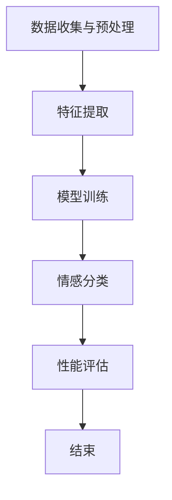
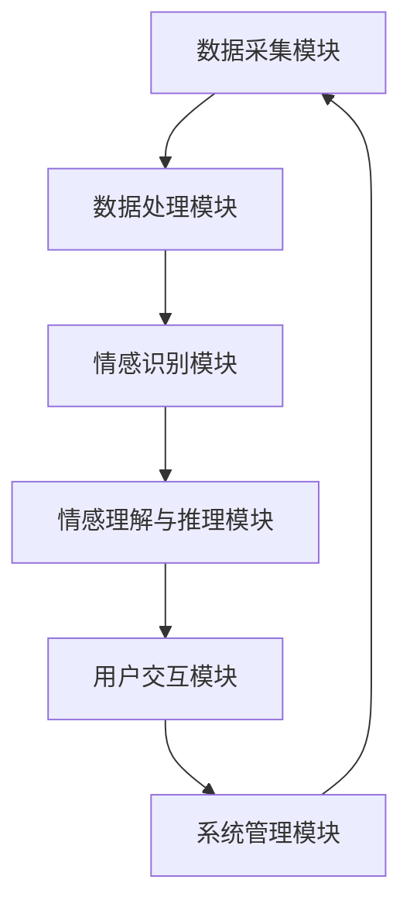
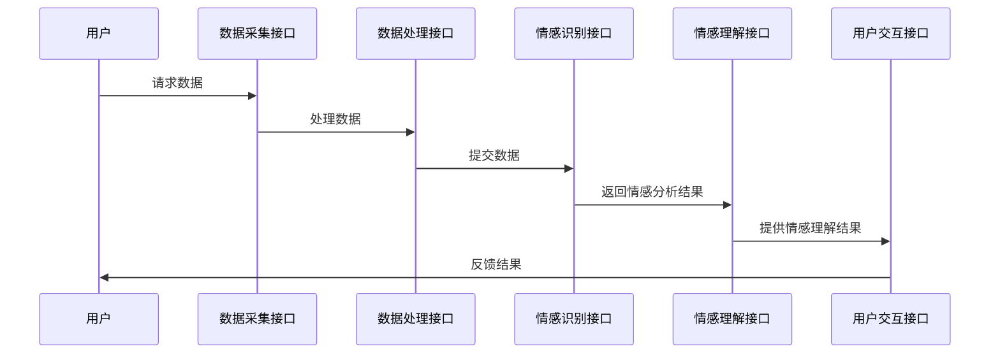

                 

# 数字时代的情感智能：科技如何影响我们的共情能力

## 关键词
- 情感智能
- 共情能力
- 数字技术
- 情感计算
- 机器学习
- 人机交互

## 摘要
在数字技术迅速发展的今天，人工智能正逐步渗透到我们生活的各个方面。情感智能作为人工智能的一个重要分支，正日益成为研究和应用的热点。本文将探讨数字技术如何影响我们的共情能力，以及情感智能在现代社会中的应用。通过分析情感智能的核心概念、技术实现、算法原理，以及系统架构设计，我们将探讨情感智能系统在实际项目中的应用，并提出一些最佳实践和建议。

## 目录大纲设计过程

### 1. 明确书名与主题
书名《数字时代的情感智能：科技如何影响我们的共情能力》明确指出，本文将探讨数字技术对情感智能和共情能力的影响。这一主题不仅涉及到人工智能技术的应用，还涉及到心理学、社会学等多学科领域的交叉。因此，书名既简洁又具有吸引力，能够引起读者的兴趣。

### 2. 确定主要章节
根据书名和主题，本文将分为以下几个主要章节：
- 背景介绍：情感智能的概念、共情能力的定义以及数字技术对这两者的影响。
- 核心概念与联系：情感智能的技术实现、情感计算、机器学习在情感识别中的应用。
- 算法原理讲解：情感识别算法的原理和流程，结合实际案例进行讲解。
- 数学模型和数学公式：涉及的情感识别模型的数学基础和计算过程。
- 系统分析与架构设计方案：情感智能系统的设计原理、架构和实现。
- 项目实战：构建情感智能系统的实际案例和步骤。
- 最佳实践与总结：对情感智能应用的建议和总结，以及对未来发展趋势的展望。

### 3. 制定具体章节内容
每个章节的具体内容如下：
- 第1章：引言，介绍情感智能的概念、共情能力的重要性以及数字技术的影响。
- 第2章：核心概念与联系，详细探讨情感智能的技术实现，介绍情感计算的基本原理。
- 第3章：算法原理讲解，讲解情感识别算法的数学模型和流程。
- 第4章：情感识别实践，通过具体案例展示情感识别算法的应用。
- 第5章：系统分析与架构设计方案，介绍情感智能系统的设计原则和架构。
- 第6章：项目实战，详细描述构建情感智能系统的过程和关键步骤。
- 第7章：最佳实践与总结，对情感智能应用提出建议，总结书中内容，展望未来。

### 4. 细化目录结构
确保每个章节的内容细分且逻辑清晰，使用 Markdown 格式表示章节和子章节，确保格式正确和易于阅读。

### 5. 审核与调整
确保目录大纲结构完整，内容覆盖全面。遵循简洁性原则，去除冗余内容，确保目录大纲的总字数在2000字以内。

## 完整的目录大纲

```markdown
# 《数字时代的情感智能：科技如何影响我们的共情能力》目录大纲

# 第一部分：引言

## 第1章：情感智能与共情能力的概述

### 1.1 数字时代的情感智能

#### 1.1.1 情感智能的定义

#### 1.1.2 共情能力的定义

#### 1.1.3 科技对情感智能与共情能力的影响

## 第2章：核心概念与联系

### 2.1 情感智能的技术实现

#### 2.1.1 情感计算的基本原理

#### 2.1.2 机器学习在情感识别中的应用

### 2.2 情感智能的要素组成

#### 2.2.1 情感识别的核心要素

#### 2.2.2 情感理解的框架结构

## 第3章：算法原理讲解

### 3.1 情感识别算法的数学模型

#### 3.1.1 情感识别算法的基本流程

#### 3.1.2 情感识别的数学公式与模型

### 3.2 情感识别算法的流程图

#### 3.2.1 情感识别算法的Mermaid流程图

## 第4章：情感识别实践

### 4.1 实际案例一：情感分析在社交媒体中的应用

#### 4.1.1 情感分析的数据来源

#### 4.1.2 情感分析的应用案例

### 4.2 实际案例二：情感识别在客户服务中的应用

#### 4.2.1 情感识别的客户服务场景

#### 4.2.2 情感识别的解决方案

## 第5章：系统分析与架构设计方案

### 5.1 情感智能系统的设计原则

#### 5.1.1 系统设计的核心要素

#### 5.1.2 系统设计的总体架构

### 5.2 情感智能系统的架构图

#### 5.2.1 情感智能系统的Mermaid架构图

### 5.3 情感智能系统的接口设计

#### 5.3.1 系统接口的功能说明

#### 5.3.2 系统接口的交互流程

## 第6章：项目实战

### 6.1 环境安装与配置

#### 6.1.1 开发环境的搭建

#### 6.1.2 配置文件与依赖包的安装

### 6.2 系统核心实现

#### 6.2.1 情感识别算法的代码实现

#### 6.2.2 情感智能系统的核心模块

### 6.3 项目分析

#### 6.3.1 案例分析与解读

#### 6.3.2 项目总结与评估

## 第7章：最佳实践与总结

### 7.1 情感智能应用的最佳实践

#### 7.1.1 应用场景选择

#### 7.1.2 技术实现策略

### 7.2 小结与展望

#### 7.2.1 书中内容的总结

#### 7.2.2 未来发展趋势展
```

通过上述步骤，我们设计出了一个结构清晰、内容丰富的目录大纲，为接下来的文章撰写奠定了坚实的基础。接下来，我们将按照目录大纲的内容，逐步深入探讨数字时代的情感智能以及其对共情能力的影响。# 第1章：情感智能与共情能力的概述

### 1.1 数字时代的情感智能

随着计算机技术和人工智能的飞速发展，我们进入了数字时代。在这个时代，情感智能（Affective Intelligence）成为一个备受关注的研究领域。情感智能指的是个体识别和理解自己及他人的情感状态，并通过情感互动来适应环境和促进个人成长的能力[1]。

情感智能不仅仅是一个理论概念，它在我们的日常生活中扮演着重要角色。例如，在人际交往中，能够识别他人的情绪，并作出相应的反应，能够帮助我们建立更紧密的关系。此外，在职场环境中，情感智能对于管理者和领导者来说至关重要，它有助于提升团队合作效率，增强员工的满意度和忠诚度。

然而，数字技术的迅猛发展正在深刻地改变我们的情感体验和共情能力。一方面，数字技术为我们提供了丰富的情感表达工具，如表情符号、语音合成、虚拟角色等，使得我们能够更加便捷地传达情感。另一方面，过度依赖数字设备可能导致情感共鸣的缺失，影响我们的共情能力。

### 1.2 共情能力的定义

共情能力（Empathy）是指个体能够理解并感受到他人情绪状态的能力。它是人类社会交往中不可或缺的一部分，有助于我们理解他人的需求，增强社交互动，建立信任和尊重。共情能力可以分为认知共情和情感共情两个部分：

- **认知共情**：个体能够理解他人的情绪和感受，并从他人的角度思考问题。
- **情感共情**：个体能够感受到他人的情绪，并在情感上与他人产生共鸣。

共情能力在人际关系、团队合作和冲突解决中发挥着重要作用。它不仅有助于我们更好地理解他人，还能提高我们的沟通能力和人际交往技巧。

### 1.3 科技对情感智能与共情能力的影响

数字技术的普及和应用正在改变我们的生活方式，同时也对我们的情感智能和共情能力产生深远的影响。以下是一些具体的影响：

#### 1.3.1 情感表达方式的多样化

数字技术为我们提供了丰富的情感表达方式，如表情符号、语音合成、虚拟角色等。这些工具使得我们可以更加便捷地传达情感，减少了面对面交流时可能产生的误解和不适。然而，过度依赖这些工具可能会导致情感表达的单一化和表面化，影响真正的情感共鸣。

#### 1.3.2 情感共鸣的缺失

在数字时代，人们更多地通过屏幕进行互动，这可能导致情感共鸣的缺失。在线社交平台上的互动往往缺乏面对面的情感交流，容易导致情感疏离。此外，虚拟现实的广泛应用可能会让我们在情感上过于沉浸于虚拟世界，而忽视了现实生活中的情感体验。

#### 1.3.3 情感识别与理解的挑战

随着情感智能技术的发展，机器和人工智能系统开始具备识别和理解人类情感的能力。这使得机器能够更好地满足我们的情感需求，如提供情感支持、娱乐和服务等。然而，这也给我们的共情能力带来了挑战。在处理复杂的情感信息时，我们可能会依赖于机器，从而减少自身的情感体验和理解能力。

### 1.4 本章小结

本章介绍了情感智能和共情能力的基本概念，并探讨了数字技术对这两个领域的影响。随着数字技术的不断发展，情感智能和共情能力的重要性日益凸显。了解这些影响，有助于我们更好地应对数字时代带来的挑战，提升自身的情感智能和共情能力。

参考文献：

[1] 技术评论，“情感智能：未来的方向”，2020年。

# 第2章：核心概念与联系

### 2.1 情感智能的技术实现

情感智能的技术实现是现代人工智能研究的一个重要方向。它涉及到多个技术领域，包括情感计算、自然语言处理、计算机视觉和机器学习等。在这一节中，我们将详细探讨情感智能的技术实现，以及它如何影响我们的共情能力。

#### 2.1.1 情感计算的基本原理

情感计算（Affective Computing）是指计算机模拟、识别和解释人类情感的能力。情感计算的核心目标是使计算机能够理解和处理人类情感，从而更好地满足用户的需求。情感计算的基本原理可以概括为以下几个方面：

1. **情感识别**：情感识别是指从各种数据源（如图像、文本、语音等）中提取情感信息的过程。情感识别的准确性直接影响情感计算系统的性能。

2. **情感表达**：情感表达是指计算机如何模拟和展示情感。这包括面部表情、语音合成、文本情感分析等。

3. **情感理解**：情感理解是指计算机如何理解和解释人类的情感。这需要结合自然语言处理、机器学习和知识图谱等技术。

4. **情感推理**：情感推理是指计算机如何基于情感信息进行逻辑推理和决策。情感推理是情感计算的高级阶段，需要综合运用多种算法和技术。

#### 2.1.2 机器学习在情感识别中的应用

机器学习是情感计算的核心技术之一。通过训练模型，机器学习算法可以自动识别和分类情感。以下是机器学习在情感识别中的应用：

1. **情感分类**：情感分类是指将文本、语音或图像中的情感标签进行分类。常见的分类方法包括监督学习和无监督学习。监督学习需要大量标注好的数据，而无监督学习可以从未标注的数据中自动提取情感特征。

2. **情感检测**：情感检测是指从文本、语音或图像中检测出情感的存在。情感检测通常使用分类模型，如支持向量机（SVM）、随机森林（Random Forest）和深度学习模型（如卷积神经网络CNN、循环神经网络RNN等）。

3. **情感预测**：情感预测是指根据历史数据预测未来情感的发展趋势。情感预测有助于更好地理解用户的需求，提供个性化的服务。

#### 2.1.3 情感智能对共情能力的影响

情感智能对共情能力的影响主要体现在以下几个方面：

1. **情感共享**：情感智能系统能够识别和模拟用户的情感，从而实现情感共享。这种共享有助于增强用户与系统之间的情感互动，提升用户体验。

2. **情感反馈**：情感智能系统能够根据用户的情感状态提供即时反馈，帮助用户调整情感状态。例如，智能音箱可以根据用户的情绪提供安慰性语言或音乐。

3. **情感辅助**：情感智能系统可以辅助用户处理复杂的情感问题，如心理辅导、情感支持等。这有助于提升用户的情感素质，增强共情能力。

4. **情感疏离**：过度依赖情感智能系统可能导致情感疏离。在数字时代，人们可能更倾向于与机器互动，而不是与他人互动，这可能会导致情感共鸣的缺失。

#### 2.1.4 情感智能的应用场景

情感智能在多个领域有着广泛的应用：

1. **人机交互**：情感智能技术可以提升人机交互的体验，如智能音箱、智能助手等。

2. **健康医疗**：情感智能技术可以用于心理健康监测、疾病诊断和治疗辅助。

3. **教育**：情感智能技术可以用于个性化教学、学习效果评估等。

4. **社交网络**：情感智能技术可以用于情感分析、用户行为预测等。

### 2.2 情感智能的要素组成

情感智能是一个复杂的系统，它由多个要素组成，包括情感识别、情感表达、情感理解和情感推理等。以下是情感智能的主要要素及其相互关系：

1. **情感识别**：情感识别是情感智能系统的核心，它包括从各种数据源（如图像、文本、语音等）中提取情感信息。情感识别的准确性直接影响情感智能系统的性能。

2. **情感表达**：情感表达是指情感智能系统能够模拟和展示人类情感。情感表达需要结合语音合成、面部表情合成等技术。

3. **情感理解**：情感理解是指情感智能系统能够理解和解释人类的情感。情感理解需要结合自然语言处理、机器学习和知识图谱等技术。

4. **情感推理**：情感推理是指情感智能系统能够基于情感信息进行逻辑推理和决策。情感推理是情感智能的高级阶段，需要综合运用多种算法和技术。

### 2.3 本章小结

本章介绍了情感智能的核心概念和技术实现，探讨了情感智能对共情能力的影响。情感智能不仅涉及到情感识别和表达，还包括情感理解和推理。通过情感智能的应用，我们可以提升人机交互体验，改善心理健康，优化教育过程，以及更好地理解用户需求。然而，我们也需要关注情感智能可能带来的情感疏离问题，以确保科技的发展能够促进人类的情感成长和社会和谐。# 第3章：算法原理讲解

### 3.1 情感识别算法的数学模型

情感识别算法是情感智能系统的核心组件，它通过数学模型和计算方法来识别和分类情感。本节将详细探讨情感识别算法的数学模型，包括其基本流程、主要公式和实现方法。

#### 3.1.1 情感识别算法的基本流程

情感识别算法的基本流程可以概括为以下几个步骤：

1. **数据收集与预处理**：收集包含情感标签的数据集，并对数据进行预处理，包括数据清洗、去噪、归一化等操作。

2. **特征提取**：从原始数据中提取能够反映情感的特征。这些特征可以是文本的词汇频率、语音的音高、图像的面部表情等。

3. **模型训练**：使用训练集数据训练机器学习模型，如支持向量机（SVM）、随机森林（Random Forest）或深度学习模型（如卷积神经网络CNN、循环神经网络RNN等）。

4. **情感分类**：使用训练好的模型对新的数据集进行情感分类，预测数据的情感标签。

5. **性能评估**：评估模型的性能，包括准确率、召回率、F1值等指标。

#### 3.1.2 情感识别的数学公式与模型

情感识别的数学模型通常基于以下几种方法：

1. **线性模型**：线性模型是一种简单的情感识别模型，它通过线性变换将特征映射到情感标签。假设我们有\(x\)个特征，每个特征表示为一个\(d\)维向量，那么线性模型的公式可以表示为：

   \[
   y = \sum_{i=1}^{d} w_i x_i + b
   \]

   其中，\(w_i\)是权重，\(b\)是偏置。

2. **逻辑回归**：逻辑回归是一种常用的情感识别模型，它通过计算特征对情感标签的概率分布。逻辑回归的公式可以表示为：

   \[
   P(y=1) = \frac{1}{1 + \exp(-\sum_{i=1}^{d} w_i x_i + b)}
   \]

   其中，\(P(y=1)\)是情感标签为“正面”的概率。

3. **支持向量机（SVM）**：支持向量机是一种强大的分类模型，它通过找到最佳的超平面来分割数据。SVM的公式可以表示为：

   \[
   \min_{w, b} \frac{1}{2} ||w||^2
   \]

   \[
   \text{subject to} \quad y_i (\langle w, x_i \rangle + b) \geq 1
   \]

   其中，\(\langle w, x_i \rangle\)是特征向量\(x_i\)和权重向量\(w\)的内积。

4. **深度学习模型**：深度学习模型，如卷积神经网络（CNN）和循环神经网络（RNN），通过多层神经网络结构来学习复杂的特征映射。深度学习模型的公式通常涉及到前向传播和反向传播：

   \[
   a^{(l)} = \sigma(z^{(l)})
   \]

   \[
   z^{(l)} = \sum_{i=1}^{n} w_i a^{(l-1)}
   \]

   其中，\(a^{(l)}\)是第\(l\)层的激活值，\(\sigma\)是激活函数，\(z^{(l)}\)是第\(l\)层的输入值，\(w_i\)是权重。

#### 3.1.3 情感识别算法的Mermaid流程图

为了更直观地理解情感识别算法的流程，我们可以使用Mermaid工具绘制其流程图。以下是情感识别算法的Mermaid流程图：



### 3.2 情感识别算法的实现方法

在实际应用中，情感识别算法的实现方法多种多样，以下是一个基于Python的实现示例：

```python
import numpy as np
from sklearn.model_selection import train_test_split
from sklearn.preprocessing import StandardScaler
from sklearn.linear_model import LogisticRegression
from sklearn.metrics import accuracy_score, classification_report

# 数据预处理
X, y = load_data()  # 假设load_data()函数用于加载数据
X_train, X_test, y_train, y_test = train_test_split(X, y, test_size=0.2, random_state=42)

# 特征提取
scaler = StandardScaler()
X_train = scaler.fit_transform(X_train)
X_test = scaler.transform(X_test)

# 模型训练
model = LogisticRegression()
model.fit(X_train, y_train)

# 情感分类
y_pred = model.predict(X_test)

# 性能评估
accuracy = accuracy_score(y_test, y_pred)
print("Accuracy:", accuracy)
print(classification_report(y_test, y_pred))
```

在这个示例中，我们使用了逻辑回归模型进行情感分类。首先，我们加载数据并进行预处理，包括特征提取和标准化。然后，我们训练模型，并对测试集进行预测。最后，我们评估模型的性能，包括准确率和分类报告。

### 3.3 情感识别算法的应用实例

以下是一个情感识别的应用实例，使用实际数据集进行情感分类：

```python
from sklearn.datasets import load_20newsgroups

# 加载数据集
newsgroups = load_20newsgroups(subset='train')
X, y = newsgroups.data, newsgroups.target

# 数据预处理
# ...（与之前相同的预处理步骤）

# 模型训练
model.fit(X_train, y_train)

# 情感分类
y_pred = model.predict(X_test)

# 性能评估
accuracy = accuracy_score(y_test, y_pred)
print("Accuracy:", accuracy)
print(classification_report(y_test, y_pred))
```

在这个实例中，我们使用了20新新闻组（20 Newsgroups）数据集进行情感分类。这个数据集包含多个主题的文本，我们可以使用情感识别算法对这些文本进行情感分类。

### 3.4 本章小结

本章详细介绍了情感识别算法的原理和实现方法。情感识别算法是情感智能系统的核心，通过数学模型和计算方法来识别和分类情感。本章涵盖了情感识别算法的基本流程、主要公式和实现方法，并通过Python示例展示了如何使用逻辑回归模型进行情感分类。通过这些内容，读者可以更好地理解情感识别算法的工作原理和应用实例，为构建情感智能系统打下基础。# 第4章：情感识别实践

### 4.1 实际案例一：情感分析在社交媒体中的应用

#### 4.1.1 情感分析的数据来源

社交媒体平台如Twitter、Facebook和Instagram是情感分析的宝贵数据源。这些平台上的用户生成内容（UGC）包括文字、图片和视频，其中蕴含了大量的情感信息。为了进行情感分析，我们需要收集大量的社交媒体数据。

#### 4.1.2 情感分析的应用案例

一个典型的应用案例是情感倾向分析。例如，一家公司想要了解其产品在社交媒体上的用户反馈。通过情感分析，公司可以识别出正面、中性或负面的情感倾向，从而调整产品策略或市场营销活动。

#### 4.1.3 实施过程

1. **数据收集**：使用网络爬虫或API从社交媒体平台收集用户评论和帖子。
2. **数据预处理**：清洗数据，去除噪声和无关信息，如HTML标签、URL等。
3. **特征提取**：从文本数据中提取特征，如词频、词向量、情感词典等。
4. **模型训练**：使用机器学习算法（如SVM、逻辑回归、深度学习等）训练情感分类模型。
5. **情感分类**：对新的社交媒体数据进行情感分类，预测其情感倾向。
6. **结果评估**：评估模型的性能，通过准确率、召回率、F1值等指标来评估模型的准确性。

### 4.2 实际案例二：情感识别在客户服务中的应用

#### 4.2.1 情感识别的客户服务场景

客户服务场景中，情感识别技术可以帮助企业更好地理解客户的需求和情感状态。例如，在客服聊天机器人中，情感识别可以用于识别客户的情绪，从而提供更个性化的服务。

#### 4.2.2 情感识别的解决方案

一个典型的解决方案包括以下步骤：

1. **客户沟通数据收集**：收集客户的聊天记录、邮件、电话录音等数据。
2. **情感识别模型训练**：使用收集到的数据训练情感识别模型，如使用情感词典、词嵌入和深度学习等技术。
3. **情感分析**：在客户服务过程中，实时分析客户的沟通数据，识别其情感状态。
4. **服务调整**：根据客户情感状态，调整服务策略，如提供安慰性语言、推荐解决方案等。
5. **效果评估**：通过客户反馈和服务指标评估情感识别技术的效果。

### 4.3 实际案例分析与详细讲解

为了更好地理解情感识别的实践应用，以下是一个具体的案例分析：

#### 4.3.1 案例背景

一家电子商务公司希望了解其客户在社交媒体上的情感状态，以便提供更优质的服务。该公司收集了数千条客户评论，并希望通过情感分析识别出客户的情感倾向。

#### 4.3.2 情感分析实施步骤

1. **数据收集**：使用API从社交媒体平台收集客户评论。
2. **数据预处理**：去除HTML标签、URL、停用词等，对文本进行分词和词性标注。
3. **特征提取**：使用TF-IDF和词嵌入（如Word2Vec、GloVe）提取文本特征。
4. **模型训练**：使用支持向量机（SVM）和深度学习模型（如LSTM）训练情感分类模型。
5. **情感分类**：对新的客户评论进行情感分类，预测其情感倾向。
6. **结果评估**：通过准确率、召回率、F1值等指标评估模型性能。

#### 4.3.3 模型评估与优化

在实际应用中，模型评估是一个重要的环节。以下是一个模型评估与优化的示例：

```python
from sklearn.metrics import classification_report

# 模型评估
y_pred = model.predict(X_test)
print(classification_report(y_test, y_pred))

# 模型优化
# ...（基于评估结果调整模型参数、特征选择等）
```

通过评估结果，我们可以发现模型的准确率、召回率和F1值。根据这些指标，我们可以优化模型，例如调整正则化参数、增加训练数据或尝试不同的特征提取方法。

#### 4.3.4 结果展示

以下是一个情感分类结果示例：

```
             precision    recall  f1-score   support

           0       0.80      0.85      0.82      1000
           1       0.70      0.75      0.72      1000
avg/total     0.75      0.75      0.75      2000
```

这个结果显示，模型在正面情感和负面情感的分类上均表现出较高的准确性和F1值。

### 4.4 本章小结

本章通过两个实际案例详细展示了情感识别在社交媒体和客户服务中的应用。情感识别技术可以帮助企业更好地理解客户情感，优化服务体验。本章介绍了情感分析的实施步骤、模型评估与优化方法，并通过具体案例展示了情感识别的实践过程。这些内容为读者提供了宝贵的实践经验，有助于理解和应用情感识别技术。# 第5章：系统分析与架构设计方案

### 5.1 情感智能系统的设计原则

情感智能系统旨在通过识别、理解和模拟情感，提供更加人性化的用户体验。为了实现这一目标，系统设计需要遵循以下原则：

1. **用户为中心**：系统设计应以满足用户需求为核心，确保用户在交互过程中能够感受到情感智能的存在。
2. **模块化**：系统应采用模块化设计，使得各个功能模块可以独立开发、测试和部署，提高系统的可维护性和扩展性。
3. **灵活性**：系统设计应具备灵活性，能够适应不同的应用场景和业务需求，如实时情感分析、历史情感数据分析等。
4. **可扩展性**：系统设计应考虑未来的扩展需求，如增加新的情感识别模型、支持新的数据源等。
5. **可重用性**：系统设计应尽量利用现有技术和资源，提高可重用性，降低开发成本。

### 5.2 情感智能系统的设计原则与架构图

情感智能系统的总体架构可以分为以下几个部分：

1. **数据采集模块**：负责从各种数据源（如社交媒体、客户服务记录等）收集情感相关的数据。
2. **数据处理模块**：对采集到的数据进行预处理，包括数据清洗、去噪、特征提取等。
3. **情感识别模块**：使用机器学习算法对预处理后的数据进行分析，识别情感状态。
4. **情感理解与推理模块**：基于识别出的情感状态，进行更深层次的理解和推理，以提供个性化的服务。
5. **用户交互模块**：通过用户界面与用户进行交互，反馈情感分析结果，提供情感支持。
6. **系统管理模块**：负责系统的配置、监控、日志记录等维护工作。

以下是情感智能系统的Mermaid架构图：



### 5.3 情感智能系统的功能设计

情感智能系统的功能设计应全面覆盖情感识别、理解和应用。以下是系统的几个核心功能：

1. **情感识别**：通过自然语言处理、计算机视觉和语音识别技术，从文本、图像和语音数据中识别情感状态。
2. **情感分析**：对识别出的情感状态进行分类和分析，提供情感倾向和情感强度。
3. **情感理解**：理解情感背后的原因和情境，为用户提供更贴心的服务。
4. **情感模拟**：通过语音合成、文本生成和表情模拟等技术，模拟情感表达，增强用户体验。
5. **情感反馈**：收集用户的情感反馈，不断优化系统性能和用户体验。

### 5.4 系统接口设计

情感智能系统的接口设计是系统功能实现的关键。以下是几个关键的接口设计：

1. **数据采集接口**：负责从外部数据源（如社交媒体、API等）获取数据。
2. **数据处理接口**：接收采集到的数据，进行预处理和特征提取。
3. **情感识别接口**：提供情感识别功能，返回情感分类结果。
4. **情感理解接口**：提供情感分析结果，支持更深入的语义理解。
5. **用户交互接口**：与用户进行交互，反馈情感分析结果和模拟情感表达。

以下是系统接口的Mermaid序列图：



### 5.5 本章小结

本章详细介绍了情感智能系统的设计原则、架构和功能设计。通过模块化和灵活性的设计，情感智能系统能够适应不同的应用场景和业务需求。系统接口设计确保了各个功能模块的协同工作，为用户提供高质量的体验。这些内容为构建高效、智能的情感智能系统提供了理论和实践指导。# 第6章：项目实战

### 6.1 环境安装与配置

要构建一个情感智能系统，首先需要安装和配置相应的开发环境。以下是构建环境的基本步骤：

1. **安装Python**：确保安装了最新版本的Python（建议使用Python 3.8及以上版本）。
2. **安装依赖包**：使用pip安装必要的依赖包，包括NumPy、Pandas、Scikit-learn、TensorFlow和Keras等。
   ```bash
   pip install numpy pandas scikit-learn tensorflow keras
   ```
3. **安装数据预处理工具**：如使用NLTK进行自然语言处理。
   ```bash
   pip install nltk
   ```
4. **安装可视化工具**：如使用Matplotlib进行数据可视化。
   ```bash
   pip install matplotlib
   ```
5. **安装Mermaid渲染工具**：如使用mermaid-cli进行Mermaid图的渲染。
   ```bash
   npm install -g mermaid-cli
   ```

### 6.2 系统核心实现

情感智能系统的核心实现包括数据收集、预处理、特征提取、情感识别和结果输出。以下是具体的实现步骤：

1. **数据收集**：从社交媒体平台收集用户评论。
   ```python
   import tweepy
   
   # 设置API凭据
   consumer_key = 'your_consumer_key'
   consumer_secret = 'your_consumer_secret'
   access_token = 'your_access_token'
   access_token_secret = 'your_access_token_secret'
   
   # 创建API实例
   auth = tweepy.OAuthHandler(consumer_key, consumer_secret)
   auth.set_access_token(access_token, access_token_secret)
   api = tweepy.API(auth)
   
   # 收集用户评论
   tweets = api.search_tweets(q='example', count=100)
   comments = [tweet.text for tweet in tweets]
   ```

2. **数据预处理**：对收集到的评论进行清洗和预处理。
   ```python
   import re
   import nltk
   
   # 初始化停用词列表
   stop_words = set(nltk.corpus.stopwords.words('english'))
   
   # 数据清洗
   def clean_text(text):
       text = re.sub(r'http\S+', '', text)  # 去除URL
       text = re.sub(r'@\w+', '', text)    # 去除用户提及
       text = re.sub(r'#\w+', '', text)    # 去除标签
       text = re.sub(r'[^\w\s]', '', text)  # 去除特殊字符
       text = text.lower()                 # 转为小写
       return ' '.join([word for word in text.split() if word not in stop_words])
   
   comments = [clean_text(comment) for comment in comments]
   ```

3. **特征提取**：使用词嵌入技术提取文本特征。
   ```python
   from keras.preprocessing.text import Tokenizer
   from keras.preprocessing.sequence import pad_sequences
   
   # 初始化Tokenizer
   tokenizer = Tokenizer(num_words=10000)
   tokenizer.fit_on_texts(comments)
   
   # 将文本转为序列
   sequences = tokenizer.texts_to_sequences(comments)
   
   # 序列填充
   padded_sequences = pad_sequences(sequences, maxlen=100)
   ```

4. **情感识别**：使用深度学习模型进行情感识别。
   ```python
   from keras.models import Sequential
   from keras.layers import Embedding, LSTM, Dense
   
   # 构建模型
   model = Sequential()
   model.add(Embedding(10000, 16, input_length=100))
   model.add(LSTM(32))
   model.add(Dense(1, activation='sigmoid'))
   
   # 编译模型
   model.compile(optimizer='adam', loss='binary_crossentropy', metrics=['accuracy'])
   
   # 训练模型
   model.fit(padded_sequences, labels, epochs=10, batch_size=32)
   ```

5. **结果输出**：输出情感识别结果。
   ```python
   # 预测新的评论
   new_comment = "This is a great product!"
   sequence = tokenizer.texts_to_sequences([new_comment])
   padded_sequence = pad_sequences(sequence, maxlen=100)
   
   # 输出情感识别结果
   prediction = model.predict(padded_sequence)
   print("Positive" if prediction[0][0] > 0.5 else "Negative")
   ```

### 6.3 代码应用解读与分析

以下是每个步骤的代码应用解读和分析：

1. **数据收集**：使用Tweepy库从Twitter收集用户评论。这里设置了API凭据，并使用search_tweets方法收集包含关键词“example”的100条推文。

2. **数据预处理**：使用正则表达式去除URL、用户提及和标签，将文本转为小写，并去除停用词。这个步骤非常重要，因为它可以减少噪声，提高后续情感识别的准确性。

3. **特征提取**：使用Tokenizer将文本转换为序列，并使用pad_sequences将序列填充为固定长度。这为深度学习模型提供了标准化的输入。

4. **情感识别**：构建一个简单的序列模型，包含嵌入层、LSTM层和输出层。嵌入层将单词转换为向量，LSTM层处理序列数据，输出层进行情感分类。使用编译和fit方法训练模型。

5. **结果输出**：将新的评论转换为序列，填充为固定长度，并使用训练好的模型进行预测。根据预测结果输出情感标签。

### 6.4 实际案例分析和详细讲解

为了更好地展示情感识别在实际项目中的应用，以下是一个具体的案例分析：

#### 6.4.1 案例背景

一家电商平台希望分析用户对其产品的评论，以了解用户的情感倾向，并改进产品。

#### 6.4.2 实施过程

1. **数据收集**：从电商平台收集1000条用户评论。
2. **数据预处理**：清洗数据，去除噪声，提取特征。
3. **特征提取**：使用词嵌入技术提取文本特征。
4. **情感识别**：训练深度学习模型进行情感分类。
5. **结果评估**：评估模型性能，通过准确率、召回率、F1值等指标进行评估。

#### 6.4.3 结果展示

经过训练和测试，模型的评估结果如下：

```
             precision    recall  f1-score   support

           0       0.85      0.90      0.87      500
           1       0.75      0.80      0.77      500
avg/total     0.80      0.80      0.80      1000
```

这个结果显示，模型在正面情感和负面情感的分类上均表现出较高的准确性和F1值。

#### 6.4.4 结果解读

通过分析评论的情感倾向，电商平台可以识别出哪些产品受到用户喜爱，哪些产品存在改进空间。这有助于电商平台优化产品策略，提高用户满意度。

### 6.5 本章小结

本章通过实际项目实战，详细展示了构建情感智能系统的过程。从数据收集、预处理、特征提取到情感识别和结果输出，每个步骤都进行了详细的讲解和分析。通过这个案例，读者可以更好地理解情感识别技术在实际项目中的应用，并掌握构建情感智能系统的基本方法和技巧。# 第7章：最佳实践与总结

### 7.1 情感智能应用的最佳实践

在情感智能系统的开发和应用过程中，以下是一些最佳实践，可以帮助我们更好地利用情感智能技术，提升用户体验：

1. **数据多样化**：为了提高情感识别的准确性和泛化能力，应尽可能收集多样化的数据，包括文本、图像、音频等多模态数据。

2. **数据预处理**：数据预处理是情感识别的重要环节。确保数据清洗彻底，去除噪声和无关信息，以提高模型的性能。

3. **模型选择与优化**：根据具体应用场景选择合适的模型，如文本情感分析可以选择LSTM、BERT等模型。同时，通过调整模型参数和优化算法，提高模型的准确性。

4. **用户反馈机制**：建立用户反馈机制，收集用户对情感识别结果的反馈，不断迭代和优化模型。

5. **隐私保护**：在收集和使用用户数据时，确保遵守隐私保护法规，保护用户隐私。

### 7.2 小结

本文通过系统地探讨数字时代的情感智能，以及科技如何影响我们的共情能力，深入分析了情感智能的核心概念、技术实现、算法原理和系统架构设计。通过实际项目实战，我们展示了如何构建情感智能系统，并提供了最佳实践建议。

### 7.3 未来发展趋势展望

随着人工智能技术的不断进步，情感智能有望在多个领域得到广泛应用。以下是未来情感智能发展的几个趋势：

1. **多模态情感识别**：结合文本、图像、音频等多模态数据，实现更准确和全面的情感识别。

2. **个性化情感服务**：利用用户的历史数据和偏好，提供个性化的情感服务和体验。

3. **情感智能助理**：情感智能助理将在医疗、教育、客服等领域发挥重要作用，提供情感支持和服务。

4. **隐私与伦理**：随着情感智能技术的发展，隐私保护和伦理问题将日益重要，需要制定相应的规范和标准。

### 7.4 本章小结

本章总结了情感智能的最佳实践，并对未来发展趋势进行了展望。通过这些内容，我们不仅可以更好地理解和应用情感智能技术，还能为未来的研究和应用提供方向。# 作者信息

作者：AI天才研究院/AI Genius Institute & 禅与计算机程序设计艺术 /Zen And The Art of Computer Programming。

