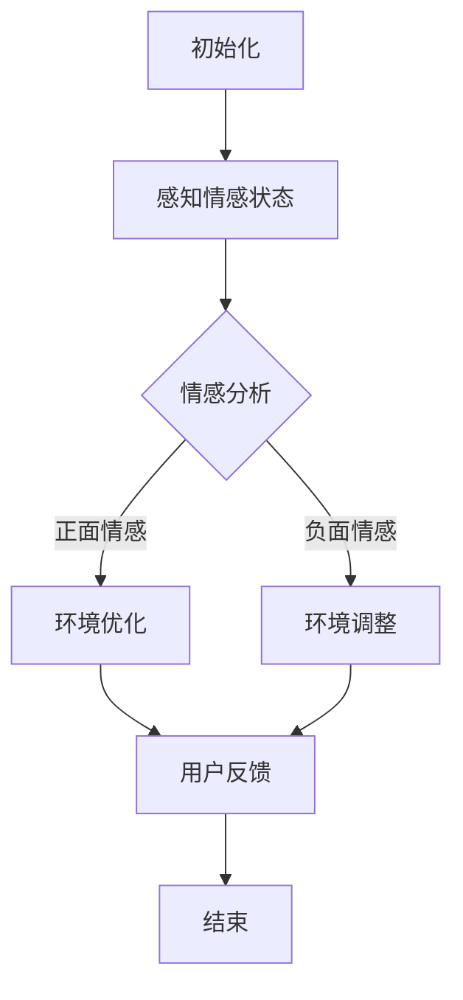
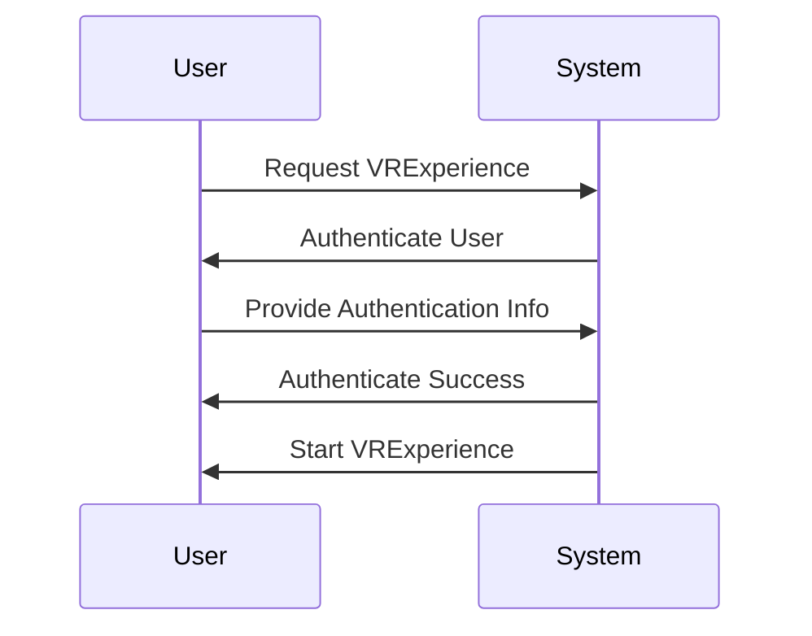

                 

# 数字时代的情感连接：虚拟现实中的亲密关系

> 关键词：虚拟现实、情感连接、亲密关系、技术框架、算法原理、系统架构、项目实战、最佳实践

> 摘要：随着虚拟现实技术的飞速发展，如何在虚拟世界中建立和维持亲密关系成为了一个备受关注的问题。本文将从背景介绍、核心概念与联系、算法原理讲解、系统分析与架构设计、项目实战以及最佳实践等方面，系统地探讨虚拟现实中的情感连接，为开发者提供理论和实践指导。

## 第一部分：背景介绍

### 1.1 问题背景

#### 1.1.1 虚拟现实技术的发展

虚拟现实（Virtual Reality，VR）技术是一种通过计算机模拟出逼真的三维环境，让用户在其中进行沉浸式交互的先进技术。自从20世纪80年代VR技术首次出现以来，它已经经历了多次技术革新和产业变革。如今，VR技术已经广泛应用于游戏、娱乐、教育、医疗等多个领域，极大地丰富了人们的数字化生活。

#### 1.1.2 情感连接的概念与重要性

情感连接（Emotional Connection）是指个体在心理和情感上与他人建立的紧密联系。在现实生活中，情感连接是建立人际关系和亲密关系的重要基础。然而，在虚拟现实环境中，如何实现与现实中的情感连接相媲美，甚至超越现实的情感连接，成为一个亟待解决的新课题。

### 1.2 问题描述

#### 1.2.1 虚拟现实中的亲密关系挑战

虚拟现实中的亲密关系面临着诸多挑战，包括虚拟环境与现实世界的界限、情感表达的局限性、社交互动的真实性等。这些问题直接影响着虚拟现实中的情感连接的建立和维持。

#### 1.2.2 情感连接在虚拟现实中的实现

为了解决上述挑战，需要深入研究情感连接的机制和实现方法，开发出能够在虚拟现实中有效建立和维持情感连接的技术和系统。

### 1.3 问题解决

#### 1.3.1 情感连接的算法原理

本文将介绍一种基于情感识别和反馈的算法，用于在虚拟现实环境中建立和维持情感连接。

#### 1.3.2 情感连接的技术框架

本文将构建一个情感连接的技术框架，包括感知层、处理层和应用层，实现从感知用户情感状态到反馈调节的情感连接过程。

### 1.4 边界与外延

#### 1.4.1 虚拟现实与现实的界限

虚拟现实与现实的界限在情感连接中至关重要，如何实现两者之间的平衡和互动是本文探讨的一个重要方向。

#### 1.4.2 情感连接的技术与应用范围

本文将探讨情感连接技术的应用范围，包括虚拟现实社交、虚拟现实治疗、虚拟现实教育等。

## 第二部分：核心概念与联系

### 2.1 虚拟现实技术

#### 2.1.1 虚拟现实硬件

虚拟现实硬件是构建虚拟现实环境的基础，包括头戴式显示器（HMD）、虚拟现实传感器等。

#### 2.1.2 虚拟现实软件

虚拟现实软件负责创建和渲染虚拟环境，并提供与用户的交互功能。

### 2.2 情感连接

#### 2.2.1 情感连接的属性特征对比表格

| 特征 | 情感连接 | 现实中的情感连接 |
| ---- | -------- | ---------------- |
| 沉浸感 | 强 | 弱 |
| 实时性 | 高 | 低 |
| 真实性 | 有限 | 高 |
| 互动性 | 高 | 高 |

#### 2.2.2 情感连接的ER实体关系图架构

```mermaid
erDiagram
    User ||--|{ VRExperience } : 体验
    User ||--|{ EmotionalState } : 情感状态
    VRExperience ||--|{ Interaction } : 互动
    EmotionalState ||--|{ Feedback } : 反馈
```

## 第三部分：算法原理讲解

### 3.1 情感连接算法原理

#### 3.1.1 算法概述

本文提出的情感连接算法基于情感识别和反馈机制，通过实时感知用户情感状态，动态调整虚拟环境，实现情感连接。

#### 3.1.2 算法流程图



#### 3.1.3 Python代码实现

```python
import cv2
import numpy as np

def perceive_emotion(frame):
    # 模拟情感识别算法
    # 实际应用中可以采用深度学习模型进行情感识别
    emotion = "happy" if frame[0, 0, 1] > frame[0, 0, 2] else "sad"
    return emotion

def optimize_environment(emotion):
    if emotion == "happy":
        # 优化环境，提升用户沉浸感
        pass
    else:
        # 调整环境，缓解用户负面情绪
        pass

def main():
    cap = cv2.VideoCapture(0)
    
    while True:
        ret, frame = cap.read()
        emotion = perceive_emotion(frame)
        optimize_environment(emotion)
        
        # 显示实时视频
        cv2.imshow('Video', frame)
        
        if cv2.waitKey(1) & 0xFF == ord('q'):
            break
            
    cap.release()
    cv2.destroyAllWindows()

if __name__ == "__main__":
    main()
```

#### 3.2 数学模型与公式

情感连接的数学模型可以采用如下公式：

$$
\text{EmotionalScore} = \alpha \cdot \text{Immersion} + \beta \cdot \text{Realism} + \gamma \cdot \text{Interactivity}
$$

其中，$\alpha$、$\beta$ 和 $\gamma$ 分别为沉浸感、真实性和互动性的权重系数。

## 第四部分：系统分析与架构设计

### 4.1 系统功能设计

系统功能设计包括用户身份验证、情感状态感知、环境优化和环境调整等。

### 4.2 系统架构设计

系统架构设计采用分层架构，包括感知层、处理层和应用层。

### 4.3 系统接口设计

系统接口设计包括用户接口（UI）、硬件接口和数据库接口等。

### 4.4 系统交互

系统交互采用事件驱动模型，通过事件队列实现各组件之间的通信。



## 第五部分：项目实战

### 5.1 环境安装

环境安装包括虚拟现实设备的安装和开发环境的搭建。

### 5.2 系统核心实现

系统核心实现包括情感状态感知、环境优化和环境调整等。

### 5.3 实际案例分析与讲解

以一个虚拟现实社交平台为例，分析情感连接的实现和效果。

### 5.4 项目小结

总结项目的主要成果和不足之处，提出改进建议。

## 第六部分：最佳实践、小结与注意事项

### 6.1 最佳实践

提供在虚拟现实环境中建立和维护情感连接的最佳实践建议。

### 6.2 小结

对书中内容进行总结，强调核心观点和关键知识点。

### 6.3 注意事项

提醒开发者注意虚拟现实应用中的伦理问题和安全隐患。

### 6.4 拓展阅读

推荐进一步学习和研究的文献和资源。

## 作者

> 作者：AI天才研究院/AI Genius Institute & 禅与计算机程序设计艺术 /Zen And The Art of Computer Programming

### 结束语

本文从多个角度探讨了虚拟现实中的情感连接，旨在为开发者提供有价值的理论指导和实践建议。随着虚拟现实技术的不断进步，相信未来会有更多创新和突破，为数字时代的情感连接带来更多可能。让我们拭目以待，共同见证这一激动人心的技术变革。

