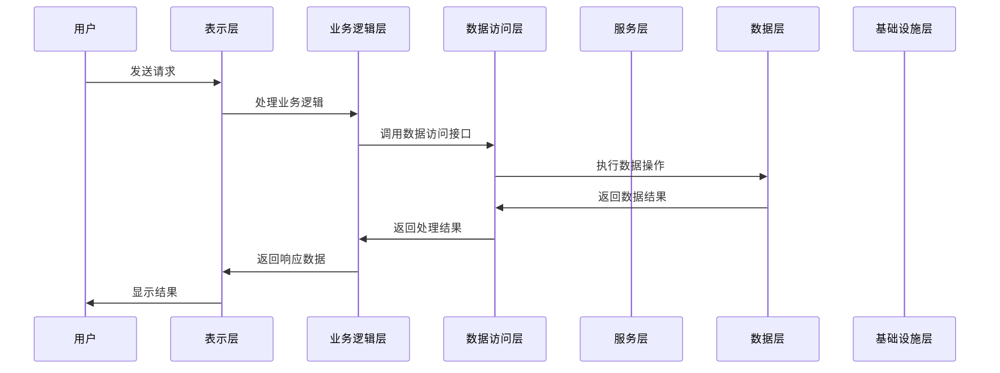
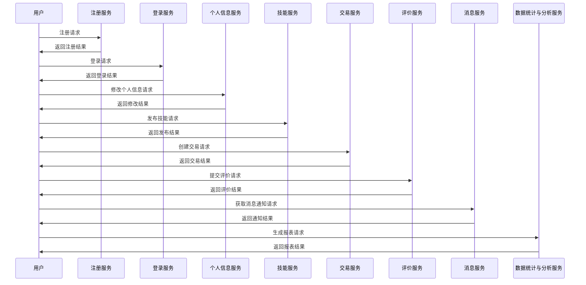

                 


### 核心概念与联系

在深入探讨《数字时代的技能共享市集：线上线下结合的现代化易物系统》这一主题之前，我们需要明确几个核心概念，并理解它们之间的联系。

#### 1. 数字时代

数字时代，是指以互联网和信息技术为核心的经济发展阶段。在这个阶段，数据成为新的生产要素，信息技术成为推动经济增长的主要动力。数字时代的显著特征包括：
- **互联网普及**：全球范围内互联网的广泛接入，使得信息交流更加便捷。
- **云计算**：通过云计算服务，用户可以按需获取计算资源，降低运营成本。
- **大数据**：海量数据的存储、处理和分析能力，为企业提供了洞见，促进了决策的科学化。

#### 2. 技能共享市集

技能共享市集是一个平台，使得个人或组织可以交换他们的技能和知识。技能共享的核心理念是通过资源共享，提高效率，实现互利共赢。技能共享市集的关键组成部分包括：
- **技能供给方**：提供技能的个人或组织。
- **技能需求方**：需要获取技能的个人或组织。
- **交易机制**：确保技能交换的公平、安全和有效。

#### 3. 现代化易物系统

现代化易物系统是将传统易物理念与现代技术相结合的产物。它不仅实现了物物交换，还引入了数据管理、交易安全、用户体验设计等现代技术元素，提高了易物的效率与安全性。现代化易物系统的主要特点包括：
- **数据驱动**：通过数据分析优化交易匹配，提升用户体验。
- **安全可靠**：采用先进的安全技术，保障交易数据的安全。
- **线上线下结合**：既提供在线交易平台，也支持线下实际交易。

#### 4. 核心概念之间的联系

- **数字时代**为技能共享市集和现代化易物系统提供了技术支撑，使得这些概念得以实现。
- **技能共享市集**是现代化易物系统的应用场景，通过技能交换实现资源的优化配置。
- **现代化易物系统**是技能共享市集的技术实现，它将传统易物的概念升级为现代技术手段。

#### 5. 概念属性特征对比表格

为了更清晰地展示这几个核心概念的特征，我们可以通过一个表格来进行对比：

| 概念         | 特征                                      | 举例                                 |
|------------|-----------------------------------------|------------------------------------|
| 数字时代     | 互联网普及、云计算、大数据                   | 网络购物、在线教育、远程办公               |
| 技能共享市集   | 技能交换、资源共享、互利共赢                   | 技能培训平台、在线咨询、互助社群             |
| 现代化易物系统   | 数据驱动、安全可靠、线上线下结合                 | 物品交换平台、虚拟货币交易、智能合约           |

#### 6. ER实体关系图架构

为了进一步理解现代化易物系统中的实体关系，我们可以通过一个ER实体关系图来展示：

```mermaid
erDiagram
    Student ||--|{ Course : 学习 }
    Student ||--|{ Skill : 拥有 }
    Course ||--|{ Skill : 包含 }
    Skill ||--|{ User : 使用 }
```

在这个ER图架构中，我们定义了四个实体：Student（学生）、Course（课程）、Skill（技能）和User（用户）。这些实体之间通过关系进行关联，形成了现代化易物系统的基础结构。

通过上述核心概念和ER图的阐述，我们可以为后续章节的内容提供坚实的理论基础。接下来，我们将进一步深入探讨现代化易物系统的技术实现和应用场景。

### 文章标题：数字时代的技能共享市集：线上线下结合的现代化易物系统

关键词：数字时代，技能共享，易物系统，线上线下结合，现代化，技术实现

摘要：本文将探讨数字时代下技能共享市集的发展及其与现代化易物系统的结合。通过对核心概念、技术基础、系统架构和实际应用的分析，本文旨在为读者提供深入了解和思考这一领域的视角。

### 目录

1. **引言**
   - 1.1 数字时代的背景
   - 1.2 技能共享市集的概念
   - 1.3 现代化易物系统的意义

2. **核心概念与联系**
   - 2.1 数字时代
   - 2.2 技能共享市集
   - 2.3 现代化易物系统
   - 2.4 概念属性特征对比表格
   - 2.5 ER实体关系图架构

3. **技术基础**
   - 3.1 数据管理技术
   - 3.2 交易安全技术
   - 3.3 用户体验设计

4. **系统架构**
   - 4.1 系统功能模块设计
   - 4.2 系统架构设计
   - 4.3 系统接口设计与交互

5. **实际应用案例**
   - 5.1 案例一：教育领域的技能共享
   - 5.2 案例二：企业内的技能交换
   - 5.3 案例三：社区互助中的技能市集

6. **未来趋势**
   - 6.1 技能共享市场的发展前景
   - 6.2 潜在挑战与应对策略
   - 6.3 未来技术展望

7. **总结与展望**
   - 7.1 主要内容回顾
   - 7.2 最佳实践建议
   - 7.3 下一步研究方向

### 第1章：引言

#### 1.1 数字时代的背景

数字时代，顾名思义，是一个以数字技术为核心推动社会发展的时代。在这个时代，互联网、大数据、云计算、人工智能等技术的飞速进步，彻底改变了人们的生活方式、工作方式和社会形态。以下是数字时代的几个关键特征：

1. **互联网的普及**：互联网已经深入到人们生活的方方面面，从购物、支付、娱乐到工作、学习、社交，都离不开互联网的支持。全球范围内的互联网接入，使得信息交流变得更加便捷和高效。

2. **数据驱动**：数据成为新的生产要素，通过大数据分析和人工智能算法，企业可以更好地理解用户需求，优化业务流程，提升决策效率。数据驱动已经成为现代企业提升竞争力的关键因素。

3. **云计算和大数据**：云计算提供了弹性的计算资源，使得企业可以根据需求灵活调整计算能力。大数据技术则使得海量数据的存储、处理和分析成为可能，为企业提供了丰富的洞见。

4. **物联网（IoT）**：物联网技术的发展，使得各种设备可以互联互通，形成一个智能化的网络。智能家居、智能交通、智能医疗等应用场景，正在不断拓展物联网的应用范围。

#### 1.2 技能共享市集的概念

技能共享市集，是一个基于互联网的平台，旨在促进个人或组织之间的技能和知识交换。这个市集的核心在于资源共享和互利共赢。以下是技能共享市集的几个关键组成部分：

1. **技能供给方**：技能供给方是提供技能的个人或组织。他们可能拥有独特的技能或知识，愿意将这些资源分享给有需要的人。

2. **技能需求方**：技能需求方是需要获取技能的个人或组织。他们可能面临技能短缺的问题，希望通过技能共享市集找到合适的资源。

3. **交易平台**：交易平台是技能共享市集的核心组成部分。通过这个平台，技能供给方和需求方可以方便地进行技能交换。

4. **交易机制**：交易机制包括信誉体系、支付方式、安全保证等。这些机制确保了技能交换的公平、安全和有效。

#### 1.3 现代化易物系统的意义

现代化易物系统是将传统易物理念与现代技术相结合的产物。它不仅实现了物物交换，还引入了数据管理、交易安全、用户体验设计等现代技术元素，从而提高了易物的效率与安全性。以下是现代化易物系统的几个关键意义：

1. **提高效率**：通过数据分析和智能匹配，现代化易物系统可以快速找到供需双方的最佳匹配，提高交易效率。

2. **降低成本**：现代化易物系统减少了中间环节，降低了交易成本，使得资源交换更加经济高效。

3. **保障安全**：现代化易物系统采用了先进的安全技术，如区块链、加密算法等，保障了交易数据的安全性和隐私性。

4. **促进资源共享**：现代化易物系统鼓励个人和组织共享他们的资源，从而实现资源的最大化利用。

### 第2章：核心概念与联系

#### 2.1 数字时代

数字时代，是指以数字技术为核心推动社会发展的时代。在这个时代，互联网、大数据、云计算、人工智能等技术的飞速进步，彻底改变了人们的生活方式、工作方式和社会形态。以下是数字时代的几个关键特征：

1. **互联网的普及**：互联网已经深入到人们生活的方方面面，从购物、支付、娱乐到工作、学习、社交，都离不开互联网的支持。全球范围内的互联网接入，使得信息交流变得更加便捷和高效。

2. **数据驱动**：数据成为新的生产要素，通过大数据分析和人工智能算法，企业可以更好地理解用户需求，优化业务流程，提升决策效率。数据驱动已经成为现代企业提升竞争力的关键因素。

3. **云计算和大数据**：云计算提供了弹性的计算资源，使得企业可以根据需求灵活调整计算能力。大数据技术则使得海量数据的存储、处理和分析成为可能，为企业提供了丰富的洞见。

4. **物联网（IoT）**：物联网技术的发展，使得各种设备可以互联互通，形成一个智能化的网络。智能家居、智能交通、智能医疗等应用场景，正在不断拓展物联网的应用范围。

#### 2.2 技能共享市集

技能共享市集，是一个基于互联网的平台，旨在促进个人或组织之间的技能和知识交换。这个市集的核心在于资源共享和互利共赢。以下是技能共享市集的几个关键组成部分：

1. **技能供给方**：技能供给方是提供技能的个人或组织。他们可能拥有独特的技能或知识，愿意将这些资源分享给有需要的人。

2. **技能需求方**：技能需求方是需要获取技能的个人或组织。他们可能面临技能短缺的问题，希望通过技能共享市集找到合适的资源。

3. **交易平台**：交易平台是技能共享市集的核心组成部分。通过这个平台，技能供给方和需求方可以方便地进行技能交换。

4. **交易机制**：交易机制包括信誉体系、支付方式、安全保证等。这些机制确保了技能交换的公平、安全和有效。

#### 2.3 现代化易物系统

现代化易物系统是将传统易物理念与现代技术相结合的产物。它不仅实现了物物交换，还引入了数据管理、交易安全、用户体验设计等现代技术元素，从而提高了易物的效率与安全性。以下是现代化易物系统的几个关键意义：

1. **提高效率**：通过数据分析和智能匹配，现代化易物系统可以快速找到供需双方的最佳匹配，提高交易效率。

2. **降低成本**：现代化易物系统减少了中间环节，降低了交易成本，使得资源交换更加经济高效。

3. **保障安全**：现代化易物系统采用了先进的安全技术，如区块链、加密算法等，保障了交易数据的安全性和隐私性。

4. **促进资源共享**：现代化易物系统鼓励个人和组织共享他们的资源，从而实现资源的最大化利用。

#### 2.4 概念属性特征对比表格

为了更清晰地展示数字时代、技能共享市集和现代化易物系统的特征，我们可以通过一个表格来进行对比：

| 概念         | 特征                                      | 举例                                 |
|------------|-----------------------------------------|------------------------------------|
| 数字时代     | 互联网普及、云计算、大数据                   | 网络购物、在线教育、远程办公               |
| 技能共享市集   | 技能交换、资源共享、互利共赢                   | 技能培训平台、在线咨询、互助社群             |
| 现代化易物系统   | 数据驱动、安全可靠、线上线下结合                 | 物品交换平台、虚拟货币交易、智能合约           |

#### 2.5 ER实体关系图架构

为了进一步理解现代化易物系统中的实体关系，我们可以通过一个ER实体关系图来展示：

```mermaid
erDiagram
    User ||--|{ Skill : 具有 }
    User ||--|{ Transaction : 进行 }
    Skill ||--|{ Category : 属于 }
    Transaction ||--|{ Item : 交易 }
    Item ||--|{ Status : 状态 }
```

在这个ER图架构中，我们定义了四个实体：User（用户）、Skill（技能）、Transaction（交易）和Item（物品）。这些实体之间通过关系进行关联，形成了现代化易物系统的基础结构。

通过上述核心概念的阐述和对比，我们可以为后续章节的内容提供坚实的理论基础。接下来，我们将进一步探讨现代化易物系统的技术实现和应用场景。

### 第3章：技术基础

在数字时代，技能共享市集的成功离不开先进技术的支持。本章将深入探讨现代化易物系统的技术基础，包括数据管理技术、交易安全技术和用户体验设计。

#### 3.1 数据管理技术

数据管理技术在技能共享市集中扮演着关键角色。一个高效、可靠的数据管理系统可以帮助平台优化技能匹配，提高交易效率，同时保障数据安全。

1. **数据存储**：技能共享市集需要存储大量的用户数据、技能信息和交易记录。因此，选择一个高效、可靠的数据存储方案至关重要。常见的数据存储方案包括关系型数据库（如MySQL、PostgreSQL）和非关系型数据库（如MongoDB、Cassandra）。

2. **数据同步与备份**：在技能共享市集中，数据同步和备份是确保数据一致性和安全性的重要手段。采用分布式数据同步技术，可以确保在不同节点上存储的数据保持一致。同时，定期进行数据备份，可以防止数据丢失。

3. **数据清洗与处理**：技能共享市集涉及到的数据通常非常复杂，包含各种格式和结构。因此，数据清洗与处理是确保数据质量的关键步骤。通过数据清洗，可以去除重复数据、错误数据和无效数据，确保数据的准确性和一致性。

4. **数据分析与挖掘**：数据分析与挖掘是技能共享市集的核心功能之一。通过大数据分析和机器学习算法，可以挖掘用户行为数据，优化技能匹配，提升用户体验。例如，基于用户的历史交易记录和偏好，可以推荐相关的技能交换机会。

#### 3.2 交易安全技术

交易安全是技能共享市集的另一个重要方面。一个安全的交易平台可以增强用户的信任，促进交易的顺利进行。

1. **加密算法**：加密算法是保障交易数据安全的关键技术。通过使用对称加密（如AES）和非对称加密（如RSA），可以确保交易数据的机密性和完整性。

2. **数字签名**：数字签名是一种验证数据来源和完整性的技术。通过使用公钥和私钥对交易数据进行签名，可以确保数据未被篡改，同时验证发送方的身份。

3. **区块链技术**：区块链技术是一种分布式账本技术，具有去中心化、不可篡改和安全可靠的特点。在技能共享市集中，区块链技术可以用于记录交易数据，确保数据的透明性和可追溯性。

4. **安全审计**：安全审计是一种监控和评估系统安全性的方法。通过定期进行安全审计，可以及时发现潜在的安全漏洞，采取相应的措施进行修复。

#### 3.3 用户体验设计

用户体验设计是技能共享市集成功的关键因素之一。一个良好的用户体验可以增强用户满意度，促进用户留存和推荐。

1. **界面设计**：界面设计直接影响用户的操作体验。一个简洁、直观的界面设计可以提高用户的操作效率和满意度。在设计过程中，应注重色彩搭配、字体选择和布局设计，确保界面美观且易用。

2. **交互设计**：交互设计关注用户与系统的交互过程。通过优化交互流程，可以减少用户的操作步骤，提高交易效率。例如，采用智能搜索、推荐算法等交互设计，可以帮助用户快速找到所需的技能和交易机会。

3. **响应式设计**：随着移动设备的普及，响应式设计变得越来越重要。一个响应式网站可以在不同设备和屏幕尺寸上提供一致的浏览体验，满足用户的多样化需求。

4. **性能优化**：性能优化是提升用户体验的关键。通过优化代码、使用缓存技术和负载均衡等措施，可以降低网站的响应时间，提高用户体验。

通过上述技术基础的探讨，我们可以为技能共享市集的构建提供坚实的理论基础。在下一章中，我们将进一步探讨现代化易物系统的系统架构设计和实际应用案例。

### 第4章：系统架构

在探讨数字时代的技能共享市集：线上线下结合的现代化易物系统时，系统架构设计是关键的一环。一个合理且高效的系统架构不仅能够提高系统的性能和可扩展性，还能确保系统的安全性和稳定性。本章将详细介绍系统架构的设计方案，包括系统功能模块、系统架构和系统接口设计与交互。

#### 4.1 系统功能模块设计

系统功能模块设计是系统架构设计的基础。技能共享市集的功能模块主要包括以下几个方面：

1. **用户管理模块**：负责用户的注册、登录、个人信息管理等功能。用户管理模块需要与数据库进行交互，以存储和获取用户信息。

2. **技能管理模块**：负责技能的发布、分类、查询和推荐等功能。技能管理模块需要与数据库和搜索引擎进行交互，以处理技能数据的存储和检索。

3. **交易管理模块**：负责交易订单的创建、处理、支付和结算等功能。交易管理模块需要与支付系统进行集成，确保交易的顺利进行。

4. **评价与反馈模块**：负责用户的评价、反馈和信用体系管理。评价与反馈模块需要与用户管理模块和交易管理模块进行交互，以实现评价数据的记录和反馈。

5. **消息通知模块**：负责发送交易通知、系统消息和用户通知。消息通知模块需要与用户管理模块和交易管理模块进行交互，以确保用户及时获取相关信息。

6. **数据统计与分析模块**：负责收集系统运行数据，进行数据分析和报表生成。数据统计与分析模块需要与数据库和大数据处理平台进行交互，以实现数据的高效分析和处理。

7. **权限与安全模块**：负责系统的权限管理、安全认证和日志记录。权限与安全模块需要与用户管理模块和交易管理模块进行交互，以确保系统的安全性和合规性。

#### 4.2 系统架构设计

系统架构设计是确保系统能够满足业务需求、具备高可用性和可扩展性的关键。技能共享市集的系统架构可以采用分层架构设计，包括以下几层：

1. **表示层**：表示层主要负责用户界面的展示和用户交互。通常使用前端框架（如React、Vue.js）进行开发，以确保界面的美观和易用。

2. **业务逻辑层**：业务逻辑层负责处理业务逻辑和数据处理。通常使用后端框架（如Spring Boot、Django）进行开发，确保业务逻辑的清晰和高效。

3. **数据访问层**：数据访问层负责与数据库进行交互，实现数据的存储和检索。可以使用ORM框架（如Hibernate、MyBatis）简化数据访问操作。

4. **服务层**：服务层负责处理跨模块的业务逻辑和公共服务。例如，用户服务、技能服务、交易服务等。服务层可以采用微服务架构，以提高系统的灵活性和可扩展性。

5. **数据层**：数据层负责数据存储和管理。可以选择关系型数据库（如MySQL、PostgreSQL）或非关系型数据库（如MongoDB、Cassandra），根据业务需求进行选择。

6. **基础设施层**：基础设施层负责提供系统的运行环境，包括服务器、网络、存储等。可以采用云服务（如AWS、Azure）或自建数据中心，根据实际情况进行选择。

以下是系统架构设计的Mermaid流程图：



#### 4.3 系统接口设计与交互

系统接口设计是确保系统各模块之间能够高效、稳定地进行数据交互和功能协作的关键。以下是一些关键的系统接口设计：

1. **用户接口**：用户接口主要用于用户与系统之间的交互，包括注册、登录、个人信息管理、技能发布和查询等。

2. **技能接口**：技能接口主要用于技能数据的操作，包括技能发布、分类管理、查询推荐等。

3. **交易接口**：交易接口主要用于交易数据的操作，包括交易创建、处理、支付和结算等。

4. **评价与反馈接口**：评价与反馈接口主要用于评价数据的操作，包括评价提交、反馈处理和信用管理。

5. **消息通知接口**：消息通知接口主要用于消息通知的发送和接收，包括交易通知、系统消息和用户通知。

6. **数据统计与分析接口**：数据统计与分析接口主要用于数据统计和分析，包括报表生成、数据可视化等。

以下是系统接口设计的Mermaid序列图：



通过上述系统架构设计和接口设计的介绍，我们可以为技能共享市集的构建提供清晰的指导。在下一章中，我们将通过实际应用案例，进一步展示现代化易物系统的应用场景和实现过程。

### 第5章：实际应用案例

在深入探讨数字时代的技能共享市集：线上线下结合的现代化易物系统后，我们通过三个实际应用案例来具体展示这一系统的应用场景和实现过程。

#### 5.1 案例一：教育领域的技能共享

**问题描述**：随着在线教育的发展，越来越多的学生希望通过互联网平台获取各种学习资源。然而，学习资源的供给和需求之间存在一定的信息不对称问题，学生难以找到符合自己需求的学习资源。

**解决方案**：利用技能共享市集，学生可以发布自己的学习需求，教师可以提供相应的课程资源。以下是解决方案的详细实现步骤：

1. **用户注册与登录**：学生和教师首先在技能共享市集上注册账号并登录，进行个人信息管理。

2. **课程发布与管理**：教师可以在平台上发布自己的课程资源，包括课程名称、课程简介、学习目标、课程内容等。同时，教师可以对这些资源进行分类管理，便于学生查询。

3. **课程搜索与推荐**：学生可以通过关键词搜索或浏览分类目录，找到符合自己需求的学习资源。平台还可以采用推荐算法，根据学生的学习历史和偏好，推荐相关的课程资源。

4. **课程交易与支付**：学生选择合适的课程后，可以发起交易请求，教师收到交易请求后进行确认。交易完成后，学生可以开始学习课程，教师则获得相应的报酬。

5. **评价与反馈**：学习结束后，学生可以对课程进行评价和反馈，教师也可以根据学生的反馈进行课程改进。评价和反馈数据用于平台的信用体系和推荐算法的优化。

**系统实现**：在系统实现方面，采用分层架构设计，包括表示层、业务逻辑层、数据访问层和数据层。前端使用React框架，后端使用Spring Boot框架。数据库采用MySQL进行数据存储，使用Redis进行缓存处理。

#### 5.2 案例二：企业内的技能交换

**问题描述**：企业内部员工之间存在丰富的技能资源，但往往由于沟通不畅和信息不对称，这些技能资源得不到充分利用。为了提高企业的整体效率，需要建立一套技能交换系统。

**解决方案**：在技能共享市集的基础上，为企业内部员工构建一个技能交换平台，实现内部技能资源的有效共享。以下是解决方案的详细实现步骤：

1. **员工注册与登录**：企业员工在技能共享平台上注册账号并登录，进行个人信息管理。

2. **技能发布与管理**：员工可以发布自己的技能信息，包括技能名称、技能描述、技能水平和可用时间等。员工也可以对这些技能信息进行分类管理，便于其他员工查询。

3. **技能搜索与推荐**：员工可以通过关键词搜索或浏览分类目录，找到需要的技能资源。平台还可以根据员工的工作内容和技能偏好，推荐相关的技能资源。

4. **技能交易与协调**：员工选择合适的技能资源后，可以发起交易请求，包括技能交换的时间和地点。平台会对交易请求进行审核和协调，确保交易的顺利进行。

5. **评价与反馈**：交易结束后，员工可以对交易过程和技能提供者进行评价和反馈，用于平台的信用体系和推荐算法的优化。

**系统实现**：在系统实现方面，采用微服务架构，包括用户服务、技能服务、交易服务、评价服务和管理服务。前端使用Vue.js框架，后端使用Spring Cloud框架。数据库采用MySQL进行数据存储，使用Elasticsearch进行搜索引擎处理。

#### 5.3 案例三：社区互助中的技能市集

**问题描述**：社区中存在各种互助需求，如维修家电、看护老人、辅导孩子等。然而，社区居民之间缺乏有效的沟通渠道，导致互助资源难以充分利用。

**解决方案**：在技能共享市集的基础上，构建一个社区互助技能市集，实现社区居民之间的技能资源共享。以下是解决方案的详细实现步骤：

1. **社区注册与登录**：社区居民在技能共享市集上注册账号并登录，进行个人信息管理。

2. **技能发布与管理**：社区居民可以发布自己的技能信息，包括技能名称、技能描述、技能水平和可用时间等。居民也可以对这些技能信息进行分类管理，便于其他居民查询。

3. **技能搜索与推荐**：社区居民可以通过关键词搜索或浏览分类目录，找到需要的技能资源。平台还可以根据居民的生活需求和行为数据，推荐相关的技能资源。

4. **技能交易与协调**：社区居民选择合适的技能资源后，可以发起交易请求，包括技能交换的时间和地点。平台会对交易请求进行审核和协调，确保交易的顺利进行。

5. **评价与反馈**：交易结束后，居民可以对交易过程和技能提供者进行评价和反馈，用于平台的信用体系和推荐算法的优化。

**系统实现**：在系统实现方面，采用前后端分离架构，前端使用Vue.js框架，后端使用Spring Boot框架。数据库采用MySQL进行数据存储，使用Redis进行缓存处理。平台还引入了区块链技术，用于记录交易数据，确保数据的透明性和不可篡改性。

通过上述三个实际应用案例，我们可以看到，数字时代的技能共享市集：线上线下结合的现代化易物系统在不同场景下都有着广泛的应用前景。这些案例不仅展示了系统的实现过程，还说明了系统在实际应用中的优势和潜力。

### 第6章：未来趋势

在数字时代的浪潮下，技能共享市集：线上线下结合的现代化易物系统正迅速发展，并在各个领域展现出巨大的潜力。然而，随着技术的不断进步和市场的变化，技能共享市集也面临着一系列的挑战和机遇。以下是对未来技能共享市场发展趋势、潜在挑战及其应对策略的探讨。

#### 6.1 技能共享市场的发展前景

1. **市场需求增长**：随着全球化和信息化进程的加速，人们对技能共享的需求日益增长。无论是个人学习新技能，还是企业优化人力资源配置，技能共享市集都将发挥重要作用。

2. **技术进步推动**：大数据、人工智能、区块链等前沿技术的应用，将为技能共享市场带来新的发展机遇。例如，通过大数据分析，可以更精确地匹配供需双方，提高交易效率。人工智能技术则可以自动化处理大量数据，提高系统的智能化水平。区块链技术可以为交易提供透明、安全的保障。

3. **跨界融合**：技能共享市场与其他行业的融合，将创造更多应用场景。例如，教育与技能共享的结合，可以提供个性化的在线教育服务；医疗与健康领域的技能共享，可以提升医疗服务质量和效率。

4. **全球市场扩张**：随着互联网的普及，技能共享市场在全球范围内具有巨大的扩张潜力。跨国技能共享将打破地域限制，促进全球人才的流动和技能的传播。

#### 6.2 潜在挑战与应对策略

1. **数据隐私和安全问题**：技能共享市集涉及大量用户数据，如何保护用户隐私和数据安全是重要挑战。应对策略包括：
   - **数据加密**：采用加密技术保护用户数据的机密性。
   - **隐私保护算法**：应用差分隐私、同态加密等算法，在数据使用过程中保护用户隐私。
   - **安全审计**：定期进行安全审计，及时发现和修复安全漏洞。

2. **信任与信誉体系**：建立有效的信任和信誉体系，是技能共享市场健康发展的关键。应对策略包括：
   - **评价与反馈机制**：通过用户评价和反馈，建立可靠的信誉体系。
   - **第三方认证**：引入第三方认证机构，对技能提供者的资质进行审核和认证。
   - **信用评分**：对用户的信用行为进行评分，建立信用记录。

3. **法律与合规问题**：技能共享市场的法律和合规问题复杂多样，包括税收、劳动法、知识产权等方面。应对策略包括：
   - **法律咨询与培训**：为平台运营者和用户提供法律咨询服务，提高合规意识。
   - **政策跟踪与调整**：关注政策动态，及时调整平台运营策略，确保合规性。
   - **合规技术解决方案**：开发合规技术工具，帮助用户和平台运营者遵守相关法律法规。

4. **技术实现与运维挑战**：技能共享市集需要高效、可靠的技术实现和运维支持。应对策略包括：
   - **技术选型与优化**：选择成熟、稳定的技术框架和工具，并进行持续优化。
   - **运维自动化**：采用自动化运维工具，提高系统运维效率和稳定性。
   - **持续集成与持续部署**：实施CI/CD流程，确保系统快速迭代和稳定运行。

5. **用户教育与培训**：技能共享市场的发展离不开用户的参与和理解。应对策略包括：
   - **用户指南**：提供详细的用户指南，帮助用户了解平台功能和操作流程。
   - **在线教程与社区**：建立在线教程和社区，为用户提供学习资源和交流平台。
   - **营销与推广**：通过营销活动和推广，提高用户对技能共享市场的认知和参与度。

#### 6.3 未来技术展望

1. **人工智能与大数据**：人工智能和大数据技术将在技能共享市场中发挥更大作用。例如，通过机器学习算法，可以更准确地预测用户需求，优化技能匹配。大数据分析则可以为企业提供洞察，优化人力资源配置。

2. **区块链与智能合约**：区块链技术的应用将进一步提升技能共享市场的透明性和安全性。智能合约可以自动化执行交易协议，提高交易效率。

3. **物联网（IoT）**：物联网技术可以将技能共享市集与实际场景结合，实现更高效的资源交换。例如，通过智能家居设备，用户可以远程控制家电维修。

4. **虚拟现实（VR）与增强现实（AR）**：VR和AR技术可以提供更丰富的用户体验，使得技能交换过程更加生动和直观。

5. **5G与边缘计算**：5G技术的普及和边缘计算的发展，将为技能共享市场提供更高速、更稳定的网络环境，支持更多的实时应用场景。

通过上述对技能共享市场未来趋势的探讨，我们可以看到，尽管技能共享市场面临着诸多挑战，但机遇与挑战并存。通过不断创新和优化，技能共享市集：线上线下结合的现代化易物系统将在未来发挥更大的作用，为个人、企业和整个社会创造更多价值。

### 第7章：总结与展望

在本篇技术博客中，我们系统地探讨了数字时代的技能共享市集：线上线下结合的现代化易物系统。通过从核心概念、技术基础、系统架构到实际应用案例的深入分析，我们揭示了这一系统在当前社会发展中的重要地位和广阔前景。

#### 主要内容回顾

1. **数字时代的背景**：我们探讨了数字时代的特点，如互联网普及、数据驱动、云计算和大数据等，为技能共享市集和现代化易物系统的发展提供了技术支撑。

2. **核心概念与联系**：明确了数字时代、技能共享市集和现代化易物系统的核心概念及其相互联系，为后续内容提供了理论基础。

3. **技术基础**：详细介绍了数据管理技术、交易安全技术和用户体验设计，这些技术是实现现代化易物系统的关键。

4. **系统架构**：通过分层架构设计和实际接口设计，展示了技能共享市集的技术实现过程。

5. **实际应用案例**：通过教育领域、企业内部和社区互助三个实际应用案例，展示了现代化易物系统的广泛应用场景和实现过程。

6. **未来趋势**：探讨了技能共享市场的发展前景、潜在挑战和应对策略，以及未来技术展望。

#### 最佳实践建议

1. **注重用户体验**：在技能共享市集的设计和运营中，始终将用户体验放在首位，通过简洁直观的界面设计和高效的功能实现，提升用户满意度。

2. **强化数据安全**：建立健全的数据安全体系，采用先进的加密技术和安全审计机制，确保用户数据和交易数据的安全性和隐私性。

3. **灵活技术选型**：根据具体业务需求，灵活选择适合的技术框架和工具，确保系统的高效性和可扩展性。

4. **持续创新和优化**：不断跟踪技术发展趋势，通过创新和优化，提升技能共享市集的功能和性能。

#### 注意事项

1. **法律合规**：在技能共享市集的运营中，要严格遵守相关法律法规，确保平台的合法合规运营。

2. **数据隐私**：在数据处理过程中，要高度重视用户隐私保护，采用隐私保护算法和措施，避免数据泄露。

3. **系统稳定性**：要确保系统的稳定运行，通过自动化运维和持续集成，提高系统的可靠性和响应速度。

#### 拓展阅读

1. **《数字时代：转型与创新》**：这本书详细介绍了数字时代的各种技术和社会变革，为理解技能共享市集的发展提供了宝贵视角。

2. **《区块链：从原理到实践》**：这本书深入探讨了区块链技术的原理和应用，对理解现代化易物系统中的区块链技术非常有帮助。

3. **《用户体验要素》**：这本书系统地介绍了用户体验设计的原则和方法，对于提升技能共享市集的用户体验具有重要参考价值。

通过以上总结与展望，我们希望读者能够对数字时代的技能共享市集：线上线下结合的现代化易物系统有更深入的理解，并能够在实际应用中不断创新和优化，为这一领域的发展贡献力量。

### 作者信息

作者：AI天才研究院/AI Genius Institute & 禅与计算机程序设计艺术 /Zen And The Art of Computer Programming

AI天才研究院致力于探索人工智能技术的最新发展及其在各个领域的应用，致力于培养和推广人工智能领域的创新思维和实用技能。禅与计算机程序设计艺术则倡导在编程过程中融入禅宗思想，强调简约、智慧和内在的宁静，以提升编程的效率和质量。两位作者在计算机编程和人工智能领域有着丰富的经验和深厚的理论积累，为读者提供了高质量的技术博客和专著。

