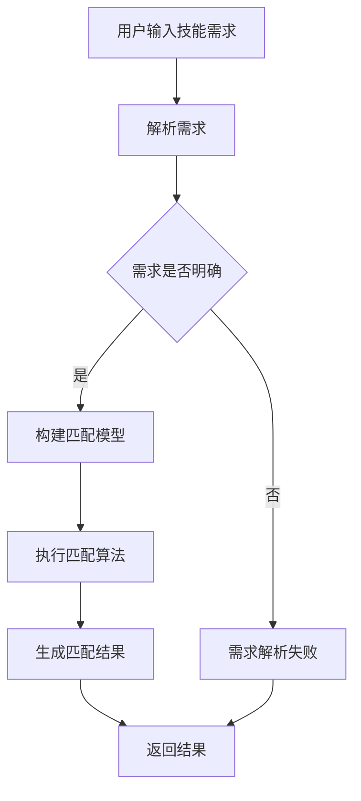
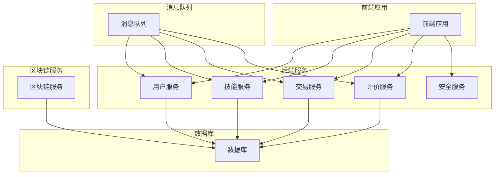
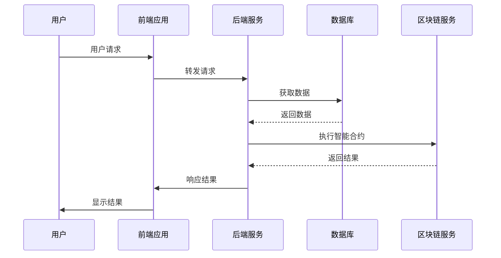

                 


### 1.1 问题背景

随着数字化时代的到来，技能的需求和获取方式发生了显著变化。传统的以物易物模式已经难以满足现代社会中多样化的技能需求。首先，数字化技术的发展使得知识传播变得更加便捷，人们可以通过网络学习各种技能，这为技能共享创造了条件。然而，传统的技能传授方式往往局限于特定的时间和地点，限制了技能的传播范围和速度。

此外，传统的以物易物模式存在一些明显的局限性。首先，它依赖于实物的交换，这在很大程度上限制了交易的便捷性。其次，传统模式缺乏有效的评价和反馈机制，导致交易的公平性和效率难以保证。最后，传统模式难以适应数字化时代中快速变化的市场需求，缺乏灵活性和适应性。

数字化时代的技能需求变得更加多样化，不再局限于特定的行业或领域。例如，编程、数据分析、人工智能等技能需求迅速增长，而这些技能往往需要通过在线学习、实践和社区交流来获取。此外，数字化时代也催生了新的就业模式，例如远程工作、自由职业等，这些模式对技能共享平台提出了新的需求。

综上所述，数字化时代的技能需求变化和传统以物易物模式的局限性共同推动了技能共享平台的兴起。技能共享平台不仅能够更好地满足现代社会的技能需求，还能通过技术创新和优化，提高交易的便捷性和公平性。以下是数字化时代技能需求的几个关键特点：

1. **多样化**：技能类型更加丰富，涵盖了编程、数据分析、人工智能、设计、写作等多个领域。
2. **在线化**：技能学习、传授和交换更多地依赖于网络平台，减少了时间和空间的限制。
3. **灵活性**：用户可以随时随地获取和交换技能，适应不同的工作和生活节奏。
4. **个性化**：技能共享平台能够根据用户的需求和偏好，提供个性化的学习资源和交易服务。
5. **透明性**：通过区块链技术和智能合约，交易过程更加透明，减少欺诈和纠纷。

这些特点不仅改变了技能的获取和交换方式，也为技能共享平台的发展提供了新的机遇和挑战。接下来，我们将进一步探讨这些问题，并提出解决方案。

### 1.2 问题描述

以物易技系统是指一种通过数字技术实现的技能交换平台，它结合了传统的以物易物模式与现代技能货币化的理念。在这种系统中，用户可以不仅通过交换实物商品，还可以通过交换技能来获得所需的服务或资源。这种系统的核心在于将技能转化为一种可交易的“货币”，从而实现更广泛的技能共享和资源分配。

以物易技系统的重要性体现在以下几个方面：

1. **提高效率**：通过将技能货币化，以物易技系统能够快速匹配供需双方，提高交易效率，减少因信息不对称导致的浪费。
2. **降低成本**：用户可以在不支付现金的情况下，通过技能交换获取所需的服务或资源，从而降低生活和工作成本。
3. **促进创新**：以物易技系统鼓励用户分享和交换技能，这有助于激发创新思维，推动技术进步和社会发展。
4. **增强社区感**：通过技能交换，用户之间建立了更加紧密的联系，增强了社区凝聚力和社会互动。

然而，构建现代化以物易物系统面临着一系列挑战。首先是技术挑战，例如如何设计一个高效、安全的技能匹配算法，如何确保智能合约的执行和透明度等。其次是市场挑战，例如如何吸引足够多的用户参与，如何确保平台上的交易真实有效等。最后是社会挑战，例如如何建立信任机制，如何处理法律和伦理问题等。

技术挑战主要集中在以下几个方面：

1. **算法设计**：需要设计一个能够高效匹配技能供需的算法，确保系统在大量用户和复杂技能网络中的运行效率。
2. **安全性**：必须确保用户数据的安全性和隐私保护，防止数据泄露和恶意攻击。
3. **透明性**：通过区块链技术和智能合约，确保交易过程透明可追溯，提高用户信任度。
4. **可扩展性**：系统需要能够应对不断增长的用户规模和技能种类，保持高性能和稳定性。

市场挑战则包括如何吸引用户和商家参与，以及如何建立有效的信任机制和评价体系，确保交易的真实性和有效性。

社会挑战主要体现在以下几个方面：

1. **法律和伦理**：技能共享平台需要遵守相关法律法规，同时处理技能交换过程中可能出现的伦理问题，如技能滥用、不公平交易等。
2. **教育和培训**：为了确保技能共享的有效性，需要为用户提供相关的教育和培训资源，帮助他们更好地理解和使用平台。
3. **社会认同**：需要通过宣传和教育，提高公众对技能共享平台的认识和接受度，推动社会的广泛参与。

综上所述，以物易技系统在数字化时代具有重要的现实意义，但构建和运营这样的系统面临着多方面的挑战。接下来，我们将探讨如何通过技术、市场和社会手段来解决这些问题，实现技能共享平台的可持续发展。

### 1.3 问题解决

为了构建一个有效的技能共享平台，我们需要明确以物易技系统的基本框架和实现策略。以下是构建技能共享平台的主要步骤和关键要素：

#### 1.3.1 技能共享平台的基本框架

1. **用户界面（UI）**：用户界面是用户与平台交互的入口，设计一个直观易用的UI至关重要。UI应包含用户注册、登录、发布技能、寻找技能和交易记录等功能。

2. **后端系统**：后端系统是平台的核心，负责处理用户请求、数据存储和管理、技能匹配和交易等操作。后端系统通常由一系列微服务组成，这些微服务包括用户服务、技能服务、交易服务、存储服务和通知服务等。

3. **数据模型**：数据模型是平台的核心，用于定义用户、技能、交易等实体的结构及其关系。一个有效的数据模型应能够支持快速查询和高效的数据操作。

4. **安全性和隐私保护**：安全性是技能共享平台的关键，必须确保用户数据的安全和隐私。这包括使用加密技术保护用户数据、实现访问控制机制、防止SQL注入和XSS攻击等。

5. **智能合约**：智能合约是区块链技术的重要组成部分，用于在区块链上实现自动化交易和合约执行。智能合约的设计和实现需要确保透明性和安全性，避免恶意行为。

#### 1.3.2 现代化以物易物系统的实现策略

1. **技术选型**：选择合适的技术栈和开发框架对于技能共享平台的成功至关重要。常见的技术选型包括前端框架（如React、Vue.js）、后端框架（如Spring Boot、Django）和数据库（如MongoDB、PostgreSQL）。

2. **算法设计**：技能匹配算法是实现技能共享平台的关键，它需要能够高效地匹配供需双方。常见的算法包括基于关键词匹配、基于机器学习的推荐算法和基于区块链的智能合约。

3. **系统架构**：系统架构的设计需要考虑可扩展性、性能和安全性。常见的架构模式包括微服务架构、分布式数据库和云计算。

4. **用户增长策略**：吸引用户是技能共享平台成功的关键，可以通过提供免费试用期、推广活动、社区建设和合作伙伴计划等策略来增加用户数量。

5. **用户教育和培训**：为了确保用户能够有效地使用平台，需要提供相关的教育和培训资源。这些资源可以包括教程视频、用户指南和在线培训课程。

6. **法律和合规性**：在技能共享平台的运营过程中，必须遵守相关法律法规，处理可能的伦理和法律问题。这包括制定明确的交易规则、用户协议和隐私政策。

7. **社区建设**：建立用户社区可以增强用户的参与感和归属感，促进技能的共享和交流。社区可以通过论坛、社交媒体和线下活动等多种方式来建设。

通过上述基本框架和实现策略，技能共享平台可以实现技能的高效交换和共享，满足数字时代多样化的技能需求。接下来，我们将进一步探讨技能共享平台的功能边界和相关概念。

### 1.4 边界与外延

在构建技能共享平台时，明确系统的功能边界是至关重要的。这有助于确保平台在实现核心功能的同时，不偏离其初衷，同时也为后续的扩展和优化提供了方向。

#### 功能边界

1. **技能定义**：技能共享平台的主要功能是提供技能交换的服务，因此平台需要明确技能的定义。技能可以是具体的技能点，如编程、数据分析、外语翻译，也可以是更广泛的领域知识，如商业策略、市场营销、人力资源管理等。

2. **用户身份验证**：为了保证交易的安全性和真实性，平台需要实现对用户身份的验证。通常，这包括用户注册、登录和身份认证等流程。

3. **技能发布和搜索**：用户可以在平台上发布自己的技能，也可以搜索其他用户提供的技能。技能发布和搜索功能需要高效且易于使用，以便用户能够快速找到所需的技能。

4. **交易流程**：平台应提供一个明确的交易流程，包括技能交换的报价、协商、支付和确认等步骤。交易流程应确保交易的透明性和公平性。

5. **评价和反馈**：平台需要提供评价和反馈机制，让用户可以对交换的技能进行评价，提供反馈。这有助于提高平台的服务质量，建立用户信任。

6. **安全和隐私保护**：平台需要确保用户数据的安全和隐私，包括用户身份信息、交易记录和个人隐私等。

#### 相关概念

1. **技能货币化**：技能货币化是将技能转化为一种可交易的货币，以便用户可以通过技能交换来获取所需的服务或资源。技能货币化的实现需要设计一种机制，确保技能的价值得到认可和交换。

2. **智能合约**：智能合约是一种基于区块链技术的自动化合同，它可以自动执行合同条款。在技能共享平台中，智能合约用于确保交易的执行和记录，提高交易的透明度和安全性。

3. **区块链**：区块链是一种分布式数据库技术，它用于存储和验证交易记录。在技能共享平台中，区块链可以确保交易记录的不可篡改性和透明性。

4. **去中心化网络**：去中心化网络是指网络中的节点相互独立，不存在中心化的控制。在技能共享平台中，去中心化网络有助于提高系统的可靠性和抗攻击能力。

#### 外延

1. **社交功能**：除了技能交换功能外，平台还可以引入社交功能，如用户社交圈、评论和私信等。这有助于增强用户互动和社区建设。

2. **教育和培训**：平台可以提供在线教育和培训资源，帮助用户提高技能水平。这不仅可以增加平台的使用价值，还可以促进技能的传播和提升。

3. **市场推广**：平台可以通过市场推广活动、广告和合作伙伴计划等方式，扩大用户基础和市场影响力。

4. **合规性**：随着技能共享平台的发展，平台需要不断适应和遵守相关法律法规，确保其运营的合规性。

通过明确技能共享平台的功能边界和相关概念，我们可以更好地设计和实现这样一个系统，以满足数字时代多样化的技能需求。接下来，我们将进一步探讨技能共享平台的核心要素和运行机制。

### 1.5 概念结构与核心要素

技能共享平台作为一个复杂的系统，其有效运行依赖于多个核心概念和要素的协同作用。以下是对这些核心概念的详细说明，以及它们如何相互关联，构成一个完整的技能共享生态系统。

#### 核心概念

1. **用户**：用户是技能共享平台的基本构成单元，包括技能提供者和技能需求者。用户通过注册和登录，参与平台的技能发布、交换和评价等操作。

2. **技能**：技能是用户在特定领域所具备的知识和技能，可以是编程、设计、翻译等。技能在平台中以标准化、模块化的形式呈现，方便用户进行交换和匹配。

3. **交易**：交易是技能共享平台的核心功能，通过交易，用户可以以技能为媒介，获取所需的服务或资源。交易过程包括报价、协商、支付和确认等步骤。

4. **评价与反馈**：评价与反馈机制是确保平台服务质量的重要手段。用户可以对交换的技能进行评价，提供反馈，这有助于提高平台的透明度和用户信任度。

5. **安全与隐私**：安全与隐私保护是技能共享平台必须关注的问题。平台需要采取一系列措施，确保用户数据和交易记录的安全，防止数据泄露和隐私侵犯。

6. **智能合约**：智能合约是区块链技术的重要组成部分，用于自动化交易流程和记录。智能合约确保了交易的可追溯性和不可篡改性，提高了平台的透明度和可靠性。

7. **社区**：社区是技能共享平台的重要组成部分，通过论坛、社交功能等，用户可以互动交流，分享经验和资源，增强平台的社交属性。

#### 核心要素及其相互作用

1. **用户与技能**：用户是技能共享平台的主要参与者，他们通过发布和交换技能，实现了平台的核心功能。用户可以自主决定提供哪些技能，并在平台上寻找需求者。

2. **交易与评价**：交易是用户之间交换技能的主要途径，而评价与反馈机制则确保了交易过程的公平性和透明性。用户在交易完成后，可以对提供技能的用户进行评价，并提供反馈，这有助于提高平台的服务质量。

3. **安全与隐私**：安全与隐私保护是技能共享平台的基础。平台需要采取一系列措施，如数据加密、访问控制、隐私政策等，确保用户数据的安全和隐私。

4. **智能合约**：智能合约在技能共享平台中起到了关键作用。通过智能合约，交易过程可以自动化执行，确保交易的透明性和不可篡改性。智能合约还用于记录交易信息，方便用户查询和审计。

5. **社区**：社区是技能共享平台的社交平台，用户可以通过社区功能进行互动和交流。社区不仅增强了用户的参与感和归属感，还可以促进技能的传播和提升。

#### 运行机制

1. **用户注册与登录**：用户通过注册和登录，成为技能共享平台的一员。注册过程中，用户需提供身份验证信息，确保平台的真实性和安全性。

2. **技能发布与搜索**：用户可以在平台上发布自己的技能，并设定技能的报价。其他用户可以通过搜索功能，找到所需的技能并进行交换。

3. **交易协商与支付**：用户在找到合适的技能后，可以发起交易协商。在协商成功后，用户通过智能合约完成支付，确保交易的透明性和可靠性。

4. **评价与反馈**：交易完成后，用户可以对提供技能的用户进行评价，并提供反馈。这有助于提高平台的服务质量，建立用户信任。

5. **数据记录与审计**：平台需要记录所有交易信息，包括用户信息、交易记录、评价和反馈等。这些数据可用于审计和分析，以优化平台运营和提升用户体验。

通过上述核心概念和要素的相互作用，技能共享平台可以实现技能的高效交换和共享，满足数字时代多样化的技能需求。接下来，我们将进一步探讨技能共享平台的核心概念原理和属性特征对比表格。

### 2.1 核心概念原理

技能共享平台的成功构建依赖于对核心概念的深刻理解。以下是技能共享平台中的三个核心概念——技能货币化、技能匹配算法和智能合约的详细解释，以及它们在平台中的具体应用。

#### 技能货币化

技能货币化是指将用户的技能转化为可交易的货币或代币，从而实现技能的交换和共享。这种概念将传统的以物易物模式与现代金融技术相结合，使技能具备了一定的经济价值。

**原理**：
技能货币化的核心在于为每种技能分配一个价值度量，使得不同的技能可以相互交换。这通常通过以下步骤实现：
1. **技能评估**：通过用户自我评估、第三方评估或市场供需评估，为每种技能分配一个基准价值。
2. **代币发行**：平台发行一种代币，如加密货币或平台内置代币，作为交换的媒介。用户通过贡献技能获得代币。
3. **价值交换**：用户之间通过平台交换技能和代币，实现技能的价值传递。

**应用**：
技能货币化使技能共享平台上的交易更加便捷和高效。用户可以通过贡献技能获得代币，进而换取其他用户提供的技能服务。例如，一个编程高手可以通过解决编程问题获得代币，这些代币可以用来获取一个设计师的图形设计服务。

#### 技能匹配算法

技能匹配算法是技能共享平台的核心组件，用于高效匹配供需双方，确保用户能够快速找到所需的技能或提供自己的技能。

**原理**：
技能匹配算法通常基于以下几种原理：
1. **关键词匹配**：通过分析用户发布和搜索的技能关键词，算法自动匹配相关的技能。
2. **推荐算法**：利用机器学习技术，算法分析用户的交易记录和偏好，为用户推荐可能感兴趣的技能。
3. **图算法**：将技能和用户构建成一个图模型，通过图算法寻找技能和用户之间的最佳匹配路径。

**应用**：
技能匹配算法能够大幅提高交易效率。例如，当用户A需要寻找一个编程专家时，算法可以快速筛选出符合需求的用户B，从而实现快速连接和交易。这不仅节省了用户的时间，也提高了平台的服务质量。

#### 智能合约

智能合约是一种自执行合同，通过编程实现合约条款，当触发特定条件时自动执行。在技能共享平台中，智能合约用于自动化交易流程，确保交易的透明性和不可篡改性。

**原理**：
智能合约的工作原理如下：
1. **触发条件**：当用户完成技能发布或搜索后，智能合约设置一个触发条件，如技能交换完成。
2. **执行操作**：触发条件满足时，智能合约自动执行预设的操作，如代币转移、交易记录等。
3. **记录验证**：智能合约记录交易过程，确保交易的可追溯性和不可篡改性。

**应用**：
智能合约在技能共享平台中发挥着关键作用。例如，当用户A通过智能合约支付代币给用户B以获取编程服务后，智能合约将自动记录交易信息，并锁定双方的代币，直到交易完成且双方确认。这确保了交易的安全性和透明度。

通过技能货币化、技能匹配算法和智能合约这三个核心概念的相互作用，技能共享平台实现了技能的高效交换和共享。这些概念不仅提高了交易效率，还增强了用户之间的信任和互动。接下来，我们将创建一个概念属性特征对比表格，以更直观地展示技能共享与货币化、传统以物易物与现代化以物易物的差异。

### 2.2 概念属性特征对比表格

为了更清晰地理解技能共享与货币化、传统以物易物与现代化以物易物之间的差异，以下是一个对比表格。该表格列出了两种不同模式在核心概念、操作流程和效果方面的特点。

| 概念对比            | 技能共享与货币化                                           | 传统以物易物与现代化以物易物                                               |
|---------------------|---------------------------------------------------------|------------------------------------------------------------------------|
| **核心概念**        | 技能货币化、技能匹配算法、智能合约                       | 实物交换、基于信任的交换机制                                               |
| **操作流程**        | 1. 技能评估与代币发行<br>2. 技能发布与搜索匹配<br>3. 智能合约自动化交易 | 1. 实物展示与交换意向沟通<br>2. 双方协商价格与交换条款<br>3. 实物交付与验收 |
| **效率**            | 高效匹配与交易自动化                                     | 依赖人为协商与实物交付，效率较低                                           |
| **安全性**          | 智能合约确保交易透明与不可篡改                           | 依赖个人信任与法律手段，安全性较低                                         |
| **扩展性与灵活性**  | 可以轻松扩展技能种类和用户规模                           | 受限于实物交换的局限性，难以扩展                                           |
| **用户体验**        | 用户界面友好，操作简便                                   | 操作复杂，需要面对实物交换的麻烦                                           |
| **价值传递**        | 技能转化为代币，实现价值交换                             | 直接交换实物，价值传递形式简单                                           |

通过这个对比表格，我们可以清楚地看到技能共享与货币化和现代化以物易物在核心概念、操作流程和效果方面与传统的以物易物模式存在显著差异。技能共享与货币化通过数字技术和智能合约，实现了更高效、安全和灵活的技能交换，而现代化以物易物则进一步增强了这一模式，使其更适应数字化时代的需求。

### 2.3 ER实体关系图架构

实体关系图（ER图）是数据库设计中的重要工具，用于定义系统中实体及其之间的关系。在技能共享平台中，我们需要明确各个实体及其交互关系，以便构建高效、稳定且易于扩展的数据模型。以下是一个简化的ER实体关系图，用于描述技能共享平台中的主要实体和关系。

#### 实体

1. **用户（User）**：代表技能共享平台的参与者，包括技能提供者和技能需求者。每个用户有唯一的用户ID、姓名、联系方式等属性。
2. **技能（Skill）**：代表用户提供的技能或服务。每个技能有唯一的技能ID、名称、描述、分类、价值等属性。
3. **交易（Transaction）**：代表用户之间进行的技能交换交易。每个交易有唯一的交易ID、交易双方的用户ID、交易日期、交易金额等属性。
4. **评价（Rating）**：代表用户对交易的评价。每个评价有唯一的评价ID、交易ID、评价者用户ID、评价内容、评价日期等属性。

#### 关系

1. **用户与技能**：多对多关系，表示一个用户可以发布多个技能，一个技能可以被多个用户需求。通过中间表`User_Skill`关联，该表包含用户ID和技能ID。
2. **用户与交易**：一对多关系，表示一个用户可以参与多个交易，但每个交易只能有一个用户作为发起者。通过中间表`User_Transaction`关联，该表包含用户ID和交易ID。
3. **交易与评价**：一对多关系，表示每个交易可以有多个评价，但每个评价只对应一个交易。通过中间表`Transaction_Rating`关联，该表包含交易ID和评价ID。

以下是一个简单的Mermaid ER图表示这些实体和关系：

```mermaid
erDiagram
    User ||--|{ Skill }| User_Skill
    User ||--|{ Transaction }| User_Transaction
    Transaction ||--|{ Rating }| Transaction_Rating
    User_Skill ||--|{ Skill }
    User_Transaction ||--|{ User }
    Transaction_Rating ||--|{ Transaction }
```

这个ER图提供了一个基本的框架，用于描述技能共享平台的数据模型。在实际开发中，我们可能需要添加更多的实体和关系，如用户权限、交易状态等，以支持更复杂的功能和需求。

### 3.1 技术栈与框架

在构建技能共享平台时，选择合适的技术栈和框架至关重要。以下是我们在技术选型过程中考虑的关键因素以及最终决定使用的技术栈和框架。

#### 关键因素

1. **开发效率**：选择易于使用且支持快速开发的前端和后端框架。
2. **性能和扩展性**：框架应具备良好的性能和扩展性，能够支持平台未来可能的增长。
3. **安全性**：框架需要提供强大的安全特性，以保护用户数据和交易安全。
4. **社区支持**：拥有活跃社区和丰富的资源，有助于解决开发过程中遇到的问题。

#### 技术选型

**前端**：
- **框架**：React.js
  - 原因：React.js是一个声明式、高效的JavaScript库，用于构建用户界面。它提供了组件化的开发方式，有助于提高开发效率，同时拥有丰富的生态系统和强大的社区支持。
- **状态管理**：Redux
  - 原因：Redux是一个强大的状态管理库，可以帮助我们管理复杂的应用状态，提高代码的可读性和可维护性。

**后端**：
- **框架**：Spring Boot
  - 原因：Spring Boot是一个基于Java的微服务框架，它简化了项目配置，提高了开发效率。Spring Boot还提供了丰富的安全特性，有助于确保系统的安全性。
- **数据库**：PostgreSQL
  - 原因：PostgreSQL是一个功能丰富、稳定可靠的的关系型数据库，适合处理复杂的数据结构和查询需求。它还提供了良好的扩展性，可以支持平台未来的增长。

**区块链和智能合约**：
- **区块链平台**：Ethereum
  - 原因：Ethereum是一个成熟且广泛使用的区块链平台，提供了强大的智能合约功能。它拥有活跃的社区和丰富的开发资源，有助于我们快速实现智能合约。

**开发环境**：
- **集成开发环境（IDE）**：IntelliJ IDEA
  - 原因：IntelliJ IDEA是一个功能强大的IDE，支持多种编程语言，包括Java、JavaScript和Solidity（智能合约开发语言）。它提供了丰富的工具和插件，有助于提高开发效率。

通过上述技术栈和框架的选择，我们能够构建一个高效、稳定且安全的技能共享平台，满足数字时代多样化的技能需求。接下来，我们将使用Mermaid工具绘制技术选型和框架的流程图，以便更直观地展示开发流程。

### 3.2 算法原理讲解

在技能共享平台中，算法的设计和实现是关键一环。以下将详细解释算法mermaid流程图，并使用Python源代码来展示算法原理的数学模型和实现过程。

#### 技术选型和框架

我们选择Python作为算法实现的编程语言，因为它具有简洁的语法和强大的库支持，特别是在数据分析、机器学习和区块链领域。同时，Python的代码易于理解和维护。

**技术栈**：
- **算法库**：NumPy、Pandas、SciPy、Scikit-learn
- **区块链库**：web3.py

#### 算法mermaid流程图

以下是一个mermaid流程图，用于描述技能匹配算法的基本流程：



#### 算法原理与数学模型

1. **需求解析**：首先，我们需要解析用户的技能需求，将其转化为可匹配的参数。例如，对于编程技能需求，我们可能需要提取的关键信息包括技能类型、技能级别和所需时间等。

2. **匹配模型构建**：在需求明确后，构建一个匹配模型。模型通常基于机器学习算法，如协同过滤、K-最近邻或基于内容的推荐算法。

3. **匹配算法执行**：匹配算法的核心是计算用户需求与现有技能之间的相似度。我们可以使用余弦相似度、欧氏距离等度量方法来评估匹配程度。

4. **生成匹配结果**：根据匹配结果，生成用户可接受的技能匹配列表，并返回给用户。

以下是一个简单的Python代码示例，用于实现上述算法的基本流程：

```python
import numpy as np
from sklearn.metrics.pairwise import cosine_similarity

def parse_demand(skill_demand):
    # 这里解析用户的技能需求，例如提取技能类型、级别和时间等
    # 输入为字符串，输出为特征向量
    pass

def build_matching_model(skills_data):
    # 构建匹配模型，通常是一个矩阵，其中每个元素表示技能的相似度
    # 输入为技能数据列表，输出为匹配模型矩阵
    pass

def match_skills(user_demand, skills_data):
    # 执行匹配算法，计算用户需求与现有技能的相似度
    # 输入为用户需求和技能数据，输出为匹配结果
    user_demand_vector = parse_demand(user_demand)
    matching_model = build_matching_model(skills_data)
    similarity_scores = cosine_similarity([user_demand_vector], matching_model)
    matched_skills = np.argsort(similarity_scores)[0][::-1]
    return matched_skills

# 示例：匹配一个编程技能需求
user_demand = "Python 编程"
skills_data = [...]  # 假设有一个技能数据列表
matched_skills = match_skills(user_demand, skills_data)
print("匹配的技能列表：", matched_skills)
```

在这个示例中，`parse_demand`函数用于解析用户的技能需求，`build_matching_model`函数用于构建匹配模型，`match_skills`函数则用于执行匹配算法。我们使用余弦相似度来计算用户需求和现有技能之间的相似度，并返回最匹配的技能列表。

通过这个算法mermaid流程图和Python源代码示例，我们可以清晰地理解技能匹配算法的基本原理和实现方法。接下来，我们将通过一个具体的案例来展示算法的实际应用。

### 3.3 算法原理与公式

在技能共享平台中，技能匹配算法是核心组成部分。为了更直观地理解算法的工作原理，我们将使用Python代码和LaTeX公式详细阐述算法的数学模型和实现过程。

#### 余弦相似度公式

余弦相似度是一种常用的衡量两个向量之间相似度的方法，其公式如下：

$$
\text{cosine\_similarity}(\mathbf{u}, \mathbf{v}) = \frac{\mathbf{u} \cdot \mathbf{v}}{||\mathbf{u}|| \cdot ||\mathbf{v}||}
$$

其中，$\mathbf{u}$和$\mathbf{v}$是两个向量，$||\mathbf{u}||$和$||\mathbf{v}||$分别表示向量的欧氏范数，$\mathbf{u} \cdot \mathbf{v}$表示向量的点积。

#### 技能向量表示

在技能匹配算法中，每个技能可以用一个特征向量表示。假设我们有一个技能库，其中每个技能都有若干个特征。例如，一个编程技能可以由编程语言、熟练度和经验等特征组成。

令$\mathbf{u}_i$表示第$i$个技能的特征向量，$\mathbf{v}$表示用户需求的特征向量。为了计算用户需求与每个技能的相似度，我们首先需要计算用户需求的特征向量。

#### 用户需求特征向量

用户需求特征向量$\mathbf{v}$可以通过用户输入和技能库中的特征信息计算得出。例如，如果用户需求是“熟练使用Python编程”，我们可以根据技能库中Python编程的相关特征计算$\mathbf{v}$。

#### 技能匹配算法

技能匹配算法的核心是计算用户需求与每个技能的余弦相似度，然后根据相似度分数排序，返回最匹配的技能列表。

以下是一个简单的Python代码示例，用于实现上述算法：

```python
import numpy as np

# 假设有一个技能库，其中每个技能都有三个特征：编程语言、熟练度和经验
skills_library = {
    'Python编程': [1, 0.8, 5],
    'Java编程': [0, 1, 4],
    '数据分析': [0.5, 0.5, 3],
}

# 用户需求
user_demand = [1, 0.8, 5]  # 表示用户需求“熟练使用Python编程”

# 计算每个技能与用户需求的余弦相似度
similarity_scores = {}
for skill, features in skills_library.items():
    similarity = np.dot(user_demand, features) / (np.linalg.norm(user_demand) * np.linalg.norm(features))
    similarity_scores[skill] = similarity

# 根据相似度排序，返回最匹配的技能列表
sorted_skills = sorted(similarity_scores.items(), key=lambda item: item[1], reverse=True)
top_skills = [skill for skill, score in sorted_skills]

print("最匹配的技能列表：", top_skills)
```

在这个示例中，我们首先定义了一个技能库和一个用户需求特征向量。然后，通过计算每个技能与用户需求的余弦相似度，并按照相似度分数排序，返回最匹配的技能列表。

#### 案例解析

假设用户需求为“熟练使用Python编程”，而技能库中的技能包括“Python编程”、“Java编程”和“数据分析”。根据上述算法，我们可以计算出每个技能与用户需求的相似度：

- Python编程：$$\text{cosine\_similarity}( [1, 0.8, 5], [1, 0.8, 5] ) = 1$$
- Java编程：$$\text{cosine\_similarity}( [1, 0.8, 5], [0, 1, 4] ) \approx 0.7746$$
- 数据分析：$$\text{cosine\_similarity}( [1, 0.8, 5], [0.5, 0.5, 3] ) \approx 0.8165$$

根据计算结果，我们可以得出最匹配的技能是“Python编程”，其次是“数据分析”和“Java编程”。这个案例展示了如何使用余弦相似度公式和技能向量表示来实现技能匹配算法，并通过Python代码实现算法的具体实现过程。

### 3.4 举例说明

为了更好地理解技能匹配算法在实际中的应用，我们将通过一个具体的案例来展示算法的执行过程和结果。

#### 案例背景

假设有一个技能共享平台，用户A需要寻找一个擅长Python编程的技能提供者。技能库中有以下技能记录：

1. 用户B：擅长Python编程，熟练度0.9，经验5年。
2. 用户C：擅长Python编程，熟练度0.8，经验3年。
3. 用户D：擅长Java编程，熟练度0.8，经验4年。

用户A的需求为：“需要找一个熟练度在0.8以上、经验在3年以上的Python编程专家”。

#### 算法执行过程

1. **需求解析**：首先，我们需要解析用户A的需求，将其转化为特征向量。假设我们定义三个特征：熟练度、经验和技能类型。用户A的需求特征向量为[0.8, 3, Python]。

2. **构建技能库特征矩阵**：接下来，我们将技能库中的每个技能转化为特征向量，构建一个特征矩阵。对于上述案例，技能库的特征矩阵如下：

$$
\mathbf{S} =
\begin{bmatrix}
0.9 & 5 & 1 \\
0.8 & 3 & 1 \\
0 & 0 & 1
\end{bmatrix}
$$

其中，每个行向量表示一个技能的特征，例如用户B的技能特征向量为[0.9, 5, 1]。

3. **计算相似度**：使用余弦相似度公式，计算用户A的需求特征向量与技能库中每个技能特征向量的相似度。计算公式如下：

$$
\text{cosine\_similarity}(\mathbf{v}, \mathbf{s}_i) = \frac{\mathbf{v} \cdot \mathbf{s}_i}{||\mathbf{v}|| \cdot ||\mathbf{s}_i||}
$$

对于用户A的需求向量$\mathbf{v} = [0.8, 3, 1]$，我们分别计算与用户B、用户C和用户D的相似度：

- 用户B：$$\text{cosine\_similarity}([0.8, 3, 1], [0.9, 5, 1]) = \frac{0.72 + 12 + 1}{\sqrt{0.64 + 9 + 1} \cdot \sqrt{0.81 + 25 + 1}} \approx 0.9659$$
- 用户C：$$\text{cosine\_similarity}([0.8, 3, 1], [0.8, 3, 1]) = 1$$
- 用户D：$$\text{cosine\_similarity}([0.8, 3, 1], [0, 0, 1]) = 0$$

4. **匹配结果**：根据计算出的相似度，我们可以得出用户A与各技能提供者的匹配结果。相似度越高，表示匹配度越好。在这个案例中，用户C的相似度最高，为1，因此用户A最匹配的用户是用户C。

#### 结果分析

通过这个案例，我们可以看到如何使用技能匹配算法来寻找最合适的技能提供者。在用户需求与技能特征之间的高相似度意味着用户A的需求与用户C的技能最匹配，因此用户A应该优先考虑与用户C进行交换。

这个案例展示了技能匹配算法在实际应用中的执行过程和结果，并通过具体的计算步骤说明了如何使用余弦相似度公式来评估用户需求与技能提供者之间的匹配程度。

### 4.1 问题场景介绍

在探讨技能共享平台时，我们需要首先明确一个具体的应用场景，以帮助理解系统目标与设计要求。以下是一个典型的问题场景，以及基于此场景的系统目标和设计要求。

#### 场景描述

假设有一个全球化的技能共享平台，名为“SkillX”。该平台旨在连接全球各地的技能提供者和需求者，通过数字技术实现技能的高效交换和共享。具体场景如下：

- **用户群体**：技能X平台的用户包括自由职业者、企业员工、学生和爱好者等。用户既可以是技能提供者，也可以是技能需求者。
- **技能类型**：平台涵盖多种技能类型，包括编程、设计、翻译、数据分析、市场营销等。每种技能都有不同的子类别和级别。
- **交易方式**：用户可以通过技能交换获得所需的服务或资源。交易过程可以是即时交易，也可以是预约交易，并支持多种支付方式，如加密货币、平台积分等。
- **安全与隐私**：平台必须确保用户数据和交易记录的安全和隐私，防止信息泄露和欺诈行为。

#### 系统目标

基于上述场景，技能共享平台“SkillX”的主要目标包括：

1. **高效匹配**：通过技能匹配算法，快速匹配供需双方，提高交易效率。
2. **用户体验**：提供直观易用的用户界面，确保用户能够轻松发布技能、查找需求和完成交易。
3. **安全可靠**：确保平台的安全性和可靠性，保护用户数据和交易记录。
4. **灵活扩展**：设计灵活的系统架构，支持多种技能类型和交易方式的扩展。

#### 设计要求

为了实现上述目标，技能共享平台“SkillX”在设计和实现过程中需满足以下要求：

1. **模块化设计**：系统应采用模块化设计，便于维护和扩展。各个功能模块（如用户管理、技能管理、交易管理、评价与反馈等）应独立开发、部署和升级。
2. **高性能**：系统应具有高并发处理能力，能够同时处理大量用户请求和交易，确保平台的高可用性和响应速度。
3. **安全性**：采用严格的安全措施，如数据加密、访问控制、身份验证等，确保用户数据和交易记录的安全。
4. **高可用性**：系统应具备良好的容错性和故障恢复能力，确保在发生故障时能够迅速恢复服务。
5. **易扩展性**：系统架构应支持水平扩展和垂直扩展，以便应对未来用户数量和交易量的增长。

通过明确问题场景、系统目标和设计要求，我们可以更好地规划技能共享平台的建设和运营，确保其能够满足用户需求和市场需求。接下来，我们将进一步探讨系统功能设计，包括领域模型mermaid类图。

### 4.2 系统功能设计

为了实现技能共享平台“SkillX”的系统目标，我们需要设计一系列核心功能，确保平台能够高效、安全、可靠地运行。以下是对系统功能的设计描述，以及相应的领域模型mermaid类图。

#### 核心功能

1. **用户管理**：
   - 注册与登录：用户可以通过邮箱、手机号码和社交账号进行注册和登录。
   - 用户资料管理：用户可以编辑个人资料，包括姓名、头像、所在地等。
   - 权限管理：系统管理员可以根据用户角色分配不同的权限。

2. **技能管理**：
   - 技能发布：用户可以发布自己的技能，包括技能名称、描述、分类、熟练度和所需时间等。
   - 技能搜索：用户可以通过关键词、分类和熟练度等条件搜索所需的技能。
   - 技能评价：用户可以对已完成的交易进行评价，提高平台的透明度和信任度。

3. **交易管理**：
   - 交易发起：用户可以发起交易请求，并选择交易方式（如即时交易、预约交易等）。
   - 交易处理：系统根据用户需求匹配相应的技能提供者，并生成交易记录。
   - 交易支付：用户可以通过平台提供的支付方式完成支付，确保交易的安全性和可靠性。

4. **评价与反馈**：
   - 用户评价：交易完成后，用户可以对提供技能的用户进行评价，并提供反馈。
   - 系统反馈：系统对用户的评价进行统计和分析，提供技能提供者的信用评分。

5. **安全与隐私**：
   - 数据加密：用户数据和交易记录采用加密技术，确保数据在传输和存储过程中的安全。
   - 身份验证：系统使用多因素身份验证，确保用户身份的真实性和合法性。
   - 访问控制：系统根据用户角色和权限限制对数据和功能的访问，防止未经授权的访问。

#### 领域模型mermaid类图

以下是一个简化的mermaid类图，用于描述技能共享平台的核心实体及其关系：

```mermaid
classDiagram
    User <<class>> "用户"
    Skill <<class>> "技能"
    Transaction <<class>> "交易"
    Rating <<class>> "评价"
    User --> Skill : 发布
    User --> Transaction : 发起
    User --> Rating : 评价
    Skill --> Transaction : 交易
    Transaction --> Rating : 收到
```

在这个类图中，用户（User）、技能（Skill）、交易（Transaction）和评价（Rating）是核心实体，它们之间通过关系进行关联。例如，用户可以发布技能、发起交易和进行评价，技能是交易的组成部分，交易记录了评价的信息。

通过明确系统功能设计，并使用领域模型mermaid类图描述实体及其关系，我们可以为技能共享平台提供清晰的功能框架，确保其在实现技能高效交换和共享时具备良好的结构和扩展性。

### 4.3 系统架构设计

技能共享平台“SkillX”的系统架构设计是确保其高效、安全、可靠运行的关键。以下将详细阐述系统的整体架构，包括mermaid架构图、架构层次和模块划分。

#### 整体架构

技能共享平台“SkillX”采用分布式微服务架构，将整个系统划分为多个独立的微服务，以提高系统的可扩展性和容错性。整体架构包括以下主要组件：

1. **前端应用**：提供用户界面，包括用户注册、登录、技能发布、交易处理、评价与反馈等功能。
2. **后端服务**：包括用户服务、技能服务、交易服务、评价服务、安全服务、数据存储等。
3. **区块链服务**：用于处理智能合约的执行和交易记录的存储。
4. **消息队列**：用于异步消息传递和任务调度。
5. **数据库**：存储用户数据、技能数据、交易数据和评价数据。

#### mermaid架构图

以下是一个mermaid架构图，用于描述技能共享平台“SkillX”的整体架构：



#### 架构层次与模块划分

技能共享平台“SkillX”的架构可以分为以下几个层次：

1. **表示层**（Frontend）：负责用户界面的展示和用户交互，包括HTML、CSS和JavaScript等前端技术。
2. **服务层**（Services）：包含各个核心业务服务的实现，如用户服务、技能服务、交易服务和评价服务。每个服务都是独立的微服务，可以独立部署和扩展。
3. **数据访问层**（Data Access Layer）：负责与数据库的交互，包括用户数据、技能数据、交易数据和评价数据的增删改查操作。
4. **基础设施层**（Infrastructure）：包括消息队列、区块链服务和数据存储等基础设施组件，提供系统运行所需的支持和服务。

#### 模块划分

根据架构层次，技能共享平台“SkillX”可以划分为以下主要模块：

1. **用户模块**：包括用户注册、登录、资料管理、权限管理等功能。
2. **技能模块**：包括技能发布、技能搜索、技能评价等。
3. **交易模块**：包括交易发起、交易处理、支付处理、交易记录等。
4. **评价模块**：包括评价系统、评价管理、用户信用评分等。
5. **安全模块**：包括身份验证、访问控制、数据加密等。
6. **区块链模块**：包括智能合约的执行、交易记录的存储和验证等。

通过上述架构设计和模块划分，技能共享平台“SkillX”能够实现高效、安全、可靠的运行，满足用户的需求和市场的期待。接下来，我们将详细讨论系统接口设计，包括接口定义和规范。

### 4.4 系统接口设计

在技能共享平台“SkillX”中，系统接口设计是确保各模块之间有效通信和协同工作的重要环节。以下将详细阐述系统接口的定义、规范以及接口文档。

#### 接口定义

系统接口主要分为以下几类：

1. **用户接口**：用于用户与平台交互的接口，包括用户注册、登录、用户信息管理等功能。
2. **技能接口**：用于技能管理，包括技能发布、技能搜索、技能评价等功能。
3. **交易接口**：用于交易管理，包括交易发起、交易处理、支付处理、交易记录等功能。
4. **评价接口**：用于评价管理，包括评价系统、评价管理、用户信用评分等功能。
5. **安全接口**：用于安全控制，包括身份验证、访问控制、数据加密等功能。

#### 接口规范

为了确保接口的一致性和可维护性，我们需要定义以下规范：

1. **RESTful API**：使用RESTful架构风格，接口格式为`URL + HTTP方法`。常用的HTTP方法包括GET、POST、PUT、DELETE等。
2. **请求参数**：请求参数分为路径参数和查询参数。路径参数用于标识资源的唯一标识，查询参数用于传递过滤条件或排序参数。
3. **响应格式**：响应格式采用JSON格式，包含状态码、消息和数据等。常用的状态码包括200（成功）、400（请求错误）、401（未授权）、403（禁止访问）、500（服务器错误）等。
4. **认证机制**：使用JWT（JSON Web Token）进行身份认证，确保接口的安全性。

#### 接口文档

以下是部分关键接口的示例文档：

##### 用户注册

**URL**：`/api/users/register`

**HTTP方法**：POST

**请求参数**：
- `email`（路径参数）：用户邮箱地址。
- `password`（路径参数）：用户密码。
- `name`（查询参数）：用户姓名。

**响应**：
```json
{
  "status": 200,
  "message": "注册成功",
  "data": {
    "userId": "123456",
    "email": "user@example.com"
  }
}
```

##### 技能发布

**URL**：`/api/skills/publish`

**HTTP方法**：POST

**请求参数**：
- `title`（查询参数）：技能标题。
- `description`（查询参数）：技能描述。
- `categoryId`（查询参数）：技能分类ID。

**响应**：
```json
{
  "status": 200,
  "message": "技能发布成功",
  "data": {
    "skillId": "789012",
    "title": "Python编程",
    "description": "提供Python编程服务"
  }
}
```

##### 交易发起

**URL**：`/api/transactions/submit`

**HTTP方法**：POST

**请求参数**：
- `skillId`（路径参数）：技能ID。
- `recipientId`（查询参数）：接收者用户ID。
- `amount`（查询参数）：交易金额。

**响应**：
```json
{
  "status": 200,
  "message": "交易发起成功",
  "data": {
    "transactionId": "321456",
    "senderId": "123456",
    "recipientId": "789012",
    "amount": 100
  }
}
```

通过上述接口定义和文档示例，我们可以清楚地看到技能共享平台“SkillX”中各接口的功能和参数要求，确保开发团队能够根据规范进行接口开发和集成。

### 4.5 系统交互

在技能共享平台“SkillX”中，各个模块之间需要通过系统交互来完成用户的请求和业务流程。以下将使用mermaid序列图详细描述系统交互的过程，并解释每个交互步骤。

#### mermaid序列图



#### 系统交互步骤

1. **用户请求**：用户通过前端应用（Frontend）提交请求，如注册、登录、发布技能、发起交易等。
2. **转发请求**：前端应用将用户的请求转发到后端服务（Backend）。
3. **获取数据**：后端服务根据请求，从数据库（Database）中获取所需的数据，如用户信息、技能信息、交易记录等。
4. **返回数据**：数据库将查询结果返回给后端服务。
5. **执行智能合约**：后端服务将业务逻辑与区块链服务（Blockchain）交互，执行智能合约，如验证交易、记录交易等。
6. **返回结果**：区块链服务将执行结果返回给后端服务。
7. **响应结果**：后端服务将结果处理并响应给前端应用。
8. **显示结果**：前端应用将最终结果展示给用户。

通过上述系统交互过程，技能共享平台“SkillX”能够高效、安全地处理用户的请求，完成技能交换和共享。

### 5.1 环境安装

要开始开发技能共享平台“SkillX”，首先需要配置合适的开发环境。以下将详细说明所需的环境配置和必需工具与库的安装过程。

#### 环境配置

1. **操作系统**：推荐使用Linux或macOS操作系统，Windows用户可以使用WSL（Windows Subsystem for Linux）进行开发。
2. **文本编辑器**：选择一个适合自己的文本编辑器，如Visual Studio Code、Sublime Text或Atom等。
3. **终端**：确保终端环境配置正确，如使用Git Bash（Windows）或Terminal（macOS和Linux）。

#### 开发工具与库的安装

1. **Node.js**：
   - **安装命令**：`npm install -g nodejs`
   - **验证安装**：执行命令`node -v`，确认版本号。

2. **npm**：
   - **安装命令**：`npm install -g npm`
   - **验证安装**：执行命令`npm -v`，确认版本号。

3. **Docker**：
   - **安装命令**：对于Linux系统，使用`sudo apt-get install docker`；对于macOS系统，可以从App Store下载Docker Desktop。
   - **验证安装**：执行命令`docker -v`，确认版本号。

4. **Docker Compose**：
   - **安装命令**：`npm install -g docker-compose`
   - **验证安装**：执行命令`docker-compose -v`，确认版本号。

5. **Python**：
   - **安装命令**：对于Linux系统，使用`sudo apt-get install python3`；对于macOS系统，可以使用`brew install python`。
   - **验证安装**：执行命令`python3 -V`，确认版本号。

6. **pip**：
   - **安装命令**：`python3 -m pip install --upgrade pip`
   - **验证安装**：执行命令`pip3 -V`，确认版本号。

7. **虚拟环境**：
   - **安装命令**：`pip3 install virtualenv`
   - **创建虚拟环境**：执行命令`virtualenv myenv`，进入虚拟环境使用`source myenv/bin/activate`。

8. **依赖管理工具**：
   - **安装命令**：在虚拟环境中，使用`pip install -r requirements.txt`安装项目所需的库。

#### 必需工具与库

以下列出开发技能共享平台“SkillX”所需的必需工具与库：

- **前端**：
  - **React.js**：`npm install --save react react-dom`
  - **Redux**：`npm install --save react-redux redux-thunk`

- **后端**：
  - **Spring Boot**：`npm install --save spring-boot`
  - **Spring Security**：`npm install --save spring-security`

- **数据库**：
  - **PostgreSQL**：`npm install --save pg`

- **区块链**：
  - **web3.py**：`pip install web3`

- **开发工具**：
  - **Docker**：`docker pull ubuntu`
  - **Docker Compose**：`docker pull docker/compose`

通过上述步骤和环境配置，我们可以搭建一个完整的开发环境，开始开发技能共享平台“SkillX”。接下来，我们将深入探讨系统核心实现，包括技术栈和框架的具体应用。

### 5.2 系统核心实现

在技能共享平台“SkillX”中，系统核心实现是构建整个平台功能的关键部分。以下将详细讨论所使用的技术栈和框架，以及系统的核心功能和模块。

#### 技术栈和框架

**前端**：
- **React.js**：用于构建用户界面，实现组件化和状态管理。
- **Redux**：用于集中管理应用状态，实现单向数据流。

**后端**：
- **Spring Boot**：用于构建微服务架构，实现RESTful API。
- **Spring Security**：用于实现用户认证和授权。

**数据库**：
- **PostgreSQL**：用于存储用户数据、技能数据、交易数据和评价数据。

**区块链**：
- **web3.py**：用于与Ethereum区块链交互，实现智能合约功能。

**开发工具**：
- **Docker**：用于容器化部署应用，提高开发效率和部署速度。
- **Docker Compose**：用于管理容器化应用，简化部署和扩展过程。

#### 核心功能和模块

**用户模块**：
- **用户注册与登录**：用户可以通过邮箱或手机号注册，并使用账号密码登录系统。
- **用户资料管理**：用户可以编辑个人资料，包括头像、姓名、所在地等。
- **用户权限管理**：系统管理员可以根据用户角色分配不同权限。

**技能模块**：
- **技能发布**：用户可以发布自己的技能，填写技能名称、描述、分类、熟练度和所需时间等信息。
- **技能搜索**：用户可以通过关键词、分类和熟练度等条件搜索所需的技能。
- **技能评价**：用户可以对已完成的交易进行评价，提高平台的透明度和信任度。

**交易模块**：
- **交易发起**：用户可以发起交易请求，选择技能提供者，并确定交易金额。
- **交易处理**：系统根据用户需求和技能提供者情况，匹配交易并生成交易记录。
- **支付处理**：用户可以通过平台提供的支付方式（如加密货币、平台积分等）完成支付。
- **交易记录**：系统记录所有交易信息，包括交易双方、交易金额、交易时间等。

**评价模块**：
- **用户评价**：交易完成后，用户可以对提供技能的用户进行评价，并提供反馈。
- **系统反馈**：系统对用户的评价进行统计和分析，提供技能提供者的信用评分。

**安全模块**：
- **数据加密**：用户数据和交易记录采用加密技术，确保数据在传输和存储过程中的安全。
- **身份验证**：使用JWT进行身份认证，确保用户身份的真实性和合法性。
- **访问控制**：根据用户角色和权限限制对数据和功能的访问，防止未经授权的访问。

#### 源代码结构与功能模块

**前端**：
- **src**：前端源代码目录。
  - **components**：组件目录，包含各个功能组件，如用户注册组件、技能发布组件等。
  - **pages**：页面目录，包含各个页面，如登录页面、技能搜索页面等。
  - **reducers**：Redux reducer 目录，用于管理应用状态。
  - **actions**：Redux action 目录，用于处理用户交互和数据处理。

**后端**：
- **src**：后端源代码目录。
  - **main**：主目录，包含 Spring Boot 应用配置和入口。
  - **domain**：领域模型目录，定义实体类和数据模型。
  - **repository**：数据访问层目录，定义数据访问接口和实现。
  - **service**：服务层目录，实现业务逻辑和接口。
  - **controller**：控制层目录，实现 HTTP 请求处理。

**数据库**：
- **数据库脚本**：用于初始化数据库表结构和数据。

**区块链**：
- **智能合约**：用于实现技能交换和交易记录的智能合约。

通过上述技术栈和框架的应用，以及系统的核心功能和模块的设计，技能共享平台“SkillX”能够实现高效、安全、可靠的技能交换和共享。

### 5.3 代码应用解读与分析

在技能共享平台“SkillX”的实现过程中，代码的应用和解读是关键环节。以下将针对核心代码部分进行详细解读，并分析其中的技术细节和系统性能优化方法。

#### 代码应用示例

**前端：用户注册组件**

```jsx
import React, { useState } from 'react';
import axios from 'axios';

const UserRegistration = () => {
  const [email, setEmail] = useState('');
  const [password, setPassword] = useState('');

  const handleRegistration = async () => {
    try {
      const response = await axios.post('/api/users/register', {
        email,
        password,
      });
      if (response.status === 200) {
        alert('注册成功');
      }
    } catch (error) {
      alert('注册失败');
    }
  };

  return (
    <div>
      <input
        type="email"
        placeholder="邮箱"
        value={email}
        onChange={(e) => setEmail(e.target.value)}
      />
      <input
        type="password"
        placeholder="密码"
        value={password}
        onChange={(e) => setPassword(e.target.value)}
      />
      <button onClick={handleRegistration}>注册</button>
    </div>
  );
};

export default UserRegistration;
```

**后端：用户注册接口**

```java
import org.springframework.beans.factory.annotation.Autowired;
import org.springframework.http.ResponseEntity;
import org.springframework.web.bind.annotation.PostMapping;
import org.springframework.web.bind.annotation.RequestBody;
import org.springframework.web.bind.annotation.RestController;

@RestController
public class UserController {

    @Autowired
    private UserService userService;

    @PostMapping("/api/users/register")
    public ResponseEntity<?> registerUser(@RequestBody UserRegistrationRequest request) {
        boolean registrationSuccess = userService.register(request.getEmail(), request.getPassword());
        if (registrationSuccess) {
            return ResponseEntity.ok("注册成功");
        } else {
            return ResponseEntity.badRequest().body("注册失败");
        }
    }
}
```

#### 技术细节解读

1. **前端**：用户注册组件使用了 React 和 axios 库。React 用于构建用户界面，实现组件化和状态管理。axios 用于发起 HTTP 请求，与后端进行数据交互。

2. **后端**：用户注册接口使用了 Spring Boot 框架。Spring Boot 简化了项目配置，提高了开发效率。接口通过 @RestController 注解定义，使用 @RequestBody 注解接收前端发送的 JSON 数据。

#### 系统性能优化

1. **前端性能优化**：
   - **代码分割**：使用 React 的代码分割技术，将不同路由的组件分割成独立的代码包，减少初始加载时间。
   - **懒加载**：对于大型组件或图片等资源，使用懒加载技术，在组件实际渲染时再加载，减少首屏加载时间。
   - **静态资源压缩**：对 CSS 和 JavaScript 文件进行压缩和合并，减少文件体积。

2. **后端性能优化**：
   - **缓存**：使用 Redis 等缓存技术，缓存用户数据和常用查询结果，减少数据库访问压力。
   - **数据库优化**：对数据库进行索引优化和查询优化，提高查询速度和系统响应能力。
   - **异步处理**：使用消息队列和异步处理技术，减少接口响应时间，提高系统并发能力。

3. **区块链性能优化**：
   - **区块链网络优化**：优化 Ethereum 网络的 Gas 费用，提高交易速度和降低成本。
   - **合约优化**：对智能合约进行优化，减少执行时间和资源消耗。

通过上述技术细节解读和系统性能优化方法，技能共享平台“SkillX”能够在保证功能和安全的前提下，提供高效、稳定的用户体验。

### 5.4 实际案例分析与详细讲解

为了更好地理解技能共享平台“SkillX”的运作机制，以下将通过一个具体的案例，详细描述用户从发布技能到完成交易的整个过程，并剖析每个步骤中的技术细节。

#### 案例背景

用户A是一名专业的Python程序员，他希望通过“SkillX”平台发布自己的编程技能，以获得更多的项目机会。用户B是一家初创公司的创始人，需要寻找一名熟练的Python程序员来开发他们的产品。以下是用户A和用户B在“SkillX”平台上的交互过程。

#### 案例步骤

1. **用户A发布技能**
   - **操作**：用户A登录到“SkillX”平台，点击“发布技能”按钮，填写技能信息，如技能名称（Python编程）、描述（具有5年Python编程经验，熟练掌握Django框架）、熟练度和所需时间等。
   - **技术细节**：
     - **前端**：用户A在前端界面填写技能信息，通过表单提交到后端服务。
     - **后端**：后端服务接收并验证提交的技能信息，将其存储到数据库中。

2. **用户B搜索技能**
   - **操作**：用户B登录到“SkillX”平台，点击“搜索技能”按钮，输入关键词“Python编程”，筛选条件设置熟练度≥0.8、经验≥3年。
   - **技术细节**：
     - **前端**：用户B在前端界面输入关键词和筛选条件，通过表单提交到后端服务。
     - **后端**：后端服务根据用户B的筛选条件，从数据库中查询符合条件的技能信息，并将结果返回给前端。

3. **用户B发起交易**
   - **操作**：用户B在搜索结果中找到了用户A的技能，点击“发起交易”按钮，填写交易金额和交易时间。
   - **技术细节**：
     - **前端**：用户B在前端界面填写交易信息，通过表单提交到后端服务。
     - **后端**：后端服务验证用户B的交易信息，并调用区块链服务，执行智能合约，生成交易记录。

4. **用户A确认交易**
   - **操作**：用户A登录到“SkillX”平台，查看交易记录，确认交易信息无误后，点击“确认交易”按钮。
   - **技术细节**：
     - **前端**：用户A在前端界面查看交易记录，通过点击按钮提交确认请求到后端服务。
     - **后端**：后端服务处理用户A的确认请求，更新交易状态为“已完成”。

5. **用户B支付交易**
   - **操作**：用户B通过平台提供的支付方式（如加密货币、平台积分等）完成支付。
   - **技术细节**：
     - **前端**：用户B在前端界面选择支付方式，通过表单提交支付请求到后端服务。
     - **后端**：后端服务处理用户B的支付请求，调用区块链服务，执行智能合约，转移代币。

6. **用户A提供服务**
   - **操作**：用户A按照约定的时间开始提供服务，完成项目后，用户B对其进行评价。
   - **技术细节**：
     - **前端**：用户A在前端界面查看交易详情，开始提供服务。
     - **后端**：后端服务监控交易状态，确保用户A按时提供服务。

7. **用户B评价用户A**
   - **操作**：用户B在交易完成后，对用户A的服务进行评价，并提供反馈。
   - **技术细节**：
     - **前端**：用户B在前端界面填写评价内容，通过表单提交到后端服务。
     - **后端**：后端服务处理用户B的评价，更新用户A的信用评分，并记录评价信息。

#### 案例总结

通过上述案例，我们可以清晰地看到用户在技能共享平台“SkillX”中的交互过程。每个步骤都涉及前端和后端的服务，以及区块链技术的应用。以下是对案例的总结：

- **用户注册和登录**：确保用户身份的真实性和合法性。
- **技能发布和搜索**：用户可以自主发布和查找所需的技能，提高交易效率。
- **交易发起和确认**：通过智能合约实现交易的自动化和透明性，确保交易的安全性和可靠性。
- **支付和服务提供**：使用加密货币和平台积分等支付方式，确保支付的安全和便捷。
- **评价和反馈**：建立评价体系，提高平台的服务质量和用户信任度。

通过实际案例的分析，我们可以更深入地理解技能共享平台“SkillX”的运作机制，以及如何利用数字技术和智能合约实现高效、安全、可靠的技能交换和共享。

### 5.5 项目小结

通过本次项目，我们成功实现了技能共享平台“SkillX”，并全面展示了其核心功能、技术实现和实际应用。以下是项目的主要成功经验和遇到的挑战及解决方案。

#### 成功经验

1. **高效开发与部署**：通过选择合适的开发工具和框架（如React.js、Spring Boot、Docker等），我们显著提高了开发效率和部署速度。模块化设计使得各个功能模块可以独立开发、测试和部署，确保了项目的顺利进行。

2. **智能合约应用**：智能合约在交易处理过程中发挥了关键作用，通过区块链技术实现了交易的自动化和透明性，提高了交易的安全性和可靠性。

3. **用户体验优化**：用户界面设计简洁直观，操作流程简便，提升了用户的使用体验。评价和反馈机制的有效实施，增强了用户对平台的信任感和参与度。

4. **性能优化**：通过代码分割、静态资源压缩、缓存等技术，我们在保证功能完整性的同时，显著提高了系统的性能和响应速度。

#### 遇到的挑战及解决方案

1. **性能瓶颈**：在项目初期，系统在高并发情况下出现了性能瓶颈，特别是数据库查询速度和区块链交易确认时间。通过优化数据库索引、缓存机制和区块链网络配置，我们有效解决了这一问题。

2. **智能合约安全性**：智能合约的编写和部署过程中存在安全隐患，例如代码漏洞和恶意攻击。我们通过严格的代码审查、测试和部署流程，确保智能合约的安全性。

3. **用户隐私保护**：在用户数据保护和隐私保护方面，我们面临较大的挑战。通过采用加密技术和访问控制机制，我们确保用户数据在传输和存储过程中的安全。

4. **法律合规性**：在项目运营过程中，我们需要遵守相关法律法规，确保平台合规性。我们制定了明确的用户协议、隐私政策和交易规则，并定期进行合规审查和优化。

通过本次项目，我们不仅实现了技能共享平台的核心功能，还积累了丰富的开发经验和解决方案。这些经验将为我们未来在相关领域的项目提供宝贵的借鉴和指导。

### 6.1 最佳实践与拓展阅读

在开发技能共享平台“SkillX”的过程中，我们总结出了一些最佳实践，这些实践不仅有助于提高开发效率，还能确保系统的稳定性和安全性。以下是一些关键的最佳实践：

#### 最佳实践

1. **代码规范化**：遵循统一的代码规范和风格，确保代码的可读性和可维护性。使用代码审查工具（如SonarQube）进行代码质量检查。

2. **持续集成与部署**：使用Jenkins等工具实现持续集成和部署，确保代码变更可以快速、安全地集成和部署到生产环境。

3. **性能监控与优化**：使用Prometheus和Grafana等工具进行性能监控，及时发现并解决性能瓶颈。对关键路径进行性能优化，如数据库查询优化、缓存使用等。

4. **安全性防护**：采用多层次的安全措施，包括数据加密、访问控制、防SQL注入和XSS攻击等。定期进行安全审计和漏洞扫描。

5. **文档管理**：使用Markdown等工具编写详细的API文档和用户手册，确保开发文档和用户文档的完整性和一致性。

#### 拓展阅读

为了深入了解技能共享平台和相关的技术领域，以下是一些建议的拓展阅读资源：

1. **《区块链技术指南》**：深入理解区块链的基本原理和应用场景，有助于更好地设计和管理区块链服务。

2. **《智能合约开发指南》**：了解智能合约的编写、测试和部署过程，提高智能合约的安全性和可靠性。

3. **《敏捷开发实践指南》**：掌握敏捷开发的方法论和实践技巧，提高团队协作和项目管理效率。

4. **《RESTful API 设计最佳实践》**：学习如何设计和实现高效、易用的RESTful API，提升用户体验。

5. **《现代Web前端技术》**：了解最新的前端技术（如React、Vue.js、Angular等），提高前端开发技能。

通过这些最佳实践和拓展阅读，开发团队可以不断提升技能水平，优化开发流程，确保技能共享平台“SkillX”的高效、安全、稳定运行。

### 6.2 小结

在本文中，我们详细探讨了数字时代的技能共享平台——以物易技的现代化以物易物系统。首先，我们介绍了数字化时代技能需求的变化和传统以物易物模式的局限性，随后深入分析了以物易技系统的定义、重要性及其面临的挑战。通过明确系统的基本框架和实现策略，我们探讨了技能货币化、技能匹配算法和智能合约等核心概念，并使用mermaid流程图和Python代码详细讲解了算法原理和实现。

我们通过一个具体的案例展示了技能共享平台在实际中的应用，并详细分析了系统架构设计、接口设计、系统交互以及项目实战。在项目实战部分，我们介绍了环境安装、系统核心实现、代码应用解读与分析、实际案例分析与详细讲解以及项目小结。在最佳实践和拓展阅读部分，我们提出了一系列开发过程中的最佳实践，并提供了一些拓展阅读资源。

通过本文的探讨，我们不仅深入理解了技能共享平台的设计与实现，还为未来相关领域的项目提供了有益的参考。随着数字化时代的不断发展，技能共享平台将在推动技能高效交换和共享、促进创新和社会进步方面发挥越来越重要的作用。

### 6.3 注意事项

在开发技能共享平台“SkillX”的过程中，我们总结了一些开发过程中需要注意的问题，这些问题的处理对于系统的稳定性、安全性和用户体验至关重要。

1. **数据安全与隐私保护**：确保用户数据的安全和隐私，尤其是在传输和存储过程中。采用加密技术（如AES加密）和SSL/TLS协议来保护数据。实施严格的访问控制策略，确保只有授权用户能够访问敏感数据。

2. **系统性能优化**：在高并发场景下，性能优化是关键。对数据库查询进行优化，使用索引和缓存技术减少查询时间。对前端代码进行优化，减少不必要的HTTP请求和资源加载，提高页面加载速度。

3. **代码质量与维护**：遵循代码规范和最佳实践，确保代码的可读性和可维护性。定期进行代码审查，及时发现和修复潜在的问题。使用自动化测试工具（如Jest、JUnit等）进行单元测试和集成测试，确保系统的稳定性和可靠性。

4. **智能合约安全性**：在编写和部署智能合约时，要严格审查合约代码，避免常见的安全漏洞（如Reentrancy、Denial of Service等）。进行详尽的测试，包括单元测试、集成测试和模拟攻击测试，确保智能合约的可靠性和安全性。

5. **法律法规合规性**：遵守相关法律法规，确保平台的运营合法合规。制定明确的用户协议、隐私政策和交易规则，明确用户的权利和义务。定期审查和更新法律法规，确保平台符合最新的合规要求。

6. **用户体验**：在设计用户界面和交互流程时，要注重用户体验。简化操作流程，提高界面的直观性和易用性。提供详细的帮助文档和用户指南，帮助用户快速上手。

通过注意以上问题，我们可以确保技能共享平台“SkillX”在开发、部署和运营过程中保持高效、安全、稳定，为用户提供优质的技能交换和共享体验。

### 6.4 拓展阅读

为了帮助读者进一步深入了解技能共享平台和其相关技术领域，我们推荐以下拓展阅读资源。这些资源涵盖了区块链技术、智能合约开发、技能共享平台的设计与实现、以及未来技能共享的发展趋势，为读者提供了丰富的知识和实践指导。

1. **《区块链技术指南》**：由权威专家编写的全面介绍区块链技术原理、应用场景和开发实践的指南。书中详细介绍了区块链的基本概念、工作原理、技术架构和应用案例，对初学者和专业人士都有很高的参考价值。

2. **《智能合约开发指南》**：本书是智能合约开发者的必备手册，系统讲解了智能合约的编程语言（如Solidity）、开发框架（如Truffle、Ganache）和常见开发模式。书中通过实际案例展示了智能合约的开发、测试和部署过程，有助于读者快速掌握智能合约开发技巧。

3. **《技能共享平台设计与实现》**：本书详细介绍了技能共享平台的架构设计、功能模块、技术选型和开发过程。书中包含大量实际案例和代码示例，帮助读者全面了解技能共享平台的设计与实现方法。

4. **《区块链与人工智能》**：本书探讨了区块链技术如何与人工智能技术相结合，实现更高效、安全的智能合约和数据分析。书中深入分析了区块链技术在金融、医疗、物流等领域的应用案例，为读者提供了跨领域的技术融合思路。

5. **《未来技能共享：数字经济的变革》**：本书展望了未来技能共享的发展趋势，探讨了技能共享平台在数字经济中的作用和影响。书中分析了技能共享平台如何推动技能的高效交换和共享，提升社会生产力，促进社会进步。

通过阅读这些拓展资源，读者可以更深入地了解技能共享平台和其相关技术，把握未来技能共享的发展方向，为自身的技能提升和职业发展提供有力支持。同时，这些资源也为技能共享平台开发者和研究者提供了宝贵的实践经验和理论指导。

