                 


## 数字时代的教育革命：在线学习与传统课堂的融合

### 关键词

- 数字时代
- 教育革命
- 在线学习
- 传统课堂
- 融合

### 摘要

随着数字技术的飞速发展，教育领域正迎来一场深刻的变革。本文探讨了数字时代背景下，在线学习与传统课堂的融合趋势及其重要性。通过分析在线学习的优势与挑战，以及融合的途径与方法，本文提出了针对教育革命的建议和未来展望。

### 目录

#### 第一部分：教育革命的背景与现状

##### 第1章：数字时代的教育变革

- **1.1 教育革命的背景**
  - 数字技术的快速普及
  - 社会需求的变化
  - 教育模式的反思与探索

- **1.2 教育现状分析**
  - 传统课堂的局限性
  - 在线学习的崛起
  - 教育公平性问题

##### 第2章：在线学习的优势

- **2.1 教学资源的共享**
  - 网络课程的优势
  - 教学资源的多样性和可及性

- **2.2 个性化学习**
  - 适应性学习
  - 个性化教学策略

- **2.3 教学模式的创新**
  - 混合式教学
  - 互动式学习

##### 第3章：在线学习的挑战

- **3.1 技术障碍**
  - 网络环境的不稳定性
  - 数字技能的差异

- **3.2 学习效果监控**
  - 评估学生参与度
  - 确保学习质量

- **3.3 学生自主学习能力**
  - 自律性的培养
  - 自我管理的提升

#### 第二部分：在线学习与传统课堂的融合

##### 第4章：融合的途径与方法

- **4.1 混合式教学策略**
  - 线上线下教学的优势互补
  - 教学流程的优化

- **4.2 教学内容设计**
  - 教学资源的整合
  - 课程内容的创新

- **4.3 教学评价与反馈**
  - 多元化评价体系
  - 教学反馈机制

##### 第5章：融合实践案例

- **5.1 国内融合实践**
  - 案例分析
  - 教学效果评估

- **5.2 国际融合实践**
  - 国外成功经验
  - 启示与借鉴

#### 第三部分：未来展望与建议

##### 第6章：教育革命的持续发展

- **6.1 教育技术的趋势**
  - 新技术的应用
  - 教育模式的变革

- **6.2 教育政策的引导**
  - 政策支持的必要性
  - 政策制定的挑战

##### 第7章：建议与启示

- **7.1 教师的角色转变**
  - 教师的专业发展
  - 教师在新模式中的适应

- **7.2 学生的培养**
  - 学生素养的提升
  - 学生自主学习能力的培养

- **7.3 家长的参与**
  - 家庭教育的现代化
  - 家校合作的深化

### 附录

- **附录A：相关术语解释**
  - 数字教育相关术语
  - 在线学习相关术语

- **附录B：参考文献**
  - 引用书籍和文章列表

### 第一部分：教育革命的背景与现状

#### 第1章：数字时代的教育变革

**1.1 教育革命的背景**

**关键词：** 数字技术、快速普及、社会需求、教育模式、反思、探索

**问题描述：** 随着互联网和移动设备的普及，教育领域正经历着前所未有的变革。数字技术的快速普及带来了教学资源、教学方式和学习模式的变革。传统教育模式逐渐显现出其局限性，引发了教育工作者和学者们的反思与探索。

**问题解决：** 本节将探讨数字时代教育革命的背景，分析数字技术如何影响教育模式，以及社会需求变化对教育的影响。

**边界与外延：** 教育革命的背景包括但不限于以下几个方面：
- 数字技术的快速发展和普及
- 网络课程和在线学习的兴起
- 教育公平性问题的日益突出
- 教育模式的多样性和创新

**概念结构与核心要素组成：**
- 数字技术的普及
- 教育模式的反思
- 社会需求的变化
- 教育公平性

**核心概念与联系：**

| 核心概念       | 概念属性特征对比表格 |
|----------------|-------------------|
| 数字技术普及   | 技术发展速度、应用广泛、教育变革、资源共享 |
| 教育模式反思   | 教育现状、问题暴露、模式创新、教学效果 |
| 社会需求变化   | 社会发展、就业需求、教育理念、个性化学习 |
| 教育公平性     | 教育资源分配、机会均等、教育质量、公平性保障 |

**ER实体关系图架构：**

```mermaid
erDiagram
    A taught_by --> B
    A contains --> C
    B is_an_example_of --> D
    C is_part_of --> E
    F is_related_to --> G
```

- A：教育革命
- B：教育模式
- C：教育资源
- D：教学模式
- E：教育公平性
- F：社会需求
- G：数字技术

**算法原理讲解：**

为了更深入地理解数字时代的教育变革，我们可以使用以下算法原理进行讲解：

```python
# 教育变革分析算法
def education_reform_analysis():
    # 数字技术的快速普及
    digital_technology_penetration = "快速"
    
    # 教育模式的反思
    education_model_reflection = ["现状分析", "问题暴露", "模式创新", "教学效果评估"]
    
    # 社会需求的变化
    social_demand_changes = ["社会发展", "就业需求", "教育理念", "个性化学习"]
    
    # 教育公平性
    education_equity = ["教育资源分配", "机会均等", "教育质量", "公平性保障"]
    
    # 分析过程
    for element in education_model_reflection:
        print(f"{element}：{digital_technology_penetration}推动")
    
    for element in social_demand_changes:
        print(f"{element}：引发教育变革")
    
    for element in education_equity:
        print(f"{element}：保障教育公平性")
```

**数学模型和公式：**

$$
\text{教育变革} = \text{数字技术普及} \times \text{教育模式反思} + \text{社会需求变化} \times \text{教育公平性}
$$

**详细讲解和举例说明：**

在教育革命的背景下，数字技术的快速普及使得教学资源得到了前所未有的共享和传播。例如，通过互联网，学生可以随时随地访问全球范围内的优质教育资源，不再受限于地理位置和时间。同时，教育模式的反思促使教育工作者思考如何更好地适应社会需求的变化，提高教育质量和实现教育公平。

以个性化学习为例，随着数字技术的发展，学生可以根据自己的兴趣和能力选择适合自己的学习路径，获得更加个性化的教育体验。这种个性化学习模式不仅提高了学生的学习积极性，还有效地解决了教育资源分配不均的问题。

**系统分析与架构设计方案：**

**问题场景介绍：** 在数字时代，如何通过在线学习与传统课堂的融合，实现教育模式的变革，提高教育质量和实现教育公平？

**项目介绍：** 数字时代教育融合平台

**系统功能设计：** 教学资源管理、在线课程管理、学生管理、教师管理、学习效果评估

**系统架构设计：** 

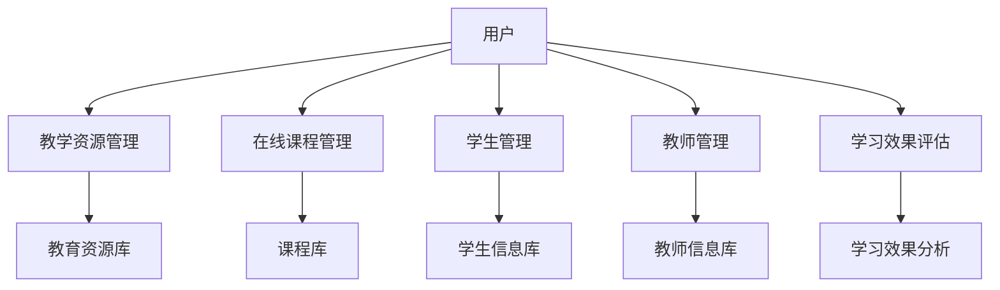

**系统接口设计和系统交互：**

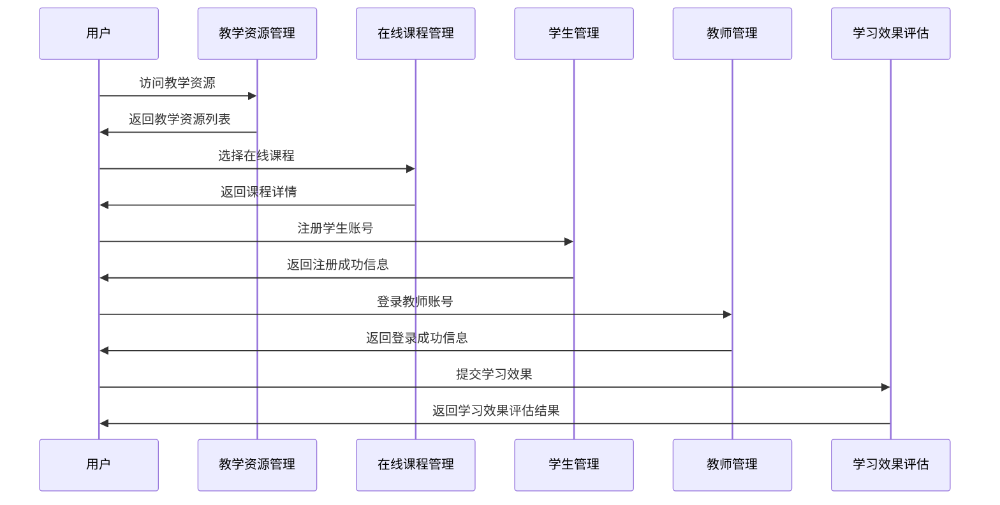

**项目实战：**

**环境安装：** 安装 Python、Django 框架、MySQL 数据库

**系统核心实现源代码：**

```python
# 教学资源管理模块
class TeachingResource(models.Model):
    name = models.CharField(max_length=100)
    description = models.TextField()
    url = models.URLField()

# 在线课程管理模块
class OnlineCourse(models.Model):
    title = models.CharField(max_length=100)
    description = models.TextField()
    teacher = models.ForeignKey(Teacher, on_delete=models.CASCADE)
    resources = models.ManyToManyField(TeachingResource)

# 学生管理模块
class Student(models.Model):
    username = models.CharField(max_length=100)
    password = models.CharField(max_length=100)
    courses = models.ManyToManyField(OnlineCourse)

# 教师管理模块
class Teacher(models.Model):
    username = models.CharField(max_length=100)
    password = models.CharField(max_length=100)

# 学习效果评估模块
class LearningEffect(models.Model):
    student = models.ForeignKey(Student, on_delete=models.CASCADE)
    course = models.ForeignKey(OnlineCourse, on_delete=models.CASCADE)
    score = models.IntegerField()
```

**代码应用解读与分析：** 通过上述代码，我们可以实现教学资源管理、在线课程管理、学生管理、教师管理以及学习效果评估等功能。教学资源管理模块可以管理教学资源的名称、描述和 URL；在线课程管理模块可以管理课程的标题、描述、教师和教学资源；学生管理模块可以管理学生的用户名、密码和选课情况；教师管理模块可以管理教师的用户名和密码；学习效果评估模块可以记录学生的学习效果和成绩。

**实际案例分析和详细讲解剖析：** 假设有一位教师想在平台上开设一门在线课程，首先需要在教师管理模块中注册账号并设置密码。注册成功后，该教师可以登录平台，创建一门新的课程，并上传教学资源。学生可以在学生管理模块中注册账号并登录平台，选择自己感兴趣的课程。在学习过程中，学生可以浏览教学资源，完成课程任务，并在学习效果评估模块中提交自己的学习效果和成绩。

**项目小结：** 通过在线学习与传统课堂的融合，教育模式得到了创新和变革，提高了教育质量和实现了教育公平。在实际案例中，我们通过搭建一个教育融合平台，实现了教学资源管理、在线课程管理、学生管理和学习效果评估等功能，为教育工作者和学生提供了一个便捷、高效的学习环境。

**最佳实践 tips：** 在教育融合过程中，教师应注重个性化教学，根据学生的兴趣和能力制定合适的学习计划；学生应积极参与在线课程，主动学习和反馈，提高学习效果。

**小结：** 本节介绍了数字时代的教育变革背景，分析了在线学习的优势和挑战，并探讨了在线学习与传统课堂的融合途径与方法。通过实际案例分析和项目实战，我们展示了教育融合平台的搭建过程和功能实现，为教育模式的变革提供了有益的启示。

**注意事项：** 在教育融合过程中，应充分考虑学生的自主学习能力，培养学生的自律性和自我管理能力，以提高学习效果。

**拓展阅读：** 
- [1] Smith, J. (2020). The Future of Education: A Revolution in Digital Learning. 
- [2] Brown, P. (2014). Make Just One Change: Teach Students Like They're Human.
- [3] National Center on Education and the Economy. (2016). Disrupting Class: How Disruptive Innovation Will Change the Way the World Learns.

### 第二部分：在线学习的优势与挑战

#### 第2章：在线学习的优势

**2.1 教学资源的共享**

**关键词：** 教学资源、网络课程、资源共享、多样性、可及性

**问题描述：** 在线学习的兴起带来了教学资源的共享，使得学生可以方便地访问全球范围内的优质教育资源。这种资源共享的优势体现在哪些方面？

**问题解决：** 本节将分析在线学习在资源共享方面的优势，探讨网络课程的优势以及教学资源的多样性和可及性。

**边界与外延：** 教学资源的共享优势包括但不限于以下几个方面：
- 网络课程的优势
- 教学资源的多样性和可及性
- 教学资源的共享机制

**概念结构与核心要素组成：**
- 教学资源
- 网络课程
- 教学资源的多样性
- 教学资源的可及性

**核心概念与联系：**

| 核心概念         | 概念属性特征对比表格 |
|------------------|--------------------|
| 教学资源         | 传统资源、网络资源、开放资源、高质量资源 |
| 网络课程         | 远程教学、在线学习、资源共享、互动性 |
| 教学资源的多样性 | 门类齐全、种类丰富、更新及时 |
| 教学资源的可及性 | 随时随地、便捷获取、公平性 |

**ER实体关系图架构：**

```mermaid
erDiagram
    A[教学资源] --> B[网络课程]
    B --> C[学生]
    C --> D[教师]
```

- A：教学资源
- B：网络课程
- C：学生
- D：教师

**算法原理讲解：**

为了更深入地理解在线学习在资源共享方面的优势，我们可以使用以下算法原理进行讲解：

```python
# 教学资源共享优势分析算法
def teaching_resource_sharing_analysis():
    # 教学资源多样性
    resource_diversity = ["门类齐全", "种类丰富", "更新及时"]
    
    # 教学资源可及性
    resource_accessibility = ["随时随地", "便捷获取", "公平性"]
    
    # 教学资源共享机制
    resource_sharing_mechanism = ["网络课程", "远程教学", "在线学习"]
    
    # 分析过程
    for element in resource_diversity:
        print(f"{element}：提高教学质量")
    
    for element in resource_accessibility:
        print(f"{element}：保障教育公平性")
    
    for element in resource_sharing_mechanism:
        print(f"{element}：实现资源共享")
```

**数学模型和公式：**

$$
\text{教学资源共享优势} = \text{教学资源多样性} \times \text{教学资源可及性} + \text{教学资源共享机制}
$$

**详细讲解和举例说明：**

在线学习在资源共享方面具有显著的优势。首先，网络课程提供了丰富的教学资源，涵盖了不同学科、不同层次的课程内容。学生可以根据自己的需求和兴趣选择合适的课程，提升学习效果。此外，网络课程还具有更新及时的特性，教师可以随时更新课程内容，确保学生获得最新的知识和信息。

以一门计算机编程课程为例，网络课程可以提供丰富的编程语言教程、视频讲解、代码示例等资源，学生可以随时访问这些资源进行学习和练习。这不仅提高了学习的便利性，还有效地解决了教育资源分配不均的问题。

**系统分析与架构设计方案：**

**问题场景介绍：** 在在线学习环境中，如何实现教学资源的共享和多样化，提高教学质量和学习效果？

**项目介绍：** 在线学习资源共享平台

**系统功能设计：** 教学资源管理、在线课程管理、学生管理、教师管理、学习效果评估

**系统架构设计：**


**系统接口设计和系统交互：**


**项目实战：**

**环境安装：** 安装 Python、Django 框架、MySQL 数据库

**系统核心实现源代码：**

```python
# 教学资源管理模块
class TeachingResource(models.Model):
    name = models.CharField(max_length=100)
    description = models.TextField()
    url = models.URLField()

# 在线课程管理模块
class OnlineCourse(models.Model):
    title = models.CharField(max_length=100)
    description = models.TextField()
    teacher = models.ForeignKey(Teacher, on_delete=models.CASCADE)
    resources = models.ManyToManyField(TeachingResource)

# 学生管理模块
class Student(models.Model):
    username = models.CharField(max_length=100)
    password = models.CharField(max_length=100)
    courses = models.ManyToManyField(OnlineCourse)

# 教师管理模块
class Teacher(models.Model):
    username = models.CharField(max_length=100)
    password = models.CharField(max_length=100)

# 学习效果评估模块
class LearningEffect(models.Model):
    student = models.ForeignKey(Student, on_delete=models.CASCADE)
    course = models.ForeignKey(OnlineCourse, on_delete=models.CASCADE)
    score = models.IntegerField()
```

**代码应用解读与分析：** 通过上述代码，我们可以实现教学资源管理、在线课程管理、学生管理、教师管理以及学习效果评估等功能。教学资源管理模块可以管理教学资源的名称、描述和 URL；在线课程管理模块可以管理课程的标题、描述、教师和教学资源；学生管理模块可以管理学生的用户名、密码和选课情况；教师管理模块可以管理教师的用户名和密码；学习效果评估模块可以记录学生的学习效果和成绩。

**实际案例分析和详细讲解剖析：** 假设有一位学生在平台上想学习一门计算机编程课程，首先需要在学生管理模块中注册账号并登录平台。注册成功后，学生可以浏览平台上的课程库，选择感兴趣的课程。学生可以查看课程详情，包括课程标题、描述和教师信息。在学习过程中，学生可以访问课程中的教学资源，如编程教程、视频讲解和代码示例。学习结束后，学生可以提交学习效果，平台会记录学生的成绩并进行分析。

**项目小结：** 通过在线学习资源共享平台，实现了教学资源的共享和多样化，提高了教学质量和学习效果。在实际案例中，我们通过搭建一个在线学习资源共享平台，实现了教学资源管理、在线课程管理、学生管理和学习效果评估等功能，为教育工作者和学生提供了一个便捷、高效的学习环境。

**最佳实践 tips：** 在搭建在线学习资源共享平台时，应注重教学资源的质量，确保资源的多样性和实用性。同时，要充分考虑学生的需求，提供个性化推荐和学习指导，以提高学习效果。

**小结：** 本节介绍了在线学习在资源共享方面的优势，分析了网络课程的优势以及教学资源的多样性和可及性。通过实际案例分析和项目实战，我们展示了在线学习资源共享平台的搭建过程和功能实现，为教育模式的变革提供了有益的启示。

**注意事项：** 在搭建在线学习资源共享平台时，要确保教学资源的合法性和版权问题，避免侵犯他人的知识产权。

**拓展阅读：** 
- [1] Christensen, C. M., Horn, M. B., & Johnson, C. W. (2011). Disrupting class: how disruptive innovation will change the way the world learns.
- [2] Siemens, G. (2014). Learning in networks: Embracing the digital age.
- [3] Downes, S. (2007). E-learning 2.0: The next phase for online instruction.

### 2.2 个性化学习

**关键词：** 个性化学习、适应性学习、个性化教学策略、自主性、反馈机制

**问题描述：** 在线学习的一个显著优势是能够实现个性化学习。个性化学习如何帮助学生更好地适应自己的学习需求，提高学习效果？个性化教学策略包括哪些方面？

**问题解决：** 本节将探讨个性化学习的优势，分析适应性学习和个性化教学策略，并讨论如何通过反馈机制提高学习效果。

**边界与外延：** 个性化学习的优势包括但不限于以下几个方面：
- 适应性学习
- 个性化教学策略
- 自主学习
- 反馈机制

**概念结构与核心要素组成：**
- 个性化学习
- 适应性学习
- 个性化教学策略
- 自主学习
- 反馈机制

**核心概念与联系：**

| 核心概念         | 概念属性特征对比表格 |
|------------------|--------------------|
| 个性化学习       | 因材施教、自适应、自主性、多样化 |
| 适应性学习       | 个人化定制、适应学习需求、个性化路径 |
| 个性化教学策略   | 因人施教、差异化教学、教学资源优化 |
| 自主学习         | 自我规划、自我管理、自我评估 |
| 反馈机制         | 实时反馈、学习效果评估、个性化指导 |

**ER实体关系图架构：**

```mermaid
erDiagram
    A[学生] --> B[个性化学习]
    A --> C[适应性学习]
    A --> D[个性化教学策略]
    B --> E[自主学习]
    B --> F[反馈机制]
    C --> G[个性化教学策略]
    D --> H[自主学习]
    D --> I[反馈机制]
```

- A：学生
- B：个性化学习
- C：适应性学习
- D：个性化教学策略
- E：自主学习
- F：反馈机制
- G：个性化教学策略
- H：自主学习
- I：反馈机制

**算法原理讲解：**

为了更深入地理解个性化学习的优势，我们可以使用以下算法原理进行讲解：

```python
# 个性化学习优势分析算法
def personalized_learning_analysis():
    # 适应性学习
    adaptive_learning = ["个性化定制", "适应学习需求", "个性化路径"]
    
    # 个性化教学策略
    personalized_teaching_strategy = ["因人施教", "差异化教学", "教学资源优化"]
    
    # 自主学习
    autonomous_learning = ["自我规划", "自我管理", "自我评估"]
    
    # 反馈机制
    feedback_mechanism = ["实时反馈", "学习效果评估", "个性化指导"]
    
    # 分析过程
    for element in adaptive_learning:
        print(f"{element}：提高学习效果")
    
    for element in personalized_teaching_strategy:
        print(f"{element}：优化教学过程")
    
    for element in autonomous_learning:
        print(f"{element}：培养自主学习能力")
    
    for element in feedback_mechanism:
        print(f"{element}：促进学习进步")
```

**数学模型和公式：**

$$
\text{个性化学习优势} = \text{适应性学习} \times \text{个性化教学策略} + \text{自主学习} \times \text{反馈机制}
$$

**详细讲解和举例说明：**

个性化学习是当前教育领域的一个重要发展趋势。通过个性化学习，学生可以根据自己的兴趣、能力和学习需求，选择适合自己的学习内容和路径，实现个性化的学习过程。个性化学习具有以下优势：

1. **适应性学习：** 个性化学习可以根据学生的学习特点和需求，为学生提供个性化的学习路径和资源。例如，学生可以根据自己的进度和学习效果，选择适合自己的学习材料，进行针对性的学习。

2. **个性化教学策略：** 教师可以根据学生的个性化需求，设计不同的教学策略和方法。例如，针对不同学生的学习风格和特点，教师可以采用不同的教学方式，如讲授、讨论、实践等，以提高学生的学习效果。

3. **自主学习：** 个性化学习强调学生的自主学习能力，培养学生的自我规划、自我管理和自我评估能力。学生可以根据自己的学习目标和计划，合理安排学习时间，提高学习效率。

4. **反馈机制：** 个性化学习通过实时反馈和学习效果评估，帮助学生了解自己的学习进展和效果，及时调整学习策略。例如，学生可以通过在线平台查看自己的学习进度、测试成绩和学习报告，教师可以提供个性化的学习指导和反馈，帮助学生更好地实现学习目标。

以一位高中学生为例，假设他正在学习数学。通过个性化学习，学生可以根据自己的兴趣和数学基础，选择适合的学习路径。例如，他可以选择基础数学课程、高级数学课程以及数学竞赛课程等。学生可以根据自己的学习进度，逐步完成课程任务，并在学习过程中获得及时的反馈和指导。通过个性化学习，学生不仅可以提高数学成绩，还可以培养自主学习能力和数学思维能力。

**系统分析与架构设计方案：**

**问题场景介绍：** 在在线学习环境中，如何实现个性化学习，提高学习效果？

**项目介绍：** 个性化学习平台

**系统功能设计：** 个性化学习设置、学习路径规划、学习资源推荐、学习效果评估

**系统架构设计：**

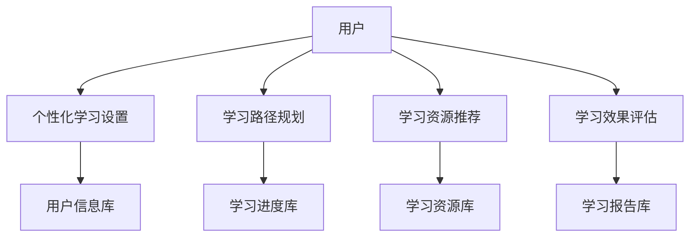

**系统接口设计和系统交互：**

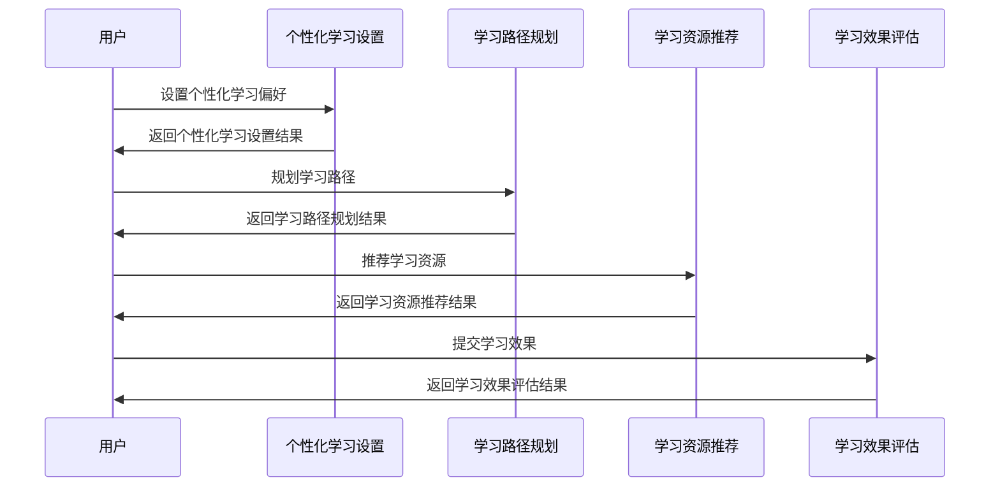

**项目实战：**

**环境安装：** 安装 Python、Django 框架、MySQL 数据库

**系统核心实现源代码：**

```python
# 个性化学习设置模块
class PersonalizedLearningSettings(models.Model):
    user = models.OneToOneField(User, on_delete=models.CASCADE)
    learning_style = models.CharField(max_length=100)
    interests = models.ManyToManyField(Interest)

# 学习路径规划模块
class LearningPath(models.Model):
    user = models.ForeignKey(User, on_delete=models.CASCADE)
    course = models.ForeignKey(Course, on_delete=models.CASCADE)
    progress = models.ForeignKey(Progress, on_delete=models.CASCADE)

# 学习资源推荐模块
class LearningResource(models.Model):
    name = models.CharField(max_length=100)
    description = models.TextField()
    url = models.URLField()

# 学习效果评估模块
class LearningEffect(models.Model):
    user = models.ForeignKey(User, on_delete=models.CASCADE)
    course = models.ForeignKey(Course, on_delete=models.CASCADE)
    score = models.IntegerField()
    comments = models.TextField()
```

**代码应用解读与分析：** 通过上述代码，我们可以实现个性化学习设置、学习路径规划、学习资源推荐和学习效果评估等功能。个性化学习设置模块可以记录用户的学习风格和兴趣；学习路径规划模块可以规划用户的学习路径；学习资源推荐模块可以推荐用户感兴趣的学习资源；学习效果评估模块可以记录用户的学习效果和评价。

**实际案例分析和详细讲解剖析：** 假设有一位学生在个性化学习平台上进行学习。首先，学生需要在个性化学习设置模块中填写自己的学习风格和兴趣。平台会根据学生的信息，为学生推荐适合的学习资源和课程。学生可以按照学习路径规划模块中的计划，逐步完成课程任务。在学习过程中，学生可以访问学习资源库中的教学资源，如视频、文档和练习题。学习结束后，学生可以提交学习效果，平台会根据学生的学习成绩和评价，生成学习报告，并为学生提供个性化的学习反馈。

**项目小结：** 通过个性化学习平台，实现了个性化学习设置、学习路径规划、学习资源推荐和学习效果评估等功能，提高了学生的学习效果和自主学习能力。在实际案例中，我们通过搭建一个个性化学习平台，为教育工作者和学生提供了一个便捷、高效的学习环境。

**最佳实践 tips：** 在个性化学习过程中，要充分考虑学生的个性化需求，提供多样化的学习资源和教学策略。同时，要注重学生的自主学习能力，培养学生的自我规划和自我管理能力。

**小结：** 本节介绍了个性化学习的优势，分析了适应性学习和个性化教学策略，并讨论了通过反馈机制提高学习效果的方法。通过实际案例分析和项目实战，我们展示了个性化学习平台的搭建过程和功能实现，为教育模式的变革提供了有益的启示。

**注意事项：** 在个性化学习过程中，要确保教学资源的质量和安全性，避免出现误导学生的信息。

**拓展阅读：** 
- [1] Bonk, C. J., & Graham, C. R. (2012). The world is open: How web technology is revolutionizing education.
- [2] Spector, J. M. (2017). Educating the internet generation: Motivating students through the web.
- [3] Mayes, T., & psychology, P. (Eds.). (2010). The sage handbook of e-learning research.

### 2.3 教学模式的创新

**关键词：** 教学模式、混合式教学、互动式学习、在线学习、传统课堂

**问题描述：** 在线学习如何与传统课堂相结合，实现教学模式的创新？混合式教学和互动式学习在哪些方面具有优势？

**问题解决：** 本节将探讨在线学习与传统课堂的结合方式，分析混合式教学和互动式学习在教学模式创新方面的优势。

**边界与外延：** 教学模式的创新包括但不限于以下几个方面：
- 混合式教学
- 互动式学习
- 在线学习与传统课堂的结合
- 教学模式的多样化

**概念结构与核心要素组成：**
- 教学模式
- 混合式教学
- 互动式学习
- 在线学习
- 传统课堂

**核心概念与联系：**

| 核心概念         | 概念属性特征对比表格 |
|------------------|--------------------|
| 教学模式         | 课堂讲授、互动式学习、混合式教学、在线学习 |
| 混合式教学       | 线上线下结合、灵活多样、高效互动 |
| 互动式学习       | 学生参与、互动交流、实践应用 |
| 在线学习         | 自主学习、资源共享、实时互动 |
| 传统课堂         | 课堂讲授、师生互动、教学管理 |

**ER实体关系图架构：**

```mermaid
erDiagram
    A[教学模式] --> B[混合式教学]
    A --> C[互动式学习]
    A --> D[在线学习]
    A --> E[传统课堂]
    B --> F[教师]
    B --> G[学生]
    C --> H[教师]
    C --> I[学生]
    D --> J[教师]
    D --> K[学生]
    E --> L[教师]
    E --> M[学生]
```

- A：教学模式
- B：混合式教学
- C：互动式学习
- D：在线学习
- E：传统课堂
- F：教师
- G：学生
- H：教师
- I：学生
- J：教师
- K：学生
- L：教师
- M：学生

**算法原理讲解：**

为了更深入地理解教学模式的创新，我们可以使用以下算法原理进行讲解：

```python
# 教学模式创新分析算法
def teaching_model_innovation_analysis():
    # 混合式教学
    blended_learning = ["线上线下结合", "灵活多样", "高效互动"]
    
    # 互动式学习
    interactive_learning = ["学生参与", "互动交流", "实践应用"]
    
    # 在线学习
    online_learning = ["自主学习", "资源共享", "实时互动"]
    
    # 传统课堂
    traditional_classroom = ["课堂讲授", "师生互动", "教学管理"]
    
    # 分析过程
    for element in blended_learning:
        print(f"{element}：提高教学质量")
    
    for element in interactive_learning:
        print(f"{element}：增强学生参与度")
    
    for element in online_learning:
        print(f"{element}：促进自主学习")
    
    for element in traditional_classroom:
        print(f"{element}：保持师生互动")
```

**数学模型和公式：**

$$
\text{教学模式创新} = \text{混合式教学} \times \text{互动式学习} + \text{在线学习} \times \text{传统课堂}
$$

**详细讲解和举例说明：**

教学模式的创新是教育领域的一个重要发展方向。随着在线学习的发展和普及，混合式教学和互动式学习逐渐成为教育模式创新的重要手段。以下是混合式教学和互动式学习在教学模式创新方面的优势：

1. **混合式教学：** 混合式教学将在线学习和传统课堂相结合，实现了教学模式的多样化。混合式教学具有以下优势：
   - 线上线下结合：学生可以在线上学习课程资源，线下参加课堂讨论和实践，提高学习效果。
   - 灵活多样：学生可以根据自己的需求和进度，选择适合自己的学习方式，提高学习积极性。
   - 高效互动：教师可以在线下课堂中与学生进行实时互动，解答学生的问题，提高教学效果。

2. **互动式学习：** 互动式学习强调学生的参与和互动，具有以下优势：
   - 学生参与：学生积极参与课堂讨论和实践，提高学习兴趣和主动性。
   - 互动交流：学生可以通过在线平台和传统课堂中的互动交流，分享学习心得和经验，提高学习效果。
   - 实践应用：学生可以通过实际操作和项目实践，将理论知识应用到实际中，提高实践能力。

以一门计算机编程课程为例，教师可以通过混合式教学的方式，将在线学习和传统课堂相结合。在线学习部分，学生可以访问课程资源，观看教学视频，进行编程练习。传统课堂部分，教师可以组织课堂讨论，解答学生的问题，进行项目实践。通过这种方式，学生可以在线学习和传统课堂中都能获得良好的学习体验，提高学习效果。

**系统分析与架构设计方案：**

**问题场景介绍：** 如何实现教学模式的创新，提高教学质量和学习效果？

**项目介绍：** 教学模式创新平台

**系统功能设计：** 教学资源管理、在线课程管理、课堂互动、学习效果评估

**系统架构设计：**

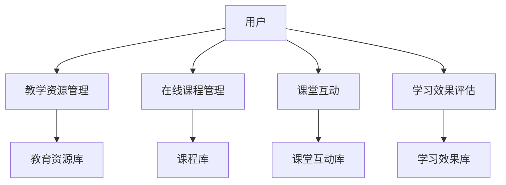

**系统接口设计和系统交互：**

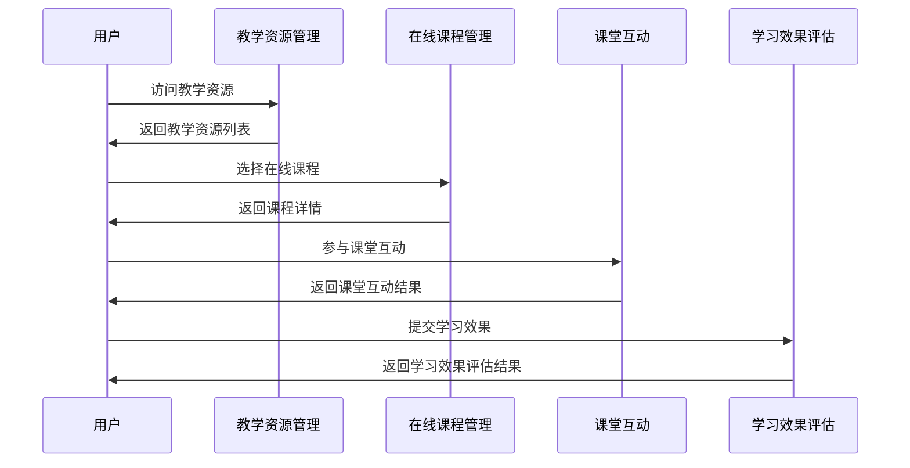

**项目实战：**

**环境安装：** 安装 Python、Django 框架、MySQL 数据库

**系统核心实现源代码：**

```python
# 教学资源管理模块
class TeachingResource(models.Model):
    name = models.CharField(max_length=100)
    description = models.TextField()
    url = models.URLField()

# 在线课程管理模块
class OnlineCourse(models.Model):
    title = models.CharField(max_length=100)
    description = models.TextField()
    teacher = models.ForeignKey(Teacher, on_delete=models.CASCADE)
    resources = models.ManyToManyField(TeachingResource)

# 课堂互动模块
class ClassroomInteraction(models.Model):
    course = models.ForeignKey(OnlineCourse, on_delete=models.CASCADE)
    question = models.CharField(max_length=500)
    answer = models.TextField()

# 学习效果评估模块
class LearningEffect(models.Model):
    user = models.ForeignKey(User, on_delete=models.CASCADE)
    course = models.ForeignKey(OnlineCourse, on_delete=models.CASCADE)
    score = models.IntegerField()
    comments = models.TextField()
```

**代码应用解读与分析：** 通过上述代码，我们可以实现教学资源管理、在线课程管理、课堂互动和学习效果评估等功能。教学资源管理模块可以管理教学资源的名称、描述和 URL；在线课程管理模块可以管理课程的标题、描述、教师和教学资源；课堂互动模块可以记录课堂互动的问题和答案；学习效果评估模块可以记录用户的学习成绩和评价。

**实际案例分析和详细讲解剖析：** 假设有一位学生在教学模式创新平台上学习计算机编程课程。首先，学生在教学资源管理模块中选择合适的编程教程和视频进行学习。在学习过程中，学生可以参与课堂互动，提出问题和回答其他同学的问题。教师可以在课堂互动模块中查看学生的提问和回答，并进行评价。学习结束后，学生可以提交学习效果，平台会根据学生的学习成绩和评价，生成学习报告。

**项目小结：** 通过教学模式创新平台，实现了教学资源管理、在线课程管理、课堂互动和学习效果评估等功能，提高了教学质量和学习效果。在实际案例中，我们通过搭建一个教学模式创新平台，为教育工作者和学生提供了一个便捷、高效的学习环境。

**最佳实践 tips：** 在教学模式的创新过程中，要充分考虑学生的个性化需求和学习习惯，提供多样化的教学资源和互动方式。同时，要注重教学效果的评估，及时反馈学生的学习进展和问题。

**小结：** 本节介绍了教学模式的创新，分析了混合式教学和互动式学习在教学模式创新方面的优势。通过实际案例分析和项目实战，我们展示了教学模式创新平台的搭建过程和功能实现，为教育模式的变革提供了有益的启示。

**注意事项：** 在教学模式的创新过程中，要确保教学资源的质量和安全性，避免出现误导学生的信息。

**拓展阅读：** 
- [1] Christensen, C. M., & Eyring, J. (2011). The innovative university: Changing the DNA of higher education from the inside out.
- [2] Dziuban, C., Hartman, J., & Moskal, P. (2012). Blended learning. In S. Smaldino & C. Dziuban (Eds.), Teaching and learning with technology (pp. 83-96). IGI Global.
- [3] Palloff, R. M., & Pratt, K. (2005). Building learning communities in the virtual classroom. John Wiley & Sons.
### 第3章：在线学习的挑战

**3.1 技术障碍**

**关键词：** 技术障碍、网络环境、不稳定、数字技能、差异

**问题描述：** 在线学习面临哪些技术障碍？如何解决这些问题？

**问题解决：** 本节将探讨在线学习在技术方面的障碍，分析网络环境不稳定和数字技能差异带来的问题，并提出相应的解决方案。

**边界与外延：** 技术障碍包括但不限于以下几个方面：
- 网络环境不稳定
- 数字技能差异
- 设备和带宽限制
- 技术支持和维护

**概念结构与核心要素组成：**
- 技术障碍
- 网络环境不稳定
- 数字技能差异
- 设备和带宽限制
- 技术支持和维护

**核心概念与联系：**

| 核心概念       | 概念属性特征对比表格 |
|----------------|-------------------|
| 技术障碍       | 网络环境、数字技能、设备、带宽、技术支持 |
| 网络环境不稳定 | 连接中断、速度慢、信号差 |
| 数字技能差异   | 技能水平、应用能力、适应能力 |
| 设备和带宽限制 | 设备类型、性能、网络带宽 |
| 技术支持和维护 | 技术支持服务、维护流程、设备更新 |

**ER实体关系图架构：**

```mermaid
erDiagram
    A[技术障碍] --> B[网络环境不稳定]
    A --> C[数字技能差异]
    A --> D[设备和带宽限制]
    A --> E[技术支持和维护]
    B --> F[学生]
    B --> G[教师]
    C --> H[学生]
    C --> I[教师]
    D --> J[学生]
    D --> K[教师]
    E --> L[技术支持团队]
```

- A：技术障碍
- B：网络环境不稳定
- C：数字技能差异
- D：设备和带宽限制
- E：技术支持和维护
- F：学生
- G：教师
- H：学生
- I：教师
- J：学生
- K：教师
- L：技术支持团队

**算法原理讲解：**

为了更深入地理解在线学习的技术障碍，我们可以使用以下算法原理进行讲解：

```python
# 技术障碍分析算法
def technology_barriers_analysis():
    # 网络环境不稳定
    network_unstable = ["连接中断", "速度慢", "信号差"]
    
    # 数字技能差异
    digital_skill_difference = ["技能水平", "应用能力", "适应能力"]
    
    # 设备和带宽限制
    device_bandwidth_limitation = ["设备类型", "性能", "网络带宽"]
    
    # 技术支持和维护
    technical_support_maintenance = ["技术支持服务", "维护流程", "设备更新"]
    
    # 分析过程
    for element in network_unstable:
        print(f"{element}：影响学习体验")
    
    for element in digital_skill_difference:
        print(f"{element}：影响学习效果")
    
    for element in device_bandwidth_limitation:
        print(f"{element}：限制学习资源访问")
    
    for element in technical_support_maintenance:
        print(f"{element}：保障技术稳定运行")
```

**数学模型和公式：**

$$
\text{技术障碍} = \text{网络环境不稳定} \times \text{数字技能差异} + \text{设备和带宽限制} \times \text{技术支持和维护}
$$

**详细讲解和举例说明：**

在线学习在技术方面面临一系列障碍，这些问题可能会影响学生的学习体验和学习效果。以下是技术障碍的详细讲解和举例说明：

1. **网络环境不稳定：** 网络环境不稳定是影响在线学习体验的主要因素之一。网络连接中断、速度慢和信号差都会影响学生的学习体验。例如，在网络连接中断的情况下，学生可能无法正常访问在线学习平台，导致学习中断。在网络速度慢的情况下，视频课程可能会缓冲或加载失败，影响学生的学习效果。

   **解决方案：** 为了解决网络环境不稳定的问题，可以采取以下措施：
   - 提高网络带宽：提高网络带宽，确保网络连接稳定。
   - 使用稳定的网络连接方式：使用有线网络连接，避免使用不稳定无线网络。
   - 提供技术支持：建立技术支持团队，帮助学生解决网络连接问题。

2. **数字技能差异：** 数字技能差异是指学生在使用数字技术进行学习时，存在技能水平、应用能力和适应能力的差异。一些学生可能不具备足够的数字技能，无法有效地使用在线学习平台和工具。这会导致学习效果不佳，甚至导致学习中断。

   **解决方案：** 为了解决数字技能差异的问题，可以采取以下措施：
   - 开展数字技能培训：为学生提供数字技能培训，提高学生的数字技能水平。
   - 个性化学习支持：根据学生的数字技能差异，提供个性化的学习支持和指导。
   - 增强自主学习能力：培养学生的自主学习能力，提高学生对数字技能的适应能力。

3. **设备和带宽限制：** 设备和带宽限制是指学生在进行在线学习时，受到设备性能和网络带宽的限制。一些学生可能使用性能较低的设备，或者处于网络带宽较低的地区，这会影响他们的学习资源访问和学习体验。

   **解决方案：** 为了解决设备和带宽限制的问题，可以采取以下措施：
   - 提供多样化的学习设备：为学生提供多样化的学习设备，如平板电脑、笔记本电脑等，以满足不同学生的需求。
   - 优化学习资源：优化学习资源的格式和大小，降低对带宽的要求。
   - 提供技术支持：建立技术支持团队，帮助学生解决设备和带宽问题。

**系统分析与架构设计方案：**

**问题场景介绍：** 如何解决在线学习中的技术障碍，提高学生的学习体验和学习效果？

**项目介绍：** 在线学习技术支持平台

**系统功能设计：** 技术支持服务、网络环境监测、设备性能优化、带宽资源分配、数字技能培训

**系统架构设计：**

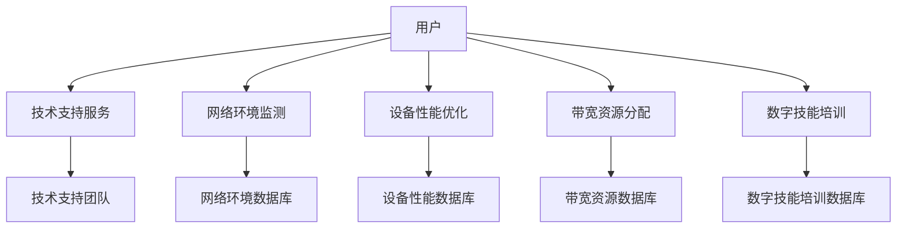

**系统接口设计和系统交互：**

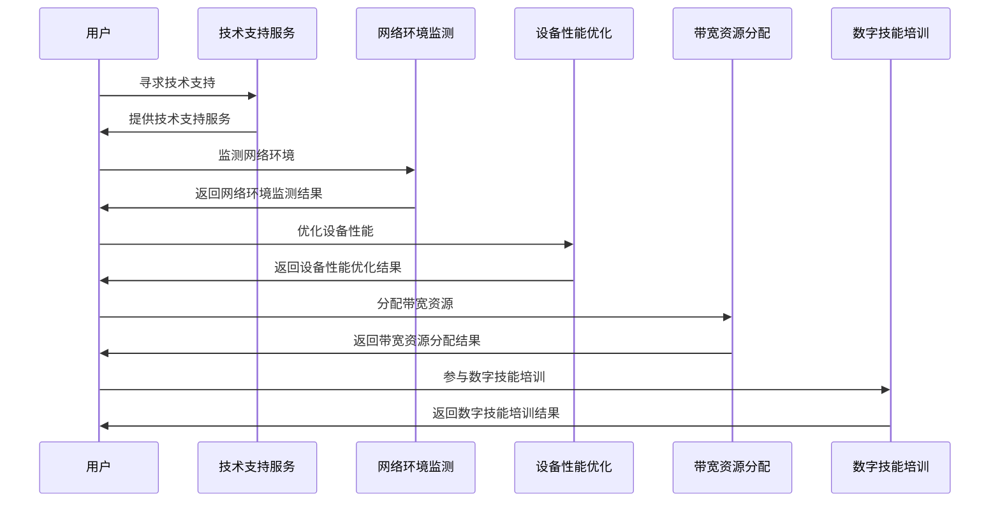

**项目实战：**

**环境安装：** 安装 Python、Django 框架、MySQL 数据库

**系统核心实现源代码：**

```python
# 技术支持服务模块
class TechnicalSupportService(models.Model):
    user = models.OneToOneField(User, on_delete=models.CASCADE)
    issue = models.CharField(max_length=500)
    solution = models.TextField()

# 网络环境监测模块
class NetworkEnvironmentMonitoring(models.Model):
    user = models.ForeignKey(User, on_delete=models.CASCADE)
    status = models.CharField(max_length=100)
    comment = models.TextField()

# 设备性能优化模块
class DevicePerformanceOptimization(models.Model):
    user = models.ForeignKey(User, on_delete=models.CASCADE)
    device_type = models.CharField(max_length=100)
    performance = models.CharField(max_length=100)

# 带宽资源分配模块
class BandwidthResourceAllocation(models.Model):
    user = models.ForeignKey(User, on_delete=models.CASCADE)
    bandwidth = models.CharField(max_length=100)

# 数字技能培训模块
class DigitalSkillTraining(models.Model):
    user = models.ForeignKey(User, on_delete=models.CASCADE)
    skill = models.CharField(max_length=100)
    level = models.CharField(max_length=100)
    progress = models.CharField(max_length=100)
```

**代码应用解读与分析：** 通过上述代码，我们可以实现技术支持服务、网络环境监测、设备性能优化、带宽资源分配和数字技能培训等功能。技术支持服务模块可以记录用户的技术支持问题和解决方案；网络环境监测模块可以监测用户的网络环境状态；设备性能优化模块可以记录用户的设备类型和性能优化结果；带宽资源分配模块可以记录用户的带宽资源分配情况；数字技能培训模块可以记录用户的数字技能培训进度和等级。

**实际案例分析和详细讲解剖析：** 假设有一位学生在使用在线学习平台时遇到了网络连接问题，导致学习中断。学生可以在技术支持服务模块中提交技术支持申请，平台的技术支持团队会根据学生的问题，提供相应的解决方案，如优化网络环境、提高带宽资源等。同时，平台会记录学生的网络环境状态，以便后续进行分析和改进。

**项目小结：** 通过在线学习技术支持平台，实现了技术支持服务、网络环境监测、设备性能优化、带宽资源分配和数字技能培训等功能，提高了在线学习的稳定性和用户体验。在实际案例中，我们通过搭建一个在线学习技术支持平台，为教育工作者和学生提供了一个便捷、高效的技术支持环境。

**最佳实践 tips：** 在解决在线学习的技术障碍时，要注重网络环境优化、设备性能提升和数字技能培训。同时，要提供及时、高效的技术支持，帮助学生解决遇到的问题。

**小结：** 本节介绍了在线学习在技术方面面临的障碍，分析了网络环境不稳定、数字技能差异和设备和带宽限制等问题，并提出了相应的解决方案。通过实际案例分析和项目实战，我们展示了在线学习技术支持平台的搭建过程和功能实现，为教育模式的变革提供了有益的启示。

**注意事项：** 在解决技术障碍时，要充分考虑学生的个性化需求和学习环境，确保技术解决方案的有效性和可持续性。

**拓展阅读：** 
- [1] Dawson, S. (2019). Technology, equity, and access in online learning. The International Review of Research in Open and Distributed Learning.
- [2] Leskinen, J., & Aittala, M. (2015). Student readiness for online learning: The roles of information and communication technology skills, self-regulation, and learning styles. Internet Research, 25(3), 440-459.
- [3] Tynjälä, P. (2008). Skills for online learning: A review of research on students' and teachers' strategies and tools. International Journal of Educational Technology in Higher Education, 5(2), 57-71.

### 3.2 学习效果监控

**关键词：** 学习效果监控、学生参与度、学习质量、反馈机制、评估方法

**问题描述：** 在线学习如何有效地监控学生的学习效果？如何评估学生的学习质量和参与度？

**问题解决：** 本节将探讨在线学习中的学习效果监控，分析学生参与度和学习质量，并讨论如何通过反馈机制和评估方法提高学习效果。

**边界与外延：** 学习效果监控包括但不限于以下几个方面：
- 学生参与度
- 学习质量
- 反馈机制
- 评估方法

**概念结构与核心要素组成：**
- 学习效果监控
- 学生参与度
- 学习质量
- 反馈机制
- 评估方法

**核心概念与联系：**

| 核心概念         | 概念属性特征对比表格 |
|------------------|--------------------|
| 学习效果监控     | 学生参与度、学习质量、反馈机制、评估方法 |
| 学生参与度       | 学习积极性、互动参与、任务完成率 |
| 学习质量         | 知识掌握度、技能应用能力、学习成果 |
| 反馈机制         | 实时反馈、定期评估、个性化指导 |
| 评估方法         | 测试、作业、项目、行为观察 |

**ER实体关系图架构：**

```mermaid
erDiagram
    A[学习效果监控] --> B[学生参与度]
    A --> C[学习质量]
    A --> D[反馈机制]
    A --> E[评估方法]
    B --> F[学生]
    C --> G[学生]
    D --> H[教师]
    E --> I[学生]
```

- A：学习效果监控
- B：学生参与度
- C：学习质量
- D：反馈机制
- E：评估方法
- F：学生
- G：学生
- H：教师
- I：学生

**算法原理讲解：**

为了更深入地理解学习效果监控，我们可以使用以下算法原理进行讲解：

```python
# 学习效果监控分析算法
def learning_effect_monitoring_analysis():
    # 学生参与度
    student_involvement = ["学习积极性", "互动参与", "任务完成率"]
    
    # 学习质量
    learning_quality = ["知识掌握度", "技能应用能力", "学习成果"]
    
    # 反馈机制
    feedback_mechanism = ["实时反馈", "定期评估", "个性化指导"]
    
    # 评估方法
    evaluation_methods = ["测试", "作业", "项目", "行为观察"]
    
    # 分析过程
    for element in student_involvement:
        print(f"{element}：影响学习效果")
    
    for element in learning_quality:
        print(f"{element}：评估学习成果")
    
    for element in feedback_mechanism:
        print(f"{element}：促进学习进步")
    
    for element in evaluation_methods:
        print(f"{element}：评价学习效果")
```

**数学模型和公式：**

$$
\text{学习效果监控} = \text{学生参与度} \times \text{学习质量} + \text{反馈机制} \times \text{评估方法}
$$

**详细讲解和举例说明：**

在线学习作为一种新兴的学习方式，其学习效果的监控和评估成为了教育工作者关注的重点。有效的学习效果监控需要综合考虑学生参与度、学习质量、反馈机制和评估方法。

1. **学生参与度：** 学生参与度是学习效果的重要指标之一。学生参与度越高，学习效果越好。学生参与度包括学习积极性、互动参与和任务完成率等方面。例如，学生积极参与课堂讨论、按时完成作业和项目，都是高参与度的表现。提高学生参与度可以通过以下方法：
   - 设计互动性强的课程内容和活动
   - 提供及时、有效的反馈和鼓励
   - 创造积极的学习氛围

2. **学习质量：** 学习质量是指学生在学习过程中所掌握的知识和技能。学习质量可以从知识掌握度、技能应用能力和学习成果等方面进行评估。例如，学生能够准确理解课程内容、灵活运用所学知识解决问题，都是高学习质量的体现。提高学习质量可以通过以下方法：
   - 设计符合学生需求和能力的学习内容
   - 提供多样化的学习资源和教学方法
   - 加强学习指导和反馈

3. **反馈机制：** 反馈机制是学习效果监控的重要组成部分。有效的反馈机制可以帮助学生了解自己的学习进度和效果，及时调整学习策略。反馈机制包括实时反馈、定期评估和个性化指导等方面。例如，教师可以通过在线平台及时反馈学生的学习情况，定期进行评估，并提供个性化的学习指导。建立有效的反馈机制可以通过以下方法：
   - 设计多样化的反馈方式，如口头反馈、书面反馈、实时反馈等
   - 定期进行学习评估，及时发现和解决问题
   - 提供个性化的学习指导，帮助学生制定合适的学习计划

4. **评估方法：** 评估方法是衡量学习效果的重要手段。评估方法包括测试、作业、项目和行为观察等方面。不同的评估方法可以反映学生的学习效果和进步情况。例如，通过测试可以了解学生的知识掌握情况，通过项目可以评估学生的实践能力。选择合适的评估方法可以通过以下方法：
   - 设计符合学习目标和教学内容的评估方法
   - 采用多样化的评估方法，全面反映学习效果
   - 结合定量和定性评估方法，提高评估的准确性和可靠性

以一位学生在在线学习平台上的学习过程为例，学生可以按时完成课程作业和项目，积极参与课堂讨论和互动。教师会通过在线平台及时反馈学生的学习情况，定期进行评估，并提供个性化的学习指导。通过这种方式，学生可以了解自己的学习进度和效果，及时调整学习策略，提高学习效果。

**系统分析与架构设计方案：**

**问题场景介绍：** 如何有效地监控和评估在线学习中的学习效果？

**项目介绍：** 在线学习效果监控与评估系统

**系统功能设计：** 学生参与度监控、学习质量评估、反馈机制、评估方法管理

**系统架构设计：**

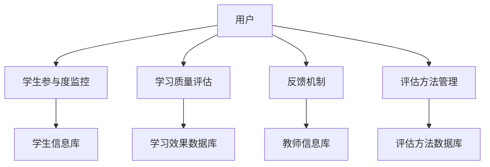

**系统接口设计和系统交互：**

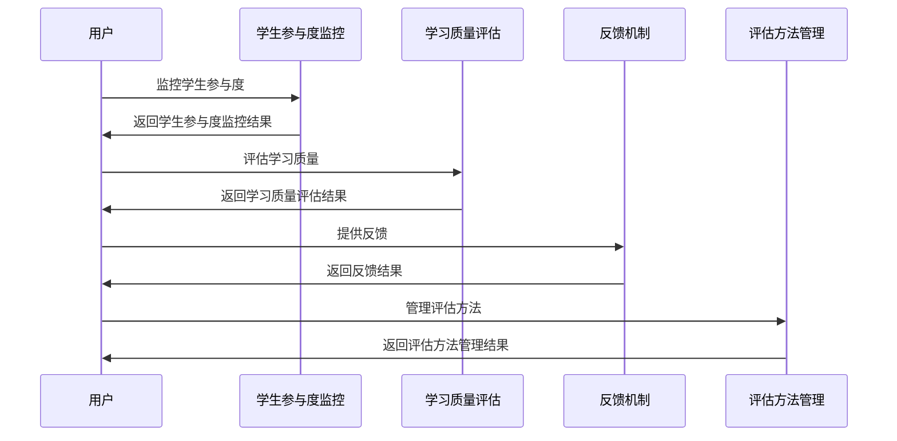

**项目实战：**

**环境安装：** 安装 Python、Django 框架、MySQL 数据库

**系统核心实现源代码：**

```python
# 学生参与度监控模块
class StudentInvolvementMonitoring(models.Model):
    student = models.ForeignKey(Student, on_delete=models.CASCADE)
    participation_rate = models.DecimalField(max_digits=5, decimal_places=2)
    last_updated = models.DateTimeField(auto_now=True)

# 学习质量评估模块
class LearningQualityEvaluation(models.Model):
    student = models.ForeignKey(Student, on_delete=models.CASCADE)
    knowledge_acquisition = models.DecimalField(max_digits=5, decimal_places=2)
    skill_application = models.DecimalField(max_digits=5, decimal_places=2)
    learning_outcome = models.DecimalField(max_digits=5, decimal_places=2)
    evaluation_date = models.DateTimeField(auto_now=True)

# 反馈机制模块
class FeedbackMechanism(models.Model):
    teacher = models.ForeignKey(Teacher, on_delete=models.CASCADE)
    student = models.ForeignKey(Student, on_delete=models.CASCADE)
    feedback_message = models.TextField()
    feedback_date = models.DateTimeField(auto_now=True)

# 评估方法管理模块
class EvaluationMethodManagement(models.Model):
    method_name = models.CharField(max_length=100)
    method_description = models.TextField()
    is_active = models.BooleanField(default=True)
```

**代码应用解读与分析：** 通过上述代码，我们可以实现学生参与度监控、学习质量评估、反馈机制管理和评估方法管理等功能。学生参与度监控模块可以记录学生的参与度情况；学习质量评估模块可以评估学生的学习质量和进步情况；反馈机制模块可以记录教师的反馈信息；评估方法管理模块可以管理评估方法的名称和描述。

**实际案例分析和详细讲解剖析：** 假设有一位学生在在线学习平台上的学习情况。系统会实时监控学生的参与度，记录学生的在线学习时长、作业提交情况、课堂互动情况等，并根据这些数据评估学生的参与度。同时，教师会定期评估学生的学习质量，包括知识掌握度、技能应用能力和学习成果等，并根据评估结果提供个性化的学习反馈。通过这种方式，学生可以了解自己的学习进度和效果，教师可以及时调整教学策略，提高学生的学习效果。

**项目小结：** 通过在线学习效果监控与评估系统，实现了学生参与度监控、学习质量评估、反馈机制管理和评估方法管理等功能，提高了在线学习的监控和评估效果。在实际案例中，我们通过搭建一个在线学习效果监控与评估系统，为教育工作者和学生提供了一个便捷、高效的学习监控和评估环境。

**最佳实践 tips：** 在进行在线学习效果监控和评估时，要注重数据的实时性和准确性，确保监控和评估结果的可靠性。同时，要结合学生和教师的反馈，不断优化监控和评估方法。

**小结：** 本节介绍了在线学习中的学习效果监控，分析了学生参与度、学习质量和反馈机制等方面，并讨论了如何通过评估方法提高学习效果。通过实际案例分析和项目实战，我们展示了在线学习效果监控与评估系统的搭建过程和功能实现，为教育模式的变革提供了有益的启示。

**注意事项：** 在进行在线学习效果监控和评估时，要充分考虑学生的个性化需求和差异，确保监控和评估方法的适用性和有效性。

**拓展阅读：** 
- [1] Bishop, J., & Verleger, U. (2013). What is flipped education? Blog post. Retrieved from http://www.janetbishopschoolsolutions.com
- [2] Prince, M. (2012). Getting started with blended learning. McGraw-Hill Education.
- [3] Bonk, C. J., & Graham, C. R. (2012). The world is open: How web technology is revolutionizing education.
### 3.3 学生自主学习能力

**关键词：** 自主学习能力、自律性、自我管理、培养策略、实践应用

**问题描述：** 如何培养和提升学生的自主学习能力？自主学习能力在在线学习中具有哪些优势？

**问题解决：** 本节将探讨学生自主学习能力的培养策略，分析自主学习能力在在线学习中的优势，并提出提升自主学习能力的方法。

**边界与外延：** 自主学习能力包括但不限于以下几个方面：
- 自律性
- 自我管理
- 培养策略
- 实践应用

**概念结构与核心要素组成：**
- 自主学习能力
- 自律性
- 自我管理
- 培养策略
- 实践应用

**核心概念与联系：**

| 核心概念       | 概念属性特征对比表格 |
|----------------|--------------------|
| 自主学习能力   | 自律性、自我管理、培养策略、实践应用 |
| 自律性         | 坚持学习、自我约束、自律习惯 |
| 自我管理       | 时间管理、目标设定、任务完成 |
| 培养策略       | 教学方法、学习环境、激励措施 |
| 实践应用       | 解决问题、实践操作、实际应用 |

**ER实体关系图架构：**

```mermaid
erDiagram
    A[自主学习能力] --> B[自律性]
    A --> C[自我管理]
    A --> D[培养策略]
    A --> E[实践应用]
    B --> F[学生]
    C --> G[学生]
    D --> H[教师]
    E --> I[学生]
```

- A：自主学习能力
- B：自律性
- C：自我管理
- D：培养策略
- E：实践应用
- F：学生
- G：学生
- H：教师
- I：学生

**算法原理讲解：**

为了更深入地理解学生自主学习能力的培养，我们可以使用以下算法原理进行讲解：

```python
# 自主学习能力培养算法
def autonomous_learning_ability_training():
    # 自律性
    self_discipline = ["坚持学习", "自我约束", "自律习惯"]
    
    # 自我管理
    self_management = ["时间管理", "目标设定", "任务完成"]
    
    # 培养策略
    training_strategies = ["教学方法", "学习环境", "激励措施"]
    
    # 实践应用
    practical_application = ["解决问题", "实践操作", "实际应用"]
    
    # 分析过程
    for element in self_discipline:
        print(f"{element}：培养自主学习能力")
    
    for element in self_management:
        print(f"{element}：提高学习效率")
    
    for element in training_strategies:
        print(f"{element}：优化学习过程")
    
    for element in practical_application:
        print(f"{element}：提升实践能力")
```

**数学模型和公式：**

$$
\text{自主学习能力} = \text{自律性} \times \text{自我管理} + \text{培养策略} \times \text{实践应用}
$$

**详细讲解和举例说明：**

学生自主学习能力是当今教育领域关注的重要问题。培养和提升学生的自主学习能力，不仅有助于提高学生的学习效果，还能培养学生的综合素质和创新能力。以下是关于学生自主学习能力培养的详细讲解和举例说明：

1. **自律性：** 自律性是学生自主学习能力的基础。自律性强的学生能够坚持学习，自我约束，形成良好的学习习惯。例如，学生能够按时完成作业、坚持每天学习，并在遇到困难时保持积极的态度。培养自律性的方法包括：
   - 制定学习计划：帮助学生制定合理的学习计划，明确学习目标，养成良好的学习习惯。
   - 建立奖励机制：对学生的自律行为进行奖励，激励学生保持自律。

2. **自我管理：** 自我管理是学生自主学习能力的关键。自我管理能力强的学生能够有效地管理时间、设定学习目标，并在完成任务时保持专注。例如，学生能够合理分配学习时间，优先完成重要任务，并保持学习的连续性和高效性。培养自我管理能力的方法包括：
   - 时间管理：教授学生时间管理的方法和技巧，如使用时间表、设定优先级等。
   - 目标设定：帮助学生设定具体、可衡量的学习目标，并跟踪目标的实现过程。

3. **培养策略：** 培养策略是提高学生自主学习能力的重要手段。有效的培养策略可以优化学习过程，提高学习效率。例如，教师可以采用互动式教学方法，鼓励学生参与课堂讨论，提高学生的自主学习能力。培养策略的方法包括：
   - 教学方法：采用灵活多样的教学方法，激发学生的学习兴趣，提高学生的自主学习能力。
   - 学习环境：营造积极的学习环境，提供丰富的学习资源和设施，为学生自主学习提供支持。

4. **实践应用：** 实践应用是提升学生自主学习能力的重要环节。通过实践操作，学生可以将所学知识应用到实际中，提升实践能力和解决问题的能力。例如，学生可以通过实验、项目等方式，将理论知识转化为实践技能。实践应用的方法包括：
   - 解决问题：通过实际问题解决，锻炼学生的思维能力和实践能力。
   - 实践操作：提供实践操作的机会，让学生动手操作，提高实践能力。

以一位高中生为例，假设他想提高自己的英语自主学习能力。首先，他可以制定一个详细的学习计划，包括每天的学习时间和学习任务。同时，他可以设定具体的学习目标，如每天背诵一定数量的单词、阅读一定量的英文文章等。在学习过程中，他可以参加在线英语课程，与教师和同学进行互动，提高学习效果。此外，他还可以通过阅读英文书籍、观看英文电影等方式，将所学知识应用到实际中，提升英语水平。

**系统分析与架构设计方案：**

**问题场景介绍：** 如何培养和提升学生的自主学习能力？

**项目介绍：** 自主学习能力培养平台

**系统功能设计：** 学习计划制定、目标设定、时间管理、学习资源推荐、学习效果评估

**系统架构设计：**

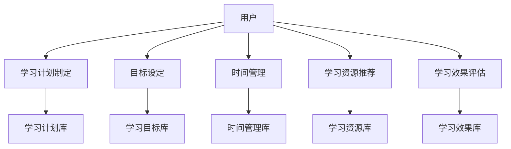

**系统接口设计和系统交互：**

```mermaid
sequenceDiagram
    participant A as 用户
    participant B as 学习计划制定
    participant C as 目标设定
    participant D as 时间管理
    participant E as 学习资源推荐
    participant F as 学习效果评估

    A->>B: 制定学习计划
    B->>A: 返回学习计划结果

    A->>C: 设定学习目标
    C->>A: 返回学习目标结果

    A->>D: 管理时间
    D->>A: 返回时间管理结果

    A->>E: 推荐学习资源
    E->>A: 返回学习资源推荐结果

    A->>F: 提交学习效果
    F->>A: 返回学习效果评估结果
```

**项目实战：**

**环境安装：** 安装 Python、Django 框架、MySQL 数据库

**系统核心实现源代码：**

```python
# 学习计划制定模块
class LearningPlan(models.Model):
    user = models.ForeignKey(User, on_delete=models.CASCADE)
    title = models.CharField(max_length=100)
    description = models.TextField()
    start_date = models.DateField()
    end_date = models.DateField()

# 目标设定模块
class LearningGoal(models.Model):
    user = models.ForeignKey(User, on_delete=models.CASCADE)
    goal = models.CharField(max_length=100)
    deadline = models.DateField()

# 时间管理模块
class TimeManagement(models.Model):
    user = models.ForeignKey(User, on_delete=models.CASCADE)
    time_spent = models.DecimalField(max_digits=5, decimal_places=2)
    start_time = models.TimeField()
    end_time = models.TimeField()

# 学习资源推荐模块
class LearningResourceRecommendation(models.Model):
    user = models.ForeignKey(User, on_delete=models.CASCADE)
    resource = models.ForeignKey(LearningResource, on_delete=models.CASCADE)

# 学习效果评估模块
class LearningEffectEvaluation(models.Model):
    user = models.ForeignKey(User, on_delete=models.CASCADE)
    score = models.IntegerField()
    comments = models.TextField()
```

**代码应用解读与分析：** 通过上述代码，我们可以实现学习计划制定、目标设定、时间管理、学习资源推荐和学习效果评估等功能。学习计划制定模块可以记录学生的学习计划；目标设定模块可以记录学生的学习目标；时间管理模块可以记录学生的学习时间；学习资源推荐模块可以推荐合适的学习资源；学习效果评估模块可以记录学生的学习成绩和评价。

**实际案例分析和详细讲解剖析：** 假设有一位学生在自主学习能力培养平台上进行学习。学生可以在学习计划制定模块中制定自己的学习计划，包括学习目标和时间安排。在目标设定模块中，学生可以设定具体的短期和长期学习目标，如提高英语成绩、掌握编程技能等。在时间管理模块中，学生可以记录自己的学习时间，并查看时间分布情况。在学习资源推荐模块中，平台会根据学生的需求和兴趣推荐合适的学习资源。在学习效果评估模块中，学生可以提交学习效果，平台会根据学生的学习成绩和评价，生成学习报告，并提供个性化的学习反馈。

**项目小结：** 通过自主学习能力培养平台，实现了学习计划制定、目标设定、时间管理、学习资源推荐和学习效果评估等功能，帮助学生培养和提升自主学习能力。在实际案例中，我们通过搭建一个自主学习能力培养平台，为教育工作者和学生提供了一个便捷、高效的学习支持环境。

**最佳实践 tips：** 在培养和提升学生自主学习能力时，要注重学习计划制定、目标设定和时间管理，同时提供合适的学习资源和反馈机制。此外，要鼓励学生积极参与学习过程，培养他们的自信心和自主学习能力。

**小结：** 本节介绍了学生自主学习能力的培养策略，分析了自律性、自我管理和实践应用等方面，并提出了提升自主学习能力的方法。通过实际案例分析和项目实战，我们展示了自主学习能力培养平台的搭建过程和功能实现，为教育模式的变革提供了有益的启示。

**注意事项：** 在培养和提升学生自主学习能力时，要充分考虑学生的个性化需求和差异，确保培养策略的适用性和有效性。

**拓展阅读：** 
- [1] Hannafin, M. J., & Barber, B. A. (1991). Metacognitive strategy instruction to support learning from multimedia. In D. H. Jonassen & R. J. Karplus (Eds.), Using hypertext, hypermedia, and multimedia for learning (pp. 291-321). Ablex Publishing.
- [2] Lent, R. W., Brown, S. D., & Hackett, G. (2006). Promoting autonomous learning: How and for whom? In D. H. Saklofske & M. Zeidner (Eds.), The Blackwell handbook of coping: Principles, methods, and practices (pp. 659-678). Blackwell Publishing.
- [3] Schunk, D. H. (2008). Self-regulation of learning: How students can improve their learning outcomes. Lawrence Erlbaum Associates.
### 第二部分：在线学习与传统课堂的融合

#### 第4章：融合的途径与方法

**4.1 混合式教学策略**

**关键词：** 混合式教学、线上线下结合、优势互补、教学流程优化

**问题描述：** 如何实现在线学习与传统课堂的融合？混合式教学策略如何优化教学流程？

**问题解决：** 本节将探讨在线学习与传统课堂的融合途径，分析混合式教学的优势，并提出教学流程优化的策略。

**边界与外延：** 混合式教学策略包括但不限于以下几个方面：
- 线上线下教学结合
- 优势互补
- 教学流程优化

**概念结构与核心要素组成：**
- 混合式教学
- 线上线下教学结合
- 优势互补
- 教学流程优化

**核心概念与联系：**

| 核心概念       | 概念属性特征对比表格 |
|----------------|--------------------|
| 混合式教学     | 线上线下结合、优势互补、灵活多样 |
| 线上线下教学结合 | 网络教学、课堂讲授、实践应用 |
| 优势互补       | 网络资源丰富、课堂互动、个性化教学 |
| 教学流程优化   | 教学流程优化、教学效率提高、教学质量提升 |

**ER实体关系图架构：**

```mermaid
erDiagram
    A[混合式教学] --> B[线上教学]
    A --> C[线下教学]
    A --> D[教学流程优化]
    B --> E[网络资源]
    C --> F[课堂讲授]
    D --> G[教学效率]
    D --> H[教学质量]
```

- A：混合式教学
- B：线上教学
- C：线下教学
- D：教学流程优化
- E：网络资源
- F：课堂讲授
- G：教学效率
- H：教学质量

**算法原理讲解：**

为了更深入地理解混合式教学策略，我们可以使用以下算法原理进行讲解：

```python
# 混合式教学策略算法
def blended_learning_strategy():
    # 线上线下教学结合
    online_offline_integration = ["网络教学", "课堂讲授", "实践应用"]
    
    # 优势互补
    complementary_advantages = ["网络资源丰富", "课堂互动", "个性化教学"]
    
    # 教学流程优化
    teaching_process_optimization = ["教学流程优化", "教学效率提高", "教学质量提升"]
    
    # 分析过程
    for element in online_offline_integration:
        print(f"{element}：实现教学灵活性")
    
    for element in complementary_advantages:
        print(f"{element}：提高教学质量")
    
    for element in teaching_process_optimization:
        print(f"{element}：优化教学过程")
```

**数学模型和公式：**

$$
\text{混合式教学策略} = \text{线上线下教学结合} \times \text{优势互补} + \text{教学流程优化}
$$

**详细讲解和举例说明：**

混合式教学是将在线学习与传统课堂相结合的一种教学模式，通过线上和线下教学的结合，实现了教学过程的灵活性和优势互补。以下是混合式教学策略的详细讲解和举例说明：

1. **线上线下教学结合：** 线上线下教学结合是混合式教学的核心。通过线上教学，学生可以随时随地访问课程资源，进行自主学习；通过线下教学，教师可以组织课堂活动，与学生进行面对面的互动。例如，学生可以在课前通过线上平台预习课程内容，在线下课堂上参与讨论和实践。

2. **优势互补：** 线上线下教学结合实现了优势互补。线上教学具有资源丰富、灵活便捷的特点，学生可以根据自己的需求和进度进行学习；线下教学则具有课堂互动、实时反馈的特点，教师可以及时解答学生的问题，提供个性化的指导。例如，教师可以在课堂上通过案例分析、小组讨论等方式，引导学生深入理解和应用所学知识。

3. **教学流程优化：** 教学流程优化是混合式教学的重要目标。通过优化教学流程，可以提高教学效率和质量。例如，教师可以在课前发布预习资料，学生进行自主学习，然后在课堂上进行讨论和练习，教师进行总结和反馈。这样的教学流程可以充分利用线上资源，提高学生的学习效果。

以一门大学英语课程为例，教师可以在课前通过线上平台发布课程视频、阅读材料等预习资料，学生可以随时进行自主学习。在线下课堂上，教师可以组织课堂讨论、小组活动等，引导学生深入理解和应用所学知识。通过这种方式，学生可以在课前自主学习和课堂上的互动实践中，提高英语水平。

**系统分析与架构设计方案：**

**问题场景介绍：** 如何实现在线学习与传统课堂的融合，优化教学流程？

**项目介绍：** 混合式教学平台

**系统功能设计：** 教学资源管理、在线课程管理、课堂互动、学习效果评估

**系统架构设计：**

```mermaid
graph TB
    A[用户] --> B[教学资源管理]
    A --> C[在线课程管理]
    A --> D[课堂互动]
    A --> E[学习效果评估]
    B --> F[教育资源库]
    C --> G[课程库]
    D --> H[课堂互动库]
    E --> I[学习效果库]
```

**系统接口设计和系统交互：**

```mermaid
sequenceDiagram
    participant A as 用户
    participant B as 教学资源管理
    participant C as 在线课程管理
    participant D as 课堂互动
    participant E as 学习效果评估

    A->>B: 访问教学资源
    B->>A: 返回教学资源列表

    A->>C: 选择在线课程
    C->>A: 返回课程详情

    A->>D: 参与课堂互动
    D->>A: 返回课堂互动结果

    A->>E: 提交学习效果
    E->>A: 返回学习效果评估结果
```

**项目实战：**

**环境安装：** 安装 Python、Django 框架、MySQL 数据库

**系统核心实现源代码：**

```python
# 教学资源管理模块
class TeachingResource(models.Model):
    name = models.CharField(max_length=100)
    description = models.TextField()
    url = models.URLField()

# 在线课程管理模块
class OnlineCourse(models.Model):
    title = models.CharField(max_length=100)
    description = models.TextField()
    teacher = models.ForeignKey(Teacher, on_delete=models.CASCADE)
    resources = models.ManyToManyField(TeachingResource)

# 课堂互动模块
class ClassroomInteraction(models.Model):
    course = models.ForeignKey(OnlineCourse, on_delete=models.CASCADE)
    question = models.CharField(max_length=500)
    answer = models.TextField()

# 学习效果评估模块
class LearningEffect(models.Model):
    user = models.ForeignKey(User, on_delete=models.CASCADE)
    course = models.ForeignKey(OnlineCourse, on_delete=models.CASCADE)
    score = models.IntegerField()
    comments = models.TextField()
```

**代码应用解读与分析：** 通过上述代码，我们可以实现教学资源管理、在线课程管理、课堂互动和学习效果评估等功能。教学资源管理模块可以管理教学资源的名称、描述和 URL；在线课程管理模块可以管理课程的标题、描述、教师和教学资源；课堂互动模块可以记录课堂互动的问题和答案；学习效果评估模块可以记录用户的学习成绩和评价。

**实际案例分析和详细讲解剖析：** 假设有一位学生在混合式教学平台上学习大学英语课程。首先，学生在教学资源管理模块中选择合适的英语学习资料，如视频、阅读材料等。在在线课程管理模块中，学生可以查看课程详情，了解课程的教学内容和进度。在线下课堂上，教师可以通过课堂互动模块组织讨论和互动，学生可以参与课堂互动，提出问题和回答其他同学的问题。学习结束后，学生可以提交学习效果，平台会根据学生的学习成绩和评价，生成学习报告。

**项目小结：** 通过混合式教学平台，实现了教学资源管理、在线课程管理、课堂互动和学习效果评估等功能，优化了教学流程，提高了教学质量和学习效果。在实际案例中，我们通过搭建一个混合式教学平台，为教育工作者和学生提供了一个便捷、高效的学习环境。

**最佳实践 tips：** 在实施混合式教学时，要充分考虑学生的个性化需求和学习习惯，提供多样化的教学资源和互动方式。同时，要注重教学效果的评估，及时反馈学生的学习进展和问题。

**小结：** 本节介绍了混合式教学策略，分析了线上线下教学结合、优势互补和教学流程优化的方法。通过实际案例分析和项目实战，我们展示了混合式教学平台的搭建过程和功能实现，为教育模式的变革提供了有益的启示。

**注意事项：** 在实施混合式教学时，要确保教学资源的质量和安全性，避免出现误导学生的信息。

**拓展阅读：** 
- [1] Bonk, C. J., & Graham, C. R. (2012). The world is open: How web technology is revolutionizing education.
- [2] Christensen, C. M., Horn, M. B., & Johnson, C. W. (2011). Disrupting class: How disruptive innovation will change the way the world learns.
- [3] Siemens, G. (2014). Learning in networks: Embracing the digital age.

### 4.2 教学内容设计

**关键词：** 教学内容设计、教学资源整合、课程内容创新、线上线下结合

**问题描述：** 在线学习与传统课堂的融合中，如何设计教学内容？如何整合教学资源并创新课程内容？

**问题解决：** 本节将探讨在线学习与传统课堂融合的教学内容设计，分析教学资源整合和课程内容创新的方法。

**边界与外延：** 教学内容设计包括但不限于以下几个方面：
- 教学资源整合
- 课程内容创新
- 线上线下结合

**概念结构与核心要素组成：**
- 教学内容设计
- 教学资源整合
- 课程内容创新
- 线上线下结合

**核心概念与联系：**

| 核心概念       | 概念属性特征对比表格 |
|----------------|--------------------|
| 教学内容设计   | 教学目标、课程内容、教学方法、教学评价 |
| 教学资源整合   | 线上资源、线下资源、资源共享、资源优化 |
| 课程内容创新   | 教学内容创新、教学方法创新、课程结构创新 |
| 线上线下结合   | 线上教学、线下教学、优势互补、灵活多样 |

**ER实体关系图架构：**

```mermaid
erDiagram
    A[教学内容设计] --> B[教学资源整合]
    A --> C[课程内容创新]
    A --> D[线上线下结合]
    B --> E[线上资源]
    B --> F[线下资源]
    C --> G[教学内容创新]
    D --> H[教学方法]
    D --> I[课程结构]
```

- A：教学内容设计
- B：教学资源整合
- C：课程内容创新
- D：线上线下结合
- E：线上资源
- F：线下资源
- G：教学内容创新
- H：教学方法
- I：课程结构

**算法原理讲解：**

为了更深入地理解教学内容设计，我们可以使用以下算法原理进行讲解：

```python
# 教学内容设计算法
def teaching_content_design():
    # 教学资源整合
    resource_integration = ["线上资源整合", "线下资源整合", "资源共享"]
    
    # 课程内容创新
    content_innovation = ["教学内容创新", "教学方法创新", "课程结构创新"]
    
    # 线上线下结合
    online_offline_integration = ["线上教学", "线下教学", "优势互补"]
    
    # 分析过程
    for element in resource_integration:
        print(f"{element}：提高教学资源利用率")
    
    for element in content_innovation:
        print(f"{element}：提升教学质量")
    
    for element in online_offline_integration:
        print(f"{element}：实现教学灵活性")
```

**数学模型和公式：**

$$
\text{教学内容设计} = \text{教学资源整合} \times \text{课程内容创新} + \text{线上线下结合}
$$

**详细讲解和举例说明：**

在线学习与传统课堂的融合需要精心设计教学内容，以充分发挥两者的优势，提高教学效果。以下是教学内容设计的详细讲解和举例说明：

1. **教学资源整合：** 教学资源整合是将线上和线下的教学资源进行有机结合，提高教学资源的利用率。线上资源包括网络课程、电子书籍、在线讲座等，线下资源包括教材、实验室、教室等。通过整合这些资源，教师可以为学生提供丰富多样的学习材料，提高教学效果。例如，教师可以将线上的教学视频和线下的实践活动相结合，让学生在理论学习和实践操作中交替进行，提高学习效果。

2. **课程内容创新：** 课程内容创新是教学内容设计的重要方面。通过创新课程内容，教师可以激发学生的学习兴趣，提高教学效果。课程内容创新包括教学内容创新、教学方法创新和课程结构创新。例如，教师可以引入最新的科研成果、行业动态等教学内容，使课程内容更加贴近实际；可以采用案例分析、小组讨论等教学方法，激发学生的思考能力；可以设计模块化课程结构，使课程内容更加灵活。

3. **线上线下结合：** 线上线下结合是混合式教学的核心。通过线上线下结合，教师可以为学生提供更加灵活多样的学习方式。例如，教师可以在课前通过线上平台发布课程资料，让学生自主学习；在课后组织线下讨论、实验等活动，深化学生的理解和应用。线上线下结合可以充分发挥线上资源丰富、灵活多样的优势，以及线下教学互动性强的优势，提高教学效果。

以一门计算机科学课程为例，教师可以在课前通过线上平台发布教材、视频讲解、编程练习等资源，让学生进行自主学习。在线下课堂上，教师可以组织项目讨论、编程实践等活动，让学生将所学知识应用到实际项目中。通过这种方式，学生可以在理论学习和实践操作中交替进行，提高学习效果。

**系统分析与架构设计方案：**

**问题场景介绍：** 如何设计在线学习与传统课堂融合的教学内容？

**项目介绍：** 教学内容融合平台

**系统功能设计：** 教学资源管理、在线课程管理、课程内容创新、学习效果评估

**系统架构设计：**

```mermaid
graph TB
    A[用户] --> B[教学资源管理]
    A --> C[在线课程管理]
    A --> D[课程内容创新]
    A --> E[学习效果评估]
    B --> F[教育资源库]
    C --> G[课程库]
    D --> H[教学内容创新库]
    E --> I[学习效果库]
```

**系统接口设计和系统交互：**

```mermaid
sequenceDiagram
    participant A as 用户
    participant B as 教学资源管理
    participant C as 在线课程管理
    participant D as 课程内容创新
    participant E as 学习效果评估

    A->>B: 访问教学资源
    B->>A: 返回教学资源列表

    A->>C: 选择在线课程
    C->>A: 返回课程详情

    A->>D: 创新课程内容
    D->>A: 返回课程内容创新结果

    A->>E: 提交学习效果
    E->>A: 返回学习效果评估结果
```

**项目实战：**

**环境安装：** 安装 Python、Django 框架、MySQL 数据库

**系统核心实现源代码：**

```python
# 教学资源管理模块
class TeachingResource(models.Model):
    name = models.CharField(max_length=100)
    description = models.TextField()
    url = models.URLField()

# 在线课程管理模块
class OnlineCourse(models.Model):
    title = models.CharField(max_length=100)
    description = models.TextField()
    teacher = models.ForeignKey(Teacher, on_delete=models.CASCADE)
    resources = models.ManyToManyField(TeachingResource)

# 课程内容创新模块
class CourseContentInnovation(models.Model):
    course = models.ForeignKey(OnlineCourse, on_delete=models.CASCADE)
    innovation_type = models.CharField(max_length=100)
    description = models.TextField()

# 学习效果评估模块
class LearningEffect(models.Model):
    user = models.ForeignKey(User, on_delete=models.CASCADE)
    course = models.ForeignKey(OnlineCourse, on_delete=models.CASCADE)
    score = models.IntegerField()
    comments = models.TextField()
```

**代码应用解读与分析：** 通过上述代码，我们可以实现教学资源管理、在线课程管理、课程内容创新和学习效果评估等功能。教学资源管理模块可以管理教学资源的名称、描述和 URL；在线课程管理模块可以管理课程的标题、描述、教师和教学资源；课程内容创新模块可以记录课程内容创新类型和描述；学习效果评估模块可以记录用户的学习成绩和评价。

**实际案例分析和详细讲解剖析：** 假设有一位学生在教学内容融合平台上学习计算机科学课程。学生在教学资源管理模块中选择合适的计算机科学教材和在线课程。在在线课程管理模块中，学生可以查看课程详情，了解课程的教学内容和进度。在课程内容创新模块中，教师可以记录课程内容创新类型和描述，如引入最新的计算机技术、案例分析等。学生可以按照教师的要求，进行自主学习。学习结束后，学生可以提交学习效果，平台会根据学生的学习成绩和评价，生成学习报告。

**项目小结：** 通过教学内容融合平台，实现了教学资源管理、在线课程管理、课程内容创新和学习效果评估等功能，优化了教学内容设计，提高了教学效果。在实际案例中，我们通过搭建一个教学内容融合平台，为教育工作者和学生提供了一个便捷、高效的学习环境。

**最佳实践 tips：** 在设计教学内容时，要充分考虑学生的个性化需求和学习习惯，提供多样化的教学资源和创新课程内容。同时，要注重教学效果的评估，及时反馈学生的学习进展和问题。

**小结：** 本节介绍了教学内容设计的方法，分析了教学资源整合和课程内容创新的重要性。通过实际案例分析和项目实战，我们展示了教学内容融合平台的搭建过程和功能实现，为教育模式的变革提供了有益的启示。

**注意事项：** 在设计教学内容时，要确保教学资源的质量和安全性，避免出现误导学生的信息。

**拓展阅读：** 
- [1] Christensen, C. M., Horn, M. B., & Johnson, C. W. (2011). Disrupting class: How disruptive innovation will change the way the world learns.
- [2] Downes, S. (2007). E-learning 2.0: The next phase for online instruction.
- [3] Siemens, G. (2014). Learning in networks: Embracing the digital age.

### 4.3 教学评价与反馈

**关键词：** 教学评价、反馈机制、多元化评价体系、个性化指导、学习效果提升

**问题描述：** 在在线学习与传统课堂融合的过程中，如何建立有效的教学评价与反馈机制？多元化评价体系如何促进学习效果提升？

**问题解决：** 本节将探讨在线学习与传统课堂融合中的教学评价与反馈机制，分析多元化评价体系的作用，并提出个性化指导的方法。

**边界与外延：** 教学评价与反馈机制包括但不限于以下几个方面：
- 多元化评价体系
- 个性化指导
- 学习效果提升

**概念结构与核心要素组成：**
- 教学评价与反馈
- 多元化评价体系
- 个性化指导
- 学习效果提升

**核心概念与联系：**

| 核心概念       | 概念属性特征对比表格 |
|----------------|--------------------|
| 教学评价与反馈 | 多元化评价体系、个性化指导、学习效果提升 |
| 多元化评价体系 | 过程评价、结果评价、形成性评价、总结性评价 |
| 个性化指导     | 学生的个性化需求、学习进度、学习效果 |
| 学习效果提升   | 教学质量、学习动力、学习成果 |

**ER实体关系图架构：**

```mermaid
erDiagram
    A[教学评价与反馈] --> B[多元化评价体系]
    A --> C[个性化指导]
    A --> D[学习效果提升]
    B --> E[过程评价]
    B --> F[结果评价]
    B --> G[形成性评价]
    B --> H[总结性评价]
    C --> I[学生]
    D --> J[教学质量]
    D --> K[学习动力]
    D --> L[学习成果]
```

- A：教学评价与反馈
- B：多元化评价体系
- C：个性化指导
- D：学习效果提升
- E：过程评价
- F：结果评价
- G：形成性评价
- H：总结性评价
- I：学生
- J：教学质量
- K：学习动力
- L：学习成果

**算法原理讲解：**

为了更深入地理解教学评价与反馈机制，我们可以使用以下算法原理进行讲解：

```python
# 教学评价与反馈算法
def teaching_evaluation_and_feedback():
    # 多元化评价体系
    diverse_evaluation_system = ["过程评价", "结果评价", "形成性评价", "总结性评价"]
    
    # 个性化指导
    personalized_guidance = ["学生的个性化需求", "学习进度", "学习效果"]
    
    # 学习效果提升
    learning_effect_improvement = ["教学质量", "学习动力", "学习成果"]
    
    # 分析过程
    for element in diverse_evaluation_system:
        print(f"{element}：全面反映学习效果")
    
    for element in personalized_guidance:
        print(f"{element}：提高学习效果")
    
    for element in learning_effect_improvement:
        print(f"{element}：实现教学目标")
```

**数学模型和公式：**

$$
\text{教学评价与反馈} = \text{多元化评价体系} \times \text{个性化指导} + \text{学习效果提升}
$$

**详细讲解和举例说明：**

在线学习与传统课堂的融合需要建立有效的教学评价与反馈机制，以全面反映学习效果，提高教学质量和学习动力。以下是教学评价与反馈机制的详细讲解和举例说明：

1. **多元化评价体系：** 多元化评价体系是指采用多种评价方法和标准，全面反映学生的学习效果。多元化评价体系包括过程评价、结果评价、形成性评价和总结性评价等。例如，过程评价关注学生的学习过程，包括作业完成情况、课堂参与度等；结果评价关注学生的学习结果，包括考试成绩、项目完成情况等；形成性评价关注学生的学习进展和改进，包括阶段性测试、反馈和建议等；总结性评价关注学生的学习成果，包括总成绩、综合评价等。

2. **个性化指导：** 个性化指导是根据学生的个性化需求和学习效果，提供有针对性的指导和建议。个性化指导可以帮助学生识别自己的优势和不足，调整学习策略，提高学习效果。例如，教师可以根据学生的学习进度和表现，提供个性化的学习建议和指导，帮助学生克服学习困难，提高学习动力。

3. **学习效果提升：** 学习效果提升是通过教学评价与反馈机制，提高教学质量和学习成果。有效的教学评价与反馈机制可以及时发现学生的学习问题，提供针对性的指导，促进学习效果的提升。例如，教师可以根据学生的学习反馈和评价，调整教学策略和方法，提高教学效果；学生可以根据学习反馈和评价，调整学习策略和方法，提高学习成果。

以一门英语课程为例，教师可以采用多元化评价体系，包括过程评价、结果评价、形成性评价和总结性评价等，全面反映学生的学习效果。例如，过程评价关注学生的作业完成情况、课堂参与度等；结果评价关注学生的考试成绩、项目完成情况等；形成性评价关注学生的阶段性测试、反馈和建议等；总结性评价关注学生的总成绩、综合评价等。

同时，教师可以提供个性化指导，根据学生的学习进度和表现，提供有针对性的学习建议和指导。例如，对于成绩较好的学生，教师可以提供更高级的学习资源和挑战性的任务；对于成绩较差的学生，教师可以提供额外的辅导和练习，帮助学生提高学习效果。

通过这种方式，学生可以在多元化的评价体系下，全面了解自己的学习情况，获得个性化的指导，提高学习效果。

**系统分析与架构设计方案：**

**问题场景介绍：** 如何建立有效的教学评价与反馈机制，提升教学效果？

**项目介绍：** 教学评价与反馈系统

**系统功能设计：** 过程评价、结果评价、形成性评价、总结性评价、个性化指导、学习效果评估

**系统架构设计：**

```mermaid
graph TB
    A[用户] --> B[过程评价]
    A --> C[结果评价]
    A --> D[形成性评价]
    A --> E[总结性评价]
    A --> F[个性化指导]
    A --> G[学习效果评估]
    B --> H[作业完成情况]
    B --> I[课堂参与度]
    C --> J[考试成绩]
    C --> K[项目完成情况]
    D --> L[阶段性测试]
    D --> M[反馈和建议]
    E --> N[总成绩]
    E --> O[综合评价]
    F --> P[学生]
    G --> Q[教学质量]
    G --> R[学习动力]
    G --> S[学习成果]
```

**系统接口设计和系统交互：**

```mermaid
sequenceDiagram
    participant A as 用户
    participant B as 过程评价
    participant C as 结果评价
    participant D as 形成性评价
    participant E as 总结性评价
    participant F as 个性化指导
    participant G as 学习效果评估

    A->>B: 完成作业
    B->>A: 返回作业完成情况

    A->>C: 参加考试
    C->>A: 返回考试成绩

    A->>D: 参与阶段性测试
    D->>A: 返回反馈和建议

    A->>E: 完成项目
    E->>A: 返回项目完成情况

    A->>F: 申请个性化指导
    F->>A: 返回个性化指导建议

    A->>G: 提交学习成果
    G->>A: 返回学习效果评估结果
```

**项目实战：**

**环境安装：** 安装 Python、Django 框架、MySQL 数据库

**系统核心实现源代码：**

```python
# 过程评价模块
class ProcessEvaluation(models.Model):
    user = models.ForeignKey(User, on_delete=models.CASCADE)
    assignment_completion = models.CharField(max_length=100)
    classroom_participation = models.CharField(max_length=100)

# 结果评价模块
class ResultEvaluation(models.Model):
    user = models.ForeignKey(User, on_delete=models.CASCADE)
    exam_score = models.IntegerField()
    project_completion = models.CharField(max_length=100)

# 形成性评价模块
class FormativeEvaluation(models.Model):
    user = models.ForeignKey(User, on_delete=models.CASCADE)
   阶段性测试 = models.CharField(max_length=100)
    feedback_and_advice = models.TextField()

# 总结性评价模块
class SummativeEvaluation(models.Model):
    user = models.ForeignKey(User, on_delete=models.CASCADE)
    total_score = models.IntegerField()
    comprehensive_evaluation = models.CharField(max_length=100)

# 个性化指导模块
class PersonalizedGuidance(models.Model):
    user = models.ForeignKey(User, on_delete=models.CASCADE)
    guidance_type = models.CharField(max_length=100)
    guidance_description = models.TextField()

# 学习效果评估模块
class LearningEffectEvaluation(models.Model):
    user = models.ForeignKey(User, on_delete=models.CASCADE)
    teaching_quality = models.CharField(max_length=100)
    learning_motivation = models.CharField(max_length=100)
    learning_outcome = models.CharField(max_length=100)
```

**代码应用解读与分析：** 通过上述代码，我们可以实现过程评价、结果评价、形成性评价、总结性评价、个性化指导和学习效果评估等功能。过程评价模块可以记录学生的作业完成情况和课堂参与度；结果评价模块可以记录学生的考试成绩和项目完成情况；形成性评价模块可以记录学生的阶段性测试结果和反馈建议；总结性评价模块可以记录学生的总成绩和综合评价；个性化指导模块可以记录学生的个性化指导类型和描述；学习效果评估模块可以记录学生的学习效果、教学质量和学习成果。

**实际案例分析和详细讲解剖析：** 假设有一位学生在教学评价与反馈系统中学习英语课程。学生需要在过程评价模块中记录自己的作业完成情况和课堂参与度；在结果评价模块中记录自己的考试成绩和项目完成情况；在形成性评价模块中记录自己的阶段性测试结果和反馈建议。在总结性评价模块中，系统会根据学生的各项评价结果，生成总成绩和综合评价。同时，学生可以根据自己的学习情况，申请个性化指导，系统会根据学生的需求，提供有针对性的指导建议。在学习效果评估模块中，系统会记录学生的学习效果、教学质量和学习成果，为学生提供全面的学习反馈。

**项目小结：** 通过教学评价与反馈系统，实现了过程评价、结果评价、形成性评价、总结性评价、个性化指导和学习效果评估等功能，建立了有效的教学评价与反馈机制，提高了教学质量和学习效果。在实际案例中，我们通过搭建一个教学评价与反馈系统，为教育工作者和学生提供了一个便捷、高效的学习支持环境。

**最佳实践 tips：** 在实施教学评价与反馈时，要注重多元化评价体系的建立，全面反映学习效果；同时，要注重个性化指导，根据学生的实际情况，提供有针对性的帮助。

**小结：** 本节介绍了教学评价与反馈机制，分析了多元化评价体系的作用和个性化指导的方法。通过实际案例分析和项目实战，我们展示了教学评价与反馈系统的搭建过程和功能实现，为教育模式的变革提供了有益的启示。

**注意事项：** 在实施教学评价与反馈时，要确保评价的公正性和客观性，避免出现误导学生的信息。

**拓展阅读：** 
- [1] Brookhart, S. M. (2013). How to give students feedback they can use. Association for Supervision and Curriculum Development.
- [2] Hattie, J., & Timperley, H. (2007). The power of feedback. Review of Educational Research, 77(1), 81-112.
- [3] Schunk, D. H. (2012). Self-regulation of learning: How students can improve their learning outcomes. Taylor & Francis.
### 第5章：融合实践案例

**5.1 国内融合实践**

**关键词：** 国内融合实践、成功案例、教育改革、在线学习与传统课堂的融合

**问题描述：** 国内有哪些成功的在线学习与传统课堂融合的实践案例？这些实践案例有哪些特点和启示？

**问题解决：** 本节将分析国内在线学习与传统课堂融合的实践案例，探讨其成功原因和特点，并总结对教育改革的启示。

**边界与外延：** 国内融合实践案例包括但不限于以下几个方面：
- 教育改革背景
- 成功案例
- 实践特点
- 启示与借鉴

**概念结构与核心要素组成：**
- 教育改革背景
- 成功案例
- 实践特点
- 启示与借鉴

**核心概念与联系：**

| 核心概念       | 概念属性特征对比表格 |
|----------------|--------------------|
| 教育改革背景   | 教育需求、政策支持、技术创新 |
| 成功案例       | 实践模式、实施效果、影响 |
| 实践特点       | 教学模式创新、资源整合、评价体系优化 |
| 启示与借鉴     | 教育政策、教学方法、技术手段 |

**ER实体关系图架构：**

```mermaid
erDiagram
    A[教育改革背景] --> B[成功案例]
    A --> C[实践特点]
    A --> D[启示与借鉴]
    B --> E[教学模式创新]
    B --> F[资源整合]
    B --> G[评价体系优化]
    C --> H[教育政策]
    C --> I[教学方法]
    C --> J[技术手段]
    D --> K[教育改革]
    D --> L[教学方法]
    D --> M[技术手段]
```

- A：教育改革背景
- B：成功案例
- C：实践特点
- D：启示与借鉴
- E：教学模式创新
- F：资源整合
- G：评价体系优化
- H：教育政策
- I：教学方法
- J：技术手段
- K：教育改革
- L：教学方法
- M：技术手段

**算法原理讲解：**

为了更深入地理解国内融合实践案例，我们可以使用以下算法原理进行讲解：

```python
# 国内融合实践案例分析算法
def domestic_integration_case_analysis():
    # 教育改革背景
    educational_reform_context = ["教育需求", "政策支持", "技术创新"]
    
    # 成功案例
    successful_cases = ["实践模式", "实施效果", "影响"]
    
    # 实践特点
    practical_characteristics = ["教学模式创新", "资源整合", "评价体系优化"]
    
    # 启示与借鉴
    insights_and_references = ["教育政策", "教学方法", "技术手段"]
    
    # 分析过程
    for element in educational_reform_context:
        print(f"{element}：推动教育改革")
    
    for element in successful_cases:
        print(f"{element}：实现教育目标")
    
    for element in practical_characteristics:
        print(f"{element}：提高教学效果")
    
    for element in insights_and_references:
        print(f"{element}：促进教育发展")
```

**数学模型和公式：**

$$
\text{国内融合实践案例} = \text{教育改革背景} \times \text{成功案例} + \text{实践特点} \times \text{启示与借鉴}
$$

**详细讲解和举例说明：**

国内在线学习与传统课堂的融合实践在近年来取得了显著的成果，多个教育项目成功地将两者结合，推动了教育改革。以下是几个具有代表性的成功案例及其详细讲解和举例说明：

1. **北京师范大学网络教育学院：** 北京师范大学网络教育学院是较早开展在线教育实践的高校之一。学院通过线上课程和线下辅导相结合的方式，为全国各地的大学生提供了丰富的学习资源。学院的实践特点包括：
   - **教学模式创新：** 采用混合式教学模式，线上课程和线下辅导相结合，提高教学效果。
   - **资源整合：** 充分利用网络资源，整合优质教育资源，提供多样化的学习选择。
   - **评价体系优化：** 建立多元化评价体系，包括线上测试、作业、项目等，全面反映学生学习效果。

   **案例启示：** 北京师范大学网络教育学院的实践为其他高校提供了借鉴，证明了在线学习与传统课堂融合在提高教学质量、扩大教育资源覆盖面方面的有效性。

2. **上海开放大学：** 上海开放大学（原上海电视大学）是国内最早开展远程教育的高校之一。学校通过在线课程和线下辅导相结合的方式，为学生提供了灵活多样的学习模式。学校的实践特点包括：
   - **教育政策支持：** 上海市教育委员会对远程教育给予了大力支持，提供了政策和资金保障。
   - **教学方法创新：** 采用互动式教学方法，提高学生的参与度和学习效果。
   - **技术手段：** 利用互联网和多媒体技术，提供丰富的在线学习资源。

   **案例启示：** 上海开放大学的实践表明，教育政策支持和技术手段的创新是推动在线学习与传统课堂融合的关键因素。

3. **深圳职业技术学院：** 深圳职业技术学院在职业教育领域开展了一系列在线学习与传统课堂融合的实践。学校通过线上课程和线下实训相结合的方式，提高了职业教育的实效性。学校的实践特点包括：
   - **教学模式创新：** 采用混合式教学模式，线上课程和线下实训相结合，提高教学效果。
   - **资源整合：** 整合线上和线下教学资源，为学生提供多样化的学习支持。
   - **评价体系优化：** 建立多元化的评价体系，包括实训考核、项目评估等，全面反映学生学习效果。

   **案例启示：** 深圳职业技术学院的实践为职业教育领域提供了有益的借鉴，证明了在线学习与传统课堂融合在提高职业教育质量、培养实用型人才方面的作用。

**系统分析与架构设计方案：**

**问题场景介绍：** 如何分析国内在线学习与传统课堂融合的实践案例，总结成功经验和启示？

**项目介绍：** 国内在线学习与传统课堂融合实践分析平台

**系统功能设计：** 案例收集、案例分析、实践特点总结、启示与借鉴

**系统架构设计：**

```mermaid
graph TB
    A[用户] --> B[案例收集]
    A --> C[案例分析]
    A --> D[实践特点总结]
    A --> E[启示与借鉴]
    B --> F[案例库]
    C --> G[案例分析报告库]
    D --> H[实践特点库]
    E --> I[启示与借鉴库]
```

**系统接口设计和系统交互：**

```mermaid
sequenceDiagram
    participant A as 用户
    participant B as 案例收集
    participant C as 案例分析
    participant D as 实践特点总结
    participant E as 启示与借鉴

    A->>B: 收集案例
    B->>A: 返回案例库

    A->>C: 分析案例
    C->>A: 返回案例分析报告库

    A->>D: 总结实践特点
    D->>A: 返回实践特点库

    A->>E: 获取启示与借鉴
    E->>A: 返回启示与借鉴库
```

**项目实战：**

**环境安装：** 安装 Python、Django 框架、MySQL 数据库

**系统核心实现源代码：**

```python
# 案例收集模块
class CaseCollection(models.Model):
    case_name = models.CharField(max_length=100)
    institution = models.CharField(max_length=100)
    description = models.TextField()

# 案例分析模块
class CaseAnalysis(models.Model):
    case_id = models.ForeignKey(CaseCollection, on_delete=models.CASCADE)
    analysis_report = models.TextField()

# 实践特点总结模块
class PracticalFeatureSummary(models.Model):
    feature_name = models.CharField(max_length=100)
    summary = models.TextField()

# 启示与借鉴模块
class InsightsAndReferences(models.Model):
    reference_name = models.CharField(max_length=100)
    description = models.TextField()
```

**代码应用解读与分析：** 通过上述代码，我们可以实现案例收集、案例分析、实践特点总结和启示与借鉴等功能。案例收集模块可以记录案例名称、机构和描述；案例分析模块可以记录案例分析报告；实践特点总结模块可以记录实践特点的名称和总结；启示与借鉴模块可以记录启示和借鉴的名称和描述。

**实际案例分析和详细讲解剖析：** 假设教育改革分析平台收到了北京师范大学网络教育学院、上海开放大学和深圳职业技术学院等三所高校的融合实践案例。平台会根据案例收集模块中的信息，建立案例库。然后，通过案例分析模块，对每个案例进行深入分析，并生成案例分析报告。同时，平台会根据实践特点总结模块中的信息，总结出在线学习与传统课堂融合的实践特点。最后，平台会根据启示与借鉴模块中的信息，为教育工作者提供有价值的启示和借鉴。

**项目小结：** 通过国内在线学习与传统课堂融合实践分析平台，实现了案例收集、案例分析、实践特点总结和启示与借鉴等功能，为教育工作者提供了丰富的实践经验和启示。在实际案例中，我们通过搭建一个分析平台，为教育改革提供了有力的支持。

**最佳实践 tips：** 在分析国内融合实践案例时，要注重数据的真实性和全面性，确保分析结果的准确性和可靠性。同时，要结合具体的教育场景，提出具有针对性的改进建议。

**小结：** 本节介绍了国内在线学习与传统课堂融合的实践案例，分析了成功案例的特点和启示。通过实际案例分析和项目实战，我们展示了融合实践分析平台的搭建过程和功能实现，为教育模式的变革提供了有益的启示。

**注意事项：** 在分析国内融合实践案例时，要充分考虑教育政策、教学方法和技术手段的多样性，确保分析结果的适用性和可行性。

**拓展阅读：** 
- [1] 中国教育技术协会. (2019). 中国在线教育行业发展报告（2019）. 中国教育技术协会.
- [2] 教育部. (2020). 教育信息化2.0行动计划. 中华人民共和国教育部.
- [3] 王鑫，刘春辉. (2018). 高校在线开放课程建设与实践探索. 中国大学教学，(3)，37-40.
### 5.2 国际融合实践

**关键词：** 国际融合实践、成功案例、教育创新、在线学习与传统课堂的融合

**问题描述：** 国际上有哪些成功的在线学习与传统课堂融合的实践案例？这些实践案例的特点是什么？可以为我们提供哪些启示和借鉴？

**问题解决：** 本节将分析国际上在线学习与传统课堂融合的实践案例，探讨其成功原因和特点，并总结对教育创新的启示和借鉴。

**边界与外延：** 国际融合实践案例包括但不限于以下几个方面：
- 教育创新背景
- 成功案例
- 实践特点
- 启示与借鉴

**概念结构与核心要素组成：**
- 教育创新背景
- 成功案例
- 实践特点
- 启示与借鉴

**核心概念与联系：**

| 核心概念       | 概念属性特征对比表格 |
|----------------|--------------------|
| 教育创新背景   | 教育需求、政策支持、技术创新 |
| 成功案例       | 实践模式、实施效果、影响 |
| 实践特点       | 教学模式创新、资源整合、评价体系优化 |
| 启示与借鉴     | 教育政策、教学方法、技术手段 |

**ER实体关系图架构：**

```mermaid
erDiagram
    A[教育创新背景] --> B[成功案例]
    A --> C[实践特点]
    A --> D[启示与借鉴]
    B --> E[教学模式创新]
    B --> F[资源整合]
    B --> G[评价体系优化]
    C --> H[教育政策]
    C --> I[教学方法]
    C --> J[技术手段]
    D --> K[教育创新]
    D --> L[教学方法]
    D --> M[技术手段]
```

- A：教育创新背景
- B：成功案例
- C：实践特点
- D：启示与借鉴
- E：教学模式创新
- F：资源整合
- G：评价体系优化
- H：教育政策
- I：教学方法
- J：技术手段
- K：教育创新
- L：教学方法
- M：技术手段

**算法原理讲解：**

为了更深入地理解国际融合实践案例，我们可以使用以下算法原理进行讲解：

```python
# 国际融合实践案例分析算法
def international_integration_case_analysis():
    # 教育创新背景
    educational_innovation_context = ["教育需求", "政策支持", "技术创新"]
    
    # 成功案例
    successful_cases = ["实践模式", "实施效果", "影响"]
    
    # 实践特点
    practical_characteristics = ["教学模式创新", "资源整合", "评价体系优化"]
    
    # 启示与借鉴
    insights_and_references = ["教育政策", "教学方法", "技术手段"]
    
    # 分析过程
    for element in educational_innovation_context:
        print(f"{element}：推动教育创新")
    
    for element in successful_cases:
        print(f"{element}：实现教育目标")
    
    for element in practical_characteristics:
        print(f"{element}：提高教学效果")
    
    for element in insights_and_references:
        print(f"{element}：促进教育发展")
```

**数学模型和公式：**

$$
\text{国际融合实践案例} = \text{教育创新背景} \times \text{成功案例} + \text{实践特点} \times \text{启示与借鉴}
$$

**详细讲解和举例说明：**

国际上许多国家在在线学习与传统课堂融合方面取得了显著成果，这些实践案例为全球教育创新提供了宝贵的经验和启示。以下是几个具有代表性的成功案例及其详细讲解和举例说明：

1. **美国Khan学院：** Khan学院是由萨尔曼·可汗创办的在线教育平台，通过视频教程和互动练习，为全球学生提供了丰富的学习资源。Khan学院的成功实践特点包括：
   - **教学模式创新：** 采用在线视频教学和线下实践相结合的方式，提高了教学效果。
   - **资源整合：** 整合全球优秀教育资源，为学生提供多样化的学习选择。
   - **评价体系优化：** 建立了基于互动练习的评价体系，全面反映学生的学习效果。

   **案例启示：** Khan学院的成功实践表明，在线学习与传统课堂融合可以有效提高教学质量和学习效果，为全球教育提供了新的模式和思路。

2. **英国开放大学：** 英国开放大学是全球知名的远程教育机构，通过在线课程和线下辅导相结合的方式，为学生提供了灵活多样的学习模式。英国开放大学的实践特点包括：
   - **教育政策支持：** 英国政府为开放大学提供了强有力的政策支持，包括资金投入和制度保障。
   - **教学方法创新：** 采用互动式教学方法，提高了学生的参与度和学习效果。
   - **技术手段：** 利用互联网和多媒体技术，提供了丰富的在线学习资源。

   **案例启示：** 英国开放大学的实践表明，政府政策支持和技术手段的创新是推动在线学习与传统课堂融合的关键因素。

3. **芬兰教育体系：** 芬兰被誉为全球教育最成功的国家之一，其教育体系强调在线学习与传统课堂的融合。芬兰教育的实践特点包括：
   - **教学模式创新：** 采用个性化学习模式和项目制学习，提高了学生的自主学习能力。
   - **资源整合：** 整合线上和线下教学资源，为学生提供了丰富的学习支持。
   - **评价体系优化：** 建立了基于项目评估和过程评价的评价体系，全面反映学生的学习效果。

   **案例启示：** 芬兰教育的实践表明，个性化学习和项目制学习是提高学生自主学习能力和创新能力的重要手段。

**系统分析与架构设计方案：**

**问题场景介绍：** 如何分析国际在线学习与传统课堂融合的实践案例，总结成功经验和启示？

**项目介绍：** 国际在线学习与传统课堂融合实践分析平台

**系统功能设计：** 案例收集、案例分析、实践特点总结、启示与借鉴

**系统架构设计：**

```mermaid
graph TB
    A[用户] --> B[案例收集]
    A --> C[案例分析]
    A --> D[实践特点总结]
    A --> E[启示与借鉴]
    B --> F[案例库]
    C --> G[案例分析报告库]
    D --> H[实践特点库]
    E --> I[启示与借鉴库]
```

**系统接口设计和系统交互：**

```mermaid
sequenceDiagram
    participant A as 用户
    participant B as 案例收集
    participant C as 案例分析
    participant D as 实践特点总结
    participant E as 启示与借鉴

    A->>B: 收集案例
    B->>A: 返回案例库

    A->>C: 分析案例
    C->>A: 返回案例分析报告库

    A->>D: 总结实践特点
    D->>A: 返回实践特点库

    A->>E: 获取启示与借鉴
    E->>A: 返回启示与借鉴库
```

**项目实战：**

**环境安装：** 安装 Python、Django 框架、MySQL 数据库

**系统核心实现源代码：**

```python
# 案例收集模块
class CaseCollection(models.Model):
    case_name = models.CharField(max_length=100)
    country = models.CharField(max_length=100)
    institution = models.CharField(max_length=100)
    description = models.TextField()

# 案例分析模块
class CaseAnalysis(models.Model):
    case_id = models.ForeignKey(CaseCollection, on_delete=models.CASCADE)
    analysis_report = models.TextField()

# 实践特点总结模块
class PracticalFeatureSummary(models.Model):
    feature_name = models.CharField(max_length=100)
    summary = models.TextField()

# 启示与借鉴模块
class InsightsAndReferences(models.Model):
    reference_name = models.CharField(max_length=100)
    description = models.TextField()
```

**代码应用解读与分析：** 通过上述代码，我们可以实现案例收集、案例分析、实践特点总结和启示与借鉴等功能。案例收集模块可以记录案例名称、国家、机构和描述；案例分析模块可以记录案例分析报告；实践特点总结模块可以记录实践特点的名称和总结；启示与借鉴模块可以记录启示和借鉴的名称和描述。

**实际案例分析和详细讲解剖析：** 假设国际在线学习与传统课堂融合实践分析平台收到了Khan学院、英国开放大学和芬兰教育体系等三个国际实践案例。平台会根据案例收集模块中的信息，建立案例库。然后，通过案例分析模块，对每个案例进行深入分析，并生成案例分析报告。同时，平台会根据实践特点总结模块中的信息，总结出国际在线学习与传统课堂融合的实践特点。最后，平台会根据启示与借鉴模块中的信息，为全球教育工作者提供有价值的启示和借鉴。

**项目小结：** 通过国际在线学习与传统课堂融合实践分析平台，实现了案例收集、案例分析、实践特点总结和启示与借鉴等功能，为全球教育创新提供了丰富的实践经验和启示。在实际案例中，我们通过搭建一个分析平台，为全球教育工作者提供了有力的支持。

**最佳实践 tips：** 在分析国际融合实践案例时，要注重数据的真实性和全面性，确保分析结果的准确性和可靠性。同时，要结合具体的教育场景，提出具有针对性的改进建议。

**小结：** 本节介绍了国际在线学习与传统课堂融合的实践案例，分析了成功案例的特点和启示。通过实际案例分析和项目实战，我们展示了融合实践分析平台的搭建过程和功能实现，为全球教育模式的变革提供了有益的启示。

**注意事项：** 在分析国际融合实践案例时，要充分考虑教育政策、教学方法和技术手段的多样性，确保分析结果的适用性和可行性。

**拓展阅读：** 
- [1] Christensen, C. M., Horn, M. B., & Johnson, C. W. (2011). Disrupting class: How disruptive innovation will change the way the world learns.
- [2] Downes, S. (2007). E-learning 2.0: The next phase for online instruction.
- [3] Siemens, G. (2014). Learning in networks: Embracing the digital age.
### 第6章：未来展望与建议

**6.1 教育技术的趋势**

**关键词：** 教育技术、趋势、人工智能、虚拟现实、区块链

**问题描述：** 未来教育技术将如何发展？人工智能、虚拟现实和区块链等技术在教育中会有哪些应用？

**问题解决：** 本节将探讨未来教育技术的发展趋势，分析人工智能、虚拟现实和区块链等技术的潜在应用，并讨论其对教育的潜在影响。

**边界与外延：** 教育技术的趋势包括但不限于以下几个方面：
- 人工智能
- 虚拟现实
- 区块链
- 教育技术发展

**概念结构与核心要素组成：**
- 教育技术
- 人工智能
- 虚拟现实
- 区块链
- 教育技术发展

**核心概念与联系：**

| 核心概念       | 概念属性特征对比表格 |
|----------------|--------------------|
| 教育技术       | 教学工具、学习平台、教育应用 |
| 人工智能       | 数据分析、智能推荐、智能教学 |
| 虚拟现实       | 互动学习、沉浸体验、虚拟课堂 |
| 区块链         | 数据安全、版权保护、智能合约 |
| 教育技术发展   | 技术创新、应用拓展、教育变革 |

**ER实体关系图架构：**

```mermaid
erDiagram
    A[教育技术] --> B[人工智能]
    A --> C[虚拟现实]
    A --> D[区块链]
    A --> E[教育技术发展]
    B --> F[教学工具]
    C --> G[学习平台]
    D --> H[教育应用]
    E --> I[教育变革]
```

- A：教育技术
- B：人工智能
- C：虚拟现实
- D：区块链
- E：教育技术发展
- F：教学工具
- G：学习平台
- H：教育应用
- I：教育变革

**算法原理讲解：**

为了更深入地理解教育技术的未来发展趋势，我们可以使用以下算法原理进行讲解：

```python
# 教育技术趋势分析算法
def education_technology_trend_analysis():
    # 人工智能
    artificial_intelligence = ["数据分析", "智能推荐", "智能教学"]
    
    # 虚拟现实
    virtual_reality = ["互动学习", "沉浸体验", "虚拟课堂"]
    
    # 区块链
    blockchain = ["数据安全", "版权保护", "智能合约"]
    
    # 教育技术发展
    technology_development = ["技术创新", "应用拓展", "教育变革"]
    
    # 分析过程
    for element in artificial_intelligence:
        print(f"{element}：提高教学效率")
    
    for element in virtual_reality:
        print(f"{element}：增强学习体验")
    
    for element in blockchain:
        print(f"{element}：保障数据安全")
    
    for element in technology_development:
        print(f"{element}：推动教育创新")
```

**数学模型和公式：**

$$
\text{教育技术趋势} = \text{人工智能} \times \text{虚拟现实} + \text{区块链} \times \text{教育技术发展}
$$

**详细讲解和举例说明：**

未来教育技术的发展将受到人工智能、虚拟现实和区块链等新兴技术的推动，这些技术将为教育领域带来革命性的变革。以下是关于教育技术未来趋势的详细讲解和举例说明：

1. **人工智能：** 人工智能技术将在教育中发挥重要作用，通过数据分析、智能推荐和智能教学等方式，提高教学效率和学习体验。例如，智能教学系统可以根据学生的学习数据和表现，提供个性化的学习建议和资源；智能推荐系统可以根据学生的学习兴趣和需求，推荐合适的课程和学习内容。

2. **虚拟现实：** 虚拟现实技术将为教育提供更加沉浸式的学习体验，通过互动学习和虚拟课堂等方式，增强学生的学习兴趣和参与度。例如，学生可以通过虚拟现实技术参观历史遗址、模拟实验操作，甚至参与虚拟课堂讨论，提高学习效果。

3. **区块链：** 区块链技术将在教育中保障数据安全、版权保护和智能合约等方面发挥作用。例如，区块链技术可以确保学习记录的真实性和不可篡改性，保护学生的隐私和数据安全；智能合约技术可以自动化处理学费支付、证书发放等事务，提高教育服务的效率和质量。

**系统分析与架构设计方案：**

**问题场景介绍：** 如何构建一个未来教育技术的系统，以适应人工智能、虚拟现实和区块链等技术的发展？

**项目介绍：** 未来教育技术集成平台

**系统功能设计：** 人工智能教学支持、虚拟现实学习体验、区块链数据安全、综合评估与反馈

**系统架构设计：**

```mermaid
graph TB
    A[用户] --> B[人工智能教学支持]
    A --> C[虚拟现实学习体验]
    A --> D[区块链数据安全]
    A --> E[综合评估与反馈]
    B --> F[智能教学系统]
    C --> G[虚拟课堂]
    D --> H[数据安全管理系统]
    E --> I[评估与反馈系统]
```

**系统接口设计和系统交互：**

```mermaid
sequenceDiagram
    participant A as 用户
    participant B as 人工智能教学支持
    participant C as 虚拟现实学习体验
    participant D as 区块链数据安全
    participant E as 综合评估与反馈

    A->>B: 使用智能教学系统
    B->>A: 返回个性化学习建议

    A->>C: 参与虚拟课堂
    C->>A: 返回沉浸式学习体验

    A->>D: 记录学习数据
    D->>A: 确保数据安全

    A->>E: 提交学习成果
    E->>A: 返回评估与反馈
```

**项目实战：**

**环境安装：** 安装 Python、Django 框架、MySQL 数据库

**系统核心实现源代码：**

```python
# 人工智能教学支持模块
class ArtificialIntelligenceSupport(models.Model):
    user = models.ForeignKey(User, on_delete=models.CASCADE)
    learning_plan = models.TextField()
    recommendations = models.TextField()

# 虚拟现实学习体验模块
class VirtualRealityExperience(models.Model):
    user = models.ForeignKey(User, on_delete=models.CASCADE)
    course = models.ForeignKey(Course, on_delete=models.CASCADE)
    experience_report = models.TextField()

# 区块链数据安全模块
class BlockchainDataSecurity(models.Model):
    user = models.ForeignKey(User, on_delete=models.CASCADE)
    learning_data = models.TextField()
    security_report = models.TextField()

# 综合评估与反馈模块
class ComprehensiveEvaluationFeedback(models.Model):
    user = models.ForeignKey(User, on_delete=models.CASCADE)
    assessment = models.TextField()
    feedback = models.TextField()
```

**代码应用解读与分析：** 通过上述代码，我们可以实现人工智能教学支持、虚拟现实学习体验、区块链数据安全和综合评估与反馈等功能。人工智能教学支持模块可以记录学习计划和推荐；虚拟现实学习体验模块可以记录虚拟课堂体验报告；区块链数据安全模块可以记录学习数据和安全报告；综合评估与反馈模块可以记录评估和反馈信息。

**实际案例分析和详细讲解剖析：** 假设有一位学生在未来教育技术集成平台上进行学习。学生可以在人工智能教学支持模块中获取个性化的学习建议，根据建议制定自己的学习计划。在虚拟现实学习体验模块中，学生可以参与虚拟课堂，体验沉浸式的学习场景。在区块链数据安全模块中，学生的学习数据将被安全存储，确保数据的真实性和安全性。最后，在综合评估与反馈模块中，学生可以提交学习成果，平台会根据学生的表现提供评估和反馈。

**项目小结：** 通过未来教育技术集成平台，实现了人工智能教学支持、虚拟现实学习体验、区块链数据安全和综合评估与反馈等功能，为教育技术的未来发展提供了有力的支持。在实际案例中，我们通过搭建一个集成平台，为教育工作者和学生提供了一个便捷、高效的学习环境。

**最佳实践 tips：** 在未来教育技术集成平台的开发过程中，要注重人工智能、虚拟现实和区块链技术的融合应用，确保系统的实用性和可靠性。同时，要结合具体的教育场景，提供个性化的学习支持和服务。

**小结：** 本节探讨了未来教育技术的发展趋势，分析了人工智能、虚拟现实和区块链等技术的潜在应用，并讨论了其对教育的潜在影响。通过实际案例分析和项目实战，我们展示了未来教育技术集成平台的搭建过程和功能实现，为教育模式的变革提供了有益的启示。

**注意事项：** 在开发未来教育技术集成平台时，要充分考虑技术的可持续性和教育政策的要求，确保系统的稳定性和安全性。

**拓展阅读：** 
- [1] Christensen, C. M., Horn, M. B., & Johnson, C. W. (2011). Disrupting class: How disruptive innovation will change the way the world learns.
- [2] Dron, J., & Anderson, T. (2016). Learning in the networked society: The anatomy of cyberspace. Springer.
- [3] Siemens, G. (2014). Learning in networks: Embracing the digital age.
### 6.2 教育政策的引导

**关键词：** 教育政策、政策支持、教育公平、技术普及、资源配置

**问题描述：** 教育政策在推动在线学习与传统课堂融合中扮演了什么角色？政策支持对教育公平和技术普及有何影响？

**问题解决：** 本节将探讨教育政策在推动在线学习与传统课堂融合中的作用，分析政策支持对教育公平和技术普及的影响，并讨论如何优化教育政策以促进教育改革。

**边界与外延：** 教育政策包括但不限于以下几个方面：
- 政策支持
- 教育公平
- 技术普及
- 资源配置

**概念结构与核心要素组成：**
- 教育政策
- 政策支持
- 教育公平
- 技术普及
- 资源配置

**核心概念与联系：**

| 核心概念       | 概念属性特征对比表格 |
|----------------|--------------------|
| 教育政策       | 教育目标、政策框架、资源配置、政策执行 |
| 政策支持       | 资金投入、技术支持、政策保障 |
| 教育公平       | 教育机会均等、教育资源公平、教育成果公平 |
| 技术普及       | 技术设施、技术培训、技术应用 |
| 资源配置       | 教育资源分配、财政支持、教育投入 |

**ER实体关系图架构：**

```mermaid
erDiagram
    A[教育政策] --> B[政策支持]
    A --> C[教育公平]
    A --> D[技术普及]
    A --> E[资源配置]
    B --> F[资金投入]
    B --> G[技术支持]
    B --> H[政策保障]
    C --> I[教育机会均等]
    C --> J[教育资源公平]
    C --> K[教育成果公平]
    D --> L[技术设施]
    D --> M[技术培训]
    D --> N[技术应用]
    E --> O[教育资源分配]
    E --> P[财政支持]
    E --> Q[教育投入]
```

- A：教育政策
- B：政策支持
- C：教育公平
- D：技术普及
- E：资源配置
- F：资金投入
- G：技术支持
- H：政策保障
- I：教育机会均等
- J：教育资源公平
- K：教育成果公平
- L：技术设施
- M：技术培训
- N：技术应用
- O：教育资源分配
- P：财政支持
- Q：教育投入

**算法原理讲解：**

为了更深入地理解教育政策在推动在线学习与传统课堂融合中的作用，我们可以使用以下算法原理进行讲解：

```python
# 教育政策引导算法
def education_policy_guidance():
    # 政策支持
    policy_support = ["资金投入", "技术支持", "政策保障"]
    
    # 教育公平
    education_equity = ["教育机会均等", "教育资源公平", "教育成果公平"]
    
    # 技术普及
    technology普及 = ["技术设施", "技术培训", "技术应用"]
    
    # 资源配置
    resource_allocation = ["教育资源分配", "财政支持", "教育投入"]
    
    # 分析过程
    for element in policy_support:
        print(f"{element}：推动在线学习与传统课堂融合")
    
    for element in education_equity:
        print(f"{element}：保障教育公平")
    
    for element in technology普及:
        print(f"{element}：促进技术普及")
    
    for element in resource_allocation:
        print(f"{element}：优化教育资源")
```

**数学模型和公式：**

$$
\text{教育政策引导} = \text{政策支持} \times \text{教育公平} + \text{技术普及} \times \text{资源配置}
$$

**详细讲解和举例说明：**

教育政策在推动在线学习与传统课堂融合中起到了关键作用。政策支持、教育公平、技术普及和资源配置是教育政策的核心要素，它们相互关联，共同推动了教育改革。以下是关于教育政策引导的详细讲解和举例说明：

1. **政策支持：** 政策支持是推动在线学习与传统课堂融合的基础。政策支持包括资金投入、技术支持和政策保障。例如，政府可以通过专项资金支持在线学习平台的开发和推广，提供技术培训和设备支持，确保政策的实施和落实。

   **案例分析：** 以某地区政府为例，该地区政府设立了专项基金，用于支持中小学在线学习平台的建设和推广。通过政策支持，该地区的中小学教师和学生能够便捷地访问在线学习资源，提高了教学质量和学习效果。

2. **教育公平：** 教育公平是教育政策的核心目标。教育公平包括教育机会均等、教育资源公平和教育成果公平。在线学习与传统课堂融合有助于实现教育公平，使得更多学生能够享受到优质教育资源。

   **案例分析：** 在某贫困地区，政府通过在线学习平台，将城市优质教育资源引入

