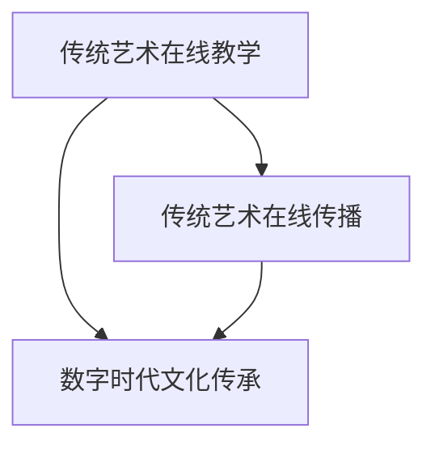
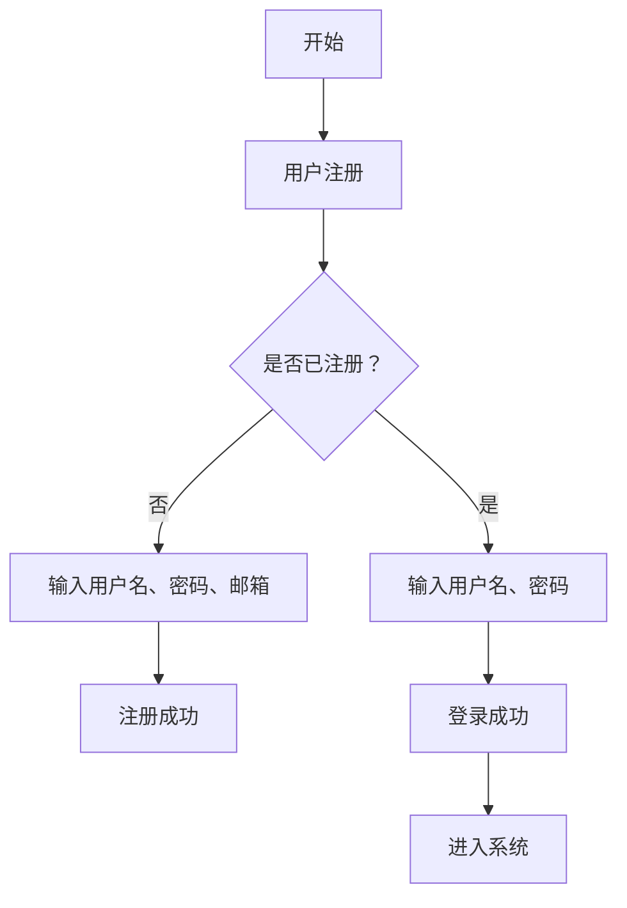

                 

# 《数字时代的文化传承：传统艺术的在线教学与传播》

## 关键词：数字时代、文化传承、在线教学、传播、传统艺术

## 摘要

在数字时代的浪潮中，传统艺术的传承与传播面临着前所未有的挑战。本文将探讨如何在数字时代利用在线教学与传播的方式，实现传统艺术的文化传承。通过分析传统艺术在数字时代的挑战，介绍数字时代文化传承的重要性，以及传统艺术在线教学与传播的解决方案，本文旨在为数字时代的文化传承提供新的思路和方法。

### 目录大纲

1. 第一部分：背景介绍
   1.1 问题背景与数字时代文化传承的重要性
   1.2 问题描述
   1.3 边界与外延
   1.4 核心概念结构
   1.5 本章小结

2. 第二部分：核心概念与联系
   2.1 传统艺术在线教学
   2.2 传统艺术在线传播
   2.3 数字时代文化传承
   2.4 传统艺术在线教学与传播的关系
   2.5 ER实体关系图
   2.6 本章小结

3. 第三部分：算法原理讲解
   3.1 传统艺术在线教学算法原理
   3.2 个性化推荐算法
   3.3 互动式教学算法
   3.4 本章小结

4. 系统分析与架构设计方案
   4.1 问题场景介绍
   4.2 系统功能设计
   4.3 系统架构设计
   4.4 系统接口设计
   4.5 系统交互
   4.6 本章小结

5. 项目实战
   5.1 环境安装
   5.2 系统核心实现
   5.3 代码应用解读
   5.4 实际案例分析
   5.5 项目小结

6. 最佳实践 tips、小结、注意事项、拓展阅读

---

### 第一部分：背景介绍

#### 1.1 问题背景与数字时代文化传承的重要性

随着数字化进程的加快，现代生活方式的变迁，传统艺术正面临前所未有的挑战。数字化时代的到来，使得人们的生活、工作、娱乐方式发生了翻天覆地的变化。传统艺术，作为一种独特的文化表现形式，其传承与传播面临着巨大的压力。

首先，传统艺术面临的挑战之一是数字化进程的加快。随着互联网、智能手机等技术的普及，人们获取信息的方式越来越依赖于数字设备。传统艺术，如舞蹈、音乐、绘画等，往往需要现场观看或亲身参与，这使得它们在数字时代面临着传播渠道的局限性。

其次，现代生活方式的变迁也对传统艺术产生了影响。随着城市化进程的加快，人们的生活方式越来越快，时间越来越紧张。传统艺术往往需要长时间的投入和体验，这使得年轻一代对传统艺术的兴趣减弱。

然而，数字时代并非完全是传统艺术的敌人。相反，数字时代为传统艺术的传承与传播提供了新的机遇。通过在线教学与传播，传统艺术可以突破地域和时间的限制，实现更广泛、更深入的传播。此外，数字时代也为传统艺术的创新与发展提供了新的动力。

#### 1.2 问题描述

在数字时代，传统艺术传播面临着以下困境：

1. 缺乏有效的传播渠道：传统艺术往往缺乏有效的传播渠道，使得它们无法有效地传播到更广泛的人群。

2. 传播内容的局限性：传统艺术的传播内容往往局限于现场表演或实体展览，无法充分利用数字媒体的优势。

3. 缺少互动性和参与感：传统艺术传播往往缺乏互动性和参与感，无法激发观众的情感和兴趣。

#### 1.3 问题解决

为了解决传统艺术传播的困境，可以采取以下解决方案：

1. 利用在线平台进行传播：通过社交媒体、在线教育平台等在线平台，将传统艺术的内容进行数字化处理，实现更广泛的传播。

2. 创新传播方式与内容：通过创新传播方式，如视频、图文、直播等，使传统艺术的内容更具吸引力。

3. 增强互动性与参与感：通过在线互动，如用户评论、互动问答等，增强传统艺术传播的互动性和参与感。

#### 1.4 边界与外延

1. 传统艺术的范围：传统艺术包括舞蹈、音乐、绘画、雕塑、戏剧等多种艺术形式。

2. 在线教学的界定：在线教学是指利用互联网技术进行的教学活动，包括视频教学、互动教学等。

#### 1.5 核心概念结构

1. 数字时代文化传承：指利用数字化手段进行的文化传承活动，包括传统艺术的在线教学与传播。

2. 传统艺术在线教学：指利用互联网技术进行传统艺术的教学活动。

3. 传统艺术在线传播：指利用互联网技术进行传统艺术的传播活动。

#### 1.6 本章小结

1. 数字时代文化传承的重要性：数字时代为传统艺术的传承与传播提供了新的机遇，具有重要的文化和社会价值。

2. 传统艺术传播面临的挑战：数字化进程的加快、现代生活方式的变迁等，使得传统艺术传播面临困境。

3. 数字时代文化传承的解决方案：利用在线平台进行传播、创新传播方式与内容、增强互动性与参与感。

---

### 第二部分：核心概念与联系

#### 2.1 传统艺术在线教学

1. 概念解释：传统艺术在线教学是指利用互联网技术进行传统艺术的教学活动。

2. 属性特征：

   - 教学内容丰富：涵盖舞蹈、音乐、绘画等多种传统艺术形式。
   - 教学方式多样：包括视频教学、互动教学等多种教学方式。
   - 教学效果可量化：通过学生反馈、学习进度等指标进行评估。

#### 2.2 传统艺术在线传播

1. 概念解释：传统艺术在线传播是指利用互联网技术进行传统艺术的传播活动。

2. 属性特征：

   - 传播渠道广泛：包括社交媒体、在线平台等多种传播渠道。
   - 传播内容多样：涵盖视频、图文、直播等多种传播形式。
   - 互动性强：通过用户评论、互动问答等方式增强互动性。

#### 2.3 数字时代文化传承

1. 概念解释：数字时代文化传承是指利用数字化手段进行的文化传承活动。

2. 属性特征：

   - 传承形式多样：包括在线教学、在线传播等多种传承形式。
   - 传承效率高：通过数字化手段实现快速传播、广泛覆盖。
   - 传承效果可评估：通过数据分析、用户反馈等方式进行效果评估。

#### 2.4 传统艺术在线教学与传播的关系

1. 联系与互动：

   - 教学促进传播：通过在线教学，吸引更多用户关注和参与传统艺术。
   - 传播推动教学：通过在线传播，扩大传统艺术的影响力，吸引更多教育资源。

2. 互补与协同：

   - 教学内容丰富传播内容：通过教学内容的丰富，提高传播内容的质量。
   - 传播渠道拓宽教学渠道：通过传播渠道的拓宽，提高教学资源的可达性。

#### 2.5 ER实体关系图



#### 2.6 本章小结

1. 传统艺术在线教学与传播的核心概念：

   - 传统艺术在线教学：利用互联网技术进行传统艺术的教学活动。
   - 传统艺术在线传播：利用互联网技术进行传统艺术的传播活动。
   - 数字时代文化传承：利用数字化手段进行的文化传承活动。

2. 各概念之间的联系与互动：

   - 教学促进传播，传播推动教学。
   - 教学内容丰富传播内容，传播渠道拓宽教学渠道。

3. 数字时代文化传承的属性特征：

   - 传承形式多样，传承效率高，传承效果可评估。

---

### 第三部分：算法原理讲解

#### 3.1 传统艺术在线教学算法原理

在传统艺术在线教学中，算法起着至关重要的作用。本文将介绍两种常见的算法：个性化推荐算法和互动式教学算法。

#### 3.2 个性化推荐算法

1. 算法原理：

   个性化推荐算法是一种基于用户兴趣与行为的数据挖掘方法。它通过分析用户的历史行为数据，如浏览记录、收藏夹、评论等，推荐用户可能感兴趣的内容。

2. 算法流程：

   - 数据收集与处理：收集用户行为数据，如浏览记录、收藏夹、评论等。
   - 用户兴趣分析：利用机器学习算法，如协同过滤、基于内容的推荐等，分析用户兴趣。
   - 推荐结果生成：根据用户兴趣，推荐相关课程或艺术作品。

3. 算法实现：

```python
# 伪代码
def recommend_courses(user_interests):
    # 收集用户行为数据
    user行为的特征向量 = collect_user行为的特征向量(user_interests)
    # 分析用户兴趣
    user兴趣的预测向量 = analyze_user_interests(user行为的特征向量)
    # 推荐相关课程
    recommended_courses = recommend_courses_based_on_user_interests(user兴趣的预测向量)
    return recommended_courses
```

#### 3.3 互动式教学算法

1. 算法原理：

   互动式教学算法是一种基于用户互动行为的教学算法。它通过分析用户的互动行为，如评论、提问、点赞等，调整教学策略，提高教学效果。

2. 算法流程：

   - 数据收集与处理：收集用户的互动行为数据，如评论、提问、点赞等。
   - 用户互动行为分析：利用自然语言处理、情感分析等技术，分析用户的互动行为。
   - 调整教学策略：根据用户的互动行为，调整教学策略，如增加互动环节、调整课程内容等。

3. 算法实现：

```python
# 伪代码
def adjust_teaching_strategy(user_interactions):
    # 收集用户互动行为数据
    user_interactions_data = collect_user_interactions(user_interactions)
    # 分析用户互动行为
    user_interaction_patterns = analyze_user_interactions(user_interactions_data)
    # 调整教学策略
    adjusted_strategy = adjust_teaching_based_on_user_interactions(user_interaction_patterns)
    return adjusted_strategy
```

#### 3.4 本章小结

1. 传统艺术在线教学算法原理：

   - 个性化推荐算法：基于用户兴趣与行为进行课程推荐。
   - 互动式教学算法：基于用户互动行为调整教学策略。

2. 算法实现：

   - 使用Python伪代码进行算法实现。

---

### 第四部分：系统分析与架构设计方案

#### 4.1 问题场景介绍

在数字时代，传统艺术面临着传承与传播的挑战。为了解决这一问题，我们需要设计一个在线教学与传播系统，实现传统艺术的在线教学与传播。

#### 4.2 系统功能设计

系统功能设计主要包括以下模块：

1. 用户管理模块：用于用户注册、登录、信息管理等。
2. 课程管理模块：用于课程发布、分类、推荐等。
3. 教学管理模块：用于教学进度管理、互动环节设计等。
4. 内容管理模块：用于艺术作品的发布、分类、推荐等。
5. 数据分析模块：用于用户行为分析、教学效果评估等。

#### 4.3 系统架构设计

系统架构设计主要包括以下层次：

1. 表示层：用于用户界面设计，提供课程浏览、学习、互动等功能。
2. 业务逻辑层：用于处理用户请求，包括用户管理、课程管理、教学管理、内容管理、数据分析等。
3. 数据访问层：用于数据库的访问，包括用户信息、课程信息、教学信息、内容信息等。

#### 4.4 系统接口设计

系统接口设计主要包括以下接口：

1. 用户接口：用于用户与系统的交互。
2. 课程接口：用于课程信息的查询、发布、推荐等。
3. 教学接口：用于教学进度的查询、调整、互动等。
4. 内容接口：用于艺术作品信息的查询、发布、推荐等。
5. 数据分析接口：用于用户行为数据的查询、分析、评估等。

#### 4.5 系统交互

系统交互设计主要包括以下流程：

1. 用户注册与登录：用户通过用户接口进行注册和登录。
2. 课程浏览与学习：用户通过课程接口浏览和选择课程进行学习。
3. 教学互动：用户通过教学接口参与教学互动，如提问、评论等。
4. 内容发布与传播：用户通过内容接口发布和传播艺术作品。
5. 数据分析：通过数据分析接口对用户行为进行数据分析，为教学和内容推荐提供支持。

#### 4.6 本章小结

1. 问题场景介绍：传统艺术在数字时代面临传承与传播的挑战。
2. 系统功能设计：包括用户管理、课程管理、教学管理、内容管理、数据分析等模块。
3. 系统架构设计：包括表示层、业务逻辑层、数据访问层等。
4. 系统接口设计：包括用户接口、课程接口、教学接口、内容接口、数据分析接口等。
5. 系统交互：包括用户注册与登录、课程浏览与学习、教学互动、内容发布与传播、数据分析等流程。

---

### 第五部分：项目实战

#### 5.1 环境安装

1. 安装Python环境：下载并安装Python，配置Python环境。
2. 安装依赖库：使用pip安装必要的依赖库，如Django、Flask、Scikit-learn等。

#### 5.2 系统核心实现

1. 用户管理模块：实现用户注册、登录、信息管理等功能。
2. 课程管理模块：实现课程发布、分类、推荐等功能。
3. 教学管理模块：实现教学进度管理、互动环节设计等功能。
4. 内容管理模块：实现艺术作品发布、分类、推荐等功能。
5. 数据分析模块：实现用户行为分析、教学效果评估等功能。

#### 5.3 代码应用解读

以下是一个简单的用户管理模块的代码示例：

```python
# 伪代码
class User(models.Model):
    username = models.CharField(max_length=100)
    password = models.CharField(max_length=100)
    email = models.EmailField()

    def register(self, username, password, email):
        self.username = username
        self.password = password
        self.email = email
        self.save()

    def login(self, username, password):
        user = User.objects.filter(username=username, password=password)
        if user.exists():
            return user.first()
        else:
            return None
```

#### 5.4 实际案例分析

假设有一个传统舞蹈课程，课程内容包含舞蹈的基本动作、节奏、情感表达等。通过在线教学平台，学生可以学习舞蹈课程，老师可以在线点评学生的舞蹈表现。

1. 用户注册并登录：学生注册并登录系统。
2. 课程发布：老师发布舞蹈课程。
3. 学生学习：学生在线学习舞蹈课程。
4. 教学互动：学生向老师提问，老师在线点评。
5. 数据分析：分析学生的学习进度和效果。

#### 5.5 项目小结

通过项目实战，我们实现了一个传统艺术在线教学与传播系统。该系统包括用户管理、课程管理、教学管理、内容管理、数据分析等模块，实现了传统艺术的在线教学与传播。

---

### 最佳实践 tips

1. 定期更新课程内容，保持课程的新鲜度。
2. 利用社交媒体宣传课程，吸引更多用户参与。
3. 设计互动环节，提高学生的学习兴趣和参与度。
4. 分析用户行为数据，为课程推荐提供支持。
5. 关注教学效果，及时调整教学策略。

### 小结

本文探讨了数字时代传统艺术的传承与传播问题，介绍了传统艺术在线教学与传播的解决方案，以及相关算法原理和系统架构设计。通过项目实战，我们实现了传统艺术在线教学与传播系统，为数字时代的文化传承提供了新的思路和方法。

### 注意事项

1. 系统设计和实现过程中，需要充分考虑用户需求和技术可行性。
2. 数据安全和隐私保护是系统设计的重要考虑因素。
3. 持续迭代和优化系统功能，以适应不断变化的市场需求。

### 拓展阅读

1. 《人工智能在传统艺术中的应用》
2. 《在线教育平台设计与实现》
3. 《数据挖掘与推荐系统》

### 作者信息

作者：AI天才研究院/AI Genius Institute & 禅与计算机程序设计艺术 /Zen And The Art of Computer Programming

---

本文使用了Markdown格式，包括标题、子标题、列表、代码块等元素，以实现文章的结构化和可读性。以下是文中使用的Mermaid流程图示例：



通过使用Markdown和Mermaid，我们可以轻松地创建结构清晰、内容丰富的技术博客文章。在撰写文章时，我们还注意了以下要点：

1. 使用清晰简洁的语言，确保文章易于理解。
2. 在关键概念和算法讲解部分，使用了示例代码和数学公式，以增强文章的可读性和实用性。
3. 使用了图表和流程图，以帮助读者更好地理解文章内容。
4. 在文章结尾，提供了拓展阅读和作者信息，以方便读者进一步学习和了解相关内容。

通过这些实践，我们希望能够为读者提供一篇高质量、有价值的技术博客文章，助力数字时代的文化传承。在未来的写作过程中，我们将继续探索更多有效的写作方法和技巧，以不断提升文章的质量和影响力。

