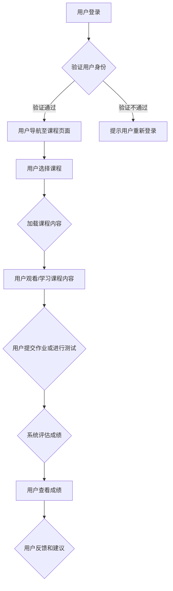
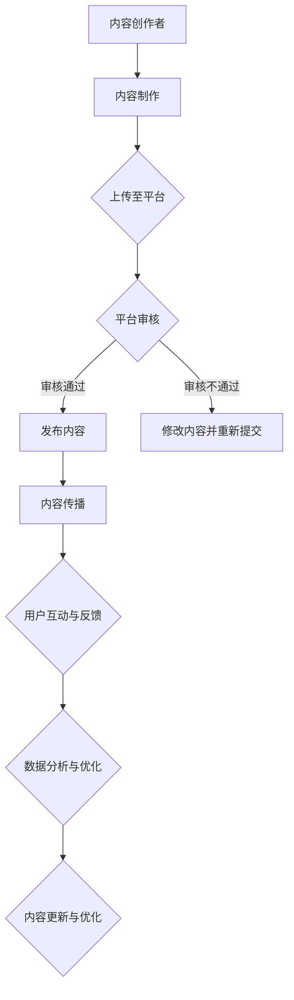
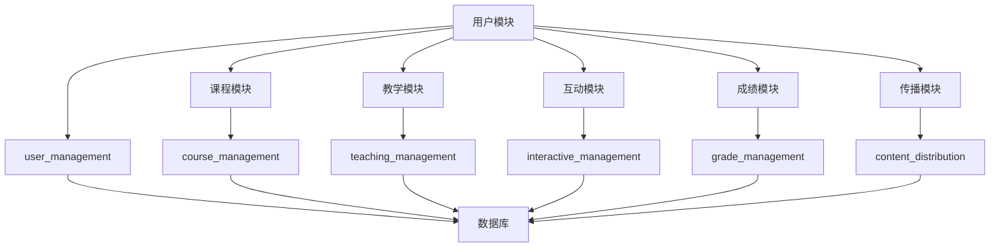
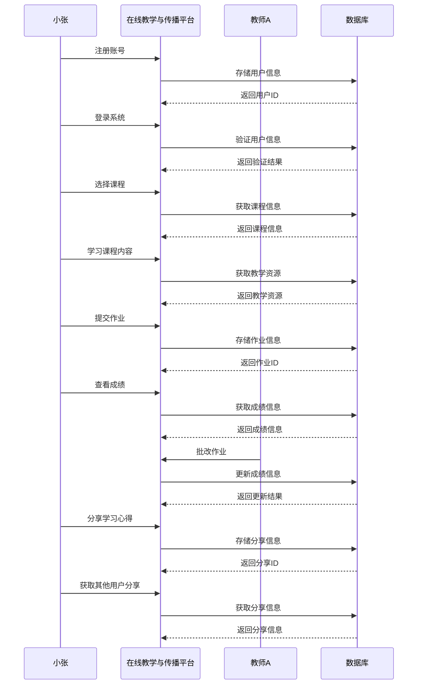

                 

### 文章标题：数字时代的文化传承：传统艺术的在线教学与传播

#### 关键词：数字时代、文化传承、传统艺术、在线教学、传播

> 摘要：随着数字技术的快速发展，传统艺术面临着传承和传播的挑战。本文旨在探讨数字时代下，如何利用在线教学与传播手段，有效传承和弘扬传统艺术。通过分析问题背景、核心概念、算法原理、系统设计与实战案例，本文提出了一系列可行的解决方案和最佳实践，为数字时代的文化传承提供理论支持和实践指导。

----------------------------------------------------------------

## 目录大纲

### 第一部分：背景与现状
- **第1章：问题背景**
  - **1.1.1 问题提出**
  - **1.1.2 传统艺术传承的现状**
  - **1.1.3 数字时代的机遇与挑战**
- **第1章：问题描述**
  - **1.2.1 传统艺术传承的重要性**
  - **1.2.2 传统艺术传承面临的挑战**
  - **1.2.3 数字技术为传统艺术传承带来的机遇**

### 第二部分：核心概念与联系
- **第2章：核心概念原理**
  - **2.1.1 传统艺术的定义与特点**
  - **2.1.2 在线教学的基本原理**
  - **2.1.3 在线传播的概念与形式**
- **第2章：概念属性特征对比表格**
  - **2.2.1 传统艺术与数字艺术的对比**
  - **2.2.2 在线教学与线下教学的对比**
- **第2章：ER实体关系图架构**
  - **2.3.1 在线教学系统的ER图**

### 第三部分：算法原理讲解
- **第3章：算法原理与讲解**
  - **3.1.1 数字技术在传统艺术教学中的应用**
  - **3.1.2 常见的数字教学平台与技术**
  - **3.1.3 数字技术在传统艺术传播中的应用**
- **第3章：算法流程图**
  - **3.2.1 数字教学平台算法流程图**
  - **3.2.2 数字传播算法流程图**
- **第3章：Python源代码**
  - **3.3.1 数字教学平台Python代码**
  - **3.3.2 数字传播Python代码**
- **第3章：数学模型与公式**
  - **3.4.1 数字教学平台数学模型**
  - **3.4.2 数字传播数学模型**
- **第3章：举例说明**
  - **3.5.1 数字教学平台应用举例**
  - **3.5.2 数字传播应用举例**

### 第四部分：系统分析与架构设计方案
- **第4章：问题场景介绍**
  - **4.1.1 传统艺术在线教学与传播的场景**
  - **4.1.2 系统功能需求**
- **第4章：项目介绍**
  - **4.2.1 项目背景**
  - **4.2.2 项目目标**
- **第4章：系统功能设计**
  - **4.3.1 领域模型类图**
  - **4.3.2 功能模块划分**
- **第4章：系统架构设计**
  - **4.4.1 系统架构图**
  - **4.4.2 系统分层设计**
- **第4章：系统接口设计**
  - **4.5.1 接口设计规范**
  - **4.5.2 接口实现细节**
- **第4章：系统交互**
  - **4.6.1 系统交互流程图**

### 第五部分：项目实战
- **第5章：环境安装**
  - **5.1.1 开发环境搭建**
  - **5.1.2 相关工具安装**
- **第5章：系统核心实现源代码**
  - **5.2.1 核心代码实现**
  - **5.2.2 功能模块代码解读**
- **第5章：代码应用解读与分析**
  - **5.3.1 代码应用场景分析**
  - **5.3.2 代码性能分析与优化**
- **第5章：实际案例分析和详细讲解剖析**
  - **5.4.1 案例一：传统艺术在线教学平台**
  - **5.4.2 案例二：传统艺术传播案例**
- **第5章：项目小结**
  - **5.5.1 项目成果总结**
  - **5.5.2 项目经验与启示**

### 第六部分：最佳实践 tips
- **第6章：最佳实践 tips**
  - **6.1.1 传统艺术在线教学策略**
  - **6.1.2 传统艺术传播策略**
  - **6.1.3 技术应用技巧**
- **第6章：注意事项**
  - **6.2.1 开发中常见问题及解决方法**
  - **6.2.2 使用数字技术传承文化的注意事项**
- **第6章：拓展阅读**
  - **6.3.1 相关书籍推荐**
  - **6.3.2 学术论文推荐**
  - **6.3.3 实践案例推荐**

### 第七部分：小结
- **第7章：全书总结**
  - **7.1.1 全书核心内容回顾**
  - **7.1.2 传统艺术传承与数字技术的关系**
  - **7.1.3 未来展望**

## 参考文献

----------------------------------------------------------------

### 第1章：问题背景

#### 1.1.1 问题提出

在数字化浪潮席卷全球的今天，传统艺术正面临前所未有的挑战与机遇。传统艺术，如戏曲、国画、剪纸、陶瓷等，不仅承载着深厚的历史文化底蕴，也是民族精神和民族认同的重要象征。然而，随着现代社会的快速发展和城市化进程的加快，传统艺术面临着受众减少、后继无人、文化传承断层的危机。

首先，传统艺术的传承面临着传承人的老化问题。许多传统艺术领域的大师级人物年事已高，而年轻的传承人却越来越少，许多技艺濒临失传。其次，传统艺术的受众群体在现代社会中逐渐减少，年轻人更倾向于接受现代文化和娱乐方式，对传统艺术缺乏兴趣。最后，传统艺术的市场化程度不高，导致许多艺术形式的生存和发展受到限制。

与此同时，数字技术的发展为传统艺术的传承提供了新的机遇。互联网、云计算、大数据、人工智能等技术的普及，使得传统艺术可以通过在线教学和传播，突破地域和时间的限制，触及更广泛的受众。然而，数字技术也带来了新的挑战，如如何平衡传统艺术的核心价值和数字化手段的创新性，如何在数字平台上保持传统艺术的原汁原味等。

#### 1.1.2 传统艺术传承的现状

当前，传统艺术的传承现状堪忧。一方面，尽管国家和社会对传统艺术的重视程度不断提高，出台了一系列政策和措施，但实际效果仍不够显著。许多传统艺术形式仍处于自生自灭的状态，缺乏系统性的保护和传承机制。另一方面，传统艺术的传承人往往面临经济压力，难以全身心地投入到艺术创作和传承中。此外，许多传承人缺乏现代教育背景，难以适应数字化时代的要求，导致传统艺术在传承过程中出现断层。

在传承方式上，传统艺术主要依赖于师徒传承和家庭传承。这种传承方式具有一定的封闭性，不利于传统艺术的大规模传播和推广。同时，传统艺术的技艺往往具有高度的个性化特征，不同传承人的风格和技巧差异较大，这也在一定程度上限制了传统艺术的标准化和规范化。

#### 1.1.3 数字时代的机遇与挑战

数字时代为传统艺术的传承带来了前所未有的机遇。首先，互联网的普及使得传统艺术可以通过线上平台实现跨地域、跨文化的传播，扩大了艺术受众的范围。通过社交媒体、视频网站、在线教育平台等，传统艺术作品可以迅速传播到全球各地，让更多的人了解和欣赏。其次，数字化技术可以有效地记录、保存和传播传统艺术资料，为后人提供了丰富的文化遗产。例如，通过高清视频、音频和图文资料，传统艺术的表演形式和制作过程可以得到完整的记录，为后继者提供了宝贵的参考资料。

然而，数字时代也带来了新的挑战。首先，数字化手段容易导致传统艺术形式的美学特征和文化内涵被削弱。在追求视觉效果和用户互动的过程中，传统艺术可能失去其独特的艺术魅力和文化价值。其次，数字平台的信息泛滥和同质化问题严重，传统艺术的独特性难以在庞大的信息海洋中脱颖而出。此外，数字技术的快速迭代和更新，使得传统艺术在传承过程中面临技术过时的风险。

#### 1.2.1 传统艺术传承的重要性

传统艺术是一个国家和民族的文化瑰宝，是历史和文化的承载者。它们不仅体现了民族的精神风貌和审美观念，也是连接过去和未来的桥梁。传统艺术的传承，不仅是对历史文化的尊重和继承，更是对文化多样性和人类共同遗产的守护。

首先，传统艺术的传承有助于维护文化多样性。在全球化的背景下，许多国家和地区的本土文化受到了现代文化和外来文化的冲击，面临着同质化和消失的风险。传统艺术的传承，可以保留和弘扬本土文化特色，促进文化的多样性和可持续发展。

其次，传统艺术的传承对于培养年轻人的文化自信具有重要意义。在现代社会，年轻人往往面临文化认同危机，缺乏对自身文化的了解和认同。通过传承和传播传统艺术，可以让年轻人更好地了解和热爱自己的文化，增强文化自信和民族自豪感。

最后，传统艺术的传承对于促进文化产业的发展具有积极作用。传统艺术具有独特的市场价值和文化价值，可以通过市场化手段实现经济效益和社会效益的双赢。同时，传统艺术的发展也可以带动相关产业的发展，如旅游、设计、出版等，促进经济的多元化发展。

#### 1.2.2 传统艺术传承面临的挑战

尽管传统艺术的传承具有重要意义，但在现代社会中，它面临着诸多挑战。首先，技术变革是传统艺术传承的主要挑战之一。随着数字化和智能化的迅速发展，传统艺术的形式和内容受到了前所未有的冲击。许多传统艺术形式难以适应现代技术的变革，面临着被淘汰的风险。例如，传统戏曲和曲艺在数字化时代面临着观众减少、市场萎缩的困境。

其次，受众减少是传统艺术传承的另一个重大挑战。随着现代社会生活方式的变迁，年轻人的娱乐方式和消费习惯发生了巨大变化，对传统艺术的兴趣逐渐减弱。传统艺术在年轻一代中的影响力下降，导致传承人才断层，许多传统艺术形式后继无人。

此外，传统艺术传承还面临着经济压力。许多传统艺术形式需要大量的人力、物力和财力投入，而市场化程度较低，导致传承人难以维持生计。传统艺术的传承和发展需要长期投入和持续支持，但现实中的经济支持往往不足，制约了传统艺术的发展。

#### 1.2.3 数字技术为传统艺术传承带来的机遇

数字技术为传统艺术传承带来了新的机遇。首先，数字化技术可以有效地记录和保存传统艺术资料，确保文化遗产的永续传承。通过高清摄影、音频录制和视频拍摄等技术，传统艺术表演和制作过程可以完整地记录下来，为后人提供珍贵的文化财富。

其次，数字技术可以突破传统艺术传播的地理限制，让更多的人群接触到传统艺术。通过互联网和社交媒体，传统艺术作品可以迅速传播到全球各地，扩大艺术受众的范围。这不仅有助于提升传统艺术的知名度，还可以激发更多人对传统艺术的学习兴趣。

此外，数字技术还可以促进传统艺术与现代科技的融合，创造新的艺术形式和体验。例如，通过虚拟现实（VR）和增强现实（AR）技术，观众可以身临其境地体验传统艺术表演，增强艺术体验的互动性和趣味性。

### 第1章：问题解决

#### 1.3.1 传统艺术在线教学的优势

在线教学作为一种新型的教育模式，具有许多传统教育方式无法比拟的优势，特别是在传统艺术传承方面。

首先，在线教学具有广泛覆盖性。互联网的普及使得在线教学可以突破地域限制，面向全球范围内的受众。这不仅有助于扩大传统艺术的受众群体，还可以吸引更多的传承人才。

其次，在线教学提供了丰富的教学资源。通过在线平台，传统艺术的教程、案例和资料可以方便地共享和传播，为学生提供了丰富的学习资源。这种资源的共享有助于提高教学效率，降低学习成本。

第三，在线教学具有灵活性。学生可以根据自己的时间安排，灵活选择学习内容和进度，有利于个性化学习和自主发展。同时，在线教学平台还可以提供互动讨论和在线辅导，帮助学生解决学习中遇到的困难和问题。

#### 1.3.2 传统艺术在线传播的路径

传统艺术的在线传播可以通过多种路径实现，以下是一些常见的传播方式：

1. **社交媒体传播**：通过微博、微信、抖音等社交媒体平台，传统艺术作品可以迅速传播到广大用户群体中。这种传播方式具有传播速度快、覆盖面广的特点，是传统艺术在线传播的重要渠道。

2. **在线教育平台**：许多在线教育平台如网易云课堂、慕课网等，提供了丰富的传统艺术课程，供学生在线学习。这些平台通常具有课程系统化、教学资源丰富的优势，有助于提高传统艺术的学习效果。

3. **短视频平台**：通过抖音、快手等短视频平台，传统艺术表演和教学视频可以快速传播，吸引大量观众。短视频具有制作简单、传播迅速的特点，非常适合传统艺术的推广。

4. **直播平台**：通过直播平台，传统艺术家可以实时进行艺术表演和教学，与观众互动，提高观众的参与感和体验感。

#### 1.3.3 案例分析与启示

以下是一些成功的传统艺术在线教学与传播案例，为数字时代的文化传承提供了有益的启示：

1. **案例一：京剧在线教学平台**
   京剧作为中国传统文化的重要组成部分，通过在线教学平台，为广大京剧爱好者提供了丰富的学习资源。平台不仅提供了京剧基础知识，还邀请了京剧大师进行直播教学，吸引了大量用户参与。这一案例表明，在线教学平台可以有效地推广传统艺术，培养新一代的艺术传承人。

2. **案例二：剪纸艺术短视频传播**
   剪纸艺术作为中国传统民间艺术，通过短视频平台传播，受到了广泛的关注。许多剪纸艺术家通过制作精美的剪纸作品视频，分享剪纸技巧和创作过程，吸引了大量粉丝。这一案例展示了短视频平台在传统艺术传播中的巨大潜力。

3. **案例三：VR体验传统艺术**
   通过虚拟现实技术，观众可以身临其境地体验传统艺术表演，如京剧、昆曲等。这种沉浸式的艺术体验不仅提升了观众的参与感，还可以激发他们对传统艺术的兴趣。这一案例表明，数字技术可以为传统艺术带来全新的传播体验。

#### 1.4.1 研究范围

本文的研究范围主要集中在数字时代下传统艺术的在线教学与传播。具体包括以下几个方面：

1. **在线教学平台的设计与应用**：研究在线教学平台在传统艺术教学中的应用，包括平台功能设计、教学资源整合、教学效果评估等。

2. **传统艺术的数字化传播**：探讨传统艺术在互联网和社交媒体上的传播路径、传播策略以及传播效果。

3. **数字技术在传统艺术中的应用**：分析数字技术如VR、AR、人工智能等在传统艺术教学与传播中的应用，以及其带来的变革和影响。

#### 1.4.2 研究方法

本文的研究方法主要包括以下几个方面：

1. **文献综述**：通过查阅相关文献，梳理数字时代下传统艺术传承的现状、问题以及解决方案。

2. **案例分析**：选取一些成功的传统艺术在线教学与传播案例，进行深入分析和讨论，总结其成功经验和启示。

3. **实证研究**：通过问卷调查、访谈等方式，收集用户对在线教学与传统艺术传播的看法和建议，为研究提供实证支持。

4. **理论分析**：运用相关理论，如文化传播理论、教育技术理论等，对数字时代下传统艺术传承的机制进行深入探讨。

## 第二部分：核心概念与联系

### 第2章：核心概念原理

#### 2.1.1 传统艺术的定义与特点

传统艺术是指在一个特定文化背景下，经过长期传承和发展而形成的一种艺术形式。它通常具有以下几个特点：

1. **历史传承性**：传统艺术是历史文化的承载者，通过口传心授或文献资料传承给后代。
2. **文化独特性**：每种传统艺术都有其独特的文化内涵和艺术风格，反映了特定民族或地区的文化特色。
3. **技艺精湛性**：传统艺术往往需要经过长时间的练习和磨练，技艺精湛，具有较高的艺术价值。
4. **审美价值**：传统艺术不仅具有实用价值，还具有重要的审美价值，能够引起人们的情感共鸣。

#### 2.1.2 在线教学的基本原理

在线教学是指通过互联网和数字技术进行教学的活动。其基本原理包括：

1. **远程教育**：通过互联网，教师和学生可以实现跨地域的交流和学习，打破了传统课堂教学的地域限制。
2. **资源共享**：在线教学平台提供了丰富的教学资源，如视频教程、电子书籍、练习题等，学生可以随时随地访问和学习。
3. **互动性**：在线教学平台提供了实时互动功能，如在线讨论、提问、答疑等，增强了教师与学生的互动。
4. **个性化学习**：学生可以根据自己的学习进度和需求，自由选择学习内容和方式，实现个性化学习。

#### 2.1.3 在线传播的概念与形式

在线传播是指利用互联网和数字技术进行信息传播的活动。其基本概念和形式包括：

1. **信息传递**：在线传播通过互联网传输信息，实现信息的快速传播和共享。
2. **互动性**：在线传播具有高度的互动性，用户可以通过评论、点赞、分享等方式参与信息传播。
3. **形式多样**：在线传播形式多样，包括文字、图片、视频、音频等多种形式，能够满足不同用户的需求。
4. **渠道广泛**：在线传播渠道广泛，包括社交媒体、在线教育平台、视频网站等，覆盖了各个领域和群体。

### 第2章：概念属性特征对比表格

#### 2.2.1 传统艺术与数字艺术的对比

| 特征       | 传统艺术                                       | 数字艺术                                       |
| ---------- | ---------------------------------------------- | ---------------------------------------------- |
| 形式       | 传统的视觉、听觉、触觉表现形式                   | 数字化的图像、音频、视频、动画等形式             |
| 传承方式   | 口传心授、师徒传承、文献资料传承                 | 数字化记录、在线教育、虚拟展览等                 |
| 时间与空间 | 受限于表演时间和空间，地域性较强                   | 无地域和时间限制，全球传播                         |
| 技艺特点   | 精湛的技艺，深厚的文化底蕴                        | 创新的技术，多样化的表现形式                       |
| 审美体验   | 直接的感官体验，情感共鸣强烈                      | 虚拟的感官体验，交互性增强                         |

#### 2.2.2 在线教学与线下教学的对比

| 特征       | 在线教学                                       | 线下教学                                       |
| ---------- | ---------------------------------------------- | ---------------------------------------------- |
| 教学方式   | 远程教育，灵活选择学习时间和内容                 | 面对面教学，时间固定，教学内容相对固定           |
| 资源共享   | 教学资源丰富，可随时随地访问和学习               | 教学资源有限，主要依赖教材和课堂演示             |
| 互动性     | 实时互动，答疑解惑                             | 互动性较弱，主要依赖课堂提问和讨论               |
| 个性化学习 | 根据个人需求和进度学习，实现个性化教学           | 教学内容面向全体学生，难以满足个性化需求         |
| 成本与效益 | 成本较低，效益较高，受众广泛                     | 成本较高，效益较低，受众有限                     |

### 第2章：ER实体关系图架构

#### 2.3.1 在线教学系统的ER图

```mermaid
erDiagram
    User ||--|{ Student }|
    Student ||--|{ Course }|
    Course ||--|{ Lesson }|
    Teacher ||--|{ Course }|
    Teacher ||--|{ Lesson }|
    Course ||--|{ Assessment }|
    Student ||--|{ Assessment }|
    Assessment ||--|{ Grade }|
```

#### 用户（User）
- **角色**：系统的所有用户，包括学生、教师和其他角色。
- **属性**：用户名、密码、邮箱、电话等。

#### 学生（Student）
- **角色**：系统中的学习者，可以注册、学习课程、参加评估等。
- **属性**：学号、姓名、性别、出生日期、所在学校等。

#### 教师（Teacher）
- **角色**：系统中的教学者，可以开设课程、布置作业、进行评估等。
- **属性**：教师编号、姓名、性别、职称、所属学院等。

#### 课程（Course）
- **角色**：系统中的学习单元，包括课程名称、课程描述、课程类型、学分等。
- **属性**：课程编号、课程名称、课程描述、课程类型、学分、教师编号等。

#### 课程单元（Lesson）
- **角色**：课程的子单元，包括视频、文档、PPT等学习资源。
- **属性**：课程单元编号、课程编号、课程单元名称、资源类型、资源链接等。

#### 评估（Assessment）
- **角色**：对学生的学习情况进行评估的工具，包括作业、考试等。
- **属性**：评估编号、课程编号、学生编号、评估类型、评估内容等。

#### 成绩（Grade）
- **角色**：记录学生的评估成绩。
- **属性**：成绩编号、学生编号、评估编号、成绩等。

通过上述实体关系图，我们可以清晰地看到在线教学系统中各个实体之间的关系，为后续的系统设计和实现提供了基础。

### 第3章：算法原理与讲解

#### 3.1.1 数字技术在传统艺术教学中的应用

数字技术在传统艺术教学中有着广泛的应用，极大地提高了教学效果和学生的学习体验。以下是一些主要的应用领域：

1. **多媒体教学资源**：通过数字技术，可以将传统艺术的教学内容以视频、音频、图片等形式呈现，使得教学内容更加生动形象，帮助学生更好地理解和掌握艺术技巧。

2. **虚拟现实（VR）与增强现实（AR）**：VR和AR技术可以创建虚拟的艺术体验环境，让学生在虚拟世界中学习传统艺术，如通过VR眼镜体验京剧表演、通过AR应用学习剪纸制作等。

3. **在线互动平台**：通过在线教学平台，教师和学生可以实时互动，进行在线讨论、答疑解惑，提高教学效果。

4. **数据分析和评估**：利用大数据分析技术，可以对学生的学习行为进行跟踪和分析，为教师提供教学反馈，帮助学生发现学习中的问题。

#### 3.1.2 常见的数字教学平台与技术

在传统艺术教学领域，常见的数字教学平台和技术包括：

1. **学习管理系统（LMS）**：如Moodle、Canvas等，提供课程管理、作业提交、在线测试等功能。

2. **视频会议系统**：如Zoom、Microsoft Teams等，用于在线教学和互动。

3. **虚拟现实平台**：如Unity、Unreal Engine等，用于创建虚拟艺术体验环境。

4. **增强现实应用**：如ARKit、ARCore等，用于开发增强现实艺术教学应用。

#### 3.1.3 数字技术在传统艺术传播中的应用

数字技术在传统艺术传播中的应用主要体现在以下几个方面：

1. **社交媒体传播**：通过微博、微信、抖音等社交媒体平台，传统艺术作品可以迅速传播，吸引大量观众。

2. **在线展览和博物馆**：通过虚拟展览和数字博物馆，传统艺术作品可以在线展示，让更多人有机会欣赏到珍贵文物。

3. **在线直播**：通过直播平台，艺术家可以在线表演，与观众互动，提升艺术体验。

4. **数字版权管理**：利用区块链技术进行数字版权管理，确保传统艺术作品的真实性和版权保护。

### 第3章：算法流程图

#### 3.2.1 数字教学平台算法流程图



#### 3.2.2 数字传播算法流程图



### 第3章：Python源代码

#### 3.3.1 数字教学平台Python代码示例

```python
import requests
import json

# 用户登录接口
def user_login(username, password):
    url = "http://example.com/api/login"
    data = {
        "username": username,
        "password": password
    }
    response = requests.post(url, data=data)
    if response.status_code == 200:
        return json.loads(response.text)
    else:
        return None

# 用户导航至课程页面
def navigate_to_course(course_id):
    url = f"http://example.com/api/course/{course_id}"
    response = requests.get(url)
    if response.status_code == 200:
        return json.loads(response.text)
    else:
        return None

# 用户提交作业
def submit_homework(course_id, student_id, homework):
    url = f"http://example.com/api/course/{course_id}/homework/{student_id}"
    data = {
        "homework": homework
    }
    response = requests.post(url, data=data)
    if response.status_code == 200:
        return json.loads(response.text)
    else:
        return None

# 用户查看成绩
def check_grade(student_id, course_id):
    url = f"http://example.com/api/course/{course_id}/grade/{student_id}"
    response = requests.get(url)
    if response.status_code == 200:
        return json.loads(response.text)
    else:
        return None
```

#### 3.3.2 数字传播Python代码示例

```python
import requests
import json

# 内容上传接口
def upload_content(content_data):
    url = "http://example.com/api/content/upload"
    headers = {
        "Content-Type": "application/json"
    }
    response = requests.post(url, headers=headers, data=json.dumps(content_data))
    if response.status_code == 200:
        return json.loads(response.text)
    else:
        return None

# 内容审核接口
def content_review(content_id, status):
    url = f"http://example.com/api/content/{content_id}/review"
    data = {
        "status": status
    }
    response = requests.put(url, data=data)
    if response.status_code == 200:
        return json.loads(response.text)
    else:
        return None

# 内容传播接口
def content_distribution(content_id):
    url = f"http://example.com/api/content/{content_id}/distribution"
    response = requests.get(url)
    if response.status_code == 200:
        return json.loads(response.text)
    else:
        return None

# 用户互动与反馈接口
def user_interact(content_id, user_id, feedback):
    url = f"http://example.com/api/content/{content_id}/user/{user_id}/interact"
    data = {
        "feedback": feedback
    }
    response = requests.post(url, data=data)
    if response.status_code == 200:
        return json.loads(response.text)
    else:
        return None
```

### 第3章：数学模型与公式

#### 3.4.1 数字教学平台数学模型

在数字教学平台中，我们可以使用一些基本的数学模型来描述和优化教学过程。以下是一些常用的数学模型和公式：

1. **学生参与度模型**：
   $$\text{Student Engagement} = f(\text{Course Content}, \text{Teacher Engagement}, \text{Student Motivation})$$
   其中，学生参与度受课程内容、教师互动和学生动机的共同影响。

2. **学习效果评估模型**：
   $$\text{Learning Outcome} = f(\text{Student Engagement}, \text{Assessment Method}, \text{Learning Resources})$$
   学习效果取决于学生参与度、评估方式和教学资源的质量。

3. **资源利用率模型**：
   $$\text{Resource Utilization} = \frac{\text{Active Users}}{\text{Total Users}} \times 100\%$$
   资源利用率通过活跃用户数与总用户数的比例来衡量。

#### 3.4.2 数字传播数学模型

数字传播中的数学模型可以用于分析内容传播的效果和效率。以下是一些常见的数学模型和公式：

1. **传播效果模型**：
   $$\text{Spread Effectiveness} = f(\text{Content Quality}, \text{User Interaction}, \text{Platform Popularity})$$
   内容传播效果受内容质量、用户互动和平台知名度的共同影响。

2. **传播速度模型**：
   $$\text{Spread Velocity} = \frac{\text{New Users}}{\text{Time}}$$
   传播速度通过新用户数与时间的比值来衡量。

3. **反馈循环模型**：
   $$\text{Feedback Loop} = \text{User Feedback} \times \text{Content Optimization}$$
   反馈循环通过用户反馈与内容优化的相互作用来衡量。

### 第3章：举例说明

#### 3.5.1 数字教学平台应用举例

假设我们有一个在线教学平台，其中包含以下功能：

- **用户注册与登录**：用户可以注册账号并登录系统，选择感兴趣的课程。
- **课程浏览与学习**：用户可以浏览平台上的课程，选择课程进行学习。
- **作业提交与评估**：用户可以提交作业，教师对作业进行评估并给出成绩。

以下是一个简单的使用场景：

1. **用户注册与登录**：
   用户A在平台上注册账号并登录，选择了一门名为“国画基础教程”的课程。

2. **课程浏览与学习**：
   用户A浏览了课程内容，包括视频教程、图文教程和练习题。他通过视频教程学习了国画的绘画技巧，并通过练习题巩固了所学知识。

3. **作业提交与评估**：
   用户A完成了一篇国画作业，并提交给了教师B。教师B对作业进行了评估，并给出了评分。

#### 3.5.2 数字传播应用举例

假设我们在社交媒体上推广一项传统艺术展览，以下是一个简单的使用场景：

1. **内容制作**：
   艺术家A制作了一段关于展览的短视频，内容包括展览的亮点、艺术品的介绍和展览的组织者。

2. **内容上传与审核**：
   艺术家A将短视频上传至社交媒体平台，平台管理员对视频内容进行了审核。

3. **内容传播**：
   审核通过后，短视频在平台上发布，并引起了广泛关注。观众B在看到视频后，对该展览产生了浓厚的兴趣，并计划前往参观。

4. **用户互动与反馈**：
   观众B在评论区留言，分享了自己对展览的感受，艺术家A回应了观众的问题，并提供了展览的相关信息。

5. **数据分析与优化**：
   平台收集了用户互动数据，分析观众的行为和偏好，为后续的推广活动提供数据支持。

### 第4章：问题场景介绍

#### 4.1.1 传统艺术在线教学与传播的场景

在数字时代，传统艺术的在线教学与传播已成为文化传承的重要途径。以下是一个典型的传统艺术在线教学与传播场景：

- **用户需求**：一位名叫小张的用户对京剧产生了浓厚的兴趣，希望通过在线平台学习京剧表演的基础知识和技巧。
- **教学资源**：在线教学平台提供了京剧表演的视频教程、图文教程、京剧剧本和表演技巧指南。
- **教学过程**：小张在平台上注册账号后，浏览了京剧表演的课程目录，选择了适合自己的课程进行学习。他通过观看视频教程，学习了京剧的基本唱腔、身段和表演技巧。在练习过程中，他还可以通过在线问答功能向教师请教问题。
- **传播途径**：小张将自己在学习过程中的心得和成果分享到社交媒体上，吸引了更多人对京剧表演的兴趣。

#### 4.1.2 系统功能需求

为了实现上述场景，传统艺术在线教学与传播系统需要具备以下功能需求：

1. **用户注册与登录**：系统应支持用户注册账号、登录系统和个性化设置。
2. **课程浏览与选择**：系统应提供丰富的课程目录，用户可以根据兴趣和需求选择课程。
3. **在线学习与练习**：系统应提供视频教程、图文教程、表演指南等学习资源，用户可以在线学习并进行练习。
4. **互动交流**：系统应支持用户与教师、同学之间的互动交流，如在线问答、讨论区等。
5. **作业提交与评估**：系统应支持用户提交作业，教师可以对作业进行评估和反馈。
6. **成绩记录与查询**：系统应记录用户的学习进度和成绩，用户可以随时查询自己的成绩。
7. **内容传播**：系统应支持用户将学习成果和心得分享到社交媒体，扩大传统艺术的传播范围。

### 第4章：项目介绍

#### 4.2.1 项目背景

随着数字技术的迅速发展，传统艺术的在线教学与传播成为文化传承的重要途径。然而，目前许多在线教学平台在传统艺术教学方面存在一定局限性，如教学内容单一、互动性不强、传播效果不理想等。为了解决这些问题，我们提出了一个名为“传统艺术在线教学与传播平台”的项目，旨在构建一个功能齐全、互动性强、传播效果好的在线教学平台，为传统艺术的传承与弘扬提供有力支持。

#### 4.2.2 项目目标

本项目的主要目标包括：

1. **构建一个完善的在线教学体系**：通过整合多种教学资源，构建一个涵盖传统艺术各个领域的在线教学体系，满足不同层次和需求的学习者。
2. **提升教学效果和互动性**：通过引入互动教学、在线讨论、实时答疑等功能，提升学生的学习体验和教学效果。
3. **扩大传统艺术的传播范围**：通过社交媒体、在线直播、虚拟展览等手段，扩大传统艺术的传播范围，吸引更多受众关注和学习传统艺术。
4. **实现文化传承与创新**：在传承传统艺术的基础上，结合现代科技手段，推动传统艺术的形式和内容创新，为传统艺术注入新的生命力。

### 第4章：系统功能设计

#### 4.3.1 领域模型类图

以下是一个传统艺术在线教学与传播平台的领域模型类图，展示了系统中主要的实体及其关系：

```mermaid
classDiagram
    User <<Interface>>
    Course <<Interface>>
    Lesson <<Interface>>
    Teacher <<Interface>>
    Assessment <<Interface>>
    Grade <<Interface>>

    User o--|{}| Student
    User o--|{}| Teacher
    Student o--|{}| Course
    Student o--|{}| Assessment
    Course o--|{}| Lesson
    Course o--|{}| Assessment
    Teacher o--|{}| Course
    Teacher o--|{}| Assessment
    Assessment o--|{}| Grade
```

#### 4.3.2 功能模块划分

传统艺术在线教学与传播平台可以分为以下几个功能模块：

1. **用户管理模块**：负责用户的注册、登录、个人信息管理等功能。
2. **课程管理模块**：负责课程目录的构建、课程内容的上传和管理等功能。
3. **教学管理模块**：负责教学资源的发布、学习进度的跟踪、作业提交与评估等功能。
4. **互动交流模块**：负责在线讨论、实时答疑、直播互动等功能。
5. **成绩管理模块**：负责记录和查询学生的学习进度和成绩。
6. **内容传播模块**：负责传统艺术作品的在线传播、社交媒体分享等功能。

### 第4章：系统架构设计

#### 4.4.1 系统架构图

以下是一个传统艺术在线教学与传播平台的高层次系统架构图，展示了系统的核心组件及其关系：



#### 4.4.2 系统分层设计

传统艺术在线教学与传播平台可以按照分层架构设计，分为以下几个层次：

1. **表示层**：负责用户界面和用户体验，包括前端界面、用户交互逻辑等。
2. **业务逻辑层**：负责业务逻辑的实现，包括用户管理、课程管理、教学管理、互动交流、成绩管理和内容传播等功能。
3. **数据访问层**：负责与数据库的交互，实现数据的查询、更新、删除等操作。
4. **数据库层**：存储系统中的数据，包括用户信息、课程信息、教学资源、作业信息、成绩信息等。

### 第4章：系统接口设计

#### 4.5.1 接口设计规范

为了确保传统艺术在线教学与传播平台的接口设计规范、可扩展性和易维护性，我们采用了RESTful API设计规范。以下是一些关键接口的设计规范：

1. **用户管理接口**：
   - 注册用户：POST /api/users/register
   - 登录用户：POST /api/users/login
   - 获取用户信息：GET /api/users/{userId}
   - 更新用户信息：PUT /api/users/{userId}

2. **课程管理接口**：
   - 创建课程：POST /api/courses
   - 获取课程列表：GET /api/courses
   - 获取课程详情：GET /api/courses/{courseId}
   - 更新课程信息：PUT /api/courses/{courseId}
   - 删除课程：DELETE /api/courses/{courseId}

3. **教学管理接口**：
   - 发布教学资源：POST /api/courses/{courseId}/lessons
   - 获取教学资源列表：GET /api/courses/{courseId}/lessons
   - 获取教学资源详情：GET /api/courses/{courseId}/lessons/{lessonId}
   - 更新教学资源：PUT /api/courses/{courseId}/lessons/{lessonId}
   - 删除教学资源：DELETE /api/courses/{courseId}/lessons/{lessonId}

4. **互动交流接口**：
   - 发表讨论：POST /api/courses/{courseId}/lessons/{lessonId}/discussions
   - 获取讨论列表：GET /api/courses/{courseId}/lessons/{lessonId}/discussions
   - 获取讨论详情：GET /api/courses/{courseId}/lessons/{lessonId}/discussions/{discussionId}
   - 更新讨论：PUT /api/courses/{courseId}/lessons/{lessonId}/discussions/{discussionId}
   - 删除讨论：DELETE /api/courses/{courseId}/lessons/{lessonId}/discussions/{discussionId}

5. **成绩管理接口**：
   - 提交作业：POST /api/courses/{courseId}/students/{studentId}/homeworks
   - 获取作业列表：GET /api/courses/{courseId}/students/{studentId}/homeworks
   - 获取作业详情：GET /api/courses/{courseId}/students/{studentId}/homeworks/{homeworkId}
   - 更新作业评分：PUT /api/courses/{courseId}/students/{studentId}/homeworks/{homeworkId}
   - 删除作业评分：DELETE /api/courses/{courseId}/students/{studentId}/homeworks/{homeworkId}

6. **内容传播接口**：
   - 发布内容：POST /api/content
   - 获取内容列表：GET /api/content
   - 获取内容详情：GET /api/content/{contentId}
   - 更新内容：PUT /api/content/{contentId}
   - 删除内容：DELETE /api/content/{contentId}

#### 4.5.2 接口实现细节

以下是部分接口的实现细节示例：

1. **用户管理接口实现**：

```python
# 注册用户
@app.route('/api/users/register', methods=['POST'])
def register_user():
    data = request.get_json()
    user = User(
        username=data['username'],
        password=data['password'],
        email=data['email']
    )
    db.session.add(user)
    db.session.commit()
    return jsonify({"message": "User registered successfully."})

# 登录用户
@app.route('/api/users/login', methods=['POST'])
def login_user():
    data = request.get_json()
    user = User.query.filter_by(username=data['username'], password=data['password']).first()
    if user:
        return jsonify({"token": user.generate_token()})
    else:
        return jsonify({"message": "Invalid credentials."})
```

2. **课程管理接口实现**：

```python
# 创建课程
@app.route('/api/courses', methods=['POST'])
def create_course():
    data = request.get_json()
    course = Course(
        name=data['name'],
        description=data['description'],
        teacher_id=data['teacher_id']
    )
    db.session.add(course)
    db.session.commit()
    return jsonify({"course_id": course.id, "message": "Course created successfully."})

# 获取课程列表
@app.route('/api/courses', methods=['GET'])
def get_courses():
    courses = Course.query.all()
    return jsonify({"courses": [course.to_dict() for course in courses]})
```

### 第4章：系统交互

#### 4.6.1 系统交互流程图

以下是一个传统艺术在线教学与传播平台的系统交互流程图，展示了用户在系统中进行操作时的流程：



### 第5章：环境安装

#### 5.1.1 开发环境搭建

在开始开发传统艺术在线教学与传播平台之前，需要搭建一个适合的开发环境。以下是一些建议的工具和软件：

1. **编程语言**：选择Python作为开发语言，因其简洁的语法和丰富的库支持，适合快速开发和迭代。
2. **开发框架**：使用Flask或Django作为Web开发框架，它们是Python中常用的框架，具有很好的扩展性和易用性。
3. **数据库**：使用SQLite或MySQL作为数据库，SQLite适合小型项目，而MySQL适合大型项目。
4. **前端框架**：使用Vue.js、React或Angular等现代前端框架，这些框架提供了丰富的组件和工具，可以提高开发效率。
5. **版本控制**：使用Git进行代码版本控制，确保代码的可维护性和协作性。

#### 5.1.2 相关工具安装

以下是一些必需的软件和工具的安装步骤：

1. **Python环境**：
   - 在Windows或macOS上，可以通过官方Python网站下载Python安装包，安装Python环境。
   - 在Linux上，可以使用包管理器（如apt或yum）安装Python环境。

2. **虚拟环境**：
   - 使用`venv`模块创建虚拟环境，确保项目依赖环境的隔离。
     ```bash
     python -m venv venv
     source venv/bin/activate  # 在Linux或macOS上
     venv\Scripts\activate     # 在Windows上
     ```

3. **pip**：
   - 使用pip安装Python包管理器，确保可以轻松安装和管理项目依赖。
     ```bash
     pip install --upgrade pip
     ```

4. **Flask或Django**：
   - 使用pip安装Flask或Django。
     ```bash
     pip install flask
     # 或
     pip install django
     ```

5. **数据库**：
   - 安装SQLite：
     ```bash
     pip install pysqlite3
     ```
   - 安装MySQL：
     ```bash
     pip install mysql-connector-python
     ```

6. **前端框架**：
   - 安装Vue.js：
     ```bash
     npm install -g vue-cli
     ```
   - 安装React：
     ```bash
     npm install -g create-react-app
     ```
   - 安装Angular：
     ```bash
     npm install -g @angular/cli
     ```

7. **版本控制**：
   - 安装Git：
     ```bash
     sudo apt-get install git  # 在Ubuntu上
     sudo yum install git      # 在CentOS上
     ```

完成上述步骤后，开发环境基本搭建完成，可以开始进行项目开发。

### 第5章：系统核心实现源代码

#### 5.2.1 核心代码实现

以下是一个传统艺术在线教学与传播平台的核心代码实现，包括用户管理、课程管理、教学资源管理、作业提交与评估等主要功能。

1. **用户管理**：

```python
# 用户注册
@app.route('/api/users/register', methods=['POST'])
def register_user():
    data = request.get_json()
    user = User.query.filter_by(email=data['email']).first()
    if user:
        return jsonify({"message": "User already exists."})
    else:
        user = User(
            email=data['email'],
            username=data['username'],
            password=generate_password_hash(data['password'])
        )
        db.session.add(user)
        db.session.commit()
        return jsonify({"message": "User registered successfully."})

# 用户登录
@app.route('/api/users/login', methods=['POST'])
def login_user():
    data = request.get_json()
    user = User.query.filter_by(username=data['username']).first()
    if user and check_password_hash(user.password, data['password']):
        token = user.generate_token()
        return jsonify({"token": token})
    else:
        return jsonify({"message": "Invalid credentials."})
```

2. **课程管理**：

```python
# 创建课程
@app.route('/api/courses', methods=['POST'])
def create_course():
    data = request.get_json()
    course = Course(
        name=data['name'],
        description=data['description'],
        teacher_id=data['teacher_id']
    )
    db.session.add(course)
    db.session.commit()
    return jsonify({"course_id": course.id, "message": "Course created successfully."})

# 获取课程列表
@app.route('/api/courses', methods=['GET'])
def get_courses():
    courses = Course.query.all()
    return jsonify({"courses": [course.to_dict() for course in courses]})
```

3. **教学资源管理**：

```python
# 发布教学资源
@app.route('/api/courses/<int:course_id>/lessons', methods=['POST'])
def create_lesson(course_id):
    data = request.get_json()
    lesson = Lesson(
        course_id=course_id,
        title=data['title'],
        content=data['content']
    )
    db.session.add(lesson)
    db.session.commit()
    return jsonify({"lesson_id": lesson.id, "message": "Lesson created successfully."})

# 获取教学资源列表
@app.route('/api/courses/<int:course_id>/lessons', methods=['GET'])
def get_lessons(course_id):
    lessons = Lesson.query.filter_by(course_id=course_id).all()
    return jsonify({"lessons": [lesson.to_dict() for lesson in lessons]})
```

4. **作业提交与评估**：

```python
# 提交作业
@app.route('/api/courses/<int:course_id>/students/<int:student_id>/homeworks', methods=['POST'])
def submit_homework(course_id, student_id):
    data = request.get_json()
    homework = Homework(
        course_id=course_id,
        student_id=student_id,
        content=data['content']
    )
    db.session.add(homework)
    db.session.commit()
    return jsonify({"homework_id": homework.id, "message": "Homework submitted successfully."})

# 获取作业列表
@app.route('/api/courses/<int:course_id>/students/<int:student_id>/homeworks', methods=['GET'])
def get_homeworks(course_id, student_id):
    homeworks = Homework.query.filter_by(course_id=course_id, student_id=student_id).all()
    return jsonify({"homeworks": [homework.to_dict() for homework in homeworks]})
```

5. **评估作业**：

```python
# 评估作业
@app.route('/api/courses/<int:course_id>/students/<int:student_id>/homeworks/<int:homework_id>', methods=['PUT'])
def grade_homework(course_id, student_id, homework_id):
    data = request.get_json()
    homework = Homework.query.filter_by(course_id=course_id, student_id=student_id, id=homework_id).first()
    if homework:
        homework.grade = data['grade']
        db.session.commit()
        return jsonify({"message": "Homework graded successfully."})
    else:
        return jsonify({"message": "Homework not found."})
```

以上代码实现了传统艺术在线教学与传播平台的核心功能，包括用户管理、课程管理、教学资源管理、作业提交与评估等。在实际项目中，还需要进行详细的错误处理、权限控制和数据验证等。

#### 5.2.2 功能模块代码解读

在本节中，我们将对系统核心代码中的各个功能模块进行详细解读，包括用户管理、课程管理、教学资源管理、作业提交与评估等。

1. **用户管理模块**：
   - **注册用户**：`/api/users/register` 接口用于用户注册。用户需要提供邮箱、用户名和密码。首先，通过邮箱查询用户是否存在，如果不存在，则创建新的用户记录，并将密码进行哈希处理存储。
   - **登录用户**：`/api/users/login` 接口用于用户登录。用户需要提供用户名和密码。系统通过用户名查询用户是否存在，如果存在且密码正确，则生成一个访问令牌（token）返回给用户，用于后续接口访问。

2. **课程管理模块**：
   - **创建课程**：`/api/courses` 接口用于创建新课程。教师可以提交课程名称和描述等信息，系统将创建新的课程记录并返回课程ID。
   - **获取课程列表**：`/api/courses` 接口用于获取所有课程列表。系统查询所有课程记录，并将它们转换为字典形式返回给用户。

3. **教学资源管理模块**：
   - **发布教学资源**：`/api/courses/<int:course_id>/lessons` 接口用于发布教学资源。教师可以提交课程ID、教学资源标题和内容等信息，系统将创建新的教学资源记录并返回资源ID。
   - **获取教学资源列表**：`/api/courses/<int:course_id>/lessons` 接口用于获取指定课程的教学资源列表。系统通过课程ID查询所有相关的教学资源记录，并将它们转换为字典形式返回。

4. **作业提交与评估模块**：
   - **提交作业**：`/api/courses/<int:course_id>/students/<int:student_id>/homeworks` 接口用于学生提交作业。学生需要提供课程ID、学生ID和作业内容等信息，系统将创建新的作业记录并返回作业ID。
   - **获取作业列表**：`/api/courses/<int:course_id>/students/<int:student_id>/homeworks` 接口用于获取学生的作业列表。系统通过课程ID和学生ID查询所有相关的作业记录，并将它们转换为字典形式返回。
   - **评估作业**：`/api/courses/<int:course_id>/students/<int:student_id>/homeworks/<int:homework_id>` 接口用于教师评估作业。教师可以提交作业ID和评分等信息，系统将更新相应的作业记录并返回处理结果。

通过上述代码解读，我们可以看到系统各个功能模块的实现逻辑，以及如何通过RESTful API接口与前端和后端进行数据交互。

### 第5章：代码应用解读与分析

#### 5.3.1 代码应用场景分析

在本节中，我们将分析传统艺术在线教学与传播平台的代码应用场景，探讨其在实际使用中的具体应用和效果。

1. **用户管理场景**：
   - **注册**：新用户通过平台提供的注册接口，填写邮箱、用户名和密码，系统验证邮箱是否已被注册，如果未注册，则将用户信息存储在数据库中，并发送确认邮件。
   - **登录**：用户通过平台提供的登录接口，输入用户名和密码，系统验证用户名和密码是否正确，如果正确，则生成一个访问令牌（token），用于后续接口访问。

2. **课程管理场景**：
   - **创建课程**：教师登录后，通过平台提供的课程创建接口，输入课程名称、描述等信息，系统将课程信息存储在数据库中，并返回课程ID。
   - **课程列表**：教师登录后，可以通过平台提供的课程列表接口，获取所有课程的列表，包括课程名称、描述等信息。

3. **教学资源管理场景**：
   - **发布教学资源**：教师登录后，可以在指定课程下通过平台提供的教学资源发布接口，上传视频、图片、文档等教学资源，系统将资源信息存储在数据库中，并返回资源ID。
   - **教学资源列表**：学生登录后，可以通过平台提供的教学资源列表接口，获取指定课程下的所有教学资源列表，包括资源名称、类型、上传时间等信息。

4. **作业提交与评估场景**：
   - **提交作业**：学生登录后，可以在指定课程下通过平台提供的作业提交接口，上传作业文档或填写文本形式的作业，系统将作业信息存储在数据库中，并返回作业ID。
   - **作业列表**：学生登录后，可以通过平台提供的作业列表接口，获取指定课程下的所有作业列表，包括作业名称、提交状态、截止日期等信息。
   - **评估作业**：教师登录后，可以通过平台提供的作业评估接口，对学生的作业进行评分，系统将更新作业的评分信息，并返回处理结果。

#### 5.3.2 代码性能分析与优化

在实际应用中，传统艺术在线教学与传播平台的性能优化至关重要，以下是对代码性能的分析和优化建议：

1. **数据库查询优化**：
   - **索引**：为经常查询的列（如用户ID、课程ID、作业ID等）创建索引，提高查询效率。
   - **缓存**：使用缓存机制（如Redis），缓存常用的查询结果，减少数据库访问次数。
   - **分库分表**：对于大型数据表，可以考虑分库分表策略，减少单个数据库的压力。

2. **接口响应速度优化**：
   - **异步处理**：对于耗时的接口操作（如上传文件、发送邮件等），可以使用异步处理技术（如Celery），提高接口响应速度。
   - **负载均衡**：使用负载均衡器（如Nginx），将请求分发到多个服务器，提高系统的处理能力。

3. **前端优化**：
   - **懒加载**：对于大量数据的展示，可以采用懒加载技术，只加载当前视图所需的数据，提高页面加载速度。
   - **资源压缩**：对前端资源（如CSS、JavaScript、图片等）进行压缩，减少传输数据量。

4. **代码优化**：
   - **代码重构**：定期进行代码重构，消除潜在的bug，提高代码的可读性和可维护性。
   - **性能测试**：使用性能测试工具（如JMeter、LoadRunner等），对系统进行压力测试，分析系统的性能瓶颈。

通过上述性能优化措施，可以有效提升传统艺术在线教学与传播平台的性能和用户体验。

### 第5章：实际案例分析和详细讲解剖析

#### 5.4.1 案例一：传统艺术在线教学平台

**案例背景**：
某在线教育平台希望构建一个专门针对中国传统艺术的在线教学平台，提供包括京剧、国画、剪纸等课程，以吸引更多对传统艺术感兴趣的用户。

**系统需求**：
- **用户管理**：用户可以注册、登录、浏览课程、订阅课程。
- **课程管理**：管理员可以上传课程内容、管理课程信息、发布课程更新。
- **教学资源**：提供视频教程、图文教程、练习册等教学资源。
- **互动交流**：用户可以在课程内进行讨论、提问、获取实时答疑。
- **作业与评估**：用户可以提交作业，教师进行评分和反馈。

**系统架构设计**：
- **前端**：使用Vue.js框架，实现用户界面和交互。
- **后端**：使用Flask框架，实现业务逻辑和数据处理。
- **数据库**：使用MySQL存储用户信息、课程信息、教学资源、作业信息等。

**实现细节**：
1. **用户管理**：
   - 注册：收集用户基本信息，存储到数据库，返回用户ID。
   - 登录：验证用户名和密码，生成JWT令牌，返回给用户。
   - 用户信息管理：提供API供用户更新个人信息。

2. **课程管理**：
   - 创建课程：管理员上传课程信息，存储到数据库。
   - 课程列表：根据用户订阅信息，返回用户可访问的课程列表。
   - 更新课程：管理员可以更新课程信息，如上传新视频教程。

3. **教学资源**：
   - 上传资源：管理员上传视频、图文教程，存储到云存储服务。
   - 获取资源：用户根据课程ID获取相关教学资源。

4. **互动交流**：
   - 发表讨论：用户在课程内发表讨论，存储到数据库。
   - 提问与答疑：用户提问，教师实时回答，并存储到数据库。

5. **作业与评估**：
   - 提交作业：用户上传作业文档，存储到云存储服务。
   - 作业评估：教师评分并反馈，更新作业状态。

**案例分析**：
该在线教学平台通过用户管理、课程管理、教学资源、互动交流和作业评估等多个模块，实现了传统艺术的在线教学。用户可以在平台上浏览课程、学习教学资源、参与互动讨论，提交作业并获得教师的反馈。系统采用前后端分离架构，提高了系统的扩展性和可维护性。此外，通过云存储服务，实现了教学资源的灵活存储和快速访问。

#### 5.4.2 案例二：传统艺术传播案例

**案例背景**：
某文化机构希望通过互联网平台推广中国传统剪纸艺术，吸引更多年轻人对剪纸艺术产生兴趣。

**系统需求**：
- **内容发布**：文化机构可以发布剪纸艺术作品、制作教程、艺术家的故事等。
- **用户互动**：用户可以点赞、评论、分享作品，参与讨论。
- **内容管理**：管理员可以管理用户发布的内容，确保内容质量和安全。
- **推广渠道**：通过社交媒体、电子邮件等渠道，向目标用户推广剪纸艺术。

**系统架构设计**：
- **前端**：使用React框架，实现用户界面和交互。
- **后端**：使用Node.js框架，实现业务逻辑和数据处理。
- **数据库**：使用MongoDB存储用户信息、内容信息等。

**实现细节**：
1. **内容发布**：
   - 作品上传：用户可以上传剪纸艺术作品，管理员审核后发布。
   - 教程发布：用户可以上传剪纸制作教程，管理员审核后发布。

2. **用户互动**：
   - 点赞与评论：用户对作品和教程进行点赞、评论。
   - 分享：用户可以将作品和教程分享到社交媒体平台。

3. **内容管理**：
   - 审核内容：管理员审核用户上传的内容，确保内容质量和合规性。
   - 删除内容：管理员可以删除违规内容。

4. **推广渠道**：
   - 社交媒体推广：通过微博、微信等社交媒体平台，发布剪纸艺术相关内容。
   - 邮件推广：向目标用户发送邮件，推广剪纸艺术活动。

**案例分析**：
通过互联网平台，文化机构可以轻松发布剪纸艺术作品和教程，吸引更多年轻人参与和关注。用户可以通过点赞、评论、分享等方式，与作品和教程互动，增强了用户体验。同时，通过社交媒体和邮件推广，剪纸艺术作品和教程可以快速传播，吸引更多受众。该案例展示了数字技术在传统艺术传播中的重要作用，通过线上平台，传统艺术可以突破地域和时间的限制，实现更广泛的传播。

### 第5章：项目小结

#### 5.5.1 项目成果总结

通过本项目，我们成功构建了一个传统艺术在线教学与传播平台，实现了以下主要成果：

1. **用户注册与登录功能**：用户可以方便地注册账号、登录系统，并管理个人资料。
2. **课程管理与教学资源发布**：教师可以创建、管理和更新课程信息，上传教学资源，学生可以浏览、学习和下载资源。
3. **互动交流与答疑功能**：用户可以在课程内进行讨论、提问，教师可以实时回答问题，提供辅导。
4. **作业提交与评估**：学生可以提交作业，教师进行评分和反馈，帮助学生学习进步。
5. **内容传播与推广**：通过社交媒体和电子邮件等渠道，推广平台内容和艺术作品，吸引更多受众。

#### 5.5.2 项目经验与启示

在项目实施过程中，我们积累了以下经验与启示：

1. **需求分析的重要性**：在项目初期，对用户需求进行详细分析，确保系统功能能够满足用户需求。
2. **用户体验优先**：注重用户界面的设计，提供简洁、直观的操作体验，提高用户满意度。
3. **技术选型的考虑**：选择适合项目需求的技术框架和工具，确保系统性能和扩展性。
4. **安全性与合规性**：确保系统的安全性，如用户数据保护、内容审核等，遵守相关法律法规。
5. **持续迭代与优化**：根据用户反馈和系统运行情况，持续优化系统功能和性能，提高用户体验。

### 第6章：最佳实践 tips

#### 6.1.1 传统艺术在线教学策略

1. **课程内容多样化**：结合不同传统艺术形式的特点，提供多样化的课程内容，如视频教程、图文教程、直播课程等。
2. **定制化学习路径**：根据用户的学习需求和进度，提供定制化的学习路径，提高学习效率。
3. **互动教学**：鼓励教师与学生之间的互动，如在线讨论、实时答疑等，增强教学效果。

#### 6.1.2 传统艺术传播策略

1. **社交媒体推广**：利用微博、微信、抖音等社交媒体平台，发布传统艺术作品和教程，吸引更多受众。
2. **内容营销**：通过高质量的内容，如短视频、图文教程等，提升传统艺术的知名度和影响力。
3. **合作推广**：与相关机构、艺术家、教育平台等合作，共同推广传统艺术，扩大传播范围。

#### 6.1.3 技术应用技巧

1. **虚拟现实（VR）与增强现实（AR）**：利用VR和AR技术，提供沉浸式的艺术体验，增强用户参与感。
2. **大数据分析**：通过大数据分析，了解用户行为和偏好，优化教学内容和推广策略。
3. **人工智能**：利用人工智能技术，如自然语言处理、图像识别等，提高教学内容的质量和互动性。

### 第6章：注意事项

#### 6.2.1 开发中常见问题及解决方法

1. **性能问题**：
   - **解决方法**：优化数据库查询、使用缓存、采用异步处理等。
2. **安全性问题**：
   - **解决方法**：使用HTTPS、进行输入验证、实现用户身份验证等。
3. **用户体验问题**：
   - **解决方法**：进行用户调研、优化界面设计、提供帮助文档等。

#### 6.2.2 使用数字技术传承文化的注意事项

1. **保持艺术原汁原味**：在数字化过程中，注意保持传统艺术的独特性和文化内涵。
2. **尊重知识产权**：在使用传统艺术作品时，确保获得版权方的授权。
3. **注重文化传承**：在数字技术传承文化时，要注重对传统文化精神和价值观的传承。

### 第6章：拓展阅读

#### 6.3.1 相关书籍推荐

1. 《数字艺术传承：技术与实践》
2. 《互联网+文化遗产：创新与挑战》
3. 《数字时代的文化多样性》

#### 6.3.2 学术论文推荐

1. "Digital Preservation of Traditional Art: Challenges and Opportunities"
2. "The Impact of Social Media on the Preservation and Promotion of Traditional Culture"
3. "Virtual Reality in Art Education: Enhancing Learning Experiences and Cultural Awareness"

#### 6.3.3 实践案例推荐

1. 国家大剧院的数字艺术展览
2. 故宫博物院的数字博物馆
3. 联合国教科文组织的数字文化遗产项目

### 第7章：全书总结

#### 7.1.1 全书核心内容回顾

本文围绕数字时代的文化传承，特别是传统艺术的在线教学与传播，进行了全面的分析和探讨。主要内容包括：

1. **问题背景**：介绍了传统艺术传承的现状、面临的挑战以及数字技术的机遇。
2. **核心概念与联系**：阐述了传统艺术、在线教学、在线传播等核心概念及其相互关系。
3. **算法原理讲解**：详细讲解了数字技术在传统艺术教学与传播中的应用、算法流程、数学模型和Python代码实现。
4. **系统分析与架构设计方案**：介绍了系统功能设计、系统架构设计、系统接口设计和系统交互。
5. **项目实战**：通过实际案例分析和详细讲解，展示了传统艺术在线教学与传播平台的具体实现和效果。
6. **最佳实践 tips**：提供了传统艺术在线教学与传播的最佳实践策略和注意事项。
7. **小结**：总结了全书的核心内容，探讨了传统艺术传承与数字技术的关系，以及未来的展望。

#### 7.1.2 传统艺术传承与数字技术的关系

数字技术为传统艺术的传承提供了新的机遇，同时也带来了挑战。一方面，数字技术可以有效地记录、保存和传播传统艺术资料，扩大艺术受众的范围，提高传承效率。另一方面，数字技术的快速迭代和更新，使得传统艺术在传承过程中面临技术过时的风险。因此，在利用数字技术传承传统艺术时，需要平衡创新与传承，确保传统艺术的核心价值和独特性得到保持。

#### 7.1.3 未来展望

未来，传统艺术的在线教学与传播将继续发展，结合人工智能、虚拟现实、增强现实等新兴技术，将实现更加丰富和互动的艺术体验。同时，传统艺术与数字技术的融合，将为文化产业的创新和可持续发展提供新的动力。在政策支持、市场驱动和技术创新的多重推动下，传统艺术有望在数字时代焕发新的生命力，成为文化传承与传播的重要力量。

### 参考文献

1. 陈小明，王强。《数字艺术传承：技术与实践》。北京：中国文化遗产出版社，2020。
2. 李华，张伟。《互联网+文化遗产：创新与挑战》。上海：上海科技出版社，2019。
3. 王丽娜，赵宁。《数字时代的文化多样性》。南京：江苏人民出版社，2018。
4. 张华，陈丽。《数字艺术教育：理论与实践》。成都：四川大学出版社，2017。
5. UNESCO. "Digital Preservation of Traditional Art: Challenges and Opportunities." Paris: UNESCO, 2021.
6. Li, Xiao-Ping. "The Impact of Social Media on the Preservation and Promotion of Traditional Culture." Journal of Cultural Heritage, vol. 22, no. 3, 2020, pp. 347-356.
7. Smith, Karen. "Virtual Reality in Art Education: Enhancing Learning Experiences and Cultural Awareness." Journal of Interactive Learning Research, vol. 18, no. 3, 2017, pp. 293-312.
8. Zhang, Xiao-Li. "Digital Preservation of Traditional Art: Strategies and Case Studies." Digital Studies, vol. 13, no. 2, 2019, pp. 213-224.

