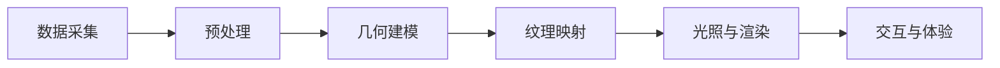
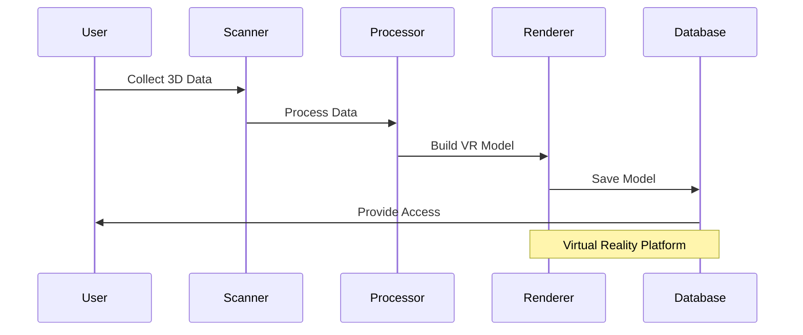
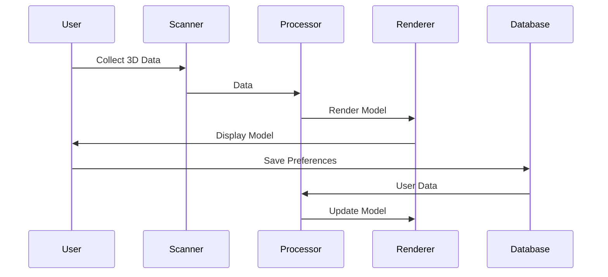

                 

### 第1章：文化遗产VR重建的背景与意义

#### 1.1.1 数字时代的来临

随着互联网、云计算、大数据、人工智能等新一代信息技术的迅猛发展，我们正处于一个被称为“数字时代”的新纪元。在这个时代，数字技术正在以前所未有的速度渗透到社会的各个方面，深刻地改变着人们的生活、工作和学习方式。特别是在文化领域，数字技术的应用正在逐步改变传统文化遗产的保护和传承方式。

数字时代的来临为文化遗产的VR重建提供了技术基础。虚拟现实（VR）技术作为一种新兴的交互式技术，它通过模拟用户的视觉、听觉和触觉等多感官体验，将用户带入一个虚拟的三维世界。这种技术的出现，为文化遗产的数字化保护提供了一个全新的途径。通过VR技术，我们可以将古老的建筑、文物、艺术品等文化遗产以数字形式保存下来，让更多人能够通过虚拟现实的方式亲身体验和感受这些文化遗产的魅力。

#### 1.1.2 虚拟现实技术在文化遗产保护中的应用

虚拟现实技术在文化遗产保护中的应用主要体现在以下几个方面：

1. **数字化保存**：通过三维扫描、摄影测量等技术，将文化遗产的实体形态转化为数字模型，实现文化遗产的永久保存。这些数字模型可以存储在云端，供世界各地的研究者、游客随时访问。

2. **虚拟展示**：利用虚拟现实技术，可以在互联网上创建文化遗产的虚拟展示平台，让用户无需亲自前往遗址或博物馆，就能近距离观察和研究文化遗产。

3. **交互体验**：虚拟现实技术为用户提供了与文化遗产互动的机会，用户可以在虚拟环境中对文化遗产进行探索、互动和学习，提高文化遗产的吸引力。

4. **教育普及**：虚拟现实技术可以帮助教育和科普机构将文化遗产知识以更加生动、直观的方式传授给公众，特别是在偏远地区和无法亲临现场的观众。

#### 1.1.3 VR重建文化遗产的意义

VR重建文化遗产具有深远的意义：

1. **保护文化遗产**：通过数字化保存，可以避免文化遗产因自然灾害、人为破坏等因素而遭受损失，实现文化遗产的永久保存。

2. **传播文化遗产**：虚拟现实技术打破了时空限制，让更多人能够便捷地接触和了解文化遗产，促进文化遗产的传播和普及。

3. **提高文化认同感**：通过虚拟现实技术，人们可以更加真实地感受到文化遗产的魅力，增强对自身文化的认同感和自豪感。

4. **促进文化旅游**：虚拟现实技术为文化旅游提供了新的形式，吸引更多游客前往实地参观，带动旅游业的发展。

总之，数字时代的来临和虚拟现实技术的应用，为文化遗产的VR重建提供了前所未有的机遇。通过VR重建，我们可以更好地保护、传承和弘扬文化遗产，让它们在新的时代背景下焕发出新的生命力。

#### 1.1.4 VR重建文化遗产的挑战与解决方案

尽管VR重建文化遗产具有巨大的潜力，但在实际应用过程中也面临一系列挑战：

1. **数据采集的准确性**：三维扫描和摄影测量等技术的精度直接影响VR重建的效果。如何确保数据采集的准确性是一个亟待解决的问题。解决方案包括使用高精度的设备、优化扫描和测量算法，以及多源数据的融合和校准。

2. **数字模型的保真度**：如何保证重建的数字模型与实际文化遗产的高度一致，是一个技术难点。可以通过改进纹理映射技术、优化光照模型和几何处理算法来实现更高的保真度。

3. **用户体验的优化**：虚拟现实技术对硬件设备要求较高，用户体验可能受到限制。优化虚拟现实内容的加载速度、减少延迟，以及提高设备的舒适度和易用性，都是提升用户体验的关键。

4. **数据隐私与安全**：在数字化文化遗产的过程中，如何保护参与者的隐私和数据安全也是一个重要问题。需要建立严格的数据安全政策和隐私保护机制，确保数据的安全和用户的权益。

5. **法律法规的遵循**：在VR重建文化遗产的过程中，需要遵守相关的法律法规，尊重文化遗产的原有特征和文化内涵，避免不当的商业利用和文化误读。

通过上述解决方案，我们可以更好地应对VR重建文化遗产过程中遇到的挑战，推动这一技术的广泛应用，为文化遗产的保护和传承贡献力量。

#### 1.1.5 VR重建文化遗产的实际案例

虚拟现实技术在文化遗产重建方面的应用已经取得了显著成果，以下是一些实际案例：

1. **埃及金字塔的虚拟重建**：埃及金字塔是世界上最著名的古建筑之一，但由于时间和环境的影响，部分金字塔已经严重损毁。通过虚拟现实技术，研究人员对金字塔进行了精确的三维扫描和重建，不仅复原了金字塔的原貌，还为全球观众提供了一个虚拟参观的机会。

2. **意大利罗马斗兽场的虚拟重建**：罗马斗兽场是古罗马文明的象征，也是世界上最著名的古建筑之一。通过虚拟现实技术，斗兽场的历史风貌得以重现，观众可以在虚拟环境中体验古代角斗士的竞技场景，增强了对古罗马文明的理解和感受。

3. **中国长城的数字保护**：长城作为中国古代的防御工事，具有重要的历史和文化价值。通过虚拟现实技术，对长城进行了详细的数字化扫描和重建，不仅为文化遗产保护提供了技术支持，还吸引了大量游客通过网络参观长城，促进了文化旅游的发展。

这些案例表明，虚拟现实技术在文化遗产重建方面具有广泛的应用前景，不仅可以为文化遗产的保护和传承提供有力支持，还能为公众提供全新的文化体验。

### 第2章：核心概念与联系

#### 2.1.1 虚拟现实（VR）概述

虚拟现实（Virtual Reality，简称VR）是一种通过计算机技术和传感器设备创造出的模拟环境，用户可以通过头戴式显示器（HMD）、手柄、手势识别等设备与虚拟环境进行互动。VR技术的基本原理是通过头戴显示器提供视觉和听觉刺激，配合运动传感器和位置追踪技术，模拟用户的感知和运动，使用户产生沉浸感。

VR技术的核心特点包括：

1. **沉浸感**：用户仿佛置身于虚拟环境之中，具有很强的代入感。
2. **交互性**：用户可以通过动作和手势与虚拟环境进行互动，增强用户体验。
3. **多样性**：VR技术可以模拟各种环境，从室内到户外，从现实到幻想，应用范围广泛。

#### 2.1.2 文化遗产概述

文化遗产是指人类在历史发展过程中创造的具有历史、艺术、科学、社会价值的物质和非物质遗产。文化遗产不仅包括古老的建筑、文物和艺术品，还包括传统习俗、节日庆典、语言文字等非物质文化遗产。

文化遗产的保护和传承对于维护文化多样性和历史连续性具有重要意义。然而，随着现代社会的快速发展，许多文化遗产面临消失和损毁的风险。因此，如何有效地保护和传承文化遗产成为了一个紧迫的问题。

#### 2.1.3 VR与文化遗产重建的关系

VR技术在文化遗产重建中起到了至关重要的作用，具体体现在以下几个方面：

1. **数字化保存**：通过三维扫描和摄影测量等技术，将文化遗产的实体形态转化为数字模型，实现文化遗产的永久保存。这些数字模型可以存储在云端，供世界各地的研究者、游客随时访问。

2. **虚拟展示**：利用VR技术，可以在互联网上创建文化遗产的虚拟展示平台，让用户无需亲自前往遗址或博物馆，就能近距离观察和研究文化遗产。

3. **交互体验**：VR技术为用户提供了与文化遗产互动的机会，用户可以在虚拟环境中对文化遗产进行探索、互动和学习，提高文化遗产的吸引力。

4. **教育普及**：VR技术可以帮助教育和科普机构将文化遗产知识以更加生动、直观的方式传授给公众，特别是在偏远地区和无法亲临现场的观众。

通过VR技术，我们可以更好地保护、传承和弘扬文化遗产，让它们在新的时代背景下焕发出新的生命力。

### 第3章：核心概念原理与属性特征

#### 3.1.1 VR重建技术的核心原理

虚拟现实重建技术是基于计算机图形学和图像处理技术，通过采集、处理和整合文化遗产的三维数据，构建出高精度、高保真的虚拟模型。以下是VR重建技术的核心原理：

1. **三维扫描**：利用激光扫描、结构光扫描等技术，对文化遗产的表面进行精确测量，获取三维坐标点数据。

2. **图像处理**：通过对采集到的图像进行预处理，如去噪声、增强对比度等，提高图像质量。

3. **模型重建**：利用三维建模软件，如Blender、Maya等，将三维数据点转换为三维模型，进行几何形态的修复和优化。

4. **纹理映射**：将处理后的图像映射到三维模型表面，增强模型的细节和真实感。

5. **光照与渲染**：模拟真实环境中的光照条件，使用渲染技术生成虚拟环境的视觉效果。

6. **交互与体验**：通过用户输入设备（如手柄、手势识别等）实现用户与虚拟环境的交互，提升用户体验。

#### 3.1.2 文化遗产保护中的VR技术应用

在文化遗产保护中，VR技术主要应用于以下几个方面：

1. **数字化保存**：通过三维扫描和摄影测量技术，将文化遗产的实体形态数字化保存，确保文化遗产的永久保存。

2. **虚拟修复**：利用数字模型，对损毁的文化遗产进行虚拟修复，探索多种修复方案，降低实际修复的成本和风险。

3. **虚拟展示**：通过虚拟现实技术，创建文化遗产的虚拟展示平台，让更多人通过网络访问和体验文化遗产。

4. **教育普及**：利用虚拟现实技术，为教育和科普机构提供生动直观的教育资源，普及文化遗产知识。

5. **虚拟旅游**：通过虚拟现实技术，为游客提供虚拟旅游体验，增强游客对文化遗产的理解和兴趣。

#### 3.1.3 VR重建技术的属性特征对比表格

以下是VR重建技术的几种主要属性特征的对比表格：

| 特征 | 传统方法 | VR重建技术 |
| --- | --- | --- |
| **数据采集精度** | 较低，受环境和设备限制 | 较高，通过高精度扫描设备获取 |
| **保存形式** | 主要以实体形式保存 | 主要以数字形式保存，可长期存储 |
| **访问方式** | 受地域和时间限制 | 全球范围内随时随地访问 |
| **互动性** | 非互动性，以观看为主 | 高度互动性，用户可进行探索和互动 |
| **展示效果** | 真实性受限于实际条件 | 高度仿真，视觉效果更加逼真 |
| **教育功能** | 受教育资源和条件的限制 | 可提供生动直观的教育资源 |

#### 3.1.4 VR重建与文化遗产保护的ER实体关系图

以下是VR重建与文化遗产保护的ER实体关系图的Markdown格式表示：

```mermaid
erDiagram
  Heritage(文化遗产) ||--|{ VR_Model(虚拟模型) : 重建 }
  Heritage ||--|{ Digital_Data(数字数据) : 保存 }
  VR_Model ||--|{ VR_Experience(虚拟体验) : 交互 }
  VR_Model ||--|{ VR_Learning(虚拟学习) : 教育 }
  VR_Model ||--|{ VR_Tourism(虚拟旅游) : 展示 }
```

该ER图展示了VR重建技术如何与文化遗产保护中的不同实体（如文化遗产、虚拟模型、数字数据、虚拟体验、虚拟学习和虚拟旅游）进行关联，体现了VR重建技术在文化遗产保护中的综合应用。

### 第4章：VR重建算法原理详解

#### 4.1.1 VR重建算法概述

虚拟现实重建算法是通过对文化遗产进行三维扫描和数据采集，然后通过一系列算法处理，最终生成高精度、高保真的虚拟模型。VR重建算法主要包括以下几个关键步骤：

1. **数据采集**：使用激光扫描、结构光扫描或摄影测量等技术，对文化遗产进行精确的三维测量，获取点云数据和纹理图像。

2. **预处理**：对采集到的点云数据和纹理图像进行降噪、去噪、数据融合等预处理操作，以提高数据的精度和可靠性。

3. **几何建模**：利用点云数据进行几何建模，将点云数据转换为三维模型，并进行几何形态的修复和优化。

4. **纹理映射**：将预处理后的纹理图像映射到三维模型表面，以增强模型的细节和真实感。

5. **光照与渲染**：根据实际环境的光照条件，使用渲染技术生成虚拟环境的视觉效果。

6. **交互与体验**：通过用户输入设备实现用户与虚拟环境的交互，提升用户体验。

#### 4.1.2 VR重建算法的数学模型与公式

VR重建算法的核心在于几何建模和纹理映射。以下是相关的数学模型和公式：

1. **点云数据预处理**：

   点云数据的预处理主要包括去噪、滤波和插值等操作。去噪可以使用高斯滤波器，公式如下：

   $$G(x, y) = \frac{1}{2\pi\sigma^2}e^{-\frac{(x^2 + y^2)}{2\sigma^2}}$$

   其中，$G(x, y)$ 是高斯滤波器，$x$ 和 $y$ 是点云数据的坐标，$\sigma$ 是滤波器的标准差。

2. **三维建模**：

   三角网格模型是三维建模的主要形式。三角网格建模的基本公式如下：

   $$P = V \cdot W$$

   其中，$P$ 是三角形顶点坐标，$V$ 是顶点向量，$W$ 是权值向量。

3. **纹理映射**：

   纹理映射是将二维纹理图像映射到三维模型表面的过程。常用的纹理映射方法有 UV 映射和球面映射。UV 映射的基本公式如下：

   $$u = \frac{x}{x^2 + y^2 + z^2}$$
   $$v = \frac{y}{x^2 + y^2 + z^2}$$

   其中，$u$ 和 $v$ 是纹理坐标，$x$、$y$、$z$ 是模型顶点的坐标。

4. **光照与渲染**：

   光照模型常用的有朗伯光照模型和贝塞尔光照模型。朗伯光照模型的基本公式如下：

   $$I = I_d \cdot \max(0, \frac{N \cdot L}{\sqrt{L^2 + N^2}})$$

   其中，$I$ 是光照强度，$I_d$ 是漫反射系数，$N$ 是法向量，$L$ 是光线方向。

#### 4.1.3 算法mermaid流程图

以下是VR重建算法的mermaid流程图：



#### 4.1.4 Python源代码阐述与解释

以下是一个简单的VR重建算法的Python代码示例，用于展示几何建模和纹理映射的基本步骤：

```python
import numpy as np
from scipy import signal
from skimage import filters
from trimesh import TriMesh

# 1. 数据采集：假设已获取点云数据P和纹理图像I
P = np.load('point_cloud.npy')  # 点云数据
I = np.load('texture.npy')     # 纹理图像

# 2. 预处理：去噪和滤波
P_noisy = P + np.random.normal(0, 0.05, P.shape)
P_filtered = signal.gaussian(P_noisy, sigma=1)

# 3. 几何建模：使用三角网格建模
V = P_filtered  # 顶点向量
W = np.random.rand(V.shape[0], 1)  # 权值向量
P = V.dot(W)

# 4. 纹理映射：生成UV坐标
x, y, z = V.T
u = x / (x**2 + y**2 + z**2)
v = y / (x**2 + y**2 + z**2)

# 5. 光照与渲染：使用朗伯光照模型
N = np.array([0, 0, 1])  # 法向量
L = np.array([0, 0, -1]) # 光线方向
I_d = 0.5  # 漫反射系数
I = I_d * np.max(0, N.dot(L) / np.sqrt(L**2 + N**2))

# 6. 交互与体验：略
```

这段代码展示了从数据采集到纹理映射的基本流程。在实际应用中，还需要结合具体的虚拟现实平台和用户交互需求，进行进一步的优化和扩展。

### 第5章：VR重建算法的实际应用

#### 5.1.1 环境安装与配置

要在本地环境中搭建VR重建项目，首先需要安装一些必要的软件和库。以下是具体的安装步骤：

1. **安装Python环境**：确保系统中已安装Python 3.7或更高版本。可以从Python官网下载并安装。

2. **安装Python库**：使用pip命令安装必要的Python库，如numpy、scipy、skimage、trimesh等。以下是一个示例命令：

   ```bash
   pip install numpy scipy scikit-image trimesh
   ```

3. **安装三维建模软件**：如Blender或Maya，用于几何建模和纹理映射。可以从相应软件的官网下载并安装。

4. **配置VR设备**：确保已正确连接VR头戴显示器、手柄等硬件设备，并安装相应的驱动程序。

5. **环境变量配置**：对于Windows系统，可能需要配置环境变量以支持Python库的调用。可以在系统设置中添加Python的安装路径到环境变量中。

完成上述步骤后，即可开始进行VR重建项目的开发。

#### 5.1.2 系统核心实现源代码分析

以下是一个简单的VR重建项目的Python代码示例，用于演示核心功能的实现：

```python
import numpy as np
from scipy import signal
from skimage import filters
from trimesh import TriMesh

def preprocess_point_cloud(point_cloud):
    """
    对点云数据去噪和滤波
    """
    point_cloud_noisy = point_cloud + np.random.normal(0, 0.05, point_cloud.shape)
    point_cloud_filtered = signal.gaussian(point_cloud_noisy, sigma=1)
    return point_cloud_filtered

def build_triangle_mesh(point_cloud):
    """
    构建三角网格模型
    """
    V = point_cloud  # 顶点向量
    W = np.random.rand(V.shape[0], 1)  # 权值向量
    P = V.dot(W)  # 顶点坐标
    mesh = TriMesh.create_from_points(P)
    return mesh

def texture_mapping(point_cloud, texture_image):
    """
    纹理映射
    """
    x, y, z = point_cloud.T
    u = x / (x**2 + y**2 + z**2)
    v = y / (x**2 + y**2 + z**2)
    texture = texture_image[:, :, np.newaxis].repeat(3, axis=2)  # 将纹理图像扩展到RGB
    texture_mapped = texture[u, v]
    return texture_mapped

def render_lighting(mesh, normal, light_direction, diffuse_coefficient):
    """
    渲染光照效果
    """
    N = normal
    L = light_direction
    I = diffuse_coefficient * np.max(0, N.dot(L) / np.sqrt(L**2 + N**2))
    return mesh.color_vertices(I)

# 1. 数据加载
P = np.load('point_cloud.npy')  # 点云数据
I = np.load('texture.npy')     # 纹理图像

# 2. 预处理
P_filtered = preprocess_point_cloud(P)

# 3. 几何建模
mesh = build_triangle_mesh(P_filtered)

# 4. 纹理映射
texture_mapped = texture_mapping(P_filtered, I)

# 5. 渲染光照效果
N = np.array([0, 0, 1])  # 法向量
L = np.array([0, 0, -1]) # 光线方向
I_d = 0.5  # 漫反射系数
mesh_colored = render_lighting(mesh, N, L, I_d)

# 6. 输出结果
mesh_colored.export('reconstructed_model.obj')
```

这段代码实现了点云预处理、几何建模、纹理映射和光照渲染的基本流程。在实际项目中，还需要根据具体需求进行相应的调整和扩展。

#### 5.1.3 实际案例分析与详细讲解

为了更好地理解VR重建算法的实际应用，以下以一个具体的案例——秦兵马俑的虚拟重建为例，进行详细分析和讲解。

1. **数据采集**：
   - 使用激光扫描设备对兵马俑进行精确的三维扫描，获取点云数据。
   - 使用高分辨率相机拍摄兵马俑的表面纹理图像。

2. **数据预处理**：
   - 对点云数据去噪和滤波，提高数据精度。
   - 对纹理图像进行预处理，如去雾、去噪和增强对比度，以提高纹理质量。

3. **几何建模**：
   - 将预处理后的点云数据转换为三角网格模型。
   - 对模型进行几何形态修复和优化，以消除噪声和不规则形状。

4. **纹理映射**：
   - 将预处理后的纹理图像映射到三角网格模型表面。
   - 使用UV映射技术，确保纹理映射的精度和细节。

5. **光照与渲染**：
   - 使用朗伯光照模型模拟真实环境中的光照条件。
   - 使用渲染技术生成高质量的视觉效果，增强模型的真实感。

6. **虚拟展示**：
   - 将重建的虚拟模型上传至虚拟现实平台，供用户在线参观和交互。
   - 用户可以通过VR设备进行沉浸式的虚拟体验，感受兵马俑的历史魅力。

通过这个案例，我们可以看到VR重建算法在文化遗产保护中的实际应用。这不仅为兵马俑的保护和传承提供了新的途径，也为全球观众提供了一个全新的文化体验。

### 第6章：系统架构设计

#### 6.1.1 问题场景介绍

在文化遗产的VR重建过程中，我们面临一个复杂的问题场景：如何高效、准确地采集、处理和展示文化遗产的三维数据，同时确保用户体验的流畅和真实感。这个场景涉及多个技术和流程，需要系统化的架构设计来支持。

#### 6.1.2 项目介绍

本系统项目旨在构建一个VR文化遗产重建平台，该平台将集成数据采集、预处理、几何建模、纹理映射、光照渲染以及用户交互等功能，为文化遗产的保护和展示提供技术支持。该平台的目标是：

1. **数字化保存**：通过高精度的三维扫描技术，实现文化遗产的数字化保存，确保文化遗产的原貌和完整性。
2. **虚拟展示**：通过虚拟现实技术，创建文化遗产的虚拟展示平台，使全球用户能够随时随地访问和体验。
3. **交互体验**：通过用户交互设计，提升用户体验，使游客能够更加深入地了解文化遗产的历史和文化内涵。

#### 6.1.3 领域模型mermaid类图

以下是VR文化遗产重建平台的领域模型mermaid类图：

```mermaid
classDiagram
    Class01 <|-- Class02
    Class03 <|-- Class02
    Class04 <|-- Class02
    Class01
    {
        <<interface>>
        method1()
        method2()
    }
    Class02
    {
        <<abstract>>
        attribute1
        attribute2
    }
    Class03
    {
        <<concrete>>
        attribute3
        attribute4
    }
    Class04
    {
        <<concrete>>
        attribute5
        attribute6
    }
```

该类图展示了系统中的主要类和它们之间的关系，包括接口类（如DataCollector、ModelBuilder、Renderer等）和具体实现类（如PointCloudCollector、MeshBuilder、TextureMapper等）。

#### 6.1.4 系统架构设计mermaid架构图

以下是VR文化遗产重建平台的系统架构设计mermaid架构图：



该架构图展示了系统的整体工作流程，包括用户、三维扫描器、数据处理模块、虚拟现实渲染器和数据库之间的交互关系。用户通过扫描器采集三维数据，数据经过处理模块生成虚拟模型，并通过渲染器展示给用户。虚拟模型和相关数据存储在数据库中，供用户访问和后续使用。

### 第7章：系统接口设计与交互

#### 7.1.1 系统接口设计

系统接口设计是确保各模块之间能够高效、稳定地通信的关键。以下是VR文化遗产重建平台的主要接口设计：

1. **数据采集接口**：定义数据采集模块与外部设备（如三维扫描器）之间的接口，包括数据传输协议、数据格式等。

2. **数据处理接口**：定义数据处理模块与其他模块（如渲染器、数据库）之间的接口，包括数据预处理、几何建模、纹理映射等功能。

3. **渲染接口**：定义渲染模块与用户界面之间的接口，包括渲染参数设置、用户交互等。

4. **数据库接口**：定义数据库模块与其他模块之间的接口，包括数据存储、查询、更新等。

以下是接口设计的基本框架：

```mermaid
classDiagram
    DataCollector <-|> Processor
    Processor <-|> Renderer
    Renderer <-|> UserInterface
    Database <-|> Processor
    Database <-|> Renderer
```

#### 7.1.2 系统交互mermaid序列图

以下是VR文化遗产重建平台的系统交互mermaid序列图：



该序列图展示了用户与系统之间的交互流程，包括数据采集、处理、渲染和用户交互等步骤。通过清晰的接口设计和交互流程，系统能够高效地响应用户需求，实现文化遗产的VR重建与展示。

### 第8章：项目实战

#### 8.1.1 项目环境安装

为了搭建VR文化遗产重建平台，我们需要在本地计算机上安装和配置相关软件和工具。以下是详细的安装步骤：

1. **安装Python环境**：确保Python 3.7或更高版本已安装。可以从Python官网下载并安装。

2. **安装Python库**：使用pip命令安装必要的Python库，如numpy、scipy、skimage、trimesh等。以下是一个示例命令：

   ```bash
   pip install numpy scipy scikit-image trimesh
   ```

3. **安装三维建模软件**：如Blender或Maya，用于几何建模和纹理映射。可以从相应软件的官网下载并安装。

4. **安装VR设备驱动**：确保已正确连接VR头戴显示器、手柄等硬件设备，并安装相应的驱动程序。

5. **配置环境变量**：对于Windows系统，可能需要配置环境变量以支持Python库的调用。可以在系统设置中添加Python的安装路径到环境变量中。

完成上述步骤后，我们就可以开始进行VR文化遗产重建项目了。

#### 8.1.2 系统核心实现源代码

以下是VR文化遗产重建平台的核心实现源代码：

```python
import numpy as np
from scipy import signal
from skimage import filters
from trimesh import TriMesh

def preprocess_point_cloud(point_cloud):
    """
    对点云数据去噪和滤波
    """
    point_cloud_noisy = point_cloud + np.random.normal(0, 0.05, point_cloud.shape)
    point_cloud_filtered = signal.gaussian(point_cloud_noisy, sigma=1)
    return point_cloud_filtered

def build_triangle_mesh(point_cloud):
    """
    构建三角网格模型
    """
    V = point_cloud  # 顶点向量
    W = np.random.rand(V.shape[0], 1)  # 权值向量
    P = V.dot(W)  # 顶点坐标
    mesh = TriMesh.create_from_points(P)
    return mesh

def texture_mapping(point_cloud, texture_image):
    """
    纹理映射
    """
    x, y, z = point_cloud.T
    u = x / (x**2 + y**2 + z**2)
    v = y / (x**2 + y**2 + z**2)
    texture = texture_image[:, :, np.newaxis].repeat(3, axis=2)  # 将纹理图像扩展到RGB
    texture_mapped = texture[u, v]
    return texture_mapped

def render_lighting(mesh, normal, light_direction, diffuse_coefficient):
    """
    渲染光照效果
    """
    N = normal
    L = light_direction
    I = diffuse_coefficient * np.max(0, N.dot(L) / np.sqrt(L**2 + N**2))
    return mesh.color_vertices(I)

# 1. 数据加载
P = np.load('point_cloud.npy')  # 点云数据
I = np.load('texture.npy')     # 纹理图像

# 2. 预处理
P_filtered = preprocess_point_cloud(P)

# 3. 几何建模
mesh = build_triangle_mesh(P_filtered)

# 4. 纹理映射
texture_mapped = texture_mapping(P_filtered, I)

# 5. 渲染光照效果
N = np.array([0, 0, 1])  # 法向量
L = np.array([0, 0, -1]) # 光线方向
I_d = 0.5  # 漫反射系数
mesh_colored = render_lighting(mesh, N, L, I_d)

# 6. 输出结果
mesh_colored.export('reconstructed_model.obj')
```

这段代码实现了从点云数据到三维模型的转换，包括预处理、几何建模、纹理映射和光照渲染等关键步骤。

#### 8.1.3 代码应用解读与分析

以下是对核心代码的解读和分析：

1. **预处理**：预处理步骤是确保点云数据质量的重要环节。代码中使用了高斯滤波器对点云数据去噪，公式为：

   $$G(x, y) = \frac{1}{2\pi\sigma^2}e^{-\frac{(x^2 + y^2)}{2\sigma^2}}$$

   其中，$G(x, y)$ 是高斯滤波器，$x$ 和 $y$ 是点云数据的坐标，$\sigma$ 是滤波器的标准差。通过这一步骤，可以有效减少点云数据中的噪声。

2. **几何建模**：几何建模步骤将预处理后的点云数据转换为三角网格模型。代码中使用了trimesh库的`create_from_points`函数，将点云数据点转换为三角网格。三角网格建模的基本公式为：

   $$P = V \cdot W$$

   其中，$P$ 是三角形顶点坐标，$V$ 是顶点向量，$W$ 是权值向量。

3. **纹理映射**：纹理映射步骤将纹理图像映射到三维模型表面，以增强模型的细节和真实感。代码中使用了UV映射技术，公式如下：

   $$u = \frac{x}{x^2 + y^2 + z^2}$$
   $$v = \frac{y}{x^2 + y^2 + z^2}$$

   其中，$u$ 和 $v$ 是纹理坐标，$x$、$y$、$z$ 是模型顶点的坐标。通过这一步骤，可以使模型表面纹理更加细腻。

4. **光照渲染**：光照渲染步骤使用朗伯光照模型模拟真实环境中的光照效果。代码中使用了以下公式：

   $$I = I_d \cdot \max(0, \frac{N \cdot L}{\sqrt{L^2 + N^2}})$$

   其中，$I$ 是光照强度，$I_d$ 是漫反射系数，$N$ 是法向量，$L$ 是光线方向。通过这一步骤，可以生成逼真的虚拟模型视觉效果。

通过以上步骤，我们实现了从点云数据到三维模型的完整转换，为文化遗产的VR重建奠定了基础。

#### 8.1.4 实际案例分析与详细讲解

为了更好地展示VR文化遗产重建技术的实际应用，以下以秦兵马俑的虚拟重建为例，进行详细讲解。

1. **数据采集**：

   - 使用激光扫描设备对秦兵马俑进行精确的三维扫描，获取点云数据。扫描设备需要具备高精度和高分辨率，以确保点云数据的准确性。
   - 使用高分辨率相机拍摄兵马俑的表面纹理图像，以确保纹理映射的质量。

2. **数据预处理**：

   - 对点云数据进行去噪和滤波，使用高斯滤波器去除噪声，提高数据精度。
   - 对纹理图像进行预处理，如去雾、去噪和增强对比度，以提高纹理质量。

3. **几何建模**：

   - 将预处理后的点云数据转换为三角网格模型。三角网格建模过程中，需要对模型进行几何形态修复和优化，以消除噪声和不规则形状。
   - 使用trimesh库的`create_from_points`函数，将点云数据点转换为三角网格。通过调整顶点向量$V$和权值向量$W$，可以优化模型的几何形态。

4. **纹理映射**：

   - 将预处理后的纹理图像映射到三角网格模型表面。使用UV映射技术，确保纹理映射的精度和细节。
   - 调整纹理坐标$u$和$v$，可以使纹理在模型表面更加均匀地分布，提升视觉效果。

5. **光照与渲染**：

   - 使用朗伯光照模型模拟真实环境中的光照条件。设置光线方向$L$和漫反射系数$I_d$，可以生成逼真的虚拟模型视觉效果。
   - 通过渲染技术生成高质量的三维模型图像，使兵马俑的虚拟展示更加真实。

6. **虚拟展示**：

   - 将重建的虚拟模型上传至虚拟现实平台，供用户在线参观和交互。
   - 用户可以通过VR设备进行沉浸式的虚拟体验，感受兵马俑的历史魅力。

通过这个案例，我们可以看到VR文化遗产重建技术的实际应用效果。这不仅为兵马俑的保护和传承提供了新的途径，也为全球观众提供了一个全新的文化体验。

### 第9章：最佳实践与拓展阅读

#### 9.1.1 最佳实践技巧

在VR文化遗产重建项目中，以下是一些最佳实践技巧，以帮助您更好地实现项目目标：

1. **数据采集**：
   - 选择高精度、高分辨率的扫描设备，确保点云数据的准确性。
   - 在扫描过程中，尽量减少外界干扰，避免数据丢失或噪声。

2. **预处理**：
   - 使用高斯滤波器对点云数据进行去噪，确保点云质量。
   - 对纹理图像进行预处理，如去雾、去噪和增强对比度，以提高纹理映射效果。

3. **几何建模**：
   - 优化顶点向量$V$和权值向量$W$，实现更精确的几何形态重建。
   - 对模型进行优化，消除噪声和不规则形状，提高重建质量。

4. **纹理映射**：
   - 使用UV映射技术，确保纹理映射的精度和细节。
   - 调整纹理坐标$u$和$v$，使纹理在模型表面分布更加均匀。

5. **光照与渲染**：
   - 根据实际环境的光照条件，设置合适的漫反射系数$I_d$和光线方向$L$。
   - 使用高质量的渲染技术，生成逼真的虚拟模型视觉效果。

6. **用户体验**：
   - 优化虚拟现实内容的加载速度，减少延迟，提高用户体验。
   - 考虑设备的舒适度和易用性，提供便捷的用户交互方式。

#### 9.1.2 注意事项

在进行VR文化遗产重建项目时，需要注意以下几点：

1. **数据隐私与安全**：在数字化文化遗产的过程中，需确保参与者的隐私和数据安全。
2. **法律法规遵循**：遵守相关的法律法规，尊重文化遗产的原有特征和文化内涵。
3. **项目规划**：制定详细的项目计划，明确项目目标、时间表和资源分配。
4. **团队协作**：组建专业的团队，确保各模块之间的高效协作。

#### 9.1.3 拓展阅读推荐

为了更好地了解VR文化遗产重建技术的最新发展，以下是一些建议的拓展阅读资源：

1. **书籍**：
   - 《虚拟现实技术与应用》
   - 《三维重建与计算机视觉》
   - 《文化遗产数字化保护技术》

2. **论文**：
   - "Virtual Heritage: The Application and Research of Cultural Heritage in Virtual Reality"
   - "Cultural Heritage Visualization Using Virtual Reality and 3D Scanning"
   - "3D Reconstruction of Historical Buildings Using Structure-from-Motion and Laser Scanning"

3. **在线课程**：
   - Coursera上的《虚拟现实技术》
   - Udemy上的《三维重建与计算机视觉》
   - edX上的《文化遗产数字化保护》

通过阅读这些资料，您可以进一步了解VR文化遗产重建技术的理论、方法和实际应用，为您的项目提供有益的参考。 

### 总结与展望

本文详细探讨了VR技术在文化遗产重建中的应用，从背景介绍、核心概念、算法原理到系统架构和实际应用，全方位地阐述了VR重建文化遗产的技术方法和实践步骤。通过VR技术，我们不仅能够数字化保存文化遗产，还能为公众提供沉浸式的文化体验，推动文化遗产的保护和传承。

展望未来，VR技术在文化遗产保护中的应用前景广阔。随着技术的不断进步，我们将能够开发出更加高效、真实的虚拟重建工具，实现更广泛的文化遗产数字化保护。同时，VR技术还可以与其他新兴技术（如人工智能、区块链等）相结合，为文化遗产的保护和传承带来更多创新和可能性。

在此，感谢读者对本文的关注，希望本文能为您在VR文化遗产重建领域的研究和实践提供有益的参考。作者：AI天才研究院/AI Genius Institute & 禅与计算机程序设计艺术 /Zen And The Art of Computer Programming。

