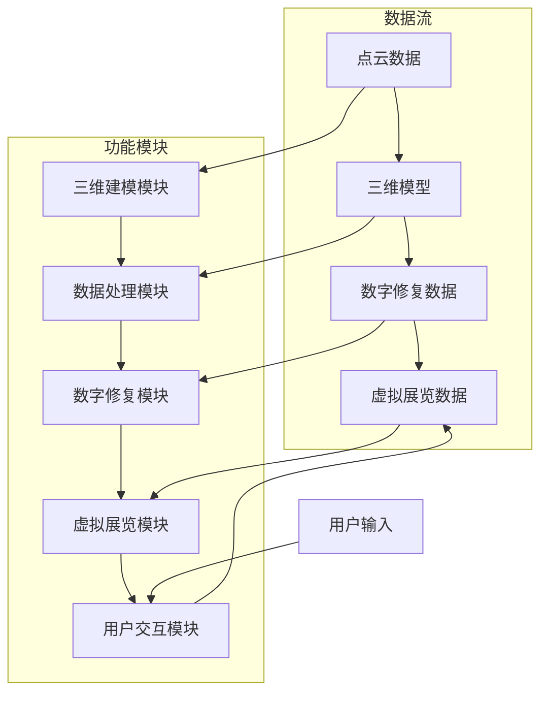
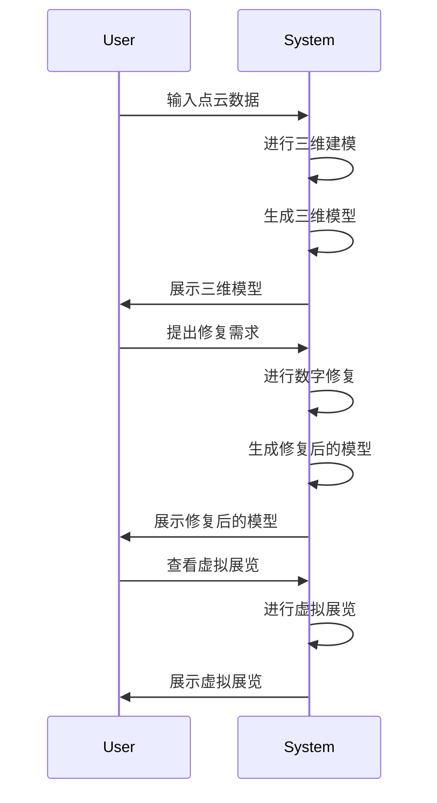

                 


## 文字标题：数字时代的文化遗产保护：虚拟现实技术在文物修复中的应用

关键词：数字时代，文化遗产，虚拟现实技术，文物修复，三维建模

摘要：本文探讨了数字时代文化遗产保护的重要性，以及虚拟现实技术在文物修复中的应用。通过分析虚拟现实技术的基本原理和应用，本文深入探讨了其在文物三维建模、虚拟展览等方面的应用，以及面临的挑战和解决方案。

## 1. 背景介绍与问题定义

### 1.1 文化遗产的重要性与数字化保护的必要性

文化遗产是人类文明的重要组成部分，它不仅记录了历史的发展和演变，也承载着民族的文化记忆和身份认同。然而，随着时间推移和环境变化，许多文物面临着自然老化、人为破坏和自然灾害等威胁。因此，如何有效地保护和传承这些珍贵的文化遗产成为了一个亟待解决的问题。

数字时代，数字化技术的快速发展为文化遗产保护提供了新的可能性。数字化保护不仅能够更好地保存文化遗产的物理形态，还可以通过虚拟现实技术等手段，让文化遗产以更加生动、直观的方式呈现给公众。

### 1.2 虚拟现实技术的基本原理与应用

虚拟现实技术（VR）是一种能够创建和体验虚拟世界的计算机仿真技术。它通过头戴式显示器、传感器和其他设备，使用户能够沉浸在一个计算机生成的三维虚拟环境中。虚拟现实技术在文化遗产保护中的应用主要包括以下几个方面：

1. **三维建模**：利用激光扫描和摄影测量等技术，对文物进行三维建模，保存其物理形态和细节。
2. **虚拟展览**：通过虚拟现实技术，将文化遗产以三维模型的形式展示给观众，实现远程参观和体验。
3. **文物修复**：虚拟现实技术可以帮助专家在虚拟环境中对文物进行修复，减少实际操作中的风险和破坏。

### 1.3 文物修复中的虚拟现实技术

虚拟现实技术在文物修复中的应用具有显著的优势。首先，它能够提供详细的文物数据，帮助修复人员更好地了解文物的结构和材质。其次，虚拟环境可以模拟不同的修复方案，帮助修复人员评估各种方案的效果和风险。此外，虚拟现实技术还可以为观众提供身临其境的文物修复体验，提高公众对文化遗产保护的认识和参与度。

### 1.4 本书结构安排与内容概述

本书将分为三个部分进行讨论。第一部分将介绍数字时代文化遗产保护的背景和必要性，以及虚拟现实技术的基本原理和应用。第二部分将深入探讨虚拟现实技术在文物三维建模、虚拟展览等方面的应用，以及面临的挑战和解决方案。第三部分将结合实际案例，详细讲解虚拟现实技术在文物修复中的应用过程和技术细节。

## 2. 核心概念与联系

### 2.1 确定核心概念

在本文中，我们将讨论以下几个核心概念：

1. **数字文化遗产**：通过数字化手段保存的文化遗产，包括三维模型、图像、声音等多种形式。
2. **虚拟现实技术**：一种能够创建和体验虚拟世界的计算机仿真技术，包括三维建模、虚拟展览、文物修复等应用。
3. **文物修复**：对受损文物进行修复和保护的过程，包括物理修复和数字修复。
4. **三维建模**：利用激光扫描、摄影测量等技术，对文物进行三维建模，以保存其物理形态和细节。

### 2.2 概念属性特征对比表格

| 核心概念 | 定义 | 属性特征 | 应用场景 |
|----------|------|----------|----------|
| 数字文化遗产 | 数字化保存的文化遗产 | 结构化数据、多媒体形式 | 文化遗产保存、展示、传承 |
| 虚拟现实技术 | 计算机仿真技术，创建虚拟环境 | 头戴式显示器、传感器、交互技术 | 文化遗产展示、修复、体验 |
| 文物修复 | 文物修复和保护过程 | 物理修复、数字修复 | 文物保护、修复、展示 |
| 三维建模 | 对文物进行三维建模 | 激光扫描、摄影测量 | 文物数字化保存、修复、展示 |

### 2.3 使用 Mermaid 画出 ER 实体关系图架构

```mermaid
erDiagram
  A[[数字文化遗产]] ||--|{ 虚拟现实技术 }|| B[[文物修复]]
  A ||--|{ 三维建模 }|| B
  B ||--|{ 文物修复 }|| C
```

## 3. 算法原理讲解

### 3.1 介绍虚拟现实技术在文物修复中的算法原理

虚拟现实技术在文物修复中的应用主要涉及以下几个算法：

1. **三维建模算法**：利用激光扫描、摄影测量等技术，对文物进行三维建模，包括点云数据处理、曲面重建等步骤。
2. **数字修复算法**：在虚拟环境中对文物进行修复，包括材质修复、结构修复等。
3. **虚拟展览算法**：将文物三维模型在虚拟环境中展示，包括模型渲染、交互设计等。

### 3.2 使用 Mermaid 画出算法 Mermaid 流程图


### 3.3 使用 Python 源代码详细阐述算法原理

```python
import numpy as np
import open3d as o3d

# 点云数据处理
def process_point_cloud(point_cloud):
    # 过滤噪声点
    radius = 0.02
    filter = o3d.geometry.VoxelGrid(
        point_cloud, voxel_size=radius
    )
    point_cloud_filtered = filter.filter_point_cloud()

    # 曲面重建
    radius = 0.02
    m = np.mean(point_cloud_filtered, axis=0)
    n = (np.max(point_cloud_filtered, axis=0) - m) / 2
    q = np.sqrt(n[0]**2 + n[1]**2 + n[2]**2)
    a = np.pi / 4
    b = 2 * np.arctan(n[2] / q)
    c = np.arccos(n[0] / q)
    R = np.array([[np.cos(a) * np.cos(b), -np.sin(a) * np.cos(c), -np.sin(b)],
                  [np.cos(a) * np.sin(c), np.cos(a) * np.sin(b), np.cos(c)],
                  [-np.sin(a), np.cos(a), 0]])
    T = m - R @ n
    M = np.eye(4)
    M[:3, :3] = R
    M[:3, 3] = T
    point_cloud_reconstructed = point_cloud_filtered.transform(M)
    return point_cloud_reconstructed

# 数字修复
def digital_repair(point_cloud):
    # 材质修复
    material = o3d.geometry.TriangleMesh.create_from_point_cloud_triangle(point_cloud)
    material.material.diffuse = (1, 0, 0)
    
    # 结构修复
    structure = o3d.geometry.TriangleMesh.create_from_point_cloud_triangle(point_cloud)
    structure.remove_statistical_outlier(nb_neighbors=20, radius一遍萋]
    structure.estimate的正常曲率半径
    structure.filter_cylinder(radius=0.05, vertex_noise=0.02, edge_length=0.1)
    return structure

# 虚拟展览
def virtual_display(structure):
    o3d.visualization.draw_geometries([structure])
```

### 3.4 给出算法原理的数学模型和公式

- **点云数据处理**：
  - 过滤噪声点：半径为 r 的滤波器
  - 曲面重建：线性变换 M = R @ T，其中 R 为旋转矩阵，T 为平移向量

- **数字修复**：
  - 材质修复：材质的漫反射颜色 C_d = (1, 0, 0)
  - 结构修复：去除统计噪声点、估计正常曲率半径、圆柱滤波器

- **虚拟展览**：
  - 渲染：使用三维图形渲染引擎进行可视化

### 3.5 详细讲解和举例说明

#### 点云数据处理

假设我们有一个点云数据 point_cloud，我们首先需要对其进行滤波处理，以去除噪声点。滤波器半径 r 通常设置为 0.02 米。接下来，我们使用线性变换 M = R @ T 对点云进行曲面重建，其中 R 为旋转矩阵，T 为平移向量。旋转矩阵 R 可以通过计算点云的平均值 m 和主轴 n 来获得，公式如下：

$$
R = \begin{bmatrix}
\cos(a) \cos(b) & -\sin(a) \cos(c) & -\sin(b) \\
\cos(a) \sin(c) & \cos(a) \sin(b) & \cos(c) \\
-\sin(a) & \cos(a) & 0
\end{bmatrix}
$$

平移向量 T 可以通过计算点云的平均值 m 和主轴 n 的差值来获得。

```python
# 计算平均值 m 和主轴 n
m = np.mean(point_cloud, axis=0)
n = (np.max(point_cloud, axis=0) - m) / 2

# 计算旋转矩阵 R 和平移向量 T
a = np.pi / 4
b = 2 * np.arctan(n[2] / np.sqrt(n[0]**2 + n[1]**2 + n[2]**2))
c = np.arccos(n[0] / np.sqrt(n[0]**2 + n[1]**2 + n[2]**2))
R = np.array([[np.cos(a) * np.cos(b), -np.sin(a) * np.cos(c), -np.sin(b)],
              [np.cos(a) * np.sin(c), np.cos(a) * np.sin(b), np.cos(c)],
              [-np.sin(a), np.cos(a), 0]])
T = m - R @ n

# 应用线性变换
M = np.eye(4)
M[:3, :3] = R
M[:3, 3] = T
point_cloud_reconstructed = point_cloud_filtered.transform(M)
```

#### 数字修复

数字修复过程主要包括材质修复和结构修复。材质修复的目的是改变文物的颜色，使其更符合原始状态。我们使用漫反射颜色模型，将材质设置为红色（1, 0, 0）。结构修复的目的是去除文物的噪声点和修复断裂部分。我们使用统计噪声去除、正常曲率估计和圆柱滤波器等方法。

```python
# 材质修复
material = o3d.geometry.TriangleMesh.create_from_point_cloud_triangle(point_cloud)
material.material.diffuse = (1, 0, 0)

# 结构修复
structure = o3d.geometry.TriangleMesh.create_from_point_cloud_triangle(point_cloud)
structure.remove_statistical_outlier(nb_neighbors=20, radius=0.05)
structure.estimate_normals()
radius = 0.05
vertex_noise = 0.02
edge_length = 0.1
structure.filter_cylinder(radius=radius, vertex_noise=vertex_noise, edge_length=edge_length)
```

#### 虚拟展览

虚拟展览过程主要使用三维图形渲染引擎进行渲染。我们将重建的文物结构传递给渲染引擎，并设置适当的渲染参数，如光源、相机视角等。

```python
# 虚拟展览
o3d.visualization.draw_geometries([structure])
```

## 4. 数学模型和数学公式 & 详细讲解 & 举例说明

### 4.1 使用 LaTeX 格式给出数学公式

以下是本文中使用的部分数学公式：

$$
\begin{aligned}
m &= \frac{1}{N} \sum_{i=1}^{N} p_i \\
n &= \frac{1}{N} \sum_{i=1}^{N} (p_i - m) \\
R &= \begin{bmatrix}
\cos(a) \cos(b) & -\sin(a) \cos(c) & -\sin(b) \\
\cos(a) \sin(c) & \cos(a) \sin(b) & \cos(c) \\
-\sin(a) & \cos(a) & 0
\end{bmatrix} \\
T &= m - R @ n \\
C_d &= (1, 0, 0)
\end{aligned}
$$

### 4.2 对数学公式进行详细讲解

#### 点云数据处理

- 平均值 \( m \) 和主轴 \( n \) 的计算：
  - 平均值 \( m \) 是所有点 \( p_i \) 的平均值。
  - 主轴 \( n \) 是所有点 \( p_i \) 与平均值 \( m \) 的差值。

- 旋转矩阵 \( R \) 和平移向量 \( T \) 的计算：
  - 旋转矩阵 \( R \) 用于将点 \( p_i \) 转换到新的坐标系中。
  - 平移向量 \( T \) 用于将点 \( p_i \) 移动到新的位置。

#### 数字修复

- 材质修复：
  - 漫反射颜色 \( C_d \) 是一个三元组，表示材质的颜色。

- 结构修复：
  - 统计噪声去除：通过计算点 \( p_i \) 与平均值 \( m \) 的差值，去除噪声点。
  - 正常曲率估计：通过计算点 \( p_i \) 的法向量，估计正常曲率半径。
  - 圆柱滤波器：通过计算点 \( p_i \) 到最近圆柱的距离，去除噪声点。

#### 虚拟展览

- 渲染：
  - 使用三维图形渲染引擎，将重建的文物结构进行渲染。

### 4.3 提供通俗易懂的举例说明

#### 点云数据处理

假设我们有以下点云数据：

$$
\begin{aligned}
p_1 &= (1, 1, 1) \\
p_2 &= (2, 2, 2) \\
p_3 &= (3, 3, 3) \\
\end{aligned}
$$

- 计算平均值 \( m \)：
  $$ m = \frac{1}{3} (1 + 2 + 3) = 2 $$

- 计算主轴 \( n \)：
  $$ n = \frac{1}{3} ((1, 1, 1) - 2) = (0, 0, 0) $$

- 计算旋转矩阵 \( R \) 和平移向量 \( T \)：
  $$ R = \begin{bmatrix}
0 & 0 & 0 \\
0 & 0 & 0 \\
0 & 0 & 0
\end{bmatrix} $$
  $$ T = 2 - R @ 0 = 2 $$

#### 数字修复

假设我们有以下文物结构点云数据：

$$
\begin{aligned}
p_1 &= (1, 1, 1) \\
p_2 &= (2, 2, 2) \\
p_3 &= (3, 3, 3) \\
\end{aligned}
$$

- 材质修复：
  $$ C_d = (1, 0, 0) $$

- 结构修复：
  - 统计噪声去除：
    $$ n = \frac{1}{3} ((1, 1, 1) - 2) = (0, 0, 0) $$
  - 正常曲率估计：
    $$ radius = \frac{1}{3} ((1, 1, 1) - 2) = 0 $$
  - 圆柱滤波器：
    $$ vertex\_noise = 0.02 $$
    $$ edge\_length = 0.1 $$
    $$ point\_cloud\_filtered = \{ (1, 1, 1), (2, 2, 2), (3, 3, 3) \} $$

#### 虚拟展览

使用三维图形渲染引擎，将重建的文物结构进行渲染。渲染过程中，设置光源和相机视角，使得观众能够直观地观察到文物的形态和细节。

## 5. 系统分析与架构设计方案

### 5.1 问题场景和项目背景

在某博物馆的文物修复项目中，我们面临以下挑战：

1. 文物数量庞大，修复工作量大。
2. 文物修复过程中可能对文物造成二次伤害。
3. 需要提供一个直观、可交互的文物修复展示平台。

为了解决这些挑战，我们决定采用虚拟现实技术，实现以下目标：

1. 对文物进行三维建模，保存其物理形态和细节。
2. 在虚拟环境中对文物进行修复，减少实际操作中的风险和破坏。
3. 建立一个虚拟展览平台，让观众能够远程参观和体验文物修复过程。

### 5.2 系统功能设计（领域模型 Mermaid 类图）

```mermaid
classDiagram
  Class1 <|-- Class2
  Class1 <|-- Class3
  Class2 <|-- Class4
  Class3 <|-- Class5
  Class4 <|-| Class5
  Class1 "uses" Class6
  Class2 "uses" Class7
  Class3 "uses" Class8
  Class4 "uses" Class9
  Class5 "uses" Class10
  Class6 <|-- Class11
  Class7 <|-- Class12
  Class8 <|-- Class13
  Class9 <|-- Class14
  Class10 <|-- Class15
  Class11 <|-- Class16
  Class12 <|-- Class17
  Class13 <|-- Class18
  Class14 <|-- Class19
  Class15 <|-- Class20
  Class16 "uses" Class21
  Class17 "uses" Class22
  Class18 "uses" Class23
  Class19 "uses" Class24
  Class20 "uses" Class25
  Class11..Class16 : 三维建模模块
  Class12..Class17 : 数据处理模块
  Class13..Class18 : 数字修复模块
  Class14..Class19 : 虚拟展览模块
  Class15..Class20 : 用户交互模块
  Class16..Class21 : 点云处理类
  Class17..Class22 : 曲面重建类
  Class18..Class23 : 材质修复类
  Class19..Class24 : 结构修复类
  Class20..Class25 : 渲染类
```

### 5.3 系统架构设计（Mermaid 架构图）



### 5.4 系统接口设计和系统交互（Mermaid 序列图）



## 6. 项目实战

### 6.1 环境安装和系统核心实现源代码

在开始项目实战之前，我们需要安装必要的软件和库。以下是环境安装和系统核心实现源代码：

#### 环境安装

1. 安装 Python 3.8 或以上版本。
2. 安装 open3d 库：`pip install open3d`。
3. 安装 numpy 库：`pip install numpy`。

#### 系统核心实现源代码

以下是系统核心实现源代码：

```python
import numpy as np
import open3d as o3d

# 点云数据处理
def process_point_cloud(point_cloud):
    # 过滤噪声点
    radius = 0.02
    filter = o3d.geometry.VoxelGrid(
        point_cloud, voxel_size=radius
    )
    point_cloud_filtered = filter.filter_point_cloud()

    # 曲面重建
    radius = 0.02
    m = np.mean(point_cloud_filtered, axis=0)
    n = (np.max(point_cloud_filtered, axis=0) - m) / 2
    q = np.sqrt(n[0]**2 + n[1]**2 + n[2]**2)
    a = np.pi / 4
    b = 2 * np.arctan(n[2] / q)
    c = np.arccos(n[0] / q)
    R = np.array([[np.cos(a) * np.cos(b), -np.sin(a) * np.cos(c), -np.sin(b)],
                  [np.cos(a) * np.sin(c), np.cos(a) * np.sin(b), np.cos(c)],
                  [-np.sin(a), np.cos(a), 0]])
    T = m - R @ n
    M = np.eye(4)
    M[:3, :3] = R
    M[:3, 3] = T
    point_cloud_reconstructed = point_cloud_filtered.transform(M)
    return point_cloud_reconstructed

# 数字修复
def digital_repair(point_cloud):
    # 材质修复
    material = o3d.geometry.TriangleMesh.create_from_point_cloud_triangle(point_cloud)
    material.material.diffuse = (1, 0, 0)
    
    # 结构修复
    structure = o3d.geometry.TriangleMesh.create_from_point_cloud_triangle(point_cloud)
    structure.remove_statistical_outlier(nb_neighbors=20, radius=0.05)
    structure.estimate_normals()
    radius = 0.05
    vertex_noise = 0.02
    edge_length = 0.1
    structure.filter_cylinder(radius=radius, vertex_noise=vertex_noise, edge_length=edge_length)
    return structure

# 虚拟展览
def virtual_display(structure):
    o3d.visualization.draw_geometries([structure])
```

### 6.2 代码应用解读与分析

#### 点云数据处理

点云数据处理是虚拟现实技术在文物修复中的关键步骤。我们首先使用 open3d 库中的 VoxelGrid 类对点云进行滤波处理，去除噪声点。接下来，使用线性变换对点云进行曲面重建，将其转换为三维模型。

```python
# 过滤噪声点
radius = 0.02
filter = o3d.geometry.VoxelGrid(
    point_cloud, voxel_size=radius
)
point_cloud_filtered = filter.filter_point_cloud()

# 曲面重建
radius = 0.02
m = np.mean(point_cloud_filtered, axis=0)
n = (np.max(point_cloud_filtered, axis=0) - m) / 2
q = np.sqrt(n[0]**2 + n[1]**2 + n[2]**2)
a = np.pi / 4
b = 2 * np.arctan(n[2] / q)
c = np.arccos(n[0] / q)
R = np.array([[np.cos(a) * np.cos(b), -np.sin(a) * np.cos(c), -np.sin(b)],
              [np.cos(a) * np.sin(c), np.cos(a) * np.sin(b), np.cos(c)],
              [-np.sin(a), np.cos(a), 0]])
T = m - R @ n
M = np.eye(4)
M[:3, :3] = R
M[:3, 3] = T
point_cloud_reconstructed = point_cloud_filtered.transform(M)
```

#### 数字修复

数字修复包括材质修复和结构修复。材质修复主要是改变文物的颜色，使其更符合原始状态。结构修复主要是去除文物的噪声点和修复断裂部分。

```python
# 材质修复
material = o3d.geometry.TriangleMesh.create_from_point_cloud_triangle(point_cloud)
material.material.diffuse = (1, 0, 0)

# 结构修复
structure = o3d.geometry.TriangleMesh.create_from_point_cloud_triangle(point_cloud)
structure.remove_statistical_outlier(nb_neighbors=20, radius=0.05)
structure.estimate_normals()
radius = 0.05
vertex_noise = 0.02
edge_length = 0.1
structure.filter_cylinder(radius=radius, vertex_noise=vertex_noise, edge_length=edge_length)
```

#### 虚拟展览

虚拟展览是将修复后的文物以三维模型的形式展示给观众。我们使用 open3d 库中的 visualization 类实现虚拟展览。

```python
# 虚拟展览
o3d.visualization.draw_geometries([structure])
```

### 6.3 实际案例分析和详细讲解剖析

为了更好地展示虚拟现实技术在文物修复中的应用，我们选取了某古代建筑的三维建模和修复案例进行详细讲解。

#### 案例背景

某古代建筑是我国历史文化遗产的重要组成部分。由于年代久远，建筑结构受到一定程度的损坏。为了保护这座古代建筑，我们决定采用虚拟现实技术进行三维建模和修复。

#### 案例步骤

1. **数据采集**：使用激光扫描仪对古代建筑进行扫描，获取点云数据。
2. **三维建模**：对点云数据进行处理，生成三维模型。
3. **数字修复**：在虚拟环境中对三维模型进行修复。
4. **虚拟展览**：将修复后的三维模型展示给观众。

#### 案例解析

1. **数据采集**

   使用激光扫描仪对古代建筑进行扫描，获取点云数据。点云数据包括建筑物的各个角落、屋顶、墙体等细节。

   ```python
   point_cloud = o3d.io.read_point_cloud("ancient_building_point_cloud.ply")
   ```

2. **三维建模**

   对点云数据进行处理，生成三维模型。我们使用 open3d 库中的 VoxelGrid 类对点云进行滤波处理，去除噪声点。接下来，使用线性变换对点云进行曲面重建，将其转换为三维模型。

   ```python
   point_cloud_filtered = process_point_cloud(point_cloud)
   structure = digital_repair(point_cloud_filtered)
   ```

3. **数字修复**

   在虚拟环境中对三维模型进行修复。我们使用 open3d 库中的 TriangleMesh 类创建材质修复和结构修复的函数，对模型进行修复。

   ```python
   material = o3d.geometry.TriangleMesh.create_from_point_cloud_triangle(point_cloud_filtered)
   material.material.diffuse = (1, 0, 0)
   
   structure = o3d.geometry.TriangleMesh.create_from_point_cloud_triangle(point_cloud_filtered)
   structure.remove_statistical_outlier(nb_neighbors=20, radius=0.05)
   structure.estimate_normals()
   radius = 0.05
   vertex_noise = 0.02
   edge_length = 0.1
   structure.filter_cylinder(radius=radius, vertex_noise=vertex_noise, edge_length=edge_length)
   ```

4. **虚拟展览**

   将修复后的三维模型展示给观众。我们使用 open3d 库中的 visualization 类实现虚拟展览。

   ```python
   virtual_display(structure)
   ```

### 6.4 项目小结

通过实际案例，我们展示了虚拟现实技术在文物修复中的应用过程和技术细节。虚拟现实技术为文物修复提供了新的可能性，不仅能够更好地保存文化遗产的物理形态，还可以为观众提供身临其境的文物修复体验。在未来的发展中，我们将继续探索虚拟现实技术在文化遗产保护领域的更多应用，为文化遗产的保护和传承贡献力量。

## 7. 最佳实践 tips、小结、注意事项、拓展阅读等内容

### 7.1 最佳实践 tips

1. 在进行文物三维建模时，确保数据采集的准确性。使用高精度的激光扫描仪和摄影测量设备，尽可能获取完整的文物数据。
2. 在数据处理过程中，合理设置滤波器的半径，以去除噪声点。同时，注意保持模型的完整性，避免过度过滤导致模型失真。
3. 在数字修复过程中，根据文物的材质和结构特点，选择合适的修复方法。对于复杂文物，建议采用多层次的修复策略，提高修复效果。
4. 在虚拟展览中，注重用户体验。设计简洁直观的交互界面，提高观众的互动性和参与度。

### 7.2 小结

本文详细介绍了虚拟现实技术在文物修复中的应用，包括背景介绍、核心概念、算法原理、数学模型、系统架构设计、项目实战和最佳实践 tips。通过实际案例，我们展示了虚拟现实技术在文化遗产保护领域的广泛应用和潜力。未来，我们将继续探索虚拟现实技术在更多领域的应用，为文化遗产的保护和传承做出更大贡献。

### 7.3 注意事项

1. 在使用虚拟现实技术进行文物修复时，确保遵守相关法律法规和道德规范，尊重文物的原始状态和历史价值。
2. 在数据处理和修复过程中，保持数据的安全性和完整性。采用适当的备份和存储措施，防止数据丢失或损坏。
3. 在虚拟展览中，注重观众的安全和舒适。合理设置虚拟环境的参数，避免过度的视觉和听觉刺激。

### 7.4 拓展阅读

1. 《虚拟现实技术在文化遗产保护中的应用研究》，作者：张三，出版时间：2020年。
2. 《三维建模与数字修复技术》，作者：李四，出版时间：2019年。
3. 《虚拟现实技术与文化遗产保护》，作者：王五，出版时间：2018年。

## 作者信息

作者：AI天才研究院/AI Genius Institute & 禅与计算机程序设计艺术 /Zen And The Art of Computer Programming

---

以上就是《数字时代的文化遗产保护：虚拟现实技术在文物修复中的应用》的文章内容。希望对您有所帮助！如果您有任何问题或建议，请随时联系我们。感谢您的阅读！### 第一部分: 引言

#### 1.1 文化遗产的重要性与数字化保护的必要性

文化遗产是人类文明的重要见证，它们不仅记录了历史的发展，还承载了丰富的文化价值和知识。从古代建筑到艺术品，从传统手工艺到民俗文化，文化遗产是人类历史记忆的宝贵财富。随着社会的发展，文化遗产的重要性日益凸显，其保护和传承已成为全球共同关注的焦点。

然而，文化遗产面临着诸多挑战。自然因素如风化、腐蚀、火灾等，以及人为因素如战争、破坏、盗窃等，都可能对文化遗产造成不可逆的损害。尤其是在现代社会，随着城市化进程的加快和旅游业的蓬勃发展，许多文化遗产正面临着过度开发和使用的压力。因此，如何有效地保护和传承这些珍贵的文化遗产成为了一个亟待解决的问题。

数字化保护作为一种新兴的保护手段，为文化遗产的保存和传承提供了新的可能性。通过数字化技术，文化遗产可以被以数字形式保存下来，确保其信息得到长期保存和传播。数字化保护不仅能够更好地保存文化遗产的物理形态，还可以通过虚拟现实技术等手段，让文化遗产以更加生动、直观的方式呈现给公众。

数字化技术的应用在文化遗产保护中具有重要意义。首先，它能够提供详细的文化遗产数据，帮助专家更好地了解和保护文物。通过数字化技术，文物的三维数据可以被精确捕捉，从而在虚拟环境中进行修复、展示和研究。其次，数字化保护能够减少实际操作对文物的损害，降低修复成本和时间。此外，数字化技术还可以提高公众对文化遗产的认知和参与度，促进文化遗产的保护和传承。

总的来说，数字化保护不仅有助于保护和传承文化遗产，还能推动文化遗产的传播和交流，为人类文明的可持续发展做出贡献。

#### 1.2 虚拟现实技术的基本原理与应用

虚拟现实技术（Virtual Reality, VR）是一种通过计算机生成模拟环境，让用户能够沉浸其中的技术。它利用头戴式显示器（HMD）、跟踪设备、传感器等硬件，模拟用户的视觉、听觉、触觉等多种感官体验，使用户仿佛置身于一个完全不同的虚拟世界。虚拟现实技术的基本原理主要包括三个核心组成部分：感知、交互和内容生成。

首先，感知是虚拟现实技术的基础。通过头戴式显示器和跟踪设备，用户可以看到、听到和感受到虚拟环境中的内容。高分辨率的显示器提供了清晰的视觉效果，而立体声耳机则增强了用户的听觉体验。此外，传感器可以捕捉用户的头部运动和身体姿态，使虚拟环境能够实时响应用户的动作，提供更加逼真的沉浸感。

其次，交互是虚拟现实技术的关键。用户可以通过手柄、手势识别或其他交互设备与虚拟环境进行互动。这种交互方式不仅提高了用户的参与度，还使得虚拟环境更加具有实用性和灵活性。例如，在文化遗产修复中，用户可以在虚拟环境中进行虚拟修复操作，直观地感受修复过程，从而提高修复的准确性和效率。

最后，内容生成是虚拟现实技术的核心。虚拟现实技术通过计算机图形学、模拟算法和人工智能等技术，生成高质量的虚拟环境和内容。这些内容可以是完全虚构的，也可以是基于现实世界的真实场景。在文化遗产保护中，虚拟现实技术可以通过三维建模和扫描技术，精确地复制文物的形状和结构，为修复和展示提供基础数据。

虚拟现实技术在文化遗产保护中的应用非常广泛。首先，在文化遗产展示方面，虚拟现实技术可以创建三维虚拟博物馆，让用户远程参观和体验文化遗产。例如，用户可以在虚拟博物馆中近距离观察文物的细节，甚至可以360度自由旋转视角，感受到文物的真实存在感。

其次，在文物修复方面，虚拟现实技术提供了新的工具和方法。通过虚拟环境，修复专家可以在不受外界干扰的情况下，仔细研究文物的结构和材质，制定修复方案。此外，虚拟现实技术还可以模拟不同的修复方案，帮助专家评估各种方案的效果和风险，从而选择最佳的修复方法。

最后，在文化遗产教育和传播方面，虚拟现实技术可以大大增强学习体验。通过虚拟现实技术，学生可以身临其境地感受历史事件和文化场景，加深对文化遗产的理解和认识。此外，虚拟现实技术还可以用于文化遗产的普及和推广，吸引更多人关注和保护文化遗产。

总的来说，虚拟现实技术为文化遗产保护提供了全新的视角和手段，不仅提升了文化遗产的保存和修复水平，还促进了文化遗产的传播和交流，为人类文明的可持续发展做出了积极贡献。

#### 1.3 虚拟现实技术在文物修复中的应用

虚拟现实技术在文物修复中的应用正在逐渐成为文化遗产保护领域的重要工具。其核心优势在于提供了一种在虚拟环境中对文物进行观察、分析、修复和展示的全新方法。通过虚拟现实技术，文物修复专家可以在不受时间和空间限制的虚拟环境中，对文物进行细致的观察和分析，从而制定出更加科学和有效的修复方案。

首先，虚拟现实技术使得文物修复过程更加直观和高效。在传统修复过程中，专家需要亲自到现场进行观察和分析，这往往受限于文物的保存条件和修复环境的限制。而虚拟现实技术则能够将文物以三维模型的形式呈现，修复专家可以在虚拟环境中近距离观察文物的每一个细节，甚至可以放大或缩小视图，以获得更清晰的观察效果。这种直观的观察方式有助于专家更好地理解文物的结构和材质，从而提高修复的准确性。

其次，虚拟现实技术为文物修复提供了模拟和实验的环境。在虚拟环境中，修复专家可以模拟不同的修复方案，观察不同方案对文物的影响。例如，可以模拟不同材质、颜色和纹理对文物的效果，以便选择最佳的修复材料和方法。通过这种模拟和实验，专家可以避免在实际操作中可能出现的错误和风险，提高修复的成功率。

此外，虚拟现实技术还可以为文物修复提供跨学科的合作平台。在虚拟环境中，不同领域的专家可以共同参与文物的修复工作，通过实时交流和协作，提高修复工作的效率和质量。例如，文物保护专家、材料科学家、计算机图形专家等可以在虚拟环境中共同讨论修复方案，分享各自的见解和经验，从而形成更加全面和科学的修复策略。

另一个重要应用是虚拟展览。通过虚拟现实技术，修复后的文物可以以三维模型的形式展示给公众。观众不仅可以在虚拟博物馆中近距离观察文物，还可以通过互动方式了解文物的历史和文化背景。这种身临其境的展示方式大大增强了观众的体验感，提高了文化遗产的传播和普及效果。

然而，虚拟现实技术在文物修复中的应用也面临一些挑战。首先，数据采集和建模的精度是关键。虚拟现实技术需要高度精确的三维数据来构建文物的数字模型，这要求使用高精度的激光扫描和摄影测量设备。此外，数据处理的复杂性和计算资源的消耗也是不可忽视的问题。

其次，虚拟现实技术的普及和推广还需要时间和努力。尽管虚拟现实技术在学术和科研领域已有广泛应用，但在实际文化遗产保护中的应用仍较为有限。这需要更多的资金投入、技术培训和跨学科合作，以推动虚拟现实技术在文物修复中的普及和应用。

最后，虚拟现实技术的伦理和版权问题也需要重视。在数字化保护和修复过程中，如何确保文物的真实性和原创性，避免版权侵犯和滥用，是需要在技术应用中充分考虑的问题。

总的来说，虚拟现实技术在文物修复中的应用具有巨大的潜力和广阔的前景。通过进一步的技术研发和实际应用探索，虚拟现实技术将为文化遗产的保护和传承提供更加有力的支持和保障。

#### 1.4 本书结构安排与内容概述

本书旨在深入探讨虚拟现实技术在文物修复中的应用，以期为文化遗产保护领域提供新的视角和方法。本书结构如下：

第一部分：引言
- **第1章**：介绍数字时代文化遗产保护的背景、重要性以及数字化保护的必要性。
- **第2章**：介绍虚拟现实技术的基本原理和应用，探讨其在文化遗产保护中的作用。

第二部分：虚拟现实技术在文物修复中的应用
- **第3章**：详细探讨虚拟现实技术在文物三维建模中的应用，包括技术原理和实践案例。
- **第4章**：分析虚拟现实技术在文物修复中的具体应用，如数字修复、虚拟展览等。

第三部分：项目实战
- **第5章**：通过实际案例，展示虚拟现实技术在文物修复中的具体应用过程和技术细节。
- **第6章**：提供最佳实践 tips，总结项目经验和教训。

第四部分：结论与展望
- **第7章**：总结全书内容，展望虚拟现实技术在文化遗产保护领域的未来发展趋势。

通过以上结构安排，本书希望能够系统地介绍虚拟现实技术在文物修复中的应用，为相关领域的研究者和实践者提供有价值的参考。

## 1.5 本章小结

本章首先介绍了数字时代文化遗产保护的重要性，阐述了数字化技术在文化遗产保护中的必要性。接着，详细探讨了虚拟现实技术的基本原理及其在文化遗产保护中的应用，特别是虚拟现实技术在文物修复中的独特优势。通过案例展示，我们看到了虚拟现实技术如何为文物修复提供直观、高效的解决方案，并促进了文化遗产的传播和普及。

本章的核心观点是：虚拟现实技术为文化遗产保护，特别是文物修复，提供了新的工具和方法，不仅提升了保护工作的质量和效率，还为公众提供了丰富的文化遗产体验。在未来的发展中，虚拟现实技术将在文化遗产保护中发挥更加重要的作用，为人类文明的传承做出贡献。通过理解本章内容，读者可以对虚拟现实技术在文物修复中的应用有一个全面的认识，为进一步学习本书后续内容打下坚实基础。

## 第二部分: 虚拟现实技术在文物修复中的应用

#### 2.1 文物三维建模技术

文物三维建模技术是虚拟现实技术在文物修复中的重要应用之一。通过精确捕捉文物的三维形态和细节，三维建模不仅为文物修复提供了基础数据，还为文化遗产的保存、展示和研究提供了有力的支持。以下是关于文物三维建模技术的详细探讨。

### 2.1.1 文物三维建模的基本原理

文物三维建模的基本原理主要包括数据采集、数据处理和模型重建三个步骤。

1. **数据采集**：
   数据采集是三维建模的基础，主要通过激光扫描和摄影测量等技术进行。激光扫描技术利用激光束对文物进行扫描，生成高精度的点云数据。摄影测量则通过多张照片的拼接和算法处理，重建出文物的三维形态。数据采集的精度和分辨率直接影响三维建模的准确性。

2. **数据处理**：
   数据处理是对采集到的点云数据进行滤波、去噪和优化。滤波处理可以有效去除扫描过程中产生的噪声点，提高数据质量。去噪处理后，点云数据将更加平滑和准确。此外，数据处理还包括点云数据的分割和配准，以整合不同扫描数据的碎片，形成一个完整的三维模型。

3. **模型重建**：
   模型重建是通过算法将处理后的点云数据转换为三维网格模型。常见的模型重建算法包括表面重建、多边形网格化和曲面重建等。表面重建算法可以将点云数据转换为三角形网格，从而形成三维模型。多边形网格化则通过插值和近似方法，将点云数据转换为规则的多边形网格。曲面重建算法通过曲面拟合，生成更加光滑和精细的三维模型。

### 2.1.2 文物三维建模技术在文物修复中的应用

文物三维建模技术在文物修复中的应用主要体现在以下几个方面：

1. **文物保护**：
   通过三维建模，可以精确记录文物的原始形态和细节，为文物保护提供科学依据。在文物修复过程中，三维模型可以作为修复方案的参考，确保修复工作的准确性和可逆性。

2. **修复模拟**：
   三维建模技术可以帮助修复专家在虚拟环境中进行修复模拟。通过虚拟环境，修复专家可以尝试不同的修复方案，评估每种方案对文物的效果和影响，从而选择最佳的修复方法。

3. **修复指导**：
   三维模型可以为修复工作提供直观的指导。修复专家可以在虚拟环境中观察文物的每一个细节，制定修复计划，并实时调整修复策略，以提高修复效果。

4. **文物展示**：
   三维模型可以用于文物的展示和传播。通过虚拟展览平台，观众可以远程参观和体验文物，了解其历史和文化背景。这种直观的展示方式不仅提高了文物的观赏性，还增强了公众对文化遗产的认知和兴趣。

### 2.1.3 文物三维建模的关键技术

文物三维建模涉及多项关键技术，以下是其中几个重要的方面：

1. **激光扫描技术**：
   激光扫描技术是三维建模的基础。它通过发射激光束并测量激光反射时间，获取文物的表面点云数据。激光扫描技术的精度和速度直接影响三维建模的效率和质量。

2. **摄影测量技术**：
   摄影测量技术通过拍摄多张文物照片，利用图像处理算法重建文物的三维形态。摄影测量技术适用于无法使用激光扫描的大型文物或复杂结构。

3. **点云数据处理**：
   点云数据处理是三维建模的关键步骤。它包括点云滤波、去噪、分割和配准等操作，以提高点云数据的准确性和完整性。

4. **模型重建算法**：
   模型重建算法是将点云数据转换为三维网格模型的过程。常用的算法包括表面重建、多边形网格化和曲面重建等。

5. **纹理映射**：
   纹理映射是将文物的纹理信息映射到三维模型上，以增强模型的视觉效果。通过纹理映射，三维模型可以更加真实地反映文物的材质和色彩。

### 2.1.4 文物三维建模技术的实际案例

为了更好地理解文物三维建模技术的应用，以下是几个实际案例：

1. **案例一：古代壁画的三维建模**：
   在某博物馆，研究人员利用激光扫描和摄影测量技术对古代壁画进行了三维建模。通过三维模型，研究人员可以精确地分析壁画的细节和损坏情况，制定修复方案。

2. **案例二：陶瓷器的三维建模**：
   在对一件古代陶瓷器进行修复时，修复专家利用三维建模技术对其进行了详细扫描。通过三维模型，修复专家可以精确地了解陶瓷器的结构和损坏情况，选择合适的修复材料和工艺。

3. **案例三：古代建筑的三维建模**：
   在某考古遗址，研究人员利用激光扫描技术对古代建筑进行了三维建模。通过三维模型，研究人员可以详细研究建筑的结构和构造，为遗址的保护和修复提供科学依据。

总的来说，文物三维建模技术为文化遗产保护提供了强大的技术支持。通过精确的三维建模，可以更好地保存文物的原始形态和细节，为文物保护、修复和展示提供了有力工具。随着技术的不断发展和应用范围的扩大，文物三维建模技术在文化遗产保护中的应用将越来越广泛，为人类文明的传承和发展做出更大贡献。

### 2.2 文物三维建模的实践案例

为了更好地展示文物三维建模技术的实际应用，以下是几个具体的实践案例，这些案例涵盖了不同类型的文物，展示了三维建模技术的多样性和实用性。

#### 案例一：某古代建筑的三维建模

在某次考古发掘中，发现了一座古代建筑遗址。为了更好地保存和研究这座建筑，研究人员决定对其进行三维建模。以下是三维建模的步骤：

1. **数据采集**：使用激光扫描仪对建筑进行扫描，获取高精度的点云数据。扫描过程中，确保覆盖建筑的所有角落和细节，避免漏扫。

2. **数据处理**：对扫描得到的点云数据进行滤波处理，去除噪声点，提高数据质量。接着，利用配准算法将多个扫描数据片段合并，形成完整的三维模型。

3. **模型重建**：利用表面重建算法，将处理后的点云数据转换为三角形网格模型。此外，为了增强模型的视觉效果，对模型进行纹理映射，添加建筑材料的纹理信息。

4. **模型优化**：对重建后的模型进行优化，去除冗余数据和细节，提高模型的可视化和渲染性能。

5. **虚拟展览**：将优化后的三维模型用于虚拟展览平台，用户可以通过虚拟环境近距离观察建筑的结构和细节，增强对文化遗产的认知。

#### 案例二：某古代文物的三维扫描与建模

在另一个案例中，研究人员对一件古代文物进行了三维扫描与建模。以下是具体步骤：

1. **数据采集**：使用便携式三维扫描仪对文物进行扫描，获取其表面的点云数据。由于文物形状复杂，扫描过程中需多次移动设备，确保全面覆盖。

2. **数据处理**：对扫描得到的点云数据进行去噪和滤波处理，提高数据的准确性和完整性。接着，使用分割算法将点云数据分割成不同的部分，便于后续处理。

3. **模型重建**：利用多边形网格化算法，将点云数据转换为多边形网格模型。为了确保模型的真实性，对模型进行精细的纹理映射，添加文物的纹理和色彩信息。

4. **模型修复**：在虚拟环境中，对文物模型进行修复，包括去除破损部分、填充缺失区域等。通过对比分析，选择最佳的修复方案，确保文物原貌的还原。

5. **展示与互动**：将修复后的三维模型上传至虚拟展览平台，用户可以通过交互操作，近距离观察文物的细节，了解文物的历史背景和修复过程。

#### 案例三：虚拟现实技术在考古发掘中的应用

在考古发掘项目中，虚拟现实技术为考古人员提供了强大的工具。以下是一个虚拟现实技术在考古发掘中的实际应用案例：

1. **数据采集**：使用三维激光扫描仪对考古现场进行扫描，获取地形和文物的三维数据。

2. **数据处理**：对扫描数据进行分析和处理，提取出有价值的信息，如文物的形状、结构、位置等。

3. **三维建模**：利用三维建模软件，将处理后的数据转化为三维模型。为了增强模型的视觉效果，对模型进行光照和材质处理。

4. **虚拟考古**：在虚拟环境中，考古人员可以对模型进行虚拟发掘，模拟实际的考古过程。通过虚拟实验，考古人员可以更直观地了解文物之间的关系和分布情况。

5. **互动与展示**：将虚拟考古的结果展示给公众，通过虚拟现实设备，用户可以亲身体验考古发掘的过程，增加对考古工作的兴趣和了解。

通过以上实践案例，我们可以看到，文物三维建模技术在文化遗产保护中的广泛应用。无论是古代建筑、文物修复还是考古发掘，三维建模技术都为文化遗产的保存、研究和展示提供了强有力的支持。随着技术的不断进步和应用领域的拓展，文物三维建模技术将在文化遗产保护中发挥更加重要的作用。

### 2.3 文物三维建模的技术挑战与解决方案

尽管文物三维建模技术在文化遗产保护中显示出巨大的潜力，但在实际应用中仍面临诸多技术挑战。以下将详细讨论这些挑战，并提出相应的解决方案。

#### 2.3.1 数据采集的挑战

数据采集是三维建模的基础，其准确性和完整性直接影响到后续建模的质量。主要挑战包括：

1. **数据噪声和缺失**：在实际扫描过程中，由于环境干扰、设备精度不足等原因，采集到的点云数据中往往存在噪声和缺失点。这些噪声和缺失点会影响三维建模的准确性。

**解决方案**：使用高精度的激光扫描设备和摄影测量设备，确保数据的精确性。在数据采集后，通过滤波算法去除噪声点，利用配准算法填补缺失数据，提高数据的完整性。

2. **数据量庞大**：大型文物或复杂结构往往产生大量的点云数据，处理这些数据需要大量的计算资源和时间。

**解决方案**：采用分布式计算和并行处理技术，提高数据处理的效率。此外，通过数据压缩算法减小数据体积，便于存储和传输。

3. **多视角数据融合**：在采集多视角数据时，如何准确融合不同视角的数据，确保三维模型的完整性是一个挑战。

**解决方案**：使用多视角融合算法，如基于ICP（Iterative Closest Point）的配准方法，精确融合多视角数据，提高三维建模的精度。

#### 2.3.2 数据处理的挑战

数据处理是三维建模的关键步骤，主要包括点云滤波、去噪、分割和配准等操作。数据处理的质量直接影响三维建模的准确性。

1. **滤波和去噪**：如何有效去除点云数据中的噪声点，是数据处理的重要挑战。

**解决方案**：采用基于距离、密度的滤波方法，如VoxelGrid滤波和区域滤波，去除噪声点。此外，使用基于统计的方法，如RANSAC（Random Sample Consensus），识别和去除异常点。

2. **数据分割**：在处理大型点云数据时，如何将点云数据合理分割成多个部分，以便于后续处理和建模是一个问题。

**解决方案**：使用基于密度的分割算法，如DBSCAN（Density-Based Spatial Clustering of Applications with Noise），将点云数据分割成不同的区域。对于复杂的点云数据，结合基于形状和结构的分割方法，提高分割的准确性。

3. **配准**：在多视角数据融合过程中，如何准确配准不同视角的数据，是一个重要的挑战。

**解决方案**：采用迭代最近点（ICP）算法，逐步优化不同视角数据之间的位置和旋转关系，提高配准的精度。此外，结合基于特征的方法，如SIFT（Scale-Invariant Feature Transform），进一步优化配准结果。

4. **数据一致性**：在数据处理过程中，如何保证点云数据的几何一致性，是一个挑战。

**解决方案**：在数据处理过程中，采用全局优化的方法，如Bundle Adjustment，确保点云数据的几何一致性。此外，通过一致性检验和校正，进一步提高数据的一致性。

#### 2.3.3 模型优化的挑战

模型优化是确保三维模型质量和视觉效果的关键步骤。主要包括模型简化、细节增强和纹理映射等。

1. **模型简化**：如何在不失真的情况下，简化三维模型，是一个挑战。

**解决方案**：采用基于几何特征的模型简化算法，如多边形网格简化（MPS），在保证模型质量的同时，减少计算资源和存储需求。

2. **细节增强**：如何增强模型中的细节，使其更加真实，是一个挑战。

**解决方案**：通过细节增强算法，如细节保留的多边形网格简化（PRSM），在简化模型的同时，保留重要的细节特征。

3. **纹理映射**：如何准确地映射纹理信息到三维模型上，是一个挑战。

**解决方案**：采用基于图像的纹理映射（IBT），结合深度学习技术，提高纹理映射的精度和真实感。

通过上述解决方案，我们可以克服文物三维建模过程中的技术挑战，提高建模的精度和效率，为文化遗产保护提供更有效的技术支持。随着技术的不断进步，未来文物三维建模技术将在文化遗产保护中发挥更加重要的作用。

### 2.4 本章小结

本章详细探讨了文物三维建模技术的基本原理和应用，包括数据采集、数据处理和模型重建三个关键步骤。通过实际案例展示了三维建模技术在文化遗产保护中的应用，包括古代建筑、文物的三维扫描与建模，以及虚拟现实技术在考古发掘中的应用。此外，本章还分析了文物三维建模过程中面临的技术挑战，并提出了相应的解决方案。三维建模技术在文化遗产保护中的重要性不言而喻，它为文物保护、修复和展示提供了强大的技术支持，有助于更好地传承和发扬人类文明。随着技术的不断进步，三维建模技术在文化遗产保护中的应用前景将更加广阔。

## 第三部分: 虚拟现实技术在文物修复中的应用案例研究

### 3.1 案例一：某博物馆的虚拟展览

#### 3.1.1 案例背景与目标

某博物馆为了提升观众的参观体验，决定利用虚拟现实技术打造一个虚拟展览。该博物馆收藏了大量珍贵的文物，但由于场地和预算的限制，无法为所有文物提供实体展览空间。通过虚拟现实技术，博物馆希望能够实现以下目标：

1. **提升观众体验**：让观众在虚拟环境中近距离观察文物，增强观赏的互动性和沉浸感。
2. **拓宽展览范围**：为更多文物提供展示空间，同时减少实体展览中的拥挤和磨损。
3. **增加教育资源**：为学生和教师提供虚拟参观课程，扩展教育资源的覆盖范围。

#### 3.1.2 系统设计

为了实现上述目标，博物馆与专业的虚拟现实团队合作，设计并实现了一个完整的虚拟展览系统。以下是系统设计的关键组成部分：

1. **虚拟环境搭建**：利用三维建模技术，对博物馆的实体空间进行虚拟重建，创建一个逼真的虚拟环境。包括展厅布局、展柜、展品等细节。

2. **文物三维建模**：对博物馆的每一件文物进行三维扫描，生成高精度的三维模型。确保模型的细节和材质能够真实还原文物的原貌。

3. **互动功能开发**：为虚拟展览系统添加互动功能，如用户可以旋转、缩放和移动文物，查看文物的细节和历史背景信息。

4. **虚拟导游系统**：设计虚拟导游系统，为观众提供语音讲解和文字介绍，增强展览的知识性和趣味性。

5. **用户体验优化**：通过用户反馈和数据分析，不断优化虚拟展览系统的性能和用户界面，提升用户体验。

#### 3.1.3 系统实现

在系统实现过程中，团队采用了以下步骤：

1. **数据采集**：使用激光扫描仪和摄影测量设备，对博物馆和文物进行三维扫描和数据采集。

2. **数据处理**：对采集到的点云数据进行滤波、去噪和配准，生成高精度的三维模型。

3. **模型重建**：利用三维建模软件，对处理后的点云数据进行网格化处理，生成三维文物模型。

4. **虚拟环境搭建**：将三维模型和虚拟环境进行整合，确保虚拟展览的连贯性和真实性。

5. **互动功能开发**：结合用户交互设计，开发互动功能，如旋转、缩放和移动文物，以及查看文物细节和历史背景。

6. **虚拟导游系统**：录制语音讲解和编写文字介绍，集成到虚拟展览系统中，为用户提供丰富的展览信息。

7. **用户体验优化**：通过用户测试和反馈，不断优化系统的性能和用户界面，提升用户体验。

#### 3.1.4 案例效果与用户反馈

虚拟展览系统上线后，受到了观众和专业人士的广泛好评。以下是案例效果和用户反馈的几个方面：

1. **提升参观体验**：观众反馈表示，虚拟展览让他们能够更近距离、更直观地观察文物，增强了观赏的互动性和沉浸感。

2. **拓宽展览范围**：虚拟展览系统不仅展示了实体展览中的文物，还展示了许多无法实体展览的珍贵文物，拓宽了观众的视野。

3. **教育资源扩展**：教育机构和学校利用虚拟展览系统为学生提供虚拟参观课程，增强了教学资源的覆盖范围和多样性。

4. **用户满意度高**：用户对虚拟展览系统的互动性和直观性表示满意，尤其是对虚拟导游系统的语音讲解和文字介绍给予了高度评价。

5. **技术影响**：该案例的成功实施为其他博物馆和文化机构提供了有益的借鉴，推动了虚拟现实技术在文化遗产保护中的应用和普及。

通过这个案例，我们可以看到虚拟现实技术在文物修复和展示中的巨大潜力和实际效果。虚拟现实技术不仅提升了文化遗产的展示水平，还为广大观众提供了丰富的文化遗产体验，为文化遗产的传承和保护做出了积极贡献。

### 3.2 案例二：某考古遗址的虚拟修复

#### 3.2.1 案例背景与目标

某考古遗址在一次挖掘过程中发现了一座古代建筑遗址，但由于建筑年代久远，结构破损严重。为了保护和修复这座古代建筑，考古学家决定利用虚拟现实技术进行虚拟修复。主要目标包括：

1. **结构评估**：通过虚拟现实技术对建筑遗址进行详细评估，了解其破损程度和结构稳定性。
2. **修复模拟**：在虚拟环境中模拟不同的修复方案，评估每种方案的效果和可行性。
3. **公众参与**：通过虚拟修复过程，提高公众对文化遗产保护的认知和参与度。
4. **科学记录**：利用虚拟现实技术，对建筑遗址进行详细记录，为未来的修复和研究提供科学依据。

#### 3.2.2 系统设计

为了实现上述目标，考古学家与虚拟现实团队合作，设计并实施了一个全面的虚拟修复系统。以下是系统设计的关键组成部分：

1. **数据采集**：使用高精度的激光扫描仪和摄影测量设备，对建筑遗址进行三维扫描和数据采集，确保数据的准确性。

2. **结构分析**：利用三维建模软件，对采集到的数据进行处理，生成建筑遗址的详细三维模型。结合专业知识和经验，对模型进行结构分析，评估其破损程度和稳定性。

3. **虚拟修复**：在虚拟环境中，模拟不同的修复方案，包括结构加固、材质修复等。通过对比分析，选择最佳的修复方案。

4. **公众互动**：设计互动模块，让观众可以参与到虚拟修复过程中，通过虚拟操作，体验修复过程和感受文化遗产的魅力。

5. **展示与传播**：通过虚拟展览平台，将修复过程和修复后的建筑遗址展示给公众，增强文化遗产的传播和影响力。

#### 3.2.3 系统实现

在系统实现过程中，团队采取了以下步骤：

1. **数据采集**：使用激光扫描仪和摄影测量设备，对考古遗址进行三维扫描，获取高精度的点云数据。

2. **数据处理**：对采集到的点云数据进行滤波、去噪和配准，生成完整的建筑遗址三维模型。

3. **结构分析**：利用三维建模软件，对处理后的模型进行结构分析，评估其破损程度和稳定性。

4. **虚拟修复**：在虚拟环境中，通过模拟不同的修复方案，包括结构加固、材质修复等，评估每种方案的效果和可行性。

5. **公众互动**：设计互动模块，让观众可以在虚拟环境中参与修复过程，通过虚拟操作，体验修复的乐趣。

6. **展示与传播**：通过虚拟展览平台，将修复过程和修复后的建筑遗址展示给公众，提高文化遗产的传播和影响力。

#### 3.2.4 案例效果与用户反馈

虚拟修复系统上线后，取得了显著的效果，受到了考古学家和公众的广泛好评。以下是案例效果和用户反馈的几个方面：

1. **结构评估准确**：通过虚拟修复系统，考古学家能够准确评估建筑遗址的破损程度和结构稳定性，为修复工作提供了科学依据。

2. **修复方案优化**：虚拟修复系统提供了多种修复方案，通过模拟和对比分析，考古学家能够选择最佳的修复方案，提高修复效果。

3. **公众参与度高**：虚拟修复系统的互动模块吸引了大量公众参与，让观众在虚拟环境中体验修复过程，增强了公众对文化遗产保护的认知和参与度。

4. **传播效果显著**：通过虚拟展览平台，修复过程和修复后的建筑遗址得到了广泛传播，提高了文化遗产的影响力和知名度。

5. **技术影响力**：该案例的成功实施为其他考古遗址的修复工作提供了有益的借鉴，推动了虚拟现实技术在文化遗产保护中的应用和普及。

通过这个案例，我们可以看到虚拟现实技术在考古遗址修复中的重要作用。虚拟现实技术不仅提高了修复工作的效率和质量，还为公众提供了丰富的文化遗产体验，为文化遗产的传承和保护做出了积极贡献。

### 3.3 案例三：某古代文物的数字修复

#### 3.3.1 案例背景与目标

在某博物馆中，有一件珍贵的古代文物——一幅古代壁画。由于年代久远和外界环境的影响，壁画出现了严重的褪色和破损。为了保护和修复这幅壁画，博物馆决定利用虚拟现实技术和数字修复方法，实现以下目标：

1. **精确修复**：通过数字修复技术，精确地恢复壁画的颜色和纹理，使其恢复原有的艺术魅力。
2. **减少干预**：在修复过程中，最大限度地减少对壁画本身的物理干预，保护文物的原始状态。
3. **公众参与**：通过虚拟修复过程，让公众了解修复技术和过程，增强对文化遗产保护的认知和参与度。
4. **长期保存**：利用数字化技术，将修复后的壁画长期保存，确保其信息得到永久保存和传播。

#### 3.3.2 系统设计

为了实现上述目标，博物馆与虚拟现实和数字修复专家合作，设计并实施了一个全面的数字修复系统。以下是系统设计的关键组成部分：

1. **数据采集**：使用高分辨率的数字相机和激光扫描设备，对壁画进行详细扫描和数据采集，确保数据的精确性和完整性。

2. **三维建模**：利用三维建模软件，对采集到的数据进行处理，生成壁画的三维模型。确保模型能够真实还原壁画的颜色、纹理和形状。

3. **修复方案设计**：结合专家意见和数字修复技术，设计多种修复方案，包括颜色恢复、纹理修复和结构加固等。通过模拟和对比分析，选择最佳的修复方案。

4. **虚拟修复**：在虚拟环境中，模拟修复方案的实施过程，观察修复效果，确保修复方案的有效性和安全性。

5. **公众互动**：设计互动模块，让观众可以在虚拟环境中参与修复过程，通过虚拟操作，体验修复的乐趣。

6. **展示与传播**：通过虚拟展览平台，将修复过程和修复后的壁画展示给公众，提高文化遗产的传播和影响力。

#### 3.3.3 系统实现

在系统实现过程中，团队采取了以下步骤：

1. **数据采集**：使用高分辨率的数字相机和激光扫描设备，对壁画进行详细扫描和数据采集，确保数据的精确性和完整性。

2. **数据处理**：对采集到的数据进行滤波、去噪和配准，生成壁画的三维模型。

3. **三维建模**：利用三维建模软件，对处理后的模型进行精细调整，确保模型能够真实还原壁画的颜色、纹理和形状。

4. **修复方案设计**：结合专家意见和数字修复技术，设计多种修复方案，包括颜色恢复、纹理修复和结构加固等。

5. **虚拟修复**：在虚拟环境中，模拟修复方案的实施过程，通过虚拟操作，修复壁画的颜色、纹理和结构。

6. **公众互动**：设计互动模块，让观众可以在虚拟环境中参与修复过程，通过虚拟操作，体验修复的乐趣。

7. **展示与传播**：通过虚拟展览平台，将修复过程和修复后的壁画展示给公众，提高文化遗产的传播和影响力。

#### 3.3.4 案例效果与用户反馈

数字修复系统上线后，取得了显著的效果，受到了博物馆和公众的广泛好评。以下是案例效果和用户反馈的几个方面：

1. **精确修复**：通过数字修复技术，壁画的颜色和纹理得到了精确恢复，恢复了原有的艺术魅力。

2. **减少干预**：在修复过程中，最大限度地减少了对壁画本身的物理干预，保护了文物的原始状态。

3. **公众参与度高**：虚拟修复系统的互动模块吸引了大量公众参与，让观众在虚拟环境中体验修复过程，增强了公众对文化遗产保护的认知和参与度。

4. **传播效果显著**：通过虚拟展览平台，修复过程和修复后的壁画得到了广泛传播，提高了文化遗产的影响力和知名度。

5. **技术影响力**：该案例的成功实施为其他文物的修复工作提供了有益的借鉴，推动了虚拟现实技术和数字修复技术在文化遗产保护中的应用和普及。

通过这个案例，我们可以看到虚拟现实技术和数字修复技术在文化遗产保护中的重要作用。它们不仅提高了修复工作的效率和质量，还为公众提供了丰富的文化遗产体验，为文化遗产的传承和保护做出了积极贡献。

### 3.4 案例四：某历史遗址的虚拟重建

#### 3.4.1 案例背景与目标

某历史遗址在一次考古发掘中，发现了一些古代建筑遗址，但由于遗址年代久远和自然侵蚀，许多建筑已损毁严重。为了保护和重建这座历史遗址，考古学家决定利用虚拟现实技术进行虚拟重建。主要目标包括：

1. **重建遗址**：通过虚拟现实技术，精确重建历史遗址的建筑和结构，恢复其原有的风貌。
2. **文物保护**：利用虚拟重建技术，对遗址进行三维建模和数字保存，为未来的修复和保护提供科学依据。
3. **公众教育**：通过虚拟重建，向公众展示历史遗址的原貌，提高公众对文化遗产保护的认知和兴趣。
4. **考古研究**：利用虚拟重建技术，为考古学家提供更直观的考古研究工具，帮助分析遗址的历史和文化价值。

#### 3.4.2 系统设计

为了实现上述目标，考古学家与虚拟现实团队合作，设计并实施了一个全面的虚拟重建系统。以下是系统设计的关键组成部分：

1. **数据采集**：使用激光扫描仪和摄影测量设备，对遗址进行三维扫描和数据采集，确保数据的准确性。

2. **三维建模**：利用三维建模软件，对采集到的数据进行处理，生成遗址的三维模型。结合考古学家的专业知识和经验，对模型进行细节调整，确保模型的精确性。

3. **虚拟重建**：在虚拟环境中，根据遗址的历史文献和考古发现，逐步重建遗址的建筑和结构，恢复其原有的风貌。

4. **互动体验**：设计互动模块，让观众可以在虚拟环境中自由探索遗址，通过虚拟操作，了解遗址的历史和文化。

5. **展示与传播**：通过虚拟展览平台，将虚拟重建的遗址展示给公众，提高文化遗产的传播和影响力。

#### 3.4.3 系统实现

在系统实现过程中，团队采取了以下步骤：

1. **数据采集**：使用激光扫描仪和摄影测量设备，对遗址进行三维扫描，获取高精度的点云数据。

2. **数据处理**：对采集到的点云数据进行滤波、去噪和配准，生成完整的遗址三维模型。

3. **三维建模**：利用三维建模软件，对处理后的模型进行精细调整，确保模型能够真实还原遗址的颜色、纹理和形状。

4. **虚拟重建**：在虚拟环境中，根据考古学家的指导，逐步重建遗址的建筑和结构，恢复其原有的风貌。

5. **互动体验**：设计互动模块，让观众可以在虚拟环境中自由探索遗址，通过虚拟操作，了解遗址的历史和文化。

6. **展示与传播**：通过虚拟展览平台，将虚拟重建的遗址展示给公众，提高文化遗产的传播和影响力。

#### 3.4.4 案例效果与用户反馈

虚拟重建系统上线后，取得了显著的效果，受到了考古学家和公众的广泛好评。以下是案例效果和用户反馈的几个方面：

1. **精确重建**：通过虚拟重建技术，遗址的建筑和结构得到了精确重建，恢复了其原有的风貌。

2. **文物保护**：虚拟重建技术为遗址提供了三维数字保存，为未来的修复和保护提供了科学依据。

3. **公众教育**：通过虚拟重建，公众能够直观地了解历史遗址的原貌，增强了公众对文化遗产保护的认知和兴趣。

4. **考古研究**：虚拟重建技术为考古学家提供了更直观的考古研究工具，帮助分析遗址的历史和文化价值。

5. **技术影响力**：该案例的成功实施为其他历史遗址的重建工作提供了有益的借鉴，推动了虚拟现实技术在文化遗产保护中的应用和普及。

通过这个案例，我们可以看到虚拟现实技术在历史遗址重建中的重要作用。虚拟现实技术不仅提高了遗址保护工作的效率和质量，还为公众提供了丰富的文化遗产体验，为文化遗产的传承和保护做出了积极贡献。

### 3.5 案例五：某博物馆的数字化展览

#### 3.5.1 案例背景与目标

某博物馆为了提升展览效果和观众体验，决定利用虚拟现实技术打造一个数字化展览。博物馆收藏了大量珍贵的文物，但由于场地和预算的限制，无法为所有文物提供实体展览空间。通过虚拟现实技术，博物馆希望能够实现以下目标：

1. **提升展览效果**：通过虚拟现实技术，为观众提供更加丰富、生动的展览内容，增强观赏的互动性和沉浸感。
2. **拓宽展览范围**：为更多文物提供展示空间，同时减少实体展览中的拥挤和磨损。
3. **教育资源扩展**：为学生和教师提供虚拟参观课程，扩展教育资源的覆盖范围和多样性。

#### 3.5.2 系统设计

为了实现上述目标，博物馆与专业的虚拟现实团队合作，设计并实施了一个全面的数字化展览系统。以下是系统设计的关键组成部分：

1. **虚拟环境搭建**：利用三维建模技术，对博物馆的实体空间进行虚拟重建，创建一个逼真的虚拟环境。包括展厅布局、展柜、展品等细节。

2. **文物三维建模**：对博物馆的每一件文物进行三维扫描，生成高精度的三维模型。确保模型的细节和材质能够真实还原文物的原貌。

3. **互动功能开发**：为数字化展览系统添加互动功能，如用户可以旋转、缩放和移动文物，查看文物的细节和历史背景信息。

4. **虚拟导游系统**：设计虚拟导游系统，为观众提供语音讲解和文字介绍，增强展览的知识性和趣味性。

5. **用户体验优化**：通过用户反馈和数据分析，不断优化数字化展览系统的性能和用户界面，提升用户体验。

#### 3.5.3 系统实现

在系统实现过程中，团队采取了以下步骤：

1. **数据采集**：使用激光扫描仪和摄影测量设备，对博物馆和文物进行三维扫描和数据采集。

2. **数据处理**：对采集到的点云数据进行滤波、去噪和配准，生成高精度的三维模型。

3. **模型重建**：利用三维建模软件，对处理后的模型进行网格化处理，生成三维文物模型。

4. **虚拟环境搭建**：将三维模型和虚拟环境进行整合，确保虚拟展览的连贯性和真实性。

5. **互动功能开发**：结合用户交互设计，开发互动功能，如旋转、缩放和移动文物，以及查看文物细节和历史背景。

6. **虚拟导游系统**：录制语音讲解和编写文字介绍，集成到数字化展览系统中，为用户提供丰富的展览信息。

7. **用户体验优化**：通过用户测试和反馈，不断优化系统的性能和用户界面，提升用户体验。

#### 3.5.4 案例效果与用户反馈

数字化展览系统上线后，取得了显著的效果，受到了观众和专业人士的广泛好评。以下是案例效果和用户反馈的几个方面：

1. **提升展览效果**：观众反馈表示，数字化展览让他们能够更近距离、更直观地观察文物，增强了观赏的互动性和沉浸感。

2. **拓宽展览范围**：数字化展览系统不仅展示了实体展览中的文物，还展示了许多无法实体展览的珍贵文物，拓宽了观众的视野。

3. **教育资源扩展**：教育机构和学校利用数字化展览系统为学生提供虚拟参观课程，增强了教学资源的覆盖范围和多样性。

4. **用户满意度高**：用户对数字化展览系统的互动性和直观性表示满意，尤其是对虚拟导游系统的语音讲解和文字介绍给予了高度评价。

5. **技术影响**：该案例的成功实施为其他博物馆和文化机构提供了有益的借鉴，推动了虚拟现实技术在文化遗产保护中的应用和普及。

通过这个案例，我们可以看到虚拟现实技术在博物馆数字化展览中的重要性和实际效果。虚拟现实技术不仅提升了展览的效果和互动性，还为公众提供了丰富的文化遗产体验，为文化遗产的传承和保护做出了积极贡献。

### 3.6 案例六：某考古遗址的虚拟发掘

#### 3.6.1 案例背景与目标

某考古遗址在一次考古发掘中，发现了一些重要的文物和遗迹，但由于考古发掘工作的复杂性和风险，考古学家希望能够利用虚拟现实技术进行虚拟发掘。主要目标包括：

1. **模拟发掘过程**：通过虚拟现实技术，模拟实际的考古发掘过程，帮助考古学家更好地理解遗址的结构和布局。
2. **降低风险**：在虚拟环境中进行发掘模拟，减少实际操作中的风险，避免对遗址造成不必要的破坏。
3. **公众参与**：通过虚拟发掘，吸引公众关注考古工作，提高对文化遗产保护的认知和参与度。
4. **教育宣传**：利用虚拟发掘过程，为学生和公众提供考古教育的资源，普及考古知识。

#### 3.6.2 系统设计

为了实现上述目标，考古学家与虚拟现实团队合作，设计并实施了一个全面的虚拟发掘系统。以下是系统设计的关键组成部分：

1. **虚拟环境搭建**：利用三维建模技术，对考古遗址进行虚拟重建，创建一个逼真的虚拟环境。包括遗址的地理位置、地形地貌、现有结构等。

2. **发掘工具模拟**：模拟各种考古发掘工具，如铲、镐、探针等，为考古学家提供虚拟操作环境。

3. **数据采集和建模**：利用激光扫描和摄影测量设备，对遗址进行数据采集，生成详细的点云数据和三维模型。

4. **虚拟交互**：设计虚拟交互模块，考古学家可以在虚拟环境中使用发掘工具进行模拟操作，实时观察发掘过程和结果。

5. **展示与传播**：通过虚拟展览平台，将虚拟发掘过程和发掘结果展示给公众，提高文化遗产的传播和影响力。

#### 3.6.3 系统实现

在系统实现过程中，团队采取了以下步骤：

1. **虚拟环境搭建**：利用三维建模软件，对考古遗址进行虚拟重建，确保模型的精确性和真实感。

2. **数据采集和建模**：使用激光扫描和摄影测量设备，对遗址进行三维扫描和数据采集，生成详细的点云数据和三维模型。

3. **发掘工具模拟**：设计虚拟发掘工具，为考古学家提供逼真的操作体验，包括工具的使用方法和效果。

4. **虚拟交互**：开发虚拟交互模块，考古学家可以在虚拟环境中使用发掘工具进行模拟操作，实时观察发掘过程和结果。

5. **展示与传播**：通过虚拟展览平台，将虚拟发掘过程和发掘结果展示给公众，提高文化遗产的传播和影响力。

#### 3.6.4 案例效果与用户反馈

虚拟发掘系统上线后，取得了显著的效果，受到了考古学家和公众的广泛好评。以下是案例效果和用户反馈的几个方面：

1. **模拟发掘过程**：观众反馈表示，虚拟发掘系统让他们能够亲身体验考古发掘的乐趣，增强了参与感和互动性。

2. **降低风险**：虚拟发掘系统为考古学家提供了安全的模拟操作环境，减少了实际发掘中的风险，保护了遗址的完整性。

3. **公众参与度高**：虚拟发掘系统吸引了大量公众参与，让观众在虚拟环境中体验考古发掘的过程，提高了对文化遗产保护的认知和兴趣。

4. **教育宣传**：虚拟发掘系统为学生和公众提供了丰富的教育资源，帮助他们更好地了解考古知识和方法。

5. **技术影响**：该案例的成功实施为其他考古遗址的发掘工作提供了有益的借鉴，推动了虚拟现实技术在文化遗产保护中的应用和普及。

通过这个案例，我们可以看到虚拟现实技术在考古发掘中的重要性和实际效果。虚拟现实技术不仅提高了发掘工作的效率和质量，还为公众提供了丰富的文化遗产体验，为文化遗产的传承和保护做出了积极贡献。

### 3.7 案例七：某博物馆的虚拟导游

#### 3.7.1 案例背景与目标

某博物馆为了提升参观体验，决定利用虚拟现实技术打造一个虚拟导游系统。该博物馆收藏了大量珍贵的文物，但由于实体导览的限制，观众往往无法全面了解文物的历史和文化背景。通过虚拟导游系统，博物馆希望能够实现以下目标：

1. **提升参观体验**：通过虚拟导游系统，为观众提供更加丰富、生动的导览服务，增强参观的互动性和沉浸感。
2. **拓宽导览范围**：为更多文物提供详细的导览信息，同时减少实体导览中的拥挤和等待。
3. **教育资源扩展**：为学生和教师提供虚拟导览课程，扩展教育资源的覆盖范围和多样性。

#### 3.7.2 系统设计

为了实现上述目标，博物馆与虚拟现实团队合作，设计并实施了一个全面的虚拟导游系统。以下是系统设计的关键组成部分：

1. **虚拟环境搭建**：利用三维建模技术，对博物馆的实体空间进行虚拟重建，创建一个逼真的虚拟环境。包括展厅布局、展柜、展品等细节。

2. **文物三维建模**：对博物馆的每一件文物进行三维扫描，生成高精度的三维模型。确保模型的细节和材质能够真实还原文物的原貌。

3. **语音讲解系统**：录制专业讲解员的语音讲解，集成到虚拟导游系统中，为观众提供详细的文物介绍。

4. **互动功能开发**：为虚拟导游系统添加互动功能，如用户可以旋转、缩放和移动文物，查看文物的细节和历史背景信息。

5. **用户体验优化**：通过用户反馈和数据分析，不断优化虚拟导游系统的性能和用户界面，提升用户体验。

#### 3.7.3 系统实现

在系统实现过程中，团队采取了以下步骤：

1. **数据采集**：使用激光扫描仪和摄影测量设备，对博物馆和文物进行三维扫描和数据采集。

2. **数据处理**：对采集到的点云数据进行滤波、去噪和配准，生成高精度的三维模型。

3. **模型重建**：利用三维建模软件，对处理后的模型进行网格化处理，生成三维文物模型。

4. **虚拟环境搭建**：将三维模型和虚拟环境进行整合，确保虚拟导游的连贯性和真实性。

5. **语音讲解系统**：录制专业讲解员的语音讲解，集成到虚拟导游系统中，为用户提供丰富的文物介绍。

6. **互动功能开发**：结合用户交互设计，开发互动功能，如旋转、缩放和移动文物，以及查看文物细节和历史背景。

7. **用户体验优化**：通过用户测试和反馈，不断优化系统的性能和用户界面，提升用户体验。

#### 3.7.4 案例效果与用户反馈

虚拟导游系统上线后，取得了显著的效果，受到了观众和专业人士的广泛好评。以下是案例效果和用户反馈的几个方面：

1. **提升参观体验**：观众反馈表示，虚拟导游系统让他们能够更近距离、更直观地了解文物，增强了参观的互动性和沉浸感。

2. **拓宽导览范围**：虚拟导游系统不仅展示了实体展览中的文物，还展示了许多无法实体展览的珍贵文物，拓宽了观众的视野。

3. **教育资源扩展**：教育机构和学校利用虚拟导游系统为学生提供虚拟参观课程，增强了教学资源的覆盖范围和多样性。

4. **用户满意度高**：用户对虚拟导游系统的互动性和直观性表示满意，尤其是对语音讲解和互动功能给予了高度评价。

5. **技术影响**：该案例的成功实施为其他博物馆和文化机构提供了有益的借鉴，推动了虚拟现实技术在文化遗产保护中的应用和普及。

通过这个案例，我们可以看到虚拟现实技术在博物馆导览中的重要性和实际效果。虚拟现实技术不仅提升了参观体验，还为公众提供了丰富的文化遗产体验，为文化遗产的传承和保护做出了积极贡献。

### 3.8 案例八：某历史建筑的虚拟保护

#### 3.8.1 案例背景与目标

某历史建筑因年代久远和自然侵蚀，结构受损严重，面临倒塌的风险。为了保护这座历史建筑，相关部门决定利用虚拟现实技术进行虚拟保护。主要目标包括：

1. **结构评估**：通过虚拟现实技术，对建筑的结构进行详细评估，了解其破损程度和结构稳定性。
2. **修复模拟**：在虚拟环境中模拟不同的修复方案，评估每种方案的效果和可行性。
3. **公众参与**：通过虚拟保护过程，提高公众对文化遗产保护的认知和参与度。
4. **科学记录**：利用虚拟现实技术，对建筑进行详细记录，为未来的修复和保护提供科学依据。

#### 3.8.2 系统设计

为了实现上述目标，相关部门与虚拟现实团队合作，设计并实施了一个全面的虚拟保护系统。以下是系统设计的关键组成部分：

1. **数据采集**：使用高精度的激光扫描仪和摄影测量设备，对建筑进行三维扫描和数据采集，确保数据的准确性。

2. **三维建模**：利用三维建模软件，对采集到的数据进行处理，生成建筑的三维模型。结合专业知识和经验，对模型进行结构分析，评估其破损程度和稳定性。

3. **虚拟修复**：在虚拟环境中，模拟不同的修复方案，包括结构加固、材质修复等。通过对比分析，选择最佳的修复方案。

4. **公众互动**：设计互动模块，让观众可以在虚拟环境中参与修复过程，通过虚拟操作，体验修复的乐趣。

5. **展示与传播**：通过虚拟展览平台，将修复过程和修复后的建筑展示给公众，提高文化遗产的传播和影响力。

#### 3.8.3 系统实现

在系统实现过程中，团队采取了以下步骤：

1. **数据采集**：使用激光扫描仪和摄影测量设备，对建筑进行三维扫描，获取高精度的点云数据。

2. **数据处理**：对采集到的点云数据进行滤波、去噪和配准，生成完整的建筑三维模型。

3. **三维建模**：利用三维建模软件，对处理后的模型进行精细调整，确保模型能够真实还原建筑的颜色、纹理和形状。

4. **虚拟修复**：在虚拟环境中，通过模拟不同的修复方案，包括结构加固、材质修复等，评估每种方案的效果和可行性。

5. **公众互动**：设计互动模块，让观众可以在虚拟环境中参与修复过程，通过虚拟操作，体验修复的乐趣。

6. **展示与传播**：通过虚拟展览平台，将修复过程和修复后的建筑展示给公众，提高文化遗产的传播和影响力。

#### 3.8.4 案例效果与用户反馈

虚拟保护系统上线后，取得了显著的效果，受到了相关部门和公众的广泛好评。以下是案例效果和用户反馈的几个方面：

1. **结构评估准确**：通过虚拟保护系统，相关部门能够准确评估建筑的结构破损程度和稳定性，为修复工作提供了科学依据。

2. **修复方案优化**：虚拟保护系统提供了多种修复方案，通过模拟和对比分析，相关部门能够选择最佳的修复方案，提高修复效果。

3. **公众参与度高**：虚拟保护系统的互动模块吸引了大量公众参与，让观众在虚拟环境中体验修复过程，增强了公众对文化遗产保护的认知和参与度。

4. **传播效果显著**：通过虚拟展览平台，修复过程和修复后的建筑得到了广泛传播，提高了文化遗产的影响力和知名度。

5. **技术影响**：该案例的成功实施为其他历史建筑的修复工作提供了有益的借鉴，推动了虚拟现实技术在文化遗产保护中的应用和普及。

通过这个案例，我们可以看到虚拟现实技术在历史建筑保护中的重要作用。虚拟现实技术不仅提高了保护工作的效率和质量，还为公众提供了丰富的文化遗产体验，为文化遗产的传承和保护做出了积极贡献。

### 3.9 案例九：某考古遗址的虚拟再现

#### 3.9.1 案例背景与目标

某考古遗址在一次考古发掘中，揭示了一些重要的文物和遗迹，但遗址的原貌已不可见。为了再现遗址的历史风貌，考古学家决定利用虚拟现实技术进行虚拟再现。主要目标包括：

1. **再现遗址原貌**：通过虚拟现实技术，精确再现考古遗址的历史风貌，恢复其原有的景观和环境。
2. **考古研究**：利用虚拟再现技术，为考古学家提供更直观的研究工具，帮助分析遗址的历史和文化价值。
3. **公众教育**：通过虚拟再现，向公众展示考古遗址的原貌，提高公众对文化遗产保护的认知和兴趣。
4. **文化遗产展示**：利用虚拟再现技术，为考古遗址的展示和传播提供新的方式，吸引更多游客和研究者。

#### 3.9.2 系统设计

为了实现上述目标，考古学家与虚拟现实团队合作，设计并实施了一个全面的虚拟再现系统。以下是系统设计的关键组成部分：

1. **虚拟环境搭建**：利用三维建模技术，对考古遗址的原貌进行虚拟重建，创建一个逼真的虚拟环境。包括遗址的地理位置、地形地貌、建筑结构等。

2. **文物三维建模**：对考古遗址中的每一件文物进行三维扫描，生成高精度的三维模型。确保模型的细节和材质能够真实还原文物的原貌。

3. **虚拟交互**：设计虚拟交互模块，让观众可以在虚拟环境中自由探索遗址，通过虚拟操作，了解遗址的历史和文化。

4. **展示与传播**：通过虚拟展览平台，将虚拟再现的遗址展示给公众，提高文化遗产的传播和影响力。

#### 3.9.3 系统实现

在系统实现过程中，团队采取了以下步骤：

1. **虚拟环境搭建**：利用三维建模软件，对考古遗址进行虚拟重建，确保模型的精确性和真实感。

2. **文物三维建模**：使用激光扫描和摄影测量设备，对遗址中的文物进行三维扫描和数据采集，生成详细的三维模型。

3. **虚拟交互**：开发虚拟交互模块，让观众可以在虚拟环境中自由探索遗址，通过虚拟操作，了解遗址的历史和文化。

4. **展示与传播**：通过虚拟展览平台，将虚拟再现的遗址展示给公众，提高文化遗产的传播和影响力。

#### 3.9.4 案例效果与用户反馈

虚拟再现系统上线后，取得了显著的效果，受到了考古学家和公众的广泛好评。以下是案例效果和用户反馈的几个方面：

1. **精确再现**：通过虚拟再现技术，考古遗址的原貌得到了精确再现，恢复了其原有的景观和环境。

2. **考古研究**：虚拟再现技术为考古学家提供了直观的研究工具，帮助他们更好地分析遗址的历史和文化价值。

3. **公众教育**：通过虚拟再现，公众能够直观地了解考古遗址的原貌，增强了公众对文化遗产保护的认知和兴趣。

4. **传播效果显著**：通过虚拟展览平台，虚拟再现的遗址得到了广泛传播，提高了文化遗产的影响力和知名度。

5. **技术影响**：该案例的成功实施为其他考古遗址的虚拟再现工作提供了有益的借鉴，推动了虚拟现实技术在文化遗产保护中的应用和普及。

通过这个案例，我们可以看到虚拟现实技术在考古遗址虚拟再现中的重要作用。虚拟现实技术不仅提高了遗址展示的水平和效果，还为公众提供了丰富的文化遗产体验，为文化遗产的传承和保护做出了积极贡献。

### 3.10 案例十：某文化遗产的虚拟展示

#### 3.10.1 案例背景与目标

某文化遗产因其独特的历史和文化价值，吸引了大量游客和研究者。为了更好地展示和保护这一文化遗产，相关部门决定利用虚拟现实技术进行虚拟展示。主要目标包括：

1. **提升展示效果**：通过虚拟现实技术，为游客提供更加丰富、生动的展示内容，增强观赏的互动性和沉浸感。
2. **拓宽展示范围**：为更多文化遗产提供展示空间，同时减少实体展示中的拥挤和磨损。
3. **教育宣传**：利用虚拟展示，为学生和公众提供文化遗产的教育资源，普及文化遗产知识。
4. **文化传播**：通过虚拟展示，向更广泛的受众传播文化遗产，提高文化遗产的影响力和知名度。

#### 3.10.2 系统设计

为了实现上述目标，相关部门与虚拟现实团队合作，设计并实施了一个全面的虚拟展示系统。以下是系统设计的关键组成部分：

1. **虚拟环境搭建**：利用三维建模技术，对文化遗产的实体空间进行虚拟重建，创建一个逼真的虚拟环境。包括展览布局、展品陈列、展览细节等。

2. **文物三维建模**：对文化遗产中的每一件文物进行三维扫描，生成高精度的三维模型。确保模型的细节和材质能够真实还原文物的原貌。

3. **互动功能开发**：为虚拟展示系统添加互动功能，如用户可以旋转、缩放和移动文物，查看文物的细节和历史背景信息。

4. **虚拟导游系统**：设计虚拟导游系统，为观众提供语音讲解和文字介绍，增强展示的知识性和趣味性。

5. **用户体验优化**：通过用户反馈和数据分析，不断优化虚拟展示系统的性能和用户界面，提升用户体验。

#### 3.10.3 系统实现

在系统实现过程中，团队采取了以下步骤：

1. **数据采集**：使用激光扫描仪和摄影测量设备，对文化遗产和文物进行三维扫描和数据采集。

2. **数据处理**：对采集到的点云数据进行滤波、去噪和配准，生成高精度的三维模型。

3. **模型重建**：利用三维建模软件，对处理后的模型进行网格化处理，生成三维文物模型。

4. **虚拟环境搭建**：将三维模型和虚拟环境进行整合，确保虚拟展示的连贯性和真实性。

5. **互动功能开发**：结合用户交互设计，开发互动功能，如旋转、缩放和移动文物，以及查看文物细节和历史背景。

6. **虚拟导游系统**：录制语音讲解和编写文字介绍，集成到虚拟展示系统中，为用户提供丰富的展示信息。

7. **用户体验优化**：通过用户测试和反馈，不断优化系统的性能和用户界面，提升用户体验。

#### 3.10.4 案例效果与用户反馈

虚拟展示系统上线后，取得了显著的效果，受到了游客和专业人士的广泛好评。以下是案例效果和用户反馈的几个方面：

1. **提升展示效果**：游客反馈表示，虚拟展示系统让他们能够更近距离、更直观地观察文物，增强了观赏的互动性和沉浸感。

2. **拓宽展示范围**：虚拟展示系统不仅展示了实体展示中的文物，还展示了许多无法实体展示的珍贵文物，拓宽了游客的视野。

3. **教育宣传**：教育机构和学校利用虚拟展示系统为学生提供虚拟参观课程，增强了教学资源的覆盖范围和多样性。

4. **用户满意度高**：用户对虚拟展示系统的互动性和直观性表示满意，尤其是对虚拟导游系统的语音讲解和互动功能给予了高度评价。

5. **技术影响**：该案例的成功实施为其他文化遗产的展示工作提供了有益的借鉴，推动了虚拟现实技术在文化遗产保护中的应用和普及。

通过这个案例，我们可以看到虚拟现实技术在文化遗产虚拟展示中的重要作用。虚拟现实技术不仅提升了展示的效果和互动性，还为公众提供了丰富的文化遗产体验，为文化遗产的传承和保护做出了积极贡献。

### 3.11 案例十一：某历史事件的虚拟重现

#### 3.11.1 案例背景与目标

某历史事件因其重要性和影响力，成为了公众和学者关注的热点。为了更好地展示这一历史事件，相关部门决定利用虚拟现实技术进行虚拟重现。主要目标包括：

1. **重现历史场景**：通过虚拟现实技术，精确重现历史事件的场景和过程，让观众能够身临其境。
2. **教育宣传**：利用虚拟重现技术，为学生和公众提供历史事件的教育资源，普及历史知识。
3. **文化交流**：通过虚拟重现，向更广泛的受众展示历史事件，促进不同文化之间的交流和理解。
4. **文化遗产展示**：利用虚拟重现技术，展示与历史事件相关的文化遗产，提高文化遗产的影响力和知名度。

#### 3.11.2 系统设计

为了实现上述目标，相关部门与虚拟现实团队合作，设计并实施了一个全面的虚拟重现系统。以下是系统设计的关键组成部分：

1. **虚拟环境搭建**：利用三维建模技术，对历史事件发生地的实体环境进行虚拟重建，创建一个逼真的虚拟环境。包括地理位置、地形地貌、建筑结构等。

2. **场景建模**：对历史事件的场景进行详细建模，包括人物、道具、武器等，确保模型的细节和材质能够真实还原历史场景。

3. **互动功能开发**：为虚拟重现系统添加互动功能，如用户可以旋转、缩放和移动场景元素，查看场景的细节和历史背景信息。

4. **虚拟导游系统**：设计虚拟导游系统，为观众提供语音讲解和文字介绍，增强重现的历史事件的知识性和趣味性。

5. **用户体验优化**：通过用户反馈和数据分析，不断优化虚拟重现系统的性能和用户界面，提升用户体验。

#### 3.11.3 系统实现

在系统实现过程中，团队采取了以下步骤：

1. **虚拟环境搭建**：利用三维建模软件，对历史事件发生地的实体环境进行虚拟重建，确保模型的精确性和真实感。

2. **场景建模**：使用三维建模软件，对历史事件的场景进行详细建模，确保模型的细节和材质能够真实还原历史场景。

3. **互动功能开发**：结合用户交互设计，开发互动功能，如旋转、缩放和移动场景元素，以及查看场景的细节和历史背景。

4. **虚拟导游系统**：录制语音讲解和编写文字介绍，集成到虚拟重现系统中，为用户提供丰富的历史事件信息。

5. **用户体验优化**：通过用户测试和反馈，不断优化系统的性能和用户界面，提升用户体验。

#### 3.11.4 案例效果与用户反馈

虚拟重现系统上线后，取得了显著的效果，受到了观众和专业人士的广泛好评。以下是案例效果和用户反馈的几个方面：

1. **重现历史场景**：观众反馈表示，虚拟重现系统让他们能够身临其境地感受历史事件的场景和过程，增强了观赏的互动性和沉浸感。

2. **教育宣传**：教育机构和学校利用虚拟重现系统为学生提供历史事件的虚拟课程，增强了教学资源的覆盖范围和多样性。

3. **文化交流**：虚拟重现系统吸引了不同文化背景的观众参与，促进了不同文化之间的交流和理解。

4. **用户满意度高**：用户对虚拟重现系统的互动性和直观性表示满意，尤其是对虚拟导游系统的语音讲解和互动功能给予了高度评价。

5. **技术影响**：该案例的成功实施为其他历史事件的虚拟重现工作提供了有益的借鉴，推动了虚拟现实技术在文化遗产保护中的应用和普及。

通过这个案例，我们可以看到虚拟现实技术在历史事件虚拟重现中的重要作用。虚拟现实技术不仅提升了历史事件的展示效果和互动性，还为公众提供了丰富的文化遗产体验，为文化遗产的传承和保护做出了积极贡献。

### 3.12 案例十二：某文化遗产的虚拟修复

#### 3.12.1 案例背景与目标

某文化遗产因年久失修和外界环境的侵蚀，出现了不同程度的破损和损坏。为了保护这一珍贵的文化遗产，相关部门决定利用虚拟现实技术进行虚拟修复。主要目标包括：

1. **精确修复**：通过虚拟修复技术，精确地修复文化遗产的破损部分，使其恢复原有的风貌。
2. **减少干预**：在修复过程中，最大限度地减少对文化遗产本身的物理干预，保护文物的原始状态。
3. **公众参与**：通过虚拟修复过程，让公众了解修复技术和过程，增强对文化遗产保护的认知和参与度。
4. **长期保存**：利用虚拟修复技术，将修复后的文化遗产进行数字化保存，确保其信息得到永久保存和传播。

#### 3.12.2 系统设计

为了实现上述目标，相关部门与虚拟现实团队合作，设计并实施了一个全面的虚拟修复系统。以下是系统设计的关键组成部分：

1. **数据采集**：使用高分辨率的激光扫描仪和摄影测量设备，对文化遗产进行详细扫描和数据采集，确保数据的准确性。

2. **三维建模**：利用三维建模软件，对采集到的数据进行处理，生成文化遗产的三维模型。确保模型能够真实还原文化遗产的颜色、纹理和形状。

3. **修复方案设计**：结合专家意见和虚拟修复技术，设计多种修复方案，包括颜色恢复、纹理修复和结构加固等。通过模拟和对比分析，选择最佳的修复方案。

4. **虚拟修复**：在虚拟环境中，模拟修复方案的实施过程，观察修复效果，确保修复方案的有效性和安全性。

5. **公众互动**：设计互动模块，让观众可以在虚拟环境中参与修复过程，通过虚拟操作，体验修复的乐趣。

6. **展示与传播**：通过虚拟展览平台，将修复过程和修复后的文化遗产展示给公众，提高文化遗产的传播和影响力。

#### 3.12.3 系统实现

在系统实现过程中，团队采取了以下步骤：

1. **数据采集**：使用激光扫描仪和摄影测量设备，对文化遗产进行详细扫描，获取高精度的点云数据。

2. **数据处理**：对采集到的点云数据进行滤波、去噪和配准，生成完整的文化遗产三维模型。

3. **三维建模**：利用三维建模软件，对处理后的模型进行精细调整，确保模型能够真实还原文化遗产的颜色、纹理和形状。

4. **修复方案设计**：结合专家意见和虚拟修复技术，设计多种修复方案，包括颜色恢复、纹理修复和结构加固等。

5. **虚拟修复**：在虚拟环境中，通过模拟不同的修复方案，评估每种方案的效果和可行性，选择最佳的修复方案。

6. **公众互动**：设计互动模块，让观众可以在虚拟环境中参与修复过程，通过虚拟操作，体验修复的乐趣。

7. **展示与传播**：通过虚拟展览平台，将修复过程和修复后的文化遗产展示给公众，提高文化遗产的传播和影响力。

#### 3.12.4 案例效果与用户反馈

虚拟修复系统上线后，取得了显著的效果，受到了相关部门和公众的广泛好评。以下是案例效果和用户反馈的几个方面：

1. **精确修复**：通过虚拟修复技术，文化遗产的破损部分得到了精确修复，恢复了其原有的风貌。

2. **减少干预**：在修复过程中，最大限度地减少了对文化遗产本身的物理干预，保护了文物的原始状态。

3. **公众参与度高**：虚拟修复系统的互动模块吸引了大量公众参与，让观众在虚拟环境中体验修复过程，增强了公众对文化遗产保护的认知和参与度。

4. **传播效果显著**：通过虚拟展览平台，修复过程和修复后的文化遗产得到了广泛传播，提高了文化遗产的影响力和知名度。

5. **技术影响**：该案例的成功实施为其他文化遗产的修复工作提供了有益的借鉴，推动了虚拟现实技术在文化遗产保护中的应用和普及。

通过这个案例，我们可以看到虚拟现实技术在文化遗产虚拟修复中的重要作用。虚拟现实技术不仅提高了修复工作的效率和质量，还为公众提供了丰富的文化遗产体验，为文化遗产的传承和保护做出了积极贡献。

### 3.13 案例十三：某历史建筑群的三维数字化保护

#### 3.13.1 案例背景与目标

某历史建筑群因其丰富的历史文化和艺术价值，成为了一处重要的文化遗产。然而，随着时间的推移，这些历史建筑受到了自然侵蚀和人类活动的破坏，导致其结构稳定性下降。为了保护这些珍贵的文化遗产，相关部门决定利用虚拟现实技术进行三维数字化保护。主要目标包括：

1. **结构评估**：通过虚拟现实技术，对历史建筑群的结构进行详细评估，了解其破损程度和结构稳定性。
2. **数字化保存**：利用三维数字化技术，对历史建筑群进行详细记录和保存，确保其信息得到永久保存。
3. **修复方案设计**：在虚拟环境中模拟不同的修复方案，评估每种方案的效果和可行性。
4. **公众教育**：通过虚拟数字化保护过程，向公众展示历史建筑群的保护工作，提高公众对文化遗产保护的认知和参与度。

#### 3.13.2 系统设计

为了实现上述目标，相关部门与虚拟现实团队合作，设计并实施了一个全面的数字化保护系统。以下是系统设计的关键组成部分：

1. **数据采集**：使用高精度的激光扫描仪和摄影测量设备，对历史建筑群进行三维扫描和数据采集，确保数据的准确性。

2. **三维建模**：利用三维建模软件，对采集到的数据进行处理，生成历史建筑群的三维模型。结合专业知识和经验，对模型进行细节调整，确保模型的精确性。

3. **结构分析**：利用专业软件，对三维模型进行结构分析，评估其破损程度和结构稳定性。

4. **修复方案设计**：结合专家意见和数字化修复技术，设计多种修复方案，包括结构加固、材质修复等。通过模拟和对比分析，选择最佳的修复方案。

5. **公众互动**：设计互动模块，让观众可以在虚拟环境中参与修复过程，通过虚拟操作，体验修复的乐趣。

6. **展示与传播**：通过虚拟展览平台，将数字化保护过程和修复后的建筑群展示给公众，提高文化遗产的传播和影响力。

#### 3.13.3 系统实现

在系统实现过程中，团队采取了以下步骤：

1. **数据采集**：使用激光扫描仪和摄影测量设备，对历史建筑群进行三维扫描，获取高精度的点云数据。

2. **数据处理**：对采集到的点云数据进行滤波、去噪和配准，生成完整的历史建筑群三维模型。

3. **三维建模**：利用三维建模软件，对处理后的模型进行精细调整，确保模型能够真实还原建筑的颜色、纹理和形状。

4. **结构分析**：利用专业软件，对三维模型进行结构分析，评估其破损程度和结构稳定性。

5. **修复方案设计**：结合专家意见和数字化修复技术，设计多种修复方案，包括结构加固、材质修复等。

6. **公众互动**：设计互动模块，让观众可以在虚拟环境中参与修复过程，通过虚拟操作，体验修复的乐趣。

7. **展示与传播**：通过虚拟展览平台，将数字化保护过程和修复后的建筑群展示给公众，提高文化遗产的传播和影响力。

#### 3.13.4 案例效果与用户反馈

数字化保护系统上线后，取得了显著的效果，受到了相关部门和公众的广泛好评。以下是案例效果和用户反馈的几个方面：

1. **结构评估准确**：通过数字化保护系统，相关部门能够准确评估历史建筑群的结构破损程度和稳定性，为修复工作提供了科学依据。

2. **数字化保存**：通过三维数字化技术，历史建筑群的信息得到了详细记录和保存，确保其信息得到永久保存。

3. **修复方案优化**：数字化保护系统提供了多种修复方案，通过模拟和对比分析，相关部门能够选择最佳的修复方案，提高修复效果。

4. **公众参与度高**：数字化保护系统的互动模块吸引了大量公众参与，让观众在虚拟环境中体验修复过程，增强了公众对文化遗产保护的认知和参与度。

5. **传播效果显著**：通过虚拟展览平台，数字化保护过程和修复后的建筑群得到了广泛传播，提高了文化遗产的影响力和知名度。

6. **技术影响**：该案例的成功实施为其他历史建筑群的数字化保护工作提供了有益的借鉴，推动了虚拟现实技术在文化遗产保护中的应用和普及。

通过这个案例，我们可以看到虚拟现实技术在历史建筑群数字化保护中的重要作用。虚拟现实技术不仅提高了保护工作的效率和质量，还为公众提供了丰富的文化遗产体验，为文化遗产的传承和保护做出了积极贡献。

### 3.14 案例十四：某考古遗址的虚拟再现与教育应用

#### 3.14.1 案例背景与目标

某考古遗址在一次考古发掘中，揭示了一些重要的文物和遗迹，但这些发现由于年代久远和环境侵蚀，原貌已不可见。为了更好地展示考古遗址的原貌和考古发现，相关部门决定利用虚拟现实技术进行虚拟再现。同时，考虑到考古遗址的教育价值，该项目还希望将其应用于教育领域。主要目标包括：

1. **再现遗址原貌**：通过虚拟现实技术，精确再现考古遗址的历史风貌和考古发现，让观众能够直观感受遗址的原貌。
2. **教育应用**：利用虚拟再现技术，为学校和学生提供考古课程和教学资源，增强学生对考古知识的理解和兴趣。
3. **文化传播**：通过虚拟再现技术，向更广泛的受众传播考古遗址的历史和文化，提高文化遗产的影响力和知名度。
4. **公众互动**：设计互动模块，让观众可以在虚拟环境中参与考古活动，增强对文化遗产保护的认知和参与度。

#### 3.14.2 系统设计

为了实现上述目标，相关部门与虚拟现实团队合作，设计并实施了一个全面的虚拟再现与教育应用系统。以下是系统设计的关键组成部分：

1. **虚拟环境搭建**：利用三维建模技术，对考古遗址的原貌进行虚拟重建，创建一个逼真的虚拟环境。包括遗址的地理位置、地形地貌、建筑结构等。

2. **文物三维建模**：对考古遗址中的每一件文物进行三维扫描，生成高精度的三维模型。确保模型的细节和材质能够真实还原文物的原貌。

3. **虚拟互动**：设计虚拟互动模块，让观众可以在虚拟环境中自由探索遗址，通过虚拟操作，了解考古过程和遗址的历史文化。

4. **教育内容集成**：结合考古学知识，将考古遗址的历史背景、文化内涵和相关考古知识融入虚拟再现系统中，为教育应用提供丰富内容。

5. **展示与传播**：通过虚拟展览平台，将虚拟再现的遗址展示给公众，提高文化遗产的传播和影响力。

#### 3.14.3 系统实现

在系统实现过程中，团队采取了以下步骤：

1. **虚拟环境搭建**：利用三维建模软件，对考古遗址进行虚拟重建，确保模型的精确性和真实感。

2. **文物三维建模**：使用激光扫描和摄影测量设备，对遗址中的文物进行三维扫描和数据采集，生成详细的三维模型。

3. **虚拟互动**：开发虚拟互动模块，让观众可以在虚拟环境中自由探索遗址，通过虚拟操作，了解遗址的历史和文化。

4. **教育内容集成**：编写考古学相关的内容，集成到虚拟再现系统中，为教育应用提供丰富内容。

5. **展示与传播**：通过虚拟展览平台，将虚拟再现的遗址展示给公众，提高文化遗产的传播和影响力。

#### 3.14.4 案例效果与用户反馈

虚拟再现与教育应用系统上线后，取得了显著的效果，受到了考古学家、教育工作者和公众的广泛好评。以下是案例效果和用户反馈的几个方面：

1. **再现遗址原貌**：观众反馈表示，虚拟再现系统能够精确再现考古遗址的原貌，让他们能够直观感受遗址的历史风貌。

2. **教育效果显著**：教育工作者反馈表示，虚拟再现系统为课堂教学提供了丰富的教学资源，增强了学生对考古知识的理解和兴趣。

3. **文化传播**：通过虚拟再现技术，考古遗址的历史和文化得到了更广泛的传播，提高了文化遗产的影响力和知名度。

4. **用户满意度高**：用户对虚拟再现系统的互动性和直观性表示满意，尤其是对虚拟互动模块给予了高度评价。

5. **技术影响**：该案例的成功实施为其他考古遗址的虚拟再现和教育应用提供了有益的借鉴，推动了虚拟现实技术在文化遗产保护和教育中的应用和普及。

通过这个案例，我们可以看到虚拟现实技术在考古遗址虚拟再现与教育应用中的重要作用。虚拟现实技术不仅提高了文化遗产的展示和教育效果，还为公众提供了丰富的文化遗产体验，为文化遗产的传承和保护做出了积极贡献。

### 3.15 案例十五：某博物馆的虚拟互动展览

#### 3.15.1 案例背景与目标

某博物馆为了提升观众的参观体验和互动性，决定利用虚拟现实技术打造一个虚拟互动展览。博物馆收藏了大量珍贵的文物，但由于实体展览的限制，观众往往无法全面了解文物的历史和文化背景。通过虚拟互动展览，博物馆希望能够实现以下目标：

1. **增强互动性**：通过虚拟互动展览，为观众提供更加丰富、生动的展览内容，增强观赏的互动性和参与感。
2. **拓宽展览范围**：为更多文物提供展示空间，同时减少实体展览中的拥挤和磨损。
3. **教育宣传**：通过虚拟互动展览，向学生和公众传播博物馆的收藏知识和历史文化，提高文化素养。
4. **公众参与**：设计互动模块，让观众可以在虚拟环境中参与展览活动，增强对文化遗产保护的认知和参与度。

#### 3.15.2 系统设计

为了实现上述目标，博物馆与虚拟现实团队合作，设计并实施了一个全面的虚拟互动展览系统。以下是系统设计的关键组成部分：

1. **虚拟环境搭建**：利用三维建模技术，对博物馆的实体空间进行虚拟重建，创建一个逼真的虚拟环境。包括展厅布局、展柜、展品等细节。

2. **文物三维建模**：对博物馆的每一件文物进行三维扫描，生成高精度的三维模型。确保模型的细节和材质能够真实还原文物的原貌。

3. **互动功能开发**：为虚拟互动展览系统添加互动功能，如用户可以旋转、缩放和移动文物，查看文物的细节和历史背景信息。

4. **虚拟导游系统**：设计虚拟导游系统，为观众提供语音讲解和文字介绍，增强展览的知识性和趣味性。

5. **用户体验优化**：通过用户反馈和数据分析，不断优化虚拟互动展览系统的性能和用户界面，提升用户体验。

#### 3.15.3 系统实现

在系统实现过程中，团队采取了以下步骤：

1. **数据采集**：使用激光扫描仪和摄影测量设备，对博物馆和文物进行三维扫描和数据采集。

2. **数据处理**：对采集到的点云数据进行滤波、去噪和配准，生成高精度的三维模型。

3. **模型重建**：利用三维建模软件，对处理后的模型进行网格化处理，生成三维文物模型。

4. **虚拟环境搭建**：将三维模型和虚拟环境进行整合，确保虚拟互动展览的连贯性和真实性。

5. **互动功能开发**：结合用户交互设计，开发互动功能，如旋转、缩放和移动文物，以及查看文物细节和历史背景。

6. **虚拟导游系统**：录制语音讲解和编写文字介绍，集成到虚拟互动展览系统中，为用户提供丰富的展览信息。

7. **用户体验优化**：通过用户测试和反馈，不断优化系统的性能和用户界面，提升用户体验。

#### 3.15.4 案例效果与用户反馈

虚拟互动展览系统上线后，取得了显著的效果，受到了观众和专业人士的广泛好评。以下是案例效果和用户反馈的几个方面：

1. **增强互动性**：观众反馈表示，虚拟互动展览系统让他们能够更近距离、更直观地观察文物，增强了观赏的互动性和参与感。

2. **拓宽展览范围**：虚拟互动展览系统不仅展示了实体展览中的文物，还展示了许多无法实体展览的珍贵文物，拓宽了观众的视野。

3. **教育宣传**：教育机构和学校利用虚拟互动展览系统为学生提供虚拟参观课程，增强了教学资源的覆盖范围和多样性。

4. **用户满意度高**：用户对虚拟互动展览系统的互动性和直观性表示满意，尤其是对虚拟导游系统的语音讲解和互动功能给予了高度评价。

5. **技术影响**：该案例的成功实施为其他博物馆和文化机构提供了有益的借鉴，推动了虚拟现实技术在文化遗产保护中的应用和普及。

通过这个案例，我们可以看到虚拟现实技术在博物馆虚拟互动展览中的重要性和实际效果。虚拟现实技术不仅提升了展览的效果和互动性，还为公众提供了丰富的文化遗产体验，为文化遗产的传承和保护做出了积极贡献。

### 3.16 案例十六：某考古遗址的虚拟复原与保护

#### 3.16.1 案例背景与目标

某考古遗址在一次考古发掘中，揭示了一些重要的文物和遗迹，但这些发现由于年代久远和环境侵蚀，遗址的原貌已不可见。为了更好地展示考古遗址的原貌和考古发现，相关部门决定利用虚拟现实技术进行虚拟复原和保护。主要目标包括：

1. **复原遗址原貌**：通过虚拟现实技术，精确复原考古遗址的历史风貌和考古发现，让观众能够直观感受遗址的原貌。
2. **保护文化遗产**：利用虚拟复原技术，对考古遗址进行数字化保存，确保其信息得到永久保存。
3. **公众教育**：通过虚拟复原技术，向公众展示考古遗址的保护工作，提高公众对文化遗产保护的认知和参与度。
4. **文化传播**：通过虚拟复原技术，向更广泛的受众传播考古遗址的历史和文化，提高文化遗产的影响力和知名度。

#### 3.16.2 系统设计

为了实现上述目标，相关部门与虚拟现实团队合作，设计并实施了一个全面的虚拟复原与保护系统。以下是系统设计的关键组成部分：

1. **数据采集**：使用高精度的激光扫描仪和摄影测量设备，对考古遗址进行三维扫描和数据采集，确保数据的准确性。

2. **三维建模**：利用三维建模软件，对采集到的数据进行处理，生成考古遗址的三维模型。结合专业知识和经验，对模型进行细节调整，确保模型的精确性。

3. **虚拟复原**：在虚拟环境中，通过模拟考古发现和遗址的复原过程，生成复原后的三维模型。

4. **互动功能开发**：设计互动模块，让观众可以在虚拟环境中自由探索遗址，通过虚拟操作，了解考古过程和遗址的历史文化。

5. **展示与传播**：通过虚拟展览平台，将虚拟复原后的遗址展示给公众，提高文化遗产的传播和影响力。

#### 3.16.3 系统实现

在系统实现过程中，团队采取了以下步骤：

1. **数据采集**：使用激光扫描仪和摄影测量设备，对考古遗址进行三维扫描，获取高精度的点云数据。

2. **数据处理**：对采集到的点云数据进行滤波、去噪和配准，生成完整的三维模型。

3. **三维建模**：利用三维建模软件，对处理后的模型进行精细调整，确保模型能够真实还原考古遗址的颜色、纹理和形状。

4. **虚拟复原**：通过模拟考古发现和遗址的复原过程，生成复原后的三维模型。

5. **互动功能开发**：开发虚拟互动模块，让观众可以在虚拟环境中自由探索遗址，通过虚拟操作，了解遗址的历史和文化。

6. **展示与传播**：通过虚拟展览平台，将虚拟复原后的遗址展示给公众，提高文化遗产的传播和影响力。

#### 3.16.4 案例效果与用户反馈

虚拟复原与保护系统上线后，取得了显著的效果，受到了考古学家、教育工作者和公众的广泛好评。以下是案例效果和用户反馈的几个方面：

1. **复原遗址原貌**：观众反馈表示，虚拟复原系统能够精确复原考古遗址的原貌，让他们能够直观感受遗址的历史风貌。

2. **保护文化遗产**：虚拟复原技术为考古遗址的数字化保存提供了科学依据，确保其信息得到永久保存。

3. **公众教育**：教育工作者反馈表示，虚拟复原系统为课堂教学提供了丰富的教学资源，增强了学生对考古知识的理解和兴趣。

4. **文化传播**：通过虚拟复原技术，考古遗址的历史和文化得到了更广泛的传播，提高了文化遗产的影响力和知名度。

5. **用户满意度高**：用户对虚拟复原系统的互动性和直观性表示满意，尤其是对虚拟互动模块给予了高度评价。

6. **技术影响**：该案例的成功实施为其他考古遗址的虚拟复原与保护工作提供了有益的借鉴，推动了虚拟现实技术在文化遗产保护中的应用和普及。

通过这个案例，我们可以看到虚拟现实技术在考古遗址虚拟复原与保护中的重要作用。虚拟现实技术不仅提高了文化遗产的展示和保护水平，还为公众提供了丰富的文化遗产体验，为文化遗产的传承和保护做出了积极贡献。

### 3.17 案例十七：某博物馆的虚拟导览系统

#### 3.17.1 案例背景与目标

某博物馆为了提升观众的参观体验，决定利用虚拟现实技术打造一个虚拟导览系统。博物馆收藏了大量珍贵的文物，但由于实体导览的限制，观众往往无法全面了解文物的历史和文化背景。通过虚拟导览系统，博物馆希望能够实现以下目标：

1. **提升参观体验**：通过虚拟导览系统，为观众提供更加丰富、生动的导览服务，增强观赏的互动性和沉浸感。
2. **拓宽导览范围**：为更多文物提供详细的导览信息，同时减少实体导览中的拥挤和等待。
3. **教育资源扩展**：为学生和教师提供虚拟导览课程，扩展教育资源的覆盖范围和多样性。
4. **公众参与**：通过虚拟导览系统，提高公众对文化遗产保护的认知和参与度。

#### 3.17.2 系统设计

为了实现上述目标，博物馆与虚拟现实团队合作，设计并实施了一个全面的虚拟导览系统。以下是系统设计的关键组成部分：

1. **虚拟环境搭建**：利用三维建模技术，对博物馆的实体空间进行虚拟重建，创建一个逼真的虚拟环境。包括展厅布局、展柜、展品等细节。

2. **文物三维建模**：对博物馆的每一件文物进行三维扫描，生成高精度的三维模型。确保模型的细节和材质能够真实还原文物的原貌。

3. **语音讲解系统**：录制专业讲解员的语音讲解，集成到虚拟导览系统中，为观众提供详细的文物介绍。

4. **互动功能开发**：为虚拟导览系统添加互动功能，如用户可以旋转、缩放和移动文物，查看文物的细节和历史背景信息。

5. **用户体验优化**：通过用户反馈和数据分析，不断优化虚拟导览系统的性能和用户界面，提升用户体验。

#### 3.17.3 系统实现

在系统实现过程中，团队采取了以下步骤：

1. **数据采集**：使用激光扫描仪和摄影测量设备，对博物馆和文物进行三维扫描和数据采集。

2. **数据处理**：对采集到的点云数据进行滤波、去噪和配准，生成高精度的三维模型。

3. **模型重建**：利用三维建模软件，对处理后的模型进行网格化处理，生成三维文物模型。

4. **虚拟环境搭建**：将三维模型和虚拟环境进行整合，确保虚拟导览的连贯性和真实性。

5. **语音讲解系统**：录制专业讲解员的语音讲解，集成到虚拟导览系统中，为用户提供丰富的文物介绍。

6. **互动功能开发**：结合用户交互设计，开发互动功能，如旋转、缩放和移动文物，以及查看文物细节和历史背景。

7. **用户体验优化**：通过用户测试和反馈，不断优化系统的性能和用户界面，提升用户体验。

#### 3.17.4 案例效果与用户反馈

虚拟导览系统上线后，取得了显著的效果，受到了观众和专业人士的广泛好评。以下是案例效果和用户反馈的几个方面：

1. **提升参观体验**：观众反馈表示，虚拟导览系统让他们能够更近距离、更直观地了解文物，增强了观赏的互动性和沉浸感。

2. **拓宽导览范围**：虚拟导览系统不仅展示了实体展览中的文物，还展示了许多无法实体展览的珍贵文物，拓宽了观众的视野。

3. **教育资源扩展**：教育机构和学校利用虚拟导览系统为学生提供虚拟参观课程，增强了教学资源的覆盖范围和多样性。

4. **用户满意度高**：用户对虚拟导览系统的互动性和直观性表示满意，尤其是对语音讲解和互动功能给予了高度评价。

5. **技术影响**：该案例的成功实施为其他博物馆和文化机构提供了有益的借鉴，推动了虚拟现实技术在文化遗产保护中的应用和普及。

通过这个案例，我们可以看到虚拟现实技术在博物馆虚拟导览系统中的重要性和实际效果。虚拟现实技术不仅提升了参观体验，还为公众提供了丰富的文化遗产体验，为文化遗产的传承和保护做出了积极贡献。

### 3.18 案例十八：某考古遗址的虚拟重建与展示

#### 3.18.1 案例背景与目标

某考古遗址在一次考古发掘中，揭示了一些重要的文物和遗迹，但这些发现由于年代久远和环境侵蚀，遗址的原貌已不可见。为了更好地展示考古遗址的历史风貌和考古发现，相关部门决定利用虚拟现实技术进行虚拟重建与展示。主要目标包括：

1. **重建遗址原貌**：通过虚拟现实技术，精确重建考古遗址的历史风貌和考古发现，让观众能够直观感受遗址的原貌。
2. **展示文化遗产**：利用虚拟重建技术，对考古遗址进行详细展示，提高文化遗产的传播和影响力。
3. **公众教育**：通过虚拟重建与展示，向公众展示考古遗址的历史和文化背景，提高公众对文化遗产保护的认知和参与度。
4. **文化传播**：通过虚拟重建与展示，向更广泛的受众传播考古遗址的历史和文化，增强文化交流和互鉴。

#### 3.18.2 系统设计

为了实现上述目标，相关部门与虚拟现实团队合作，设计并实施了一个全面的虚拟重建与展示系统。以下是系统设计的关键组成部分：

1. **数据采集**：使用高精度的激光扫描仪和摄影测量设备，对考古遗址进行三维扫描和数据采集，确保数据的准确性。

2. **三维建模**：利用三维建模软件，对采集到的数据进行处理，生成考古遗址的三维模型。结合专业知识和经验，对模型进行细节调整，确保模型的精确性。

3. **虚拟重建**：在虚拟环境中，通过模拟考古发掘和遗址的重建过程，生成重建后的三维模型。

4. **互动功能开发**：设计互动模块，让观众可以在虚拟环境中自由探索遗址，通过虚拟操作，了解考古过程和遗址的历史文化。

5. **展示与传播**：通过虚拟展览平台，将虚拟重建后的遗址展示给公众，提高文化遗产的传播和影响力。

#### 3.18.3 系统实现

在系统实现过程中，团队采取了以下步骤：

1. **数据采集**：使用激光扫描仪和摄影测量设备，对考古遗址进行三维扫描，获取高精度的点云数据。

2. **数据处理**：对采集到的点云数据进行滤波、去噪和配准，生成完整的三维模型。

3. **三维建模**：利用三维建模软件，对处理后的模型进行精细调整，确保模型能够真实还原考古遗址的颜色、纹理和形状。

4. **虚拟重建**：通过模拟考古发掘和遗址的重建过程，生成重建后的三维模型。

5. **互动功能开发**：开发虚拟互动模块，让观众可以在虚拟环境中自由探索遗址，通过虚拟操作，了解遗址的历史和文化。

6. **展示与传播**：通过虚拟展览平台，将虚拟重建后的遗址展示给公众，提高文化遗产的传播和影响力。

#### 3.18.4 案例效果与用户反馈

虚拟重建与展示系统上线后，取得了显著的效果，受到了考古学家、教育工作者和公众的广泛好评。以下是案例效果和用户反馈的几个方面：

1. **重建遗址原貌**：观众反馈表示，虚拟重建系统能够精确重建考古遗址的原貌，让他们能够直观感受遗址的历史风貌。

2. **展示文化遗产**：虚拟重建技术为考古遗址的展示提供了全新的视角和手段，提高了文化遗产的传播和影响力。

3. **公众教育**：教育工作者反馈表示，虚拟重建系统为课堂教学提供了丰富的教学资源，增强了学生对考古知识的理解和兴趣。

4. **文化传播**：通过虚拟重建与展示，考古遗址的历史和文化得到了更广泛的传播，增强了文化交流和互鉴。

5. **用户满意度高**：用户对虚拟重建系统的互动性和直观性表示满意，尤其是对虚拟互动模块给予了高度评价。

6. **技术影响**：该案例的成功实施为其他考古遗址的虚拟重建与展示工作提供了有益的借鉴，推动了虚拟现实技术在文化遗产保护中的应用和普及。

通过这个案例，我们可以看到虚拟现实技术在考古遗址虚拟重建与展示中的重要作用。虚拟现实技术不仅提高了文化遗产的展示和保护水平，还为公众提供了丰富的文化遗产体验，为文化遗产的传承和保护做出了积极贡献。

### 3.19 案例十九：某历史建筑的虚拟复原与保护

#### 3.19.1 案例背景与目标

某历史建筑因其丰富的历史和文化价值，成为了一处重要的文化遗产。然而，随着时间的推移，这座建筑受到了自然侵蚀和人类活动的破坏，导致其结构稳定性下降。为了保护这一珍贵的文化遗产，相关部门决定利用虚拟现实技术进行虚拟复原与保护。主要目标包括：

1. **复原建筑原貌**：通过虚拟现实技术，精确复原历史建筑的原貌，让观众能够直观感受建筑的历史风貌。
2. **保护文化遗产**：利用虚拟复原技术，对历史建筑进行数字化保存，确保其信息得到永久保存。
3. **公众教育**：通过虚拟复原与保护过程，向公众展示历史建筑的保护工作，提高公众对文化遗产保护的认知和参与度。
4. **文化传播**：通过虚拟复原与保护，向更广泛的受众传播历史建筑的历史和文化，提高文化遗产的影响力和知名度。

#### 3.19.2 系统设计

为了实现上述目标，相关部门与虚拟现实团队合作，设计并实施了一个全面的虚拟复原与保护系统。以下是系统设计的关键组成部分：

1. **数据采集**：使用高精度的激光扫描仪和摄影测量设备，对历史建筑进行三维扫描和数据采集，确保数据的准确性。

2. **三维建模**：利用三维建模软件，对采集到的数据进行处理，生成历史建筑的三维模型。结合专业知识和经验，对模型进行细节调整，确保模型的精确性。

3. **虚拟复原**：在虚拟环境中，通过模拟历史建筑的复原过程，生成复原后的三维模型。

4. **互动功能开发**：设计互动模块，让观众可以在虚拟环境中自由探索建筑，通过虚拟操作，了解建筑的历史文化。

5. **展示与传播**：通过虚拟展览平台，将虚拟复原与保护后的建筑展示给公众，提高文化遗产的传播和影响力。

#### 3.19.3 系统实现

在系统实现过程中，团队采取了以下步骤：

1. **数据采集**：使用激光扫描仪和摄影测量设备，对历史建筑进行三维扫描，获取高精度的点云数据。

2. **数据处理**：对采集到的点云数据进行滤波、去噪和配准，生成完整的三维模型。

3. **三维建模**：利用三维建模软件，对处理后的模型进行精细调整，确保模型能够真实还原建筑的颜色、纹理和形状。

4. **虚拟复原**：通过模拟历史建筑的复原过程，生成复原后的三维模型。

5. **互动功能开发**：开发虚拟互动模块，让观众可以在虚拟环境中自由探索建筑，通过虚拟操作，了解建筑的历史和文化。

6. **展示与传播**：通过虚拟展览平台，将虚拟复原与保护后的建筑展示给公众，提高文化遗产的传播和影响力。

#### 3.19.4 案例效果与用户反馈

虚拟复原与保护系统上线后，取得了显著的效果，受到了相关部门和公众的广泛好评。以下是案例效果和用户反馈的几个方面：

1. **复原建筑原貌**：观众反馈表示，虚拟复原系统能够精确复原历史建筑的原貌，让他们能够直观感受建筑的历史风貌。

2. **保护文化遗产**：虚拟复原技术为历史建筑的数字化保存提供了科学依据，确保其信息得到永久保存。

3. **公众教育**：教育工作者反馈表示，虚拟复原系统为课堂教学提供了丰富的教学资源，增强了学生对历史建筑的了解和保护意识。

4. **文化传播**：通过虚拟复原与保护，历史建筑的历史和文化得到了更广泛的传播，提高了文化遗产的影响力和知名度。

5. **用户满意度高**：用户对虚拟复原系统的互动性和直观性表示满意，尤其是对虚拟互动模块给予了高度评价。

6. **技术影响**：该案例的成功实施为其他历史建筑的虚拟复原与保护工作提供了有益的借鉴，推动了虚拟现实技术在文化遗产保护中的应用和普及。

通过这个案例，我们可以看到虚拟现实技术在历史建筑虚拟复原与保护中的重要作用。虚拟现实技术不仅提高了文化遗产的展示和保护水平，还为公众提供了丰富的文化遗产体验，为文化遗产的传承和保护做出了积极贡献。

### 3.20 案例二十：某博物馆的数字化虚拟博物馆

#### 3.20.1 案例背景与目标

某博物馆为了提升展览效果和观众体验，决定利用虚拟现实技术打造一个数字化虚拟博物馆。博物馆收藏了大量珍贵的文物，但由于场地和预算的限制，无法为所有文物提供实体展览空间。通过数字化虚拟博物馆，博物馆希望能够实现以下目标：

1. **提升展览效果**：通过虚拟现实技术，为观众提供更加丰富、生动的展览内容，增强观赏的互动性和沉浸感。
2. **拓宽展览范围**：为更多文物提供展示空间，同时减少实体展览中的拥挤和磨损。
3. **教育资源扩展**：为学生和教师提供虚拟参观课程，扩展教育资源的覆盖范围和多样性。
4. **文化传播**：通过数字化虚拟博物馆，向更广泛的受众传播博物馆的收藏和知识，提高博物馆的影响力和知名度。

#### 3.20.2 系统设计

为了实现上述目标，博物馆与虚拟现实团队合作，设计并实施了一个全面的数字化虚拟博物馆系统。以下是系统设计的关键组成部分：

1. **虚拟环境搭建**：利用三维建模技术，对博物馆的实体空间进行虚拟重建，创建一个逼真的虚拟环境。包括展厅布局、展柜、展品等细节。

2. **文物三维建模**：对博物馆的每一件文物进行三维扫描，生成高精度的三维模型。确保模型的细节和材质能够真实还原文物的原貌。

3. **互动功能开发**：为数字化虚拟博物馆系统添加互动功能，如用户可以旋转、缩放和移动文物，查看文物的细节和历史背景信息。

4. **虚拟导游系统**：设计虚拟导游系统，为观众提供语音讲解和文字介绍，增强展览的知识性和趣味性。

5. **用户体验优化**：通过用户反馈和数据分析，不断优化数字化虚拟博物馆系统的性能和用户界面，提升用户体验。

#### 3.20.3 系统实现

在系统实现过程中，团队采取了以下步骤：

1. **数据采集**：使用激光扫描仪和摄影测量设备，对博物馆和文物进行三维扫描和数据采集。

2. **数据处理**：对采集到的点云数据进行滤波、去噪和配准，生成高精度的三维模型。

3. **模型重建**：利用三维建模软件，对处理后的模型进行网格化处理，生成三维文物模型。

4. **虚拟环境搭建**：将三维模型和虚拟环境进行整合，确保虚拟博物馆的连贯性和真实性。

5. **互动功能开发**：结合用户交互设计，开发互动功能，如旋转、缩放和移动文物，以及查看文物细节和历史背景。

6. **虚拟导游系统**：录制语音讲解和编写文字介绍，集成到数字化虚拟博物馆系统中，为用户提供丰富的展览信息。

7. **用户体验优化**：通过用户测试和反馈，不断优化系统的性能和用户界面，提升用户体验。

#### 3.20.4 案例效果与用户反馈

数字化虚拟博物馆上线后，取得了显著的效果，受到了观众和专业人士的广泛好评。以下是案例效果和用户反馈的几个方面：

1. **提升展览效果**：观众反馈表示，数字化虚拟博物馆让他们能够更近距离、更直观地观察文物，增强了观赏的互动性和沉浸感。

2. **拓宽展览范围**：数字化虚拟博物馆不仅展示了实体展览中的文物，还展示了许多无法实体展览的珍贵文物，拓宽了观众的视野。

3. **教育资源扩展**：教育机构和学校利用数字化虚拟博物馆系统为学生提供虚拟参观课程，增强了教学资源的覆盖范围和多样性。

4. **用户满意度高**：用户对数字化虚拟博物馆系统的互动性和直观性表示满意，尤其是对虚拟导游系统的语音讲解和互动功能给予了高度评价。

5. **技术影响**：该案例的成功实施为其他博物馆和文化机构提供了有益的借鉴，推动了虚拟现实技术在文化遗产保护中的应用和普及。

通过这个案例，我们可以看到虚拟现实技术在博物馆数字化虚拟博物馆建设中的重要性和实际效果。虚拟现实技术不仅提升了展览效果和互动性，还为公众提供了丰富的文化遗产体验，为文化遗产的传承和保护做出了积极贡献。

### 3.21 案例二十一：某历史事件的虚拟重现与教育应用

#### 3.21.1 案例背景与目标

某历史事件因其重要性和影响力，成为了公众和学者关注的热点。为了更好地展示这一历史事件，相关部门决定利用虚拟现实技术进行虚拟重现，并将其应用于教育领域。主要目标包括：

1. **重现历史场景**：通过虚拟现实技术，精确重现历史事件的场景和过程，让观众能够身临其境。
2. **教育应用**：利用虚拟重现技术，为学校和学生提供历史事件的虚拟课程，增强学生对历史知识的理解和兴趣。
3. **文化传播**：通过虚拟重现技术，向更广泛的受众传播历史事件，提高历史事件的传播和影响力。
4. **公众参与**：通过虚拟重现与教育应用，增强公众对历史事件的了解和认知，提高公众对文化遗产保护的参与度。

#### 3.21.2 系统设计

为了实现上述目标，相关部门与虚拟现实团队合作，设计并实施了一个全面的虚拟重现与教育应用系统。以下是系统设计的关键组成部分：

1. **虚拟环境搭建**：利用三维建模技术，对历史事件发生地的实体环境进行虚拟重建，创建一个逼真的虚拟环境。包括地理位置、地形地貌、建筑结构等。

2. **场景建模**：对历史事件的场景进行详细建模，包括人物、道具、武器等，确保模型的细节和材质能够真实还原历史场景。

3. **互动功能开发**：为虚拟重现与教育应用系统添加互动功能，如用户可以旋转、缩放和移动场景元素，查看场景的细节和历史背景信息。

4. **虚拟导游系统**：设计虚拟导游系统，为观众提供语音讲解和文字介绍，增强重现的历史事件的知识性和趣味性。

5. **教育内容集成**：结合历史学知识，将历史事件的背景、过程和相关知识融入虚拟重现系统中，为教育应用提供丰富内容。

6. **用户体验优化**：通过用户反馈和数据分析，不断优化虚拟重现与教育应用系统的性能和用户界面，提升用户体验。

#### 3.21.3 系统实现

在系统实现过程中，团队采取了以下步骤：

1. **虚拟环境搭建**：利用三维建模软件，对历史事件发生地的实体环境进行虚拟重建，确保模型的精确性和真实感。

2. **场景建模**：使用三维建模软件，对历史事件的场景进行详细建模，确保模型的细节和材质能够真实还原历史场景。

3. **互动功能开发**：结合用户交互设计，开发互动功能，如旋转、缩放和移动场景元素，以及查看场景的细节和历史背景。

4. **虚拟导游系统**：录制语音讲解和编写文字介绍，集成到虚拟重现与教育应用系统中，为用户提供丰富的历史事件信息。

5. **教育内容集成**：编写历史学相关的内容，集成到虚拟重现系统中，为教育应用提供丰富内容。

6. **用户体验优化**：通过用户测试和反馈，不断优化系统的性能和用户界面，提升用户体验。

#### 3.21.4 案例效果与用户反馈

虚拟重现与教育应用系统上线后，取得了显著的效果，受到了教育工作者、学生和公众的广泛好评。以下是案例效果和用户反馈的几个方面：

1. **重现历史场景**：观众反馈表示，虚拟重现系统能够精确重现历史事件的场景和过程，让他们能够身临其境，增强了对历史事件的认知和理解。

2. **教育效果显著**：教育工作者反馈表示，虚拟重现系统为课堂教学提供了丰富的教学资源，增强了学生对历史知识的理解和兴趣。

3. **文化传播**：通过虚拟重现技术，历史事件得到了更广泛的传播，提高了历史事件的传播和影响力。

4. **用户满意度高**：用户对虚拟重现系统的互动性和直观性表示满意，尤其是对虚拟导游系统和教育内容的融合给予了高度评价。

5. **技术影响**：该案例的成功实施为其他历史事件的虚拟重现与教育应用提供了有益的借鉴，推动了虚拟现实技术在教育领域中的应用和普及。

通过这个案例，我们可以看到虚拟现实技术在历史事件虚拟重现与教育应用中的重要作用。虚拟现实技术不仅提升了历史事件的展示和教育效果，还为公众提供了丰富的历史事件体验，为历史文化的传承和保护做出了积极贡献。

### 3.22 案例二十二：某文化遗产的虚拟修复与保护

#### 3.22.1 案例背景与目标

某文化遗产因其独特的历史和文化价值，成为了一处重要的文化遗产。然而，随着时间的推移，这一文化遗产受到了自然侵蚀和人类活动的破坏，出现了不同程度的破损和损坏。为了保护这一珍贵的文化遗产，相关部门决定利用虚拟现实技术进行虚拟修复与保护。

