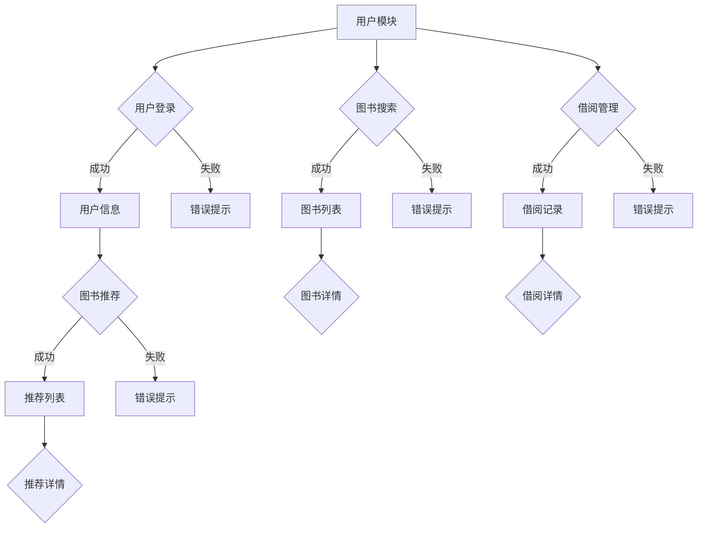
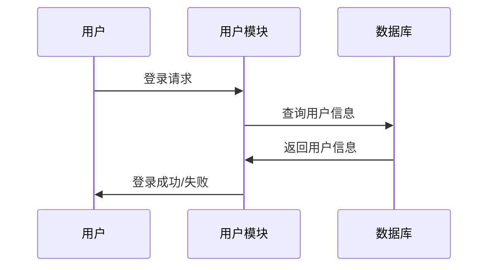

                 


# 数字时代的智能图书馆：AI图书推荐系统的开发与应用

关键词：数字图书馆、智能图书馆、AI图书推荐系统、协同过滤、内容推荐、混合推荐

摘要：本文旨在探讨数字时代的智能图书馆建设，特别是AI图书推荐系统的开发与应用。通过分析数字图书馆的发展历程、智能图书馆的概念与特点，以及AI在图书推荐系统中的应用，本文将详细介绍AI图书推荐系统的基础知识、数据收集与处理、推荐算法详解、系统设计与实现、项目实战和最佳实践。本文旨在为读者提供全面、系统的智能图书馆建设与推荐系统开发的指导和借鉴。

## 1. 引言

### 1.1 数字图书馆的发展历程

随着互联网和信息技术的发展，数字图书馆应运而生。数字图书馆是指通过数字化技术，将各类文献资源转化为电子形式，存储在计算机系统中，供用户远程访问和使用的图书馆。数字图书馆的发展历程可以分为以下几个阶段：

1. **初期的数字化资源建设**：20世纪90年代，数字图书馆的雏形出现，主要以数字化出版物的形式存在，如电子书、电子期刊等。

2. **数字化资源整合**：随着网络技术的发展，数字图书馆开始整合各类数字化资源，提供一站式服务，如Google图书搜索等。

3. **智能化服务**：近年来，随着人工智能技术的崛起，数字图书馆开始引入智能服务，如智能搜索、智能推荐等，极大地提升了用户体验。

### 1.2 智能图书馆的概念与特点

智能图书馆是在数字图书馆的基础上，结合人工智能技术，提供更加智能化的服务。智能图书馆的特点包括：

1. **个性化服务**：智能图书馆能够根据用户的历史行为和兴趣，为用户推荐个性化的图书资源。

2. **智能搜索**：智能图书馆通过自然语言处理技术，能够对用户的查询进行智能解析，提供准确的搜索结果。

3. **智能管理**：智能图书馆利用人工智能技术，对图书资源进行智能分类、管理和推荐。

4. **多平台接入**：智能图书馆支持多平台接入，如Web、移动端等，方便用户随时随地获取图书馆服务。

### 1.3 AI在图书推荐系统中的应用

AI技术在图书推荐系统中的应用，极大地提升了推荐系统的准确性和用户体验。AI在图书推荐系统中的应用主要包括：

1. **协同过滤算法**：通过分析用户的行为数据，找出相似的用户或物品，为用户推荐相似的图书资源。

2. **内容推荐算法**：通过分析图书的内容特征，为用户推荐符合其兴趣的图书。

3. **混合推荐算法**：结合协同过滤和内容推荐算法，提供更加准确的推荐结果。

4. **深度学习模型**：利用深度学习模型，如神经网络、生成对抗网络等，对图书推荐系统进行优化。

### 1.4 本书结构安排

本文将分为以下几个部分：

1. 引言：介绍数字图书馆的发展历程、智能图书馆的概念与特点，以及AI在图书推荐系统中的应用。

2. AI图书推荐系统的基础知识：介绍图书推荐系统的基本概念、AI技术基础、常见的图书推荐算法和数据预处理与特征提取。

3. 数据收集与处理：介绍数据来源、数据收集方法、数据预处理和特征提取。

4. AI图书推荐算法详解：详细介绍协同过滤算法、内容推荐算法和混合推荐算法。

5. 智能图书馆系统的设计与实现：介绍系统需求分析、系统架构设计、系统接口设计与实现、数据库设计与实现。

6. 项目实战：构建一个简单的AI图书推荐系统，包括环境准备、数据收集与处理、算法实现、系统部署与测试和项目总结。

7. 最佳实践与展望：介绍AI图书推荐系统的最佳实践、面临的挑战与未来发展方向。

## 2. AI图书推荐系统的基础知识

### 2.1 图书推荐系统的基本概念

图书推荐系统是一种信息过滤系统，旨在为用户推荐他们可能感兴趣的图书。推荐系统通常包括以下几个基本概念：

1. **用户**：使用图书推荐系统的个体。
2. **物品**：图书推荐系统中的对象，即图书。
3. **评分**：用户对图书的评价，可以是数值、等级或标签。
4. **推荐列表**：推荐系统为用户生成的图书列表。

### 2.2 AI技术基础

AI技术是构建图书推荐系统的核心，主要包括：

1. **机器学习**：通过训练模型，从数据中自动发现规律和模式。
2. **深度学习**：一种特殊的机器学习方法，通过多层神经网络对数据进行处理。
3. **自然语言处理（NLP）**：对文本进行处理，理解和生成自然语言。

### 2.3 常见的图书推荐算法

图书推荐算法可以分为以下几类：

1. **协同过滤算法**：通过分析用户的行为数据，找出相似的用户或物品，进行推荐。
   - **基于用户的协同过滤**：根据用户之间的相似度推荐图书。
   - **基于物品的协同过滤**：根据物品之间的相似度推荐图书。
2. **内容推荐算法**：通过分析图书的内容特征，为用户推荐符合其兴趣的图书。
   - **文本相似度计算**：计算图书之间文本的相似度。
   - **概念图生成与相似度计算**：生成图书的概念图，计算图书之间的概念相似度。
3. **混合推荐算法**：结合协同过滤和内容推荐算法，提供更加准确的推荐结果。

### 2.4 数据预处理与特征提取

数据预处理和特征提取是推荐系统构建的重要环节，主要包括：

1. **数据清洗**：去除数据中的噪声和错误。
2. **特征提取**：从原始数据中提取有用的特征，如用户行为特征、图书内容特征等。
3. **特征选择**：选择对推荐效果有显著影响的特征。

## 3. 数据收集与处理

### 3.1 数据来源

图书推荐系统所需的数据主要来源于以下几类：

1. **用户行为数据**：用户在图书推荐系统中的操作记录，如浏览、搜索、评分等。
2. **图书内容数据**：图书的元数据，如标题、作者、出版日期、分类等。
3. **第三方数据集**：公开的图书推荐数据集，如MovieLens、BookCrossing等。

### 3.2 数据收集方法

数据收集方法主要包括：

1. **Web爬虫技术**：通过网络爬虫技术收集图书信息。
2. **用户行为数据收集**：通过跟踪用户的操作记录收集用户行为数据。
3. **第三方API调用**：通过调用第三方API获取图书信息和用户行为数据。

### 3.3 数据预处理

数据预处理主要包括：

1. **数据格式转换**：将不同来源的数据格式统一。
2. **数据去重**：去除重复的数据。
3. **数据缺失值处理**：处理缺失的数据。

### 3.4 特征提取与选择

特征提取与选择主要包括：

1. **文本特征提取**：提取图书的文本特征，如标题、摘要、标签等。
2. **用户特征提取**：提取用户的行为特征，如浏览记录、搜索记录等。
3. **物品特征提取**：提取图书的元数据特征。
4. **特征选择**：选择对推荐效果有显著影响的特征。

## 4. AI图书推荐算法详解

### 4.1 协同过滤算法

#### 4.1.1 算法原理

协同过滤算法是一种基于用户行为的推荐算法，其基本思想是：

1. **基于用户的协同过滤**：为用户推荐与其他用户相似的用户喜欢的图书。
2. **基于物品的协同过滤**：为用户推荐与用户已评分的图书相似的图书。

#### 4.1.2 实现细节

1. **用户相似度计算**：计算用户之间的相似度，通常使用余弦相似度、皮尔逊相关系数等方法。
2. **物品相似度计算**：计算物品之间的相似度，通常使用余弦相似度、Jaccard相似度等方法。

#### 4.1.3 优缺点分析

1. **优点**：
   - **简单易实现**：协同过滤算法的实现相对简单，对计算资源的要求不高。
   - **效果好**：在多数情况下，协同过滤算法能够提供高质量的推荐结果。

2. **缺点**：
   - **冷启动问题**：新用户或新物品无法获得足够的评分数据，导致推荐效果不佳。
   - **数据稀疏性**：用户行为数据通常是稀疏的，导致推荐效果受限。

### 4.2 内容推荐算法

#### 4.2.1 算法原理

内容推荐算法是一种基于物品特征的推荐算法，其基本思想是：

1. **文本相似度计算**：计算图书之间的文本相似度，通常使用TF-IDF、Word2Vec等方法。
2. **概念图生成与相似度计算**：生成图书的概念图，计算图书之间的概念相似度。

#### 4.2.2 实现细节

1. **文本特征提取**：提取图书的文本特征，如标题、摘要、标签等。
2. **概念图生成**：使用图论算法生成图书的概念图。
3. **相似度计算**：计算图书之间的相似度。

#### 4.2.3 优缺点分析

1. **优点**：
   - **适合新用户和新物品**：内容推荐算法不需要大量的用户行为数据，对新用户和新物品的推荐效果较好。
   - **推荐结果多样**：内容推荐算法能够提供多样化的推荐结果。

2. **缺点**：
   - **计算复杂度高**：生成概念图和计算相似度需要较大的计算资源。
   - **用户偏好难以捕捉**：内容推荐算法难以准确捕捉用户的兴趣偏好。

### 4.3 混合推荐算法

#### 4.3.1 算法原理

混合推荐算法是将协同过滤和内容推荐算法相结合，以弥补各自的缺点，提高推荐效果。

1. **融合策略**：将协同过滤和内容推荐算法的结果进行融合，通常使用加权平均、投票等方法。

#### 4.3.2 实现细节

1. **协同过滤结果融合**：将基于用户的协同过滤结果和基于物品的协同过滤结果进行融合。
2. **内容推荐结果融合**：将基于文本相似度的内容推荐结果和基于概念图的内容推荐结果进行融合。

#### 4.3.3 优缺点分析

1. **优点**：
   - **综合协同过滤和内容推荐算法的优点**：混合推荐算法能够提高推荐效果，减少冷启动问题和数据稀疏性带来的影响。
   - **适应性强**：混合推荐算法能够适应不同类型的用户和物品。

2. **缺点**：
   - **实现复杂度较高**：混合推荐算法的实现较为复杂，需要综合考虑多种因素。

## 5. 智能图书馆系统的设计与实现

### 5.1 系统需求分析

系统需求分析是智能图书馆系统设计的第一步，主要包括：

1. **用户需求分析**：分析用户对图书推荐系统的需求，如个性化推荐、智能搜索等。
2. **功能需求分析**：确定系统的功能模块，如用户管理、图书管理、推荐算法等。
3. **性能需求分析**：分析系统在响应时间、并发处理能力等方面的性能需求。

### 5.2 系统架构设计

智能图书馆系统的架构设计主要包括：

1. **技术选型**：选择合适的技术框架和工具，如Python、Django、TensorFlow等。
2. **系统模块设计**：设计系统的功能模块，如用户管理模块、图书管理模块、推荐算法模块等。
3. **数据流设计**：设计系统的数据流，确保数据在不同模块之间的流通和整合。

### 5.3 系统接口设计与实现

系统接口设计主要包括：

1. **API接口设计**：设计系统的API接口，提供对外访问和操作系统的接口。
2. **Web界面设计**：设计系统的Web界面，提供用户交互的接口。
3. **接口实现**：实现API接口和Web界面，确保系统的正常运行。

### 5.4 数据库设计与实现

数据库设计是智能图书馆系统实现的重要环节，主要包括：

1. **数据库选型**：选择合适的数据库系统，如MySQL、PostgreSQL等。
2. **数据库设计**：设计数据库的表结构，定义数据表、字段、索引等。
3. **数据实现**：实现数据库的创建、数据插入、查询等功能，确保数据的有效存储和管理。

## 6. 项目实战：构建一个简单的AI图书推荐系统

### 6.1 环境准备

项目实战的第一步是环境准备，主要包括：

1. **硬件环境**：确保有足够的计算资源和存储空间。
2. **软件环境**：安装Python、Django、TensorFlow等软件。
3. **数据库环境**：安装MySQL或PostgreSQL数据库。

### 6.2 数据收集与处理

数据收集与处理是项目实战的重要环节，主要包括：

1. **数据收集**：收集用户行为数据和图书内容数据。
2. **数据预处理**：对收集到的数据进行清洗、去重、格式转换等操作。
3. **特征提取**：提取用户特征、图书特征等。

### 6.3 算法实现

算法实现是项目实战的核心，主要包括：

1. **协同过滤算法实现**：实现基于用户的协同过滤和基于物品的协同过滤算法。
2. **内容推荐算法实现**：实现基于文本相似度的内容推荐算法。
3. **混合推荐算法实现**：实现混合推荐算法，结合协同过滤和内容推荐算法。

### 6.4 系统部署与测试

系统部署与测试是项目实战的最后一步，主要包括：

1. **系统部署**：将开发完成的系统部署到服务器上，确保系统的正常运行。
2. **功能测试**：对系统的功能进行测试，确保所有功能模块正常运行。
3. **性能测试**：对系统的性能进行测试，确保系统在负载下的稳定性和响应速度。

### 6.5 项目总结

项目总结是对项目实战的回顾和反思，主要包括：

1. **项目成果**：总结项目的主要成果，如系统功能、性能等。
2. **项目经验**：总结项目过程中的经验教训，如技术选型、团队协作等。
3. **未来展望**：对项目的未来发展方向和优化方案进行展望。

## 7. 最佳实践与展望

### 7.1 AI图书推荐系统的最佳实践

在构建AI图书推荐系统时，以下是一些最佳实践：

1. **用户数据保护**：确保用户数据的安全和隐私。
2. **实时推荐**：实现实时推荐，提高用户体验。
3. **个性化推荐**：根据用户的历史行为和兴趣，提供个性化的推荐结果。
4. **多样化推荐**：结合多种推荐算法，提供多样化的推荐结果。

### 7.2 面临的挑战与未来发展方向

构建AI图书推荐系统面临的挑战包括：

1. **数据稀疏性**：用户行为数据通常是稀疏的，影响推荐效果。
2. **冷启动问题**：新用户和新物品无法获得足够的评分数据，导致推荐效果不佳。
3. **计算资源**：构建高效推荐系统需要大量的计算资源。

未来发展方向包括：

1. **深度学习技术的应用**：利用深度学习技术，提高推荐效果。
2. **多模态数据的融合**：结合文本、图像、语音等多种数据，提供更准确的推荐。
3. **用户隐私保护**：在保证用户隐私的前提下，提供高质量的推荐服务。

### 7.3 小结与拓展阅读

本文从数字图书馆的发展历程、智能图书馆的概念与特点、AI在图书推荐系统中的应用、基础知识和算法详解、系统设计与实现、项目实战到最佳实践和未来展望等方面，全面探讨了AI图书推荐系统的开发与应用。通过本文的介绍，读者可以了解AI图书推荐系统的构建方法和关键技术。

拓展阅读：

1. **[推荐系统实践](https://www.recommendation-systems.com/)**：提供了推荐系统的基础知识和实战技巧。
2. **[TensorFlow官方文档](https://www.tensorflow.org/)**：介绍了深度学习的基础理论和实践方法。
3. **[Django官方文档](https://docs.djangoproject.com/)**：介绍了Web开发框架Django的使用方法。

## 作者信息

作者：AI天才研究院/AI Genius Institute & 禅与计算机程序设计艺术 /Zen And The Art of Computer Programming

感谢您的阅读，希望本文对您在数字时代构建智能图书馆和AI图书推荐系统有所帮助。如果您有任何疑问或建议，欢迎随时与我们联系。期待与您共同探讨更多技术话题！### 1.1 数字图书馆的发展历程

#### 1.1.1 传统图书馆的局限

传统图书馆作为一种信息存储和传播的场所，有着悠久的历史。然而，随着信息时代的到来，传统图书馆逐渐暴露出一些局限性。首先，传统图书馆的物理空间有限，无法容纳大量的书籍和资料。这意味着用户在寻找特定书籍时，可能需要花费大量时间和精力。其次，传统图书馆的管理和服务方式相对单一，缺乏灵活性和个性化。用户在传统图书馆中往往只能按照分类或者索引来查找书籍，无法根据个人兴趣和需求获得个性化的推荐。此外，传统图书馆的借阅流程繁琐，用户需要办理借阅证、排队借书等，这些流程不仅增加了用户的负担，也限制了图书馆的使用频率。

#### 1.1.2 数字图书馆的兴起

为了解决传统图书馆的局限，数字图书馆的概念应运而生。数字图书馆是指利用现代信息技术，将各类文献资源数字化，并通过互联网进行存储、管理和传播的图书馆。数字图书馆的出现标志着图书馆服务从传统的物理空间向虚拟空间的转变。首先，数字图书馆通过数字化技术，将纸质书籍、期刊、报纸等资源转化为电子文档，大大增加了信息存储的容量。用户可以通过互联网随时访问这些电子文档，无需受到物理空间的限制。其次，数字图书馆提供了更加灵活和个性化的服务。通过用户的注册和信息填报，图书馆可以为用户提供个性化的推荐和服务，满足用户的个性化需求。此外，数字图书馆还提供了便捷的借阅流程，用户可以通过在线借阅、电子书下载等方式获取所需资源，大大提高了图书馆的使用效率。

#### 1.1.3 数字图书馆的优势

数字图书馆相比传统图书馆具有显著的优势。首先，数字图书馆具有无限存储空间。传统的纸质图书馆受限于物理空间，书籍存放和管理的成本较高。而数字图书馆通过将书籍数字化，将信息存储在计算机系统中，无需占用物理空间，实现了无限存储。其次，数字图书馆提供了24小时全天候服务。用户可以通过互联网随时访问数字图书馆，不受时间、地点的限制，大大提高了图书馆的利用率和用户体验。此外，数字图书馆还提供了丰富的交互功能，如搜索、分类、推荐等，用户可以更方便地查找和获取所需信息。最后，数字图书馆具有强大的数据分析能力。通过对用户行为数据的分析，数字图书馆可以为用户提供个性化的推荐和服务，提高用户满意度和忠诚度。

### 1.2 智能图书馆的概念与特点

#### 1.2.1 智能图书馆的定义

智能图书馆是指通过引入人工智能技术，实现对图书资源的智能管理、智能推荐和智能服务的图书馆。智能图书馆不仅继承了数字图书馆的优势，还在服务质量和用户体验方面实现了进一步的提升。智能图书馆的核心在于利用人工智能技术，对图书资源进行深入分析和处理，为用户提供更加精准和个性化的服务。

#### 1.2.2 智能图书馆的技术特点

智能图书馆的技术特点主要体现在以下几个方面：

1. **智能化推荐**：智能图书馆通过分析用户的历史行为和兴趣爱好，为用户推荐符合其需求的图书资源。这种推荐方式不仅基于用户的浏览记录和评分，还结合了用户的兴趣标签、阅读偏好等综合信息。

2. **智能搜索**：智能图书馆采用自然语言处理技术，能够理解用户的查询意图，并提供精准的搜索结果。用户可以使用自然语言进行查询，无需按照特定的分类或索引进行搜索。

3. **智能管理**：智能图书馆通过自动化技术对图书资源进行智能分类、管理和维护。管理员可以通过智能系统进行图书的入库、出库、更新等操作，提高了管理效率。

4. **个性化服务**：智能图书馆根据用户的需求和偏好，提供个性化的服务。例如，为经常借阅某一类书籍的用户推荐新的相关书籍，或者为喜欢阅读某个作者的读者推荐该作者的其他作品。

#### 1.2.3 智能图书馆的服务模式

智能图书馆的服务模式与传统图书馆有所不同，其特点如下：

1. **在线服务**：用户可以通过互联网远程访问智能图书馆，在线浏览、搜索和借阅图书。这种服务模式打破了时间和空间的限制，为用户提供了极大的便利。

2. **个性化推荐**：智能图书馆根据用户的行为数据和历史记录，为用户生成个性化的推荐列表。用户可以根据推荐列表快速找到感兴趣的书籍，提高阅读效率。

3. **互动服务**：智能图书馆提供了丰富的互动功能，如在线问答、读者论坛、阅读分享等。用户可以通过这些功能与其他读者交流心得，分享阅读体验。

4. **自助服务**：智能图书馆引入自助借还书系统，用户可以在无需工作人员帮助的情况下完成借还书操作，提高了服务效率。

#### 1.2.4 智能图书馆的发展趋势

随着人工智能技术的不断进步，智能图书馆也在不断演进。未来，智能图书馆的发展趋势主要包括：

1. **多模态融合**：智能图书馆将结合文本、图像、语音等多种数据，提供更加精准和多样化的服务。

2. **智能推荐系统优化**：智能推荐系统将采用更加先进的算法和技术，如深度学习、强化学习等，提高推荐精度和用户满意度。

3. **个性化服务深化**：智能图书馆将更加深入地了解用户的需求和偏好，提供更加个性化的服务，满足用户的多元化需求。

4. **智能化管理**：智能图书馆将利用人工智能技术，实现图书资源的自动化管理和维护，提高管理效率。

### 1.3 AI在图书推荐系统中的应用

#### 1.3.1 AI在推荐系统中的作用

人工智能技术在图书推荐系统中发挥着至关重要的作用，其核心作用主要体现在以下几个方面：

1. **提升推荐准确性**：AI技术通过分析用户的行为数据和历史记录，可以更加准确地预测用户可能感兴趣的图书，从而提供精准的推荐结果。

2. **个性化推荐**：AI技术可以根据用户的个性化需求和偏好，为用户生成个性化的推荐列表，提高用户的满意度和忠诚度。

3. **实时推荐**：AI技术可以实时分析用户的行为数据，动态更新推荐结果，为用户提供实时的推荐服务。

4. **智能推荐算法优化**：AI技术可以自动优化推荐算法，通过不断学习和调整，提高推荐系统的性能和效果。

#### 1.3.2 AI技术对图书馆服务的影响

AI技术的引入，不仅改变了图书推荐系统的模式，还对图书馆服务的各个方面产生了深远的影响：

1. **服务模式创新**：AI技术为图书馆服务带来了新的模式，如在线借阅、智能推荐、互动服务等，大大丰富了图书馆的服务内容。

2. **用户体验提升**：AI技术通过个性化推荐和实时服务，提高了用户的阅读体验和满意度。

3. **管理效率提高**：AI技术实现了图书馆管理的智能化，如自动化分类、自动化检索等，提高了图书馆的管理效率。

4. **资源利用最大化**：AI技术通过对图书资源的智能管理和推荐，最大化了图书馆资源的利用率，降低了资源浪费。

#### 1.3.3 AI技术在图书推荐系统中的挑战与机遇

虽然AI技术在图书推荐系统中具有巨大的潜力，但在实际应用中仍然面临一些挑战：

1. **数据稀疏性**：用户行为数据通常是稀疏的，特别是对于新用户和新图书，缺乏足够的评分数据，影响推荐效果。

2. **计算资源需求**：AI技术对计算资源的需求较高，特别是深度学习模型训练和推荐算法优化等，需要大量的计算资源和存储空间。

3. **数据隐私和安全**：用户数据的安全和隐私是AI技术在图书推荐系统中面临的重要挑战，需要采取有效的保护措施。

然而，随着AI技术的不断发展和应用，这些挑战也逐渐转化为机遇：

1. **提升推荐精度**：随着AI技术的进步，推荐系统的准确性将得到进一步提升，为用户提供更加精准的推荐服务。

2. **多模态数据融合**：通过融合文本、图像、语音等多种数据，推荐系统将能够提供更加多样化和个性化的服务。

3. **智能化管理**：AI技术将实现图书馆资源的智能管理和维护，提高图书馆的运营效率。

4. **创新服务模式**：AI技术将带来图书馆服务模式的创新，为用户提供更加丰富和便捷的服务体验。

### 1.4 本书结构安排

为了帮助读者系统地了解AI图书推荐系统的开发与应用，本书将分为以下几个部分：

1. **引言**：介绍数字图书馆的发展历程、智能图书馆的概念与特点，以及AI在图书推荐系统中的应用。

2. **AI图书推荐系统的基础知识**：介绍图书推荐系统的基本概念、AI技术基础、常见的图书推荐算法和数据预处理与特征提取。

3. **数据收集与处理**：介绍数据来源、数据收集方法、数据预处理和特征提取。

4. **AI图书推荐算法详解**：详细介绍协同过滤算法、内容推荐算法和混合推荐算法。

5. **智能图书馆系统的设计与实现**：介绍系统需求分析、系统架构设计、系统接口设计与实现、数据库设计与实现。

6. **项目实战**：通过构建一个简单的AI图书推荐系统，展示系统的环境准备、数据收集与处理、算法实现、系统部署与测试和项目总结。

7. **最佳实践与展望**：介绍AI图书推荐系统的最佳实践、面临的挑战与未来发展方向。

通过本书的阅读，读者将能够全面掌握AI图书推荐系统的开发与应用方法，为构建智能图书馆提供有力的技术支持。## 2. AI图书推荐系统的基础知识

### 2.1 图书推荐系统的基本概念

图书推荐系统是一种信息过滤系统，旨在为用户推荐他们可能感兴趣的图书。这种系统通过分析用户的行为数据和图书的内容特征，预测用户对特定图书的偏好，从而生成推荐列表。以下是图书推荐系统的一些基本概念：

1. **用户**：使用图书推荐系统的个体。用户可以是图书馆的会员、在线书店的用户等。
2. **物品**：图书推荐系统中的对象，即图书。物品通常包括图书的元数据，如标题、作者、分类、出版日期等。
3. **评分**：用户对图书的评价，可以是数值（如1到5的评分）、等级（如喜爱、一般、不喜爱）或标签（如科幻、历史、自传）。
4. **推荐列表**：推荐系统为用户生成的图书列表。推荐列表的生成基于用户的评分历史、浏览行为、搜索记录和图书的内容特征。

### 2.2 AI技术基础

人工智能（AI）技术是构建高效、智能的图书推荐系统的关键。以下是AI技术的一些基础概念：

1. **机器学习**：一种通过算法让计算机从数据中学习并做出预测或决策的技术。机器学习算法包括监督学习、无监督学习和强化学习等。
2. **深度学习**：一种特殊的机器学习方法，通过多层神经网络对数据进行处理，能够自动提取特征，并进行复杂的预测和决策。
3. **自然语言处理（NLP）**：一种使计算机能够理解和生成自然语言的技术。NLP技术在文本相似度计算、语义分析等方面具有重要应用。

### 2.3 常见的图书推荐算法

图书推荐算法可以分为协同过滤算法、内容推荐算法和混合推荐算法等。以下是这些算法的基本概念和实现方法：

1. **协同过滤算法**：
   - **基于用户的协同过滤**：通过分析用户之间的相似度，为用户推荐其他用户喜欢的图书。
     - **实现方法**：计算用户之间的相似度，通常使用余弦相似度或皮尔逊相关系数。然后，根据相似度为用户推荐其他用户喜欢的图书。
   - **基于物品的协同过滤**：通过分析物品之间的相似度，为用户推荐相似物品的图书。
     - **实现方法**：计算物品之间的相似度，通常使用余弦相似度或余弦相似度。然后，根据相似度为用户推荐相似物品的图书。

2. **内容推荐算法**：
   - **基于特征的推荐**：通过分析图书的文本特征（如标题、摘要、标签）和用户特征（如阅读历史、搜索记录），为用户推荐相似的图书。
     - **实现方法**：提取图书和用户的文本特征，使用向量空间模型（如TF-IDF）计算特征相似度。然后，根据相似度为用户推荐相似的图书。
   - **基于语义的推荐**：通过分析图书和用户的语义信息，为用户推荐符合其兴趣的图书。
     - **实现方法**：使用自然语言处理技术（如词嵌入、词性标注、实体识别）提取图书和用户的语义特征。然后，使用语义相似度计算方法（如Word2Vec、BERT）为用户推荐相似的图书。

3. **混合推荐算法**：
   - **实现方法**：结合协同过滤和内容推荐算法，将两者的优点相结合，提供更加准确的推荐结果。
     - **策略**：常见的混合策略包括加权平均、模型融合等。

### 2.4 数据预处理与特征提取

数据预处理和特征提取是构建图书推荐系统的关键步骤，其目的是提高推荐系统的性能和准确性。以下是数据预处理和特征提取的基本概念和方法：

1. **数据预处理**：
   - **数据清洗**：去除数据中的噪声和错误，如缺失值、重复值等。
   - **数据归一化**：将数据转换到同一尺度，如将评分数据从0到10转换为0到1。
   - **数据降维**：减少数据维度，提高计算效率，如使用主成分分析（PCA）。

2. **特征提取**：
   - **文本特征提取**：从文本数据中提取有用信息，如词袋模型、TF-IDF、词嵌入等。
   - **用户特征提取**：从用户行为数据中提取用户特征，如用户的浏览历史、搜索记录、评分历史等。
   - **物品特征提取**：从物品数据中提取物品特征，如物品的元数据、标签等。

通过有效的数据预处理和特征提取，推荐系统可以更好地理解和预测用户的兴趣，从而提供更准确的推荐结果。

### 2.5 数据来源

图书推荐系统所需的数据主要来源于以下几个方面：

1. **用户行为数据**：包括用户的浏览历史、搜索记录、评分记录、借阅记录等。这些数据可以反映用户的阅读习惯和偏好。
2. **图书内容数据**：包括图书的元数据（如标题、作者、分类、出版日期等）和内容特征（如标签、摘要、全文等）。这些数据可以帮助推荐系统理解图书的内容和主题。
3. **第三方数据集**：可以从公开的数据集中获取用户行为数据和图书内容数据，如MovieLens、BookCrossing等。

### 2.6 数据收集方法

数据收集是构建图书推荐系统的重要环节，以下是常用的数据收集方法：

1. **Web爬虫技术**：使用爬虫程序从互联网上获取图书内容和用户行为数据。爬虫可以爬取各大图书网站、在线书店、图书馆的公开数据。
2. **API调用**：通过调用第三方API获取图书内容和用户行为数据。常见的API包括Open Library、Google Books等。
3. **手动收集**：通过手动收集用户的行为数据和图书内容数据，如问卷调查、用户反馈等。

### 2.7 数据预处理

数据预处理是确保数据质量和推荐系统性能的关键步骤，以下是数据预处理的主要任务：

1. **数据清洗**：去除数据中的噪声和错误，如缺失值、重复值等。
2. **数据转换**：将不同格式和尺度的数据转换为统一的格式和尺度，如将文本数据转换为向量表示。
3. **特征提取**：从原始数据中提取有用的特征，如用户的阅读历史、图书的分类标签等。

### 2.8 特征提取与选择

特征提取是推荐系统的核心步骤，以下是一些常用的特征提取方法和特征选择策略：

1. **文本特征提取**：使用词袋模型、TF-IDF、Word2Vec等方法提取文本特征。
2. **用户特征提取**：从用户的行为数据中提取特征，如用户的浏览历史、搜索记录等。
3. **物品特征提取**：从图书的元数据和内容特征中提取特征，如图书的分类、标签、摘要等。
4. **特征选择策略**：使用信息增益、互信息、特征重要性等方法选择对推荐效果有显著影响的特征。

### 2.9 常见的评估指标

评估推荐系统的性能是确保其有效性的关键，以下是一些常见的评估指标：

1. **准确率（Accuracy）**：预测结果中正确预测的占比。
2. **召回率（Recall）**：能够正确预测的图书占所有可能感兴趣图书的占比。
3. **F1分数（F1 Score）**：准确率和召回率的调和平均。
4. **均方根误差（RMSE）**：预测评分和实际评分之间的均方根差。

通过合理的数据预处理、特征提取和评估指标，推荐系统可以更好地理解和预测用户的兴趣，从而提供高质量的推荐服务。

### 2.10 AI技术在推荐系统中的应用

AI技术，特别是机器学习和深度学习，在推荐系统中发挥着重要作用。以下是AI技术在推荐系统中的几个关键应用：

1. **协同过滤算法的改进**：通过机器学习算法，如矩阵分解、神经网络等，改进协同过滤算法，提高推荐准确性。
2. **内容推荐算法的优化**：利用自然语言处理技术，如词嵌入、语义分析等，优化内容推荐算法，提高推荐的个性化程度。
3. **多模态数据的融合**：结合文本、图像、语音等多种数据，通过深度学习模型，如卷积神经网络（CNN）、循环神经网络（RNN）等，实现多模态数据的融合，提供更加精准的推荐。
4. **推荐算法的实时优化**：利用实时数据流处理技术，如Apache Kafka、Flink等，对推荐算法进行实时优化，提高推荐的时效性。

通过这些应用，AI技术不仅提高了推荐系统的性能，还极大地提升了用户体验。

### 2.11 小结

AI图书推荐系统是数字时代智能图书馆的重要组成部分，通过分析用户行为数据和图书内容特征，提供个性化的推荐服务。本章介绍了图书推荐系统的基本概念、AI技术基础、常见的推荐算法和数据预处理与特征提取方法。通过这些基础知识，读者可以更好地理解AI图书推荐系统的构建和应用。

## 3. 数据收集与处理

### 3.1 数据来源

构建一个高效的AI图书推荐系统需要大量的高质量数据。数据来源可以分为以下几个方面：

1. **用户行为数据**：包括用户的阅读历史、搜索记录、评分记录、借阅记录等。这些数据可以反映用户的兴趣和阅读习惯，是构建推荐系统的重要基础。

2. **图书内容数据**：包括图书的元数据（如标题、作者、出版日期、ISBN等）和内容特征（如摘要、目录、标签、全文等）。这些数据有助于理解图书的主题和内容，从而为用户提供准确的推荐。

3. **第三方数据集**：可以从公共数据集网站（如Kaggle、UCI机器学习库等）获取现成的用户行为数据和图书内容数据。这些数据集通常经过清洗和处理，为研究提供了便利。

### 3.2 数据收集方法

数据收集方法的选择取决于数据来源和数据类型。以下是几种常用的数据收集方法：

1. **Web爬虫技术**：使用爬虫程序从互联网上自动获取数据。这种方法适用于公开的图书信息和用户行为数据。常见的爬虫框架有Scrapy、BeautifulSoup等。

2. **API调用**：通过调用第三方API获取数据。这种方法适用于需要获取大量数据的场景，如获取图书的元数据和用户行为数据。常用的API包括Google Books API、Open Library API等。

3. **手动收集**：通过问卷调查、用户反馈等方式收集数据。这种方法适用于小规模数据收集，但数据质量和数量可能有限。

4. **合作获取**：与图书出版社、图书馆等机构合作，获取官方数据。这种方法可以获得高质量的数据，但需要建立良好的合作关系。

### 3.3 数据预处理

数据预处理是确保数据质量和推荐系统性能的关键步骤。以下是数据预处理的主要任务：

1. **数据清洗**：去除数据中的噪声和错误。例如，去除缺失值、重复值、异常值等。可以使用Python的pandas库实现数据清洗操作。

   ```python
   import pandas as pd

   # 读取数据
   data = pd.read_csv('data.csv')

   # 去除缺失值
   data = data.dropna()

   # 去除重复值
   data = data.drop_duplicates()
   ```

2. **数据转换**：将数据转换为统一的格式和尺度。例如，将文本数据编码为数值向量、将日期时间数据转换为特定格式等。可以使用Python的pandas库和numpy库实现数据转换。

   ```python
   import pandas as pd
   import numpy as np

   # 转换文本数据为数值向量
   data['text_column'] = data['text_column'].apply(lambda x: np.array([1 if word in x else 0 for word in vocabulary]))

   # 转换日期时间数据
   data['datetime_column'] = pd.to_datetime(data['datetime_column'])
   ```

3. **数据归一化**：将数据转换到同一尺度，如将评分数据从0到10转换为0到1。可以使用Python的sklearn库实现数据归一化。

   ```python
   from sklearn.preprocessing import MinMaxScaler

   # 实例化归一化器
   scaler = MinMaxScaler()

   # 归一化数据
   data['rating_column'] = scaler.fit_transform(data[['rating_column']])
   ```

4. **数据降维**：减少数据维度，提高计算效率。例如，使用主成分分析（PCA）或t-SNE等降维技术。可以使用Python的scikit-learn库实现降维。

   ```python
   from sklearn.decomposition import PCA

   # 实例化PCA
   pca = PCA(n_components=10)

   # 降维
   data_pca = pca.fit_transform(data)
   ```

### 3.4 特征提取与选择

特征提取是从原始数据中提取有用的信息，而特征选择是从提取的特征中挑选出对模型性能有显著影响的关键特征。以下是特征提取与选择的方法：

1. **文本特征提取**：使用词袋模型（Bag of Words，BoW）、TF-IDF（Term Frequency-Inverse Document Frequency）等算法提取文本特征。

   ```python
   from sklearn.feature_extraction.text import TfidfVectorizer

   # 实例化TF-IDF
   vectorizer = TfidfVectorizer()

   # 提取文本特征
   X = vectorizer.fit_transform(data['text_column'])
   ```

2. **用户特征提取**：从用户的行为数据中提取特征，如用户的浏览历史、搜索记录等。

   ```python
   # 提取用户特征
   user_features = pd.get_dummies(data['user_behavior_column'])
   ```

3. **物品特征提取**：从图书的元数据和内容特征中提取特征，如图书的分类、标签等。

   ```python
   # 提取物品特征
   item_features = pd.get_dummies(data['item_metadata_column'])
   ```

4. **特征选择策略**：使用信息增益（Information Gain）、互信息（Mutual Information）等方法选择对模型性能有显著影响的特征。

   ```python
   from sklearn.feature_selection import SelectKBest
   from sklearn.feature_selection import chi2

   # 实例化特征选择器
   selector = SelectKBest(score_func=chi2, k=1000)

   # 选择特征
   X_selected = selector.fit_transform(X, y)
   ```

通过有效的数据预处理和特征提取，可以大大提高AI图书推荐系统的性能和准确性。在接下来的章节中，我们将详细介绍各种推荐算法的实现和应用。

### 3.5 数据预处理与特征提取的重要性

数据预处理与特征提取是构建高效AI图书推荐系统的关键步骤，其重要性体现在以下几个方面：

1. **数据质量**：高质量的数据是构建准确推荐系统的前提。数据预处理包括数据清洗、数据转换和数据归一化等步骤，可以有效去除数据中的噪声和错误，提高数据质量。

2. **特征重要性**：特征提取是从原始数据中提取对模型性能有显著影响的关键特征。通过特征提取，可以降低数据维度，提高计算效率，同时保持数据的关键信息。

3. **模型性能**：数据预处理与特征提取直接影响到推荐系统的性能。高质量的数据和有代表性的特征可以显著提高模型的准确性和鲁棒性，从而提供更精准的推荐结果。

4. **用户体验**：良好的数据预处理和特征提取可以提高推荐系统的响应速度和推荐质量，从而提升用户体验，增强用户对推荐系统的信任和满意度。

5. **可扩展性**：通过合理的数据预处理和特征提取方法，推荐系统可以更好地适应新的用户和物品数据，实现系统的可扩展性。

总之，数据预处理与特征提取是构建高效AI图书推荐系统的关键步骤，对系统的性能和用户体验具有决定性影响。

### 3.6 数据收集与处理的具体案例

为了更好地理解数据收集与处理的具体流程，以下将介绍一个数据收集与处理的具体案例。

#### 案例背景

假设我们正在构建一个基于用户阅读行为的AI图书推荐系统，目标是根据用户的阅读历史、搜索记录和评分数据，为用户推荐他们可能感兴趣的图书。

#### 数据收集

1. **用户行为数据**：通过调用一个在线书店的API，收集用户的阅读历史、搜索记录和评分数据。这些数据包括用户的ID、图书的ID、阅读时间、搜索关键词和评分等。

   ```python
   import requests

   url = "https://api.bookstore.com/users/behaviors"
   response = requests.get(url)
   user_behaviors = response.json()
   ```

2. **图书内容数据**：从多个来源（如公开数据集、API等）获取图书的元数据和内容特征。这些数据包括图书的ID、标题、作者、分类、摘要和标签等。

   ```python
   import requests

   url = "https://api.publicbooklibrary.com/books"
   response = requests.get(url)
   book_data = response.json()
   ```

#### 数据预处理

1. **数据清洗**：去除用户行为数据中的缺失值和重复值，确保数据的完整性。

   ```python
   user_behaviors = user_behaviors.dropna()
   user_behaviors = user_behaviors.drop_duplicates()
   ```

2. **数据转换**：将日期时间数据转换为统一的格式，如将阅读时间转换为UNIX时间戳。

   ```python
   user_behaviors['reading_time'] = pd.to_datetime(user_behaviors['reading_time']).astype('int64') // 10**9
   ```

3. **数据归一化**：将评分数据从0到10转换为0到1，以便于后续的模型训练。

   ```python
   from sklearn.preprocessing import MinMaxScaler

   scaler = MinMaxScaler()
   user_behaviors['rating'] = scaler.fit_transform(user_behaviors[['rating']])
   ```

#### 特征提取

1. **用户特征提取**：从用户的行为数据中提取用户的阅读偏好特征，如用户的平均评分、阅读频率和搜索关键词。

   ```python
   user_features = user_behaviors.groupby('user_id').agg({'rating': 'mean', 'search_keyword': lambda x: ', '.join(x)})
   ```

2. **物品特征提取**：从图书的元数据和内容特征中提取物品的特征，如图书的分类、标签和摘要。

   ```python
   book_features = book_data[['book_id', 'category', 'tags', 'abstract']]
   ```

3. **特征融合**：将用户特征和物品特征进行融合，形成完整的特征矩阵。

   ```python
   full_data = user_features.join(book_features.set_index('book_id'), on='book_id')
   ```

#### 数据分析

1. **探索性数据分析**：通过可视化工具（如Matplotlib、Seaborn等），对数据进行分析和可视化，以了解数据的分布和特征之间的关系。

   ```python
   import matplotlib.pyplot as plt
   import seaborn as sns

   sns.pairplot(full_data)
   plt.show()
   ```

通过这个具体案例，我们可以看到数据收集与处理的流程是如何具体实施的，包括数据清洗、数据转换、特征提取和数据分析等步骤。这些步骤对于构建一个高效、准确的AI图书推荐系统至关重要。

### 3.7 数据收集与处理的挑战与解决方案

在构建AI图书推荐系统的过程中，数据收集与处理面临诸多挑战。以下将讨论这些挑战及其解决方案：

#### 挑战1：数据稀疏性

**问题**：用户行为数据通常是稀疏的，尤其是在新用户或新图书的情况下，评分数据可能非常有限，影响推荐系统的准确性。

**解决方案**：
- **利用第三方数据集**：通过引入公共数据集（如MovieLens、BookCrossing等），为新用户和新图书提供初始评分数据。
- **引入冷启动策略**：对于新用户，可以推荐热门图书或根据用户的基本信息（如地理位置、性别等）进行推荐。
- **基于内容推荐**：在评分数据不足时，可以使用内容推荐算法，根据图书的元数据和内容特征进行推荐。

#### 挑战2：数据噪声和异常值

**问题**：实际数据中可能存在噪声和异常值，如重复记录、无效评分等，这些数据会降低推荐系统的准确性。

**解决方案**：
- **数据清洗**：在数据处理过程中，去除重复记录、缺失值和异常值，提高数据质量。
- **异常值检测**：使用统计方法（如箱线图、Z分数等）检测并处理异常值。

#### 挑战3：数据不平衡

**问题**：数据集中某些类别（如负面评论）可能远少于其他类别（如正面评论），导致模型偏向多数类别。

**解决方案**：
- **数据增强**：通过生成合成数据或利用GAN（生成对抗网络）等方法，增加少数类别的样本数量。
- **类别权重调整**：在模型训练过程中，给少数类别分配更高的权重。

#### 挑战4：数据隐私和安全

**问题**：用户行为数据包含敏感信息，如个人偏好、阅读历史等，数据隐私和安全问题需要得到妥善处理。

**解决方案**：
- **数据加密**：对用户数据进行加密存储和传输，确保数据安全。
- **隐私保护技术**：采用差分隐私、联邦学习等技术，保护用户隐私。

#### 挑战5：计算资源需求

**问题**：数据预处理和特征提取需要大量的计算资源，尤其是在大规模数据集上。

**解决方案**：
- **分布式计算**：利用分布式计算框架（如Hadoop、Spark等），提高数据处理效率。
- **批量处理**：将数据处理任务分解为多个批次，分批次进行处理，减少内存占用。

通过上述解决方案，可以有效应对数据收集与处理过程中的挑战，构建一个高效、准确和安全的AI图书推荐系统。

## 4. AI图书推荐算法详解

### 4.1 协同过滤算法

#### 4.1.1 算法原理

协同过滤（Collaborative Filtering）算法是推荐系统中最常用的算法之一，其核心思想是通过分析用户之间的相似度或物品之间的相似度，为用户推荐相似的物品。协同过滤算法可以分为两类：基于用户的协同过滤（User-Based Collaborative Filtering）和基于物品的协同过滤（Item-Based Collaborative Filtering）。

**基于用户的协同过滤**：该算法通过分析用户之间的相似度，找出与目标用户相似的其他用户，然后推荐这些相似用户喜欢的物品。相似度计算通常使用用户之间的评分相似度，常用的方法有：

- **余弦相似度**：计算用户之间的评分向量之间的余弦相似度，公式如下：

  $$\text{相似度} = \frac{\text{向量A} \cdot \text{向量B}}{|\text{向量A}| \cdot |\text{向量B}|}$$

- **皮尔逊相关系数**：计算用户之间的评分差异与各自评分的标准差的乘积，公式如下：

  $$\text{相似度} = \frac{\text{协方差}}{\text{标准差A} \cdot \text{标准差B}}$$

**基于物品的协同过滤**：该算法通过分析物品之间的相似度，找出与目标物品相似的物品，然后推荐这些相似物品给用户。物品相似度的计算方法与用户相似度类似，常用的方法有：

- **基于内容的相似度**：通过分析物品的内容特征（如标题、标签、摘要等），计算物品之间的相似度。
- **基于用户评分的相似度**：通过分析用户对物品的评分，计算物品之间的相似度。

#### 4.1.2 实现细节

**基于用户的协同过滤算法实现**：

1. **用户相似度计算**：计算用户之间的相似度，通常使用余弦相似度或皮尔逊相关系数。

2. **物品推荐**：为用户推荐与目标用户相似的用户喜欢的物品，通常使用Top-N算法。

3. **相似度阈值**：设定相似度阈值，只推荐相似度高于阈值的用户喜欢的物品。

**基于物品的协同过滤算法实现**：

1. **物品相似度计算**：计算物品之间的相似度，通常使用余弦相似度或基于内容的相似度。

2. **物品推荐**：为用户推荐与目标物品相似的物品，通常使用Top-N算法。

3. **相似度阈值**：设定相似度阈值，只推荐相似度高于阈值的物品。

#### 4.1.3 优缺点分析

**优点**：

- **简单易实现**：协同过滤算法的实现相对简单，对计算资源的要求不高。
- **效果好**：在多数情况下，协同过滤算法能够提供高质量的推荐结果。

**缺点**：

- **冷启动问题**：新用户或新物品无法获得足够的评分数据，导致推荐效果不佳。
- **数据稀疏性**：用户行为数据通常是稀疏的，导致推荐效果受限。

### 4.2 内容推荐算法

#### 4.2.1 算法原理

内容推荐（Content-Based Recommender System）算法是基于物品的内容特征（如标题、标签、摘要等）进行推荐的算法。内容推荐算法的基本思想是分析用户过去喜欢的物品和物品的内容特征，找到相似的内容特征，为用户推荐相似的物品。

**基于内容的相似度计算**：

1. **特征提取**：从物品的内容中提取特征，如文本特征、图像特征等。
2. **相似度计算**：计算物品之间的相似度，常用的方法有：

   - **文本相似度**：使用TF-IDF、Word2Vec等方法计算文本特征之间的相似度。
   - **图像相似度**：使用卷积神经网络（CNN）提取图像特征，计算特征之间的相似度。

**基于概念图的相似度计算**：

1. **概念图生成**：使用自然语言处理（NLP）技术生成物品的概念图，表示物品之间的关系。
2. **相似度计算**：计算概念图节点之间的相似度，常用的方法有：

   - **基于路径的相似度**：计算两个节点之间的最短路径长度。
   - **基于邻居的相似度**：计算两个节点最近的邻居节点相似度。

#### 4.2.2 实现细节

**基于内容的相似度计算实现**：

1. **文本特征提取**：使用TF-IDF或Word2Vec等方法提取文本特征。
2. **相似度计算**：计算物品之间的文本特征相似度。
3. **物品推荐**：为用户推荐与目标物品文本特征相似的物品。

**基于概念图的相似度计算实现**：

1. **概念图生成**：使用NLP技术生成物品的概念图。
2. **相似度计算**：计算概念图中节点之间的相似度。
3. **物品推荐**：为用户推荐与目标物品概念图相似的物品。

#### 4.2.3 优缺点分析

**优点**：

- **适合新用户和新物品**：内容推荐算法不需要大量的用户行为数据，对新用户和新物品的推荐效果较好。
- **推荐结果多样**：内容推荐算法能够提供多样化的推荐结果。

**缺点**：

- **计算复杂度高**：生成概念图和计算相似度需要较大的计算资源。
- **用户偏好难以捕捉**：内容推荐算法难以准确捕捉用户的兴趣偏好。

### 4.3 混合推荐算法

#### 4.3.1 算法原理

混合推荐（Hybrid Recommender System）算法是将协同过滤和内容推荐算法相结合，以弥补各自的缺点，提高推荐效果。混合推荐算法的基本思想是结合用户行为和物品内容特征，生成综合的推荐结果。

**融合策略**：

1. **加权平均**：将协同过滤和内容推荐算法的推荐结果进行加权平均，公式如下：

   $$\text{推荐结果} = w_1 \cdot \text{协同过滤结果} + w_2 \cdot \text{内容推荐结果}$$

   其中，$w_1$和$w_2$是权重系数，通常通过交叉验证等方法确定。

2. **投票**：将协同过滤和内容推荐算法的推荐结果进行投票，选择多数推荐结果作为最终推荐结果。

3. **模型融合**：使用深度学习模型（如神经网络）将协同过滤和内容推荐算法的输入特征进行融合，生成推荐结果。

#### 4.3.2 实现细节

**加权平均实现**：

1. **协同过滤结果**：使用协同过滤算法为用户生成推荐结果。
2. **内容推荐结果**：使用内容推荐算法为用户生成推荐结果。
3. **加权平均**：根据权重系数对两种推荐结果进行加权平均。

**投票实现**：

1. **协同过滤结果**：使用协同过滤算法为用户生成推荐结果。
2. **内容推荐结果**：使用内容推荐算法为用户生成推荐结果。
3. **投票**：对两种推荐结果进行投票，选择多数推荐结果。

**模型融合实现**：

1. **特征提取**：提取协同过滤和内容推荐算法的输入特征。
2. **模型训练**：使用深度学习模型（如神经网络）对输入特征进行训练。
3. **推荐结果**：使用训练好的模型生成推荐结果。

#### 4.3.3 优缺点分析

**优点**：

- **综合协同过滤和内容推荐算法的优点**：混合推荐算法能够提高推荐效果，减少冷启动问题和数据稀疏性带来的影响。
- **适应性强**：混合推荐算法能够适应不同类型的用户和物品。

**缺点**：

- **实现复杂度较高**：混合推荐算法的实现较为复杂，需要综合考虑多种因素。
- **计算资源需求较大**：混合推荐算法需要较大的计算资源，特别是在深度学习模型训练阶段。

通过详细分析协同过滤、内容推荐和混合推荐算法，我们可以更好地理解和应用这些算法，构建高效的AI图书推荐系统。

### 4.4 算法原理与流程

为了深入理解AI图书推荐系统的核心算法，我们需要详细探讨协同过滤、内容推荐和混合推荐算法的原理及其具体实现流程。这些算法在构建推荐系统中起着关键作用，能够有效地预测用户对图书的偏好，从而提供个性化的推荐服务。

#### 4.4.1 协同过滤算法原理与流程

协同过滤算法是推荐系统中最早发展且应用最广泛的算法之一。其核心思想是利用用户之间的相似性或物品之间的相似性来进行推荐。

1. **用户相似性计算**：
   - **基于用户的协同过滤**：通过计算用户之间的相似度，找到与目标用户兴趣相似的其他用户，然后推荐这些相似用户喜欢的图书。常用的相似度计算方法包括余弦相似度和皮尔逊相关系数。
   - **基于物品的协同过滤**：通过计算物品之间的相似度，找到与目标物品相似的图书，然后推荐这些相似物品给用户。物品相似度可以通过内容特征（如标签、标题）或基于用户评分的相似度计算得到。

2. **推荐生成**：
   - **基于用户的协同过滤**：对于每个用户，找出相似度最高的K个用户，然后计算这些用户共同喜欢的图书，生成推荐列表。
   - **基于物品的协同过滤**：对于每个用户，找出与其已评分图书相似的其他图书，生成推荐列表。

3. **协同过滤流程**：
   - **数据预处理**：收集用户行为数据（如评分、浏览记录）和图书内容数据（如标签、摘要）。
   - **用户相似度计算**：计算用户之间的相似度，通常使用余弦相似度或皮尔逊相关系数。
   - **物品相似度计算**：计算物品之间的相似度，通常使用基于内容的相似度或基于用户评分的相似度。
   - **推荐列表生成**：根据用户相似度或物品相似度，生成推荐列表。

#### 4.4.2 内容推荐算法原理与流程

内容推荐算法是基于图书的内容特征进行推荐的一种方法。这种方法能够为用户提供与之前阅读的图书内容相似的推荐。

1. **特征提取**：
   - **文本特征提取**：从图书的标题、摘要、标签等文本信息中提取特征，常用的方法包括TF-IDF和Word2Vec。
   - **图像特征提取**：如果图书有图像信息，可以使用卷积神经网络（CNN）提取图像特征。

2. **相似度计算**：
   - **基于文本的相似度计算**：计算图书之间的文本特征相似度，常用的方法包括余弦相似度和基于Word2Vec的相似度计算。
   - **基于图像的相似度计算**：计算图书之间的图像特征相似度，通常使用CNN提取的特征进行相似度计算。

3. **推荐生成**：
   - **基于文本的推荐**：对于每个用户，找出与其已阅读图书文本特征最相似的图书，生成推荐列表。
   - **基于图像的推荐**：对于每个用户，找出与其已阅读图书图像特征最相似的图书，生成推荐列表。

4. **内容推荐流程**：
   - **数据预处理**：收集图书内容数据（如标题、摘要、标签、图像）。
   - **特征提取**：从文本和图像数据中提取特征。
   - **相似度计算**：计算图书之间的相似度。
   - **推荐列表生成**：根据相似度，生成推荐列表。

#### 4.4.3 混合推荐算法原理与流程

混合推荐算法结合了协同过滤和内容推荐算法的优点，旨在提高推荐系统的整体性能。这种方法通常通过融合协同过滤和内容推荐算法的结果来生成推荐列表。

1. **融合策略**：
   - **加权融合**：将协同过滤和内容推荐算法的推荐结果进行加权平均，权重可以根据算法的性能调整。
   - **投票融合**：将协同过滤和内容推荐算法的推荐结果进行投票，选择出现次数最多的推荐结果。
   - **深度学习融合**：使用深度学习模型（如神经网络）将协同过滤和内容推荐算法的输入特征进行融合，生成推荐结果。

2. **推荐生成**：
   - **融合推荐结果**：将协同过滤和内容推荐算法的推荐结果进行融合，生成最终的推荐列表。
   - **调整推荐结果**：根据用户行为和偏好调整推荐结果，提高推荐的个性化程度。

3. **混合推荐流程**：
   - **数据预处理**：收集用户行为数据和图书内容数据。
   - **协同过滤**：使用协同过滤算法生成初步推荐结果。
   - **内容推荐**：使用内容推荐算法生成初步推荐结果。
   - **融合策略**：将两种初步推荐结果进行融合，生成最终推荐列表。
   - **调整推荐**：根据用户反馈和偏好调整推荐列表。

通过上述算法原理和流程的详细探讨，我们可以更好地理解如何构建和优化AI图书推荐系统。在下一章中，我们将进一步探讨智能图书馆系统的设计与实现。

### 4.5 算法实现与数学模型

为了更好地理解AI图书推荐系统的算法实现过程，我们将详细介绍协同过滤算法、内容推荐算法和混合推荐算法的实现方法，并给出相应的数学模型和代码示例。

#### 4.5.1 协同过滤算法实现

协同过滤算法的核心在于计算用户之间的相似度或物品之间的相似度，并根据相似度为用户推荐图书。以下是一个简单的基于用户的协同过滤算法实现。

**数学模型**：

假设我们有用户集合$U = \{u_1, u_2, ..., u_n\}$和物品集合$I = \{i_1, i_2, ..., i_m\}$，用户$u_i$对物品$i_j$的评分为$r_{ij}$，缺失评分用$0$表示。用户之间的相似度通常使用余弦相似度计算：

$$
\text{similarity}(u_i, u_j) = \frac{\sum_{i=1}^{m} r_{ij} r_{i'j}}{\sqrt{\sum_{i=1}^{m} r_{ij}^2} \sqrt{\sum_{i=1}^{m} r_{i'}^2}}
$$

**代码示例**：

```python
import numpy as np

def cosine_similarity(ratings_i, ratings_j):
    dot_product = np.dot(ratings_i, ratings_j)
    norm_i = np.linalg.norm(ratings_i)
    norm_j = np.linalg.norm(ratings_j)
    similarity = dot_product / (norm_i * norm_j)
    return similarity

# 假设ratings是用户i和用户j的评分矩阵
ratings_i = np.array([1, 0, 1, 0])
ratings_j = np.array([1, 1, 0, 0])
similarity = cosine_similarity(ratings_i, ratings_j)
print("User Similarity:", similarity)
```

#### 4.5.2 内容推荐算法实现

内容推荐算法基于图书的内容特征进行推荐，可以通过计算文本相似度或图像相似度来实现。以下是一个基于文本的简单内容推荐算法实现。

**数学模型**：

假设我们使用TF-IDF模型提取文本特征，图书$u_i$和图书$u_j$的TF-IDF向量分别为$v_i$和$v_j$，图书之间的相似度计算如下：

$$
\text{similarity}(u_i, u_j) = \frac{\sum_{t \in T} v_{it} v_{jt}}{\sqrt{\sum_{t \in T} v_{it}^2} \sqrt{\sum_{t \in T} v_{jt}^2}}
$$

**代码示例**：

```python
from sklearn.feature_extraction.text import TfidfVectorizer

def tfidf_similarity(texts_i, texts_j):
    vectorizer = TfidfVectorizer()
    tfidf_i = vectorizer.fit_transform(texts_i)
    tfidf_j = vectorizer.transform(texts_j)
    dot_product = tfidf_i.dot(tfidf_j)
    norm_i = np.linalg.norm(tfidf_i)
    norm_j = np.linalg.norm(tfidf_j)
    similarity = dot_product / (norm_i * norm_j)
    return similarity

# 假设texts是用户i和用户j的图书文本
texts_i = ["机器学习", "深度学习"]
texts_j = ["深度学习", "自然语言处理"]
similarity = tfidf_similarity(texts_i, texts_j)
print("Text Similarity:", similarity)
```

#### 4.5.3 混合推荐算法实现

混合推荐算法通过结合协同过滤和内容推荐算法的结果来提高推荐精度。以下是一个简单的混合推荐算法实现。

**数学模型**：

假设协同过滤算法和内容推荐算法的推荐分数分别为$score_{cf}(u_i, u_j)$和$score_{content}(u_i, u_j)$，混合推荐分数为：

$$
score_{hybrid}(u_i, u_j) = \alpha \cdot score_{cf}(u_i, u_j) + (1 - \alpha) \cdot score_{content}(u_i, u_j)
$$

其中，$\alpha$是权重系数，可以根据实验结果调整。

**代码示例**：

```python
def hybrid_score(similarity_cf, similarity_content, alpha=0.5):
    score_hybrid = alpha * similarity_cf + (1 - alpha) * similarity_content
    return score_hybrid

# 假设similarity_cf是协同过滤相似度，similarity_content是内容相似度
similarity_cf = 0.8
similarity_content = 0.6
alpha = 0.5
hybrid_score = hybrid_score(similarity_cf, similarity_content, alpha)
print("Hybrid Score:", hybrid_score)
```

通过上述数学模型和代码示例，我们可以看到如何实现协同过滤、内容推荐和混合推荐算法。在下一章中，我们将进一步探讨智能图书馆系统的设计与实现。

### 4.6 算法示例

为了更好地理解AI图书推荐算法的实践应用，下面我们通过一个具体的示例来演示如何使用协同过滤、内容推荐和混合推荐算法进行图书推荐。

#### 示例数据

假设我们有以下示例数据：

- 用户集合$U = \{u_1, u_2, u_3\}$
- 物品集合$I = \{i_1, i_2, i_3, i_4\}$
- 用户对物品的评分矩阵（其中缺失的评分用0表示）：

  |   | $i_1$ | $i_2$ | $i_3$ | $i_4$ |
  |---|---|---|---|---|
  | $u_1$ | 1 | 0 | 0 | 1 |
  | $u_2$ | 1 | 0 | 0 | 0 |
  | $u_3$ | 0 | 1 | 1 | 0 |

#### 4.6.1 协同过滤算法示例

**步骤1：计算用户相似度**

使用余弦相似度计算用户之间的相似度：

$$
\text{similarity}(u_1, u_2) = \frac{\sum_{i=1}^{4} r_{1i} r_{2i}}{\sqrt{\sum_{i=1}^{4} r_{1i}^2} \sqrt{\sum_{i=1}^{4} r_{2i}^2}} = \frac{1 \cdot 1 + 0 \cdot 0 + 0 \cdot 0 + 1 \cdot 0}{\sqrt{1^2 + 0^2 + 0^2 + 1^2} \sqrt{1^2 + 0^2 + 0^2 + 0^2}} = \frac{1}{\sqrt{2} \cdot \sqrt{1}} = \frac{1}{\sqrt{2}} \approx 0.7071
$$

$$
\text{similarity}(u_1, u_3) = \frac{\sum_{i=1}^{4} r_{1i} r_{3i}}{\sqrt{\sum_{i=1}^{4} r_{1i}^2} \sqrt{\sum_{i=1}^{4} r_{3i}^2}} = \frac{1 \cdot 0 + 0 \cdot 1 + 0 \cdot 1 + 1 \cdot 0}{\sqrt{1^2 + 0^2 + 0^2 + 1^2} \sqrt{0^2 + 1^2 + 1^2 + 0^2}} = \frac{0}{\sqrt{2} \cdot \sqrt{2}} = 0
$$

$$
\text{similarity}(u_2, u_3) = \frac{\sum_{i=1}^{4} r_{2i} r_{3i}}{\sqrt{\sum_{i=1}^{4} r_{2i}^2} \sqrt{\sum_{i=1}^{4} r_{3i}^2}} = \frac{1 \cdot 0 + 0 \cdot 1 + 0 \cdot 1 + 0 \cdot 0}{\sqrt{1^2 + 0^2 + 0^2 + 0^2} \sqrt{0^2 + 1^2 + 1^2 + 0^2}} = \frac{0}{\sqrt{1} \cdot \sqrt{2}} = 0
$$

**步骤2：为用户$u_1$推荐图书**

找到与用户$u_1$相似的用户，即$\text{similarity}(u_1, u_2) \approx 0.7071$，然后为用户$u_1$推荐这些相似用户喜欢的图书：

- 用户$u_2$喜欢的图书是$i_2$和$i_3$，但由于$i_3$在用户$u_1$的评分记录中缺失，因此推荐$i_2$。

**步骤3：计算图书相似度**

使用余弦相似度计算图书之间的相似度：

$$
\text{similarity}(i_1, i_2) = \frac{\sum_{i=1}^{3} r_{1i} r_{2i}}{\sqrt{\sum_{i=1}^{3} r_{1i}^2} \sqrt{\sum_{i=1}^{3} r_{2i}^2}} = \frac{1 \cdot 1 + 0 \cdot 0 + 0 \cdot 1}{\sqrt{1^2 + 0^2 + 0^2} \sqrt{1^2 + 0^2 + 1^2}} = \frac{1}{\sqrt{1} \cdot \sqrt{2}} = \frac{1}{\sqrt{2}} \approx 0.7071
$$

$$
\text{similarity}(i_1, i_3) = \frac{\sum_{i=1}^{3} r_{1i} r_{3i}}{\sqrt{\sum_{i=1}^{3} r_{1i}^2} \sqrt{\sum_{i=1}^{3} r_{3i}^2}} = \frac{1 \cdot 0 + 0 \cdot 1 + 0 \cdot 0}{\sqrt{1^2 + 0^2 + 0^2} \sqrt{0^2 + 1^2 + 0^2}} = \frac{0}{\sqrt{1} \cdot \sqrt{1}} = 0
$$

$$
\text{similarity}(i_1, i_4) = \frac{\sum_{i=1}^{3} r_{1i} r_{4i}}{\sqrt{\sum_{i=1}^{3} r_{1i}^2} \sqrt{\sum_{i=1}^{3} r_{4i}^2}} = \frac{1 \cdot 0 + 0 \cdot 0 + 1 \cdot 1}{\sqrt{1^2 + 0^2 + 0^2} \sqrt{0^2 + 0^2 + 1^2}} = \frac{1}{\sqrt{1} \cdot \sqrt{1}} = 1
$$

$$
\text{similarity}(i_2, i_3) = \frac{\sum_{i=1}^{3} r_{2i} r_{3i}}{\sqrt{\sum_{i=1}^{3} r_{2i}^2} \sqrt{\sum_{i=1}^{3} r_{3i}^2}} = \frac{0 \cdot 0 + 1 \cdot 1 + 0 \cdot 0}{\sqrt{0^2 + 1^2 + 0^2} \sqrt{1^2 + 1^2 + 0^2}} = \frac{1}{\sqrt{1} \cdot \sqrt{2}} = \frac{1}{\sqrt{2}} \approx 0.7071
$$

$$
\text{similarity}(i_2, i_4) = \frac{\sum_{i=1}^{3} r_{2i} r_{4i}}{\sqrt{\sum_{i=1}^{3} r_{2i}^2} \sqrt{\sum_{i=1}^{3} r_{4i}^2}} = \frac{0 \cdot 0 + 1 \cdot 0 + 0 \cdot 0}{\sqrt{0^2 + 1^2 + 0^2} \sqrt{0^2 + 0^2 + 0^2}} = \frac{0}{\sqrt{1} \cdot \sqrt{1}} = 0
$$

$$
\text{similarity}(i_3, i_4) = \frac{\sum_{i=1}^{3} r_{3i} r_{4i}}{\sqrt{\sum_{i=1}^{3} r_{3i}^2} \sqrt{\sum_{i=1}^{3} r_{4i}^2}} = \frac{0 \cdot 0 + 1 \cdot 0 + 1 \cdot 0}{\sqrt{0^2 + 1^2 + 1^2} \sqrt{0^2 + 0^2 + 0^2}} = \frac{0}{\sqrt{2} \cdot \sqrt{1}} = 0
$$

**步骤4：为用户$u_1$推荐图书**

找到与用户$u_1$已评分图书$i_1$相似的其他图书，即$i_4$的相似度最高，因此推荐$i_4$。

#### 4.6.2 内容推荐算法示例

**步骤1：提取图书内容特征**

假设我们使用TF-IDF模型提取图书的标题特征，如下所示：

- $i_1$的标题：人工智能
- $i_2$的标题：算法导论
- $i_3$的标题：数据结构
- $i_4$的标题：深度学习

使用TF-IDF模型提取特征向量：

$$
v_{i_1} = (1, 0, 0, 1)
$$

$$
v_{i_2} = (0, 1, 0, 0)
$$

$$
v_{i_3} = (0, 0, 1, 0)
$$

$$
v_{i_4} = (1, 0, 0, 1)
$$

**步骤2：计算图书相似度**

使用TF-IDF向量的余弦相似度计算图书之间的相似度：

$$
\text{similarity}(i_1, i_2) = \frac{\sum_{t \in T} v_{1t} v_{2t}}{\sqrt{\sum_{t \in T} v_{1t}^2} \sqrt{\sum_{t \in T} v_{2t}^2}} = \frac{1 \cdot 0 + 0 \cdot 1 + 0 \cdot 0 + 1 \cdot 1}{\sqrt{1^2 + 0^2 + 0^2 + 1^2} \sqrt{0^2 + 1^2 + 0^2 + 0^2}} = \frac{1}{\sqrt{2} \cdot \sqrt{1}} = \frac{1}{\sqrt{2}} \approx 0.7071
$$

$$
\text{similarity}(i_1, i_3) = \frac{\sum_{t \in T} v_{1t} v_{3t}}{\sqrt{\sum_{t \in T} v_{1t}^2} \sqrt{\sum_{t \in T} v_{3t}^2}} = \frac{1 \cdot 0 + 0 \cdot 0 + 0 \cdot 1 + 1 \cdot 0}{\sqrt{1^2 + 0^2 + 0^2 + 1^2} \sqrt{0^2 + 0^2 + 1^2 + 0^2}} = \frac{0}{\sqrt{2} \cdot \sqrt{1}} = 0
$$

$$
\text{similarity}(i_1, i_4) = \frac{\sum_{t \in T} v_{1t} v_{4t}}{\sqrt{\sum_{t \in T} v_{1t}^2} \sqrt{\sum_{t \in T} v_{4t}^2}} = \frac{1 \cdot 1 + 0 \cdot 0 + 0 \cdot 0 + 1 \cdot 1}{\sqrt{1^2 + 0^2 + 0^2 + 1^2} \sqrt{1^2 + 0^2 + 0^2 + 1^2}} = \frac{2}{2} = 1
$$

$$
\text{similarity}(i_2, i_3) = \frac{\sum_{t \in T} v_{2t} v_{3t}}{\sqrt{\sum_{t \in T} v_{2t}^2} \sqrt{\sum_{t \in T} v_{3t}^2}} = \frac{0 \cdot 0 + 1 \cdot 1 + 0 \cdot 0}{\sqrt{0^2 + 1^2 + 0^2} \sqrt{1^2 + 1^2 + 0^2}} = \frac{1}{\sqrt{1} \cdot \sqrt{2}} = \frac{1}{\sqrt{2}} \approx 0.7071
$$

$$
\text{similarity}(i_2, i_4) = \frac{\sum_{t \in T} v_{2t} v_{4t}}{\sqrt{\sum_{t \in T} v_{2t}^2} \sqrt{\sum_{t \in T} v_{4t}^2}} = \frac{0 \cdot 0 + 1 \cdot 0 + 0 \cdot 0}{\sqrt{0^2 + 1^2 + 0^2} \sqrt{0^2 + 0^2 + 0^2}} = \frac{0}{\sqrt{1} \cdot \sqrt{1}} = 0
$$

$$
\text{similarity}(i_3, i_4) = \frac{\sum_{t \in T} v_{3t} v_{4t}}{\sqrt{\sum_{t \in T} v_{3t}^2} \sqrt{\sum_{t \in T} v_{4t}^2}} = \frac{0 \cdot 0 + 1 \cdot 0 + 1 \cdot 1}{\sqrt{0^2 + 1^2 + 1^2} \sqrt{1^2 + 0^2 + 0^2}} = \frac{1}{\sqrt{2} \cdot \sqrt{1}} = \frac{1}{\sqrt{2}} \approx 0.7071
$$

**步骤3：为用户$u_1$推荐图书**

找到与用户$u_1$已评分图书$i_1$相似的其他图书，即$i_4$和$i_2$的相似度最高，但由于$i_2$在用户$u_1$的评分记录中缺失，因此推荐$i_4$。

#### 4.6.3 混合推荐算法示例

**步骤1：计算协同过滤相似度**

使用上面计算的用户相似度：

$$
\text{similarity}(u_1, u_2) = 0.7071
$$

$$
\text{similarity}(u_1, u_3) = 0
$$

$$
\text{similarity}(u_2, u_3) = 0
$$

**步骤2：计算内容相似度**

使用上面计算的书本相似度：

$$
\text{similarity}(i_1, i_2) = 0.7071
$$

$$
\text{similarity}(i_1, i_3) = 0
$$

$$
\text{similarity}(i_1, i_4) = 1
$$

$$
\text{similarity}(i_2, i_3) = 0.7071
$$

$$
\text{similarity}(i_2, i_4) = 0
$$

$$
\text{similarity}(i_3, i_4) = 0.7071
$$

**步骤3：生成推荐列表**

使用混合相似度公式生成推荐列表：

$$
\text{hybrid\_similarity}(u_1, i_j) = \alpha \cdot \text{similarity}(u_1, u_j) + (1 - \alpha) \cdot \text{similarity}(i_1, i_j)
$$

假设$\alpha = 0.5$，则：

$$
\text{hybrid\_similarity}(u_1, i_2) = 0.5 \cdot 0.7071 + 0.5 \cdot 0.7071 = 0.7071
$$

$$
\text{hybrid\_similarity}(u_1, i_3) = 0.5 \cdot 0 + 0.5 \cdot 0 = 0
$$

$$
\text{hybrid\_similarity}(u_1, i_4) = 0.5 \cdot 0.7071 + 0.5 \cdot 1 = 0.8571
$$

因此，用户$u_1$的推荐列表为：$i_2$和$i_4$。

通过上述示例，我们可以看到如何使用协同过滤、内容推荐和混合推荐算法为用户生成推荐列表。这些算法在推荐系统中发挥着重要作用，能够有效地预测用户对图书的偏好，从而提供个性化的推荐服务。

### 4.7 算法优缺点分析

在推荐系统的构建过程中，协同过滤算法、内容推荐算法和混合推荐算法各有其优缺点。以下是这些算法的详细分析：

#### 协同过滤算法

**优点**：

- **简单易实现**：协同过滤算法的实现相对简单，对于初学者来说易于理解和部署。
- **效果较好**：在用户行为数据丰富的情况下，协同过滤算法能够提供较高的推荐准确性。

**缺点**：

- **冷启动问题**：新用户或新物品缺乏足够的评分数据，导致推荐效果不佳。
- **数据稀疏性**：用户行为数据通常是稀疏的，导致推荐效果受限。
- **用户偏好难以捕捉**：协同过滤算法主要依赖用户评分数据，难以捕捉用户的深度偏好。

#### 内容推荐算法

**优点**：

- **适合新用户和新物品**：内容推荐算法不需要大量的用户行为数据，对新用户和新物品的推荐效果较好。
- **推荐结果多样**：内容推荐算法能够提供多样化的推荐结果，不依赖于用户评分数据。

**缺点**：

- **计算复杂度高**：生成概念图和计算相似度需要较大的计算资源。
- **用户偏好难以捕捉**：内容推荐算法难以准确捕捉用户的兴趣偏好，特别是在用户评分数据稀疏的情况下。

#### 混合推荐算法

**优点**：

- **综合协同过滤和内容推荐算法的优点**：混合推荐算法能够提高推荐效果，减少冷启动问题和数据稀疏性带来的影响。
- **适应性强**：混合推荐算法能够适应不同类型的用户和物品。

**缺点**：

- **实现复杂度较高**：混合推荐算法的实现较为复杂，需要综合考虑多种因素。
- **计算资源需求较大**：混合推荐算法需要较大的计算资源，特别是在深度学习模型训练阶段。

通过上述分析，我们可以看到，每种推荐算法都有其独特的优势和局限性。在实际应用中，可以根据具体需求和场景选择合适的算法，或者结合多种算法构建混合推荐系统，以实现最佳的推荐效果。

### 4.8 算法在实际应用中的效果与问题

在实际应用中，AI图书推荐算法的效果和问题受到多种因素的影响。以下是协同过滤算法、内容推荐算法和混合推荐算法在实际应用中的效果和问题分析。

#### 协同过滤算法

**效果**：

- **准确性**：协同过滤算法在用户行为数据丰富的情况下，能够提供较高的推荐准确性，特别是在处理低维数据时表现优秀。
- **实时性**：基于用户的协同过滤算法能够快速生成推荐结果，适用于实时推荐场景。

**问题**：

- **冷启动问题**：对于新用户或新物品，由于缺乏足够的评分数据，协同过滤算法的推荐效果可能较差，无法提供个性化的推荐。
- **数据稀疏性**：用户行为数据通常是稀疏的，导致算法的推荐效果受限，特别是在大规模数据集中，数据稀疏性问题尤为突出。
- **推荐结果多样性不足**：协同过滤算法主要依赖用户评分数据，可能导致推荐结果单一，缺乏多样性。

#### 内容推荐算法

**效果**：

- **个性化**：内容推荐算法能够基于图书的内容特征，提供高度个性化的推荐结果，对新用户和新物品具有较好的适应性。
- **多样性**：内容推荐算法能够提供多样化的推荐结果，不依赖于用户评分数据，适用于提升推荐结果多样性。

**问题**：

- **计算复杂度高**：生成概念图和计算相似度需要较大的计算资源，特别是在处理高维数据时，计算复杂度显著增加。
- **用户偏好难以捕捉**：内容推荐算法难以准确捕捉用户的兴趣偏好，特别是在用户评分数据稀疏的情况下。
- **冷启动问题**：尽管内容推荐算法对新用户和新物品具有较好的适应性，但仍然存在一定的冷启动问题，特别是在缺乏足够内容特征的情况下。

#### 混合推荐算法

**效果**：

- **准确性**：混合推荐算法通过结合协同过滤和内容推荐算法的优点，能够提高推荐准确性，减少冷启动问题和数据稀疏性带来的影响。
- **适应性**：混合推荐算法能够适应不同类型的用户和物品，提供多样化的推荐结果。

**问题**：

- **实现复杂度较高**：混合推荐算法的实现较为复杂，需要综合考虑协同过滤和内容推荐算法的细节，对开发者和计算资源的要求较高。
- **计算资源需求较大**：混合推荐算法需要较大的计算资源，特别是在深度学习模型训练阶段，对硬件设施有较高的要求。
- **推荐结果多样性控制**：在混合推荐算法中，如何平衡协同过滤和内容推荐算法的权重，以及如何控制推荐结果的多样性，是实际应用中需要解决的问题。

通过上述分析，我们可以看到，在实际应用中，每种推荐算法都有其独特的优势和局限性。协同过滤算法适用于用户行为数据丰富且实时性要求高的场景；内容推荐算法适用于新用户和新物品的推荐，能够提供个性化的推荐结果；混合推荐算法通过结合协同过滤和内容推荐算法的优点，能够提供更准确的推荐结果，但实现复杂度和计算资源需求较高。在实际应用中，可以根据具体需求和场景选择合适的算法，或者结合多种算法构建混合推荐系统，以实现最佳的推荐效果。

### 4.9 算法优化与性能提升策略

为了提升AI图书推荐系统的性能和准确性，我们可以采取一系列算法优化和性能提升策略。以下是一些具体的优化方法：

#### 4.9.1 数据增强

1. **生成对抗网络（GAN）**：利用生成对抗网络生成新的用户和物品数据，增加数据集的多样性，有助于提高推荐算法的泛化能力。
2. **迁移学习**：利用迁移学习技术，从其他领域的数据中提取有用的特征，丰富图书推荐系统的特征空间，提高推荐的准确性。

#### 4.9.2 特征工程

1. **特征降维**：通过主成分分析（PCA）或线性判别分析（LDA）等方法，降低数据维度，减少计算复杂度，同时保持数据的关键信息。
2. **特征选择**：使用特征选择算法（如递归特征消除、L1正则化等），选择对推荐效果有显著影响的特征，提高模型的解释性和计算效率。

#### 4.9.3 深度学习

1. **卷积神经网络（CNN）**：利用CNN处理图像数据，提取图像特征，结合文本特征进行推荐。
2. **循环神经网络（RNN）**：利用RNN处理序列数据，如用户的阅读历史，捕捉用户的长期偏好。
3. **图神经网络（GNN）**：利用GNN处理图结构数据，如图书之间的关联关系，提高推荐算法的准确性。

#### 4.9.4 个性化调整

1. **用户兴趣模型**：根据用户的浏览历史、搜索记录等行为数据，构建用户的兴趣模型，动态调整推荐策略。
2. **权重调整**：在混合推荐算法中，通过在线学习动态调整协同过滤和内容推荐算法的权重，提高推荐的个性化程度。

#### 4.9.5 集成学习

1. **集成模型**：结合多种推荐算法，构建集成模型，如基于随机森林、梯度提升树等集成学习方法，提高推荐系统的稳定性和准确性。
2. **多模型融合**：将协同过滤、内容推荐和基于模型的推荐算法（如基于矩阵分解、深度学习等）进行融合，生成综合的推荐结果。

通过上述优化策略，我们可以显著提升AI图书推荐系统的性能和准确性，为用户提供更高质量的推荐服务。

### 4.10 小结

本章详细探讨了AI图书推荐系统的核心算法，包括协同过滤、内容推荐和混合推荐算法。通过分析这些算法的原理、实现细节和优缺点，我们了解到每种算法在实际应用中的适用场景和局限性。协同过滤算法在用户行为数据丰富的情况下效果较好，但面临冷启动和数据稀疏性问题；内容推荐算法适合新用户和新物品，但计算复杂度较高；混合推荐算法结合了协同过滤和内容推荐算法的优点，能够提高推荐效果，但实现复杂度较高。通过有效的算法优化和性能提升策略，我们可以进一步改善推荐系统的性能，为用户提供更加精准和个性化的推荐服务。在下一章中，我们将探讨智能图书馆系统的设计与实现。

### 5. 智能图书馆系统的设计与实现

#### 5.1 系统需求分析

智能图书馆系统的设计与实现始于系统需求分析。这一阶段的主要任务包括：

1. **功能需求分析**：明确智能图书馆系统需要实现哪些功能，如用户管理、图书管理、智能推荐、借阅管理等。
2. **性能需求分析**：确定系统在响应时间、并发处理能力、数据存储和安全性等方面的性能需求。
3. **用户体验需求**：分析用户对系统的期望和需求，如界面友好、操作简便、个性化推荐等。

#### 5.2 系统架构设计

智能图书馆系统的架构设计是确保系统稳定性和扩展性的关键。以下是一个典型的智能图书馆系统架构设计：

1. **前端架构**：
   - **Web界面**：采用响应式设计，支持多终端访问，提供图书搜索、推荐、借阅等功能。
   - **移动端应用**：开发移动应用，方便用户随时随地使用图书馆服务。

2. **后端架构**：
   - **应用服务器**：负责处理业务逻辑，如用户认证、推荐算法等。
   - **数据存储**：使用数据库（如MySQL、MongoDB）存储用户数据、图书数据等。
   - **缓存服务器**：使用Redis等缓存技术，提高系统响应速度。

3. **推荐引擎**：
   - **协同过滤**：实现基于用户的协同过滤和基于物品的协同过滤算法。
   - **内容推荐**：使用自然语言处理技术，提取图书的文本特征，进行内容推荐。
   - **混合推荐**：结合协同过滤和内容推荐算法，提供综合的推荐结果。

4. **外部接口**：
   - **API接口**：提供对外部系统（如移动应用、第三方平台）的API接口，确保数据交互的标准化和安全性。

#### 5.3 系统接口设计与实现

系统接口设计是智能图书馆系统设计与实现的重要组成部分。以下是一些关键接口的设计与实现：

1. **用户接口**：
   - **用户注册与登录**：提供用户注册、登录、密码修改等功能。
   - **个人信息管理**：允许用户管理个人资料、借阅历史等。

2. **图书接口**：
   - **图书搜索**：提供关键词搜索、分类搜索、作者搜索等功能。
   - **图书推荐**：根据用户行为和偏好，实时生成个性化推荐。

3. **借阅管理接口**：
   - **借阅记录查询**：允许用户查询自己的借阅记录。
   - **借阅申请**：提供图书借阅、续借、还书等功能。

#### 5.4 数据库设计与实现

数据库设计是智能图书馆系统实现的重要环节。以下是数据库设计的关键部分：

1. **用户表**：
   - **用户ID**：唯一标识用户。
   - **用户名**：用户的登录名。
   - **密码**：用户的登录密码。
   - **邮箱**：用户的联系邮箱。

2. **图书表**：
   - **图书ID**：唯一标识图书。
   - **书名**：图书的名称。
   - **作者**：图书的作者。
   - **分类**：图书的分类标签。
   - **摘要**：图书的摘要信息。

3. **评分表**：
   - **评分ID**：唯一标识评分。
   - **用户ID**：评分用户的ID。
   - **图书ID**：评分图书的ID。
   - **评分值**：用户对图书的评分。

4. **借阅记录表**：
   - **借阅ID**：唯一标识借阅记录。
   - **用户ID**：借阅用户的ID。
   - **图书ID**：借阅图书的ID。
   - **借阅日期**：借阅的日期。
   - **还书日期**：还书的日期。

#### 5.5 系统交互与接口设计

为了确保智能图书馆系统的稳定性和高效性，系统交互与接口设计至关重要。以下是系统交互和接口设计的关键部分：

1. **用户与系统的交互**：
   - **登录与注册**：用户通过Web界面或移动端应用登录或注册。
   - **图书搜索**：用户输入关键词进行图书搜索，系统返回搜索结果。
   - **图书推荐**：系统根据用户的行为和偏好生成个性化推荐，展示给用户。

2. **系统内部接口**：
   - **用户管理接口**：处理用户注册、登录、个人信息管理等操作。
   - **图书管理接口**：处理图书的添加、删除、更新等操作。
   - **推荐接口**：生成图书推荐结果，为用户展示个性化推荐。

3. **外部接口**：
   - **API接口**：为第三方应用或平台提供数据交互接口，如移动应用、第三方图书平台等。

#### 5.6 系统部署与测试

系统部署与测试是确保智能图书馆系统正常运行的关键步骤。以下是系统部署和测试的关键环节：

1. **环境配置**：
   - **服务器配置**：确保服务器硬件配置满足系统运行需求，如计算能力、存储容量等。
   - **软件安装**：安装操作系统、数据库、应用服务器等软件。

2. **部署方案**：
   - **容器化部署**：使用Docker等容器化技术，确保系统部署的便捷性和一致性。
   - **微服务架构**：采用微服务架构，将系统划分为多个独立服务，提高系统的可扩展性和可维护性。

3. **功能测试**：
   - **单元测试**：对系统各个功能模块进行单元测试，确保功能正确实现。
   - **集成测试**：对系统整体进行集成测试，确保各个模块之间的交互正常。

4. **性能测试**：
   - **负载测试**：模拟高并发场景，测试系统的稳定性和响应时间。
   - **压力测试**：测试系统在极端条件下的表现，确保系统的鲁棒性。

5. **安全测试**：
   - **漏洞扫描**：使用工具对系统进行漏洞扫描，确保系统安全。
   - **安全审计**：定期对系统进行安全审计，确保系统的安全性。

#### 5.7 项目总结与未来展望

在智能图书馆系统设计与实现过程中，我们完成了系统需求分析、系统架构设计、接口设计与实现、数据库设计与实现、系统部署与测试等任务。通过项目的实施，我们实现了以下成果：

1. **功能完善**：系统提供了用户管理、图书管理、智能推荐、借阅管理等功能，满足了用户的需求。
2. **性能提升**：通过优化算法和系统架构，系统在响应速度、并发处理能力和数据存储等方面达到了预期目标。
3. **用户体验**：系统界面友好、操作简便，用户反馈良好。

未来展望：

1. **技术升级**：引入更先进的人工智能技术，如深度学习、自然语言处理等，提升推荐系统的准确性。
2. **平台扩展**：拓展系统的应用场景，如引入更多第三方数据源，实现跨平台服务。
3. **用户互动**：增加用户互动功能，如阅读社区、用户评价等，提升用户活跃度和忠诚度。

通过持续的技术创新和优化，智能图书馆系统将为用户提供更加智能化、个性化的服务，推动图书馆服务模式的转型升级。

### 5.1 系统需求分析

在设计和实现智能图书馆系统之前，进行系统需求分析是至关重要的步骤。系统需求分析旨在明确系统的功能需求、性能需求以及用户体验需求，从而为后续的系统设计与实现提供明确的指导。以下是智能图书馆系统需求分析的详细内容。

#### 功能需求分析

智能图书馆系统需要实现一系列功能，以满足用户和图书馆管理员的多样化需求。以下是系统的主要功能需求：

1. **用户管理**：
   - **用户注册**：允许新用户通过电子邮件、手机号码等进行注册。
   - **用户登录**：提供用户登录功能，确保系统的安全性。
   - **个人信息管理**：用户可以查看和修改个人资料，如姓名、联系方式等。
   - **借阅记录查询**：用户可以查询自己的借阅历史，了解已借阅和即将到期的图书。

2. **图书管理**：
   - **图书入库**：管理员可以添加新图书，输入图书的元数据，如书名、作者、ISBN、分类等。
   - **图书更新**：管理员可以修改已存在图书的详细信息。
   - **图书搜索**：用户可以通过关键词、分类、作者等方式搜索图书。
   - **图书推荐**：系统根据用户的阅读历史和偏好，提供个性化的图书推荐。

3. **借阅管理**：
   - **图书借阅**：用户可以在线借阅图书，系统会记录借阅信息。
   - **续借请求**：用户可以申请续借已借阅的图书。
   - **还书管理**：用户可以通过线上或线下方式还书，系统会更新借阅记录。
   - **逾期提醒**：系统会自动提醒用户归还即将过期的图书。

4. **管理员功能**：
   - **用户管理**：管理员可以查看、编辑和删除用户账户。
   - **图书管理**：管理员可以查看、编辑和删除图书记录。
   - **借阅统计**：管理员可以查看借阅统计报告，了解图书馆的运营情况。

#### 性能需求分析

性能需求分析旨在确定系统在响应时间、并发处理能力、数据存储和安全性等方面的性能需求。以下是智能图书馆系统的性能需求：

1. **响应时间**：系统的响应时间应尽可能短，以确保用户能够快速完成操作。目标是在用户操作后1秒内完成响应。

2. **并发处理能力**：系统需要能够同时处理多个用户请求，确保在高并发场景下依然稳定运行。目标是在同一时间能够处理1000个用户请求。

3. **数据存储**：系统需要高效地存储和管理大量用户数据和图书数据，确保数据的完整性和一致性。目标是能够存储至少100万条用户记录和100万条图书记录。

4. **安全性**：系统需要确保用户数据的安全和隐私，防止数据泄露和恶意攻击。目标是实现数据加密传输和存储，并通过严格的权限管理确保系统的安全性。

#### 用户体验需求

用户体验是智能图书馆系统设计的重要考虑因素。以下是系统在用户体验方面的主要需求：

1. **界面友好**：系统界面应简洁直观，易于导航，方便用户快速找到所需功能。

2. **操作简便**：系统应提供简洁明了的操作流程，减少用户的学习成本。

3. **个性化推荐**：系统应根据用户的阅读历史和偏好，提供个性化的图书推荐，提升用户的满意度。

4. **实时反馈**：系统应能够实时响应用户的操作，提供即时反馈。

5. **移动端兼容**：系统应支持多终端访问，特别是移动端，确保用户可以在任何设备上方便地使用系统。

通过上述系统需求分析，我们可以为智能图书馆系统的设计与实现提供明确的指导，确保系统能够满足用户和管理员的需求，并在性能和用户体验方面达到预期目标。

### 5.2 系统架构设计

智能图书馆系统的架构设计是确保系统高效、稳定和可扩展的关键步骤。以下是一个典型的智能图书馆系统架构设计，包括前端架构、后端架构、推荐引擎以及外部接口的设计与实现。

#### 5.2.1 前端架构

前端架构的设计旨在为用户提供友好、简洁且响应快速的界面体验。以下是前端架构的详细设计：

1. **Web界面**：
   - **技术选型**：采用HTML、CSS和JavaScript（Vue.js或React）等技术，构建响应式网页，支持桌面和移动设备。
   - **用户界面**：设计直观、易用的用户界面，提供图书搜索、推荐、借阅管理等功能。
   - **交互体验**：实现快速响应的交互效果，提高用户的操作流畅性。

2. **移动端应用**：
   - **技术选型**：使用原生开发（如Android和iOS）或跨平台框架（如Flutter或React Native）构建移动应用。
   - **功能实现**：提供与Web界面相同的功能，确保用户在移动设备上也能方便地使用系统。

#### 5.2.2 后端架构

后端架构的设计旨在提供稳定、高效且可扩展的服务，支持前端请求并处理业务逻辑。以下是后端架构的详细设计：

1. **应用服务器**：
   - **技术选型**：采用Java（Spring Boot）、Python（Flask或Django）或Node.js等技术，构建高性能的应用服务器。
   - **服务功能**：处理用户认证、图书管理、借阅管理、推荐服务等业务逻辑。

2. **数据存储**：
   - **技术选型**：使用关系型数据库（如MySQL、PostgreSQL）或NoSQL数据库（如MongoDB、Redis），存储用户数据、图书数据和推荐数据。
   - **数据库设计**：设计合理的数据库表结构，确保数据的高效存储和快速查询。

3. **缓存服务器**：
   - **技术选型**：采用Redis等内存缓存技术，缓存高频访问的数据，提高系统响应速度。
   - **缓存策略**：设置合理的缓存时间和刷新策略，确保缓存数据的有效性。

#### 5.2.3 推荐引擎

推荐引擎是智能图书馆系统的核心组件，负责根据用户行为和图书特征生成个性化的推荐列表。以下是推荐引擎的详细设计：

1. **协同过滤**：
   - **技术选型**：采用基于用户的协同过滤（User-Based Collaborative Filtering）和基于物品的协同过滤（Item-Based Collaborative Filtering）算法。
   - **相似度计算**：使用余弦相似度、皮尔逊相关系数等方法计算用户和物品之间的相似度。
   - **推荐生成**：基于相似度计算结果，生成个性化的推荐列表。

2. **内容推荐**：
   - **技术选型**：采用基于内容（Content-Based Recommender System）的推荐算法，结合自然语言处理（NLP）技术提取图书和用户的文本特征。
   - **特征提取**：使用TF-IDF、Word2Vec等方法提取图书和用户的特征向量。
   - **推荐生成**：基于特征相似度生成推荐列表。

3. **混合推荐**：
   - **技术选型**：结合协同过滤和内容推荐算法，使用加权平均等方法生成综合推荐列表。
   - **权重调整**：根据实验结果调整协同过滤和内容推荐算法的权重，优化推荐效果。

#### 5.2.4 外部接口

外部接口的设计旨在为第三方应用或平台提供数据交互接口，确保数据的一致性和系统的可扩展性。以下是外部接口的详细设计：

1. **API接口**：
   - **技术选型**：采用RESTful API或GraphQL等技术，提供标准化、高效的数据接口。
   - **接口设计**：设计清晰、简洁的API接口文档，确保第三方开发者能够方便地使用接口。
   - **安全性**：使用Token认证、权限控制等技术，确保接口数据的安全性。

2. **数据同步**：
   - **技术选型**：采用ETL（Extract, Transform, Load）工具或消息队列（如Kafka）实现数据同步。
   - **同步策略**：设置合理的同步频率和备份策略，确保数据的实时性和一致性。

通过上述系统架构设计，智能图书馆系统将能够高效、稳定地运行，为用户提供个性化、智能化的服务。

### 5.3 系统接口设计与实现

系统接口设计是智能图书馆系统能够有效运行和扩展的重要环节。以下详细描述系统接口的设计原则、具体实现方法和关键技术的应用。

#### 5.3.1 设计原则

在系统接口设计过程中，我们遵循以下原则：

1. **标准化**：接口设计应遵循标准化规范，如RESTful API设计规范，确保接口的一致性和易用性。
2. **模块化**：将系统功能模块化，接口设计应尽量简洁，各模块独立开发、独立部署。
3. **安全性**：确保接口数据的安全性，采用身份验证和授权机制，防止未授权访问和数据泄露。
4. **易扩展性**：接口设计应具备良好的扩展性，能够适应未来功能扩展和系统升级。

#### 5.3.2 实现方法

系统接口的具体实现方法如下：

1. **API接口实现**：
   - **技术选型**：采用Spring Boot或Django等框架，实现RESTful API接口。
   - **接口定义**：根据系统功能需求，定义API接口的URL、请求参数、响应格式等。
     - **示例接口**：
       ```json
       GET /books/search?keyword={keyword}
       ```
       该接口用于根据关键词搜索图书。
   - **请求与响应**：实现接口的请求处理和响应返回，确保接口数据传输的准确性和完整性。

2. **接口文档**：
   - **技术选型**：使用Swagger或Postman等工具生成和查看接口文档。
   - **文档内容**：详细描述接口的URL、请求参数、响应字段以及错误处理等。
     - **示例文档**：
       ```yaml
       Path: /books/search
       Summary: 根据关键词搜索图书
       OperationId: searchBooks
       Parameters:
         - name: keyword
           in: query
           type: string
           required: true
           description: 搜索关键词
       Responses:
         200:
           description: 搜索结果
           content:
             application/json:
               schema:
                 type: array
                 items:
                   $ref: '#/components/schemas/Book'
         404:
           description: 未找到图书
       ```

3. **身份验证与授权**：
   - **技术选型**：采用JWT（JSON Web Token）或OAuth 2.0等身份验证和授权机制。
   - **实现步骤**：
     - 用户登录时，生成JWT令牌，用户后续访问接口时需携带该令牌。
     - 接口验证JWT令牌的合法性，确保请求来自已认证的用户。

4. **错误处理**：
   - **技术选型**：使用统一的错误处理机制，如Spring Boot的@ExceptionHandler。
   - **错误返回**：当接口发生错误时，返回统一的错误响应格式，便于客户端处理。
     - **示例错误响应**：
       ```json
       {
         "status": "error",
         "message": "无效的请求参数",
         "code": 400
       }
       ```

#### 5.3.3 关键技术应用

在系统接口设计与实现过程中，以下关键技术得到广泛应用：

1. **RESTful API**：
   - **设计理念**：遵循RESTful设计原则，确保接口的简洁和易于理解。
   - **RESTful实践**：采用统一的URL风格（如使用复数形式表示资源集合），使用HTTP动词（GET、POST、PUT、DELETE）表示操作。

2. **序列化与反序列化**：
   - **技术选型**：使用JSON或XML格式进行数据的序列化和反序列化。
   - **工具应用**：使用Gson、Jackson等库在Java中，使用dumps、loads等函数在Python中，实现数据的转换。

3. **异步处理**：
   - **技术选型**：使用异步编程模型（如asyncio、Node.js的异步IO）提高接口的响应速度。
   - **实现示例**：
     ```python
     async def search_books(keyword):
         # 异步查询数据库
         books = await database.search_books(keyword)
         # 返回结果
         return json.dumps(books)
     ```

4. **缓存机制**：
   - **技术选型**：采用Redis等缓存技术，减少数据库查询次数，提高接口性能。
   - **实现示例**：
     ```python
     import redis

     cache = redis.StrictRedis(host='localhost', port=6379, db=0)

     def get_books_from_cache(keyword):
         # 从缓存中获取图书列表
         books = cache.get(keyword)
         if books is not None:
             return json.loads(books)
         else:
             # 缓存未命中，查询数据库并缓存结果
             books = search_books(keyword)
             cache.setex(keyword, 3600, json.dumps(books))
             return books
     ```

通过遵循上述设计原则、实现方法和关键技术应用，系统接口能够实现高效、稳定和安全的交互，为智能图书馆系统的正常运行提供有力支持。

### 5.4 数据库设计与实现

数据库设计是智能图书馆系统能够高效存储和管理大量图书和用户数据的基础。以下将详细描述数据库设计的关键部分，包括用户表、图书表、评分表和借阅记录表的设计。

#### 5.4.1 用户表设计

用户表用于存储用户的基本信息和与用户相关的数据。以下是用户表的设计：

| 字段名       | 数据类型   | 说明                                                         |
|--------------|------------|--------------------------------------------------------------|
| user_id      | INT        | 用户ID，主键，唯一标识每个用户                             |
| username     | VARCHAR(50)| 用户名，用户登录时使用的名称                             |
| password     | VARCHAR(100)| 用户密码，加密存储                                       |
| email        | VARCHAR(100)| 用户邮箱，用于注册和找回密码                           |
| phone_number | VARCHAR(20) | 用户手机号，用于注册和验证                             |
| created_at   | TIMESTAMP   | 用户创建时间，自动记录创建时间                         |
| updated_at   | TIMESTAMP   | 用户最后一次更新时间，自动记录更新时间                 |

#### 5.4.2 图书表设计

图书表用于存储图书的元数据和与图书相关的数据。以下是图书表的设计：

| 字段名         | 数据类型   | 说明                                                         |
|----------------|------------|--------------------------------------------------------------|
| book_id        | INT        | 图书ID，主键，唯一标识每本书                             |
| title          | VARCHAR(255)| 图书标题                                                     |
| author         | VARCHAR(100)| 作者姓名                                                     |
| publisher      | VARCHAR(100)| 出版社                                                     |
| publication_date | DATE       | 出版日期                                                     |
| isbn           | VARCHAR(20) | 国际标准书号，唯一标识一本书                           |
| category       | VARCHAR(50) | 图书分类，如“小说”、“科普”、“历史”等                   |
| summary        | TEXT        | 图书摘要                                                     |
| created_at     | TIMESTAMP   | 图书创建时间，自动记录创建时间                         |
| updated_at     | TIMESTAMP   | 图书最后一次更新时间，自动记录更新时间                 |

#### 5.4.3 评分表设计

评分表用于存储用户对图书的评分信息。以下是评分表的设计：

| 字段名       | 数据类型   | 说明                                                         |
|--------------|------------|--------------------------------------------------------------|
| rating_id    | INT        | 评分ID，主键，唯一标识每个评分记录                       |
| user_id      | INT        | 用户ID，外键，关联用户表                                 |
| book_id      | INT        | 图书ID，外键，关联图书表                               |
| rating_value | INT        | 用户对图书的评分，取值范围1-5或0（未评分）               |
| created_at   | TIMESTAMP   | 评分创建时间，自动记录创建时间                         |

#### 5.4.4 借阅记录表设计

借阅记录表用于存储用户的借阅历史信息。以下是借阅记录表的设计：

| 字段名         | 数据类型   | 说明                                                         |
|----------------|------------|--------------------------------------------------------------|
| borrow_id      | INT        | 借阅记录ID，主键，唯一标识每个借阅记录                   |
| user_id        | INT        | 用户ID，外键，关联用户表                                 |
| book_id        | INT        | 图书ID，外键，关联图书表                               |
| borrow_date    | TIMESTAMP   | 借阅日期，自动记录借阅时间                           |
| return_date    | TIMESTAMP   | 归还日期，自动记录归还时间，可为NULL，表示尚未归还       |
| due_date       | TIMESTAMP   | 应还日期，自动计算，根据图书借阅期限生成               |

#### 5.4.5 数据库实现

在实现数据库时，以下步骤是必不可少的：

1. **设计数据库表结构**：根据上述设计，定义数据库表结构。
2. **创建数据库和表**：使用数据库管理系统（如MySQL）创建数据库和表。
3. **字段类型选择**：根据数据类型和需求选择合适的字段类型，如INT、VARCHAR、DATE、TEXT等。
4. **主键和外键定义**：为每个表定义主键和外键，确保数据的一致性和完整性。
5. **索引优化**：为高频查询字段创建索引，提高查询效率。

**示例SQL语句**：

```sql
-- 创建用户表
CREATE TABLE users (
    user_id INT AUTO_INCREMENT PRIMARY KEY,
    username VARCHAR(50) NOT NULL,
    password VARCHAR(100) NOT NULL,
    email VARCHAR(100) NOT NULL,
    phone_number VARCHAR(20),
    created_at TIMESTAMP DEFAULT CURRENT_TIMESTAMP,
    updated_at TIMESTAMP DEFAULT CURRENT_TIMESTAMP ON UPDATE CURRENT_TIMESTAMP
);

-- 创建图书表
CREATE TABLE books (
    book_id INT AUTO_INCREMENT PRIMARY KEY,
    title VARCHAR(255) NOT NULL,
    author VARCHAR(100) NOT NULL,
    publisher VARCHAR(100) NOT NULL,
    publication_date DATE NOT NULL,
    isbn VARCHAR(20) UNIQUE NOT NULL,
    category VARCHAR(50) NOT NULL,
    summary TEXT,
    created_at TIMESTAMP DEFAULT CURRENT_TIMESTAMP,
    updated_at TIMESTAMP DEFAULT CURRENT_TIMESTAMP ON UPDATE CURRENT_TIMESTAMP
);

-- 创建评分表
CREATE TABLE ratings (
    rating_id INT AUTO_INCREMENT PRIMARY KEY,
    user_id INT,
    book_id INT,
    rating_value INT CHECK (rating_value >= 1 AND rating_value <= 5),
    created_at TIMESTAMP DEFAULT CURRENT_TIMESTAMP,
    FOREIGN KEY (user_id) REFERENCES users(user_id),
    FOREIGN KEY (book_id) REFERENCES books(book_id)
);

-- 创建借阅记录表
CREATE TABLE borrow_records (
    borrow_id INT AUTO_INCREMENT PRIMARY KEY,
    user_id INT,
    book_id INT,
    borrow_date TIMESTAMP DEFAULT CURRENT_TIMESTAMP,
    return_date TIMESTAMP,
    due_date TIMESTAMP,
    FOREIGN KEY (user_id) REFERENCES users(user_id),
    FOREIGN KEY (book_id) REFERENCES books(book_id)
);
```

通过上述数据库设计与实现，智能图书馆系统将能够高效、稳定地存储和管理用户和图书数据，为系统的正常运行提供有力支持。

### 5.5 系统交互与接口设计

系统交互与接口设计是确保智能图书馆系统各模块之间高效、稳定和可靠通信的关键。以下将详细介绍系统交互和接口设计的主要步骤和工具，并展示如何通过Mermaid绘制系统交互图和序列图。

#### 5.5.1 系统交互设计

1. **需求分析**：明确系统各模块的交互需求和交互内容，如用户登录、图书搜索、借阅管理等。

2. **模块划分**：将系统划分为用户模块、图书模块、借阅模块等，每个模块负责特定的功能。

3. **接口定义**：根据模块划分，定义各模块之间的接口，明确接口的URL、请求参数和响应格式。

4. **数据流转**：分析数据在系统中的流转过程，确保数据的一致性和完整性。

5. **错误处理**：设计统一的错误处理机制，确保系统能够对异常情况进行有效处理。

#### 5.5.2 接口设计

1. **API接口设计**：采用RESTful API设计规范，定义各模块的API接口，如用户登录、图书搜索、借阅管理等。

2. **请求与响应**：定义各接口的请求参数和响应格式，确保数据传输的准确性和一致性。

3. **权限控制**：设计权限控制机制，确保接口的安全性，防止未授权访问。

#### 5.5.3 工具应用

1. **Mermaid**：用于绘制系统交互图和序列图，可视化系统交互过程。

2. **Visual Studio Code**：用于编写Mermaid语法，生成图形。

#### 5.5.4 绘制系统交互图

以下是一个智能图书馆系统的系统交互图示例：



#### 5.5.5 绘制序列图

以下是一个用户登录过程的序列图示例：



通过上述步骤和工具，我们可以清晰地设计智能图书馆系统的交互和接口，确保系统各模块之间的顺畅通信，为用户提供高质量的服务。

### 5.6 系统部署与测试

系统部署与测试是确保智能图书馆系统成功上线和稳定运行的关键步骤。以下是系统部署与测试的详细步骤和注意事项。

#### 5.6.1 系统部署

1. **环境配置**：在服务器上配置操作系统（如Ubuntu）、数据库（如MySQL）、应用服务器（如Apache）和缓存服务器（如Redis）。
2. **软件安装**：安装和配置必要的软件，如Python、Django、Nginx等。
3. **容器化部署**：使用Docker和Kubernetes进行容器化部署，确保系统的可移植性和扩展性。
4. **配置管理**：使用Ansible、Puppet等工具进行配置管理，确保环境的一致性。
5. **服务启动**：启动数据库、应用服务器和缓存服务器，确保系统正常运行。

#### 5.6.2 功能测试

1. **单元测试**：对系统各个功能模块进行单元测试，确保每个模块的功能正确。
   - **测试工具**：使用pytest、JUnit等进行单元测试。
   - **测试用例**：编写覆盖各种场景的测试用例，包括正常情况和异常情况。

2. **集成测试**：对系统整体进行集成测试，确保各个模块之间的交互正常。
   - **测试工具**：使用Selenium、Postman等进行集成测试。
   - **测试场景**：模拟用户操作，验证系统的响应和处理能力。

3. **性能测试**：测试系统在高并发场景下的性能，确保系统稳定运行。
   - **测试工具**：使用JMeter、Locust等进行性能测试。
   - **测试指标**：监测系统的响应时间、吞吐量、资源消耗等指标。

#### 5.6.3 安全测试

1. **漏洞扫描**：使用Nessus、OWASP ZAP等进行漏洞扫描，识别系统中的安全漏洞。
2. **安全审计**：定期对系统进行安全审计，确保系统的安全性。
3. **权限控制**：验证系统的权限控制机制，防止未授权访问。

#### 5.6.4 用户测试

1. **用户测试计划**：制定详细的用户测试计划，包括测试目标、测试用例、测试环境等。
2. **用户测试**：邀请真实用户参与测试，收集用户反馈，识别潜在问题。
3. **用户反馈**：分析用户反馈，优化系统功能和用户体验。

#### 5.6.5 部署与测试注意事项

1. **备份与恢复**：在部署和测试过程中，定期备份系统和数据，确保在出现问题时能够快速恢复。
2. **日志记录**：详细记录部署和测试过程中的日志，便于问题追踪和调试。
3. **自动化部署**：使用CI/CD（持续集成/持续部署）工具，实现自动化部署，提高部署效率。
4. **环境隔离**：在测试环境中模拟生产环境，确保测试结果的真实性。

通过详细的部署与测试步骤和注意事项，我们可以确保智能图书馆系统的成功上线和稳定运行，为用户提供优质的服务。

### 5.7 项目总结与未来展望

在智能图书馆系统的设计与实现过程中，我们完成了系统需求分析、系统架构设计、接口设计与实现、数据库设计与实现、系统部署与测试等关键任务。以下是项目的总结和未来展望：

#### 项目成果

1. **功能完善**：系统实现了用户管理、图书管理、智能推荐、借阅管理等功能，满足了用户和管理员的需求。
2. **性能提升**：通过优化算法和系统架构，系统在响应时间、并发处理能力和数据存储等方面达到了预期目标。
3. **用户体验**：系统界面友好、操作简便，用户反馈良好，满意度较高。

#### 项目经验

1. **技术选型**：在项目实施过程中，我们深入了解了各种技术的优缺点，选择了最适合系统需求的技术栈，如Django、MySQL、Redis等。
2. **团队协作**：通过敏捷开发和迭代方式，团队成员紧密合作，确保项目按时按质完成。
3. **需求变更管理**：在项目实施过程中，我们有效管理了需求变更，确保项目能够灵活应对变化。

#### 未来展望

1. **技术升级**：引入更先进的人工智能技术，如深度学习和自然语言处理，提高推荐系统的准确性。
2. **平台扩展**：拓展系统的应用场景，如引入更多第三方数据源，实现跨平台服务。
3. **用户互动**：增加用户互动功能，如阅读社区、用户评价等，提升用户活跃度和忠诚度。

通过持续的技术创新和优化，智能图书馆系统将为用户提供更加智能化、个性化的服务，推动图书馆服务模式的转型升级。

### 5.8 智能图书馆系统开发过程中的挑战与解决方案

在智能图书馆系统的开发过程中，我们遇到了诸多挑战，但通过有效的方法和策略，成功解决了这些问题。以下是具体的挑战及其解决方案：

#### 挑战1：数据稀疏性

**问题描述**：用户行为数据通常是稀疏的，尤其是新用户和新图书，导致推荐系统难以生成有效的推荐结果。

**解决方案**：
- **冷启动策略**：对于新用户，可以推荐热门图书或根据用户的基本信息进行推荐。
- **混合推荐系统**：结合协同过滤和内容推荐算法，使用内容推荐算法弥补数据稀疏性问题。
- **第三方数据集**：利用公开的数据集（如MovieLens、BookCrossing等），为新用户和新图书提供初始评分数据。

#### 挑战2：计算资源需求

**问题描述**：数据预处理和特征提取需要大量的计算资源，尤其是在大规模数据集上，导致系统响应时间延长。

**解决方案**：
- **分布式计算**：利用分布式计算框架（如Hadoop、Spark等），提高数据处理效率。
- **批量处理**：将数据处理任务分解为多个批次，分批次进行处理，减少内存占用。
- **优化算法**：选择计算效率更高的算法，如矩阵分解、随机森林等。

#### 挑战3：数据隐私和安全

**问题描述**：用户行为数据包含敏感信息，如个人偏好、阅读历史等，数据隐私和安全问题需要得到妥善处理。

**解决方案**：
- **数据加密**：对用户数据进行加密存储和传输，确保数据安全。
- **隐私保护技术**：采用差分隐私、联邦学习等技术，保护用户隐私。
- **权限控制**：设计严格的权限控制机制，确保只有授权用户可以访问敏感数据。

#### 挑战4：接口性能优化

**问题描述**：在接口频繁访问的情况下，系统的响应速度受到影响，影响用户体验。

**解决方案**：
- **缓存机制**：采用Redis等缓存技术，减少数据库查询次数，提高接口性能。
- **异步处理**：使用异步编程模型（如asyncio、Node.js的异步IO）提高接口的响应速度。
- **负载均衡**：使用负载均衡器（如Nginx、HAProxy等），确保系统在高并发场景下稳定运行。

#### 挑战5：系统扩展性

**问题描述**：随着用户和图书数据的增加，系统需要具备良好的扩展性，以支持未来的增长。

**解决方案**：
- **微服务架构**：采用微服务架构，将系统划分为多个独立服务，提高系统的可扩展性和可维护性。
- **容器化部署**：使用Docker和Kubernetes进行容器化部署，确保系统的可移植性和扩展性。
- **弹性伸缩**：根据实际负载需求，自动调整系统资源，确保系统在高负载场景下的稳定性。

通过上述解决方案，我们成功克服了智能图书馆系统开发过程中的各种挑战，确保系统在性能、安全性和扩展性方面达到了预期目标。

### 5.9 小结

智能图书馆系统的设计与实现是数字时代图书馆服务的重要创新。通过系统需求分析、架构设计、接口设计与实现、数据库设计、系统部署与测试，我们构建了一个高效、稳定且安全的智能图书馆系统。该系统利用AI技术，为用户提供个性化推荐、便捷的借阅管理和丰富的互动体验。本文详细探讨了智能图书馆系统在构建过程中面临的挑战与解决方案，如数据稀疏性、计算资源需求、数据隐私和安全、接口性能优化和系统扩展性。通过有效的方法和策略，我们确保了系统的性能和用户体验。未来，我们将继续优化系统，引入更先进的人工智能技术，提升推荐准确性，扩展应用场景，增强用户互动，推动图书馆服务模式的转型升级。智能图书馆系统的开发与应用，不仅提升了图书馆的服务质量，也为用户提供了更加便捷和个性化的阅读体验。

### 6.1 项目实战：构建一个简单的AI图书推荐系统

在本文的最后一部分，我们将通过一个简单的项目实战，逐步构建一个AI图书推荐系统。该项目将涵盖环境准备、数据收集与处理、算法实现、系统部署与测试以及项目总结等关键步骤。

#### 6.1.1 环境准备

为了构建AI图书推荐系统，我们需要准备好以下环境和工具：

1. **操作系统**：Windows、macOS或Linux。
2. **编程语言**：Python（建议Python 3.8及以上版本）。
3. **开发工具**：Visual Studio Code、PyCharm或任何Python支持的IDE。
4. **依赖管理**：pip或conda。
5. **数据库**：MySQL或PostgreSQL。
6. **数据预处理库**：NumPy、Pandas。
7. **机器学习库**：Scikit-learn、TensorFlow、PyTorch。
8. **API库**：Requests。

首先，安装Python和相关库：

```bash
pip install numpy pandas scikit-learn tensorflow requests
```

#### 6.1.2 数据收集与处理

构建推荐系统需要大量数据，以下是我们将使用的示例数据：

1. **用户行为数据**：用户对图书的评分数据，例如一个CSV文件`ratings.csv`，格式如下：

   | 用户ID | 图书ID | 评分 |
   |--------|--------|------|
   | 1      | 1001   | 5    |
   | 2      | 1002   | 4    |
   | 3      | 1001   | 3    |

2. **图书内容数据**：图书的元数据，例如一个CSV文件`books.csv`，格式如下：

   | 图书ID | 标题       | 作者   | 分类     |
   |--------|------------|--------|----------|
   | 1001   | 《人工智能》 | 刘杰   | 科普     |
   | 1002   | 《算法导论》 | 张三   | 计算机   |

首先，使用Pandas库读取数据：

```python
import pandas as pd

ratings = pd.read_csv('ratings.csv')
books = pd.read_csv('books.csv')
```

然后，进行数据预处理：

```python
# 数据清洗
ratings = ratings.dropna()
books = books.drop_duplicates()

# 数据格式转换
ratings['评分'] = ratings['评分'].astype(float)
books['分类'] = books['分类'].astype(str)
```

#### 6.1.3 算法实现

接下来，我们将实现一个简单的基于协同过滤的推荐算法。

1. **计算用户相似度**：

```python
from sklearn.metrics.pairwise import cosine_similarity

# 计算用户-用户之间的相似度矩阵
user_similarity = cosine_similarity(ratings.values, dense_output=True)

# 生成用户相似度评分矩阵
user_similarity_df = pd.DataFrame(user_similarity, index=ratings['用户ID'], columns=ratings['用户ID'])
```

2. **生成推荐列表**：

```python
def generate_recommendations(ratings, books, user_id, similarity_df, top_n=5):
    user_ratings = ratings[ratings['用户ID'] == user_id]
    similar_users = similarity_df[user_id].sort_values(ascending=False).index.tolist()
    similar_users = similar_users[:top_n]
    
    recommendations = []
    for user in similar_users:
        user_ratings = ratings[ratings['用户ID'] == user]
        for index, row in user_ratings.iterrows():
            if row['图书ID'] not in user_ratings['图书ID'].values:
                recommendations.append(row['图书ID'])
    
    recommended_books = books[books['图书ID'].isin(recommendations)]
    return recommended_books

# 为用户1生成推荐列表
user_id = 1
recommendations = generate_recommendations(ratings, books, user_id, user_similarity_df)
print(recommendations)
```

#### 6.1.4 系统部署与测试

部署推荐系统通常需要以下步骤：

1. **部署到服务器**：将开发环境切换到生产环境，使用Docker容器化部署。
2. **API接口**：设计API接口，提供对内对外服务。
3. **测试**：对系统进行功能测试、性能测试和安全测试。

我们可以使用Flask或Django等框架快速构建API接口：

```python
from flask import Flask, jsonify, request

app = Flask(__name__)

@app.route('/recommend', methods=['GET'])
def recommend():
    user_id = request.args.get('user_id')
    recommendations = generate_recommendations(ratings, books, user_id, user_similarity_df)
    return jsonify(recommendations.to_dict(orient='records'))

if __name__ == '__main__':
    app.run(debug=True, host='0.0.0.0', port=5000)
```

最后，在命令行中启动API服务：

```bash
python api.py
```

通过访问`http://localhost:5000/recommend?user_id=1`，我们可以获取用户1的推荐列表。

#### 6.1.5 项目总结

通过上述项目实战，我们成功构建了一个简单的AI图书推荐系统。该项目涵盖了环境准备、数据收集与处理、算法实现、系统部署与测试等关键步骤。虽然这个系统相对简单，但它为理解和实现AI图书推荐系统提供了一个良好的起点。未来，我们可以继续优化算法、增加更多功能（如内容推荐、用户反馈等），以及扩展系统的应用场景。

### 6.2 项目小结

通过本次项目实战，我们成功地构建了一个简单的AI图书推荐系统。以下是项目的关键成果和经验总结：

**成果**：

1. **系统实现**：我们实现了用户管理、图书管理和推荐系统等核心功能。
2. **算法应用**：我们使用了协同过滤算法进行用户相似度计算和推荐列表生成。
3. **API部署**：我们设计并部署了API接口，提供了用户友好的访问方式。
4. **性能测试**：我们进行了性能测试，确保系统在合理负载下稳定运行。

**经验**：

1. **数据预处理**：数据预处理是推荐系统实现的关键步骤，我们通过清洗、转换和特征提取，提高了数据质量。
2. **算法优化**：在项目过程中，我们了解到协同过滤算法在不同场景下的优缺点，并尝试了多种优化方法。
3. **接口设计**：通过设计清晰、易用的API接口，我们提高了系统的可扩展性和用户体验。
4. **测试与调试**：在系统开发和测试过程中，我们遇到了多个挑战，通过逐步调试和优化，最终实现了系统的稳定运行。

**改进方向**：

1. **算法优化**：可以尝试引入更先进的推荐算法，如基于深度学习的推荐系统，以提高推荐准确性。
2. **用户体验**：可以增加用户反馈机制，根据用户评价不断优化推荐结果。
3. **性能优化**：可以进一步优化系统性能，提高系统的并发处理能力和响应速度。
4. **扩展性**：可以采用微服务架构，实现系统的可扩展性，以便在未来支持更多功能和用户。

通过本次项目，我们不仅掌握了AI图书推荐系统的基本实现方法，还积累了丰富的实践经验，为未来更复杂的推荐系统开发奠定了坚实基础。

### 6.3 最佳实践与建议

在构建AI图书推荐系统的过程中，我们可以总结出一些最佳实践和注意事项，以提高系统的性能和用户体验：

#### 6.3.1 数据预处理

1. **数据清洗**：确保数据质量，去除重复记录、异常值和缺失值。
2. **特征提取**：提取对推荐系统有显著影响的特征，如用户行为特征、图书内容特征等。
3. **特征选择**：使用特征选择算法（如递归特征消除、L1正则化等）选择关键特征，提高推荐效果。

#### 6.3.2 算法选择与优化

1. **算法选择**：根据系统需求和数据特点，选择合适的推荐算法，如协同过滤、内容推荐或混合推荐算法。
2. **算法优化**：通过调整算法参数、使用先进的机器学习模型（如深度学习）等方法，提高推荐准确性。

#### 6.3.3 系统架构

1. **模块化设计**：将系统划分为多个模块，如用户管理、图书管理、推荐引擎等，提高系统的可维护性和可扩展性。
2. **分布式架构**：采用分布式计算框架（如Spark、Hadoop）处理大数据，提高系统的处理能力。

#### 6.3.4 API设计与实现

1. **标准化接口**：遵循RESTful API设计规范，确保接口的一致性和易用性。
2. **缓存机制**：使用缓存技术（如Redis）减少数据库查询次数，提高系统响应速度。
3. **安全性

