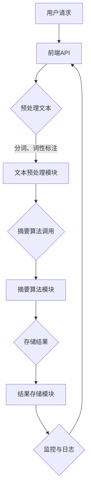

                 

### 引言与背景

#### 第1章: 数字时代的媒体变革

##### 1.1 数字化浪潮与新闻业变革

随着互联网和信息技术的飞速发展，媒体行业正经历一场前所未有的变革。传统的报纸、电视、广播等媒体形式逐渐被数字化、网络化、智能化所取代。这种变革源于数字化浪潮的席卷，它不仅改变了新闻的传播方式，也对新闻业产生了深远的影响。

**1.1.1 数字化对新闻业的影响**

数字化技术为新闻业带来了新的机遇和挑战。首先，互联网的普及使得新闻传播的渠道更加多样化，人们可以随时随地获取信息。社交媒体的兴起，更是打破了传统媒体的界限，让每个用户都可以成为信息的传播者。这种去中心化的传播模式，极大地提升了新闻的传播速度和范围。

然而，数字化也带来了挑战。一方面，信息的爆炸式增长使得用户获取高质量、个性化信息的难度增加；另一方面，虚假新闻、信息污染等问题也随之而来。如何在海量信息中筛选出有价值的内容，成为新闻业亟待解决的问题。

**1.1.2 新媒体环境的机遇与挑战**

新媒体环境为新闻业带来了新的机遇。一方面，大数据、人工智能等技术的应用，使得新闻摘要、推荐系统等智能化服务成为可能，提高了信息处理的效率和准确性。另一方面，新闻业可以借助数字化手段，实现内容的个性化定制和精准推送，提升用户体验。

但与此同时，新媒体环境也带来了挑战。首先，新闻业需要应对信息过载和受众分化的挑战，如何提供符合受众需求的新闻内容成为一个难题。其次，新闻业的商业模式也面临巨大压力，如何实现盈利和可持续发展，是每个新闻媒体都需要思考的问题。

##### 1.2 智能化发展的趋势

在数字化浪潮的推动下，智能化技术不断发展，并在新闻领域中找到了广泛的应用。人工智能（AI）作为智能化技术的代表，正在改变新闻生产的各个环节。

**1.2.1 智能技术的定义与发展**

智能技术是指能够模拟、延伸和扩展人类智能的理论、方法、工具和技术。人工智能作为智能技术的核心，经历了多个发展阶段，从早期的符号推理、知识表示，到如今的深度学习、自然语言处理等，其应用范围和效果不断提升。

**1.2.2 智能化在新闻领域的应用**

智能化技术在新闻领域的应用主要体现在以下几个方面：

1. **新闻生产自动化**：利用自然语言处理（NLP）技术，自动化生成新闻标题、摘要和内容。
2. **新闻推荐系统**：基于用户行为数据，利用机器学习算法，为用户推荐个性化的新闻内容。
3. **事实核查**：利用AI技术，自动识别和纠正虚假新闻，提高新闻的准确性和可信度。
4. **数据新闻**：通过大数据分析，挖掘新闻事件背后的趋势和关联，提供深度报道。

##### 1.3 摘要服务的需求与市场

摘要服务是新闻业智能化应用的一个重要方向，其目的是从海量信息中筛选出最有价值的部分，以简明、精准的方式呈现给用户。摘要服务的需求源于用户在信息爆炸时代对高效信息获取的需求，同时也受到市场趋势的推动。

**1.3.1 摘要服务的定义与作用**

摘要服务是指通过对文本进行自动分析，提取出关键信息，并以简短、精炼的形式呈现给用户的工具或系统。摘要服务的作用在于：

1. **提升信息获取效率**：帮助用户快速了解文章的主要内容，节省阅读时间。
2. **降低信息过载**：在信息爆炸的时代，摘要服务可以有效降低用户的信息过载，提高信息处理的效率。
3. **个性化推荐**：结合用户兴趣和行为，提供个性化的摘要服务，提升用户体验。

**1.3.2 摘要服务市场的现状与前景**

随着AI技术的不断发展，摘要服务市场呈现出快速增长的趋势。目前，摘要服务已经广泛应用于新闻、财经、科技等多个领域。根据市场调研数据，全球摘要服务市场规模预计将在未来几年内保持两位数的增长。

展望未来，摘要服务市场的前景十分广阔。一方面，随着AI技术的进一步发展，摘要服务的准确性和效率将不断提升；另一方面，随着用户对个性化信息需求的增加，摘要服务将更加智能化、个性化。

##### 1.4 AI在新闻摘要服务中的应用

人工智能技术在新闻摘要服务中的应用，使得摘要服务变得更加智能、高效和精准。以下将介绍AI技术在新闻摘要服务中的基本原理和应用场景。

**1.4.1 AI技术的基本原理**

AI技术主要包括机器学习、深度学习、自然语言处理等。机器学习是一种通过算法使计算机从数据中自动学习模式和规律的方法；深度学习是机器学习的一种，通过多层神经网络模拟人脑的决策过程；自然语言处理则是使计算机能够理解和处理人类自然语言的技术。

**1.4.2 AI在新闻摘要服务中的应用场景**

AI在新闻摘要服务中的应用场景主要包括：

1. **自动摘要**：利用自然语言处理技术，从长篇文章中自动提取出关键信息，生成摘要。
2. **摘要优化**：结合用户反馈，对生成的摘要进行优化，提高摘要的质量和可读性。
3. **个性化推荐**：根据用户的兴趣和阅读历史，推荐个性化的新闻摘要。
4. **事实核查**：利用AI技术，自动检测和纠正新闻中的错误信息。

**1.5 本章小结**

本章从数字化浪潮与新闻业变革、智能化发展趋势、摘要服务的需求与市场，以及AI在新闻摘要服务中的应用等四个方面，探讨了数字时代智能新闻摘要服务的发展背景和重要性。随着AI技术的不断进步，智能新闻摘要服务将更加智能化、个性化，为用户带来更高效、精准的信息获取体验。

#### 关键词：

- 数字化浪潮
- 智能化技术
- 新闻摘要服务
- AI应用场景
- 市场前景

> 摘要：本文探讨了数字时代智能新闻摘要服务的发展背景和重要性，分析了数字化浪潮对新闻业的影响，介绍了AI技术在新闻摘要服务中的应用，并探讨了摘要服务的市场前景和需求。通过本文的讨论，可以认识到智能新闻摘要服务在信息爆炸时代的价值，以及未来发展的广阔前景。

----------------------------------------------------------------

## 第一部分: 引言与背景

### 第1章: 数字时代的媒体变革

随着信息技术的迅猛发展，媒体行业正迎来一场深刻的变革。数字化浪潮不仅改变了新闻的传播方式，还重塑了新闻业的生产和消费模式。在这一章中，我们将深入探讨数字化浪潮对新闻业的影响，以及新媒体环境下新闻业所面临的机遇与挑战。

#### 1.1 数字化浪潮与新闻业变革

**1.1.1 数字化对新闻业的影响**

数字化技术的普及极大地改变了新闻的传播方式。传统媒体如报纸、电视和广播逐渐被互联网、移动设备和社交媒体所取代。这种变革带来了以下几方面的影响：

1. **传播速度与范围**：互联网的普及使得新闻的传播速度和范围大大提升。一条新闻可以通过社交媒体迅速传播到全球各地，改变了传统媒体传播的时间和地域限制。

2. **内容形式多样化**：数字化技术使得新闻内容的形式更加多样化。视频、音频、图片和文字等多种形式可以结合使用，为用户提供更加丰富和立体的新闻体验。

3. **互动性增强**：社交媒体的出现让用户不再是单纯的新闻接收者，他们可以参与到新闻的评论、转发和讨论中，增强了新闻的互动性。

4. **去中心化**：互联网和社交媒体的去中心化特性打破了传统媒体的中心化控制，使得每个人都可以成为信息的传播者，新闻生产的权力更加分散。

**1.1.2 新媒体环境的机遇与挑战**

新媒体环境为新闻业带来了诸多机遇：

1. **信息获取便利性**：用户可以随时随地通过移动设备获取新闻信息，大大提高了信息获取的便利性。

2. **数据驱动**：新媒体环境下的数据采集和分析能力显著增强，新闻机构可以利用大数据分析用户行为，从而更好地了解用户需求和偏好，提高内容的个性化程度。

3. **商业模式创新**：数字化技术为新闻业提供了多种新的商业模式，如订阅模式、广告模式、内容付费等，有助于提高新闻业的盈利能力。

然而，新媒体环境也带来了挑战：

1. **信息过载**：随着信息量的爆炸性增长，用户在筛选有价值信息时面临巨大挑战，信息过载成为一个普遍问题。

2. **内容质量下降**：在新媒体环境下，一些低质量、甚至虚假的新闻内容泛滥，降低了整体新闻质量。

3. **隐私问题**：新媒体环境下的数据收集和分析可能侵犯用户隐私，引发信任危机。

#### 1.2 智能化发展的趋势

**1.2.1 智能技术的定义与发展**

智能技术是指能够模拟、延伸和扩展人类智能的理论、方法、工具和技术。人工智能（AI）作为智能技术的核心，经历了多个发展阶段：

1. **符号主义**：早期的人工智能主要依赖于逻辑推理和符号计算。
2. **基于规则的系统**：通过定义一系列规则来处理特定问题。
3. **基于模型的系统**：使用统计模型和机器学习算法进行数据处理和预测。
4. **深度学习**：通过多层神经网络模拟人脑的决策过程，具备强大的学习和处理能力。

**1.2.2 智能化在新闻领域的应用**

智能化技术在新闻领域的应用主要体现在以下几个方面：

1. **自动化新闻生产**：利用自然语言处理技术，自动化生成新闻标题、摘要和内容。
2. **个性化推荐系统**：根据用户兴趣和行为数据，为用户推荐个性化的新闻内容。
3. **数据新闻**：通过大数据分析，挖掘新闻事件背后的趋势和关联，提供深度报道。
4. **事实核查**：利用AI技术，自动检测和纠正新闻中的错误信息，提高新闻的准确性和可信度。

#### 1.3 摘要服务的需求与市场

摘要服务是指通过对文本进行自动分析，提取出关键信息，并以简短、精炼的形式呈现给用户的工具或系统。摘要服务的需求源于以下两个方面：

1. **信息过载**：在信息爆炸的时代，用户需要高效地筛选出有价值的信息，摘要服务可以帮助用户快速了解文章的主要内容，节省阅读时间。
2. **个性化需求**：不同用户对信息的需求存在差异，摘要服务可以根据用户的兴趣和阅读历史，提供个性化的信息推荐。

摘要服务市场具有巨大的潜力，随着AI技术的不断发展，摘要服务的准确性和效率将不断提升。根据市场调研数据，全球摘要服务市场规模预计将在未来几年内保持快速增长。

#### 1.4 AI在新闻摘要服务中的应用

人工智能技术在新闻摘要服务中的应用，使得摘要服务变得更加智能、高效和精准。以下将介绍AI技术在新闻摘要服务中的基本原理和应用场景：

1. **自动摘要**：利用自然语言处理技术，从长篇文章中自动提取出关键信息，生成摘要。
2. **摘要优化**：结合用户反馈，对生成的摘要进行优化，提高摘要的质量和可读性。
3. **个性化推荐**：根据用户的兴趣和阅读历史，推荐个性化的新闻摘要。
4. **事实核查**：利用AI技术，自动检测和纠正新闻中的错误信息，提高新闻的准确性和可信度。

**1.5 本章小结**

本章从数字化浪潮与新闻业变革、智能化发展趋势、摘要服务的需求与市场，以及AI在新闻摘要服务中的应用等四个方面，探讨了数字时代智能新闻摘要服务的发展背景和重要性。随着AI技术的不断进步，智能新闻摘要服务将更加智能化、个性化，为用户带来更高效、精准的信息获取体验。

----------------------------------------------------------------

## 第二部分: AI基础

在探讨智能新闻摘要服务之前，我们需要深入理解人工智能（AI）的基本原理和应用。本部分将介绍人工智能的定义、发展历程，以及其在机器学习和自然语言处理等领域的应用，为后续章节的讨论奠定基础。

### 第2章: 人工智能概述

#### 2.1 人工智能的定义与发展历程

**2.1.1 人工智能的定义**

人工智能（Artificial Intelligence，简称AI）是指通过计算机系统模拟人类智能的理论、方法、技术及应用。其核心目标是使计算机具备类似人类的感知、推理、学习和决策能力。人工智能包括多个子领域，如机器学习、自然语言处理、计算机视觉等。

**2.1.2 人工智能的发展历程**

人工智能的发展历程可以大致分为以下几个阶段：

1. **早期探索（1950s-1960s）**：人工智能的概念首次被提出，以图灵测试为代表，试图通过计算机模拟人类思维。
2. **黄金时代（1970s-1980s）**：人工智能开始受到广泛关注，符号主义和知识表示成为主要研究方向。
3. **低谷期（1990s）**：由于实际应用中的困难，人工智能研究进入低谷期。
4. **复兴期（2000s-2010s）**：随着计算能力的提升和大数据技术的发展，人工智能迎来了新的复兴期，深度学习等新技术取得突破性进展。
5. **当前发展（2010s-至今）**：人工智能在多个领域取得了广泛应用，如自动驾驶、智能助手、医疗诊断等。

#### 2.2 机器学习与深度学习

**2.2.1 机器学习的概念**

机器学习（Machine Learning，简称ML）是人工智能的一个重要分支，主要研究如何让计算机从数据中自动学习模式和规律，并利用这些模式进行预测和决策。机器学习通常分为监督学习、无监督学习和强化学习等几种类型。

1. **监督学习**：通过已知输入和输出数据，训练模型来预测未知数据。
2. **无监督学习**：没有已知输出数据，通过数据间的关联和模式进行聚类和降维。
3. **强化学习**：通过与环境交互，不断调整策略以最大化回报。

**2.2.2 深度学习的原理与技术**

深度学习（Deep Learning，简称DL）是机器学习的一种，通过多层神经网络（Neural Networks）模拟人脑的决策过程。深度学习在图像识别、语音识别和自然语言处理等领域取得了显著成果。

1. **神经网络的基本组成**：神经元、层（输入层、隐藏层、输出层）和连接权重。
2. **反向传播算法**：通过反向传播误差，不断调整网络权重，优化模型性能。
3. **卷积神经网络（CNN）**：适用于图像处理，通过卷积和池化操作提取图像特征。
4. **递归神经网络（RNN）**：适用于序列数据处理，通过隐藏状态和循环连接模拟时间序列的动态特性。
5. **长短时记忆网络（LSTM）**：RNN的一种改进，能够更好地处理长序列数据。

#### 2.3 人工智能的核心算法

**2.3.1 神经网络的组成与工作原理**

神经网络由大量简单的人工神经元组成，每个神经元通过加权连接与其他神经元相连。神经网络的工作原理是通过学习输入数据与输出数据之间的映射关系，从而实现对复杂问题的建模和预测。

1. **神经元模型**：每个神经元接受多个输入，通过加权求和后加上偏置项，再经过激活函数进行非线性变换。
2. **前向传播与反向传播**：前向传播是将输入数据通过神经网络传递到输出层，反向传播是利用输出误差调整网络权重。

**2.3.2 卷积神经网络（CNN）**

卷积神经网络是深度学习在计算机视觉领域的重要应用，通过卷积和池化操作提取图像特征。

1. **卷积操作**：卷积层通过滑动滤波器（卷积核）在图像上滑动，提取局部特征。
2. **池化操作**：池化层对卷积层输出的特征进行下采样，减少参数量和计算量。
3. **多层数卷积网络**：通过堆叠多个卷积层和池化层，逐步提取图像的高层抽象特征。

**2.3.3 递归神经网络（RNN）**

递归神经网络适用于序列数据处理，如时间序列分析、自然语言处理等。

1. **递归结构**：RNN的输入和输出是自身的隐藏状态，通过递归连接实现时间序列数据的建模。
2. **长短时记忆（LSTM）网络**：LSTM是RNN的一种改进，通过门控机制有效地解决了长序列数据中的梯度消失和梯度爆炸问题。

**2.3.4 长短时记忆网络（LSTM）**

LSTM通过门控机制控制信息的流入和流出，从而实现长期记忆。

1. **输入门**：决定当前输入信息中有哪些部分需要更新到状态中。
2. **遗忘门**：决定哪些旧信息需要被遗忘。
3. **输出门**：决定当前状态中有哪些部分需要输出。

#### 2.4 AI与大数据

**2.4.1 大数据的定义与特点**

大数据（Big Data）是指无法使用传统数据处理工具在合理时间内进行捕捉、管理和处理的数据集。大数据具有四个基本特点，即“4V”：Volume（大量）、Velocity（高速）、Variety（多样性）和Veracity（真实性）。

**2.4.2 大数据与AI的关系**

大数据为AI提供了丰富的训练数据，是机器学习和深度学习模型的重要基础。AI技术则通过数据分析和处理，从大数据中提取有价值的信息和知识。两者相互促进，共同推动了智能化技术的发展。

**2.5 本章小结**

本章从人工智能的定义、发展历程，以及机器学习和自然语言处理等核心算法，探讨了AI的基础知识。通过对AI基础的理解，我们可以更好地把握智能新闻摘要服务的原理和应用，为后续章节的讨论奠定基础。

----------------------------------------------------------------

### 第3章: 自然语言处理（NLP）

自然语言处理（Natural Language Processing，简称NLP）是人工智能领域的一个重要分支，旨在使计算机能够理解和处理人类自然语言。NLP技术广泛应用于文本分类、情感分析、机器翻译和语音识别等场景。本章将详细介绍NLP的基本概念、关键技术以及其在文本预处理、语言模型和文本生成等方面的应用。

#### 3.1 NLP的基本概念

**3.1.1 NLP的定义与目标**

自然语言处理（NLP）是指利用计算机技术和算法对人类自然语言进行理解和生成的一种技术。NLP的目标是实现人与机器之间的自然交互，使得计算机能够理解、解释和生成人类语言。

**3.1.2 NLP的关键技术**

NLP涉及多个关键技术，主要包括：

1. **分词**：将连续的文本划分为有意义的词汇单元。
2. **词性标注**：对文本中的每个词赋予词性标签，如名词、动词、形容词等。
3. **句法分析**：分析句子的结构，识别句子中的成分和关系。
4. **语义分析**：理解文本中的含义和意图，进行语义推理和情感分析。
5. **实体识别**：识别文本中的命名实体，如人名、地名、组织名等。
6. **机器翻译**：将一种语言的文本翻译成另一种语言。
7. **语音识别**：将语音信号转换为文本。

#### 3.2 文本预处理

文本预处理是NLP任务中的基础环节，主要包括分词、词性标注、去除停用词和词干提取等步骤。

**3.2.1 分词**

分词是将连续的文本序列切分成有意义的词汇单元。常用的分词方法包括基于词典的分词、基于统计的分词和深度学习分词等。

1. **基于词典的分词**：通过查找预定义的词典，将文本切分成已知的词汇单元。
2. **基于统计的分词**：使用统计模型，如最大熵模型、隐马尔可夫模型（HMM）和条件随机场（CRF）等，自动识别文本中的词汇单元。
3. **深度学习分词**：使用神经网络，如循环神经网络（RNN）和长短时记忆网络（LSTM），通过端到端学习实现分词。

**3.2.2 命名实体识别**

命名实体识别（Named Entity Recognition，简称NER）是识别文本中的命名实体，如人名、地名、组织名、时间等。NER对于信息提取、知识图谱构建和问答系统具有重要意义。

1. **基于规则的方法**：使用预定义的规则，如正则表达式、命名实体词典等，识别文本中的命名实体。
2. **基于统计的方法**：使用统计模型，如条件随机场（CRF）和隐马尔可夫模型（HMM），通过训练数据学习命名实体的识别模式。
3. **基于深度学习的方法**：使用神经网络，如卷积神经网络（CNN）和循环神经网络（RNN），通过端到端学习实现命名实体识别。

**3.2.3 词性标注**

词性标注（Part-of-Speech Tagging，简称POS）是对文本中的每个词赋予词性标签，如名词、动词、形容词等。词性标注有助于理解文本的语法结构和语义含义。

1. **基于规则的方法**：使用预定义的规则，如正则表达式、词性标注词典等，为文本中的每个词分配词性标签。
2. **基于统计的方法**：使用统计模型，如最大熵模型（Maximum Entropy）和条件随机场（CRF），通过训练数据学习词性标注的规则。
3. **基于深度学习的方法**：使用神经网络，如卷积神经网络（CNN）和循环神经网络（RNN），通过端到端学习实现词性标注。

#### 3.3 语言模型

语言模型（Language Model，简称LM）是NLP中的重要工具，用于预测文本序列的概率分布。语言模型可以帮助NLP任务实现自动分词、词性标注、机器翻译和文本生成等。

**3.3.1 语言模型的定义与作用**

语言模型是一种概率模型，用于预测下一个单词或字符的概率，从而实现文本序列的概率分布。语言模型在NLP任务中的作用包括：

1. **分词**：通过语言模型，将连续的文本序列划分为有意义的词汇单元。
2. **词性标注**：利用语言模型，为文本中的每个词赋予词性标签。
3. **机器翻译**：通过语言模型，将一种语言的文本翻译成另一种语言。
4. **文本生成**：利用语言模型，生成符合语法和语义规则的文本。

**3.3.2 语言模型的基本算法**

常见的语言模型算法包括基于N-gram的语言模型和基于神经网络的深度语言模型。

1. **基于N-gram的语言模型**：N-gram模型是一种统计语言模型，通过计算前N个单词序列出现的概率来预测下一个单词。N-gram模型简单有效，但存在长程依赖性问题。
2. **基于神经网络的深度语言模型**：深度神经网络语言模型（如BERT、GPT等）通过多层神经网络学习文本的深层表示，能够更好地捕捉长程依赖关系。深度语言模型在文本生成、机器翻译和问答系统等领域取得了显著成果。

#### 3.4 文本生成

文本生成是NLP的一个重要任务，旨在根据给定的输入，生成符合语法和语义规则的文本。文本生成在自动摘要、问答系统和对话系统等领域具有广泛应用。

**3.4.1 生成式模型**

生成式模型通过生成文本的概率分布，从而生成符合输入的文本。常见的生成式模型包括：

1. **循环神经网络（RNN）**：通过递归结构，逐个生成文本中的每个单词或字符。
2. **长短时记忆网络（LSTM）**：通过门控机制，更好地处理长程依赖问题。
3. **门控循环单元（GRU）**：GRU是LSTM的变体，具有更简单的结构和更好的性能。
4. **生成式对抗网络（GAN）**：通过生成器和判别器的对抗训练，生成高质量的文本。

**3.4.2 对抗生成网络（GAN）**

对抗生成网络（Generative Adversarial Network，简称GAN）是一种生成式模型，由生成器和判别器两个神经网络组成。生成器生成伪造数据，判别器判断数据是真实还是伪造。通过生成器和判别器的对抗训练，GAN能够生成高质量的文本。

1. **生成器**：生成器生成符合真实数据的文本。
2. **判别器**：判别器判断文本是真实还是伪造。
3. **对抗训练**：生成器和判别器通过对抗训练不断优化，生成器生成的文本质量逐渐提高。

#### 3.5 情感分析

情感分析（Sentiment Analysis，简称SA）是一种文本分析技术，旨在识别文本中所表达的情感倾向，如正面、负面或中性。情感分析在市场调研、社交媒体监控和客户反馈分析等领域具有广泛应用。

**3.5.1 情感分析的定义与目的**

情感分析的定义是识别文本中的情感倾向，如正面、负面或中性。情感分析的目的包括：

1. **情感分类**：将文本分类为正面、负面或中性。
2. **情感强度评估**：评估文本中的情感强度，如非常正面、比较正面等。
3. **情感趋势分析**：分析文本中情感的变化趋势，如用户对某个产品或服务的情感变化。

**3.5.2 情感分析的方法与技术**

情感分析的方法包括基于规则的方法、基于统计的方法和基于机器学习的方法。

1. **基于规则的方法**：使用预定义的规则，如情感词典和规则库，识别文本中的情感。
2. **基于统计的方法**：使用统计模型，如最大熵模型和条件随机场（CRF），通过训练数据学习情感分类规则。
3. **基于机器学习的方法**：使用机器学习算法，如支持向量机（SVM）和朴素贝叶斯（NB），通过训练数据学习情感分类模型。
4. **基于深度学习的方法**：使用神经网络，如卷积神经网络（CNN）和循环神经网络（RNN），通过端到端学习实现情感分析。

**3.6 本章小结**

本章从NLP的基本概念、关键技术，以及文本预处理、语言模型、文本生成和情感分析等方面，详细介绍了自然语言处理的基本原理和应用。通过对NLP技术的理解，我们可以更好地把握智能新闻摘要服务的实现方法和应用场景，为后续章节的讨论提供基础。

----------------------------------------------------------------

## 第三部分: 智能新闻摘要服务

### 第4章: 新闻摘要服务概述

随着数字化和智能化技术的不断发展，新闻摘要服务逐渐成为信息时代的一项重要工具。本章将介绍新闻摘要的定义、类型，以及智能新闻摘要的优势与挑战，旨在帮助读者理解新闻摘要服务的基本概念和核心价值。

#### 4.1 新闻摘要的定义与类型

**4.1.1 新闻摘要的定义**

新闻摘要是一种信息压缩工具，旨在从原始新闻文本中提取关键信息，以简短、精练的方式呈现给读者。摘要服务的主要目的是提高信息获取效率，帮助用户快速了解新闻的核心内容，而无需阅读整个文章。

**4.1.2 新闻摘要的类型**

根据摘要的生成方式和内容结构，新闻摘要可以分为以下几种类型：

1. **关键词摘要**：提取文章中出现频率较高的关键词，以关键词列表的形式呈现。
2. **句子摘要**：选择文章中的关键句子，以简短文本的形式呈现。
3. **段落摘要**：提取文章中的关键段落，以缩写或简化后的段落形式呈现。
4. **全文摘要**：对整篇文章进行压缩，提取出主要内容，以一篇简短的文章形式呈现。

#### 4.2 智能新闻摘要的优势与挑战

**4.2.1 智能新闻摘要的优势**

智能新闻摘要服务借助人工智能技术，在提高摘要质量、效率和个性化推荐等方面具有显著优势：

1. **提高摘要质量**：通过自然语言处理技术，智能新闻摘要能够更准确地提取文章的核心信息，提高摘要的准确性和可读性。
2. **提升效率**：自动化摘要算法可以快速处理大量新闻文本，提高信息筛选和摘要生成的效率。
3. **个性化推荐**：根据用户的兴趣和行为数据，智能新闻摘要可以为用户提供个性化的摘要内容，提升用户体验。
4. **减轻信息过载**：在信息爆炸的时代，智能新闻摘要能够帮助用户快速筛选出有价值的信息，减轻信息过载带来的压力。

**4.2.2 智能新闻摘要的挑战**

尽管智能新闻摘要具有诸多优势，但在实际应用中仍面临一些挑战：

1. **摘要质量控制**：自动化摘要算法在处理复杂、多样化的新闻文本时，可能无法完全保证摘要的质量。如何在自动化和人工干预之间找到平衡，是摘要服务面临的一个难题。
2. **数据隐私与安全**：智能新闻摘要在处理用户数据时，需要确保数据的安全性和隐私性。如何在提供个性化服务的同时，保护用户隐私，是摘要服务需要考虑的一个重要问题。
3. **技术更新与维护**：随着技术的不断进步，智能新闻摘要服务需要不断更新和优化算法，以适应新的应用场景和技术趋势。技术更新和维护的频率和成本，是摘要服务需要面对的挑战。

#### 4.3 智能新闻摘要的技术架构

智能新闻摘要服务的实现涉及多个技术环节，主要包括文本预处理、摘要算法、摘要优化和用户反馈机制等。

**4.3.1 摘要算法的选择**

摘要算法是智能新闻摘要服务的核心组件，其选择直接影响摘要的质量和效率。常见的摘要算法包括：

1. **基于文本的摘要算法**：如基于词频的摘要、基于关键字的摘要和基于句子的摘要等。
2. **基于模型的摘要算法**：如基于文本分类的摘要、基于深度学习的摘要等。
3. **混合摘要算法**：结合多种算法的优点，实现更高质量的摘要生成。

**4.3.2 技术栈的搭建**

智能新闻摘要服务的技术栈主要包括：

1. **文本预处理**：使用自然语言处理技术进行分词、词性标注、命名实体识别等，为摘要算法提供高质量的数据输入。
2. **摘要算法**：根据具体需求选择合适的摘要算法，进行摘要生成。
3. **摘要优化**：结合用户反馈和语义分析，对生成的摘要进行优化，提高摘要的质量和可读性。
4. **用户反馈机制**：收集用户对摘要的反馈，用于改进摘要算法和优化服务。

**4.4 智能新闻摘要的服务模式**

智能新闻摘要服务可以采用多种服务模式，以满足不同用户的需求：

1. **自动化摘要服务**：通过算法自动生成摘要，无需人工干预。
2. **半自动化摘要服务**：结合人工干预和算法，提高摘要的质量和准确性。
3. **个性化摘要服务**：根据用户的兴趣和行为数据，为用户推荐个性化的摘要内容。

**4.5 本章小结**

本章从新闻摘要的定义和类型，到智能新闻摘要的优势与挑战，以及技术架构和服务模式等方面，详细介绍了智能新闻摘要服务的基本概念和核心价值。随着人工智能技术的不断发展，智能新闻摘要服务将不断优化和完善，为用户提供更加高效、精准的信息获取体验。

----------------------------------------------------------------

### 第5章: 基于AI的新闻摘要算法

新闻摘要服务在信息爆炸时代具有重要的应用价值，而基于人工智能（AI）的新闻摘要算法更是为这一服务提供了强有力的技术支撑。本章将深入探讨基于AI的新闻摘要算法的基本原理，包括自动摘要算法的类型和流程，以及基于文本的摘要算法和基于模型的摘要算法。

#### 5.1 自动摘要算法的基本原理

自动摘要算法（Automatic Summarization Algorithm）是新闻摘要服务中至关重要的组成部分。自动摘要算法通过分析原始新闻文本，自动提取出关键信息，生成摘要。自动摘要算法的基本原理主要包括以下两个方面：

**5.1.1 自动摘要算法的类型**

自动摘要算法主要可以分为以下几种类型：

1. **提取式摘要（Extractive Summarization）**：提取式摘要算法从原始文本中选择关键句子或段落，作为摘要的内容。这种方法的主要优势是生成的摘要保持了原始文本的语法和结构，但可能导致摘要内容重复或冗余。
2. **生成式摘要（Abstractive Summarization）**：生成式摘要算法通过理解和重构原始文本，生成全新的摘要内容。这种方法可以创造性地表达新闻的核心信息，但难度较大，目前尚处于研究和探索阶段。
3. **混合摘要（Mixing Summarization）**：混合摘要算法结合了提取式和生成式摘要的优点，通过不同的策略和模型，生成高质量的摘要内容。

**5.1.2 自动摘要算法的流程**

自动摘要算法的流程通常包括以下几个步骤：

1. **文本预处理**：对原始新闻文本进行预处理，包括分词、词性标注、去除停用词等操作，为摘要算法提供高质量的数据输入。
2. **关键词提取**：通过统计方法或机器学习算法，提取文本中的关键信息，如高频词、关键词等。
3. **句子或段落选择**：根据提取的关键信息，选择文本中的关键句子或段落，作为摘要的内容。
4. **摘要生成**：将选定的句子或段落进行整合和简化，生成摘要文本。
5. **摘要优化**：结合用户反馈和语义分析，对生成的摘要进行优化，提高摘要的质量和可读性。

#### 5.2 基于文本的摘要算法

基于文本的摘要算法（Text-Based Summarization Algorithm）是新闻摘要服务中常用的一类算法。这类算法主要通过分析文本的词频、关键词和句子结构等信息，生成摘要。以下是几种常见的基于文本的摘要算法：

**5.2.1 基于词频的摘要算法**

基于词频的摘要算法通过计算文本中各个词的出现频率，选择高频词作为摘要内容。这种方法简单有效，但可能导致摘要内容重复或冗余。常见的基于词频的摘要算法包括：

1. **TF-IDF（Term Frequency-Inverse Document Frequency）**：TF-IDF算法通过计算词的频率和逆文档频率，衡量词的重要性。高频词和重要词通常被认为是文本的关键信息。
2. **LDA（Latent Dirichlet Allocation）**：LDA算法通过概率模型，发现文本中的潜在主题，并提取与主题相关的关键词，作为摘要内容。

**5.2.2 基于关键字的摘要算法**

基于关键字的摘要算法通过提取文本中的关键词，生成摘要。这种方法通常结合词频分析和语义分析，选择与文本主题紧密相关的关键词，作为摘要的内容。常见的基于关键字的摘要算法包括：

1. **LSA（Latent Semantic Analysis）**：LSA算法通过隐语义分析，发现文本中的潜在语义结构，并提取与文本主题相关的关键词。
2. **BERT（Bidirectional Encoder Representations from Transformers）**：BERT算法通过双向编码器，理解文本的上下文信息，提取与文本主题相关的关键词。

**5.2.3 基于句子的摘要算法**

基于句子的摘要算法通过分析文本中的句子结构，选择关键句子作为摘要的内容。这种方法通常结合语法分析和语义分析，选择与文本主题紧密相关的句子，作为摘要的内容。常见的基于句子的摘要算法包括：

1. **TextRank**：TextRank算法通过图模型，分析文本中的句子关系，选择重要的句子作为摘要内容。
2. **DeepSum**：DeepSum算法通过深度学习模型，理解文本的语义信息，选择与文本主题紧密相关的句子作为摘要内容。

#### 5.3 基于模型的摘要算法

基于模型的摘要算法（Model-Based Summarization Algorithm）是新闻摘要服务中另一类重要的算法。这类算法通过机器学习和深度学习技术，自动提取文本中的关键信息，生成摘要。以下是几种常见的基于模型的摘要算法：

**5.3.1 基于文本分类的摘要算法**

基于文本分类的摘要算法通过文本分类模型，将新闻文本分类为不同的主题，并提取与主题相关的句子作为摘要内容。这种方法通常结合词频分析和语义分析，选择与文本主题紧密相关的句子，作为摘要的内容。常见的基于文本分类的摘要算法包括：

1. **朴素贝叶斯分类器**：朴素贝叶斯分类器通过计算文本的词频和概率分布，将新闻文本分类为不同的主题。
2. **支持向量机（SVM）**：支持向量机通过计算文本的高维特征空间，将新闻文本分类为不同的主题。

**5.3.2 基于深度学习的摘要算法**

基于深度学习的摘要算法通过深度学习模型，自动提取文本中的关键信息，生成摘要。这种方法通常结合词嵌入和神经网络，理解文本的语义信息，选择与文本主题紧密相关的句子，作为摘要的内容。常见的基于深度学习的摘要算法包括：

1. **序列到序列（Seq2Seq）模型**：序列到序列模型通过编码器和解码器，将原始文本转换为摘要文本。
2. **BERT模型**：BERT模型通过双向编码器，理解文本的上下文信息，提取与文本主题相关的句子作为摘要内容。

**5.4 摘要算法的性能评估**

摘要算法的性能评估是新闻摘要服务中至关重要的一环。常见的性能评估指标包括：

1. **ROUGE（Recall-Oriented Understudy for Gisting Evaluation）**：ROUGE指标通过计算摘要与原始文本的相似度，评估摘要的质量。
2. **BLEU（Bilingual Evaluation Understudy）**：BLEU指标通过计算摘要与原始文本的相似度，评估摘要的质量。
3. **NIST（National Institute of Standards and Technology）**：NIST指标通过计算摘要与原始文本的相似度，评估摘要的质量。

通过这些性能评估指标，可以客观地评估摘要算法的质量和效果，为后续的算法优化和改进提供参考。

**5.5 本章小结**

本章从自动摘要算法的基本原理，到基于文本的摘要算法和基于模型的摘要算法，详细介绍了新闻摘要算法的类型和实现方法。随着人工智能技术的不断发展，新闻摘要算法将不断优化和完善，为用户提供更加高效、精准的新闻摘要服务。

----------------------------------------------------------------

### 第6章: 智能新闻摘要服务的实现

#### 6.1 实现智能新闻摘要服务的技术栈

实现智能新闻摘要服务涉及多种技术和工具，一个完整的技术栈通常包括以下几个方面：

1. **文本预处理库**：如NLTK、spaCy等，用于进行文本的分词、词性标注、命名实体识别等预处理操作。
2. **机器学习框架**：如TensorFlow、PyTorch等，用于训练和部署深度学习模型。
3. **自然语言处理（NLP）库**：如NLTK、spaCy、gensim等，提供丰富的NLP工具和算法，用于文本分析、摘要生成等。
4. **后端服务框架**：如Flask、Django等，用于搭建Web应用，提供API接口，处理用户请求和摘要生成。
5. **前端框架**：如React、Vue.js等，用于构建用户界面，展示摘要结果。
6. **数据库**：如MySQL、PostgreSQL等，用于存储用户数据、新闻数据和摘要结果。

#### 6.2 系统架构设计

智能新闻摘要服务系统的架构设计需要考虑高可用性、可扩展性和易维护性。以下是系统架构设计的基本框架：

1. **前端**：用户通过Web浏览器或移动应用发起摘要请求，前端负责展示用户界面和处理用户交互。
2. **后端API**：后端API接收前端请求，处理摘要生成任务，并返回摘要结果。后端API通常包括文本预处理、摘要算法调用和结果返回等模块。
3. **文本预处理模块**：对用户提交的文本进行分词、词性标注、命名实体识别等预处理操作，为摘要算法提供高质量的数据输入。
4. **摘要算法模块**：根据选定的摘要算法（如基于文本的摘要算法、基于模型的摘要算法等），生成摘要文本。
5. **结果存储模块**：将生成的摘要文本存储到数据库中，以便后续查询和优化。
6. **服务监控和日志模块**：监控系统性能、日志记录和分析，确保系统的稳定运行和故障排查。

以下是系统架构的Mermaid流程图：



#### 6.3 摘要算法的代码实现

以下是一个基于TextRank算法的简单Python代码示例，用于生成新闻摘要：

```python
import nltk
from nltk.tokenize import sent_tokenize
from collections import defaultdict
from heapq import nlargest

def text_rank_summarizer(document, summary_size):
    sentences = sent_tokenize(document)
    sentence_scores = defaultdict(int)

    for sentence in sentences:
        words = nltk.word_tokenize(sentence.lower())
        word_scores = nltk.FreqDist(words)
        for word in words:
            sentence_scores[sentence] += word_scores[word]

    sorted_sentences = nlargest(summary_size, sentence_scores, key=sentence_scores.get)
    summary = ' '.join(sorted_sentences)

    return summary

document = "Your original news text goes here."
summary_size = 5  # Number of sentences in the summary
summary = text_rank_summarizer(document, summary_size)
print(summary)
```

在这个示例中，我们首先使用nltk进行文本的分词，然后计算每个句子的得分，选择最高分的句子作为摘要内容。这个简单的示例演示了文本摘要的基本流程。

#### 6.4 系统性能优化与测试

系统性能优化是智能新闻摘要服务实现过程中的重要一环，以下是一些常见的优化策略：

1. **缓存机制**：使用缓存技术，如Redis，减少重复计算，提高系统响应速度。
2. **异步处理**：使用异步处理技术，如异步IO和多线程，提高系统并发处理能力。
3. **负载均衡**：使用负载均衡器，如Nginx，合理分配请求到不同的服务器，提高系统可用性和容错性。
4. **数据库优化**：使用数据库索引、分库分表等技术，提高数据库查询效率。
5. **自动化测试**：使用自动化测试工具，如pytest，进行系统测试，确保系统的稳定性和可靠性。

通过以上优化策略，可以显著提高智能新闻摘要服务的性能和稳定性，为用户提供更好的服务体验。

#### 6.5 本章小结

本章详细介绍了实现智能新闻摘要服务所需的技术栈、系统架构设计、代码实现和性能优化策略。通过理解这些内容，读者可以更好地掌握智能新闻摘要服务的实现方法和关键技术，为实际项目开发提供有力支持。

----------------------------------------------------------------

## 第六部分：案例分析与最佳实践

### 6.6 案例分析

为了更好地理解智能新闻摘要服务的实现过程和效果，我们选择一个实际的案例进行分析。以下是一个基于AI的新闻摘要服务案例：

**案例背景**：

某新闻媒体公司希望为其网站和移动应用提供智能新闻摘要服务，以提高用户的信息获取效率和阅读体验。公司拥有庞大的新闻数据库，涵盖各类新闻内容，包括政治、经济、科技、娱乐等。

**实现步骤**：

1. **数据收集与预处理**：从新闻数据库中抽取原始新闻文本，进行分词、词性标注、命名实体识别等预处理操作，确保文本数据的质量和一致性。

2. **摘要算法选择与训练**：选择基于深度学习的摘要算法（如Seq2Seq模型、BERT模型等），进行模型训练和优化。训练数据包括大量的新闻文本及其对应的摘要文本。

3. **服务部署与集成**：将训练好的模型部署到服务器上，并通过API接口与前端应用进行集成，实现实时摘要生成功能。

4. **用户反馈与优化**：收集用户对摘要结果的反馈，结合自然语言处理技术，对模型进行持续优化，提高摘要质量。

**案例分析**：

通过该案例，我们可以看到智能新闻摘要服务在实际应用中的实现过程和效果。以下是案例分析的关键点：

1. **数据质量**：新闻文本的预处理质量直接影响摘要算法的性能。通过高质量的预处理操作，可以确保摘要算法能够准确提取文本的关键信息。

2. **模型选择**：不同的摘要算法适用于不同的场景和需求。在实际应用中，需要根据新闻内容的复杂度和用户需求，选择合适的摘要算法。

3. **实时性**：智能新闻摘要服务需要实现实时摘要生成，以满足用户对即时信息的需求。通过优化算法和部署架构，可以提高系统的响应速度和处理能力。

4. **用户体验**：摘要质量直接影响用户体验。通过收集用户反馈，不断优化模型和算法，可以提高摘要的准确性和可读性，提升用户体验。

### 6.7 最佳实践

在实际开发智能新闻摘要服务时，以下是一些最佳实践：

1. **数据预处理**：确保文本数据的质量和一致性，包括去除标点符号、停用词处理、词干提取等。

2. **模型选择与优化**：根据新闻内容的复杂度和用户需求，选择合适的摘要算法。同时，通过持续优化模型参数和超参数，提高摘要质量。

3. **服务架构**：采用分布式架构，提高系统的可扩展性和容错性。使用缓存和异步处理技术，提高系统的响应速度和处理能力。

4. **用户体验**：提供用户反馈机制，收集用户对摘要结果的反馈，并根据用户需求进行个性化推荐。

5. **安全与隐私**：确保用户数据的安全性和隐私性，遵循相关的数据保护法规和标准。

6. **性能监控与优化**：定期进行系统性能监控，及时发现和解决性能瓶颈，优化系统架构和算法。

### 6.8 本章小结

通过案例分析，我们可以看到智能新闻摘要服务在实际应用中的实现过程和效果。最佳实践提供了实现高效、准确和个性化的新闻摘要服务的方法和策略。通过理解和应用这些最佳实践，开发人员可以更好地实现智能新闻摘要服务，提升用户体验，满足市场需求。

----------------------------------------------------------------

### 第7章: 小结与未来展望

在数字时代，智能新闻摘要服务已成为媒体行业的一项重要工具。通过本篇文章，我们深入探讨了智能新闻摘要服务的背景、AI基础、实现方法以及案例分析，总结了智能新闻摘要服务的核心价值和未来发展趋势。

#### 7.1 关键点总结

1. **数字化浪潮与新闻业变革**：数字化技术的普及改变了新闻的传播方式和生产模式，带来了新的机遇和挑战。
2. **智能化发展趋势**：人工智能技术在新闻摘要服务中具有重要应用，包括自动摘要、个性化推荐和事实核查等。
3. **摘要服务的需求与市场**：摘要服务在信息过载时代具有显著的应用价值，市场前景广阔。
4. **AI基础**：人工智能的基本原理、机器学习和自然语言处理技术为智能新闻摘要服务提供了技术支持。
5. **实现方法**：介绍了智能新闻摘要服务的技术栈、系统架构设计、代码实现和性能优化策略。
6. **案例分析**：通过实际案例，展示了智能新闻摘要服务的实现过程和效果。
7. **最佳实践**：提供了智能新闻摘要服务的最佳实现方法和策略。

#### 7.2 未来展望

未来，智能新闻摘要服务将在以下方面取得进一步发展：

1. **算法优化**：随着人工智能技术的不断进步，摘要算法将更加高效、准确，能够更好地处理复杂和多变的新闻内容。
2. **个性化推荐**：结合用户行为数据和个性化需求，提供更加精准的摘要推荐服务。
3. **多模态摘要**：融合文本、图片、视频等多媒体数据，实现多模态的新闻摘要。
4. **跨语言摘要**：支持多种语言之间的新闻摘要，满足全球化新闻传播的需求。
5. **隐私保护**：在提供个性化服务的同时，加强数据隐私保护和用户隐私保护。
6. **伦理问题**：关注人工智能在新闻摘要服务中的伦理问题，如信息准确性、偏见和虚假新闻等，制定相应的规范和标准。

#### 7.3 结语

智能新闻摘要服务在数字时代具有重要的应用价值，通过人工智能技术的应用，可以实现更高效、精准和个性化的新闻摘要服务。未来，随着技术的不断进步和应用场景的拓展，智能新闻摘要服务将发挥更大的作用，为用户提供更好的信息获取体验。

### 作者信息：

- 作者：AI天才研究院/AI Genius Institute & 禅与计算机程序设计艺术 /Zen And The Art of Computer Programming

---

本文探讨了数字时代智能新闻摘要服务的发展背景、核心价值和未来展望，总结了相关技术和实现方法。通过深入分析和案例研究，为读者提供了全面的理解和参考。希望本文能够为相关领域的学者和实践者提供有益的启示和指导。

