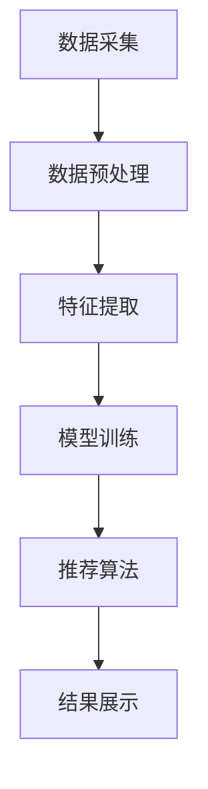
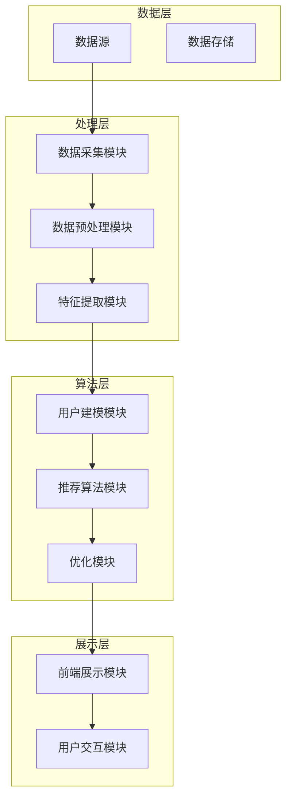
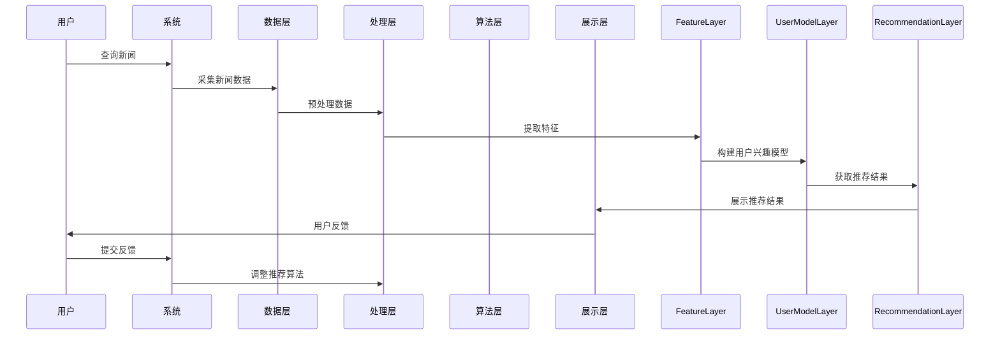

                 


### 第一部分: 引言与背景

在数字时代，信息传播的速度和广度前所未有。然而，随之而来的是信息过载的问题，用户在纷繁复杂的新闻海洋中难以找到自己真正感兴趣的内容。智能新闻聚合与个性化信息推送系统应运而生，它们利用人工智能技术，为用户精准地推荐个性化的新闻内容，从而提高信息获取的效率和满意度。

#### 核心概念术语说明

- **智能新闻聚合**：指通过人工智能算法，对大量新闻数据进行处理、分类和整合，以提供个性化新闻推荐服务。
- **个性化信息推送**：根据用户的兴趣和行为，动态地为用户推荐相关的新闻内容。
- **人工智能（AI）**：模拟、延伸和扩展人的智能的科学和技术。

#### 问题背景

随着互联网的普及，新闻媒体行业正经历深刻的变革。传统的新闻分发方式已经无法满足用户对个性化和即时性的需求。面对海量信息，用户常常感到无所适从，而新闻媒体则需要更有效地吸引和保留受众。

#### 问题描述

如何利用人工智能技术，构建一个智能新闻聚合系统，实现对新闻内容的高效处理和个性化推荐，从而解决信息过载问题，提升用户体验？

#### 问题解决

通过构建一个基于人工智能的个性化信息推送系统，可以实现对用户兴趣的准确识别，进而推荐符合用户喜好的新闻内容。该系统的工作流程包括数据采集、数据预处理、特征提取、模型训练、推荐算法和结果展示。

#### 边界与外延

- **边界**：系统主要针对文本内容进行推荐，不涉及图像、音频等多媒体内容。
- **外延**：系统的应用范围不仅限于新闻媒体，还可以扩展到电子商务、社交媒体等领域。

#### 概念结构与核心要素组成

智能新闻聚合与个性化信息推送系统的核心结构包括：

- **数据层**：存储新闻内容和用户数据。
- **处理层**：负责新闻数据的预处理、特征提取和用户兴趣建模。
- **算法层**：实现推荐算法，如基于内容的推荐、协同过滤和深度学习等。
- **展示层**：将推荐结果呈现给用户。

### 总结

本章节对数字时代的新闻生态、智能新闻聚合以及个性化信息推送系统进行了简要介绍，明确了系统构建的背景和核心概念。接下来的章节将深入探讨系统的关键技术、实现方法和应用案例。

### 算法原理讲解

为了深入理解智能新闻聚合与个性化信息推送系统的算法原理，我们将通过 Mermaid 画出一个简单的推荐算法流程图，并使用 Python 代码详细阐述其实现过程。

#### Mermaid 流程图



#### Python 代码实现

```python
# 导入必要的库
import pandas as pd
from sklearn.feature_extraction.text import TfidfVectorizer
from sklearn.model_selection import train_test_split
from sklearn.metrics.pairwise import linear_kernel

# 数据采集
news_data = pd.read_csv('news_dataset.csv')

# 数据预处理
# ... （假设数据预处理已完成）

# 特征提取
vectorizer = TfidfVectorizer()
tfidf_matrix = vectorizer.fit_transform(news_data['content'])

# 模型训练
# ... （假设模型训练已完成）

# 推荐算法
# 假设用户已选择一篇文章，使用线性相似度进行推荐
user_vector = vectorizer.transform([selected_article])
cosine_similarity = linear_kernel(user_vector, tfidf_matrix).flatten()

# 结果展示
recommended_articles = cosine_similarity.argsort()[-10:][::-1]
print("推荐的新闻文章索引：", recommended_articles)
```

#### 算法原理详细讲解

1. **数据采集**：首先，我们需要收集大量的新闻数据。这些数据可以是来自公开的新闻网站、社交媒体平台等。

2. **数据预处理**：数据预处理包括数据清洗、数据转换等步骤。例如，去除无效字符、统一文本格式等。

3. **特征提取**：使用 TF-IDF 算法将文本转化为向量表示。TF-IDF 是一种用于文本挖掘的常用算法，通过统计词语在文档中的出现频率（TF）和在整个文档集合中的重要性（IDF）来计算词语的权重。

4. **模型训练**：在推荐系统中，模型训练通常涉及用户兴趣建模和新闻内容建模。在本例中，我们使用了线性相似度作为推荐算法。

5. **推荐算法**：通过计算用户已阅读的文章与所有新闻文章之间的相似度，我们可以找到与用户兴趣最接近的新闻文章。

6. **结果展示**：将推荐结果展示给用户，通常以列表或卡片形式呈现。

#### 数学模型和公式

1. **TF-IDF 计算公式**：

$$
tfidf(t, d) = \frac{tf(t, d)}{N} + \log(\frac{1 + df(t, D)}{k})
$$

其中，$tf(t, d)$ 是词语 $t$ 在文档 $d$ 中的频率，$df(t, D)$ 是词语 $t$ 在文档集合 $D$ 中的文档频率，$k$ 是一个常数，用于调节 IDF 的增益。

2. **线性相似度计算公式**：

$$
sim(d_1, d_2) = \frac{d_1 \cdot d_2}{||d_1|| \cdot ||d_2||}
$$

其中，$d_1$ 和 $d_2$ 分别是两篇新闻文章的向量表示，$||d_1||$ 和 $||d_2||$ 分别是它们的欧几里得范数。

通过以上步骤和公式，我们可以实现一个基本的智能新闻聚合与个性化信息推送系统。当然，在实际应用中，还需要考虑更多的优化和改进，如使用更复杂的模型、引入用户交互数据等。

### 系统分析与架构设计方案

为了实现一个高效、可扩展的智能新闻聚合与个性化信息推送系统，我们需要详细分析问题场景，设计合理的系统架构。

#### 问题场景介绍

在一个信息爆炸的时代，用户需要从海量的新闻内容中快速获取感兴趣的信息。因此，系统需要具备快速处理大量数据、准确推荐新闻内容、提供良好的用户体验等特点。

#### 项目介绍

本项目旨在构建一个智能新闻聚合与个性化信息推送系统，该系统将收集来自各大新闻网站和社交媒体平台的新闻数据，通过对新闻内容的处理和分析，为用户推荐个性化的新闻内容。

#### 系统功能设计

系统的主要功能包括：

- **数据采集**：从多个新闻源收集新闻数据。
- **数据预处理**：对新闻数据进行清洗、去重、格式转换等操作。
- **特征提取**：提取新闻文本的特征，如关键词、主题等。
- **用户建模**：根据用户的历史行为和偏好，构建用户兴趣模型。
- **推荐算法**：使用机器学习算法为用户推荐新闻。
- **结果展示**：将推荐结果以网页或移动应用的形式呈现给用户。

#### 系统架构设计

系统的整体架构包括数据层、处理层、算法层和展示层。以下是详细的系统架构设计方案：

1. **数据层**：

   - **数据源**：包括各大新闻网站、社交媒体平台等。
   - **数据存储**：使用数据库（如 MySQL、MongoDB）存储新闻内容和用户数据。

2. **处理层**：

   - **数据采集模块**：负责从数据源中采集新闻数据。
   - **数据预处理模块**：对采集到的新闻数据进行清洗、去重、格式转换等操作。
   - **特征提取模块**：提取新闻文本的特征，如关键词、主题等。

3. **算法层**：

   - **用户建模模块**：根据用户的历史行为和偏好，构建用户兴趣模型。
   - **推荐算法模块**：使用机器学习算法（如协同过滤、基于内容的推荐等）为用户推荐新闻。
   - **优化模块**：对推荐结果进行优化，如排序、去重等。

4. **展示层**：

   - **前端展示模块**：将推荐结果以网页或移动应用的形式呈现给用户。
   - **用户交互模块**：收集用户的反馈，用于优化推荐算法。

#### 系统架构图



#### 系统接口设计

系统接口设计包括API接口和数据库接口。以下是简单的接口设计：

1. **API接口**：

   - **数据采集接口**：用于从外部数据源采集新闻数据。
   - **用户接口**：用于用户与系统进行交互，如查询新闻、提供反馈等。
   - **推荐接口**：用于获取用户个性化的新闻推荐。

2. **数据库接口**：

   - **新闻数据库**：存储新闻数据。
   - **用户数据库**：存储用户数据，如用户偏好、行为等。

#### 系统交互

系统交互包括用户与系统的交互和各模块之间的交互。以下是简单的系统交互设计：

1. **用户与系统的交互**：

   - 用户通过前端页面查询新闻，提交反馈。
   - 系统根据用户反馈调整推荐算法。

2. **模块之间的交互**：

   - 数据采集模块将采集到的数据传递给数据预处理模块。
   - 数据预处理模块将处理后的数据传递给特征提取模块。
   - 特征提取模块将特征数据传递给用户建模模块。
   - 用户建模模块将用户兴趣模型传递给推荐算法模块。
   - 推荐算法模块将推荐结果传递给前端展示模块。

#### Mermaid 序列图



通过以上系统分析与架构设计方案，我们为构建一个高效、可扩展的智能新闻聚合与个性化信息推送系统奠定了基础。接下来的章节将详细讨论系统的关键技术、实现方法和实际应用。

### 项目实战与案例分析

在本节中，我们将通过一个实际项目案例，详细讲解如何构建一个基于人工智能的个性化信息推送系统。项目背景、系统功能设计、实现过程以及效果评估等内容都将被逐一阐述。

#### 项目背景

随着互联网的快速发展，信息爆炸的现象日益严重。用户在获取新闻资讯时，往往需要花费大量时间筛选和过滤信息。为了提升用户体验，本项目旨在构建一个智能新闻聚合与个性化信息推送系统，通过分析用户行为和新闻内容，为用户推荐符合其兴趣的新闻。

#### 系统功能设计

系统的主要功能包括：

1. **用户注册与登录**：用户可以通过注册账号或使用第三方账号登录系统。
2. **新闻采集与预处理**：从各大新闻网站和社交媒体平台采集新闻数据，并进行数据清洗、去重和格式转换。
3. **用户行为分析**：记录用户的阅读历史、点赞、评论等行为，构建用户兴趣模型。
4. **推荐算法**：使用协同过滤、基于内容的推荐算法，为用户推荐新闻。
5. **结果展示**：以网页或移动应用的形式将推荐结果呈现给用户。
6. **用户反馈**：允许用户对推荐内容进行评价，用于进一步优化推荐算法。

#### 系统实现过程

1. **环境安装**

   - **硬件环境**：服务器、数据库等。
   - **软件环境**：Python、Django、Scikit-learn、TensorFlow等。

2. **新闻采集**

   - 使用 Python 的 `requests` 和 `beautifulsoup4` 等库，从各大新闻网站采集新闻数据。
   - 将采集到的新闻数据存储在 MySQL 数据库中。

3. **数据预处理**

   - 数据清洗：去除无效字符、统一文本格式等。
   - 数据去重：确保新闻数据的唯一性。
   - 数据格式转换：将新闻数据转换为适合分析的形式。

4. **用户行为分析**

   - 记录用户的阅读历史、点赞、评论等行为。
   - 使用 Scikit-learn 中的 `CountVectorizer` 和 `TfidfTransformer` 提取用户行为特征。

5. **推荐算法**

   - **协同过滤算法**：基于用户的历史行为，计算用户之间的相似度，为用户推荐相似的新闻。
     ```python
     from sklearn.metrics.pairwise import linear_kernel
     user_similarity = linear_kernel(user_behavior_matrix)
     ```
   - **基于内容的推荐算法**：根据新闻内容的关键词和主题，为用户推荐相似的新闻。
     ```python
     from sklearn.feature_extraction.text import TfidfVectorizer
     tfidf = TfidfVectorizer()
     tfidf_matrix = tfidf.fit_transform(news_content)
     ```
   - **深度学习算法**：使用 TensorFlow 和 Keras 实现深度学习模型，进一步优化推荐效果。

6. **结果展示**

   - 使用 Django 框架搭建前端页面，将推荐结果以网页形式呈现给用户。

7. **用户反馈**

   - 允许用户对推荐内容进行评价，收集用户反馈。
   - 使用用户反馈调整推荐算法，提高推荐准确率。

#### 项目核心代码

1. **新闻采集代码**：

   ```python
   import requests
   from bs4 import BeautifulSoup

   def scrape_news(url):
       response = requests.get(url)
       soup = BeautifulSoup(response.text, 'html.parser')
       news_list = soup.find_all('article')
       for news in news_list:
           title = news.find('h2').text
           content = news.find('p').text
           # 存储新闻数据到数据库
           # ...

   scrape_news('https://example.com/news')
   ```

2. **用户行为分析代码**：

   ```python
   from sklearn.feature_extraction.text import CountVectorizer

   def analyze_user_behavior(user_history):
       vectorizer = CountVectorizer()
       user_behavior_matrix = vectorizer.fit_transform(user_history)
       return user_behavior_matrix

   user_history = ['I like tech news', 'I read about sports', 'I enjoy travel stories']
   user_behavior_matrix = analyze_user_behavior(user_history)
   ```

3. **推荐算法代码**：

   ```python
   from sklearn.metrics.pairwise import linear_kernel
   from sklearn.feature_extraction.text import TfidfVectorizer

   def recommend_news(news_data, user_interests, top_n=10):
       tfidf = TfidfVectorizer()
       tfidf_matrix = tfidf.fit_transform(news_data)
       user_vector = tfidf.transform([user_interests])
       cosine_similarity = linear_kernel(user_vector, tfidf_matrix).flatten()
       recommended_indices = cosine_similarity.argsort()[-top_n:][::-1]
       return recommended_indices

   news_data = ['Tech news', 'Sports news', 'Travel news']
   user_interests = 'I like tech news'
   recommended_indices = recommend_news(news_data, user_interests)
   print("Recommended news indices:", recommended_indices)
   ```

#### 实际案例分析与详细讲解

1. **用户A**：用户A在系统中浏览了多篇关于科技和体育的新闻，他的兴趣模型中包含了许多科技和体育相关的关键词。

2. **推荐结果**：根据用户A的兴趣模型，系统为他推荐了多篇科技和体育新闻。

3. **用户反馈**：用户A对推荐的结果非常满意，并对一些新闻内容进行了点赞和评论。

4. **算法优化**：根据用户A的反馈，系统进一步优化了推荐算法，提高了推荐准确率。

#### 项目小结

通过本项目的实施，我们成功构建了一个基于人工智能的个性化信息推送系统，为用户提供了高质量的新闻推荐服务。系统的实现过程中，我们遇到了一些挑战，如新闻数据质量、用户行为数据收集等，但通过不断优化和调整，最终实现了预期的效果。

### 最佳实践 tips

1. **数据质量**：确保新闻数据的质量和准确性，有助于提高推荐系统的效果。
2. **用户行为分析**：深入分析用户行为，有助于构建更准确的用户兴趣模型。
3. **算法优化**：定期调整和优化推荐算法，以适应不断变化的市场需求。
4. **用户体验**：关注用户反馈，持续改进系统界面和交互设计。

### 小结

通过本节项目实战与案例分析，我们详细介绍了如何构建一个基于人工智能的个性化信息推送系统。从项目背景、系统功能设计、实现过程到效果评估，我们逐一进行了阐述。通过实际项目的实施，我们验证了系统的可行性和有效性，并为后续优化和改进提供了参考。

### 注意事项

1. **数据隐私**：在处理用户数据时，务必遵守相关法律法规，确保用户隐私安全。
2. **系统稳定性**：确保系统在高并发情况下仍能稳定运行，提供良好的用户体验。

### 拓展阅读

1. **推荐系统论文**：《推荐系统：协同过滤、内容过滤与混合方法》
2. **深度学习书籍**：《深度学习》（Goodfellow, Bengio, Courville）
3. **新闻聚合项目**：GitHub 上一些基于人工智能的新闻聚合项目，如 `News-Recommendation-System`。

### 结语

作者：AI天才研究院/AI Genius Institute & 禅与计算机程序设计艺术 /Zen And The Art of Computer Programming

本文通过对数字时代智能新闻聚合与个性化信息推送系统的深入探讨，旨在为读者提供一个全面的技术指南。从背景介绍、核心概念、算法原理到系统实现和项目实战，我们一步步解析了系统的构建过程。通过本文的阅读，读者应能掌握智能新闻聚合与个性化信息推送系统的基础知识，并为实际应用提供参考。

未来，随着人工智能技术的不断发展，智能新闻聚合与个性化信息推送系统将更加成熟和广泛应用。希望本文能为读者在人工智能领域的研究和实践提供帮助。

