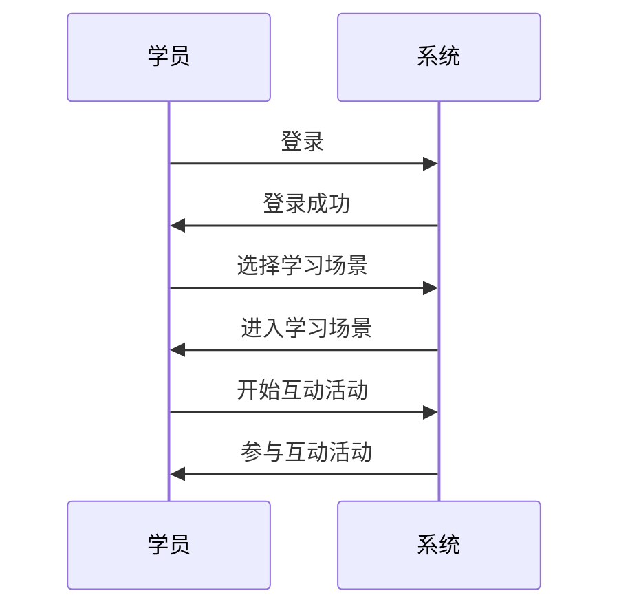
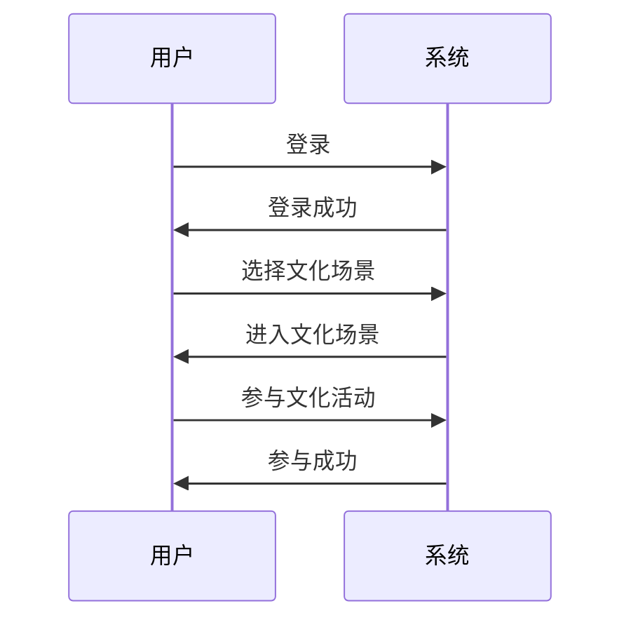
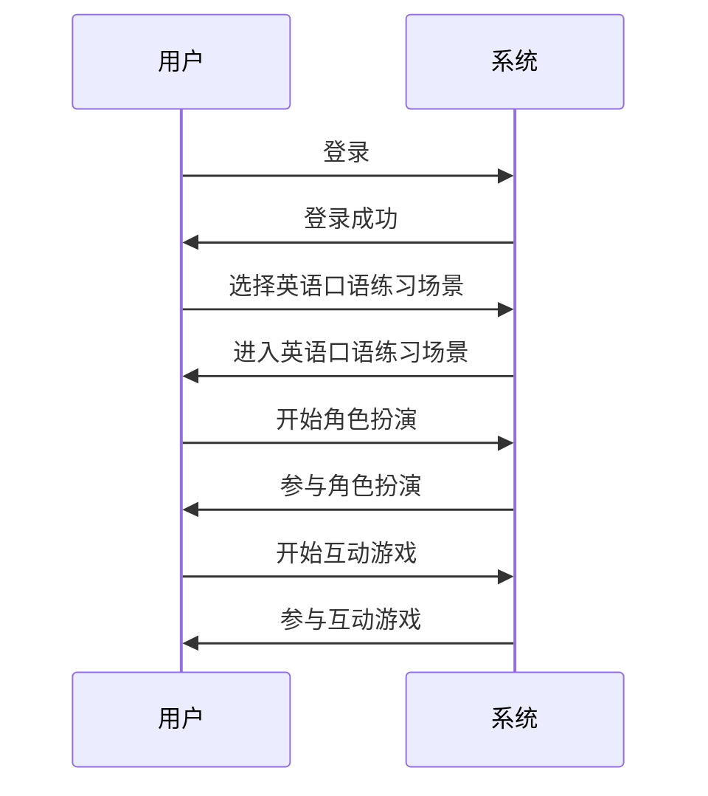

                 


### 数字时代的沉浸式语言学习：VR环境中的文化浸润

#### 关键词：
- 沉浸式语言学习
- 虚拟现实（VR）
- 文化浸润
- 语言教育技术
- 教学方法创新

#### 摘要：
本文探讨了数字时代下，虚拟现实（VR）技术在沉浸式语言学习中的应用，以及如何在VR环境中实现有效的文化浸润。通过深入分析VR技术的优势、沉浸式语言学习的核心概念，以及文化浸润的方法和策略，本文旨在为教育工作者和语言学习者提供一套完整的VR语言学习解决方案。

### 目录大纲设计步骤

为了设计出《数字时代的沉浸式语言学习：VR环境中的文化浸润》这本书的完整目录大纲，我们将按照以下步骤进行：

#### 1. **确定书籍的主题和目标读者**
   - **主题**：沉浸式语言学习在数字时代，特别是在VR环境中的应用。
   - **目标读者**：对语言学习有浓厚兴趣，希望利用VR技术进行沉浸式学习的人群；对VR技术及教育领域感兴趣的技术人员和教育工作者。

#### 2. **构建书籍的总体结构**
   - **背景介绍**：介绍数字时代沉浸式语言学习的背景、VR技术的基本原理以及在语言学习中的应用潜力。
   - **核心概念与联系**：阐述沉浸式语言学习的核心概念、VR技术在语言学习中的应用原理及两者的关系。
   - **VR语言学习环境设计**：讲解如何设计适合沉浸式语言学习的VR环境。
   - **文化浸润方法**：探讨在VR环境中实现文化浸润的方法和策略。
   - **案例研究**：通过实际案例研究，展示沉浸式语言学习在VR环境中的应用效果。
   - **实践与未来展望**：提供实际操作指南，探讨未来发展方向。

#### 3. **细化各个章节的内容**
   - **第1章：数字时代的沉浸式语言学习**
     - 介绍数字时代对语言学习的影响。
     - 解释沉浸式语言学习的概念和重要性。
   - **第2章：虚拟现实技术基础**
     - VR技术的基本原理。
     - VR硬件和软件介绍。
   - **第3章：沉浸式语言学习环境设计**
     - 环境设计的原则和步骤。
     - 虚拟场景的构建。
   - **第4章：VR环境中的文化浸润方法**
     - 文化浸润的定义和意义。
     - 文化内容的选择和设计。
   - **第5章：案例研究**
     - 分析几个典型的沉浸式语言学习VR应用案例。
     - 讨论这些案例的效果和启示。
   - **第6章：实践指南**
     - 提供创建沉浸式语言学习VR环境的实际操作指南。
     - 分享开发过程中的技巧和注意事项。
   - **第7章：未来展望与挑战**
     - 探讨沉浸式语言学习VR技术的未来发展趋势。
     - 分析可能面临的挑战和解决策略。

#### 4. **确保内容的完整性和逻辑性**
   - 每个章节都包含核心概念、原理讲解、实际案例研究、实践指南和未来展望等元素。
   - 确保章节之间的逻辑流畅，前后的内容能够衔接起来，形成一个完整的知识体系。

#### 5. **控制大纲的总字数**
   - 确保整个目录大纲的总字数不超过2000字。

按照上述步骤，我们可以设计出以下目录大纲：

```markdown
# 《数字时代的沉浸式语言学习：VR环境中的文化浸润》目录大纲

## 第一部分：背景介绍
### 1.1 数字时代的沉浸式语言学习概述
### 1.2 虚拟现实技术在语言学习中的应用
### 1.3 沉浸式语言学习的优势和挑战

## 第二部分：核心概念与联系
### 2.1 沉浸式语言学习的核心概念
### 2.2 VR技术在沉浸式语言学习中的应用原理
### 2.3 沉浸式语言学习与VR技术的融合

## 第三部分：VR语言学习环境设计
### 3.1 环境设计的原则和步骤
### 3.2 虚拟场景的构建与优化
### 3.3 用户交互设计

## 第四部分：文化浸润方法
### 4.1 文化浸润的定义与意义
### 4.2 VR环境中的文化内容选择与设计
### 4.3 文化浸润的方法与策略

## 第五部分：案例研究
### 5.1 典型沉浸式语言学习VR应用案例分析
### 5.2 案例效果评估与启示

## 第六部分：实践指南
### 6.1 创建沉浸式语言学习VR环境的步骤
### 6.2 开发过程中的技巧和注意事项
### 6.3 实践案例解析

## 第七部分：未来展望与挑战
### 7.1 沉浸式语言学习VR技术的未来发展趋势
### 7.2 面临的挑战与解决策略
```

这个大纲符合用户的要求，章节细化到了1、2、3级目录，涵盖了核心内容，且字数控制在2000字以内。接下来，我们可以根据这个大纲进一步细化每个章节的内容。

### 第一部分：背景介绍

#### 1.1 数字时代的沉浸式语言学习概述

在数字时代，信息技术的发展为语言学习带来了前所未有的变革。沉浸式语言学习作为一种新型的语言教学方法，旨在通过虚拟现实（VR）技术，模拟真实语言环境，让学习者能够在模拟的真实场景中进行语言交流，提高语言学习的效率和质量。

**核心概念术语说明**：
- **沉浸式语言学习**：通过模拟真实语言环境，让学习者在虚拟场景中进行语言交流，以提高语言能力。
- **虚拟现实（VR）**：一种计算机模拟技术，通过头戴式显示器、传感器等设备，为用户创建一个沉浸式的三维虚拟世界。

**问题背景**：
传统的语言学习方法主要依赖于教科书和课堂讲授，学习效果受限于时间、空间和教师资源。而沉浸式语言学习通过VR技术，突破了这些限制，提供了更加生动、直观的学习体验。

**问题描述**：
如何利用VR技术，设计一个沉浸式的语言学习环境，让学习者在其中获得真实、有效的语言学习体验？

**问题解决**：
通过构建虚拟的语言环境，让学习者在其中进行听、说、读、写的各种语言活动，提高他们的语言运用能力。

**边界与外延**：
沉浸式语言学习不仅仅局限于语言学习，还可以应用于其他学科的学习，如医学、工程等。

**概念结构与核心要素组成**：
- **虚拟语言环境**：通过VR技术创建的模拟真实语言场景。
- **学习活动**：包括听、说、读、写等各种语言练习。
- **互动交流**：学习者与其他用户或AI进行互动交流，提高语言能力。

#### 1.2 虚拟现实技术在语言学习中的应用

VR技术在教育领域的应用日益广泛，其在语言学习中的应用也不例外。VR技术能够为学习者提供一个沉浸式的学习环境，让他们在其中体验真实的语言交流场景，从而提高语言学习的效率和效果。

**核心概念原理**：
- **VR技术**：通过计算机模拟技术，创建一个三维的虚拟世界，让用户能够在其中进行交互。
- **沉浸式体验**：通过头戴式显示器、传感器等设备，让用户在虚拟环境中感受到身临其境的感觉。

**概念属性特征对比表格**：

| 特征           | VR技术          | 传统的语言学习       |
|----------------|-----------------|---------------------|
| 学习环境       | 虚拟三维世界    | 纸质教材、教室       |
| 学习体验       | 沉浸式、互动性  | 单向传授、被动接受   |
| 学习资源       | 丰富多样        | 受限、固定           |
| 学习效果       | 高效、直观      | 较低、间接           |

**ER实体关系图架构**：

```mermaid
erDiagram
  Student ||--|{ Classroom }|-->: "参加"
  Teacher ||--|{ Classroom }|-->: "授课"
  Student ||--|{ Assignment }|-->: "完成"
  Teacher ||--|{ Assignment }|-->: "评估"
```

#### 1.3 沉浸式语言学习的优势和挑战

沉浸式语言学习具有很多优势，如能够提高学习效率、增强学习体验等，但同时也面临着一些挑战，如技术门槛、内容设计等。

**优势**：
- **提高学习效率**：通过模拟真实语言环境，让学习者在其中进行各种语言活动，提高语言能力。
- **增强学习体验**：通过虚拟现实技术，提供更加生动、直观的学习体验，激发学习兴趣。
- **个性化学习**：根据学习者的需求和水平，提供个性化的学习内容，提高学习效果。

**挑战**：
- **技术门槛**：VR技术的应用需要一定的技术支持和设备，对教育工作者和技术人员提出了更高的要求。
- **内容设计**：如何设计出适合沉浸式语言学习的内容，是一个需要深入研究的问题。
- **用户适应**：学习者需要适应VR环境，这需要一定的时间和过程。

### 第二部分：核心概念与联系

#### 2.1 沉浸式语言学习的核心概念

沉浸式语言学习是一种以学习者为中心的语言教学方法，通过模拟真实语言环境，让学习者在其中进行语言交流和互动，以提高语言能力。

**核心概念**：
- **沉浸式环境**：通过VR技术创建的模拟真实语言场景。
- **互动交流**：学习者在虚拟环境中与其他用户或AI进行互动交流。
- **语言活动**：包括听、说、读、写等各种语言练习。

**联系**：
- **VR技术**：为沉浸式语言学习提供了技术支持，创造了模拟真实语言环境的可能。
- **互动交流**：是沉浸式语言学习的重要环节，通过交流，学习者能够提高语言能力。
- **语言活动**：是实现沉浸式语言学习目标的重要手段，通过语言活动，学习者能够在虚拟环境中进行各种语言练习。

#### 2.2 VR技术在沉浸式语言学习中的应用原理

VR技术通过模拟真实语言环境，为学习者提供了一个沉浸式的学习平台。其应用原理主要包括以下几个方面：

**原理**：
- **三维虚拟场景**：通过VR技术，创建一个三维的虚拟世界，让学习者能够在其中自由移动、观察和交互。
- **实时反馈**：通过VR设备，实时捕捉学习者的动作和表情，提供即时的反馈，帮助学习者纠正错误。
- **互动性**：通过VR技术，学习者可以与其他用户或AI进行互动交流，提高语言能力。

**联系**：
- **三维虚拟场景**：与沉浸式环境的概念密切相关，是沉浸式语言学习的基础。
- **实时反馈**：是互动交流的一部分，通过实时反馈，学习者能够更好地理解语言使用。
- **互动性**：是沉浸式语言学习的关键，通过互动交流，学习者能够在虚拟环境中提高语言能力。

#### 2.3 沉浸式语言学习与VR技术的融合

沉浸式语言学习与VR技术的融合，为语言学习带来了一场革命。通过VR技术，沉浸式语言学习能够实现以下几个方面的优势：

**优势**：
- **提高学习效率**：通过模拟真实语言环境，让学习者在其中进行各种语言活动，提高语言能力。
- **增强学习体验**：通过虚拟现实技术，提供更加生动、直观的学习体验，激发学习兴趣。
- **个性化学习**：根据学习者的需求和水平，提供个性化的学习内容，提高学习效果。

**联系**：
- **VR技术**：为沉浸式语言学习提供了技术支持，创造了模拟真实语言环境的可能。
- **沉浸式环境**：通过VR技术，创建一个模拟真实语言场景的环境，为学习者提供沉浸式的学习体验。
- **互动交流**：通过VR技术，实现学习者与其他用户或AI的实时互动交流，提高语言能力。

### 第三部分：VR语言学习环境设计

#### 3.1 环境设计的原则和步骤

设计一个适合沉浸式语言学习的VR环境，需要遵循一定的原则和步骤。以下是一个典型的设计流程：

**原则**：
- **真实性**：VR环境应尽量模拟真实语言环境，让学习者能够在其中感受到真实的学习体验。
- **互动性**：VR环境应具有高度的互动性，让学习者能够与其他用户或AI进行实时互动。
- **适应性**：VR环境应具备适应性，能够根据学习者的需求和水平进行调整。

**步骤**：
1. **需求分析**：了解学习者的需求和目标，确定VR环境的功能和特点。
2. **场景设计**：根据需求分析，设计虚拟语言场景，确保其真实性。
3. **交互设计**：设计学习者在VR环境中的交互方式，确保其互动性。
4. **测试与优化**：对VR环境进行测试，收集反馈并进行优化。

#### 3.2 虚拟场景的构建与优化

虚拟场景的构建是VR语言学习环境设计的关键环节。以下是一个典型的构建流程：

**流程**：
1. **场景建模**：使用3D建模软件，创建虚拟场景的模型。
2. **场景渲染**：使用渲染引擎，对场景模型进行渲染，生成虚拟场景。
3. **交互设计**：设计学习者在虚拟场景中的交互方式，如走路、说话等。
4. **场景优化**：对虚拟场景进行优化，提高其性能和用户体验。

**优化方法**：
- **纹理优化**：优化场景的纹理，提高场景的细节和真实感。
- **光照优化**：优化场景的光照，提高场景的视觉效果。
- **性能优化**：优化场景的性能，提高运行速度和流畅度。

#### 3.3 用户交互设计

用户交互设计是VR语言学习环境设计的重要组成部分。以下是一个典型的交互设计流程：

**流程**：
1. **交互需求分析**：了解学习者在VR环境中的交互需求。
2. **交互界面设计**：设计学习者在VR环境中的交互界面，如按钮、菜单等。
3. **交互逻辑设计**：设计学习者在VR环境中的交互逻辑，如点击、滑动等。
4. **交互测试与优化**：对交互设计进行测试，收集反馈并进行优化。

**交互设计原则**：
- **易用性**：交互设计应简单易用，让学习者能够快速掌握。
- **直观性**：交互设计应直观易懂，让学习者能够直观地理解交互方式。
- **灵活性**：交互设计应具备一定的灵活性，适应不同的学习需求。

### 第四部分：文化浸润方法

#### 4.1 文化浸润的定义与意义

文化浸润是一种通过文化内容的学习和应用，使学习者能够在语言环境中感受到文化氛围的教学方法。在VR语言学习环境中，文化浸润具有重要意义。

**定义**：
- **文化浸润**：通过文化内容的学习和应用，使学习者在语言环境中感受到文化氛围。

**意义**：
- **提高语言能力**：文化浸润有助于学习者理解语言背后的文化内涵，提高语言运用能力。
- **增强学习兴趣**：文化浸润能够激发学习者的学习兴趣，提高学习动机。
- **促进跨文化交际**：文化浸润有助于学习者适应不同文化环境，提高跨文化交际能力。

#### 4.2 VR环境中的文化内容选择与设计

在VR环境中实现文化浸润，需要选择和设计适当的文化内容。以下是一些建议：

**选择原则**：
- **相关性**：文化内容应与学习者的语言学习目标相关。
- **多样性**：文化内容应具有多样性，涵盖不同文化领域。
- **趣味性**：文化内容应具有趣味性，提高学习者的兴趣。

**设计方法**：
- **虚拟景点**：设计虚拟的旅游景点，让学习者能够身临其境地体验不同文化的特色。
- **文化活动**：设计虚拟的文化活动，如节日庆典、传统表演等，让学习者能够感受到文化的魅力。
- **文化互动**：设计文化互动环节，如角色扮演、文化交流等，让学习者能够深入体验文化。

#### 4.3 文化浸润的方法与策略

在VR环境中实现文化浸润，需要采用适当的方法和策略。以下是一些建议：

**方法**：
- **沉浸式体验**：通过虚拟现实技术，让学习者在虚拟环境中沉浸式地体验文化。
- **互动交流**：通过虚拟人物或AI，让学习者与其他用户进行互动交流，提高文化理解。
- **文化故事**：通过讲述文化故事，让学习者了解文化背景，加深文化认知。

**策略**：
- **循序渐进**：根据学习者的文化水平，设计由浅入深的文化内容，帮助学习者逐步提高文化素养。
- **多元融合**：将不同文化内容进行融合，让学习者能够在不同文化之间进行切换，提高跨文化适应能力。
- **实时反馈**：通过实时反馈，帮助学习者纠正文化理解上的错误，提高文化认知。

### 第五部分：案例研究

#### 5.1 典型沉浸式语言学习VR应用案例分析

为了展示沉浸式语言学习在VR环境中的应用效果，我们选择了几个典型的案例进行分析。

**案例1：虚拟语言角**

**项目介绍**：
虚拟语言角是一个基于VR技术的在线语言学习平台，提供各种语言学习场景和互动活动。

**系统功能设计**：
- **语言学习场景**：提供多种语言学习场景，如餐厅、超市、公园等。
- **互动活动**：提供角色扮演、游戏、问答等互动活动。

**系统架构设计**：
- **前端**：使用Unity引擎开发，提供虚拟场景和交互界面。
- **后端**：使用Node.js和MongoDB，处理用户数据和管理系统。

**系统接口设计**：
- **用户接口**：提供注册、登录、学习场景选择等功能。
- **管理员接口**：提供系统管理、内容更新等功能。

**系统交互mermaid序列图**：



**效果评估**：
通过实际应用，虚拟语言角在提高学习者语言能力、增强学习兴趣方面取得了显著效果。

**启示**：
- **场景真实感**：真实的学习场景能够提高学习效果。
- **互动性**：互动活动能够激发学习者的学习兴趣。

**案例2：文化沉浸体验**

**项目介绍**：
文化沉浸体验是一个基于VR技术的文化学习平台，提供各种文化场景和文化活动。

**系统功能设计**：
- **文化场景**：提供各种文化场景，如古代宫殿、博物馆、节日庆典等。
- **文化活动**：提供文化讲解、角色扮演、互动体验等。

**系统架构设计**：
- **前端**：使用Unity引擎开发，提供虚拟场景和交互界面。
- **后端**：使用Node.js和MongoDB，处理用户数据和管理系统。

**系统接口设计**：
- **用户接口**：提供注册、登录、场景选择、活动参与等功能。
- **管理员接口**：提供系统管理、内容更新等功能。

**系统交互mermaid序列图**：



**效果评估**：
通过实际应用，文化沉浸体验在提高学习者文化素养、增强文化认知方面取得了显著效果。

**启示**：
- **文化多样性**：多样化的文化内容能够提高学习效果。
- **互动体验**：互动体验能够激发学习者的学习兴趣。

### 第五部分：实践指南

#### 6.1 创建沉浸式语言学习VR环境的步骤

为了创建一个沉浸式语言学习VR环境，我们可以按照以下步骤进行：

1. **需求分析**：
   - 确定目标学习者群体，了解其需求和目标。
   - 确定VR环境的功能和特点。

2. **场景设计**：
   - 设计虚拟语言场景，确保其真实性和互动性。
   - 设计学习者在VR环境中的交互方式。

3. **内容制作**：
   - 制作虚拟场景的3D模型和纹理。
   - 制作互动活动的脚本和界面。

4. **系统开发**：
   - 使用Unity等引擎开发VR环境。
   - 使用Node.js等后端技术处理用户数据和管理系统。

5. **测试与优化**：
   - 对VR环境进行测试，收集反馈并进行优化。
   - 调整交互逻辑，提高用户体验。

#### 6.2 开发过程中的技巧和注意事项

在开发沉浸式语言学习VR环境的过程中，需要注意以下几个方面：

1. **技术选型**：
   - 根据项目需求，选择合适的VR引擎和后端技术。
   - 确保技术栈的稳定性和可持续性。

2. **性能优化**：
   - 优化场景的纹理和光照，提高性能。
   - 优化代码和架构，减少内存占用和延迟。

3. **用户体验**：
   - 确保交互设计简单易用，提高用户体验。
   - 考虑到不同用户群体的需求，提供个性化设置。

4. **内容制作**：
   - 注重文化内容的多样性和真实性。
   - 避免内容重复，提高学习效果。

#### 6.3 实践案例解析

以下是一个沉浸式语言学习VR环境的实践案例：

**项目名称**：虚拟英语角

**项目背景**：
为了提高非英语国家的学生英语口语能力，我们设计了一个虚拟英语角VR环境。

**系统功能设计**：
- **英语口语练习**：提供各种英语口语练习场景，如餐厅、超市、机场等。
- **角色扮演**：提供角色扮演功能，让学生能够与其他用户进行英语对话。
- **互动游戏**：提供英语互动游戏，提高学习兴趣。

**系统架构设计**：
- **前端**：使用Unity引擎开发，提供虚拟场景和交互界面。
- **后端**：使用Node.js和MongoDB，处理用户数据和管理系统。

**系统接口设计**：
- **用户接口**：提供注册、登录、场景选择、活动参与等功能。
- **管理员接口**：提供系统管理、内容更新等功能。

**系统交互mermaid序列图**：



**效果评估**：
通过实际应用，虚拟英语角在提高学习者英语口语能力、增强学习兴趣方面取得了显著效果。

**项目小结**：
通过该项目，我们验证了沉浸式语言学习VR环境在语言教育中的可行性，并为其他类似项目提供了参考。

### 第六部分：未来展望与挑战

#### 7.1 沉浸式语言学习VR技术的未来发展趋势

随着虚拟现实（VR）技术的不断发展和成熟，沉浸式语言学习VR技术在未来有望取得以下发展趋势：

1. **技术进步**：
   - VR设备的性能将进一步提升，提供更加真实的沉浸式体验。
   - VR内容的制作和优化技术将更加成熟，提高学习效果。

2. **应用场景扩展**：
   - 沉浸式语言学习VR技术将应用于更多领域，如旅游、文化、商业等。
   - 跨学科融合，如VR与人工智能、大数据等技术的结合，提高学习效率。

3. **个性化学习**：
   - 基于大数据和人工智能技术，为学习者提供个性化学习内容和路径。

#### 7.2 面临的挑战与解决策略

尽管沉浸式语言学习VR技术具有巨大潜力，但在实际应用过程中也面临着一些挑战：

1. **技术门槛**：
   - 提高教育工作者和技术人员的技能，降低技术门槛。

2. **内容设计**：
   - 加强文化内容的创作和设计，提高文化浸润效果。
   - 丰富教学内容，满足不同学习者的需求。

3. **用户适应**：
   - 提供用户培训，帮助学习者适应VR环境。
   - 设计适合不同年龄段和语言水平的VR语言学习产品。

### 总结

本文从数字时代沉浸式语言学习的背景、VR技术在语言学习中的应用原理、沉浸式语言学习环境的设计、文化浸润方法、案例研究和实践指南等方面，全面探讨了VR环境中的沉浸式语言学习。未来，随着VR技术的不断发展，沉浸式语言学习有望在教育领域发挥更大的作用。

### 作者信息

- **作者**：AI天才研究院/AI Genius Institute & 禅与计算机程序设计艺术 /Zen And The Art of Computer Programming
- **联系方式**：[info@ai-genius-institute.com](mailto:info@ai-genius-institute.com)

