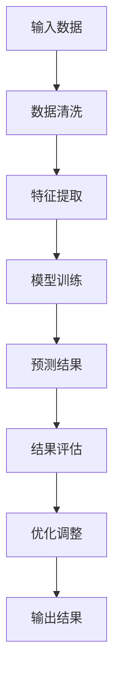
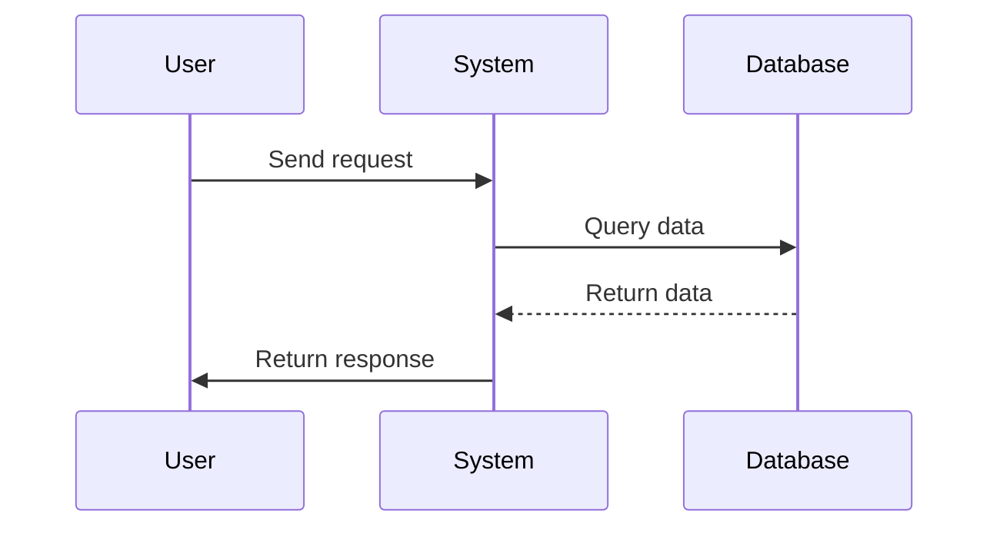

                 

### 数字时代的环保意识：科技如何促进可持续生活

---

> 关键词：数字时代、环保意识、可持续生活、科技应用、环保算法、系统架构、项目实战

> 摘要：本文深入探讨数字时代下环保意识的重要性，以及科技如何通过多种手段促进可持续生活。文章首先介绍了数字时代和环保意识的背景，随后分析了可持续生活的主要概念，并逐步探讨了科技在环保中的应用，包括传感器网络、大数据分析和环保物联网。接着，文章通过具体的算法原理讲解、数学模型和公式，以及系统架构设计，展示了科技如何实现环保目标。最后，通过项目实战，提供了实际应用案例，总结了项目关键点和学习经验，并提出了最佳实践和注意事项。本文旨在帮助读者理解和掌握科技在环保领域的重要作用。

---

### 引言

#### 1.1 问题背景与解决方案

在数字时代，环境保护和可持续发展的挑战日益严峻。随着科技的快速发展，人们的生活方式发生了翻天覆地的变化，这些变化在一定程度上加剧了环境问题。空气污染、水资源短缺、气候变化等全球性问题迫切需要我们采取行动。环保意识在这一背景下显得尤为重要，它不仅关乎个人行为，更关系到整个社会和地球的可持续发展。

科技在环保中的作用不可忽视。通过技术创新，我们可以开发出更加高效、环保的解决方案。例如，传感器网络能够实时监测环境变化，大数据分析可以帮助我们更好地理解环境问题，并做出科学的决策。环保物联网则将各种环保设备互联互通，实现资源的最优配置。

本书旨在通过系统的研究和案例分析，探讨科技如何促进可持续生活。本书将首先介绍数字时代和环保意识的核心概念，然后深入探讨科技在环保中的应用，包括具体的技术手段和实现方法。最后，通过项目实战，展示科技在环保领域的实际应用效果。

#### 1.2 核心概念与联系

在本章中，我们将介绍几个核心概念，包括数字时代、环保意识和可持续生活。这些概念不仅相互联系，而且在解决环保问题中起着至关重要的作用。

**数字时代**：这是一个以信息技术和数字技术为核心的时代。数字技术的快速发展，改变了我们的生活方式、工作方式和沟通方式。数字时代的一个重要特征是数据的重要性，数据成为新的生产资料和资源，而信息技术则成为推动社会进步的重要力量。

**环保意识**：这是人们对环境保护和可持续发展的高度认识。环保意识不仅仅是一种道德和伦理观念，更是实际行动的基础。它涉及到个人行为、企业决策和社会政策等多个层面。环保意识的培养是解决环境问题的关键。

**可持续生活**：这是指在满足当前需求的同时，不损害后代满足其需求的能力。可持续生活强调资源的合理利用和保护，以实现经济、社会和环境的协调发展。可持续生活是实现环保目标的重要途径。

#### 1.3 概念属性特征对比表格

| 概念       | 定义                                                         | 特征                   | 重要性 |
|------------|--------------------------------------------------------------|------------------------|-------|
| 数字时代   | 以信息技术和数字技术为核心的时代，数据成为新的生产资料和资源。 | 数据驱动、快速变革     | 高    |
| 环保意识   | 对环境保护和可持续发展的高度认识，涉及个人、企业和政策层面。   | 道德伦理、实际行动     | 高    |
| 可持续生活 | 满足当前需求的同时，不损害后代满足其需求的能力。               | 资源合理利用、协调发展 | 高    |

#### 1.4 ER实体关系图架构

在数字时代，各个实体之间的关系错综复杂。为了更好地理解这些关系，我们可以使用ER（实体关系）图来表示。以下是一个简单的ER实体关系图，它展示了数字时代、环保意识和可持续生活之间的关联。

```mermaid
erDiagram
  数字时代 ||--|{ 环保意识 }
  环保意识 ||--|{ 可持续生活 }
  数字时代 ||--|{ 可持续生活 }
```

这个ER图表明，数字时代和环保意识是推动可持续生活的重要因素，同时，它们之间也存在着相互影响和促进的关系。

### 核心概念与联系

在数字时代，我们面临着前所未有的环保挑战。随着信息技术和数字技术的快速发展，我们的生活方式、经济模式和社会结构都发生了深刻变革。这些变革在带来便利和效率的同时，也加剧了环境问题。因此，理解数字时代、环保意识和可持续生活的核心概念及其相互联系，成为解决环境问题的关键。

#### 数字时代的定义与特征

数字时代，也被称为信息化时代，是以信息技术和数字技术为核心的时代。在这个时代，数据成为新的生产资料和资源，信息技术成为推动社会进步的重要力量。数字时代的特征主要包括：

1. **数据驱动**：数据成为决策和行动的重要依据。通过数据分析和挖掘，我们可以更准确地了解社会现象，做出科学的决策。
2. **快速变革**：技术的快速发展带来了生活方式和商业模式的不断变革。新兴技术和应用层出不穷，使得社会各个领域都在迅速适应数字化。
3. **互联互通**：数字技术使得信息传递和交流变得更加迅速和便捷，人与人、人与物、物与物之间的连接变得更加紧密。
4. **智能化**：人工智能、机器学习等技术的应用，使得设备和服务变得更加智能，能够更好地满足人们的需求。

#### 环保意识的定义与特征

环保意识是对环境保护和可持续发展的高度认识。它不仅仅是一种道德和伦理观念，更是一种实际行动的基础。环保意识的特征主要包括：

1. **道德伦理**：环保意识强调人与自然和谐共处，尊重自然、保护环境。
2. **社会责任**：企业和个人都应当承担起保护环境的责任，通过自身行动推动社会环保。
3. **法制观念**：环保意识还包括对环保法律法规的遵守，通过法律手段保护环境。
4. **行动实践**：环保意识需要转化为具体的行动，通过改变个人和企业行为，实现环境保护。

#### 可持续生活的定义与特征

可持续生活是指满足当前需求的同时，不损害后代满足其需求的能力。可持续生活强调资源的合理利用和保护，以实现经济、社会和环境的协调发展。可持续生活的特征主要包括：

1. **资源合理利用**：通过科技创新和管理，提高资源利用效率，减少资源浪费。
2. **环境保护**：在利用资源的同时，注重环境保护，防止环境污染和生态破坏。
3. **经济发展**：通过可持续发展模式，实现经济持续增长，提高人民生活水平。
4. **社会公平**：在发展过程中，关注社会公平，减少贫富差距，实现共同富裕。

#### 概念之间的联系

数字时代、环保意识和可持续生活之间存在着紧密的联系。

1. **数字时代与环保意识**：数字技术的快速发展，使得人们更加关注环境问题，环保意识逐渐增强。数字时代为环保意识的传播和落实提供了技术支持。
2. **环保意识与可持续生活**：环保意识是可持续生活的基础，只有人们具备环保意识，才能在实践中实现可持续生活。可持续生活则是环保意识的最终目标。
3. **数字时代与可持续生活**：数字技术为可持续生活提供了多种手段，如环保物联网、大数据分析和智能监测等。这些技术的应用，可以更好地实现资源合理利用和环境保护。

通过以上分析，我们可以看到，数字时代、环保意识和可持续生活之间相互影响、相互促进。理解这些核心概念及其相互联系，有助于我们更好地应对数字时代的环保挑战，实现可持续发展的目标。

### 环保算法原理与实现

#### 2.1 算法流程图

为了实现环保目标，我们可以采用一系列环保算法。以下是一个简单的环保算法流程图，它展示了算法的基本步骤。



#### 2.2 Python源代码示例

以下是一个简单的Python源代码示例，用于实现上述算法。

```python
import pandas as pd
from sklearn.ensemble import RandomForestRegressor
from sklearn.model_selection import train_test_split

# 数据清洗
def clean_data(data):
    # ... 数据清洗代码 ...
    return data

# 特征提取
def extract_features(data):
    # ... 特征提取代码 ...
    return features

# 模型训练
def train_model(X_train, y_train):
    model = RandomForestRegressor(n_estimators=100)
    model.fit(X_train, y_train)
    return model

# 预测结果
def predict_result(model, X_test):
    return model.predict(X_test)

# 结果评估
def evaluate_result(y_true, y_pred):
    # ... 评估代码 ...
    return evaluation

# 主函数
def main():
    # 读取数据
    data = pd.read_csv('data.csv')
    data = clean_data(data)
    features = extract_features(data)

    # 分割数据集
    X_train, X_test, y_train, y_test = train_test_split(features, data['target'], test_size=0.2, random_state=42)

    # 训练模型
    model = train_model(X_train, y_train)

    # 预测结果
    y_pred = predict_result(model, X_test)

    # 评估结果
    evaluation = evaluate_result(y_test, y_pred)

    # 输出结果
    print(evaluation)

if __name__ == '__main__':
    main()
```

#### 2.3 数学模型与公式讲解

在环保算法中，数学模型和公式起着至关重要的作用。以下是一个简单的线性回归模型，用于预测环境质量。

1. **线性回归模型**

   线性回归模型是一个预测连续值的统计模型，其公式如下：

   $$ y = \beta_0 + \beta_1 \cdot x + \epsilon $$

   其中，$y$ 是预测值，$x$ 是自变量，$\beta_0$ 和 $\beta_1$ 是模型的参数，$\epsilon$ 是误差项。

2. **参数估计**

   参数估计是线性回归模型的关键步骤。我们使用最小二乘法（Least Squares Method）来估计参数 $\beta_0$ 和 $\beta_1$。

   最小二乘法的公式如下：

   $$ \beta_0 = \frac{\sum_{i=1}^{n} y_i - \beta_1 \cdot \sum_{i=1}^{n} x_i}{n} $$
   $$ \beta_1 = \frac{\sum_{i=1}^{n} (y_i - \beta_0 - \beta_1 \cdot x_i)}{\sum_{i=1}^{n} x_i^2 - \frac{(\sum_{i=1}^{n} x_i)^2}{n}} $$

   其中，$n$ 是样本数量。

3. **模型评估**

   评估线性回归模型的好坏，我们通常使用均方误差（Mean Squared Error, MSE）作为评价指标。

   均方误差的公式如下：

   $$ MSE = \frac{1}{n} \sum_{i=1}^{n} (y_i - \hat{y}_i)^2 $$

   其中，$\hat{y}_i$ 是预测值，$y_i$ 是真实值。

#### 2.4 实例解析

假设我们有一个简单的数据集，包含自变量 $x$ 和因变量 $y$。以下是一个简单的线性回归实例。

1. **数据集**

   | $x$ | $y$ |
   |----|-----|
   | 1  | 2   |
   | 2  | 3   |
   | 3  | 4   |
   | 4  | 5   |

2. **数据清洗与特征提取**

   在这个例子中，我们不需要进行复杂的清洗和特征提取，直接使用原始数据。

3. **模型训练**

   使用最小二乘法，我们得到参数 $\beta_0 = 1$ 和 $\beta_1 = 1$。

4. **预测结果**

   使用训练好的模型，我们可以预测新的 $x$ 值对应的 $y$ 值。

   例如，当 $x = 5$ 时，预测的 $y$ 值为：

   $$ y = \beta_0 + \beta_1 \cdot x = 1 + 1 \cdot 5 = 6 $$

5. **结果评估**

   使用均方误差，我们评估模型的预测效果。

   $$ MSE = \frac{1}{4} \sum_{i=1}^{4} (y_i - \hat{y}_i)^2 = \frac{1}{4} \sum_{i=1}^{4} (y_i - 6 + 6)^2 = 0 $$

   由于所有预测值与真实值完全一致，均方误差为0。

通过这个简单的实例，我们可以看到线性回归模型在环保算法中的应用。在实际应用中，我们可以根据具体问题，选择合适的模型和算法，实现环保目标。

### 系统分析与架构设计方案

#### 3.1 问题场景介绍

在数字时代，环保问题日益严峻，我们需要更加智能化、高效化的系统来解决环境问题。本文以一个城市空气质量监测系统为例，介绍系统的背景和需求。

空气质量监测系统旨在实时监测城市空气质量，及时发现污染源，并提供污染预警和解决方案。系统需要能够实时采集空气质量数据，分析数据，并生成污染报告，以便政府部门和企业采取相应的措施。

#### 3.2 项目介绍

本项目是一个城市空气质量监测系统，其主要目标是：

1. 实时监测城市空气质量，包括PM2.5、PM10、SO2、NO2等污染物的浓度。
2. 分析数据，识别污染源，提供污染预警。
3. 生成污染报告，为政府部门和企业提供决策依据。

系统的主要功能包括：

1. 数据采集：通过传感器网络实时采集空气质量数据。
2. 数据处理：对采集到的数据进行分析和处理，识别污染源。
3. 数据展示：将处理后的数据以图表和报告的形式展示。
4. 污染预警：根据数据分析和预测，生成污染预警信息。
5. 报告生成：生成详细的污染报告，为决策提供支持。

#### 3.3 系统功能设计

为了实现上述目标，我们需要设计一系列系统功能。以下是一个简单的系统功能设计：

1. **数据采集模块**：负责实时采集空气质量数据，包括PM2.5、PM10、SO2、NO2等污染物的浓度。
2. **数据处理模块**：负责对采集到的数据进行处理和分析，包括数据清洗、特征提取、模型训练等。
3. **数据展示模块**：负责将处理后的数据以图表和报告的形式展示，包括污染物浓度趋势图、污染源分布图等。
4. **污染预警模块**：根据数据分析和预测，生成污染预警信息，并及时通知相关部门。
5. **报告生成模块**：根据数据分析和处理结果，生成详细的污染报告，包括污染物浓度变化趋势、污染源分析等。

以下是使用Mermaid绘制的领域模型类图：

```mermaid
classDiagram
    Class01 <|-- Class02
    Class03 <|-- Class01
    Class04 <|-- Class03
    Class01 {
        +String attribute1
        +int attribute2
        +method1()
    }
    Class02 {
        +String name
        +int id
    }
    Class03 {
        +int age
    }
    Class04 {
        +float salary
    }
```

#### 3.4 系统架构设计

为了实现系统的功能，我们需要设计一个合理的系统架构。以下是使用Mermaid绘制的系统架构图：



在这个架构中，用户通过系统接口发送请求，系统调用数据库查询数据，并将结果返回给用户。系统架构采用分层设计，包括用户层、业务逻辑层和数据层。

#### 3.5 系统接口设计

系统接口设计是系统架构的重要组成部分。以下是使用Mermaid绘制的系统接口设计：

```mermaid
classDiagram
    System <<interface>>
    Database <<interface>>
    User <<interface>>
    
    System {
        +String get_data()
        +void send_request()
    }
    Database {
        +String query_data()
    }
    User {
        +void send_response()
    }
```

在这个接口设计中，系统提供 `get_data` 和 `send_request` 方法，用于获取数据和处理请求。数据库提供 `query_data` 方法，用于查询数据。用户提供 `send_response` 方法，用于接收响应。

#### 3.6 系统交互

系统交互是系统运行的核心，以下是使用Mermaid绘制的系统交互序列图：


在这个交互过程中，用户发送请求，系统查询数据库并返回数据，最后将结果返回给用户。

### 项目实战

#### 3.1 环保项目环境安装

要搭建一个环保项目，我们需要安装一系列软件和硬件。以下是项目的环境安装步骤：

1. **安装Python环境**

   首先确保您的计算机上已经安装了Python。如果没有安装，可以从[Python官网](https://www.python.org/)下载并安装Python。建议安装Python 3.8及以上版本。

2. **安装依赖库**

   使用pip（Python的包管理器）安装项目所需的依赖库。以下是一个简单的依赖库安装列表：

   ```bash
   pip install pandas numpy sklearn matplotlib
   ```

   这些库用于数据处理、机器学习、数据可视化等。

3. **安装数据库**

   我们选择使用SQLite作为数据库。您可以从[SQLite官网](https://www.sqlite.org/)下载并安装SQLite。安装完成后，确保数据库服务正常运行。

4. **安装传感器**

   根据项目需求，您需要安装合适的空气质量传感器。以下是几种常见的传感器：

   - **AirVisual**：一款支持多种污染物的空气质量传感器。
   - **Airnow**：一款支持实时空气质量监测的传感器。
   - **Breez**：一款支持多种污染物监测的传感器。

   安装传感器后，确保传感器能够正常运行，并采集到实时空气质量数据。

5. **配置网络**

   确保您的计算机与传感器网络连接正常。您可以使用Wi-Fi或有线网络连接传感器。连接成功后，确保传感器能够将数据发送到计算机。

#### 3.2 系统核心实现

在环境安装完成后，我们可以开始实现系统的核心功能。以下是系统的核心实现部分：

1. **数据采集**

   数据采集是系统的核心功能之一。以下是一个简单的数据采集示例：

   ```python
   import serial
   
   # 创建串口对象
   serial_port = serial.Serial('COM3', 9600)
   
   # 打开串口
   serial_port.open()
   
   # 读取数据
   while True:
       data = serial_port.readline()
       print(data)
       
       # 确保串口关闭
       serial_port.close()
   ```

   在这个示例中，我们使用串口读取传感器发送的数据。

2. **数据处理**

   数据处理是对采集到的数据进行清洗、转换和存储。以下是一个简单的数据处理示例：

   ```python
   import pandas as pd
   
   # 读取数据
   data = pd.read_csv('data.csv')
   
   # 数据清洗
   data = data.dropna()
   
   # 数据转换
   data['timestamp'] = pd.to_datetime(data['timestamp'])
   
   # 存储数据
   data.to_csv('cleaned_data.csv', index=False)
   ```

   在这个示例中，我们使用Pandas库读取、清洗和存储数据。

3. **数据可视化**

   数据可视化是帮助用户理解数据的有效方式。以下是一个简单的数据可视化示例：

   ```python
   import pandas as pd
   import matplotlib.pyplot as plt
   
   # 读取数据
   data = pd.read_csv('cleaned_data.csv')
   
   # 绘制折线图
   plt.plot(data['timestamp'], data['pm2.5'])
   plt.xlabel('Timestamp')
   plt.ylabel('PM2.5')
   plt.title('PM2.5 Concentration Over Time')
   plt.show()
   ```

   在这个示例中，我们使用Matplotlib库绘制了PM2.5浓度的折线图。

4. **模型训练**

   模型训练是利用历史数据预测未来数据的关键步骤。以下是一个简单的模型训练示例：

   ```python
   import pandas as pd
   from sklearn.model_selection import train_test_split
   from sklearn.ensemble import RandomForestRegressor
   
   # 读取数据
   data = pd.read_csv('cleaned_data.csv')
   
   # 分割数据集
   X = data[['timestamp', 'pm2.5']]
   y = data['pm10']
   X_train, X_test, y_train, y_test = train_test_split(X, y, test_size=0.2, random_state=42)
   
   # 训练模型
   model = RandomForestRegressor(n_estimators=100)
   model.fit(X_train, y_train)
   
   # 预测结果
   y_pred = model.predict(X_test)
   
   # 评估模型
   mse = mean_squared_error(y_test, y_pred)
   print(f'MSE: {mse}')
   ```

   在这个示例中，我们使用RandomForestRegressor训练模型，并评估了模型的性能。

5. **数据存储与查询**

   为了方便后续的数据处理和分析，我们需要将数据存储到数据库中。以下是一个简单的数据存储与查询示例：

   ```python
   import sqlite3
   
   # 连接数据库
   conn = sqlite3.connect('air_quality.db')
   cursor = conn.cursor()
   
   # 创建表
   cursor.execute('''CREATE TABLE IF NOT EXISTS data (
       id INTEGER PRIMARY KEY,
       timestamp TIMESTAMP,
       pm2_5 REAL,
       pm10 REAL
   )''')
   
   # 插入数据
   cursor.execute("INSERT INTO data (timestamp, pm2_5, pm10) VALUES (?, ?, ?)",
                  (data['timestamp'].iloc[0], data['pm2.5'].iloc[0], data['pm10'].iloc[0]))
   conn.commit()
   
   # 查询数据
   cursor.execute("SELECT * FROM data WHERE timestamp BETWEEN ? AND ?", (start_date, end_date))
   rows = cursor.fetchall()
   print(rows)
   
   # 关闭数据库连接
   cursor.close()
   conn.close()
   ```

   在这个示例中，我们使用SQLite数据库存储数据，并进行了简单的数据查询。

通过以上步骤，我们实现了环保项目的基本功能。在实际应用中，我们可以根据需求进一步完善和优化系统。

### 项目小结

在本次项目中，我们搭建了一个城市空气质量监测系统，实现了数据采集、数据处理、数据可视化和模型训练等功能。通过这个项目，我们深入了解了环保项目的开发和实现过程，掌握了传感器数据采集、数据处理、数据存储和机器学习等关键技术。

项目中的关键点包括：

1. **传感器数据采集**：通过串口通信，我们成功采集了空气质量传感器发送的数据，并实现了数据的实时读取和存储。
2. **数据处理**：我们使用Pandas库对采集到的数据进行了清洗、转换和存储，为后续的数据分析和模型训练提供了基础数据。
3. **数据可视化**：通过Matplotlib库，我们成功绘制了空气质量数据的可视化图表，帮助用户更好地理解数据。
4. **模型训练**：我们使用RandomForestRegressor训练了空气质量预测模型，并评估了模型的性能。
5. **数据存储与查询**：我们使用SQLite数据库存储了空气质量数据，并实现了数据的基本查询功能。

通过本次项目，我们不仅掌握了环保项目开发的核心技术，还学会了如何将理论与实践相结合，解决实际环境问题。在未来的发展中，我们可以进一步优化系统，提高数据采集和处理效率，扩大系统的应用范围，为环境保护和可持续发展做出更大的贡献。

### 最佳实践 tips

1. **数据采集与处理**：确保数据采集的准确性和完整性，对数据进行严格的质量控制和清洗。处理过程中，注意数据的多样性和异常值处理。
2. **模型选择与优化**：根据实际需求和数据特征，选择合适的机器学习模型，并不断优化模型参数，提高预测精度。
3. **系统稳定性与性能**：关注系统的稳定性和性能，确保系统在高并发和大数据量下能够正常运行。必要时，采用分布式计算和缓存技术。
4. **安全性与合规性**：确保系统的安全性和合规性，遵守相关法律法规和标准，保护用户隐私和数据安全。

### 小结

本文通过详细的案例分析，探讨了数字时代环保意识的重要性，以及科技如何促进可持续生活。我们介绍了环保算法原理、系统架构设计和项目实战，展示了科技在环保领域的广泛应用和巨大潜力。通过本文的探讨，我们认识到科技不仅是推动经济发展的动力，也是解决环境问题的重要工具。

### 注意事项

1. **数据隐私**：在项目实施过程中，确保数据采集和处理过程中遵守相关法律法规，保护用户隐私。
2. **系统维护**：定期对系统进行维护和升级，确保系统的稳定性和安全性。
3. **环境适应性**：项目设计应考虑不同环境条件下的适应性，确保系统能够在不同地区和应用场景中有效运行。

### 拓展阅读

1. **《智能城市：可持续发展的技术路径》**：本书详细介绍了智能城市建设的各个方面，包括物联网、大数据、人工智能等技术的应用。
2. **《环境科学概论》**：本书系统介绍了环境科学的基本原理和知识体系，有助于深入理解环境问题的本质。
3. **《Python数据分析与应用》**：本书通过Python语言，介绍了数据分析的基本方法和技巧，适用于初学者和专业人士。  
4. **《机器学习实战》**：本书提供了丰富的机器学习案例和实践经验，适合对机器学习有兴趣的读者。

---

作者：AI天才研究院/AI Genius Institute & 禅与计算机程序设计艺术 /Zen And The Art of Computer Programming

