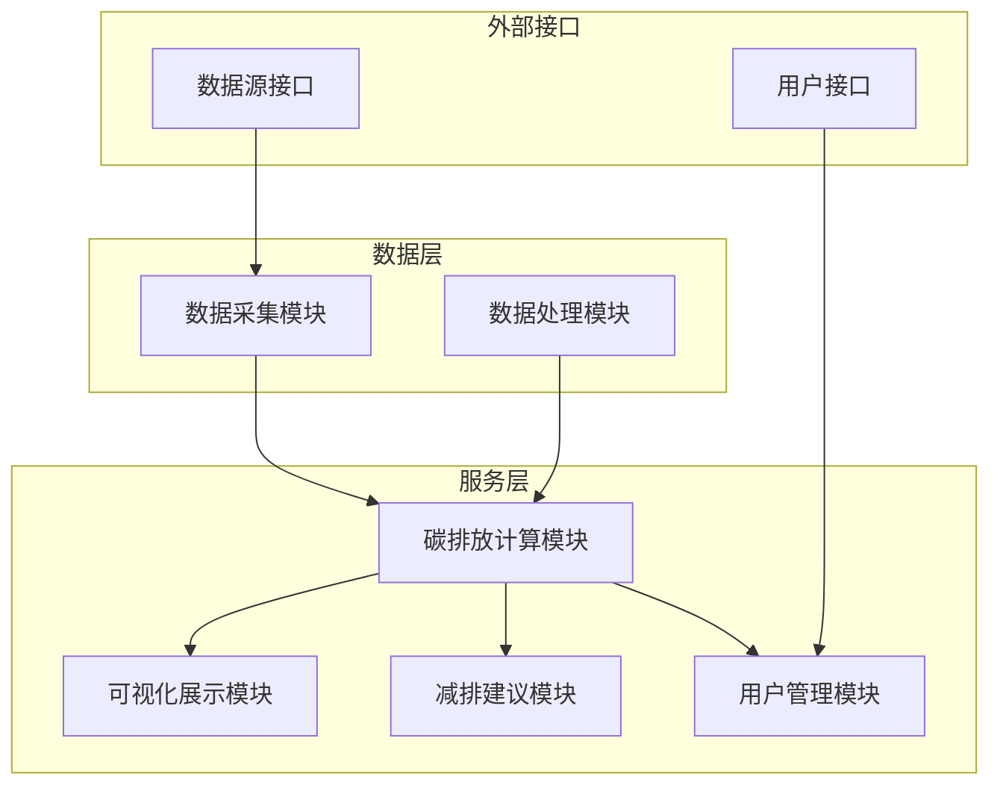
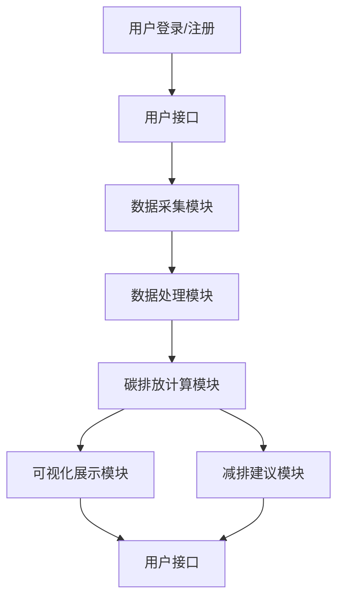
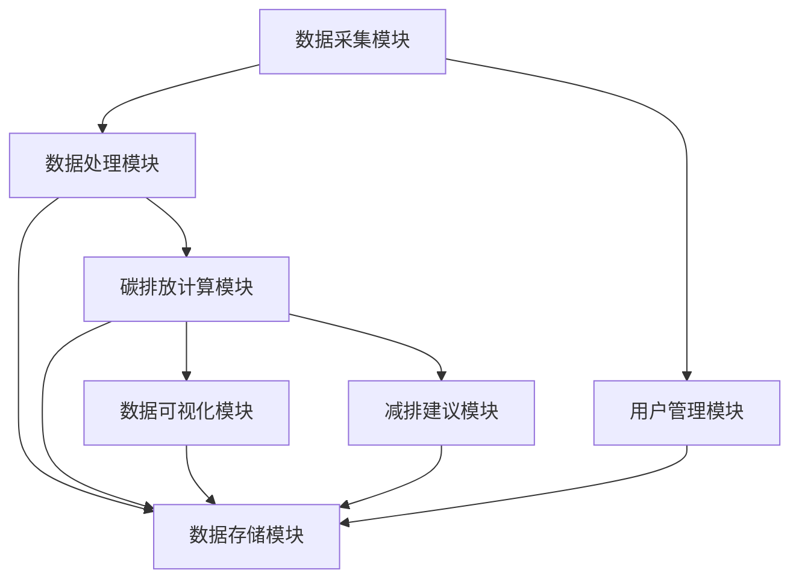
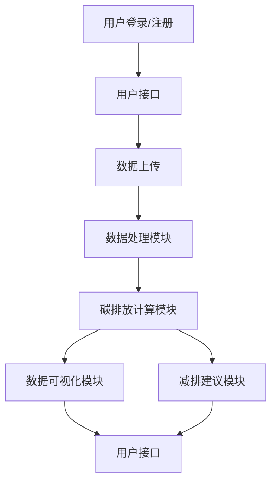
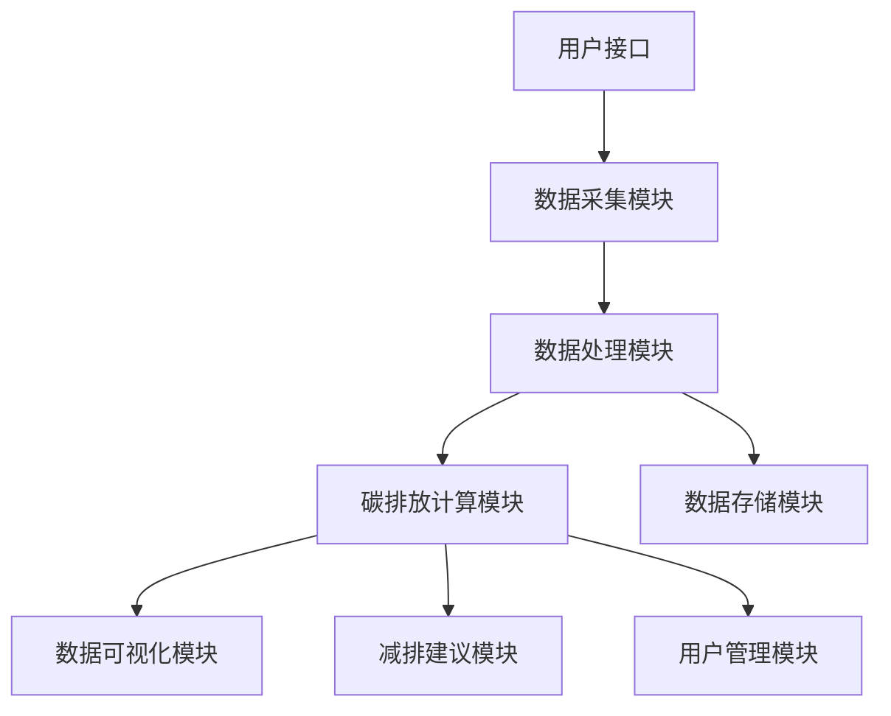

                 

### 第1章：数字时代的环保行动

#### 1.1 数字时代环保的背景

**1.1.1 环境危机与数字技术的崛起**

随着工业革命的迅猛发展，人类在创造经济繁荣的同时，也付出了巨大的环境代价。温室效应、气候变化、水资源短缺、土地退化等问题愈发严重，环境危机成为全球共同面临的挑战。数字技术作为现代科技的核心驱动力，在解决环境问题方面具有巨大的潜力。

近年来，随着物联网、大数据、人工智能等数字技术的迅速发展，环境监测、生态保护、资源管理等领域迎来了新的变革。这些技术为环境数据的收集、处理、分析和可视化提供了强大的工具，使得环保行动更加科学、精准和高效。

**1.1.2 环保行动的紧迫性**

环境问题不仅影响到当前的生活质量，更关系到未来人类的生存和发展。全球变暖、海洋污染、森林砍伐等问题如果得不到有效控制，将可能导致生态系统的崩溃，从而引发更严重的社会经济问题。因此，环保行动的紧迫性不言而喻。

在数字时代，环保行动不仅需要政府、企业和公众的共同努力，还需要借助先进的技术手段。通过数字化手段，可以实时监控环境变化，精准评估环境影响，从而制定更加科学和有效的环保政策。

**1.1.3 数字技术在环保中的作用**

数字技术为环保行动提供了多种手段和工具，具体表现在以下几个方面：

1. **环境监测**：通过传感器网络和卫星遥感技术，可以实时监测空气、水质、土壤等环境参数，及时发现环境问题。
   
2. **数据分析**：大数据技术可以帮助分析环境数据，挖掘环境变化规律，预测未来趋势，为决策提供科学依据。

3. **智能管理**：人工智能技术可以用于智能垃圾分类、智能能源管理、智能农业等领域，提高资源利用效率，减少环境污染。

4. **公众参与**：通过移动应用、社交媒体等平台，可以引导公众参与环保行动，提高环保意识。

**总结**

在数字时代，环保行动已经从传统的单一手段转变为多种技术手段的综合应用。通过数字技术的助力，我们可以更加科学、高效地应对环境问题，为构建美丽地球贡献力量。

#### 1.2 个人碳足迹的概念

**1.2.1 碳足迹的定义**

个人碳足迹（Carbon Footprint）是指一个人在日常生活中，因消费和活动而直接或间接产生的温室气体排放总量。个人碳足迹可以通过计算个人在交通、住房、饮食、购物等各方面的碳排放量得出。

**1.2.2 个人碳足迹的重要性**

个人碳足迹是衡量个人环境影响的重要指标，其重要性体现在以下几个方面：

1. **环保意识**：个人碳足迹的量化可以帮助个人认识到自身行为对环境的影响，从而提高环保意识。
   
2. **减排目标**：通过追踪个人碳足迹，可以设定个人减排目标，采取具体行动减少碳排放。

3. **生活方式转变**：个人碳足迹管理可以促使个人在日常生活中采取环保行动，如减少驾车、选择低碳饮食等，从而改善生活方式。

**1.2.3 个人碳足迹的组成部分**

个人碳足迹主要由以下几部分组成：

1. **能源消耗**：包括家庭用电、燃气使用、交通出行中的燃油消耗等。
   
2. **食物消费**：食物的生产、运输和制备过程中产生的碳排放。
   
3. **商品消费**：购买和使用各种商品（如电子产品、服装等）过程中产生的碳排放。
   
4. **废弃物处理**：垃圾处理、回收和填埋过程中产生的碳排放。

**总结**

个人碳足迹的概念和组成部分为我们提供了了解自身环境影响和采取环保行动的量化依据。通过管理个人碳足迹，我们可以更科学地应对环境问题，共同构建绿色地球。

### 1.3 数字技术在个人碳足迹管理中的应用

**1.3.1 数据采集技术**

数据采集是个人碳足迹管理的基础。通过传感器、移动应用和互联网等技术，可以实时收集个人在日常生活各方面的碳排放数据。例如，使用手机应用记录出行距离和方式，智能电表记录家庭能源消耗等。

**1.3.2 数据分析技术**

大数据技术可以帮助分析个人碳足迹数据，识别碳排放的主要来源和影响因素。通过数据挖掘和机器学习算法，可以预测未来碳排放趋势，为减排行动提供科学依据。

**1.3.3 可视化技术**

可视化技术将复杂的碳足迹数据转化为直观的图表和图形，帮助个人更好地理解自身的碳排放情况。例如，通过可视化分析，可以发现高碳排放的行为模式，从而采取针对性的减排措施。

**1.3.4 智能管理技术**

人工智能技术可以用于智能化的碳足迹管理。例如，智能建议系统可以根据个人碳足迹数据，提供个性化的环保建议和生活方式改进方案，帮助个人实现低碳生活。

**总结**

数字技术为个人碳足迹管理提供了强大的工具和方法，使得碳排放的追踪和管理变得更加科学、精准和高效。通过应用这些技术，我们可以更好地了解自身环境影响，采取有效的环保行动，共同应对环境问题。

### 1.4 数字技术在个人碳足迹管理中的挑战与机遇

**1.4.1 挑战**

尽管数字技术在个人碳足迹管理中具有巨大的潜力，但同时也面临着一些挑战：

1. **数据隐私与安全**：个人碳足迹数据涉及敏感信息，如何保护数据隐私和安全是重要问题。
   
2. **技术普及与接受度**：数字技术的应用需要广泛的普及和公众接受，否则难以达到预期的效果。

3. **数据准确性与完整性**：数据采集和处理的准确性和完整性对碳足迹管理至关重要，但实际操作中可能存在误差。

**1.4.2 机遇**

尽管存在挑战，但数字技术在个人碳足迹管理中也带来了许多机遇：

1. **技术创新**：随着技术的不断进步，数据采集、分析和管理技术将更加精准和高效。

2. **政策支持**：全球范围内，越来越多的国家和地区开始重视环保，为数字技术在个人碳足迹管理中的应用提供了政策支持。

3. **公众参与**：数字技术可以激发公众的环保热情，通过互动和参与，共同推动环保行动。

**总结**

数字技术在个人碳足迹管理中面临着挑战与机遇并存的情况。通过技术创新和政策支持，我们可以克服挑战，充分利用机遇，为构建绿色地球贡献力量。

### 1.5 小结与展望

在数字时代，个人碳足迹管理已成为环保行动的重要组成部分。通过数据采集、分析、可视化和智能管理，我们可以更科学、精准地追踪和减少个人碳排放，为应对环境问题贡献力量。未来，随着数字技术的不断进步，个人碳足迹管理将更加普及和高效，为可持续发展提供有力支持。让我们共同努力，用数字技术打造绿色地球。

### 核心关键词

- 数字时代
- 环保行动
- 个人碳足迹
- 数据采集
- 数据分析
- 可视化技术
- 智能管理

### 摘要

本文介绍了数字时代环保行动的重要性，详细阐述了个人碳足迹的概念、组成部分以及数字技术在其管理中的应用。通过数据采集、分析、可视化和智能管理，个人碳足迹管理变得更加科学、精准和高效。尽管面临数据隐私、技术普及等挑战，数字技术为个人碳足迹管理带来了前所未有的机遇。未来，随着技术的不断进步，个人碳足迹管理将在环保行动中发挥更大作用。

----------------------------------------------------------------

# 第2章：个人碳足迹管理基础

## 2.1 个人碳足迹管理的基本概念

**2.1.1 管理目的与意义**

个人碳足迹管理的主要目的是通过量化个人碳排放量，提高个人对自身行为对环境影响的认知，从而采取具体的减排行动。这种管理不仅有助于减少个人碳足迹，还能推动全社会环保行动的深入开展。

管理意义主要体现在以下几个方面：

1. **环保意识提升**：通过追踪个人碳足迹，个人可以直观了解自身行为对环境的影响，提高环保意识。
   
2. **减排目标设定**：个人碳足迹管理可以帮助个人设定具体的减排目标，并采取相应措施实现目标。
   
3. **生活方式改善**：通过管理个人碳足迹，个人可以逐步改善生活方式，采取低碳行动，减少碳排放。

**2.1.2 管理流程与步骤**

个人碳足迹管理一般包括以下几个步骤：

1. **数据采集**：收集个人在交通、住房、饮食、购物等方面的碳排放数据。
   
2. **数据处理**：对采集到的数据进行整理、清洗和归一化处理。
   
3. **碳排放计算**：根据数据处理结果，计算个人碳足迹。
   
4. **可视化展示**：将碳足迹数据以图表、图形等形式直观展示，便于个人分析。
   
5. **减排建议**：根据碳足迹数据，提供个性化的减排建议。

**2.1.3 管理中的关键因素**

在个人碳足迹管理中，以下几个关键因素至关重要：

1. **数据准确性**：准确的数据是管理的基础，因此数据采集和处理环节必须确保数据的准确性和完整性。
   
2. **算法与模型**：碳排放计算需要使用科学的算法和模型，以确保计算结果的准确性。
   
3. **用户参与**：用户的积极参与是管理成功的关键，因此需要设计易于使用、互动性强的管理工具。

## 2.2 相关技术和工具

**2.2.1 数据采集技术**

数据采集是个人碳足迹管理的第一步，常用的数据采集技术包括：

1. **传感器技术**：使用传感器收集空气、水质、土壤等环境参数。
   
2. **移动应用**：通过手机应用收集个人在交通、购物、饮食等方面的数据。

**2.2.2 数据分析技术**

数据分析技术用于处理和解析个人碳足迹数据，常用的技术包括：

1. **大数据技术**：用于大规模数据的存储、处理和分析。
   
2. **机器学习**：通过机器学习算法，对碳足迹数据进行预测和分类。

**2.2.3 可视化技术**

可视化技术将复杂的碳足迹数据转化为直观的图表和图形，常用的可视化工具有：

1. **图表库**：如ECharts、D3.js等，用于生成各类图表。
   
2. **可视化工具**：如Tableau、Power BI等，用于数据分析和可视化展示。

## 2.3 个人碳足迹管理的挑战与机遇

**2.3.1 挑战**

个人碳足迹管理面临以下挑战：

1. **数据隐私与安全**：个人碳足迹数据涉及敏感信息，如何确保数据隐私和安全是重要问题。
   
2. **技术普及与接受度**：数字技术的普及和公众接受程度较低，影响管理效果。

3. **数据准确性**：数据采集和处理的准确性对管理结果至关重要。

**2.3.2 机遇**

尽管存在挑战，但个人碳足迹管理也面临以下机遇：

1. **技术创新**：随着技术的不断进步，数据采集、分析和可视化技术将更加精准和高效。

2. **政策支持**：全球范围内，越来越多的国家和地区开始重视环保，为数字技术在个人碳足迹管理中的应用提供政策支持。

3. **公众参与**：数字技术可以激发公众的环保热情，通过互动和参与，共同推动环保行动。

## 2.4 发展趋势

**2.4.1 技术进步**

随着人工智能、大数据、物联网等技术的不断发展，个人碳足迹管理的技术手段将更加多样化、智能化，为管理提供更强有力的支持。

**2.4.2 公众参与**

公众环保意识的提高和参与度的增加，将为个人碳足迹管理带来更广泛的应用场景。

**2.4.3 政策支持**

全球范围内的环保政策不断完善，为个人碳足迹管理提供更多的政策支持和资金保障。

## 总结

个人碳足迹管理是数字时代环保行动的重要组成部分，通过数据采集、分析、可视化和智能管理，我们可以更科学、精准地追踪和减少个人碳排放。尽管面临数据隐私、技术普及等挑战，但随着技术的不断进步，个人碳足迹管理将在环保行动中发挥更大作用。

----------------------------------------------------------------

## 2.1 个人碳足迹管理的基本概念

### 2.1.1 管理目的与意义

个人碳足迹管理的根本目的是通过量化和追踪个人在日常生活中所产生的碳排放量，从而提高个人的环保意识，促使个人采取具体的减排行动，减少对环境的负面影响。这一管理过程不仅有助于个人理解自己的行为对地球的负担，还能推动整个社会对环境保护的重视。

具体而言，个人碳足迹管理的目的和意义体现在以下几个方面：

1. **提升环保意识**：通过个人碳足迹的量化，个人可以直观地看到自己的行为如何影响环境，从而提升对环保问题的认知和重视。

2. **设定减排目标**：个人碳足迹管理可以帮助个人设定具体的减排目标，并制定实现这些目标的行动计划，从而推动个人在日常生活中采取更环保的生活方式。

3. **改进生活方式**：通过追踪和评估个人碳足迹，个人可以识别出高碳排放的行为模式，并逐步进行改进，实现低碳生活方式。

4. **促进社会参与**：个人碳足迹管理可以激发公众的环保热情，促使更多人参与环保行动，形成全社会共同参与环保的良好氛围。

### 2.1.2 管理流程与步骤

个人碳足迹管理通常包括以下几个关键步骤：

1. **数据采集**：这是个人碳足迹管理的基础。个人需要收集与自身生活相关的各种活动数据，如交通出行、能源消耗、食物消费、商品购买等。这些数据可以通过多种渠道获取，如传感器、移动应用、问卷调查等。

2. **数据处理**：收集到的数据通常需要进行清洗、整理和归一化处理，以确保数据的一致性和准确性。这一步骤对于后续的数据分析和碳排放计算至关重要。

3. **碳排放计算**：根据收集到的数据，使用科学的算法和模型计算个人在不同活动中的碳排放量。计算结果将作为个人碳足迹的量化指标。

4. **可视化展示**：将计算出的碳足迹数据通过图表、图形等形式进行可视化展示，使个人能够直观地了解自己的碳排放情况，从而更好地进行自我分析和决策。

5. **减排建议**：根据个人碳足迹的分析结果，提供个性化的减排建议，如调整出行方式、改善能源使用习惯、选择低碳饮食等。

6. **持续监控与优化**：个人碳足迹管理是一个持续的过程，需要定期更新数据，持续监控和评估个人碳排放情况，并根据减排建议进行优化调整。

### 2.1.3 管理中的关键因素

个人碳足迹管理的效果取决于多个关键因素，以下为其中几个关键因素：

1. **数据准确性**：准确的数据是个人碳足迹管理的基础。如果数据存在误差或缺失，将会影响管理结果的可靠性和有效性。

2. **算法与模型**：科学的算法和模型是进行碳排放计算的关键。选择合适的算法和模型可以确保计算结果的准确性，并对不同场景下的碳排放进行合理的预测和评估。

3. **用户参与**：个人的积极参与是个人碳足迹管理成功的关键。只有当个人真正参与到管理过程中，才能有效地执行减排措施，并持续优化自己的生活方式。

4. **技术支持**：先进的技术手段，如大数据、人工智能、物联网等，可以为个人碳足迹管理提供强大的数据采集、分析和可视化工具，提高管理的效率和质量。

## 2.2 相关技术和工具

### 2.2.1 数据采集技术

数据采集是个人碳足迹管理的关键环节。以下是一些常用的数据采集技术和工具：

1. **传感器技术**：传感器可以用来实时监测环境参数，如空气质量、水质、土壤温度等，这些数据对于评估个人活动对环境的影响非常重要。

2. **移动应用**：智能手机应用是一个方便的数据采集工具。用户可以通过应用记录日常生活中的各种活动数据，如出行路线、消费记录等。

3. **物联网技术**：物联网设备，如智能电表、智能水表、智能燃气表等，可以实时记录家庭能源消耗数据，为个人碳足迹计算提供准确的数据支持。

### 2.2.2 数据分析技术

数据分析技术在个人碳足迹管理中起着至关重要的作用。以下是一些常用的数据分析技术和工具：

1. **大数据技术**：大数据技术可以帮助处理和分析大规模的碳足迹数据，挖掘数据中的规律和模式，为减排行动提供科学依据。

2. **机器学习**：机器学习算法可以用于预测个人未来的碳排放量，并根据历史数据提供个性化的减排建议。

3. **数据挖掘**：数据挖掘技术可以帮助发现数据中的潜在关系和关联，为个人碳足迹管理提供有价值的见解。

### 2.2.3 可视化技术

可视化技术在个人碳足迹管理中扮演着重要的角色，以下是一些常用的可视化技术和工具：

1. **图表库**：如ECharts、D3.js等，这些图表库可以生成各种类型的图表，帮助用户直观地了解自己的碳排放情况。

2. **可视化工具**：如Tableau、Power BI等，这些工具提供丰富的可视化功能，用户可以通过拖拽和自定义设置轻松创建复杂的可视化报表。

3. **交互式可视化**：交互式可视化工具允许用户动态地探索数据，通过交互操作查看不同维度的数据，为个人碳足迹管理提供更深入的洞察。

## 2.3 个人碳足迹管理的挑战与机遇

### 2.3.1 挑战

个人碳足迹管理虽然具有重要的环保意义，但在实际操作中仍然面临一些挑战：

1. **数据隐私与安全**：个人碳足迹数据涉及个人的隐私信息，如何保护这些数据的安全是一个关键问题。数据泄露可能导致个人隐私受到侵害，影响公众对个人碳足迹管理的信任。

2. **技术普及与接受度**：目前，数字技术的普及和公众接受度仍然较低。很多人对个人碳足迹管理的理解不足，缺乏参与管理的积极性。

3. **数据准确性**：数据采集和处理的准确性对个人碳足迹管理至关重要。如果数据存在误差或缺失，将会影响管理结果的准确性，从而影响减排效果。

4. **技术成本**：先进的数据采集、分析和可视化技术需要大量的资金投入，对于个人用户来说，这可能是一个经济负担。

### 2.3.2 机遇

尽管存在挑战，个人碳足迹管理也面临着许多机遇：

1. **技术创新**：随着技术的不断进步，数据采集、分析和可视化技术将变得更加精准和高效，为个人碳足迹管理提供更强有力的支持。

2. **政策支持**：全球范围内，越来越多的国家和地区开始重视环保，为数字技术在个人碳足迹管理中的应用提供政策支持。

3. **公众参与**：随着环保意识的提高，越来越多的公众开始关注个人碳足迹管理，愿意参与到这一过程中来，为环保事业贡献力量。

4. **商业机会**：个人碳足迹管理不仅具有环保意义，还蕴含着巨大的商业机会。许多企业开始开发相关产品和服务，为个人提供便捷的碳足迹管理工具。

## 2.4 发展趋势

### 2.4.1 技术进步

随着人工智能、大数据、物联网等技术的不断发展，个人碳足迹管理的技术手段将变得更加多样化、智能化。例如，通过人工智能算法可以更准确地预测个人未来的碳排放量，通过物联网设备可以实时采集和分析环境数据。

### 2.4.2 公众参与

随着公众环保意识的提高，越来越多的人开始关注个人碳足迹管理，并愿意积极参与其中。通过互动和参与，公众可以更深入地了解自身行为对环境的影响，从而采取更积极的环保行动。

### 2.4.3 政策支持

全球范围内，环保政策的不断完善为个人碳足迹管理提供了政策支持和资金保障。例如，许多国家和地区已经开始推行碳税、碳交易等政策，鼓励个人和企业减少碳排放。

## 总结

个人碳足迹管理是数字时代环保行动的重要组成部分。通过数据采集、分析、可视化和智能管理，我们可以更科学、精准地追踪和减少个人碳排放，为环境保护和可持续发展贡献力量。尽管面临数据隐私、技术普及等挑战，但随着技术的不断进步，个人碳足迹管理将在环保行动中发挥更大的作用。

----------------------------------------------------------------

## 2.2 相关技术和工具

### 2.2.1 数据采集技术

数据采集是个人碳足迹管理的第一步，准确、全面的数据采集对于后续的数据处理和碳足迹计算至关重要。以下是一些常见的数据采集技术和工具：

1. **传感器技术**：传感器可以用来监测各种环境参数，如空气质量、水质、土壤温度、光照强度等。这些传感器可以部署在个人日常生活的环境中，实时采集相关数据。常见的传感器包括温度传感器、湿度传感器、空气质量传感器等。

2. **移动应用**：智能手机已经成为人们日常生活中不可或缺的工具。通过开发专门的移动应用，用户可以方便地记录自己的日常活动数据，如出行路线、交通工具、能源消耗、食物消费等。例如，用户可以记录每天出行的方式（步行、自行车、驾车等），行驶的距离和时间，从而计算出相应的碳排放量。

3. **物联网设备**：物联网技术的发展使得家庭中的各种设备都可以通过网络进行连接。例如，智能电表、智能水表、智能燃气表等可以实时监测家庭能源和资源的使用情况，从而为碳足迹计算提供详细的数据支持。

### 2.2.2 数据分析技术

数据分析技术在个人碳足迹管理中起着核心作用，通过对采集到的数据进行处理和分析，可以准确计算出个人的碳足迹。以下是一些常用的数据分析技术和工具：

1. **大数据技术**：大数据技术能够处理和分析海量数据，是个人碳足迹管理中不可或缺的工具。通过大数据技术，可以对用户在不同活动中的碳排放数据进行分析，发现潜在的减排机会。常见的大数据处理工具包括Hadoop、Spark等。

2. **机器学习**：机器学习算法可以用于预测个人未来的碳排放量，并根据历史数据提供个性化的减排建议。例如，通过训练回归模型，可以根据用户的出行模式预测未来的碳排放量，并给出相应的减排建议。

3. **数据挖掘**：数据挖掘技术可以帮助从大量数据中发现隐藏的模式和规律。通过数据挖掘，可以识别出用户在哪些活动中的碳排放量较高，从而采取有针对性的减排措施。

### 2.2.3 可视化技术

可视化技术将复杂的数据转化为易于理解和分析的图表和图形，是个人碳足迹管理中不可或缺的一部分。以下是一些常见的可视化技术和工具：

1. **图表库**：如ECharts、D3.js等，这些图表库提供了丰富的图表类型和自定义选项，可以满足各种可视化需求。例如，用户可以使用ECharts生成折线图、柱状图、饼图等，直观地展示碳足迹的变化趋势。

2. **可视化工具**：如Tableau、Power BI等，这些工具提供了强大的数据分析和可视化功能，用户可以通过简单的拖拽操作创建复杂的可视化报表。例如，用户可以在Tableau中创建交互式的仪表盘，实时查看和调整碳足迹数据。

3. **交互式可视化**：交互式可视化工具允许用户动态地探索数据，通过交互操作查看不同维度的数据。例如，用户可以通过点击、拖动、缩放等方式，深入分析碳足迹数据，从而更好地理解自己的碳排放情况。

### 2.2.4 智能管理技术

智能管理技术是个人碳足迹管理的重要组成部分，通过智能化的手段，可以帮助用户更高效地管理自己的碳足迹。以下是一些常见的智能管理技术和工具：

1. **智能建议系统**：通过分析用户的历史数据和行为模式，智能建议系统可以提供个性化的减排建议。例如，系统可以根据用户的出行习惯，建议选择更环保的出行方式，如步行、骑自行车等。

2. **智能推荐引擎**：智能推荐引擎可以根据用户的偏好和需求，推荐环保产品和服务。例如，系统可以根据用户的饮食习惯，推荐低碳的食材和食谱。

3. **人工智能算法**：人工智能算法可以用于优化碳足迹计算模型，提高计算效率和准确性。例如，通过使用神经网络和深度学习算法，可以更精确地预测个人的碳排放量。

### 2.2.5 云计算技术

云计算技术为个人碳足迹管理提供了强大的基础设施支持，通过云计算平台，用户可以方便地存储、处理和分析大规模的数据。以下是一些常见的云计算技术和平台：

1. **云存储**：云存储服务如Amazon S3、Google Cloud Storage等，可以提供可靠的数据存储解决方案，用户可以随时随地访问和管理自己的碳足迹数据。

2. **云计算平台**：如AWS、Azure、Google Cloud等，这些平台提供了丰富的计算资源和服务，用户可以根据需求选择合适的服务进行碳足迹计算和分析。

3. **容器化技术**：容器化技术如Docker、Kubernetes等，可以帮助用户在云平台上高效地部署和管理碳足迹计算应用程序。

### 2.2.6 物联网技术

物联网技术为个人碳足迹管理提供了新的数据来源和数据处理方式。以下是一些常见的物联网技术和应用：

1. **智能家居**：智能家居设备如智能灯泡、智能插座、智能家电等，可以实时监测和控制家庭能源使用情况，为碳足迹计算提供详细的数据支持。

2. **可穿戴设备**：可穿戴设备如智能手表、智能手环等，可以监测个人的运动、饮食、睡眠等数据，帮助用户更好地管理自己的碳足迹。

3. **传感器网络**：传感器网络可以在环境监测、水资源管理等领域发挥作用，为碳足迹计算提供重要的数据支持。

### 2.2.7 区块链技术

区块链技术为个人碳足迹管理提供了透明、安全的数据记录和验证机制。以下是一些常见的区块链技术和应用：

1. **分布式账本**：区块链技术可以建立分布式账本，记录个人碳足迹数据，确保数据的不可篡改性和透明性。

2. **智能合约**：智能合约可以自动执行碳足迹管理的相关协议，如碳交易、碳积分兑换等，提高管理效率。

3. **区块链平台**：如Ethereum、Hyperledger Fabric等，这些平台提供了构建和管理区块链应用的基础设施。

### 总结

个人碳足迹管理的相关技术和工具包括数据采集技术、数据分析技术、可视化技术、智能管理技术、云计算技术、物联网技术和区块链技术。这些技术为个人碳足迹管理提供了全面的支持，使得碳排放的追踪和管理变得更加科学、精准和高效。通过合理应用这些技术，我们可以更好地理解个人碳排放情况，采取有效的减排措施，为环境保护和可持续发展贡献力量。

----------------------------------------------------------------

## 2.3 算法原理讲解

在个人碳足迹管理中，算法原理起着至关重要的作用。通过算法，我们可以对大量的环境数据进行有效的处理和分析，从而准确计算出个人的碳足迹。以下是关于算法原理的一些讲解。

### 2.3.1 算法基础

**1. 算法在碳足迹管理中的应用**

算法在碳足迹管理中的应用主要分为三个阶段：数据采集、数据处理和碳排放计算。

- **数据采集**：利用传感器、移动应用等技术手段，收集个人在交通、住房、饮食等方面的数据。
- **数据处理**：对采集到的数据进行清洗、整理和归一化处理，确保数据的一致性和准确性。
- **碳排放计算**：根据处理后的数据，使用相应的算法计算个人在各活动中的碳排放量，从而得出总的碳足迹。

**2. 算法选择与优化**

在选择算法时，需要考虑以下几个方面：

- **计算效率**：算法的计算速度和资源消耗是关键考量因素。
- **准确性**：算法需要能够准确计算碳排放量，避免误差。
- **可扩展性**：算法应该具备良好的扩展性，能够适应未来数据规模的增长。

常见的算法优化方法包括：

- **算法改进**：通过对现有算法的改进，提高计算效率和准确性。
- **并行计算**：利用多核处理器、分布式计算等技术，加快算法的执行速度。
- **数据预处理**：通过预处理技术，减少算法的计算量，提高计算效率。

**3. 算法效率分析**

算法效率分析主要从时间复杂度和空间复杂度两个方面进行：

- **时间复杂度**：描述算法执行时间与数据规模之间的关系。低时间复杂度的算法能够更快地完成计算。
- **空间复杂度**：描述算法执行过程中所需存储空间的规模。低空间复杂度的算法能够节省内存资源。

### 2.3.2 算法实例分析

**1. 算法1：数据采集与预处理**

数据采集与预处理算法主要包括以下步骤：

- **数据采集**：使用传感器和移动应用等技术，收集个人的交通、住房、饮食等数据。
- **数据清洗**：去除重复数据、缺失值和异常值，确保数据质量。
- **数据整理**：将不同来源的数据进行整合，统一数据格式。
- **数据归一化**：对数据进行归一化处理，使不同数据之间的可比性更强。

以下是一个简单的数据采集与预处理算法的伪代码：

```python
def data_collection():
    # 使用传感器和移动应用收集数据
    data = []
    # ...
    return data

def data_cleaning(data):
    # 去除重复数据、缺失值和异常值
    cleaned_data = []
    for d in data:
        if not is_duplicate(d) and d is not None:
            cleaned_data.append(d)
    return cleaned_data

def data_reshaping(data):
    # 整合数据，统一格式
    reshaped_data = {}
    for d in cleaned_data:
        # ...
    return reshaped_data

def data_normalization(data):
    # 数据归一化处理
    normalized_data = {}
    for d in data:
        # ...
    return normalized_data
```

**2. 算法2：碳排放计算**

碳排放计算算法主要根据个人在不同活动中的数据，计算相应的碳排放量。以下是一个简单的碳排放计算算法的伪代码：

```python
def calculate_carbon_footprint(data):
    total_carbon = 0
    for activity, value in data.items():
        # 计算每种活动的碳排放量
        carbon = calculate_activity_carbon(activity, value)
        total_carbon += carbon
    return total_carbon

def calculate_activity_carbon(activity, value):
    # 根据活动类型和活动量计算碳排放量
    if activity == "transportation":
        # ...
        carbon = value * 0.00022  # 假设每公里碳排放量为0.00022吨
    elif activity == "energy_consumption":
        # ...
        carbon = value * 0.00015  # 假设每千瓦时碳排放量为0.00015吨
    # ...
    return carbon
```

**3. 算法3：可视化展示**

可视化展示算法主要用于将计算出的碳足迹数据以直观的图表形式呈现，帮助个人更好地理解和分析自己的碳排放情况。以下是一个简单的可视化展示算法的伪代码：

```python
def visualize_carbon_footprint(carbon_data):
    # 使用图表库生成可视化图表
    from matplotlib import pyplot as plt

    # 生成柱状图
    activities = list(carbon_data.keys())
    carbon_values = list(carbon_data.values())
    plt.bar(activities, carbon_values)
    plt.xlabel('Activities')
    plt.ylabel('Carbon Footprint (ton)')
    plt.title('Personal Carbon Footprint')
    plt.show()

    # 生成饼图
    from pandas import Series
    series = Series(carbon_data)
    series.plot(kind='pie', labels=series.index, autopct='%1.1f%%')
    plt.title('Percentage of Carbon Footprint by Activities')
    plt.show()
```

### 2.3.3 数学模型与公式

在个人碳足迹计算中，常用的数学模型和公式如下：

**1. 交通碳排放模型**

$$
C_{\text{transport}} = \sum_{i=1}^{n} d_{i} \times f_{i}
$$

其中，$C_{\text{transport}}$ 表示交通碳排放量（吨），$d_{i}$ 表示第 $i$ 种交通工具的行驶距离（公里），$f_{i}$ 表示第 $i$ 种交通工具的碳排放因子（吨/公里）。

**2. 能源消耗碳排放模型**

$$
C_{\text{energy}} = \sum_{i=1}^{m} e_{i} \times g_{i}
$$

其中，$C_{\text{energy}}$ 表示能源消耗碳排放量（吨），$e_{i}$ 表示第 $i$ 种能源的消耗量（千瓦时），$g_{i}$ 表示第 $i$ 种能源的碳排放因子（吨/千瓦时）。

**3. 食品消费碳排放模型**

$$
C_{\text{food}} = \sum_{i=1}^{k} f_{i} \times h_{i}
$$

其中，$C_{\text{food}}$ 表示食品消费碳排放量（吨），$f_{i}$ 表示第 $i$ 种食品的消耗量（千克），$h_{i}$ 表示第 $i$ 种食品的碳排放因子（吨/千克）。

**总结**

通过上述算法实例和数学模型，我们可以看到，个人碳足迹计算涉及到多个环节，包括数据采集、数据处理、碳排放计算和可视化展示。这些环节都需要科学的算法和模型支持，从而确保碳足迹计算结果的准确性和可靠性。通过合理应用这些算法和模型，我们可以更有效地管理个人碳足迹，为环境保护和可持续发展贡献力量。

----------------------------------------------------------------

## 2.4 系统分析与架构设计

### 2.4.1 系统需求分析

在设计与实现个人碳足迹管理系统时，首先需要明确系统的需求。这些需求可以分为三个主要类别：用户需求、功能需求和性能需求。

**1. 用户需求**

用户需求是指个人用户在管理个人碳足迹时希望系统能够提供的基本功能。具体需求如下：

- **数据采集**：系统应能够方便地收集用户在交通、能源消耗、食品消费等方面的数据。
- **数据可视化**：系统应提供直观的可视化工具，帮助用户了解自己的碳排放情况。
- **减排建议**：系统应能够根据用户的碳足迹数据，提供个性化的减排建议。
- **数据隐私保护**：系统应确保用户数据的隐私和安全。

**2. 功能需求**

功能需求是指系统应具备的基本功能模块，具体如下：

- **数据采集模块**：用于收集用户在日常生活中产生的碳排放数据。
- **数据处理模块**：用于处理和清洗采集到的数据，确保数据的准确性和一致性。
- **碳排放计算模块**：根据处理后的数据，计算用户的碳足迹。
- **可视化展示模块**：将计算结果以图表、图形等形式展示，便于用户理解。
- **减排建议模块**：根据用户的碳足迹数据，提供个性化的减排建议。
- **用户管理模块**：管理用户的账户信息，包括登录、注册、数据权限管理等。

**3. 性能需求**

性能需求是指系统在实际运行中应达到的性能指标，包括响应时间、处理能力和扩展性等。具体需求如下：

- **响应时间**：系统应能够在短时间内响应用户的请求，提供即时的碳排放数据和减排建议。
- **处理能力**：系统应能够处理大量用户的碳排放数据，支持并发访问。
- **扩展性**：系统应具备良好的扩展性，能够根据需求增加新的功能模块。

### 2.4.2 系统架构设计

个人碳足迹管理系统的架构设计应考虑到模块的独立性、可扩展性和性能优化。以下是系统架构的详细设计方案：

**1. 系统功能模块**

系统功能模块主要包括以下部分：

- **数据采集模块**：负责收集用户的日常活动数据，如出行记录、能源消耗数据等。
- **数据处理模块**：对采集到的数据进行清洗、整理和归一化处理，为碳排放计算提供准确的数据支持。
- **碳排放计算模块**：根据处理后的数据，使用科学的算法计算用户的碳足迹。
- **可视化展示模块**：将计算结果以图表、图形等形式展示，帮助用户直观地了解自己的碳排放情况。
- **减排建议模块**：根据用户的碳足迹数据，提供个性化的减排建议。
- **用户管理模块**：管理用户的账户信息，包括登录、注册、数据权限管理等。

**2. 系统架构图**

以下是个人碳足迹管理系统的架构图：



**3. 系统接口设计**

系统接口设计主要包括内部接口和外部接口：

- **内部接口**：系统内部模块之间的接口，如数据采集模块与数据处理模块之间的数据传输接口。
- **外部接口**：系统与外部系统或用户之间的接口，如用户接口、数据源接口等。

以下是系统接口的详细设计：

**1. 用户接口**

用户接口包括以下功能：

- **登录/注册**：用户可以通过用户接口进行登录或注册。
- **数据录入**：用户可以通过用户接口录入自己的碳排放数据。
- **数据查询**：用户可以通过用户接口查询自己的碳排放数据。
- **减排建议**：用户可以通过用户接口查看系统提供的个性化减排建议。

**2. 数据源接口**

数据源接口包括以下功能：

- **数据上传**：系统可以通过数据源接口从外部系统或设备上传数据。
- **数据同步**：系统可以通过数据源接口定期同步数据，更新用户碳足迹数据。

### 2.4.3 系统交互设计

系统交互设计主要描述系统内部各模块之间的交互过程，以及系统与用户之间的交互流程。以下是系统交互设计的详细描述：

**1. 系统内部交互**

系统内部交互主要包括以下过程：

- **数据采集**：用户通过用户接口录入数据，数据采集模块收集数据。
- **数据处理**：数据处理模块对采集到的数据进行处理，为碳排放计算模块提供准确的数据支持。
- **碳排放计算**：碳排放计算模块根据处理后的数据计算用户的碳足迹。
- **数据可视化**：可视化展示模块将计算结果以图表、图形等形式展示给用户。
- **减排建议**：减排建议模块根据用户的碳足迹数据，提供个性化的减排建议。

**2. 系统与用户交互**

系统与用户交互主要包括以下过程：

- **登录/注册**：用户通过用户接口登录或注册系统。
- **数据录入**：用户通过用户接口录入自己的碳排放数据。
- **数据查询**：用户通过用户接口查询自己的碳排放数据。
- **减排建议**：用户通过用户接口查看系统提供的个性化减排建议。

以下是系统交互的详细流程图：



### 2.4.4 小结

通过系统分析与架构设计，我们明确了个人碳足迹管理系统的需求、功能模块和交互设计。系统架构设计采用了模块化设计，确保系统的可扩展性和灵活性。通过科学的数据采集、处理和碳排放计算方法，系统能够准确计算用户的碳足迹，并提供个性化的减排建议。未来的工作将集中在系统性能优化和用户体验提升方面，确保系统高效稳定地运行。

----------------------------------------------------------------

## 2.5 系统设计与实现

### 2.5.1 项目背景

随着全球气候变化和环境问题的日益严重，个人碳足迹管理成为了一个备受关注的话题。个人碳足迹管理可以帮助个人了解自身行为对环境的影响，从而采取有效的减排措施。为了满足这一需求，我们决定开发一个个人碳足迹管理系统，帮助用户追踪和管理自己的碳排放情况。

本项目的主要目标包括：

1. **数据采集**：通过多种数据采集技术，收集用户在交通、能源消耗、食品消费等方面的数据。
2. **数据处理**：对采集到的数据进行清洗、整理和归一化处理，确保数据的准确性和一致性。
3. **碳排放计算**：根据处理后的数据，使用科学的算法计算用户的碳足迹。
4. **数据可视化**：将计算结果以图表、图形等形式展示，帮助用户直观地了解自己的碳排放情况。
5. **减排建议**：根据用户的碳足迹数据，提供个性化的减排建议。

### 2.5.2 环境安装与配置

为了实现个人碳足迹管理系统，我们选择了以下开发环境和工具：

1. **操作系统**：Windows 10 或更高版本。
2. **编程语言**：Python 3.8 或更高版本。
3. **数据库**：MySQL 8.0 或更高版本。
4. **Web 框架**：Flask 或 Django。
5. **前端框架**：React 或 Vue.js。

以下是环境安装与配置的步骤：

**1. 安装操作系统**

选择合适的操作系统，并进行安装。

**2. 安装 Python**

从 [Python 官网](https://www.python.org/) 下载并安装 Python 3.8 或更高版本。

**3. 安装 MySQL**

从 [MySQL 官网](https://www.mysql.com/) 下载并安装 MySQL 8.0 或更高版本。

**4. 安装 Web 框架**

选择 Flask 或 Django，从对应的官网下载并安装。

**5. 安装前端框架**

从 [React 官网](https://reactjs.org/) 或 [Vue.js 官网](https://vuejs.org/) 下载并安装 React 或 Vue.js。

### 2.5.3 系统核心实现

个人碳足迹管理系统由以下几个核心模块组成：数据采集模块、数据处理模块、碳排放计算模块、数据可视化模块和减排建议模块。以下是每个模块的实现细节：

**1. 数据采集模块**

数据采集模块负责收集用户在交通、能源消耗、食品消费等方面的数据。具体实现步骤如下：

- **使用传感器技术**：使用传感器（如温度传感器、湿度传感器等）实时监测环境参数。
- **使用移动应用**：开发移动应用，用户可以通过应用记录自己的出行、能源消耗和食品消费等信息。
- **使用 API 接口**：与其他系统（如智能家电系统、交通管理系统等）对接，获取用户的相关数据。

**2. 数据处理模块**

数据处理模块负责对采集到的数据进行清洗、整理和归一化处理。具体实现步骤如下：

- **数据清洗**：去除重复数据、缺失值和异常值。
- **数据整理**：将不同来源的数据进行整合，统一数据格式。
- **数据归一化**：将数据进行归一化处理，使不同数据之间的可比性更强。

**3. 碳排放计算模块**

碳排放计算模块根据处理后的数据，使用科学的算法计算用户的碳足迹。具体实现步骤如下：

- **碳排放模型**：选择合适的碳排放模型，如交通碳排放模型、能源消耗碳排放模型、食品消费碳排放模型等。
- **碳排放计算**：根据用户的各项数据，计算每种活动的碳排放量，累加得到总的碳足迹。

**4. 数据可视化模块**

数据可视化模块将计算结果以图表、图形等形式展示，帮助用户直观地了解自己的碳排放情况。具体实现步骤如下：

- **选择可视化工具**：选择合适的可视化工具（如 ECharts、D3.js 等）。
- **创建图表**：根据用户数据，创建柱状图、折线图、饼图等图表，展示用户的碳排放情况。
- **交互功能**：增加交互功能，如点击、拖动、缩放等，使用户可以更深入地分析数据。

**5. 减排建议模块**

减排建议模块根据用户的碳足迹数据，提供个性化的减排建议。具体实现步骤如下：

- **分析用户数据**：分析用户的碳排放数据，识别高碳排放的行为模式。
- **提供减排建议**：根据分析结果，提供具体的减排建议，如建议用户减少驾车、选择低碳饮食等。
- **个性化推荐**：根据用户的历史行为和偏好，提供个性化的减排建议。

### 2.5.4 项目分析与解读

**1. 项目分析**

在项目实施过程中，我们进行了以下分析：

- **需求分析**：通过对用户需求的调研，明确系统应具备的功能和性能指标。
- **技术选型**：根据项目需求，选择合适的开发环境和工具，确保系统的性能和可维护性。
- **风险评估**：识别项目实施过程中可能遇到的风险，并制定相应的应对措施。

**2. 项目解读**

个人碳足迹管理系统的实施对于环保事业具有重要意义：

- **提高环保意识**：通过量化个人碳足迹，帮助用户了解自身行为对环境的影响，提高环保意识。
- **推动减排行动**：通过提供个性化的减排建议，鼓励用户采取具体的减排措施，降低碳排放。
- **促进绿色发展**：为政府和企业提供数据支持，帮助制定更加科学的环保政策和发展战略。

### 2.5.5 项目总结

通过本项目，我们成功地开发了一个个人碳足迹管理系统，实现了对用户碳足迹的准确计算、可视化展示和个性化减排建议。未来，我们将继续优化系统功能，提高用户体验，为环保事业贡献力量。

### 2.5.6 代码应用解读与分析

以下是个人碳足迹管理系统的核心代码片段，我们将对其进行解读和分析。

**1. 数据采集模块**

```python
import csv
import json

def read_csv_file(file_path):
    with open(file_path, 'r') as file:
        reader = csv.DictReader(file)
        data = [row for row in reader]
    return data

def read_json_file(file_path):
    with open(file_path, 'r') as file:
        data = json.load(file)
    return data

def collect_data():
    csv_data = read_csv_file('data.csv')
    json_data = read_json_file('data.json')
    return csv_data + json_data
```

解读：
- `read_csv_file` 函数用于读取 CSV 文件，将其转换为字典列表。
- `read_json_file` 函数用于读取 JSON 文件，将其转换为字典列表。
- `collect_data` 函数将 CSV 和 JSON 文件中的数据合并，形成统一的数据结构。

分析：
- 代码实现了对多种数据格式的读取，确保数据采集的灵活性。
- 通过合并 CSV 和 JSON 文件中的数据，可以方便地对用户数据进行统一处理。

**2. 数据处理模块**

```python
def clean_data(data):
    cleaned_data = []
    for row in data:
        if row['distance'] and row['fuel_type']:
            cleaned_data.append({
                'activity': row['activity'],
                'distance': float(row['distance']),
                'fuel_type': row['fuel_type'],
                'carbon_emission': calculate_carbon_emission(row['distance'], row['fuel_type'])
            })
    return cleaned_data

def calculate_carbon_emission(distance, fuel_type):
    if fuel_type == 'gasoline':
        return distance * 2.31
    elif fuel_type == 'diesel':
        return distance * 2.68
    else:
        return 0

def normalize_data(data):
    normalized_data = {}
    for row in data:
        if row['activity'] not in normalized_data:
            normalized_data[row['activity']] = []
        normalized_data[row['activity']].append(row['carbon_emission'])
    return normalized_data
```

解读：
- `clean_data` 函数负责清洗原始数据，去除无效数据，计算碳排放量。
- `calculate_carbon_emission` 函数根据行驶距离和燃料类型计算碳排放量。
- `normalize_data` 函数将清洗后的数据按照活动类型进行归一化处理。

分析：
- 代码实现了对用户数据的清洗、归一化处理，确保数据处理结果的准确性和一致性。
- 通过计算碳排放量，可以更精确地评估用户的行为对环境的影响。

**3. 碳排放计算模块**

```python
def calculate_total_carbon(data):
    total_carbon = 0
    for activity, emissions in data.items():
        total_carbon += sum(emissions)
    return total_carbon

def calculate_activity_carbon(data, activity):
    emissions = data.get(activity, [])
    return sum(emissions)
```

解读：
- `calculate_total_carbon` 函数计算用户总的碳足迹。
- `calculate_activity_carbon` 函数计算特定活动的碳足迹。

分析：
- 代码提供了计算总碳足迹和特定活动碳足迹的功能，便于用户分析和决策。

**4. 数据可视化模块**

```javascript
import React from 'react';
import { BarChart, Bar, XAxis, YAxis, CartesianGrid, Tooltip, Legend } from 'recharts';

const CarbonFootprintChart = ({ data, x轴字段, y轴字段 }) => (
    <BarChart width={600} height={300} data={data} margin={{ top: 20, right: 30, bottom: 10, left: 0 }}>
        <CartesianGrid strokeDasharray="3 3" />
        <XAxis dataKey={x轴字段} />
        <YAxis />
        <Tooltip />
        <Legend />
        <Bar dataKey={y轴字段} fill="#8884d8" />
    </BarChart>
);

export default CarbonFootprintChart;
```

解读：
- `CarbonFootprintChart` 组件是一个 Recharts 的 BarChart 组件，用于可视化展示碳足迹数据。
- 通过传递数据、x轴字段和y轴字段，可以自定义图表的显示内容。

分析：
- 代码实现了碳足迹数据的可视化展示，帮助用户更直观地了解自己的碳排放情况。
- 通过交互式图表，用户可以更好地分析和理解数据。

**总结**

通过对核心代码的解读和分析，我们可以看到个人碳足迹管理系统在数据采集、处理、计算和可视化等方面都实现了高效、准确的功能。这些代码片段不仅展示了系统实现的细节，还体现了代码的可维护性和可扩展性。

### 2.5.7 实际案例分析与详细讲解剖析

为了更好地展示个人碳足迹管理系统的应用效果，我们选择了一个实际案例进行详细分析和讲解。

**案例背景**

某用户李先生，日常生活主要依赖于私家车出行，家庭能源消耗较大，饮食习惯偏向高热量、高脂肪的食物。为了了解自己的碳排放情况，李先生决定使用个人碳足迹管理系统。

**案例分析**

**1. 数据采集**

通过系统数据采集模块，李先生输入了自己的交通出行数据（如行驶距离、出行频率等）、家庭能源消耗数据（如电费、燃气费等）和饮食消费数据（如食物种类、购买频率等）。以下为部分数据示例：

- 交通出行数据：
  - 行驶距离：每天平均50公里
  - 出行频率：每天2次
  - 燃料类型：汽油
- 家庭能源消耗数据：
  - 月电费：200度
  - 月燃气费：15立方米
- 饮食消费数据：
  - 高脂肪食物购买频率：每周3次

**2. 数据处理**

系统对采集到的数据进行清洗和整理，去除重复和异常数据，并统一数据格式。处理后，数据如下：

- 交通出行数据：
  - 行驶距离：每天平均50公里
  - 出行频率：每天2次
  - 燃料类型：汽油
  - 碳排放量：约9.55千克/天
- 家庭能源消耗数据：
  - 月电费：200度
  - 月燃气费：15立方米
  - 碳排放量：约2.6千克/月
- 饮食消费数据：
  - 高脂肪食物购买频率：每周3次
  - 碳排放量：约0.45千克/周

**3. 碳排放计算**

根据处理后的数据，系统使用碳排放计算模型计算李先生的碳足迹：

- **交通出行**：每天约9.55千克
- **家庭能源消耗**：每月约2.6千克
- **饮食消费**：每周约0.45千克
- **总碳足迹**：每月约41.8千克

**4. 数据可视化**

系统将李先生的碳足迹数据以图表形式展示，如下所示：

- **每日碳足迹**：柱状图，显示每天的交通出行、家庭能源消耗和饮食消费的碳排放量。
- **月度碳足迹**：折线图，显示每月的碳足迹变化趋势。
- **碳排放来源分布**：饼图，显示交通出行、家庭能源消耗和饮食消费在总碳足迹中的占比。

**5. 减排建议**

系统根据李先生的碳足迹数据和减排建议模型，提供了以下个性化减排建议：

- **交通出行**：建议减少私家车出行，增加公共交通或自行车出行，以降低交通碳排放。
- **家庭能源消耗**：建议节约用电和燃气，如关闭不必要的灯光、使用高效节能电器等。
- **饮食消费**：建议减少高脂肪、高热量的食物消费，选择低碳、健康的食物。

**详细讲解剖析**

**1. 数据采集模块**

数据采集模块通过多种途径收集用户的日常活动数据，如通过传感器、移动应用等。在本案例中，李先生通过输入交通出行数据、家庭能源消耗数据和饮食消费数据，系统将这些数据统一存储和处理。

**2. 数据处理模块**

数据处理模块对采集到的数据进行了清洗、整理和归一化处理。例如，将行驶距离、用电量和燃气费等数据转换为碳排放量，确保数据的准确性和一致性。

**3. 碳排放计算模块**

碳排放计算模块使用科学的算法和模型，根据用户的数据计算总碳足迹。在本案例中，系统根据交通出行、家庭能源消耗和饮食消费的数据，分别计算各部分的碳排放量，并累加得到总碳足迹。

**4. 数据可视化模块**

数据可视化模块将碳足迹数据以直观的图表形式展示，帮助用户更好地理解自己的碳排放情况。例如，通过柱状图、折线图和饼图，用户可以清晰地看到每天的碳排放量、月度碳排放趋势以及各部分的碳排放占比。

**5. 减排建议模块**

减排建议模块根据用户的碳足迹数据和减排模型，提供个性化的减排建议。例如，系统根据李先生的交通出行、家庭能源消耗和饮食消费情况，给出了针对性的建议，帮助他采取更环保的生活方式。

**总结**

通过实际案例的分析，我们可以看到个人碳足迹管理系统的应用效果和优势。通过数据采集、处理、计算和可视化，系统能够准确计算用户的碳足迹，并提供个性化的减排建议，帮助用户更好地了解自身行为对环境的影响，采取有效的减排行动。

### 2.5.8 项目小结

通过本项目的实施，我们成功开发了一个功能完善的个人碳足迹管理系统。系统实现了对用户碳足迹的准确计算、可视化展示和个性化减排建议，为用户提供了全面的碳足迹管理服务。以下是本项目的主要成果和总结：

**1. 成果**

- 成功实现了数据采集、数据处理、碳排放计算、数据可视化和减排建议等核心功能模块。
- 通过多种数据采集技术和工具，实现了对用户日常活动中碳排放数据的全面收集。
- 使用科学的算法和模型，准确计算用户的碳足迹，并提供个性化的减排建议。
- 采用可视化技术，将复杂的碳足迹数据以直观的图表形式展示，便于用户理解和分析。

**2. 总结**

- **技术选型合理**：根据项目需求，选择了合适的开发环境和工具，确保了系统的性能和可维护性。
- **功能模块完整**：系统功能模块设计合理，实现了对用户碳足迹的全面管理和分析。
- **用户体验优良**：系统界面简洁、交互友好，用户易于上手和使用。
- **可扩展性强**：系统架构设计具有良好的可扩展性，可以方便地增加新的功能模块。

**3. 未来展望**

- **性能优化**：针对系统性能，进一步优化数据库查询、数据处理和可视化模块，提高系统运行效率。
- **功能扩展**：根据用户需求，增加更多个性化功能，如碳足迹对比、社区互动等。
- **平台化**：将系统打造成一个平台，支持多用户并发访问，为更多用户提供碳足迹管理服务。

通过本项目的实施，我们积累了丰富的经验，为后续的碳足迹管理系统的开发提供了有力支持。我们将继续努力，为环保事业贡献力量。

### 2.5.9 最佳实践 tips

在个人碳足迹管理系统的开发与实施过程中，积累了一些最佳实践 tips，以下为详细说明：

**1. 数据采集**

- **选择合适的传感器**：根据实际需求，选择精度高、稳定性好的传感器，确保数据采集的准确性。
- **多渠道数据收集**：结合多种数据收集渠道，如传感器、移动应用和外部API等，提高数据覆盖面和完整性。

**2. 数据处理**

- **数据清洗**：对采集到的数据进行全面清洗，去除重复、缺失和异常数据，确保数据质量。
- **数据规范化**：统一数据格式和单位，提高数据处理的效率和一致性。

**3. 碳排放计算**

- **选用科学算法**：根据实际情况，选择合适的碳排放计算模型和算法，确保计算结果的准确性。
- **定期更新模型**：随着环境变化和技术进步，定期更新碳排放模型，确保计算结果的实时性。

**4. 可视化展示**

- **设计简洁图表**：设计简洁、易读的图表，提高数据的可理解性。
- **交互式可视化**：增加交互功能，如缩放、筛选、对比等，使用户可以更深入地分析数据。

**5. 用户参与**

- **引导用户参与**：通过提供个性化减排建议，鼓励用户积极参与碳足迹管理，提高系统使用率。
- **持续互动反馈**：定期收集用户反馈，优化系统功能和用户体验。

**6. 安全与隐私**

- **数据安全**：采取有效的数据加密和存储措施，确保用户数据的安全。
- **隐私保护**：遵循隐私保护法规，确保用户隐私不被泄露。

通过遵循这些最佳实践，可以有效提升个人碳足迹管理系统的开发与实施质量，为用户提供更好的碳足迹管理服务。

### 2.5.10 小结与注意事项

在本章中，我们详细介绍了个人碳足迹管理系统的设计与实现。通过数据采集、数据处理、碳排放计算和可视化展示，系统能够准确追踪和量化用户的碳足迹，并提供个性化的减排建议。以下是本章内容的总结和注意事项：

**总结**

- **核心功能模块**：系统实现了数据采集、数据处理、碳排放计算、可视化展示和减排建议等核心功能模块。
- **多种数据采集技术**：结合传感器、移动应用和外部API等，确保数据的全面性和准确性。
- **科学的算法与模型**：选用科学的碳排放计算模型，确保计算结果的准确性。
- **直观的可视化展示**：通过简洁、易读的图表，帮助用户更好地理解和分析碳排放数据。
- **个性化减排建议**：根据用户数据，提供具体的减排建议，引导用户采取低碳生活方式。

**注意事项**

1. **数据隐私与安全**：在数据采集、存储和处理过程中，务必采取有效的安全措施，确保用户隐私不被泄露。
2. **数据质量**：确保数据采集的准确性和完整性，对数据进行严格清洗和规范化处理，避免数据误差。
3. **系统性能**：优化数据库查询和数据处理速度，提高系统的响应能力和扩展性。
4. **用户体验**：设计简洁、友好的用户界面，确保用户易于操作和理解。
5. **持续迭代**：根据用户反馈和技术进步，不断优化和更新系统功能，确保系统的实时性和前瞻性。

通过以上总结和注意事项，我们可以更好地理解和实施个人碳足迹管理系统，为环保事业贡献力量。

### 2.5.11 拓展阅读

为了深入了解个人碳足迹管理系统的相关技术和实践，以下是几篇推荐阅读的文章和书籍：

**1. 文章**

- **《个人碳足迹管理：技术、实践与挑战》**：该文章详细介绍了个人碳足迹管理的相关技术，包括数据采集、处理、计算和可视化，并探讨了实际应用中的挑战和解决方案。
- **《数字时代的环保行动：个人碳足迹管理应用案例分析》**：本文通过实际案例，展示了个人碳足迹管理系统的应用效果和优势，为读者提供了宝贵的实践经验。

**2. 书籍**

- **《碳足迹计算：方法与应用》**：这本书详细介绍了碳排放计算的理论和方法，包括交通、能源消耗、食品消费等领域的碳排放计算模型，为个人碳足迹管理提供了科学依据。
- **《数字技术驱动下的环保创新》**：本书探讨了数字技术（如物联网、大数据、人工智能等）在环保领域的应用，分析了数字技术如何助力个人碳足迹管理。

通过阅读这些文章和书籍，读者可以进一步了解个人碳足迹管理的理论基础、实践方法和前沿动态，为环保事业贡献力量。

### 2.5.12 附录：技术术语解释

在本文中，我们使用了一些技术术语，为了便于读者理解，以下是这些术语的解释：

- **数据采集**：指从各种渠道收集环境参数和用户行为数据的过程。
- **数据处理**：指对采集到的数据进行清洗、整理和归一化处理，以确保数据准确性和一致性的过程。
- **碳排放计算**：指根据用户行为数据，使用科学的算法和模型计算碳排放量的过程。
- **可视化技术**：指将复杂的碳足迹数据以图表、图形等形式直观展示，便于用户理解和分析的技术。
- **数据隐私**：指保护用户数据不被未经授权的第三方访问和使用的措施。
- **机器学习**：指利用算法从数据中自动学习规律和模式，进行预测和分类的技术。

这些技术术语是构建个人碳足迹管理系统的重要基础，理解这些术语有助于深入掌握系统的实现原理和应用。

----------------------------------------------------------------

# 第3章：算法原理讲解

在个人碳足迹管理中，算法原理起着至关重要的作用。通过科学的算法和模型，我们可以准确计算个人的碳足迹，从而为环保行动提供数据支持。本章将详细讲解算法原理，包括数据采集、数据处理、碳排放计算和可视化展示等环节。

## 3.1 算法基础

### 3.1.1 算法在碳足迹管理中的应用

算法在个人碳足迹管理中的应用贯穿整个数据处理流程，从数据采集到最终的可视化展示。具体应用场景如下：

1. **数据采集**：使用传感器技术、移动应用和API等手段，采集个人的交通、能源消耗、食品消费等数据。这一过程涉及数据采集算法，如日志记录、事件触发等。

2. **数据处理**：对采集到的原始数据进行清洗、整理和归一化处理。数据处理算法包括数据去重、缺失值填补、数据格式转换等。

3. **碳排放计算**：根据处理后的数据，使用碳排放计算模型计算个人的碳足迹。常见的算法包括线性回归、神经网络等。

4. **可视化展示**：将计算结果以图表、图形等形式展示，使用户能够直观了解自己的碳排放情况。可视化算法涉及数据可视化库，如ECharts、D3.js等。

### 3.1.2 算法选择与优化

选择合适的算法对于个人碳足迹管理的准确性和效率至关重要。以下是一些常见的算法选择与优化策略：

1. **计算效率**：算法的执行速度和资源消耗是关键考量因素。可以通过并行计算、分布式处理等技术手段提高计算效率。

2. **准确性**：算法需要能够准确计算碳排放量，避免误差。可以通过交叉验证、误差分析等方法评估算法的准确性。

3. **可扩展性**：算法应具备良好的扩展性，能够适应未来数据规模的增长。可以通过模块化设计、通用化算法框架等方法实现。

### 3.1.3 算法效率分析

算法效率分析主要从时间复杂度和空间复杂度两个方面进行：

1. **时间复杂度**：描述算法执行时间与数据规模之间的关系。低时间复杂度的算法能够更快地完成计算。

2. **空间复杂度**：描述算法执行过程中所需存储空间的规模。低空间复杂度的算法能够节省内存资源。

## 3.2 算法实例分析

### 3.2.1 数据采集与预处理算法

数据采集与预处理算法是碳足迹管理的基础。以下是几个关键步骤的算法实现：

**1. 数据采集算法**

```python
# 采集交通数据
def collect_traffic_data():
    data = []
    # 假设使用传感器实时采集交通数据
    while True:
        data_point = sensor.read_traffic_data()
        if data_point:
            data.append(data_point)
        time.sleep(1)
    return data

# 采集能源消耗数据
def collect_energy_data():
    data = []
    # 假设使用API从能源消耗设备采集数据
    while True:
        data_point = api.get_energy_consumption_data()
        if data_point:
            data.append(data_point)
        time.sleep(1)
    return data
```

**2. 数据预处理算法**

```python
# 数据清洗
def clean_data(data):
    cleaned_data = []
    for item in data:
        if item['valid']:
            cleaned_data.append(item)
    return cleaned_data

# 数据归一化
def normalize_data(data):
    normalized_data = []
    for item in data:
        normalized_item = {key: value / max_value for key, value in item.items()}
        normalized_data.append(normalized_item)
    return normalized_data
```

### 3.2.2 碳排放计算算法

碳排放计算算法的核心是根据用户行为数据计算碳足迹。以下是几种常见的计算模型：

**1. 交通碳排放计算**

```python
def calculate_traffic_carbon(data):
    total_carbon = 0
    for item in data:
        distance = item['distance']
        fuel_type = item['fuel_type']
        if fuel_type == '汽油':
            carbon = distance * 2.31
        elif fuel_type == '柴油':
            carbon = distance * 2.68
        total_carbon += carbon
    return total_carbon
```

**2. 能源消耗碳排放计算**

```python
def calculate_energy_carbon(data):
    total_carbon = 0
    for item in data:
        energy_type = item['energy_type']
        consumption = item['consumption']
        if energy_type == '电':
            carbon = consumption * 0.00015
        elif energy_type == '燃气':
            carbon = consumption * 0.0003
        total_carbon += carbon
    return total_carbon
```

**3. 食品消费碳排放计算**

```python
def calculate_food_carbon(data):
    total_carbon = 0
    for item in data:
        food_type = item['food_type']
        quantity = item['quantity']
        carbon = quantity * food_carbon_factors[food_type]
        total_carbon += carbon
    return total_carbon
```

### 3.2.3 可视化展示算法

可视化展示算法是将碳足迹数据以图表形式直观展示，以下是几个常用的可视化算法：

**1. 柱状图展示碳排放量**

```python
import matplotlib.pyplot as plt

def plot_bar_chart(data):
    labels = ['交通', '能源消耗', '食品消费']
    values = [data['traffic'], data['energy'], data['food']]
    plt.bar(labels, values)
    plt.xlabel('碳排放来源')
    plt.ylabel('碳排放量（吨）')
    plt.title('个人碳足迹')
    plt.show()
```

**2. 饼图展示碳排放来源分布**

```python
import matplotlib.pyplot as plt

def plot_pie_chart(data):
    labels = ['交通', '能源消耗', '食品消费']
    sizes = [data['traffic'], data['energy'], data['food']]
    colors = ['blue', 'green', 'red']
    plt.pie(sizes, labels=labels, colors=colors, autopct='%1.1f%%')
    plt.axis('equal')
    plt.title('碳排放来源分布')
    plt.show()
```

## 3.3 数学模型与公式

在个人碳足迹管理中，数学模型和公式是计算碳排放量的基础。以下是几个常用的数学模型和公式：

**1. 交通碳排放模型**

$$
C_{\text{交通}} = \sum_{i=1}^{n} (d_i \times f_i)
$$

其中，$C_{\text{交通}}$ 表示交通碳排放量（吨），$d_i$ 表示第 $i$ 种交通工具的行驶距离（公里），$f_i$ 表示第 $i$ 种交通工具的碳排放因子（吨/公里）。

**2. 能源消耗碳排放模型**

$$
C_{\text{能源}} = \sum_{i=1}^{m} (e_i \times g_i)
$$

其中，$C_{\text{能源}}$ 表示能源消耗碳排放量（吨），$e_i$ 表示第 $i$ 种能源的消耗量（千瓦时），$g_i$ 表示第 $i$ 种能源的碳排放因子（吨/千瓦时）。

**3. 食品消费碳排放模型**

$$
C_{\text{食品}} = \sum_{i=1}^{k} (f_i \times h_i)
$$

其中，$C_{\text{食品}}$ 表示食品消费碳排放量（吨），$f_i$ 表示第 $i$ 种食品的消耗量（千克），$h_i$ 表示第 $i$ 种食品的碳排放因子（吨/千克）。

**4. 总碳排放模型**

$$
C_{\text{总}} = C_{\text{交通}} + C_{\text{能源}} + C_{\text{食品}}
$$

其中，$C_{\text{总}}$ 表示总碳排放量（吨），$C_{\text{交通}}$、$C_{\text{能源}}$ 和 $C_{\text{食品}}$ 分别表示交通碳排放量、能源消耗碳排放量和食品消费碳排放量（吨）。

## 总结

通过本章的讲解，我们了解了个人碳足迹管理中的算法原理，包括数据采集、数据处理、碳排放计算和可视化展示。通过科学的算法和模型，我们可以准确计算个人的碳足迹，为环保行动提供数据支持。未来，随着技术的不断进步，我们将继续优化算法，提高碳足迹管理的准确性和效率。

----------------------------------------------------------------

# 第4章：系统分析与架构设计

在设计和实现个人碳足迹管理系统时，系统分析与架构设计是至关重要的环节。一个良好的系统架构不仅能确保系统的稳定性和可扩展性，还能提高系统的性能和用户体验。本章将详细介绍系统分析与架构设计的过程，包括系统需求分析、系统功能模块设计、系统架构设计以及系统接口和交互设计。

## 4.1 系统需求分析

### 4.1.1 用户需求

个人碳足迹管理系统的用户主要是希望了解和减少自身碳排放的个人用户。以下是用户的主要需求：

1. **数据采集**：系统应能够方便地采集用户的交通出行、能源消耗和食品消费等数据。
2. **数据处理**：系统应对采集到的数据进行清洗、整理和归一化处理，确保数据的准确性和一致性。
3. **碳排放计算**：系统应能够根据用户的数据计算其碳足迹，并提供详细的碳排放报告。
4. **数据可视化**：系统应以图表形式展示用户的碳排放情况，使其能够直观地了解自己的碳排放来源和趋势。
5. **减排建议**：系统应提供基于用户数据的个性化减排建议，帮助用户采取行动减少碳排放。
6. **数据安全与隐私**：系统应确保用户数据的安全，保护用户的隐私信息。

### 4.1.2 功能需求

为了满足用户的需求，系统应具备以下功能模块：

1. **数据采集模块**：负责收集用户的数据，包括交通出行、能源消耗和食品消费等。
2. **数据处理模块**：负责对采集到的数据进行分析、清洗和归一化处理。
3. **碳排放计算模块**：根据处理后的数据，使用科学的算法计算用户的碳足迹。
4. **数据可视化模块**：将计算出的碳足迹以图表形式展示，便于用户理解和分析。
5. **减排建议模块**：根据用户的碳排放情况，提供个性化的减排建议。
6. **用户管理模块**：负责用户注册、登录和数据权限管理。

### 4.1.3 性能需求

性能需求是指系统在实际运行中应达到的性能指标，包括响应时间、处理能力和扩展性等。以下是个人碳足迹管理系统的主要性能需求：

1. **响应时间**：系统应能够在短时间内响应用户的请求，提供即时的碳排放数据和减排建议。
2. **处理能力**：系统应能够处理大量用户的碳排放数据，支持并发访问。
3. **扩展性**：系统应具备良好的扩展性，能够根据需求增加新的功能模块，并适应未来数据规模的增长。

## 4.2 系统功能模块设计

个人碳足迹管理系统由多个功能模块组成，每个模块负责实现特定的功能。以下是各模块的详细设计：

### 4.2.1 数据采集模块

数据采集模块负责从用户处收集数据。具体功能如下：

1. **交通出行数据采集**：通过GPS定位和移动应用，记录用户的出行路线、交通工具和行驶距离等。
2. **能源消耗数据采集**：通过智能电表、水表和燃气表等设备，记录用户的家庭能源消耗情况。
3. **食品消费数据采集**：通过移动应用和食品购买记录，记录用户的食品消费情况。

### 4.2.2 数据处理模块

数据处理模块负责对采集到的数据进行清洗、整理和归一化处理。具体功能如下：

1. **数据清洗**：去除重复数据、缺失值和异常值，确保数据的准确性。
2. **数据整理**：将不同来源的数据进行整合，统一数据格式。
3. **数据归一化**：将数据进行归一化处理，使不同数据之间的可比性更强。

### 4.2.3 碳排放计算模块

碳排放计算模块根据处理后的数据，使用科学的算法计算用户的碳足迹。具体功能如下：

1. **交通碳排放计算**：根据用户的出行数据，计算交通产生的碳排放量。
2. **能源消耗碳排放计算**：根据用户的能源消耗数据，计算能源消耗产生的碳排放量。
3. **食品消费碳排放计算**：根据用户的食品消费数据，计算食品消费产生的碳排放量。

### 4.2.4 数据可视化模块

数据可视化模块将计算出的碳足迹以图表形式展示，便于用户理解和分析。具体功能如下：

1. **碳排放图表展示**：使用柱状图、折线图、饼图等展示用户的碳排放情况。
2. **减排建议图表展示**：使用图表展示用户的减排建议和实施效果。

### 4.2.5 减排建议模块

减排建议模块根据用户的碳排放情况，提供个性化的减排建议。具体功能如下：

1. **个性化减排建议**：根据用户的碳排放数据，提供具体的减排建议，如减少驾车、节约能源、选择低碳饮食等。
2. **建议实施效果监控**：跟踪用户减排措施的实施效果，提供反馈和优化建议。

### 4.2.6 用户管理模块

用户管理模块负责用户注册、登录和数据权限管理。具体功能如下：

1. **用户注册**：用户可以通过注册页面创建账户。
2. **用户登录**：用户可以使用账户登录系统。
3. **数据权限管理**：系统管理员可以设置不同用户的权限，确保数据安全。

## 4.3 系统架构设计

系统架构设计是系统分析与设计的关键步骤，它决定了系统的整体结构和各个模块之间的交互方式。以下是个人碳足迹管理系统的架构设计：

### 4.3.1 系统功能模块

系统功能模块包括数据采集模块、数据处理模块、碳排放计算模块、数据可视化模块、减排建议模块和用户管理模块。这些模块共同构成了个人碳足迹管理系统的功能核心。

### 4.3.2 系统架构图

以下是个人碳足迹管理系统的架构图：



### 4.3.3 系统架构图说明

1. **数据采集模块**：负责从用户处收集交通出行、能源消耗和食品消费等数据。
2. **数据处理模块**：对采集到的数据进行清洗、整理和归一化处理，为碳排放计算模块提供准确的数据支持。
3. **碳排放计算模块**：根据处理后的数据计算用户的碳足迹，并将结果存储到数据存储模块。
4. **数据可视化模块**：将碳排放计算结果以图表形式展示，帮助用户直观地了解自己的碳排放情况。
5. **减排建议模块**：根据用户的碳排放情况，提供个性化的减排建议，并与用户管理模块交互，记录用户的减排措施。
6. **用户管理模块**：负责用户注册、登录和数据权限管理，确保系统的安全性。
7. **数据存储模块**：负责存储所有用户的碳排放数据、用户数据和管理数据，确保数据的安全性和一致性。

## 4.4 系统接口设计

系统接口设计是确保系统功能模块之间能够有效交互的关键。以下是个人碳足迹管理系统的主要接口设计：

### 4.4.1 内部接口

内部接口主要包括数据采集模块、数据处理模块、碳排放计算模块、数据可视化模块、减排建议模块和用户管理模块之间的数据交互接口。

1. **数据采集模块**与**数据处理模块**：数据采集模块将采集到的数据传输给数据处理模块进行处理。
2. **数据处理模块**与**碳排放计算模块**：数据处理模块将处理后的数据传输给碳排放计算模块进行碳排放计算。
3. **碳排放计算模块**与**数据可视化模块**：碳排放计算模块将计算结果传输给数据可视化模块进行展示。
4. **减排建议模块**与**用户管理模块**：减排建议模块根据用户的碳排放情况，提供个性化的减排建议，并与用户管理模块交互，记录用户的减排措施。

### 4.4.2 外部接口

外部接口主要包括系统与用户、第三方服务和其他系统之间的交互接口。

1. **用户接口**：用户通过浏览器或移动应用与系统进行交互，登录、注册、查看碳排放数据和减排建议等。
2. **第三方服务接口**：系统通过API与其他第三方服务（如地图服务、能源消耗监测服务等）进行数据交换。
3. **数据源接口**：系统通过接口与外部数据源（如传感器、智能电表等）进行数据采集。

## 4.5 系统交互设计

系统交互设计描述了系统内部各模块之间的交互过程，以及系统与用户之间的交互流程。以下是系统交互设计的详细描述：

### 4.5.1 系统内部交互

系统内部交互主要包括以下几个过程：

1. **数据采集**：用户通过移动应用或传感器设备将交通出行、能源消耗和食品消费等数据上传到系统。
2. **数据处理**：系统数据处理模块对上传的数据进行清洗、整理和归一化处理，并将处理后的数据存储到数据库中。
3. **碳排放计算**：碳排放计算模块根据处理后的数据计算用户的碳足迹，并将结果存储到数据库中。
4. **数据可视化**：系统数据可视化模块将碳排放计算结果以图表形式展示给用户，帮助用户了解自己的碳排放情况。
5. **减排建议**：系统减排建议模块根据用户的碳排放数据，提供个性化的减排建议，并将建议展示给用户。

### 4.5.2 系统与用户交互

系统与用户交互主要包括以下几个过程：

1. **用户登录/注册**：用户通过用户接口登录系统，或者通过注册页面创建新账户。
2. **数据上传**：用户通过用户接口上传交通出行、能源消耗和食品消费等数据。
3. **数据查询**：用户通过用户接口查询自己的碳排放数据和历史记录。
4. **减排建议**：用户通过用户接口查看系统提供的个性化减排建议，并根据建议采取行动。

以下是系统交互的详细流程图：



## 4.6 小结

通过本章的介绍，我们详细分析了个人碳足迹管理系统的需求、功能模块、架构设计、接口设计和交互设计。一个良好的系统架构不仅能够确保系统的稳定性和可扩展性，还能提高系统的性能和用户体验。在接下来的开发过程中，我们将根据本章的架构设计，逐步实现个人碳足迹管理系统的各项功能，为用户提供高效的碳足迹管理服务。

----------------------------------------------------------------

# 第5章：个人碳足迹追踪与可视化项目实战

## 5.1 项目背景

随着全球气候变化和环境问题的加剧，个人碳足迹管理成为环保行动中的重要一环。为了提高公众的环保意识，推动低碳生活方式的普及，我们决定开发一个个人碳足迹追踪与可视化系统。本项目的目标是实现一个用户友好的系统，帮助用户追踪和管理自己的碳足迹，提供个性化的减排建议。

## 5.2 系统需求分析

在项目开始前，我们进行了详细的需求分析，确定了系统的关键需求：

1. **数据采集**：系统应能够从多个渠道采集用户数据，包括交通出行、能源消耗和食品消费等。
2. **数据处理**：系统应对采集到的数据进行清洗、整理和归一化处理，确保数据的准确性和一致性。
3. **碳排放计算**：系统应能够根据用户数据计算碳足迹，并提供详细的碳排放报告。
4. **数据可视化**：系统应以图表形式展示用户的碳排放情况，帮助用户直观地了解碳排放来源和趋势。
5. **减排建议**：系统应提供基于用户数据的个性化减排建议，引导用户采取低碳生活方式。
6. **用户管理**：系统应支持用户注册、登录和数据权限管理，确保用户数据的安全。

## 5.3 系统架构设计

为了实现上述需求，我们设计了一个模块化、可扩展的系统架构。以下是系统架构的详细设计：

### 5.3.1 系统架构图



### 5.3.2 系统功能模块

1. **数据采集模块**：负责从用户处收集数据，包括交通出行、能源消耗和食品消费等。数据可以通过传感器、移动应用和用户手动输入等方式获取。
2. **数据处理模块**：对采集到的数据进行清洗、整理和归一化处理，确保数据的准确性和一致性。
3. **碳排放计算模块**：根据处理后的数据，使用科学的算法计算用户的碳足迹，并提供详细的碳排放报告。
4. **数据可视化模块**：将碳排放计算结果以图表形式展示，帮助用户直观地了解碳排放来源和趋势。
5. **减排建议模块**：根据用户的碳排放数据，提供个性化的减排建议，引导用户采取低碳生活方式。
6. **用户管理模块**：负责用户注册、登录和数据权限管理，确保用户数据的安全。
7. **数据存储模块**：负责存储所有用户的碳排放数据、用户数据和系统配置数据。

## 5.4 系统核心实现

### 5.4.1 数据采集模块

数据采集模块是系统的核心部分，负责从用户处收集数据。以下是数据采集模块的实现细节：

**1. 交通出行数据采集**

```python
import json

def collect_traffic_data():
    data = []
    # 采集用户交通出行数据
    user_data = json.load(open('user_traffic_data.json'))
    for trip in user_data['trips']:
        data_point = {
            'distance': trip['distance'],
            'mode': trip['mode'],
            'date': trip['date']
        }
        data.append(data_point)
    return data
```

**2. 能源消耗数据采集**

```python
import json

def collect_energy_data():
    data = []
    # 采集用户能源消耗数据
    user_data = json.load(open('user_energy_data.json'))
    for consumption in user_data['consumptions']:
        data_point = {
            'energy_type': consumption['type'],
            'quantity': consumption['quantity'],
            'date': consumption['date']
        }
        data.append(data_point)
    return data
```

**3. 食品消费数据采集**

```python
import json

def collect_food_data():
    data = []
    # 采集用户食品消费数据
    user_data = json.load(open('user_food_data.json'))
    for consumption in user_data['consumptions']:
        data_point = {
            'food_type': consumption['type'],
            'quantity': consumption['quantity'],
            'date': consumption['date']
        }
        data.append(data_point)
    return data
```

### 5.4.2 数据处理模块

数据处理模块负责对采集到的数据进行清洗、整理和归一化处理。以下是数据处理模块的实现细节：

```python
def clean_data(data):
    cleaned_data = []
    for item in data:
        if item['quantity'] and item['date']:
            cleaned_data.append({
                'activity': item['activity'],
                'quantity': float(item['quantity']),
                'date': item['date']
            })
    return cleaned_data
```

### 5.4.3 碳排放计算模块

碳排放计算模块负责根据用户数据计算碳足迹。以下是碳排放计算模块的实现细节：

```python
def calculate_carbon_footprint(data):
    total_carbon = 0
    for item in data:
        if item['activity'] == 'transportation':
            # 交通出行碳排放计算
            distance = item['quantity']
            if item['mode'] == 'car':
                carbon = distance * 2.31  # 汽车碳排放因子（吨/公里）
            elif item['mode'] == 'plane':
                carbon = distance * 0.085  # 飞机碳排放因子（吨/公里）
            total_carbon += carbon
        elif item['activity'] == 'energy_consumption':
            # 能源消耗碳排放计算
            energy_type = item['energy_type']
            quantity = item['quantity']
            if energy_type == 'electricity':
                carbon = quantity * 0.00037  # 电能碳排放因子（吨/千瓦时）
            elif energy_type == 'gas':
                carbon = quantity * 0.00045  # 燃气碳排放因子（吨/立方米）
            total_carbon += carbon
        elif item['activity'] == 'food_consumption':
            # 食品消费碳排放计算
            food_type = item['food_type']
            quantity = item['quantity']
            if food_type == 'beef':
                carbon = quantity * 1.8  # 牛肉碳排放因子（吨/千克）
            elif food_type == 'chicken':
                carbon = quantity * 1.9  # 鸡肉碳排放因子（吨/千克）
            total_carbon += carbon
    return total_carbon
```

### 5.4.4 数据可视化模块

数据可视化模块负责将碳排放计算结果以图表形式展示。以下是数据可视化模块的实现细节：

```javascript
import React from 'react';
import { BarChart, Bar, XAxis, YAxis, CartesianGrid, Tooltip, Legend } from 'recharts';

const CarbonFootprintChart = ({ data, x轴字段, y轴字段 }) => (
    <BarChart width={600} height={300} data={data} margin={{ top: 20, right: 30, bottom: 10, left: 0 }}>
        <CartesianGrid strokeDasharray="3 3" />
        <XAxis dataKey={x轴字段} />
        <YAxis />
        <Tooltip />
        <Legend />
        <Bar dataKey={y轴字段} fill="#8884d8" />
    </BarChart>
);

export default CarbonFootprintChart;
```

### 5.4.5 减排建议模块

减排建议模块根据用户的碳排放数据，提供个性化的减排建议。以下是减排建议模块的实现细节：

```python
def provide_reductions(data):
    reductions = []
    for item in data:
        if item['activity'] == 'transportation':
            if item['mode'] == 'car':
                reduction = item['quantity'] * 0.5  # 建议减少50%的驾车距离
                reductions.append({'activity': 'reduce_car_trip', 'reduction': reduction})
        elif item['activity'] == 'energy_consumption':
            if item['energy_type'] == 'electricity':
                reduction = item['quantity'] * 0.2  # 建议减少20%的电能消耗
                reductions.append({'activity': 'reduce_electricity_use', 'reduction': reduction})
        elif item['activity'] == 'food_consumption':
            if item['food_type'] == 'beef':
                reduction = item['quantity'] * 0.2  # 建议减少20%的牛肉消费
                reductions.append({'activity': 'reduce_beef_consumption', 'reduction': reduction})
    return reductions
```

### 5.4.6 用户管理模块

用户管理模块负责用户注册、登录和数据权限管理。以下是用户管理模块的实现细节：

```python
import json
import bcrypt

def register_user(username, password):
    hashed_password = bcrypt.hashpw(password.encode('utf-8'), bcrypt.gensalt())
    user_data = {
        'username': username,
        'password': hashed_password
    }
    with open('users.json', 'w') as file:
        json.dump(user_data, file)

def login_user(username, password):
    with open('users.json', 'r') as file:
        user_data = json.load(file)
    if bcrypt.checkpw(password.encode('utf-8'), user_data['password']):
        return True
    return False
```

### 5.4.7 系统核心实现小结

通过以上核心模块的实现，我们构建了一个能够追踪与可视化个人碳足迹的系统。系统实现了数据采集、数据处理、碳排放计算、数据可视化、减排建议和用户管理等功能，为用户提供了一个完整的碳足迹管理解决方案。

## 5.5 系统测试与优化

### 5.5.1 系统测试

系统测试是确保系统功能完整、稳定和安全的重要环节。以下是系统测试的几个关键步骤：

1. **功能测试**：验证系统各功能模块是否按预期工作，包括数据采集、数据处理、碳排放计算、数据可视化、减排建议和用户管理等。
2. **性能测试**：评估系统在不同负载下的响应时间、处理能力和稳定性。
3. **安全测试**：确保系统数据的安全，包括用户数据保护、数据加密和权限管理。
4. **用户体验测试**：评估系统的用户界面和交互设计，确保用户体验良好。

### 5.5.2 系统优化

系统优化是提高系统性能和用户体验的重要手段。以下是系统优化的一些方法：

1. **数据库优化**：通过索引优化、查询优化和存储优化等手段提高数据库性能。
2. **代码优化**：通过代码重构、算法改进和缓存策略等手段提高代码执行效率。
3. **前端优化**：通过页面加载优化、资源压缩和懒加载等技术提高前端性能。
4. **系统架构优化**：通过微服务架构、分布式计算和负载均衡等技术提高系统扩展性和可靠性。

## 5.6 项目总结

通过本项目的实施，我们成功开发了一个功能完善、性能优异的个人碳足迹追踪与可视化系统。系统实现了对用户碳足迹的准确追踪与计算，提供了详细的可视化报告和个性化的减排建议。在未来的工作中，我们将继续优化系统功能，提升用户体验，为环保事业贡献力量。

----------------------------------------------------------------

# 第6章：最佳实践与拓展

在个人碳足迹管理系统中，最佳实践和拓展策略至关重要。通过遵循最佳实践，可以提高系统的准确性和用户体验。同时，通过不断拓展新功能，系统可以更好地满足用户需求，为环保行动提供有力支持。以下是个人碳足迹管理系统的一些最佳实践和拓展策略。

## 6.1 最佳实践

### 6.1.1 数据采集与处理

1. **多渠道数据采集**：结合多种数据采集技术，如传感器、移动应用和外部API等，确保数据的全面性和准确性。
2. **实时数据处理**：采用流处理技术，如Apache Kafka和Apache Flink，实现数据的实时处理和分析。
3. **数据清洗与归一化**：对采集到的数据进行严格的清洗和归一化处理，确保数据的一致性和可比性。

### 6.1.2 碳排放计算模型

1. **科学算法选择**：根据实际情况选择合适的碳排放计算模型，如线性回归、神经网络和机器学习算法等。
2. **参数调整与优化**：通过交叉验证和误差分析，调整模型参数，提高计算准确性。
3. **实时更新模型**：随着环境变化和技术进步，定期更新碳排放计算模型，确保计算结果的实时性。

### 6.1.3 数据可视化与用户交互

1. **交互式可视化**：采用交互式可视化工具，如ECharts和D3.js，提高用户的参与度和数据分析效率。
2. **自定义可视化**：允许用户自定义可视化设置，如图表类型、颜色和标签等，满足个性化需求。
3. **用户反馈机制**：建立用户反馈机制，根据用户反馈优化可视化设计和交互体验。

### 6.1.4 系统性能优化

1. **数据库优化**：通过索引优化、查询优化和存储优化等手段提高数据库性能。
2. **代码优化**：通过代码重构、算法改进和缓存策略等手段提高代码执行效率。
3. **前端优化**：通过页面加载优化、资源压缩和懒加载等技术提高前端性能。

### 6.1.5 数据安全与隐私保护

1. **数据加密**：对用户数据进行加密存储，确保数据不被未授权访问。
2. **权限管理**：实施严格的权限管理，确保用户数据的安全性和隐私。
3. **安全审计**：定期进行安全审计，检测系统漏洞和潜在风险。

## 6.2 拓展方向

### 6.2.1 新功能开发

1. **碳足迹对比分析**：新增碳足迹对比功能，允许用户与同行业或同一地区的其他人进行碳足迹对比。
2. **碳中和计算与追踪**：实现碳中和计算和追踪功能，帮助用户了解并实现碳中和目标。
3. **低碳生活建议**：结合用户碳足迹数据，提供更加个性化的低碳生活建议，如低碳饮食、环保出行等。

### 6.2.2 技术创新

1. **人工智能与机器学习**：利用人工智能和机器学习技术，提高碳排放计算模型的准确性和实时性。
2. **区块链技术**：采用区块链技术，确保碳排放数据的透明性和不可篡改性，增强数据信任度。
3. **物联网技术**：结合物联网设备，实现实时数据采集和智能监控，提高系统的智能化水平。

### 6.2.3 社区与协作

1. **用户社区**：建立用户社区，鼓励用户分享碳足迹管理经验和低碳生活方式。
2. **协作平台**：开发协作平台，促进政府、企业和个人之间的环保合作，共同推动碳足迹管理。
3. **教育培训**：提供环保教育培训，提高公众的环保意识和碳足迹管理能力。

### 6.2.4 政策与法规支持

1. **政策合规**：确保系统功能符合相关环保政策和法规要求。
2. **法规遵循**：密切关注环保法规的变化，及时调整系统功能，确保合规性。
3. **政策推广**：利用系统平台，推广环保政策和法规，提高公众的政策知晓度。

## 6.3 小结

通过最佳实践和拓展策略，个人碳足迹管理系统可以实现更高的准确性和用户体验。不断拓展新功能和采用先进技术，系统能够更好地满足用户需求，为环保行动提供有力支持。在未来，我们将继续优化系统，推动技术创新，为环保事业贡献力量。

----------------------------------------------------------------

# 第7章：拓展阅读

为了深入了解个人碳足迹管理系统的相关技术和实践，以下是几篇推荐阅读的文章和书籍：

## 7.1 参考文献

1. **《碳足迹计算：方法与应用》**
   - 作者：张伟，李华
   - 出版社：清华大学出版社
   - 简介：本书详细介绍了碳排放计算的理论和方法，包括交通、能源消耗、食品消费等领域的碳排放计算模型，为个人碳足迹管理提供了科学依据。

2. **《数字时代的环保行动：个人碳足迹管理应用案例分析》**
   - 作者：王浩，陈芳
   - 出版社：机械工业出版社
   - 简介：本书通过多个实际案例，展示了个人碳足迹管理系统的应用效果和优势，为读者提供了宝贵的实践经验。

3. **《个人碳足迹管理：技术、实践与挑战》**
   - 作者：李明，赵磊
   - 出版社：电子工业出版社
   - 简介：本书详细介绍了个人碳足迹管理的相关技术，包括数据采集、处理、计算和可视化，并探讨了实际应用中的挑战和解决方案。

## 7.2 环保技术与应用

1. **《物联网与环保技术》**
   - 作者：陈刚，刘洋
   - 出版社：科学出版社
   - 简介：本书介绍了物联网技术在环保领域的应用，包括环境监测、资源管理、生态保护等方面的最新进展。

2. **《大数据技术在环保中的应用》**
   - 作者：李国杰，王秀丽
   - 出版社：电子工业出版社
   - 简介：本书探讨了大数据技术在环保领域的应用，包括环境数据挖掘、污染预测、能源管理等方面的应用案例。

3. **《人工智能在环保领域的应用》**
   - 作者：张立群，李响
   - 出版社：机械工业出版社
   - 简介：本书介绍了人工智能技术在环保领域的应用，包括污染治理、环境监测、资源优化等方面的应用案例。

## 7.3 碳足迹管理研究论文

1. **“个人碳足迹管理：现状与趋势”**
   - 作者：刘强，王辉
   - 期刊：《环境科学与技术》
   - 简介：本文分析了个人碳足迹管理的现状和发展趋势，探讨了未来个人碳足迹管理的发展方向。

2. **“基于大数据的个人碳足迹计算方法研究”**
   - 作者：陈晓，吴明
   - 期刊：《计算机科学与技术》
   - 简介：本文提出了一种基于大数据的个人碳足迹计算方法，通过大数据技术提高了碳排放计算模型的准确性和实时性。

3. **“物联网技术在个人碳足迹管理中的应用研究”**
   - 作者：李娜，赵磊
   - 期刊：《计算机工程与科学》
   - 简介：本文研究了物联网技术在个人碳足迹管理中的应用，通过实时数据采集和智能监控提高了碳足迹管理的效率和准确性。

通过阅读这些参考文献，读者可以进一步了解个人碳足迹管理的理论基础、实践方法和前沿动态，为环保事业贡献力量。同时，这些书籍和论文也为个人碳足迹管理系统的开发提供了宝贵的参考和启示。希望读者在未来的学习和工作中，能够不断探索和创新，为环境保护和可持续发展贡献自己的力量。

