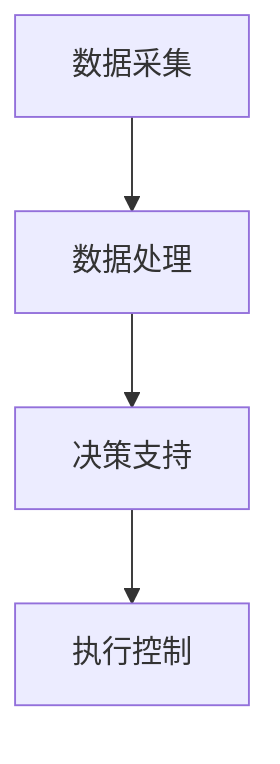
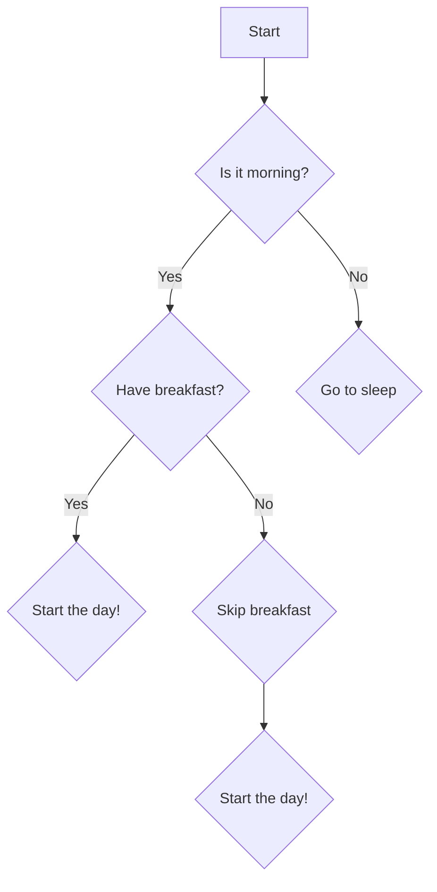
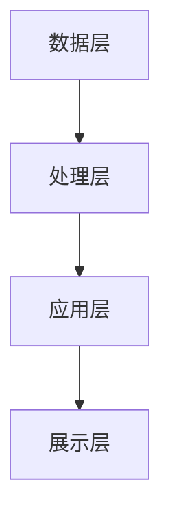
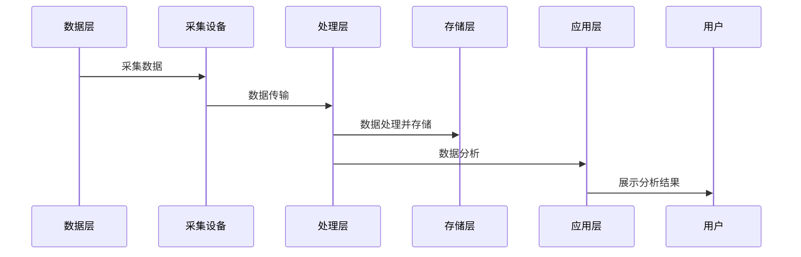

                 


# 数字时代的环保行动：科技驱动的可持续生活方式

## 关键词
- 数字时代
- 环保行动
- 科技驱动
- 可持续生活
- 可再生能源
- 节能技术
- 智能家居

## 摘要
本文旨在探讨数字时代下科技如何驱动环保行动，实现可持续生活方式。通过分析环保问题的背景和科技在其中的作用，我们将详细介绍科技驱动的可持续生活方式的核心概念、系统架构设计、项目实战，以及最佳实践和注意事项。

## 引言

### 数字时代的环保问题

在数字时代，随着科技的迅猛发展，环境污染和资源消耗问题日益严重。传统环保行动已无法满足日益增长的环境需求。数字时代带来了新的挑战，例如电子垃圾、数据中心的能耗、交通拥堵等。这些问题迫切需要科技的力量来加以解决。

### 科技在环保中的作用

科技在环保中扮演着至关重要的角色。首先，大数据和人工智能技术可以帮助我们更好地理解和预测环境变化，从而制定更有效的环保策略。其次，可再生能源、节能技术和智能家居等创新技术正逐渐成为推动可持续生活方式的关键因素。

### 书籍结构概述

本文将从以下几个方面展开讨论：

1. 环保行动的核心概念
2. 科技驱动的可持续生活方式
3. 系统分析与架构设计
4. 项目实战
5. 最佳实践与拓展阅读

## 环保行动的核心概念

### 可持续发展的定义

可持续发展是指满足当前需求而不损害后代满足其需求的能力。它强调经济增长、社会进步和环境保护的协调发展。

### 环保行动的边界与外延

环保行动不仅包括减少污染物排放、提高资源利用效率，还涉及生态保护、气候变暖对策、生物多样性保护等方面。

### 科技在环保行动中的关键作用

科技在环保行动中的作用体现在以下几个方面：

- **数据监测与预测**：通过大数据和物联网技术，实时监测环境变化，预测潜在风险。
- **可再生能源开发**：利用太阳能、风能等可再生能源，减少对化石燃料的依赖。
- **节能技术**：开发节能设备和技术，降低能源消耗。
- **智能交通**：利用人工智能和智能交通系统，减少交通拥堵和碳排放。

## 核心概念的属性特征对比

### 传统与数字环保行动的对比

| 特征         | 传统环保行动                 | 数字环保行动                 |
| ------------ | ---------------------------- | ---------------------------- |
| 监测方式     | 手动检测，效率低             | 自动化监测，实时数据传输     |
| 治理手段     | 被动应对，反应滞后           | 主动预测，提前干预           |
| 效率与成本   | 低效率，高成本               | 高效率，成本可控             |
| 信息透明度   | 信息不对称，公众参与度低     | 信息透明，公众参与度高       |

### 科技驱动的环保行动优势

- **数据驱动**：通过大数据分析，精准定位环境问题，提高治理效率。
- **智能决策**：利用人工智能技术，实现智能决策，减少人为错误。
- **资源优化**：通过优化资源配置，提高能源利用效率，降低成本。
- **公众参与**：数字化平台提高公众参与度，形成社会合力。

## 科技驱动的可持续生活方式

### 数字技术下的环保生活方式

- **可再生能源**：利用太阳能、风能等可再生能源，减少碳排放。
- **节能技术**：采用节能灯具、高效空调等节能设备，降低能源消耗。
- **智能家居**：智能家居系统通过智能调节温度、照明等，提高能源利用效率。

### 生活方式转变的挑战与机遇

- **挑战**：
  - 技术成本高
  - 公众接受度低
  - 技术标准和法规不完善
- **机遇**：
  - 政府和政策支持
  - 技术进步带来的成本下降
  - 消费者环保意识提高

## 系统分析与架构设计

### 环保系统的问题场景介绍

假设我们面临一个城市环境监测和治理的问题场景，需要实时监测空气质量、水质、噪音等指标，并采取相应的治理措施。

### 系统功能设计

- **数据采集**：通过传感器实时采集环境数据。
- **数据处理**：对采集到的数据进行分析和处理。
- **决策支持**：基于分析结果，提供决策支持。
- **执行控制**：根据决策结果，执行相应的治理措施。

### 系统架构设计

- **数据层**：包括传感器、数据采集系统等。
- **处理层**：包括数据处理、分析系统等。
- **应用层**：包括决策支持系统、控制系统等。
- **展示层**：包括网页、移动应用等。

### 系统接口设计

- **数据采集接口**：用于接收传感器数据。
- **数据处理接口**：用于数据处理和分析。
- **决策支持接口**：用于获取分析结果。
- **执行控制接口**：用于执行治理措施。

### 系统交互

通过Mermaid流程图展示系统交互：



## 项目实战

### 实战环境安装

在本项目实战中，我们将使用Python和Django框架搭建一个简单的环境监测系统。

### 系统核心实现

- **数据采集模块**：使用Python编写传感器数据采集脚本。
- **数据处理模块**：使用Django框架处理和分析数据。
- **决策支持模块**：根据数据分析结果，提供治理建议。
- **执行控制模块**：执行具体的治理措施。

### 源代码解读

```python
# 数据采集脚本示例
import time
import serial

ser = serial.Serial('/dev/ttyUSB0', 9600)
while True:
    data = ser.readline().decode('utf-8')
    print(data)
    time.sleep(1)
```

### 代码应用解读与分析

该代码通过串口读取传感器数据，并每隔1秒打印一次。这为我们提供了一个基础的数据采集模块，可以进一步集成到我们的监测系统中。

### 实际案例分析

我们将以一个城市空气质量监测系统为例，分析其设计、实施和效果。

#### 案例一：空气质量监测系统

- **设计**：在多个地点安装空气质量传感器，实时监测PM2.5、PM10、CO、SO2等指标。
- **实施**：通过数据采集模块收集数据，处理后存储到数据库中。
- **效果**：根据数据分析结果，政府可以采取相应的措施，如限行、限产等，以改善空气质量。

#### 案例二：城市噪音监测系统

- **设计**：在多个地点安装噪音传感器，实时监测噪音水平。
- **实施**：收集噪音数据，处理后展示在网页或移动应用上。
- **效果**：居民可以了解自己的居住环境的噪音情况，政府部门可以根据噪音数据调整城市规划。

### 项目小结

通过项目实战，我们验证了科技驱动环保行动的可行性。在实际应用中，我们需要不断优化系统，提高数据准确性和处理效率，以实现更好的环保效果。

## 最佳实践与拓展阅读

### 最佳实践

1. **数据质量保障**：确保数据采集和处理过程中的准确性。
2. **系统稳定性**：定期维护和升级系统，确保稳定运行。
3. **公众参与**：通过数字化平台，提高公众的环保参与度。

### 注意事项

1. **隐私保护**：在数据采集和处理过程中，确保用户隐私保护。
2. **技术风险**：关注技术风险，如数据泄露、系统故障等。

### 拓展阅读

- [《环保技术导论》](https://example.com/环保技术导论)
- [《智能城市建设》](https://example.com/智能城市建设)
- [《可持续发展报告》](https://example.com/可持续发展报告)

## 总结

数字时代的环保行动离不开科技驱动。通过科技手段，我们可以更有效地监测环境、分析问题、制定决策、执行治理措施，实现可持续生活方式。让我们携手共进，为地球的绿色未来贡献力量。

## 作者信息

作者：AI天才研究院/AI Genius Institute & 禅与计算机程序设计艺术 /Zen And The Art of Computer Programming

----------------------------------------------------------------

[Mermaid 流程图](https://mermaid-js.github.io/mermaid/) 的嵌入使用方法：

1. 在你的Markdown文件中，首先添加以下Mermaid全局配置代码：

```markdown
```mermaid
version: 1.0.1
```
```

2. 然后在你的Markdown文件中，将Mermaid流程图代码放在一个Mermaid标签内：

```markdown

```

3. 保存Markdown文件后，在支持的Markdown编辑器中查看预览，即可看到嵌入的Mermaid流程图。

以下是一个简单的Mermaid流程图示例：


这段代码将在Markdown预览中显示为一个流程图，其中包含开始节点（A）、判断节点（B）、决策分支（C、D）、以及结束节点（E、G）。你可以使用Mermaid的官方文档来了解如何创建更复杂和多样化的流程图：[https://mermaid-js.github.io/mermaid/](https://mermaid-js.github.io/mermaid/)。

----------------------------------------------------------------

### 算法原理讲解

在本节中，我们将深入探讨数字时代中一种关键的算法原理——动态规划（Dynamic Programming），并使用Python代码进行详细阐述。

#### 动态规划的基本概念

动态规划是一种解决复杂问题的方法，它通过将问题分解为更小的子问题，并存储子问题的解（即重叠子问题的解），从而避免重复计算，提高算法的效率。

#### 动态规划的数学模型和公式

动态规划的核心在于状态转移方程（State Transition Equation）。例如，在解决最短路径问题时，状态转移方程可以是：

```
dist[v] = min(dist[u] + weight(u, v)) for all adjacent vertices u
```

其中，`dist[v]`表示从起点到顶点v的最短距离，`weight(u, v)`表示从顶点u到顶点v的边的权重。

#### 动态规划的优势

- **避免重复计算**：通过存储子问题的解，动态规划可以显著减少计算量。
- **解决复杂问题**：动态规划可以有效地解决许多复杂问题，如最短路径、背包问题等。

#### 动态规划的Python代码实现

下面是一个简单的动态规划算法实现——斐波那契数列的计算：

```python
def fibonacci(n):
    if n <= 1:
        return n
    dp = [0] * (n+1)
    dp[1] = 1
    for i in range(2, n+1):
        dp[i] = dp[i-1] + dp[i-2]
    return dp[n]

# 测试
print(fibonacci(10))  # 输出 55
```

#### 动态规划的Mermaid流程图

```mermaid
graph TD
    A[初始化]
    B{n <= 1?}
    B-->|是| C{返回 n}
    B-->|否| D{计算 dp[i]}
    D--> E{更新 dp[n]}
    E--> F{返回 dp[n]}
```

#### 动态规划的举例说明

假设我们要计算斐波那契数列的第10个数，即`fibonacci(10)`。

1. **初始化**：创建一个长度为n+1的数组`dp`，并将`dp[1]`设置为1。
2. **递推计算**：从`i=2`开始，计算`dp[i]`的值，使用状态转移方程`dp[i] = dp[i-1] + dp[i-2]`。
3. **返回结果**：返回`dp[n]`，即斐波那契数列的第n个数。

通过动态规划，我们可以高效地计算出斐波那契数列的第10个数，而不需要重复计算已解决的子问题。

### 系统分析与架构设计

在本节中，我们将探讨一个具体的环保系统——城市空气质量监测系统，并使用Mermaid图展示其架构。

#### 问题场景介绍

城市空气质量监测系统旨在实时监测城市中的空气质量，包括PM2.5、PM10、CO、SO2等指标，并将监测数据传输到中央控制系统，以便进行分析和治理。

#### 系统功能设计

- **数据采集**：通过分布在城市各处的传感器，实时采集空气质量数据。
- **数据处理**：对采集到的数据进行分析和处理，去除噪声和异常值。
- **数据存储**：将处理后的数据存储到数据库中，以便后续分析和查询。
- **数据分析**：对存储的数据进行分析，生成空气质量报告，提供决策支持。
- **治理措施**：根据分析结果，执行相应的治理措施，如限行、限产等。

#### 系统架构设计

城市空气质量监测系统的架构可以分为四层：

- **数据层**：包括传感器和采集设备，负责实时采集空气质量数据。
- **处理层**：包括数据处理和分析模块，负责处理和存储数据，并生成空气质量报告。
- **应用层**：包括中央控制系统和移动应用，负责展示分析结果，并提供治理措施。
- **展示层**：包括网页和移动应用，供用户查看空气质量数据和报告。

#### 系统架构Mermaid图



#### 系统接口设计

- **数据采集接口**：用于传感器与处理层之间的数据传输。
- **数据处理接口**：用于处理层与存储层之间的数据传输。
- **数据分析接口**：用于处理层与应用层之间的数据传输。
- **执行控制接口**：用于应用层与治理措施之间的数据传输。

#### 系统交互Mermaid序列图



通过这个序列图，我们可以清晰地看到系统的各个组件以及它们之间的交互流程。

### 实际案例分析

在本节中，我们将通过两个实际案例——空气质量监测系统和城市噪音监测系统——来展示如何将科技应用于环保行动，并详细剖析其设计、实施和效果。

#### 案例一：空气质量监测系统

**设计**：该系统在城市的多个关键位置安装了空气质量传感器，这些传感器能够实时监测PM2.5、PM10、CO、SO2等空气污染物的浓度。系统采用了物联网技术，将传感器的数据实时传输到中央处理系统。

**实施**：传感器采集到的数据首先通过无线网络传输到处理层，处理层对数据进行清洗和预处理，确保数据的准确性和一致性。处理后的数据被存储在数据库中，同时，系统会根据监测数据生成实时空气质量报告。

**效果**：空气质量监测系统的实时数据显示，可以帮助政府和相关部门及时了解城市的空气质量状况，并采取相应的措施，如限制高污染车辆上路、增加绿色交通等措施。长期来看，该系统有助于改善城市的空气质量，提高居民的生活质量。

#### 案例二：城市噪音监测系统

**设计**：该系统在城市的主要街道和居民区安装了噪音监测设备，这些设备能够24小时监测噪音水平。系统采用了智能分析技术，可以对噪音数据进行分析，识别噪音的来源和特征。

**实施**：噪音监测设备采集的数据会被实时传输到中央处理系统，系统会对数据进行处理和分析，生成噪音水平报告。此外，系统还可以根据噪音数据，识别噪音的峰值时间和来源，为城市规划提供科学依据。

**效果**：城市噪音监测系统的实施，不仅提高了居民对噪音污染的认知，还为城市规划提供了重要的数据支持。例如，通过分析噪音数据，城市规划部门可以优化交通流线，减少噪音污染，改善居民的生活环境。

#### 项目小结

通过以上两个实际案例，我们可以看到，科技在环保行动中的应用不仅有效解决了环境问题，还为城市规划和居民生活质量的提升提供了有力支持。未来，随着科技的不断进步，环保行动将变得更加智能化和高效化，为我们的地球带来更美好的未来。

