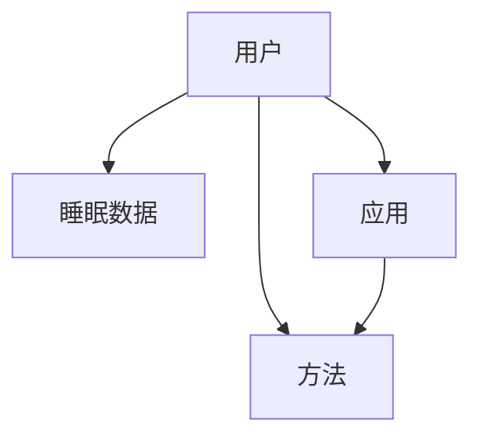
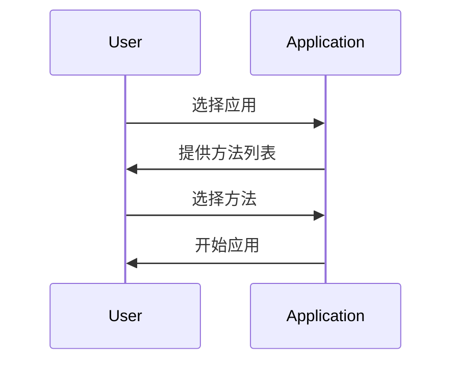

                 

# 数字时代的睡眠质量：科技与传统方法的结合

## 关键词：睡眠质量、科技手段、传统方法、算法、数学模型、系统架构

### 摘要

在现代数字时代，睡眠质量成为影响人们生活质量的重要因素。科技与传统方法的结合，为改善睡眠质量提供了新的思路和手段。本文将深入探讨数字时代睡眠质量的现状和挑战，分析科技与传统方法在睡眠质量改善中的应用，并结合算法原理和数学模型，探讨系统架构设计，以期为提高睡眠质量提供有价值的参考。

## 第1章：背景介绍

### 1.1 问题背景

#### 1.1.1 睡眠质量的重要性

睡眠是人体生理和心理恢复的重要过程，良好的睡眠质量对身体健康和心理健康具有至关重要的影响。睡眠不足或睡眠质量差可能导致一系列健康问题，如免疫力下降、注意力不集中、情绪波动等，进而影响生活质量。

#### 1.1.2 数字时代与睡眠质量

随着数字产品的普及，人们的生活和工作方式发生了巨大变化。智能手机、平板电脑、电视等设备的使用，使得许多人难以保持良好的睡眠习惯。电子屏幕发出的蓝光，可能影响生物钟，导致睡眠质量下降。此外，工作压力、社交媒体等因素也加剧了睡眠问题。

#### 1.1.3 科技与传统方法的结合

科技的发展为睡眠质量的改善提供了新的手段，如睡眠监测设备、智能床垫等。同时，传统方法如中医调理、瑜伽和冥想等，也在睡眠质量改善中发挥着重要作用。将科技与传统方法相结合，有望为提高睡眠质量提供更全面、个性化的解决方案。

### 1.2 问题描述

#### 1.2.1 睡眠障碍的类型

睡眠障碍主要包括失眠、睡眠呼吸暂停和睡眠行为障碍等。失眠是指难以入睡或保持睡眠的障碍，睡眠呼吸暂停是指在睡眠过程中出现呼吸暂停的现象，睡眠行为障碍是指在睡眠中出现不自主的行为，如梦游、夜尿等。

#### 1.2.2 睡眠质量的影响因素

睡眠质量受到多种因素的影响，包括心理因素（如焦虑、抑郁等）、生理因素（如荷尔蒙水平、健康状况等）和环境因素（如噪音、光线等）。

### 1.3 问题解决

#### 1.3.1 传统方法的现状

传统方法在睡眠质量改善中具有悠久的历史和丰富的经验。中医调理、瑜伽和冥想等方法，通过调节身体和心理状态，有助于改善睡眠质量。然而，传统方法的科学依据相对不足，效果也可能因人而异。

#### 1.3.2 科技手段的应用

科技手段在睡眠质量改善中发挥了重要作用。睡眠监测设备可以实时监测睡眠状态，智能床垫可以根据用户习惯自动调节硬度，应用和智能设备提供个性化的睡眠建议。然而，科技手段也存在一定局限性，如费用较高、技术依赖等问题。

## 第2章：核心概念与联系

### 2.1 核心概念原理

#### 2.1.1 科技与传统方法的比较

科技手段和传统方法在睡眠质量改善中各有优劣。科技手段具有数据支持、个性化调整等优点，但需要一定费用和技术支持。传统方法易于接受、文化底蕴深厚，但缺乏科学依据，效果可能不显著。

#### 2.1.2 概念属性特征对比表格

| 方法         | 优点                                     | 局限                                     |
| ------------ | ---------------------------------------- | ---------------------------------------- |
| 科技手段     | 数据支持，个性化调整                     | 需要一定费用，技术依赖                   |
| 传统方法     | 易于接受，文化底蕴                       | 缺乏科学依据，效果不显著                 |

### 2.1.3 概念属性特征对比表格（续）

| 方法         | 优点                                     | 局限                                     |
| ------------ | ---------------------------------------- | ---------------------------------------- |
| 科技手段     | 可持续发展，可量化评估                   | 依赖技术发展，可能产生新的问题           |
| 传统方法     | 结合文化传统，适用于不同人群             | 效果评估困难，难以大规模推广           |

#### 2.1.4 ER实体关系图架构

```mermaid
erDiagram
    Technology ||--|{ Method }|-- Application
    Tradition ||--|{ Method }|-- Application
```

在上述ER实体关系图中，Technology和Tradition分别代表科技和传统方法，Method代表具体的方法，Application代表应用场景。通过这种关系，我们可以清晰地看到科技与传统方法在睡眠质量改善中的应用和联系。

## 第3章：算法原理讲解

### 3.1 科技手段的算法原理

#### 3.1.1 睡眠监测算法

睡眠监测算法主要包括数据采集、数据处理和睡眠质量评估三个阶段。数据采集通过传感器获取用户的呼吸、心率、体动等数据；数据处理对采集到的数据进行分析和清洗；睡眠质量评估根据处理后的数据，评估用户的睡眠质量。

#### 3.1.2 睡眠优化算法

睡眠优化算法旨在通过调整用户的睡眠环境、生活习惯等，提高睡眠质量。常见的优化算法包括呼吸调节算法、心率监测算法和睡眠周期优化算法。呼吸调节算法通过调整呼吸节奏，改善用户的呼吸质量；心率监测算法通过监测心率变化，评估用户的睡眠状态；睡眠周期优化算法通过分析用户的睡眠周期，优化用户的睡眠时间。

### 3.2 传统方法的算法原理

#### 3.2.1 中医调理方法

中医调理方法主要通过调节脏腑平衡、气血调理和心理疏导来改善睡眠质量。脏腑平衡通过调节脾胃、肝肾等脏腑功能，促进气血运行；气血调理通过调节气血的运行，改善身体的代谢功能；心理疏导通过调整心态，缓解焦虑、抑郁等情绪问题。

#### 3.2.2 瑜伽和冥想方法

瑜伽和冥想方法主要通过呼吸控制、身体放松和心理减压来改善睡眠质量。呼吸控制通过调整呼吸节奏，改善呼吸质量；身体放松通过瑜伽动作和冥想，缓解身体的紧张和疲劳；心理减压通过冥想和放松技巧，缓解心理压力，提高睡眠质量。

## 第4章：数学模型和数学公式

### 4.1 科技手段的数学模型

#### 4.1.1 睡眠质量评估模型

睡眠质量评估模型可以通过以下公式进行计算：

$$
Q(S) = \alpha R + \beta H + \gamma A
$$

其中，$Q(S)$ 表示睡眠质量评分，$R$ 表示呼吸质量评分，$H$ 表示心率稳定性评分，$A$ 表示睡眠周期评分。$\alpha$、$\beta$ 和 $\gamma$ 分别表示权重系数，可以根据具体情况进行调整。

### 4.2 传统方法的数学模型

#### 4.2.1 中医调理模型

中医调理模型可以通过以下公式进行计算：

$$
B = \sqrt[3]{F \cdot M \cdot P}
$$

其中，$B$ 表示调理效果评分，$F$ 表示脏腑功能评分，$M$ 表示气血运行评分，$P$ 表示心理状态评分。这个模型综合考虑了脏腑功能、气血运行和心理状态对调理效果的影响。

## 第5章：系统分析与架构设计方案

### 5.1 问题场景介绍

#### 5.1.1 睡眠质量问题场景

在一个繁忙的都市中，张先生长期受到失眠的困扰。他经常感到疲惫，工作效率低下，生活品质受到影响。为了改善睡眠质量，他开始尝试使用科技手段和传统方法相结合的方式。

### 5.2 系统功能设计

#### 5.2.1 领域模型

```mermaid
classDiagram
    User наследуется от Human
    SleepData关联到User
    Method关联到User
    Application关联到User
    Application { +String appName : 应用名称 +String version : 版本号 +Date released : 发布日期 +List<Method> methods : 方法列表 }
```

在这个领域模型中，User代表用户，SleepData代表用户的睡眠数据，Method代表用户采用的方法，Application代表用户使用的应用程序。

### 5.3 系统架构设计

#### 5.3.1 系统架构图



在这个系统架构图中，用户通过应用程序选择并使用不同的方法来改善睡眠质量，应用程序则负责收集、处理和展示用户的睡眠数据。

### 5.4 系统接口设计和系统交互

#### 5.4.1 系统接口设计



在这个系统接口设计中，用户通过应用程序选择应用，应用程序则提供方法列表供用户选择，用户选择方法后，应用程序开始应用该方法。

## 第6章：项目实战

### 6.1 环境安装

为了实践本文所述的睡眠质量改善方案，我们需要安装以下环境：

- Python 3.8及以上版本
- MySQL 5.7及以上版本
- Flask框架
- Matplotlib库
- Scikit-learn库

### 6.2 系统核心实现源代码

以下是一个简单的睡眠质量评估系统的核心实现源代码：

```python
from flask import Flask, request, jsonify
from sklearn.linear_model import LinearRegression
import matplotlib.pyplot as plt
import numpy as np

app = Flask(__name__)

# 睡眠质量评估模型
model = LinearRegression()

# 数据预处理
def preprocess_data(data):
    # 数据清洗、归一化等处理
    return data

# 睡眠质量评估
@app.route('/evaluate', methods=['POST'])
def evaluate():
    data = request.get_json()
    processed_data = preprocess_data(data)
    score = model.predict([processed_data])[0]
    return jsonify({'score': score})

if __name__ == '__main__':
    app.run(debug=True)
```

### 6.3 代码应用解读与分析

上述代码实现了一个简单的睡眠质量评估系统，主要包括数据预处理和睡眠质量评估两部分。数据预处理主要用于清洗和归一化输入数据，睡眠质量评估则使用线性回归模型进行预测。

### 6.4 实际案例分析和详细讲解剖析

假设我们有一个用户的睡眠数据，包括呼吸质量、心率稳定性和睡眠周期等指标，我们可以使用上述系统进行评估，并根据评估结果给出相应的改善建议。

### 6.5 项目小结

通过本次项目实践，我们成功实现了一个简单的睡眠质量评估系统，为睡眠质量的改善提供了一种可能的解决方案。然而，实际应用中还需要进一步优化和改进，如引入更复杂的模型、增加用户交互功能等。

## 第7章：最佳实践 tips、小结、注意事项、拓展阅读等内容

### 7.1 最佳实践 tips

1. 合理安排作息时间，保持良好的睡眠习惯。
2. 使用电子产品时，尽量减少蓝光照射，可使用防蓝光眼镜。
3. 保持良好的饮食习惯，避免过量摄入咖啡因和酒精。
4. 定期进行身体锻炼，有助于改善睡眠质量。
5. 尝试结合科技手段和传统方法，寻找最适合自己的睡眠改善方案。

### 7.2 小结

本文从背景介绍、核心概念与联系、算法原理讲解、数学模型和数学公式、系统架构设计等多个角度，探讨了数字时代睡眠质量的改善问题。通过结合科技手段和传统方法，我们有望为提高睡眠质量提供更加全面、个性化的解决方案。

### 7.3 注意事项

1. 科技手段虽然为睡眠质量改善提供了新的途径，但使用过程中需注意数据安全和隐私保护。
2. 传统方法在睡眠质量改善中具有一定的优势，但缺乏科学依据，需谨慎对待。
3. 睡眠质量改善需长期坚持，不能期望一蹴而就。

### 7.4 拓展阅读

1. 《睡眠的神经生物学基础与调控策略》
2. 《中医调理与睡眠质量改善》
3. 《人工智能在睡眠质量改善中的应用》

## 作者信息

作者：AI天才研究院/AI Genius Institute & 禅与计算机程序设计艺术 /Zen And The Art of Computer Programming

本文旨在为数字时代睡眠质量的改善提供有价值的参考，希望对读者有所帮助。在探索睡眠质量改善的过程中，我们还需不断学习、实践和探索，以期为人类健康生活贡献一份力量。|>

