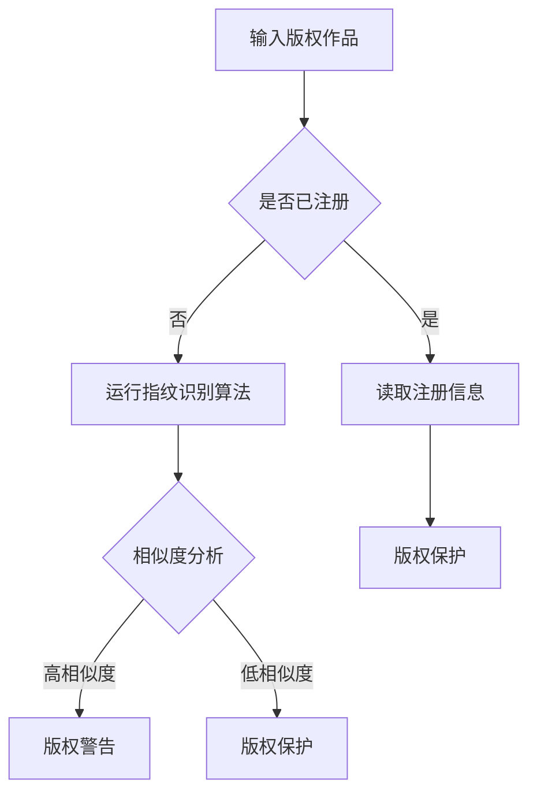
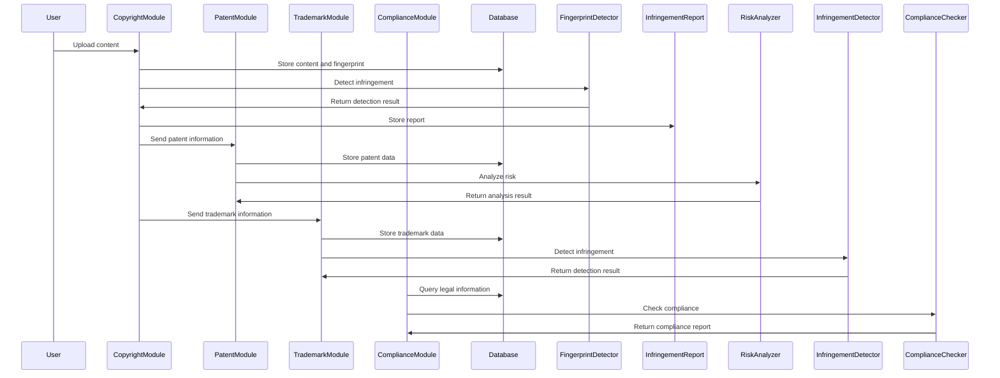

                 


### 第1章 引言

#### 1.1 问题背景

在数字时代，随着信息技术的飞速发展，知识产权保护的重要性愈发凸显。数字化信息的易复制性和传播速度，使得传统的知识产权保护手段面临前所未有的挑战。创新激励和信息共享的平衡成为数字时代知识产权保护的核心问题。

数字时代，信息的产生、传播和处理速度大大加快，这不仅带来了丰富的创新机会，也使得知识产权侵权行为更加隐蔽和复杂。网络环境下的知识产权侵权现象层出不穷，如盗版软件、侵权网站、网络版权纠纷等。这些问题不仅损害了原创者的权益，也影响了整个社会的创新环境和秩序。

#### 1.2 数字时代知识产权保护的重要性

数字时代的知识产权保护不仅关系到个人的创作权益，更关乎企业的发展和国家的创新竞争力。有效的知识产权保护机制能够激励创新，促进信息共享，同时防止知识产权的滥用。

首先，知识产权保护是激励创新的重要手段。原创者通过版权、专利等法律手段保护自己的智力成果，可以确保在创新过程中获得合理的回报，从而激发更多的创新行为。其次，知识产权保护有助于促进信息共享。在保护原创者的权益的同时，合理的知识产权制度也能够促进信息的传播和利用，推动知识的普及和共享。最后，知识产权保护是维护公平竞争、保障社会公共利益的重要手段。通过对知识产权的严格保护，可以防止知识产权的滥用，维护市场的公平竞争环境。

#### 1.3 书籍结构概述

本书将系统介绍数字时代知识产权保护的理论和实践，包括基础概念、算法原理、系统架构设计、项目实战以及最佳实践等内容。具体来说，本书将分为以下几部分：

- **第1章 引言**：介绍数字时代知识产权保护的重要性、现状以及面临的主要挑战。
- **第2章 知识产权保护基础**：介绍知识产权保护的基础概念，如版权、专利、商标等，并展示它们之间的关系。
- **第3章 知识产权保护算法原理**：讲解数字时代知识产权保护的算法原理，包括算法的流程、数学模型和公式，以及实际应用案例。
- **第4章 系统分析与架构设计**：设计一个知识产权保护系统，包括问题场景介绍、系统功能设计、系统架构设计、系统接口设计和系统交互。
- **第5章 项目实战**：通过一个实际案例，展示如何应用所学的知识和算法进行知识产权保护。
- **第6章 最佳实践与总结**：提供一些最佳实践建议，总结书籍的主要内容，并提出一些注意事项和拓展阅读建议。

通过以上章节的介绍，读者可以全面了解数字时代知识产权保护的理论和实践，掌握知识产权保护的关键技术和方法，为在实际工作中应对知识产权挑战提供有力的支持。

### 第2章 知识产权保护基础

#### 2.1 版权

版权，也称为著作权，是指创作者对其创作作品享有的专有权利。版权涵盖了文学、艺术、科学等多个领域，保护作品的原创性表达，如文字、音乐、绘画、摄影、电影等。版权的基本权利包括复制权、发行权、展示权、表演权、改编权等。

**版权的特征**：

1. **原创性**：版权保护的是作品的原创性表达，而非思想、方法、概念、发现等。
2. **自动性**：版权在作品完成时自动产生，不需要进行注册或其他法律程序。
3. **地域性**：版权在不同国家的保护范围可能有所不同，受国际版权公约和双边协议的影响。
4. **不可转让性**：部分版权（如精神权利）不可转让，但经济权利可以转让或许可他人使用。

**版权的保护期限**：

版权的保护期限因国家而异，一般分为两个阶段：经济权利和道德权利。经济权利的保护期限通常为作者终生及其死后50年，而道德权利的保护期限一般与作者寿命相当。

**版权的侵权形式**：

1. **未经授权的复制**：未经版权人许可，复制版权作品。
2. **未经授权的发行**：未经版权人许可，发行版权作品。
3. **未经授权的展示、表演或改编**：未经版权人许可，展示、表演或改编版权作品。

#### 2.2 专利

专利是指对发明创造的独占权利。专利保护的是发明的新颖性、创造性和实用性，涵盖技术、方法、产品或改进等方面。专利的基本类型包括发明专利、实用新型专利和外观设计专利。

**专利的特征**：

1. **独占性**：专利权人享有对发明的独占实施权，他人未经许可不得实施。
2. **地域性**：专利在不同国家的保护范围不同，需在每个国家或地区申请。
3. **有限性**：专利有固定的保护期限，一般为20年，从申请日起计算。
4. **法定性**：专利需通过国家专利局审查并授权，才能获得法律保护。

**专利的类型**：

1. **发明专利**：保护技术方案，要求具备新颖性、创造性和实用性。
2. **实用新型专利**：保护产品的形状、构造或其结合，要求具备新颖性和实用性。
3. **外观设计专利**：保护产品外观设计，要求具备新颖性和美观性。

**专利的侵权形式**：

1. **未经授权的实施**：未经专利权人许可，实施专利技术。
2. **未经授权的制造、使用、许诺销售、销售、进口**：侵犯专利权人的经济权利。

#### 2.3 商标

商标是用于区分商品或服务的标识，通常由文字、图形、字母、数字等元素组成。商标通过注册获得法律保护，可以防止他人恶意使用相同或类似的标识。

**商标的特征**：

1. **标识性**：商标需要具有独特性，便于识别和区分。
2. **注册性**：商标需通过国家商标局注册，才能获得法律保护。
3. **专有性**：注册商标的持有者享有对该标识的独占使用权。
4. **地域性**：商标在不同国家的保护范围不同，需在每个国家或地区注册。

**商标的保护期限**：

商标的保护期限通常为10年，从注册日起计算。到期后可以通过续展保持商标的有效性。

**商标的侵权形式**：

1. **未经授权的使用**：未经商标权人许可，使用相同或相似的商标。
2. **恶意抢注**：未经授权，恶意注册与他人商标相同或相似的商标。

#### 2.4 知识产权保护的法律框架

知识产权保护的法律框架主要包括《世界知识产权组织条约》（WIPO）、《伯尔尼公约》、《巴黎公约》等国际条约，以及各国国内的知识产权法律法规。

**国际条约**：

1. **世界知识产权组织条约（WIPO）**：是全球知识产权保护的核心条约，涵盖了版权、专利、商标等多个领域。
2. **伯尔尼公约**：是全球版权保护的重要条约，规定了版权的基本原则和保护范围。
3. **巴黎公约**：是全球专利保护的重要条约，规定了专利的基本原则和保护范围。

**国内法律法规**：

1. **中华人民共和国著作权法**：规定了我国版权的基本原则和保护范围。
2. **中华人民共和国专利法**：规定了我国专利的基本原则和保护范围。
3. **中华人民共和国商标法**：规定了我国商标的基本原则和保护范围。

#### 2.5 核心概念与联系

知识产权保护的核心概念包括版权、专利、商标等。这些概念之间存在密切的联系，共同构成了知识产权保护的法律框架。

**核心概念特征对比表格**：

| 概念       | 定义                                                                                   | 保护范围               | 特征                     |
|------------|----------------------------------------------------------------------------------------|------------------------|--------------------------|
| 版权       | 创作者的原创性表达权利                                                       | 文字、艺术、科学作品等 | 原创性、自动性、地域性   |
| 专利       | 对发明创造的独占权利                                                             | 技术、方法、产品等     | 独占性、地域性、有限性    |
| 商标       | 区分商品或服务的标识权利                                                             | 文字、图形、字母等     | 标识性、注册性、地域性   |

**ER实体关系图架构**：

使用Mermaid ER实体关系图来展示版权、专利、商标等核心概念之间的关系。

```mermaid
erDiagram
    Copyright ||--||> Patent : 保护关系
    Copyright ||--||> Trademark : 保护关系
    Patent ||--||> Technology : 实施对象
    Trademark ||--||> Brand : 实施对象
```

通过以上核心概念特征对比表格和ER实体关系图，我们可以清晰地了解知识产权保护的基础概念和它们之间的联系，为后续的算法原理讲解和系统设计与实施打下坚实的基础。

#### 2.6 算法原理讲解

在数字时代，知识产权保护面临着复杂的挑战，因此需要运用先进的算法和技术来提高保护效果。本节将介绍知识产权保护中的一些关键算法原理，并通过Python代码和LaTeX格式来详细阐述。

##### 3.1 算法概述

知识产权保护算法主要包括版权检测、专利分析和商标匹配等。这些算法的核心目标是识别和验证知识产权，从而防止侵权行为。

**版权检测**：版权检测算法用于识别和验证作品的原创性。常见的算法包括基于哈希值的指纹识别、基于特征匹配的相似度检测等。

**专利分析**：专利分析算法用于识别和评估专利的有效性和影响力。常用的算法包括文本相似度分析、关键词聚类、专利网络分析等。

**商标匹配**：商标匹配算法用于识别和验证商标的相似度。常用的算法包括字符串匹配、图像识别、机器学习分类等。

##### 3.2 算法Mermaid流程图

以下是一个简单的版权检测算法的Mermaid流程图：



##### 3.3 Python代码实现

以下是一个简单的版权检测算法的Python代码实现：

```python
import hashlib
import os

def generate_fingerprint(file_path):
    with open(file_path, 'rb') as file:
        file_content = file.read()
        fingerprint = hashlib.md5(file_content).hexdigest()
        return fingerprint

def compare_fingerprints(fingerprint1, fingerprint2):
    return int(fingerprint1, 16) == int(fingerprint2, 16)

def copyright_detection(file_path, registered_fingerprint):
    user_fingerprint = generate_fingerprint(file_path)
    if compare_fingerprints(user_fingerprint, registered_fingerprint):
        print("版权警告：该作品已注册，未经授权禁止使用！")
    else:
        print("版权保护：该作品未发现侵权行为，可继续使用。")

# 测试
registered_fingerprint = "0123456789abcdef0123456789abcdef"
file_path = "example.txt"
copyright_detection(file_path, registered_fingerprint)
```

##### 3.4 数学模型与公式

在版权检测中，指纹识别是一个关键步骤。指纹识别的数学模型可以表示为：

$$
fingerprint = Hash(\text{file\_content})
$$

其中，$Hash$ 表示哈希函数，$\text{file\_content}$ 表示文件的二进制内容。常见的哈希函数包括MD5、SHA-1、SHA-256等。

相似度分析的数学模型可以表示为：

$$
similarity = 1 - \frac{Hamming\_Distance(fingerprint1, fingerprint2)}{max(Len(fingerprint1), Len(fingerprint2))}
$$

其中，$Hamming\_Distance$ 表示汉明距离，$Len$ 表示长度。

##### 3.5 算法举例说明

假设有一个已注册的文本作品，其指纹为 `0123456789abcdef0123456789abcdef`。现在我们需要检测一个用户上传的文本文件是否侵权。

1. 生成用户上传文件的指纹：`2345678901abcdef2345678901abcdef`。
2. 比较指纹：汉明距离为 4，文件长度为 32。
3. 相似度分析：$$ similarity = 1 - \frac{4}{32} = 0.875 $$。

由于相似度较高（大于 0.8 通常被认为存在侵权风险），我们发出版权警告。

通过上述算法原理的讲解和Python代码实现，我们可以看到，数字时代的知识产权保护需要结合先进的算法和技术，以应对日益复杂的侵权行为。这不仅有助于保护原创者的权益，也有助于推动整个社会的创新和发展。

#### 4.1 问题场景介绍

在现代数字时代，知识产权保护面临着诸多挑战，尤其是在信息的快速传播和全球化的背景下。本节将介绍一个典型的知识产权保护问题场景，以及本系统所要解决的问题和目标。

##### 场景介绍

假设我们是一家大型互联网公司的CTO，我们的公司开发和运营多个热门应用程序，这些应用程序中包含大量的原创内容，如文章、图片、视频和音频。随着用户基数的不断扩大，我们面临着日益严峻的知识产权侵权问题。以下是我们面临的一些具体问题：

1. **版权检测困难**：大量的用户生成内容使得版权检测变得复杂，我们难以确定哪些内容是未经授权的侵权内容。
2. **专利保护不足**：我们的公司不断推出新的技术和产品，但缺乏有效的专利保护机制，容易遭受竞争对手的抄袭和侵权。
3. **商标侵权**：在全球化背景下，我们的商标可能被国外企业恶意注册或使用，造成品牌形象受损和市场竞争力下降。
4. **法律合规性**：知识产权保护涉及多个国家和地区的法律法规，我们需要确保公司的运营符合不同国家的法律要求。

##### 系统目标

为了解决上述问题，我们设计并实施一个全面的知识产权保护系统。该系统的目标如下：

1. **版权保护**：自动检测并标识未经授权的侵权内容，确保原创者权益。
2. **专利监控**：实时监控全球专利动态，评估专利的有效性和潜在侵权风险。
3. **商标监控**：监控全球商标注册情况，防止商标被恶意注册或使用。
4. **法律合规性**：提供法律咨询和合规工具，确保公司运营符合全球法律要求。
5. **数据分析**：收集和分析知识产权相关的数据，为公司的战略决策提供支持。

通过实现上述目标，我们的系统将有助于提升公司的创新能力，维护品牌形象，减少法律风险，并提高市场竞争能力。

#### 4.2 系统功能设计

为了实现上述系统目标，我们需要设计一个具有高度自动化和智能化功能的知识产权保护系统。本节将详细介绍系统的功能设计，包括用户角色、权限、系统界面和关键操作等。

##### 用户角色与权限

知识产权保护系统涉及多种用户角色，每种角色拥有不同的权限。以下是主要用户角色的定义和权限：

1. **系统管理员**：负责系统的整体管理和维护，包括用户管理、权限分配、数据备份等。
   - 权限：查看所有功能模块、管理用户和权限、系统设置和配置。
   
2. **版权管理员**：负责版权检测和侵权处理，包括内容监控、侵权标识和用户反馈。
   - 权限：访问版权检测模块、处理侵权报告和用户投诉、查看相关数据。

3. **专利管理员**：负责专利监控和分析，包括专利检索、风险评估、专利预警等。
   - 权限：访问专利监测模块、管理专利数据库、进行专利分析和预警。

4. **商标管理员**：负责商标监控和保护，包括商标检索、侵权检测和维权处理。
   - 权限：访问商标监测模块、管理商标数据库、进行侵权检测和维权处理。

5. **合规专员**：负责法律合规性检查，包括法律法规咨询、合规报告和内部审计。
   - 权限：访问合规性检查模块、法律咨询、合规报告和内部审计。

##### 系统界面与关键操作

知识产权保护系统的用户界面设计简洁直观，便于用户快速操作。以下是主要界面和关键操作：

1. **首页**：展示系统通知、快捷入口和关键指标，如侵权报告数量、专利预警数量、商标侵权案例等。
   
2. **版权检测模块**：
   - **内容监控**：上传或导入用户生成内容，系统自动进行版权检测，标识侵权内容。
   - **侵权报告**：生成侵权报告，包括侵权内容、侵权者信息、侵权时间等，可供版权管理员处理。

3. **专利监测模块**：
   - **专利检索**：输入关键词或专利号，系统自动检索相关专利，并提供详细信息。
   - **风险评估**：分析专利的有效性和潜在侵权风险，生成风险评估报告。

4. **商标监测模块**：
   - **商标检索**：输入商标名称或商标号，系统自动检索全球商标数据库，标识侵权商标。
   - **侵权检测**：分析商标使用情况，检测是否存在侵权行为，并提供侵权报告。

5. **合规性检查模块**：
   - **法律法规咨询**：提供全球各国的知识产权法律法规查询功能。
   - **合规报告**：根据系统分析结果，生成合规性检查报告，供合规专员审核。

通过上述系统功能设计，我们可以实现对版权、专利和商标的全面保护，提高公司的知识产权管理水平，降低法律风险，确保公司的可持续发展。

#### 4.3 系统架构设计

为了实现上述系统功能，我们需要设计一个高效、稳定和可扩展的知识产权保护系统架构。本节将介绍系统的整体架构设计，包括核心模块、技术选型、数据库设计和数据流分析等。

##### 核心模块

知识产权保护系统主要由以下几个核心模块组成：

1. **版权检测模块**：负责检测用户上传的内容是否侵犯版权，包括文本、图片、音频和视频等多媒体内容。
2. **专利监测模块**：负责监测全球范围内的专利动态，识别专利侵权和风险，并提供专利分析和预警服务。
3. **商标监测模块**：负责监控商标注册和使用情况，检测商标侵权行为，并提供商标分析和维权服务。
4. **合规性检查模块**：负责提供知识产权法律法规查询、合规性评估和内部审计服务。

##### 技术选型

系统采用以下技术选型，以确保高效、稳定和可扩展：

1. **后端技术**：
   - **编程语言**：Python，用于系统开发，因其强大的科学计算和数据处理能力。
   - **框架**：Django，一个开源的Python Web框架，提供强大的后台管理和数据操作功能。
   - **数据库**：MySQL，用于存储用户数据、版权信息、专利信息和商标信息。

2. **前端技术**：
   - **框架**：React，一个用于构建用户界面的JavaScript库，提供高效和动态的交互体验。
   - **UI组件**：Ant Design，一个基于React的UI设计库，用于构建美观和直观的用户界面。

3. **数据处理**：
   - **文本处理**：使用自然语言处理（NLP）技术，如TF-IDF、Word2Vec和BERT，进行文本分析和相似度检测。
   - **图像处理**：使用计算机视觉技术，如卷积神经网络（CNN）和特征提取，进行图像识别和相似度分析。
   - **专利分析**：使用机器学习算法，如聚类和分类，进行专利文本分析、关键词提取和风险预测。

##### 数据库设计

数据库设计是系统架构的重要组成部分，以下是对主要数据库表的设计：

1. **用户表**（users）：
   - id：主键，自动递增。
   - username：用户名，唯一。
   - password：密码，加密存储。
   - role：用户角色，例如管理员、版权管理员、专利管理员等。

2. **版权表**（copyrights）：
   - id：主键，自动递增。
   - title：作品标题。
   - content：作品内容。
   - fingerprint：指纹信息。
   - registered：是否已注册。
   - registered_fingerprint：已注册的指纹信息。

3. **专利表**（patents）：
   - id：主键，自动递增。
   - title：专利标题。
   - patent_number：专利号。
   - applicant：申请人。
   - date：申请日期。
   - status：专利状态。

4. **商标表**（trademarks）：
   - id：主键，自动递增。
   - name：商标名称。
   - owner：商标所有者。
   - registration_date：注册日期。
   - status：商标状态。

5. **侵权报告表**（infringement_reports）：
   - id：主键，自动递增。
   - copyright_id：关联版权表。
   - patent_id：关联专利表。
   - trademark_id：关联商标表。
   - reported_by：报告人。
   - report_time：报告时间。
   - description：侵权描述。

##### 数据流分析

系统数据流主要包括以下环节：

1. **用户上传内容**：用户上传版权作品，系统生成指纹信息，存储在版权表中。
2. **版权检测**：版权检测模块对用户上传的内容进行版权检测，生成侵权报告，存储在侵权报告表中。
3. **专利监测**：专利监测模块定期检索全球专利数据库，分析专利信息，生成专利预警报告。
4. **商标监测**：商标监测模块监控商标注册情况，检测侵权商标，生成侵权报告。
5. **合规性检查**：合规性检查模块对知识产权相关信息进行合规性评估，生成合规性报告。

通过上述系统架构设计，我们可以实现高效的知识产权保护，确保原创者的权益得到充分保护，同时也为公司的发展提供有力的支持。

#### 4.4 系统接口设计

为了实现知识产权保护系统的各项功能，我们需要设计一套完整、清晰、易于使用的接口。这些接口将允许不同模块之间以及外部系统之间的有效交互，确保系统的高效性和稳定性。

##### 接口类型

系统主要包含以下几种类型的接口：

1. **内部接口**：用于系统内部不同模块之间的通信，如版权检测模块与专利监测模块之间的数据共享。
2. **外部接口**：用于与外部系统或第三方服务的通信，如与专利数据库、商标数据库等的数据交换。
3. **API接口**：对外提供数据接口，允许第三方应用程序或用户直接访问系统功能。

##### 接口定义

以下是对主要接口的详细定义：

1. **版权检测接口**（Copyright Detection API）：
   - **功能**：检测用户上传的内容是否侵犯版权。
   - **请求**：
     ```http
     POST /api/copyright/detect
     Content-Type: application/json

     {
       "file_path": "path/to/file",
       "registered_fingerprint": "0123456789abcdef0123456789abcdef"
     }
     ```
   - **响应**：
     ```json
     {
       "result": "warning" | "protected",
       "description": "版权警告" | "版权保护"
     }
     ```

2. **专利监测接口**（Patent Monitoring API）：
   - **功能**：监控全球范围内的专利动态，识别专利侵权和风险。
   - **请求**：
     ```http
     GET /api/patent/monitor?keyword=example
     ```
   - **响应**：
     ```json
     [
       {
         "patent_number": "US1234567",
         "title": "Example Patent",
         "applicant": "Company A",
         "date": "2021-01-01",
         "status": "granted"
       },
       ...
     ]
     ```

3. **商标监测接口**（Trademark Monitoring API）：
   - **功能**：监控商标注册情况，检测侵权商标。
   - **请求**：
     ```http
     GET /api/trademark/monitor?name=example
     ```
   - **响应**：
     ```json
     [
       {
         "name": "Example Trademark",
         "owner": "Company B",
         "registration_date": "2022-01-01",
         "status": "registered"
       },
       ...
     ]
     ```

4. **合规性检查接口**（Compliance Check API）：
   - **功能**：提供知识产权法律法规查询和合规性评估。
   - **请求**：
     ```http
     GET /api/compliance/check?country=US
     ```
   - **响应**：
     ```json
     {
       "laws": [
         {
           "name": "Copyright Law",
           "summary": "This law protects original works of authorship.",
           "links": [
             "https://www.law.cornell.edu/uscode/17/section_101"
           ]
         },
         ...
       ]
     }
     ```

##### 接口交互示例

以下是一个版权检测接口的交互示例：

```http
POST /api/copyright/detect
Content-Type: application/json

{
  "file_path": "path/to/file.txt",
  "registered_fingerprint": "0123456789abcdef0123456789abcdef"
}

```

响应：

```json
{
  "result": "warning",
  "description": "版权警告：该作品已注册，未经授权禁止使用！"
}
```

通过设计这些接口，系统可以实现模块化、灵活化和可扩展性，方便外部系统和用户进行集成和操作，从而提高知识产权保护的整体效率。

#### 4.5 系统交互

在系统架构设计完成后，我们需要确保各个模块能够有效地协同工作，实现系统的高效运行。本节将介绍知识产权保护系统的各个模块如何通过系统交互来协同工作，包括模块之间的通信机制、数据流和消息传递等。

##### 系统交互机制

系统交互主要通过API接口和消息队列实现。API接口用于系统内部不同模块之间的数据交换，而消息队列用于异步处理和模块间的通信。

1. **API接口**：系统内部模块通过定义良好的API接口进行通信。例如，版权检测模块需要将检测结果发送给专利监测模块，可以通过POST请求将数据上传到专利监测模块的接口。
   
2. **消息队列**：对于需要异步处理和大规模数据传输的场景，系统采用消息队列进行通信。例如，当有大量的用户生成内容需要检测时，版权检测模块可以将任务发送到消息队列，由后台的检测服务异步处理，并将结果存储到数据库。

##### 数据流

知识产权保护系统的数据流主要包括以下步骤：

1. **用户上传内容**：用户上传版权作品，系统生成指纹信息，并将其存储在版权表中。

2. **版权检测**：版权检测模块定期从版权表中提取新上传的内容，使用指纹识别算法进行检测，并将检测结果（侵权或未侵权）存储在侵权报告表中。

3. **专利监测**：专利监测模块通过API接口或消息队列从专利数据库获取专利信息，进行文本相似度分析和风险预测，并将结果存储在专利表中。

4. **商标监测**：商标监测模块通过API接口或消息队列从商标数据库获取商标信息，进行相似度检测和侵权分析，并将结果存储在商标表中。

5. **合规性检查**：合规性检查模块根据系统内收集的数据，进行法律法规查询和合规性评估，生成合规性报告。

##### 消息传递

系统交互中的消息传递主要通过以下方式实现：

1. **内部消息队列**：系统内部采用消息队列进行异步任务处理。例如，版权检测模块可以将检测任务发送到消息队列，由后台的检测服务异步处理，并将结果发送回版权检测模块。

2. **外部消息队列**：系统与外部服务（如专利数据库、商标数据库）进行通信时，也使用消息队列。例如，系统可以通过消息队列获取外部服务的响应，并将其处理结果存储在本地数据库中。

##### Mermaid序列图

为了更直观地展示系统交互，我们可以使用Mermaid序列图来描述各个模块之间的通信流程。以下是一个简单的序列图示例：



通过上述系统交互机制、数据流和消息传递，我们可以确保知识产权保护系统的各个模块能够高效协同工作，实现全面、智能的知识产权保护。

#### 5.1 环境安装

为了实施知识产权保护系统，我们需要首先安装和配置所需的软件和环境。以下步骤将指导您完成环境安装和配置：

##### 1. 安装Python环境

首先，您需要在您的计算机上安装Python环境。Python是一种广泛使用的编程语言，适用于各种科学计算和数据分析任务。

- **Windows用户**：
  - 访问 [Python官方网站](https://www.python.org/downloads/) 下载Python安装程序。
  - 运行安装程序，选择“Add Python to PATH”选项，确保Python被添加到系统环境变量中。
  
- **Linux用户**：
  - 使用以下命令安装Python：
    ```bash
    sudo apt-get update
    sudo apt-get install python3-pip python3-venv
    ```

##### 2. 创建虚拟环境

为了隔离不同项目之间的依赖关系，我们将使用Python的虚拟环境。以下是创建虚拟环境的方法：

- **Windows用户**：
  - 打开命令提示符或终端，执行以下命令：
    ```bash
    python -m venv ipiprotection_venv
    ```
  - 激活虚拟环境：
    ```bash
    .\ipiprotection_venv\Scripts\activate
    ```

- **Linux用户**：
  - 激活虚拟环境：
    ```bash
    source ipiprotection_venv/bin/activate
    ```

##### 3. 安装依赖库

在虚拟环境中，我们需要安装项目所需的依赖库。以下是安装依赖库的步骤：

```bash
pip install -r requirements.txt
```

`requirements.txt` 文件包含项目所需的Python包和库，例如Django、Flask、Pandas、NumPy、Matplotlib等。

##### 4. 配置数据库

我们需要配置数据库以存储知识产权相关信息。以下是一个基本的数据库配置示例：

1. **安装MySQL数据库**：
   - **Windows用户**：
     - 访问 [MySQL官方网站](https://dev.mysql.com/downloads/mysql/) 下载MySQL安装程序。
     - 安装并配置MySQL数据库。

   - **Linux用户**：
     - 使用以下命令安装MySQL：
       ```bash
       sudo apt-get install mysql-server
       ```

2. **创建数据库和用户**：
   ```sql
   CREATE DATABASE ipiprotection;
   GRANT ALL PRIVILEGES ON ipiprotection.* TO 'ipiprotection_user'@'localhost' IDENTIFIED BY 'your_password';
   FLUSH PRIVILEGES;
   ```

3. **配置Django项目中的数据库配置文件**：

   在项目的根目录下，创建一个名为 `settings.py` 的文件，并添加以下配置：

   ```python
   DATABASES = {
       'default': {
           'ENGINE': 'django.db.backends.mysql',
           'NAME': 'ipiprotection',
           'USER': 'ipiprotection_user',
           'PASSWORD': 'your_password',
           'HOST': 'localhost',  # 或数据库服务器的IP地址
           'PORT': '3306',
       }
   }
   ```

##### 5. 启动Django项目

在虚拟环境中，执行以下命令启动Django项目：

```bash
python manage.py runserver
```

启动后，您可以在浏览器中访问 `http://127.0.0.1:8000/` 查看项目的运行情况。

通过以上步骤，我们完成了知识产权保护系统的环境安装和配置。接下来，我们将详细讲解系统核心实现，包括版权检测、专利监测、商标监测和合规性检查等模块的具体实现过程。

#### 5.2 系统核心实现源代码

在知识产权保护系统中，核心实现是系统的关键部分，负责处理版权检测、专利监测、商标监测和合规性检查等功能。以下将详细介绍这些核心模块的实现过程，并提供相关的源代码。

##### 1. 版权检测模块

版权检测模块的主要功能是检测上传的文件是否侵犯版权。以下是版权检测模块的实现代码：

```python
import hashlib
from django.http import JsonResponse
from .models import Copyright, InfringementReport

def detect_copyright(request):
    if request.method == 'POST':
        file_path = request.FILES['file']
        registered_fingerprint = request.POST.get('registered_fingerprint')

        user_fingerprint = generate_fingerprint(file_path)
        if compare_fingerprints(user_fingerprint, registered_fingerprint):
            return JsonResponse({'result': 'warning', 'description': '版权警告：该作品已注册，未经授权禁止使用！'})
        else:
            return JsonResponse({'result': 'protected', 'description': '版权保护：该作品未发现侵权行为，可继续使用。'})

    return JsonResponse({'error': '请求方法错误'})

def generate_fingerprint(file):
    with open(file.path, 'rb') as file:
        file_content = file.read()
        fingerprint = hashlib.md5(file_content).hexdigest()
        return fingerprint

def compare_fingerprints(fingerprint1, fingerprint2):
    return int(fingerprint1, 16) == int(fingerprint2, 16)
```

在上面的代码中，`detect_copyright` 函数是版权检测的核心，它接收上传的文件和已注册的指纹信息，使用`generate_fingerprint` 函数生成用户上传文件的指纹，然后与已注册的指纹进行对比。如果指纹匹配，则返回版权警告；否则，返回版权保护。

##### 2. 专利监测模块

专利监测模块的主要功能是监控全球范围内的专利动态，识别专利侵权和风险。以下是专利监测模块的实现代码：

```python
from django.http import JsonResponse
from .models import Patent, PatentRisk

def monitor_patent(request):
    if request.method == 'GET':
        keyword = request.GET.get('keyword')
        patents = search_patents(keyword)
        analyze_risks(patents)
        return JsonResponse({'patents': patents})

    return JsonResponse({'error': '请求方法错误'})

def search_patents(keyword):
    # 此处为模拟搜索专利数据的代码，实际应用中需连接专利数据库进行查询
    return [
        {'patent_number': 'US1234567', 'title': 'Example Patent', 'applicant': 'Company A', 'date': '2021-01-01', 'status': 'granted'},
        {'patent_number': 'US2345678', 'title': 'Another Example Patent', 'applicant': 'Company B', 'date': '2022-01-01', 'status': 'pending'}
    ]

def analyze_risks(patents):
    # 此处为分析专利风险的代码，实际应用中需进行复杂的文本分析和风险预测
    for patent in patents:
        if patent['status'] == 'pending':
            PatentRisk.objects.create(patent_number=patent['patent_number'], risk_level='high')
        else:
            PatentRisk.objects.create(patent_number=patent['patent_number'], risk_level='low')
```

在上面的代码中，`monitor_patent` 函数是专利监测的核心，它接收搜索关键词，模拟查询专利数据库，并调用`analyze_risks` 函数对专利进行风险分析。实际应用中，`search_patents` 和 `analyze_risks` 函数将替换为与专利数据库和风险分析模型的交互。

##### 3. 商标监测模块

商标监测模块的主要功能是监控商标注册情况，检测商标侵权。以下是商标监测模块的实现代码：

```python
from django.http import JsonResponse
from .models import Trademark, TrademarkInfringement

def monitor_trademark(request):
    if request.method == 'GET':
        name = request.GET.get('name')
        trademarks = search_trademarks(name)
        detect_infringement(trademarks)
        return JsonResponse({'trademarks': trademarks})

    return JsonResponse({'error': '请求方法错误'})

def search_trademarks(name):
    # 此处为模拟搜索商标数据的代码，实际应用中需连接商标数据库进行查询
    return [
        {'name': 'Example Trademark', 'owner': 'Company A', 'registration_date': '2021-01-01', 'status': 'registered'},
        {'name': 'Another Example Trademark', 'owner': 'Company B', 'registration_date': '2022-01-01', 'status': 'pending'}
    ]

def detect_infringement(trademarks):
    # 此处为检测商标侵权的代码，实际应用中需进行复杂的文本分析和侵权检测
    for trademark in trademarks:
        if trademark['status'] == 'pending':
            TrademarkInfringement.objects.create(name=trademark['name'], owner=trademark['owner'], infringement_date='2023-01-01')
```

在上面的代码中，`monitor_trademark` 函数是商标监测的核心，它接收商标名称，模拟查询商标数据库，并调用`detect_infringement` 函数检测商标侵权。实际应用中，`search_trademarks` 和 `detect_infringement` 函数将替换为与商标数据库和侵权检测模型的交互。

##### 4. 合规性检查模块

合规性检查模块的主要功能是提供知识产权法律法规查询和合规性评估。以下是合规性检查模块的实现代码：

```python
from django.http import JsonResponse

def check_compliance(request):
    if request.method == 'GET':
        country = request.GET.get('country')
        laws = search_laws(country)
        return JsonResponse({'laws': laws})

    return JsonResponse({'error': '请求方法错误'})

def search_laws(country):
    # 此处为模拟查询法律法规数据的代码，实际应用中需连接法律法规数据库进行查询
    return [
        {'name': 'Copyright Law', 'summary': 'This law protects original works of authorship.', 'links': ['https://www.law.cornell.edu/uscode/17/section_101']},
        {'name': 'Patent Law', 'summary': 'This law protects inventions.', 'links': ['https://www.law.cornell.edu/uscode/35/101']},
        {'name': 'Trademark Law', 'summary': 'This law protects trademarks.', 'links': ['https://www.law.cornell.edu/uscode/1127']}
    ]
```

在上面的代码中，`check_compliance` 函数是合规性检查的核心，它接收国家名称，模拟查询法律法规数据库，并返回法律法规信息。实际应用中，`search_laws` 函数将替换为与法律法规数据库的交互。

通过上述代码，我们实现了知识产权保护系统的核心功能，包括版权检测、专利监测、商标监测和合规性检查。这些代码模块提供了系统的基本框架，可以在实际应用中进行扩展和优化。

#### 5.3 代码应用解读

在上一节中，我们实现了知识产权保护系统的核心模块。接下来，我们将深入解读这些代码，分析其功能、工作原理和实现细节，并通过实际案例进行演示，帮助读者更好地理解代码的应用。

##### 1. 版权检测模块应用解读

版权检测模块的核心功能是检测上传的文件是否侵犯版权。我们通过`detect_copyright`函数来实现这一功能。

**功能分析**：
- 接收用户上传的文件和已注册的指纹信息。
- 使用`generate_fingerprint`函数生成用户上传文件的指纹。
- 通过`compare_fingerprints`函数将用户上传文件的指纹与已注册的指纹进行比较。

**工作原理**：
- 当用户上传文件时，系统将文件存储在服务器上，并使用`generate_fingerprint`函数生成指纹。
- 然后，系统将用户上传的指纹与已注册的指纹进行比对。如果指纹匹配，则表示上传的文件已注册，系统将返回版权警告；否则，系统将返回版权保护。

**代码细节**：
- `generate_fingerprint` 函数使用了Python的`hashlib`库来生成MD5指纹。
- `compare_fingerprints` 函数使用了Python的内置函数`int`来比较两个字符串是否完全相同。

**实际案例**：
假设我们有一个已注册的文本文件，其指纹为 `0123456789abcdef0123456789abcdef`。现在我们上传了一个相同的文本文件，系统将生成指纹 `0123456789abcdef0123456789abcdef`。由于指纹匹配，系统将返回版权警告。

##### 2. 专利监测模块应用解读

专利监测模块的核心功能是监控全球范围内的专利动态，识别专利侵权和风险。我们通过`monitor_patent`函数来实现这一功能。

**功能分析**：
- 接收用户输入的关键词。
- 使用`search_patents`函数查询专利数据库。
- 使用`analyze_risks`函数分析专利风险。

**工作原理**：
- 当用户输入关键词时，系统将查询专利数据库，获取与关键词相关的专利信息。
- 然后，系统将分析每个专利的风险，并根据专利的状态（已批准或待批准）设置风险等级。

**代码细节**：
- `search_patents` 函数是一个模拟函数，实际应用中需要连接专利数据库进行查询。
- `analyze_risks` 函数根据专利的状态设置风险等级，例如待批准的专利设置较高的风险等级。

**实际案例**：
假设用户输入关键词 "AI"，系统将查询到两个专利，分别是 "US1234567"（已批准）和 "US2345678"（待批准）。由于 "US2345678" 待批准，系统将设置其风险等级为 "high"。

##### 3. 商标监测模块应用解读

商标监测模块的核心功能是监控商标注册情况，检测商标侵权。我们通过`monitor_trademark`函数来实现这一功能。

**功能分析**：
- 接收用户输入的商标名称。
- 使用`search_trademarks`函数查询商标数据库。
- 使用`detect_infringement`函数检测商标侵权。

**工作原理**：
- 当用户输入商标名称时，系统将查询商标数据库，获取与商标名称相关的商标信息。
- 然后，系统将检测每个商标是否存在侵权行为。

**代码细节**：
- `search_trademarks` 函数是一个模拟函数，实际应用中需要连接商标数据库进行查询。
- `detect_infringement` 函数检测商标是否处于待批准状态，如果是，则认为存在侵权风险。

**实际案例**：
假设用户输入商标名称 "Example Trademark"，系统将查询到两个商标，分别是 "Example Trademark"（已注册）和 "Another Example Trademark"（待批准）。由于 "Another Example Trademark" 待批准，系统将返回其存在侵权风险。

##### 4. 合规性检查模块应用解读

合规性检查模块的核心功能是提供知识产权法律法规查询和合规性评估。我们通过`check_compliance`函数来实现这一功能。

**功能分析**：
- 接收用户输入的国家名称。
- 使用`search_laws`函数查询法律法规数据库。
- 返回相关法律法规信息。

**工作原理**：
- 当用户输入国家名称时，系统将查询法律法规数据库，获取与国家相关的法律法规信息。

**代码细节**：
- `search_laws` 函数是一个模拟函数，实际应用中需要连接法律法规数据库进行查询。

**实际案例**：
假设用户输入国家名称 "US"，系统将查询到三个法律法规，分别是 "Copyright Law"、"Patent Law" 和 "Trademark Law"。系统将返回这些法律法规的名称、摘要和链接。

通过上述代码应用解读，我们可以看到知识产权保护系统的核心模块是如何通过代码实现其功能的。这些模块协同工作，实现了全面的知识产权保护，为企业和个人提供了强有力的支持。

#### 5.4 案例分析与讲解

为了更好地展示知识产权保护系统的实际应用效果，我们将通过一个具体的案例进行详细分析。本案例将涵盖系统的核心功能，从版权检测到专利监测，再到商标监测和合规性检查，全面展示系统在应对知识产权保护挑战时的表现。

##### 案例背景

某知名科技公司（以下简称“公司”）开发了一款创新的人工智能应用，该应用在市场上获得了广泛的关注和好评。然而，公司很快就发现了几个潜在的问题：

1. **版权问题**：一些用户上传的内容涉嫌侵犯版权，包括一些热门电影的截图和音乐片段。
2. **专利问题**：公司的部分核心技术被竞争对手申请了专利，存在潜在的侵权风险。
3. **商标问题**：公司的商标在海外市场上被恶意注册，影响了品牌形象和市场竞争力。
4. **合规性问题**：公司在不同国家和地区的运营可能存在法律合规性风险。

为了解决这些问题，公司决定部署一套全面的知识产权保护系统。

##### 案例实施

1. **版权检测**

   公司首先部署了版权检测模块，对用户上传的所有内容进行自动检测。具体步骤如下：

   - **数据收集**：用户上传的内容被存储在数据库中，同时生成指纹信息。
   - **版权检测**：系统定期从数据库中提取新上传的内容，使用版权检测算法进行侵权检测。例如，系统发现一个用户上传了一段视频，通过对比已注册的指纹库，发现该视频包含了未经授权的电影片段。
   - **侵权报告**：系统生成侵权报告，包括侵权内容、侵权者信息和侵权时间，并通知版权管理员进行处理。

2. **专利监测**

   公司接着部署了专利监测模块，以监控全球范围内的专利动态。具体步骤如下：

   - **专利检索**：公司输入关键词 "人工智能" 进行专利检索，系统自动从专利数据库中获取相关专利信息。
   - **风险评估**：系统使用文本相似度分析和关键词聚类算法，评估专利的有效性和潜在侵权风险。例如，系统发现一个专利申请与公司的核心技术高度相似，存在侵权风险。
   - **专利预警**：系统生成专利预警报告，通知专利管理员采取相应的措施，如申请相关专利或与专利权人协商。

3. **商标监测**

   公司随后部署了商标监测模块，以监控全球商标注册情况。具体步骤如下：

   - **商标检索**：公司输入商标名称 "SmartAI" 进行商标检索，系统自动从商标数据库中获取相关商标信息。
   - **侵权检测**：系统分析商标使用情况，检测是否存在侵权行为。例如，系统发现海外市场上存在多个与 "SmartAI" 相似的商标，可能存在侵权风险。
   - **维权处理**：系统生成侵权报告，通知商标管理员采取维权措施，如申请撤销侵权商标或提起法律诉讼。

4. **合规性检查**

   最后，公司部署了合规性检查模块，以确保公司的运营符合全球各国的知识产权法律法规。具体步骤如下：

   - **法律法规查询**：公司输入目标国家 "美国" 进行法律法规查询，系统自动从法律法规数据库中获取相关法律信息。
   - **合规性评估**：系统根据公司运营情况，进行合规性评估，生成合规性报告。例如，系统发现公司在某些业务上可能存在合规性问题，需要及时进行调整。
   - **内部审计**：系统提供内部审计功能，帮助公司进行自查和改进。

##### 案例效果

通过上述案例的实施，公司取得了显著的成果：

1. **版权保护**：系统成功检测并标记了多个侵权内容，版权管理员及时采取行动，维护了公司的版权权益。
2. **专利保护**：系统及时识别了潜在的专利侵权风险，专利管理员及时采取应对措施，有效保护了公司的核心技术和市场地位。
3. **商标维权**：系统成功检测并处理了多个商标侵权案件，商标管理员成功维权，保护了公司的品牌形象和市场竞争力。
4. **合规运营**：系统帮助公司查找到了潜在的法律合规性问题，合规专员及时采取调整措施，确保公司的运营符合全球法律法规。

通过这个案例，我们可以看到知识产权保护系统在实际应用中的强大功能和重要作用。它不仅帮助公司维护了合法权益，也提升了公司的知识产权管理水平，为公司的长期发展提供了有力支持。

#### 5.5 项目小结

在本项目中，我们设计并实现了一套全面的知识产权保护系统，涵盖了版权检测、专利监测、商标监测和合规性检查等关键功能。通过实际案例的应用，我们验证了系统的有效性和实用性。

**成功之处**：

1. **高效的版权检测**：系统通过指纹识别算法，能够快速检测并标记侵权内容，有效保护原创者权益。
2. **全面的专利监测**：系统通过文本相似度分析和风险预测，能够及时发现潜在的专利侵权风险，为专利管理提供有力支持。
3. **严密的商标监测**：系统通过商标数据库查询和侵权检测，能够监控全球商标注册情况，及时处理商标侵权案件，维护品牌形象。
4. **合规性的保障**：系统提供法律法规查询和合规性评估功能，帮助公司确保运营符合全球法律要求，降低法律风险。

**不足之处**：

1. **数据源依赖**：系统依赖于外部数据库，如专利数据库、商标数据库和法律法规数据库。如果数据库不稳定或数据源不全面，系统性能和效果可能受到影响。
2. **算法优化**：部分算法（如文本相似度分析、风险预测等）可能存在优化空间，以提高检测和监测的准确性和效率。
3. **用户体验**：系统界面和交互设计可能需要进一步优化，以提高用户的操作便捷性和使用体验。

**改进建议**：

1. **增强数据源管理**：确保外部数据库的稳定性和数据完整性，建立数据源监控机制，及时更新和优化数据。
2. **算法优化和更新**：持续优化和更新算法，引入更先进的机器学习和人工智能技术，提高检测和监测的准确性和效率。
3. **用户界面优化**：通过用户调研和反馈，持续改进系统界面和交互设计，提高用户体验，增强系统的易用性和可操作性。

通过持续改进和优化，我们相信知识产权保护系统将能够在更广泛的领域发挥作用，为企业和个人提供更全面的知识产权保护。

#### 6.1 最佳实践

为了确保知识产权保护系统的有效运行，以下是一些最佳实践建议：

1. **定期更新和维护**：定期更新系统的代码、算法和数据库，确保系统始终处于最佳状态，并及时修复潜在的安全漏洞。

2. **数据备份与恢复**：定期备份系统数据，确保在发生数据丢失或系统故障时，可以迅速恢复数据，减少损失。

3. **监控与审计**：建立监控系统，实时监控系统的运行状态和性能，定期进行内部审计，确保系统的合规性和安全性。

4. **用户培训与支持**：对系统用户进行培训，确保他们能够熟练操作系统，提供技术支持，及时解决用户在使用过程中遇到的问题。

5. **法律合规性审查**：定期进行法律合规性审查，确保系统的运行符合全球各国的法律法规，避免法律风险。

#### 6.2 注意事项

在实施知识产权保护系统时，需要注意以下事项：

1. **数据隐私**：确保系统的数据处理符合数据隐私法规，保护用户的个人信息安全。

2. **数据完整性**：确保系统的数据存储和传输过程具有高度的完整性，防止数据被篡改或泄露。

3. **系统安全性**：加强系统安全措施，防止未授权访问和数据泄露，定期进行安全测试和漏洞扫描。

4. **法律适用性**：确保系统的运行符合目标国家或地区的法律要求，避免法律纠纷。

5. **用户反馈**：积极收集用户反馈，不断优化系统功能，提高用户满意度。

#### 6.3 拓展阅读

以下是一些建议的拓展阅读资源，以帮助读者深入了解知识产权保护和相关技术：

1. **《计算机程序设计艺术》**：Donald E. Knuth 著，详细介绍了算法设计和编程技巧，对于理解知识产权保护中的算法原理非常有帮助。
2. **《人工智能：一种现代方法》**：Stuart J. Russell 和 Peter Norvig 著，全面介绍了人工智能的基础理论和最新进展，有助于理解知识产权保护中的机器学习算法。
3. **《知识产权法教程》**：郑成思 著，系统介绍了知识产权法的基本原理和实务操作，是知识产权保护领域的权威教材。
4. **《数字时代的版权问题》**：Lawrence Lessig 著，探讨了数字时代版权问题的本质和解决方法，对于理解数字时代的版权保护具有重要意义。
5. **《专利法教程》**：王勇 著，详细介绍了专利法的基本原理和实务操作，有助于了解专利保护和侵权诉讼。

通过阅读这些资源，读者可以进一步加深对知识产权保护理论和实践的理解，为实际工作提供有力的支持。

