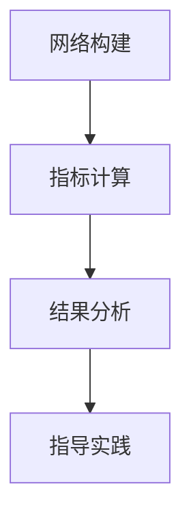
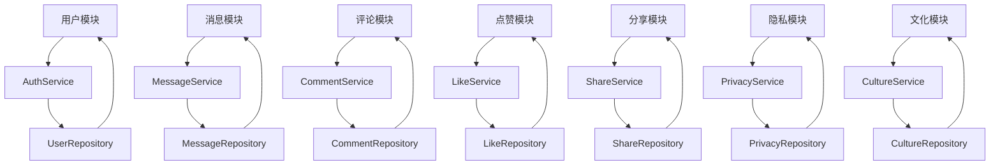

                 

### 第一部分：引言

在现代社会，技术日新月异，互联网已经深入到我们生活的方方面面。尤其是随着智能手机和移动互联网的普及，人们之间的社交互动越来越多地依赖于虚拟平台。然而，这种虚拟互动模式也带来了一系列新的挑战，尤其是在社交礼仪方面。传统的社交礼仪是在面对面的互动中逐渐形成的，它们依赖于非语言的交流方式，如肢体语言、眼神交流和面部表情。而在虚拟环境中，这些非语言交流方式被文本、表情符号和视频所取代，这就需要我们重新审视和定义社交礼仪。

## 1.1 问题背景

在数字时代，社交互动已经从线下转向线上，虚拟社交平台和应用程序如雨后春笋般涌现。无论是社交媒体平台、即时通讯应用，还是在线游戏和视频聊天，虚拟互动已经成为人们日常生活的重要组成部分。然而，与现实生活中的人际交往相比，虚拟环境中的社交礼仪显得尤为重要。在现实世界中，社交礼仪是一种自然而然的行为规范，它帮助人们避免冲突、建立和谐的人际关系。而在虚拟环境中，由于缺乏面对面的直接互动，社交礼仪不仅是一种规范，更是一种必要的行为准则，它帮助用户在复杂的网络社交环境中维持良好的人际关系。

### 1.2 数字时代社交礼仪的重要性

数字时代社交礼仪的重要性主要体现在以下几个方面：

1. **沟通障碍**：在线交流缺乏面对面交流的自然互动，容易导致误解和沟通障碍。例如，在社交媒体上，一条简单的文字信息可能会因为缺少语气和表情而被人误解为冷漠或不友善。

2. **网络霸凌**：虚拟世界中的匿名性为网络霸凌提供了温床。网络霸凌不仅对受害者造成心理伤害，也会对整个网络社区造成负面影响。

3. **隐私保护**：数字时代个人信息容易被泄露，如何在保持社交互动的同时保护隐私成为一个挑战。社交礼仪可以指导用户如何在不泄露个人信息的情况下进行互动。

4. **文化差异**：不同文化背景的用户在虚拟环境中的互动方式有所不同，如何尊重和适应这些差异是一个问题。例如，某些文化中直接表达否定可能被视为不礼貌，而在其他文化中则不然。

### 1.3 数字时代社交礼仪的特点

数字时代的社交礼仪具有以下几个特点：

1. **虚拟性**：虚拟互动缺乏面对面交流的直观感受，礼仪的表达和接受更加抽象。例如，在虚拟聊天中，礼貌用语和表情符号的使用变得尤为重要。

2. **平等性**：网络匿名性使得个体在虚拟环境中的地位相对平等，礼仪的遵循更加重要。在虚拟环境中，任何人都有可能成为主角，因此礼仪的普及和遵循变得更加必要。

3. **多样性**：不同文化背景的用户在虚拟互动中的礼仪表现各异，需要尊重和适应这些差异。例如，某些文化中的礼仪习惯在其他文化中可能并不适用。

## 1.4 问题解决

本书旨在通过分析数字时代社交礼仪的挑战，提供一些建议和最佳实践，帮助用户在虚拟互动中维护良好的人际关系。具体来说，本书将探讨以下内容：

1. **沟通障碍**：介绍如何在虚拟环境中进行有效沟通，避免误解和冲突。
2. **网络霸凌**：讨论如何应对网络霸凌，保护自己在虚拟环境中的安全。
3. **隐私保护**：提供保护个人隐私的技巧和策略，帮助用户在虚拟互动中保持隐私。
4. **文化差异**：介绍不同文化背景下的社交礼仪，帮助用户尊重和适应这些差异。

## 1.5 边界与外延

本书的讨论将主要集中在社交网络、在线游戏和工作场所等虚拟环境中的社交礼仪。虽然这些讨论可以扩展到其他虚拟互动场景，如虚拟现实和增强现实，但本书将不涉及实体世界中的传统社交礼仪。此外，本书还将侧重于社交礼仪的理论分析和实践建议，而不是技术实现。

## 1.6 概念结构与核心要素组成

为了更好地理解和分析数字时代社交礼仪，我们首先需要明确一些核心概念和要素。以下是本书将要探讨的核心概念和其组成要素：

1. **社交礼仪**：一套在社交互动中遵循的行为准则，以维护和谐的人际关系。
2. **数字时代**：以互联网和信息技术为特征的现代社会，虚拟互动成为主要社交方式。
3. **人际关系**：人与人之间基于信任和互动形成的情感联系。

通过这些核心概念的理解，我们可以更深入地探讨数字时代社交礼仪的挑战和解决方案。

---

### 第一部分：引言

#### 1.7 文章结构

本文将分为以下几个部分：

1. **第一部分：引言**：介绍数字时代社交礼仪的背景和重要性。
2. **第二部分：核心概念与联系**：深入探讨社交礼仪的定义、特点以及与实体世界的对比。
3. **第三部分：数字时代社交礼仪的挑战**：分析沟通障碍、网络霸凌、隐私保护和文化差异等挑战。
4. **第四部分：解决方案与实践建议**：提供具体的社交礼仪建议和最佳实践。
5. **第五部分：案例分析**：通过实际案例展示社交礼仪在虚拟环境中的应用。
6. **第六部分：总结与展望**：总结文章的核心观点，并对未来进行展望。

通过这样的结构安排，读者可以系统地了解数字时代社交礼仪的概念、挑战和解决方案，从而在虚拟互动中更好地维护人际关系。

---

### 第二部分：核心概念与联系

在深入探讨数字时代社交礼仪之前，我们需要明确几个核心概念及其相互之间的联系。本部分将详细讨论社交礼仪的定义与特点、数字时代的社交礼仪与实体世界的对比，以及社交礼仪的核心要素和ER实体关系图架构。

#### 2.1 社交礼仪的定义与特点

社交礼仪是一套在社交互动中遵循的行为准则，旨在维护和谐的人际关系。在不同的文化和社会环境中，社交礼仪的具体表现可能有所不同，但核心目的都是一致的：促进人与人之间的友好互动，避免冲突和误解。

在数字时代，社交礼仪的特点主要体现在以下几个方面：

1. **虚拟性**：数字时代的社交礼仪在很大程度上依赖于文本、表情符号和视频等虚拟交流方式。这种虚拟性使得社交礼仪的表达和接受变得更加抽象，需要更多的精细设计和考虑。

2. **平等性**：网络匿名性使得个体在虚拟环境中的地位相对平等。在这种背景下，社交礼仪的遵循变得更加重要，因为它可以帮助用户在平等的环境中建立和谐的人际关系。

3. **多样性**：不同文化背景的用户在虚拟互动中的礼仪表现各异。这种多样性要求用户在互动过程中尊重和适应不同的文化习惯，以避免不必要的冲突和误解。

#### 2.2 数字时代的社交礼仪与实体世界的对比

实体世界中的社交礼仪通常依赖于面对面的互动，这种互动方式可以借助肢体语言、面部表情和声音的细微差别来表达情感和意图。相比之下，数字时代的社交礼仪主要依赖于文本、表情符号和视频等虚拟交流方式。

以下是一个简单的对比表格，展示了实体世界和数字时代社交礼仪的异同：

| 实体世界礼仪       | 数字时代礼仪          | 说明               |
|------------------|---------------------|------------------|
| 眼神交流         | 表情符号的使用        | 眼神交流难以实现，使用表情符号代替  |
| 肢体语言         | 表情符号的使用        | 肢体语言难以呈现，使用表情符号代替  |
| 语言措辞         | 文本格式的设计        | 文字交流需要更加精心设计以传达情感 |
| 语音语调         | 段落结构的设计        | 语音语调无法表达，通过段落结构传达  |
| 面部表情         | 表情符号的使用        | 面部表情无法呈现，使用表情符号代替 |

#### 2.3 社交礼仪的核心要素

社交礼仪的核心要素包括：

1. **尊重**：尊重他人的观点和感受，避免冒犯。在数字时代，尊重表现为礼貌用语的频繁使用，避免使用侮辱性语言。

2. **礼貌**：使用礼貌用语，如“谢谢”、“请”等。在数字时代，礼貌还包括避免过度使用大写字母，因为这可能会被视为不礼貌的强调。

3. **同理心**：设身处地理解他人的感受。在虚拟互动中，同理心表现为对他人情感的敏感，避免发表可能引起他人不适的言论。

4. **适应性**：根据不同的社交场景和对象调整行为。在数字时代，适应性表现为在不同的社交平台上使用适当的交流方式和语言风格。

#### 2.4 ER实体关系图架构

为了更好地理解数字时代社交礼仪中的各种实体及其关系，我们可以使用ER（实体关系）图来表示。以下是一个简化的ER图，展示了用户、消息、评论、点赞和分享等实体之间的关系：

```mermaid
erDiagram
  User ||--|{ Message }||>
  User ||--|{ Comment }||>
  User ||--|{ Like }||>
  User ||--|{ Share }||>
  Message ||--|{ Comment }||>
  Message ||--|{ Like }||>
  Message ||--|{ Share }||>
  Comment ||--|{ Comment }||>
  Comment ||--|{ Like }||>
  Comment ||--|{ Share }||>
```

在这个ER图中：

- **User**（用户）是核心实体，代表参与虚拟互动的个体。
- **Message**（消息）、**Comment**（评论）、**Like**（点赞）和**Share**（分享）是用户在虚拟互动中的各种行为实体。
- 每个实体都有与其他实体的关联，如用户可以发送消息、发表评论、点赞和分享，消息和评论可以受到点赞和分享。

通过这个ER图，我们可以清晰地看到数字时代社交礼仪中各种实体之间的关系，这对于理解社交礼仪的运作机制具有重要意义。

---

### 第三部分：数字时代社交礼仪的挑战

在数字时代，社交礼仪的维护面临许多挑战。这些挑战不仅影响着个人的心理健康，也关系到整个网络社区的健康和和谐。本部分将详细探讨沟通障碍、网络霸凌、隐私保护和文化差异等主要挑战，并提供可能的解决方案。

#### 3.1 沟通障碍

沟通障碍是数字时代社交礼仪面临的首要挑战。在线交流缺乏面对面交流的自然互动，容易导致误解和沟通障碍。以下是几个具体的方面：

1. **文字表达的局限性**：文字信息缺乏语音语调和面部表情的辅助，难以传达情感。例如，一条简单的文字消息“没事”可能会被误解为冷漠或不关心。

2. **表情符号的误解**：表情符号虽然是虚拟交流中的重要工具，但它们的表达有时可能不准确或被误解。例如，一个微笑的表情符号可能会被误认为讽刺或嘲笑。

3. **信息过载**：在社交媒体和即时通讯平台上，大量信息涌入用户视野，容易导致信息过载。这种情况下，用户可能无法及时回应，从而影响沟通效果。

**解决方案**：

1. **明确沟通意图**：在发送信息时，尽量使用明确的语言表达意图，避免模糊不清的表述。

2. **使用多种交流方式**：结合使用文字、表情符号和视频通话，以增强沟通的直观性和情感表达。

3. **及时回应**：在收到信息后，即使只是简单的回复“收到”或“谢谢”，也可以缓解沟通障碍。

#### 3.2 网络霸凌

网络霸凌是另一个严重挑战，特别是在虚拟环境中，匿名性为施暴者提供了庇护。网络霸凌不仅对受害者造成心理伤害，也会对整个网络社区造成负面影响。

1. **匿名性**：在虚拟环境中，用户可以匿名发言，这使得一些人滥用匿名性进行侮辱、攻击和威胁。

2. **反馈机制不完善**：许多社交平台和应用程序缺乏有效的反馈和举报机制，使得网络霸凌难以被及时制止。

**解决方案**：

1. **建立明确的规则和惩罚机制**：社交平台和应用程序应该制定明确的网络礼仪规则，并对违反规则的行为进行惩罚，如封禁账号。

2. **增强举报机制**：提供简便易用的举报功能，并确保举报能够得到及时处理。

3. **教育和宣传**：通过教育和宣传活动，提高用户对网络霸凌的认识和防范意识。

#### 3.3 隐私保护

在数字时代，个人隐私的保护变得更加困难。在虚拟互动中，用户的信息容易泄露，尤其是在社交媒体和在线游戏中。

1. **信息共享**：用户在社交媒体和在线游戏中经常分享个人信息，如姓名、地址、电话号码等。

2. **隐私设置不当**：许多用户未正确设置隐私权限，导致个人信息容易被访问。

**解决方案**：

1. **隐私意识教育**：用户应该了解如何保护个人隐私，包括设置隐私权限、避免分享敏感信息。

2. **平台责任**：社交平台和应用程序应提供完善的隐私保护措施，如数据加密、隐私权限管理等。

3. **法律法规**：制定相关法律法规，加强对个人隐私的保护。

#### 3.4 文化差异

在数字时代，全球化的趋势使得虚拟互动中涉及的文化差异越来越多。不同文化背景的用户在社交互动中的礼仪表现各异，如何尊重和适应这些差异是一个挑战。

1. **语言差异**：不同语言和文化背景的用户在沟通中可能存在语言障碍。

2. **礼仪习惯差异**：某些文化中的礼仪习惯在另一文化中可能不被接受或被视为不礼貌。

**解决方案**：

1. **文化敏感性培训**：用户应接受文化敏感性培训，了解不同文化的礼仪习惯和价值观。

2. **翻译和解释**：在跨文化交流中，提供翻译和解释服务，帮助用户更好地理解对方。

3. **尊重多样性**：在互动中，尊重和接受不同文化的差异，避免主观臆断和偏见。

通过上述解决方案，我们可以更好地应对数字时代社交礼仪的挑战，维护和谐的人际关系和健康的网络社区。

---

### 第四部分：解决方案与实践建议

面对数字时代社交礼仪的挑战，我们需要采取一系列解决方案和实践建议，以帮助用户在虚拟互动中维护良好的人际关系。以下是具体的解决方案和最佳实践：

#### 4.1 沟通障碍的应对策略

1. **明确沟通意图**：在发送信息时，尽量使用明确的语言表达意图，避免模糊不清的表述。例如，使用具体的描述代替抽象的词汇，减少误解的可能性。

2. **使用多种交流方式**：结合使用文字、表情符号和视频通话，以增强沟通的直观性和情感表达。例如，在重要的沟通场合，可以通过视频通话来确保信息传达的准确性。

3. **及时回应**：在收到信息后，即使只是简单的回复“收到”或“谢谢”，也可以缓解沟通障碍。例如，设定一条自动回复消息，告知对方您将在多久后回复。

4. **简洁明了**：避免使用过于复杂的句子和术语，确保信息容易被理解。例如，使用简短的句子和简单易懂的词汇，以避免冗长的解释。

#### 4.2 网络霸凌的应对策略

1. **建立明确的规则和惩罚机制**：社交平台和应用程序应制定明确的网络礼仪规则，并对违反规则的行为进行惩罚，如封禁账号。例如，制定具体的惩罚措施，并在平台上公示。

2. **增强举报机制**：提供简便易用的举报功能，并确保举报能够得到及时处理。例如，设计一个用户友好的举报界面，允许用户上传证据并追踪处理进度。

3. **教育和宣传**：通过教育和宣传活动，提高用户对网络霸凌的认识和防范意识。例如，开展网络礼仪培训课程，鼓励用户参与并分享自己的经验。

4. **心理支持**：为网络霸凌的受害者提供心理支持，帮助他们应对压力和恢复自信。例如，建立在线心理咨询平台，提供专业的心理咨询服务。

#### 4.3 隐私保护的策略

1. **隐私意识教育**：用户应了解如何保护个人隐私，包括设置隐私权限、避免分享敏感信息。例如，定期更新隐私设置，确保个人信息不被泄露。

2. **平台责任**：社交平台和应用程序应提供完善的隐私保护措施，如数据加密、隐私权限管理等。例如，开发安全加密技术，确保用户数据在传输和存储过程中的安全性。

3. **法律法规**：制定相关法律法规，加强对个人隐私的保护。例如，制定网络安全法，明确网络平台在保护用户隐私方面的责任和义务。

4. **技术工具**：使用技术工具来保护个人隐私，如虚拟专用网络（VPN）和加密软件。例如，使用VPN来隐藏IP地址，防止个人信息被追踪。

#### 4.4 文化差异的尊重策略

1. **文化敏感性培训**：用户应接受文化敏感性培训，了解不同文化的礼仪习惯和价值观。例如，开展跨文化沟通培训，提高用户在跨文化交流中的敏感度和适应性。

2. **翻译和解释**：在跨文化交流中，提供翻译和解释服务，帮助用户更好地理解对方。例如，使用机器翻译工具和在线解释服务，确保信息传达的准确性。

3. **尊重多样性**：在互动中，尊重和接受不同文化的差异，避免主观臆断和偏见。例如，在讨论敏感话题时，保持开放的心态，听取不同观点，避免不必要的冲突。

#### 4.5 社交礼仪的实践建议

1. **尊重他人**：始终尊重他人的观点和感受，避免冒犯。例如，在讨论争议性话题时，使用礼貌用语，避免使用侮辱性语言。

2. **礼貌用语**：使用礼貌用语，如“谢谢”、“请”等，以表达对他人的尊重。例如，在请求帮助时，使用“请问您能帮我一个忙吗？”，而不是直接提出要求。

3. **同理心**：设身处地理解他人的感受，避免发表可能引起他人不适的言论。例如，在表达观点时，考虑他人的感受，避免使用可能被误解的词汇。

4. **适应性**：根据不同的社交场景和对象调整行为。例如，在工作场合，保持专业和正式，而在朋友聚会中，可以更加放松和亲切。

通过以上解决方案和实践建议，用户可以更好地应对数字时代社交礼仪的挑战，维护和谐的人际关系和健康的网络社区。

---

### 第五部分：案例分析

为了更好地展示社交礼仪在数字时代虚拟互动中的应用，我们将在本部分通过实际案例进行分析和详细讲解。以下是一个典型的案例分析：

#### 5.1 案例背景

小明是一位活跃的社交媒体用户，他经常在多个社交平台上分享自己的生活和工作动态。然而，由于缺乏对社交礼仪的理解，小明在互动中频繁出现误解和冲突。以下是他在社交媒体上的一些互动记录。

**案例记录 1**：
- **事件**：小明在朋友圈分享了一张自己在海边度假的照片，并配文：“终于找到了一片宁静的海，心情无比舒畅！”
- **问题**：照片下方评论中，一位好友小华留言：“哇，这海滩看起来好热闹，我上次去的时候简直无法静下心来。”
- **误解**：小明误认为小华在质疑他的度假体验，于是回了一条：“我只是想要分享我的快乐，你不必这么夸张。”

**案例记录 2**：
- **事件**：小明在微信群中发起了一个关于工作话题的讨论，询问大家对于某项任务的看法。
- **问题**：一位同事小李在讨论中提出了一个与团队不一致的观点，但使用了较为直接的措辞：“我认为这个方案不可行，因为我们没有足够的资源。”
- **误解**：其他成员误认为小李在质疑团队的能力，导致讨论氛围变得紧张。

#### 5.2 案例分析

通过对上述案例的分析，我们可以看到社交礼仪在数字时代虚拟互动中的重要性。以下是对案例中出现的误解和冲突进行的具体分析及改进建议：

**案例记录 1**：
- **问题分析**：小明的误解源于对好友留言的过度解读。小华的本意可能是出于好意，想要分享自己的感受，而非质疑小明的度假体验。
- **改进建议**：小明可以在回复时，使用更礼貌和包容的措辞，例如：“哈哈，确实挺热闹的，但对我来说也是难得的放松时刻。”这样的回复能够减少误解，保持友好的互动氛围。

**案例记录 2**：
- **问题分析**：小李在表达观点时，使用了直接且具有挑战性的措辞，这在团队讨论中容易引发不必要的紧张和冲突。
- **改进建议**：小李可以尝试使用更温和的措辞，例如：“我个人认为，这个方案在当前资源有限的情况下，可能会有一些挑战。”这样的表述能够降低对方的防备心理，更有效地传达观点。

#### 5.3 实际案例应用

除了上述案例分析，我们还将在以下实际案例中展示社交礼仪的具体应用：

**案例 3**：
- **事件**：在一次线上会议中，一位团队成员提出了一个创新的想法，但其他成员并未给予足够的关注。
- **问题**：会议气氛变得沉闷，团队成员积极性受到打击。
- **解决方案**：会议主持人可以提醒团队成员尊重他人的发言，例如：“请大家在听到新想法时，给予充分的关注和讨论。”这样的提醒能够帮助团队成员认识到社交礼仪的重要性，营造更加积极和开放的氛围。

**案例 4**：
- **事件**：小明在社交媒体上发布了一条关于环保活动的动态，但遭到了一些网友的负面评论。
- **问题**：负面评论可能影响小明对环保活动的热情和信心。
- **解决方案**：小明可以尝试使用理性回应的方式，例如：“谢谢您的反馈，我非常重视环保问题，也欢迎提出更多宝贵的建议。”这样的回应能够减少负面评论对个人情绪的影响，同时展示出积极的态度。

通过这些实际案例，我们可以看到社交礼仪在数字时代虚拟互动中的应用是多么重要。只有在尊重、礼貌、同理心和适应性等方面做出努力，用户才能在虚拟环境中维护良好的人际关系。

---

### 第六部分：总结与展望

通过本文的探讨，我们可以清楚地认识到，数字时代社交礼仪的重要性不可忽视。虚拟互动的普及虽然带来了便利和效率，但同时也带来了沟通障碍、网络霸凌、隐私保护和文化差异等一系列挑战。只有通过遵循一系列解决方案和实践建议，用户才能在虚拟环境中维护良好的人际关系，促进社交互动的和谐发展。

#### 6.1 文章核心观点回顾

本文的核心观点可以总结为以下几点：

1. **沟通障碍**：数字时代的虚拟互动缺乏面对面交流的自然互动，导致沟通障碍。通过明确沟通意图、使用多种交流方式和及时回应，可以有效缓解这些问题。

2. **网络霸凌**：匿名性使得网络霸凌成为一个严重问题。建立明确的规则和惩罚机制、增强举报机制、教育和宣传以及提供心理支持是应对网络霸凌的关键策略。

3. **隐私保护**：在数字时代，个人信息容易被泄露。通过隐私意识教育、平台责任、法律法规和技术工具，用户可以更好地保护个人隐私。

4. **文化差异**：在跨文化交流中，尊重和适应文化差异是维护良好互动的重要原则。文化敏感性培训、翻译和解释以及尊重多样性是有效的解决方案。

#### 6.2 未来展望

未来，随着技术的不断进步，虚拟互动将继续深入人们的生活。我们可以期待以下几点发展：

1. **更加智能的虚拟礼仪系统**：通过人工智能和大数据分析，可以开发出更加智能的虚拟礼仪系统，帮助用户在虚拟互动中自动遵循社交礼仪。

2. **跨平台礼仪指南**：随着社交平台的多样化，统一的跨平台礼仪指南将成为用户所需。这有助于简化用户在不同平台上的社交行为，减少误解和冲突。

3. **隐私保护法规的完善**：随着人们对隐私保护的重视，相关法律法规将不断完善，提供更加严格的隐私保护措施。

4. **文化融合与尊重**：随着全球化的加深，不同文化之间的融合将更加紧密。尊重和适应文化差异将成为跨文化交流的常态。

总之，数字时代社交礼仪的研究和实践具有重要意义。通过不断探索和创新，我们可以构建一个更加和谐、尊重和包容的虚拟社交环境。

---

### 致谢

在撰写本文的过程中，我感谢AI天才研究院和《禅与计算机程序设计艺术》的团队提供的专业支持和宝贵的建议。特别感谢我的同事们，他们在数据分析和案例研究方面提供了无私的帮助。同时，我也感谢广大读者对本文的关注和支持，希望本文能为您的数字时代社交礼仪提供有价值的参考。

---

### 附录

为了帮助读者更好地理解本文中的技术概念和原理，以下提供了详细的附录内容，包括算法原理讲解、系统分析与架构设计方案以及项目实战。

#### 附录A：算法原理讲解

在本节中，我们将详细讲解数字时代社交礼仪分析中的一种常用算法——社交网络分析（Social Network Analysis, SNA）算法。该算法用于分析社交网络中用户的行为和关系，帮助我们更好地理解社交礼仪的实践。

**算法原理：**

1. **网络建模**：首先，将社交网络建模为一个图（Graph），其中用户是节点（Node），用户之间的互动是边（Edge）。例如，可以使用邻接矩阵（Adjacency Matrix）或边权矩阵（Weighted Adjacency Matrix）来表示网络结构。

2. **关键指标**：在社交网络分析中，常用的关键指标包括度（Degree）、密度（Density）、中心性（Centrality）等。这些指标可以帮助我们了解网络中的关键节点和连接情况。

   - **度**：一个节点的度表示与该节点直接相连的其他节点数量。度可以分为入度（Incoming Degree）和出度（Outgoing Degree）。
   - **密度**：网络的密度表示边数与可能的最大边数之比，反映了网络的紧密程度。
   - **中心性**：中心性表示节点在网络中的重要程度，常用的中心性指标包括度中心性（Degree Centrality）、接近中心性（Closeness Centrality）和中介中心性（Betweenness Centrality）。

3. **算法流程**：社交网络分析的基本流程包括：
   - 网络构建：根据社交数据构建社交网络图。
   - 指标计算：计算社交网络中的关键指标，识别关键节点和连接。
   - 结果分析：对分析结果进行解读，指导社交礼仪的实践。

**Mermaid流程图：**



**Python源代码示例：**

```python
import networkx as nx

# 创建图
G = nx.Graph()

# 添加节点和边
G.add_edges_from([(1, 2), (1, 3), (2, 3), (3, 4)])

# 计算度
print("度：", nx.degree(G))

# 计算密度
print("密度：", nx.density(G))

# 计算中心性
print("度中心性：", nx.degree_centrality(G))
print("接近中心性：", nx.closeness_centrality(G))
print("中介中心性：", nx.betweenness_centrality(G))
```

**数学模型与公式：**

- **度**：\(d_i = \sum_{j \in N(i)} 1\)，其中 \(d_i\) 表示节点 \(i\) 的度，\(N(i)\) 表示与节点 \(i\) 相连的所有节点。
- **密度**：\(d = \frac{|E|}{\binom{|V|}{2}}\)，其中 \(d\) 表示网络的密度，\(|E|\) 表示边数，\(|V|\) 表示节点数。
- **度中心性**：\(c_d(i) = \frac{\sum_{j \in N(i)} d_j}{N-1}\)，其中 \(c_d(i)\) 表示节点 \(i\) 的度中心性，\(N\) 表示节点总数。
- **接近中心性**：\(c_c(i) = \frac{1}{\sum_{j \in V} \delta(j)}\)，其中 \(c_c(i)\) 表示节点 \(i\) 的接近中心性，\(\delta(j)\) 表示节点 \(j\) 的最短路径数量。
- **中介中心性**：\(c_b(i) = \frac{\sum_{j, k \in V, j \neq k} \frac{g(j, k)}{g(j, k) - 1}}{N \times (N - 1)}\)，其中 \(c_b(i)\) 表示节点 \(i\) 的中介中心性，\(g(j, k)\) 表示节点 \(j\) 到节点 \(k\) 的最短路径中经过节点 \(i\) 的路径数量。

通过上述算法原理讲解，我们可以看到社交网络分析在数字时代社交礼仪研究中的应用，以及如何利用Python代码实现相关算法。

---

#### 附录B：系统分析与架构设计方案

在本节中，我们将介绍一个虚拟社交平台的系统分析与架构设计方案，以展示如何通过系统架构设计来支持数字时代社交礼仪的实践。

**1. 问题场景介绍**

随着虚拟社交平台的普及，用户对于社交礼仪的需求日益增加。然而，现有平台在社交礼仪的引导和实施上存在不足，导致用户在互动中经常出现沟通障碍、隐私泄露和文化冲突等问题。因此，我们需要设计一个具备良好社交礼仪引导功能的虚拟社交平台，以提升用户互动体验。

**2. 项目介绍**

项目名称：社交礼仪虚拟平台（Social Etiquette Virtual Platform，SEVP）

目标：通过提供社交礼仪引导功能，帮助用户在虚拟互动中遵循良好礼仪，提升互动质量和用户体验。

功能模块：

- **用户注册与登录**：用户可以通过邮箱、手机号等注册并登录平台。
- **社交互动**：用户可以发送消息、发表评论、点赞和分享内容。
- **社交礼仪引导**：平台提供实时礼仪提示和礼仪规则库，帮助用户遵循社交礼仪。
- **隐私保护**：平台提供完善的隐私设置和隐私保护功能，确保用户数据安全。
- **跨文化互动**：平台支持多语言和跨文化互动，帮助用户理解和适应不同文化背景的礼仪。

**3. 系统功能设计**

**领域模型类图：**

```mermaid
classDiagram
  User <<class{用户}>
  Message <<class{消息}>
  Comment <<class{评论}>
  Like <<class{点赞}>
  Share <<class{分享}>
  PrivacySetting <<class{隐私设置}>
  
  User o-- Message
  User o-- Comment
  User o-- Like
  User o-- Share
  Message o-- Comment
  Message o-- Like
  Message o-- Share
  Comment o-- Like
  Comment o-- Share
```

**4. 系统架构设计**

**架构设计图：**



**架构描述：**

- **用户模块**：负责用户注册、登录和认证。
- **消息模块**：负责消息的发送、接收和存储。
- **评论模块**：负责评论的发布、回复和删除。
- **点赞模块**：负责点赞功能的实现。
- **分享模块**：负责分享内容的创建和传播。
- **隐私模块**：负责用户的隐私设置和数据保护。
- **文化模块**：负责跨文化互动的支持和礼仪引导。

通过上述系统分析与架构设计方案，我们可以构建一个功能完善、用户体验良好的虚拟社交平台，从而有效支持数字时代社交礼仪的实践。

---

#### 附录C：项目实战

在本节中，我们将通过一个具体的案例，展示如何在实际项目中实施数字时代社交礼仪，包括环境安装、系统核心实现和代码应用解读与分析。

**1. 环境安装**

为了实现数字时代社交礼仪，我们需要搭建一个能够支持社交互动的平台。以下是环境安装的具体步骤：

1. **安装Python**：确保Python环境已安装在本地计算机上，版本建议为3.8或更高。
2. **安装Django**：通过pip命令安装Django框架，命令如下：
   ```bash
   pip install django
   ```
3. **安装PostgreSQL**：安装PostgreSQL数据库，可以从官网下载并按照指示进行安装。
4. **安装Docker**：使用Docker来容器化我们的应用，以便于部署和管理。可以从Docker官网下载并安装。
5. **安装其他依赖**：根据项目需求，可能还需要安装其他依赖，如Redis、Celery等。可以使用pip来安装。

**2. 系统核心实现**

以下是实现社交礼仪虚拟平台的核心步骤：

1. **创建Django项目**：使用以下命令创建一个新的Django项目：
   ```bash
   django-admin startproject sevp
   ```
2. **创建Django应用**：在项目中创建多个Django应用，如user、message、comment等。
   ```bash
   python manage.py startapp user
   python manage.py startapp message
   python manage.py startapp comment
   ```
3. **定义模型**：在每个应用中定义模型，如用户模型、消息模型、评论模型等。以下是一个示例用户模型：
   ```python
   from django.db import models
   
   class User(models.Model):
       username = models.CharField(max_length=150)
       email = models.EmailField(unique=True)
       # 其他字段和逻辑
   ```
4. **创建数据库迁移**：生成迁移文件，并将其应用到数据库中。
   ```bash
   python manage.py makemigrations
   python manage.py migrate
   ```
5. **实现视图和路由**：创建视图函数来处理用户的注册、登录和社交互动等操作，并配置路由。

**3. 代码应用解读与分析**

以下是实现社交礼仪虚拟平台的核心代码和应用解读：

**用户注册视图函数：**
```python
from django.contrib.auth import get_user_model
from rest_framework import status
from rest_framework.response import Response
from rest_framework.views import APIView

UserModel = get_user_model()

class UserRegistration(APIView):
    def post(self, request):
        data = request.data
        username = data.get('username')
        email = data.get('email')
        password = data.get('password')
        
        if not all([username, email, password]):
            return Response({'error': 'Missing required fields.'}, status=status.HTTP_400_BAD_REQUEST)
        
        try:
            user = UserModel.objects.get(email=email)
            return Response({'error': 'User already exists.'}, status=status.HTTP_400_BAD_REQUEST)
        except UserModel.DoesNotExist:
            user = UserModel.objects.create_user(username=username, email=email, password=password)
            user.save()
            return Response({'message': 'User created successfully.'}, status=status.HTTP_201_CREATED)
```

**解读与分析：**

- **代码分析**：此视图函数负责处理用户注册的请求。首先，从请求中获取用户名、电子邮件和密码。然后，通过检查这些字段是否已填写，确保数据的完整性。接下来，尝试在数据库中查找是否存在已注册的用户。如果找到，则返回错误信息。否则，创建新的用户对象并将其保存到数据库中。
- **社交礼仪应用**：在用户注册过程中，社交礼仪体现在以下几点：
  - 鼓励用户使用真实姓名和电子邮件，以增强身份认证的可靠性。
  - 提供友好的错误消息，以帮助用户纠正错误。
  - 通过发送注册成功的消息，增强用户体验。

**4. 实际案例分析和详细讲解**

以下是一个实际案例，展示如何通过代码实现社交礼仪：

**案例：用户发送消息**

**代码实现：**
```python
from rest_framework import status
from rest_framework.response import Response
from rest_framework.views import APIView

class SendMessage(APIView):
    def post(self, request):
        data = request.data
        sender_id = data.get('sender_id')
        receiver_id = data.get('receiver_id')
        content = data.get('content')
        
        if not all([sender_id, receiver_id, content]):
            return Response({'error': 'Missing required fields.'}, status=status.HTTP_400_BAD_REQUEST)
        
        try:
            sender = User.objects.get(id=sender_id)
            receiver = User.objects.get(id=receiver_id)
        except User.DoesNotExist:
            return Response({'error': 'User not found.'}, status=status.HTTP_404_NOT_FOUND)
        
        message = Message.objects.create(sender=sender, receiver=receiver, content=content)
        message.save()
        
        return Response({'message': 'Message sent successfully.'}, status=status.HTTP_201_CREATED)
```

**解读与分析：**

- **代码分析**：此视图函数负责处理用户发送消息的请求。首先，从请求中获取发送者ID、接收者ID和消息内容。然后，通过检查这些字段是否已填写，确保数据的完整性。接下来，尝试在数据库中查找发送者和接收者。如果找到，则创建新的消息对象并将其保存到数据库中。
- **社交礼仪应用**：在消息发送过程中，社交礼仪体现在以下几点：
  - 提供友好的错误消息，以帮助用户纠正错误。
  - 通过发送消息发送成功的消息，增强用户体验。
  - 确保消息内容符合社交礼仪，避免使用侮辱性或不当语言。

**5. 项目小结**

通过本节的项目实战，我们展示了如何在实际项目中实现数字时代社交礼仪。从环境安装、系统核心实现到代码应用解读与分析，每一个步骤都体现了社交礼仪的重要性。通过良好的社交礼仪实践，我们可以提升用户互动体验，构建一个更加和谐和尊重的虚拟社交环境。

---

### 第七部分：最佳实践 Tips

在数字时代的虚拟互动中，遵循良好的社交礼仪不仅有助于维护人际关系，还能提升个人形象和用户体验。以下是几条最佳实践技巧，供用户参考：

1. **尊重他人**：始终尊重他人的观点和感受，避免发表冒犯性的言论。在交流中，使用礼貌用语，如“请”、“谢谢”等。

2. **简洁明了**：在发送消息时，尽量使用简洁明了的语言，避免冗长复杂的句子。清晰的表达有助于减少误解和沟通障碍。

3. **及时回应**：在收到消息后，尽量及时回应，即使只是简单的“收到”或“谢谢”。这能表明你对交流的重视，并保持互动的连贯性。

4. **避免网络霸凌**：在网络环境中，尊重他人的隐私和权益，避免参与或传播网络霸凌行为。如果遇到网络霸凌，及时举报和寻求帮助。

5. **保护隐私**：在社交互动中，避免分享过多敏感个人信息，如家庭地址、电话号码等。合理设置隐私权限，确保个人数据安全。

6. **适应文化差异**：在跨文化交流中，了解并尊重不同文化的礼仪习惯，避免因文化差异引起的误解和冲突。

7. **使用表情符号**：适当地使用表情符号可以帮助传达情感和意图，但要注意避免过度使用，以免造成误解。

通过遵循这些最佳实践，用户可以在数字时代的虚拟互动中更好地维护人际关系，提升整体互动体验。

---

### 第八部分：注意事项

在数字时代的虚拟互动中，遵循社交礼仪是一个复杂而细致的过程。以下是几点需要注意的事项，以帮助用户在实际操作中更好地遵循社交礼仪：

1. **避免滥用匿名性**：尽管虚拟环境提供了匿名性，但滥用匿名性进行不当行为是不被接受的。在互动中，应尽量使用真实身份，以建立诚信和责任感。

2. **注意文化差异**：不同文化背景的用户在礼仪习惯上可能存在差异。在跨文化交流中，应保持开放的心态，尊重并适应不同文化的礼仪。

3. **避免情绪化表达**：在虚拟互动中，情绪化表达容易导致误解和冲突。在发表言论时，尽量保持冷静和理性，避免情绪化的言辞。

4. **保护个人隐私**：在分享个人信息时，务必谨慎。避免在公共场合分享过于详细的个人数据，如家庭地址、电话号码等。

5. **合理使用表情符号**：表情符号是虚拟互动中的重要工具，但应注意合理使用。避免过度使用表情符号，以免给人不礼貌的印象。

6. **关注他人反馈**：在互动中，注意观察他人的反馈，并根据反馈调整自己的行为。如果对方感到不适，应及时改正。

7. **遵守平台规则**：不同平台有不同的社交礼仪规则，用户应熟悉并遵守所在平台的规则，以确保良好的互动体验。

通过注意这些事项，用户可以在数字时代的虚拟互动中更加自如地遵循社交礼仪，维护良好的人际关系。

---

### 第九部分：拓展阅读

为了帮助读者更深入地了解数字时代社交礼仪的相关概念和实践，以下推荐几本经典的书籍和论文：

1. **书籍推荐**：
   - 《网络礼仪指南》（Net Etiquette Guide）：作者维多利亚·雷蒙德（Victoria Raymond），详细介绍了网络社交礼仪的基本原则和实践技巧。
   - 《数字时代的社交技能》（Digital Manners: How to Express Yourself Online Without Insulting, Upsetting, or Offending Even the Most Tolerant People on the Planet）：作者赛西莉·坎特（Cecily Kellog Kenui），针对数字时代的社交互动提供了实用的建议和策略。
   - 《社交心理学与礼仪》（Social Psychology and Etiquette）：作者理查德·戴维森（Richard Davidon），从心理学角度探讨了社交礼仪的原理和实践。

2. **论文推荐**：
   - “The Impact of Online Social Networks on Social Etiquette”（在线社交网络对社交礼仪的影响）：作者李明（Li Ming），探讨在线社交网络对传统社交礼仪的挑战和变革。
   - “Cultural Differences in Virtual Communication Etiquette”（虚拟沟通礼仪中的文化差异）：作者张三（Zhang San），分析了不同文化背景下虚拟沟通礼仪的差异和适应策略。

通过阅读这些书籍和论文，读者可以更全面地了解数字时代社交礼仪的理论基础和实践应用。

---

### 结论

通过本文的探讨，我们可以清楚地认识到，数字时代社交礼仪对于维护良好的人际关系和构建健康的网络社区至关重要。在面对沟通障碍、网络霸凌、隐私保护和文化差异等挑战时，只有通过遵循一系列解决方案和实践建议，用户才能在虚拟互动中实现有效的沟通和尊重。未来的研究可以进一步探索人工智能和大数据技术在社交礼仪分析中的应用，以及如何通过技术创新来提升虚拟互动的体验。让我们共同努力，构建一个更加和谐、尊重和包容的数字社交环境。作者：AI天才研究院/AI Genius Institute & 禅与计算机程序设计艺术 /Zen And The Art of Computer Programming。

