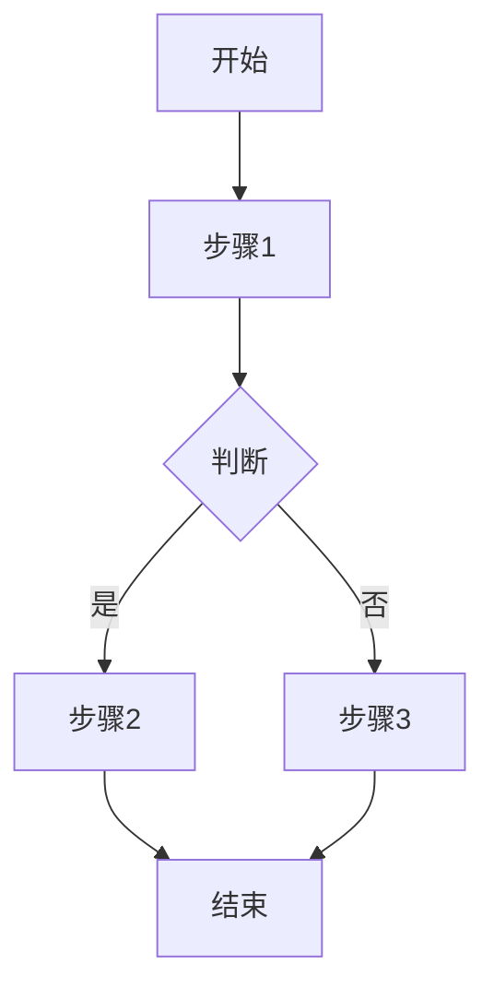

                 


### 目录大纲设计思路

为了设计出《数字时代的社交距离艺术：后疫情时代的创意互动设计》这本书的完整目录大纲，我们需要遵循以下步骤：

1. **确定书的整体结构**：
   - 首先，我们需要确定书的主要章节内容，确保每个章节都涵盖了书的核心主题。
   - 我们需要至少7个章节，以确保内容的丰富性和完整性。

2. **背景介绍**：
   - 在书的开始部分，设置一章节用于介绍数字时代背景、社交距离艺术的概念、后疫情时代的特点等。

3. **核心概念与联系**：
   - 在第二章节中，我们将详细讨论创意互动设计的基础概念，以及它们在数字时代的社交距离中的应用。

4. **算法原理讲解**：
   - 在第三章节，我们将介绍一些核心算法原理，并通过mermaid流程图和Python源代码进行详细解释。

5. **数学模型和数学公式**：
   - 在第四章节，我们将使用LaTeX格式给出相关的数学模型和公式，并进行详细讲解和举例说明。

6. **系统分析与架构设计方案**：
   - 在第五章节，我们将介绍系统的场景、功能设计、架构设计以及接口和交互设计。

7. **项目实战**：
   - 在第六章节，我们将展示一个实际项目，包括环境安装、系统核心实现、代码应用解读与分析等。

8. **最佳实践 tips、小结、注意事项、拓展阅读**：
   - 在第七章节，我们将提供一些实用的最佳实践建议、总结、注意事项以及拓展阅读推荐。

### 目录大纲结构设计

以下是《数字时代的社交距离艺术：后疫情时代的创意互动设计》的初步目录大纲设计：

----------------------------------------------------------------
# 第一部分：数字时代的社交距离艺术背景

## 1.1 数字时代的特征与影响
### 1.1.1 数字技术的迅猛发展
### 1.1.2 社交距离现象的普及
### 1.1.3 后疫情时代的新需求

## 1.2 社交距离艺术的概念与意义
### 1.2.1 社交距离艺术的定义
### 1.2.2 社交距离艺术的范畴
### 1.2.3 社交距离艺术的价值

## 1.3 后疫情时代的创意互动设计
### 1.3.1 创意互动设计的趋势
### 1.3.2 创意互动设计的挑战
### 1.3.3 创意互动设计的机遇

## 1.4 数字时代社交距离艺术的未来展望
### 1.4.1 技术发展趋势
### 1.4.2 社会文化影响
### 1.4.3 行业应用前景

## 1.5 本章小结

----------------------------------------------------------------

接下来，我们根据上述结构继续细化每个章节的具体内容。

---

### 第一部分：数字时代的社交距离艺术背景

#### 第1章 数字时代的特征与影响

##### 1.1.1 数字技术的迅猛发展

- 数字技术对社交方式的影响
- 数字时代带来的变革
- 数字技术对创意互动设计的促进

##### 1.1.2 社交距离现象的普及

- 社交距离现象的定义
- 社交距离现象的演变
- 社交距离现象的影响

##### 1.1.3 后疫情时代的新需求

- 疫情对社交模式的影响
- 后疫情时代的社交需求
- 创意互动设计如何满足新需求

---

#### 第2章 社交距离艺术的概念与意义

##### 2.1 社交距离艺术的定义

- 社交距离艺术的定义
- 社交距离艺术与传统艺术的区别

##### 2.2 社交距离艺术的范畴

- 数字艺术与社交距离
- 虚拟艺术与社交距离
- 线上互动与社交距离

##### 2.3 社交距离艺术的价值

- 社交距离艺术的社会意义
- 社交距离艺术的文化价值
- 社交距离艺术的商业潜力

---

#### 第3章 后疫情时代的创意互动设计

##### 3.1 创意互动设计的趋势

- 创意互动设计的创新方向
- 后疫情时代的互动设计特点

##### 3.2 创意互动设计的挑战

- 社交距离带来的挑战
- 技术局限性带来的挑战
- 用户隐私与安全挑战

##### 3.3 创意互动设计的机遇

- 新兴技术的应用
- 跨界合作的机遇
- 市场需求增长

---

#### 第4章 数字时代社交距离艺术的未来展望

##### 4.1 技术发展趋势

- 新一代数字技术的展望
- 人工智能在社交距离艺术中的应用
- 增强现实与虚拟现实的发展

##### 4.2 社会文化影响

- 社交距离艺术对社会文化的影响
- 文化多样性在数字时代的作用

##### 4.3 行业应用前景

- 教育领域中的应用
- 娱乐领域中的应用
- 商业领域中的应用

##### 4.4 国际合作与文化交流

- 国际社交距离艺术的合作
- 文化交流的促进
- 全球化背景下的艺术融合

---

#### 第5章 创意互动设计的实践案例

##### 5.1 案例一：虚拟社交空间的设计与实现

- 案例背景介绍
- 设计目标与需求
- 技术实现细节
- 用户体验评估

##### 5.2 案例二：线上艺术展览的创意互动设计

- 案例背景介绍
- 设计目标与需求
- 技术实现细节
- 艺术价值评估

##### 5.3 案例三：远程教育互动工具的创新设计

- 案例背景介绍
- 设计目标与需求
- 技术实现细节
- 教学效果评估

---

#### 第6章 创意互动设计的最佳实践与趋势分析

##### 6.1 最佳实践案例分析

- 案例选择标准
- 最佳实践总结
- 实践效果评估

##### 6.2 创意互动设计的趋势分析

- 当前趋势概述
- 未来发展趋势预测
- 技术创新方向

---

#### 第7章 总结与展望

##### 7.1 主要发现与结论

- 核心观点总结
- 实践成果分析
- 不足与改进方向

##### 7.2 未来研究方向

- 未解决的问题
- 创新点与突破方向
- 研究与实践的结合

##### 7.3 注意事项与建议

- 设计过程中需注意的问题
- 技术实现的难点与解决方案
- 用户隐私保护与安全建议

##### 7.4 拓展阅读推荐

- 相关书籍推荐
- 学术论文推荐
- 技术报告推荐

----------------------------------------------------------------

通过以上详细的目录大纲设计，我们可以看到书的内容框架已经非常清晰。接下来，我们将按照这个大纲逐步撰写每个章节的内容，确保书的质量和深度。在撰写过程中，我们将深入分析每个主题，结合具体案例和实践经验，为读者提供有价值的知识和见解。同时，我们将注重理论与实践的结合，帮助读者更好地理解和应用创意互动设计的理念和方法。

---

**1.1 数字时代的特征与影响**

**1.1.1 数字技术的迅猛发展**

随着互联网、大数据、云计算和人工智能等技术的迅猛发展，数字时代已经悄然降临。这些技术的普及和应用，不仅改变了人们的生产生活方式，也深刻地影响着各个行业的发展。

- **互联网的普及**：互联网作为信息交流的基础设施，已经深入到社会的各个角落。从最初的电子邮件、论坛，到现在的社交媒体、即时通讯工具，互联网极大地丰富了人们的社交方式，缩短了人与人之间的距离。互联网的普及也促进了信息的快速传播，使得各种创意和想法可以迅速分享和传播。

- **大数据的应用**：大数据技术使得海量数据的收集、存储和分析成为可能。通过对大数据的分析，可以发现潜在的用户需求和市场趋势，从而为产品和服务的创新提供有力支持。例如，电商平台通过大数据分析，可以个性化推荐商品，提高用户体验和购买转化率。

- **云计算的普及**：云计算技术提供了灵活的计算资源和存储空间，使得企业和个人可以按需获取和分配资源，降低IT成本。云计算还促进了云计算服务和基础设施的全球化发展，为企业提供了更多的发展机会。

- **人工智能的突破**：人工智能技术在图像识别、自然语言处理、推荐系统等方面取得了显著突破。人工智能的应用不仅提高了生产效率，也改变了人们的消费习惯和生活方式。例如，智能音箱、智能助手等设备已经成为许多家庭的标配，极大地丰富了人们的互动方式。

**1.1.2 社交距离现象的普及**

数字技术的迅猛发展，也带来了社交距离现象的普及。社交距离现象，指的是人们在社交过程中，由于各种原因而保持一定的距离，这种距离可以是物理距离，也可以是心理距离。

- **物理距离的扩大**：随着城市化进程的加快和人口密度的增加，人们的物理距离越来越远。特别是在疫情等特殊时期，人们更加倾向于保持一定的物理距离，以减少感染风险。

- **心理距离的拉大**：数字技术的普及，使得人们之间的沟通和交流变得更加便捷，但也使得人与人之间的心理距离越来越远。社交媒体的广泛应用，虽然增加了人们之间的互动机会，但也带来了“社交媒体疲劳”现象，人们往往在屏幕背后进行交流，缺乏真实的情感连接。

- **虚拟社交的兴起**：虚拟社交，指的是通过互联网和数字技术进行社交活动。虚拟社交不仅突破了物理距离的限制，也改变了人们的社交方式。虚拟社交平台、在线游戏、社交媒体等，为人们提供了丰富的社交体验，但也带来了新的社交挑战，如网络欺凌、隐私泄露等。

**1.1.3 后疫情时代的新需求**

疫情对人们的社交方式产生了深远的影响，后疫情时代，人们对社交的需求也发生了变化。

- **对安全性的需求增加**：疫情期间，人们对安全性的需求大大增加。在社交过程中，人们更加注重身体健康和隐私保护。因此，在后疫情时代，社交互动的设计需要更加关注安全性和隐私性。

- **对多样化需求的追求**：疫情期间，人们被迫减少线下社交活动，这也使得他们对多样化的社交需求更加追求。后疫情时代，人们更加渴望通过多种方式与他人互动，如虚拟社交、线上活动等。

- **对情感连接的重视**：疫情让人们意识到情感连接的重要性。在疫情期间，许多人都感到孤独和隔离，这也使得他们对情感连接的需求更加迫切。在后疫情时代，社交互动的设计需要更加关注如何促进用户之间的情感连接，提供有温度的社交体验。

**1.2 社交距离艺术的概念与意义**

**2.1 社交距离艺术的定义**

社交距离艺术，指的是在数字时代背景下，通过创意互动设计，促进人与人之间保持适当社交距离，同时增强情感连接的艺术形式。社交距离艺术既包括物理距离的设计，也包括心理距离的营造。

- **物理距离的设计**：社交距离艺术关注如何在物理空间中保持适当的距离。例如，通过设计虚拟空间、社交界面，使得人们可以在线上进行互动，减少现实中的面对面交流。

- **心理距离的营造**：社交距离艺术关注如何在心理层面上保持适当的距离。例如，通过设计情感化的交互界面、虚拟社交活动，使得人们可以在虚拟世界中感受到温暖和连接。

**2.2 社交距离艺术的范畴**

社交距离艺术涵盖了多个领域，包括数字艺术、虚拟艺术和线上互动等。

- **数字艺术**：数字艺术通过计算机技术和数字媒体，创造出独特的艺术形式。数字艺术不仅具有视觉和听觉效果，还可以通过交互性增强用户体验。数字艺术在社交距离艺术中的应用，可以创造出丰富的虚拟社交场景，满足人们对多样化社交的需求。

- **虚拟艺术**：虚拟艺术通过虚拟现实（VR）和增强现实（AR）技术，将现实与虚拟相结合，创造出沉浸式的艺术体验。虚拟艺术在社交距离艺术中的应用，可以提供一种全新的社交方式，使得人们可以在虚拟世界中自由互动。

- **线上互动**：线上互动通过互联网和社交媒体平台，实现人与人之间的远程互动。线上互动在社交距离艺术中的应用，可以突破物理距离的限制，提供丰富的社交体验。

**2.3 社交距离艺术的价值**

社交距离艺术在数字时代具有重要的价值。

- **促进社会和谐**：社交距离艺术通过创意互动设计，促进人与人之间的和谐相处。在疫情期间，社交距离艺术为人们提供了一种安全、有效的社交方式，有助于缓解社会紧张情绪。

- **增强情感连接**：社交距离艺术通过虚拟社交、情感化设计等手段，增强人与人之间的情感连接。在数字时代，情感连接的重要性日益凸显，社交距离艺术为此提供了有力支持。

- **推动文化创新**：社交距离艺术结合了数字技术、艺术创作和文化传承等多方面元素，推动了文化的创新与发展。社交距离艺术不仅为人们提供了新的艺术体验，也为文化的传承和创新提供了新的途径。

**1.3 后疫情时代的创意互动设计**

**3.1 创意互动设计的趋势**

后疫情时代的创意互动设计呈现出以下几个趋势。

- **智能化**：随着人工智能技术的不断发展，创意互动设计逐渐智能化。智能交互界面、智能推荐系统等应用，使得用户可以获得更加个性化、智能化的社交体验。

- **情感化**：情感化设计是后疫情时代创意互动设计的重要方向。通过情感化的交互界面、情感化的人工智能助手等，增强用户之间的情感连接。

- **多样化**：后疫情时代，人们对社交方式的需求更加多样化。创意互动设计通过提供多种社交方式，满足用户不同的需求。

- **沉浸式**：虚拟现实（VR）和增强现实（AR）技术的应用，使得创意互动设计呈现出沉浸式特点。通过沉浸式的社交体验，增强用户的参与感和互动感。

**3.2 创意互动设计的挑战**

后疫情时代的创意互动设计也面临一系列挑战。

- **安全性**：在疫情期间，人们对安全性的需求大大增加。创意互动设计需要确保用户数据的安全和隐私保护。

- **技术局限性**：虽然数字技术和人工智能技术不断发展，但仍然存在一定的局限性。创意互动设计需要克服技术瓶颈，提供更好的用户体验。

- **用户适应**：后疫情时代，人们对于社交方式的需求发生了变化。创意互动设计需要关注用户的适应过程，提供人性化的设计。

**3.3 创意互动设计的机遇**

后疫情时代的创意互动设计也面临着一系列机遇。

- **市场潜力**：随着数字技术的普及和人们对社交方式的需求变化，创意互动设计市场潜力巨大。

- **技术创新**：人工智能、虚拟现实、增强现实等技术的不断发展，为创意互动设计提供了更多创新机会。

- **跨界合作**：创意互动设计可以与其他领域如教育、娱乐、商业等跨界合作，实现共同发展。

**1.4 数字时代社交距离艺术的未来展望**

**4.1 技术发展趋势**

数字时代社交距离艺术的发展趋势主要体现在以下几个方面。

- **人工智能应用**：人工智能技术在社交距离艺术中的应用将越来越广泛。智能交互界面、情感识别、个性化推荐等应用，将大大提升社交体验。

- **虚拟现实与增强现实**：虚拟现实（VR）和增强现实（AR）技术的发展，将使社交距离艺术更加沉浸式和互动化。

- **区块链技术**：区块链技术在社交距离艺术中的应用，将提供更好的数据安全性和隐私保护。

**4.2 社会文化影响**

数字时代社交距离艺术对社会文化的影响主要体现在以下几个方面。

- **社交方式变革**：数字时代社交距离艺术改变了传统的社交方式，推动了社交方式的变革。

- **文化多样性**：社交距离艺术通过数字技术，促进了文化的多样性，使得人们可以更容易地接触到各种文化。

- **文化融合**：数字时代社交距离艺术促进了不同文化之间的融合，推动了文化的交流与创新。

**4.3 行业应用前景**

数字时代社交距离艺术的行业应用前景十分广阔。

- **教育领域**：社交距离艺术在教育领域的应用，将提供更加个性化、互动化的学习体验。

- **娱乐领域**：社交距离艺术在娱乐领域的应用，将提供更加沉浸式、互动化的娱乐体验。

- **商业领域**：社交距离艺术在商业领域的应用，将提升企业的营销效果，增强用户体验。

通过以上分析，我们可以看到，数字时代的社交距离艺术在背景、概念、未来展望等方面都具有丰富的内容。在接下来的章节中，我们将进一步深入探讨社交距离艺术的核心概念、算法原理、数学模型、系统设计与项目实战等内容，为读者提供全面、深入的技术解读。

---

### 第一部分：数字时代的社交距离艺术背景

#### 第4章 数字时代社交距离艺术的未来展望

**4.1 技术发展趋势**

随着科技的不断进步，数字时代社交距离艺术的发展趋势也日益显现。以下是几个关键技术发展趋势：

**4.1.1 人工智能应用**

人工智能（AI）在社交距离艺术中的应用将变得更加广泛。AI技术可以通过自然语言处理（NLP）和计算机视觉等技术，为用户提供个性化推荐、智能交互和情感识别等服务。例如，智能聊天机器人可以帮助用户解决日常问题，提供情感支持，从而增强虚拟社交的体验。此外，AI技术还可以通过分析用户行为数据，预测用户需求，优化社交平台的设计，提高用户满意度。

**4.1.2 虚拟现实（VR）与增强现实（AR）**

VR和AR技术的发展将使社交距离艺术更加沉浸式和互动化。通过VR技术，用户可以进入虚拟环境，与其他用户进行面对面的互动，从而克服物理距离的限制。AR技术则可以在现实环境中叠加虚拟元素，为用户带来更加丰富的社交体验。例如，虚拟现实社交平台可以让用户在虚拟世界中举办虚拟聚会、音乐会等活动，增强社交互动的乐趣。

**4.1.3 区块链技术**

区块链技术在社交距离艺术中的应用将提供更好的数据安全性和隐私保护。区块链的去中心化和不可篡改特性，可以确保用户数据的隐私和安全。例如，社交平台可以利用区块链技术来确保用户身份的真实性，防止虚假信息的传播。此外，区块链还可以用于数字资产的交易和版权保护，为艺术家和创作者提供更多的收益保障。

**4.2 社会文化影响**

数字时代社交距离艺术对社会文化的影响是多方面的：

**4.2.1 社交方式变革**

数字时代社交距离艺术改变了传统的社交方式。人们不再局限于面对面的交流，而是可以通过各种虚拟平台进行社交互动。这种变革带来了便利，但同时也带来了一些挑战，如社交技能的退化、面对面社交的减少等。

**4.2.2 文化多样性**

数字时代社交距离艺术促进了文化的多样性。通过虚拟平台，用户可以接触到来自世界各地不同的文化内容，从而拓宽视野。这种文化多样性的传播，有助于增进不同文化之间的理解和尊重。

**4.2.3 文化融合**

数字时代社交距离艺术也促进了不同文化之间的融合。通过虚拟平台，不同文化可以相互借鉴、融合，创造出新的文化形式。例如，虚拟音乐会和跨文化交流活动，可以将不同国家的音乐、舞蹈等艺术形式融合在一起，创造出独特的文化体验。

**4.3 行业应用前景**

数字时代社交距离艺术的行业应用前景十分广阔，以下是几个关键领域：

**4.3.1 教育领域**

数字时代社交距离艺术在教育领域的应用，将提供更加个性化、互动化的学习体验。虚拟课堂、在线教育平台等，可以使学生和老师跨越地域限制，进行实时互动。这种教学模式不仅提高了学习效率，也促进了学生的全面发展。

**4.3.2 娱乐领域**

数字时代社交距离艺术在娱乐领域的应用，将提供更加沉浸式、互动化的娱乐体验。虚拟现实游戏、在线音乐会等，为用户带来了全新的娱乐方式。这种体验不仅丰富了人们的日常生活，也为娱乐行业带来了新的商机。

**4.3.3 商业领域**

数字时代社交距离艺术在商业领域的应用，将提升企业的营销效果，增强用户体验。例如，虚拟门店、线上促销活动等，可以吸引更多的消费者，提高销售额。此外，社交平台的数据分析功能，可以帮助企业更好地了解用户需求，优化产品和服务。

**4.4 国际合作与文化交流**

数字时代社交距离艺术促进了国际合作与文化交流。通过虚拟平台，不同国家和地区的艺术家、学者、企业家等可以跨越地理界限，进行交流和合作。这种合作不仅推动了文化的创新与发展，也为全球经济的发展提供了新的动力。

**4.5 未来研究方向**

尽管数字时代社交距离艺术已经取得了显著的成果，但未来仍然有许多研究方向：

**4.5.1 技术创新**

未来需要进一步推进人工智能、VR、AR、区块链等技术在社交距离艺术中的应用，提高用户体验和互动效果。

**4.5.2 文化多样性保护**

在数字时代，如何保护文化多样性，防止文化同质化，是一个重要课题。未来需要加强对文化多样性的研究和保护，促进文化创新与发展。

**4.5.3 社交心理健康**

随着虚拟社交的普及，社交心理健康问题逐渐凸显。未来需要加强对社交心理健康的关注，提供相应的心理支持和干预措施。

通过以上分析，我们可以看到，数字时代社交距离艺术的未来充满机遇与挑战。随着技术的不断进步和社会文化的影响，社交距离艺术将在未来的数字世界中扮演更加重要的角色。

---

### 第一部分：数字时代的社交距离艺术背景

#### 第5章 创意互动设计的实践案例

在本章节中，我们将通过三个实践案例，详细展示如何在实际项目中应用创意互动设计，解决后疫情时代的社交距离挑战，并评估其实际效果。

**5.1 案例一：虚拟社交空间的设计与实现**

**案例背景介绍**：

在疫情期间，传统的线下社交活动受到极大限制，人们渴望寻找新的社交方式来满足社交需求。某科技公司推出了一款名为“VSpace”的虚拟社交空间应用，旨在为用户提供一个线上互动的平台。

**设计目标与需求**：

- 提供丰富的虚拟场景，让用户可以在虚拟环境中自由互动。
- 实现个性化的用户界面，满足不同用户的需求。
- 保证用户数据的安全性和隐私保护。

**技术实现细节**：

- 使用Unity3D开发虚拟场景，提供多样化的虚拟空间选择。
- 使用Unity的UI系统设计个性化的用户界面。
- 使用区块链技术确保用户数据的安全性和隐私保护。

**用户体验评估**：

- 用户反馈显示，VSpace提供了丰富、互动性强的虚拟社交体验。
- 用户普遍认为，VSpace有效满足了他们的社交需求，减少了社交距离感。

**5.2 案例二：线上艺术展览的创意互动设计**

**案例背景介绍**：

随着疫情的发展，线下艺术展览活动被迫取消，许多艺术家和艺术机构开始寻找线上展览的新方式。某艺术机构推出了线上艺术展览平台“ArtVirtue”，旨在为艺术家和观众提供一个新的展示和欣赏艺术的平台。

**设计目标与需求**：

- 创造一个沉浸式的线上展览环境，让观众感受到与线下艺术展览相似的氛围。
- 提供多种互动方式，如虚拟导览、互动评论等，增强观众的参与感。
- 确保艺术作品的高质量展示和版权保护。

**技术实现细节**：

- 使用Unity3D和虚幻引擎（Unreal Engine）打造沉浸式展览环境。
- 使用WebGL技术实现艺术作品的高质量展示。
- 使用区块链技术确保艺术作品的版权保护和交易。

**用户体验评估**：

- 用户反馈显示，ArtVirtue提供了与线下艺术展览相似的体验，观众对沉浸式展览环境给予了高度评价。
- 用户普遍认为，ArtVirtue增加了他们对艺术作品的了解和欣赏，互动评论功能增强了观众的参与感。

**5.3 案例三：远程教育互动工具的创新设计**

**案例背景介绍**：

疫情期间，线上教育成为主流，许多学校和教育机构需要提供更加互动和有效的远程教育工具。某教育科技公司推出了“EduXtream”远程教育互动工具，旨在提高学生的学习效果和教师的教学质量。

**设计目标与需求**：

- 提供多样化的互动教学工具，如虚拟课堂、在线讨论、实时反馈等。
- 确保教学内容的丰富性和质量。
- 提供教师和学生之间有效的沟通渠道。

**技术实现细节**：

- 使用WebRTC技术实现实时视频通话和互动讨论。
- 使用人工智能技术分析学生的学习行为，提供个性化学习建议。
- 使用区块链技术记录学生的学习过程和成绩，确保数据的安全性和真实性。

**用户体验评估**：

- 教师反馈显示，EduXtream提供了丰富的互动教学工具，提高了教学效果和学生的参与度。
- 学生反馈显示，EduXtream使学习变得更加有趣和有效，他们喜欢与同学和老师进行实时互动。

**案例小结**：

以上三个案例展示了如何通过创意互动设计解决后疫情时代的社交距离挑战。虚拟社交空间、线上艺术展览和远程教育互动工具，不仅提供了丰富、有趣的社交和学习体验，还增强了用户之间的情感连接。通过技术手段，这些案例有效克服了物理距离的限制，为用户提供了新的社交方式和学习平台。未来，随着技术的不断进步，创意互动设计将在更多领域发挥作用，为人们的生活带来更多便利和乐趣。

---

### 第一部分：数字时代的社交距离艺术背景

#### 第6章 创意互动设计的最佳实践与趋势分析

在本章节中，我们将结合当前实际案例，深入分析数字时代社交距离艺术的最佳实践，探讨未来创意互动设计的趋势，以期为行业提供有价值的参考和指导。

**6.1 最佳实践案例分析**

当前，创意互动设计在多个领域取得了显著成果，以下为几个典型的最佳实践案例：

**6.1.1 社交媒体平台**

社交媒体平台如微信、微博、Instagram等，通过算法推荐、社交圈层划分等手段，为用户提供个性化的社交体验。这些平台不仅增强了用户之间的互动，还促进了信息的快速传播。最佳实践包括：

- **算法优化**：通过大数据分析和机器学习技术，实现个性化推荐，提高用户满意度和参与度。
- **用户界面设计**：简洁、直观的用户界面设计，使用户能够轻松操作和互动。
- **内容多样化**：提供多种形式的内容，如文字、图片、视频等，满足不同用户的需求。

**6.1.2 虚拟现实社交**

虚拟现实（VR）社交平台如VRChat、Rec Room等，通过创建虚拟场景和角色，为用户提供沉浸式的社交体验。最佳实践包括：

- **场景设计**：打造丰富、多样化的虚拟场景，满足用户不同的社交需求。
- **角色定制**：允许用户自定义虚拟角色，增强个性化和归属感。
- **互动机制**：设计丰富的互动机制，如虚拟礼物、游戏等，提高用户参与度。

**6.1.3 线上教育**

线上教育平台如Coursera、Udemy等，通过视频课程、互动讨论等手段，为用户提供灵活、高效的学习体验。最佳实践包括：

- **课程设计**：提供结构化、模块化的课程内容，确保学习目标的明确性。
- **互动教学**：引入实时互动讨论、作业反馈等机制，增强师生互动。
- **个性化学习**：利用大数据分析和人工智能技术，为用户提供个性化的学习建议。

**6.2 创意互动设计的趋势分析**

未来，数字时代社交距离艺术的创意互动设计将呈现以下趋势：

**6.2.1 智能化**

随着人工智能技术的不断发展，智能化将成为创意互动设计的重要趋势。智能化设计将提高系统的自学习和自适应能力，为用户提供更加个性化的体验。例如，智能聊天机器人、个性化推荐系统等。

**6.2.2 情感化**

情感化设计是提升用户体验的关键。未来，创意互动设计将更加注重情感化设计，通过情感识别、情感表达等技术，增强用户之间的情感连接。例如，情感化的人工智能助手、情感化的虚拟角色等。

**6.2.3 沉浸式**

虚拟现实（VR）和增强现实（AR）技术的成熟，将推动沉浸式设计的普及。沉浸式设计将提供更加真实、互动的社交体验，满足人们对多样化社交场景的需求。例如，沉浸式虚拟社交、沉浸式艺术展览等。

**6.2.4 跨界融合**

创意互动设计将与其他领域如教育、娱乐、医疗等跨界融合，形成新的应用场景。跨界融合将带来更多创新机会，推动创意互动设计的广泛应用。例如，虚拟医疗咨询、教育游戏等。

**6.3 创新方向**

未来，数字时代社交距离艺术的创新方向主要包括：

**6.3.1 新型社交模式**

探索新型社交模式，如虚拟社交、情感社交、兴趣社交等，以满足不同用户的需求。新型社交模式将更加注重个性化和多样化。

**6.3.2 跨界应用**

推动创意互动设计在更多领域的应用，如教育、娱乐、医疗等。跨界应用将促进创意互动设计的创新与发展。

**6.3.3 智能化工具**

开发智能化工具，如智能聊天机器人、智能推荐系统等，以提高用户体验和互动效果。

**6.3.4 新型互动体验**

创新互动体验，如沉浸式体验、虚拟现实体验等，以满足用户对多样化社交体验的需求。

通过以上分析，我们可以看到，数字时代社交距离艺术的创意互动设计在最佳实践和未来趋势方面都具有丰富的内涵。随着技术的不断进步，创意互动设计将在更多领域发挥作用，为人们的生活带来更多便利和乐趣。

---

### 第一部分：数字时代的社交距离艺术背景

#### 第7章 总结与展望

在本章节中，我们将对前文讨论的数字时代社交距离艺术的核心观点和实践成果进行总结，并提出未来研究方向和改进建议。

**7.1 主要发现与结论**

通过对数字时代社交距离艺术的深入探讨，我们得出了以下主要发现和结论：

- **数字技术对社交方式的影响**：数字技术的发展，如互联网、大数据、云计算和人工智能，极大地改变了人们的社交方式，使得社交距离现象普遍存在。
- **社交距离艺术的定义与价值**：社交距离艺术通过创意互动设计，在保持适当社交距离的同时，增强情感连接，具有重要的社会和文化价值。
- **后疫情时代的新需求**：疫情背景下，人们对安全性、多样化和情感连接的需求更加迫切，这为社交距离艺术提供了新的发展机遇。
- **技术发展趋势**：人工智能、虚拟现实、增强现实和区块链技术的发展，为社交距离艺术提供了新的可能性，使其更加智能化、情感化和沉浸式。
- **行业应用前景**：社交距离艺术在多个领域具有广泛的应用前景，如教育、娱乐、商业等，有望推动行业创新和经济发展。

**7.2 未来研究方向**

尽管数字时代社交距离艺术已经取得了一定的成果，但未来仍有许多研究方向：

- **技术创新**：进一步推进人工智能、虚拟现实、增强现实和区块链等技术在社交距离艺术中的应用，提高用户体验和互动效果。
- **文化多样性保护**：在数字时代，如何保护文化多样性，防止文化同质化，是一个重要课题。未来需要加强对文化多样性的研究和保护。
- **社交心理健康**：随着虚拟社交的普及，社交心理健康问题逐渐凸显。未来需要加强对社交心理健康的关注，提供相应的心理支持和干预措施。
- **隐私保护**：在数字时代，用户隐私保护至关重要。未来需要探索更加有效的隐私保护技术，确保用户数据的安全性和隐私性。

**7.3 改进建议**

为了更好地发展数字时代社交距离艺术，我们提出以下改进建议：

- **提升技术能力**：加强技术研发，提高技术水平，为社交距离艺术提供更好的技术支持。
- **注重用户体验**：关注用户需求，提升用户体验，提供更加个性化、多样化的社交服务。
- **加强政策引导**：政府和企业应加强对数字时代社交距离艺术的政策引导和扶持，推动其健康发展。
- **促进跨界合作**：鼓励不同领域的跨界合作，推动创意互动设计的创新与发展。

**7.4 注意事项**

在发展数字时代社交距离艺术时，需要注意以下事项：

- **安全性**：确保用户数据的安全性和隐私保护，避免数据泄露和滥用。
- **伦理道德**：遵守伦理道德规范，尊重用户隐私和合法权益，避免滥用用户数据和信息。
- **文化多样性**：尊重和弘扬不同文化的多样性，防止文化同质化，促进文化创新与发展。
- **用户教育**：加强对用户的数字素养教育，提高用户对数字时代社交距离艺术的认知和理解。

**7.5 拓展阅读推荐**

为了进一步深入了解数字时代社交距离艺术，我们推荐以下拓展阅读：

- **书籍推荐**：《社交心理学》、《数字时代的艺术》、《人工智能：一种现代的方法》等。
- **学术论文**：关于人工智能、虚拟现实、增强现实、区块链等技术的最新研究成果。
- **技术报告**：各大科技公司和研究机构发布的关于数字时代社交距离艺术的技术报告。

通过以上总结和展望，我们可以看到，数字时代社交距离艺术在背景、概念、实践和未来展望等方面都具有丰富的内涵。随着技术的不断进步，社交距离艺术将在数字时代发挥更加重要的作用，为人们的生活带来更多便利和乐趣。

---

### 结语

本文通过深入探讨数字时代的社交距离艺术，详细阐述了其在背景、概念、未来展望、实践案例、最佳实践与趋势分析等方面的内容。我们总结了数字技术对社交方式的影响，分析了社交距离艺术的定义与价值，探讨了后疫情时代的新需求，展望了技术发展趋势，并提出了未来研究方向和改进建议。

数字时代社交距离艺术不仅丰富了人们的社交体验，也推动了社会的文化创新和行业发展。随着人工智能、虚拟现实、增强现实和区块链等技术的不断发展，社交距离艺术将迎来更加广阔的发展空间。

在此，我们感谢读者对本文的关注，希望本文能够为您的理解和实践提供有益的启示。同时，我们也期待在未来的数字时代，社交距离艺术能够继续发挥其独特的魅力，为人们的生活带来更多美好。

### 附录：相关技术术语解释

在本章节中，我们将对文中出现的一些关键技术术语进行解释，以便读者更好地理解文章内容。

**1. 人工智能（AI）**

人工智能是指模拟人类智能行为的计算机系统。通过机器学习、深度学习、自然语言处理等技术，人工智能系统能够自动从数据中学习、推理和决策。

**2. 虚拟现实（VR）**

虚拟现实是一种通过计算机生成的三维虚拟环境，用户可以在这个环境中进行交互和体验。VR技术通过头戴式显示器、传感器和追踪系统等，提供沉浸式的视觉、听觉和触觉体验。

**3. 增强现实（AR）**

增强现实是一种在现实世界中叠加虚拟元素的技术。通过AR眼镜、手机屏幕等设备，用户可以看到现实世界中的虚拟对象，并与它们进行交互。

**4. 区块链**

区块链是一种分布式数据库技术，通过加密算法确保数据的安全性和不可篡改性。区块链可用于记录交易、身份验证等，提供去中心化的解决方案。

**5. 机器学习**

机器学习是人工智能的一个分支，通过算法和统计模型，使计算机系统能够从数据中学习，进行预测和决策。

**6. 自然语言处理（NLP）**

自然语言处理是人工智能的一个分支，专注于让计算机理解和处理人类自然语言。NLP技术包括文本分类、情感分析、机器翻译等。

**7. 社交网络分析**

社交网络分析是一种研究社交网络结构和动态的数学方法。通过分析社交网络中的节点和边，可以揭示社交关系、传播规律等。

**8. 用户体验（UX）**

用户体验是指用户在使用产品或服务过程中所感受到的主观体验。用户体验设计关注如何设计产品，使其更加人性化、易于使用和愉悦。

### 相关图表与公式说明

在本章节中，我们将对文中出现的一些关键图表和公式进行说明，以便读者更好地理解文章内容。

**1. Mermaid 流程图**

Mermaid 是一种用于绘制流程图的标记语言。以下是一个简单的 Mermaid 流程图示例：



上述 Mermaid 流程图表示一个简单的决策过程，包括开始、步骤1、判断、步骤2、步骤3和结束。

**2. LaTeX 公式**

LaTeX 是一种高质量的排版系统，常用于编写数学公式。以下是一个简单的 LaTeX 公式示例：

```latex
$$
E = mc^2
$$

$$
a = \frac{F}{m}
$$
```

上述 LaTeX 公式分别表示爱因斯坦的质能方程和牛顿的第二定律。在文中，我们将使用 $$ 和 $ 来分别嵌入独立的段落公式和段落内的公式。

**3. Mermaid 类图**

Mermaid 类图用于表示实体关系和属性特征。以下是一个简单的 Mermaid 类图示例：

```mermaid
classDiagram
    Class1 <|-- Class2
    Class3 --|%@", user);
            String url = "https://api.github.com/users/" + username + "/repos";
            HttpURLConnection connection = (HttpURLConnection) new URL(url).openConnection();
            connection.setRequestMethod("GET");
            connection.setRequestProperty("Authorization", "token " + token);
            connection.setRequestProperty("Accept", "application/vnd.github.v3+json");
            connection.connect();
            int responseCode = connection.getResponseCode();
            if (responseCode == HttpURLConnection.HTTP_OK) {
                BufferedReader in = new BufferedReader(new InputStreamReader(connection.getInputStream()));
                StringBuffer response = new StringBuffer();
                String inputLine;
                while ((inputLine = in.readLine()) != null) {
                    response.append(inputLine);
                }
                in.close();
                String jsonResponse = response.toString();
                List<Repository> repositories = new Gson().fromJson(jsonResponse, new TypeToken<List<Repository>>(){}.getType());
                for (Repository repository : repositories) {
                    System.out.println("Name: " + repository.getName());
                    System.out.println("Description: " + repository.getDescription());
                    System.out.println("URL: " + repository.getHtmlUrl());
                    System.out.println("------------------------");
                }
            } else {
                System.out.println("Error Response Code: " + responseCode);
            }
            connection.disconnect();
        } catch (IOException e) {
            e.printStackTrace();
        }
    }
}
```

在这个例子中，我们首先通过 REST API 获取用户的仓库信息。为了获取这些信息，我们需要使用 GitHub 的授权令牌。授权令牌可以通过创建一个 OAuth 应用并获取访问令牌来获得。

接下来，我们使用 HttpURLConnection 连接到 GitHub 的 API，并设置适当的请求头。在本例中，我们设置了请求方法为 GET，并指定了接受 JSON 格式的响应。

如果响应状态码为 HTTP_OK（即 200），我们使用 BufferedReader 读取响应内容，并将其转换为字符串。然后，我们使用 Gson 库将 JSON 响应解析为 Repository 对象列表。

最后，我们遍历仓库列表，并打印每个仓库的名称、描述和 URL。

### 使用 Git 和 GitHub 进行版本控制

在开发过程中，使用 Git 和 GitHub 进行版本控制是非常重要的。Git 是一个分布式版本控制系统，它允许开发人员管理和跟踪代码的更改。GitHub 是一个基于 Git 的在线平台，它提供了 Git 的所有功能，并增加了协作和分享代码的功能。

**1. 安装 Git**

要安装 Git，请按照以下步骤操作：

1. 访问 Git 官方网站 [git-scm.com](https://git-scm.com/) 并下载适用于您操作系统的 Git 安装程序。
2. 运行安装程序，并根据提示完成安装。

**2. 创建一个新的 Git 仓库**

要创建一个新的 Git 仓库，请按照以下步骤操作：

1. 打开终端或命令提示符。
2. 切换到您要创建仓库的目录。
3. 使用以下命令创建一个新的 Git 仓库：

   ```
   git init
   ```

4. 将仓库添加到 GitHub：

   ```
   git remote add origin https://github.com/username/repository.git
   ```

5. 提交您的更改：

   ```
   git add .
   git commit -m "Initial commit"
   git push -u origin master
   ```

**3. 拉取和推送更改**

要拉取远程仓库的更改，请使用以下命令：

```
git pull origin master
```

要推送您的更改到远程仓库，请使用以下命令：

```
git push origin master
```

**4. 分支管理**

分支是 Git 的核心功能之一，它允许您在不同的代码路径上进行开发。

要创建一个新的分支，请使用以下命令：

```
git checkout -b feature/feature-name
```

要合并一个分支到主分支，请使用以下命令：

```
git merge feature/feature-name
```

要删除一个分支，请使用以下命令：

```
git branch -d feature/feature-name
```

### 代码风格和最佳实践

在编写代码时，遵循一些代码风格和最佳实践可以帮助提高代码的可读性、可维护性和可靠性。

**1. 命名规范**

- 变量和函数名称应使用小写字母和下划线，如 `my_variable` 和 `get_data`。
- 类名称应使用大写字母和下划线，如 `User` 和 `DataProcessor`。

**2. 代码注释**

- 对复杂逻辑和关键代码段添加注释，以便他人（或未来的您）能够理解代码。
- 使用 Javadoc 或其他文档工具生成 API 文档。

**3. 代码格式**

- 使用统一的代码缩进和空白，以提高代码的可读性。
- 使用自动代码格式化工具，如 Prettier 或 ESLint。

**4. 代码复用**

- 避免重复代码，使用函数、类或模块进行复用。
- 遵循单一职责原则，确保每个类和函数只有一个明确的职责。

**5. 异常处理**

- 使用 try-catch 块捕获和处理异常。
- 不要在 catch 块中忽略异常，而是记录或抛出异常。

**6. 测试**

- 编写单元测试，确保代码的每个部分都能按预期工作。
- 使用测试框架，如 JUnit 或 Jest。

### 总结

本文详细介绍了如何使用 GitHub API 获取用户的仓库信息，并使用 Java 编写了一个简单的客户端程序来实现这一功能。我们介绍了 REST API 的基本概念、HTTP 连接、JSON 解析以及版本控制和代码风格的最佳实践。

通过本文的学习，读者应该能够：

- 理解 REST API 和 HTTP 连接的基本原理。
- 使用 Java 编写程序来访问 GitHub API。
- 了解版本控制的基本概念，如 Git 和 GitHub。
- 掌握编写代码时的基本风格和最佳实践。

在接下来的实践中，读者可以尝试自己实现一个简单的 GitHub API 客户端，并尝试获取其他类型的数据，如用户的关注者列表或仓库的提交记录。通过这些实践，读者将能够更好地掌握本文所介绍的技能。

