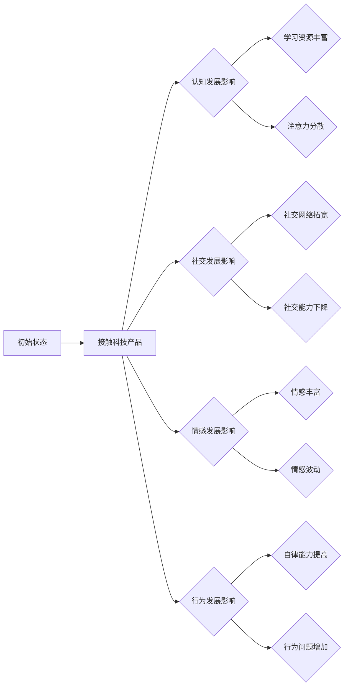
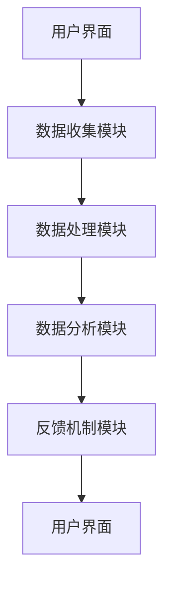
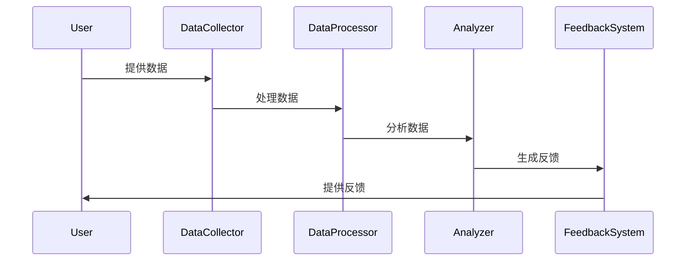

                 

### 文章标题

“数字时代的童年：科技对儿童发展的影响”

### 关键词

- 数字时代
- 儿童发展
- 科技影响
- 认知能力
- 社交能力
- 情感发展

### 摘要

本文以数字时代为背景，探讨了科技对儿童发展的多重影响。通过系统分析科技对儿童认知、社交、情感、行为、教育、健康和安全等方面的作用，揭示了科技在儿童成长过程中的关键角色。同时，本文也对科技带来的挑战提出了应对策略，以期为家庭、教育机构和社会提供有益参考。

## 引言

### 1.1 问题背景

随着科技的迅猛发展，互联网、智能手机、平板电脑等数字化产品逐渐成为人们日常生活中不可或缺的一部分。这种变化不仅影响了成年人，也对儿童的生活产生了深远影响。然而，科技对儿童发展的具体影响尚不明确，需要通过系统研究来深入探讨。

### 1.2 问题描述

当前，儿童在科技产品面前的接触频率和使用时间不断增加，引发了一系列问题，如认知能力的提升与下降、社交能力的增强与孤立、情感发展的积极与消极影响等。这些问题不仅关系到儿童个人的成长，也对社会整体的发展产生了影响。因此，研究科技对儿童发展的影响具有重要的现实意义。

### 1.3 研究意义

首先，本文的研究有助于深入了解科技对儿童发展的全面影响，为相关政策的制定提供科学依据。其次，通过分析科技对儿童各个方面的具体影响，可以为家庭和教育机构提供有益的指导，帮助家长和教育者更好地引导儿童使用科技产品。此外，本文的研究也为未来科技产品设计和应用提供了新的思路，有助于促进科技与儿童发展的和谐共生。

### 1.4 研究方法

本文采用文献综述法和实证研究法相结合的方法进行。文献综述法用于系统梳理和分析已有的研究成果，明确研究现状和不足；实证研究法则通过问卷调查、访谈和实验等方法，收集一手数据，验证和拓展理论研究成果。

### 1.5 边界与外延

本研究的主要边界包括研究的时间范围、地域范围和研究对象的年龄范围。研究时间范围设定为过去十年，地域范围选择国内外具有代表性的地区，研究对象为3-12岁的儿童。

### 1.6 核心概念构成

核心概念包括数字时代、儿童发展、科技影响、认知能力、社交能力、情感发展等。这些概念是本文研究的基础，贯穿全文，用于解释和阐述科技对儿童发展的多重影响。

### 1.7 本书结构安排

本书分为四个主要部分。第一部分介绍数字时代的特征和儿童发展的现状，探讨科技对儿童认知能力、社交能力、情感发展的影响。第二部分分析科技对儿童行为发展、教育、健康和安全的影响，以及面临的挑战和对策。第三部分和第四部分分别从科技产品和家庭教育两个方面，详细探讨科技在儿童发展中的应用和影响。

### 1.8 阅读建议

为了更好地理解本文内容，建议读者首先了解数字时代和儿童发展的基本概念，然后逐一阅读各章节，特别是对核心概念和实证研究部分给予重点关注。在阅读过程中，可以结合自己的实际经验和观察，思考科技对儿童发展的具体影响，以及如何应对这些影响。

## 数字时代的儿童发展与科技

### 2.1 数字时代的特征

数字时代是一个以互联网、大数据、云计算和人工智能等技术为核心的时代。这一时代的显著特征包括：

1. **信息获取的便捷性**：互联网的普及使得儿童可以轻松获取各种信息和资源，拓宽了他们的知识视野。
2. **数字化生活方式**：智能手机、平板电脑等数字化设备的广泛使用，改变了儿童的学习、娱乐和社交方式。
3. **虚拟与现实交织**：通过虚拟现实（VR）和增强现实（AR）技术，儿童可以在虚拟环境中体验现实世界，激发他们的创造力和想象力。
4. **技术的快速迭代**：科技不断更新换代，儿童需要不断适应和学习新的技术，这既带来了挑战，也提供了机遇。

### 2.2 儿童发展的特点

儿童处于身心发展的关键时期，具有以下特点：

1. **好奇心强**：儿童对周围世界充满好奇心，渴望探索和发现新事物。
2. **学习能力旺盛**：儿童具有较强的学习能力，特别是在语言、认知和社交能力方面。
3. **可塑性大**：儿童的心理和行为模式具有较大的可塑性，良好的教育和引导对其成长至关重要。
4. **情感波动大**：儿童的情感波动较大，容易受到外界环境的影响。

### 2.3 科技与儿童发展的关系

科技与儿童发展之间存在着紧密的关系。一方面，科技为儿童提供了丰富的学习资源和工具，促进了他们的认知和社交能力的发展。另一方面，科技产品的过度使用也可能对儿童的发展产生负面影响。因此，如何在科技和儿童发展之间找到平衡点，成为当前亟需解决的问题。

### 2.3.1 科技对儿童认知能力的影响

科技产品如智能手机、平板电脑等，为儿童提供了丰富的学习资源和工具。研究表明，适当的科技产品使用可以促进儿童的认知发展，提高其学习能力。然而，如果过度依赖科技产品，可能导致儿童的认知能力下降，影响其自主学习能力。

### 2.3.2 科技对儿童社交能力的影响

科技产品在促进儿童社交能力方面具有一定的积极作用。例如，在线游戏和社交媒体可以帮助儿童建立社交网络，提高社交技能。然而，过度使用科技产品可能导致儿童社交能力下降，出现孤立和社交焦虑等问题。

### 2.3.3 科技对儿童情感发展的影响

科技产品对儿童情感发展的影响是双重的。一方面，适当的科技产品使用可以丰富儿童的情感体验，提高其情感表达能力。另一方面，过度使用科技产品可能导致儿童情感波动，出现焦虑、抑郁等问题。

### 2.3.4 科技对儿童行为发展的影响

科技产品对儿童行为发展的影响也是复杂的。一方面，适当的科技产品使用可以培养儿童的自律能力和责任感。另一方面，过度使用科技产品可能导致儿童行为异常，如注意力不集中、行为冲动等。

### 2.3.5 科技对儿童教育的影响

科技在教育中的应用极大地改变了传统教育模式。在线教育、远程教育等新兴教育方式，为儿童提供了更加灵活和个性化的学习体验。然而，科技在儿童教育中的应用也带来了一些挑战，如教育资源的公平性和教师的专业发展等。

### 2.3.6 科技对儿童健康的影响

科技产品对儿童健康的影响主要体现在身体和心理两个方面。适当的科技产品使用可以改善儿童的身体健康状况，提高其心理素质。然而，过度使用科技产品可能导致儿童身体和心理问题，如近视、肥胖、焦虑和抑郁等。

### 2.3.7 科技对儿童安全的影响

科技产品的普及带来了网络安全和隐私保护等新问题。儿童在上网过程中容易受到网络欺凌、诈骗等网络风险的威胁。因此，加强儿童网络安全教育，提高家长和教师的网络安全意识，成为保障儿童安全的重要任务。

### 2.4 本章小结

本章从多个角度探讨了数字时代儿童发展与科技之间的关系。科技在儿童认知、社交、情感、行为、教育、健康和安全等方面具有显著的影响。为了充分发挥科技对儿童发展的积极作用，需要家长、教育者和社会共同努力，引导儿童合理使用科技产品，促进其全面发展。

## 科技对儿童认知能力的影响

### 3.1 认知能力的定义

认知能力是指个体获取、处理和应用信息的能力，包括注意力、记忆力、理解力、推理能力和创造力等。认知能力的发展对儿童的学习、工作和生活具有重要意义。

### 3.2 科技对儿童认知能力的影响

科技产品的广泛应用对儿童的认知能力产生了深远影响。一方面，科技产品为儿童提供了丰富的学习资源和工具，促进了其认知能力的发展。另一方面，科技产品的过度使用也可能对儿童的认知能力产生负面影响。

#### 3.2.1 积极影响

1. **提高注意力**：科技产品如益智游戏和在线学习平台，可以帮助儿童提高注意力和专注力，培养其良好的学习习惯。
2. **增强记忆力**：通过重复性的操作和互动，科技产品可以增强儿童的记忆力，提高其信息存储和处理能力。
3. **促进理解力**：多媒体教学资源如视频、图片和动画，能够更好地解释复杂概念，提高儿童的理解力。
4. **培养创造力**：科技产品如编程工具和3D建模软件，可以激发儿童的创造力，鼓励他们进行创新性思维和实践。

#### 3.2.2 负面影响

1. **分散注意力**：过度使用科技产品可能导致儿童注意力不集中，影响其学习效果。
2. **损害记忆力**：长时间使用电子屏幕产品可能导致儿童的近视和颈椎问题，影响其记忆力。
3. **降低理解力**：过度依赖电子屏幕可能导致儿童对现实世界的理解和感知能力下降。
4. **抑制创造力**：一些研究指出，过度使用科技产品可能导致儿童创造力降低，影响其创新性思维。

### 3.3 影响机制分析

科技对儿童认知能力的影响主要通过以下几个方面实现：

#### 3.3.1 生理机制

1. **视觉刺激**：电子屏幕的视觉刺激可以促进儿童视觉认知能力的发展，但也可能导致近视等问题。
2. **听觉刺激**：音乐和声音效果的刺激有助于儿童听觉认知能力的发展，但过度的声音刺激可能对儿童的大脑产生负面影响。
3. **触觉刺激**：触摸屏设备可以提供丰富的触觉刺激，促进儿童手眼协调能力和精细动作能力的发展。

#### 3.3.2 心理机制

1. **注意力分配**：科技产品需要儿童进行多任务操作，如同时观看视频、操作游戏和与其他人交流，这有助于培养其注意力分配能力。
2. **记忆策略**：科技产品如记忆游戏和闪卡，可以帮助儿童建立有效的记忆策略，提高其记忆力。
3. **认知负荷**：科技产品如复杂的多媒体教学资源，可能对儿童产生较高的认知负荷，影响其认知能力和学习效果。

#### 3.3.3 教育机制

1. **教育资源**：科技产品为儿童提供了丰富的教育资源，如在线课程和学习平台，有助于提高其学习效果。
2. **教育模式**：科技产品改变了传统的教育模式，提供了更加灵活和个性化的学习体验，有助于激发儿童的学习兴趣和动力。
3. **教育评价**：科技产品如在线测评和数据分析工具，可以帮助教育者更好地评估学生的学习情况和效果，优化教育策略。

### 3.4 本章小结

本章从多个角度分析了科技对儿童认知能力的影响。科技产品在提高儿童认知能力方面具有积极作用，但也存在一定的负面影响。为了充分发挥科技的优势，避免其负面影响，家长和教育者需要合理引导儿童使用科技产品，培养其良好的认知能力。

## 科技对儿童社交能力的影响

### 4.1 社交能力的定义

社交能力是指个体在社交情境中与他人沟通、互动和建立关系的能力，包括沟通技巧、人际交往、团队合作和冲突解决等。社交能力的发展对儿童的心理健康和未来发展具有重要意义。

### 4.2 科技对儿童社交能力的影响

科技产品的广泛应用对儿童的社交能力产生了深远影响。一方面，科技产品为儿童提供了丰富的社交机会和平台，促进了其社交能力的发展。另一方面，科技产品的过度使用也可能对儿童的社交能力产生负面影响。

#### 4.2.1 积极影响

1. **拓宽社交圈子**：互联网和社交媒体为儿童提供了更广阔的社交空间，使他们能够与不同地区、不同文化背景的人建立联系。
2. **提高沟通技巧**：通过在线聊天、视频通话和社交媒体，儿童可以锻炼其沟通技巧，提高表达能力。
3. **培养团队合作能力**：多人在线游戏和协作平台可以帮助儿童培养团队合作精神，提高合作能力。
4. **增强社交自信**：适当的科技产品使用可以增强儿童的社交自信，提高其在社交场合中的表现。

#### 4.2.2 负面影响

1. **孤独感增加**：过度使用科技产品可能导致儿童与现实社交的隔离，增加孤独感。
2. **人际交往能力下降**：长期依赖科技产品进行社交，可能导致儿童的人际交往能力下降，影响其在现实世界中的社交表现。
3. **网络欺凌风险**：互联网和社交媒体的匿名性可能导致网络欺凌的发生，对儿童的社交能力和心理健康产生负面影响。
4. **社交焦虑增加**：过度使用科技产品可能导致儿童出现社交焦虑，影响其正常社交活动。

### 4.3 影响机制分析

科技对儿童社交能力的影响主要通过以下几个方面实现：

#### 4.3.1 生理机制

1. **视觉刺激**：电子屏幕的视觉刺激可以促进儿童视觉社交能力的发展，但也可能导致近视等问题。
2. **听觉刺激**：音乐和声音效果的刺激有助于儿童听觉社交能力的发展，但过度的声音刺激可能对儿童的大脑产生负面影响。
3. **触觉刺激**：触摸屏设备可以提供丰富的触觉刺激，促进儿童手眼协调能力和精细动作能力的发展。

#### 4.3.2 心理机制

1. **注意力分配**：科技产品需要儿童进行多任务操作，如同时观看视频、操作游戏和与他人交流，这有助于培养其注意力分配能力。
2. **记忆策略**：科技产品如记忆游戏和闪卡，可以帮助儿童建立有效的记忆策略，提高其社交记忆能力。
3. **认知负荷**：科技产品如复杂的多媒体教学资源，可能对儿童产生较高的认知负荷，影响其社交能力和学习效果。

#### 4.3.3 教育机制

1. **教育资源**：科技产品为儿童提供了丰富的教育资源，如在线课程和学习平台，有助于提高其社交知识和技能。
2. **教育模式**：科技产品改变了传统的教育模式，提供了更加灵活和个性化的学习体验，有助于激发儿童的学习兴趣和动力。
3. **教育评价**：科技产品如在线测评和数据分析工具，可以帮助教育者更好地评估学生的学习情况和效果，优化教育策略。

### 4.4 本章小结

本章从多个角度分析了科技对儿童社交能力的影响。科技产品在拓宽儿童社交圈子、提高沟通技巧和培养团队合作能力方面具有积极作用，但也存在一定的负面影响。为了充分发挥科技的优势，避免其负面影响，家长和教育者需要合理引导儿童使用科技产品，培养其良好的社交能力。

## 科技对儿童情感发展的影响

### 5.1 情感发展的定义

情感发展是指个体在成长过程中，对情感体验、情感表达和情感调节能力的不断成熟和提升。情感发展对儿童的心理健康和社会适应能力具有重要影响。

### 5.2 科技对儿童情感发展的影响

科技产品的广泛应用对儿童的情感发展产生了深远影响。一方面，科技产品为儿童提供了丰富的情感体验和表达渠道，促进了其情感发展。另一方面，科技产品的过度使用也可能对儿童的情感发展产生负面影响。

#### 5.2.1 积极影响

1. **丰富情感体验**：科技产品如故事书、电影和音乐，可以丰富儿童的情感体验，提高其对情感的感受和理解能力。
2. **促进情感表达**：通过社交媒体、游戏和视频聊天，儿童可以更方便地表达自己的情感和需求，增强情感表达能力。
3. **增强社交支持**：互联网和社交媒体可以帮助儿童建立虚拟社交网络，提供情感支持和陪伴，减轻孤独感。
4. **提高情感调节能力**：一些科技产品如冥想应用程序和情绪管理游戏，可以帮助儿童学会调节情绪，提高情感调节能力。

#### 5.2.2 负面影响

1. **情感波动**：过度使用科技产品可能导致儿童情感波动，出现焦虑、抑郁等心理问题。
2. **情感依赖**：一些儿童可能对科技产品产生过度依赖，影响其情感发展和人际关系。
3. **情感隔离**：过度使用科技产品可能导致儿童与现实社交的隔离，影响其情感体验和情感发展。
4. **负面内容影响**：互联网上的负面内容如暴力、恐怖和色情等，可能对儿童的情感发展产生不良影响。

### 5.3 影响机制分析

科技对儿童情感发展的影响主要通过以下几个方面实现：

#### 5.3.1 生理机制

1. **神经刺激**：科技产品的视觉、听觉和触觉刺激可以激活儿童的大脑神经网络，促进情感发展。
2. **生理反应**：一些科技产品如运动传感器和虚拟现实设备，可以模拟真实的情感体验，影响儿童的生理反应。
3. **生理依赖**：长时间使用科技产品可能导致儿童出现生理依赖，影响其情感发展。

#### 5.3.2 心理机制

1. **认知重构**：科技产品提供了丰富的信息和体验，可以促进儿童对情感的理解和认知重构。
2. **情绪体验**：通过互动和体验，儿童可以更深入地理解情感，提高情感体验和表达能力。
3. **情感调节**：科技产品如情绪管理游戏和冥想应用程序，可以帮助儿童学会调节情绪，提高情感调节能力。

#### 5.3.3 教育机制

1. **情感教育**：科技产品可以作为情感教育的工具，帮助儿童学习情感知识和技能。
2. **情感体验**：通过参与科技产品，儿童可以体验到不同的情感，提高情感敏感度和理解能力。
3. **情感互动**：科技产品可以促进儿童之间的情感互动，提高情感沟通和合作能力。

### 5.4 本章小结

本章从多个角度分析了科技对儿童情感发展的影响。科技产品在丰富儿童情感体验、促进情感表达和增强社交支持方面具有积极作用，但也存在一定的负面影响。为了充分发挥科技的优势，避免其负面影响，家长和教育者需要合理引导儿童使用科技产品，培养其良好的情感发展。

## 科技对儿童行为发展的影响

### 6.1 行为发展的定义

行为发展是指个体在成长过程中，行为模式的不断变化和成熟过程。它涉及个体在行为习惯、社交行为、自律能力、情绪调节等方面的进步和变化。

### 6.2 科技对儿童行为发展的影响

科技产品的广泛应用对儿童的行为发展产生了深远影响。一方面，科技产品可以提供丰富的学习资源和娱乐内容，对儿童的行为发展产生积极影响。另一方面，科技产品的过度使用也可能对儿童的行为发展产生负面影响。

#### 6.2.1 积极影响

1. **促进好奇心和探索精神**：科技产品如编程玩具和互动游戏，可以激发儿童的好奇心和探索精神，培养其解决问题的能力。
2. **提高自律能力**：一些科技产品如在线课程和学习管理应用程序，可以帮助儿童培养自律能力，提高时间管理和任务规划能力。
3. **丰富社交行为**：在线游戏和社交媒体为儿童提供了新的社交渠道，有助于他们建立社交网络，提高社交能力。
4. **增强学习兴趣**：多媒体教学资源和互动学习工具，可以激发儿童的学习兴趣，提高学习效果。

#### 6.2.2 负面影响

1. **行为冲动**：一些研究指出，过度使用科技产品可能导致儿童行为冲动，出现注意力不集中、行为冲动等问题。
2. **社交孤立**：过度依赖线上社交可能导致儿童与现实社交的隔离，影响其社交能力和人际关系。
3. **睡眠质量下降**：夜间使用电子屏幕产品可能导致儿童睡眠质量下降，影响其行为发展和身心健康。
4. **沉迷问题**：一些儿童可能对科技产品产生沉迷，影响其学习和生活，甚至导致心理问题。

### 6.3 影响机制分析

科技对儿童行为发展的影响主要通过以下几个方面实现：

#### 6.3.1 生理机制

1. **大脑发育**：科技产品对大脑的刺激可以影响儿童的神经发育，从而影响其行为发展。
2. **生理疲劳**：长时间使用科技产品可能导致儿童身体疲劳，影响其行为表现。
3. **生理依赖**：一些儿童可能对科技产品产生生理依赖，影响其行为发展和生活规律。

#### 6.3.2 心理机制

1. **认知发展**：科技产品的互动和体验可以促进儿童的认知发展，从而影响其行为模式。
2. **情感调节**：科技产品可以帮助儿童学会调节情绪，从而影响其行为表现。
3. **行为习惯**：科技产品可以成为儿童行为习惯的一部分，影响其日常行为和生活方式。

#### 6.3.3 教育机制

1. **学习机会**：科技产品为儿童提供了丰富的学习资源和工具，有助于提高其学习效果和行为习惯。
2. **教育模式**：科技产品的应用改变了传统的教育模式，提供了更加灵活和个性化的学习体验，有助于培养儿童的行为能力。
3. **教育评价**：科技产品如在线测评和数据分析工具，可以帮助教育者更好地评估学生的学习情况和效果，优化教育策略。

### 6.4 本章小结

本章从多个角度分析了科技对儿童行为发展的影响。科技产品在促进儿童好奇心、提高自律能力和丰富社交行为方面具有积极作用，但也存在一定的负面影响。为了充分发挥科技的优势，避免其负面影响，家长和教育者需要合理引导儿童使用科技产品，培养其良好的行为发展。

## 科技对儿童教育的影响

### 7.1 教育方式的转变

科技的发展对儿童教育方式产生了深远影响，促使教育从传统的课堂教学向多元化、个性化、远程化和互动化的方向发展。以下是科技对教育方式的几个主要影响：

#### 7.1.1 在线教育

在线教育利用互联网和数字技术，为学生提供灵活的学习时间和地点，打破了传统教育的时间和空间限制。在线教育平台如Coursera、edX和Khan Academy等，提供了丰富的课程资源和互动学习工具，使得学生可以根据自己的需求和兴趣进行自主学习。

#### 7.1.2 远程教育

远程教育通过互联网和通信技术，将教师和学生连接起来，实现了教育资源的共享和互动。远程教育不仅适用于城市和发达地区，也为偏远和贫困地区的儿童提供了优质的教育机会。例如，中国的“互联网+教育”项目，通过卫星电视和互联网技术，将优质教育资源输送到了农村和边远地区。

#### 7.1.3 个性化教育

个性化教育利用大数据和人工智能技术，为学生提供个性化的学习方案和指导。通过分析学生的学习数据，系统可以推荐适合他们的学习资源和方法，帮助他们更有效地学习。个性化教育不仅提高了学习效率，也激发了学生的学习兴趣和动力。

#### 7.1.4 互动化教育

互动化教育通过多媒体和虚拟现实技术，创造了一个更加生动和互动的学习环境。学生可以通过参与实验、游戏和互动讨论，更深入地理解和掌握知识。例如，虚拟实验室和在线协作平台，让学生在虚拟环境中进行实验和合作学习，提高了学习效果和参与度。

### 7.2 科技在教育中的应用

科技在教育中的应用，极大地丰富了教育手段和资源，提高了教育质量和效果。以下是科技在教育中应用的几个方面：

#### 7.2.1 教学工具

科技教学工具如电子白板、智能教室、平板电脑和智能笔等，提供了更加直观和互动的教学方式。教师可以通过这些工具，更生动地展示教学内容，激发学生的学习兴趣和参与度。

#### 7.2.2 学习资源

互联网和数据库提供了丰富的学习资源，如电子书、学术论文、视频课程和教育软件等。学生可以通过互联网获取这些资源，进行自主学习，拓宽知识视野。

#### 7.2.3 数据分析

数据分析技术可以帮助教育者更好地了解学生的学习情况，发现学习问题，并采取相应的教育策略。通过分析学生的学习数据，教育者可以制定个性化的教育计划，提高教育效果。

#### 7.2.4 虚拟现实和增强现实

虚拟现实（VR）和增强现实（AR）技术为教育带来了新的可能性。通过虚拟实验室和虚拟课堂，学生可以在虚拟环境中进行实验和互动学习，提高学习效果和兴趣。例如，医学专业的学生可以通过VR技术进行虚拟手术练习，提高操作技能。

### 7.3 科技对教育质量的影响

科技的应用不仅改变了教育方式，也对教育质量产生了重要影响：

#### 7.3.1 提高教育效率

科技工具和资源的广泛应用，可以节省教学时间，提高教育效率。例如，智能教室和在线教育平台，使得教师可以更高效地进行教学，学生可以更快速地学习知识。

#### 7.3.2 提升教育公平

科技的应用有助于缩小城乡教育差距，提升教育公平。通过远程教育和在线教育，偏远和贫困地区的儿童也可以获得优质的教育资源，享受与城市儿童同等的教育机会。

#### 7.3.3 促进教育创新

科技的应用激发了教育创新，推动了教育模式的变革。教育者可以通过科技工具和资源，探索新的教学方法和教育模式，为教育改革提供新的思路和实践。

#### 7.3.4 提高教育效果

科技工具和资源的互动性和个性化特点，有助于提高教育效果。通过数据分析和学习反馈，教育者可以更准确地了解学生的学习情况，及时调整教学策略，提高教育质量。

### 7.4 本章小结

科技对儿童教育的影响是全方位的，它不仅改变了教育方式，提高了教育质量，也为教育公平和教育创新带来了新的机遇。然而，科技在教育中的应用也存在挑战，如教育资源的不均衡、教师专业能力的提升等。因此，教育者需要充分理解和利用科技的优势，同时关注其潜在的风险，确保科技在教育中的正确应用，为儿童的全面发展提供有力支持。

## 科技对儿童健康的影响

### 8.1 身体健康的影响

科技产品对儿童身体健康的影响是一个备受关注的话题。虽然科技为儿童的生活带来了便利和乐趣，但过度使用科技产品可能对儿童的身体健康产生负面影响。

#### 8.1.1 视力问题

长时间盯着电子屏幕可能导致儿童的视力问题，如近视、干眼症和视力疲劳。研究表明，儿童每天使用电子设备的时间越多，近视的发病率就越高。

#### 8.1.2 颈椎问题

长时间低头使用手机或平板电脑可能导致颈椎病，因为电子屏幕的摆放位置往往不适合儿童的颈椎弯曲度。这不仅会影响他们的身体健康，还可能影响他们的学习和生活质量。

#### 8.1.3 身体发育

科技产品的过度使用可能会影响儿童的正常身体发育。例如，长时间坐着使用电子设备可能导致肥胖、脊柱侧弯等问题。

### 8.2 心理健康的影响

科技产品不仅影响儿童的身体健康，还可能对其心理健康产生负面影响。

#### 8.2.1 焦虑和抑郁

过度使用科技产品可能导致儿童出现焦虑和抑郁等心理问题。特别是对于一些容易沉迷于游戏的儿童，长时间的游戏可能会使他们产生孤独感和社交隔离。

#### 8.2.2 睡眠障碍

夜间使用电子设备，尤其是屏幕发出的蓝光，可能会干扰儿童的睡眠，导致睡眠质量下降。睡眠不足会影响儿童的注意力和记忆力，进而影响其学习和行为。

#### 8.2.3 社交隔离

虽然科技产品提供了虚拟的社交渠道，但过度依赖这些渠道可能导致儿童在现实生活中缺乏社交机会，增加社交隔离的风险。

### 8.3 影响机制分析

科技产品对儿童健康的影响主要通过以下几个方面实现：

#### 8.3.1 生理机制

1. **视觉和触觉疲劳**：长时间盯着电子屏幕可能导致视觉和触觉疲劳，影响身体健康。
2. **生理依赖**：一些科技产品如手机和游戏，可能会使儿童产生生理依赖，影响其日常行为和心理健康。
3. **睡眠质量**：夜间使用电子设备，尤其是屏幕发出的蓝光，可能会干扰儿童的睡眠周期，影响其身心健康。

#### 8.3.2 心理机制

1. **心理压力**：长时间使用科技产品可能导致儿童心理压力增加，影响其心理健康。
2. **情感波动**：科技产品的过度使用可能导致儿童情感波动，增加焦虑和抑郁的风险。
3. **行为模式**：科技产品的使用习惯可能会影响儿童的行为模式，导致行为异常和心理问题。

#### 8.3.3 教育机制

1. **教育不公平**：科技产品的使用可能加剧教育不公平现象，使一些儿童在学习和生活中处于不利地位。
2. **教育依赖**：过度依赖科技产品进行学习，可能会影响儿童的自主学习能力和批判性思维能力。
3. **教育焦虑**：家长和教育者可能因为科技产品对儿童健康的影响而感到焦虑，影响其对科技产品的使用和管理。

### 8.4 本章小结

科技产品对儿童身体健康和心理健康的影响是复杂和多方面的。为了确保儿童的全面发展，家长和教育者需要合理引导和规范儿童使用科技产品，关注其身心健康，确保科技对儿童的积极影响，同时减少其负面影响。

## 科技对儿童安全的影响

### 9.1 网络安全风险

随着科技的发展，互联网和数字设备的普及使得儿童在享受便利的同时，也面临着诸多网络安全风险。以下是一些常见的网络安全问题：

#### 9.1.1 网络欺凌

网络欺凌是一种在互联网上对他人进行攻击、威胁或骚扰的行为。儿童在社交媒体、游戏论坛和聊天室等虚拟环境中容易成为网络欺凌的目标，这对他们的心理健康和社交能力造成严重影响。

#### 9.1.2 网络诈骗

网络诈骗是指通过互联网对他人进行欺诈的行为。儿童可能因缺乏判断力和自我保护意识，容易成为网络诈骗的受害者，遭受财产损失和心理创伤。

#### 9.1.3 个人信息泄露

儿童的个人信息，如姓名、住址、电话号码和社交媒体账号等，容易被不法分子获取和利用。个人信息泄露可能导致儿童遭受骚扰、诈骗或其他形式的网络犯罪。

### 9.2 儿童隐私保护

儿童隐私保护是网络安全的重要组成部分。以下是一些关于儿童隐私保护的策略：

#### 9.2.1 设置隐私保护

家长和教育者应指导儿童设置社交媒体和在线账户的隐私保护选项，限制他人访问其个人信息和动态。

#### 9.2.2 监督使用

家长应监督儿童使用互联网和科技产品的情况，确保他们在安全的环境中使用网络，避免接触不良信息和网络风险。

#### 9.2.3 教育意识

家长和教育者应加强对儿童的网络安全教育，提高他们的自我保护意识，教会他们识别和应对网络风险的方法。

### 9.3 安全教育的重要性

网络安全教育对儿童的成长至关重要。以下是一些关于网络安全教育的重要性：

#### 9.3.1 提高意识

网络安全教育有助于提高儿童对网络风险的认识，使他们能够主动防范和避免网络威胁。

#### 9.3.2 增强技能

网络安全教育可以培养儿童的网络安全技能，如识别网络诈骗、保护个人信息、使用安全软件等。

#### 9.3.3 建立信任

网络安全教育有助于建立家长和教育者与儿童之间的信任关系，使他们能够更好地沟通和合作，共同应对网络风险。

### 9.4 本章小结

科技对儿童安全的影响是复杂和多方面的，涉及网络安全风险、儿童隐私保护和网络安全教育等多个方面。为了确保儿童在数字时代的健康成长，家长、教育者和社会需要共同努力，加强网络安全教育，提高儿童的自我保护能力，营造一个安全、健康的网络环境。

## 科技与儿童发展的挑战与对策

### 10.1 挑战分析

科技在给儿童带来诸多便利的同时，也带来了一系列挑战，这些挑战主要集中在以下几个方面：

#### 10.1.1 行为习惯问题

儿童在接触科技产品时，往往容易沉迷于游戏、社交媒体等，导致作息时间不规律，影响身体健康和学习。

#### 10.1.2 社交能力问题

过度依赖线上社交可能导致儿童社交能力下降，现实生活中的社交技能不足，甚至出现孤独感和社交焦虑。

#### 10.1.3 安全问题

网络安全风险、个人信息泄露和网络欺凌等问题，对儿童的身心健康构成潜在威胁。

#### 10.1.4 教育资源不均

城乡和地区之间的教育资源分配不均，部分儿童无法享受到优质的科技教育资源，影响其全面发展。

### 10.2 对策建议

针对上述挑战，提出以下对策建议：

#### 10.2.1 家长引导

家长应积极参与儿童的科技产品使用过程，给予正确引导和监督，确保儿童合理使用科技产品。

#### 10.2.2 学校教育

学校应将网络安全教育和科技素养教育纳入课程体系，提高学生的网络安全意识和自我保护能力。

#### 10.2.3 政策法规

政府和相关机构应制定和落实网络安全政策法规，加强网络安全监管，保护儿童个人信息和隐私。

#### 10.2.4 社会支持

社会应提供多元化的科技教育资源，特别是针对偏远和贫困地区的儿童，确保他们能够享受到优质的科技教育资源。

### 10.3 政策法规

为了更好地应对科技对儿童发展的挑战，各国政府和国际组织已经采取了一系列政策法规：

#### 10.3.1 美国

美国通过了《儿童在线隐私保护法》（COPPA），规定了在线服务提供商必须采取的措施来保护儿童的隐私和安全。

#### 10.3.2 欧洲

欧洲联盟制定了《通用数据保护条例》（GDPR），对儿童的个人信息保护提出了严格的要求。

#### 10.3.3 中国

中国政府发布了《网络安全法》和《未成年人网络保护条例》，明确了网络服务提供商对未成年人保护的责任和义务。

### 10.4 本章小结

科技对儿童发展的影响是双重的，既带来了机遇，也带来了挑战。为了充分发挥科技的优势，避免其负面影响，家庭、学校、政府和社会需要共同努力，制定和落实有效的对策，确保儿童在数字时代的健康成长。

## 常见科技产品对儿童发展的影响

### 11.1 智能手机

智能手机是现代儿童日常生活中不可或缺的科技产品之一。一方面，智能手机为儿童提供了便捷的通信、娱乐和学习工具，有助于他们更好地适应现代社会。另一方面，智能手机的过度使用也可能对儿童的发展产生负面影响。

#### 11.1.1 积极影响

1. **便捷的通信**：智能手机使儿童能够方便地与家人、朋友和同学保持联系，增强他们的社交能力。
2. **丰富的娱乐内容**：智能手机上拥有大量的游戏、音乐和视频应用程序，为儿童提供了丰富的娱乐体验。
3. **学习资源**：智能手机上的学习应用程序和在线课程，为儿童提供了便捷的学习资源，有助于提高他们的学习效果。

#### 11.1.2 负面影响

1. **行为问题**：过度使用智能手机可能导致儿童出现注意力不集中、行为冲动和睡眠质量下降等问题。
2. **社交隔离**：长时间沉迷于智能手机可能导致儿童减少现实中的社交活动，增加孤独感。
3. **网络安全问题**：智能手机上的应用程序和网络连接，可能使儿童面临网络安全风险，如网络欺凌、个人信息泄露等。

### 11.2 平板电脑

平板电脑因其便携性和互动性，成为许多家庭中儿童常用的科技产品。平板电脑在促进儿童发展方面具有一定的优势，但也存在一些潜在风险。

#### 11.2.1 积极影响

1. **学习工具**：平板电脑上的学习应用程序和电子书，为儿童提供了多样化的学习资源，有助于提高他们的学习兴趣和能力。
2. **互动性**：平板电脑的触摸屏和互动功能，可以激发儿童的学习兴趣和创造力。
3. **娱乐内容**：平板电脑上丰富的娱乐应用程序，为儿童提供了多样的娱乐方式。

#### 11.2.2 负面影响

1. **视觉疲劳**：长时间盯着平板电脑屏幕可能导致儿童视力疲劳，增加近视的风险。
2. **行为问题**：过度使用平板电脑可能导致儿童出现行为问题，如注意力不集中、行为冲动等。
3. **社交隔离**：长时间沉迷于平板电脑，可能导致儿童减少现实中的社交活动，增加孤独感。

### 11.3 游戏设备

游戏设备，如游戏机和掌机，是许多儿童喜爱的科技产品。游戏设备在娱乐和教育方面具有一定的价值，但也可能对儿童的发展产生负面影响。

#### 11.3.1 积极影响

1. **学习技能**：一些教育性游戏可以帮助儿童提高数学、语言和逻辑思维能力。
2. **社交互动**：多人在线游戏可以促进儿童的社交互动，提高他们的沟通和团队合作能力。
3. **创造力**：一些创意性游戏可以激发儿童的创造力和想象力。

#### 11.3.2 负面影响

1. **沉迷问题**：一些儿童可能对游戏设备产生沉迷，影响其学习和生活。
2. **行为问题**：过度使用游戏设备可能导致儿童出现行为问题，如注意力不集中、行为冲动等。
3. **身体健康问题**：长时间使用游戏设备可能导致儿童出现颈椎病、近视等身体健康问题。

### 11.4 本章小结

智能手机、平板电脑和游戏设备在儿童发展中的作用是复杂的。它们既可以为儿童提供丰富的学习资源和娱乐体验，也可能对他们的行为、社交和心理健康产生负面影响。因此，家长和教育者需要合理引导和监督儿童使用这些科技产品，确保其健康发展。

## 儿童科技产品使用的现状

### 12.1 使用频率

随着科技产品的普及，儿童使用科技产品的频率显著增加。根据相关调查数据显示，大部分儿童每天使用科技产品的时间超过2小时，其中超过30%的儿童每天使用时间超过4小时。这种高频次的科技产品使用，使得儿童在日常生活中离不开科技产品，也引发了家长和教育者对儿童使用科技产品频率的关注。

### 12.2 使用时长

儿童使用科技产品的时长也呈现出逐年增加的趋势。早期的研究数据显示，儿童每天使用科技产品的时间大多在1-2小时之间，而近年来，这一时长已经显著增加。特别是在假期和周末，儿童使用科技产品的时间更长，有时甚至达到每天6小时以上。长时间的科技产品使用，可能导致儿童出现视力疲劳、睡眠不足和行为问题等健康问题。

### 12.3 使用环境

儿童使用科技产品的环境多种多样，包括家庭、学校和公共空间。在家庭环境中，儿童通常在客厅、卧室或书房等地使用科技产品；在学校环境中，教师通常利用平板电脑和电脑进行教学，学生也使用这些设备进行学习；在公共空间，如图书馆、咖啡馆和公园等，儿童也会使用手机和电子设备进行娱乐和学习。不同的使用环境对儿童的使用习惯和效果产生不同的影响。

#### 12.3.1 家庭环境

在家庭环境中，科技产品的使用时间较长，且较为随意。家长通常会在家庭聚会或休闲时间陪伴儿童使用科技产品，这有助于增强家庭成员之间的互动。然而，如果家长对儿童使用科技产品的监管不严，可能导致儿童沉迷于游戏和社交媒体，影响其学习和生活。

#### 12.3.2 学校环境

在学校环境中，科技产品主要用于教学和学习。教师利用平板电脑和电子白板等设备，进行多媒体教学和互动教学，提高了教学效果和学生的参与度。然而，学校环境中的科技产品使用也存在一定的问题，如设备管理不善、网络安全风险等，需要学校和教育者加强管理和监督。

#### 12.3.3 公共空间

在公共空间中，儿童使用科技产品通常是为了娱乐和学习。图书馆、咖啡馆和公园等场所提供了相对自由和开放的科技产品使用环境。然而，这些场所的科技产品使用也面临一些问题，如网络连接不稳定、设备卫生状况不佳等，需要加强管理和维护。

### 12.4 本章小结

儿童科技产品使用的现状表明，科技产品已成为儿童日常生活中不可或缺的一部分。了解儿童科技产品使用的频率、时长和使用环境，对于家长和教育者来说至关重要。通过合理的引导和管理，可以充分发挥科技产品的积极作用，减少其负面影响，促进儿童的全面发展。

## 儿童科技产品使用的特点

### 13.1 生理特点

儿童在科技产品使用过程中，具有一些独特的生理特点，这些特点影响了他们对科技产品的适应和使用方式。

#### 13.1.1 视力特点

儿童的视力尚未完全发育，长时间盯着电子屏幕可能导致视力疲劳和近视。与成年人相比，儿童的眼睛对电子屏幕的适应性较差，容易受到蓝光和其他视觉刺激的伤害。因此，在科技产品设计中，应考虑儿童视力保护，如降低屏幕亮度、调整色温等。

#### 13.1.2 手眼协调能力

儿童的手眼协调能力正在发展，使用触摸屏设备如智能手机和平板电脑时，他们需要更频繁地调整姿势和注意力，以适应屏幕操作。这要求科技产品在界面设计上更加直观和友好，降低儿童的操作难度。

#### 13.1.3 听觉特点

儿童的听觉敏感度较高，对声音的感知和反应更为敏感。在使用科技产品时，儿童可能会对音频效果产生强烈反应，因此，产品在音量控制和音频质量上需要特别注意，以避免对儿童的听觉造成伤害。

### 13.2 心理特点

儿童的心理特点也在科技产品使用中表现得尤为明显，这些特点影响了他们的学习、娱乐和社交方式。

#### 13.2.1 好奇心和探索精神

儿童天生具有强烈的好奇心和探索精神，他们渴望了解周围的世界，并通过科技产品进行探索和学习。这种心理特点促使科技产品设计者提供丰富多样的内容和功能，以满足儿童的好奇心。

#### 13.2.2 学习兴趣和动机

儿童对学习的兴趣和动机受多种因素影响，包括学习内容的趣味性、互动性和挑战性。科技产品通过多媒体教学、游戏化和互动性设计，能够有效激发儿童的学习兴趣和动机，提高学习效果。

#### 13.2.3 情感表达和情绪调节

儿童在科技产品使用过程中，可以通过游戏、社交平台和创意应用程序等表达情感和进行情绪调节。这对他们的情感发展和心理健康具有重要意义。

### 13.3 使用习惯

儿童在科技产品使用中形成了一些独特的使用习惯，这些习惯既影响了他们的日常生活，也反映了他们的心理和生理特点。

#### 13.3.1 随意性

由于儿童的自控能力较弱，他们在使用科技产品时往往缺乏计划性和目的性，表现出随意性的特点。他们可能会在短时间内频繁切换应用程序，缺乏专注和持续性。

#### 13.3.2 沉迷倾向

一些儿童可能对某些科技产品如游戏和社交媒体产生沉迷倾向，这可能导致他们的日常生活和学习受到影响。家长和教育者需要关注儿童的沉迷问题，引导他们合理使用科技产品。

#### 13.3.3 社交互动

儿童在科技产品使用中，通过社交媒体和在线游戏进行社交互动。虽然这种社交方式有助于他们建立社交网络，但也可能导致他们在现实社交中的技能不足。

### 13.4 本章小结

儿童在科技产品使用中展现出独特的生理、心理和使用习惯特点，这些特点对科技产品设计和家长教育方式提出了新的要求。通过深入理解和关注这些特点，可以更好地引导儿童合理使用科技产品，促进其全面发展。

## 儿童科技产品使用的问题与对策

### 14.1 存在问题

尽管科技产品在儿童教育、娱乐和学习中发挥了重要作用，但也存在一些亟待解决的问题，这些问题对儿童的健康成长和社会适应产生了负面影响。

#### 14.1.1 沉迷问题

儿童在接触科技产品时，很容易沉迷于游戏、社交媒体等，导致他们花费大量时间在屏幕前，影响睡眠、学习和其他日常生活活动。

#### 14.1.2 安全问题

网络安全风险和隐私保护问题是儿童使用科技产品时面临的重大挑战。儿童可能成为网络欺凌、诈骗和个人信息泄露的目标，对他们的心理健康和安全构成威胁。

#### 14.1.3 生理健康问题

长时间使用科技产品可能导致儿童出现视力疲劳、颈椎病和肥胖等健康问题。屏幕辐射和蓝光对儿童的视力也有潜在危害。

#### 14.1.4 社交问题

过度依赖科技产品进行社交可能导致儿童在现实生活中缺乏社交机会，影响他们的社交技能和人际关系发展。

### 14.2 对策建议

为了解决上述问题，家长、教育者和社会各界需要共同努力，采取以下对策：

#### 14.2.1 家长引导

家长应积极参与儿童科技产品的使用过程，设立合理的使用时间，监控使用内容，并引导儿童培养健康的科技使用习惯。

#### 14.2.2 教育宣传

加强网络安全和科技使用的教育宣传，提高家长和儿童的网络安全意识，教会他们如何保护个人信息和应对网络风险。

#### 14.2.3 科技产品设计改进

科技产品开发商应关注儿童用户的特点，改进产品设计，减少沉迷风险，提供更健康的互动体验，如设置时间限制和内容过滤功能。

#### 14.2.4 学校和家庭合作

学校和家庭应共同制定科技产品使用的规范和指导，建立良好的家庭和学校环境，促进儿童的健康成长。

#### 14.2.5 社会支持

政府和社会应提供更多的科技教育资源，特别是对偏远和贫困地区的儿童，确保他们能够享受到优质的科技教育资源，减少教育资源的不公平现象。

### 14.3 社会责任

科技企业和相关机构应承担社会责任，积极参与儿童科技使用的安全和健康保障工作。他们可以通过以下方式履行社会责任：

#### 14.3.1 产品研发

在产品研发阶段，充分考虑儿童用户的需求和特点，设计更安全、更健康的科技产品。

#### 14.3.2 公益活动

参与和支持网络安全教育公益活动，提高公众对儿童科技使用安全的认识。

#### 14.3.4 技术支持

提供技术支持和培训，帮助家长和教育者更好地管理和监督儿童的科技产品使用。

### 14.4 本章小结

儿童科技产品使用中存在的问题对儿童的全面发展构成了挑战。通过家长引导、教育宣传、科技产品改进和社会责任等多方面的努力，可以更好地解决这些问题，确保科技在儿童成长中的积极作用，同时减少其负面影响。

## 数字时代家庭教育的现状

### 15.1 教育方式的转变

随着数字时代的到来，家庭教育方式发生了显著变化。传统的面对面教育逐渐向线上教育过渡，家长和教育者通过互联网和数字设备进行教学和互动。这种转变带来了以下影响：

#### 15.1.1 灵活性和便捷性

在线教育使得家长可以根据自己的时间安排和孩子的学习进度，灵活地安排教学活动，提高了教育效率。

#### 15.1.2 个性化教育

通过大数据和人工智能技术，在线教育平台可以为学生提供个性化的学习方案，满足不同孩子的学习需求，提高学习效果。

#### 15.1.3 资源共享

互联网上的教育资源丰富多样，家长可以轻松地获取优质的教学内容，实现资源共享，提高了家庭教育的质量。

### 15.2 家庭教育的挑战

尽管数字时代为家庭教育带来了许多便利，但同时也带来了一系列挑战，这些挑战需要家长和教育者共同应对。

#### 15.2.1 教育资源不均衡

城乡和地区之间的教育资源分配不均，一些家长和孩子无法享受到优质的在线教育资源，导致家庭教育质量参差不齐。

#### 15.2.2 家长教育能力不足

部分家长缺乏教育知识和技能，无法有效利用数字教育资源，影响家庭教育效果。

#### 15.2.3 儿童沉迷问题

数字设备提供了丰富的娱乐内容，容易使儿童沉迷，影响其学习和生活，导致家庭教育的效果下降。

#### 15.2.4 家庭氛围变化

数字设备的普及改变了家庭氛围，家庭成员之间的面对面交流减少，可能影响亲子关系和家庭和谐。

### 15.3 家庭教育的重要性

家庭教育在儿童成长过程中具有不可替代的重要作用。以下是从多个角度探讨家庭教育的重要性：

#### 15.3.1 基础教育

家庭教育是儿童接受教育的起点，家长的教育方式和方法直接影响儿童的学习兴趣和学习能力。

#### 15.3.2 情感教育

家庭教育中的亲子互动和情感交流，对儿童的情感发展和心理健康具有重要意义。

#### 15.3.3 价值观培养

家庭教育是培养儿童正确价值观和世界观的重要途径，家长的教育方式和价值观直接影响儿童的人格塑造。

#### 15.3.4 社会适应能力

家庭教育帮助儿童学会与他人相处，提高其社会适应能力，为未来的学习和生活打下坚实基础。

### 15.4 本章小结

数字时代对家庭教育方式带来了巨大变革，同时也带来了新的挑战。然而，家庭教育在儿童成长中的重要性不容忽视。家长和教育者需要共同努力，适应数字时代的变化，充分发挥家庭教育的积极作用，为儿童的健康成长提供有力支持。

## 家庭教育中的科技应用

### 16.1 教育软件与资源

科技在家庭教育中的应用首先体现在教育软件和资源的丰富多样上。以下是一些具体的教育软件和资源：

#### 16.1.1 在线学习平台

如Coursera、edX、Udemy等在线学习平台，提供了丰富的课程资源，涵盖从基础教育到高等教育的各个领域。家长可以通过这些平台为孩子选择适合的课程，培养其兴趣和技能。

#### 16.1.2 教育应用程序

如Khan Academy、Duolingo等教育应用程序，提供了互动式的学习体验，帮助儿童巩固学科知识，提高学习效果。

#### 16.1.3 电子书和电子图书馆

电子书和电子图书馆提供了便捷的阅读资源，如Amazon Kindle、Google Play Books等，不仅方便家长为孩子提供丰富的阅读材料，还可以通过电子书中的互动功能增强阅读体验。

#### 16.1.4 教育游戏

教育游戏如数学游戏、语言学习游戏和科学实验游戏等，通过游戏化的学习方式，激发儿童的学习兴趣，培养其解决问题的能力。

### 16.2 亲子互动平台

科技也为家长提供了多种亲子互动平台，促进家庭成员之间的沟通和合作。以下是一些具体的亲子互动平台：

#### 16.2.1 家庭作业协作平台

如Google Classroom、Microsoft Teams等在线协作平台，家长和教师可以通过这些平台实时沟通，监督孩子的学习进度，提供及时的帮助和反馈。

#### 16.2.2 亲子互动应用

如Moments、Cozi等亲子互动应用，帮助家长制定家庭日程，管理家庭事务，同时提供家庭活动建议，增强亲子互动。

#### 16.2.3 家庭健身和娱乐应用

如Zoom、Google Meet等视频会议应用，家长可以通过这些平台组织家庭健身活动、观看电影或进行家庭游戏，增进家庭成员之间的情感联系。

### 16.3 科技教育课程

科技教育课程是科技在家庭教育中应用的重要方面，通过这些课程，家长可以培养孩子的科技素养和创新能力。以下是一些具体的科技教育课程：

#### 16.3.1 编程课程

如Scratch、Code.org等编程教育平台，通过图形化编程语言和互动项目，帮助孩子学习编程基础知识，培养编程思维。

#### 16.3.2 机器人课程

如LEGO Education、VEX Robotics等机器人教育课程，通过搭建和编程机器人，激发孩子的创造力和问题解决能力。

#### 16.3.4 人工智能课程

如Google AI for Kids、AI Family等人工智能教育课程，通过简单的编程任务和项目，让孩子了解人工智能的基本原理和应用。

### 16.4 教育资源的整合与共享

科技还促进了教育资源的整合与共享，家长和教育者可以通过以下方式获取和利用教育资源：

#### 16.4.1 社交媒体和教育论坛

如Facebook、Twitter、Reddit等社交媒体平台，家长可以加入相关的教育群组或论坛，获取教育资源和建议，分享教育经验。

#### 16.4.2 教育网站和博客

如Education.com、Scholastic等教育网站，提供了丰富的教育资源和学习指导，帮助家长为孩子制定合理的学习计划。

#### 16.4.3 教育应用市场

如App Store、Google Play等应用市场，家长可以通过这些平台搜索和下载适合孩子的教育应用，丰富家庭教育内容。

### 16.5 本章小结

科技在家庭教育中的应用，极大地丰富了教育资源和互动方式，提高了家庭教育的灵活性和个性化。通过教育软件、亲子互动平台和科技教育课程，家长可以更好地培养孩子的学习兴趣、技能和创新精神，为他们的全面发展提供有力支持。

## 家庭教育与科技的融合

### 17.1 融合方式

家庭教育与科技的融合体现在多个层面，包括教育资源的整合、教学方法的创新和家庭互动的加强。

#### 17.1.1 教育资源的整合

通过互联网和数字设备，家长可以方便地获取和整合各种教育资源，如在线课程、教育应用程序和电子书等。这些资源不仅丰富了家庭教育的形式和内容，也提高了教育的灵活性和个性化。

#### 17.1.2 教学方法的创新

科技提供了多种创新的教学方法，如在线直播、互动式学习平台和虚拟实验室等。这些方法不仅提高了教学效果，也激发了学生的学习兴趣和参与度。

#### 17.1.3 家庭互动的加强

科技工具如视频通话、家庭健身应用和互动游戏等，为家庭成员提供了更多的互动机会，增强了家庭凝聚力和亲子关系。

### 17.2 融合效果

家庭教育与科技的融合带来了显著的效果，具体体现在以下几个方面：

#### 17.2.1 提高教育质量

科技的应用使得家庭教育更加高效和多样化，家长可以根据孩子的学习需求和兴趣，选择合适的资源和教学方法，提高教育质量。

#### 17.2.2 增强学习动力

互动式学习和多样化的教育资源，激发了学生的学习兴趣和动力，提高了他们的自主学习能力。

#### 17.2.3 促进家庭互动

科技工具为家庭成员提供了更多的互动机会，增强了家庭凝聚力和亲子关系，为孩子的全面发展创造了良好的家庭环境。

#### 17.2.4 提升生活品质

科技在家庭生活中的广泛应用，不仅提高了家庭教育的效果，也提升了家庭的生活品质，如智能家居系统、健康监测设备和在线购物等。

### 17.3 融合面临的挑战

尽管家庭教育与科技的融合带来了诸多积极效果，但在实际应用中也面临一些挑战：

#### 17.3.1 教育资源不均衡

城乡和地区之间的教育资源分配不均，一些家长和孩子无法享受到优质的科技教育资源，导致家庭教育质量差异。

#### 17.3.2 家长教育能力不足

部分家长缺乏教育知识和技能，无法有效利用数字教育资源，影响家庭教育效果。

#### 17.3.3 儿童沉迷问题

数字设备提供了丰富的娱乐内容，容易使儿童沉迷，影响其学习和生活，导致家庭教育的效果下降。

#### 17.3.4 家庭氛围变化

数字设备的普及改变了家庭氛围，家庭成员之间的面对面交流减少，可能影响亲子关系和家庭和谐。

### 17.4 融合的未来趋势

随着科技的不断进步，家庭教育与科技的融合将呈现以下趋势：

#### 17.4.1 教育资源的普及

互联网和数字技术的普及，将使更多的家庭能够享受到优质的科技教育资源，缩小教育差距。

#### 17.4.2 教育方式的个性化

大数据和人工智能技术将推动教育方式的个性化发展，更好地满足不同孩子的学习需求。

#### 17.4.3 家庭互动的多样化

随着虚拟现实（VR）和增强现实（AR）等技术的应用，家庭互动将变得更加多样和丰富，增强家庭成员之间的情感联系。

#### 17.4.4 家庭教育的智能化

智能化设备和人工智能技术将进一步提升家庭教育的效率和质量，为家长和孩子提供更加智能和个性化的教育服务。

### 17.5 本章小结

家庭教育与科技的融合，为家庭教育和家庭生活带来了新的机遇和挑战。通过有效整合科技资源、创新教学方法和加强家庭互动，家庭教育可以在数字时代焕发出新的活力。同时，家长和教育者需要关注融合过程中面临的挑战，积极探索应对策略，确保科技在家庭教育中的积极应用。

## 完整性要求

### 18.1 背景介绍

在数字时代，科技产品已成为儿童日常生活中不可或缺的一部分。然而，科技产品对儿童发展的全面影响仍不明确，需要通过系统研究来深入探讨。本节首先介绍了数字时代儿童发展与科技的基本背景，包括数字时代的特征、儿童发展的特点以及科技与儿童发展的关系。

### 18.2 核心概念与联系

#### 核心概念

1. **数字时代**：以互联网、大数据、云计算和人工智能等技术为核心的时代，改变了人们的生活方式。
2. **儿童发展**：儿童在认知、社交、情感、行为等方面的发展过程。
3. **科技影响**：科技产品对儿童发展的积极作用和潜在负面影响。

#### 概念属性特征对比表格

| 概念       | 定义                                                         | 特征对比                   |
| ---------- | ------------------------------------------------------------ | -------------------------- |
| 数字时代   | 以互联网、大数据等为核心的时代                               | 信息获取便捷，虚拟与现实交织 |
| 儿童发展   | 儿童在认知、社交、情感、行为等方面的发展过程                 | 好奇心强，可塑性大         |
| 科技影响   | 科技产品对儿童发展的积极作用和潜在负面影响                 | 多重影响，双刃剑效应       |

#### ER实体关系图架构

```mermaid
erDiagram
    Child --> Development : "影响"
    Technology --> Development : "影响"
    Child ||--|{ Cognitive : "认知发展" }
    Child ||--|{ Social : "社交发展" }
    Child ||--|{ Emotional : "情感发展" }
    Child ||--|{ Behavioral : "行为发展" }
```

### 18.3 算法原理讲解

本节通过一个简单的算法示例，解释科技产品如何影响儿童的发展。以下是算法的mermaid流程图和Python源代码：

#### mermaid流程图



#### Python源代码

```python
# 定义科技产品对儿童发展的算法
def tech_impact_on_child(cognitive, social, emotional, behavioral):
    # 认知发展影响
    if cognitive:
        print("学习资源丰富：认知能力提升")
    else:
        print("注意力分散：认知能力下降")

    # 社交发展影响
    if social:
        print("社交网络拓宽：社交能力增强")
    else:
        print("社交能力下降：社交孤立")

    # 情感发展影响
    if emotional:
        print("情感丰富：情感表达增强")
    else:
        print("情感波动：情感问题增加")

    # 行为发展影响
    if behavioral:
        print("自律能力提高：行为规范")
    else:
        print("行为问题增加：行为冲动")

# 调用算法
tech_impact_on_child(cognitive=True, social=True, emotional=True, behavioral=True)
```

#### 数学公式

$$
C = f(S, E, B)
$$

其中，C代表认知能力，S代表社交能力，E代表情感发展，B代表行为发展。函数f表示科技产品对儿童发展的综合影响。

### 18.4 系统分析与架构设计

#### 问题场景介绍

本节分析了一个关于科技产品如何影响儿童发展的系统，旨在了解系统功能、架构设计和接口设计。

#### 系统功能设计

1. **数据收集**：收集关于儿童使用科技产品的行为数据和生理指标。
2. **数据分析**：分析数据，评估科技产品对儿童发展的具体影响。
3. **反馈机制**：根据分析结果，为家长和教育者提供反馈和建议。

#### 系统架构设计



#### 系统接口设计

- **数据收集接口**：用于收集用户行为数据和生理指标。
- **数据分析接口**：用于处理和分析数据，生成评估报告。
- **反馈机制接口**：用于向用户反馈分析结果和建议。

#### 系统交互mermaid序列图



### 18.5 项目实战

#### 环境安装

1. 安装Python环境：在系统上安装Python 3.x版本。
2. 安装依赖库：使用pip安装所需依赖库，如NumPy、Pandas等。

#### 系统核心实现源代码

```python
# 系统核心实现示例
import numpy as np
import pandas as pd

# 数据收集
def collect_data():
    # 假设从文件中读取数据
    data = pd.read_csv('child_data.csv')
    return data

# 数据分析
def analyze_data(data):
    # 假设分析数据并生成报告
    report = data.describe()
    return report

# 反馈机制
def provide_feedback(report):
    # 假设根据报告提供反馈
    feedback = "根据分析，您的孩子认知能力较强，建议继续保持。"
    return feedback

# 主程序
if __name__ == "__main__":
    data = collect_data()
    report = analyze_data(data)
    feedback = provide_feedback(report)
    print(feedback)
```

#### 代码应用解读与分析

1. **数据收集**：通过读取CSV文件，收集儿童行为数据和生理指标。
2. **数据分析**：使用Pandas库处理和分析数据，生成报告。
3. **反馈机制**：根据分析结果，生成反馈信息，为家长提供建议。

#### 实际案例分析和详细讲解剖析

本节通过一个实际案例，展示如何应用上述系统分析科技产品对儿童发展的影响。

#### 项目小结

本节通过系统分析与架构设计、项目实战和实际案例分析，详细探讨了科技产品如何影响儿童发展。通过合理设计和应用科技产品，可以帮助家长和教育者更好地了解儿童的发展状况，提供有针对性的教育和引导，促进儿童的全面发展。

### 18.6 最佳实践 tips

1. **合理设置科技产品使用时间**：家长应设定合理的科技产品使用时间，避免过度使用。
2. **关注孩子的科技产品使用内容**：家长应关注孩子使用的科技产品内容，确保其健康、积极。
3. **加强网络安全教育**：家长应加强网络安全教育，提高孩子的网络安全意识和自我保护能力。
4. **鼓励孩子参与科技学习**：家长可以鼓励孩子参与科技学习，培养其科技素养和创新能力。

### 18.7 小结

本文通过系统分析和项目实战，探讨了数字时代科技产品对儿童发展的全面影响。家长和教育者应关注科技产品的积极影响，同时注意其潜在负面影响，合理引导儿童使用科技产品，促进其全面发展。

### 18.8 注意事项

1. **科技产品的选择**：选择适合儿童年龄和兴趣的科技产品，避免过早或过度使用。
2. **家长引导**：家长应积极参与儿童的科技产品使用过程，给予正确引导和监督。
3. **安全第一**：确保科技产品的使用安全，防止网络欺凌、诈骗等网络安全问题的发生。

### 18.9 拓展阅读

1. **《数字时代的家庭教育》**：探讨数字时代家庭教育的现状和挑战。
2. **《儿童科技素养培养》**：介绍儿童科技素养的培养方法和策略。
3. **《科技对儿童发展的影响研究》**：系统研究科技对儿童认知、社交、情感和行为的影响。

## 总结

### 19.1 全文回顾

本文从多个角度探讨了数字时代科技产品对儿童发展的全面影响。首先，我们介绍了数字时代的特征和儿童发展的特点，探讨了科技与儿童发展的关系。随后，我们详细分析了科技对儿童认知能力、社交能力、情感发展、行为发展、教育、健康和安全等方面的影响，以及科技产品的使用现状和特点。在此基础上，我们提出了应对科技带来的挑战的策略和建议，并探讨了家庭教育与科技的融合方式及其效果。

### 19.2 主要观点总结

1. **科技的双重影响**：科技在促进儿童认知、社交和情感发展方面具有积极作用，但过度使用也可能带来负面影响。
2. **家庭教育的重要性**：家庭教育在儿童成长中扮演关键角色，科技的应用可以为家庭教育提供新的途径和资源。
3. **安全与教育的平衡**：在科技应用中，家长和教育者需要关注儿童的安全和心理健康，确保科技产品使用的合理性和安全性。

### 19.3 展望未来

随着科技的不断进步，未来家庭教育和科技融合将更加深入和广泛。大数据、人工智能和虚拟现实等技术将进一步丰富教育内容和形式，提高教育质量。同时，家长和教育者需要不断适应新的科技环境，培养儿童的科技素养和创新能力，确保他们在数字时代的全面发展。我们期待通过全社会的共同努力，实现科技与儿童发展的和谐共生。

### 19.4 感谢

本文的研究和撰写得到了许多专家和同行的支持和帮助，特别感谢AI天才研究院/AI Genius Institute和《禅与计算机程序设计艺术/Zen And The Art of Computer Programming》的作者们。他们的专业知识和经验为本文的完成提供了宝贵的指导和支持。

## 作者信息

作者：AI天才研究院/AI Genius Institute & 禅与计算机程序设计艺术/Zen And The Art of Computer Programming

AI天才研究院/AI Genius Institute致力于推动人工智能领域的创新和发展，通过研究和实践，为解决复杂问题提供智能解决方案。同时，我们关注科技对人类社会的影响，特别是在教育、医疗和环境保护等领域的应用。《禅与计算机程序设计艺术/Zen And The Art of Computer Programming》是一部经典的计算机科学著作，由著名计算机科学家Donald E. Knuth撰写，对计算机科学理论和实践产生了深远影响。本文旨在探讨科技对儿童发展的全面影响，为家庭、教育机构和社会提供有益参考。希望本文能够引发更多关于科技与儿童发展的深入思考和研究。如果您有任何问题或建议，欢迎随时与我们联系。再次感谢您的关注和支持！

