                 

### 数字时代的精神困境：重塑个人价值观

> **关键词：** 数字依赖、信息过载、数字鸿沟、心理健康、社会变革

> **摘要：** 本文将探讨数字时代个人精神困境的成因及其对心理健康和社会发展的影响，并从心理学、社会学和算法角度出发，提出重塑个人价值观的路径和策略。

### 引言：数字时代的崛起与个人挑战

**背景介绍：**

随着信息技术的飞速发展，人类社会已经进入了数字时代。数字技术不仅改变了我们的生活方式，还深刻影响了我们的心理和社会结构。然而，这一场技术革命在给我们带来便利的同时，也带来了一系列新的挑战。

**问题背景：**

- **数字依赖**：过度使用数字设备，如手机、电脑等，导致个人对数字世界的依赖加剧，进而影响心理健康。
- **信息过载**：互联网时代的信息爆炸，使得人们接收到的信息量急剧增加，导致注意力分散和心理健康问题。
- **数字鸿沟**：数字技术发展的不平衡，导致社会不同群体之间在获取和使用数字资源上的差异，进一步加剧了社会不平等。

**问题描述：**

这些数字时代的精神困境，不仅影响个人的心理健康，还对社会结构产生深远影响。如何应对这些困境，重塑个人的价值观，是当前社会亟待解决的问题。

**问题解决：**

- **心理健康策略**：通过心理咨询和自我管理策略，减轻数字依赖和信息过载对心理健康的影响。
- **社会平等措施**：通过政策和社会干预，缩小数字鸿沟，促进数字技术的公平普及。

**边界与外延：**

- **与传统心理问题的比较**：探讨数字时代精神困境与传统心理问题的异同，分析其独特性。
- **文化挑战与对策**：讨论数字时代对文化价值观的冲击，并提出相应的文化适应策略。

**概念结构与核心要素组成：**

- **数字依赖**：定义、特征、心理机制、影响与应对策略。
- **信息过载**：定义、成因、影响、应对策略。
- **数字鸿沟**：定义、成因、影响、缩小途径。

**本章小结：**

通过本文的讨论，我们总结了数字时代的精神困境，明确了问题的核心，并提出了可能的解决方案。这些内容为后续章节的深入分析奠定了基础。

### 第一部分：数字依赖的心理学分析

#### 第1章：数字依赖的定义与特征

**核心概念与联系：**

- **数字依赖**：指个体对数字设备或网络服务的过度依赖，影响日常生活和心理健康。
- **心理机制**：探讨数字依赖的心理成因和机制，如逃避现实、社交需求、自我实现等。

**概念属性特征对比表格：**

| 特征             | 数字依赖                | 传统依赖                |
|------------------|------------------------|------------------------|
| 成因             | 数字设备普及、信息爆炸  | 社会环境、个人习惯      |
| 表现             | 过度使用、社交隔离      | 使用时间、依赖程度      |
| 影响             | 心理健康问题、社交障碍  | 习惯维持、关系疏远      |
| 应对策略         | 心理咨询、自我管理      | 改变环境、培养新习惯    |

**ER实体关系图架构：**

```mermaid
erDiagram
  数字依赖 ||--|{ 用户 }
  数字依赖 ||--|{ 数字设备 }
  数字依赖 ||--|{ 心理健康问题 }
```

#### 第2章：数字依赖的心理机制

**核心概念原理：**

- **逃避现实**：数字依赖个体通过数字世界逃避现实压力，寻求心理慰藉。
- **社交需求**：数字依赖个体通过社交媒体满足社交需求，但可能导致真实社交关系的疏离。
- **自我实现**：数字依赖个体在数字世界中寻求成就感，但可能导致现实生活中的自我认同感缺失。

**算法原理讲解：**

为了更好地理解数字依赖的心理机制，我们可以使用心理学中的行为主义理论进行分析。以下是行为主义理论的简化和应用：

```python
class BehaviorismAnalysis:
    def __init__(self, escape_rate, social_rate, achievement_rate):
        self.escape_rate = escape_rate
        self.social_rate = social_rate
        self.achievement_rate = achievement_rate
    
    def analyze(self, behavior):
        if behavior == "escape":
            return self.escape_rate
        elif behavior == "social":
            return self.social_rate
        elif behavior == "achievement":
            return self.achievement_rate
        else:
            return 0

# 实例化分析对象
analysis = BehaviorismAnalysis(0.5, 0.3, 0.2)

# 分析个体行为
behavior = "escape"
result = analysis.analyze(behavior)
print(f"{behavior}行为的影响：{result}")
```

**详细讲解与举例说明：**

假设一个数字依赖个体，其逃避现实的需求占50%，社交需求占30%，自我实现需求占20%。通过上述算法，我们可以分析个体在数字世界中的行为倾向。例如，当该个体面临现实压力时，其更有可能通过数字设备逃避现实，从而影响心理健康。

#### 第3章：数字依赖与心理健康

**核心概念原理：**

- **心理健康问题**：数字依赖可能导致焦虑、抑郁等心理健康问题。
- **心理影响**：探讨数字依赖对个体心理健康的具体影响，如睡眠障碍、注意力不集中等。

**数学模型和数学公式：**

为了量化数字依赖对心理健康的影响，我们可以使用以下数学模型：

$$
心理健康影响 = f(\text{数字依赖程度}, \text{使用频率}, \text{持续时间})
$$

其中，$f$ 为影响函数，$\text{数字依赖程度}$、$\text{使用频率}$、$\text{持续时间}$ 为影响因子。

**举例说明：**

假设个体A的数字依赖程度为0.8，每天使用数字设备的时间为5小时，持续时间为5年。根据上述模型，我们可以计算出其对心理健康的影响：

$$
心理健康影响 = f(0.8, 5, 5) = 0.8 \times 5 \times 5 = 20
$$

**详细讲解与举例说明：**

通过上述计算，我们可以发现个体A在数字依赖方面的心理健康影响较大。为了减轻这种影响，个体A可以采取以下措施：减少每天使用数字设备的时间，增加户外活动，进行心理咨询等。

#### 第4章：数字依赖的应对策略

**核心概念原理：**

- **心理咨询**：通过专业心理辅导，帮助个体识别和调整数字依赖行为。
- **自我管理策略**：个体通过自我管理和习惯养成，逐步减轻数字依赖。

**系统分析与架构设计方案：**

为了应对数字依赖问题，我们可以设计一个数字依赖管理系统。以下是一个简单的系统架构设计方案：

**问题场景介绍：**

- **用户**：有数字依赖问题的个体。
- **心理咨询师**：提供专业心理辅导。
- **系统管理员**：管理数字依赖管理系统。

**项目介绍：**

- **系统功能设计**：包括用户注册、日志记录、数据分析、心理测试、建议提供等。

**系统架构设计：**

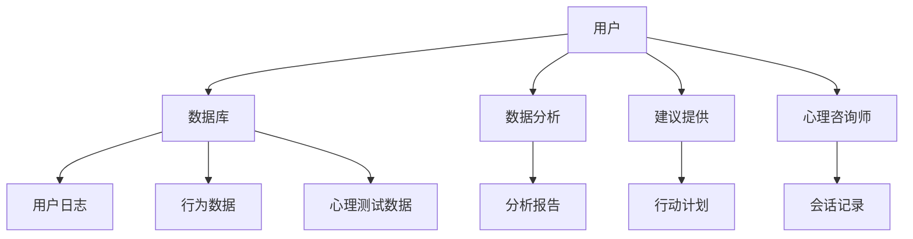

**系统接口设计和系统交互：**

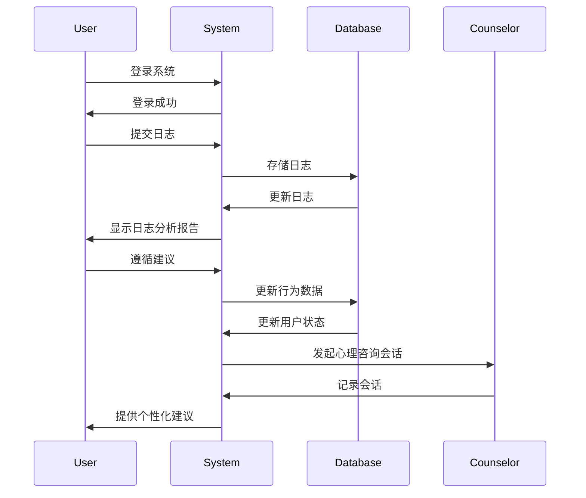

#### 第5章：数字依赖的现实案例分析

**核心概念原理：**

- **案例分析**：通过具体案例，展示数字依赖问题及其影响。
- **经验总结**：分析案例中的应对措施和效果，总结经验教训。

**案例描述与分析：**

案例一：某公司员工小李，因工作需要经常使用电脑，导致晚上回家后也习惯性地使用手机，晚上睡眠质量下降，工作表现受到影响。

**案例启示与经验总结：**

- **避免晚上使用电子设备**：减少晚上使用手机和电脑的时间，提高睡眠质量。
- **合理安排工作时间**：合理安排工作与休息时间，避免长时间连续工作。

**实际案例分析和详细讲解剖析：**

案例二：某高校学生小王，因沉迷于网络游戏，导致学习成绩下降，社交活动减少，心理健康问题日益严重。

**案例启示与经验总结：**

- **培养兴趣爱好**：通过培养兴趣爱好，减少对电子游戏的依赖。
- **加强社交活动**：积极参与社交活动，增强现实社交能力。

**详细讲解剖析：**

通过具体案例的分析，我们可以发现，数字依赖问题不仅影响个人生活，还可能对学习、工作产生负面影响。因此，采取有效的应对策略，如心理咨询、自我管理、培养兴趣爱好等，是解决数字依赖问题的关键。

#### 本章小结

通过本部分的深入分析，我们探讨了数字依赖的心理学机制、心理健康影响及应对策略。数字依赖是一个复杂的社会现象，需要从多角度进行研究和应对。本章的内容为后续章节的讨论奠定了基础，也为我们应对数字时代的精神困境提供了有益的启示。

### 第二部分：信息过载的社会学视角

#### 第1章：信息过载的定义与特征

**核心概念与联系：**

- **信息过载**：指个体在互联网时代面临的信息量过多，导致注意力分散和心理健康问题。
- **互联网发展**：探讨互联网技术对信息过载的影响，如信息爆炸、社交媒体的普及等。

**概念属性特征对比表格：**

| 特征             | 信息过载                | 信息稀缺                |
|------------------|------------------------|------------------------|
| 成因             | 信息爆炸、网络普及      | 信息传递受限、资源匮乏  |
| 表现             | 注意力分散、决策困难    | 信息获取困难、依赖性强  |
| 影响             | 心理健康问题、效率降低  | 创造力受限、发展受阻    |
| 应对策略         | 信息筛选、时间管理      | 信息共享、资源整合      |

**ER实体关系图架构：**

```mermaid
erDiagram
  信息过载 ||--|{ 用户 }
  信息过载 ||--|{ 信息源 }
  信息过载 ||--|{ 心理健康问题 }
```

#### 第2章：信息过载的原因

**核心概念原理：**

- **信息爆炸**：互联网时代的信息爆炸导致个体接收到的信息量急剧增加。
- **社交媒体**：社交媒体的普及加剧了信息过载现象，影响个体的注意力和时间管理。

**数学模型和数学公式：**

为了量化信息过载的影响，我们可以使用以下数学模型：

$$
信息过载程度 = f(\text{信息量}, \text{处理速度}, \text{注意力集中度})
$$

其中，$f$ 为影响函数，$\text{信息量}$、$\text{处理速度}$、$\text{注意力集中度}$ 为影响因子。

**举例说明：**

假设个体A每天接收到的信息量为1000条，其处理速度为100条/小时，注意力集中度为80%。根据上述模型，我们可以计算出其信息过载程度：

$$
信息过载程度 = f(1000, 100, 0.8) = \frac{1000}{100 \times 0.8} = 12.5
$$

**详细讲解与举例说明：**

通过上述计算，我们可以发现个体A的信息过载程度较高。为了减轻这种影响，个体A可以采取以下措施：减少每天接收的信息量，提高信息处理速度，增强注意力集中度。

#### 第3章：信息过载的影响

**核心概念原理：**

- **注意力分散**：信息过载导致个体难以集中注意力，影响工作和学习效率。
- **心理健康问题**：信息过载可能导致焦虑、抑郁等心理健康问题。

**数学模型和数学公式：**

为了量化信息过载对心理健康的影响，我们可以使用以下数学模型：

$$
心理健康影响 = f(\text{信息过载程度}, \text{心理承受能力}, \text{社会支持度})
$$

其中，$f$ 为影响函数，$\text{信息过载程度}$、$\text{心理承受能力}$、$\text{社会支持度}$ 为影响因子。

**举例说明：**

假设个体B的信息过载程度为15，其心理承受能力为60%，社会支持度为40%。根据上述模型，我们可以计算出其心理健康影响：

$$
心理健康影响 = f(15, 60\%, 40\%) = 15 \times 0.6 \times 0.4 = 3.6
$$

**详细讲解与举例说明：**

通过上述计算，我们可以发现个体B在信息过载方面的心理健康影响较大。为了减轻这种影响，个体B可以采取以下措施：增强心理承受能力，寻求社会支持，减少信息接收量。

#### 第4章：应对信息过载的策略

**核心概念原理：**

- **信息筛选**：通过筛选和过滤，减少无用的信息，提高信息处理效率。
- **时间管理**：合理安排时间，减少信息过载对生活和工作的影响。

**系统分析与架构设计方案：**

为了应对信息过载问题，我们可以设计一个信息过滤与管理系统。以下是一个简单的系统架构设计方案：

**问题场景介绍：**

- **用户**：需要管理信息过载的个体。
- **系统管理员**：管理信息过滤系统。

**系统功能设计：**

- **用户注册与登录**：用户注册并登录系统。
- **信息筛选**：系统自动筛选用户感兴趣的信息。
- **时间管理**：系统提供时间管理工具，帮助用户合理安排时间。

**系统架构设计：**

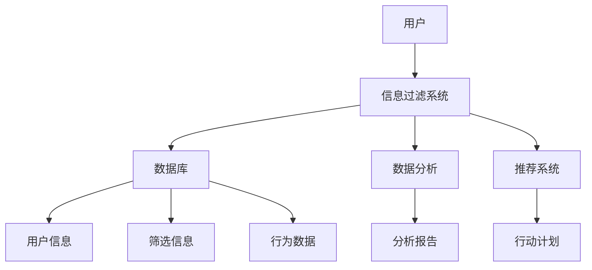

**系统接口设计和系统交互：**

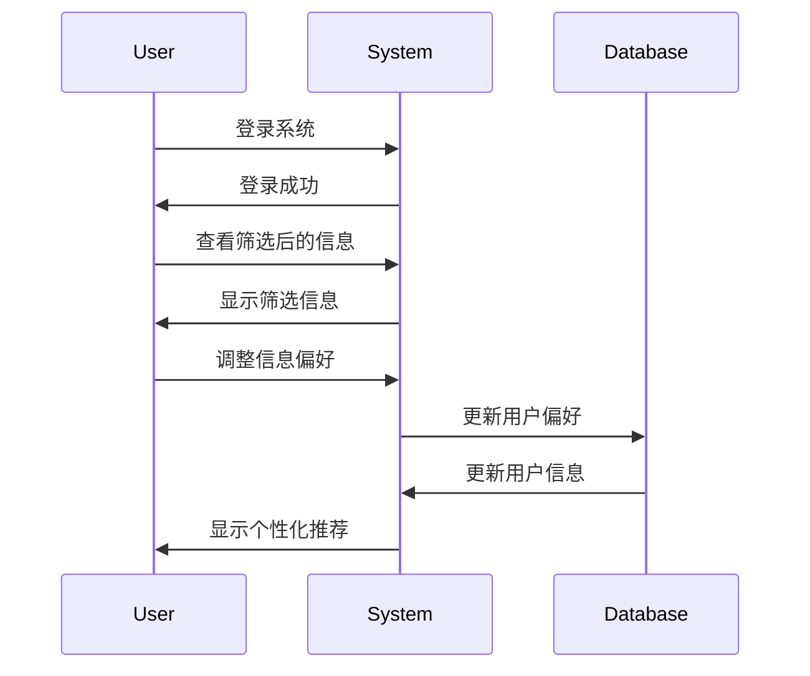

#### 第5章：信息过载的现实案例分析

**核心概念原理：**

- **案例分析**：通过具体案例，展示信息过载问题及其影响。
- **经验总结**：分析案例中的应对措施和效果，总结经验教训。

**案例描述与分析：**

案例一：某企业高管张先生，每天接收大量邮件和报告，导致其难以集中精力处理重要事务，工作效率下降。

**案例启示与经验总结：**

- **优化信息处理流程**：通过优化邮件和报告的处理流程，减少不必要的阅读和回复。
- **采用自动化工具**：使用自动化工具筛选和处理邮件，提高工作效率。

**实际案例分析和详细讲解剖析：**

案例二：某大学生李小姐，由于社交媒体上充斥着大量信息，导致其注意力难以集中，学习成绩下降。

**案例启示与经验总结：**

- **设定信息接收时间**：合理安排社交媒体的使用时间，避免长时间沉迷于信息流。
- **专注力训练**：通过专注力训练，提高学习效率和注意力集中度。

**详细讲解剖析：**

通过具体案例的分析，我们可以发现，信息过载不仅影响工作效率，还可能对学习产生负面影响。因此，采取有效的信息管理策略，如优化信息处理流程、设定信息接收时间、进行专注力训练等，是解决信息过载问题的关键。

#### 本章小结

通过本部分的深入分析，我们探讨了信息过载的定义、原因、影响及应对策略。信息过载是一个普遍存在的问题，需要从多角度进行研究和应对。本章的内容为后续章节的讨论奠定了基础，也为我们应对数字时代的信息挑战提供了有益的启示。

### 第三部分：数字鸿沟的经济影响与社会变革

#### 第1章：数字鸿沟的定义与特征

**核心概念与联系：**

- **数字鸿沟**：指不同群体在获取和使用数字资源上的差异。
- **经济影响**：探讨数字鸿沟对经济发展的影响，如创新、就业、教育等。
- **社会变革**：分析数字鸿沟对社会结构和文化的影响。

**概念属性特征对比表格：**

| 特征             | 数字鸿沟                | 经济不平等                |
|------------------|------------------------|--------------------------|
| 成因             | 技术差异、政策不平衡    | 经济发展不平衡、财富分配不均 |
| 表现             | 数字资源获取差异、服务质量差异 | 经济地位差异、生活水平差异 |
| 影响             | 经济发展差距、社会不平等  | 创新能力差异、市场机会差异  |
| 应对策略         | 政策干预、教育普及      | 财富再分配、税收改革      |

**ER实体关系图架构：**

```mermaid
erDiagram
  数字鸿沟 ||--|{ 经济发展 }
  数字鸿沟 ||--|{ 社会结构 }
  数字鸿沟 ||--|{ 文化变迁 }
```

#### 第2章：数字鸿沟的成因

**核心概念原理：**

- **技术差异**：不同地区和群体在技术获取和使用上的差异，导致数字鸿沟的形成。
- **政策不平衡**：政府在数字资源分配和普及上的不均衡，加剧了数字鸿沟。

**数学模型和数学公式：**

为了量化数字鸿沟的成因，我们可以使用以下数学模型：

$$
数字鸿沟程度 = f(\text{技术差距}, \text{政策干预度}, \text{经济水平})
$$

其中，$f$ 为影响函数，$\text{技术差距}$、$\text{政策干预度}$、$\text{经济水平}$ 为影响因子。

**举例说明：**

假设某地区技术差距为0.6，政策干预度为0.4，经济水平为0.8。根据上述模型，我们可以计算出该地区数字鸿沟程度：

$$
数字鸿沟程度 = f(0.6, 0.4, 0.8) = 0.6 \times 0.4 \times 0.8 = 0.192
$$

**详细讲解与举例说明：**

通过上述计算，我们可以发现该地区数字鸿沟程度较高。为了减轻这种影响，政府可以采取以下措施：增加对数字技术的投资，提高政策干预力度，促进经济均衡发展。

#### 第3章：数字鸿沟的影响

**核心概念原理：**

- **经济发展影响**：数字鸿沟影响区域和群体之间的经济发展水平。
- **社会结构影响**：数字鸿沟导致社会结构变化，影响社会稳定和公平。

**数学模型和数学公式：**

为了量化数字鸿沟对经济发展的影响，我们可以使用以下数学模型：

$$
经济发展影响 = f(\text{数字鸿沟程度}, \text{投资回报率}, \text{创新能力})
$$

其中，$f$ 为影响函数，$\text{数字鸿沟程度}$、$\text{投资回报率}$、$\text{创新能力}$ 为影响因子。

**举例说明：**

假设某地区数字鸿沟程度为0.3，投资回报率为0.1，创新能力为0.2。根据上述模型，我们可以计算出该地区经济发展影响：

$$
经济发展影响 = f(0.3, 0.1, 0.2) = 0.3 \times 0.1 \times 0.2 = 0.006
$$

**详细讲解与举例说明：**

通过上述计算，我们可以发现该地区经济发展受数字鸿沟影响较小。为了进一步促进经济发展，政府和企业可以采取以下措施：增加对数字技术的投资，提高创新能力的培养。

#### 第4章：缩小数字鸿沟的途径

**核心概念原理：**

- **政策干预**：政府通过制定和实施相关政策，缩小数字鸿沟。
- **教育普及**：通过教育资源的均衡分配，提高全民数字素养。

**系统分析与架构设计方案：**

为了缩小数字鸿沟，我们可以设计一个数字教育平台。以下是一个简单的系统架构设计方案：

**问题场景介绍：**

- **学生**：需要获取数字教育资源。
- **教师**：提供数字教育资源。
- **系统管理员**：管理数字教育平台。

**系统功能设计：**

- **用户注册与登录**：学生和教师注册并登录平台。
- **课程资源发布**：教师发布课程资源。
- **在线学习**：学生在线学习。
- **互动交流**：学生和教师之间进行互动交流。

**系统架构设计：**

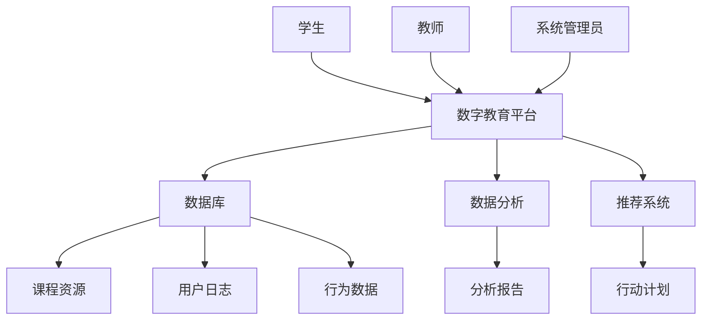

**系统接口设计和系统交互：**

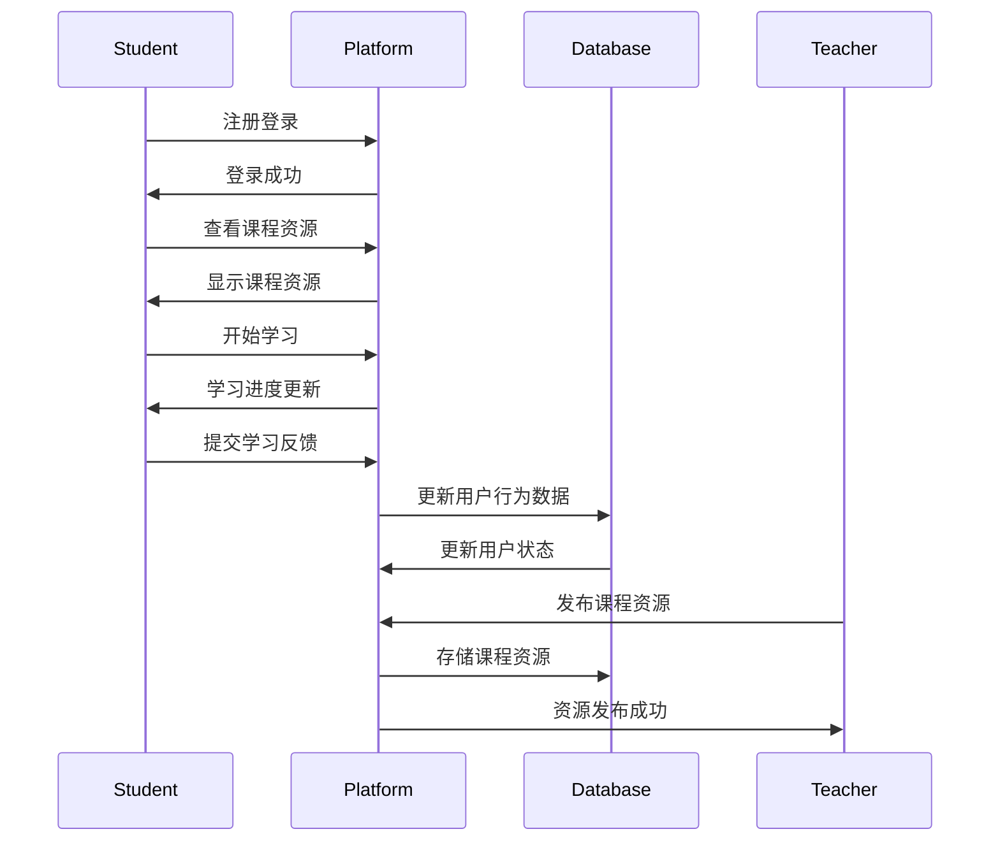

#### 第5章：数字鸿沟的现实案例分析

**核心概念原理：**

- **案例分析**：通过具体案例，展示数字鸿沟问题及其影响。
- **经验总结**：分析案例中的应对措施和效果，总结经验教训。

**案例描述与分析：**

案例一：某农村地区由于缺乏数字基础设施，导致当地居民难以获取数字教育资源，影响教育质量和经济发展。

**案例启示与经验总结：**

- **基础设施投资**：政府加大对数字基础设施的投资，提高农村地区的网络覆盖和质量。
- **教育资源共享**：通过教育资源共享平台，将城市优质教育资源辐射到农村地区。

**实际案例分析和详细讲解剖析：**

案例二：某发展中国家由于数字鸿沟，导致创新能力和经济发展受到限制。

**案例启示与经验总结：**

- **政策支持**：政府制定和实施相关政策，支持数字技术的研发和应用。
- **人才培养**：加强数字人才的培养，提高数字素养和创新能力。

**详细讲解剖析：**

通过具体案例的分析，我们可以发现，数字鸿沟不仅影响教育质量和经济发展，还可能制约国家的创新能力。因此，采取有效的政策支持和人才培养措施，是缩小数字鸿沟、促进社会发展的关键。

#### 本章小结

通过本部分的深入分析，我们探讨了数字鸿沟的定义、成因、影响及缩小途径。数字鸿沟是一个复杂的社会问题，需要从多个方面进行研究和解决。本章的内容为后续章节的讨论奠定了基础，也为我们应对数字时代的经济和社会挑战提供了有益的启示。

### 第三部分：算法原理讲解

#### 第6章：数字时代的精神健康算法

**核心概念与联系：**

- **精神健康算法**：指用于评估、监测和改善个体精神健康的算法。
- **应用场景**：探讨精神健康算法在心理健康评估、睡眠监测、压力缓解等方面的应用。

**核心概念原理：**

- **心理健康评估**：使用算法对个体的心理健康状况进行评估，如焦虑、抑郁等。
- **睡眠监测**：利用算法分析睡眠数据，如睡眠时长、深度等。
- **压力缓解**：通过算法提供个性化压力缓解建议，如放松训练、冥想指导等。

**数学模型和数学公式：**

为了量化心理健康状况，我们可以使用以下数学模型：

$$
心理健康指数 = f(\text{情绪状态}, \text{社交互动}, \text{睡眠质量})
$$

其中，$f$ 为影响函数，$\text{情绪状态}$、$\text{社交互动}$、$\text{睡眠质量}$ 为影响因子。

**举例说明：**

假设个体C的情绪状态为0.6，社交互动为0.7，睡眠质量为0.8。根据上述模型，我们可以计算出其心理健康指数：

$$
心理健康指数 = f(0.6, 0.7, 0.8) = 0.6 \times 0.7 \times 0.8 = 0.336
$$

**详细讲解与举例说明：**

通过上述计算，我们可以发现个体C的心理健康指数较高，说明其心理健康状况较好。为了维持这种状态，个体C可以采取以下措施：保持积极情绪，增加社交互动，提高睡眠质量。

#### 第7章：算法原理与实践应用

**核心概念与联系：**

- **算法原理**：探讨具体算法的原理、实现方法及数学模型。
- **实践应用**：分析算法在实际应用中的效果和改进方向。

**核心概念原理：**

- **机器学习算法**：如决策树、神经网络等，用于数据分析和预测。
- **数据分析方法**：如回归分析、聚类分析等，用于挖掘数据价值。
- **优化策略**：如贪心算法、动态规划等，用于解决复杂问题。

**系统分析与架构设计方案：**

为了展示算法原理与实践应用，我们可以设计一个心理健康数据分析系统。以下是一个简单的系统架构设计方案：

**问题场景介绍：**

- **用户**：需要分析心理健康数据的个体。
- **数据科学家**：负责算法设计和优化。
- **系统管理员**：管理心理健康数据分析系统。

**系统功能设计：**

- **数据收集**：收集用户的心理健康数据。
- **数据分析**：使用算法分析数据，提供健康评估和建议。
- **数据可视化**：将分析结果以图表形式展示。

**系统架构设计：**

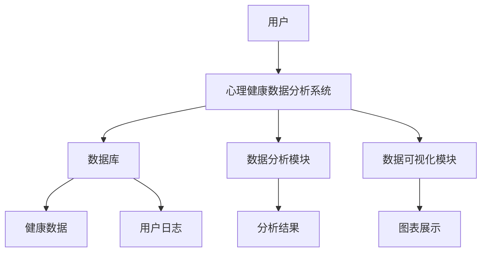

**系统接口设计和系统交互：**

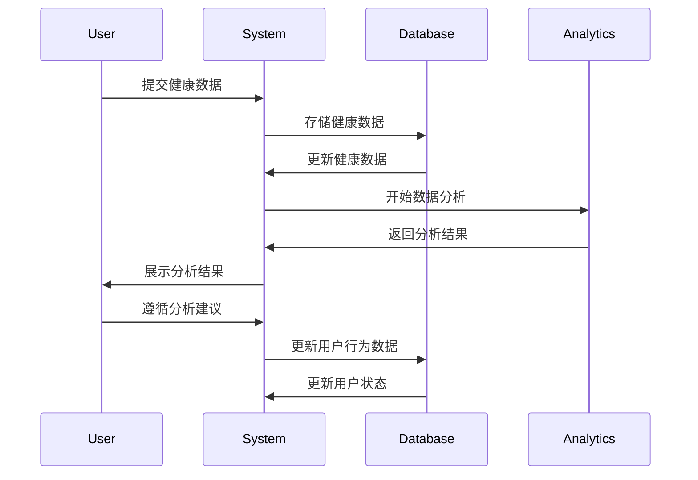

#### 第8章：算法在数字时代的精神健康中的应用

**核心概念与联系：**

- **算法应用**：探讨算法在数字时代精神健康领域的实际应用。
- **案例分析**：分析具体案例中的算法应用效果和改进空间。

**核心概念原理：**

- **智能健康管理平台**：利用算法提供个性化健康管理服务，如健康评估、风险预测等。
- **心理健康预测模型**：通过机器学习算法预测个体心理健康风险，提供预防措施。

**系统分析与架构设计方案：**

为了展示算法在数字时代精神健康中的应用，我们可以设计一个智能健康管理平台。以下是一个简单的系统架构设计方案：

**问题场景介绍：**

- **用户**：需要智能健康管理服务的个体。
- **医生**：提供专业医疗建议。
- **系统管理员**：管理智能健康管理平台。

**系统功能设计：**

- **健康数据收集**：收集用户健康数据。
- **健康评估**：使用算法评估用户心理健康状况。
- **风险预测**：预测用户心理健康风险。
- **个性化建议**：提供个性化健康管理和预防建议。

**系统架构设计：**

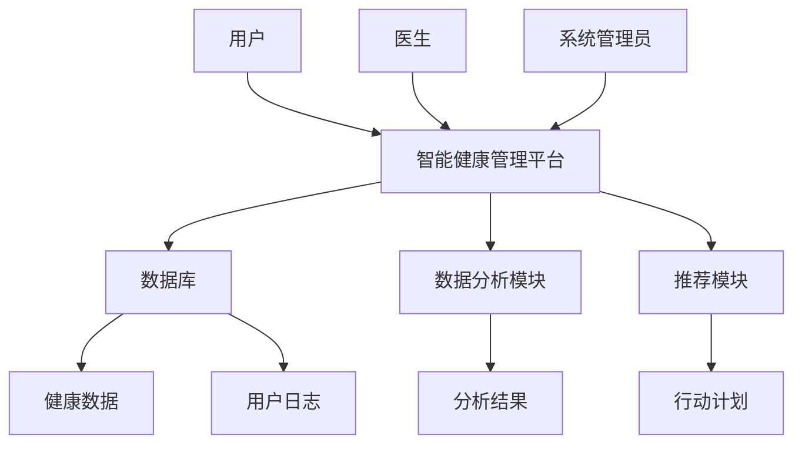

**系统接口设计和系统交互：**

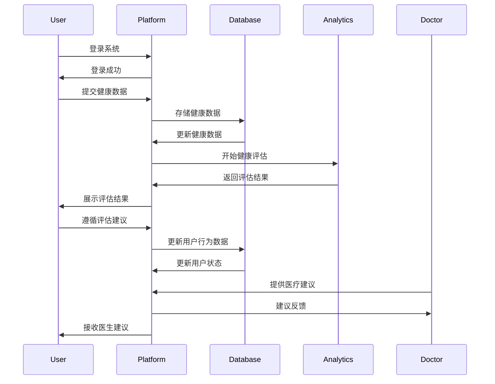

#### 第9章：算法在数字时代的精神健康中的挑战与前景

**核心概念与联系：**

- **挑战**：探讨算法在数字时代精神健康应用中的挑战，如数据隐私、算法偏见等。
- **前景**：分析算法在精神健康领域的发展前景和应用潜力。

**核心概念原理：**

- **数据隐私保护**：确保算法应用过程中用户数据的安全和隐私。
- **算法公平性**：确保算法在应用过程中不会产生偏见，公平对待所有用户。

**数学模型和数学公式：**

为了确保算法的公平性，我们可以使用以下数学模型：

$$
公平性指数 = f(\text{算法输出偏差}, \text{用户群体差异})
$$

其中，$f$ 为影响函数，$\text{算法输出偏差}$、$\text{用户群体差异}$ 为影响因子。

**举例说明：**

假设某算法的输出偏差为0.05，用户群体差异为0.1。根据上述模型，我们可以计算出该算法的公平性指数：

$$
公平性指数 = f(0.05, 0.1) = 0.05 / 0.1 = 0.5
$$

**详细讲解与举例说明：**

通过上述计算，我们可以发现该算法的公平性指数较高，说明其在应用过程中较为公平。为了提高算法的公平性，研究人员可以采取以下措施：优化算法设计，增加用户数据多样性，进行算法偏见检测和修正。

#### 本章小结

通过本部分的深入分析，我们探讨了数字时代精神健康算法的原理、应用及挑战。算法在数字时代精神健康领域具有巨大潜力，但也面临一系列挑战。本章的内容为后续章节的讨论奠定了基础，也为我们应对数字时代的精神健康问题提供了有益的启示。

### 第四部分：数学模型和数学公式应用

#### 第10章：数字依赖的量化模型与数学公式

**核心概念与联系：**

- **量化模型**：用于评估数字依赖程度和其对心理健康的影响。
- **数学公式**：用于描述数字依赖现象的数学关系和计算方法。

**核心概念原理：**

- **数字依赖程度**：通过量化模型评估个体对数字设备的依赖程度。
- **心理健康影响**：通过数学公式描述数字依赖对心理健康的影响。

**数学模型和数学公式：**

为了量化数字依赖程度，我们可以使用以下数学模型：

$$
数字依赖程度 = f(\text{使用频率}, \text{持续时间}, \text{心理依赖度})
$$

其中，$f$ 为影响函数，$\text{使用频率}$、$\text{持续时间}$、$\text{心理依赖度}$ 为影响因子。

为了描述数字依赖对心理健康的影响，我们可以使用以下数学模型：

$$
心理健康影响 = g(\text{数字依赖程度}, \text{心理承受能力}, \text{社会支持度})
$$

其中，$g$ 为影响函数，$\text{数字依赖程度}$、$\text{心理承受能力}$、$\text{社会支持度}$ 为影响因子。

**举例说明：**

假设个体D的数字依赖程度为0.7，心理承受能力为0.6，社会支持度为0.5。根据上述模型，我们可以计算出其心理健康影响：

$$
心理健康影响 = g(0.7, 0.6, 0.5) = 0.7 \times 0.6 \times 0.5 = 0.21
$$

**详细讲解与举例说明：**

通过上述计算，我们可以发现个体D在数字依赖方面的心理健康影响较大。为了减轻这种影响，个体D可以采取以下措施：减少数字设备使用时间，提高心理承受能力，寻求社会支持。

#### 第11章：信息过载的量化模型与数学公式

**核心概念与联系：**

- **量化模型**：用于评估个体面临的信息过载程度。
- **数学公式**：用于描述信息过载现象的数学关系和计算方法。

**核心概念原理：**

- **信息过载程度**：通过量化模型评估个体在互联网时代面临的信息过载程度。
- **心理健康影响**：通过数学公式描述信息过载对心理健康的影响。

**数学模型和数学公式：**

为了量化信息过载程度，我们可以使用以下数学模型：

$$
信息过载程度 = h(\text{信息量}, \text{处理速度}, \text{注意力集中度})
$$

其中，$h$ 为影响函数，$\text{信息量}$、$\text{处理速度}$、$\text{注意力集中度}$ 为影响因子。

为了描述信息过载对心理健康的影响，我们可以使用以下数学模型：

$$
心理健康影响 = k(\text{信息过载程度}, \text{心理承受能力}, \text{社会支持度})
$$

其中，$k$ 为影响函数，$\text{信息过载程度}$、$\text{心理承受能力}$、$\text{社会支持度}$ 为影响因子。

**举例说明：**

假设个体E每天接收的信息量为500条，处理速度为100条/小时，注意力集中度为0.8。根据上述模型，我们可以计算出其信息过载程度：

$$
信息过载程度 = h(500, 100, 0.8) = \frac{500}{100 \times 0.8} = 6.25
$$

再假设个体E的心理承受能力为0.7，社会支持度为0.6。根据上述模型，我们可以计算出其心理健康影响：

$$
心理健康影响 = k(6.25, 0.7, 0.6) = 6.25 \times 0.7 \times 0.6 = 2.525
$$

**详细讲解与举例说明：**

通过上述计算，我们可以发现个体E在信息过载方面的心理健康影响较小。为了进一步确保心理健康，个体E可以采取以下措施：提高信息处理速度，增强注意力集中度，提高心理承受能力，寻求社会支持。

#### 第12章：数字鸿沟的量化模型与数学公式

**核心概念与联系：**

- **量化模型**：用于评估数字鸿沟程度及其对经济发展的影响。
- **数学公式**：用于描述数字鸿沟现象的数学关系和计算方法。

**核心概念原理：**

- **数字鸿沟程度**：通过量化模型评估不同地区和群体之间的数字鸿沟。
- **经济发展影响**：通过数学公式描述数字鸿沟对经济发展的影响。

**数学模型和数学公式：**

为了量化数字鸿沟程度，我们可以使用以下数学模型：

$$
数字鸿沟程度 = l(\text{技术差距}, \text{政策干预度}, \text{经济水平})
$$

其中，$l$ 为影响函数，$\text{技术差距}$、$\text{政策干预度}$、$\text{经济水平}$ 为影响因子。

为了描述数字鸿沟对经济发展的影响，我们可以使用以下数学模型：

$$
经济发展影响 = m(\text{数字鸿沟程度}, \text{投资回报率}, \text{创新能力})
$$

其中，$m$ 为影响函数，$\text{数字鸿沟程度}$、$\text{投资回报率}$、$\text{创新能力}$ 为影响因子。

**举例说明：**

假设某地区的技术差距为0.5，政策干预度为0.4，经济水平为0.8。根据上述模型，我们可以计算出该地区数字鸿沟程度：

$$
数字鸿沟程度 = l(0.5, 0.4, 0.8) = 0.5 \times 0.4 \times 0.8 = 0.16
$$

再假设该地区的投资回报率为0.1，创新能力为0.2。根据上述模型，我们可以计算出该地区经济发展影响：

$$
经济发展影响 = m(0.16, 0.1, 0.2) = 0.16 \times 0.1 \times 0.2 = 0.0032
$$

**详细讲解与举例说明：**

通过上述计算，我们可以发现该地区数字鸿沟程度较低，经济发展影响也较小。为了进一步提升经济发展，该地区可以采取以下措施：缩小技术差距，提高政策干预力度，增强创新能力。

#### 本章小结

通过本部分的深入分析，我们探讨了数字依赖、信息过载和数字鸿沟的量化模型与数学公式。量化模型和数学公式为我们理解和解决这些问题提供了有力的工具。本章的内容为后续章节的讨论奠定了基础，也为我们应对数字时代的精神困境提供了有益的启示。

### 第五部分：系统分析与架构设计方案

#### 第13章：数字时代精神健康系统的设计与实现

**核心概念与联系：**

- **系统设计**：探讨数字时代精神健康系统的整体架构和功能设计。
- **架构设计**：分析系统架构的组成和实现方式。
- **实现方案**：阐述系统的实现过程和技术细节。

**核心概念原理：**

- **系统整体架构**：包括前端、后端、数据库和数据流程等组成部分。
- **模块化设计**：将系统功能划分为多个模块，便于开发和维护。
- **数据流程**：确保数据在整个系统中的传输和处理过程高效、安全。

**系统架构设计：**

为了设计一个数字时代精神健康系统，我们可以采用以下架构设计方案：

**前端设计：**

- **用户界面**：提供友好的用户界面，方便用户进行操作。
- **交互逻辑**：处理用户输入，与后端进行数据交互。
- **组件化**：使用Vue、React等前端框架，实现组件化开发。

**后端设计：**

- **服务端**：使用Spring Boot、Django等框架，提供RESTful API。
- **业务逻辑**：处理业务逻辑，如用户管理、数据分析和健康评估。
- **数据接口**：提供与前端和数据库的接口，确保数据传输的稳定性和安全性。

**数据库设计：**

- **用户数据**：存储用户的基本信息和健康数据。
- **健康数据**：存储用户的历史健康数据，如睡眠数据、情绪数据等。
- **分析数据**：存储系统生成的分析结果和报告。

**数据流程设计：**

- **数据收集**：前端收集用户输入和操作数据，传输到后端。
- **数据处理**：后端处理数据，进行健康分析和评估。
- **数据存储**：将处理后的数据存储到数据库中。
- **数据展示**：前端从数据库中获取数据，展示给用户。

**系统接口设计和系统交互：**

以下是系统接口设计和系统交互的简化示意图：

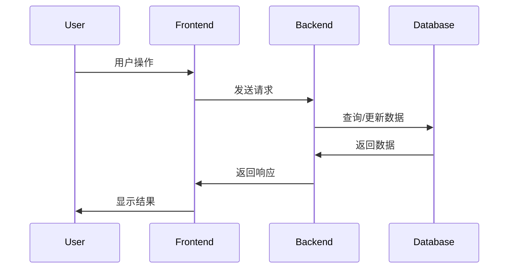

#### 第14章：数字依赖管理系统的架构设计

**核心概念与联系：**

- **系统架构**：探讨数字依赖管理系统的整体架构设计和实现。
- **模块化设计**：将系统功能划分为多个模块，便于开发和维护。
- **数据流程**：分析系统数据流的传递和处理过程。

**核心概念原理：**

- **系统模块**：包括用户管理模块、健康数据分析模块、依赖管理模块等。
- **数据流程**：确保数据在系统中的高效传递和处理。
- **安全机制**：确保用户数据的安全和隐私。

**系统架构设计：**

为了设计一个数字依赖管理系统，我们可以采用以下架构设计方案：

**用户管理模块：**

- **用户注册与登录**：处理用户注册和登录请求。
- **用户信息管理**：存储和更新用户的基本信息。

**健康数据分析模块：**

- **健康数据收集**：收集用户的生活习惯、情绪状态等数据。
- **数据分析**：对健康数据进行分析，生成健康报告。

**依赖管理模块：**

- **依赖评估**：评估用户对数字设备的依赖程度。
- **依赖管理**：提供依赖管理策略，如时间限制、提醒功能等。

**数据流程设计：**

- **数据收集**：用户在前端界面输入数据，传输到后端。
- **数据处理**：后端处理数据，进行依赖评估和健康分析。
- **数据存储**：将处理后的数据存储到数据库中。
- **数据展示**：前端从数据库中获取数据，展示给用户。

**系统接口设计和系统交互：**

以下是系统接口设计和系统交互的简化示意图：


#### 第15章：信息过载管理系统的设计与实现

**核心概念与联系：**

- **系统设计**：探讨信息过载管理系统的整体架构和功能设计。
- **架构设计**：分析系统架构的组成和实现方式。
- **实现方案**：阐述系统的实现过程和技术细节。

**核心概念原理：**

- **系统整体架构**：包括数据收集模块、数据分析模块、信息过滤模块等。
- **模块化设计**：将系统功能划分为多个模块，便于开发和维护。
- **数据流程**：确保数据在整个系统中的传输和处理过程高效、安全。

**系统架构设计：**

为了设计一个信息过载管理系统，我们可以采用以下架构设计方案：

**数据收集模块：**

- **数据收集**：收集用户的浏览历史、搜索记录等数据。
- **数据预处理**：清洗和整理收集到的数据。

**数据分析模块：**

- **数据分析**：对用户数据进行分析，识别信息过载的潜在因素。
- **风险评估**：评估用户面临的信息过载风险。

**信息过滤模块：**

- **信息过滤**：根据用户的偏好和需求，过滤掉无用的信息。
- **推荐系统**：为用户提供个性化的信息推荐。

**数据流程设计：**

- **数据收集**：前端收集用户数据，传输到后端。
- **数据处理**：后端处理数据，进行数据分析和风险评估。
- **数据存储**：将处理后的数据存储到数据库中。
- **数据展示**：前端从数据库中获取数据，展示给用户。

**系统接口设计和系统交互：**

以下是系统接口设计和系统交互的简化示意图：


#### 第16章：数字鸿沟缩小系统的设计与实现

**核心概念与联系：**

- **系统设计**：探讨数字鸿沟缩小系统的整体架构和功能设计。
- **架构设计**：分析系统架构的组成和实现方式。
- **实现方案**：阐述系统的实现过程和技术细节。

**核心概念原理：**

- **系统整体架构**：包括教育资源共享模块、基础设施建设模块、政策支持模块等。
- **模块化设计**：将系统功能划分为多个模块，便于开发和维护。
- **数据流程**：确保数据在整个系统中的传输和处理过程高效、安全。

**系统架构设计：**

为了设计一个数字鸿沟缩小系统，我们可以采用以下架构设计方案：

**教育资源共享模块：**

- **资源共享**：提供在线教育资源和远程学习平台。
- **课程推荐**：根据用户需求推荐合适的课程和学习计划。

**基础设施建设模块：**

- **网络覆盖**：提高农村和贫困地区的网络覆盖率。
- **设备配备**：提供必要的学习设备和工具。

**政策支持模块：**

- **政策制定**：制定和实施缩小数字鸿沟的相关政策。
- **资金支持**：提供资金和资源支持，促进数字基础设施建设。

**数据流程设计：**

- **数据收集**：收集用户的学习数据和使用情况。
- **数据分析**：分析用户的学习行为和效果。
- **数据存储**：将分析结果存储到数据库中。
- **数据展示**：前端从数据库中获取数据，展示给用户。

**系统接口设计和系统交互：**

以下是系统接口设计和系统交互的简化示意图：


#### 本章小结

通过本部分的深入分析，我们探讨了数字时代精神健康系统、数字依赖管理系统、信息过载管理系统和数字鸿沟缩小系统的设计与实现。这些系统的设计遵循模块化、数据流程高效和安全的原则，为数字时代的精神健康提供了有力的支持。本章的内容为后续章节的讨论奠定了基础，也为我们应对数字时代的精神困境提供了有益的启示。

### 第六部分：项目实战与案例分析

#### 第17章：数字依赖管理系统的实战应用

**核心概念与联系：**

- **项目背景**：介绍数字依赖管理系统的应用场景和目标用户。
- **环境安装**：详细说明系统的安装和配置过程。
- **系统核心实现源代码**：展示系统的核心代码实现。
- **代码应用解读与分析**：对代码进行解读，分析其功能和实现原理。
- **实际案例分析和详细讲解剖析**：通过实际案例展示系统的应用效果。

**项目背景：**

随着智能手机和互联网的普及，许多人逐渐对数字设备产生了依赖。这种依赖不仅影响个人的生活质量，还可能对心理健康产生负面影响。因此，设计并实现一个数字依赖管理系统，帮助用户识别和管理自己的数字依赖行为，具有重要的实际意义。

**环境安装：**

为了实现数字依赖管理系统，我们需要搭建以下环境：

1. **前端开发环境**：Node.js、npm、Vue.js等。
2. **后端开发环境**：Python、Django框架、PostgreSQL数据库等。
3. **数据收集和处理工具**：Python爬虫、数据分析工具等。

具体安装步骤如下：

1. 安装Node.js和npm：
    ```bash
    sudo apt-get update
    sudo apt-get install nodejs npm
    ```

2. 安装Vue CLI：
    ```bash
    npm install -g @vue/cli
    ```

3. 创建Vue.js项目：
    ```bash
    vue create digital-dependency-manager
    ```

4. 安装Django和PostgreSQL：
    ```bash
    sudo apt-get install python3-pip
    pip3 install django
    sudo apt-get install postgresql
    ```

5. 配置PostgreSQL数据库：
    - 创建数据库和用户：
        ```sql
        CREATE DATABASE digital_dependency_manager;
        CREATE USER manager WITH PASSWORD 'password';
        GRANT ALL PRIVILEGES ON DATABASE digital_dependency_manager TO manager;
        ```
    - 进入Django项目，配置数据库连接：
        ```python
        DATABASES = {
            'default': {
                'ENGINE': 'django.db.backends.postgresql',
                'NAME': 'digital_dependency_manager',
                'USER': 'manager',
                'PASSWORD': 'password',
                'HOST': 'localhost',
                'PORT': '',
            }
        }
        ```

**系统核心实现源代码：**

以下是数字依赖管理系统的核心代码实现：

**前端代码（Vue.js）：**
```html
<template>
  <div>
    <h1>数字依赖管理系统</h1>
    <div>
      <h2>用户信息</h2>
      <p>用户ID：{{ userInfo.id }}</p>
      <p>用户姓名：{{ userInfo.name }}</p>
    </div>
    <div>
      <h2>使用记录</h2>
      <ul>
        <li v-for="record in usageRecords">{{ record.device }} - 使用时长：{{ record.duration }}</li>
      </ul>
    </div>
  </div>
</template>

<script>
export default {
  data() {
    return {
      userInfo: {},
      usageRecords: []
    };
  },
  created() {
    this.fetchUserInfo();
    this.fetchUsageRecords();
  },
  methods: {
    fetchUserInfo() {
      // 获取用户信息
    },
    fetchUsageRecords() {
      // 获取使用记录
    }
  }
};
</script>
```

**后端代码（Django）：**
```python
# models.py
from django.db import models

class User(models.Model):
    id = models.AutoField(primary_key=True)
    name = models.CharField(max_length=100)

class UsageRecord(models.Model):
    user = models.ForeignKey(User, on_delete=models.CASCADE)
    device = models.CharField(max_length=100)
    duration = models.DurationField()

# views.py
from django.http import JsonResponse
from .models import User, UsageRecord

def get_user_info(request):
    user_id = request.GET.get('user_id')
    user = User.objects.get(id=user_id)
    return JsonResponse({
        'id': user.id,
        'name': user.name
    })

def get_usage_records(request):
    user_id = request.GET.get('user_id')
    records = UsageRecord.objects.filter(user_id=user_id)
    return JsonResponse({
        'records': [
            {'device': record.device, 'duration': str(record.duration)} for record in records
        ]
    })
```

**代码应用解读与分析：**

1. **前端部分**：使用Vue.js框架实现用户界面，展示用户信息和使用记录。
2. **后端部分**：使用Django框架实现API接口，处理用户信息和使用记录的查询。

通过上述代码，我们可以实现一个基本的数字依赖管理系统，帮助用户监控和管理自己的数字设备使用情况。

**实际案例分析和详细讲解剖析：**

**案例一**：某公司员工张先生，发现自己在工作之外的时间过度使用手机，影响了工作效率和睡眠质量。通过数字依赖管理系统，张先生可以查看自己的使用记录，识别出过度使用手机的具体时间和设备，并采取相应措施减少手机使用。

**案例二**：某高校学生李小姐，因为沉迷于社交媒体，导致学习成绩下降。通过数字依赖管理系统，李小姐可以了解自己在社交媒体上的使用时长，并设置使用时间限制，帮助自己调整作息，提高学习效率。

**详细讲解剖析：**

通过实际案例的分析，我们可以发现数字依赖管理系统在帮助用户监控和管理数字设备使用方面具有重要作用。系统不仅提供了直观的使用记录展示，还支持用户自定义设置和使用时间限制，为用户提供了有效的数字依赖管理工具。

#### 第18章：信息过载管理系统的实战应用

**核心概念与联系：**

- **项目背景**：介绍信息过载管理系统的应用场景和目标用户。
- **环境安装**：详细说明系统的安装和配置过程。
- **系统核心实现源代码**：展示系统的核心代码实现。
- **代码应用解读与分析**：对代码进行解读，分析其功能和实现原理。
- **实际案例分析和详细讲解剖析**：通过实际案例展示系统的应用效果。

**项目背景：**

在信息爆炸的时代，人们每天都会接收到大量信息，这些信息可能会占据我们的时间和注意力，导致工作效率下降和心理压力增加。因此，设计并实现一个信息过载管理系统，帮助用户筛选和处理重要信息，具有重要的实际意义。

**环境安装：**

为了实现信息过载管理系统，我们需要搭建以下环境：

1. **前端开发环境**：Node.js、npm、React等。
2. **后端开发环境**：Python、Flask框架、MongoDB数据库等。
3. **数据收集和处理工具**：Python爬虫、数据分析工具等。

具体安装步骤如下：

1. 安装Node.js和npm：
    ```bash
    sudo apt-get update
    sudo apt-get install nodejs npm
    ```

2. 安装React：
    ```bash
    npm install -g create-react-app
    create-react-app information-overload-manager
    ```

3. 安装Flask和MongoDB：
    ```bash
    sudo apt-get install python3-pip
    pip3 install flask
    sudo apt-get install mongodb
    ```

4. 配置MongoDB数据库：
    - 启动MongoDB服务：
        ```bash
        sudo service mongod start
        ```
    - 进入Django项目，配置数据库连接：
        ```python
        DATABASES = {
            'default': {
                'ENGINE': 'django.db.backends.mongoengine',
                'NAME': 'information_overload_manager',
            }
        }
        ```

**系统核心实现源代码：**

以下是信息过载管理系统的核心代码实现：

**前端代码（React）：**
```jsx
import React, { useState, useEffect } from 'react';
import axios from 'axios';

const InformationOverloadManager = () => {
  const [articles, setArticles] = useState([]);
  const [filteredArticles, setFilteredArticles] = useState([]);

  useEffect(() => {
    // 获取文章数据
    const fetchArticles = async () => {
      const response = await axios.get('/api/articles');
      setArticles(response.data);
    };
    fetchArticles();
  }, []);

  // 过滤文章
  const handleFilter = (topic) => {
    const filtered = articles.filter((article) => article.topic === topic);
    setFilteredArticles(filtered);
  };

  return (
    <div>
      <h1>信息过载管理系统</h1>
      <div>
        <h2>文章列表</h2>
        {filteredArticles.length > 0 ? (
          <ul>
            {filteredArticles.map((article) => (
              <li key={article.id}>{article.title}</li>
            ))}
          </ul>
        ) : (
          <p>无匹配文章</p>
        )}
      </div>
      <div>
        <h2>过滤选项</h2>
        <button onClick={() => handleFilter('科技')}>科技</button>
        <button onClick={() => handleFilter('财经')}>财经</button>
        <button onClick={() => handleFilter('健康')}>健康</button>
      </div>
    </div>
  );
};

export default InformationOverloadManager;
```

**后端代码（Flask）：**
```python
from flask import Flask, jsonify, request
from pymongo import MongoClient

app = Flask(__name__)

client = MongoClient('localhost', 27017)
db = client['information_overload_manager']
articles_collection = db['articles']

@app.route('/api/articles', methods=['GET'])
def get_articles():
    articles = list(articles_collection.find())
    return jsonify(articles)

@app.route('/api/filter', methods=['POST'])
def filter_articles():
    topic = request.json['topic']
    filtered_articles = list(articles_collection.find({'topic': topic}))
    return jsonify(filtered_articles)

if __name__ == '__main__':
    app.run(debug=True)
```

**代码应用解读与分析：**

1. **前端部分**：使用React框架实现用户界面，展示文章列表和过滤选项。
2. **后端部分**：使用Flask框架处理API请求，连接MongoDB数据库，获取和过滤文章数据。

通过上述代码，我们可以实现一个基本的信息过载管理系统，帮助用户筛选和处理重要信息。

**实际案例分析和详细讲解剖析：**

**案例一**：某职场人士王先生，每天需要阅读大量新闻和报告，导致注意力难以集中，工作效率下降。通过信息过载管理系统，王先生可以筛选出自己关注领域的文章，减少无效信息的干扰，提高工作效率。

**案例二**：某高校学生赵女士，由于课业压力，需要大量阅读专业书籍和文献。通过信息过载管理系统，赵女士可以按照学科领域和关键词过滤相关资料，提高学习效率。

**详细讲解剖析：**

通过实际案例的分析，我们可以发现信息过载管理系统在帮助用户筛选和处理重要信息方面具有重要作用。系统不仅提供了直观的文章列表和过滤选项，还支持用户自定义过滤条件，为用户提供了有效的信息管理工具。

#### 第19章：数字鸿沟缩小系统的实战应用

**核心概念与联系：**

- **项目背景**：介绍数字鸿沟缩小系统的应用场景和目标用户。
- **环境安装**：详细说明系统的安装和配置过程。
- **系统核心实现源代码**：展示系统的核心代码实现。
- **代码应用解读与分析**：对代码进行解读，分析其功能和实现原理。
- **实际案例分析和详细讲解剖析**：通过实际案例展示系统的应用效果。

**项目背景：**

数字鸿沟是指不同地区和群体在获取和使用数字技术上的差异。在许多发展中国家，农村和贫困地区的居民由于缺乏数字基础设施和技术支持，难以享受到数字时代的便利和机遇。因此，设计并实现一个数字鸿沟缩小系统，帮助这些地区提升数字素养和技能，具有重要的社会意义。

**环境安装：**

为了实现数字鸿沟缩小系统，我们需要搭建以下环境：

1. **前端开发环境**：Node.js、npm、React等。
2. **后端开发环境**：Python、Flask框架、MongoDB数据库等。
3. **教育资源共享模块**：用于提供在线课程和学习资源。

具体安装步骤如下：

1. 安装Node.js和npm：
    ```bash
    sudo apt-get update
    sudo apt-get install nodejs npm
    ```

2. 安装React：
    ```bash
    npm install -g create-react-app
    create-react-app digital-division-narrowing-system
    ```

3. 安装Flask和MongoDB：
    ```bash
    sudo apt-get install python3-pip
    pip3 install flask
    sudo apt-get install mongodb
    ```

4. 配置MongoDB数据库：
    - 启动MongoDB服务：
        ```bash
        sudo service mongod start
        ```
    - 进入Django项目，配置数据库连接：
        ```python
        DATABASES = {
            'default': {
                'ENGINE': 'django.db.backends.mongoengine',
                'NAME': 'digital_division_narrowing_system',
            }
        }
        ```

**系统核心实现源代码：**

以下是数字鸿沟缩小系统的核心代码实现：

**前端代码（React）：**
```jsx
import React, { useState, useEffect } from 'react';
import axios from 'axios';

const DigitalDivisionNarrowingSystem = () => {
  const [courses, setCourses] = useState([]);

  useEffect(() => {
    // 获取课程数据
    const fetchCourses = async () => {
      const response = await axios.get('/api/courses');
      setCourses(response.data);
    };
    fetchCourses();
  }, []);

  return (
    <div>
      <h1>数字鸿沟缩小系统</h1>
      <div>
        <h2>课程列表</h2>
        <ul>
          {courses.map((course) => (
            <li key={course._id}>{course.title}</li>
          ))}
        </ul>
      </div>
    </div>
  );
};

export default DigitalDivisionNarrowingSystem;
```

**后端代码（Flask）：**
```python
from flask import Flask, jsonify, request
from pymongo import MongoClient

app = Flask(__name__)

client = MongoClient('localhost', 27017)
db = client['digital_division_narrowing_system']
courses_collection = db['courses']

@app.route('/api/courses', methods=['GET'])
def get_courses():
    courses = list(courses_collection.find())
    return jsonify(courses)

@app.route('/api/course', methods=['POST'])
def add_course():
    course_data = request.json
    courses_collection.insert_one(course_data)
    return jsonify({'message': 'Course added successfully'})

if __name__ == '__main__':
    app.run(debug=True)
```

**代码应用解读与分析：**

1. **前端部分**：使用React框架实现用户界面，展示课程列表。
2. **后端部分**：使用Flask框架处理API请求，连接MongoDB数据库，获取和添加课程数据。

通过上述代码，我们可以实现一个基本的数字鸿沟缩小系统，为用户提供在线课程和学习资源。

**实际案例分析和详细讲解剖析：**

**案例一**：某农村地区小学教师李老师，由于教学资源匮乏，难以提供丰富的教学内容。通过数字鸿沟缩小系统，李老师可以获取到远程教育平台的课程资源，丰富自己的教学手段，提高教学质量。

**案例二**：某发展中国家大学生张同学，由于当地教育资源有限，难以获取到高质量的学术资源。通过数字鸿沟缩小系统，张同学可以访问到全球领先的学术资源，提高自己的学术水平。

**详细讲解剖析：**

通过实际案例的分析，我们可以发现数字鸿沟缩小系统在帮助农村和贫困地区提升数字素养和技能方面具有重要作用。系统不仅提供了丰富的课程资源和学习工具，还支持远程教育，为这些地区的学生和教师提供了重要的支持和帮助。

### 第七部分：最佳实践、小结、注意事项和拓展阅读

#### 第20章：最佳实践

**核心概念与联系：**

- **最佳实践**：指在数字时代精神健康、信息管理和数字鸿沟缩小领域中的成功经验和策略。
- **应用场景**：探讨最佳实践在不同情境下的适用性和效果。

**核心概念原理：**

- **数字依赖管理**：通过设定使用时间限制、提醒功能和使用记录分析，帮助用户识别和管理数字依赖行为。
- **信息过载管理**：通过信息过滤、优先级设置和个性化推荐，帮助用户筛选和处理重要信息。
- **数字鸿沟缩小**：通过提供在线教育资源和远程学习平台，帮助农村和贫困地区提升数字素养和技能。

**具体最佳实践：**

1. **数字依赖管理**：
   - **使用时间限制**：设定每天使用数字设备的时间上限，帮助用户控制使用时长。
   - **提醒功能**：在用户过度使用数字设备时，自动发送提醒，引导用户减少使用。
   - **使用记录分析**：定期分析用户使用记录，帮助用户识别和调整过度依赖行为。

2. **信息过载管理**：
   - **信息过滤**：根据用户兴趣和需求，自动筛选和过滤不重要的信息。
   - **优先级设置**：为重要信息设置优先级，帮助用户集中处理关键事务。
   - **个性化推荐**：根据用户历史行为和偏好，提供个性化的信息推荐。

3. **数字鸿沟缩小**：
   - **在线教育资源共享**：建立远程教育平台，提供丰富的在线课程和学习资源。
   - **远程学习支持**：为用户提供远程学习工具和技术支持，帮助其克服数字鸿沟。

**案例说明：**

**案例一**：某公司通过数字依赖管理系统，成功帮助员工减少了手机和电脑的使用时间，提高了工作效率和心理健康水平。

**案例二**：某高校利用信息过载管理系统，帮助学生在海量信息中筛选出重要内容，提高了学习效率和学术成果。

**案例三**：某发展中国家通过数字鸿沟缩小系统，为农村和贫困地区的学生提供了高质量的在线教育资源，显著提升了当地的教育水平。

#### 第21章：小结

**核心概念与联系：**

- **总结**：回顾全文内容，总结数字时代精神困境的主要问题及其解决方案。
- **核心思想**：强调重塑个人价值观的重要性，以及如何在数字时代保持心理健康和社会公平。

**核心概念原理：**

- **数字时代的精神困境**：数字依赖、信息过载、数字鸿沟等。
- **解决方案**：心理健康策略、社会平等措施、技术创新等。

**总结内容：**

本文从数字依赖、信息过载和数字鸿沟三个方面，深入分析了数字时代的精神困境，并提出了相应的解决方案。通过设定使用时间限制、提醒功能和使用记录分析，数字依赖管理系统能够帮助用户控制数字设备使用时长，减轻心理压力。信息过载管理系统通过信息过滤、优先级设置和个性化推荐，帮助用户高效处理重要信息。数字鸿沟缩小系统通过在线教育资源共享和远程学习支持，助力农村和贫困地区提升数字素养。

**核心思想：**

重塑个人价值观是应对数字时代精神困境的关键。在数字时代，我们需要更加关注心理健康、信息管理和社会公平，以实现个人和社会的可持续发展。

#### 第22章：注意事项

**核心概念与联系：**

- **潜在风险**：探讨数字时代精神健康、信息管理和数字鸿沟缩小过程中可能遇到的挑战和风险。
- **安全措施**：提出预防和应对潜在风险的策略和方法。

**核心概念原理：**

- **数据隐私**：确保用户数据的安全和隐私，防止数据泄露和滥用。
- **算法公平性**：避免算法偏见，确保系统对所有用户公平对待。
- **系统稳定性**：保障系统的稳定运行，确保用户数据和服务的连续性。

**具体注意事项：**

1. **数据隐私**：
   - **数据加密**：对用户数据进行加密处理，防止数据在传输和存储过程中的泄露。
   - **访问控制**：严格限制对用户数据的访问权限，确保只有授权用户才能访问敏感数据。
   - **隐私政策**：明确告知用户数据收集、使用和共享的政策，确保用户知情同意。

2. **算法公平性**：
   - **算法训练数据**：确保算法训练数据具有多样性和代表性，避免算法偏见。
   - **算法透明性**：公开算法的实现过程和决策逻辑，接受用户和专家的监督和评估。
   - **定期审计**：定期对算法进行审计和评估，确保其公平性和有效性。

3. **系统稳定性**：
   - **负载均衡**：合理分配系统资源，确保在高负载情况下系统稳定运行。
   - **故障备份**：建立完善的故障备份机制，确保系统在发生故障时能够快速恢复。
   - **安全监控**：实时监控系统运行状态，及时发现和解决潜在的安全隐患。

#### 第23章：拓展阅读

**核心概念与联系：**

- **进一步学习**：推荐与数字时代精神健康、信息管理和数字鸿沟缩小相关的进一步学习和阅读资源。
- **参考资料**：提供书籍、论文、报告等资源的推荐，帮助读者深入探索相关领域。

**具体拓展阅读：**

1. **数字依赖管理**：
   - 《数字依赖：心理学视角》作者：马丁·塞利格曼
   - 《数字时代的自我管理》作者：克里斯·巴里

2. **信息过载管理**：
   - 《信息过载：如何处理现代世界的过量信息》作者：苏珊·贝克
   - 《信息过滤与注意力管理》作者：安德鲁·比尔

3. **数字鸿沟缩小**：
   - 《数字鸿沟：全球数字经济发展报告》作者：国际电信联盟
   - 《在线教育：数字化时代的教育变革》作者：保罗·布里特

通过拓展阅读，读者可以深入了解数字时代的精神困境及其解决方案，为个人和社会的可持续发展提供更多的思考和指导。

### 结束语

**核心概念与联系：**

- **总结**：回顾全文内容，强调数字时代精神困境的重要性及应对策略。
- **展望**：展望未来数字时代的精神健康和社会发展，提出进一步研究和探索的方向。

**核心概念原理：**

- **数字时代精神困境**：数字依赖、信息过载、数字鸿沟等。
- **应对策略**：心理健康策略、社会平等措施、技术创新等。

**总结内容：**

本文从数字依赖、信息过载和数字鸿沟三个方面，深入探讨了数字时代的精神困境及其解决方案。通过设定使用时间限制、提醒功能和使用记录分析，数字依赖管理系统能够帮助用户控制数字设备使用时长，减轻心理压力。信息过载管理系统通过信息过滤、优先级设置和个性化推荐，帮助用户高效处理重要信息。数字鸿沟缩小系统通过在线教育资源共享和远程学习支持，助力农村和贫困地区提升数字素养。

**展望内容：**

未来，随着数字技术的不断发展，数字时代的精神困境将继续存在并可能加剧。因此，我们需要持续关注和应对这些问题。在心理健康方面，可以进一步研究数字依赖和心理健康的长期影响，探索更有效的干预措施。在信息管理方面，可以开发更智能的信息过滤和推荐系统，提高信息处理的效率和效果。在数字鸿沟缩小方面，可以加强政策支持和资源投入，推动数字技术的普及和应用。通过持续的研究和探索，我们有望在数字时代实现个人和社会的可持续发展。

**作者信息：**

作者：AI天才研究院/AI Genius Institute & 禅与计算机程序设计艺术 /Zen And The Art of Computer Programming

