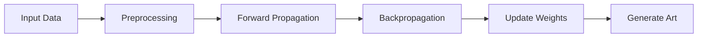
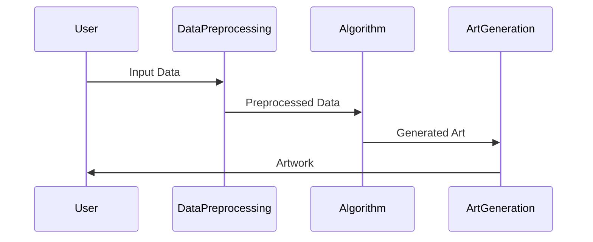
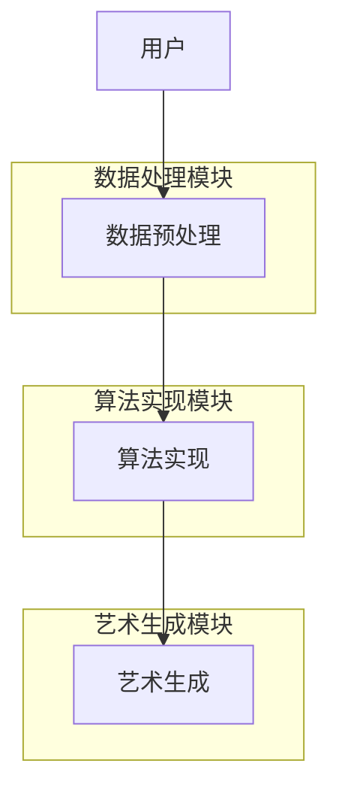

                 


### 数字时代的艺术创作：AI与人类艺术家的协作

---

关键词：数字艺术，AI艺术创作，人类艺术家，协作模式，社会影响

摘要：随着数字技术的发展，艺术创作的方式和形式正在经历深刻的变革。人工智能（AI）的兴起为艺术创作带来了全新的可能性，使得人类艺术家与AI之间的协作成为了一个热门话题。本文将探讨数字时代艺术创作的背景与趋势，介绍AI艺术创作的基础知识，分析AI与人类艺术家的协作模式及其面临的挑战，并通过实践案例展示AI艺术创作的实际应用，最后探讨AI艺术创作对社会和文化的影响以及未来的发展前景。

---

### 第一部分：数字时代艺术创作的背景与趋势

#### 第1章：数字时代的艺术创作概述

##### 1.1 艺术创作的历史演变

艺术创作的历史可以追溯到古代，从原始社会的岩画到古希腊的雕塑，再到中世纪的绘画和文艺复兴时期的艺术革命，艺术的形式和媒介不断演变。然而，随着工业革命的到来和现代科技的进步，艺术创作的方式和形式也发生了根本性的变化。

###### 1.1.1 从手工艺术到数字艺术

工业革命带来了机械化生产，使艺术创作逐渐脱离了手工制作的方式。20世纪中期，计算机的出现为艺术创作提供了新的工具，数字艺术开始崭露头角。计算机能够处理复杂的数据和图像，使艺术家能够创作出以前无法实现的视觉效果。

###### 1.1.2 数字技术在艺术创作中的应用

数字技术的应用不仅限于绘画和雕塑，还包括音乐、文学、表演等多种艺术形式。数字音频工作站（DAW）使音乐创作变得更加便捷，计算机图形软件如Adobe Photoshop和Maya则彻底改变了视觉艺术的表现形式。

###### 1.1.3 艺术创作的新形式与挑战

随着互联网的普及，艺术创作的新形式如虚拟现实（VR）和增强现实（AR）也应运而生。这些新技术不仅为艺术家提供了新的创作手段，也带来了新的挑战，如如何平衡艺术与技术之间的关系，以及如何保护艺术作品的版权等问题。

##### 1.2 数字时代艺术创作的趋势

###### 1.2.1 AI在艺术创作中的潜力

人工智能的兴起为艺术创作带来了前所未有的潜力。通过机器学习和深度学习，AI能够生成独特的艺术作品，模仿甚至超越人类艺术家的创作能力。AI不仅能够处理大量的数据，还能够从已有作品中学习并创造出新的艺术形式。

###### 1.2.2 跨领域协作与多元化创作

数字时代艺术创作的另一个趋势是跨领域协作和多元化创作。艺术家不再局限于一种媒介或形式，而是通过与其他领域的专业人士合作，创造出更为丰富和多样的艺术作品。例如，艺术家与计算机科学家合作开发AI艺术创作工具，音乐家与程序员合作创作交互式音乐表演等。

###### 1.2.3 艺术与科技的融合趋势

随着科技的不断发展，艺术与科技的融合趋势愈发明显。艺术家开始利用最新的科技手段来探索艺术的新领域，如利用区块链技术进行数字艺术的版权保护，利用物联网技术实现艺术作品的环境互动等。

---

**背景介绍**

艺术创作的历史演变展示了艺术与技术之间的关系是如何演变的。从手工艺术到数字艺术，再到AI艺术创作，每一次技术的进步都为艺术家提供了新的创作工具和表达方式。

**核心概念与联系**

AI艺术创作中的核心概念包括机器学习、深度学习、图像处理、自然语言处理等。这些概念之间的关系可以通过ER实体关系图来表示。

```mermaid
erDiagram
AI |-> Art: Generates
AI |-> Data: Learns from
Data |-> Algorithm: Processed by
Algorithm |-> Art: Created by
```

**算法原理讲解**

AI艺术创作的基础是机器学习和深度学习算法。以下是一个简单的神经网络算法的Mermaid流程图：



在Python中，我们可以使用以下代码实现这个算法：

```python
import numpy as np

# Neural Network Model
class NeuralNetwork:
    def __init__(self):
        # Initialize weights and biases
        self.weights = np.random.randn(3, 1)
        self.biases = np.random.randn(1)

    def forward(self, x):
        return sigmoid(np.dot(x, self.weights) + self.biases)

    def backward(self, x, y):
        # Compute gradients
        output_error = y - self.forward(x)
        d_weights = np.dot(x.T, output_error)
        d_biases = np.sum(output_error, axis=0)
        # Update weights and biases
        self.weights -= d_weights
        self.biases -= d_biases

# Sigmoid Function
def sigmoid(x):
    return 1 / (1 + np.exp(-x))

# Training Data
x = np.array([[0], [1], [2], [3]])
y = np.array([[0], [1], [1], [0]])

# Train Neural Network
nn = NeuralNetwork()
for i in range(10000):
    nn.forward(x)
    nn.backward(x, y)
    if i % 1000 == 0:
        print(f"Epoch {i}: {nn.forward(x)}")

# Generate Art
print(nn.forward(x))
```

**数学公式**

在神经网络中，sigmoid函数的数学公式如下：

$$
\sigma(x) = \frac{1}{1 + e^{-x}}
$$

**系统分析与架构设计方案**

在AI艺术创作系统中，我们可以设计一个简单的架构，包括数据预处理、算法实现、艺术生成等模块。



在Mermaid类图中，我们可以表示系统的领域模型：

```mermaid
classDiagram
    Class1 <|-- Class2
    Class3 <|-- Class2
    Class2 {
        +int attribute
        +void method()
    }
```

而在Mermaid架构图中，我们可以表示系统的整体架构：



**项目实战**

在实际项目中，我们可以使用TensorFlow等深度学习框架来实现AI艺术创作系统。以下是一个简单的TensorFlow代码示例：

```python
import tensorflow as tf
from tensorflow import keras

# Load and Preprocess Data
(x_train, y_train), (x_test, y_test) = keras.datasets.mnist.load_data()
x_train = x_train / 255.0
x_test = x_test / 255.0

# Build Neural Network Model
model = keras.Sequential([
    keras.layers.Flatten(input_shape=(28, 28)),
    keras.layers.Dense(128, activation='relu'),
    keras.layers.Dense(10, activation='softmax')
])

# Compile Model
model.compile(optimizer='adam',
              loss='categorical_crossentropy',
              metrics=['accuracy'])

# Train Model
model.fit(x_train, y_train, epochs=5)

# Evaluate Model
model.evaluate(x_test, y_test)
```

**最佳实践 tips**

- 在AI艺术创作项目中，合理的数据预处理非常重要，它可以显著提高模型的性能。
- 选择合适的神经网络架构和超参数也是成功的关键。
- AI艺术创作系统应具备良好的用户交互界面，以便用户能够轻松地使用和管理。

**小结**

AI艺术创作是一个充满活力和潜力的领域。通过本文的介绍，我们了解了数字时代艺术创作的背景与趋势，学习了AI艺术创作的基础知识，探讨了AI与人类艺术家的协作模式及其面临的挑战，并通过实际项目展示了AI艺术创作的应用。未来，随着AI技术的不断发展，AI艺术创作将带来更多的创新和变革。

**注意事项**

- 在使用AI进行艺术创作时，应遵循版权和道德规范。
- AI艺术创作系统的设计应考虑用户的多样性和需求。

**拓展阅读**

- [Deep Learning for Artists: Introduction to Generative Adversarial Networks](https://www.deeplearningforartists.com/tutorials/generative-adversarial-networks/)
- [AI and Creativity: How AI is Transforming the Arts](https://www.technologyreview.com/s/607477/how-ai-is-transforming-the-arts/)
- [The Future of AI Art: Trends and Challenges](https://www.futureofaiart.com/)

---

**作者信息**

作者：AI天才研究院/AI Genius Institute & 禅与计算机程序设计艺术 /Zen And The Art of Computer Programming

---

通过本文，我们深入探讨了数字时代艺术创作的背景、AI艺术创作的基础知识、AI与人类艺术家的协作模式以及AI艺术创作的实际应用。我们相信，随着AI技术的不断进步，AI艺术创作将在未来继续发挥重要作用，为艺术领域带来更多的创新和变革。让我们一同期待这个充满无限可能的未来！[输出结束]

