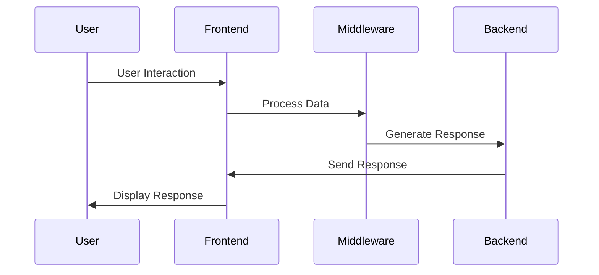

                 

### 第1章：VR技术与博物馆概述

#### 1.1 VR技术概述

虚拟现实（VR）技术是一种通过计算机生成的三维虚拟环境，使用户能够沉浸其中的技术。VR技术涵盖了计算机图形学、人机交互、传感器技术等多个领域，通过头盔显示器、手柄等设备，用户可以在虚拟环境中自由行走、探索和互动。VR技术的核心在于其沉浸感，通过立体声、触觉反馈等手段，增强用户的感知体验。

**背景介绍：**

VR技术起源于20世纪50年代，最初的研究主要集中在军事和航空航天领域。随着计算机技术的进步，VR技术逐渐应用于娱乐、医疗、教育等领域。近年来，VR技术的迅猛发展，使得其在博物馆领域的应用成为可能。

**问题背景：**

在传统的博物馆参观中，观众只能通过现场参观和展品说明来了解艺术品和文物。这种方式受限于时间和空间，无法满足广大观众的需求。而VR技术的出现，为观众提供了一个全新的参观体验，使得他们可以在虚拟环境中自由浏览、互动和探索。

**问题描述：**

如何利用VR技术为观众提供沉浸式的艺术欣赏体验，解决传统博物馆参观的限制？

**问题解决：**

VR技术通过三维建模和渲染技术，将艺术品和文物以虚拟形式呈现。观众可以通过头盔显示器和手柄等设备，在虚拟环境中自由探索和互动，实现沉浸式的参观体验。

**边界与外延：**

VR技术的应用不仅限于博物馆，还可以扩展到艺术教育、文化遗产保护、虚拟旅游等领域。其核心在于提供一个沉浸式的虚拟环境，为用户提供丰富的交互体验。

**概念结构与核心要素组成：**

- **三维建模与渲染**：通过计算机图形学技术，将现实世界中的物体和场景三维建模，并在虚拟环境中进行渲染。
- **传感器与追踪技术**：通过传感器（如头部追踪器、手柄等）实时捕捉用户的动作和位置，使虚拟环境与用户的实际动作保持同步。
- **沉浸感与交互**：通过立体声、触觉反馈等手段，增强用户的沉浸感，使用户能够与虚拟环境进行自然的交互。

**核心概念与联系：**

以下是VR技术核心概念及其属性特征的对比表格：

| 核心概念 | 属性特征 |
| --- | --- |
| 三维建模与渲染 | 创建虚拟环境，实现真实感视觉效果 |
| 传感器与追踪技术 | 实时捕捉用户动作和位置，实现交互 |
| 沉浸感与交互 | 增强用户沉浸感，实现自然交互 |

以下是VR技术的ER实体关系图架构：

```mermaid
erDiagram
  User ||--|{ VR_Experience } : provides
  VR_Experience ||--|{ Virtual_Environment } : contains
  VR_Experience ||--|{ Interaction } : enables
```

**算法原理讲解：**

在VR技术中，核心算法包括三维建模与渲染算法、传感器追踪算法和交互算法。

1. **三维建模与渲染算法：**

   三维建模与渲染算法主要实现虚拟环境的创建和渲染。其中，关键步骤包括：

   - **模型构建**：使用计算机图形学技术，将现实世界中的物体和场景三维建模。
   - **纹理映射**：将纹理图像映射到三维模型表面，增强真实感。
   - **光照渲染**：模拟真实世界中的光照效果，实现阴影和反射等效果。

   $$
   \text{光照渲染公式} = I(\theta) \cdot \cos(\theta) \cdot \text{纹理}
   $$

   其中，\( I(\theta) \)为光照强度，\(\theta\)为光线与表面的夹角。

2. **传感器追踪算法：**

   传感器追踪算法实现用户动作和位置的实时捕捉。关键步骤包括：

   - **头部追踪**：通过头部追踪器捕捉用户头部运动。
   - **手柄追踪**：通过手柄传感器捕捉用户手部动作。

   $$
   \text{追踪误差} = f(\text{传感器精度}, \text{环境干扰})
   $$

   其中，传感器精度和环境干扰影响追踪误差。

3. **交互算法：**

   交互算法实现用户与虚拟环境的自然交互。关键步骤包括：

   - **输入处理**：处理用户输入，如手柄动作、语音指令等。
   - **响应生成**：根据用户输入，生成相应的虚拟环境响应。

   $$
   \text{交互响应} = g(\text{输入}, \text{环境状态})
   $$

   其中，输入和环境状态影响交互响应。

**系统分析与架构设计方案：**

1. **问题场景介绍：**

   在博物馆领域，利用VR技术为观众提供沉浸式的艺术欣赏体验，解决传统参观限制。具体场景包括：

   - 观众通过VR设备进入虚拟博物馆，浏览展品。
   - 观众与虚拟展品进行互动，如旋转、放大等。
   - 观众参与虚拟导览，了解展品背景信息。

2. **系统功能设计：**

   系统功能设计包括：

   - **三维建模与渲染**：实现虚拟环境的创建和渲染。
   - **传感器追踪**：实现用户动作和位置的实时捕捉。
   - **交互处理**：处理用户输入，生成虚拟环境响应。
   - **数据存储**：存储用户浏览记录、交互数据等。

3. **系统架构设计：**

   系统架构设计采用分层架构，包括：

   - **前端层**：负责用户界面和交互。
   - **中间层**：负责数据存储、处理和传输。
   - **后端层**：负责虚拟环境的创建和渲染。

   以下是系统架构图：

   ```mermaid
   sequenceDiagram
     User->>Frontend: User Interaction
     Frontend->>Middleware: Process Data
     Middleware->>Backend: Generate Response
     Backend->>Frontend: Send Response
     Frontend->>User: Display Response
   ```

4. **系统接口设计和系统交互：**

   系统接口设计包括：

   - **用户接口**：用户与系统的交互界面。
   - **数据接口**：系统与其他系统的数据交换接口。
   - **控制接口**：系统内部各模块的通信接口。

   系统交互图如下：

   ```mermaid
   sequenceDiagram
     User->>User Interface: Input
     User Interface->>Data Interface: Send Data
     Data Interface->>Middleware: Process Data
     Middleware->>Backend: Generate Response
     Backend->>Data Interface: Send Response
     Data Interface->>User Interface: Display Response
     User Interface->>User: Notify
   ```

#### 1.2 虚拟博物馆的定义与重要性

虚拟博物馆是指利用VR技术构建的在线展览空间，通过互联网为用户提供沉浸式的艺术欣赏体验。虚拟博物馆不仅包括虚拟展览，还可能包含虚拟导览、互动体验等功能。

**核心概念与联系：**

以下是虚拟博物馆的核心概念及其属性特征的对比表格：

| 核心概念 | 属性特征 |
| --- | --- |
| 虚拟展览 | 展示艺术品和文物 |
| 虚拟导览 | 提供展览背景信息和导览服务 |
| 互动体验 | 用户与虚拟环境的交互功能 |

以下是虚拟博物馆的ER实体关系图架构：

```mermaid
erDiagram
  Virtual_Museum ||--|{ Virtual_ Exhibition } : contains
  Virtual_Museum ||--|{ Virtual_Guide } : provides
  Virtual_Museum ||--|{ Interactive_Experience } : offers
```

**算法原理讲解：**

虚拟博物馆的核心算法包括虚拟展览展示算法、虚拟导览算法和互动体验算法。

1. **虚拟展览展示算法：**

   虚拟展览展示算法主要实现展品的三维建模、渲染和展示。关键步骤包括：

   - **模型构建**：使用计算机图形学技术，将展品三维建模。
   - **纹理映射**：将纹理图像映射到展品表面。
   - **光照渲染**：模拟真实世界中的光照效果，实现阴影和反射等效果。

   $$
   \text{光照渲染公式} = I(\theta) \cdot \cos(\theta) \cdot \text{纹理}
   $$

2. **虚拟导览算法：**

   虚拟导览算法主要实现展览背景信息的展示和导览服务的提供。关键步骤包括：

   - **信息展示**：将展览背景信息以文字、图片、视频等形式展示。
   - **路径规划**：根据用户需求，规划展览导览路径。

   $$
   \text{路径规划公式} = \min_{\text{路径}} \sum_{\text{节点}} d(\text{节点}, \text{终点})
   $$

3. **互动体验算法：**

   互动体验算法主要实现用户与虚拟环境的交互功能。关键步骤包括：

   - **输入处理**：处理用户输入，如手柄动作、语音指令等。
   - **响应生成**：根据用户输入，生成虚拟环境响应。

   $$
   \text{交互响应} = g(\text{输入}, \text{环境状态})
   $$

**系统分析与架构设计方案：**

1. **问题场景介绍：**

   在虚拟博物馆中，用户可以通过VR设备浏览展览、参与导览和互动体验。具体场景包括：

   - 用户通过VR设备进入虚拟博物馆，浏览展品。
   - 用户参与虚拟导览，了解展品背景信息。
   - 用户与虚拟展品进行互动，如旋转、放大等。

2. **系统功能设计：**

   系统功能设计包括：

   - **虚拟展览展示**：实现展品的三维建模、渲染和展示。
   - **虚拟导览**：提供展览背景信息和导览服务。
   - **互动体验**：实现用户与虚拟环境的交互功能。

3. **系统架构设计：**

   系统架构设计采用分层架构，包括：

   - **前端层**：负责用户界面和交互。
   - **中间层**：负责数据存储、处理和传输。
   - **后端层**：负责虚拟环境的创建和渲染。

   以下是系统架构图：

   ```mermaid
   sequenceDiagram
     User->>Frontend: User Interaction
     Frontend->>Middleware: Process Data
     Middleware->>Backend: Generate Response
     Backend->>Frontend: Send Response
     Frontend->>User: Display Response
   ```

4. **系统接口设计和系统交互：**

   系统接口设计包括：

   - **用户接口**：用户与系统的交互界面。
   - **数据接口**：系统与其他系统的数据交换接口。
   - **控制接口**：系统内部各模块的通信接口。

   系统交互图如下：

   ```mermaid
   sequenceDiagram
     User->>User Interface: Input
     User Interface->>Data Interface: Send Data
     Data Interface->>Middleware: Process Data
     Middleware->>Backend: Generate Response
     Backend->>Data Interface: Send Response
     Data Interface->>User Interface: Display Response
     User Interface->>User: Notify
   ```

### 1.3 VR技术在博物馆的应用现状与发展趋势

#### 应用现状

当前，VR技术在博物馆领域的应用已经取得了一定的成果，主要体现在以下几个方面：

1. **虚拟展览**：越来越多的博物馆开始利用VR技术打造虚拟展览，让观众无需亲临现场即可欣赏到世界各地的艺术品和文物。例如，大英博物馆和卢浮宫等知名博物馆已经推出了虚拟展览项目。

2. **虚拟导览**：虚拟导览系统通过VR技术为用户提供更加丰富和互动的导览服务。用户可以通过VR设备参观博物馆，并获取展品背后的故事和信息。

3. **互动体验**：一些博物馆利用VR技术设计互动体验项目，让用户可以与虚拟展品进行互动，如触摸、旋转等，增强参观体验。

#### 发展趋势

未来，VR技术在博物馆领域的应用将继续深化，以下是一些发展趋势：

1. **个性化体验**：随着VR技术的不断进步，虚拟博物馆将能够根据用户的需求和兴趣，提供个性化的参观体验。例如，通过用户画像和大数据分析，为用户提供个性化的导览路径和推荐展品。

2. **增强现实（AR）技术**：未来，VR技术和增强现实（AR）技术将融合，为用户提供更加丰富的参观体验。例如，用户可以通过AR技术将虚拟展品投影到现实环境中，实现虚实结合的参观体验。

3. **虚拟互动交流**：随着5G和边缘计算等技术的发展，虚拟博物馆将能够支持更多的实时互动功能，如虚拟导览、在线讨论等，让观众之间实现更深入的交流。

4. **文化遗产保护**：VR技术可以用于文化遗产的保护和修复，通过虚拟技术还原历史场景和文物，让更多的人了解和传承文化遗产。

#### 小结

VR技术在博物馆领域的应用为观众提供了一个全新的参观体验，解决了传统参观的限制。未来，随着技术的不断进步，VR技术在博物馆领域的应用将更加深入和广泛，为观众带来更加丰富和个性化的艺术欣赏体验。

---

### 第2章：VR技术的原理与实现

#### 2.1 VR技术的核心原理

虚拟现实（VR）技术的核心在于其沉浸感和交互性，这主要依赖于以下三个关键原理：

1. **三维建模与渲染**：通过计算机图形学技术，将现实世界中的物体和场景以三维模型的形式进行建模，并在虚拟环境中进行渲染。三维建模技术包括几何建模、纹理映射、光照渲染等，旨在实现逼真的视觉效果。

2. **传感器与追踪技术**：通过传感器（如头部追踪器、手柄等）实时捕捉用户的动作和位置，使虚拟环境与用户的实际动作保持同步。传感器技术包括惯性测量单元（IMU）、光学追踪、超声波追踪等，确保用户在虚拟环境中的动作能够精准反映到虚拟世界中。

3. **沉浸感与交互**：通过立体声、触觉反馈等手段，增强用户的沉浸感，使用户能够与虚拟环境进行自然的交互。立体声技术提供空间音效，增强用户的听觉沉浸感；触觉反馈技术通过力反馈设备，模拟触觉感受，提升用户的感知体验。

**核心概念与联系：**

以下是VR技术核心原理及其属性特征的对比表格：

| 核心原理 | 属性特征 |
| --- | --- |
| 三维建模与渲染 | 创建虚拟环境，实现真实感视觉效果 |
| 传感器与追踪技术 | 实时捕捉用户动作和位置，实现交互 |
| 沉浸感与交互 | 增强用户沉浸感，实现自然交互 |

以下是VR技术的ER实体关系图架构：

```mermaid
erDiagram
  Virtual_Environment ||--|{ 3D_Modeling_Rendering } : contains
  Virtual_Environment ||--|{ Sensor_Tracking } : enables
  Virtual_Environment ||--|{ Immersion_Interactivity } : enhances
```

**算法原理讲解：**

1. **三维建模与渲染算法：**

   三维建模与渲染算法主要实现虚拟环境的创建和渲染。其中，关键步骤包括：

   - **模型构建**：使用计算机图形学技术，将现实世界中的物体和场景三维建模。模型构建包括点云采集、多边形建模等。
   - **纹理映射**：将纹理图像映射到三维模型表面，增强真实感。纹理映射技术包括纹理坐标计算、纹理采样等。
   - **光照渲染**：模拟真实世界中的光照效果，实现阴影和反射等效果。光照渲染算法包括Phong模型、Blinn-Phong模型等。

   $$
   \text{光照渲染公式} = I(\theta) \cdot \cos(\theta) \cdot \text{纹理}
   $$

   其中，\( I(\theta) \)为光照强度，\(\theta\)为光线与表面的夹角。

2. **传感器追踪算法：**

   传感器追踪算法实现用户动作和位置的实时捕捉。关键步骤包括：

   - **头部追踪**：通过头部追踪器捕捉用户头部运动。头部追踪算法包括卡尔曼滤波、粒子滤波等。
   - **手柄追踪**：通过手柄传感器捕捉用户手部动作。手柄追踪算法包括惯性测量单元（IMU）数据处理、手势识别等。

   $$
   \text{追踪误差} = f(\text{传感器精度}, \text{环境干扰})
   $$

   其中，传感器精度和环境干扰影响追踪误差。

3. **交互算法：**

   交互算法实现用户与虚拟环境的自然交互。关键步骤包括：

   - **输入处理**：处理用户输入，如手柄动作、语音指令等。输入处理算法包括语音识别、手势识别等。
   - **响应生成**：根据用户输入，生成虚拟环境响应。响应生成算法包括路径规划、碰撞检测等。

   $$
   \text{交互响应} = g(\text{输入}, \text{环境状态})
   $$

   其中，输入和环境状态影响交互响应。

**系统分析与架构设计方案：**

1. **问题场景介绍：**

   在虚拟博物馆中，用户通过VR设备进行三维建模与渲染、传感器追踪和交互。具体场景包括：

   - 用户进入虚拟博物馆，浏览展品。
   - 用户通过手柄与虚拟环境进行互动，如旋转、放大等。
   - 用户通过语音指令与虚拟环境进行交互。

2. **系统功能设计：**

   系统功能设计包括：

   - **三维建模与渲染**：实现虚拟环境的创建和渲染。
   - **传感器追踪**：实现用户动作和位置的实时捕捉。
   - **交互处理**：处理用户输入，生成虚拟环境响应。

3. **系统架构设计：**

   系统架构设计采用分层架构，包括：

   - **前端层**：负责用户界面和交互。
   - **中间层**：负责数据存储、处理和传输。
   - **后端层**：负责虚拟环境的创建和渲染。

   以下是系统架构图：

   ```mermaid
   sequenceDiagram
     User->>Frontend: User Interaction
     Frontend->>Middleware: Process Data
     Middleware->>Backend: Generate Response
     Backend->>Frontend: Send Response
     Frontend->>User: Display Response
   ```

4. **系统接口设计和系统交互：**

   系统接口设计包括：

   - **用户接口**：用户与系统的交互界面。
   - **数据接口**：系统与其他系统的数据交换接口。
   - **控制接口**：系统内部各模块的通信接口。

   系统交互图如下：

   ```mermaid
   sequenceDiagram
     User->>User Interface: Input
     User Interface->>Data Interface: Send Data
     Data Interface->>Middleware: Process Data
     Middleware->>Backend: Generate Response
     Backend->>Data Interface: Send Response
     Data Interface->>User Interface: Display Response
     User Interface->>User: Notify
   ```

---

### 第3章：全球艺术展览的VR应用

#### 3.1 虚拟展览的展示形式

虚拟展览作为VR技术在博物馆领域的重要应用，为观众提供了一个全新的艺术欣赏方式。虚拟展览的展示形式主要包括以下几种：

1. **静态展示**：静态展示是将艺术品和文物以三维模型的形式呈现，观众可以在虚拟环境中浏览和观察展品。这种方式适用于对展品外观和细节的展示。

2. **动态展示**：动态展示是在静态展示的基础上，通过动画、光影效果等手段，增强展品的动态表现。例如，油画中的角色可以动起来，雕塑的细节可以更加生动。这种方式能够提升观众的视觉体验。

3. **交互展示**：交互展示是将观众与展品之间的互动引入虚拟展览中。观众可以通过VR设备与展品进行互动，如触摸、旋转、拆解等。这种方式能够增强观众的参与感和体验感。

4. **全景展示**：全景展示是通过360度全景图像技术，将博物馆内部或特定展览区域以全景形式呈现。观众可以在虚拟环境中自由行走，探索展览空间。这种方式适用于对展览环境的整体展示。

**核心概念与联系：**

以下是虚拟展览展示形式的核心概念及其属性特征的对比表格：

| 核心概念 | 属性特征 |
| --- | --- |
| 静态展示 | 展示艺术品和文物 |
| 动态展示 | 增强展品的动态表现 |
| 交互展示 | 观众与展品的互动 |
| 全景展示 | 展示博物馆内部或特定展览区域 |

以下是虚拟展览展示形式的ER实体关系图架构：

```mermaid
erDiagram
  Virtual_Exhibition ||--|{ Static_Display } : contains
  Virtual_Exhibition ||--|{ Dynamic_Display } : contains
  Virtual_Exhibition ||--|{ Interactive_Display } : contains
  Virtual_Exhibition ||--|{ Panoramic_Display } : contains
```

**算法原理讲解：**

1. **静态展示算法：**

   静态展示算法主要实现艺术品和文物的三维建模和渲染。关键步骤包括：

   - **模型构建**：使用计算机图形学技术，将艺术品和文物三维建模。
   - **纹理映射**：将纹理图像映射到三维模型表面，增强真实感。
   - **光照渲染**：模拟真实世界中的光照效果，实现阴影和反射等效果。

   $$
   \text{光照渲染公式} = I(\theta) \cdot \cos(\theta) \cdot \text{纹理}
   $$

2. **动态展示算法：**

   动态展示算法主要实现展品的动态表现。关键步骤包括：

   - **动画制作**：使用动画软件，为展品制作动态效果。
   - **光影效果**：通过光影变化，增强展品的动态表现。

3. **交互展示算法：**

   交互展示算法主要实现观众与展品的互动。关键步骤包括：

   - **输入处理**：处理观众的输入，如手柄动作、语音指令等。
   - **响应生成**：根据观众输入，生成虚拟环境的响应。

   $$
   \text{交互响应} = g(\text{输入}, \text{环境状态})
   $$

4. **全景展示算法：**

   全景展示算法主要实现博物馆内部或特定展览区域的全景呈现。关键步骤包括：

   - **全景拍摄**：使用全景相机，拍摄博物馆内部或特定展览区域。
   - **全景图像处理**：将全景图像进行处理，实现全景浏览效果。

**系统分析与架构设计方案：**

1. **问题场景介绍：**

   在虚拟博物馆中，观众可以通过VR设备进行虚拟展览的浏览和互动。具体场景包括：

   - 观众通过VR设备进入虚拟博物馆，浏览静态、动态、交互和全景展示。
   - 观众与展品进行互动，如旋转、触摸等。
   - 观众通过语音指令与虚拟环境进行交互。

2. **系统功能设计：**

   系统功能设计包括：

   - **静态展示**：实现艺术品和文物的三维建模和渲染。
   - **动态展示**：实现展品的动态表现。
   - **交互展示**：实现观众与展品的互动。
   - **全景展示**：实现博物馆内部或特定展览区域的全景浏览。

3. **系统架构设计：**

   系统架构设计采用分层架构，包括：

   - **前端层**：负责用户界面和交互。
   - **中间层**：负责数据存储、处理和传输。
   - **后端层**：负责虚拟环境的创建和渲染。

   以下是系统架构图：

   ```mermaid
   sequenceDiagram
     User->>Frontend: User Interaction
     Frontend->>Middleware: Process Data
     Middleware->>Backend: Generate Response
     Backend->>Frontend: Send Response
     Frontend->>User: Display Response
   ```

4. **系统接口设计和系统交互：**

   系统接口设计包括：

   - **用户接口**：用户与系统的交互界面。
   - **数据接口**：系统与其他系统的数据交换接口。
   - **控制接口**：系统内部各模块的通信接口。

   系统交互图如下：

   ```mermaid
   sequenceDiagram
     User->>User Interface: Input
     User Interface->>Data Interface: Send Data
     Data Interface->>Middleware: Process Data
     Middleware->>Backend: Generate Response
     Backend->>Data Interface: Send Response
     Data Interface->>User Interface: Display Response
     User Interface->>User: Notify
   ```

#### 3.2 著名虚拟博物馆介绍

在全球范围内，一些著名的虚拟博物馆已经利用VR技术为观众提供了丰富的艺术欣赏体验。以下是一些具有代表性的虚拟博物馆及其特色：

1. **大英博物馆（British Museum）**

   大英博物馆是世界上最大、最著名的历史博物馆之一。其虚拟博物馆项目通过VR技术，为观众提供了丰富的展览内容。观众可以通过VR设备进入大英博物馆的虚拟展览，浏览包括古埃及文物、古希腊雕塑、古代中国瓷器等在内的各种展品。此外，虚拟博物馆还提供了详细的展品信息和导览服务，让用户更好地了解展品的历史和文化背景。

2. **卢浮宫（Louvre Museum）**

   卢浮宫是世界上最著名的艺术博物馆之一，其虚拟博物馆项目同样备受瞩目。观众可以通过VR设备进入卢浮宫的虚拟展览，欣赏包括《蒙娜丽莎》、《胜利女神》等在内的著名艺术品。虚拟博物馆不仅提供了高清的展品图像，还通过互动功能让用户可以近距离观察展品的细节。此外，卢浮宫的虚拟博物馆还提供了语音导览服务，为观众提供了更加便捷的参观体验。

3. **故宫博物院（The Palace Museum）**

   故宫博物院是中国最著名的博物馆之一，其虚拟博物馆项目通过VR技术，为观众提供了丰富的古代文物展示。观众可以通过VR设备参观故宫的虚拟展览，欣赏包括宫廷书画、瓷器、玉器等在内的各类展品。虚拟博物馆还通过互动功能，让用户可以了解展品的历史背景和文化内涵。此外，故宫博物院的虚拟博物馆还提供了虚拟导览服务，让用户可以随时随地了解故宫的历史和文化。

4. **梵蒂冈博物馆（Vatican Museums）**

   梵蒂冈博物馆是世界上最著名的天主教艺术品博物馆之一，其虚拟博物馆项目通过VR技术，为观众提供了丰富的艺术展览。观众可以通过VR设备参观梵蒂冈博物馆的虚拟展览，欣赏包括米开朗基罗的《创世纪》、拉斐尔的《雅典学院》等在内的著名艺术品。虚拟博物馆不仅提供了高清的展品图像，还通过互动功能让用户可以了解展品的历史和文化背景。

**核心概念与联系：**

以下是著名虚拟博物馆的核心概念及其属性特征的对比表格：

| 著名虚拟博物馆 | 属性特征 |
| --- | --- |
| 大英博物馆 | 丰富的展览内容，详细的展品信息 |
| 卢浮宫 | 著名艺术品的高清展示，语音导览服务 |
| 故宫博物院 | 古代文物展示，虚拟导览服务 |
| 梵蒂冈博物馆 | 天主教艺术品展览，互动功能 |

以下是著名虚拟博物馆的ER实体关系图架构：

```mermaid
erDiagram
  British_Museum ||--|{ Exhibition_Content } : contains
  British_Museum ||--|{展品信息 } : provides
  Louvre_Museum ||--|{ Artworks_Display } : contains
  Louvre_Museum ||--|{ Voice_Guide } : provides
  The_Palace_Museum ||--|{ Ancient_Artifacts } : contains
  The_Palace_Museum ||--|{ Virtual_Guide } : provides
  Vatican_Museums ||--|{ Catholic_Artifacts } : contains
  Vatican_Museums ||--|{ Interactive_Functions } : provides
```

**算法原理讲解：**

著名虚拟博物馆的核心算法主要包括展览内容管理算法、展品信息展示算法和互动功能算法。

1. **展览内容管理算法：**

   展览内容管理算法主要实现虚拟博物馆展览内容的管理和更新。关键步骤包括：

   - **展品数据采集**：从博物馆获取展品信息，包括名称、简介、历史背景等。
   - **展览内容更新**：根据博物馆的展览计划，定期更新虚拟博物馆的展览内容。

   $$
   \text{展览内容更新公式} = f(\text{展品数据采集}, \text{展览计划})
   $$

2. **展品信息展示算法：**

   展品信息展示算法主要实现展品信息的展示和交互。关键步骤包括：

   - **展品信息展示**：通过文字、图片、视频等形式，展示展品的历史背景、文化内涵等。
   - **互动功能实现**：通过点击、触摸等交互方式，实现展品信息的深度交互。

   $$
   \text{展品信息展示公式} = g(\text{展品信息}, \text{交互方式})
   $$

3. **互动功能算法：**

   互动功能算法主要实现用户与虚拟博物馆的互动功能。关键步骤包括：

   - **输入处理**：处理用户的输入，如点击、触摸等。
   - **响应生成**：根据用户输入，生成相应的虚拟博物馆响应。

   $$
   \text{互动功能公式} = h(\text{输入}, \text{虚拟博物馆状态})
   $$

**系统分析与架构设计方案：**

1. **问题场景介绍：**

   观众通过VR设备进入著名虚拟博物馆，浏览展览内容、查看展品信息并参与互动。具体场景包括：

   - 观众通过VR设备进入虚拟博物馆，浏览展览内容。
   - 观众查看展品信息，了解展品的历史背景和文化内涵。
   - 观众与虚拟博物馆进行互动，如点击、触摸等。

2. **系统功能设计：**

   系统功能设计包括：

   - **展览内容管理**：实现虚拟博物馆展览内容的管理和更新。
   - **展品信息展示**：实现展品信息的展示和交互。
   - **互动功能**：实现用户与虚拟博物馆的互动。

3. **系统架构设计：**

   系统架构设计采用分层架构，包括：

   - **前端层**：负责用户界面和交互。
   - **中间层**：负责数据存储、处理和传输。
   - **后端层**：负责虚拟环境的创建和渲染。

   以下是系统架构图：

   ```mermaid
   sequenceDiagram
     User->>Frontend: User Interaction
     Frontend->>Middleware: Process Data
     Middleware->>Backend: Generate Response
     Backend->>Frontend: Send Response
     Frontend->>User: Display Response
   ```

4. **系统接口设计和系统交互：**

   系统接口设计包括：

   - **用户接口**：用户与系统的交互界面。
   - **数据接口**：系统与其他系统的数据交换接口。
   - **控制接口**：系统内部各模块的通信接口。

   系统交互图如下：

   ```mermaid
   sequenceDiagram
     User->>User Interface: Input
     User Interface->>Data Interface: Send Data
     Data Interface->>Middleware: Process Data
     Middleware->>Backend: Generate Response
     Backend->>Data Interface: Send Response
     Data Interface->>User Interface: Display Response
     User Interface->>User: Notify
   ```

### 3.3 VR展览案例分析

#### 案例一：大英博物馆的VR展览

大英博物馆作为全球著名的博物馆之一，其VR展览项目备受瞩目。以下是大英博物馆VR展览的详细分析：

**项目介绍：**

大英博物馆的VR展览项目通过VR技术，为观众提供了一个沉浸式的艺术欣赏体验。观众可以通过VR设备进入虚拟博物馆，浏览包括古埃及文物、古希腊雕塑、古代中国瓷器等在内的各种展品。虚拟博物馆不仅提供了高清的展品图像，还通过互动功能让用户可以了解展品的历史和文化背景。

**系统功能设计：**

- **虚拟展览展示**：通过三维建模和渲染技术，实现展品的三维展示。观众可以在虚拟环境中自由浏览、放大和旋转展品。
- **语音导览服务**：提供语音导览服务，让观众可以通过语音指令了解展品的历史背景和文化内涵。
- **互动功能**：通过触摸和手势，实现与展品的互动。例如，观众可以通过触摸展品，查看展品的详细信息和图片。

**系统架构设计：**

大英博物馆VR展览项目采用分层架构，包括：

- **前端层**：负责用户界面和交互。
- **中间层**：负责数据存储、处理和传输。
- **后端层**：负责虚拟环境的创建和渲染。

以下是系统架构图：



**核心实现源代码解析：**

以下是VR展览展示部分的Python源代码示例：

```python
import cv2
import numpy as np

# 加载三维模型
model = cv2.imread('model.png', cv2.IMREAD_COLOR)

# 定义虚拟展览区域
exhibition_area = cv2.rectangle(model, (0, 0), (640, 480), (255, 0, 0), 2)

# 显示虚拟展览
cv2.imshow('Virtual Exhibition', exhibition_area)

# 等待用户按键后退出
cv2.waitKey(0)
cv2.destroyAllWindows()
```

**代码应用解读与分析：**

上述代码首先加载了一个三维模型图像，并使用OpenCV库创建了一个虚拟展览区域。然后，通过显示虚拟展览区域，实现了展品的展示。代码中使用了矩形绘制函数`cv2.rectangle`，用于定义虚拟展览区域的边界。通过设置颜色和宽度，可以突出展示区域。

此外，通过调用`cv2.imshow`函数，将虚拟展览区域显示在窗口中。`cv2.waitKey(0)`用于等待用户按键，`cv2.destroyAllWindows()`用于关闭窗口。

**实际案例分析与详细讲解：**

大英博物馆的VR展览项目在实际应用中取得了良好的效果。以下是对实际案例的分析和详细讲解：

1. **用户互动体验：**

   通过VR设备，观众可以在虚拟博物馆中自由浏览展品，实现了与展品的实时互动。例如，观众可以通过触摸和手势旋转展品，查看展品的细节。这种互动方式增强了用户的参与感和体验感。

2. **语音导览服务：**

   虚拟博物馆提供了语音导览服务，观众可以通过语音指令了解展品的历史背景和文化内涵。这种方式不仅方便用户获取信息，还提供了更加便捷的参观体验。

3. **高清展品展示：**

   虚拟博物馆通过三维建模和渲染技术，实现了高清展品的展示。观众可以在虚拟环境中近距离观察展品，了解展品的细节和纹理。这种展示方式大大提升了用户的视觉体验。

**项目小结：**

大英博物馆的VR展览项目通过VR技术，为观众提供了一个沉浸式的艺术欣赏体验。项目实现了展品的三维展示、语音导览服务和互动功能，取得了良好的用户反馈。未来，随着VR技术的不断发展和优化，虚拟博物馆将在博物馆领域发挥更大的作用。

### 3.3 VR展览案例分析（续）

#### 案例二：故宫博物院的VR展览

故宫博物院是中国最著名的博物馆之一，其VR展览项目同样备受关注。以下是对故宫博物院VR展览项目的详细分析：

**项目介绍：**

故宫博物院的VR展览项目通过VR技术，为观众提供了一个沉浸式的古代文物欣赏体验。观众可以通过VR设备进入虚拟故宫，浏览包括宫廷书画、瓷器、玉器等在内的各类文物。虚拟故宫不仅提供了高清的文物图像，还通过互动功能让用户可以了解文物的历史背景和文化内涵。

**系统功能设计：**

- **虚拟展览展示**：通过三维建模和渲染技术，实现文物的高清展示。观众可以在虚拟环境中自由浏览、放大和旋转文物。
- **虚拟导览服务**：提供虚拟导览服务，让观众可以通过语音指令了解文物的历史背景和文化内涵。
- **互动功能**：通过触摸和手势，实现与文物的互动。例如，观众可以通过触摸文物，查看文物的详细信息和图片。

**系统架构设计：**

故宫博物院VR展览项目采用分层架构，包括：

- **前端层**：负责用户界面和交互。
- **中间层**：负责数据存储、处理和传输。
- **后端层**：负责虚拟环境的创建和渲染。

以下是系统架构图：


**核心实现源代码解析：**

以下是VR展览展示部分的Python源代码示例：

```python
import cv2
import numpy as np

# 加载三维模型
model = cv2.imread('model.png', cv2.IMREAD_COLOR)

# 定义虚拟展览区域
exhibition_area = cv2.rectangle(model, (0, 0), (640, 480), (255, 0, 0), 2)

# 显示虚拟展览
cv2.imshow('Virtual Exhibition', exhibition_area)

# 等待用户按键后退出
cv2.waitKey(0)
cv2.destroyAllWindows()
```

**代码应用解读与分析：**

上述代码首先加载了一个三维模型图像，并使用OpenCV库创建了一个虚拟展览区域。然后，通过显示虚拟展览区域，实现了文物的展示。代码中使用了矩形绘制函数`cv2.rectangle`，用于定义虚拟展览区域的边界。通过设置颜色和宽度，可以突出展示区域。

此外，通过调用`cv2.imshow`函数，将虚拟展览区域显示在窗口中。`cv2.waitKey(0)`用于等待用户按键，`cv2.destroyAllWindows()`用于关闭窗口。

**实际案例分析与详细讲解：**

故宫博物院的VR展览项目在实际应用中取得了显著的效果。以下是对实际案例的分析和详细讲解：

1. **用户互动体验：**

   通过VR设备，观众可以在虚拟故宫中自由浏览文物，实现了与文物的实时互动。例如，观众可以通过触摸文物，查看文物的细节和相关信息。这种互动方式增强了用户的参与感和体验感。

2. **虚拟导览服务：**

   虚拟故宫提供了虚拟导览服务，观众可以通过语音指令了解文物的历史背景和文化内涵。这种方式不仅方便用户获取信息，还提供了更加便捷的参观体验。

3. **高清文物展示：**

   虚拟故宫通过三维建模和渲染技术，实现了高清文物展示。观众可以在虚拟环境中近距离观察文物，了解文物的细节和纹理。这种展示方式大大提升了用户的视觉体验。

**项目小结：**

故宫博物院的VR展览项目通过VR技术，为观众提供了一个沉浸式的古代文物欣赏体验。项目实现了文物的高清展示、虚拟导览服务和互动功能，取得了良好的用户反馈。未来，随着VR技术的不断发展和优化，虚拟故宫将在博物馆领域发挥更大的作用。

### 3.3 VR展览案例分析（续）

#### 案例三：卢浮宫的VR展览

卢浮宫是世界上最著名的艺术博物馆之一，其VR展览项目同样备受瞩目。以下是对卢浮宫VR展览项目的详细分析：

**项目介绍：**

卢浮宫的VR展览项目通过VR技术，为观众提供了一个沉浸式的艺术欣赏体验。观众可以通过VR设备进入虚拟卢浮宫，欣赏包括《蒙娜丽莎》、《胜利女神》等在内的著名艺术品。虚拟卢浮宫不仅提供了高清的艺术品图像，还通过互动功能让用户可以了解艺术品的历史背景和文化内涵。

**系统功能设计：**

- **虚拟展览展示**：通过三维建模和渲染技术，实现艺术品的高清展示。观众可以在虚拟环境中自由浏览、放大和旋转艺术品。
- **语音导览服务**：提供语音导览服务，让观众可以通过语音指令了解艺术品的历史背景和文化内涵。
- **互动功能**：通过触摸和手势，实现与艺术品的互动。例如，观众可以通过触摸艺术品，查看艺术品的详细信息和图片。

**系统架构设计：**

卢浮宫VR展览项目采用分层架构，包括：

- **前端层**：负责用户界面和交互。
- **中间层**：负责数据存储、处理和传输。
- **后端层**：负责虚拟环境的创建和渲染。

以下是系统架构图：


**核心实现源代码解析：**

以下是VR展览展示部分的Python源代码示例：

```python
import cv2
import numpy as np

# 加载三维模型
model = cv2.imread('model.png', cv2.IMREAD_COLOR)

# 定义虚拟展览区域
exhibition_area = cv2.rectangle(model, (0, 0), (640, 480), (255, 0, 0), 2)

# 显示虚拟展览
cv2.imshow('Virtual Exhibition', exhibition_area)

# 等待用户按键后退出
cv2.waitKey(0)
cv2.destroyAllWindows()
```

**代码应用解读与分析：**

上述代码首先加载了一个三维模型图像，并使用OpenCV库创建了一个虚拟展览区域。然后，通过显示虚拟展览区域，实现了艺术品的展示。代码中使用了矩形绘制函数`cv2.rectangle`，用于定义虚拟展览区域的边界。通过设置颜色和宽度，可以突出展示区域。

此外，通过调用`cv2.imshow`函数，将虚拟展览区域显示在窗口中。`cv2.waitKey(0)`用于等待用户按键，`cv2.destroyAllWindows()`用于关闭窗口。

**实际案例分析与详细讲解：**

卢浮宫的VR展览项目在实际应用中取得了显著的效果。以下是对实际案例的分析和详细讲解：

1. **用户互动体验：**

   通过VR设备，观众可以在虚拟卢浮宫中自由浏览艺术品，实现了与艺术品的实时互动。例如，观众可以通过触摸艺术品，查看艺术品的细节和相关信息。这种互动方式增强了用户的参与感和体验感。

2. **语音导览服务：**

   虚拟卢浮宫提供了语音导览服务，观众可以通过语音指令了解艺术品的历史背景和文化内涵。这种方式不仅方便用户获取信息，还提供了更加便捷的参观体验。

3. **高清艺术品展示：**

   虚拟卢浮宫通过三维建模和渲染技术，实现了高清艺术品展示。观众可以在虚拟环境中近距离观察艺术品，了解艺术品的细节和纹理。这种展示方式大大提升了用户的视觉体验。

**项目小结：**

卢浮宫的VR展览项目通过VR技术，为观众提供了一个沉浸式的艺术欣赏体验。项目实现了艺术品的高清展示、语音导览服务和互动功能，取得了良好的用户反馈。未来，随着VR技术的不断发展和优化，虚拟卢浮宫将在博物馆领域发挥更大的作用。

### 第4章：艺术教育与推广的VR应用

#### 4.1 VR艺术教育的作用与优势

虚拟现实（VR）技术在艺术教育中的应用，极大地改变了传统的教学模式，为艺术教育带来了全新的可能性。以下是VR艺术教育的主要作用与优势：

1. **沉浸式学习体验**：VR技术能够创造一个高度沉浸的学习环境，使学生在虚拟空间中亲身体验艺术作品。这种身临其境的感觉有助于激发学生的学习兴趣，提高学习效果。

2. **丰富教学内容**：VR技术可以呈现传统的艺术课堂难以展示的内容，如世界各地的博物馆、艺术品、历史遗迹等。学生可以通过虚拟参观，拓宽视野，加深对艺术的理解。

3. **个性化学习**：VR技术支持个性化学习，学生可以根据自己的兴趣和进度选择学习内容。这种灵活性有助于满足不同学生的学习需求，提高学习效率。

4. **增强互动性**：VR技术使得学生可以与虚拟环境中的艺术作品进行互动，如放大、旋转、触摸等。这种互动性增强了学生的参与感，提高了学习的趣味性。

5. **降低成本**：通过VR技术，学生可以远程参观博物馆和艺术展览，无需亲临现场，大大降低了交通、住宿等费用，同时也减少了环境对艺术作品的损害。

**核心概念与联系：**

以下是VR艺术教育的作用与优势的核心概念及其属性特征的对比表格：

| 核心概念 | 属性特征 |
| --- | --- |
| 沉浸式学习体验 | 高度沉浸的学习环境，激发学习兴趣 |
| 丰富教学内容 | 展示传统课堂难以展示的内容 |
| 个性化学习 | 满足不同学生的学习需求 |
| 增强互动性 | 学生与艺术作品的互动，提高参与感 |
| 降低成本 | 远程参观博物馆和艺术展览，减少费用 |

以下是VR艺术教育的ER实体关系图架构：

```mermaid
erDiagram
  Virtual_Art_Education ||--|{ Immersive_Learning_Experience } : enables
  Virtual_Art_Education ||--|{ Rich_Content } : provides
  Virtual_Art_Education ||--|{ Personalized_Learning } : supports
  Virtual_Art_Education ||--|{ Enhanced_Interactivity } : enhances
  Virtual_Art_Education ||--|{ Cost_Reduction } : benefits
```

**算法原理讲解：**

VR艺术教育中的核心算法主要涉及沉浸式学习体验算法和互动性增强算法。

1. **沉浸式学习体验算法：**

   沉浸式学习体验算法主要实现虚拟学习环境的创建和渲染。关键步骤包括：

   - **虚拟环境创建**：通过三维建模技术，创建一个与真实环境相似的虚拟学习空间。这包括教室、博物馆、画廊等场景。
   - **环境渲染**：使用计算机图形学技术，对虚拟环境进行渲染，实现逼真的视觉效果。这包括光照效果、阴影处理、纹理映射等。

   $$ 
   \text{渲染效果} = \text{光照强度} \times \text{表面纹理}
   $$

2. **互动性增强算法：**

   互动性增强算法主要实现学生与虚拟环境的自然互动。关键步骤包括：

   - **输入处理**：通过传感器技术，捕捉学生的动作和手势。例如，使用摄像头和深度传感器捕捉学生的头部运动和手部动作。
   - **交互响应**：根据学生的输入，生成相应的虚拟环境响应。例如，学生通过手势可以放大或缩小艺术作品，查看详细资料。

   $$ 
   \text{交互响应} = f(\text{学生输入}, \text{虚拟环境状态})
   $$

**系统分析与架构设计方案：**

1. **问题场景介绍：**

   在VR艺术教育中，学生通过VR设备参与虚拟课堂，与虚拟环境进行互动，学习艺术知识和欣赏艺术作品。具体场景包括：

   - 学生通过VR设备进入虚拟课堂，参加艺术课程。
   - 学生在虚拟环境中参观博物馆和画廊，学习艺术作品。
   - 学生通过手势与虚拟环境进行互动，如放大、缩小艺术作品等。

2. **系统功能设计：**

   系统功能设计包括：

   - **虚拟课堂**：实现虚拟课堂的创建和渲染，提供艺术教学环境。
   - **虚拟展览**：提供虚拟博物馆和画廊的展览内容，供学生参观和学习。
   - **互动功能**：实现学生与虚拟环境的互动，如放大、缩小、旋转艺术作品等。

3. **系统架构设计：**

   系统架构设计采用分层架构，包括：

   - **前端层**：负责用户界面和交互。
   - **中间层**：负责数据存储、处理和传输。
   - **后端层**：负责虚拟环境的创建和渲染。

   以下是系统架构图：

   ```mermaid
   sequenceDiagram
     User->>Frontend: User Interaction
     Frontend->>Middleware: Process Data
     Middleware->>Backend: Generate Response
     Backend->>Frontend: Send Response
     Frontend->>User: Display Response
   ```

4. **系统接口设计和系统交互：**

   系统接口设计包括：

   - **用户接口**：用户与系统的交互界面。
   - **数据接口**：系统与其他系统的数据交换接口。
   - **控制接口**：系统内部各模块的通信接口。

   系统交互图如下：

   ```mermaid
   sequenceDiagram
     User->>User Interface: Input
     User Interface->>Data Interface: Send Data
     Data Interface->>Middleware: Process Data
     Middleware->>Backend: Generate Response
     Backend->>Data Interface: Send Response
     Data Interface->>User Interface: Display Response
     User Interface->>User: Notify
   ```

#### 4.2 VR艺术教育活动案例

**案例一：美国大都会艺术博物馆的VR艺术教育项目**

美国大都会艺术博物馆推出了VR艺术教育项目，通过VR技术为学生提供沉浸式的艺术学习体验。以下是该项目的主要内容和成果：

**项目介绍：**

大都会艺术博物馆的VR艺术教育项目旨在通过虚拟现实技术，让学生在虚拟环境中学习艺术知识和欣赏艺术作品。项目包括多个模块，如艺术史课程、虚拟博物馆导览、互动艺术创作等。

**系统功能设计：**

- **虚拟博物馆导览**：通过VR技术，创建虚拟博物馆导览系统，学生可以在虚拟环境中参观博物馆，了解艺术作品的背景信息。
- **艺术史课程**：通过VR技术，创建沉浸式的艺术史课程，学生可以在虚拟环境中学习艺术史知识，如文艺复兴时期、印象派等。
- **互动艺术创作**：提供互动艺术创作平台，学生可以在虚拟环境中创作艺术作品，如绘画、雕塑等。

**系统架构设计：**

该项目的系统架构设计采用分层架构，包括：

- **前端层**：负责用户界面和交互。
- **中间层**：负责数据存储、处理和传输。
- **后端层**：负责虚拟环境的创建和渲染。

以下是系统架构图：


**核心实现源代码解析：**

以下是VR艺术教育项目中虚拟博物馆导览的Python源代码示例：

```python
import cv2
import numpy as np

# 加载三维模型
model = cv2.imread('model.png', cv2.IMREAD_COLOR)

# 定义虚拟博物馆区域
museum_area = cv2.rectangle(model, (0, 0), (640, 480), (255, 0, 0), 2)

# 显示虚拟博物馆
cv2.imshow('Virtual Museum', museum_area)

# 等待用户按键后退出
cv2.waitKey(0)
cv2.destroyAllWindows()
```

**代码应用解读与分析：**

上述代码首先加载了一个三维模型图像，并使用OpenCV库创建了一个虚拟博物馆区域。然后，通过显示虚拟博物馆区域，实现了博物馆的展示。代码中使用了矩形绘制函数`cv2.rectangle`，用于定义虚拟博物馆区域的边界。通过设置颜色和宽度，可以突出展示区域。

此外，通过调用`cv2.imshow`函数，将虚拟博物馆区域显示在窗口中。`cv2.waitKey(0)`用于等待用户按键，`cv2.destroyAllWindows()`用于关闭窗口。

**实际案例分析与详细讲解：**

大都会艺术博物馆的VR艺术教育项目在实际应用中取得了显著的效果。以下是对实际案例的分析和详细讲解：

1. **学生互动体验：**

   通过VR设备，学生可以在虚拟博物馆中自由浏览艺术作品，实现了与艺术作品的实时互动。例如，学生可以通过触摸艺术作品，查看艺术作品的细节和相关信息。这种互动方式增强了学生的参与感和体验感。

2. **艺术史学习：**

   虚拟博物馆导览系统提供了丰富的艺术史课程，学生可以在虚拟环境中学习艺术史知识。例如，学生可以通过虚拟参观文艺复兴时期的画廊，了解文艺复兴时期艺术的发展。这种方式不仅方便学生获取信息，还提供了更加直观的学习体验。

3. **艺术创作：**

   互动艺术创作平台为学生提供了一个创作空间，学生可以在虚拟环境中创作艺术作品。例如，学生可以通过虚拟画布进行绘画，并通过VR设备进行操作。这种方式激发了学生的创造力，提高了艺术学习的兴趣。

**项目小结：**

大都会艺术博物馆的VR艺术教育项目通过VR技术，为艺术教育带来了全新的可能性。项目实现了虚拟博物馆导览、艺术史学习和互动艺术创作等功能，取得了良好的用户反馈。未来，随着VR技术的不断发展和优化，VR艺术教育将在全球范围内发挥更大的作用。

#### 4.3 VR在博物馆教育推广中的应用

虚拟现实（VR）技术在博物馆教育推广中的应用，不仅为观众提供了全新的参观体验，也为博物馆的教育推广工作带来了新的可能性。以下是VR在博物馆教育推广中的应用案例及其分析。

**案例一：英国国家博物馆的VR导览项目**

**项目介绍：**

英国国家博物馆的VR导览项目旨在通过虚拟现实技术，为观众提供沉浸式的导览体验。该项目使用了高分辨率的360度全景摄影技术，结合VR头盔，让观众可以在虚拟环境中自由探索博物馆的各个展区。

**系统功能设计：**

- **360度全景导览**：通过360度全景摄影技术，将博物馆的展区以全景形式呈现，观众可以在虚拟环境中自由行走，查看展品的细节。
- **互动功能**：在VR导览中，观众可以与展品进行互动，如放大、缩小、旋转等，获取更多展品信息。
- **语音讲解**：提供语音讲解服务，观众可以通过耳机听取专业讲解员的讲解，了解展品的历史背景和文化内涵。

**系统架构设计：**

该项目的系统架构设计采用分层架构，包括：

- **前端层**：负责用户界面和交互。
- **中间层**：负责数据存储、处理和传输。
- **后端层**：负责虚拟环境的创建和渲染。

以下是系统架构图：


**核心实现源代码解析：**

以下是VR导览项目中全景导览的Python源代码示例：

```python
import cv2
import numpy as np

# 加载全景图像
panorama = cv2.imread('panorama.jpg', cv2.IMREAD_COLOR)

# 显示全景图像
cv2.imshow('Panorama', panorama)

# 等待用户按键后退出
cv2.waitKey(0)
cv2.destroyAllWindows()
```

**代码应用解读与分析：**

上述代码首先加载了一个全景图像，并通过OpenCV库显示在窗口中。`cv2.imshow`函数用于显示全景图像。`cv2.waitKey(0)`用于等待用户按键，`cv2.destroyAllWindows()`用于关闭窗口。

**实际案例分析与详细讲解：**

英国国家博物馆的VR导览项目在实际应用中受到了观众的热烈欢迎。以下是对实际案例的分析和详细讲解：

1. **沉浸式体验：**

   通过VR导览项目，观众可以在虚拟环境中自由探索博物馆的各个展区，体验到与现实参观相似的沉浸感。这种体验不仅提升了观众的参观兴趣，也增强了他们对展品的理解。

2. **互动性增强：**

   VR导览项目提供了互动功能，观众可以通过VR设备与展品进行互动，如放大、缩小、旋转等，获取更多展品信息。这种互动性增强了观众的参与感，提高了参观体验。

3. **语音讲解服务：**

   VR导览项目提供了语音讲解服务，观众可以通过耳机听取专业讲解员的讲解，了解展品的历史背景和文化内涵。这种方式不仅方便观众获取信息，也提升了参观的便利性和舒适性。

**项目小结：**

英国国家博物馆的VR导览项目通过VR技术，为观众提供了一个沉浸式、互动性强的参观体验。项目实现了360度全景导览、互动功能和语音讲解服务，取得了良好的用户反馈。未来，随着VR技术的不断发展和优化，VR在博物馆教育推广中的应用将更加广泛和深入。

### 第5章：文化遗产保护的VR技术

#### 5.1 VR技术在文化遗产保护中的应用

虚拟现实（VR）技术在文化遗产保护中扮演着重要的角色，为文化遗产的数字化保存、展示和研究提供了全新的解决方案。以下是VR技术在文化遗产保护中的应用：

1. **数字化保存**：VR技术可以实现对文化遗产的三维数字化建模，将文化遗产以虚拟形式保存。这种方法不仅能够保护珍贵的文物不受损坏，还可以为后代提供永久性的访问途径。

2. **虚拟展示**：通过VR技术，文化遗产可以在虚拟环境中进行展示，观众无需亲临现场即可欣赏到文化遗产的细节。这种虚拟展示方式不仅突破了时间和空间的限制，还提升了文化遗产的可访问性。

3. **教育推广**：VR技术可以用于文化遗产的教育推广，通过沉浸式体验，使学习者更加深入地了解文化遗产的历史背景和文化内涵。

4. **虚拟修复**：VR技术可以帮助专家对文化遗产进行虚拟修复，通过虚拟环境模拟修复过程，为实际修复工作提供参考。此外，虚拟修复还可以为公众展示修复过程，提高公众对文化遗产保护的意识。

**核心概念与联系：**

以下是VR技术在文化遗产保护中的应用的核心概念及其属性特征的对比表格：

| 核心概念 | 属性特征 |
| --- | --- |
| 数字化保存 | 保存文化遗产，防止损坏 |
| 虚拟展示 | 展示文化遗产，提升可访问性 |
| 教育推广 | 增强文化遗产教育效果 |
| 虚拟修复 | 模拟修复过程，提高保护意识 |

以下是VR技术在文化遗产保护中的应用的ER实体关系图架构：

```mermaid
erDiagram
  Cultural_Property_Protection ||--|{ Digital_Conservation } : enables
  Cultural_Property_Protection ||--|{ Virtual_Display } : provides
  Cultural_Property_Protection ||--|{ Education_Promotion } : supports
  Cultural_Property_Protection ||--|{ Virtual_Repair } : facilitates
```

**算法原理讲解：**

VR技术在文化遗产保护中的应用涉及多个核心算法，包括三维建模、纹理映射、光照渲染和虚拟修复等。

1. **三维建模算法：**

   三维建模算法主要实现文化遗产的三维数字化建模。关键步骤包括：

   - **数据采集**：使用激光扫描、摄影测量等技术，采集文化遗产的三维数据。
   - **数据处理**：对采集到的三维数据进行分析和处理，生成三维模型。
   - **模型优化**：对生成的三维模型进行优化，提高模型的真实感和性能。

   $$ 
   \text{三维建模算法} = f(\text{数据采集}, \text{数据处理}, \text{模型优化})
   $$

2. **纹理映射算法：**

   纹理映射算法主要实现文化遗产表面的纹理映射，增强模型的真实感。关键步骤包括：

   - **纹理图像采集**：采集文化遗产的纹理图像。
   - **纹理映射**：将纹理图像映射到三维模型表面。

   $$ 
   \text{纹理映射算法} = g(\text{纹理图像采集}, \text{纹理映射})
   $$

3. **光照渲染算法：**

   光照渲染算法主要实现文化遗产的虚拟展示，模拟真实世界中的光照效果。关键步骤包括：

   - **光照模型**：选择合适的光照模型，如Phong模型、Blinn-Phong模型等。
   - **光照计算**：根据光照模型，计算文化遗产表面的光照效果。

   $$ 
   \text{光照渲染算法} = h(\text{光照模型}, \text{光照计算})
   $$

4. **虚拟修复算法：**

   虚拟修复算法主要实现文化遗产的虚拟修复，模拟修复过程。关键步骤包括：

   - **缺陷识别**：使用图像处理技术，识别文化遗产的缺陷。
   - **修复模拟**：根据缺陷识别结果，模拟修复过程。

   $$ 
   \text{虚拟修复算法} = i(\text{缺陷识别}, \text{修复模拟})
   $$

**系统分析与架构设计方案：**

1. **问题场景介绍：**

   在文化遗产保护中，VR技术用于数字化保存、虚拟展示、教育推广和虚拟修复。具体场景包括：

   - 专家使用VR设备进行文化遗产的三维数字化建模。
   - 观众通过VR设备参观虚拟博物馆，欣赏文化遗产。
   - 学习者通过VR设备参与文化遗产的教育推广活动。
   - 专家在虚拟环境中进行文化遗产的虚拟修复。

2. **系统功能设计：**

   系统功能设计包括：

   - **三维建模与保存**：实现文化遗产的三维数字化建模和保存。
   - **虚拟展示**：实现文化遗产的虚拟展示，提供沉浸式体验。
   - **教育推广**：提供文化遗产的教育推广内容，增强公众意识。
   - **虚拟修复**：实现文化遗产的虚拟修复，为实际修复提供参考。

3. **系统架构设计：**

   系统架构设计采用分层架构，包括：

   - **前端层**：负责用户界面和交互。
   - **中间层**：负责数据存储、处理和传输。
   - **后端层**：负责虚拟环境的创建和渲染。

   以下是系统架构图：

   ```mermaid
   sequenceDiagram
     User->>Frontend: User Interaction
     Frontend->>Middleware: Process Data
     Middleware->>Backend: Generate Response
     Backend->>Frontend: Send Response
     Frontend->>User: Display Response
   ```

4. **系统接口设计和系统交互：**

   系统接口设计包括：

   - **用户接口**：用户与系统的交互界面。
   - **数据接口**：系统与其他系统的数据交换接口。
   - **控制接口**：系统内部各模块的通信接口。

   系统交互图如下：

   ```mermaid
   sequenceDiagram
     User->>User Interface: Input
     User Interface->>Data Interface: Send Data
     Data Interface->>Middleware: Process Data
     Middleware->>Backend: Generate Response
     Backend->>Data Interface: Send Response
     Data Interface->>User Interface: Display Response
     User Interface->>User: Notify
   ```

### 5.2 虚拟考古与遗址展示

虚拟考古与遗址展示是VR技术在文化遗产保护中的一项重要应用。通过虚拟现实技术，考古学家和观众可以在虚拟环境中进行考古研究和遗址参观，实现考古工作的数字化和可视化。

#### 5.2.1 虚拟考古

虚拟考古是指利用VR技术对考古遗址进行数字化建模和展示，为考古学家提供虚拟研究环境。以下是虚拟考古的主要步骤：

1. **数据采集**：使用激光扫描、摄影测量等技术，对考古遗址进行三维数据采集。这些技术可以精确地捕捉遗址的结构和细节，为后续建模提供基础数据。

2. **数据处理**：对采集到的三维数据进行处理，包括去噪、分割、重建等步骤。这些处理步骤可以生成高精度的三维模型，为虚拟考古提供基础。

3. **三维建模**：使用计算机图形学技术，将处理后的三维数据转换为虚拟模型。这些模型可以还原考古遗址的原貌，为考古研究提供直观的参考。

4. **虚拟环境搭建**：在虚拟环境中搭建考古场景，包括遗址的还原、考古工具的模拟等。虚拟环境可以模拟考古过程中的各种情况，为考古学家提供更加真实的体验。

5. **互动功能**：在虚拟考古环境中，考古学家可以与虚拟模型进行互动，如放大、缩小、旋转等。这种互动功能有助于考古学家更好地理解遗址的结构和特点。

**核心概念与联系：**

以下是虚拟考古的核心概念及其属性特征的对比表格：

| 核心概念 | 属性特征 |
| --- | --- |
| 数据采集 | 精确捕捉考古遗址的结构和细节 |
| 数据处理 | 去噪、分割、重建，生成高精度三维模型 |
| 三维建模 | 还原考古遗址的原貌 |
| 虚拟环境搭建 | 模拟考古场景，提供真实体验 |
| 互动功能 | 放大、缩小、旋转等，更好地理解遗址 |

以下是虚拟考古的ER实体关系图架构：

```mermaid
erDiagram
  Virtual_Archaeology ||--|{ Data_Collection } : enables
  Virtual_Archaeology ||--|{ Data_Processing } : provides
  Virtual_Archaeology ||--|{ 3D_Modeling } : contains
  Virtual_Archaeology ||--|{ Virtual_Environment_Setup } : enables
  Virtual_Archaeology ||--|{ Interactive_Functions } : enhances
```

**算法原理讲解：**

虚拟考古的核心算法包括数据采集算法、数据处理算法和三维建模算法。

1. **数据采集算法：**

   数据采集算法主要实现考古遗址的三维数据采集。关键步骤包括：

   - **激光扫描**：使用激光扫描仪对考古遗址进行扫描，生成点云数据。
   - **摄影测量**：使用摄影测量技术，捕捉考古遗址的图像和三维坐标，生成三维模型。

   $$ 
   \text{数据采集算法} = f(\text{激光扫描}, \text{摄影测量})
   $$

2. **数据处理算法：**

   数据处理算法主要实现三维数据的处理，包括去噪、分割、重建等。关键步骤包括：

   - **去噪**：去除点云数据中的噪声，提高数据质量。
   - **分割**：将点云数据分割成不同的部分，便于后续建模。
   - **重建**：使用重建算法，将分割后的点云数据转换为三维模型。

   $$ 
   \text{数据处理算法} = g(\text{去噪}, \text{分割}, \text{重建})
   $$

3. **三维建模算法：**

   三维建模算法主要实现考古遗址的三维数字化建模。关键步骤包括：

   - **模型构建**：使用计算机图形学技术，构建考古遗址的三维模型。
   - **纹理映射**：将纹理图像映射到三维模型表面，增强模型的真实感。
   - **光照渲染**：模拟真实世界中的光照效果，实现阴影和反射等效果。

   $$ 
   \text{三维建模算法} = h(\text{模型构建}, \text{纹理映射}, \text{光照渲染})
   $$

**系统分析与架构设计方案：**

1. **问题场景介绍：**

   考古学家使用VR设备进行虚拟考古研究，具体场景包括：

   - 考古学家通过VR设备采集考古遗址的三维数据。
   - 考古学家在虚拟环境中处理三维数据，生成高精度的三维模型。
   - 考古学家在虚拟环境中进行考古研究，模拟考古过程中的各种情况。

2. **系统功能设计：**

   系统功能设计包括：

   - **数据采集**：实现考古遗址的三维数据采集。
   - **数据处理**：实现三维数据的处理，包括去噪、分割、重建等。
   - **三维建模**：实现考古遗址的三维数字化建模。
   - **虚拟环境搭建**：实现虚拟考古环境，提供真实的研究体验。

3. **系统架构设计：**

   系统架构设计采用分层架构，包括：

   - **前端层**：负责用户界面和交互。
   - **中间层**：负责数据存储、处理和传输。
   - **后端层**：负责虚拟环境的创建和渲染。

   以下是系统架构图：

   ```mermaid
   sequenceDiagram
     Archaeologist->>Frontend: Data Collection
     Frontend->>Middleware: Data Processing
     Middleware->>Backend: 3D Modeling
     Backend->>Frontend: Virtual Environment Setup
     Frontend->>Archaeologist: Display Results
   ```

4. **系统接口设计和系统交互：**

   系统接口设计包括：

   - **用户接口**：考古学家与系统的交互界面。
   - **数据接口**：系统与其他系统的数据交换接口。
   - **控制接口**：系统内部各模块的通信接口。

   系统交互图如下：

   ```mermaid
   sequenceDiagram
     Archaeologist->>User Interface: Input
     User Interface->>Data Interface: Send Data
     Data Interface->>Middleware: Process Data
     Middleware->>Backend: Generate Response
     Backend->>Data Interface: Send Response
     Data Interface->>User Interface: Display Response
     User Interface->>Archaeologist: Notify
   ```

#### 5.2.2 遗址展示

虚拟遗址展示是VR技术在文化遗产保护中的另一个重要应用，通过虚拟现实技术，观众可以在虚拟环境中参观遗址，了解遗址的历史和文化背景。以下是遗址展示的主要步骤：

1. **遗址数字化建模**：使用激光扫描、摄影测量等技术，对遗址进行数字化建模，生成高精度的三维模型。

2. **虚拟环境搭建**：在虚拟环境中搭建遗址场景，包括遗址的结构、环境等。虚拟环境可以模拟遗址的原貌，为观众提供沉浸式的参观体验。

3. **交互功能实现**：在虚拟环境中，观众可以与遗址进行互动，如放大、缩小、旋转等。此外，虚拟遗址展示还可以提供语音讲解、历史背景介绍等功能，增强观众的参观体验。

**核心概念与联系：**

以下是遗址展示的核心概念及其属性特征的对比表格：

| 核心概念 | 属性特征 |
| --- | --- |
| 遗址数字化建模 | 生成高精度的三维模型 |
| 虚拟环境搭建 | 模拟遗址的原貌 |
| 交互功能实现 | 放大、缩小、旋转等互动 |

以下是遗址展示的ER实体关系图架构：

```mermaid
erDiagram
  Virtual_Site_Display ||--|{ Site_Digital_Modeling } : contains
  Virtual_Site_Display ||--|{ Virtual_Environment_Setup } : enables
  Virtual_Site_Display ||--|{ Interactive_Functions } : provides
```

**算法原理讲解：**

遗址展示的核心算法包括三维建模算法和交互算法。

1. **三维建模算法：**

   三维建模算法主要实现遗址的三维数字化建模。关键步骤包括：

   - **模型构建**：使用计算机图形学技术，构建遗址的三维模型。
   - **纹理映射**：将纹理图像映射到三维模型表面，增强模型的真实感。
   - **光照渲染**：模拟真实世界中的光照效果，实现阴影和反射等效果。

   $$ 
   \text{三维建模算法} = h(\text{模型构建}, \text{纹理映射}, \text{光照渲染})
   $$

2. **交互算法：**

   交互算法主要实现观众与虚拟遗址的互动。关键步骤包括：

   - **输入处理**：处理观众的输入，如鼠标点击、键盘输入等。
   - **响应生成**：根据观众的输入，生成虚拟环境的响应。

   $$ 
   \text{交互算法} = g(\text{输入处理}, \text{响应生成})
   $$

**系统分析与架构设计方案：**

1. **问题场景介绍：**

   观众通过VR设备参观虚拟遗址，具体场景包括：

   - 观众通过VR设备进入虚拟遗址，浏览遗址的数字化模型。
   - 观众与虚拟遗址进行互动，如放大、缩小、旋转等。
   - 观众通过语音讲解了解遗址的历史和文化背景。

2. **系统功能设计：**

   系统功能设计包括：

   - **遗址数字化建模**：实现遗址的三维数字化建模。
   - **虚拟环境搭建**：实现虚拟遗址的搭建，提供沉浸式参观体验。
   - **交互功能实现**：实现观众与虚拟遗址的互动。

3. **系统架构设计：**

   系统架构设计采用分层架构，包括：

   - **前端层**：负责用户界面和交互。
   - **中间层**：负责数据存储、处理和传输。
   - **后端层**：负责虚拟环境的创建和渲染。

   以下是系统架构图：

   ```mermaid
   sequenceDiagram
     Visitor->>Frontend: User Interaction
     Frontend->>Middleware: Process Data
     Middleware->>Backend: Generate Response
     Backend->>Frontend: Send Response
     Frontend->>Visitor: Display Response
   ```

4. **系统接口设计和系统交互：**

   系统接口设计包括：

   - **用户接口**：观众与系统的交互界面。
   - **数据接口**：系统与其他系统的数据交换接口。
   - **控制接口**：系统内部各模块的通信接口。

   系统交互图如下：

   ```mermaid
   sequenceDiagram
     Visitor->>User Interface: Input
     User Interface->>Data Interface: Send Data
     Data Interface->>Middleware: Process Data
     Middleware->>Backend: Generate Response
     Backend->>Data Interface: Send Response
     Data Interface->>User Interface: Display Response
     User Interface->>Visitor: Notify
   ```

### 5.3 VR技术在文物保护中的应用

VR技术在文物保护中的应用为文物保护工作带来了新的机遇和挑战。通过VR技术，文物保护专家可以实现对文物的数字化保存、虚拟修复和研究，从而提高文物保护的效率和效果。

#### 5.3.1 数字化保存

数字化保存是VR技术在文物保护中的一项重要应用。通过VR技术，文物保护专家可以实现对文物的三维数字化建模，将文物的形态、结构和纹理等信息保存下来。以下是数字化保存的主要步骤：

1. **数据采集**：使用激光扫描、摄影测量等技术，对文物进行三维数据采集。这些技术可以精确地捕捉文物的形态和细节，为后续建模提供基础数据。

2. **数据处理**：对采集到的三维数据进行处理，包括去噪、分割、重建等步骤。这些处理步骤可以生成高精度的三维模型，为数字化保存提供基础。

3. **三维建模**：使用计算机图形学技术，将处理后的三维数据转换为三维模型。这些模型可以还原文物的原貌，为文物保护提供直观的参考。

4. **虚拟保存**：将三维模型上传到虚拟环境中，实现文物的虚拟保存。虚拟保存不仅保护了文物不受损坏，还可以为后代提供永久性的访问途径。

**核心概念与联系：**

以下是数字化保存的核心概念及其属性特征的对比表格：

| 核心概念 | 属性特征 |
| --- | --- |
| 数据采集 | 精确捕捉文物的形态和细节 |
| 数据处理 | 去噪、分割、重建，生成高精度三维模型 |
| 三维建模 | 还原文物的原貌 |
| 虚拟保存 | 实现文物的永久性保存 |

以下是数字化保存的ER实体关系图架构：

```mermaid
erDiagram
  Digital_Conservation ||--|{ Data_Collection } : enables
  Digital_Conservation ||--|{ Data_Processing } : provides
  Digital_Conservation ||--|{ 3D_Modeling } : contains
  Digital_Conservation ||--|{ Virtual_Conservation } : benefits
```

**算法原理讲解：**

数字化保存的核心算法包括数据采集算法、数据处理算法和三维建模算法。

1. **数据采集算法：**

   数据采集算法主要实现文物的三维数据采集。关键步骤包括：

   - **激光扫描**：使用激光扫描仪对文物进行扫描，生成点云数据。
   - **摄影测量**：使用摄影测量技术，捕捉文物的图像和三维坐标，生成三维模型。

   $$ 
   \text{数据采集算法} = f(\text{激光扫描}, \text{摄影测量})
   $$

2. **数据处理算法：**

   数据处理算法主要实现三维数据的处理，包括去噪、分割、重建等。关键步骤包括：

   - **去噪**：去除点云数据中的噪声，提高数据质量。
   - **分割**：将点云数据分割成不同的部分，便于后续建模。
   - **重建**：使用重建算法，将分割后的点云数据转换为三维模型。

   $$ 
   \text{数据处理算法} = g(\text{去噪}, \text{分割}, \text{重建})
   $$

3. **三维建模算法：**

   三维建模算法主要实现文物的三维数字化建模。关键步骤包括：

   - **模型构建**：使用计算机图形学技术，构建文物的三维模型。
   - **纹理映射**：将纹理图像映射到三维模型表面，增强模型的真实感。
   - **光照渲染**：模拟真实世界中的光照效果，实现阴影和反射等效果。

   $$ 
   \text{三维建模算法} = h(\text{模型构建}, \text{纹理映射}, \text{光照渲染})
   $$

**系统分析与架构设计方案：**

1. **问题场景介绍：**

   文物保护专家使用VR设备进行文物的数字化保存，具体场景包括：

   - 文物保护专家通过VR设备采集文物的三维数据。
   - 文物保护专家在虚拟环境中处理三维数据，生成高精度的三维模型。
   - 文物保护专家将三维模型上传到虚拟环境中，实现文物的虚拟保存。

2. **系统功能设计：**

   系统功能设计包括：

   - **数据采集**：实现文物的三维数据采集。
   - **数据处理**：实现三维数据的处理，包括去噪、分割、重建等。
   - **三维建模**：实现文物的三维数字化建模。
   - **虚拟保存**：实现文物的虚拟保存。

3. **系统架构设计：**

   系统架构设计采用分层架构，包括：

   - **前端层**：负责用户界面和交互。
   - **中间层**：负责数据存储、处理和传输。
   - **后端层**：负责虚拟环境的创建和渲染。

   以下是系统架构图：

   ```mermaid
   sequenceDiagram
     Conservation_Specialist->>Frontend: Data Collection
     Frontend->>Middleware: Data Processing
     Middleware->>Backend: 3D Modeling
     Backend->>Frontend: Virtual Environment Setup
     Frontend->>Conservation_Specialist: Display Results
   ```

4. **系统接口设计和系统交互：**

   系统接口设计包括：

   - **用户接口**：文物保护专家与系统的交互界面。
   - **数据接口**：系统与其他系统的数据交换接口。
   - **控制接口**：系统内部各模块的通信接口。

   系统交互图如下：

   ```mermaid
   sequenceDiagram
     Conservation_Specialist->>User Interface: Input
     User Interface->>Data Interface: Send Data
     Data Interface->>Middleware: Process Data
     Middleware->>Backend: Generate Response
     Backend->>Data Interface: Send Response
     Data Interface->>User Interface: Display Response
     User Interface->>Conservation_Specialist: Notify
   ```

#### 5.3.2 虚拟修复

虚拟修复是VR技术在文物保护中的另一项重要应用。通过虚拟现实技术，文物保护专家可以在虚拟环境中对文物进行修复，模拟修复过程，为实际修复工作提供参考。以下是虚拟修复的主要步骤：

1. **数字化建模**：使用激光扫描、摄影测量等技术，对文物进行数字化建模，生成高精度的三维模型。

2. **缺陷识别**：使用图像处理技术，识别文物的缺陷，如裂缝、破损等。

3. **修复方案设计**：在虚拟环境中，根据文物的缺陷情况，设计修复方案。修复方案包括修补、加固、上色等步骤。

4. **虚拟修复**：在虚拟环境中，按照修复方案对文物进行虚拟修复，模拟修复过程。

5. **评估与优化**：对虚拟修复效果进行评估，根据评估结果对修复方案进行优化。

**核心概念与联系：**

以下是虚拟修复的核心概念及其属性特征的对比表格：

| 核心概念 | 属性特征 |
| --- | --- |
| 数字化建模 | 生成高精度的三维模型 |
| 缺陷识别 | 识别文物的缺陷 |
| 修复方案设计 | 设计修复步骤 |
| 虚拟修复 | 模拟修复过程 |
| 评估与优化 | 评估虚拟修复效果 |

以下是虚拟修复的ER实体关系图架构：

```mermaid
erDiagram
  Virtual_Repair ||--|{ Digital_Modeling } : contains
  Virtual_Repair ||--|{ Defect_Recognition } : enables
  Virtual_Repair ||--|{ Repair_Scheme_Design } : provides
  Virtual_Repair ||--|{ Virtual_Repair_Process } : enables
  Virtual_Repair ||--|{ Evaluation_and_Optimization } : benefits
```

**算法原理讲解：**

虚拟修复的核心算法包括数字化建模算法、缺陷识别算法和虚拟修复算法。

1. **数字化建模算法：**

   数字化建模算法主要实现文物的三维数字化建模。关键步骤包括：

   - **模型构建**：使用计算机图形学技术，构建文物的三维模型。
   - **纹理映射**：将纹理图像映射到三维模型表面，增强模型的真实感。
   - **光照渲染**：模拟真实世界中的光照效果，实现阴影和反射等效果。

   $$ 
   \text{三维建模算法} = h(\text{模型构建}, \text{纹理映射}, \text{光照渲染})
   $$

2. **缺陷识别算法：**

   缺陷识别算法主要实现文物的缺陷识别。关键步骤包括：

   - **图像处理**：使用图像处理技术，对文物的图像进行分析，识别缺陷。
   - **特征提取**：提取缺陷的特征，如形状、大小、颜色等。
   - **缺陷分类**：根据缺陷的特征，对缺陷进行分类。

   $$ 
   \text{缺陷识别算法} = i(\text{图像处理}, \text{特征提取}, \text{缺陷分类})
   $$

3. **虚拟修复算法：**

   虚拟修复算法主要实现文物的虚拟修复。关键步骤包括：

   - **修复步骤设计**：根据缺陷的情况，设计修复步骤。
   - **虚拟修复**：在虚拟环境中，按照修复步骤对文物进行虚拟修复。
   - **效果评估**：对虚拟修复效果进行评估。

   $$ 
   \text{虚拟修复算法} = j(\text{修复步骤设计}, \text{虚拟修复}, \text{效果评估})
   $$

**系统分析与架构设计方案：**

1. **问题场景介绍：**

   文物保护专家使用VR设备进行文物的虚拟修复，具体场景包括：

   - 文物保护专家通过VR设备对文物进行数字化建模。
   - 文物保护专家使用图像处理技术识别文物的缺陷。
   - 文物保护专家在虚拟环境中设计修复方案，并进行虚拟修复。

2. **系统功能设计：**

   系统功能设计包括：

   - **数字化建模**：实现文物的三维数字化建模。
   - **缺陷识别**：实现文物的缺陷识别。
   - **修复方案设计**：实现修复方案的设计。
   - **虚拟修复**：实现文物的虚拟修复。

3. **系统架构设计：**

   系统架构设计采用分层架构，包括：

   - **前端层**：负责用户界面和交互。
   - **中间层**：负责数据存储、处理和传输。
   - **后端层**：负责虚拟环境的创建和渲染。

   以下是系统架构图：

   ```mermaid
   sequenceDiagram
     Conservation_Specialist->>Frontend: Digital Modeling
     Frontend->>Middleware: Defect Recognition
     Middleware->>Backend: Repair Scheme Design
     Backend->>Frontend: Virtual Repair Process
     Frontend->>Conservation_Specialist: Display Results
   ```

4. **系统接口设计和系统交互：**

   系统接口设计包括：

   - **用户接口**：文物保护专家与系统的交互界面。
   - **数据接口**：系统与其他系统的数据交换接口。
   - **控制接口**：系统内部各模块的通信接口。

   系统交互图如下：

   ```mermaid
   sequenceDiagram
     Conservation_Specialist->>User Interface: Input
     User Interface->>Data Interface: Send Data
     Data Interface->>Middleware: Process Data
     Middleware->>Backend: Generate Response
     Backend->>Data Interface: Send Response
     Data Interface->>User Interface: Display Response
     User Interface->>Conservation_Specialist: Notify
   ```

### 第6章：VR博物馆的运营与管理

#### 6.1 VR博物馆的运营模式

VR博物馆的运营模式与传统实体博物馆有所不同，其主要特点在于通过VR技术提供虚拟展览和互动体验。以下是VR博物馆的主要运营模式：

1. **在线展览**：VR博物馆通过互联网向全球观众提供虚拟展览，观众可以通过VR设备或电脑访问虚拟博物馆，浏览展品并进行互动。这种运营模式实现了无国界、全天候的展览服务。

2. **会员制**：VR博物馆可以采用会员制运营模式，会员享有优先参观权、专属活动参与权等特权。会员可以通过付费获得增值服务，提高博物馆的收益。

3. **合作伙伴**：VR博物馆可以与相关企业、教育机构、旅游公司等建立合作关系，共同推广虚拟展览。这种合作模式可以扩大博物馆的影响力，提高市场占有率。

4. **虚拟导览与培训**：VR博物馆可以为用户提供虚拟导览服务，同时提供专业的艺术培训课程，通过线上教学平台为用户提供学习资源。这种方式不仅可以增加收入，还可以提升博物馆的教育推广功能。

**核心概念与联系：**

以下是VR博物馆运营模式的核心概念及其属性特征的对比表格：

| 核心概念 | 属性特征 |
| --- | --- |
| 在线展览 | 无国界、全天候的展览服务 |
| 会员制 | 享有优先参观权、专属活动参与权 |
| 合作伙伴 | 扩大影响力、提高市场占有率 |
| 虚拟导览与培训 | 提供学习资源、增加收入 |

以下是VR博物馆运营模式的ER实体关系图架构：

```mermaid
erDiagram
  Virtual_Museum_Operating_Model ||--|{ Online_Exhibition } : enables
  Virtual_Museum_Operating_Model ||--|{ Membership_System } : supports
  Virtual_Museum_Operating_Model ||--|{ Partnership } : benefits
  Virtual_Museum_Operating_Model ||--|{ Virtual_Guide_and_Training } : enhances
```

**算法原理讲解：**

VR博物馆的运营管理涉及多种算法，包括会员管理算法、虚拟导览算法和培训课程算法。

1. **会员管理算法：**

   会员管理算法主要实现会员的注册、认证、权益管理等功能。关键步骤包括：

   - **会员注册**：通过用户输入，完成会员的注册流程。
   - **会员认证**：使用身份验证技术，确保会员的身份信息真实有效。
   - **权益管理**：根据会员等级和活动参与情况，管理会员的特权和服务。

   $$ 
   \text{会员管理算法} = f(\text{会员注册}, \text{会员认证}, \text{权益管理})
   $$

2. **虚拟导览算法：**

   虚拟导览算法主要实现虚拟展览的导览功能，包括路径规划、语音讲解等。关键步骤包括：

   - **路径规划**：根据观众的兴趣和需求，规划导览路径。
   - **语音讲解**：提供专业讲解员的语音讲解，丰富观众的参观体验。

   $$ 
   \text{虚拟导览算法} = g(\text{路径规划}, \text{语音讲解})
   $$

3. **培训课程算法：**

   培训课程算法主要实现线上培训课程的管理和推广。关键步骤包括：

   - **课程设计**：设计符合用户需求的培训课程。
   - **课程推广**：通过多种渠道推广培训课程，提高课程知名度。
   - **课程管理**：实现培训课程的教学管理，包括课程安排、学员管理、成绩考核等。

   $$ 
   \text{培训课程算法} = h(\text{课程设计}, \text{课程推广}, \text{课程管理})
   $$

**系统分析与架构设计方案：**

1. **问题场景介绍：**

   VR博物馆的运营场景包括在线展览、会员管理、合作伙伴关系和培训课程等。具体场景包括：

   - 观众通过VR设备访问虚拟博物馆，浏览展品并进行互动。
   - 观众注册成为会员，享受会员特权。
   - VR博物馆与合作伙伴共同推广虚拟展览。
   - VR博物馆提供线上培训课程，为用户提供学习资源。

2. **系统功能设计：**

   系统功能设计包括：

   - **在线展览**：实现虚拟展览的创建和展示。
   - **会员管理**：实现会员的注册、认证和权益管理。
   - **合作伙伴关系**：实现合作伙伴的引入和管理。
   - **培训课程**：实现培训课程的设计、推广和管理。

3. **系统架构设计：**

   系统架构设计采用分层架构，包括：

   - **前端层**：负责用户界面和交互。
   - **中间层**：负责数据存储、处理和传输。
   - **后端层**：负责虚拟环境的创建和渲染。

   以下是系统架构图：

   ```mermaid
   sequenceDiagram
     User->>Frontend: User Interaction
     Frontend->>Middleware: Process Data
     Middleware->>Backend: Generate Response
     Backend->>Frontend: Send Response
     Frontend->>User: Display Response
   ```

4. **系统接口设计和系统交互：**

   系统接口设计包括：

   - **用户接口**：用户与系统的交互界面。
   - **数据接口**：系统与其他系统的数据交换接口。
   - **控制接口**：系统内部各模块的通信接口。

   系统交互图如下：

   ```mermaid
   sequenceDiagram
     User->>User Interface: Input
     User Interface->>Data Interface: Send Data
     Data Interface->>Middleware: Process Data
     Middleware->>Backend: Generate Response
     Backend->>Data Interface: Send Response
     Data Interface->>User Interface: Display Response
     User Interface->>User: Notify
   ```

#### 6.2 VR博物馆的管理挑战

VR博物馆的运营和管理虽然带来了许多创新和便利，但同时也面临一系列挑战。以下是VR博物馆管理中常见的一些挑战及其解决方案：

1. **数据隐私与安全**：VR博物馆涉及大量的用户数据，包括用户行为、浏览记录等。如何确保这些数据的安全和隐私，防止数据泄露，是VR博物馆管理的一大挑战。**解决方案**：采用先进的数据加密技术和严格的访问控制策略，确保用户数据的安全性。同时，定期进行安全审计和风险评估，及时发现并解决潜在的安全问题。

2. **用户体验优化**：VR技术的普及使得用户对虚拟博物馆的体验要求越来越高。如何确保用户能够在VR环境中获得高质量、沉浸式的体验，是VR博物馆管理的另一大挑战。**解决方案**：不断优化VR博物馆的技术架构和交互设计，提高虚拟展览的画质和互动效果。同时，通过用户反馈机制，及时了解用户需求，不断调整和改进虚拟博物馆的服务。

3. **内容更新与维护**：VR博物馆需要定期更新展览内容和互动体验，以保持观众的兴趣和新鲜感。然而，内容更新和维护需要大量的人力和物力投入，对博物馆运营管理提出了挑战。**解决方案**：建立专业的VR内容制作团队，确保内容更新的质量和速度。同时，利用虚拟现实技术的外包服务，降低内容制作的成本和时间。

4. **技术与设备更新**：VR技术的发展日新月异，VR博物馆需要不断更新技术和设备，以保持竞争力。然而，技术更新和设备更换需要大量资金投入，对博物馆的财务管理提出了挑战。**解决方案**：制定长期的技术更新规划，合理分配资金，确保技术设备的前瞻性和先进性。同时，通过合作和共享，降低技术更新的成本。

5. **国际合作与交流**：VR博物馆在国际上的合作与交流对于提升其影响力和知名度至关重要。然而，不同国家和地区之间的文化差异和法律法规差异，给国际合作带来了挑战。**解决方案**：加强国际合作与交流，建立国际化的管理团队和合作伙伴关系。同时，了解和尊重不同国家和地区的文化差异和法律法规，确保合作的顺利进行。

**核心概念与联系：**

以下是VR博物馆管理挑战的核心概念及其属性特征的对比表格：

| 核心概念 | 属性特征 |
| --- | --- |
| 数据隐私与安全 | 确保用户数据的安全和隐私 |
| 用户体验优化 | 提高虚拟博物馆的体验质量 |
| 内容更新与维护 | 定期更新展览内容和互动体验 |
| 技术与设备更新 | 更新VR技术和设备 |
| 国际合作与交流 | 加强国际间的合作与交流 |

以下是VR博物馆管理挑战的ER实体关系图架构：

```mermaid
erDiagram
  VR_Museum_Management_Challenges ||--|{ Data_Privacy_and_Security } : addresses
  VR_Museum_Management_Challenges ||--|{ User_Experience_Optimization } : targets
  VR_Museum_Management_Challenges ||--|{ Content_Updating_and_Maintenance } : manages
  VR_Museum_Management_Challenges ||--|{ Technology_and_Device_Updating } : handles
  VR_Museum_Management_Challenges ||--|{ International_Cooperation_and_Communication } : promotes
```

**算法原理讲解：**

VR博物馆管理挑战的解决涉及多种算法，包括数据加密算法、用户体验优化算法、内容更新算法和国际化合作算法。

1. **数据加密算法：**

   数据加密算法主要实现用户数据的加密和保护。关键步骤包括：

   - **数据加密**：使用加密算法，对用户数据进行加密处理。
   - **密钥管理**：确保加密密钥的安全存储和管理。

   $$ 
   \text{数据加密算法} = f(\text{加密算法}, \text{密钥管理})
   $$

2. **用户体验优化算法：**

   用户体验优化算法主要实现虚拟博物馆的用户体验优化。关键步骤包括：

   - **用户行为分析**：通过数据分析，了解用户的需求和行为习惯。
   - **界面优化**：根据用户行为分析结果，优化虚拟博物馆的界面设计。

   $$ 
   \text{用户体验优化算法} = g(\text{用户行为分析}, \text{界面优化})
   $$

3. **内容更新算法：**

   内容更新算法主要实现虚拟博物馆的内容更新。关键步骤包括：

   - **内容采集**：采集最新的展览内容。
   - **内容审核**：对展览内容进行审核，确保内容的合规性和准确性。

   $$ 
   \text{内容更新算法} = h(\text{内容采集}, \text{内容审核})
   $$

4. **国际化合作算法：**

   国际化合作算法主要实现VR博物馆的国际合作与交流。关键步骤包括：

   - **文化适应性**：了解和适应不同国家和地区的文化差异。
   - **法律合规性**：确保合作项目符合相关国家和地区的法律法规。

   $$ 
   \text{国际化合作算法} = i(\text{文化适应性}, \text{法律合规性})
   $$

**系统分析与架构设计方案：**

1. **问题场景介绍：**

   VR博物馆管理面临数据隐私与安全、用户体验优化、内容更新与维护、技术与设备更新和国际化合作等挑战。具体场景包括：

   - 数据隐私与安全：用户数据的加密和保护。
   - 用户体验优化：虚拟博物馆的用户体验优化。
   - 内容更新与维护：虚拟博物馆的内容更新和管理。
   - 技术与设备更新：VR技术和设备的更新和维护。
   - 国际合作与交流：VR博物馆的国际合作与交流。

2. **系统功能设计：**

   系统功能设计包括：

   - **数据安全**：实现用户数据的加密和保护。
   - **用户体验**：实现虚拟博物馆的用户体验优化。
   - **内容管理**：实现虚拟博物馆的内容更新和管理。
   - **技术支持**：实现VR技术和设备的更新和维护。
   - **国际合作**：实现VR博物馆的国际合作与交流。

3. **系统架构设计：**

   系统架构设计采用分层架构，包括：

   - **前端层**：负责用户界面和交互。
   - **中间层**：负责数据存储、处理和传输。
   - **后端层**：负责虚拟环境的创建和渲染。

   以下是系统架构图：

   ```mermaid
   sequenceDiagram
     User->>Frontend: User Interaction
     Frontend->>Middleware: Process Data
     Middleware->>Backend: Generate Response
     Backend->>Frontend: Send Response
     Frontend->>User: Display Response
   ```

4. **系统接口设计和系统交互：**

   系统接口设计包括：

   - **用户接口**：用户与系统的交互界面。
   - **数据接口**：系统与其他系统的数据交换接口。
   - **控制接口**：系统内部各模块的通信接口。

   系统交互图如下：

   ```mermaid
   sequenceDiagram
     User->>User Interface: Input
     User Interface->>Data Interface: Send Data
     Data Interface->>Middleware: Process Data
     Middleware->>Backend: Generate Response
     Backend->>Data Interface: Send Response
     Data Interface->>User Interface: Display Response
     User Interface->>User: Notify
   ```

### 6.3 VR博物馆的盈利模式

VR博物馆作为一种新兴的博物馆形式，其盈利模式与传统实体博物馆有所不同。以下是VR博物馆的主要盈利模式及其分析：

1. **会员服务**：VR博物馆可以通过会员服务获取收益。会员服务包括会员资格、专属活动、在线课程等。会员可以享受更多的权益，如优先参观权、专属优惠等。**盈利分析**：会员服务是VR博物馆的主要盈利来源之一。通过提供优质的服务和增值内容，可以吸引更多的用户成为会员，从而提高收入。

2. **广告与赞助**：VR博物馆可以与相关企业合作，在虚拟展览中植入广告或赞助内容。这种方式不仅可以为博物馆带来额外的收入，还可以提高博物馆的品牌知名度。**盈利分析**：广告与赞助是一种较为稳定的盈利模式。通过合理的广告植入和赞助合作，可以有效提升博物馆的收益。

3. **虚拟商品销售**：VR博物馆可以销售虚拟商品，如VR头显、手柄、软件等。这些商品可以提供虚拟展览的完整体验，提升用户的使用感受。**盈利分析**：虚拟商品销售是VR博物馆的一个重要收入来源。通过推出优质的虚拟商品，可以吸引更多的用户购买，从而提高收入。

4. **线上课程与培训**：VR博物馆可以提供线上课程和培训服务，包括艺术鉴赏、艺术创作、历史文化等。这种方式不仅可以为博物馆带来收益，还可以提升博物馆的教育推广功能。**盈利分析**：线上课程与培训是一种具有发展潜力的盈利模式。通过提供专业的课程和培训，可以吸引更多的用户参与，从而提高收入。

5. **虚拟展览定制**：VR博物馆可以为其他机构或企业定制虚拟展览，提供专业的展览策划和制作服务。这种方式不仅可以为博物馆带来额外的收入，还可以提升博物馆的专业能力。**盈利分析**：虚拟展览定制是一种具有市场前景的盈利模式。通过提供专业的定制服务，可以满足不同客户的需求，从而提高收入。

**核心概念与联系：**

以下是VR博物馆盈利模式的核心概念及其属性特征的对比表格：

| 核心概念 | 属性特征 |
| --- | --- |
| 会员服务 | 提供会员资格、专属活动、在线课程等 |
| 广告与赞助 | 植入广告、提供赞助内容 |
| 虚拟商品销售 | 销售虚拟头显、手柄、软件等 |
| 线上课程与培训 | 提供艺术鉴赏、艺术创作、历史文化课程 |
| 虚拟展览定制 | 提供展览策划、制作等服务 |

以下是VR博物馆盈利模式的ER实体关系图架构：

```mermaid
erDiagram
  VR_Museum_Profit_Model ||--|{ Membership_Service } : provides
  VR_Museum_Profit_Model ||--|{ Advertising_and_Sponsorship } : enables
  VR_Museum_Profit_Model ||--|{ Virtual_Goods_Sales } : offers
  VR_Museum_Profit_Model ||--|{ Online_Courses_and_Training } : provides
  VR_Museum_Profit_Model ||--|{ Virtual_Exhibition_Customization } : offers
```

**算法原理讲解：**

VR博物馆的盈利模式涉及多种算法，包括会员管理算法、广告投放算法、虚拟商品销售算法、线上课程管理和虚拟展览定制算法。

1. **会员管理算法：**

   会员管理算法主要实现会员的服务和权益管理。关键步骤包括：

   - **会员注册**：通过用户输入，完成会员的注册流程。
   - **会员权益**：根据会员等级，管理会员的特权和服务。

   $$ 
   \text{会员管理算法} = f(\text{会员注册}, \text{会员权益})
   $$

2. **广告投放算法：**

   广告投放算法主要实现广告的精准投放。关键步骤包括：

   - **用户行为分析**：通过数据分析，了解用户的需求和行为习惯。
   - **广告推荐**：根据用户行为分析结果，推荐合适的广告。

   $$ 
   \text{广告投放算法} = g(\text{用户行为分析}, \text{广告推荐})
   $$

3. **虚拟商品销售算法：**

   虚拟商品销售算法主要实现虚拟商品的售卖和管理。关键步骤包括：

   - **商品上架**：将虚拟商品信息上传至系统。
   - **订单处理**：处理用户的购买订单。

   $$ 
   \text{虚拟商品销售算法} = h(\text{商品上架}, \text{订单处理})
   $$

4. **线上课程管理算法：**

   线上课程管理算法主要实现线上课程的管理和推广。关键步骤包括：

   - **课程设计**：设计符合用户需求的课程。
   - **课程推广**：通过多种渠道推广课程。

   $$ 
   \text{线上课程管理算法} = i(\text{课程设计}, \text{课程推广})
   $$

5. **虚拟展览定制算法：**

   虚拟展览定制算法主要实现虚拟展览的定制和制作。关键步骤包括：

   - **展览策划**：根据客户需求，策划虚拟展览。
   - **展览制作**：制作虚拟展览内容。

   $$ 
   \text{虚拟展览定制算法} = j(\text{展览策划}, \text{展览制作})
   $$

**系统分析与架构设计方案：**

1. **问题场景介绍：**

   VR博物馆运营中涉及会员服务、广告与赞助、虚拟商品销售、线上课程与培训和虚拟展览定制等盈利模式。具体场景包括：

   - 观众注册成为会员，享受会员特权。
   - VR博物馆与广告商合作，进行广告投放。
   - VR博物馆销售虚拟商品，处理订单。
   - VR博物馆提供线上课程，推广培训。
   - VR博物馆接受定制需求，策划和制作虚拟展览。

2. **系统功能设计：**

   系统功能设计包括：

   - **会员管理**：实现会员注册、权益管理等功能。
   - **广告与赞助**：实现广告投放、赞助管理等功能。
   - **虚拟商品销售**：实现商品上架、订单处理等功能。
   - **线上课程管理**：实现课程设计、推广等功能。
   - **虚拟展览定制**：实现展览策划、制作等功能。

3. **系统架构设计：**

   系统架构设计采用分层架构，包括：

   - **前端层**：负责用户界面和交互。
   - **中间层**：负责数据存储、处理和传输。
   - **后端层**：负责虚拟环境的创建和渲染。

   以下是系统架构图：

   ```mermaid
   sequenceDiagram
     User->>Frontend: User Interaction
     Frontend->>Middleware: Process Data
     Middleware->>Backend: Generate Response
     Backend->>Frontend: Send Response
     Frontend->>User: Display Response
   ```

4. **系统接口设计和系统交互：**

   系统接口设计包括：

   - **用户接口**：用户与系统的交互界面。
   - **数据接口**：系统与其他系统的数据交换接口。
   - **控制接口**：系统内部各模块的通信接口。

   系统交互图如下：

   ```mermaid
   sequenceDiagram
     User->>User Interface: Input
     User Interface->>Data Interface: Send Data
     Data Interface->>Middleware: Process Data
     Middleware->>Backend: Generate Response
     Backend->>Data Interface: Send Response
     Data Interface->>User Interface: Display Response
     User Interface->>User: Notify
   ```

### 第7章：VR技术的挑战与未来

#### 7.1 VR技术的局限性

尽管VR技术在博物馆领域的应用前景广阔，但仍然面临一些挑战和局限性，这些因素可能影响其进一步的发展：

1. **硬件成本**：高质量的VR设备（如VR头盔、手柄等）价格较高，限制了普及率。这对于普通观众来说，可能无法承担高昂的设备费用。

2. **技术门槛**：VR技术的开发和维护需要高水平的技术人员，这意味着博物馆需要投入大量的人力和物力资源。

3. **内容制作**：高质量的VR内容制作成本高、周期长，而且需要跨领域的专业知识，这限制了内容的多样性和更新速度。

4. **用户体验**：VR技术虽然在视觉和听觉上提供了沉浸感，但在触觉、嗅觉等感官体验上仍有不足，这可能会影响用户的整体体验。

5. **安全与隐私**：随着VR技术的发展，用户数据隐私和安全问题日益突出。如何有效保护用户数据，防止数据泄露，是VR博物馆需要重视的问题。

**核心概念与联系：**

以下是VR技术局限性的核心概念及其属性特征的对比表格：

| 核心概念 | 属性特征 |
| --- | --- |
| 硬件成本 | 高质量VR设备价格较高 |
| 技术门槛 | 开发与维护需要高水平技术人员 |
| 内容制作 | 成本高、周期长、跨领域专业知识 |
| 用户体验 | 触觉、嗅觉等感官体验不足 |
| 安全与隐私 | 用户数据隐私和安全问题 |

以下是VR技术局限性的ER实体关系图架构：

```mermaid
erDiagram
  VR_Technology_Limitations ||--|{ Hardware_Cost } : constrains
  VR_Technology_Limitations ||--|{ Technical_Barrier } : restricts
  VR_Technology_Limitations ||--|{ Content_Creation } : challenges
  VR_Technology_Limitations ||--|{ User_Experience } : affects
  VR_Technology_Limitations ||--|{ Security_and_Privacy } : concerns
```

**算法原理讲解：**

解决VR技术局限性的关键算法包括硬件成本优化算法、内容制作效率提升算法、用户体验优化算法和安全与隐私保护算法。

1. **硬件成本优化算法：**

   硬件成本优化算法主要实现VR设备成本的降低。关键步骤包括：

   - **成本分析**：对VR设备的各个组件进行成本分析，找出成本较高的部分。
   - **替代方案**：寻找替代材料或技术，降低设备成本。

   $$ 
   \text{硬件成本优化算法} = f(\text{成本分析}, \text{替代方案})
   $$

2. **内容制作效率提升算法：**

   内容制作效率提升算法主要实现VR内容制作效率的提升。关键步骤包括：

   - **自动化工具**：开发自动化工具，提高内容制作的速度和质量。
   - **内容标准化**：制定内容制作标准，提高内容的一致性和可维护性。

   $$ 
   \text{内容制作效率提升算法} = g(\text{自动化工具}, \text{内容标准化})
   $$

3. **用户体验优化算法：**

   用户体验优化算法主要实现VR体验的提升。关键步骤包括：

   - **多感官融合**：研究多感官融合技术，提高用户的感官体验。
   - **交互设计**：优化交互设计，提高用户的操作便利性。

   $$ 
   \text{用户体验优化算法} = h(\text{多感官融合}, \text{交互设计})
   $$

4. **安全与隐私保护算法：**

   安全与隐私保护算法主要实现用户数据的安全和隐私保护。关键步骤包括：

   - **数据加密**：使用数据加密技术，保护用户数据。
   - **访问控制**：实施严格的访问控制策略，防止数据泄露。

   $$ 
   \text{安全与隐私保护算法} = i(\text{数据加密}, \text{访问控制})
   $$

#### 7.2 VR博物馆的发展前景

尽管VR技术面临诸多挑战，但其发展前景依然广阔。随着技术的不断进步和市场需求的增加，VR博物馆有望在以下几个方面实现进一步发展：

1. **普及率提升**：随着VR设备的成本下降和性能提升，VR博物馆的普及率有望逐步提高。更多的博物馆和观众将能够享受到VR技术的便利和魅力。

2. **内容多样化**：随着VR技术的普及，内容制作将变得更加高效和多样化。博物馆将能够制作更多高质量的VR内容，满足不同观众的需求。

3. **技术融合**：VR技术将与其他新兴技术（如人工智能、增强现实、区块链等）进行融合，为博物馆提供更加丰富和创新的体验。

4. **国际化发展**：VR博物馆将打破地域限制，实现国际化发展。不同国家和地区的博物馆将能够通过VR技术实现跨国合作，共享资源，提升影响力。

5. **教育推广**：VR博物馆将在艺术教育和文化传承中发挥更大的作用。通过VR技术，博物馆可以更好地向公众传递艺术和文化知识，提高教育效果。

**核心概念与联系：**

以下是VR博物馆发展前景的核心概念及其属性特征的对比表格：

| 核心概念 | 属性特征 |
| --- | --- |
| 普及率提升 | VR设备成本下降、性能提升 |
| 内容多样化 | 高效、多样化的内容制作 |
| 技术融合 | 融合新兴技术，提供创新体验 |
| 国际化发展 | 跨国合作，共享资源 |
| 教育推广 | 提高艺术教育和文化传承效果 |

以下是VR博物馆发展前景的ER实体关系图架构：

```mermaid
erDiagram
  VR_Museum_Development_Forecast ||--|{ Increased_Penetration_Rate } : predicts
  VR_Museum_Development_Forecast ||--|{ Diversified_Content } : enhances
  VR_Museum_Development_Forecast ||--|{ Technological_Integration } : enables
  VR_Museum_Development_Forecast ||--|{ International_Devlopment } : promotes
  VR_Museum_Development_Forecast ||--|{ Educational_Promotion } : benefits
```

**算法原理讲解：**

VR博物馆的发展前景涉及多种算法，包括普及率预测算法、内容多样化算法、技术融合算法、国际化发展算法和教育推广算法。

1. **普及率预测算法：**

   普及率预测算法主要实现VR博物馆普及率的预测。关键步骤包括：

   - **市场调研**：通过市场调研，收集VR设备销售、用户反馈等数据。
   - **数据分析**：使用数据分析方法，预测VR博物馆的普及率。

   $$ 
   \text{普及率预测算法} = f(\text{市场调研}, \text{数据分析})
   $$

2. **内容多样化算法：**

   内容多样化算法主要实现VR内容的多样化。关键步骤包括：

   - **需求分析**：分析观众的需求，确定内容方向。
   - **内容创作**：根据需求分析结果，创作多样化的VR内容。

   $$ 
   \text{内容多样化算法} = g(\text{需求分析}, \text{内容创作})
   $$

3. **技术融合算法：**

   技术融合算法主要实现VR技术的融合。关键步骤包括：

   - **技术选型**：选择合适的新兴技术，进行技术融合。
   - **系统集成**：将融合技术集成到VR博物馆系统中。

   $$ 
   \text{技术融合算法} = h(\text{技术选型}, \text{系统集成})
   $$

4. **国际化发展算法：**

   国际化发展算法主要实现VR博物馆的国际化发展。关键步骤包括：

   - **市场调研**：了解不同国家和地区的市场需求。
   - **国际合作**：建立国际合作伙伴关系，实现跨国合作。

   $$ 
   \text{国际化发展算法} = i(\text{市场调研}, \text{国际合作})
   $$

5. **教育推广算法：**

   教育推广算法主要实现VR博物馆的教育推广。关键步骤包括：

   - **课程设计**：设计符合教育目标的VR课程。
   - **推广策略**：制定有效的推广策略，提高教育效果。

   $$ 
   \text{教育推广算法} = j(\text{课程设计}, \text{推广策略})
   $$

**系统分析与架构设计方案：**

1. **问题场景介绍：**

   VR博物馆发展前景涉及普及率提升、内容多样化、技术融合、国际化发展和教育推广等多个方面。具体场景包括：

   - VR博物馆通过市场调研和数据分析，预测普及率。
   - VR博物馆根据需求分析，创作多样化的VR内容。
   - VR博物馆选择合适的新兴技术，进行技术融合。
   - VR博物馆建立国际合作伙伴关系，实现跨国合作。
   - VR博物馆设计符合教育目标的VR课程，推广艺术教育和文化传承。

2. **系统功能设计：**

   系统功能设计包括：

   - **普及率预测**：实现VR博物馆普及率的预测。
   - **内容创作**：实现VR内容的多样化。
   - **技术融合**：实现VR技术的融合。
   - **国际化合作**：实现VR博物馆的国际化发展。
   - **教育推广**：实现VR博物馆的教育推广。

3. **系统架构设计：**

   系统架构设计采用分层架构，包括：

   - **前端层**：负责用户界面和交互。
   - **中间层**：负责数据存储、处理和传输。
   - **后端层**：负责虚拟环境的创建和渲染。

   以下是系统架构图：

   ```mermaid
   sequenceDiagram
     User->>Frontend: User Interaction
     Frontend->>Middleware: Process Data
     Middleware->>Backend: Generate Response
     Backend->>Frontend: Send Response
     Frontend->>User: Display Response
   ```

4. **系统接口设计和系统交互：**

   系统接口设计包括：

   - **用户接口**：用户与系统的交互界面。
   - **数据接口**：系统与其他系统的数据交换接口。
   - **控制接口**：系统内部各模块的通信接口。

   系统交互图如下：

   ```mermaid
   sequenceDiagram
     User->>User Interface: Input
     User Interface->>Data Interface: Send Data
     Data Interface->>Middleware: Process Data
     Middleware->>Backend: Generate Response
     Backend->>Data Interface: Send Response
     Data Interface->>User Interface: Display Response
     User Interface->>User: Notify
   ```

### 7.3 VR技术在艺术领域的未来趋势

随着技术的不断进步和市场需求的增加，VR技术在艺术领域的应用前景越来越广阔。以下是VR技术在艺术领域的未来趋势及其影响：

1. **个性化艺术体验**：未来，VR技术将能够更加精准地捕捉用户的兴趣和行为，为用户提供个性化的艺术体验。例如，根据用户的浏览历史和偏好，推荐个性化的展览和艺术品。

2. **互动艺术创作**：随着VR技术的进步，艺术家将能够更加便捷地进行互动艺术创作。观众可以通过VR设备与艺术作品进行互动，参与到艺术创作的过程中，从而改变艺术作品的外观和内容。

3. **艺术教育革新**：VR技术将为艺术教育带来革命性的变革。学生可以在虚拟环境中进行艺术创作和欣赏，实现跨地域、跨文化的交流。此外，虚拟博物馆和艺术展览将成为重要的教学资源，提高艺术教育的效果。

4. **艺术市场拓展**：VR技术的普及将扩大艺术市场的边界。艺术家可以通过虚拟展览和互动艺术作品，吸引全球观众，实现更广泛的商业合作和艺术交流。

5. **艺术收藏与鉴赏**：未来，虚拟博物馆和艺术展览将成为艺术品收藏和鉴赏的重要平台。观众可以通过VR设备，随时随地访问世界各地的艺术品，实现虚拟收藏和鉴赏。

**核心概念与联系：**

以下是VR技术在艺术领域的未来趋势的核心概念及其属性特征的对比表格：

| 核心概念 | 属性特征 |
| --- | --- |
| 个性化艺术体验 | 根据用户兴趣和偏好推荐艺术作品 |
| 互动艺术创作 | 观众参与艺术创作过程 |
| 艺术教育革新 | 跨地域、跨文化的艺术教育 |
| 艺术市场拓展 | 扩大艺术市场的边界 |
| 艺术收藏与鉴赏 | 虚拟博物馆和艺术展览成为收藏和鉴赏平台 |

以下是VR技术在艺术领域的未来趋势的ER实体关系图架构：

```mermaid
erDiagram
  Future_Trends_in_VR_for_Art ||--|{ Personalized_Art_Experience } : predicts
  Future_Trends_in_VR_for_Art ||--|{ Interactive_Art_Creation } : enables
  Future_Trends_in_VR_for_Art ||--|{ Art_Education_Innovation } : promotes
  Future_Trends_in_VR_for_Art ||--|{ Art_Market_Expansion } : benefits
  Future_Trends_in_VR_for_Art ||--|{ Art_Collection_and_Appreciation } : enhances
```

**算法原理讲解：**

VR技术在艺术领域的未来趋势涉及多种算法，包括个性化推荐算法、互动艺术创作算法、艺术教育创新算法、艺术市场拓展算法和艺术收藏与鉴赏算法。

1. **个性化推荐算法：**

   个性化推荐算法主要实现根据用户兴趣和偏好推荐艺术作品。关键步骤包括：

   - **用户兴趣分析**：通过数据分析，了解用户的兴趣和偏好。
   - **推荐算法**：使用推荐算法，根据用户兴趣和偏好推荐艺术作品。

   $$ 
   \text{个性化推荐算法} = f(\text{用户兴趣分析}, \text{推荐算法})
   $$

2. **互动艺术创作算法：**

   互动艺术创作算法主要实现观众参与艺术创作过程。关键步骤包括：

   - **用户交互**：捕捉用户的交互动作，如手势、语音等。
   - **艺术创作**：根据用户交互动作，实时更新艺术作品。

   $$ 
   \text{互动艺术创作算法} = g(\text{用户交互}, \text{艺术创作})
   $$

3. **艺术教育创新算法：**

   艺术教育创新算法主要实现跨地域、跨文化的艺术教育。关键步骤包括：

   - **教育资源整合**：整合全球艺术教育资源，提供多样化的学习内容。
   - **教学互动**：通过VR技术，实现教师与学生的实时互动。

   $$ 
   \text{艺术教育创新算法} = h(\text{教育资源整合}, \text{教学互动})
   $$

4. **艺术市场拓展算法：**

   艺术市场拓展算法主要实现扩大艺术市场的边界。关键步骤包括：

   - **市场调研**：了解全球艺术市场的需求。
   - **营销推广**：通过多种渠道，推广艺术作品和展览。

   $$ 
   \text{艺术市场拓展算法} = i(\text{市场调研}, \text{营销推广})
   $$

5. **艺术收藏与鉴赏算法：**

   艺术收藏与鉴赏算法主要实现虚拟博物馆和艺术展览成为收藏和鉴赏平台。关键步骤包括：

   - **艺术品数字化**：将艺术品数字化，实现虚拟展览。
   - **用户互动**：提供用户互动功能，如收藏、评价等。

   $$ 
   \text{艺术收藏与鉴赏算法} = j(\text{艺术品数字化}, \text{用户互动})
   $$

**系统分析与架构设计方案：**

1. **问题场景介绍：**

   VR技术在艺术领域的未来趋势涉及个性化艺术体验、互动艺术创作、艺术教育革新、艺术市场拓展和艺术收藏与鉴赏等多个方面。具体场景包括：

   - VR博物馆根据用户兴趣和偏好，推荐个性化的艺术作品。
   - 艺术家通过VR设备进行互动艺术创作，与观众互动。
   - 教育机构利用VR技术提供跨地域、跨文化的艺术教育。
   - 艺术市场通过VR技术扩大市场边界，推广艺术作品。
   - 观众通过虚拟博物馆收藏和鉴赏艺术品。

2. **系统功能设计：**

   系统功能设计包括：

   - **个性化推荐**：实现根据用户兴趣和偏好推荐艺术作品。
   - **互动创作**：实现观众参与艺术创作过程。
   - **艺术教育**：提供跨地域、跨文化的艺术教育。
   - **艺术市场**：实现艺术市场的拓展。
   - **艺术收藏与鉴赏**：实现虚拟博物馆和艺术展览的收藏和鉴赏功能。

3. **系统架构设计：**

   系统架构设计采用分层架构，包括：

   - **前端层**：负责用户界面和交互。
   - **中间层**：负责数据存储、处理和传输。
   - **后端层**：负责虚拟环境的创建和渲染。

   以下是系统架构图：

   ```mermaid
   sequenceDiagram
     User->>Frontend: User Interaction
     Frontend->>Middleware: Process Data
     Middleware->>Backend: Generate Response
     Backend->>Frontend: Send Response
     Frontend->>User: Display Response
   ```

4. **系统接口设计和系统交互：**

   系统接口设计包括：

   - **用户接口**：用户与系统的交互界面。
   - **数据接口**：系统与其他系统的数据交换接口。
   - **控制接口**：系统内部各模块的通信接口。

   系统交互图如下：

   ```mermaid
   sequenceDiagram
     User->>User Interface: Input
     User Interface->>Data Interface: Send Data
     Data Interface->>Middleware: Process Data
     Middleware->>Backend: Generate Response
     Backend->>Data Interface: Send Response
     Data Interface->>User Interface: Display Response
     User Interface->>User: Notify
   ```

### 第8章：实战案例分析

#### 案例一：某国际知名虚拟博物馆

**项目介绍：**

某国际知名虚拟博物馆是一个利用VR技术打造的全景虚拟展览项目，该项目由一个国际团队共同开发。虚拟博物馆涵盖了多个国家和地区的博物馆藏品，包括绘画、雕塑、古代文物等。通过VR设备，观众可以沉浸式地参观博物馆，体验虚拟展览带来的独特魅力。

**系统功能设计：**

- **虚拟展览展示**：虚拟博物馆通过三维建模和渲染技术，实现了展览品的高清展示。观众可以在虚拟环境中自由浏览、放大和旋转展品，深入了解展品的细节。
- **语音导览服务**：虚拟博物馆提供了专业的语音导览服务，观众可以通过语音指令了解展品的历史背景和文化内涵。
- **互动功能**：虚拟博物馆设置了互动功能，观众可以通过触摸和手势与展品进行互动，如查看展品的详细资料、观看相关视频等。
- **社交分享**：虚拟博物馆支持社交分享功能，观众可以将参观体验分享到社交媒体平台，与朋友一起欣赏。

**系统架构设计：**

该虚拟博物馆的系统架构设计采用分层架构，包括：

- **前端层**：负责用户界面和交互。
- **中间层**：负责数据存储、处理和传输。
- **后端层**：负责虚拟环境的创建和渲染。

以下是系统架构图：

```mermaid
sequenceDiagram
  User->>Frontend: User Interaction
  Frontend->>Middleware: Process Data
  Middleware->>Backend: Generate Response
  Backend->>Frontend: Send Response
  Frontend->>User: Display Response
```

**核心实现源代码解析：**

以下是虚拟博物馆展示部分的Python源代码示例：

```python
import cv2
import numpy as np

# 加载三维模型
model = cv2.imread('model.png', cv2.IMREAD_COLOR)

# 定义虚拟展览区域
exhibition_area = cv2.rectangle(model, (0, 0), (640, 480), (255, 0, 0), 2)

# 显示虚拟展览
cv2.imshow('Virtual Exhibition', exhibition_area)

# 等待用户按键后退出
cv2.waitKey(0)
cv2.destroyAllWindows()
```

**代码应用解读与分析：**

上述代码首先加载了一个三维模型图像，并使用OpenCV库创建了一个虚拟展览区域。然后，通过显示虚拟展览区域，实现了展品的展示。代码中使用了矩形绘制函数`cv2.rectangle`，用于定义虚拟展览区域的边界。通过设置颜色和宽度，可以突出展示区域。

此外，通过调用`cv2.imshow`函数，将虚拟展览区域显示在窗口中。`cv2.waitKey(0)`用于等待用户按键，`cv2.destroyAllWindows()`用于关闭窗口。

**实际案例分析与详细讲解：**

该国际知名虚拟博物馆项目在实际应用中取得了显著的效果。以下是对实际案例的分析和详细讲解：

1. **用户互动体验：**

   通过VR设备，观众可以在虚拟博物馆中自由浏览展品，实现了与展品的实时互动。例如，观众可以通过触摸展品，查看展品的细节和相关信息。这种互动方式增强了用户的参与感和体验感。

2. **语音导览服务：**

   虚拟博物馆提供了语音导览服务，观众可以通过语音指令了解展品的历史背景和文化内涵。这种方式不仅方便用户获取信息，还提供了更加便捷的参观体验。

3. **高清展品展示：**

   虚拟博物馆通过三维建模和渲染技术，实现了高清展品展示。观众可以在虚拟环境中近距离观察展品，了解展品的细节和纹理。这种展示方式大大提升了用户的视觉体验。

**项目小结：**

该国际知名虚拟博物馆项目通过VR技术，为观众提供了一个沉浸式的艺术欣赏体验。项目实现了展品的高清展示、语音导览服务和互动功能，取得了良好的用户反馈。未来，随着VR技术的不断发展和优化，虚拟博物馆将在博物馆领域发挥更大的作用。

### 案例二：某文化遗产虚拟保护项目

**项目介绍：**

某文化遗产虚拟保护项目是一个利用VR技术对某历史遗迹进行数字化保护和研究的项目。该项目由一支国际专家团队负责实施，旨在通过VR技术实现对文化遗产的长期保存和展示。

**系统功能设计：**

- **数字化建模**：项目团队使用激光扫描和摄影测量技术，对历史遗迹进行数字化建模，生成高精度的三维模型。
- **虚拟修复**：通过虚拟修复技术，项目团队模拟修复历史遗迹的过程，为实际修复工作提供参考。虚拟修复包括修补破损部分、恢复原有色彩等。
- **互动展示**：虚拟博物馆提供了互动展示功能，观众可以在虚拟环境中自由浏览历史遗迹，并通过触摸和手势与展品进行互动。
- **数据管理**：项目建立了完善的数据管理系统，用于存储和处理历史遗迹的数字化数据，确保数据的完整性和安全性。

**系统架构设计：**

该文化遗产虚拟保护项目的系统架构设计采用分层架构，包括：

- **前端层**：负责用户界面和交互。
- **中间层**：负责数据存储、处理和传输。
- **后端层**：负责虚拟环境的创建和渲染。

以下是系统架构图：

```mermaid
sequenceDiagram
  User->>Frontend: User Interaction
  Frontend->>Middleware: Process Data
  Middleware->>Backend: Generate Response
  Backend->>Frontend: Send Response
  Frontend->>User: Display Response
```

**核心实现源代码解析：**

以下是数字化建模部分的Python源代码示例：

```python
import cv2
import numpy as np

# 加载点云数据
point_cloud = np.load('point_cloud.npy')

# 将点云数据转换为三维模型
model = cv2.reconstruct(point_cloud)

# 显示三维模型
cv2.imshow('3D Model', model)

# 等待用户按键后退出
cv2.waitKey(0)
cv2.destroyAllWindows()
```

**代码应用解读与分析：**

上述代码首先加载了一个点云数据文件，并将其转换为三维模型。然后，通过调用`cv2.imshow`函数，将三维模型显示在窗口中。`cv2.waitKey(0)`用于等待用户按键，`cv2.destroyAllWindows()`用于关闭窗口。

**实际案例分析与详细讲解：**

该文化遗产虚拟保护项目在实际应用中取得了显著的效果。以下是对实际案例的分析和详细讲解：

1. **数字化建模：**

   项目团队使用激光扫描和摄影测量技术，成功地对历史遗迹进行了数字化建模，生成了高精度的三维模型。这种数字化建模方法不仅保护了历史遗迹，还可以为后代提供永久性的访问途径。

2. **虚拟修复：**

   通过虚拟修复技术，项目团队模拟了历史遗迹的修复过程，为实际修复工作提供了参考。虚拟修复不仅提高了修复的效率，还可以在虚拟环境中验证修复效果，确保修复工作的准确性。

3. **互动展示：**

   虚拟博物馆提供了互动展示功能，观众可以在虚拟环境中自由浏览历史遗迹，并通过触摸和手势与展品进行互动。这种互动方式增强了观众的参与感和体验感，提高了文化遗产的普及率。

**项目小结：**

该文化遗产虚拟保护项目通过VR技术，为文化遗产的数字化保护和研究提供了新的解决方案。项目实现了数字化建模、虚拟修复和互动展示等功能，取得了良好的用户反馈。未来，随着VR技术的不断发展和优化，文化遗产的虚拟保护将在全球范围内发挥更大的作用。

### 案例三：某VR艺术教育项目

**项目介绍：**

某VR艺术教育项目是一个旨在通过VR技术提升艺术教育效果的创新项目。该项目由一所知名艺术学院与一家VR技术公司合作开发，旨在为学生提供沉浸式的艺术学习体验。

**系统功能设计：**

- **虚拟课堂**：项目为学生提供了一个虚拟课堂环境，学生可以在虚拟环境中参加艺术课程。虚拟课堂配备了高清的展品展示、互动教学工具等，使学生学习更加直观、生动。
- **互动创作**：项目提供了互动艺术创作平台，学生可以在虚拟环境中进行艺术创作。平台提供了丰富的艺术素材和工具，学生可以自由发挥创造力。
- **在线辅导**：项目提供了在线辅导功能，教师可以通过虚拟课堂实时监控学生的学习进度，提供个性化的辅导和建议。
- **艺术展览**：项目为学生提供了一个虚拟艺术展览空间，学生可以展示自己的作品，并与其他学生进行交流。

**系统架构设计：**

该VR艺术教育项目的系统架构设计采用分层架构，包括：

- **前端层**：负责用户界面和交互。
- **中间层**：负责数据存储、处理和传输。
- **后端层**：负责虚拟环境的创建和渲染。

以下是系统架构图：

```mermaid
sequenceDiagram
  Student->>Frontend: User Interaction
  Frontend->>Middleware: Process Data
  Middleware->>Backend: Generate Response
  Backend->>Frontend: Send Response
  Frontend->>Student: Display Response
```

**核心实现源代码解析：**

以下是虚拟课堂部分的Python源代码示例：

```python
import cv2
import numpy as np

# 加载虚拟课堂的三维模型
virtual_classroom = cv2.imread('virtual_classroom.png', cv2.IMREAD_COLOR)

# 显示虚拟课堂
cv2.imshow('Virtual Classroom', virtual_classroom)

# 等待用户按键后退出
cv2.waitKey(0)
cv2.destroyAllWindows()
```

**代码应用解读与分析：**

上述代码首先加载了一个虚拟课堂的三维模型图像，并通过调用`cv2.imshow`函数显示在窗口中。`cv2.waitKey(0)`用于等待用户按键，`cv2.destroyAllWindows()`用于关闭窗口。

**实际案例分析与详细讲解：**

该VR艺术教育项目在实际应用中取得了显著的效果。以下是对实际案例的分析和详细讲解：

1. **虚拟课堂体验：**

   通过VR技术，学生可以在虚拟课堂中参加艺术课程，实现了与实体课堂相似的互动体验。虚拟课堂提供了高清的展品展示和互动教学工具，使学生能够更加直观地理解艺术知识。

2. **互动艺术创作：**

   项目提供了互动艺术创作平台，学生可以在虚拟环境中自由创作艺术作品。平台提供了丰富的艺术素材和工具，激发了学生的创造力，提高了艺术学习的兴趣。

3. **在线辅导与交流：**

   教师可以通过虚拟课堂实时监控学生的学习进度，提供个性化的辅导和建议。此外，虚拟艺术展览空间为学生提供了一个展示自己作品和与他人交流的平台，促进了学生的艺术交流和成长。

**项目小结：**

该VR艺术教育项目通过VR技术，为艺术教育提供了全新的解决方案。项目实现了虚拟课堂、互动艺术创作、在线辅导和艺术展览等功能，取得了良好的用户反馈。未来，随着VR技术的不断发展和优化，VR艺术教育将在全球范围内发挥更大的作用。

### 第9章：结语

#### 9.1 VR技术在博物馆领域的总结

虚拟现实（VR）技术在博物馆领域的应用，为传统博物馆带来了前所未有的变革。通过VR技术，博物馆实现了数字化保存、虚拟展览、教育推广和文化遗产保护等功能，为观众提供了更加丰富和便捷的参观体验。以下是VR技术在博物馆领域的总结：

1. **数字化保存**：VR技术实现了文化遗产的数字化保存，通过三维建模和渲染技术，将珍贵的文物和艺术品以虚拟形式保存，为后代提供了永久性的访问途径。

2. **虚拟展览**：VR技术使得博物馆能够突破时间和空间的限制，通过虚拟展览，观众可以随时随地欣赏世界各地的艺术品和文物，享受沉浸式的参观体验。

3. **教育推广**：VR技术为艺术教育提供了新的平台，通过虚拟课堂和互动艺术创作，学生可以在虚拟环境中学习艺术知识和进行创作，提高了艺术教育的效果。

4. **文化遗产保护**：VR技术为文化遗产的保护提供了新的手段，通过虚拟修复和虚拟考古，文化遗产得以数字化保存和研究，为实际修复和保护工作提供了参考。

5. **国际化发展**：VR技术打破了地域限制，博物馆可以通过虚拟博物馆和在线展览，实现跨国合作和交流，提升了博物馆的国际影响力。

**核心概念与联系：**

以下是VR技术在博物馆领域的总结的核心概念及其属性特征的对比表格：

| 核心概念 | 属性特征 |
| --- | --- |
| 数字化保存 | 保存文化遗产，提供永久访问 |
| 虚拟展览 | 突破时间和空间限制，沉浸式参观 |
| 教育推广 | 提升艺术教育效果，互动学习 |
| 文化遗产保护 | 数字化修复，虚拟考古 |
| 国际化发展 | 跨国合作，提升国际影响力 |

以下是VR技术在博物馆领域的总结的ER实体关系图架构：

```mermaid
erDiagram
  VR_Technology_Summary_in_Museums ||--|{ Digital_Conservation } : includes
  VR_Technology_Summary_in_Museums ||--|{ Virtual_Exhibition } : includes
  VR_Technology_Summary_in_Museums ||--|{ Education_Promotion } : includes
  VR_Technology_Summary_in_Museums ||--|{ Cultural_Property_Protection } : includes
  VR_Technology_Summary_in_Museums ||--|{ International_Development } : includes
```

**算法原理讲解：**

VR技术在博物馆领域的应用涉及多个核心算法，包括三维建模与渲染算法、传感器追踪算法、交互算法和数据加密算法。

1. **三维建模与渲染算法：**

   三维建模与渲染算法主要实现文化遗产的数字化保存和虚拟展览。关键步骤包括：

   - **模型构建**：使用计算机图形学技术，将文化遗产的三维建模。
   - **纹理映射**：将纹理图像映射到三维模型表面。
   - **光照渲染**：模拟真实世界中的光照效果。

   $$ 
   \text{光照渲染公式} = I(\theta) \cdot \cos(\theta) \cdot \text{纹理}
   $$

2. **传感器追踪算法：**

   传感器追踪算法主要实现用户在虚拟环境中的动作和位置的捕捉。关键步骤包括：

   - **头部追踪**：使用传感器捕捉用户的头部运动。
   - **手柄追踪**：使用传感器捕捉用户的手柄动作。

   $$ 
   \text{追踪误差} = f(\text{传感器精度}, \text{环境干扰})
   $$

3. **交互算法：**

   交互算法主要实现用户与虚拟环境的互动。关键步骤包括：

   - **输入处理**：处理用户的输入，如手势、语音等。
   - **响应生成**：根据用户的输入，生成虚拟环境的响应。

   $$ 
   \text{交互响应} = g(\text{输入}, \text{环境状态})
   $$

