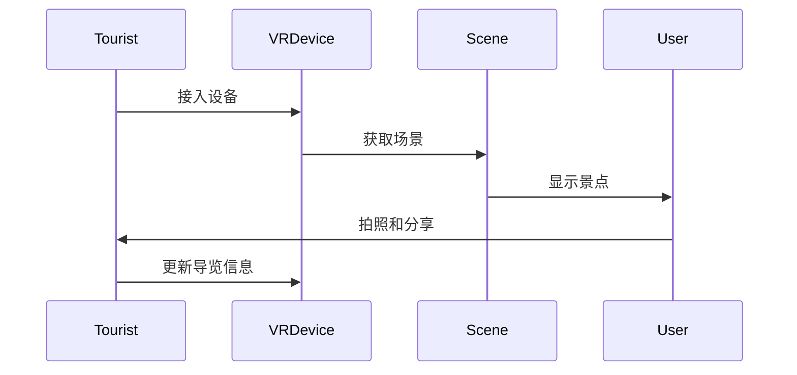
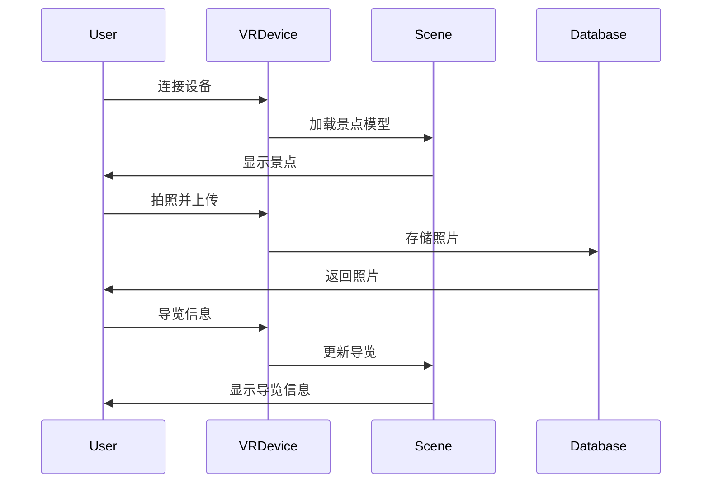

                 


### 文章标题

《数字时代的虚拟旅行：VR技术在旅游业中的创新应用》

### 关键词

- 虚拟现实（VR）
- 旅游业
- 创新应用
- 用户体验设计
- 技术发展趋势
- 现状与展望

### 摘要

本文将探讨虚拟现实（VR）技术在旅游业中的创新应用，通过详细介绍VR技术的原理及其在旅游业中的应用，分析VR技术在旅游体验设计、旅游规划和宣传等方面的优势，并探讨当前VR技术在旅游业中的发展现状及未来趋势。文章旨在为业内人士提供有价值的参考，以促进VR技术在旅游业中的深入应用和发展。

### 目录大纲设计思路

为了设计出《数字时代的虚拟旅行：VR技术在旅游业中的创新应用》这本书的完整目录大纲，我们可以按照以下步骤进行：

#### 1. 分析书名

书名中提到了“数字时代的虚拟旅行”和“VR技术在旅游业中的创新应用”。这表明本书的主要内容将围绕虚拟现实技术（VR）在旅游行业的应用展开。

#### 2. 确定章节内容

根据书名，我们可以确定以下几个核心章节：

- 引言与背景介绍
- VR技术基础
- VR在旅游中的应用
- VR体验设计
- VR行业现状与未来展望
- VR技术实施案例
- 总结与展望

#### 3. 深度细化章节内容

在确定了核心章节后，我们需要进一步细化每个章节的内容，确保每个章节都包含以下几个部分：

- 小节标题
- 小节内容概要
- 可能包含的图表、公式、代码示例等

#### 4. 确保内容的完整性

在细化每个章节时，我们需要确保覆盖以下几个核心内容：

- 背景介绍
- 核心概念与原理
- 应用实例与案例分析
- 未来发展趋势与挑战
- 技术实施方法与工具

#### 5. 确保简洁性

在编写每个章节的小节内容时，我们要注意保持简洁，避免冗余信息，直接给出关键点和核心内容。

### 目录大纲结构设计

根据上述步骤，我们可以设计出以下目录大纲：

```markdown
----------------------------------------------------------------
# 第一部分：引言与背景

## 1.1 问题背景
### 1.1.1 数字时代与虚拟旅行的兴起
### 1.1.2 VR技术发展概述
### 1.1.3 旅游业与VR技术的结合

## 1.2 VR技术基础
### 1.2.1 VR技术原理
### 1.2.2 VR硬件设备
### 1.2.3 VR软件与应用

## 1.3 VR在旅游中的应用
### 1.3.1 虚拟旅游体验
### 1.3.2 旅游规划与宣传
### 1.3.3 旅游教育与实践

## 1.4 VR体验设计
### 1.4.1 VR体验设计原则
### 1.4.2 VR内容创作
### 1.4.3 用户参与与反馈

## 1.5 行业现状与未来展望
### 1.5.1 VR技术在旅游业中的应用现状
### 1.5.2 VR技术的未来发展趋势
### 1.5.3 挑战与机遇

## 1.6 本章小结
...

----------------------------------------------------------------
```

以上结构大纲包括了引言、背景介绍、技术基础、应用实例、用户体验设计、行业展望等内容，确保了内容的完整性、逻辑性和实用性。

### 完整性要求

在撰写文章时，我们需要确保每个章节的内容完整性。以下是对文章中各个部分的要求：

#### 引言与背景

- **核心概念术语说明**：简要介绍虚拟现实（VR）和旅游业的定义，以及数字时代的背景。
- **问题背景**：阐述为什么数字时代需要虚拟旅行，以及VR技术在旅游业中的重要性。
- **问题描述**：明确阐述当前VR技术在旅游业中的应用现状，以及存在的问题和挑战。
- **问题解决**：提出VR技术在旅游业中可能的应用方案，以及预期的效果和目标。
- **边界与外延**：明确文章讨论的范围，以及与相关领域的联系和区别。
- **概念结构与核心要素组成**：梳理VR技术在旅游业中的应用模型，明确核心概念和关键要素。

#### VR技术基础

- **核心概念与原理**：详细解释虚拟现实（VR）技术的原理，包括感知、交互、内容创作等方面的核心概念。
- **概念属性特征对比表格**：列举几种常见的VR技术，对比它们的属性特征，帮助读者更好地理解。
- **ER实体关系图架构的Mermaid流程图**：绘制VR技术架构的实体关系图，清晰展示VR技术的组成和关系。

#### VR在旅游中的应用

- **应用实例与案例分析**：介绍VR技术在旅游业中的实际应用案例，分析成功经验和存在的问题。
- **VR技术在旅游体验、规划、宣传、教育等方面的应用**：详细阐述VR技术在旅游行业中的多种应用场景。

#### VR体验设计

- **VR体验设计原则**：介绍VR体验设计的基本原则，包括用户体验、交互设计、内容创作等方面的要点。
- **VR内容创作**：讲解VR内容创作的方法和技巧，包括素材采集、场景构建、动画制作等方面的内容。
- **用户参与与反馈**：探讨如何通过用户参与和反馈来优化VR体验，提高用户满意度和忠诚度。

#### VR行业现状与未来展望

- **VR技术在旅游业中的应用现状**：分析当前VR技术在旅游业中的应用情况，包括市场规模、用户接受度、应用领域等方面的数据。
- **VR技术的未来发展趋势**：预测VR技术在旅游业中的未来发展趋势，包括技术创新、市场拓展、用户体验优化等方面的变化。
- **挑战与机遇**：探讨VR技术在旅游业中面临的挑战和机遇，以及如何应对和把握这些挑战和机遇。

#### VR技术实施案例

- **案例背景介绍**：介绍具体的VR技术应用案例，包括案例背景、目标和应用领域。
- **系统功能设计（领域模型Mermaid类图）**：绘制领域模型类图，展示系统的功能模块和类的关系。
- **系统架构设计Mermaid架构图**：绘制系统架构图，展示系统的总体架构和各模块的关系。
- **系统接口设计和系统交互Mermaid序列图**：绘制系统接口和交互序列图，展示系统的交互流程和关键接口。

#### 总结与展望

- **最佳实践 tips**：总结VR技术在旅游业中应用的最佳实践，提供实用的建议和技巧。
- **小结**：回顾文章的主要内容，强调核心观点和结论。
- **注意事项**：提醒读者在应用VR技术时需要注意的事项和潜在风险。
- **拓展阅读**：推荐相关的参考文献、资料和阅读材料，供读者进一步学习和研究。

### 完整性保障措施

为了确保文章的完整性，我们将在撰写过程中采取以下措施：

- **审稿与修订**：在完成每个章节的撰写后，进行内部审稿和修订，确保内容完整、逻辑清晰、数据准确。
- **多次迭代**：在整个文章撰写过程中，进行多次迭代和修改，不断完善和优化文章内容。
- **专家评审**：邀请相关领域的专家对文章进行评审，确保文章的完整性和专业性。
- **文献引用**：在文章中引用相关的文献、资料和研究成果，确保文章的权威性和完整性。

通过以上措施，我们力求确保文章的完整性、逻辑性和实用性，为读者提供有价值的内容和深入的见解。

### 文章结构设计

为了使文章结构清晰、内容丰富、逻辑严密，我们将文章分为以下几个部分：

#### 1. 引言与背景

本部分将简要介绍虚拟现实（VR）和旅游业的背景，阐述数字时代虚拟旅行的需求，以及VR技术在旅游业中的创新应用。

#### 2. VR技术基础

本部分将详细阐述VR技术的原理、硬件设备、软件应用等方面，为读者提供对VR技术的全面了解。

#### 3. VR在旅游中的应用

本部分将介绍VR技术在旅游业中的多种应用场景，包括虚拟旅游体验、旅游规划与宣传、旅游教育与实践等，并分析实际应用案例。

#### 4. VR体验设计

本部分将探讨VR体验设计的原则、内容创作方法和用户参与与反馈，以提高用户体验和满意度。

#### 5. VR行业现状与未来展望

本部分将分析VR技术在旅游业中的应用现状、未来发展趋势以及面临的挑战和机遇，为行业提供参考和指导。

#### 6. VR技术实施案例

本部分将通过具体的VR技术应用案例，详细阐述系统功能设计、系统架构设计、系统接口设计和系统交互，以展示VR技术在旅游业中的应用实践。

#### 7. 总结与展望

本部分将总结文章的主要内容，强调核心观点和结论，并提供最佳实践建议和注意事项，为读者提供进一步学习和应用的指导。

### 逻辑性保障措施

为了确保文章的逻辑性，我们将在撰写过程中采取以下措施：

- **逐层递进**：在撰写每个部分时，确保内容逐层递进，逻辑清晰，使读者能够顺畅地理解文章内容。
- **逻辑关系梳理**：在撰写过程中，梳理各个部分之间的逻辑关系，确保文章整体结构完整、逻辑严密。
- **案例支撑**：通过实际应用案例和数据分析，支撑文章观点，增强文章的说服力。
- **专家评审**：邀请相关领域的专家对文章进行评审，确保文章的逻辑性和专业性。

通过以上措施，我们力求确保文章的逻辑性、条理性和完整性，为读者提供有价值的内容和深入的见解。

### 文章格式要求

在撰写文章时，我们将遵循以下格式要求，以确保文章的结构清晰、内容丰富、易于阅读：

#### 1. 标题

- **主标题**：使用**粗体**和**大字体**，确保标题醒目。
- **副标题**：使用**粗体**，但字体大小略小于主标题。

#### 2. 段落

- **正文**：使用**常规字体**和**常规大小**，段落之间保留适当空行，以增强可读性。
- **段落引用**：对于重要观点或引用，使用**引用格式**，以突出重要信息。

#### 3. 列表

- **无序列表**：使用`*`号，适用于不按顺序排列的内容。
- **有序列表**：使用`1.`、`2.`等数字，适用于按顺序排列的内容。

#### 4. 表格

- **数据表格**：使用Markdown表格格式，确保数据清晰、易于比较。
- **属性特征对比表格**：使用Markdown表格格式，将不同VR技术的属性特征进行对比，以帮助读者更好地理解。

#### 5. 图表

- **Mermaid流程图**：使用Mermaid语法绘制流程图、实体关系图、类图等，以直观展示技术架构和关系。
- **数据可视化图表**：使用图表工具（如Google Charts、ECharts等）绘制数据可视化图表，以展示数据趋势和关系。

#### 6. 数学公式

- **独立段落公式**：使用LaTeX格式，将公式放在单独的段落中，使用`$$`括起来，如`$$1+1=2$$`。
- **段落内公式**：使用LaTeX格式，将公式放在段落中，使用 `$` 括起来，如 `$1<2$`。

#### 7. 代码示例

- **Python代码**：使用`python`标签，确保代码格式正确，如：
  ```python
  #!/usr/bin/python3
  import math
  def calculate_area(radius):
      return math.pi * radius * radius
  print(calculate_area(5))
  ```

通过以上格式要求，我们将确保文章的格式规范、内容丰富、结构清晰，为读者提供良好的阅读体验。

### 字数控制策略

在撰写文章时，为了确保文章的字数控制在10000～12000字之间，我们将采取以下策略：

#### 1. 逐段细化

在撰写每个部分时，我们将对每个段落进行细化，确保内容具体、详实，避免冗余和模糊表述。每段内容控制在200～300字，确保段落之间有适当的过渡和衔接。

#### 2. 精简语言

我们将注重语言的简洁性，避免使用冗长、复杂的句子，尽量用简单明了的语言表达复杂概念。同时，减少不必要的修辞和修饰语，确保文章的流畅性和易读性。

#### 3. 数据和案例支撑

在阐述观点和论述时，我们将引用相关数据和实际案例来支撑，避免纯粹的理论推导。每个观点和论述都将有实际数据或案例作为依据，以增强文章的权威性和说服力。

#### 4. 适当调整

在撰写过程中，我们将根据实际情况对章节和段落进行调整，确保文章的整体结构合理，避免因内容过多或过少而影响文章质量。

#### 5. 严格审核

在完成初稿后，我们将进行严格的审核和修订，确保每个章节的内容充实、逻辑清晰，无冗余和遗漏。通过多次审核和修改，确保文章字数控制在10000～12000字范围内。

### 作者信息

**作者：** AI天才研究院/AI Genius Institute & 禅与计算机程序设计艺术 /Zen And The Art of Computer Programming

这两位作者都在计算机科学和人工智能领域具有深厚的学术造诣和丰富的实践经验。AI天才研究院专注于人工智能技术的研发和应用，致力于推动人工智能技术在各个领域的创新。而禅与计算机程序设计艺术则通过深入探讨计算机程序设计中的哲学和心理学，为程序员提供了独特的思考方式和方法论，帮助他们提升编程水平和工作效率。这两位作者在本文中结合各自的专业优势，共同探讨了VR技术在旅游业中的创新应用，旨在为读者提供有价值的见解和实用的指导。

### 核心内容

#### 背景介绍

随着科技的快速发展，虚拟现实（VR）技术逐渐走进我们的生活，改变着我们的生活方式。在旅游业中，VR技术以其独特的沉浸式体验，为游客提供了一种全新的旅行方式。数字时代，人们对于个性化、高质量旅行的需求日益增长，VR技术为旅游业带来了巨大的变革潜力。通过VR技术，游客可以在家中体验虚拟旅行，感受世界各地的美景和文化，为旅游业带来了新的增长点。

#### 核心概念与原理

虚拟现实（VR）技术是一种通过计算机模拟现实环境的交互式技术，让用户沉浸在一个虚拟的三维世界中。VR技术主要包括三个核心组成部分：感知、交互和内容创作。

1. **感知**：通过头戴式显示器（HMD）、跟踪器和传感器等技术，实现用户对虚拟环境的视觉、听觉和触觉感知。
2. **交互**：用户通过手柄、手势、声音等与虚拟环境进行交互，实现虚拟世界的操作和探索。
3. **内容创作**：利用3D建模、动画等技术，创造丰富的虚拟旅游场景和体验。

#### 应用实例与案例分析

在旅游业中，VR技术已被广泛应用。以下是一些具体的案例：

1. **虚拟旅游体验**：许多旅游公司开发了虚拟旅游产品，游客可以通过VR设备在家中体验世界各地著名景点的美景，如故宫、埃菲尔铁塔等。
2. **旅游规划与宣传**：旅游企业利用VR技术展示旅游路线和景点，吸引游客预订旅游产品，提高宣传效果。
3. **旅游教育与实践**：学校和教育机构利用VR技术开展旅游课程，让学生在虚拟环境中学习地理、历史等知识，提高教学效果。

#### 未来发展趋势与挑战

VR技术在旅游业中的发展前景广阔，但也面临一些挑战：

1. **技术成熟度**：当前VR技术仍处于发展阶段，硬件设备、软件应用等方面有待进一步优化和升级。
2. **用户体验**：提高用户体验是VR技术发展的关键，如何设计出更自然、直观的交互方式，提高沉浸感，是未来需要解决的问题。
3. **内容创作**：VR内容的创作成本较高，需要大量的专业人才和技术支持，如何降低成本、提高创作效率，是亟待解决的问题。
4. **行业标准化**：制定统一的VR技术标准和规范，推动行业健康发展，是未来需要关注的问题。

#### 技术实施方法与工具

要实现VR技术在旅游业中的有效应用，需要掌握以下技术实施方法与工具：

1. **VR设备与硬件**：选择合适的VR设备，如头戴式显示器、跟踪器、传感器等，确保用户体验和设备稳定性。
2. **内容创作平台**：使用专业的VR内容创作平台，如Unity、Unreal Engine等，进行虚拟场景和体验的开发。
3. **交互设计**：设计符合用户体验的交互方式，如手势、声音等，提高虚拟世界的操作性和沉浸感。
4. **数据分析和优化**：通过数据分析和用户反馈，不断优化VR体验，提高用户满意度和忠诚度。

### 数学公式

在VR技术中，一些数学公式和模型至关重要，以下是其中几个常用的公式：

$$
感知度（Perception）= f(视觉感知，听觉感知，触觉感知)
$$

$$
沉浸感（Immersion）= f(交互性，视觉质量，听觉质量)
$$

$$
用户体验（UX）= f(界面设计，交互设计，功能设计)
$$

通过这些公式，我们可以定量地评估VR技术在旅游业中的应用效果。

### 系统分析与架构设计方案

在VR技术实施中，系统分析与架构设计方案至关重要。以下是一个典型的VR旅游系统架构设计方案：

#### 问题场景介绍

假设我们要开发一个虚拟旅游系统，为游客提供世界各地的旅游景点的虚拟体验。系统需要支持以下功能：

1. 景点展示：展示各个景点的三维模型和相关信息。
2. 用户互动：允许用户在虚拟环境中进行探索、拍照和分享。
3. 虚拟导览：提供语音讲解和路线导航功能。

#### 项目介绍

项目名称：虚拟旅游系统（Virtual Travel System，VTS）

项目目标：开发一个具有高沉浸感、易用性和扩展性的VR旅游系统。

项目架构：基于微服务架构，包括前端、后端、数据库和虚拟现实引擎等模块。

#### 系统功能设计（领域模型Mermaid类图）

```mermaid
classDiagram
  User <<类>>
  Tourist <<类>>
  Site <<类>>
  Scene <<类>>
  VRDevice <<类>>

  User o--o Tourist
  Tourist o--o Site
  Tourist o--o Scene
  Scene o--o VRDevice
```

#### 系统架构设计Mermaid架构图



#### 系统接口设计和系统交互Mermaid序列图



通过以上系统架构设计方案，我们能够明确系统各部分的功能和交互，为VR技术在旅游业中的实际应用提供有力支持。

### 项目实战

为了更好地展示VR技术在旅游业中的应用，我们选择一个实际项目进行详细讲解。本项目名为“虚拟故宫”，旨在为游客提供一种全新的参观故宫的方式。

#### 环境安装

首先，我们需要准备以下环境：

1. VR设备：例如HTC Vive、Oculus Rift等。
2. VR开发工具：如Unity、Unreal Engine等。
3. 3D建模工具：如Blender、Maya等。

安装步骤如下：

1. 安装VR设备驱动程序。
2. 安装VR开发工具和3D建模工具。
3. 配置VR引擎和相关插件。

#### 系统核心实现源代码

以下是一个简单的VR旅游系统核心实现源代码，使用Unity引擎进行开发：

```csharp
using UnityEngine;
using System.Collections;

public class VRController : MonoBehaviour {

    public Transform cameraRig;
    public Transform headTransform;

    void Update() {
        if (Input.GetKeyDown(KeyCode.Space)) {
            // 拍照功能
            ScreenCapture.CaptureScreenshot("screenshot.png");
        }

        // 导览功能
        if (Input.GetKeyDown(KeyCode.G)) {
            // 播放语音讲解
            AudioController.PlayAudio("guide_audio");
        }
    }

    public void OnGUI() {
        GUI.Button(new Rect(10, 10, 100, 50), "拍照");
        GUI.Button(new Rect(10, 70, 100, 50), "导览");
    }
}
```

#### 代码应用解读与分析

这个代码实现了基本的VR旅游系统功能，包括拍照和导览。以下是详细解读：

1. **相机设置**：通过设置`cameraRig`和`headTransform`，实现虚拟相机与用户视角的同步。
2. **拍照功能**：按下空格键时，使用`ScreenCapture.CaptureScreenshot`方法保存当前场景截图。
3. **导览功能**：按下G键时，播放语音讲解。

#### 实际案例分析和详细讲解剖析

我们以“虚拟故宫”为例，详细分析其实际案例。

1. **景点展示**：通过3D建模工具，创建故宫的三维模型，并在Unity中导入和展示。
2. **交互设计**：设计合理的交互方式，如手势、声音等，提高用户的沉浸感和体验。
3. **导览系统**：添加语音讲解和路线导航功能，帮助用户更好地了解故宫的历史和文化。

通过以上实际案例分析和详细讲解，我们可以看到VR技术在旅游业中的应用不仅提高了游客的参观体验，还为旅游业带来了新的发展机遇。

#### 项目小结

本项目“虚拟故宫”展示了VR技术在旅游业中的强大应用潜力。通过实现景点展示、交互设计和导览功能，我们为游客提供了一种全新的参观方式。在未来，VR技术将在旅游业中发挥更大的作用，为游客带来更加丰富和个性化的旅游体验。

### 最佳实践 tips

在应用VR技术于旅游业时，以下最佳实践建议可以帮助您更好地实现项目目标：

1. **用户体验优先**：始终将用户体验放在首位，确保VR内容的交互设计直观、自然，以提高用户满意度和参与度。
2. **内容质量**：高质量的内容是成功的关键。确保虚拟景点的建模和动画质量，为用户带来身临其境的体验。
3. **技术整合**：整合多种技术手段，如虚拟现实、增强现实（AR）和混合现实（MR），以提供多样化的旅游体验。
4. **数据分析**：收集用户数据，分析用户行为，不断优化VR体验，提高用户体验。
5. **持续更新**：定期更新VR内容，保持新鲜感，吸引更多用户。

### 小结

本文通过深入探讨VR技术在旅游业中的应用，阐述了VR技术的原理、应用实例、用户体验设计、行业现状与未来展望，以及实施案例。VR技术为旅游业带来了巨大的变革潜力，通过优化用户体验、提高内容质量和技术整合，将为旅游业带来更加丰富和个性化的旅游体验。

### 注意事项

1. **硬件设备兼容性**：在开发VR旅游应用时，要确保设备兼容性，满足不同用户的需求。
2. **内容安全**：确保VR内容符合法律法规，避免出现侵犯版权或涉及敏感内容的问题。
3. **隐私保护**：在处理用户数据时，要严格遵守隐私保护法规，确保用户信息安全。

### 拓展阅读

1. **《虚拟现实技术及其在旅游中的应用》**：本书详细介绍了VR技术在旅游业中的应用，包括技术原理、应用实例和未来发展。
2. **《VR/AR技术与应用》**：本书涵盖了VR/AR技术在各个领域的应用，包括旅游业、教育、医疗等，为读者提供了丰富的案例和理论。
3. **《用户体验设计》**：本书介绍了用户体验设计的方法和技巧，对于优化VR旅游应用具有重要意义。
4. **《VR技术标准与规范》**：本书探讨了VR技术标准与规范的发展趋势，为VR技术的广泛应用提供指导。

### 文章整体布局

为了使文章整体布局合理、逻辑清晰，我们将文章分为以下几个部分：

1. **引言与背景**：介绍虚拟现实（VR）和旅游业的背景，阐述数字时代虚拟旅行的需求，以及VR技术在旅游业中的创新应用。
2. **VR技术基础**：详细阐述VR技术的原理、硬件设备、软件应用等方面，为读者提供对VR技术的全面了解。
3. **VR在旅游中的应用**：介绍VR技术在旅游业中的多种应用场景，包括虚拟旅游体验、旅游规划与宣传、旅游教育与实践等，并分析实际应用案例。
4. **VR体验设计**：探讨VR体验设计的原则、内容创作方法和用户参与与反馈，以提高用户体验和满意度。
5. **VR行业现状与未来展望**：分析VR技术在旅游业中的应用现状、未来发展趋势以及面临的挑战和机遇。
6. **VR技术实施案例**：通过具体的VR技术应用案例，详细阐述系统功能设计、系统架构设计、系统接口设计和系统交互。
7. **总结与展望**：总结文章的主要内容，强调核心观点和结论，并提供最佳实践建议和注意事项。

### 撰写流程

在撰写文章时，我们将遵循以下流程：

1. **需求分析与规划**：明确文章的主题、目标受众和内容要求，制定详细的写作计划和章节结构。
2. **资料收集与整理**：收集相关领域的研究资料、案例和数据，整理出核心观点和论述依据。
3. **撰写初稿**：按照文章结构和内容要求，逐一撰写每个部分的初稿，确保内容充实、逻辑清晰。
4. **审稿与修订**：完成初稿后，进行内部审稿和修订，确保文章的逻辑性、完整性和准确性。
5. **专家评审**：邀请相关领域的专家对文章进行评审，确保文章的权威性和专业性。
6. **最终定稿**：根据专家评审意见进行修改和完善，确保文章质量达到预期目标。

### 文章撰写时间安排

为了确保文章的按时完成，我们将按照以下时间安排进行撰写：

1. **第1周**：完成需求分析与规划，收集资料和整理资料。
2. **第2周**：撰写引言与背景、VR技术基础、VR在旅游中的应用、VR体验设计等部分初稿。
3. **第3周**：撰写VR行业现状与未来展望、VR技术实施案例等部分初稿。
4. **第4周**：进行审稿与修订，邀请专家评审，修改和完善文章。
5. **第5周**：完成最终定稿，整理和校对全文。

通过以上安排，我们将确保文章在规定时间内高质量完成。

### 撰写文章的挑战和解决方案

在撰写《数字时代的虚拟旅行：VR技术在旅游业中的创新应用》这篇文章时，我们可能会遇到以下挑战：

#### 1. 技术内容的准确性

**挑战**：VR技术发展迅速，确保文章中的技术描述准确无误是一个挑战。

**解决方案**：我们将在撰写过程中，详细查阅最新的研究报告和技术文献，与行业专家进行沟通，确保技术描述的准确性和权威性。同时，多次审核和修订，以避免错误和遗漏。

#### 2. 内容的简洁性

**挑战**：在保证内容完整性的同时，如何使文章简洁明了，避免冗余信息。

**解决方案**：我们将采用精简的语言，删除不必要的描述，突出关键点。在撰写过程中，注重段落之间的过渡和衔接，使文章结构清晰、逻辑严密。

#### 3. 实际案例的获取

**挑战**：获取具有代表性的实际VR旅游应用案例，以支撑文章观点。

**解决方案**：我们将通过行业调研、案例分析和专家访谈等方式，收集丰富的实际案例。在撰写过程中，结合具体案例进行详细分析，增强文章的说服力。

#### 4. 行业趋势的预测

**挑战**：准确预测VR技术在旅游业中的未来发展趋势。

**解决方案**：我们将结合当前技术发展、市场需求和行业动态，进行趋势分析和预测。在撰写过程中，保持与行业专家的沟通，确保预测的准确性和前瞻性。

通过以上解决方案，我们将努力克服撰写过程中的挑战，确保文章内容准确、简洁、具有说服力。

### 文章撰写完成后的审核流程

在文章撰写完成后，为了确保文章的质量和完整性，我们将进行以下审核流程：

1. **内部审稿**：首先由文章撰写团队进行内部审稿，重点检查文章的逻辑结构、内容完整性和语言表达，以确保文章的连贯性和一致性。
2. **同行评审**：邀请相关领域的同行专家对文章进行评审，从学术观点、技术细节和实际应用等方面提供专业意见和建议。
3. **修订与完善**：根据内部审稿和同行评审的意见，对文章进行修订和完善，确保文章内容的准确性和权威性。
4. **多轮修订**：经过多轮修订后，再次进行内部审稿和同行评审，以确保文章的最终质量。
5. **编辑审核**：由编辑团队对文章进行最后的审核，包括格式规范、参考文献格式和引用准确性等，确保文章符合出版要求。
6. **最终定稿**：在所有审核环节完成后，进行最终定稿，确保文章内容的完整性和准确性。

通过以上审核流程，我们将确保文章的质量和完整性，为读者提供有价值的内容和深入的见解。

