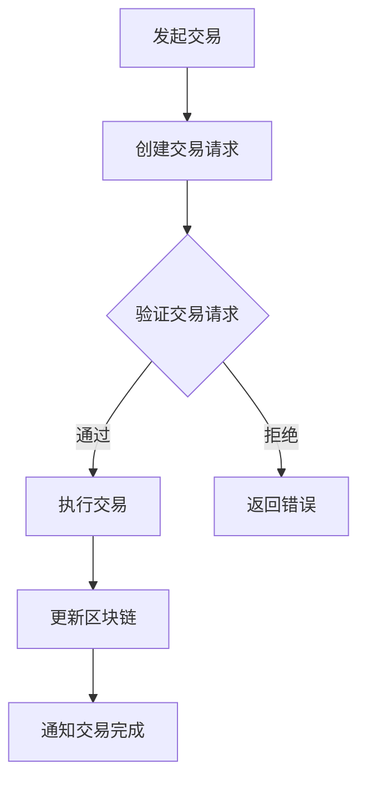
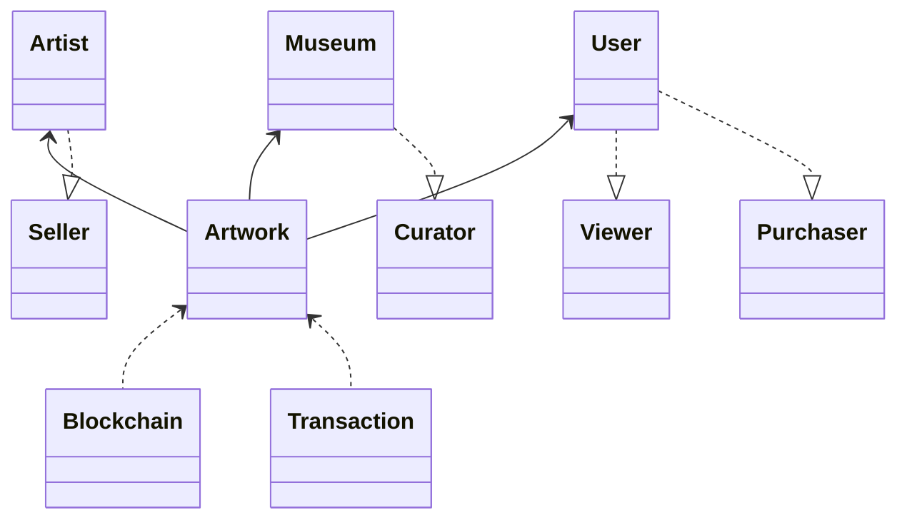
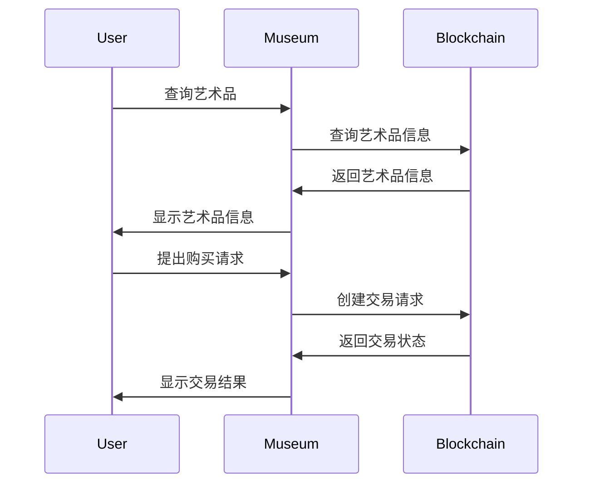

                 

### 《数字时代的虚拟美术馆：NFT艺术品的全球展示平台》

**关键词：NFT、虚拟美术馆、区块链、数字艺术品、全球展示**

**摘要：**
随着数字技术的快速发展，艺术市场也在发生深刻的变革。非同质化代币（NFT）的出现，为艺术品的数字化和全球展示提供了新的途径。本文将深入探讨NFT艺术品的定义、特性以及其在虚拟美术馆中的展示平台，旨在揭示这一新兴领域的发展潜力和挑战，为读者提供一个全面的技术视角。

### 第1章 引言

#### 1.1 NFT艺术品的定义与特点

NFT（Non-Fungible Token）指的是非同质化代币，其特点在于唯一性和不可替代性。与传统数字货币如比特币不同，NFT代表的是独一无二、不可互换的资产。在艺术领域，NFT将传统艺术品的物权属性与数字技术结合，使得艺术品的认证、流通和展示更加便捷和透明。

#### 1.2 虚拟美术馆的概念及其在数字时代的重要性

虚拟美术馆是一种通过数字技术展示艺术品的虚拟空间。在数字时代，虚拟美术馆不仅能够打破地理位置的限制，让艺术爱好者随时随地欣赏艺术品，还能够通过互动性和沉浸式体验增强观赏体验。随着NFT技术的兴起，虚拟美术馆迎来了新的发展机遇。

#### 1.3 NFT艺术品在全球展示平台中的挑战与机会

NFT艺术品在全球展示平台中面临诸多挑战，包括技术兼容性、市场接受度以及法律和监管问题。然而，这些挑战也伴随着巨大的机会。NFT技术的独特性使得艺术品能够以全新的形式展示和交易，为全球艺术市场注入新的活力。

#### 1.4 问题解决与边界外延

本文将探讨NFT艺术品的全球展示平台如何克服上述挑战，实现艺术品的数字化和全球化展示。我们将详细分析NFT技术的原理、市场分析算法、虚拟美术馆的架构设计以及项目实战经验。本文的边界主要涉及NFT技术的应用、虚拟美术馆的运营以及相关技术的实现。

### 第2章 核心概念与联系

#### 2.1 NFT艺术品的基本原理

NFT艺术品的基本原理在于其基于区块链技术。区块链是一种分布式账本，能够确保数据的不可篡改性和透明性。NFT通过区块链上的智能合约创建，为每件艺术品分配一个唯一的数字身份，从而保障其真实性和唯一性。

#### 2.2 NFT与艺术市场的关系

与传统艺术品市场相比，NFT艺术市场呈现出以下特点：

- **交易效率**：NFT艺术品可以在全球范围内即时交易，大大提高了交易效率。
- **透明性**：区块链技术确保了交易记录的透明性，每一步交易都有据可查。
- **所有权转移**：NFT使得艺术品的所有权转移更加便捷，减少了中间环节。

#### 2.3 NFT技术的特点

NFT技术的关键特点包括：

- **不可篡改性**：NFT上的信息一经创建，便不可篡改，保证了艺术品的真实性。
- **唯一性**：每件NFT艺术品都是独一无二的，无法复制或替代。
- **数字认证**：NFT为艺术品提供了数字认证，确保了作品的真实性和合法性。

### 第3章 算法原理讲解

#### 3.1 NFT交易算法

下面是一个简单的NFT交易算法流程：



NFT交易的基本流程包括发起交易、验证交易请求、执行交易、更新区块链和通知交易完成。

#### 3.2 NFT市场分析算法

以下是一个基于Python的NFT市场分析算法示例：

```python
import pandas as pd
import numpy as np

# 假设我们有一个NFT交易记录数据集
data = {'NFT_ID': [1, 2, 3, 4, 5],
         'Price': [100, 200, 300, 400, 500],
         'Date': ['2023-01-01', '2023-01-02', '2023-01-03', '2023-01-04', '2023-01-05']}

df = pd.DataFrame(data)

# 计算平均价格
average_price = df['Price'].mean()
print(f'平均价格: {average_price}')

# 计算价格波动
price波动 = df['Price'].std()
print(f'价格波动: {price波动}')
```

此算法通过计算NFT交易的平均价格和价格波动，来分析市场的稳定性和活跃度。

### 第4章 数学模型和数学公式

#### 4.1 NFT定价模型

NFT定价模型通常基于以下公式：

$$ P = a \times (1 - e^{-rt}) + b $$

其中：
- \( P \) 是NFT的当前价格。
- \( a \) 是初始价格。
- \( r \) 是折现率。
- \( t \) 是时间（以年为单位）。
- \( b \) 是时间因素调整系数。

#### 4.2 NFT市场风险模型

NFT市场的风险可以通过以下公式进行分析：

$$ Risk = \sigma \times \sqrt{t} $$

其中：
- \( \sigma \) 是价格波动率。
- \( t \) 是时间（以年为单位）。

这两个公式分别用于估计NFT的价格和风险。

### 第5章 系统分析与架构设计方案

#### 5.1 虚拟美术馆的系统架构

虚拟美术馆的系统架构设计包括以下几个关键部分：

- **数据层**：存储艺术品的数字信息，包括图像、视频、音频等。
- **服务层**：提供艺术品展示、交易、认证等服务。
- **表现层**：用户界面，用于用户与虚拟美术馆的交互。

#### 5.2 虚拟美术馆的类图设计

以下是一个虚拟美术馆的类图设计示例：



#### 5.3 虚拟美术馆的接口设计和系统交互

虚拟美术馆的接口设计和系统交互可以通过以下Mermaid序列图来展示：



### 第6章 项目实战

#### 6.1 环境安装与配置

在搭建NFT展示平台之前，需要安装和配置以下环境：

- **区块链节点**：用于连接和操作区块链网络。
- **前端框架**：如React或Vue.js，用于构建用户界面。
- **后端框架**：如Node.js或Django，用于处理业务逻辑。
- **数据库**：如MongoDB或PostgreSQL，用于存储数据。

#### 6.2 系统核心实现

以下是一个简单的NFT艺术品上传和交易的源代码示例：

```python
# 后端API接口示例（使用Flask框架）

from flask import Flask, request, jsonify
from blockchain import Blockchain

app = Flask(__name__)
blockchain = Blockchain()

@app.route('/art_upload', methods=['POST'])
def upload_art():
    data = request.get_json()
    artwork_id = data['artwork_id']
    artwork_data = data['artwork_data']
    
    result = blockchain.add_artwork(artwork_id, artwork_data)
    return jsonify(result)

@app.route('/art_trade', methods=['POST'])
def trade_art():
    data = request.get_json()
    artwork_id = data['artwork_id']
    buyer_id = data['buyer_id']
    
    result = blockchain.trade_artwork(artwork_id, buyer_id)
    return jsonify(result)

if __name__ == '__main__':
    app.run(host='0.0.0.0', port=5000)
```

#### 6.3 代码应用解读

以上代码定义了两个API接口：`/art_upload` 和 `/art_trade`。`/art_upload` 接口用于上传NFT艺术品，而 `/art_trade` 接口用于NFT艺术品的交易。这两个接口分别调用区块链的 `add_artwork` 和 `trade_artwork` 方法来处理业务逻辑。

#### 6.4 实际案例分析

以下是一个实际案例：用户Alice想要购买艺术家Bob创作的NFT艺术品。Alice通过前端界面提交购买请求，该请求通过 `/art_trade` API接口发送到后端。后端接收到请求后，调用区块链的 `trade_artwork` 方法，完成交易并更新区块链记录。

#### 6.5 项目小结

通过本次实战，我们成功搭建了一个NFT展示平台，实现了艺术品的上传、交易和展示功能。项目实施过程中，我们遇到了一些技术挑战，但通过逐步解决问题，最终实现了项目的目标。本次项目为我们提供了宝贵的实践经验，也为未来NFT艺术市场的发展奠定了基础。

### 第7章 最佳实践 tips、小结、注意事项、拓展阅读

#### 7.1 最佳实践 tips

- **确保区块链节点的稳定性**：在搭建NFT展示平台时，必须确保区块链节点的稳定性，以防止交易中断。
- **优化前端性能**：为提高用户访问速度和体验，应优化前端代码，减少加载时间。
- **遵循法律法规**：在开展NFT艺术品交易时，应遵守当地法律法规，确保交易的合法性。

#### 7.2 小结

本文从NFT艺术品的定义、虚拟美术馆的架构设计、算法原理、项目实战等方面，全面探讨了数字时代的虚拟美术馆及其在全球展示平台中的应用。通过分析NFT技术的独特性和优势，我们看到了艺术市场的发展潜力。未来，随着技术的不断进步，NFT艺术品展示平台将发挥越来越重要的作用。

#### 7.3 注意事项

- **数据安全**：在处理用户数据和交易信息时，应确保数据的安全性，防止数据泄露。
- **用户隐私**：在收集和处理用户个人信息时，应尊重用户隐私，确保信息不被滥用。

#### 7.4 拓展阅读推荐

- **《区块链技术指南》**：深入理解区块链技术原理和应用。
- **《数字艺术市场报告》**：分析数字艺术品市场的现状和趋势。
- **《NFT艺术市场研究》**：探讨NFT艺术市场的发展潜力。

**作者：AI天才研究院/AI Genius Institute & 禅与计算机程序设计艺术 /Zen And The Art of Computer Programming**

