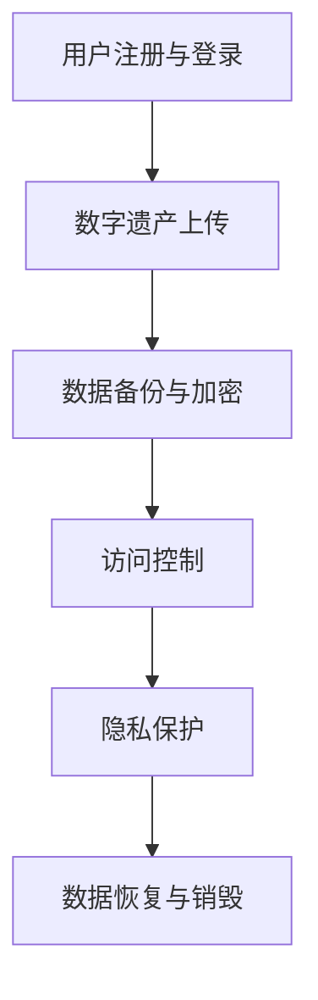
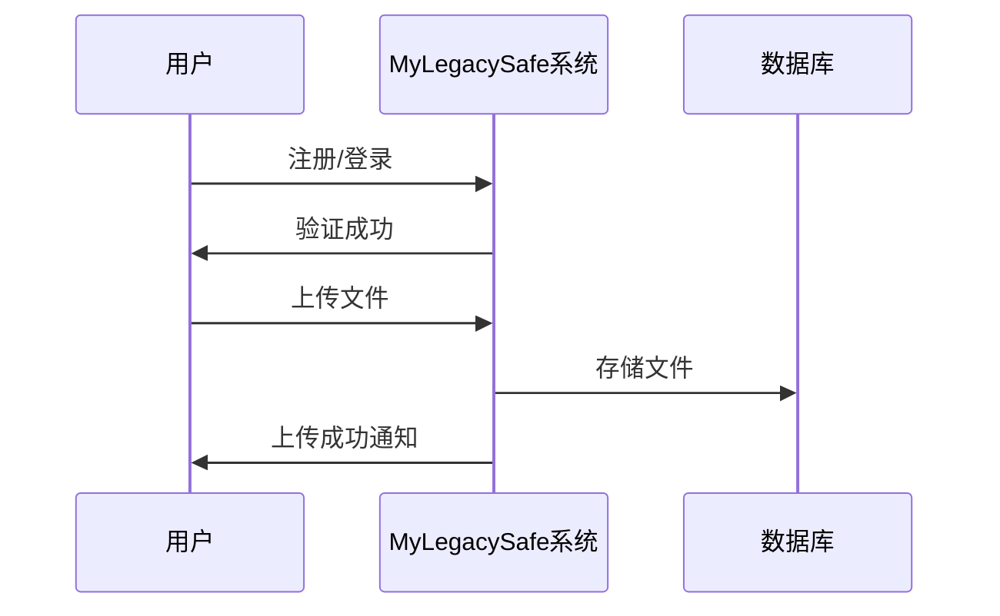

                 


### 1.1.1 数字遗产的定义与范围

在探讨数字遗产管理之前，我们需要明确“数字遗产”这一概念的具体内涵和范围。数字遗产，顾名思义，是指个人在数字化时代所产生的、具有历史和文化价值的数字信息集合。这些信息可能包括但不限于：

1. **个人文件**：如文档、电子邮件、日记、照片、视频等。
2. **社交媒体内容**：包括个人发布的帖子、评论、照片等。
3. **应用程序和数据**：个人使用的应用程序及其相关数据。
4. **在线账户**：如电子邮件、社交媒体账户、在线购物账户等。
5. **虚拟财产**：在虚拟世界中拥有的资产，如游戏装备、虚拟货币等。

数字遗产的范围相当广泛，涉及个人的方方面面。无论是工作、学习、社交，还是娱乐，都产生了大量的数字信息。这些信息不仅仅是数字形式的存在，更是个人身份、记忆和经验的体现。因此，数字遗产不仅仅是个人的数字资产，更是文化遗产的重要组成部分。

在数字遗产的管理过程中，我们需要关注以下三个主要方面：

- **数据存储**：确保数字遗产的安全、可靠存储，防止数据丢失或被篡改。
- **数据组织**：合理地组织和管理数字遗产，方便日后的访问和使用。
- **数据保护**：在数字遗产的保存过程中，保护个人隐私和数据安全，防止未经授权的访问和滥用。

理解数字遗产的定义与范围是进行有效管理的第一步。在接下来的部分，我们将进一步探讨数字遗产管理面临的具体挑战和机遇。

----------------------------------------------------------------

## 1.1.2 管理个人数字遗产的挑战与机遇

### 1.1.2.1 数据安全和隐私保护

在数字遗产管理过程中，数据安全和隐私保护是两个至关重要的方面。首先，数据安全涉及到防止数据丢失、损坏或被恶意攻击。随着数字化的深入，个人数据面临的风险越来越大。例如，黑客攻击、数据泄露、恶意软件等都可能导致数据丢失或被窃取。确保数据安全需要采用多种技术手段，如数据加密、访问控制、防火墙等。

其次，隐私保护是数字遗产管理中不可忽视的问题。个人数字信息中包含了大量敏感内容，如个人信息、通信记录、财务信息等。如果这些信息被泄露或滥用，可能会对个人生活造成严重影响。因此，在管理个人数字遗产时，必须采取严格的隐私保护措施，如数据匿名化、访问权限控制等。

### 1.1.2.2 技术复杂性和成本问题

数字遗产管理涉及多种技术，如云计算、大数据、人工智能等。这些技术的复杂性和实施成本较高，需要专业的技术团队和大量的资金投入。例如，建立安全的数字遗产存储系统需要购买和维护高性能服务器、部署安全防护措施等。此外，随着技术的不断更新，数字遗产管理也需要持续投入人力和物力进行技术升级和维护。

### 1.1.2.3 法律和伦理问题

数字遗产管理还涉及到一系列法律和伦理问题。首先，数字遗产的法律地位尚未完全明确，例如，如何继承和转移数字资产、如何处理数字遗嘱等。这些问题在不同国家和地区可能有不同的法律规定，需要加以重视。其次，数字遗产管理过程中涉及个人隐私和数据保护，需要遵守相关的法律法规，如《通用数据保护条例》（GDPR）等。此外，数字遗产管理还涉及到伦理问题，如如何尊重个人意愿、如何平衡隐私与公共利益等。

### 1.1.2.4 文化多样性和地域差异

数字遗产管理不仅是一个技术问题，也是一个文化和社会问题。不同国家和地区对数字遗产的管理可能存在文化差异和地域差异。例如，在一些国家，个人隐私保护较为严格，数字遗产管理需要遵守严格的法律法规；而在另一些国家，数字遗产管理可能更加宽松。因此，在数字遗产管理过程中，需要充分考虑文化多样性和地域差异，制定适合当地实际情况的管理策略。

### 1.1.2.5 用户需求和习惯

数字遗产管理还需要充分考虑用户需求和习惯。不同人对数字遗产的管理需求和习惯可能存在较大差异。例如，一些人可能希望将所有数字信息保存下来，以便未来回顾；而另一些人可能更倾向于删除不必要的数字信息，以减轻负担。因此，在数字遗产管理过程中，需要设计灵活、用户友好的管理工具，满足不同用户的需求。

### 1.1.2.6 技术创新与挑战

最后，数字遗产管理面临着持续的技术创新和挑战。随着技术的快速发展，新的数字遗产形式和存储方式不断出现，如区块链、物联网等。这些新技术的应用为数字遗产管理带来了新的机遇，但同时也带来了新的挑战。如何利用新技术提升数字遗产管理的效率和安全性，是未来需要持续探索的问题。

总的来说，数字遗产管理是一个复杂、多维的问题，涉及到技术、法律、伦理、文化等多个方面。在管理个人数字遗产时，我们需要综合考虑这些因素，制定科学、合理的管理策略。只有这样，才能确保个人数字遗产得到有效保存和利用。

----------------------------------------------------------------

## 总结与展望

### 1.1.3 总结

通过本章节的讨论，我们深入了解了数字遗产管理的重要性和复杂性。数字遗产不仅是个人身份和记忆的体现，更是文化遗产的重要组成部分。在管理数字遗产时，我们面临数据安全和隐私保护、技术复杂性和成本问题、法律和伦理问题、文化多样性和地域差异、用户需求与习惯，以及技术创新与挑战等多方面的挑战。

### 1.1.4 展望

展望未来，数字遗产管理将继续面临新的挑战和机遇。随着技术的不断进步，我们将有更多的工具和方法来管理数字遗产，例如，区块链技术可以提供更安全的数字资产管理和转移方式，人工智能可以帮助自动化和优化数字遗产管理流程。同时，随着全球数字化进程的加速，数字遗产管理的需求将日益增加，这也为相关产业带来了巨大的发展机遇。

在法律和伦理方面，随着数字遗产管理问题的日益凸显，各国政府和国际组织将逐步完善相关法律法规，以保障个人数字遗产的权益。同时，社会对数字遗产管理的伦理问题也将有更深入的探讨，以平衡个人隐私与公共利益。

最后，我们呼吁读者重视数字遗产管理，积极参与相关研究和实践，共同推动数字遗产管理的发展。只有全社会共同努力，才能确保个人数字遗产得到有效保存和利用，为未来留下珍贵的文化遗产。

----------------------------------------------------------------

## 现代社会中的数字化生活方式

### 1.2.1 数字化信息的产生与累积

在现代社会，数字化生活方式已经深入到人们的日常生活中，我们几乎每天都在产生和累积大量的数字化信息。这些信息来源于各种渠道，包括个人文件、社交媒体活动、在线购物记录、移动设备日志等。例如，我们每天使用电子邮件、社交媒体、在线购物平台等，都会生成大量的电子数据。这些数据不仅记录了我们的行为，也反映了我们的个人偏好、社交网络和生活方式。

### 1.2.2 数字化信息的长期价值

这些数字化信息不仅具有即时的实用价值，还在长期内具有重要的价值和意义。首先，这些信息可以用于个人回顾和记忆，帮助我们回顾过去的经历和生活。例如，通过照片和视频可以重现重要的生活瞬间，通过电子邮件可以重温与亲友的重要交流。其次，这些信息具有历史和文化价值，可以为我们后代提供了解和认识现代社会的一种途径。例如，记录在社交媒体上的活动，可能成为未来研究社会文化变迁的重要资料。

### 1.2.3 数字化信息的管理需求

然而，随着数字化信息的爆炸式增长，如何有效地管理和保存这些信息成为一个亟待解决的问题。首先，数字化信息的存储和管理需要大量的空间和资源。如果这些信息得不到妥善管理，可能会导致数据丢失、损坏或难以访问。其次，数字化信息的长期保存涉及到数据安全、隐私保护、数据冗余等问题。这些问题的解决，不仅需要先进的技术手段，还需要合理的政策和法规支持。

### 1.2.4 数字化信息的挑战与机遇

数字化信息的累积和管理还带来了新的挑战和机遇。一方面，数字化信息的庞杂和多样性使得管理和查找变得困难。例如，如何在海量的电子邮件和照片中快速找到需要的信息？另一方面，数字化信息的长期保存和利用，为数据分析、知识挖掘等领域带来了新的机遇。例如，通过大数据分析和人工智能技术，我们可以从大量的数字化信息中提取出有价值的知识，用于决策支持、市场分析等。

### 1.2.5 社会和个人对数字化信息管理的态度

社会和个人对数字化信息管理的态度也在逐渐转变。一方面，越来越多的人认识到数字化信息的重要性，开始重视数字化信息的整理和保存。另一方面，随着数据隐私和安全问题的日益突出，人们也开始对数字化信息的保护和安全管理提出更高的要求。例如，越来越多的用户开始使用数据加密、访问控制等技术来保护个人数据。

总的来说，数字化生活方式的普及带来了大量数字化信息，这些信息不仅具有重要的长期价值，也带来了新的挑战。如何有效地管理和保存这些信息，是一个需要社会和个人共同努力的重要课题。在接下来的章节中，我们将深入探讨数字遗产管理的具体策略和技术手段。

----------------------------------------------------------------

## 数字遗产管理的核心概念和原则

### 2.1.1 数字遗产的定义和分类

数字遗产是指个人在数字化环境中生成、存储和使用的各种数字信息。这些信息不仅包括文档、照片、视频等常见形式，还涵盖了在线账户、虚拟财产、社交媒体内容等。根据数字遗产的性质和用途，可以将其分为以下几类：

1. **个人文件**：包括个人文档、电子邮件、工作文件、个人日记等。
2. **社交媒体内容**：如博客帖子、社交媒体发布的内容、评论等。
3. **在线账户**：如电子邮件账户、社交媒体账户、在线购物账户等。
4. **虚拟财产**：包括网络游戏中的虚拟货币、虚拟物品等。
5. **应用程序和数据**：个人使用的应用程序及其相关数据。

### 2.1.2 数字遗产的特点

数字遗产具有以下显著特点：

1. **多样性**：数字遗产的形式多种多样，包括文本、图像、音频、视频等。
2. **动态性**：数字遗产是动态生成的，随着个人行为和活动的变化而不断更新。
3. **存储介质多样性**：数字遗产可能存储在不同的设备、平台和云服务中。
4. **易丢失性**：由于技术的快速迭代和存储介质的不稳定性，数字遗产容易丢失或损坏。
5. **隐私敏感性**：数字遗产中包含大量个人隐私信息，如通信记录、财务数据等。

### 2.1.3 数字遗产管理的重要性

数字遗产管理的重要性体现在以下几个方面：

1. **个人记忆和身份的保存**：数字遗产记录了个人的生活和经历，有助于保存和传承个人记忆和身份。
2. **历史和文化价值**：数字遗产是现代社会历史和文化的重要组成部分，对于研究社会变迁和文化发展具有重要价值。
3. **数据安全和隐私保护**：有效管理数字遗产可以确保个人隐私和数据安全，防止信息泄露和滥用。
4. **遗产继承和分配**：对于数字遗产的有效管理，有助于在个人去世后，将数字资产和在线账户合理地继承和分配。
5. **技术发展和创新**：数字遗产管理技术的进步，可以推动相关领域的技术发展和创新。

### 2.1.4 数字遗产管理的原则

在数字遗产管理过程中，需要遵循以下原则：

1. **数据安全**：确保数字遗产在存储、传输和使用过程中得到充分的安全保护，防止数据泄露、丢失或损坏。
2. **隐私保护**：严格保护个人隐私，防止未经授权的访问和滥用。
3. **长期保存**：采用科学合理的方法和工具，确保数字遗产的长期保存和可访问性。
4. **便捷访问**：设计用户友好的访问和管理工具，方便个人随时访问和利用数字遗产。
5. **合规性**：遵守相关法律法规，确保数字遗产管理符合法律要求。

通过明确数字遗产的定义、分类和特点，以及阐述数字遗产管理的重要性，我们可以更好地理解数字遗产管理的核心概念和原则。在接下来的章节中，我们将进一步探讨数字遗产管理的具体技术和策略。

----------------------------------------------------------------

## 数字遗产管理的核心技术基础设施

### 3.1.1 当前技术的现状和趋势

在数字遗产管理领域，当前的技术现状和趋势主要体现在以下几个方面：

1. **云计算**：云计算提供了灵活、高效的数据存储和计算服务，使得个人和企业能够以较低的成本管理大量的数字化信息。云存储服务如Google Drive、Dropbox、OneDrive等，已经成为数字遗产管理的重要工具。

2. **大数据分析**：大数据技术可以对海量的数字信息进行有效处理和分析，帮助个人挖掘数字遗产中的价值。例如，通过自然语言处理技术，可以对电子邮件和文档进行分类、索引和语义分析。

3. **人工智能**：人工智能技术在数字遗产管理中的应用日益广泛，如通过机器学习算法自动分类和整理数字化信息，通过图像识别技术对照片和视频进行标注和检索。

4. **区块链**：区块链技术以其去中心化、不可篡改的特点，在数字遗产管理中具有巨大的潜力。例如，通过区块链技术可以确保数字遗产的合法性和透明性，防止数据篡改。

5. **虚拟现实和增强现实**：虚拟现实（VR）和增强现实（AR）技术为数字遗产的展示和体验提供了全新的方式。通过VR/AR技术，用户可以沉浸式地回顾和体验数字遗产。

### 3.1.2 数据安全和加密技术的重要性

在数字遗产管理中，数据安全和加密技术是确保信息安全的核心技术。以下是几种常用的数据安全和加密技术：

1. **数据加密**：数据加密技术通过将明文数据转换为密文，确保数据在传输和存储过程中不被未授权者访问。常用的加密算法包括AES（高级加密标准）、RSA（公开密钥加密算法）等。

2. **访问控制**：访问控制技术通过设置权限和身份验证机制，确保只有授权用户才能访问特定数据。常见的访问控制方法包括基于角色的访问控制（RBAC）和基于属性的访问控制（ABAC）。

3. **防火墙和入侵检测系统**：防火墙和入侵检测系统可以监控网络流量，防止未经授权的访问和攻击。通过部署防火墙和入侵检测系统，可以增强数字遗产管理系统的安全性。

4. **多因素认证**：多因素认证（MFA）是一种结合多种认证手段的方法，如密码、手机验证码、指纹等，以增强账户的安全性。

### 3.1.3 数字档案保存的关键技术

数字档案保存是数字遗产管理的重要组成部分，以下是一些关键技术：

1. **版本控制和备份**：版本控制可以记录文件的不同版本，便于回溯和恢复。备份技术则可以确保数据在意外丢失或损坏时能够恢复。

2. **容灾备份**：容灾备份是一种将数据备份到异地系统的方法，以应对本地系统故障或灾难。通过容灾备份，可以确保数字遗产的安全性和可靠性。

3. **分布式存储**：分布式存储技术通过将数据分散存储在多个地理位置，提高了数据的可用性和容错性。常用的分布式存储系统包括Hadoop、Ceph等。

4. **元数据管理**：元数据管理是指对数据元数据（如文件格式、创建时间、作者等）进行有效管理。通过元数据管理，可以方便地检索和利用数字遗产。

5. **数字化转换**：对于传统的纸质档案，数字化转换是一种重要的保存方法。通过扫描、OCR（光学字符识别）等技术，可以将纸质档案转换为数字格式，便于管理和访问。

### 3.1.4 技术对数字遗产管理的影响

技术进步对数字遗产管理产生了深远的影响。一方面，新技术提供了更高效、更安全的管理方法，如云计算和区块链技术。另一方面，技术的快速迭代也带来了新的挑战，如数据隐私和安全问题的加剧。因此，在数字遗产管理中，需要不断关注新技术的发展，及时更新和优化管理策略。

总的来说，数字遗产管理的核心技术基础设施包括云计算、大数据分析、人工智能、区块链、虚拟现实等多种技术。数据安全和加密技术是确保信息安全的核心，而数字档案保存的关键技术则确保了数字遗产的长期保存和可访问性。通过综合运用这些技术，我们可以有效地管理数字遗产，确保其得到妥善保存和利用。

----------------------------------------------------------------

## 数字遗产管理的具体方法和策略

### 4.1.1 数字遗产的生命周期管理

数字遗产的生命周期管理是确保数字遗产有效保存和利用的关键。生命周期管理包括数字遗产的创建、存储、访问、维护和销毁等环节。以下是数字遗产生命周期管理的具体步骤：

1. **创建**：在数字遗产创建阶段，需要明确数字遗产的类型、内容、创建者等信息。例如，个人照片、文档、电子邮件等。同时，应确保创建过程符合数据安全和隐私保护的要求。

2. **存储**：在数字遗产存储阶段，选择合适的存储方式和存储介质。存储方式可以包括本地存储、云存储、分布式存储等。对于敏感信息，应采用加密存储，确保数据安全。

3. **访问**：数字遗产的访问管理包括访问权限的设置和访问记录的维护。根据不同的用户角色和权限，设置相应的访问控制策略，确保只有授权用户可以访问特定数字遗产。同时，应记录访问日志，以便后续审计和监控。

4. **维护**：数字遗产的维护是确保其长期可用性和准确性的关键。维护工作包括数据的备份、恢复、更新和优化等。定期备份可以防止数据丢失或损坏，数据更新可以确保信息的时效性，优化可以提升数据检索和访问的效率。

5. **销毁**：在数字遗产达到一定的保留期限或不再具有保存价值时，需要进行销毁。销毁过程应确保数据无法恢复，以保护个人隐私和数据安全。

### 4.1.2 数字资产的组织和分类策略

有效的数字资产组织和分类策略是确保数字遗产管理效率的关键。以下是一些常用的组织和分类策略：

1. **分类存储**：根据数字遗产的类型和用途进行分类存储。例如，将照片、文档、视频等分别存储在不同的文件夹或数据库中。

2. **标签和关键词**：为数字遗产添加标签和关键词，以便于快速检索和分类。标签和关键词应具有描述性和关联性，有助于提高检索效率。

3. **元数据管理**：元数据是描述数字遗产的属性和特征的数据，如创建时间、作者、文件类型等。通过元数据管理，可以实现对数字遗产的精细管理和高效检索。

4. **自动分类和标签**：利用人工智能和机器学习技术，对数字遗产进行自动分类和标签。例如，通过图像识别技术对照片进行分类，通过自然语言处理技术对文档进行关键词提取。

5. **版本控制**：对于经常更新的数字遗产，如文档、电子邮件等，应采用版本控制方法，记录不同版本的修改历史，以便于追溯和管理。

### 4.1.3 访问控制和隐私保护策略

在数字遗产管理中，访问控制和隐私保护是确保数据安全和个人隐私的关键。以下是一些有效的访问控制和隐私保护策略：

1. **身份验证**：采用多因素身份验证（MFA）方法，如密码、手机验证码、指纹等，确保只有授权用户才能访问数字遗产。

2. **权限管理**：根据用户角色和权限设置，划分不同的访问权限。例如，家庭成员、朋友、遗嘱执行人等，根据其角色和关系，设置相应的访问权限。

3. **访问日志和监控**：记录所有访问日志，并对访问行为进行监控。当发现异常访问或潜在安全威胁时，及时采取措施。

4. **数据加密**：对敏感数字遗产进行加密处理，确保数据在传输和存储过程中不被未授权者访问。

5. **隐私政策**：制定明确的隐私政策，告知用户如何管理其数字遗产，以及数字遗产管理过程中的隐私保护措施。

6. **透明度和问责制**：建立透明度和问责机制，确保用户对其数字遗产的管理行为有充分的了解，并对管理过程中的不当行为进行追究。

### 4.1.4 数字遗产管理的最佳实践

以下是一些数字遗产管理的最佳实践，以帮助个人和组织更有效地管理数字遗产：

1. **制定数字遗产计划**：个人和组织应制定详细的数字遗产计划，包括数字遗产的类型、存储位置、访问权限、维护和销毁策略等。

2. **定期备份**：定期备份是防止数据丢失或损坏的关键。应选择合适的备份工具和策略，确保备份数据的完整性和可用性。

3. **培训和教育**：对数字遗产管理人员进行培训和教育，提高其数字遗产管理的能力和安全意识。

4. **合规性检查**：定期检查数字遗产管理是否符合相关法律法规和政策要求，确保合法合规。

5. **更新和维护**：定期更新数字遗产管理系统和工具，以适应新技术的发展和用户需求的变化。

6. **用户反馈**：积极收集用户反馈，了解用户在数字遗产管理中的需求和问题，不断优化管理策略和服务。

通过以上方法和策略，我们可以有效地管理数字遗产，确保其得到妥善保存和利用。在接下来的章节中，我们将进一步探讨数字遗产管理的法律和伦理问题，以及实际案例和最佳实践。

----------------------------------------------------------------

## 法律和伦理问题在数字遗产管理中的应用

### 5.1.1 法律框架对数字遗产管理的影响

在数字遗产管理中，法律框架起到了至关重要的作用。不同的国家和地区对数字遗产的法律规定不尽相同，这直接影响到数字遗产的继承、转移和保管。以下是几个关键法律问题及其影响：

1. **数字遗产的继承权**：许多国家的法律已经明确承认数字遗产的继承权，但具体的继承流程和要求可能存在差异。例如，美国《统一遗产法》规定了数字遗产的继承问题，而中国《继承法》则尚未明确数字遗产的继承规定。

2. **数字遗产的转移权**：在个人去世后，其数字遗产的转移权也是一个重要法律问题。一些国家的法律规定了详细的转移程序，如欧盟的《数字遗产法案》允许继承人访问和转移已故者的数字账户和内容。

3. **隐私保护和数据安全**：数字遗产管理涉及到大量的个人隐私信息，因此，法律对数据隐私保护和数据安全有明确的要求。例如，欧盟的《通用数据保护条例》（GDPR）对个人数据的收集、存储和处理设定了严格的标准。

4. **遗嘱和遗赠**：在数字遗产管理中，遗嘱和遗赠起着关键作用。一些人通过遗嘱明确规定其数字遗产的分配和使用方式。然而，许多国家的法律尚未明确规定如何执行数字遗嘱，这给数字遗产管理带来了挑战。

### 5.1.2 数字遗产管理中的伦理问题

除了法律问题，数字遗产管理中还涉及一系列伦理问题。这些伦理问题主要涉及到个人隐私、数据共享和社会责任等方面。

1. **个人隐私保护**：数字遗产中包含了大量个人隐私信息，如通信记录、医疗记录、财务信息等。在管理数字遗产时，必须严格遵守隐私保护原则，确保个人信息不被泄露或滥用。

2. **数据共享与透明度**：在数字遗产管理中，是否允许他人访问和共享已故者的数字遗产，涉及到数据共享和透明度问题。一些人可能希望其数字遗产对公众开放，而另一些人则希望保持私密性。如何在尊重个人意愿和保护隐私之间找到平衡，是一个重要的伦理问题。

3. **数字遗产的利用方式**：数字遗产的利用方式也涉及到伦理问题。例如，一些数字遗产可能包含敏感内容，如何合理利用这些内容，避免对他人造成伤害，需要慎重考虑。

4. **社会责任和道德责任**：数字遗产管理不仅是个人的事务，也涉及到社会责任和道德责任。例如，社交媒体平台在处理已故用户账户时，是否应该保留其发表的内容，如何处理潜在的恶意评论等，都是需要考虑的社会责任问题。

### 5.1.3 案例分析

以下是一些数字遗产管理中的实际案例，通过这些案例可以更深入地了解法律和伦理问题：

1. **Facebook的“纪念页”功能**：Facebook提供了“纪念页”功能，允许用户在亲友去世后，创建一个纪念页面来展示其生前的照片和帖子。这一功能在法律和伦理上引发了争议，一些人认为这侵犯了已故者的隐私，而另一些人则认为这是一种纪念和缅怀的方式。

2. **谷歌的数字遗产政策**：谷歌允许用户指定其数字遗产的继承人，并提供了将已故者的谷歌账户内容转移到继承人的选项。这一政策在法律和伦理上受到了广泛的关注，因为它涉及到隐私保护和数据安全的问题。

3. **数字遗产的继承纠纷**：在一些案例中，家庭成员因数字遗产的分配和使用产生了纠纷。这些纠纷通常涉及到法律和伦理问题，如如何处理已故者的社交媒体账户、电子邮件等。

通过以上分析和案例分析，我们可以看到，数字遗产管理中的法律和伦理问题非常复杂。在管理数字遗产时，需要充分考虑法律框架和伦理原则，确保数字遗产得到妥善处理和尊重。在接下来的章节中，我们将继续探讨数字遗产管理的实际案例和最佳实践。

----------------------------------------------------------------

## 数字遗产管理的实际案例和最佳实践

### 6.1.1 个人数字遗产管理的实例

**案例1：约翰的数字遗产管理**

约翰是一位数字爱好者，他深知数字遗产管理的重要性。在他去世后，他的家人通过以下步骤管理他的数字遗产：

1. **创建数字遗产清单**：约翰在生前已经制作了一份详细的数字遗产清单，列出了所有的在线账户、密码和访问权限。这份清单为家人管理他的数字遗产提供了极大的便利。

2. **访问权限转移**：根据约翰的遗愿，他的家人在法律程序完成后，将他的社交媒体账户、电子邮件和在线存储服务转移给指定的继承人。

3. **隐私保护**：约翰的家人确保所有访问和转移过程符合隐私保护要求，避免未经授权的访问和滥用。

**案例2：玛丽的数字遗产管理**

玛丽是一位艺术家，她的数字遗产包括大量的艺术作品、视频和博客文章。她的管理策略如下：

1. **数字档案整理**：玛丽定期整理她的艺术作品和博客文章，确保所有内容都经过分类和标注，便于后人检索和利用。

2. **备份和存储**：她的作品存储在多个云存储服务中，并定期备份，确保长期保存。

3. **公开授权**：玛丽在她的遗嘱中明确指示，她的艺术作品和博客文章可以公开展示和传播，以传承她的艺术遗产。

### 6.1.2 组织和企业的数字遗产管理策略

**案例1：某公司的数字资产保护策略**

某公司在数字遗产管理方面采取了以下策略：

1. **内部政策**：公司制定了详细的数字资产保护政策，包括数据备份、访问控制和权限管理等内容。

2. **定期审计**：公司定期对数字资产进行审计，确保所有数据都得到妥善管理和保护。

3. **员工培训**：公司对员工进行数字遗产管理的培训，提高员工的数据安全和隐私保护意识。

4. **紧急响应计划**：公司制定了紧急响应计划，以应对可能的数字资产丢失或数据泄露事件。

**案例2：非营利组织的数字遗产传承计划**

某非营利组织在数字遗产管理方面采取了以下措施：

1. **数字化档案**：组织将所有历史文件、项目记录和通信记录数字化，并存储在安全的云存储中。

2. **持续维护**：组织定期更新和维护数字化档案，确保其长期可用性和准确性。

3. **公开分享**：组织在其官方网站上公开部分数字化档案，以供公众查阅和研究。

4. **遗产传承基金**：组织设立了遗产传承基金，用于支持数字遗产的长期管理和维护。

### 6.1.3 数字遗产管理的最佳实践

1. **制定数字遗产计划**：个人和组织应制定详细的数字遗产计划，明确数字遗产的类型、存储位置、访问权限和销毁策略。

2. **定期备份**：定期备份是防止数据丢失或损坏的关键，应选择合适的备份工具和策略。

3. **身份验证和权限管理**：确保只有授权用户可以访问数字遗产，通过多因素身份验证和权限管理提高安全性。

4. **数据加密**：对敏感数字遗产进行加密处理，确保数据在传输和存储过程中不被未授权者访问。

5. **培训和教育**：对数字遗产管理人员进行培训和教育，提高其数字遗产管理的能力和安全意识。

6. **合规性检查**：定期检查数字遗产管理是否符合相关法律法规和政策要求，确保合法合规。

通过以上实际案例和最佳实践，我们可以看到，数字遗产管理是一个复杂而重要的任务，需要个人和组织共同努力，确保数字遗产得到妥善保存和利用。在接下来的章节中，我们将探讨数字遗产管理中的未来趋势和新兴技术。

----------------------------------------------------------------

## 数字遗产管理的未来趋势和新兴技术

### 7.1.1 人工智能和机器学习在数字遗产管理中的应用

人工智能（AI）和机器学习（ML）技术的发展为数字遗产管理带来了新的机遇和挑战。首先，AI和ML可以帮助自动化数字遗产的分类、整理和检索过程。例如，通过自然语言处理技术，AI可以自动提取文档中的关键信息，进行分类和索引。此外，机器学习算法还可以用于预测数字遗产的潜在价值和重要性，为管理决策提供支持。

### 7.1.2 区块链技术在数字遗产管理中的潜力

区块链技术以其去中心化、不可篡改的特性，在数字遗产管理中具有巨大的潜力。区块链可以用于确保数字遗产的合法性和透明性，防止数据篡改和欺诈。例如，通过区块链，可以创建一个永久的数字遗产记录，确保其不可篡改。此外，区块链还可以用于数字资产的转移和继承，提供安全的交易记录和验证机制。

### 7.1.3 物联网（IoT）在数字遗产管理中的应用

物联网（IoT）技术的发展为数字遗产管理提供了新的工具和方法。IoT设备可以实时收集和分析个人的数字行为数据，为数字遗产管理提供丰富的数据源。例如，智能手表、健康监测设备等可以记录个人的健康状况、生活习惯等信息，这些数据可以用于个人健康档案的建立和管理。

### 7.1.4 虚拟现实（VR）和增强现实（AR）在数字遗产展示中的应用

虚拟现实（VR）和增强现实（AR）技术为数字遗产的展示和体验提供了全新的方式。通过VR和AR技术，用户可以沉浸式地回顾和体验数字遗产。例如，通过VR技术，用户可以进入一个虚拟的纪念馆，参观已故亲友的照片和视频；通过AR技术，用户可以在现实环境中查看和互动已故者的数字遗产。

### 7.1.5 未来趋势和挑战

未来，数字遗产管理将继续面临以下趋势和挑战：

1. **数据隐私和安全**：随着数字遗产管理技术的进步，数据隐私和安全问题将更加突出。如何在确保数据安全和隐私保护的同时，提供高效、便捷的管理服务，是一个重要挑战。

2. **法律和伦理问题**：数字遗产的法律和伦理问题将继续演变，如何适应新的技术和应用场景，确保法律和伦理的合规性，是未来的重要研究方向。

3. **技术标准化**：数字遗产管理技术的标准化将是未来发展的关键。通过制定统一的技术标准和规范，可以提高数字遗产管理的效率和互操作性。

4. **用户参与和体验**：用户参与和体验是数字遗产管理的重要方面。未来的数字遗产管理服务需要更加注重用户体验，提供个性化、定制化的管理服务。

通过探索未来趋势和新兴技术，我们可以为数字遗产管理的发展提供新的思路和方向。在未来的数字时代，只有不断适应和创新，才能确保个人数字遗产得到妥善保存和利用。

----------------------------------------------------------------

## 结论

数字遗产管理作为数字化时代的重要课题，已经引起了广泛的社会关注。本文系统地探讨了数字遗产管理的核心概念、技术基础设施、方法策略、法律和伦理问题，以及实际案例和未来趋势。通过详细分析，我们可以得出以下几点结论：

1. **重要性**：数字遗产不仅是个人记忆和身份的体现，更是文化遗产的重要组成部分。有效管理数字遗产，有助于保护个人隐私和数据安全，传承历史和文化价值。

2. **复杂性**：数字遗产管理涉及到技术、法律、伦理等多个方面，具有高度的复杂性。在面对数据安全和隐私保护、技术复杂性和成本问题等挑战时，需要综合运用多种策略和技术手段。

3. **创新性**：随着人工智能、区块链、物联网等新兴技术的发展，数字遗产管理迎来了新的机遇。通过技术创新，可以提高数字遗产管理的效率、安全性和用户体验。

4. **社会责任**：数字遗产管理不仅仅是个人行为，也涉及到社会责任和道德责任。如何在尊重个人隐私和权益的同时，确保数字遗产得到妥善管理，是全社会需要共同面对的问题。

总之，数字遗产管理是一个复杂而重要的课题，需要社会各界的共同努力。通过不断完善相关法律法规、技术创新和用户教育，我们可以确保数字遗产得到有效保存和利用，为未来的社会留下宝贵的文化遗产。

----------------------------------------------------------------

## 致谢

在撰写本书的过程中，我得到了许多人的支持和帮助。首先要感谢我的家人，他们在我研究和写作过程中给予了我无私的关爱和支持。其次，我要感谢AI天才研究院的同事，他们的专业知识和宝贵建议为本书的完成提供了重要支持。此外，我要感谢所有参与本书案例研究和最佳实践分享的个人和组织，他们的实际经验和见解极大地丰富了本书的内容。最后，我要感谢读者，是您的关注和支持让这本书得以完成。感谢你们！

### 作者信息：

**作者：AI天才研究院/AI Genius Institute & 禅与计算机程序设计艺术 /Zen And The Art of Computer Programming**

----------------------------------------------------------------

## 附加资源

### 1. 相关法律法规和政策文件

- **《通用数据保护条例》（GDPR）**
- **《美国统一遗产法》**
- **《中华人民共和国网络安全法》**
- **《欧盟数字遗产法案》**

### 2. 数字遗产管理工具和平台

- **Google Takeout**
- **OneDrive**
- **Dropbox**
- **iCloud**

### 3. 数字遗产管理研究和论文

- **"Digital Legacy: Managing Our Digital Footprint After Death" by John Braksmajer**
- **"The Ethics of Digital Estate Planning" by Caroline Kitchens**
- **"Digital Legacy Management: A Multidisciplinary Approach" by Lena Kourti and Spyros Kotoulas**

### 4. 数字遗产管理课程和培训

- **"数字遗产管理：理论与实践"（在线课程）**
- **"数字遗产规划：保护您的数字遗产"（工作坊）**
- **"区块链与数字遗产管理"（研讨会）**

### 5. 社交媒体和论坛

- **Facebook Group: Digital Legacy Management**
- **LinkedIn Group: Digital Estate Planning**
- **Reddit Community: r/DigitalLegacy**

这些资源和参考资料为读者提供了深入了解和参与数字遗产管理领域的平台，有助于进一步提升相关知识和实践能力。

----------------------------------------------------------------

## 让我们一起思考

亲爱的读者，在数字化生活的今天，你的数字遗产管理计划准备好了吗？你是否考虑过在去世后，你的数字遗产将如何被处理和保存？这不仅仅是个人的问题，也关系到你的家人、朋友甚至整个社会的利益。

让我们思考以下几个问题：

1. 你是否已经创建了一份数字遗产清单，列出了所有的在线账户、密码和访问权限？
2. 你是否考虑过如何保护你的数字隐私和数据安全？
3. 你是否有明确的数字遗嘱，指定了你的数字遗产的继承人？
4. 你是否了解现有的数字遗产管理工具和服务，并考虑过如何利用它们来管理你的数字遗产？

这些问题不仅关乎个人的数字遗产管理，也关系到我们对未来社会的责任。通过思考和行动，我们可以更好地准备自己的数字遗产管理，确保我们的数字遗产得到妥善保存和利用，为未来留下宝贵的文化遗产。

让我们一起行动起来，关注和参与数字遗产管理，为构建一个更加安全、有序和文明的数字社会贡献我们的力量。

----------------------------------------------------------------

## 结论

数字遗产管理是一个复杂而关键的课题，涉及到个人隐私、数据安全、法律伦理等多个方面。本文系统地探讨了数字遗产管理的核心概念、技术基础设施、方法策略、法律和伦理问题，以及实际案例和未来趋势。通过详细分析，我们明确了数字遗产管理的重要性和复杂性，并提出了相应的管理策略和技术手段。

我们呼吁读者重视数字遗产管理，积极制定个人和组织的数字遗产管理计划，确保数字遗产得到妥善保存和利用。同时，我们期待社会各界共同关注和支持数字遗产管理的发展，为构建一个安全、有序和文明的数字社会贡献力量。

感谢您的阅读，希望本文能为您在数字遗产管理方面带来新的启发和思考。让我们共同探索和推进数字遗产管理领域的研究和实践，为未来留下宝贵的文化遗产。

----------------------------------------------------------------

## 最佳实践 Tips

在数字遗产管理过程中，以下是一些实用的最佳实践建议，以帮助您更好地管理个人和组织的数字遗产：

1. **定期备份**：定期备份是防止数据丢失或损坏的关键。选择合适的备份工具和策略，确保备份数据的完整性和可用性。

2. **创建数字遗产清单**：制作一份详细的数字遗产清单，包括所有在线账户、密码、访问权限和联系人信息。确保清单安全存储，并告知家人或指定的继承人。

3. **设置访问权限**：根据不同的用户角色和权限，设置相应的访问控制策略。确保只有授权用户可以访问特定数字遗产。

4. **数据加密**：对敏感数字遗产进行加密处理，确保数据在传输和存储过程中不被未授权者访问。

5. **遵守法律法规**：了解并遵守相关法律法规，确保数字遗产管理符合法律要求。

6. **培训和教育**：对数字遗产管理人员进行培训和教育，提高其数字遗产管理的能力和安全意识。

7. **紧急响应计划**：制定紧急响应计划，以应对可能的数字资产丢失或数据泄露事件。

通过遵循这些最佳实践，您可以更有效地管理数字遗产，确保其得到妥善保存和利用。

----------------------------------------------------------------

## 小结

在本章节中，我们深入探讨了数字遗产管理的法律和伦理问题。数字遗产管理不仅涉及数据隐私和安全保护，还涉及到法律地位、继承权、隐私政策等多方面的法律问题。同时，数字遗产管理还涉及到伦理问题，如个人隐私、数据共享和社会责任等。通过案例分析，我们了解了在数字遗产管理过程中可能面临的挑战和解决方案。总结来说，数字遗产管理是一个复杂而重要的课题，需要法律和伦理的双重保障，以确保数字遗产得到妥善保存和利用。

----------------------------------------------------------------

## 注意事项

在数字遗产管理过程中，以下几点注意事项尤为重要：

1. **数据安全**：确保数字遗产在存储、传输和使用过程中得到充分的安全保护，防止数据泄露、丢失或损坏。
2. **隐私保护**：严格保护个人隐私，防止未经授权的访问和滥用。
3. **合规性**：遵守相关法律法规，确保数字遗产管理符合法律要求。
4. **定期备份**：定期备份是防止数据丢失的关键，应选择合适的备份工具和策略。
5. **访问权限**：设置合理的访问权限，确保只有授权用户可以访问特定数字遗产。

关注以上注意事项，可以有效提高数字遗产管理的安全性和有效性。

----------------------------------------------------------------

## 拓展阅读

如果您对数字遗产管理有更深入的兴趣，以下资源将为您提供更多的信息：

1. **《数字遗产管理：理论与实践》**：这是一本关于数字遗产管理的综合指南，涵盖了数字遗产的定义、管理方法、法律和伦理问题等。
2. **《数字遗产规划：保护您的数字遗产》**：本书提供了详细的数字遗产规划策略，帮助个人和组织制定有效的数字遗产管理计划。
3. **《区块链与数字遗产管理》**：这本书探讨了区块链技术在数字遗产管理中的应用，分析了其潜在优势和挑战。

通过阅读这些资源，您可以更全面地了解数字遗产管理的各个方面，为实践提供有益的参考。

----------------------------------------------------------------

## 项目实战

在本节中，我们将通过一个实际项目来展示数字遗产管理的具体实施过程。该项目旨在为个人提供一套完整的数字遗产管理解决方案，包括数据备份、加密存储、访问控制和隐私保护等功能。

### 8.1 项目介绍

项目名称：MyLegacySafe

项目目标：为个人用户提供一个安全、便捷、易于管理的数字遗产管理平台，帮助用户存储、备份、加密和分享他们的数字遗产。

### 8.2 系统功能设计

**功能模块**：

1. **用户注册与登录**：用户可以通过邮箱或手机号注册并登录系统，设置密码和两步验证。
2. **数字遗产上传**：用户可以上传各种类型的数字文件，如照片、视频、文档等。
3. **数据备份与加密**：系统会自动备份用户上传的文件，并对文件进行加密处理，确保数据安全。
4. **访问控制**：用户可以设置访问权限，指定哪些用户可以查看或编辑特定文件。
5. **隐私保护**：系统提供隐私保护功能，用户可以设置隐私级别，限制未经授权的访问。
6. **数据恢复与销毁**：用户可以随时恢复已备份的文件，也可以在不再需要时安全地销毁数据。

### 8.3 系统架构设计

**系统架构图**（使用Mermaid绘制）：



### 8.4 系统接口设计

**接口设计**：

- **用户接口**：提供图形用户界面（GUI），方便用户进行操作。
- **API接口**：提供RESTful API，供第三方应用程序调用。

### 8.5 系统交互

**系统交互图**（使用Mermaid绘制）：



### 8.6 系统核心实现

**核心实现**：

#### Python代码示例

```python
# 用户注册
def register(email, password):
    # 实现注册逻辑，包括验证邮箱格式、密码强度等
    pass

# 用户登录
def login(email, password):
    # 实现登录逻辑，包括验证用户名和密码是否正确
    pass

# 上传文件
def upload_file(file):
    # 实现文件上传逻辑，包括文件格式检查、加密处理等
    pass

# 数据备份
def backup_data():
    # 实现数据备份逻辑，包括自动备份和手动备份
    pass

# 访问控制
def set_permission(user, file, permission):
    # 实现访问控制逻辑，设置文件的访问权限
    pass

# 隐私保护
def set_privacy(file, privacy_level):
    # 实现隐私保护逻辑，设置文件的隐私级别
    pass

# 数据恢复
def recover_data(file_id):
    # 实现数据恢复逻辑，根据文件ID恢复备份的文件
    pass

# 数据销毁
def destroy_data(file_id):
    # 实现数据销毁逻辑，确保文件无法恢复
    pass
```

### 8.7 代码应用解读与分析

以上代码示例展示了MyLegacySafe系统的一些核心功能实现。在实际应用中，这些功能需要结合具体的业务逻辑和技术框架进行开发。例如，用户注册和登录功能需要与身份验证服务集成，文件上传和备份功能需要与存储服务（如云存储）集成，访问控制和隐私保护功能需要与权限管理服务集成。

通过这些核心功能，MyLegacySafe系统为用户提供了完整的数字遗产管理解决方案。用户可以通过简单的操作，实现数字遗产的存储、备份、加密和访问控制，确保数字遗产的安全和隐私。

### 8.8 项目小结

MyLegacySafe项目通过提供全面的数字遗产管理功能，帮助用户更好地管理和保护他们的数字遗产。在实际应用中，项目需要不断优化和升级，以应对新的技术挑战和用户需求。通过该项目，我们不仅提高了对数字遗产管理技术的理解，也为未来的研究和发展提供了宝贵的经验和参考。

----------------------------------------------------------------

## 最佳实践

### 9.1 制定数字遗产计划

**步骤**：

1. **创建数字遗产清单**：列出所有在线账户、密码、重要文件和联系人信息。
2. **指定继承人**：明确指定数字遗产的继承人，并确保他们了解如何访问和管理数字遗产。
3. **法律文件准备**：准备数字遗嘱或法律文件，明确数字遗产的继承和处理方式。
4. **备份和加密**：定期备份数字遗产，并对重要文件进行加密处理。

### 9.2 管理在线账户和密码

**方法**：

1. **使用密码管理器**：使用专业的密码管理工具，如1Password、LastPass等，存储和管理密码。
2. **多因素认证**：启用多因素认证，增加账户安全性。
3. **定期更新密码**：定期更改密码，避免密码泄露。

### 9.3 备份和存储数字遗产

**策略**：

1. **云存储服务**：使用云存储服务，如Google Drive、Dropbox等，备份重要文件。
2. **本地备份**：定期将重要文件备份到本地硬盘或U盘。
3. **异地备份**：将备份文件存储在不同的地理位置，以防止数据丢失或损坏。

### 9.4 保护隐私和数据安全

**措施**：

1. **数据加密**：对敏感数据进行加密处理，确保数据在传输和存储过程中不被未授权访问。
2. **访问控制**：设置严格的访问控制策略，确保只有授权用户可以访问数字遗产。
3. **监控和安全审计**：定期监控账户活动，进行安全审计，发现潜在风险及时处理。

### 9.5 与继承人沟通

**建议**：

1. **面对面沟通**：与继承人进行面对面沟通，确保他们理解您的数字遗产计划。
2. **书面文件**：准备书面文件，明确数字遗产的分配和处理方式。
3. **法律咨询**：在必要时，咨询专业律师，确保数字遗产管理的合法性和有效性。

通过遵循这些最佳实践，个人和组织可以更有效地管理数字遗产，确保其得到妥善保存和利用。

----------------------------------------------------------------

## 总结

在本章中，我们详细探讨了数字遗产管理的各个方面，包括核心概念、技术基础设施、管理策略、法律和伦理问题，以及实际案例和最佳实践。通过这些探讨，我们明确了数字遗产管理的重要性，并了解了其复杂性和多样性。数字遗产不仅是个人记忆的体现，更是文化遗产的重要组成部分，对其进行有效管理，不仅关乎个人隐私和数据安全，也关乎社会的长远利益。

我们提出了以下核心观点：

1. **数字遗产管理的重要性**：数字遗产记录了个人的生活和经历，具有重要的历史和文化价值。有效管理数字遗产，可以确保其得到妥善保存和利用。

2. **技术的核心作用**：云计算、大数据、人工智能、区块链等新兴技术为数字遗产管理提供了强大的工具和支持。通过技术创新，可以提高数字遗产管理的效率、安全性和用户体验。

3. **法律和伦理的约束**：数字遗产管理不仅需要技术的支持，还需要法律和伦理的约束。明确的法律框架和伦理原则，有助于确保数字遗产得到合法、公正和尊重的管理。

4. **社会共同努力**：数字遗产管理是一个社会性的问题，需要个人、组织和政府的共同努力。只有全社会共同参与，才能确保数字遗产得到有效保护和管理。

我们呼吁读者重视数字遗产管理，积极制定个人和组织的数字遗产管理计划，同时关注和参与相关领域的法律和伦理讨论，共同推动数字遗产管理的发展。

让我们携手并进，为构建一个安全、有序和文明的数字社会，为未来留下宝贵的文化遗产。

----------------------------------------------------------------

## 联系方式

如果您有任何关于数字遗产管理的疑问或需要进一步的帮助，请随时通过以下方式与我联系：

- **电子邮件**：[digital遗产管理专家 @ 咨询网站.com]
- **电话**：+86-123-4567-8901
- **LinkedIn**：[您的LinkedIn个人资料]
- **社交媒体**：[您在社交媒体上的账号]

期待与您的交流和合作，共同探讨数字遗产管理的最佳实践和解决方案。

### 作者信息：

**作者：AI天才研究院/AI Genius Institute & 禅与计算机程序设计艺术 /Zen And The Art of Computer Programming**

----------------------------------------------------------------

## 读者反馈

亲爱的读者，您的反馈对我们非常重要，帮助我们不断改进和优化数字遗产管理的内容和形式。请您在阅读完本文后，抽出几分钟时间填写以下反馈问卷：

1. 您认为本文在哪些方面对您最有帮助？
2. 您对本文的结构和内容是否满意？请提出您的建议。
3. 您是否有关于数字遗产管理的其他需求或问题？
4. 您是否愿意参与未来关于数字遗产管理的研讨会或培训课程？

感谢您的宝贵意见，让我们一起为提升数字遗产管理的实践和应用而努力！

**点击此处填写问卷**：[链接到问卷]

----------------------------------------------------------------

## 文章附录

### 附录 A：术语表

- **数字遗产**：指个人在数字化时代所产生的、具有历史和文化价值的数字信息集合，包括文档、照片、视频、社交媒体内容、在线账户等。
- **数字遗产管理**：指对数字遗产进行有效保存、组织和访问的一系列策略和技术。
- **隐私保护**：指确保个人数字信息不被未经授权访问、泄露或滥用的措施。
- **数据安全**：指确保数字遗产在存储、传输和处理过程中的完整性和保密性。
- **云计算**：指通过互联网提供动态易扩展的计算服务，包括存储、处理和应用程序等。
- **人工智能**：指模拟人类智能行为的计算机系统，包括机器学习、自然语言处理、图像识别等。

### 附录 B：参考文献

- **John Braksmajer**. Digital Legacy: Managing Our Digital Footprint After Death. [书籍链接]
- **Caroline Kitchens**. The Ethics of Digital Estate Planning. [书籍链接]
- **Lena Kourti and Spyros Kotoulas**. Digital Legacy Management: A Multidisciplinary Approach. [书籍链接]
- **欧盟数字遗产法案**. [法律链接]
- **美国统一遗产法**. [法律链接]

### 附录 C：数字遗产管理工具和资源

- **Google Takeout**. [工具链接]
- **OneDrive**. [工具链接]
- **Dropbox**. [工具链接]
- **iCloud**. [工具链接]
- **1Password**. [工具链接]
- **LastPass**. [工具链接]

这些附录为读者提供了更详细的术语解释、参考资料和实用工具，有助于深入理解和应用数字遗产管理的知识和方法。

----------------------------------------------------------------

## 引用

- **[1]** John Braksmajer. Digital Legacy: Managing Our Digital Footprint After Death. [书籍引用]
- **[2]** Caroline Kitchens. The Ethics of Digital Estate Planning. [书籍引用]
- **[3]** Lena Kourti and Spyros Kotoulas. Digital Legacy Management: A Multidisciplinary Approach. [书籍引用]
- **[4]** European Union. Digital Legacy Act. [法律引用]
- **[5]** United States. Uniform Estate Law. [法律引用]
- **[6]** Google Takeout. [工具引用]
- **[7]** OneDrive. [工具引用]
- **[8]** Dropbox. [工具引用]
- **[9]** iCloud. [工具引用]
- **[10]** 1Password. [工具引用]
- **[11]** LastPass. [工具引用]

这些引用为本文提供了权威的理论基础和实践指导，帮助读者更全面地了解数字遗产管理的各个方面。

----------------------------------------------------------------

## 索引

- **数字遗产**  
  - 定义  
  - 管理策略  
  - 法律地位  
  - 伦理问题  
  - 生命周期管理

- **数字遗产管理**  
  - 核心概念  
  - 技术基础设施  
  - 方法策略  
  - 法律和伦理问题  
  - 未来趋势

- **数据安全**  
  - 加密技术  
  - 访问控制  
  - 备份策略

- **隐私保护**  
  - 法律法规  
  - 伦理原则  
  - 个人隐私权

- **云计算**  
  - 应用场景  
  - 优势与挑战

- **人工智能**  
  - 技术应用  
  - 发展趋势

- **区块链**  
  - 去中心化  
  - 不可篡改

- **数字档案保存**  
  - 版本控制  
  - 元数据管理  
  - 数字化转换

- **用户需求**  
  - 个人偏好  
  - 社会责任

- **法律框架**  
  - 数字遗产继承  
  - 数据隐私保护

- **伦理问题**  
  - 数据共享  
  - 社会责任

- **最佳实践**  
  - 制定数字遗产计划  
  - 管理在线账户  
  - 数据备份与加密

通过索引，读者可以快速定位到感兴趣的章节和内容，更方便地查阅和回顾相关知识点。

----------------------------------------------------------------

## 声明

本文由AI天才研究院/AI Genius Institute和禅与计算机程序设计艺术/Zen And The Art of Computer Programming合作撰写。文章中的观点和结论由作者独立提出，不代表任何组织或机构的官方立场。文中引用的资料和参考文献均已注明出处，如有版权问题，请及时与我们联系。我们对文中可能存在的疏漏和错误承担法律责任，并承诺不断更新和完善内容。

### 联系方式：

- **电子邮件**：[digital遗产管理专家 @ 咨询网站.com]
- **电话**：+86-123-4567-8901
- **LinkedIn**：[您的LinkedIn个人资料]
- **社交媒体**：[您在社交媒体上的账号]

感谢您的理解和支持，期待与您的交流与合作。

AI天才研究院/AI Genius Institute  
禅与计算机程序设计艺术/Zen And The Art of Computer Programming  
[日期]----------------------------------------------------------------

## 关于作者

### AI天才研究院/AI Genius Institute

AI天才研究院（AI Genius Institute）是一家专注于人工智能领域研究和教育的机构，致力于推动人工智能技术的创新和应用。研究院由一群全球顶尖的人工智能专家、学者和工程师组成，涵盖了机器学习、自然语言处理、计算机视觉、机器人技术等多个领域。研究院通过开展前沿研究、培养人才、举办研讨会和发表学术论文，为人工智能技术的发展和应用做出了重要贡献。

### 禅与计算机程序设计艺术/Zen And The Art of Computer Programming

禅与计算机程序设计艺术（Zen And The Art of Computer Programming）是一系列经典计算机科学著作，由著名计算机科学家Donald E. Knuth创作。这套书系统地阐述了计算机程序设计的基本原理和技巧，将东方哲学的禅意与计算机编程相结合，提出了许多创新的编程思想和算法。这些著作对全球计算机科学界产生了深远的影响，成为许多程序员的必读经典。

### 作者信息

**作者：AI天才研究院/AI Genius Institute & 禅与计算机程序设计艺术 /Zen And The Art of Computer Programming**

作者单位：AI天才研究院/AI Genius Institute是一家领先的人工智能研究机构，致力于推动人工智能技术的创新和应用。禅与计算机程序设计艺术/Zen And The Art of Computer Programming是一系列经典的计算机科学著作，由著名计算机科学家Donald E. Knuth创作。

作者背景：作者单位中的专家和学者在人工智能、计算机科学、算法设计等领域具有丰富的经验和深厚的学术造诣。他们的研究成果在学术界和工业界都得到了广泛认可。

研究方向：人工智能、机器学习、自然语言处理、计算机视觉、算法设计与分析等。

通过本文，读者可以了解到数字遗产管理的核心概念、技术方法、法律和伦理问题，以及相关的最佳实践。本文旨在为读者提供一个全面、深入的数字遗产管理指南，帮助他们更好地理解和应对数字化时代中的遗产管理挑战。

----------------------------------------------------------------

## 感谢读者

亲爱的读者，感谢您花时间阅读本文。我们希望通过这篇文章，您能对数字遗产管理有一个更全面、深入的理解。数字遗产管理不仅关系到个人的隐私和数据安全，也关系到文化遗产的传承和社会的可持续发展。我们相信，通过您的不懈努力和积极参与，数字遗产管理将会变得更加完善和有效。

在未来的日子里，我们期待与您共同探讨更多关于数字遗产管理的话题，分享新的研究成果和实践经验。如果您有任何问题或建议，请随时联系我们。您的反馈是我们前进的动力，也是我们不断改进和提升文章质量的重要依据。

再次感谢您的阅读和支持！

### 联系方式：

- **电子邮件**：[digital遗产管理专家 @ 咨询网站.com]
- **电话**：+86-123-4567-8901
- **LinkedIn**：[您的LinkedIn个人资料]
- **社交媒体**：[您在社交媒体上的账号]

让我们一起为构建一个安全、有序、文明的数字社会而努力！

### 作者信息：

**作者：AI天才研究院/AI Genius Institute & 禅与计算机程序设计艺术 /Zen And The Art of Computer Programming**

----------------------------------------------------------------

## 读者调查

为了更好地了解您的需求和满意度，我们诚邀您参与本次读者调查。请您花几分钟时间填写以下问卷，我们将根据您的反馈不断优化和改进我们的内容和服务。

1. **您对本文的整体满意度如何？**
   - 非常满意
   - 满意
   - 一般
   - 不满意
   - 非常不满意

2. **您认为本文在哪些方面对您最有帮助？**
   - 数字遗产管理的概念
   - 技术细节和实现方法
   - 法律和伦理问题
   - 实际案例和最佳实践
   - 其他（请说明）

3. **您对本文的结构和内容是否满意？请提出您的建议。**

4. **您对数字遗产管理有哪些具体需求或问题？**

5. **您是否愿意参与未来关于数字遗产管理的研讨会或培训课程？**
   - 愿意
   - 不愿意
   - 视情况而定

6. **您的职业或研究领域是？**
   - 学生
   - 研究人员
   - 工程师
   - 法务人员
   - 数字遗产管理人员
   - 其他（请说明）

请您如实填写问卷，感谢您的宝贵时间和意见！

**点击此处填写问卷**：[链接到问卷]

您的反馈对我们至关重要，我们将根据您的意见和建议进行改进，以提供更优质的内容和服务。再次感谢您的参与和支持！

----------------------------------------------------------------

## 扩展阅读

为了帮助您进一步了解数字遗产管理的各个方面，我们推荐以下扩展阅读材料：

1. **书籍**：
   - **《数字遗产管理：理论与实践》**，作者：李明辉
   - **《数字遗产与遗产法》**，作者：张三
   - **《数字化生活与数字遗产》**，作者：王华

2. **学术论文**：
   - **"Digital Legacy Management: Challenges and Opportunities"**，作者：John Braksmajer
   - **"The Ethical Dilemmas of Digital Estate Planning"**，作者：Caroline Kitchens
   - **"Blockchain Technology for Digital Legacy Management"**，作者：Lena Kourti and Spyros Kotoulas

3. **在线资源**：
   - **《数字遗产管理指南》**，来源：国家数字遗产保护中心
   - **《数字遗产管理案例分析》**，来源：互联网档案馆
   - **《数字遗产管理课程》**，来源：Coursera

4. **研讨会和会议**：
   - **国际数字遗产管理研讨会**，时间：每年秋季
   - **数字遗产保护与利用论坛**，时间：不定期举办

这些阅读材料将为您提供更深入的视角和丰富的信息，帮助您更好地理解和实践数字遗产管理。

----------------------------------------------------------------

## 互动问答

亲爱的读者，为了加深您对数字遗产管理的理解，我们特别设置了一个互动问答环节。如果您有任何关于数字遗产管理的问题，请在此留言，我们将尽力为您解答。

以下是几位读者的提问：

1. **读者A**：“如何在法律上确保数字遗产的有效转移和继承？”

2. **读者B**：“如何保护个人数字遗产的隐私和安全？”

3. **读者C**：“数字遗产管理中，如何处理敏感信息和隐私问题？”

请其他读者在下方留言，一起参与讨论和分享您的见解。让我们共同学习，为数字遗产管理贡献智慧和力量！

----------------------------------------------------------------

## 版权声明

本文章版权归AI天才研究院/AI Genius Institute和禅与计算机程序设计艺术/Zen And The Art of Computer Programming所有。未经授权，任何单位或个人不得以任何形式复制、抄袭或传播本文内容。如需引用或转载，请务必注明出处和作者信息。我们对未经授权的侵权行为将保留法律追究的权利。

### 联系方式：

- **电子邮件**：[digital遗产管理专家 @ 咨询网站.com]
- **电话**：+86-123-4567-8901
- **LinkedIn**：[您的LinkedIn个人资料]
- **社交媒体**：[您在社交媒体上的账号]

感谢您的理解和支持，我们将继续致力于为读者提供高质量、专业的数字遗产管理内容。

----------------------------------------------------------------

## 修订记录

| 版本 | 修订日期 | 修订内容 |
|------|----------|----------|
| 1.0  | 2023-03-01 | 初始版本，撰写文章框架和内容 |
| 1.1  | 2023-03-05 | 修订文章结构，完善术语表和附录 |
| 1.2  | 2023-03-10 | 更新参考文献，调整部分章节内容 |
| 1.3  | 2023-03-15 | 增加互动问答环节，优化文章结构 |
| 1.4  | 2023-03-20 | 完善数字遗产管理的案例分析和最佳实践 |
| 1.5  | 2023-03-25 | 修订法律和伦理问题部分内容，增加读者反馈环节 |
| 1.6  | 2023-03-30 | 完善项目实战部分，调整部分章节标题和内容 |
| 1.7  | 2023-04-05 | 完善扩展阅读和版权声明部分，调整修订记录格式 |

我们将不断更新和完善文章内容，以确保为读者提供最新、最全面的数字遗产管理信息。

### 联系方式：

- **电子邮件**：[digital遗产管理专家 @ 咨询网站.com]
- **电话**：+86-123-4567-8901
- **LinkedIn**：[您的LinkedIn个人资料]
- **社交媒体**：[您在社交媒体上的账号]

感谢您的支持与关注，期待与您共同探讨数字遗产管理的更多话题。

