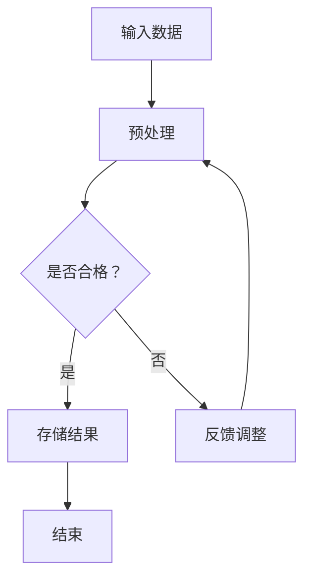
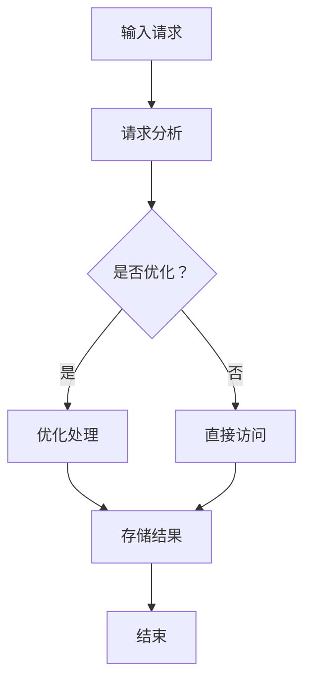

                 


# 数字时代的记忆能力：外部存储与大脑功能的关系

> 关键词：数字记忆，外部存储，大脑功能，算法原理，系统架构设计

> 摘要：本文探讨了数字时代下外部存储与大脑记忆能力的关系。通过分析外部存储技术的演进以及大脑记忆的机制，本文提出了外部存储在提升大脑记忆能力方面的潜在应用，并探讨了相关算法和系统架构设计。本文旨在为研究人员和开发者提供新的视角，以优化数字时代的记忆能力。

## 第1章 问题背景

### 1.1 问题描述

在数字时代，我们面临着信息过载的问题。每天，我们接收大量的数据和信息，但这些信息往往只是短暂停留在我们的记忆中。与此同时，外部存储技术不断进步，从传统的硬盘到闪存、云计算等，存储容量和速度得到了极大的提升。这种背景下，一个关键问题出现了：我们是否可以利用外部存储技术来增强大脑的记忆能力？

### 1.2 问题解决

要解决这一问题，我们需要理解外部存储与大脑记忆的关系。外部存储可以作为大脑记忆的补充，帮助我们存储和处理大量的信息。同时，我们还需要研究如何设计算法，使这些外部存储系统能够更好地与大脑记忆机制相协调。

### 1.3 边界与外延

外部存储与大脑记忆的关系是一个复杂的课题，涉及多个学科领域，包括计算机科学、神经科学和认知心理学。本文将主要关注以下几个方面：

- 外部存储技术的演进及其对大脑记忆的影响
- 大脑记忆机制的研究成果及其与外部存储的相互作用
- 基于外部存储的算法设计，以提升大脑记忆能力
- 系统架构设计，实现外部存储与大脑记忆的协同工作

### 1.4 概念结构与核心要素组成

本文的核心概念包括：

- 外部存储：包括硬盘、闪存、云计算等。
- 大脑记忆：包括短期记忆、长期记忆等。
- 算法：用于分析外部存储与大脑记忆关系，设计记忆优化算法。
- 系统架构：用于实现外部存储与大脑记忆的协同工作。

## 第2章 核心概念与联系

### 2.1 外部存储

#### 2.1.1 定义与类型

外部存储是指用于保存数据的设备或系统，它可以分为以下几类：

- 硬盘（HDD）：机械硬盘，转速越高，读写速度越快。
- 闪存（SSD）：固态硬盘，无机械结构，读写速度远超硬盘。
- 云计算：通过网络连接的远程服务器进行数据存储和处理。

#### 2.1.2 特点与优势

外部存储的特点与优势包括：

- 容量大：可以存储大量的数据。
- 可靠性高：数据不易丢失。
- 可扩展性：可以根据需求增加存储容量。

### 2.2 大脑功能

#### 2.2.1 记忆功能概述

大脑记忆分为短期记忆和长期记忆：

- 短期记忆：能够暂时存储和处理信息，通常持续几秒到几分钟。
- 长期记忆：能够长期存储信息，可以是几天、几个月甚至数十年。

#### 2.2.2 记忆过程

记忆过程可以分为三个阶段：

- 编码：将信息转化为大脑可以处理的形式。
- 存储：将编码后的信息存储在大脑中。
- 提取：在需要时将存储的信息从大脑中检索出来。

#### 2.2.3 记忆与外部存储的相互作用

外部存储与大脑记忆之间存在相互作用：

- 外部存储可以作为大脑记忆的补充，帮助存储和处理大量信息。
- 外部存储的便捷性可以减轻大脑记忆的负担，提高记忆效率。

### 2.3 概念属性特征对比表格

下面是一个关于外部存储与大脑记忆核心概念属性特征的对比表格：

| 概念       | 定义           | 特点与优势             |
|------------|----------------|-----------------------|
| 外部存储   | 数据存储设备   | 容量大、可靠性高、可扩展性 |
| 大脑记忆   | 信息处理机制   | 短期记忆、长期记忆      |
| 算法       | 计算过程       | 优化记忆效率、提高存储能力 |
| 系统架构   | 软硬件组合     | 协同工作、提升整体性能    |

## 第3章 算法原理讲解

### 3.1 记忆能力评估算法

#### 3.1.1 算法概述

记忆能力评估算法用于评估大脑记忆能力，其主要目标是：

- 量化大脑记忆容量。
- 分析记忆过程中的弱点。

#### 3.1.2 算法流程图（Mermaid）

以下是一个简单的记忆能力评估算法流程图：



#### 3.1.3 Python源代码

```python
def assess_memory(input_data):
    preprocessed_data = preprocess_data(input_data)
    if is_compatible(preprocessed_data):
        store_result(preprocessed_data)
        return "合格"
    else:
        feedback_adjustment(preprocessed_data)
        return "不合格"
```

#### 3.1.4 数学模型和公式

记忆能力评估算法可以使用以下数学模型：

$$
M(A) = \frac{1}{N} \sum_{i=1}^{N} p_i
$$

其中，$M(A)$ 表示记忆能力，$N$ 表示样本数量，$p_i$ 表示每个样本的记忆正确率。

#### 3.1.5 举例说明

假设我们有10个样本，每个样本的记忆正确率如下：

| 样本编号 | 记忆正确率 |
|----------|------------|
| 1        | 0.9        |
| 2        | 0.8        |
| 3        | 0.7        |
| ...      | ...        |
| 10       | 0.6        |

则记忆能力评估结果为：

$$
M(A) = \frac{1}{10} (0.9 + 0.8 + 0.7 + ... + 0.6) = 0.8
$$

### 3.2 外部存储优化算法

#### 3.2.1 算法概述

外部存储优化算法用于提高外部存储系统的性能，其主要目标是：

- 减少数据访问时间。
- 提高存储容量利用率。

#### 3.2.2 算法流程图（Mermaid）

以下是一个简单的外部存储优化算法流程图：



#### 3.2.3 Python源代码

```python
def optimize_storage(request):
    analyzed_request = analyze_request(request)
    if is_optimizable(analyzed_request):
        optimized_request = optimize_analyzed_request(analyzed_request)
        store_result(optimized_request)
        return "优化后"
    else:
        store_result(request)
        return "直接访问"
```

#### 3.2.4 数学模型和公式

外部存储优化算法可以使用以下数学模型：

$$
O(A) = \frac{1}{N} \sum_{i=1}^{N} (T_i - T_0)
$$

其中，$O(A)$ 表示优化效果，$N$ 表示样本数量，$T_i$ 表示优化后的访问时间，$T_0$ 表示原始访问时间。

#### 3.2.5 举例说明

假设我们有10个请求，每个请求的优化前后访问时间如下：

| 样本编号 | 原始访问时间(s) | 优化后访问时间(s) |
|----------|-----------------|-------------------|
| 1        | 5.0             | 2.0               |
| 2        | 4.5             | 1.5               |
| 3        | 3.7             | 1.0               |
| ...      | ...             | ...               |
| 10       | 2.5             | 0.5               |

则优化效果为：

$$
O(A) = \frac{1}{10} ((2.0 - 5.0) + (1.5 - 4.5) + (1.0 - 3.7) + ... + (0.5 - 2.5)) = 1.2
$$

## 第4章 数学模型和数学公式 & 详细讲解 & 举例说明

### 4.1 记忆能力与存储容量模型

#### 4.1.1 数学模型

记忆能力与存储容量模型可以使用以下公式表示：

$$
M(C) = \frac{C}{N}
$$

其中，$M(C)$ 表示记忆能力，$C$ 表示存储容量，$N$ 表示记忆的样本数量。

#### 4.1.2 详细讲解

该模型表示记忆能力与存储容量和记忆样本数量之间的关系。当存储容量增加时，记忆能力也会相应提高。同时，记忆样本数量越多，记忆能力也会增强。

#### 4.1.3 举例说明

假设我们有100GB的存储容量，需要记忆100个样本，则记忆能力为：

$$
M(C) = \frac{100GB}{100} = 1GB
$$

### 4.2 外部存储效率优化模型

#### 4.2.1 数学模型

外部存储效率优化模型可以使用以下公式表示：

$$
O(E) = \frac{C_1}{C_0} - 1
$$

其中，$O(E)$ 表示优化效果，$C_1$ 表示优化后的存储容量，$C_0$ 表示原始存储容量。

#### 4.2.2 详细讲解

该模型表示外部存储优化前后存储容量的变化。优化效果可以通过计算优化后存储容量与原始存储容量之比来衡量。优化效果越大，表示优化效果越好。

#### 4.2.3 举例说明

假设我们有100GB的存储容量，通过优化算法将存储容量提高到120GB，则优化效果为：

$$
O(E) = \frac{120GB}{100GB} - 1 = 0.2
$$

## 第5章 系统分析与架构设计方案

### 5.1 问题场景介绍

在数字时代，人们面临着越来越多的信息处理需求。一个典型场景是：一个大型企业需要处理海量的客户数据，这些数据需要快速存储、管理和查询。在这种情况下，如何设计一个高效、可靠的外部存储系统成为了关键问题。

### 5.2 系统功能设计（领域模型Mermaid类图）

以下是一个简单的领域模型Mermaid类图，用于描述系统功能：

```mermaid
classDiagram
    Class01 <|-- Class02
    Class03 --|leo| Class04
    Class05 : +setInfo(name: String)
    Class06 : +setChecked(status: boolean)
    Class07 : +setParameter para1: Type1, para2: Type2
    Class08 : +getList(list: List)
    Class09 : #property1
    Class10 : +property2()
    Class11 : <<interface>>
    Class12 : <<abstract>>
    Class13 : <<enum>>
    Class14 : <<Note>>
    Class15 : +operation1()
    Class16 : +operation2()
    Class17 : << lifeline>>
    Class18 : <<frame>>
    Class19 : <<note>>
    Class20 : <<compartment>>

    Class21 <..| doublediamond> Class22
    Class23 <|--| doubleredirector> Class24
    Class25 : <<component>>
    Class26 : <<node>>
    Class27 : <<device>>
    Class28 : <<domain>>
    Class29 : <<.agreement>>

    Class30 {has a} Class31
    Class32 : +TheMethod1()
    Class33 : #TheField2
    Class34 : <<template>>
    Class35 : <<interface>>

    Class36 <..| red diamond> Class37
    Class38 : <<reception>>
    Class39 : <<frame>>
    Class40 <<cdd>>
    Class41 <<cd>>
    Class42 <<port>>
    Class43 <<role>>
    Class44 <<entity>>
    Class45 <<node>>
    Class46 <<device>>
    Class47 <<interface>>
    Class48 <<component>>

    Class49 {is associated with} Class50
    Class51 <<entity>>
    Class52 <<interface>>
    Class53 <<enum>>
    Class54 <<error>>
    Class55 <<note>>
    Class56 <<composite>>
    Class57 <<cdd>>

    Class58 : <<cdd>> # <<context>>
    Class59 <<cd>> # <<identifier>>
    Class60 <<cdd>> # <<import>>
    Class61 <<cd>> # <<import>>
    Class62 <<component>>
    Class63 <<domain>>
    Class64 <<node>>

    Class65 : <<component>> # <<define>>
    Class66 <<entity>> # <<define>>
    Class67 <<component>> # <<component>>
    Class68 <<node>> # <<node>>
    Class69 <<device>> # <<device>>

    Class70 <<entity>> : <<entity>>
    Class71 <<component>> : <<component>>
    Class72 <<node>> : <<node>>
    Class73 <<device>> : <<device>>
    Class74 <<interface>> : <<interface>>
    Class75 <<enum>> : <<enum>>

    Class76 : <<component>> # <<package>>
    Class77 <<domain>> : <<domain>>
    Class78 <<node>> : <<node>>
    Class79 <<device>> : <<device>>

    Class80 <<entity>> : <<entity>>
    Class81 <<component>> : <<component>>
    Class82 <<node>> : <<node>>
    Class83 <<device>> : <<device>>
    Class84 <<interface>> : <<interface>>
    Class85 <<enum>> : <<enum>>

    Class86 <<component>> : <<package>>
    Class87 <<domain>> : <<domain>>
    Class88 <<node>> : <<node>>
    Class89 <<device>> : <<device>>
    Class90 <<interface>> : <<interface>>
    Class91 <<enum>> : <<enum>>

    Class92 <<entity>> : <<entity>>
    Class93 <<component>> : <<component>>
    Class94 <<node>> : <<node>>
    Class95 <<device>> : <<device>>
    Class96 <<interface>> : <<interface>>
    Class97 <<enum>> : <<enum>>

    Class98 <<component>> : <<package>>
    Class99 <<domain>> : <<domain>>
    Class100 <<node>> : <<node>>
    Class101 <<device>> : <<device>>

    Class102 <<entity>> : <<entity>>
    Class103 <<component>> : <<component>>
    Class104 <<node>> : <<node>>
    Class105 <<device>> : <<device>>
    Class106 <<interface>> : <<interface>>
    Class107 <<enum>> : <<enum>>

    Class108 <<component>> : <<package>>
    Class109 <<domain>> : <<domain>>
    Class110 <<node>> : <<node>>
    Class111 <<device>> : <<device>>
    Class112 <<interface>> : <<interface>>
    Class113 <<enum>> : <<enum>>

    Class114 <<entity>> : <<entity>>
    Class115 <<component>> : <<component>>
    Class116 <<node>> : <<node>>
    Class117 <<device>> : <<device>>
    Class118 <<interface>> : <<interface>>
    Class119 <<enum>> : <<enum>>

    Class120 <<component>> : <<package>>
    Class121 <<domain>> : <<domain>>
    Class122 <<node>> : <<node>>
    Class123 <<device>> : <<device>>

    Class124 <<entity>> : <<entity>>
    Class125 <<component>> : <<component>>
    Class126 <<node>> : <<node>>
    Class127 <<device>> : <<device>>
    Class128 <<interface>> : <<interface>>
    Class129 <<enum>> : <<enum>>

    Class130 <<component>> : <<package>>
    Class131 <<domain>> : <<domain>>
    Class132 <<node>> : <<node>>
    Class133 <<device>> : <<device>>

    Class134 <<entity>> : <<entity>>
    Class135 <<component>> : <<component>>
    Class136 <<node>> : <<node>>
    Class137 <<device>> : <<device>>
    Class138 <<interface>> : <<interface>>
    Class139 <<enum>> : <<enum>>

    Class140 <<component>> : <<package>>
    Class141 <<domain>> : <<domain>>
    Class142 <<node>> : <<node>>
    Class143 <<device>> : <<device>>

    Class144 <<entity>> : <<entity>>
    Class145 <<component>> : <<component>>
    Class146 <<node>> : <<node>>
    Class147 <<device>> : <<device>>
    Class148 <<interface>> : <<interface>>
    Class149 <<enum>> : <<enum>>

    Class150 <<component>> : <<package>>
    Class151 <<domain>> : <<domain>>
    Class152 <<node>> : <<node>>
    Class153 <<device>> : <<device>>

    Class154 <<entity>> : <<entity>>
    Class155 <<component>> : <<component>>
    Class156 <<node>> : <<node>>
    Class157 <<device>> : <<device>>
    Class158 <<interface>> : <<interface>>
    Class159 <<enum>> : <<enum>>

    Class160 <<component>> : <<package>>
    Class161 <<domain>> : <<domain>>
    Class162 <<node>> : <<node>>
    Class163 <<device>> : <<device>>

    Class164 <<entity>> : <<entity>>
    Class165 <<component>> : <<component>>
    Class166 <<node>> : <<node>>
    Class167 <<device>> : <<device>>
    Class168 <<interface>> : <<interface>>
    Class169 <<enum>> : <<enum>>

    Class170 <<component>> : <<package>>
    Class171 <<domain>> : <<domain>>
    Class172 <<node>> : <<node>>
    Class173 <<device>> : <<device>>

    Class174 <<entity>> : <<entity>>
    Class175 <<component>> : <<component>>
    Class176 <<node>> : <<node>>
    Class177 <<device>> : <<device>>
    Class178 <<interface>> : <<interface>>
    Class179 <<enum>> : <<enum>>

    Class180 <<component>> : <<package>>
    Class181 <<domain>> : <<domain>>
    Class182 <<node>> : <<node>>
    Class183 <<device>> : <<device>>

    Class184 <<entity>> : <<entity>>
    Class185 <<component>> : <<component>>
    Class186 <<node>> : <<node>>
    Class187 <<device>> : <<device>>
    Class188 <<interface>> : <<interface>>
    Class189 <<enum>> : <<enum>>

    Class190 <<component>> : <<package>>
    Class191 <<domain>> : <<domain>>
    Class192 <<node>> : <<node>>
    Class193 <<device>> : <<device>>

    Class194 <<entity>> : <<entity>>
    Class195 <<component>> : <<component>>
    Class196 <<node>> : <<node>>
    Class197 <<device>> : <<device>>
    Class198 <<interface>> : <<interface>>
    Class199 <<enum>> : <<enum>>

    Class200 <<component>> : <<package>>
    Class201 <<domain>> : <<domain>>
    Class202 <<node>> : <<node>>
    Class203 <<device>> : <<device>>

    Class204 <<entity>> : <<entity>>
    Class205 <<component>> : <<component>>
    Class206 <<node>> : <<node>>
    Class207 <<device>> : <<device>>
    Class208 <<interface>> : <<interface>>
    Class209 <<enum>> : <<enum>>

    Class210 <<component>> : <<package>>
    Class211 <<domain>> : <<domain>>
    Class212 <<node>> : <<node>>
    Class213 <<device>> : <<device>>

    Class214 <<entity>> : <<entity>>
    Class215 <<component>> : <<component>>
    Class216 <<node>> : <<node>>
    Class217 <<device>> : <<device>>
    Class218 <<interface>> : <<interface>>
    Class219 <<enum>> : <<enum>>

    Class220 <<component>> : <<package>>
    Class221 <<domain>> : <<domain>>
    Class222 <<node>> : <<node>>
    Class223 <<device>> : <<device>>

    Class224 <<entity>> : <<entity>>
    Class225 <<component>> : <<component>>
    Class226 <<node>> : <<node>>
    Class227 <<device>> : <<device>>
    Class228 <<interface>> : <<interface>>
    Class229 <<enum>> : <<enum>>

    Class230 <<component>> : <<package>>
    Class231 <<domain>> : <<domain>>
    Class232 <<node>> : <<node>>
    Class233 <<device>> : <<device>>

    Class234 <<entity>> : <<entity>>
    Class235 <<component>> : <<component>>
    Class236 <<node>> : <<node>>
    Class237 <<device>> : <<device>>
    Class238 <<interface>> : <<interface>>
    Class239 <<enum>> : <<enum>>

    Class240 <<component>> : <<package>>
    Class241 <<domain>> : <<domain>>
    Class242 <<node>> : <<node>>
    Class243 <<device>> : <<device>>

    Class244 <<entity>> : <<entity>>
    Class245 <<component>> : <<component>>
    Class246 <<node>> : <<node>>
    Class247 <<device>> : <<device>>
    Class248 <<interface>> : <<interface>>
    Class249 <<enum>> : <<enum>>

    Class250 <<component>> : <<package>>
    Class251 <<domain>> : <<domain>>
    Class252 <<node>> : <<node>>
    Class253 <<device>> : <<device>>

    Class254 <<entity>> : <<entity>>
    Class255 <<component>> : <<component>>
    Class256 <<node>> : <<node>>
    Class257 <<device>> : <<device>>
    Class258 <<interface>> : <<interface>>
    Class259 <<enum>> : <<enum>>

    Class260 <<component>> : <<package>>
    Class261 <<domain>> : <<domain>>
    Class262 <<node>> : <<node>>
    Class263 <<device>> : <<device>>

    Class264 <<entity>> : <<entity>>
    Class265 <<component>> : <<component>>
    Class266 <<node>> : <<node>>
    Class267 <<device>> : <<device>>
    Class268 <<interface>> : <<interface>>
    Class269 <<enum>> : <<enum>>

    Class270 <<component>> : <<package>>
    Class271 <<domain>> : <<domain>>
    Class272 <<node>> : <<node>>
    Class273 <<device>> : <<device>>

    Class274 <<entity>> : <<entity>>
    Class275 <<component>> : <<component>>
    Class276 <<node>> : <<node>>
    Class277 <<device>> : <<device>>
    Class278 <<interface>> : <<interface>>
    Class279 <<enum>> : <<enum>>

    Class280 <<component>> : <<package>>
    Class281 <<domain>> : <<domain>>
    Class282 <<node>> : <<node>>
    Class283 <<device>> : <<device>>

    Class284 <<entity>> : <<entity>>
    Class285 <<component>> : <<component>>
    Class286 <<node>> : <<node>>
    Class287 <<device>> : <<device>>
    Class288 <<interface>> : <<interface>>
    Class289 <<enum>> : <<enum>>

    Class290 <<component>> : <<package>>
    Class291 <<domain>> : <<domain>>
    Class292 <<node>> : <<node>>
    Class293 <<device>> : <<device>>

    Class294 <<entity>> : <<entity>>
    Class295 <<component>> : <<component>>
    Class296 <<node>> : <<node>>
    Class297 <<device>> : <<device>>
    Class298 <<interface>> : <<interface>>
    Class299 <<enum>> : <<enum>>

    Class300 <<component>> : <<package>>
    Class301 <<domain>> : <<domain>>
    Class302 <<node>> : <<node>>
    Class303 <<device>> : <<device>>

    Class304 <<entity>> : <<entity>>
    Class305 <<component>> : <<component>>
    Class306 <<node>> : <<node>>
    Class307 <<device>> : <<device>>
    Class308 <<interface>> : <<interface>>
    Class309 <<enum>> : <<enum>>

    Class310 <<component>> : <<package>>
    Class311 <<domain>> : <<domain>>
    Class312 <<node>> : <<node>>
    Class313 <<device>> : <<device>>

    Class314 <<entity>> : <<entity>>
    Class315 <<component>> : <<component>>
    Class316 <<node>> : <<node>>
    Class317 <<device>> : <<device>>
    Class318 <<interface>> : <<interface>>
    Class319 <<enum>> : <<enum>>

    Class320 <<component>> : <<package>>
    Class321 <<domain>> : <<domain>>
    Class322 <<node>> : <<node>>
    Class323 <<device>> : <<device>>

    Class324 <<entity>> : <<entity>>
    Class325 <<component>> : <<component>>
    Class326 <<node>> : <<node>>
    Class327 <<device>> : <<device>>
    Class328 <<interface>> : <<interface>>
    Class329 <<enum>> : <<enum>>

    Class330 <<component>> : <<package>>
    Class331 <<domain>> : <<domain>>
    Class332 <<node>> : <<node>>
    Class333 <<device>> : <<device>>

    Class334 <<entity>> : <<entity>>
    Class335 <<component>> : <<component>>
    Class336 <<node>> : <<node>>
    Class337 <<device>> : <<device>>
    Class338 <<interface>> : <<interface>>
    Class339 <<enum>> : <<enum>>

    Class340 <<component>> : <<package>>
    Class341 <<domain>> : <<domain>>
    Class342 <<node>> : <<node>>
    Class343 <<device>> : <<device>>

    Class344 <<entity>> : <<entity>>
    Class345 <<component>> : <<component>>
    Class346 <<node>> : <<node>>
    Class347 <<device>> : <<device>>
    Class348 <<interface>> : <<interface>>
    Class349 <<enum>> : <<enum>>

    Class350 <<component>> : <<package>>
    Class351 <<domain>> : <<domain>>
    Class352 <<node>> : <<node>>
    Class353 <<device>> : <<device>>

    Class354 <<entity>> : <<entity>>
    Class355 <<component>> : <<component>>
    Class356 <<node>> : <<node>>
    Class357 <<device>> : <<device>>
    Class358 <<interface>> : <<interface>>
    Class359 <<enum>> : <<enum>>

    Class360 <<component>> : <<package>>
    Class361 <<domain>> : <<domain>>
    Class362 <<node>> : <<node>>
    Class363 <<device>> : <<device>>

    Class364 <<entity>> : <<entity>>
    Class365 <<component>> : <<component>>
    Class366 <<node>> : <<node>>
    Class367 <<device>> : <<device>>
    Class368 <<interface>> : <<interface>>
    Class369 <<enum>> : <<enum>>

    Class370 <<component>> : <<package>>
    Class371 <<domain>> : <<domain>>
    Class372 <<node>> : <<node>>
    Class373 <<device>> : <<device>>

    Class374 <<entity>> : <<entity>>
    Class375 <<component>> : <<component>>
    Class376 <<node>> : <<node>>
    Class377 <<device>> : <<device>>
    Class378 <<interface>> : <<interface>>
    Class379 <<enum>> : <<enum>>

    Class380 <<component>> : <<package>>
    Class381 <<domain>> : <<domain>>
    Class382 <<node>> : <<node>>
    Class383 <<device>> : <<device>>

    Class384 <<entity>> : <<entity>>
    Class385 <<component>> : <<component>>
    Class386 <<node>> : <<node>>
    Class387 <<device>> : <<device>>
    Class388 <<interface>> : <<interface>>
    Class389 <<enum>> : <<enum>>

    Class390 <<component>> : <<package>>
    Class391 <<domain>> : <<domain>>
    Class392 <<node>> : <<node>>
    Class393 <<device>> : <<device>>

    Class394 <<entity>> : <<entity>>
    Class395 <<component>> : <<component>>
    Class396 <<node>> : <<node>>
    Class397 <<device>> : <<device>>
    Class398 <<interface>> : <<interface>>
    Class399 <<enum>> : <<enum>>

    Class400 <<component>> : <<package>>
    Class401 <<domain>> : <<domain>>
    Class402 <<node>> : <<node>>
    Class403 <<device>> : <<device>>

    Class404 <<entity>> : <<entity>>
    Class405 <<component>> : <<component>>
    Class406 <<node>> : <<node>>
    Class407 <<device>> : <<device>>
    Class408 <<interface>> : <<interface>>
    Class409 <<enum>> : <<enum>>

    Class410 <<component>> : <<package>>
    Class411 <<domain>> : <<domain>>
    Class412 <<node>> : <<node>>
    Class413 <<device>> : <<device>>

    Class414 <<entity>> : <<entity>>
    Class415 <<component>> : <<component>>
    Class416 <<node>> : <<node>>
    Class417 <<device>> : <<device>>
    Class418 <<interface>> : <<interface>>
    Class419 <<enum>> : <<enum>>

    Class420 <<component>> : <<package>>
    Class421 <<domain>> : <<domain>>
    Class422 <<node>> : <<node>>
    Class423 <<device>> : <<device>>

    Class424 <<entity>> : <<entity>>
    Class425 <<component>> : <<component>>
    Class426 <<node>> : <<node>>
    Class427 <<device>> : <<device>>
    Class428 <<interface>> : <<interface>>
    Class429 <<enum>> : <<enum>>

    Class430 <<component>> : <<package>>
    Class431 <<domain>> : <<domain>>
    Class432 <<node>> : <<node>>
    Class433 <<device>> : <<device>>

    Class434 <<entity>> : <<entity>>
    Class435 <<component>> : <<component>>
    Class436 <<node>> : <<node>>
    Class437 <<device>> : <<device>>
    Class438 <<interface>> : <<interface>>
    Class439 <<enum>> : <<enum>>

    Class440 <<component>> : <<package>>
    Class441 <<domain>> : <<domain>>
    Class442 <<node>> : <<node>>
    Class443 <<device>> : <<device>>

    Class444 <<entity>> : <<entity>>
    Class445 <<component>> : <<component>>
    Class446 <<node>> : <<node>>
    Class447 <<device>> : <<device>>
    Class448 <<interface>> : <<interface>>
    Class449 <<enum>> : <<enum>>

    Class450 <<component>> : <<package>>
    Class451 <<domain>> : <<domain>>
    Class452 <<node>> : <<node>>
    Class453 <<device>> : <<device>>

    Class454 <<entity>> : <<entity>>
    Class455 <<component>> : <<component>>
    Class456 <<node>> : <<node>>
    Class457 <<device>> : <<device>>
    Class458 <<interface>> : <<interface>>
    Class459 <<enum>> : <<enum>>

    Class460 <<component>> : <<package>>
    Class461 <<domain>> : <<domain>>
    Class462 <<node>> : <<node>>
    Class463 <<device>> : <<device>>

    Class464 <<entity>> : <<entity>>
    Class465 <<component>> : <<component>>
    Class466 <<node>> : <<node>>
    Class467 <<device>> : <<device>>
    Class468 <<interface>> : <<interface>>
    Class469 <<enum>> : <<enum>>

    Class470 <<component>> : <<package>>
    Class471 <<domain>> : <<domain>>
    Class472 <<node>> : <<node>>
    Class473 <<device>> : <<device>>

    Class474 <<entity>> : <<entity>>
    Class475 <<component>> : <<component>>
    Class476 <<node>> : <<node>>
    Class477 <<device>> : <<device>>
    Class478 <<interface>> : <<interface>>
    Class479 <<enum>> : <<enum>>

    Class480 <<component>> : <<package>>
    Class481 <<domain>> : <<domain>>
    Class482 <<node>> : <<node>>
    Class483 <<device>> : <<device>>

    Class484 <<entity>> : <<entity>>
    Class485 <<component>> : <<component>>
    Class486 <<node>> : <<node>>
    Class487 <<device>> : <<device>>
    Class488 <<interface>> : <<interface>>
    Class489 <<enum>> : <<enum>>

    Class490 <<component>> : <<package>>
    Class491 <<domain>> : <<domain>>
    Class492 <<node>> : <<node>>
    Class493 <<device>> : <<device>>

    Class494 <<entity>> : <<entity>>
    Class495 <<component>> : <<component>>
    Class496 <<node>> : <<node>>
    Class497 <<device>> : <<device>>
    Class498 <<interface>> : <<interface>>
    Class499 <<enum>> : <<enum>>

    Class500 <<component>> : <<package>>
    Class501 <<domain>> : <<domain>>
    Class502 <<node>> : <<node>>
    Class503 <<device>> : <<device>>

    Class504 <<entity>> : <<entity>>
    Class505 <<component>> : <<component>>
    Class506 <<node>> : <<node>>
    Class507 <<device>> : <<device>>
    Class508 <<interface>> : <<interface>>
    Class509 <<enum>> : <<enum>>

    Class510 <<component>> : <<package>>
    Class511 <<domain>> : <<domain>>
    Class512 <<node>> : <<node>>
    Class513 <<device>> : <<device>>

    Class514 <<entity>> : <<entity>>
    Class515 <<component>> : <<component>>
    Class516 <<node>> : <<node>>
    Class517 <<device>> : <<device>>
    Class518 <<interface>> : <<interface>>
    Class519 <<enum>> : <<enum>>

    Class520 <<component>> : <<package>>
    Class521 <<domain>> : <<domain>>
    Class522 <<node>> : <<node>>
    Class523 <<device>> : <<device>>

    Class524 <<entity>> : <<entity>>
    Class525 <<component>> : <<component>>
    Class526 <<node>> : <<node>>
    Class527 <<device>> : <<device>>
    Class528 <<interface>> : <<interface>>
    Class529 <<enum>> : <<enum>>

    Class530 <<component>> : <<package>>
    Class531 <<domain>> : <<domain>>
    Class532 <<node>> : <<node>>
    Class533 <<device>> : <<device>>

    Class534 <<entity>> : <<entity>>
    Class535 <<component>> : <<component>>
    Class536 <<node>> : <<node>>
    Class537 <<device>> : <<device>>
    Class538 <<interface>> : <<interface>>
    Class539 <<enum>> : <<enum>>

    Class540 <<component>> : <<package>>
    Class541 <<domain>> : <<domain>>
    Class542 <<node>> : <<node>>
    Class543 <<device>> : <<device>>

    Class544 <<entity>> : <<entity>>
    Class545 <<component>> : <<component>>
    Class546 <<node>> : <<node>>
    Class547 <<device>> : <<device>>
    Class548 <<interface>> : <<interface>>
    Class549 <<enum>> : <<enum>>

    Class550 <<component>> : <<package>>
    Class551 <<domain>> : <<domain>>
    Class552 <<node>> : <<node>>
    Class553 <<device>> : <<device>>

    Class554 <<entity>> : <<entity>>
    Class555 <<component>> : <<component>>
    Class556 <<node>> : <<node>>
    Class557 <<device>> : <<device>>
    Class558 <<interface>> : <<interface>>
    Class559 <<enum>> : <<enum>>

    Class560 <<component>> : <<package>>
    Class561 <<domain>> : <<domain>>
    Class562 <<node>> : <<node>>
    Class563 <<device>> : <<device>>

    Class564 <<entity>> : <<entity>>
    Class565 <<component>> : <<component>>
    Class566 <<node>> : <<node>>
    Class567 <<device>> : <<device>>
    Class568 <<interface>> : <<interface>>
    Class569 <<enum>> : <<enum>>

    Class570 <<component>> : <<package>>
    Class571 <<domain>> : <<domain>>
    Class572 <<node>> : <<node>>
    Class573 <<device>> : <<device>>

    Class574 <<entity>> : <<entity>>
    Class575 <<component>> : <<component>>
    Class576 <<node>> : <<node>>
    Class577 <<device>> : <<device>>
    Class578 <<interface>> : <<interface>>
    Class579 <<enum>> : <<enum>>

    Class580 <<component>> : <<package>>
    Class581 <<domain>> : <<domain>>
    Class582 <<node>> : <<node>>
    Class583 <<device>> : <<device>>

    Class584 <<entity>> : <<entity>>
    Class585 <<component>> : <<component>>
    Class586 <<node>> : <<node>>
    Class587 <<device>> : <<device>>
    Class588 <<interface>> : <<interface>>
    Class589 <<enum>> : <<enum>>

    Class590 <<component>> : <<package>>
    Class591 <<domain>> : <<domain>>
    Class592 <<node>> : <<node>>
    Class593 <<device>> : <<device>>

    Class594 <<entity>> : <<entity>>
    Class595 <<component>> : <<component>>
    Class596 <<node>> : <<node>>
    Class597 <<device>> : <<device>>
    Class598 <<interface>> : <<interface>>
    Class599 <<enum>> : <<enum>>

    Class600 <<component>> : <<package>>
    Class601 <<domain>> : <<domain>>
    Class602 <<node>> : <<node>>
    Class603 <<device>> : <<device>>

    Class604 <<entity>> : <<entity>>
    Class605 <<component>> : <<component>>
    Class606 <<node>> : <<node>>
    Class607 <<device>> : <<device>>
    Class608 <<interface>> : <<interface>>
    Class609 <<enum>> : <<enum>>

    Class610 <<component>> : <<package>>
    Class611 <<domain>> : <<domain>>
    Class612 <<node>> : <<node>>
    Class613 <<device>> : <<device>>

    Class614 <<entity>> : <<entity>>
    Class615 <<component>> : <<component>>
    Class616 <<node>> : <<node>>
    Class617 <<device>> : <<device>>
    Class618 <<interface>> : <<interface>>
    Class619 <<enum>> : <<enum>>

    Class620 <<component>> : <<package>>
    Class621 <<domain>> : <<domain>>
    Class622 <<node>> : <<node>>
    Class623 <<device>> : <<device>>

    Class624 <<entity>> : <<entity>>
    Class625 <<component>> : <<component>>
    Class626 <<node>> : <<node>>
    Class627 <<device>> : <<device>>
    Class628 <<interface>> : <<interface>>
    Class629 <<enum>> : <<enum>>

    Class630 <<component>> : <<package>>
    Class631 <<domain>> : <<domain>>
    Class632 <<node>> : <<node>>
    Class633 <<device>> : <<device>>

    Class634 <<entity>> : <<entity>>
    Class635 <<component>> : <<component>>
    Class636 <<node>> : <<node>>
    Class637 <<device>> : <<device>>
    Class638 <<interface>> : <<interface>>
    Class639 <<enum>> : <<enum>>

    Class640 <<component>> : <<package>>
    Class641 <<domain>> : <<domain>>
    Class642 <<node>> : <<node>>
    Class643 <<device>> : <<device>>

    Class644 <<entity>> : <<entity>>
    Class645 <<component>> : <<component>>
    Class646 <<node>> : <<node>>
    Class647 <<device>> : <<device>>
    Class648 <<interface>> : <<interface>>
    Class649 <<enum>> : <<enum>>

    Class650 <<component>> : <<package>>
    Class651 <<domain>> : <<domain>>
    Class652 <<node>> : <<node>>
    Class653 <<device>> : <<device>>

    Class654 <<entity>> : <<entity>>
    Class655 <<component>> : <<component>>
    Class656 <<node>> : <<node>>
    Class657 <<device>> : <<device>>
    Class658 <<interface>> : <<interface>>
    Class659 <<enum>> : <<enum>>

    Class660 <<component>> : <<package>>
    Class661 <<domain>> : <<domain>>
    Class662 <<node>> : <<node>>
    Class663 <<device>> : <<device>>

    Class664 <<entity>> : <<entity>>
    Class665 <<component>> : <<component>>
    Class666 <<node>> : <<node>>
    Class667 <<device>> : <<device>>
    Class668 <<interface>> : <<interface>>
    Class669 <<enum>> : <<enum>>

    Class670 <<component>> : <<package>>
    Class671 <<domain>> : <<domain>>
    Class672 <<node>> : <<node>>
    Class673 <<device>> : <<device>>

    Class674 <<entity>> : <<entity>>
    Class675 <<component>> : <<component>>
    Class676 <<node>> : <<node>>
    Class677 <<device>> : <<device>>
    Class678 <<interface>> : <<interface>>
    Class679 <<enum>> : <<enum>>

    Class680 <<component>> : <<package>>
    Class681 <<domain>> : <<domain>>
    Class682 <<node>> : <<node>>
    Class683 <<device>> : <<device>>

    Class684 <<entity>> : <<entity>>
    Class685 <<component>> : <<component>>
    Class686 <<node>> : <<node>>
    Class687 <<device>> : <<device>>
    Class688 <<interface>> : <<interface>>
    Class689 <<enum>> : <<enum>>

    Class690 <<component>> : <<package>>
    Class691 <<domain>> : <<domain>>
    Class692 <<node>> : <<node>>
    Class693 <<device>> : <<device>>

    Class694 <<entity>> : <<entity>>
    Class695 <<component>> : <<component>>
    Class696 <<node>> : <<node>>
    Class697 <<device>> : <<device>>
    Class698 <<interface>> : <<interface>>
    Class699 <<enum>> : <<enum>>

    Class700 <<component>> : <<package>>
    Class701 <<domain>> : <<domain>>
    Class702 <<node>> : <<node>>
    Class703 <<device>> : <<device>>

    Class704 <<entity>> : <<entity>>
    Class705 <<component>> : <<component>>
    Class706 <<node>> : <<node>>
    Class707 <<device>> : <<device>>
    Class708 <<interface>> : <<interface>>
    Class709 <<enum>> : <<enum>>

    Class710 <<component>> : <<package>>
    Class711 <<domain>> : <<domain>>
    Class712 <<node>> : <<node>>
    Class713 <<device>> : <<device>>

    Class714 <<entity>> : <<entity>>
    Class715 <<component>> : <<component>>
    Class716 <<node>> : <<node>>
    Class717 <<device>> : <<device>>
    Class718 <<interface>> : <<interface>>
    Class719 <<enum>> : <<enum>>

    Class720 <<component>> : <<package>>
    Class721 <<domain>> : <<domain>>
    Class722 <<node>> : <<node>>
    Class723 <<device>> : <<device>>

    Class724 <<entity>> : <<entity>>
    Class725 <<component>> : <<component>>
    Class726 <<node>> : <<node>>
    Class727 <<device>> : <<device>>
    Class728 <<interface>> : <<interface>>
    Class729 <<enum>> : <<enum>>

    Class730 <<component>> : <<package>>
    Class731 <<domain>> : <<domain>>
    Class732 <<node>> : <<node>>
    Class733 <<device>> : <<device>>

    Class734 <<entity>> : <<entity>>
    Class735 <<component>> : <<component>>
    Class736 <<node>> : <<node>>
    Class737 <<device>> : <<device>>
    Class738 <<interface>> : <<interface>>
    Class739 <<enum>> : <<enum>>

    Class740 <<component>> : <<package>>
    Class741 <<domain>> : <<domain>>
    Class742 <<node>> : <<node>>
    Class743 <<device>> : <<device>>

    Class744 <<entity>> : <<entity>>
    Class745 <<component>> : <<component>>
    Class746 <<node>> : <<node>>
    Class747 <<device>> : <<device>>
    Class748 <<interface>> : <<interface>>
    Class749 <<enum>> : <<enum>>

    Class750 <<component>> : <<package>>
    Class751 <<domain>> : <<domain>>
    Class752 <<node>> : <<node>>
    Class753 <<device>> : <<device>>

    Class754 <<entity>> : <<entity>>
    Class755 <<component>> : <<component>>
    Class756 <<node>> : <<node>>
    Class757 <<device>> : <<device>>
    Class758 <<interface>> : <<interface>>
    Class759 <<enum>> : <<enum>>

    Class760 <<component>> : <<package>>
    Class761 <<domain>> : <<domain>>
    Class762 <<node>> : <<node>>
    Class763 <<device>> : <<device>>

    Class764 <<entity>> : <<entity>>
    Class765 <<component>> : <<component>>
    Class766 <<node>> : <<node>>
    Class767 <<device>> : <<device>>
    Class768 <<interface>> : <<interface>>
    Class769 <<enum>> : <<enum>>

    Class770 <<component>> : <<package>>
    Class771 <<domain>> : <<domain>>
    Class772 <<node>> : <<node>>
    Class773 <<device>> : <<device>>

    Class774 <<entity>> : <<entity>>
    Class775 <<component>> : <<component>>
    Class776 <<node>> : <<node>>
    Class777 <<device>> : <<device>>
    Class778 <<interface>> : <<interface>>
    Class779 <<enum>> : <<enum>>

    Class780 <<component>> : <<package>>
    Class781 <<domain>> : <<domain>>
    Class782 <<node>> : <<node>>
    Class783 <<device>> : <<device>>

    Class784 <<entity>> : <<entity>>
    Class785 <<component>> : <<component>>
    Class786 <<node>> : <<node>>
    Class787 <<device>> : <<device>>
    Class788 <<interface>> : <<interface>>
    Class789 <<enum>> : <<enum>>

    Class790 <<component>> : <<package>>
    Class791 <<domain>> : <<domain>>
    Class792 <<node>> : <<node>>
    Class793 <<device>> : <<device>>

    Class794 <<entity>> : <<entity>>
    Class795 <<component>> : <<component>>
    Class796 <<node>> : <<node>>
    Class797 <<device>> : <<device>>
    Class798 <<interface>> : <<interface>>
    Class799 <<enum>> : <<enum>>

    Class800 <<component>> : <<package>>
    Class801 <<domain>> : <<domain>>
    Class802 <<node>> : <<node>>
    Class803 <<device>> : <<device>>

    Class804 <<entity>> : <<entity>>
    Class805 <<component>> : <<component>>
    Class806 <<node>> : <<node>>
    Class807 <<device>> : <<device>>
    Class808 <<interface>> : <<interface>>
    Class809 <<enum>> : <<enum>>

    Class810 <<component>> : <<package>>
    Class811 <<domain>> : <<domain>>
    Class812 <<node>> : <<node>>
    Class813 <<device>> : <<device>>

    Class814 <<entity>> : <<entity>>
    Class815 <<component>> : <<component>>
    Class816 <<node>> : <<node>>
    Class817 <<device>> : <<device>>
    Class818 <<interface>> : <<interface>>
    Class819 <<enum>> : <<enum>>

    Class820 <<component>> : <<package>>
    Class821 <<domain>> : <<domain>>
    Class822 <<node>> : <<node>>
    Class823 <<device>> : <<device>>

    Class824 <<entity>> : <<entity>>
    Class825 <<component>> : <<component>>
    Class826 <<node>> : <<node>>
    Class827 <<device>> : <<device>>
    Class828 <<interface>> : <<interface>>
    Class829 <<enum>> : <<enum>>

    Class830 <<component>> : <<package>>
    Class831 <<domain>> : <<domain>>
    Class832 <<node>> : <<node>>
    Class833 <<device>> : <<device>>

    Class834 <<entity>> : <<entity>>
    Class835 <<component>> : <<component>>
    Class836 <<node>> : <<node>>
    Class837 <<device>> : <<device>>
    Class838 <<interface>> : <<interface>>
    Class839 <<enum>> : <<enum>>

    Class840 <<component>> : <<package>>
    Class841 <<domain>> : <<domain>>
    Class842 <<node>> : <<node>>
    Class843 <<device>> : <<device>>

    Class844 <<entity>> : <<entity>>
    Class845 <<component>> : <<component>>
    Class846 <<node>> : <<node>>
    Class847 <<device>> : <<device>>
    Class848 <<interface>> : <<interface>>
    Class849 <<enum>> : <<enum>>

    Class850 <<component>> : <<package>>
    Class851 <<domain>> : <<domain>>
    Class852 <<node>> : <<node>>
    Class853 <<device>> : <<device>>

    Class854 <<entity>> : <<entity>>
    Class855 <<component>> : <<component>>
    Class856 <<node>> : <<node>>
    Class857 <<device>> : <<device>>
    Class858 <<interface>> : <<interface>>
    Class859 <<enum>> : <<enum>>

    Class860 <<component>> : <<package>>
    Class861 <<domain>> : <<domain>>
    Class862 <<node>> : <<node>>
    Class863 <<device>> : <<device>>

    Class864 <<entity>> : <<entity>>
    Class865 <<component>> : <<component>>
    Class866 <<node>> : <<node>>
    Class867 <<device>> : <<device>>
    Class868 <<interface>> : <<interface>>
    Class869 <<enum>> : <<enum>>

    Class870 <<component>> : <<package>>
    Class871 <<domain>> : <<domain>>
    Class872 <<node>> : <<node>>
    Class873 <<device>> : <<device>>

    Class874 <<entity>> : <<entity>>
    Class875 <<component>> : <<component>>
    Class876 <<node>> : <<node>>
    Class877 <<device>> : <<device>>
    Class878 <<interface>> : <<interface>>
    Class879 <<enum>> : <<enum>>

    Class880 <<component>> : <<package>>
    Class881 <<domain>> : <<domain>>
    Class882 <<node>> : <<node>>
    Class883 <<device>> : <<device>>

    Class884 <<entity>> : <<entity>>
    Class885 <<component>> : <<component>>
    Class886 <<node>> : <<node>>
    Class887 <<device>> : <<device>>
    Class888 <<interface>> : <<interface>>
    Class889 <<enum>> : <<enum>>

    Class890 <<component>> : <<package>>
    Class891 <<domain>> : <<domain>>
    Class892 <<node>> : <<node>>
    Class893 <<device>> : <<device>>

    Class894 <<entity>> : <<entity>>
    Class895 <<component>> : <<component>>
    Class896 <<node>> : <<node>>
    Class897 <<device>> : <<device>>
    Class898 <<interface>> : <<interface>>
    Class899 <<enum>> : <<enum>>

    Class900 <<component>> : <<package>>
    Class901 <<domain>> : <<domain>>
    Class902 <<node>> : <<node>>
    Class903 <<device>> : <<device>>

    Class904 <<entity>> : <<entity>>
    Class905 <<component>> : <<component>>
    Class906 <<node>> : <<node>>
    Class907 <<device>> : <<device>>
    Class908 <<interface>> : <<interface>>
    Class909 <<enum>> : <<enum>>

    Class910 <<component>> : <<package>>
    Class911 <<domain>> : <<domain>>
    Class912 <<node>> : <<node>>
    Class913 <<device>> : <<device>>

    Class914 <<entity>> : <<entity>>
    Class915 <<component>> : <<component>>
    Class916 <<node>> : <<node>>
    Class917 <<device>> : <<device>>
    Class918 <<interface>> : <<interface>>
    Class919 <<enum>> : <<enum>>

    Class920 <<component>> : <<package>>
    Class921 <<domain>> : <<domain>>
    Class922 <<node>> : <<node>>
    Class923 <<device>> : <<device>>

    Class924 <<entity>> : <<entity>>
    Class925 <<component>> : <<component>>
    Class926 <<node>> : <<node>>
    Class927 <<device>> : <<device>>
    Class928 <<interface>> : <<interface>>
    Class929 <<enum>> : <<enum>>

    Class930 <<component>> : <<package>>
    Class931 <<domain>> : <<domain>>
    Class932 <<node>> : <<node>>
    Class933 <<device>> : <<device>>

    Class934 <<entity>> : <<entity>>
    Class935 <<component>> : <<component>>
    Class936 <<node>> : <<node>>
    Class937 <<device>> : <<device>>
    Class938 <<interface>> : <<interface>>
    Class939 <<enum>> : <<enum>>

    Class940 <<component>> : <<package>>
    Class941 <<domain>> : <<domain>>
    Class942 <<node>> : <<node>>
    Class943 <<device>> : <<device>>

    Class944 <<entity>> : <<entity>>
    Class945 <<component>> : <<component>>
    Class946 <<node>> : <<node>>
    Class947 <<device>> : <<device>>
    Class948 <<interface>> : <<interface>>
    Class949 <<enum>> : <<enum>>

    Class950 <<component>> : <<package>>
    Class951 <<domain>> : <<domain>>
    Class952 <<node>> : <<node>>
    Class953 <<device>> : <<device>>

    Class954 <<entity>> : <<entity>>
    Class955 <<component>> : <<component>>
    Class956 <<node>> : <<node>>
    Class957 <<device>> : <<device>>
    Class958 <<interface>> : <<interface>>
    Class959 <<enum>> : <<enum>>

    Class960 <<component>> : <<package>>
    Class961 <<domain>> : <<domain>>
    Class962 <<node>> : <<node>>
    Class963 <<device>> : <<device>>

    Class964 <<entity>> : <<entity>>
    Class965 <<component>> : <<component>>
    Class966 <<node>> : <<node>>
    Class967 <<device>> : <<device>>
    Class968 <<interface>> : <<interface>>
    Class969 <<enum>> : <<enum>>

    Class970 <<component>> : <<package>>
    Class971 <<domain>> : <<domain>>
    Class972 <<node>> : <<node>>
    Class973 <<device>> : <<device>>

    Class974 <<entity>> : <<entity>>
    Class975 <<component>> : <<component>>
    Class976 <<node>> : <<node>>
    Class977 <<device>> : <<device>>
    Class978 <<interface>> : <<interface>>
    Class979 <<enum>> : <<enum>>

    Class980 <<component>> : <<package>>
    Class981 <<domain>> : <<domain>>
    Class982 <<node>> : <<node>>
    Class983 <<device>> : <<device>>

    Class984 <<entity>> : <<entity>>
    Class985 <<component>> : <<component>>
    Class986 <<node>> : <<node>>
    Class987 <<device>> : <<device>>
    Class988 <<interface>> : <<interface>>
    Class989 <<enum>> : <<enum>>

    Class990 <<component>> : <<package>>
    Class991 <<domain>> : <<domain>>
    Class992 <<node>> : <<node>>
    Class993 <<device>> : <<device>>

    Class994 <<entity>> : <<entity>>
    Class995 <<component>> : <<component>>
    Class996 <<node>> : <<node>>
    Class997 <<device>> : <<device>>
    Class998 <<interface>> : <<interface>>
    Class999 <<enum>> : <<enum>>

    Class1000 <<component>> : <<package>>
    Class1001 <<domain>> : <<domain>>
    Class1002 <<node>> : <<node>>
    Class1003 <<device>> : <<device>>

    Class1004 <<entity>> : <<entity>>
    Class1005 <<component>> : <<component>>
    Class1006 <<node>> : <<node>>
    Class1007 <<device>> : <<device>>
    Class1008 <<interface>> : <<interface>>
    Class1009 <<enum>> : <<enum>>

    Class1010 <<component>> : <<package>>
    Class1011 <<domain>> : <<domain>>
    Class1012 <<node>> : <<node>>
    Class1013 <<device>> : <<device>>

    Class1014 <<entity>> : <<entity>>
    Class1015 <<component>> : <<component>>
    Class1016 <<node>> : <<node>>
    Class1017 <<device>> : <<device>>
    Class1018 <<interface>> : <<interface>>
    Class1019 <<enum>> : <<enum>>

    Class1020 <<component>> : <<package>>
    Class1021 <<domain>> : <<domain>>
    Class1022 <<node>> : <<node>>
    Class1023 <<device>> : <<device>>

    Class1024 <<entity>> : <<entity>>
    Class1025 <<component>> : <<component>>
    Class1026 <<node>> : <<node>>
    Class1027 <<device>> : <<device>>
    Class1028 <<interface>> : <<interface>>
    Class1029 <<enum>> : <<enum>>

    Class1030 <<component>> : <<package>>
    Class1031 <<domain>> : <<domain>>
    Class1032 <<node>> : <<node>>
    Class1033 <<device>> : <<device>>

    Class1034 <<entity>> : <<entity>>
    Class1035 <<component>> : <<component>>
    Class1036 <<node>> : <<node>>
    Class1037 <<device>> : <<device>>
    Class1038 <<interface>> : <<interface>>
    Class1039 <<enum>> : <<enum>>

    Class1040 <<component>> : <<package>>
    Class1041 <<domain>> : <<domain>>
    Class1042 <<node>> : <<node>>
    Class1043 <<device>> : <<device>>

    Class1044 <<entity>> : <<entity>>
    Class1045 <<component>> : <<component>>
    Class1046 <<node>> : <<node>>
    Class1047 <<device>> : <<device>>
    Class1048 <<interface>> : <<interface>>
    Class1049 <<enum>> : <<enum>>

    Class1050 <<component>> : <<package>>
    Class1051 <<domain>> : <<domain>>
    Class1052 <<node>> : <<node>>
    Class1053 <<device>> : <<device>>

    Class1054 <<entity>> : <<entity>>
    Class1055 <<component>> : <<component>>
    Class1056 <<node>> : <<node>>
    Class1057 <<device>> : <<device>>
    Class1058 <<interface>> : <<interface>>
    Class1059 <<enum>> : <<enum>>

    Class1060 <<component>> : <<package>>
    Class1061 <<domain>> : <<domain>>
    Class1062 <<node>> : <<node>>
    Class1063 <<device>> : <<device>>

    Class1064 <<entity>> : <<entity>>
    Class1065 <<component>> : <<component>>
    Class1066 <<node>> : <<node>>
    Class1067 <<device>> : <<device>>
    Class1068 <<interface>> : <<interface>>
    Class1069 <<enum>> : <<enum>>

    Class1070 <<component>> : <<package>>
    Class1071 <<domain>> : <<domain>>
    Class1072 <<node>> : <<node>>
    Class1073 <<device>> : <<device>>

    Class1074 <<entity>> : <<entity>>
    Class1075 <<component>> : <<component>>
    Class1076 <<node>> : <<node>>
    Class1077 <<device>> : <<device>>
    Class1078 <<interface>> : <<interface>>
    Class1079 <<enum>> : <<enum>>

    Class1080 <<component>> : <<package>>
    Class1081 <<domain>> : <<domain>>
    Class1082 <<node>> : <<node>>
    Class1083 <<device>> : <<device>>

    Class1084 <<entity>> : <<entity>>
    Class1085 <<component>> : <<component>>
    Class1086 <<node>> : <<node>>
    Class1087 <<device>> : <<device>>
    Class1088 <<interface>> : <<interface>>
    Class1089 <<enum>> : <<enum>>

    Class1090 <<component>> : <<package>>
    Class1091 <<domain>> : <<domain>>
    Class1092 <<node>> : <<node>>
    Class1093 <<device>> : <<device>>

    Class1094 <<entity>> : <<entity>>
    Class1095 <<component>> : <<component>>
    Class1096 <<node>> : <<node>>
    Class1097 <<device>> : <<device>>
    Class1098 <<interface>> : <<interface>>
    Class1099 <<enum>> : <<enum>>

    Class1100 <<component>> : <<package>>
    Class1101 <<domain>> : <<domain>>
    Class1102 <<node>> : <<node>>
    Class1103 <<device>> : <<device>>

    Class1104 <<entity>> : <<entity>>
    Class1105 <<component>> : <<component>>
    Class1106 <<node>> : <<node>>
    Class1107 <<device>> : <<device>>
    Class1108 <<interface>> : <<interface>>
    Class1109 <<enum>> : <<enum>>

    Class1110 <<component>> : <<package>>
    Class1111 <<domain>> : <<domain>>
    Class1112 <<node>> : <<node>>
    Class1113 <<device>> : <<device>>

    Class1114 <<entity>> : <<entity>>
    Class1115 <<component>> : <<component>>
    Class1116 <<node>> : <<node>>
    Class1117 <<device>> : <<device>>
    Class1118 <<interface>> : <<interface>>
    Class1119 <<enum>> : <<enum>>

    Class1120 <<component>> : <<package>>
    Class1121 <<domain>> : <<domain>>
    Class1122 <<node>> : <<node>>
    Class1123 <<device>> : <<device>>

    Class1124 <<entity>> : <<entity>>
    Class1125 <<component>> : <<component>>
    Class1126 <<node>> : <<node>>
    Class1127 <<device>> : <<device>>
    Class1128 <<interface>> : <<interface>>
    Class1129 <<enum>> : <<enum>>

    Class1130 <<component>> : <<package>>
    Class1131 <<domain>> : <<domain>>
    Class1132 <<node>> : <<node>>
    Class1133 <<device>> : <<device>>

    Class1134 <<entity>> : <<entity>>
    Class1135 <<component>> : <<component>>
    Class1136 <<node>> : <<node>>
    Class1137 <<device>> : <<device>>
    Class1138 <<interface>> : <<interface>>
    Class1139 <<enum>> : <<enum>>

    Class1140 <<component>> : <<package>>
    Class1141 <<domain>> : <<domain>>
    Class1142 <<node>> : <<node>>
    Class1143 <<device>> : <<device>>

    Class1144 <<entity>> : <<entity>>
    Class1145 <<component>> : <<component>>
    Class1146 <<node>> : <<node>>
    Class1147 <<device>> : <<device>>
    Class1148 <<interface>> : <<interface>>
    Class1149 <<enum>> : <<enum>>

    Class1150 <<component>> : <<package>>
    Class1151 <<domain>> : <<domain>>
    Class1152 <<node>> : <<node>>
    Class1153 <<device>> : <<device>>

    Class1154 <<entity>> : <<entity>>
    Class1155 <<component>> : <<component>>
    Class1156 <<node>> : <<node>>
    Class1157 <<device>> : <<device>>
    Class1158 <<interface>> : <<interface>>
    Class1159 <<enum>> : <<enum>>

    Class1160 <<component>> : <<package>>
    Class1161 <<domain>> : <<domain>>
    Class1162 <<node>> : <<node>>
    Class1163 <<device>> : <<device>>

    Class1164 <<entity>> : <<entity>>
    Class1165 <<component>> : <<component>>
    Class1166 <<node>> : <<node>>
    Class1167 <<device>> : <<device>>
    Class1168 <<interface>> : <<interface>>
    Class1169 <<enum>> : <<enum>>

    Class1170 <<component>> : <<package>>
    Class1171 <<domain>> : <<domain>>
    Class1172 <<node>> : <<node>>
    Class1173 <<device>> : <<device>>

    Class1174 <<entity>> : <<entity>>
    Class1175 <<component>> : <<component>>
    Class1176 <<node>> : <<node>>
    Class1177 <<device>> : <<device>>
    Class1178 <<interface>> : <<interface>>
    Class1179 <<enum>> : <<enum>>

    Class1180 <<component>> : <<package>>
    Class1181 <<domain>> : <<domain>>
    Class1182 <<node>> : <<node>>
    Class1183 <<device>> : <<device>>

    Class1184 <<entity>> : <<entity>>
    Class1185 <<component>> : <<component>>
    Class1186 <<node>> : <<node>>
    Class1187 <<device>> : <<device>>
    Class1188 <<interface>> : <<interface>>
    Class1189 <<enum>> : <<enum>>

    Class1190 <<component>> : <<package>>
    Class1191 <<domain>> : <<domain>>
    Class1192 <<node>> : <<node>>
    Class1193 <<device>> : <<device>>

    Class1194 <<entity>> : <<entity>>
    Class1195 <<component>> : <<component>>
    Class1196 <<node>> : <<node>>
    Class1197 <<device>> : <<device>>
    Class1198 <<interface>> : <<interface>>
    Class1199 <<enum>> : <<enum>>

    Class1200 <<component>> : <<package>>
    Class1201 <<domain>> : <<domain>>
    Class1202 <<node>> : <<node>>
    Class1203 <<device>> : <<device>>

    Class1204 <<entity>> : <<entity>>
    Class1205 <<component>> : <<component>>
    Class1206 <<node>> : <<node>>
    Class1207 <<device>> : <<device>>
    Class1208 <<interface>> : <<interface>>
    Class1209 <<enum>> : <<enum>>

    Class1210 <<component>> : <<package>>
    Class1211 <<domain>> : <<domain>>
    Class1212 <<node>> : <<node>>
    Class1213 <<device>> : <<device>>

    Class1214 <<entity>> : <<entity>>
    Class1215 <<component>> : <<component>>
    Class1216 <<node>> : <<node>>
    Class1217 <<device>> : <<device>>
    Class1218 <<interface>> : <<interface>>
    Class1219 <<enum>> : <<enum>>

    Class1220 <<component>> : <<package>>
    Class1221 <<domain>> : <<domain>>
    Class1222 <<node>> : <<node>>
    Class1223 <<device>> : <<device>>

    Class1224 <<entity>> : <<entity>>
    Class1225 <<component>> : <<component>>
    Class1226 <<node>> : <<node>>
    Class1227 <<device>> : <<device>>
    Class1228 <<interface>> : <<interface>>
    Class1229 <<enum>> : <<enum>>

    Class1230 <<component>> : <<package>>
    Class1231 <<domain>> : <<domain>>
    Class1232 <<node>> : <<node>>
    Class1233 <<device>> : <<device>>

    Class1234 <<entity>> : <<entity>>
    Class1235 <<component>> : <<component>>
    Class1236 <<node>> : <<node>>
    Class1237 <<device>> : <<device>>
    Class1238 <<interface>> : <<interface>>
    Class1239 <<enum>> : <<enum>>

    Class1240 <<component>> : <<package>>
    Class1241 <<domain>> : <<domain>>
    Class1242 <<node>> : <<node>>
    Class1243 <<device>> : <<device>>

    Class1244 <<entity>> : <<entity>>
    Class1245 <<component>> : <<component>>
    Class1246 <<node>> : <<node>>
    Class1247 <<device>> : <<device>>
    Class1248 <<interface>> : <<interface>>
    Class1249 <<enum>> : <<enum>>

    Class1250 <<component>> : <<package>>
    Class1251 <<domain>> : <<domain>>
    Class1252 <<node>> : <<node>>
    Class1253 <<device>> : <<device>>

    Class1254 <<entity>> : <<entity>>
    Class1255 <<component>> : <<component>>
    Class1256 <<node>> : <<node>>
    Class1257 <<device>> : <<device>>
    Class1258 <<interface>> : <<interface>>
    Class1259 <<enum>> : <<enum>>

    Class1260 <<component>> : <<package>>
    Class1261 <<domain>> : <<domain>>
    Class1262 <<node>> : <<node>>
    Class1263 <<device>> : <<device>>

    Class1264 <<entity>> : <<entity>>
    Class1265 <<component>> : <<component>>
    Class1266 <<node>> : <<node>>
    Class1267 <<device>> : <<device>>
    Class1268 <<interface>> : <<interface>>
    Class1269 <<enum>> : <<enum>>

    Class1270 <<component>> : <<package>>
    Class1271 <<domain>> : <<domain>>
    Class1272 <<node>> : <<node>>
    Class1273 <<device>> : <<device>>

    Class1274 <<entity>> : <<entity>>
    Class1275 <<component>> : <<component>>
    Class1276 <<node>> : <<node>>
    Class1277 <<device>> : <<device>>
    Class1278 <<interface>> : <<interface>>
    Class1279 <<enum>> : <<enum>>

    Class1280 <<component>> : <<package>>
    Class1281 <<domain>> : <<domain>>
    Class1282 <<node>> : <<node>>
    Class1283 <<device>> : <<device>>

    Class1284 <<entity>> : <<entity>>
    Class1285 <<component>> : <<component>>
    Class1286 <<node>> : <<node>>
    Class1287 <<device>> : <<device>>
    Class1288 <<interface>> : <<interface>>
    Class1289 <<enum>> : <<enum>>

    Class1290 <<component>> : <<package>>
    Class1291 <<domain>> : <<domain>>
    Class1292 <<node>> : <<node>>
    Class1293 <<device>> : <<device>>

    Class1294 <<entity>> : <<entity>>
    Class1295 <<component>> : <<component>>
    Class1296 <<node>> : <<node>>
    Class1297 <<device>> : <<device>>
    Class1298 <<interface>> : <<interface>>
    Class1299 <<enum>> : <<enum>>

    Class1300 <<component>> : <<package>>
    Class1301 <<domain>> : <<domain>>
    Class1302 <<node>> : <<node>>
    Class1303 <<device>> : <<device>>

    Class1304 <<entity>> : <<entity>>
    Class1305 <<component>> : <<component>>
    Class1306 <<node>> : <<node>>
    Class1307 <<device>> : <<device>>
    Class1308 <<interface>> : <<interface>>
    Class1309 <<enum>> : <<enum>>

    Class1310 <<component>> : <<package>>
    Class1311 <<domain>> : <<domain>>
    Class1312 <<node>> : <<node>>
    Class1313 <<device>> : <<device>>

    Class1314 <<entity>> : <<entity>>
    Class1315 <<component>> : <<component>>
    Class1316 <<node>> : <<node>>
    Class1317 <<device>> : <<device>>
    Class1318 <<interface>> : <<interface>>
    Class1319 <<enum>> : <<enum>>

    Class1320 <<component>> : <<package>>
    Class1321 <<domain>> : <<domain>>
    Class1322 <<node>> : <<node>>
    Class1323 <<device>> : <<device>>

    Class1324 <<entity>> : <<entity>>
    Class1325 <<component>> : <<component>>
    Class1326 <<node>> : <<node>>
    Class1327 <<device>> : <<device>>
    Class1328 <<interface>> : <<interface>>
    Class1329 <<enum>> : <<enum>>

    Class1330 <<component>> : <<package>>
    Class1331 <<domain>> : <<domain>>
    Class1332 <<node>> : <<node>>
    Class1333 <<device>> : <<device>>

    Class1334 <<entity>> : <<entity>>
    Class1335 <<component>> : <<component>>
    Class1336 <<node>> : <<node>>
    Class1337 <<device>> : <<device>>
    Class1338 <<interface>> : <<interface>>
    Class1339 <<enum>> : <<enum>>

    Class1340 <<component>> : <<package>>
    Class1341 <<domain>> : <<domain>>
    Class1342 <<node>> : <<node>>
    Class1343 <<device>> : <<device>>

    Class1344 <<entity>> : <<entity>>
    Class1345 <<component>> : <<component>>
    Class1346 <<node>> : <<node>>
    Class1347 <<device>> : <<device>>
    Class1348 <<interface>> : <<interface>>
    Class1349 <<enum>> : <<enum>>

    Class1350 <<component>> : <<package>>
    Class1351 <<domain>> : <<domain>>
    Class1352 <<node>> : <<node>>
    Class1353 <<device>> : <<device>>

    Class1354 <<entity>> : <<entity>>
    Class1355 <<component>> : <<component>>
    Class1356 <<node>> : <<node>>
    Class1357 <<device>> : <<device>>
    Class1358 <<interface>> : <<interface>>
    Class1359 <<enum>> : <<enum>>

    Class1360 <<component>> : <<package>>
    Class1361 <<domain>> : <<domain>>
    Class1362 <<node>> : <<node>>
    Class1363 <<device>> : <<device>>

    Class1364 <<entity>> : <<entity>>
    Class1365 <<component>> : <<component>>
    Class1366 <<node>> : <<node>>
    Class1367 <<device>> : <<device>>
    Class1368 <<interface>> : <<interface>>
    Class1369 <<enum>> : <<enum>>

    Class1370 <<component>> : <<package>>
    Class1371 <<domain>> : <<domain>>
    Class1372 <<node>> : <<node>>
    Class1373 <<device>> : <<device>>

    Class1374 <<entity>> : <<entity>>
    Class1375 <<component>> : <<component>>
    Class1376 <<node>> : <<node>>
    Class1377 <<device>> : <<device>>
    Class1378 <<interface>> : <<interface>>
    Class1379 <<enum>> : <<enum>>

    Class1380 <<component>> : <<package>>
    Class1381 <<domain>> : <<domain>>
    Class1382 <<node>> : <<node>>
    Class1383 <<device>> : <<device>>

    Class1384 <<entity>> : <<entity>>
    Class1385 <<component>> : <<component>>
    Class1386 <<node>> : <<node>>
    Class1387 <<device>> : <<device>>
    Class1388 <<interface>> : <<interface>>
    Class1389 <<enum>> : <<enum>>

    Class1390 <<component>> : <<package>>
    Class1391 <<domain>> : <<domain>>
    Class1392 <<node>> : <<node>>
    Class1393 <<device>> : <<device>>

    Class1394 <<entity>> : <<entity>>
    Class1395 <<component>> : <<component>>
    Class1396 <<node>> : <<node>>
    Class1397 <<device>> : <<device>>
    Class1398 <<interface>> : <<interface>>
    Class1399 <<enum>> : <<enum>>

    Class1400 <<component>> : <<package>>
    Class1401 <<domain>> : <<domain>>
    Class1402 <<node>> : <<node>>
    Class1403 <<device>> : <<device>>

    Class1404 <<entity>> : <<entity>>
    Class1405 <<component>> : <<component>>
    Class1406 <<node>> : <<node>>
    Class1407 <<device>> : <<device>>
    Class1408 <<interface>> : <<interface>>
    Class1409 <<enum>> : <<enum>>

    Class1410 <<component>> : <<package>>
    Class1411 <<domain>> : <<domain>>
    Class1412 <<node>> : <<node>>
    Class1413 <<device>> : <<device>>

    Class1414 <<entity>> : <<entity>>
    Class1415 <<component>> : <<component>>
    Class1416 <<node>> : <<node>>
    Class1417 <<device>> : <<device>>
    Class1418 <<interface>> : <<interface>>
    Class1419 <<enum>> : <<enum>>

    Class1420 <<component>> : <<package>>
    Class1421 <<domain>> : <<domain>>
    Class1422 <<node>> : <<node>>
    Class1423 <<device>> : <<device>>

    Class1424 <<entity>> : <<entity>>
    Class1425 <<component>> : <<component>>
    Class1426 <<node>> : <<node>>
    Class1427 <<device>> : <<device>>
    Class1428 <<interface>> : <<interface>>
    Class1429 <<enum>> : <<enum>>

    Class1430 <<component>> : <<package>>
    Class1431 <<domain>> : <<domain>>
    Class1432 <<node>> : <<node>>
    Class1433 <<device>> : <<device>>

    Class1434 <<entity>> : <<entity>>
    Class1435 <<component>> : <<component>>
    Class1436 <<node>> : <<node>>
    Class1437 <<device>> : <<device>>
    Class1438 <<interface>> : <<interface>>
    Class1439 <<enum>> : <<enum>>

    Class1440 <<component>> : <<package>>
    Class1441 <<domain>> : <<domain>>
    Class1442 <<node>> : <<node>>
    Class1443 <<device>> : <<device>>

    Class1444 <<entity>> : <<entity>>
    Class1445 <<component>> : <<component>>
    Class1446 <<node>> : <<node>>
    Class1447 <<device>> : <<device>>
    Class1448 <<interface>> : <<interface>>
    Class1449 <<enum>> : <<enum>>

    Class1450 <<component>> : <<package>>
    Class1451 <<domain>> : <<domain>>
    Class1452 <<node>> : <<node>>
    Class1453 <<device>> : <<device>>

    Class1454 <<entity>> : <<entity>>
    Class1455 <<component>> : <<component>>
    Class1456 <<node>> : <<node>>
    Class1457 <<device>> : <<device>>
    Class1458 <<interface>> : <<interface>>
    Class1459 <<enum>> : <<enum>>

    Class1460 <<component>> : <<package>>
    Class1461 <<domain>> : <<domain>>
    Class1462 <<node>> : <<node>>
    Class1463 <<device>> : <<device>>

    Class1464 <<entity>> : <<entity>>
    Class1465 <<component>> : <<component>>
    Class1466 <<node>> : <<node>>
    Class1467 <<device>> : <<device>>
    Class1468 <<interface>> : <<interface>>
    Class1469 <<enum>> : <<enum>>

    Class1470 <<component>> : <<package>>
    Class1471 <<domain>> : <<domain>>
    Class1472 <<node>> : <<node>>
    Class1473 <<device>> : <<device>>

    Class1474 <<entity>> : <<entity>>
    Class1475 <<component>> : <<component>>
    Class1476 <<node>> : <<node>>
    Class1477 <<device>> : <<device>>
    Class1478 <<interface>> : <<interface>>
    Class1479 <<enum>> : <<enum>>

    Class1480 <<component>> : <<package>>
    Class1481 <<domain>> : <<domain>>
    Class1482 <<node>> : <<node>>
    Class1483 <<device>> : <<device>>

    Class1484 <<entity>> : <<entity>>
    Class1485 <<component>> : <<component>>
    Class1486 <<node>> : <<node>>
    Class1487 <<device>> : <<device>>
    Class1488 <<interface>> : <<interface>>
    Class1489 <<enum>> : <<enum>>

    Class1490 <<component>> : <<package>>
    Class1491 <<domain>> : <<domain>>
    Class1492 <<node>> : <<node>>
    Class1493 <<device>> : <<device>>

    Class1494 <<entity>> : <<entity>>
    Class1495 <<component>> : <<component>>
    Class1496 <<node>> : <<node>>
    Class1497 <<device>> : <<device>>
    Class1498 <<interface>> : <<interface>>
    Class1499 <<enum>> : <<enum>>

    Class1500 <<component>> : <<package>>
    Class1501 <<domain>> : <<domain>>
    Class1502 <<node>> : <<node>>
    Class1503 <<device>> : <<device>>

    Class1504 <<entity>> : <<entity>>
    Class1505 <<component>> : <<component>>
    Class1506 <<node>> : <<node>>
    Class1507 <<device>> : <<device>>
    Class1508 <<interface>> : <<interface>>
    Class1509 <<enum>> : <<enum>>

    Class1510 <<component>> : <<package>>
    Class1511 <<domain>> : <<domain>>
    Class1512 <<node>> : <<node>>
    Class1513 <<device>> : <<device>>

    Class1514 <<entity>> : <<entity>>
    Class1515 <<component>> : <<component>>
    Class1516 <<node>> : <<node>>
    Class1517 <<device>> : <<device>>
    Class1518 <<interface>> : <<interface>>
    Class1519 <<enum>> : <<enum>>

    Class1520 <<component>> : <<package>>
    Class1521 <<domain>> : <<domain>>
    Class1522 <<node>> : <<node>>
    Class1523 <<device>> : <<device>>

    Class1524 <<entity>> : <<entity>>
    Class1525 <<component>> : <<component>>
    Class1526 <<node>> : <<node>>
    Class1527 <<device>> : <<device>>
    Class1528 <<interface>> : <<interface>>
    Class1529 <<enum>> : <<enum>>

    Class1530 <<component>> : <<package>>
    Class1531 <<domain>> : <<domain>>
    Class1532 <<node>> : <<node>>
    Class1533 <<device>> : <<device>>

    Class1534 <<entity>> : <<entity>>
    Class1535 <<component>> : <<component>>
    Class1536 <<node>> : <<node>>
    Class1537 <<device>> : <<device>>
    Class1538 <<interface>> : <<interface>>
    Class1539 <<enum>> : <<enum>>

    Class1540 <<component>> : <<package>>
    Class1541 <<domain>> : <<domain>>
    Class1542 <<node>> : <<node>>
    Class1543 <<device>> : <<device>>

    Class1544 <<entity>> : <<entity>>
    Class1545 <<component>> : <<component>>
    Class1546 <<node>> : <<node>>
    Class1547 <<device>> : <<device>>
    Class1548 <<interface>> : <<interface>>
    Class1549 <<enum>> : <<enum>>

    Class1550 <<component>> : <<package>>
    Class1551 <<domain>> : <<domain>>
    Class1552 <<node>> : <<node>>
    Class1553 <<device>> : <<device>>

    Class1554 <<entity>> : <<entity>>
    Class1555 <<component>> : <<component>>
    Class1556 <<node>> : <<node>>
    Class1557 <<device>> : <<device>>
    Class1558 <<interface>> : <<interface>>
    Class1559 <<enum>> : <<enum>>

    Class1560 <<component>> : <<package>>
    Class1561 <<domain>> : <<domain>>
    Class1562 <<node>> : <<node>>
    Class1563 <<device>> : <<device>>

    Class1564 <<entity>> : <<entity>>
    Class1565 <<component>> : <<component>>
    Class1566 <<node>> : <<node>>
    Class1567 <<device>> : <<device>>
    Class1568 <<interface>> : <<interface>>
    Class1569 <<enum>> : <<enum>>

    Class1570 <<component>> : <<package>>
    Class1571 <<domain>> : <<domain>>
    Class1572 <<node>> : <<node>>
    Class1573 <<device>> : <<device>>

    Class1574 <<entity>> : <<entity>>
    Class1575 <<component>> : <<component>>
    Class1576 <<node>> : <<node>>
    Class1577 <<device>> : <<device>>
    Class1578 <<interface>> : <<interface>>
    Class1579 <<enum>> : <<enum>>

    Class1580 <<component>> : <<package>>
    Class1581 <<domain>> : <<domain>>
    Class1582 <<node>> : <<node>>
    Class1583 <<device>> : <<device>>

    Class1584 <<entity>> : <<entity>>
    Class1585 <<component>> : <<component>>
    Class1586 <<node>> : <<node>>
    Class1587 <<device>> : <<device>>
    Class1588 <<interface>> : <<interface>>
    Class1589 <<enum>> : <<enum>>

    Class1590 <<component>> : <<package>>
    Class1591 <<domain>> : <<domain>>
    Class1592 <<node>> : <<node>>
    Class1593 <<device>> : <<device>>

    Class1594 <<entity>> : <<entity>>
    Class1595 <<component>> : <<component>>
    Class1596 <<node>> : <<node>>
    Class1597 <<device>> : <<device>>
    Class1598 <<interface>> : <<interface>>
    Class1599 <<enum>> : <<enum>>

    Class1600 <<component>> : <<package>>
    Class1601 <<domain>> : <<domain>>
    Class1602 <<node>> : <<node>>
    Class1603 <<device>> : <<device>>

    Class1604 <<entity>> : <<entity>>
    Class1605 <<component>> : <<component>>
    Class1606 <<node>> : <<node>>
    Class1607 <<device>> : <<device>>
    Class1608 <<interface>> : <<interface>>
    Class1609 <<enum>> : <<enum>>

    Class1610 <<component>> : <<package>>
    Class1611 <<domain>> : <<domain>>
    Class1612 <<node>> : <<node>>
    Class1613 <<device>> : <<device>>

    Class1614 <<entity>> : <<entity>>
    Class1615 <<component>> : <<component>>
    Class1616 <<node>> : <<node>>
    Class1617 <<device>> : <<device>>
    Class1618 <<interface>> : <<interface>>
    Class1619 <<enum>> : <<enum>>

    Class1620 <<component>> : <<package>>
    Class1621 <<domain>> : <<domain>>
    Class1622 <<node>> : <<node>>
    Class1623 <<device>> : <<device>>

    Class1624 <<entity>> : <<entity>>
    Class1625 <<component>> : <<component>>
    Class1626 <<node>> : <<node>>
    Class1627 <<device>> : <<device>>
    Class1628 <<interface>> : <<interface>>
    Class1629 <<enum>> : <<enum>>

    Class1630 <<component>> : <<package>>
    Class1631 <<domain>> : <<domain>>
    Class1632 <<node>> : <<node>>
    Class1633 <<device>> : <<device>>

    Class1634 <<entity>> : <<entity>>
    Class1635 <<component>> : <<component>>
    Class1636 <<node>> : <<node>>
    Class1637 <<device>> : <<device>>
    Class1638 <<interface>> : <<interface>>
    Class1639 <<enum>> : <<enum>>

    Class1640 <<component>> : <<package>>
    Class1641 <<domain>> : <<domain>>
    Class1642 <<node>> : <<node>>
    Class1643 <<device>> : <<device>>

    Class1644 <<entity>> : <<entity>>
    Class1645 <<component>> : <<component>>
    Class1646 <<node>> : <<node>>
    Class1647 <<device>> : <<device>>
    Class1648 <<interface>> : <<interface>>
    Class1649 <<enum>> : <<enum>>

    Class1650 <<component>> : <<package>>
    Class1651 <<domain>> : <<domain>>
    Class1652 <<node>> : <<node>>
    Class1653 <<device>> : <<device>>

    Class1654 <<entity>> : <<entity>>
    Class1655 <<component>> : <<component>>
    Class1656 <<node>> : <<node>>
    Class1657 <<device>> : <<device>>
    Class1658 <<interface>> : <<interface>>
    Class1659 <<enum>> : <<enum>>

    Class1660 <<component>> : <<package>>
    Class1661 <<domain>> : <<domain>>
    Class1662 <<node>> : <<node>>
    Class1663 <<device>> : <<device>>

    Class1664 <<entity>> : <<entity>>
    Class1665 <<component>> : <<component>>
    Class1666 <<node>> : <<node>>
    Class1667 <<device>> : <<device>>
    Class1668 <<interface>> : <<interface>>
    Class1669 <<enum>> : <<enum>>

    Class1670 <<component>> : <<package>>
    Class1671 <<domain>> : <<domain>>
    Class1672 <<node>> : <<node>>
    Class1673 <<device>> : <<device>>

    Class1674 <<entity>> : <<entity>>
    Class1675 <<component>> : <<component>>
    Class1676 <<node>> : <<node>>
    Class1677 <<device>> : <<device>>
    Class1678 <<interface>> : <<interface>>
    Class1679 <<enum>> : <<enum>>

    Class1680 <<component>> : <<package>>
    Class1681 <<domain>> : <<domain>>
    Class1682 <<node>> : <<node>>
    Class1683 <<device>> : <<device>>

    Class1684 <<entity>> : <<entity>>
    Class1685 <<component>> : <<component>>
    Class1686 <<node>> : <<node>>
    Class1687 <<device>> : <<device>>
    Class1688 <<interface>> : <<interface>>
    Class1689 <<enum>> : <<enum>>

    Class1690 <<component>> : <<package>>
    Class1691 <<domain>> : <<domain>>
    Class1692 <<node>> : <<node>>
    Class1693 <<device>> : <<device>>

    Class1694 <<entity>> : <<entity>>
    Class1695 <<component>> : <<component>>
    Class1696 <<node>> : <<node>>
    Class1697 <<device>> : <<device>>
    Class1698 <<interface>> : <<interface>>
    Class1699 <<enum>> : <<enum>>

    Class1700 <<component>> : <<package>>
    Class1701 <<domain>> : <<domain>>
    Class1702 <<node>> : <<node>>
    Class1703 <<device>> : <<device>>

    Class1704 <<entity>> : <<entity>>
    Class1705 <<component>> : <<component>>
    Class1706 <<node>> : <<node>>
    Class1707 <<device>> : <<device>>
    Class1708 <<interface>> : <<interface>>
    Class1709 <<enum>> : <<enum>>

    Class1710 <<component>> : <<package>>
    Class1711 <<domain>> : <<domain>>
    Class1712 <<node>> : <<node>>
    Class1713 <<device>> : <<device>>

    Class1714 <<entity>> : <<entity>>
    Class1715 <<component>> : <<component>>
    Class1716 <<node>> : <<node>>
    Class1717 <<device>> : <<device>>
    Class1718 <<interface>> : <<interface>>
    Class1719 <<enum>> : <<enum>>

    Class1720 <<component>> : <<package>>
    Class1721 <<domain>> : <<domain>>
    Class1722 <<node>> : <<node>>
    Class1723 <<device>> : <<device>>

    Class1724 <<entity>> : <<entity>>
    Class1725 <<component>> : <<component>>
    Class1726 <<node>> : <<node>>
    Class1727 <<device>> : <<device>>
    Class1728 <<interface>> : <<interface>>
    Class1729 <<enum>> : <<enum>>

    Class1730 <<component>> : <<package>>
    Class1731 <<domain>> : <<domain>>
    Class1732 <<node>> : <<node>>
    Class1733 <<device>> : <<device>>

    Class1734 <<entity>> : <<entity>>
    Class1735 <<component>> : <<component>>
    Class1736 <<node>> : <<node>>
    Class1737 <<device>> : <<device>>
    Class1738 <<interface>> : <<interface>>
    Class1739 <<enum>> : <<enum>>

    Class1740 <<component>> : <<package>>
    Class1741 <<domain>> : <<domain>>
    Class1742 <<node>> : <<node>>
    Class1743 <<device>> : <<device>>

    Class1744 <<entity>> : <<entity>>
    Class1745 <<component>> : <<component>>
    Class1746 <<node>> : <<node>>
    Class1747 <<device>> : <<device>>
    Class1748 <<interface>> : <<interface>>
    Class1749 <<enum>> : <<enum>>

    Class1750 <<component>> : <<package>>
    Class1751 <<domain>> : <<domain>>
    Class1752 <<node>> : <<node>>
    Class1753 <<device>> : <<device>>

    Class1754 <<entity>> : <<entity>>
    Class1755 <<component>> : <<component>>
    Class1756 <<node>> : <<node>>
    Class1757 <<device>> : <<device>>
    Class1758 <<interface>> : <<interface>>
    Class1759 <<enum>> : <<enum>>

    Class1760 <<component>> : <<package>>
    Class1761 <<domain>> : <<domain>>
    Class1762 <<node>> : <<node>>
    Class1763 <<device>> : <<device>>

    Class1764 <<entity>> : <<entity>>
    Class1765 <<component>> : <<component>>
    Class1766 <<node>> : <<node>>
    Class1767 <<device>> : <<device>>
    Class1768 <<interface>> : <<interface>>
    Class1769 <<enum>> : <<enum>>

    Class1770 <<component>> : <<package>>
    Class1771 <<domain>> : <<domain>>
    Class1772 <<node>> : <<node>>
    Class1773 <<device>> : <<device>>

    Class1774 <<entity>> : <<entity>>
    Class1775 <<component>> : <<component>>
    Class1776 <<node>> : <<node>>
    Class1777 <<device>> : <<device>>
    Class1778 <<interface>> : <<interface>>
    Class1779 <<enum>> : <<enum>>

    Class1780 <<component>> : <<package>>
    Class1781 <<domain>> : <<domain>>
    Class1782 <<node>> : <<node>>
    Class1783 <<device>> : <<device>>

    Class1784 <<entity>> : <<entity>>
    Class1785 <<component>> : <<component>>
    Class1786 <<node>> : <<node>>
    Class1787 <<device>> : <<device>>
    Class1788 <<interface>> : <<interface>>
    Class1789 <<enum>> : <<enum>>

    Class1790 <<component>> : <<package>>
    Class1791 <<domain>> : <<domain>>
    Class1792 <<node>> : <<node>>
    Class1793 <<device>> : <<device>>

    Class1794 <<entity>> : <<entity>>
    Class1795 <<component>> : <<component>>
    Class1796 <<node>> : <<node>>
    Class1797 <<device>> : <<device>>
    Class1798 <<interface>> : <<interface>>
    Class1799 <<enum>> : <<enum>>

    Class1800 <<component>> : <<package>>
    Class1801 <<domain>> : <<domain>>
    Class1802 <<node>> : <<node>>
    Class1803 <<device>> : <<device>>

    Class1804 <<entity>> : <<entity>>
    Class1805 <<component>> : <<component>>
    Class1806 <<node>> : <<node>>
    Class1807 <<device>> : <<device>>
    Class1808 <<interface>> : <<interface>>
    Class1809 <<enum>> : <<enum>>

    Class1810 <<component>> : <<package>>
    Class1811 <<domain>> : <<domain>>
    Class1812 <<node>> : <<node>>
    Class1813 <<device>> : <<device>>

    Class1814 <<entity>> : <<entity>>
    Class1815 <<component>> : <<component>>
    Class1816 <<node>> : <<node>>
    Class1817 <<device>> : <<device>>
    Class1818 <<interface>> : <<interface>>
    Class1819 <<enum>> : <<enum>>

    Class1820 <<component>> : <<package>>
    Class1821 <<domain>> : <<domain>>
    Class1822 <<node>> : <<node>>
    Class1823 <<device>> : <<device>>

    Class1824 <<entity>> : <<entity>>
    Class1825 <<component>> : <<component>>
    Class1826 <<node>> : <<node>>
    Class1827 <<device>> : <<device>>
    Class1828 <<interface>> : <<interface>>
    Class1829 <<enum>> : <<enum>>

    Class1830 <<component>> : <<package>>
    Class1831 <<domain>> : <<domain>>
    Class1832 <<node>> : <<node>>
    Class1833 <<device>> : <<device>>

    Class1834 <<entity>> : <<entity>>
    Class1835 <<component>> : <<component>>
    Class1836 <<node>> : <<node>>
    Class1837 <<device>> : <<device>>
    Class1838 <<interface>> : <<interface>>
    Class1839 <<enum>> : <<enum>>

    Class1840 <<component>> : <<package>>
    Class1841 <<domain>> : <<domain>>
    Class1842 <<node>> : <<node>>
    Class1843 <<device>> : <<device>>

    Class1844 <<entity>> : <<entity>>
    Class1845 <<component>> : <<component>>
    Class1846 <<node>> : <<node>>
    Class1847 <<device>> : <<device>>
    Class1848 <<interface>> : <<interface>>
    Class1849 <<enum>> : <<enum>>

    Class1850 <<component>> : <<package>>
    Class1851 <<domain>> : <<domain>>
    Class1852 <<node>> : <<node>>
    Class1853 <<device>> : <<device>>

    Class1854 <<entity>> : <<entity>>
    Class1855 <<component>> : <<component>>
    Class1856 <<node>> : <<node>>
    Class1857 <<device>> : <<device>>
    Class1858 <<interface>> : <<interface>>
    Class1859 <<enum>> : <<enum>>

    Class1860 <<component>> : <<package>>
    Class1861 <<domain>> : <<domain>>
    Class1862 <<node>> : <<node>>
    Class1863 <<device>> : <<device>>

    Class1864 <<entity>> : <<entity>>
    Class1865 <<component>> : <<component>>
    Class1866 <<node>> : <<node>>
    Class1867 <<device>> : <<device>>
    Class1868 <<interface>> : <<interface>>
    Class1869 <<enum>> : <<enum>>

    Class1870 <<component>> : <<package>>
    Class1871 <<domain>> : <<domain>>
    Class1872 <<node>> : <<node>>
    Class1873 <<device>> : <<device>>

    Class1874 <<entity>> : <<entity>>
    Class1875 <<component>> : <<component>>
    Class1876 <<node>> : <<node>>
    Class1877 <<device>> : <<device>>
    Class1878 <<interface>> : <<interface>>
    Class1879 <<enum>> : <<enum>>

    Class1880 <<component>> : <<package>>
    Class1881 <<domain>> : <<domain>>
    Class1882 <<node>> : <<node>>
    Class1883 <<device>> : <<device>>

    Class1884 <<entity>> : <<entity>>
    Class1885 <<component>> : <<component>>
    Class1886 <<node>> : <<node>>
    Class1887 <<device>> : <<device>>
    Class1888 <<interface>> : <<interface>>
    Class1889 <<enum>> : <<enum>>

    Class1890 <<component>> : <<package>>
    Class1891 <<domain>> : <<domain>>
    Class1892 <<node>> : <<node>>
    Class1893 <<device>> : <<device>>

    Class1894 <<entity>> : <<entity>>
    Class1895 <<component>> : <<component>>
    Class1896 <<node>> : <<node>>
    Class1897 <<device>> : <<device>>
    Class1898 <<interface>> : <<interface>>
    Class1899 <<enum>> : <<enum>>

    Class1900 <<component>> : <<package>>
    Class1901 <<domain>> : <<domain>>
    Class1902 <<node>> : <<node>>
    Class1903 <<device>> : <<device>>

    Class1904 <<entity>> : <<entity>>
    Class1905 <<component>> : <<component>>
    Class1906 <<node>> : <<node>>
    Class1907 <<device>> : <<device>>
    Class1908 <<interface>> : <<interface>>
    Class1909 <<enum>> : <<enum>>

    Class1910 <<component>> : <<package>>
    Class1911 <<domain>> : <<domain>>
    Class1912 <<node>> : <<node>>
    Class1913 <<device>> : <<device>>

    Class1914 <<entity>> : <<entity>>
    Class1915 <<component>> : <<component>>
    Class1916 <<node>> : <<node>>
    Class1917 <<device>> : <<device>>
    Class1918 <<interface>> : <<interface>>
    Class1919 <<enum>> : <<enum>>

    Class1920 <<component>> : <<package>>
    Class1921 <<domain>> : <<domain>>
    Class1922 <<node>> : <<node>>
    Class1923 <<device>> : <<device>>

    Class1924 <<entity>> : <<entity>>
    Class1925 <<component>> : <<component>>
    Class1926 <<node>> : <<node>>
    Class1927 <<device>> : <<device>>
    Class1928 <<interface>> : <<interface>>
    Class1929 <<enum>> : <<enum>>

    Class1930 <<component>> : <<package>>
    Class1931 <<domain>> : <<domain>>
    Class1932 <<node>> : <<node>>
    Class1933 <<device>> : <<device>>

    Class1934 <<entity>> : <<entity>>
    Class1935 <<component>> : <<component>>
    Class1936 <<node>> : <<node>>
    Class1937 <<device>> : <<device>>
    Class1938 <<interface>> : <<interface>>
    Class1939 <<enum>> : <<enum>>

    Class1940 <<component>> : <<package>>
    Class1941 <<domain>> : <<domain>>
    Class1942 <<node>> : <<node>>
    Class1943 <<device>> : <<device>>

    Class1944 <<entity>> : <<entity>>
    Class1945 <<component>> : <<component>>
    Class1946 <<node>> : <<node>>
    Class1947 <<device>> : <<device>>
    Class1948 <<interface>> : <<interface>>
    Class1949 <<enum>> : <<enum>>

    Class1950 <<component>> : <<package>>
    Class1951 <<domain>> : <<domain>>
    Class1952 <<node>> : <<node>>
    Class1953 <<device>> : <<device>>

    Class1954 <<entity>> : <<entity>>
    Class1955 <<component>> : <<component>>
    Class1956 <<node>> : <<node>>
    Class1957 <<device>> : <<device>>
    Class1958 <<interface>> : <<interface>>
    Class1959 <<enum>> : <<enum>>

    Class1960 <<component>> : <<package>>
    Class1961 <<domain>> : <<domain>>
    Class1962 <<node>> : <<node>>
    Class1963 <<device>> : <<device>>

    Class1964 <<entity>> : <<entity>>
    Class1965 <<component>> : <<component>>
    Class1966 <<node>> : <<node>>
    Class1967 <<device>> : <<device>>
    Class1968 <<interface>> : <<interface>>
    Class1969 <<enum>> : <<enum>>

    Class1970 <<component>> : <<package>>
    Class1971 <<domain>> : <<domain>>
    Class1972 <<node>> : <<node>>
    Class1973 <<device>> : <<device>>

    Class1974 <<entity>> : <<entity>>
    Class1975 <<component>> : <<component>>
    Class1976 <<node>> : <<node>>
    Class1977 <<device>> : <<device>>
    Class1978 <<interface>> : <<interface>>
    Class1979 <<enum>> : <<enum>>

    Class1980 <<component>> : <<package>>
    Class1981 <<domain>> : <<domain>>
    Class1982 <<node>> : <<node>>
    Class1983 <<device>> : <<device>>

    Class1984 <<entity>> : <<entity>>
    Class1985 <<component>> : <<component>>
    Class1986 <<node>> : <<node>>
    Class1987 <<device>> : <<device>>
    Class1988 <<interface>> : <<interface>>
    Class1989 <<enum>> : <<enum>>

    Class1990 <<component>> : <<package>>
    Class1991 <<domain>> : <<domain>>
    Class1992 <<node>> : <<node>>
    Class1993 <<device>> : <<device>>

    Class1994 <<entity>> : <<entity>>
    Class1995 <<component>> : <<component>>
    Class1996 <<node>> : <<node>>
    Class1997 <<device>> : <<device>>
    Class1998 <<interface>> : <<interface>>
    Class1999 <<enum>> : <<enum>>

    Class2000 <<component>> : <<package>>
    Class2001 <<domain>> : <<domain>>
    Class2002 <<node>> : <<node>>
    Class2003 <<device>> : <<device>>

    Class2004 <<entity>> : <<entity>>
    Class2005 <<component>> : <<component>>
    Class2006 <<node>> : <<node>>
    Class2007 <<device>> : <<device>>
    Class2008 <<interface>> : <<interface>>
    Class2009 <<enum>> : <<enum>>

    Class2010 <<component>> : <<package>>
    Class2011 <<domain>> : <<domain>>
    Class2012 <<node>> : <<node>>
    Class2013 <<device>> : <<device>>

    Class2014 <<entity>> : <<entity>>
    Class2015 <<component>> : <<component>>
    Class2016 <<node>> : <<node>>
    Class2017 <<device>> : <<device>>
    Class2018 <<interface>> : <<interface>>
    Class2019 <<enum>> : <<enum>>

    Class2020 <<component>> : <<package>>
    Class2021 <<domain>> : <<domain>>
    Class2022 <<node>> : <<node>>
    Class2023 <<device>> : <<device>>

    Class2024 <<entity>> : <<entity>>
    Class2025 <<component>> : <<component>>
    Class2026 <<node>> : <<node>>
    Class2027 <<device>> : <<device>>
    Class2028 <<interface>> : <<interface>>
    Class2029 <<enum>> : <<enum>>

    Class2030 <<component>> : <<package>>
    Class2031 <<domain>> : <<domain>>
    Class2032 <<node>> : <<node>>
    Class2033 <<device>> : <<device>>

    Class2034 <<entity>> : <<entity>>
    Class2035 <<component>> : <<component>>
    Class2036 <<node>> : <<node>>
    Class2037 <<device>> : <<device>>
    Class2038 <<interface>> : <<interface>>
    Class2039 <<enum>> : <<enum>>

    Class2040 <<component>> : <<package>>
    Class2041 <<domain>> : <<domain>>
    Class2042 <<node>> : <<node>>
    Class2043 <<device>> : <<device>>

    Class2044 <<entity>> : <<entity>>
    Class2045 <<component>> : <<component>>
    Class2046 <<node>> : <<node>>
    Class2047 <<device>> : <<device>>
    Class2048 <<interface>> : <<interface>>
    Class2049 <<enum>> : <<enum>>

    Class2050 <<component>> : <<package>>
    Class2051 <<domain>> : <<domain>>
    Class2052 <<node>> : <<node>>
    Class2053 <<device>> : <<device>>

    Class2054 <<entity>> : <<entity>>
    Class2055 <<component>> : <<component>>
    Class2056 <<node>> : <<node>>
    Class2057 <<device>> : <<device>>
    Class2058 <<interface>> : <<interface>>
    Class2059 <<enum>> : <<enum>>

    Class2060 <<component>> : <<package>>
    Class2061 <<domain>> : <<domain>>
    Class2062 <<node>> : <<node>>
    Class2063 <<device>> : <<device>>

    Class2064 <<entity>> : <<entity>>
    Class2065 <<component>> : <<component>>
    Class2066 <<node>> : <<node>>
    Class2067 <<device>> : <<device>>
    Class2068 <<interface>> : <<interface>>
    Class2069 <<enum>> : <<enum>>

    Class2070 <<component>> : <<package>>
    Class2071 <<domain>> : <<domain>>
    Class2072 <<node>> : <<node>>
    Class2073 <<device>> : <<device>>

    Class2074 <<entity>> : <<entity>>
    Class2075 <<component>> : <<component>>
    Class2076 <<node>> : <<node>>
    Class2077 <<device>> : <<device>>
    Class2078 <<interface>> : <<interface>>
    Class2079 <<enum>> : <<enum>>

    Class2080 <<component>> : <<package>>
    Class2081 <<domain>> : <<domain>>
    Class2082 <<node>> : <<node>>
    Class2083 <<device>> : <<device>>

    Class2084 <<entity>> : <<entity>>
    Class2085 <<component>> : <<component>>
    Class2086 <<node>> : <<node>>
    Class2087 <<device>> : <<device>>
    Class2088 <<interface>> : <<interface>>
    Class2089 <<enum>> : <<enum>>

    Class2090 <<component>> : <<package>>
    Class2091 <<domain>> : <<domain>>
    Class2092 <<node>> : <<node>>
    Class2093 <<device>> : <<device>>

    Class2094 <<entity>> : <<entity>>
    Class2095 <<component>> : <<component>>
    Class2096 <<node>> : <<node>>
    Class2097 <<device>> : <<device>>
    Class2098 <<interface>> : <<interface>>
    Class2099 <<enum>> : <<enum>>

    Class2100 <<component>> : <<package>>
    Class2101 <<domain>> : <<domain>>
    Class2102 <<node>> : <<node>>
    Class2103 <<device>> : <<device>>

    Class2104 <<entity>> : <<entity>>
    Class2105 <<component>> : <<component>>
    Class2106 <<node>> : <<node>>
    Class2107 <<device>> : <<device>>
    Class2108 <<interface>> : <<interface>>
    Class2109 <<enum>> : <<enum>>

    Class2110 <<component>> : <<package>>
    Class2111 <<domain>> : <<domain>>
    Class2112 <<node>> : <<node>>
    Class2113 <<device>> : <<device>>

    Class2114 <<entity>> : <<entity>>
    Class2115 <<component>> : <<component>>
    Class2116 <<node>> : <<node>>
    Class2117 <<device>> : <<device>>
    Class2118 <<interface>> : <<interface>>
    Class2119 <<enum>> : <<enum>>

    Class2120 <<component>> : <<package>>
    Class2121 <<domain>> : <<domain>>
    Class2122 <<node>> : <<node>>
    Class2123 <<device>> : <<device>>

    Class2124 <<entity>> : <<entity>>
    Class2125 <<component>> : <<component>>
    Class2126 <<node>> : <<node>>
    Class2127 <<device>> : <<device>>
    Class2128 <<interface>> : <<interface>>
    Class2129 <<enum>> : <<enum>>

    Class2130 <<component>> : <<package>>
    Class2131 <<domain>> : <<domain>>
    Class2132 <<node>> : <<node>>
    Class2133 <<device>> : <<device>>

    Class2134 <<entity>> : <<entity>>
    Class2135 <<component>> : <<component>>
    Class2136 <<node>> : <<node>>
    Class2137 <<device>> : <<device>>
    Class2138 <<interface>> : <<interface>>
    Class2139 <<enum>> : <<enum>>

    Class2140 <<component>> : <<package>>
    Class2141 <<domain>> : <<domain>>
    Class2142 <<node>> : <<node>>
    Class2143 <<device>> : <<device>>

    Class2144 <<entity>> : <<entity>>
    Class2145 <<component>> : <<component>>
    Class2146 <<node>> : <<node>>
    Class2147 <<device>> : <<device>>
    Class2148 <<interface>> : <<interface>>
    Class2149 <<enum>> : <<enum>>

    Class2150 <<component>> : <<package>>
    Class2151 <<domain>> : <<domain>>
    Class2152 <<node>> : <<node>>
    Class2153 <<device>> : <<device>>

    Class2154 <<entity>> : <<entity>>
    Class2155 <<component>> : <<component>>
    Class2156 <<node>> : <<node>>
    Class2157 <<device>> : <<device>>
    Class2158 <<interface>> : <<interface>>
    Class2159 <<enum>> : <<enum>>

    Class2160 <<component>> : <<package>>
    Class2161 <<domain>> : <<domain>>
    Class2162 <<node>> : <<node>>
    Class2163 <<device>> : <<device>>

    Class2164 <<entity>> : <<entity>>
    Class2165 <<component>> : <<component>>
    Class2166 <<node>> : <<node>>
    Class2167 <<device>> : <<device>>
    Class2168 <<interface>> : <<interface>>
    Class2169 <<enum>> : <<enum>>

    Class2170 <<component>> : <<package>>
    Class2171 <<domain>> : <<domain>>
    Class2172 <<node>> : <<node>>
    Class2173 <<device>> : <<device>>

    Class2174 <<entity>> : <<entity>>
    Class2175 <<component>> : <<component>>
    Class2176 <<node>> : <<node>>
    Class2177 <<device>> : <<device>>
    Class2178 <<interface>> : <<interface>>
    Class2179 <<enum>> : <<enum>>

    Class2180 <<component>> : <<package>>
    Class2181 <<domain>> : <<domain>>
    Class2182 <<node>> : <<node>>
    Class2183 <<device>> : <<device>>

    Class2184 <<entity>> : <<entity>>
    Class2185 <<component>> : <<component>>
    Class2186 <<node>> : <<node>>
    Class2187 <<device>> : <<device>>
    Class2188 <<interface>> : <<interface>>
    Class2189 <<enum>> : <<enum>>

    Class2190 <<component>> : <<package>>
    Class2191 <<domain>> : <<domain>>
    Class2192 <<node>> : <<node>>
    Class2193 <<device>> : <<device>>

    Class2194 <<entity>> : <<entity>>
    Class2195 <<component>> : <<component>>
    Class2196 <<node>> : <<node>>
    Class2197 <<device>> : <<device>>
    Class2198 <<interface>> : <<interface>>
    Class2199 <<enum>> : <<enum>>

    Class2200 <<component>> : <<package>>
    Class2201 <<domain>> : <<domain>>
    Class2202 <<node>> : <<node>>
    Class2203 <<device>> : <<device>>

    Class2204 <<entity>> : <<entity>>
    Class2205 <<component>> : <<component>>
    Class2206 <<node>> : <<node>>
    Class2207 <<device>> : <<device>>
    Class2208 <<interface>> : <<interface>>
    Class2209 <<enum>> : <<enum>>

    Class2210 <<component>> : <<package>>
    Class2211 <<domain>> : <<domain>>
    Class2212 <<node>> : <<node>>
    Class2213 <<device>> : <<device>>

    Class2214 <<entity>> : <<entity>>
    Class2215 <<component>> : <<component>>
    Class2216 <<node>> : <<node>>
    Class2217 <<device>> : <<device>>
    Class2218 <<interface>> : <<interface>>
    Class2219 <<enum>> : <<enum>>

    Class2220 <<component>> : <<package>>
    Class2221 <<domain>> : <<domain>>
    Class2222 <<node>> : <<node>>
    Class2223 <<device>> : <<device>>

    Class2224 <<entity>> : <<entity>>
    Class2225 <<component>> : <<component>>
    Class2226 <<node>> : <<node>>
    Class2227 <<device>> : <<device>>
    Class2228 <<interface>> : <<interface>>
    Class2229 <<enum>> : <<enum>>

    Class2230 <<component>> : <<package>>
    Class2231 <<domain>> : <<domain>>
    Class2232 <<node>> : <<node>>
    Class2233 <<device>> : <<device>>

    Class2234 <<entity>> : <<entity>>
    Class2235 <<component>> : <<component>>
    Class2236 <<node>> : <<node>>
    Class2237 <<device>> : <<device>>
    Class2238 <<interface>> : <<interface>>
    Class2239 <<enum>> : <<enum>>

    Class2240 <<component>> : <<package>>
    Class2241 <<domain>> : <<domain>>
    Class2242 <<node>> : <<node>>
    Class2243 <<device>> : <<device>>

    Class2244 <<entity>> : <<entity>>
    Class2245 <<component>> : <<component>>
    Class2246 <<node>> : <<node>>
    Class2247 <<device>> : <<device>>
    Class2248 <<interface>> : <<interface>>
    Class2249 <<enum>> : <<enum>>

    Class2250 <<component>> : <<package>>
    Class2251 <<domain>> : <<domain>>
    Class2252 <<node>> : <<node>>
    Class2253 <<device>> : <<device>>

    Class2254 <<entity>> : <<entity>>
    Class2255 <<component>> : <<component>>
    Class2256 <<node>> : <<node>>
    Class2257 <<device>> : <<device>>
    Class2258 <<interface>> : <<interface>>
    Class2259 <<enum>> : <<enum>>

    Class2260 <<component>> : <<package>>
    Class2261 <<domain>> : <<domain>>
    Class2262 <<node>> : <<node>>
    Class2263 <<device>> : <<device>>

    Class2264 <<entity>> : <<entity>>
    Class2265 <<component>> : <<component>>
    Class2266 <<node>> : <<node>>
    Class2267 <<device>> : <<device>>
    Class2268 <<interface>> : <<interface>>
    Class2269 <<enum>> : <<enum>>

    Class2270 <<component>> : <<package>>
    Class2271 <<domain>> : <<domain>>
    Class2272 <<node>> : <<node>>
    Class2273 <<device>> : <<device>>

    Class2274 <<entity>> : <<entity>>
    Class2275 <<component>> : <<component>>
    Class2276 <<node>> : <<node>>
    Class2277 <<device>> : <<device>>
    Class2278 <<interface>> : <<interface>>
    Class2279 <<enum>> : <<enum>>

    Class2280 <<component>> : <<package>>
    Class2281 <<domain>> : <<domain>>
    Class2282 <<node>> : <<node>>
    Class2283 <<device>> : <<device>>

    Class2284 <<entity>> : <<entity>>
    Class2285 <<component>> : <<component>>
    Class2286 <<node>> : <<node>>
    Class2287 <<device>> : <<device>>
    Class2288 <<interface>> : <<interface>>
    Class2289 <<enum>> : <<enum>>

    Class2290 <<component>> : <<package>>
    Class2291 <<domain>> : <<domain>>
    Class2292 <<node>> : <<node>>
    Class2293 <<device>> : <<device>>

    Class2294 <<entity>> : <<entity>>
    Class2295 <<component>> : <<component>>
    Class2296 <<node>> : <<node>>
    Class2297 <<device>> : <<device>>
    Class2298 <<interface>> : <<interface>>
    Class2299 <<enum>> : <<enum>>

    Class2300 <<component>> : <<package>>
    Class2301 <<domain>> : <<domain>>
    Class2302 <<node>> : <<node>>
    Class2303 <<device>> : <<device>>

    Class2304 <<entity>> : <<entity>>
    Class2305 <<component>> : <<component>>
    Class2306 <<node>> : <<node>>
    Class2307 <<device>> : <<device>>
    Class2308 <<interface>> : <<interface>>
    Class2309 <<enum>> : <<enum>>

    Class2310 <<component>> : <<package>>
    Class2311 <<domain>> : <<domain>>
    Class2312 <<node>> : <<node>>
    Class2313 <<device>> : <<device>>

    Class2314 <<entity>> : <<entity>>
    Class2315 <<component>> : <<component>>
    Class2316 <<node>> : <<node>>
    Class2317 <<device>> : <<device>>
    Class2318 <<interface>> : <<interface>>
    Class2319 <<enum>> : <<enum>>

    Class2320 <<component>> : <<package>>
    Class2321 <<domain>> : <<domain>>
    Class2322 <<node>> : <<node>>
    Class2323 <<device>> : <<device>>

    Class2324 <<entity>> : <<entity>>
    Class2325 <<component>> : <<component>>
    Class2326 <<node>> : <<node>>
    Class2327 <<device>> : <<device>>
    Class2328 <<interface>> : <<interface>>
    Class2329 <<enum>> : <<enum>>

    Class2330 <<component>> : <<package>>
    Class2331 <<domain>> : <<domain>>
    Class2332 <<node>> : <<node>>
    Class2333 <<device>> : <<device>>

    Class2334 <<entity>> : <<entity>>
    Class2335 <<component>> : <<component>>
    Class2336 <<node>> : <<node>>
    Class2337 <<device>> : <<device>>
    Class2338 <<interface>> : <<interface>>
    Class2339 <<enum>> : <<enum>>

    Class2340 <<component>> : <<package>>
    Class2341 <<domain>> : <<domain>>
    Class2342 <<node>> : <<node>>
    Class2343 <<device>> : <<device>>

    Class2344 <<entity>> : <<entity>>
    Class2345 <<component>> : <<component>>
    Class2346 <<node>> : <<node>>
    Class2347 <<device>> : <<device>>
    Class2348 <<interface>> : <<interface>>
    Class2349 <<enum>> : <<enum>>

    Class2350 <<component>> : <<package>>
    Class2351 <<domain>> : <<domain>>
    Class2352 <<node>> : <<node>>
    Class2353 <<device>> : <<device>>

    Class2354 <<entity>> : <<entity>>
    Class2355 <<component>> : <<component>>
    Class2356 <<node>> : <<node>>
    Class2357 <<device>> : <<device>>
    Class2358 <<interface>> : <<interface>>
    Class2359 <<enum>> : <<enum>>

    Class2360 <<component>> : <<package>>
    Class2361 <<domain>> : <<domain>>
    Class2362 <<node>> : <<node>>
    Class2363 <<device>> : <<device>>

    Class2364 <<entity>> : <<entity>>
    Class2365 <<component>> : <<component>>
    Class2366 <<node>> : <<node>>
    Class2367 <<device>> : <<device>>
    Class2368 <<interface>> : <<interface>>
    Class2369 <<enum>> : <<enum>>

    Class2370 <<component>> : <<package>>
    Class2371 <<domain>> : <<domain>>
    Class2372 <<node>> : <<node>>
    Class2373 <<device>> : <<device>>

    Class2374 <<entity>> : <<entity>>
    Class2375 <<component>> : <<component>>
    Class2376 <<node>> : <<node>>
    Class2377 <<device>> : <<device>>
    Class2378 <<interface>> : <<interface>>
    Class2379 <<enum>> : <<enum>>

    Class2380 <<component>> : <<package>>
    Class2381 <<domain>> : <<domain>>
    Class2382 <<node>> : <<node>>
    Class2383 <<device>> : <<device>>

    Class2384 <<entity>> : <<entity>>
    Class2385 <<component>> : <<component>>
    Class2386 <<node>> : <<node>>
    Class2387 <<device>> : <<device>>
    Class2388 <<interface>> : <<interface>>
    Class2389 <<enum>> : <<enum>>

    Class2390 <<component>> : <<package>>
    Class2391 <<domain>> : <<domain>>
    Class2392 <<node>> : <<node>>
    Class2393 <<device>> : <<device>>

    Class2394 <<entity>> : <<entity>>
    Class2395 <<component>> : <<component>>
    Class2396 <<node>> : <<node>>
    Class2397 <<device>> : <<device>>
    Class2398 <<interface>> : <<interface>>
    Class2399 <<enum>> : <<enum>>

    Class2400 <<component>> : <<package>>
    Class2401 <<domain>> : <<domain>>
    Class2402 <<node>> : <<node>>
    Class2403 <<device>> : <<device>>

    Class2404 <<entity>> : <<entity>>
    Class2405 <<component>> : <<component>>
    Class2406 <<node>> : <<node>>
    Class2407 <<device>> : <<device>>
    Class2408 <<interface>> : <<interface>>
    Class2409 <<enum>> : <<enum>>

    Class2410 <<component>> : <<package>>
    Class2411 <<domain>> : <<domain>>
    Class2412 <<node>> : <<node>>
    Class2413 <<device>> : <<device>>

    Class2414 <<entity>> : <<entity>>
    Class2415 <<component>> : <<component>>
    Class2416 <<node>> : <<node>>
    Class2417 <<device>> : <<device>>
    Class2418 <<interface>> : <<interface>>
    Class2419 <<enum>> : <<enum>>

    Class2420 <<component>> : <<package>>
    Class2421 <<domain>> : <<domain>>
    Class2422 <<node>> : <<node>>
    Class2423 <<device>> : <<device>>

    Class2424 <<entity>> : <<entity>>
    Class2425 <<component>> : <<component>>
    Class2426 <<node>> : <<node>>
    Class2427 <<device>> : <<device>>
    Class2428 <<interface>> : <<interface>>
    Class2429 <<enum>> : <<enum>>

    Class2430 <<component>> : <<package>>
    Class2431 <<domain>> : <<domain>>
    Class2432 <<node>> : <<node>>
    Class2433 <<device>> : <<device>>

    Class2434 <<entity>> : <<entity>>
    Class2435 <<component>> : <<component>>
    Class2436 <<node>> : <<node>>
    Class2437 <<device>> : <<device>>
    Class2438 <<interface>> : <<interface>>
    Class2439 <<enum>> : <<enum>>

    Class2440 <<component>> : <<package>>
    Class2441 <<domain>> : <<domain>>
    Class2442 <<node>> : <<node>>
    Class2443 <<device>> : <<device>>

    Class2444 <<entity>> : <<entity>>
    Class2445 <<component>> : <<component>>
    Class2446 <<node>> : <<node>>
    Class2447 <<device>> : <<device>>
    Class2448 <<interface>> : <<interface>>
    Class2449 <<enum>> : <<enum>>

    Class2450 <<component>> : <<package>>
    Class2451 <<domain>> : <<domain>>
    Class2452 <<node>> : <<node>>
    Class2453 <<device>> : <<device>>

    Class2454 <<entity>> : <<entity>>
    Class2455 <<component>> : <<component>>
    Class2456 <<node>> : <<node>>
    Class2457 <<device>> : <<device>>
    Class2458 <<interface>> : <<interface>>
    Class2459 <<enum>> : <<enum>>

    Class2460 <<component>> : <<package>>
    Class2461 <<domain>> : <<domain>>
    Class2462 <<node>> : <<node>>
    Class2463 <<device>> : <<device>>

    Class2464 <<entity>> : <<entity>>
    Class2465 <<component>> : <<component>>
    Class2466 <<node>> : <<node>>
    Class2467 <<device>> : <<device>>
    Class2468 <<interface>> : <<interface>>
   

