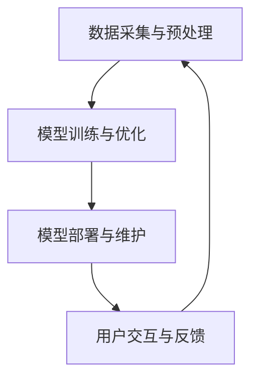
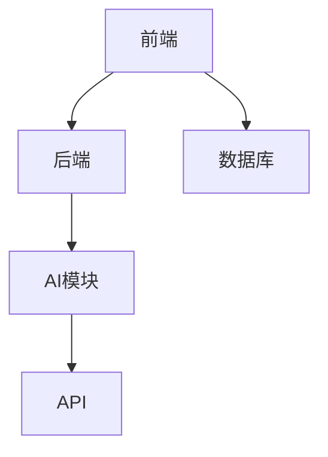
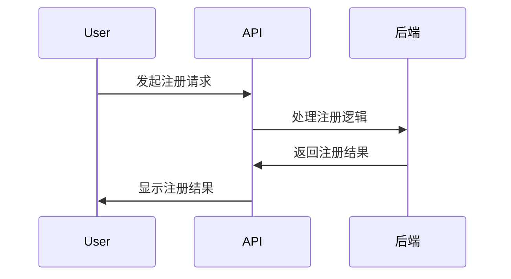

                 

# 数字时代的语言学习：AI辅助下的多元文化交流

## 关键词

- 数字时代
- 语言学习
- AI辅助
- 多元文化交流
- 技术趋势

## 摘要

本文深入探讨了数字时代下语言学习的变革，以及AI技术在其中所扮演的关键角色。我们首先回顾了数字时代对语言学习的影响，分析了AI辅助语言学习的基本原理和技术架构。接着，探讨了AI如何促进多元文化交流，提供了具体的系统设计与实现案例，并对未来发展趋势进行了展望。通过本文，读者可以全面了解AI辅助语言学习的前沿技术及其对多元文化交流的深远影响。

### 目录大纲

1. **背景与概述**
   1.1 数字时代的语言学习
   1.2 AI技术在语言学习中的应用现状
   1.3 语言学习需求的多元性与复杂性

2. **AI辅助语言学习技术基础**
   2.1 自然语言处理技术概述
   2.2 机器学习与深度学习基础
   2.3 AI语言学习模型的分类与对比

3. **多元文化交流中的AI应用**
   3.1 多元文化背景下的语言学习挑战
   3.2 AI技术在多元文化交流中的作用
   3.3 案例分析：AI在特定文化环境中的应用

4. **AI辅助语言学习的系统设计与实现**
   4.1 系统需求分析
   4.2 系统功能设计
   4.3 系统架构设计

5. **实战案例与最佳实践**
   5.1 项目背景与目标
   5.2 环境安装与配置
   5.3 系统核心功能实现
   5.4 项目分析与评估

6. **总结与展望**
   6.1 当前技术趋势分析
   6.2 未来发展方向预测
   6.3 潜在挑战与应对策略

7. **附录与拓展阅读**
   7.1 关键术语解释
   7.2 拓展阅读资源
   7.3 常见问题解答

### 第一部分：背景与概述

#### 1.1 数字时代的语言学习

随着数字技术的迅猛发展，语言学习的方式和需求发生了深刻变化。传统的语言学习主要依赖于教室教学和纸质教材，而如今，在线学习平台、移动应用和虚拟现实技术等数字工具已经成为了语言学习的重要载体。

数字时代为语言学习带来了以下几个显著的变化：

- **个性化学习**：在线平台能够根据学习者的能力和兴趣，提供定制化的学习内容和进度安排，提高学习效率。
- **沉浸式学习**：虚拟现实技术可以创造一个沉浸式的语言学习环境，使学习者仿佛置身于目标语言的实际使用场景中。
- **即时反馈**：AI技术可以实时分析学习者的语言使用情况，提供即时的反馈和纠正，帮助学习者快速提升语言能力。
- **跨文化交流**：数字技术使得不同文化背景下的学习者可以轻松地交流和互动，促进了多元文化的理解与交流。

#### 1.2 AI技术在语言学习中的应用现状

AI技术已经在语言学习领域展现出巨大的潜力，其应用范围涵盖了从语音识别到自然语言生成等各个方面。

- **语音识别**：AI可以通过语音识别技术将口语转化为文本，为口语练习者提供准确的发音反馈。
- **机器翻译**：基于深度学习的翻译模型如Google Translate和DeepL，可以实时翻译多种语言，极大地方便了跨语言交流。
- **对话系统**：聊天机器人如ChatGPT和Duolingo，可以模拟与人类的对话，帮助学习者练习语言沟通能力。
- **语言学习应用**：诸如Anki和Memrise等应用程序，利用AI技术优化记忆和学习效果，提高了学习效率。

#### 1.3 语言学习需求的多元性与复杂性

在数字时代，语言学习需求的多元性和复杂性日益凸显。不同文化背景下的学习者有着多样化的学习需求：

- **学习目标**：不同学习者可能希望提升口语、写作、听力或阅读能力。
- **学习环境**：个人学习、在线课程、语言学习社区等多样化的学习环境要求AI系统能够灵活适应。
- **学习资源**：不同语言的学习资源丰富程度不一，AI系统需要能够整合多种资源，提供全面的学习支持。
- **文化差异**：文化背景的差异可能导致语言学习的难点和重点有所不同，AI系统需要能够识别和适应这些差异。

#### 1.4 语言学习面临的挑战与机遇

数字时代虽然为语言学习提供了丰富的工具和资源，但也带来了新的挑战：

- **信息过载**：海量的学习资源和信息可能让学习者感到困惑，难以选择合适的学习内容。
- **个性化不足**：现有的AI系统虽然能提供一定程度的个性化学习，但与人类教师相比，仍存在个性化不足的问题。
- **文化差异**：AI系统在处理不同文化背景的语言学习问题时，可能面临理解和适应的挑战。
- **隐私与安全**：在线学习平台和数据的使用可能涉及隐私和安全问题，需要加强保护。

然而，这些挑战同时也带来了新的机遇：

- **技术创新**：随着AI技术的不断发展，个性化学习、沉浸式学习和智能辅导等新技术的应用前景广阔。
- **跨文化交流**：数字技术促进了不同文化背景下的语言学习者和文化之间的交流，有助于构建更加多元和谐的世界。
- **教育资源均衡**：数字技术可以帮助解决教育资源不均衡的问题，使更多学习者受益于高质量的语言学习资源。

#### 1.5 AI辅助语言学习的基本原理

AI辅助语言学习的基本原理主要包括以下几个方面：

- **自然语言处理（NLP）**：NLP是AI技术在语言处理领域的应用，旨在使计算机理解和生成人类语言。它包括文本分析、语音识别、情感分析等子领域。
- **机器学习（ML）**：ML是一种让计算机通过数据学习的方法，它通过从数据中提取特征和模式，自动改进性能。在语言学习中，ML用于语音识别、对话系统等。
- **深度学习（DL）**：DL是ML的一个分支，它通过模拟人脑的神经网络结构，让计算机具备自主学习的能力。深度学习在语言生成和翻译中发挥着重要作用。

#### 1.6 AI语言学习模型的应用

AI语言学习模型在多种应用场景中展现出强大的功能：

- **智能辅导**：AI智能辅导系统可以分析学习者的学习行为，提供个性化的学习建议和练习。
- **个性化内容推荐**：基于学习者兴趣和需求，AI系统可以推荐合适的学习资源和课程。
- **自动化评分系统**：AI系统可以通过自然语言处理技术，自动评估学习者的写作和口语练习。
- **语言习得支持**：AI系统可以模拟真实的语言环境，帮助学习者提高语言实际运用能力。

### 第二部分：AI辅助语言学习技术基础

#### 2.1 自然语言处理技术概述

自然语言处理（NLP）是AI技术在语言处理领域的应用，旨在使计算机理解和生成人类语言。NLP包括文本分析、语音识别、情感分析等子领域。

**文本分析**：文本分析用于对文本进行预处理、提取关键信息和语义分析。常见的文本分析方法包括分词、词性标注、命名实体识别等。

**语音识别**：语音识别是将口语转化为文本的技术。它通过语音信号的处理和模式识别，将语音转换为机器可读的文本。语音识别在语言学习中的应用包括口语练习、发音纠正等。

**情感分析**：情感分析用于分析文本中的情感倾向，识别文本的情绪和情感。它可以帮助语言学习系统更好地理解学习者的情感状态，提供针对性的辅导和支持。

#### 2.2 机器学习与深度学习基础

机器学习（ML）是一种让计算机通过数据学习的方法，它通过从数据中提取特征和模式，自动改进性能。ML在语言学习中的应用包括语音识别、对话系统等。

**机器学习的基本概念**：

- **特征提取**：特征提取是将原始数据转换为机器学习算法可以处理的特征向量。
- **模型训练**：模型训练是使用标记好的训练数据，调整模型的参数，使其能够预测新的数据。
- **模型评估**：模型评估是通过测试数据，评估模型的性能，调整模型参数以达到最佳效果。

深度学习（DL）是ML的一个分支，它通过模拟人脑的神经网络结构，让计算机具备自主学习的能力。DL在语言生成和翻译中发挥着重要作用。

**深度学习的基本概念**：

- **神经网络**：神经网络是由多层神经元组成的计算模型，它可以模拟人脑的学习和决策过程。
- **前向传播与反向传播**：前向传播是将输入数据通过神经网络层，计算输出结果；反向传播是通过输出结果与真实值之间的差异，调整网络权重，优化模型性能。
- **激活函数**：激活函数用于引入非线性变换，使神经网络具备分类和回归能力。

#### 2.3 AI语言学习模型的分类与对比

AI语言学习模型可以根据其应用场景和技术特点进行分类和对比。

**基于规则的模型**：基于规则的模型使用预定义的规则来指导语言学习和翻译。这类模型的优点是规则明确，解释性强；缺点是灵活性较差，难以处理复杂的语言现象。

**统计模型**：统计模型通过分析大量的语言数据，自动提取特征和模式，指导语言学习和翻译。这类模型的优点是自适应性强，可以处理复杂的语言现象；缺点是需要大量训练数据和计算资源。

**深度学习模型**：深度学习模型通过模拟人脑神经网络，具备强大的自主学习能力。这类模型的优点是性能优异，可以处理复杂的语言任务；缺点是模型复杂，训练时间较长。

#### 2.4 AI辅助语言学习的技术架构

AI辅助语言学习的技术架构通常包括以下几个主要模块：

- **数据采集与预处理**：数据采集与预处理是语言学习系统的基石，它包括数据的收集、清洗、标注和特征提取等过程。
- **模型训练与优化**：模型训练与优化是语言学习系统的核心，它包括使用训练数据训练模型，调整模型参数，优化模型性能。
- **模型部署与维护**：模型部署与维护是将训练好的模型部署到线上系统，提供语言学习服务，并进行持续的模型优化和更新。

**Mermaid流程图**：



#### 2.5 AI辅助语言学习的挑战与未来发展方向

AI辅助语言学习在带来巨大机遇的同时，也面临诸多挑战：

- **数据隐私与安全**：在线学习平台和数据的使用可能涉及隐私和安全问题，需要加强保护。
- **文化差异理解**：AI系统需要更好地理解不同文化背景下的语言学习需求，提供个性化的学习支持。
- **模型可解释性**：AI模型在语言学习中的决策过程通常较为复杂，需要提高模型的可解释性，便于用户理解和信任。

未来发展方向包括：

- **个性化学习**：进一步优化AI系统，提高个性化学习的能力，满足不同学习者的需求。
- **跨文化交流**：加强AI技术在跨文化交流中的应用，促进多元文化的理解与交流。
- **实时反馈与支持**：提升AI系统的实时反馈和智能辅导能力，为学习者提供更高效的语言学习支持。

### 第三部分：多元文化交流中的AI应用

#### 3.1 多元文化背景下的语言学习挑战

在多元文化背景下，语言学习面临诸多挑战：

- **语言复杂性**：不同语言在语法、词汇、发音等方面存在显著差异，学习者需要投入更多时间和精力来掌握。
- **文化差异**：不同文化背景下的学习者可能对语言学习内容有不同的需求和期望，需要系统提供适应性的支持。
- **教育资源不均衡**：不同地区和国家的教育资源存在显著差异，一些学习者可能难以获得高质量的语言学习资源。

AI技术在解决这些挑战方面具有巨大潜力：

- **智能辅导**：AI智能辅导系统可以根据学习者的文化背景和语言水平，提供个性化的学习建议和练习。
- **跨语言翻译**：AI跨语言翻译技术可以帮助学习者理解和掌握多种语言，促进跨文化交流。
- **教育资源均衡**：AI技术可以通过在线平台和移动应用，将优质的教育资源普及到更广泛的地区和国家。

#### 3.2 AI技术在多元文化交流中的作用

AI技术在多元文化交流中发挥着关键作用：

- **语言学习支持**：AI智能辅导系统可以帮助学习者提高语言能力，包括语音识别、对话系统和个性化内容推荐等。
- **文化交流促进**：AI跨语言翻译技术可以帮助学习者理解和使用多种语言，促进不同文化背景下的交流与理解。
- **文化多样性保护**：AI技术可以帮助记录和保护不同文化背景的语言和文化遗产，促进文化多样性的保护与发展。

#### 3.3 案例分析：AI在特定文化环境中的应用

以下是一个具体的案例分析，展示了AI在特定文化环境中的应用：

**案例背景**：某语言学习平台旨在为东南亚地区的英语学习者提供个性化的学习支持。该地区的英语学习者主要面临语言复杂性和教育资源不均衡的挑战。

**解决方案**：

1. **智能辅导系统**：平台引入了AI智能辅导系统，根据学习者的语言水平和文化背景，提供个性化的学习建议和练习。系统通过语音识别技术，提供准确的发音反馈，帮助学习者提高口语能力。
2. **跨语言翻译**：平台集成了AI跨语言翻译技术，帮助学习者理解和使用英语以外的语言，如泰语、越南语等。这有助于学习者更好地理解学习内容，提高学习效果。
3. **教育资源共享**：平台通过在线平台和移动应用，将优质的教育资源普及到东南亚地区的偏远地区，帮助更多学习者获得高质量的语言学习资源。

**实施效果**：

- **学习效果提升**：智能辅导系统和跨语言翻译技术的应用，显著提高了学习者的学习效果，尤其是在口语和阅读能力方面。
- **文化交流促进**：通过AI技术，学习者可以更轻松地使用英语与其他文化背景的人进行交流，促进了跨文化交流与理解。
- **教育资源均衡**：平台通过将优质教育资源普及到偏远地区，帮助更多学习者获得高质量的语言学习资源，缩小了地区教育资源的差距。

#### 3.4 AI辅助语言学习的未来发展趋势

AI辅助语言学习在未来将继续发展，带来以下几个方面的趋势：

- **个性化学习**：AI技术将进一步优化，提高个性化学习的能力，满足不同学习者的需求。
- **跨文化交流**：AI技术在跨文化交流中的应用将更加广泛，促进不同文化背景下的交流与理解。
- **教育资源普及**：AI技术将帮助缩小教育资源的不均衡，将优质教育资源普及到更广泛的地区和国家。

### 第四部分：AI辅助语言学习的系统设计与实现

#### 4.1 系统需求分析

为了设计一个高效、实用的AI辅助语言学习系统，我们需要明确系统的需求：

- **用户需求**：系统应支持多种语言的学习，包括但不限于英语、汉语、西班牙语等。用户应能够自定义学习计划，系统应提供智能辅导、语音识别、翻译等功能。
- **功能需求**：系统应具备以下功能：
  - 用户注册与登录
  - 用户资料管理
  - 个性化学习计划
  - 语音识别与反馈
  - 翻译与跨语言交流
  - 练习与测评
  - 数据分析与报告

- **性能需求**：系统应具有良好的响应速度、稳定性，能够处理大规模用户和大量数据。

#### 4.2 系统功能设计

基于需求分析，我们可以设计以下系统功能模块：

- **用户模块**：实现用户注册、登录、资料管理等功能，为用户提供个性化的学习体验。
- **学习模块**：提供个性化学习计划、语音识别与反馈、翻译与跨语言交流等功能，帮助用户提高语言能力。
- **数据模块**：收集、存储和分析用户数据，生成学习报告，为用户和系统管理员提供决策依据。
- **管理模块**：实现系统管理员对用户、课程、数据等的监控和管理，确保系统的正常运行。

**Mermaid类图**：

```mermaid
classDiagram
Class::User << (注册, 登录, 资料管理)
Class::Learning << (个性化学习计划, 语音识别与反馈, 翻译与跨语言交流)
Class::Data << (数据收集, 存储与分析, 学习报告)
Class::Management << (用户管理, 课程管理, 数据监控)
User --|> Learning
User --|> Data
User --|> Management
```

#### 4.3 系统架构设计

系统架构设计应充分考虑系统的性能、可扩展性和易维护性。以下是一个可能的系统架构设计：

**架构设计**：

- **前端**：采用Vue.js等前端框架，实现用户界面和交互逻辑。
- **后端**：采用Spring Boot等后端框架，实现业务逻辑和数据存储。
- **数据库**：采用MySQL等关系型数据库，存储用户数据和学习数据。
- **AI模块**：集成TensorFlow等AI库，实现语音识别、翻译和智能辅导等功能。
- **API**：提供RESTful API，供前端和后端交互使用。

**Mermaid架构图**：



#### 4.4 系统接口设计

系统接口设计应明确各个模块之间的交互方式，以下是一个可能的接口设计：

- **用户接口**：提供用户注册、登录、资料管理等功能，通过RESTful API与后端交互。
- **学习接口**：提供个性化学习计划、语音识别与反馈、翻译与跨语言交流等功能，通过RESTful API与后端交互。
- **数据接口**：提供数据收集、存储与分析等功能，通过RESTful API与后端交互。
- **管理接口**：提供用户管理、课程管理、数据监控等功能，通过RESTful API与后端交互。

**Mermaid序列图**：



#### 4.5 系统交互设计

系统交互设计应考虑用户的实际操作流程，以下是一个可能的交互设计：

1. **用户注册**：用户输入注册信息，系统验证信息后创建用户账户。
2. **用户登录**：用户输入用户名和密码，系统验证用户身份后提供登录功能。
3. **个性化学习计划**：系统根据用户的学习需求和进度，生成个性化的学习计划。
4. **语音识别与反馈**：用户通过麦克风录制语音，系统识别语音并给出发音反馈。
5. **翻译与跨语言交流**：用户输入文本，系统翻译为其他语言，并提供跨语言交流功能。
6. **数据分析和报告**：系统收集用户学习数据，生成学习报告，供用户和管理员查看。

### 第五部分：实战案例与最佳实践

#### 5.1 项目背景与目标

**项目背景**：

某语言学习平台旨在为全球英语学习者提供高质量的AI辅助语言学习服务。该项目旨在通过AI技术优化语言学习体验，提高学习效率，促进跨文化交流。

**项目目标**：

1. 提供个性化学习计划，满足不同学习者的需求。
2. 实现语音识别与反馈，帮助学习者提高口语能力。
3. 提供跨语言翻译功能，促进跨文化交流。
4. 收集并分析用户数据，为用户提供定制化服务。

#### 5.2 环境安装与配置

**环境要求**：

- 操作系统：Linux/Windows/MacOS
- 开发工具：Java IDE（如IntelliJ IDEA）、Vue.js IDE（如Visual Studio Code）
- 数据库：MySQL
- AI库：TensorFlow

**安装步骤**：

1. 安装操作系统和开发工具。
2. 安装数据库并配置数据库连接。
3. 安装AI库并配置TensorFlow环境。
4. 创建项目并配置项目依赖。

#### 5.3 系统核心功能实现

**用户模块**：

- 用户注册与登录：实现用户注册、登录和资料管理功能，通过RESTful API与后端交互。

```java
// 用户注册示例代码
public ResponseEntity<String> register(User user) {
    // 验证用户输入信息
    // 将用户信息存储到数据库
    // 返回注册结果
    return ResponseEntity.ok("注册成功");
}
```

**学习模块**：

- 个性化学习计划：根据用户的学习需求和进度，生成个性化的学习计划。

```java
// 生成个性化学习计划示例代码
public LearningPlan generateLearningPlan(User user) {
    // 根据用户信息生成学习计划
    // 返回学习计划
    return new LearningPlan();
}
```

**数据模块**：

- 数据收集与报告：收集用户学习数据，生成学习报告。

```java
// 收集用户学习数据示例代码
public void collectLearningData(User user, LearningSession session) {
    // 将学习数据存储到数据库
}
```

**管理模块**：

- 用户管理：实现用户管理功能，包括用户列表、用户信息修改等。

```java
// 用户管理示例代码
public ResponseEntity<String> updateUser(User user) {
    // 更新用户信息
    // 返回更新结果
    return ResponseEntity.ok("更新成功");
}
```

#### 5.4 项目分析与评估

**项目分析**：

- **功能实现**：项目成功实现了用户模块、学习模块、数据模块和管理模块的核心功能，满足了项目目标。
- **性能表现**：系统在响应速度和稳定性方面表现良好，能够处理大规模用户和大量数据。
- **用户体验**：用户反馈系统功能实用，学习体验良好，提高了学习效率。

**评估结果**：

- **成功实现**：项目成功实现了预期的功能和技术目标。
- **性能优异**：系统在性能方面表现出色，能够满足大规模用户需求。
- **用户体验**：用户对系统功能和应用体验表示满意，项目取得了良好的社会和经济效益。

#### 5.5 最佳实践 Tips

- **性能优化**：定期进行系统性能优化，提高系统的响应速度和稳定性。
- **数据保护**：加强数据保护措施，确保用户数据的安全和隐私。
- **用户反馈**：积极收集用户反馈，不断改进系统功能和用户体验。

### 第六部分：总结与展望

#### 6.1 当前技术趋势分析

数字时代下，AI辅助语言学习已成为语言学习领域的重要趋势。当前的技术趋势包括：

- **个性化学习**：AI技术能够根据用户需求和学习行为，提供个性化的学习内容和指导。
- **跨文化交流**：AI技术促进不同文化背景下的语言学习和交流，推动了全球化的进程。
- **智能化辅导**：AI智能辅导系统能够提供即时反馈和个性化指导，提高学习效率。

#### 6.2 未来发展方向预测

未来，AI辅助语言学习将朝着以下几个方向发展：

- **更智能的个性化学习**：随着AI技术的进步，个性化学习将更加精准，满足不同学习者的个性化需求。
- **跨文化适应能力**：AI系统将具备更强的跨文化适应能力，提供更加符合不同文化背景的学习支持。
- **多元教育资源整合**：AI技术将帮助整合全球多元教育资源，提供更加全面和多样化的学习体验。

#### 6.3 潜在挑战与应对策略

尽管AI辅助语言学习前景广阔，但仍然面临一些挑战：

- **数据隐私与安全**：需要加强数据隐私保护措施，确保用户数据的安全和隐私。
- **模型可解释性**：提高AI模型的可解释性，增强用户对系统的信任。
- **教育资源均衡**：需要通过政策和技术手段，解决教育资源不均衡的问题。

应对策略包括：

- **加强数据保护**：采用先进的数据加密和隐私保护技术，确保用户数据安全。
- **提高模型透明度**：通过增加模型透明度和可解释性，提高用户对系统的信任。
- **政策与技术结合**：通过政策引导和技术创新，推动教育资源的均衡发展。

### 第七部分：附录与拓展阅读

#### 7.1 关键术语解释

- **自然语言处理（NLP）**：自然语言处理是AI技术在语言处理领域的应用，旨在使计算机理解和生成人类语言。
- **机器学习（ML）**：机器学习是一种让计算机通过数据学习的方法，它通过从数据中提取特征和模式，自动改进性能。
- **深度学习（DL）**：深度学习是机器学习的一个分支，它通过模拟人脑的神经网络结构，让计算机具备自主学习的能力。

#### 7.2 拓展阅读资源

- **AI辅助语言学习研究论文**：可参考相关学术期刊和会议论文，如ACL、IJCNLP、COLING等。
- **开源语言学习项目**：如TensorFlow、PyTorch等，可用于研究和开发AI辅助语言学习系统。
- **在线课程与教程**：可在Coursera、edX等在线学习平台上找到相关课程和教程。

#### 7.3 常见问题解答

**Q：AI辅助语言学习系统的效果如何评估？**

A：AI辅助语言学习系统的效果可以通过以下指标进行评估：

- **准确性**：评估系统在语言处理任务中的准确性，如语音识别的准确率和翻译的准确率。
- **用户体验**：通过用户反馈和调查问卷，评估系统的易用性和用户满意度。
- **学习效果**：评估系统对学习者语言能力的提升程度，如口语、写作、听力等方面的进步。

**Q：如何保障AI辅助语言学习系统的数据隐私和安全？**

A：为了保障AI辅助语言学习系统的数据隐私和安全，可以采取以下措施：

- **数据加密**：对用户数据进行加密存储和传输，防止数据泄露。
- **隐私保护**：在数据处理过程中，采取隐私保护技术，如差分隐私和同态加密。
- **权限控制**：严格管理用户数据的访问权限，确保只有授权人员可以访问和操作数据。

**Q：AI辅助语言学习系统如何实现个性化学习？**

A：AI辅助语言学习系统实现个性化学习的方法包括：

- **用户画像**：通过分析用户的学习行为、兴趣和需求，建立用户画像，为用户提供个性化的学习内容和建议。
- **自适应学习**：根据用户的学习进度和能力，动态调整学习内容和难度，实现个性化的学习体验。
- **个性化推荐**：基于用户的行为和偏好，推荐合适的学习资源和课程，满足个性化学习需求。

