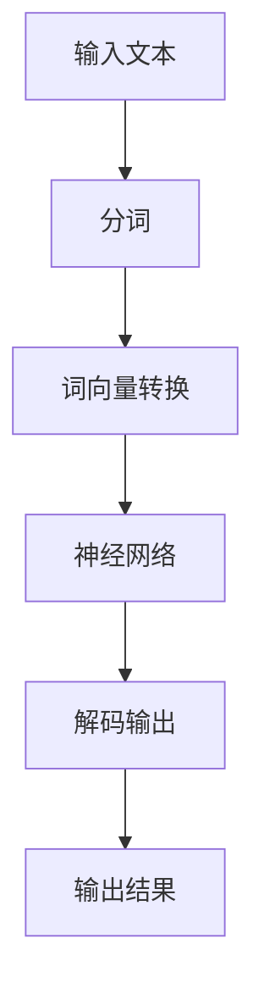
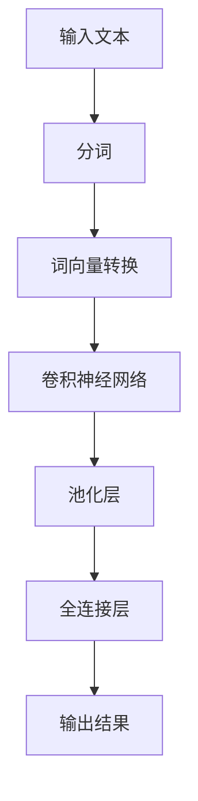
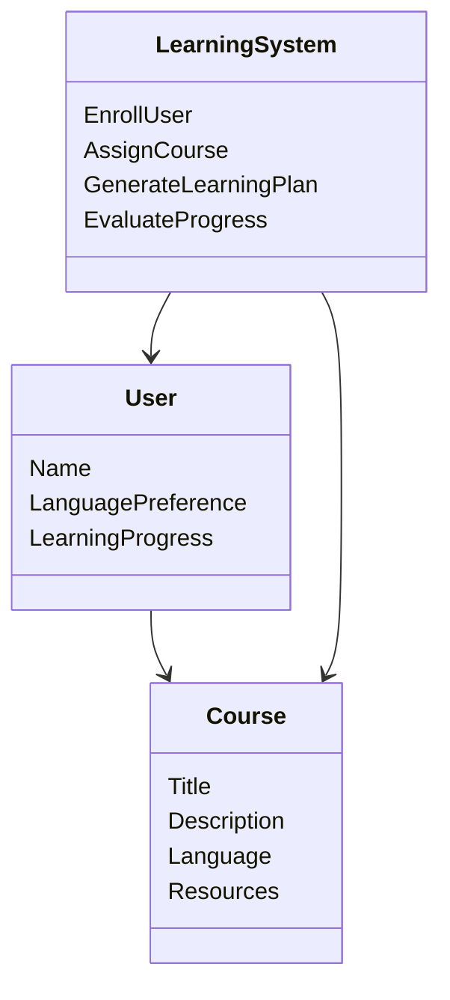
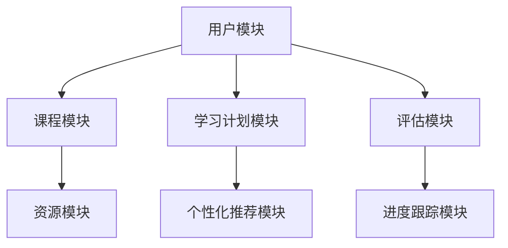
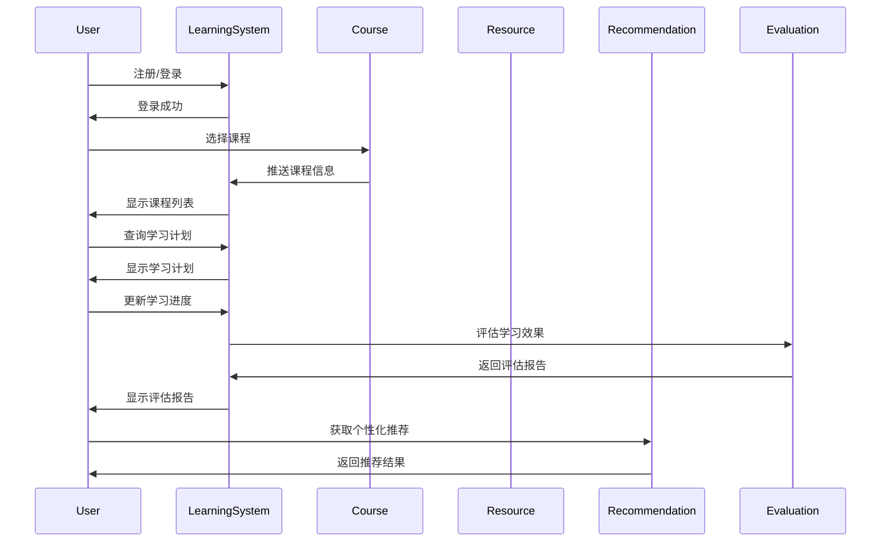

                 

## 文章标题

《数字时代的语言学习：AI辅助下的多语言交流》

### 关键词

- 数字时代
- 语言学习
- AI技术
- 多语言交流
- 算法原理
- 系统设计
- 项目实战
- 最佳实践

### 摘要

在数字化日益深入的今天，语言学习面临着前所未有的挑战和机遇。本文章从数字时代语言学习的背景出发，探讨了AI技术在多语言交流中的应用。文章分为七个部分，依次介绍了数字时代语言学习的重要性、AI与多语言交流的核心概念及其联系、AI辅助语言学习的基础知识、多语言学习系统的设计与实现、项目实战、AI辅助语言学习的最佳实践以及未来语言学习的发展趋势。通过这一系列内容，本文旨在为读者提供一份全面而深入的指导，帮助他们在数字时代中更高效地进行多语言学习。

---

## 引言：数字时代语言学习的重要性

### 1.1 问题背景

在全球化迅猛发展的背景下，跨文化沟通的需求日益增加。企业需要与国际合作伙伴交流，教育机构需要培养具备多语言能力的人才，而个人为了提高自身竞争力，也纷纷投入到学习多语言的热潮中。然而，传统的语言学习方式存在效率低下、个性化不足等问题。这促使我们思考，在数字时代，如何通过技术手段来提升语言学习的效率和效果。

### 1.2 问题描述

传统的语言学习往往依赖于教材和课堂，学习者的主动性受限，学习进度难以评估，个性化学习需求难以满足。此外，多语言学习者的学习路径和资源获取也面临诸多挑战。这些问题限制了语言学习的效果和普及。

### 1.3 问题解决

AI技术的快速发展为语言学习带来了新的契机。通过AI，可以实现对学习者的个性分析和学习路径的智能化推荐，提升学习效率。同时，AI还可以帮助进行语言翻译、发音纠正、词汇扩展等多方面的辅助，为语言学习提供全方位的支持。

### 1.4 边界与外延

AI辅助语言学习的技术范围包括自然语言处理（NLP）、机器翻译、语音识别等。这些技术不仅为语言学习提供了工具，还可以在多语言交流、语言教学等领域发挥重要作用。然而，AI辅助语言学习也存在一定的限制，例如算法的准确性和智能程度的局限，以及数据隐私和伦理问题等。

---

## AI与多语言交流

### 2.1 核心概念

AI（人工智能）是指使计算机系统能够模拟人类智能行为的技术。在多语言交流中，AI的应用主要体现在自然语言处理（NLP）和机器翻译技术上。

NLP是AI的一个重要分支，它涉及文本理解、情感分析、语音识别等方面。通过NLP，计算机可以理解并处理自然语言，从而实现人机交互。

机器翻译是将一种语言的文本翻译成另一种语言的技术。随着AI技术的发展，机器翻译的准确性和流畅性得到了显著提升。

### 2.2 概念属性特征对比

| AI技术  | 特性                      | 应用场景                       |
|---------|--------------------------|--------------------------------|
| NLP     | 理解自然语言             | 文本分析、情感识别、语音识别等  |
| 机器翻译 | 翻译不同语言的文本       | 跨语言沟通、文本翻译、文档整理等 |

### 2.3 ER实体关系图

```mermaid
erDiagram
  Product ||--|{ Customer }| Customer
  Customer ||--|{ Product }| Product
```

在此ER图中，`Product`和`Customer`是实体，`||--|{ ... }| ...`表示它们之间的关系。

---

## AI辅助语言学习的基础知识

### 3.1 算法原理

AI辅助语言学习的核心算法主要包括深度学习、神经网络和序列模型等。以下是一个简单的算法流程图：



深度学习算法通过多层神经网络结构，对输入文本进行处理，从而生成输出结果。以下是一个简单的神经网络实现示例：

```python
import tensorflow as tf

model = tf.keras.Sequential([
    tf.keras.layers.Embedding(input_dim=10000, output_dim=16),
    tf.keras.layers.Flatten(),
    tf.keras.layers.Dense(units=1)
])

model.compile(optimizer='adam', loss='mean_squared_error')
```

在这个例子中，`Embedding`层将输入文本转换为词向量，`Flatten`层将词向量展平，`Dense`层对输入进行分类。

### 3.2 算法流程图



### 3.3 数学模型与公式

深度学习算法的数学基础主要包括激活函数、梯度下降算法等。以下是一个简单的数学模型：

$$
y = \sigma(W \cdot x + b)
$$

其中，$\sigma$是激活函数，$W$是权重矩阵，$x$是输入向量，$b$是偏置。

在训练过程中，我们使用梯度下降算法来更新权重矩阵：

$$
W := W - \alpha \cdot \frac{\partial J}{\partial W}
$$

其中，$\alpha$是学习率，$J$是损失函数。

---

## 多语言学习系统的设计与实现

### 4.1 问题场景介绍

多语言学习系统旨在帮助用户在不同的语言环境中进行学习和交流。该系统需要支持多种语言的学习资源，并提供个性化的学习建议。以下是一个典型的系统功能设计。

### 4.2 系统功能设计



### 4.3 系统架构设计



### 4.4 系统接口设计

系统接口设计如下：

- 用户接口：用于用户注册、登录、课程选择、进度查询等。
- 课程接口：用于课程创建、课程信息查询、课程资源管理等。
- 学习计划接口：用于生成学习计划、学习进度跟踪等。
- 评估接口：用于评估用户学习效果、生成评估报告等。

### 4.5 系统交互



---

## 项目实战：AI辅助语言学习系统开发

### 5.1 环境安装

为了搭建一个AI辅助语言学习系统，我们需要安装以下环境：

- Python 3.8+
- TensorFlow 2.6.0+
- Keras 2.6.0+
- NumPy 1.19.5+
- Pandas 1.2.5+

在安装这些依赖库后，我们可以开始构建系统。

### 5.2 系统核心实现

以下是一个简单的AI辅助语言学习系统核心实现的代码示例：

```python
from tensorflow.keras.models import Sequential
from tensorflow.keras.layers import Embedding, LSTM, Dense
from tensorflow.keras.optimizers import Adam

# 模型构建
model = Sequential()
model.add(Embedding(input_dim=10000, output_dim=32))
model.add(LSTM(units=128, return_sequences=True))
model.add(LSTM(units=128))
model.add(Dense(units=1, activation='sigmoid'))

# 编译模型
model.compile(optimizer=Adam(learning_rate=0.001), loss='binary_crossentropy', metrics=['accuracy'])

# 训练模型
model.fit(x_train, y_train, epochs=10, batch_size=64)
```

### 5.3 代码应用解读

这段代码首先定义了一个序列模型，用于预测语言学习者的学习进度。`Embedding`层用于将输入文本转换为词向量，`LSTM`层用于处理序列数据，`Dense`层用于输出预测结果。模型使用Adam优化器和二分类交叉熵损失函数进行编译，并使用训练数据集进行训练。

### 5.4 实际案例分析

我们可以使用一个真实案例来展示AI辅助语言学习系统在实际中的应用。假设有一个学习者，他想要学习英语。系统会根据他的学习进度和偏好，推荐适合的学习资源和练习题。

### 5.5 项目小结

通过本项目的实战，我们了解了如何使用AI技术构建一个辅助语言学习系统。这个系统可以帮助学习者更高效地学习，同时为教育机构提供有力的支持。未来，我们可以进一步优化系统的功能，提高其智能性和用户体验。

---

## AI辅助语言学习的最佳实践

### 6.1 最佳实践

- 利用AI进行个性化学习路径推荐，提高学习效率。
- 定期进行学习效果评估，及时调整学习策略。
- 结合在线学习和离线学习，实现灵活的学习模式。
- 注重数据安全和隐私保护，遵守相关法律法规。

### 6.2 注意事项

- AI辅助语言学习系统需要大量高质量的数据支持。
- 算法的准确性和可靠性直接影响学习效果。
- 用户隐私和数据安全是必须关注的重要问题。

### 6.3 拓展阅读

- 《深度学习》（Ian Goodfellow、Yoshua Bengio、Aaron Courville 著）
- 《Python深度学习》（François Chollet 著）
- 《自然语言处理与深度学习》（Christopher D. Manning、Heidi F. Wallach 著）

---

## 总结与展望：未来语言学习的发展趋势

### 7.1 总结

本文从数字时代语言学习的背景出发，探讨了AI技术在多语言交流中的应用。通过详细介绍AI辅助语言学习系统的设计与实现，以及实际案例分析，我们看到了AI在提升语言学习效率方面的巨大潜力。同时，我们也提出了AI辅助语言学习的最佳实践和注意事项。

### 7.2 展望

未来，AI辅助语言学习将继续发展，并在以下方面取得突破：

- 更智能的个性化学习推荐系统。
- 更高精度的自然语言处理技术。
- 更广泛的多语言资源库和知识图谱。
- 更丰富的学习场景和互动方式。

我们相信，随着AI技术的不断进步，语言学习将变得更加高效、有趣和个性化，为全球范围内的学习者带来更多的机遇和可能。

---

## 作者信息

作者：AI天才研究院/AI Genius Institute & 禅与计算机程序设计艺术 /Zen And The Art of Computer Programming

---

在本文中，我们系统地介绍了数字时代语言学习的现状、AI辅助语言学习的技术原理、系统设计与实现，以及最佳实践和未来趋势。希望本文能为读者在语言学习领域提供有价值的参考和启示。随着AI技术的不断发展，我们有理由相信，未来的语言学习将更加智能化、个性化和高效化。让我们共同期待这一美好未来的到来！

