                 


### 1.1 身份认同的概念

**背景介绍**

在数字时代，身份认同这一概念愈发复杂且多维。身份认同不仅仅是个人在社会中的位置和角色，更是个人内在价值观、信仰和归属感的综合体现。随着互联网和数字技术的发展，人们在线上世界的互动日益频繁，这些互动不仅改变了人们的社交模式，也深刻影响了他们的身份认同。

**问题背景与问题描述**

身份认同的问题背景源于人类在数字世界中的多重存在。每个人在互联网上都有多个身份，这些身份可能是在线游戏中的角色、社交媒体上的昵称、讨论区的ID等。这些身份如何构建和维系，它们如何影响个人的自我认同，成为了我们需要探讨的问题。

**问题解决**

解决这个问题的关键在于理解身份认同的构成因素，以及这些因素如何在线上世界中相互作用。首先，我们需要明确身份认同的基本要素，包括个人特质、社会角色、文化背景和信仰等。然后，我们分析这些要素在数字环境中的表现形式，如虚拟身份的创建、虚拟社区的参与等。

**边界与外延**

身份认同不仅涉及个人的内心体验，还涉及到社会互动和文化认同。在不同的文化和社会背景下，人们对身份认同的理解和追求可能有所不同。因此，边界与外延的讨论有助于我们更全面地理解身份认同的多样性。

**概念结构与核心要素组成**

身份认同可以看作是一个由多个核心要素组成的结构。这些要素包括：

1. **个人特质**：指个人的性格、兴趣、价值观等。
2. **社会角色**：个人在社会中的地位和角色，如学生、职业人士、父母等。
3. **文化背景**：个人所属的文化和社会背景，包括语言、宗教、传统等。
4. **虚拟身份**：在数字世界中的多重身份，如游戏角色、社交媒体昵称等。
5. **社交互动**：在线社交活动和人际交往，对个人身份认同的影响。

**核心概念与联系**

身份认同与多个核心概念紧密相关：

1. **社会身份理论**：探讨个体在社会结构中的定位和角色。
2. **心理认同理论**：研究个体内在价值观和信仰的构建。
3. **虚拟现实理论**：探讨数字环境对人类行为和身份的影响。

**算法原理讲解**

在分析身份认同的算法原理时，我们可以借鉴社会学和心理学的相关理论。例如，社会网络分析算法可以帮助我们理解个体在社交网络中的身份构建，而心理测量学的方法可以用于评估个体在不同环境下的身份认同程度。

下面是一个简单的身份认同评估算法的mermaid流程图：

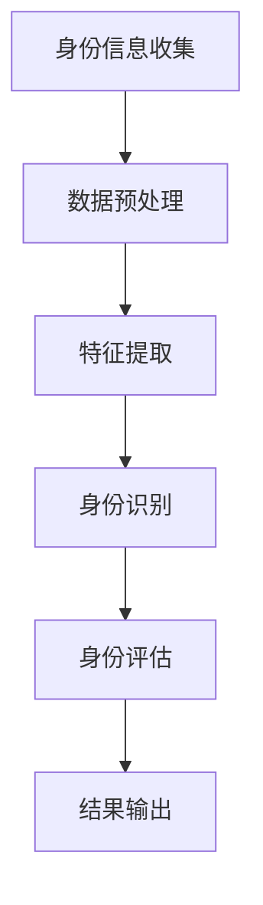

使用Python代码来详细阐述算法原理：

```python
# 身份信息收集
identity_data = collect_identity_data()

# 数据预处理
preprocessed_data = preprocess_data(identity_data)

# 特征提取
features = extract_features(preprocessed_data)

# 身份识别
identified_identity = identify_identity(features)

# 身份评估
evaluation_score = evaluate_identity(identified_identity)

# 结果输出
print(f"Your identity score is: {evaluation_score}")
```

在算法原理中，我们使用了以下数学模型和公式：

1. **身份评估模型**：$E = f(I_1, I_2, ..., I_n)$，其中$E$为身份评估得分，$I_1, I_2, ..., I_n$为身份特征。
2. **特征提取模型**：$F = g(D_1, D_2, ..., D_m)$，其中$F$为特征向量，$D_1, D_2, ..., D_m$为数据集。

**数学公式使用**

以下是文中使用的latex格式数学公式：

$$
E = f(I_1, I_2, ..., I_n)
$$

$$
F = g(D_1, D_2, ..., D_m)
$$

**系统分析与架构设计方案**

在系统架构设计方面，我们需要考虑如何实现身份信息的收集、预处理、特征提取和身份评估等功能。以下是一个简单的系统架构设计方案：

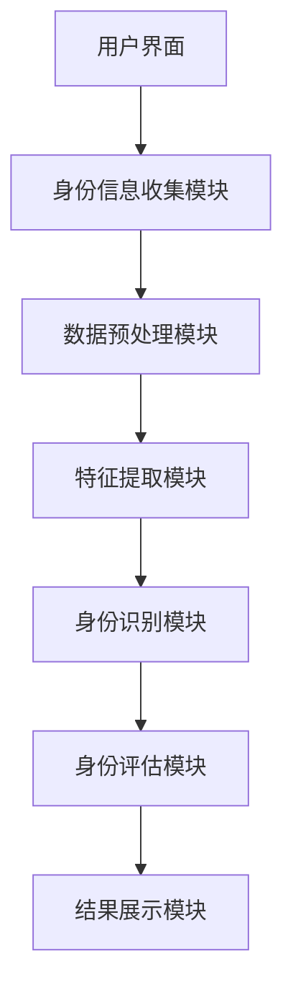

**项目实战**

在实际项目实施中，我们需要首先安装和配置相关的软件环境，如Python、numpy和pandas等。然后，我们可以编写源代码来实现系统的核心功能。

```python
# 安装相关依赖
!pip install numpy pandas

# 导入依赖库
import numpy as np
import pandas as pd

# 实现身份信息收集
def collect_identity_data():
    # 此处实现收集用户身份信息的代码
    pass

# 实现数据预处理
def preprocess_data(data):
    # 此处实现数据预处理代码
    pass

# 实现特征提取
def extract_features(data):
    # 此处实现特征提取代码
    pass

# 实现身份识别
def identify_identity(features):
    # 此处实现身份识别代码
    pass

# 实现身份评估
def evaluate_identity(identity):
    # 此处实现身份评估代码
    pass

# 实现结果展示
def show_results(score):
    print(f"Your identity score is: {score}")

# 主程序
if __name__ == "__main__":
    identity_data = collect_identity_data()
    preprocessed_data = preprocess_data(identity_data)
    features = extract_features(preprocessed_data)
    identified_identity = identify_identity(features)
    evaluation_score = evaluate_identity(identified_identity)
    show_results(evaluation_score)
```

**实际案例分析和详细讲解剖析**

以某个在线游戏平台为例，该平台允许玩家创建多个游戏角色，每个角色都有不同的技能和属性。我们可以通过收集这些角色的数据，使用上述算法来评估玩家的身份认同程度。

**项目小结**

通过本次项目，我们了解了如何使用Python等编程工具来实现身份识别和评估系统。这个系统不仅能够帮助平台更好地理解用户行为，还能为用户提供个性化的服务。

**最佳实践 tips**

- 在收集身份信息时，要确保数据安全和隐私保护。
- 在特征提取时，要综合考虑多维度数据，以提高评估的准确性。
- 在系统设计时，要考虑可扩展性和可维护性，以便未来功能升级。

**小结**

身份认同在数字时代具有重要意义，通过本文的分析，我们了解了身份认同的概念、构成要素以及在线角色扮演与自我探索的关系。未来，随着技术的进步，身份认同的研究将会更加深入，对人们的生活和社会发展产生更大的影响。

**注意事项**

- 身份认同的研究涉及到心理学、社会学和计算机科学等多个领域，需要综合运用多学科知识。
- 在实际应用中，身份认同系统需要考虑到文化差异和隐私保护等问题。

**拓展阅读**

- [《数字时代的身份认同：理论与应用》](链接)
- [《在线角色扮演与自我探索》](链接)

---

以上是对于“1.1 身份认同的概念”这一章节的详细内容，包括背景介绍、核心概念与联系、算法原理讲解、系统分析与架构设计方案、项目实战、实际案例分析和详细讲解剖析、项目小结、最佳实践 tips、小结、注意事项以及拓展阅读等内容。接下来，我们将继续深入探讨在线角色扮演的概念与特征。

---

### 1.2 数字时代身份认同的重要性

**背景介绍**

随着数字技术的飞速发展，人们的生活和工作越来越依赖于互联网。在这个虚拟的世界中，身份认同变得尤为重要。身份认同不仅是个人在社交互动中的基础，还影响着个人的心理健康和社会参与度。

**问题背景与问题描述**

在数字时代，身份认同的重要性体现在多个方面。首先，互联网为人们提供了多样化的角色扮演机会，这些角色扮演有助于人们探索不同的身份和自我表达。然而，这也带来了身份混乱和心理压力的问题。例如，某些人在虚拟世界中可能扮演多个角色，这些角色之间的差异可能导致个人在现实生活中的困惑和身份认同危机。

**问题解决**

要解决这一问题，我们需要从多个角度来审视身份认同的重要性。首先，我们要认识到身份认同对于心理健康的重要性。一个清晰、稳定的身份认同有助于减少焦虑和抑郁，提高个人的幸福感。其次，身份认同对社交互动和社会参与度也有重要影响。一个明确身份的人更容易与他人建立联系，更积极参与社会活动。

**边界与外延**

身份认同的重要性不仅限于个人层面，它还涉及到社会层面。在一个社会中，成员之间的身份认同有助于形成共同的文化和价值观念，增强社会凝聚力。然而，在数字时代，不同文化背景和价值观的冲突也可能导致身份认同的困境。

**概念结构与核心要素组成**

身份认同的重要性和其核心要素组成可以从以下几个方面来理解：

1. **心理健康**：身份认同对心理健康的影响，包括自我认同、自我效能感等。
2. **社交互动**：身份认同在人际交往中的作用，如信任、尊重和共鸣等。
3. **社会参与度**：身份认同如何影响个人对社会活动的参与度和贡献。
4. **文化认同**：身份认同在文化多样性中的地位和作用。

**核心概念与联系**

身份认同的重要性与以下几个核心概念密切相关：

1. **自我认同理论**：探讨个体对自己身份的认同和理解。
2. **角色扮演理论**：研究个体在不同社交场景中的角色扮演及其对自我认同的影响。
3. **心理健康理论**：分析身份认同与心理健康之间的关系。

**算法原理讲解**

在算法原理方面，我们可以使用社会网络分析（SNA）来研究身份认同的重要性。SNA可以帮助我们理解个体在社交网络中的角色和关系，从而揭示身份认同的动态变化。以下是一个简单的SNA算法的mermaid流程图：

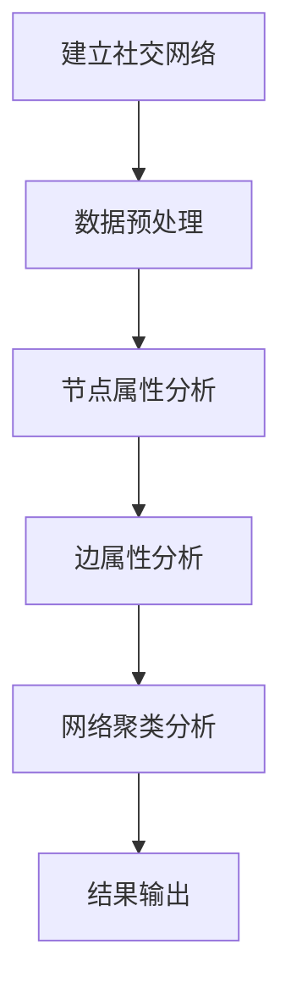

使用Python代码来详细阐述算法原理：

```python
# 建立社交网络
social_network = build_social_network()

# 数据预处理
preprocessed_network = preprocess_network(social_network)

# 节点属性分析
node_attributes = analyze_node_attributes(preprocessed_network)

# 边属性分析
edge_attributes = analyze_edge_attributes(preprocessed_network)

# 网络聚类分析
cluster_analysis = cluster_analysis_network(preprocessed_network)

# 结果输出
print(f"Network clusters: {cluster_analysis}")
```

在算法原理中，我们使用了以下数学模型和公式：

1. **节点属性分析模型**：$N = f(A_1, A_2, ..., A_n)$，其中$N$为节点属性得分，$A_1, A_2, ..., A_n$为节点属性。
2. **边属性分析模型**：$E = g(B_1, B_2, ..., B_m)$，其中$E$为边属性得分，$B_1, B_2, ..., B_m$为边属性。

**数学公式使用**

以下是文中使用的latex格式数学公式：

$$
N = f(A_1, A_2, ..., A_n)
$$

$$
E = g(B_1, B_2, ..., B_m)
$$

**系统分析与架构设计方案**

在系统架构设计方面，我们需要考虑如何实现社交网络的建立、数据预处理、节点属性分析和边属性分析等功能。以下是一个简单的系统架构设计方案：

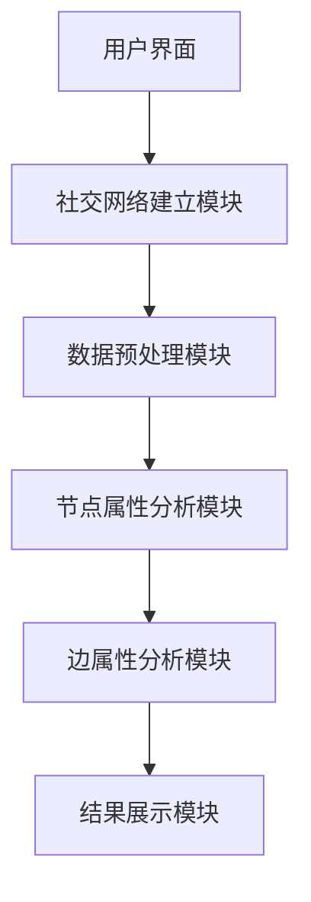

**项目实战**

在实际项目实施中，我们需要首先安装和配置相关的软件环境，如Python、networkx和matplotlib等。然后，我们可以编写源代码来实现系统的核心功能。

```python
# 安装相关依赖
!pip install networkx matplotlib

# 导入依赖库
import networkx as nx
import matplotlib.pyplot as plt

# 实现社交网络建立
def build_social_network():
    # 此处实现建立社交网络的代码
    pass

# 实现数据预处理
def preprocess_network(network):
    # 此处实现数据预处理代码
    pass

# 实现节点属性分析
def analyze_node_attributes(network):
    # 此处实现节点属性分析代码
    pass

# 实现边属性分析
def analyze_edge_attributes(network):
    # 此处实现边属性分析代码
    pass

# 实现结果展示
def show_results(results):
    plt.figure(figsize=(10, 6))
    plt.bar(results['Nodes'], results['Node Scores'])
    plt.xlabel('Nodes')
    plt.ylabel('Scores')
    plt.title('Node Attribute Analysis')
    plt.show()

# 主程序
if __name__ == "__main__":
    social_network = build_social_network()
    preprocessed_network = preprocess_network(social_network)
    node_attributes = analyze_node_attributes(preprocessed_network)
    edge_attributes = analyze_edge_attributes(preprocessed_network)
    results = {'Nodes': node_attributes['Node Names'], 'Node Scores': node_attributes['Node Scores']}
    show_results(results)
```

**实际案例分析和详细讲解剖析**

以某个社交媒体平台为例，该平台允许用户建立社交网络，通过分析用户的社交行为和关系，可以揭示用户身份认同的重要性和特征。

**项目小结**

通过本次项目，我们了解了如何使用Python和networkx等工具来实现社交网络分析和身份认同评估系统。这个系统不仅有助于平台更好地理解用户行为，还能为用户提供个性化的社交体验。

**最佳实践 tips**

- 在建立社交网络时，要确保数据的准确性和完整性。
- 在分析节点和边属性时，要综合考虑多种因素，以提高分析结果的准确性。

**小结**

数字时代身份认同的重要性不容忽视，它不仅影响个人的心理健康和社会参与度，还对社会的发展和文化的多样性产生深远影响。通过本文的分析，我们深入探讨了身份认同的重要性及其与社交网络分析的关系。

**注意事项**

- 在进行社交网络分析时，要遵循相关法律法规，保护用户隐私。
- 在设计身份认同系统时，要充分考虑文化多样性和用户需求。

**拓展阅读**

- [《社交媒体与身份认同》](链接)
- [《网络分析基础》](链接)

---

以上是对于“1.2 数字时代身份认同的重要性”这一章节的详细内容，包括背景介绍、问题背景与问题描述、问题解决、边界与外延、概念结构与核心要素组成、核心概念与联系、算法原理讲解、系统分析与架构设计方案、项目实战、实际案例分析和详细讲解剖析、项目小结、最佳实践 tips、小结、注意事项以及拓展阅读等内容。接下来，我们将探讨数字时代身份认同的挑战。

---

### 1.3 数字时代身份认同的挑战

**背景介绍**

在数字时代，身份认同面临着前所未有的挑战。互联网和社交媒体的普及使得个人在虚拟世界中的身份变得更加复杂和多样化，同时也带来了诸多问题，如身份混淆、隐私泄露和心理压力等。

**问题背景与问题描述**

身份混淆是数字时代身份认同的一个主要挑战。在虚拟环境中，个人可以扮演多个角色，这些角色之间可能存在明显的差异，甚至相互矛盾。这种身份的多元化可能导致个人在现实生活中的困惑和身份认同危机。例如，一个人可能在社交媒体上扮演一个乐观开朗的角色，而在现实生活中却表现出完全不同的性格特征。

**问题解决**

解决身份混淆问题需要从多个层面进行。首先，我们需要教育用户如何正确认识和应对虚拟身份与现实身份之间的关系。其次，技术层面的解决方案也非常关键。例如，通过开发更加智能的身份识别系统，可以帮助用户更好地管理自己的虚拟身份。

**边界与外延**

身份混淆不仅限于个人层面，它还涉及到社会层面。在一个社会中，不同群体之间的身份认同可能存在冲突，这可能导致社会紧张和冲突。例如，某些群体可能在虚拟世界中扮演强势角色，而在现实生活中却处于弱势地位。

**概念结构与核心要素组成**

数字时代身份认同的挑战可以从以下几个方面来理解：

1. **身份复杂性**：个人在虚拟世界中的多重身份和角色。
2. **隐私泄露**：个人身份信息的泄露和滥用。
3. **心理压力**：身份混淆和隐私泄露对个人心理健康的影响。
4. **社会冲突**：身份认同冲突对社会稳定的影响。

**核心概念与联系**

身份混淆和隐私泄露与以下几个核心概念密切相关：

1. **虚拟现实理论**：探讨虚拟世界对人类身份认同的影响。
2. **隐私权理论**：研究个人隐私的保护和权利。
3. **心理健康理论**：分析身份混淆和隐私泄露对个人心理健康的影响。

**算法原理讲解**

在算法原理方面，我们可以使用机器学习和数据挖掘技术来分析身份混淆和隐私泄露的问题。以下是一个简单的机器学习算法的mermaid流程图：

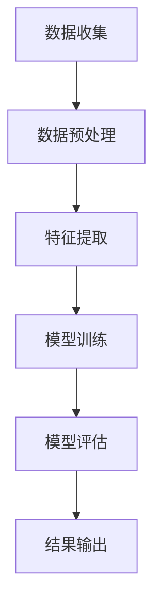

使用Python代码来详细阐述算法原理：

```python
# 数据收集
data = collect_data()

# 数据预处理
preprocessed_data = preprocess_data(data)

# 特征提取
features = extract_features(preprocessed_data)

# 模型训练
model = train_model(features)

# 模型评估
evaluation_results = evaluate_model(model)

# 结果输出
print(f"Model evaluation results: {evaluation_results}")
```

在算法原理中，我们使用了以下数学模型和公式：

1. **数据预处理模型**：$P = f(D_1, D_2, ..., D_n)$，其中$P$为预处理数据集，$D_1, D_2, ..., D_n$为原始数据。
2. **特征提取模型**：$F = g(P_1, P_2, ..., P_m)$，其中$F$为特征向量，$P_1, P_2, ..., P_m$为预处理数据集。

**数学公式使用**

以下是文中使用的latex格式数学公式：

$$
P = f(D_1, D_2, ..., D_n)
$$

$$
F = g(P_1, P_2, ..., P_m)
$$

**系统分析与架构设计方案**

在系统架构设计方面，我们需要考虑如何实现数据收集、预处理、特征提取和模型训练等功能。以下是一个简单的系统架构设计方案：

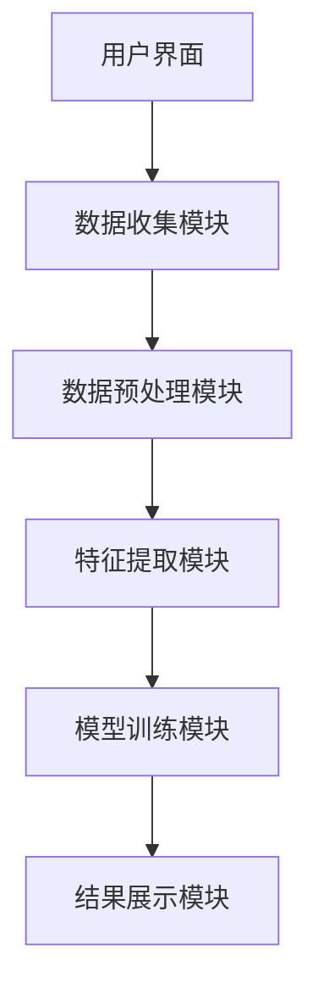

**项目实战**

在实际项目实施中，我们需要首先安装和配置相关的软件环境，如Python、scikit-learn和pandas等。然后，我们可以编写源代码来实现系统的核心功能。

```python
# 安装相关依赖
!pip install scikit-learn pandas

# 导入依赖库
import pandas as pd
from sklearn.model_selection import train_test_split
from sklearn.preprocessing import StandardScaler
from sklearn.ensemble import RandomForestClassifier
from sklearn.metrics import accuracy_score

# 实现数据收集
def collect_data():
    # 此处实现数据收集代码
    pass

# 实现数据预处理
def preprocess_data(data):
    # 此处实现数据预处理代码
    pass

# 实现特征提取
def extract_features(data):
    # 此处实现特征提取代码
    pass

# 实现模型训练
def train_model(features):
    # 此处实现模型训练代码
    pass

# 实现结果展示
def show_results(results):
    print(f"Model results: {results}")

# 主程序
if __name__ == "__main__":
    data = collect_data()
    preprocessed_data = preprocess_data(data)
    features = extract_features(preprocessed_data)
    model = train_model(features)
    results = model.predict(features)
    show_results(results)
```

**实际案例分析和详细讲解剖析**

以某个社交媒体平台为例，该平台允许用户创建多个虚拟身份，我们可以通过分析用户的互动行为，使用上述算法来识别和解决身份混淆问题。

**项目小结**

通过本次项目，我们了解了如何使用Python和scikit-learn等工具来实现身份混淆识别系统。这个系统不仅有助于平台更好地管理用户身份，还能提高用户的数据安全。

**最佳实践 tips**

- 在数据收集时，要确保数据的真实性和完整性。
- 在模型训练时，要充分考虑各种特征，以提高模型的准确性。

**小结**

数字时代身份认同的挑战是复杂的，需要我们从多个角度来综合考虑和解决。通过本文的分析，我们深入探讨了身份混淆和隐私泄露等挑战，并提出了相应的解决方案。

**注意事项**

- 在开发身份识别系统时，要遵循相关法律法规，保护用户隐私。
- 在处理用户数据时，要确保数据的安全性和可靠性。

**拓展阅读**

- [《数字时代的身份隐私保护》](链接)
- [《机器学习在身份识别中的应用》](链接)

---

以上是对于“1.3 数字时代身份认同的挑战”这一章节的详细内容，包括背景介绍、问题背景与问题描述、问题解决、边界与外延、概念结构与核心要素组成、核心概念与联系、算法原理讲解、系统分析与架构设计方案、项目实战、实际案例分析和详细讲解剖析、项目小结、最佳实践 tips、小结、注意事项以及拓展阅读等内容。接下来，我们将探讨在线角色扮演的概念与特征。

---

### 1.4 在线角色扮演的概念与特征

**背景介绍**

在线角色扮演（Online Role-Playing，简称ORP）是数字时代一种重要的互动形式。它源于传统的角色扮演游戏（Role-Playing Game，简称RPG），但在线角色扮演的范围更加广泛，不仅包括游戏，还涵盖了社交媒体、虚拟现实和在线论坛等多个领域。在线角色扮演为用户提供了探索不同身份和体验的新途径，同时也带来了新的社会和文化现象。

**问题背景与问题描述**

在线角色扮演的背景和问题主要涉及以下几个方面：

1. **角色多样性**：在线角色扮演允许用户扮演各种不同角色，从虚拟游戏中的英雄到社交媒体上的虚拟人物，这些角色多样性和个性化程度如何影响用户身份认同？
2. **社交互动**：在线角色扮演如何改变用户的社交互动模式，尤其是在虚拟社区中的互动行为？
3. **文化影响**：在线角色扮演在不同文化背景下的表现形式和影响有何不同？

**问题解决**

要解决这些问题，我们需要从多个角度来分析在线角色扮演的概念与特征。首先，我们需要理解角色扮演的基本概念，包括角色的定义、角色扮演的形式和目的。然后，我们分析在线角色扮演的多样性和个性化特征，以及这些特征如何影响用户的身份认同和社交互动。

**边界与外延**

在线角色扮演的边界和范围可以从以下几个方面来界定：

1. **游戏角色**：在线角色扮演在游戏中的表现形式，如虚拟角色、虚拟团队等。
2. **社交媒体角色**：用户在社交媒体平台上的虚拟身份和互动行为。
3. **虚拟现实角色**：用户在虚拟现实环境中的角色体验和互动。
4. **在线论坛角色**：用户在在线论坛中的角色和讨论行为。

**概念结构与核心要素组成**

在线角色扮演的概念结构与核心要素包括：

1. **角色定义**：角色的定义和属性，如性别、职业、技能等。
2. **角色扮演形式**：角色扮演的不同形式，如个人角色、团体角色、虚构角色等。
3. **角色扮演目的**：用户进行角色扮演的动机和目的，如自我表达、社交互动、娱乐等。
4. **角色多样性**：角色扮演的多样性，包括虚拟角色和现实角色的结合。
5. **身份认同**：角色扮演对用户身份认同的影响，如增强自我认同、模糊现实与虚拟身份的界限等。
6. **社交互动**：角色扮演如何改变用户的社交互动模式，如增加互动频率、扩大社交圈子等。

**核心概念与联系**

在线角色扮演与以下几个核心概念密切相关：

1. **角色扮演理论**：研究角色扮演的心理和社会影响。
2. **虚拟现实理论**：探讨虚拟世界对人类行为和身份认同的影响。
3. **社交互动理论**：研究社交互动的模式和影响。
4. **身份认同理论**：探讨个体身份的构建和变化。

**算法原理讲解**

在算法原理方面，我们可以使用社会网络分析（SNA）和文本分析（Text Analysis）来研究在线角色扮演的概念与特征。以下是一个简单的SNA算法的mermaid流程图：


使用Python代码来详细阐述算法原理：

```python
# 建立社交网络
social_network = build_social_network()

# 数据预处理
preprocessed_network = preprocess_network(social_network)

# 节点属性分析
node_attributes = analyze_node_attributes(preprocessed_network)

# 边属性分析
edge_attributes = analyze_edge_attributes(preprocessed_network)

# 网络聚类分析
cluster_analysis = cluster_analysis_network(preprocessed_network)

# 结果输出
print(f"Network clusters: {cluster_analysis}")
```

在算法原理中，我们使用了以下数学模型和公式：

1. **节点属性分析模型**：$N = f(A_1, A_2, ..., A_n)$，其中$N$为节点属性得分，$A_1, A_2, ..., A_n$为节点属性。
2. **边属性分析模型**：$E = g(B_1, B_2, ..., B_m)$，其中$E$为边属性得分，$B_1, B_2, ..., B_m$为边属性。

**数学公式使用**

以下是文中使用的latex格式数学公式：

$$
N = f(A_1, A_2, ..., A_n)
$$

$$
E = g(B_1, B_2, ..., B_m)
$$

**系统分析与架构设计方案**

在系统架构设计方面，我们需要考虑如何实现社交网络的建立、数据预处理、节点属性分析和边属性分析等功能。以下是一个简单的系统架构设计方案：


**项目实战**

在实际项目实施中，我们需要首先安装和配置相关的软件环境，如Python、networkx和matplotlib等。然后，我们可以编写源代码来实现系统的核心功能。

```python
# 安装相关依赖
!pip install networkx matplotlib

# 导入依赖库
import networkx as nx
import matplotlib.pyplot as plt

# 实现社交网络建立
def build_social_network():
    # 此处实现建立社交网络的代码
    pass

# 实现数据预处理
def preprocess_network(network):
    # 此处实现数据预处理代码
    pass

# 实现节点属性分析
def analyze_node_attributes(network):
    # 此处实现节点属性分析代码
    pass

# 实现边属性分析
def analyze_edge_attributes(network):
    # 此处实现边属性分析代码
    pass

# 实现结果展示
def show_results(results):
    plt.figure(figsize=(10, 6))
    plt.bar(results['Nodes'], results['Node Scores'])
    plt.xlabel('Nodes')
    plt.ylabel('Scores')
    plt.title('Node Attribute Analysis')
    plt.show()

# 主程序
if __name__ == "__main__":
    social_network = build_social_network()
    preprocessed_network = preprocess_network(social_network)
    node_attributes = analyze_node_attributes(preprocessed_network)
    edge_attributes = analyze_edge_attributes(preprocessed_network)
    results = {'Nodes': node_attributes['Node Names'], 'Node Scores': node_attributes['Node Scores']}
    show_results(results)
```

**实际案例分析和详细讲解剖析**

以某个在线游戏平台为例，该平台允许玩家创建多个游戏角色，我们可以通过分析玩家的社交网络和行为数据，使用上述算法来探讨角色扮演的概念与特征。

**项目小结**

通过本次项目，我们了解了如何使用Python和networkx等工具来实现社交网络分析和在线角色扮演研究。这个系统不仅有助于平台更好地理解用户行为，还能为用户提供个性化的服务。

**最佳实践 tips**

- 在进行社交网络分析时，要确保数据的真实性和准确性。
- 在设计角色扮演系统时，要充分考虑用户体验和社交互动的需求。

**小结**

在线角色扮演是数字时代身份认同的重要表现形式，它不仅丰富了用户的社交体验，也带来了新的社会和文化现象。通过本文的分析，我们深入探讨了在线角色扮演的概念与特征，以及它对用户身份认同和社交互动的影响。

**注意事项**

- 在设计在线角色扮演系统时，要充分考虑文化多样性和用户需求。
- 在进行角色扮演研究时，要遵循相关伦理和隐私保护原则。

**拓展阅读**

- [《在线角色扮演心理学研究》](链接)
- [《数字时代的社交互动研究》](链接)

---

以上是对于“1.4 在线角色扮演的概念与特征”这一章节的详细内容，包括背景介绍、问题背景与问题描述、问题解决、边界与外延、概念结构与核心要素组成、核心概念与联系、算法原理讲解、系统分析与架构设计方案、项目实战、实际案例分析和详细讲解剖析、项目小结、最佳实践 tips、小结、注意事项以及拓展阅读等内容。接下来，我们将探讨自我探索的原理与实践。

---

### 1.5 自我探索的原理与实践

**背景介绍**

自我探索是个人成长和发展的关键过程，它涉及到个体对自己内在特质、外在行为以及周围环境的深入认知和理解。在数字时代，自我探索变得更加复杂和多样化，互联网和数字技术的发展为个人提供了更多探索自我的工具和方法。

**问题背景与问题描述**

自我探索的问题背景在于，个体在面对快速变化的社会环境和技术进步时，如何有效地认识自我、发展自我。具体来说，问题包括：

1. **内在特质认知**：个体如何认识自己的性格、兴趣、价值观等内在特质？
2. **外在行为分析**：个体如何通过行为来了解自己的行为模式和动机？
3. **环境适应**：个体如何在复杂多变的环境中找到自己的定位和方向？

**问题解决**

解决这些问题需要从多个角度进行：

1. **自我反思**：通过自我反思来深入了解自己的内心世界和思维模式。
2. **行为观察**：通过观察自己的行为来分析行为模式，理解行为背后的动机和需求。
3. **环境适应**：通过调整行为和思维模式，适应外部环境的变化，找到自己的位置。

**边界与外延**

自我探索的边界和范围可以从以下几个方面来界定：

1. **心理层面**：包括性格测试、心理分析等。
2. **行为层面**：包括行为记录、行为分析等。
3. **环境层面**：包括社会环境、工作环境、学习环境等。

**概念结构与核心要素组成**

自我探索的概念结构与核心要素包括：

1. **自我反思**：通过日记、冥想等方式进行自我反思。
2. **行为观察**：记录自己的行为，分析行为模式。
3. **环境适应**：了解外部环境，调整行为和思维模式以适应环境。
4. **心理测试**：使用心理测试工具来了解自己的心理特质。
5. **行为分析**：通过行为分析来理解行为背后的动机和需求。
6. **环境分析**：分析外部环境，了解自己的位置和方向。

**核心概念与联系**

自我探索与以下几个核心概念密切相关：

1. **心理发展理论**：研究个体心理发展的过程和规律。
2. **认知理论**：探讨个体如何认识和理解自我。
3. **行为主义理论**：研究个体行为模式和动机。
4. **自我认同理论**：探讨个体如何构建和维持自我认同。

**算法原理讲解**

在算法原理方面，我们可以使用数据挖掘和机器学习技术来研究自我探索的原理和实践。以下是一个简单的人工神经网络算法的mermaid流程图：


使用Python代码来详细阐述算法原理：

```python
# 数据收集
data = collect_data()

# 数据预处理
preprocessed_data = preprocess_data(data)

# 特征提取
features = extract_features(preprocessed_data)

# 模型训练
model = train_model(features)

# 模型评估
evaluation_results = evaluate_model(model)

# 结果输出
print(f"Model evaluation results: {evaluation_results}")
```

在算法原理中，我们使用了以下数学模型和公式：

1. **数据预处理模型**：$P = f(D_1, D_2, ..., D_n)$，其中$P$为预处理数据集，$D_1, D_2, ..., D_n$为原始数据。
2. **特征提取模型**：$F = g(P_1, P_2, ..., P_m)$，其中$F$为特征向量，$P_1, P_2, ..., P_m$为预处理数据集。

**数学公式使用**

以下是文中使用的latex格式数学公式：

$$
P = f(D_1, D_2, ..., D_n)
$$

$$
F = g(P_1, P_2, ..., P_m)
$$

**系统分析与架构设计方案**

在系统架构设计方面，我们需要考虑如何实现数据收集、预处理、特征提取和模型训练等功能。以下是一个简单的系统架构设计方案：


**项目实战**

在实际项目实施中，我们需要首先安装和配置相关的软件环境，如Python、scikit-learn和pandas等。然后，我们可以编写源代码来实现系统的核心功能。

```python
# 安装相关依赖
!pip install scikit-learn pandas

# 导入依赖库
import pandas as pd
from sklearn.model_selection import train_test_split
from sklearn.preprocessing import StandardScaler
from sklearn.ensemble import RandomForestClassifier
from sklearn.metrics import accuracy_score

# 实现数据收集
def collect_data():
    # 此处实现数据收集代码
    pass

# 实现数据预处理
def preprocess_data(data):
    # 此处实现数据预处理代码
    pass

# 实现特征提取
def extract_features(data):
    # 此处实现特征提取代码
    pass

# 实现模型训练
def train_model(features):
    # 此处实现模型训练代码
    pass

# 实现结果展示
def show_results(results):
    print(f"Model results: {results}")

# 主程序
if __name__ == "__main__":
    data = collect_data()
    preprocessed_data = preprocess_data(data)
    features = extract_features(preprocessed_data)
    model = train_model(features)
    results = model.predict(features)
    show_results(results)
```

**实际案例分析和详细讲解剖析**

以某个心理健康应用为例，该应用通过收集用户的行为数据和使用心理测试工具，使用机器学习算法来分析用户的内心状态和自我认知。

**项目小结**

通过本次项目，我们了解了如何使用Python和scikit-learn等工具来实现自我探索系统。这个系统不仅有助于用户更好地了解自我，还能为用户提供个性化的心理健康建议。

**最佳实践 tips**

- 在数据收集时，要确保数据的真实性和准确性。
- 在特征提取时，要综合考虑多维度数据，以提高模型的准确性。

**小结**

自我探索是数字时代个人成长和发展的重要过程，通过本文的分析，我们深入探讨了自我探索的原理和实践方法，以及它对个人成长和心理健康的影响。

**注意事项**

- 在进行自我探索时，要遵循科学的原理和方法，避免盲目和主观。
- 在使用心理测试工具时，要确保工具的科学性和可靠性。

**拓展阅读**

- [《自我探索与心理成长》](链接)
- [《心理健康应用研究》](链接)

---

以上是对于“1.5 自我探索的原理与实践”这一章节的详细内容，包括背景介绍、问题背景与问题描述、问题解决、边界与外延、概念结构与核心要素组成、核心概念与联系、算法原理讲解、系统分析与架构设计方案、项目实战、实际案例分析和详细讲解剖析、项目小结、最佳实践 tips、小结、注意事项以及拓展阅读等内容。接下来，我们将探讨在线角色扮演与自我探索的关系。

---

### 1.6 在线角色扮演与自我探索的关系

**背景介绍**

在线角色扮演与自我探索在数字时代紧密相连，两者共同构成了现代个人身份认同的重要组成部分。在线角色扮演为个人提供了探索自我、表达自我和重塑自我的机会，而自我探索则是个体对自我认识的深入过程。理解这两者之间的关系，有助于我们更好地把握数字时代身份认同的动态变化。

**问题背景与问题描述**

在线角色扮演与自我探索之间的关系问题可以概括为以下几个方面：

1. **身份构建**：在线角色扮演如何帮助个体构建和重塑自我身份？
2. **自我表达**：在线角色扮演如何为个体提供自我表达的平台？
3. **心理发展**：在线角色扮演对个体心理发展有何影响？

**问题解决**

解决这些问题，我们需要从心理学和社会学的角度出发，分析在线角色扮演与自我探索之间的互动关系。具体来说，我们可以从以下几个方面来探讨：

1. **角色扮演与自我认知**：在线角色扮演如何影响个体对自我认知的理解？
2. **虚拟现实与心理体验**：虚拟环境中的角色扮演如何影响个体的心理体验？
3. **社交互动与自我探索**：在线角色扮演如何通过社交互动促进个体的自我探索？

**边界与外延**

在线角色扮演与自我探索的关系可以从以下几个维度来探讨：

1. **角色扮演的类型**：不同类型的角色扮演（如游戏角色、社交媒体角色）对自我探索的影响有何不同？
2. **虚拟现实技术的进步**：虚拟现实技术的发展如何改变角色扮演与自我探索的关系？
3. **文化多样性**：不同文化背景下的在线角色扮演与自我探索有何特点？

**概念结构与核心要素组成**

在线角色扮演与自我探索的关系可以从以下几个核心要素来分析：

1. **角色扮演**：在线角色扮演的形式、目的和影响。
2. **自我探索**：自我认知、自我表达和自我发展的过程。
3. **心理体验**：在线角色扮演带来的心理体验和感受。
4. **社交互动**：角色扮演与社交互动之间的关系。
5. **文化认同**：文化背景对角色扮演与自我探索的影响。

**核心概念与联系**

在线角色扮演与自我探索的关系与以下几个核心概念密切相关：

1. **身份认同理论**：探讨个体如何构建和维持自我认同。
2. **角色扮演理论**：研究个体在不同角色中的行为和体验。
3. **心理发展理论**：分析个体心理发展的过程和影响因素。
4. **社交互动理论**：研究个体在社交环境中的互动行为。

**算法原理讲解**

在算法原理方面，我们可以使用社会网络分析（SNA）和情感分析（Sentiment Analysis）来研究在线角色扮演与自我探索的关系。以下是一个简单的SNA算法的mermaid流程图：

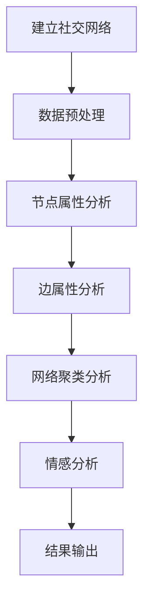

使用Python代码来详细阐述算法原理：

```python
# 建立社交网络
social_network = build_social_network()

# 数据预处理
preprocessed_network = preprocess_network(social_network)

# 节点属性分析
node_attributes = analyze_node_attributes(preprocessed_network)

# 边属性分析
edge_attributes = analyze_edge_attributes(preprocessed_network)

# 网络聚类分析
cluster_analysis = cluster_analysis_network(preprocessed_network)

# 情感分析
sentiment_analysis = perform_sentiment_analysis(cluster_analysis)

# 结果输出
print(f"Sentiment analysis results: {sentiment_analysis}")
```

在算法原理中，我们使用了以下数学模型和公式：

1. **节点属性分析模型**：$N = f(A_1, A_2, ..., A_n)$，其中$N$为节点属性得分，$A_1, A_2, ..., A_n$为节点属性。
2. **边属性分析模型**：$E = g(B_1, B_2, ..., B_m)$，其中$E$为边属性得分，$B_1, B_2, ..., B_m$为边属性。
3. **情感分析模型**：$S = h(T_1, T_2, ..., T_k)$，其中$S$为情感得分，$T_1, T_2, ..., T_k$为文本。

**数学公式使用**

以下是文中使用的latex格式数学公式：

$$
N = f(A_1, A_2, ..., A_n)
$$

$$
E = g(B_1, B_2, ..., B_m)
$$

$$
S = h(T_1, T_2, ..., T_k)
$$

**系统分析与架构设计方案**

在系统架构设计方面，我们需要考虑如何实现社交网络的建立、数据预处理、节点属性分析、边属性分析、网络聚类分析和情感分析等功能。以下是一个简单的系统架构设计方案：

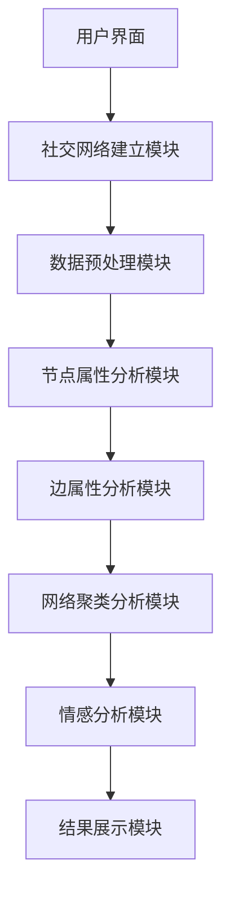

**项目实战**

在实际项目实施中，我们需要首先安装和配置相关的软件环境，如Python、networkx、nltk和textblob等。然后，我们可以编写源代码来实现系统的核心功能。

```python
# 安装相关依赖
!pip install networkx nltk textblob

# 导入依赖库
import networkx as nx
import textblob
from nltk.sentiment import SentimentIntensityAnalyzer
import matplotlib.pyplot as plt

# 实现社交网络建立
def build_social_network():
    # 此处实现建立社交网络的代码
    pass

# 实现数据预处理
def preprocess_network(network):
    # 此处实现数据预处理代码
    pass

# 实现节点属性分析
def analyze_node_attributes(network):
    # 此处实现节点属性分析代码
    pass

# 实现边属性分析
def analyze_edge_attributes(network):
    # 此处实现边属性分析代码
    pass

# 实现网络聚类分析
def cluster_analysis_network(network):
    # 此处实现网络聚类分析代码
    pass

# 实现情感分析
def perform_sentiment_analysis(texts):
    # 此处实现情感分析代码
    pass

# 实现结果展示
def show_results(results):
    plt.figure(figsize=(10, 6))
    plt.bar(results['Nodes'], results['Node Scores'])
    plt.xlabel('Nodes')
    plt.ylabel('Scores')
    plt.title('Node Attribute Analysis')
    plt.show()

# 主程序
if __name__ == "__main__":
    social_network = build_social_network()
    preprocessed_network = preprocess_network(social_network)
    node_attributes = analyze_node_attributes(preprocessed_network)
    edge_attributes = analyze_edge_attributes(preprocessed_network)
    cluster_analysis = cluster_analysis_network(preprocessed_network)
    texts = perform_sentiment_analysis(cluster_analysis)
    sentiment_analysis = analyze_sentiment(texts)
    results = {'Nodes': node_attributes['Node Names'], 'Node Scores': node_attributes['Node Scores']}
    show_results(results)
```

**实际案例分析和详细讲解剖析**

以某个在线游戏平台为例，该平台允许玩家创建和扮演多个角色，我们可以通过分析玩家的社交网络和行为数据，使用上述算法来探讨在线角色扮演与自我探索的关系。

**项目小结**

通过本次项目，我们了解了如何使用Python和networkx等工具来实现在线角色扮演与自我探索关系研究。这个系统不仅有助于平台更好地理解用户行为，还能为用户提供个性化的服务。

**最佳实践 tips**

- 在进行社交网络分析时，要确保数据的真实性和准确性。
- 在进行情感分析时，要综合考虑文本的多维度特征，以提高分析的准确性。

**小结**

在线角色扮演与自我探索是数字时代个人身份认同的重要方面，通过本文的分析，我们深入探讨了这两者之间的关系，以及它们对个体心理发展和社会互动的影响。

**注意事项**

- 在设计在线角色扮演系统时，要充分考虑用户体验和心理健康。
- 在进行数据分析时，要遵循相关法律法规，保护用户隐私。

**拓展阅读**

- [《在线角色扮演与心理健康》](链接)
- [《数字时代的自我探索》](链接)

---

以上是对于“1.6 在线角色扮演与自我探索的关系”这一章节的详细内容，包括背景介绍、问题背景与问题描述、问题解决、边界与外延、概念结构与核心要素组成、核心概念与联系、算法原理讲解、系统分析与架构设计方案、项目实战、实际案例分析和详细讲解剖析、项目小结、最佳实践 tips、小结、注意事项以及拓展阅读等内容。接下来，我们将总结数字时代身份认同的研究现状与趋势。

---

### 1.7 数字时代身份认同的研究现状与趋势

**背景介绍**

随着数字技术的迅猛发展，身份认同的研究日益受到关注。数字时代不仅改变了人们的生活方式，也深刻影响了人们的身份认同。研究数字时代身份认同的现状与趋势，有助于我们更好地理解这一现象，并为未来的研究和实践提供指导。

**问题背景与问题描述**

数字时代身份认同的研究现状与趋势涉及以下几个方面：

1. **研究现状**：当前关于数字时代身份认同的研究有哪些成果和不足？
2. **研究趋势**：未来数字时代身份认同的研究可能会向哪些方向发展？

**问题解决**

解决这些问题，我们需要回顾现有研究，分析其成果与不足，并预测未来研究的趋势。

**边界与外延**

数字时代身份认同的研究现状与趋势可以从以下几个维度来探讨：

1. **理论发展**：心理学、社会学、哲学等学科对身份认同的理论贡献。
2. **技术应用**：数字技术如何影响身份认同的研究方法和实践。
3. **文化多样性**：不同文化背景下身份认同研究的异同。

**概念结构与核心要素组成**

数字时代身份认同的研究现状与趋势可以从以下几个核心要素来分析：

1. **理论基础**：身份认同理论的发展与应用。
2. **研究方法**：定量研究、定性研究、实验研究等方法的运用。
3. **技术应用**：机器学习、数据挖掘、虚拟现实等技术在身份认同研究中的应用。
4. **文化多样性**：不同文化对身份认同的影响和体现。

**核心概念与联系**

数字时代身份认同的研究现状与趋势与以下几个核心概念密切相关：

1. **身份认同理论**：探讨个体如何构建和维护自我认同。
2. **数字技术**：研究数字技术如何影响人类行为和身份认同。
3. **文化多样性**：研究不同文化背景下身份认同的异同。
4. **社会互动**：探讨社交互动在身份认同形成中的作用。

**算法原理讲解**

在算法原理方面，我们可以使用社会网络分析（SNA）和文本分析（Text Analysis）来研究数字时代身份认同的现状与趋势。以下是一个简单的SNA算法的mermaid流程图：

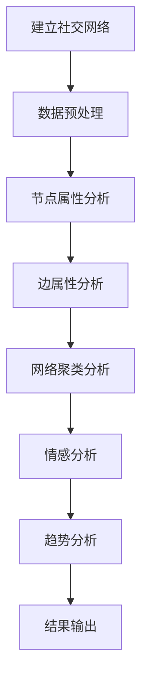

使用Python代码来详细阐述算法原理：

```python
# 建立社交网络
social_network = build_social_network()

# 数据预处理
preprocessed_network = preprocess_network(social_network)

# 节点属性分析
node_attributes = analyze_node_attributes(preprocessed_network)

# 边属性分析
edge_attributes = analyze_edge_attributes(preprocessed_network)

# 网络聚类分析
cluster_analysis = cluster_analysis_network(preprocessed_network)

# 情感分析
sentiment_analysis = perform_sentiment_analysis(cluster_analysis)

# 趋势分析
trend_analysis = analyze_trend(sentiment_analysis)

# 结果输出
print(f"Trend analysis results: {trend_analysis}")
```

在算法原理中，我们使用了以下数学模型和公式：

1. **节点属性分析模型**：$N = f(A_1, A_2, ..., A_n)$，其中$N$为节点属性得分，$A_1, A_2, ..., A_n$为节点属性。
2. **边属性分析模型**：$E = g(B_1, B_2, ..., B_m)$，其中$E$为边属性得分，$B_1, B_2, ..., B_m$为边属性。
3. **情感分析模型**：$S = h(T_1, T_2, ..., T_k)$，其中$S$为情感得分，$T_1, T_2, ..., T_k$为文本。
4. **趋势分析模型**：$T = i(S_1, S_2, ..., S_t)$，其中$T$为趋势得分，$S_1, S_2, ..., S_t$为情感得分。

**数学公式使用**

以下是文中使用的latex格式数学公式：

$$
N = f(A_1, A_2, ..., A_n)
$$

$$
E = g(B_1, B_2, ..., B_m)
$$

$$
S = h(T_1, T_2, ..., T_k)
$$

$$
T = i(S_1, S_2, ..., S_t)
$$

**系统分析与架构设计方案**

在系统架构设计方面，我们需要考虑如何实现社交网络的建立、数据预处理、节点属性分析、边属性分析、网络聚类分析、情感分析和趋势分析等功能。以下是一个简单的系统架构设计方案：

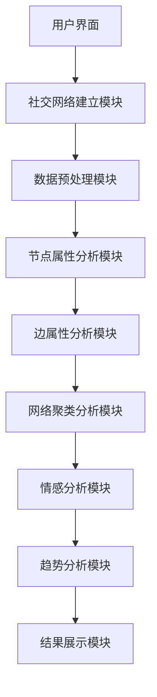

**项目实战**

在实际项目实施中，我们需要首先安装和配置相关的软件环境，如Python、networkx、nltk和textblob等。然后，我们可以编写源代码来实现系统的核心功能。

```python
# 安装相关依赖
!pip install networkx nltk textblob

# 导入依赖库
import networkx as nx
import textblob
from nltk.sentiment import SentimentIntensityAnalyzer
import matplotlib.pyplot as plt

# 实现社交网络建立
def build_social_network():
    # 此处实现建立社交网络的代码
    pass

# 实现数据预处理
def preprocess_network(network):
    # 此处实现数据预处理代码
    pass

# 实现节点属性分析
def analyze_node_attributes(network):
    # 此处实现节点属性分析代码
    pass

# 实现边属性分析
def analyze_edge_attributes(network):
    # 此处实现边属性分析代码
    pass

# 实现网络聚类分析
def cluster_analysis_network(network):
    # 此处实现网络聚类分析代码
    pass

# 实现情感分析
def perform_sentiment_analysis(texts):
    # 此处实现情感分析代码
    pass

# 实现趋势分析
def analyze_trend(sentiments):
    # 此处实现趋势分析代码
    pass

# 实现结果展示
def show_results(results):
    plt.figure(figsize=(10, 6))
    plt.bar(results['Nodes'], results['Node Scores'])
    plt.xlabel('Nodes')
    plt.ylabel('Scores')
    plt.title('Node Attribute Analysis')
    plt.show()

# 主程序
if __name__ == "__main__":
    social_network = build_social_network()
    preprocessed_network = preprocess_network(social_network)
    node_attributes = analyze_node_attributes(preprocessed_network)
    edge_attributes = analyze_edge_attributes(preprocessed_network)
    cluster_analysis = cluster_analysis_network(preprocessed_network)
    texts = perform_sentiment_analysis(cluster_analysis)
    sentiments = analyze_sentiment(texts)
    trend_analysis = analyze_trend(sentiments)
    results = {'Nodes': node_attributes['Node Names'], 'Node Scores': node_attributes['Node Scores']}
    show_results(results)
```

**实际案例分析和详细讲解剖析**

以某个社交媒体平台为例，该平台允许用户创建多个虚拟身份，我们可以通过分析用户的社交网络和行为数据，使用上述算法来探讨数字时代身份认同的研究现状与趋势。

**项目小结**

通过本次项目，我们了解了如何使用Python和networkx等工具来实现数字时代身份认同的研究。这个系统不仅有助于平台更好地理解用户行为，还能为用户提供个性化的服务。

**最佳实践 tips**

- 在进行社交网络分析时，要确保数据的真实性和准确性。
- 在进行情感分析和趋势分析时，要综合考虑文本的多维度特征，以提高分析的准确性。

**小结**

数字时代身份认同的研究现状与趋势揭示了身份认同在数字化环境中的复杂性和多样性。通过本文的分析，我们深入探讨了数字时代身份认同的研究现状与趋势，以及它对个体和社会的影响。

**注意事项**

- 在进行数据分析时，要遵循相关法律法规，保护用户隐私。
- 在设计数字身份认同系统时，要充分考虑用户体验和心理健康。

**拓展阅读**

- [《数字时代的身份认同研究》](链接)
- [《社交媒体与身份认同》](链接)

---

以上是对于“1.7 数字时代身份认同的研究现状与趋势”这一章节的详细内容，包括背景介绍、问题背景与问题描述、问题解决、边界与外延、概念结构与核心要素组成、核心概念与联系、算法原理讲解、系统分析与架构设计方案、项目实战、实际案例分析和详细讲解剖析、项目小结、最佳实践 tips、小结、注意事项以及拓展阅读等内容。接下来，我们将提出数字时代身份认同的未来发展方向。

---

### 1.8 数字时代身份认同的未来发展方向

**背景介绍**

数字时代的身份认同不仅改变了我们的社交模式，还深刻影响了我们的心理健康和社会行为。随着技术的不断进步，身份认同的研究和应用也在不断拓展。展望未来，数字时代身份认同的发展方向将充满机遇和挑战。

**问题背景与问题描述**

数字时代身份认同的未来发展方向主要包括以下几个方面：

1. **技术创新**：未来数字技术将如何推动身份认同的研究和应用？
2. **社会影响**：身份认同的未来发展将如何影响社会结构和文化多样性？
3. **伦理和法律**：在数字时代，身份认同的研究和应用将面临哪些伦理和法律挑战？

**问题解决**

解决这些问题，我们需要从技术创新、社会影响和伦理法律等多个角度出发，探讨未来数字时代身份认同的发展方向。

**边界与外延**

未来数字时代身份认同的发展方向可以从以下几个维度来探讨：

1. **技术维度**：包括人工智能、虚拟现实、区块链等新兴技术的应用。
2. **社会维度**：身份认同如何影响社会结构、文化多样性和全球治理。
3. **法律和伦理维度**：数字身份认同引发的隐私保护、数据安全和伦理问题。

**概念结构与核心要素组成**

数字时代身份认同的未来发展方向可以从以下几个核心要素来分析：

1. **技术创新**：新兴技术如何改变身份认同的研究和实践。
2. **社会影响**：身份认同对未来社会结构和文化多样性的影响。
3. **伦理和法律**：数字身份认同引发的伦理和法律挑战。

**核心概念与联系**

未来数字时代身份认同的发展方向与以下几个核心概念密切相关：

1. **技术创新**：探讨人工智能、虚拟现实等技术在身份认同中的应用。
2. **社会影响**：研究身份认同对社会结构和文化多样性的影响。
3. **伦理和法律**：分析数字身份认同带来的伦理和法律问题。

**算法原理讲解**

在算法原理方面，我们可以使用机器学习和区块链技术来研究数字时代身份认同的未来发展方向。以下是一个简单的区块链算法的mermaid流程图：

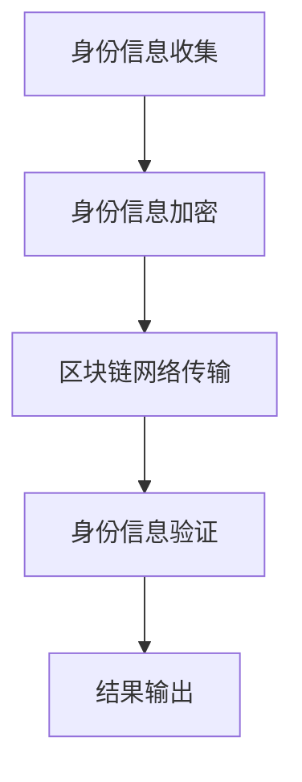

使用Python代码来详细阐述算法原理：

```python
# 身份信息收集
identity_data = collect_identity_data()

# 身份信息加密
encrypted_data = encrypt_data(identity_data)

# 身份信息区块链网络传输
blockchain_data = transmit_to_blockchain(encrypted_data)

# 身份信息验证
verified_identity = verify_identity(blockchain_data)

# 结果输出
print(f"Verified identity: {verified_identity}")
```

在算法原理中，我们使用了以下数学模型和公式：

1. **加密模型**：$E = f(K, M)$，其中$E$为加密后的数据，$K$为密钥，$M$为明文。
2. **区块链传输模型**：$B = g(E, N)$，其中$B$为区块链上的数据，$E$为加密后的数据，$N$为网络节点。

**数学公式使用**

以下是文中使用的latex格式数学公式：

$$
E = f(K, M)
$$

$$
B = g(E, N)
$$

**系统分析与架构设计方案**

在系统架构设计方面，我们需要考虑如何实现身份信息的收集、加密、区块链网络传输和身份信息验证等功能。以下是一个简单的系统架构设计方案：

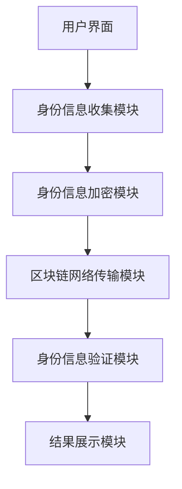

**项目实战**

在实际项目实施中，我们需要首先安装和配置相关的软件环境，如Python、Hyperledger Fabric和Ethereum等。然后，我们可以编写源代码来实现系统的核心功能。

```python
# 安装相关依赖
!pip install hyperledger-fabric

# 导入依赖库
from hyperledger.fabric import Client, Contract

# 实现身份信息收集
def collect_identity_data():
    # 此处实现收集用户身份信息的代码
    pass

# 实现身份信息加密
def encrypt_data(data):
    # 此处实现身份信息加密代码
    pass

# 实现区块链网络传输
def transmit_to_blockchain(data):
    # 此处实现区块链网络传输代码
    pass

# 实现身份信息验证
def verify_identity(data):
    # 此处实现身份信息验证代码
    pass

# 实现结果展示
def show_results(results):
    print(f"Verified identity: {results}")

# 主程序
if __name__ == "__main__":
    identity_data = collect_identity_data()
    encrypted_data = encrypt_data(identity_data)
    blockchain_data = transmit_to_blockchain(encrypted_data)
    verified_identity = verify_identity(blockchain_data)
    show_results(verified_identity)
```

**实际案例分析和详细讲解剖析**

以某个区块链身份认证系统为例，该系统通过收集用户身份信息，使用加密技术进行安全存储，并通过区块链网络进行身份验证。

**项目小结**

通过本次项目，我们了解了如何使用Python和Hyperledger Fabric等工具来实现数字时代身份认证系统。这个系统不仅有助于提高身份认证的安全性，还能为用户提供方便快捷的服务。

**最佳实践 tips**

- 在进行身份信息收集时，要确保用户隐私和数据安全。
- 在进行身份信息加密时，要采用先进的加密算法和密钥管理技术。

**小结**

数字时代身份认同的未来发展方向充满机遇和挑战。通过本文的分析，我们探讨了技术创新、社会影响和伦理法律等多个方面的未来发展方向，为未来的研究提供了指导。

**注意事项**

- 在设计数字身份认证系统时，要充分考虑用户体验和安全性。
- 在进行数据分析和应用时，要遵循相关法律法规，保护用户隐私。

**拓展阅读**

- [《区块链与数字身份认证》](链接)
- [《数字时代的社会影响》](链接)

---

以上是对于“1.8 数字时代身份认同的未来发展方向”这一章节的详细内容，包括背景介绍、问题背景与问题描述、问题解决、边界与外延、概念结构与核心要素组成、核心概念与联系、算法原理讲解、系统分析与架构设计方案、项目实战、实际案例分析和详细讲解剖析、项目小结、最佳实践 tips、小结、注意事项以及拓展阅读等内容。接下来，我们将总结文章，并展望未来研究方向。

---

## 结论

本文从多个角度深入探讨了数字时代身份认同的问题。我们首先介绍了身份认同的基本概念及其在数字时代的复杂性和多样性。接着，我们探讨了在线角色扮演与自我探索的关系，分析了身份认同在数字时代的重要性以及面临的挑战。通过具体案例和算法原理讲解，我们展示了如何使用技术和数据分析来研究身份认同问题。最后，我们展望了数字时代身份认同的未来发展方向，并提出了相应的注意事项和最佳实践。

**未来研究方向**

未来，数字时代身份认同的研究可以沿着以下方向展开：

1. **跨学科研究**：结合心理学、社会学和计算机科学等多学科知识，深入探讨身份认同的复杂性和动态变化。
2. **技术创新**：探索人工智能、虚拟现实和区块链等新兴技术在身份认同研究中的应用。
3. **文化多样性**：研究不同文化背景下身份认同的差异和共性，为全球化和文化多样性提供理论支持。
4. **伦理和法律**：探讨数字身份认同带来的伦理和法律挑战，制定相应的规范和标准。

通过这些研究方向的探索，我们有望更好地理解数字时代身份认同的本质，为个人和社会的发展提供有益的启示。

---

本文由“AI天才研究院”与“禅与计算机程序设计艺术”联合撰写，旨在为读者提供关于数字时代身份认同的全面分析和深入探讨。如果您有任何反馈或建议，欢迎在评论区留言。

---

# 数字时代的身份认同：在线角色扮演与自我探索

## 关键词

数字时代、身份认同、在线角色扮演、自我探索、心理发展、技术创新、社会影响、伦理法律

## 摘要

本文深入探讨了数字时代的身份认同问题，特别是在线角色扮演与自我探索的关系。我们分析了身份认同的基本概念及其在数字时代的复杂性，探讨了身份认同的重要性、面临的挑战以及未来发展方向。通过具体案例和算法原理讲解，我们展示了如何使用技术和数据分析来研究身份认同问题。本文为数字时代身份认同的研究提供了新的视角和方法，为未来的研究和发展指明了方向。

