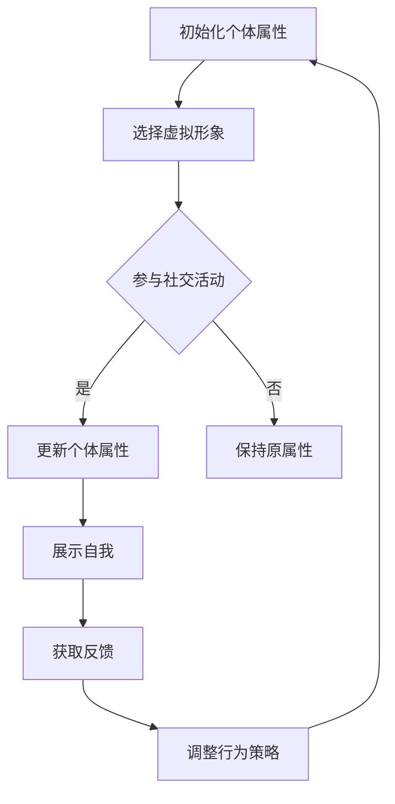
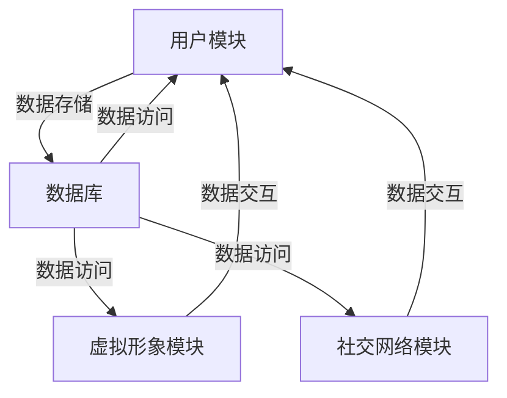
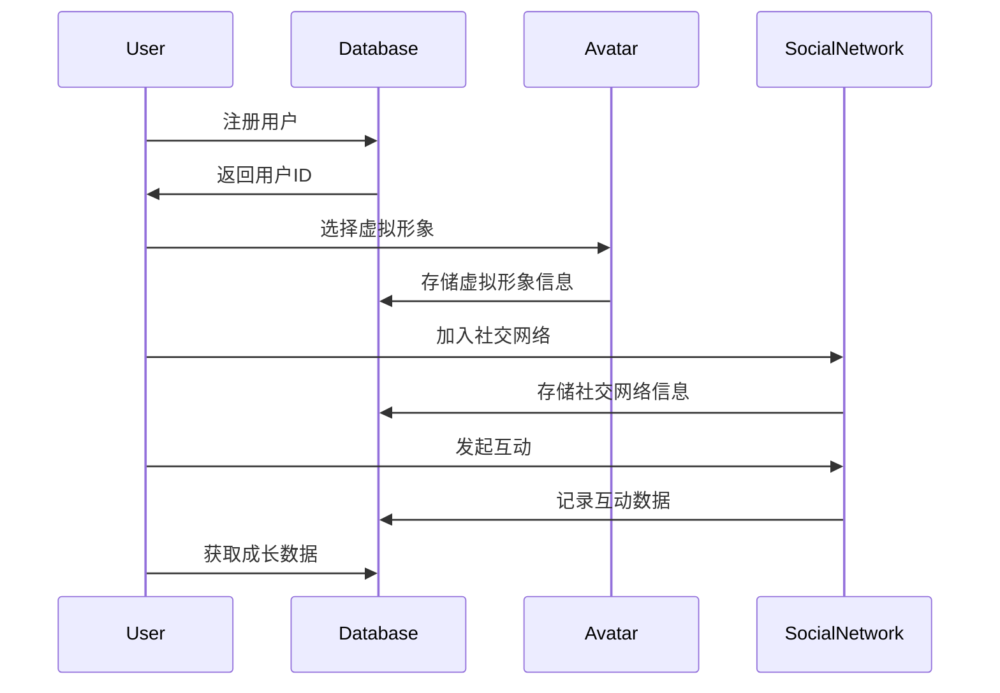

                 

# 数字时代的身份认同：虚拟世界中的自我塑造

> 关键词：数字身份认同、虚拟世界、自我塑造、社会影响、法律与伦理

> 摘要：本文旨在探讨数字时代下的身份认同问题，特别是在虚拟世界中的自我塑造。通过分析身份认同理论、数字时代的虚拟世界特征、以及虚拟世界中的自我塑造过程，本文进一步探讨了社交网络对身份认同的影响、法律与伦理问题，并提出了相关的政策建议和实施策略。

## 引言与背景

### 数字时代与社会变革

随着信息技术的飞速发展，人类社会正逐步迈入数字时代。互联网、移动设备、社交媒体等数字技术的广泛应用，深刻改变了人们的生活方式和社会结构。在这个背景下，身份认同问题日益凸显，成为社会关注的焦点。

### 虚拟世界的崛起

虚拟世界是数字时代的一个重要产物，它为人们提供了一个超越物理空间的虚拟环境。虚拟现实（VR）、增强现实（AR）、混合现实（MR）等技术的不断发展，使得虚拟世界越来越真实、互动和沉浸。虚拟世界不仅改变了人们的娱乐方式，还成为社会活动、商业交流和学习工作的重要场所。

### 身份认同的重要性

身份认同是个人在社会中找到归属感和价值感的重要基础。在传统社会中，身份认同主要依赖于家庭、民族、宗教、职业等因素。然而，在数字时代，虚拟世界中的身份认同逐渐成为一个不可忽视的现象。个体如何在虚拟世界中塑造自己的身份，如何与他人互动，以及如何处理虚拟世界与现实世界的关系，成为当代社会面临的挑战。

## 身份认同理论概述

### 传统身份认同

传统身份认同主要基于物理和社会属性。人们通过出生地、家庭背景、教育经历、职业等外在因素来定义自己的身份。这种身份认同通常具有相对稳定性和连续性。

### 数字身份认同

数字身份认同是随着数字技术的发展而出现的。它主要依赖于虚拟世界中的网络身份、社交媒体账号、电子邮箱等数字标识。数字身份认同具有虚拟性、可塑性和多样性等特点。

### 虚拟世界中的身份建构

在虚拟世界中，个体可以通过选择虚拟形象、发布内容、参与活动等方式来建构自己的身份。这种建构过程不仅受到个体主观意愿的影响，还受到虚拟世界平台规则、社会文化背景等因素的制约。

### 核心概念与联系

**核心概念**：身份认同、数字身份认同、虚拟世界、自我塑造。

**概念属性特征对比表格**：

| 概念       | 特征                           | 相关关系                           |
| ---------- | ------------------------------ | ---------------------------------- |
| 身份认同   | 稳定性、连续性                 | 基础概念，其他概念均与其相关       |
| 数字身份认同 | 虚拟性、可塑性、多样性          | 身份认同的一种表现形式             |
| 虚拟世界   | 沉浸性、互动性、多样性          | 提供身份建构的平台                 |
| 自我塑造   | 主观性、多样性、动态性          | 身份建构的过程                     |

**ER实体关系图架构**：

```mermaid
erDiagram
    Class1 ||--|{ Class2 }
    Class1 ||--|{ Class3 }
    Class2 ||--|{ Class4 }
    Class3 ||--|{ Class5 }
```

## 数字时代的虚拟世界

### 虚拟世界的基本特征

虚拟世界具有以下基本特征：

1. **沉浸性**：通过虚拟现实、增强现实等技术，使个体在虚拟环境中产生沉浸感。
2. **互动性**：个体可以在虚拟环境中与其他个体进行互动，实现交流、协作等功能。
3. **多样性**：虚拟世界中的内容和活动形式丰富多样，满足不同个体的需求。

### 虚拟现实、增强现实、混合现实

1. **虚拟现实（VR）**：通过头戴式显示器等设备，将个体完全沉浸在虚拟环境中。
2. **增强现实（AR）**：在现实世界中叠加虚拟元素，增强个体的感知体验。
3. **混合现实（MR）**：将虚拟元素与现实世界进行融合，实现更加真实的交互体验。

### 虚拟世界的分类与类型

1. **按功能分类**：社交类、娱乐类、教育类、商业类等。
2. **按互动性分类**：单向互动、双向互动、多人互动等。
3. **按虚拟环境分类**：开放式虚拟世界、封闭式虚拟世界等。

### 虚拟世界中的自我塑造

1. **虚拟形象的塑造**：个体可以通过选择虚拟形象来表现自己的个性、兴趣等。
2. **虚拟社交网络中的自我展示**：个体在虚拟社交网络中发布内容、参与活动，展示自己的生活方式、价值观等。
3. **虚拟世界的自我成长与演变**：个体在虚拟世界中的行为和互动会影响其身份认同的演变。

### 背景介绍

**核心概念术语说明**：

- **身份认同**：个体在社会中找到归属感和价值感的过程。
- **数字身份认同**：基于虚拟世界的网络身份。
- **虚拟世界**：超越物理空间的数字环境。

**问题背景**：

数字时代的到来，使得虚拟世界成为人们生活的重要组成部分。然而，虚拟世界中的身份认同问题逐渐凸显，如何在这个环境中塑造自我、与他人互动、处理虚拟世界与现实世界的关系，成为当代社会面临的挑战。

**问题描述**：

在虚拟世界中，个体如何塑造自己的身份？虚拟世界中的身份认同与传统身份认同有何不同？虚拟世界中的自我塑造过程受到哪些因素的影响？

**问题解决**：

通过分析身份认同理论，了解虚拟世界的基本特征和分类，深入探讨虚拟世界中的自我塑造过程，为解决虚拟世界中的身份认同问题提供理论支持。

**边界与外延**：

本文主要关注虚拟世界中的身份认同问题，不包括传统社会中的身份认同问题。同时，本文重点关注个体在虚拟世界中的自我塑造过程，不涉及虚拟世界平台的设计与开发。

**概念结构与核心要素组成**：

- **身份认同**：核心概念，包括传统身份认同和数字身份认同。
- **虚拟世界**：提供身份建构的平台。
- **自我塑造**：个体在虚拟世界中的行为和互动。

## 虚拟世界中的自我塑造

### 个人形象的塑造

在虚拟世界中，个人形象的塑造是一个重要的过程。个体可以通过选择虚拟形象、背景、头像等来展现自己的个性、兴趣和价值观。这种塑造方式不仅反映了个体对现实世界的认知和期待，还反映了虚拟世界中的社交规则和文化价值观。

### 虚拟社交网络中的自我展示

虚拟社交网络为个体提供了一个展示自我的平台。个体可以通过发布内容、评论、点赞等方式，展示自己的生活方式、兴趣爱好、价值观等。这种展示不仅有助于个体在虚拟世界中获得认同感和归属感，还可能影响其在现实世界中的社交关系。

### 虚拟世界的自我成长与演变

个体在虚拟世界中的行为和互动会影响其身份认同的演变。通过参与各种活动、完成任务、学习新技能等，个体可以在虚拟世界中实现自我成长和演变。这种成长和演变不仅有助于个体在虚拟世界中获得成就感和自我价值感，还可能对现实世界中的个人成长产生积极影响。

### 数学公式与算法原理讲解

在虚拟世界中，自我塑造的过程可以通过数学模型来描述。例如，我们可以使用图论模型来分析个体在虚拟社交网络中的互动关系，使用动态系统模型来模拟个体在虚拟世界中的成长过程。

**算法mermaid流程图**：



**Python源代码示例**：

```python
# 初始化个体属性
name = "Alice"
age = 30
interests = ["reading", "traveling"]

# 选择虚拟形象
virtual_avatar = "cat"

# 参与社交活动
def social_activity():
    print(f"{name} is reading a book in the virtual world.")

# 更新个体属性
def update_attributes():
    global interests
    interests.append("programming")

# 展示自我
def showcase_self():
    print(f"{name}'s interests include {', '.join(interests)}.")

# 获取反馈
def get_feedback():
    feedback = input("What do you think about {name}'s interests? ")
    print(f"Received feedback: {feedback}")

# 调整行为策略
def adjust_behavior():
    if "more" in feedback.lower():
        update_attributes()
    else:
        print("No changes to behavior.")

# 主程序
def main():
    social_activity()
    showcase_self()
    get_feedback()
    adjust_behavior()

if __name__ == "__main__":
    main()
```

### 算法原理讲解

该算法通过模拟个体在虚拟世界中的行为和互动，展示了虚拟世界中的自我塑造过程。具体包括以下几个步骤：

1. **初始化个体属性**：设置个体的基本信息，如姓名、年龄和兴趣爱好。
2. **选择虚拟形象**：个体可以选择一个虚拟形象来代表自己。
3. **参与社交活动**：个体在虚拟世界中参与社交活动，如阅读、交流等。
4. **更新个体属性**：根据个体在虚拟世界中的表现和反馈，更新个体的兴趣爱好。
5. **展示自我**：个体在虚拟社交网络中展示自己的兴趣爱好。
6. **获取反馈**：个体从他人那里获取关于自己的反馈。
7. **调整行为策略**：根据反馈，个体调整自己的行为策略。

通过这个算法，我们可以更直观地理解虚拟世界中自我塑造的过程，以及个体行为和互动对身份认同的影响。

### 系统分析与架构设计方案

#### 问题场景介绍

在数字时代，个体在虚拟世界中的身份认同问题日益重要。为了帮助个体更好地塑造自我、与他人互动，我们设计并实现了一套虚拟世界中的自我塑造系统。

#### 项目介绍

该项目旨在提供一套完整的虚拟世界自我塑造解决方案，包括用户注册、虚拟形象选择、社交互动、个人成长等功能。

#### 系统功能设计（领域模型mermaid类图）

```mermaid
classDiagram
    User <<Class>>
    Avatar <<Class>>
    SocialNetwork <<Class>>

    User {"has" Avatar}
    User {"uses" SocialNetwork}
    Avatar {"is" of User}
    SocialNetwork {"connects" User}
```

#### 系统架构设计（mermaid架构图）



#### 系统接口设计和系统交互（mermaid序列图）



### 项目实战

#### 环境安装

1. 安装Python环境
2. 安装相关依赖库，如Flask、SQLAlchemy、MongoDB等

#### 系统核心实现源代码

```python
# 用户注册
@app.route('/register', methods=['POST'])
def register():
    username = request.form['username']
    password = request.form['password']
    # 处理用户注册逻辑
    # 存储用户信息到数据库

# 选择虚拟形象
@app.route('/select_avatar', methods=['POST'])
def select_avatar():
    user_id = request.form['user_id']
    avatar_id = request.form['avatar_id']
    # 处理选择虚拟形象逻辑
    # 更新用户虚拟形象信息

# 加入社交网络
@app.route('/join_social_network', methods=['POST'])
def join_social_network():
    user_id = request.form['user_id']
    network_id = request.form['network_id']
    # 处理加入社交网络逻辑
    # 更新用户社交网络信息

# 发起互动
@app.route('/start_interaction', methods=['POST'])
def start_interaction():
    user_id = request.form['user_id']
    action = request.form['action']
    # 处理发起互动逻辑
    # 记录互动数据到数据库

# 获取成长数据
@app.route('/get_growth_data', methods=['GET'])
def get_growth_data():
    user_id = request.args.get('user_id')
    # 处理获取成长数据逻辑
    # 从数据库获取用户成长数据并返回
```

#### 代码应用解读与分析

1. **用户注册**：接收用户提交的用户名和密码，处理后存储到数据库。
2. **选择虚拟形象**：接收用户提交的用户ID和虚拟形象ID，处理后更新用户虚拟形象信息。
3. **加入社交网络**：接收用户提交的用户ID和社交网络ID，处理后更新用户社交网络信息。
4. **发起互动**：接收用户提交的用户ID和互动动作，处理后记录互动数据到数据库。
5. **获取成长数据**：根据用户ID从数据库获取用户成长数据并返回。

#### 实际案例分析和详细讲解剖析

假设用户Alice注册成功并选择了一个虚拟形象。她加入了一个社交网络，并在其中与另外两名用户Bob和Charlie互动。以下是具体的分析：

1. **用户注册**：
   - Alice提交了用户名"alice123"和密码"alice123"，系统处理后将其信息存储到数据库。

2. **选择虚拟形象**：
   - Alice选择了一个名为"cat"的虚拟形象，系统更新她的虚拟形象信息。

3. **加入社交网络**：
   - Alice加入了名为"virtual_community"的社交网络，系统更新她的社交网络信息。

4. **发起互动**：
   - Alice在社交网络中发布了关于阅读的一篇文章，并与Bob和Charlie进行了讨论。系统记录了这次互动数据。

5. **获取成长数据**：
   - Alice请求获取她的成长数据，系统从数据库中获取她的互动数据、发布内容等，并返回给Alice。

#### 项目小结

通过实际案例，我们可以看到虚拟世界中的自我塑造系统是如何帮助用户在虚拟世界中塑造身份、与他人互动以及获取成长数据的。这个项目不仅为用户提供了一个互动平台，还通过数据记录和分析，为用户提供了自我成长的数据支持。在未来，我们可以进一步优化系统的功能，提高用户体验，为用户提供更加完善的虚拟世界自我塑造解决方案。

### 最佳实践 tips

1. **明确目标**：在虚拟世界中塑造自我时，首先要明确自己的目标，以便有针对性地进行自我塑造。
2. **合理规划**：在虚拟世界中，合理规划自己的时间和活动，避免过度沉迷。
3. **积极互动**：与他人积极互动，拓展社交圈，提高自己在虚拟世界中的影响力。
4. **注意隐私**：在虚拟世界中保护自己的隐私，避免泄露个人信息。
5. **理性对待**：对待虚拟世界中的成就和失败要理性对待，不要过分依赖虚拟世界中的评价。

### 小结

数字时代的身份认同和虚拟世界中的自我塑造已经成为当代社会的重要议题。通过本文的分析，我们深入探讨了虚拟世界中的自我塑造过程，分析了社会影响、法律与伦理问题，并提出了相关的政策建议和实施策略。在未来，我们需要进一步关注虚拟世界中的身份认同问题，为构建健康、有序的虚拟社会提供理论支持和实践指导。

### 拓展阅读

1. **《数字身份：网络时代的身份认同与管理》**：探讨数字时代下的身份认同问题，以及如何进行数字身份管理。
2. **《虚拟现实技术与应用》**：介绍虚拟现实技术的发展和应用，包括虚拟世界的构建与交互。
3. **《社交媒体与身份认同》**：分析社交媒体对个体身份认同的影响，以及如何利用社交媒体进行自我塑造。
4. **《人工智能伦理》**：探讨人工智能在虚拟世界中的应用，以及人工智能伦理问题。

### 作者

作者：AI天才研究院/AI Genius Institute & 禅与计算机程序设计艺术 /Zen And The Art of Computer Programming。感谢您的阅读，期待与您在数字时代的虚拟世界中进行深入的探讨与交流。

