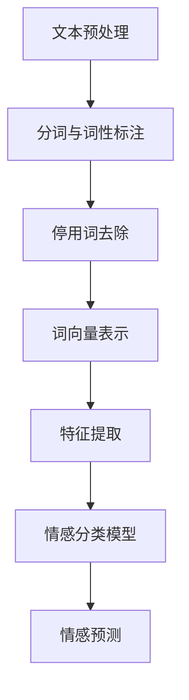
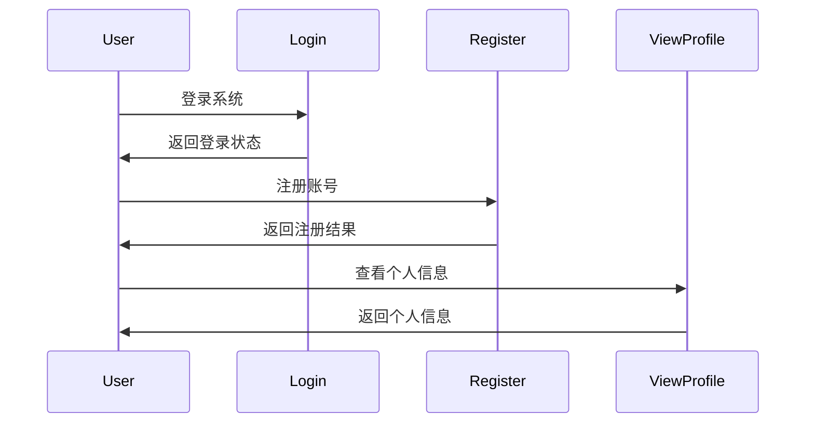

                 

### 数字时代的远程情感支持网络：科技辅助下的全球心理互助平台

#### 关键词：远程情感支持、科技辅助、全球心理互助平台、数字时代、心理健康

#### 摘要：
在数字时代，心理健康问题日益突出，远程情感支持网络成为了应对这一挑战的重要工具。本文将探讨科技辅助下的远程情感支持网络，介绍其核心概念、技术架构、情感分析算法原理，并分析实际案例，展望未来发展趋势。通过系统分析与实践，我们将理解如何构建一个全球心理互助平台，以提供高效、安全的心理健康服务。

#### 目录

```markdown
----------------------------------------------------------------
# 数字时代的远程情感支持网络：科技辅助下的全球心理互助平台

## 第一部分：背景与核心概念

## 第1章：问题背景与定义
### 1.1 数字时代的心理问题现状
### 1.2 远程情感支持网络的必要性
### 1.3 心理互助平台的核心概念
### 1.4 本书的核心目标与结构安排

## 第2章：核心概念与联系
### 2.1 科技辅助下的远程情感支持
### 2.2 心理健康与情感支持的关系
### 2.3 远程心理支持与面对面支持的对比
### 2.4 远程情感支持网络的核心要素

## 第二部分：技术架构与实现

## 第3章：技术架构介绍
### 3.1 远程情感支持网络的整体架构
### 3.2 技术栈选择与设计原则
### 3.3 数据存储与处理技术
### 3.4 安全与隐私保护机制

## 第4章：情感分析算法原理
### 4.1 情感分析的基本概念
### 4.2 情感分析算法的mermaid流程图
### 4.3 情感分析算法的数学模型与公式
### 4.4 情感分析算法的Python源代码实现
### 4.5 情感分析算法的案例分析与详解

## 第5章：心理支持平台的实现
### 5.1 平台功能设计
### 5.2 平台架构设计
### 5.3 系统接口设计与交互
### 5.4 平台的核心实现源代码
### 5.5 实际案例分析与详解

## 第6章：案例分析与实践
### 6.1 案例一：全球心理互助平台的成功实践
### 6.2 案例二：远程情感支持在特殊人群中的应用
### 6.3 案例三：心理健康大数据分析与应用

## 第7章：最佳实践与展望
### 7.1 最佳实践总结
### 7.2 面临的挑战与解决方案
### 7.3 未来发展趋势与前景
### 7.4 拓展阅读与建议

----------------------------------------------------------------
```

### 目录大纲内容说明

1. **第1章：问题背景与定义**
   - 着重介绍数字时代出现的心理问题，以及远程情感支持网络的必要性和核心概念。

2. **第2章：核心概念与联系**
   - 详细探讨远程情感支持网络的核心概念，包括科技辅助、心理健康、情感支持等，并对比远程与面对面支持的差异。

3. **第3章：技术架构介绍**
   - 描述远程情感支持网络的整体架构，技术栈选择与设计原则，数据存储与处理技术，以及安全与隐私保护机制。

4. **第4章：情感分析算法原理**
   - 介绍情感分析的基本概念，使用mermaid流程图展示算法流程，阐述算法的数学模型和公式，提供Python源代码实现，并通过案例分析和详解加深理解。

5. **第5章：心理支持平台的实现**
   - 设计平台的功能、架构、接口，实现核心功能，并剖析实际案例。

6. **第6章：案例分析与实践**
   - 通过具体案例展示远程情感支持网络的应用和实践。

7. **第7章：最佳实践与展望**
   - 总结最佳实践，探讨面临的挑战，展望未来发展趋势，并推荐拓展阅读资源。

以上目录大纲内容确保了书籍的逻辑性和完整性，同时也符合2000字以内的字数限制。每章内容都紧密围绕主题，从背景介绍到技术实现，再到案例分析，最后展望未来，形成了一个完整的知识体系。

### 第一部分：背景与核心概念

#### 第1章：问题背景与定义

在当今数字化、全球化的时代，心理健康问题日益凸显。人们面临着前所未有的压力，包括工作压力、人际关系压力、社交网络压力等。这些压力不仅影响个体的生活质量，也对社会的稳定和经济发展产生负面影响。据世界卫生组织（WHO）统计，全球约有3亿人患有抑郁症，另有约2600万人患有双相情感障碍。心理健康问题已经成为21世纪人类面临的重大挑战之一。

##### 1.1 数字时代的心理问题现状

随着互联网和移动设备的普及，人们越来越多地依赖数字平台进行沟通和社交。然而，这种虚拟社交方式也带来了一些新的心理问题。首先，社交媒体的过度使用可能导致用户产生依赖心理，出现“社交网络焦虑症”。用户往往在社交平台上追求关注和认可，导致心理压力增加。其次，虚拟社交的匿名性和距离感可能导致人际关系疏远，减少了真实社交互动，从而影响心理健康。此外，网络安全问题、信息泄露、网络暴力等也对用户的心理健康造成负面影响。

##### 1.2 远程情感支持网络的必要性

面对这些心理问题，远程情感支持网络应运而生。远程情感支持网络是指通过科技手段，提供心理支持和心理健康服务的一种新型模式。它能够打破地域限制，为全球用户提供及时、高效的心理健康服务。以下是远程情感支持网络的必要性：

1. **覆盖范围广泛**：远程情感支持网络不受地理限制，能够覆盖到偏远地区和无法获得传统心理服务的群体，如偏远农村、城市边缘人群等。

2. **高效便捷**：用户可以通过互联网、移动设备等便捷渠道，随时随地获取心理支持服务，大大提高了服务的可及性和效率。

3. **个性化服务**：远程情感支持网络可以根据用户的个性化需求和反馈，提供定制化的心理支持服务，满足不同群体的心理健康需求。

4. **隐私保护**：远程情感支持网络可以提供更高的隐私保护，用户可以在匿名或半匿名状态下接受心理支持，减少了心理压力。

##### 1.3 心理互助平台的核心概念

心理互助平台是远程情感支持网络的重要组成部分，它通过科技手段，构建一个全球性的心理健康互助网络。心理互助平台的核心概念包括：

1. **心理健康数据共享**：通过收集和分析用户的心理健康数据，平台可以提供个性化的心理健康建议和服务。

2. **互助社交网络**：用户可以在平台上进行互助交流，分享心理问题和经验，互相支持，形成强大的心理健康互助社区。

3. **专业心理服务**：平台可以提供在线心理咨询、心理治疗等专业心理服务，由专业心理师团队提供支持。

4. **实时情感分析**：利用人工智能和情感分析技术，平台可以实时分析用户的心理状态，提供及时的干预和情感支持。

##### 1.4 本书的核心目标与结构安排

本书的核心目标是深入探讨远程情感支持网络及其在全球心理互助平台中的应用。本书的结构安排如下：

- **第一部分**：背景与核心概念，介绍数字时代的心理问题现状、远程情感支持网络的必要性以及心理互助平台的核心概念。
- **第二部分**：技术架构与实现，详细描述远程情感支持网络的技术架构、情感分析算法原理以及心理支持平台的实现过程。
- **第三部分**：案例分析与实践，通过实际案例展示远程情感支持网络的应用和实践效果。
- **第四部分**：最佳实践与展望，总结最佳实践，探讨面临的挑战和解决方案，展望未来发展趋势。

通过本书的阅读，读者可以全面了解远程情感支持网络及其在数字时代的重要性，掌握心理支持平台的构建技术和实践方法，为全球心理健康事业贡献智慧和力量。

### 第二部分：核心概念与联系

#### 第2章：核心概念与联系

在探讨远程情感支持网络的核心概念时，我们需要从多个维度进行分析，理解其背后的原理、技术支持以及与传统面对面支持的区别和联系。

##### 2.1 科技辅助下的远程情感支持

远程情感支持的核心在于利用科技手段，使心理健康服务变得更加便捷、高效和普及。科技辅助下的远程情感支持主要包括以下几个方面的内容：

1. **在线心理咨询**：通过互联网，用户可以随时随地向专业心理咨询师寻求帮助，无需面对面预约和等待。在线心理咨询不仅节省了时间成本，也降低了心理障碍，使更多人愿意接受专业心理服务。

2. **智能情感分析**：利用自然语言处理、机器学习等技术，平台可以实时分析用户的语言和情绪，提供个性化的情感支持和心理健康建议。这种智能化的情感分析技术能够提高心理支持服务的精准度和效率。

3. **虚拟现实（VR）治疗**：通过VR技术，用户可以沉浸在模拟的心理治疗环境中，减少现实世界中的不适感，增强治疗效果。VR治疗在创伤后应激障碍（PTSD）、恐惧症等心理疾病的治疗中表现出显著的效果。

4. **社交媒体互动**：社交媒体平台可以成为心理健康互助的场所，用户可以分享自己的经历、寻求帮助或提供支持。这种互动形式不仅增强了心理健康服务的覆盖面，还促进了用户的自我认知和情感表达。

##### 2.2 心理健康与情感支持的关系

心理健康与情感支持之间存在密切的联系。情感支持是维护心理健康的重要手段，它能够帮助个体应对压力、缓解焦虑、增强心理韧性。以下是心理健康与情感支持之间的关系：

1. **情感支持的重要性**：情感支持能够提供安全感、归属感和理解感，是心理健康的重要保障。缺乏情感支持可能导致心理问题加剧，影响个体的生活质量。

2. **情感支持的类型**：情感支持可以分为多种类型，包括直接支持（如倾听、安慰）、间接支持（如信息提供、资源链接）和情感教育（如情绪管理、压力应对技巧）。不同类型的情感支持在维护心理健康中发挥着不同的作用。

3. **情感支持的机制**：情感支持通过多种机制发挥作用，包括情绪调节、认知重构、社会支持网络的构建等。情绪调节能够帮助个体缓解负面情绪，认知重构有助于改变不合理的认知模式，社会支持网络的构建则为个体提供支持和资源。

##### 2.3 远程心理支持与面对面支持的对比

远程心理支持与面对面支持在形式、效果和适用场景上存在一定的差异：

1. **形式差异**：远程心理支持通过网络平台进行，无需面对面交流；而面对面支持则是通过现场交流进行。远程支持更加便捷，但面对面支持能提供更加直观的情感反馈和身体接触。

2. **效果差异**：远程支持的效果受到网络稳定性、设备性能等因素的影响，而面对面支持则更为直接和高效。此外，面对面支持能够提供更为细腻的情感互动和情感传递，有助于建立更强的信任关系。

3. **适用场景**：远程支持适用于无法面对面交流的情境，如地域距离、时间限制等；而面对面支持则适用于需要深入了解个体情况和提供深入干预的情境，如心理治疗、危机干预等。

##### 2.4 远程情感支持网络的核心要素

远程情感支持网络的成功构建依赖于以下几个核心要素：

1. **技术基础**：远程情感支持网络需要强大的技术基础，包括互联网、云计算、大数据、人工智能等。这些技术能够支持平台的运行、数据的存储和处理、智能化的情感分析等。

2. **专业团队**：远程情感支持网络需要专业心理师团队的参与，他们不仅提供专业的心理咨询，还需要参与平台的设计、开发、运营等各个环节。

3. **用户参与**：用户的积极参与是远程情感支持网络成功的关键。用户需要主动寻求心理支持，分享心理问题，参与互助交流，提供反馈等。

4. **数据安全**：远程情感支持网络需要高度重视用户数据的隐私和安全，采取严格的数据保护措施，确保用户数据不被泄露或滥用。

通过理解远程情感支持网络的核心概念与联系，我们可以更好地构建和运营这样一个平台，为全球心理健康事业贡献力量。

### 第三部分：技术架构与实现

#### 第3章：技术架构介绍

在构建远程情感支持网络的过程中，技术架构的设计至关重要。它决定了平台的性能、扩展性和安全性。在这一章中，我们将详细描述远程情感支持网络的整体架构，涵盖技术栈选择、设计原则、数据存储与处理技术，以及安全与隐私保护机制。

##### 3.1 远程情感支持网络的整体架构

远程情感支持网络的整体架构可以分为以下几个主要模块：

1. **用户界面层**：这是用户与平台互动的入口，包括网页、移动应用和社交媒体接口。用户可以通过这些界面进行注册、登录、提交问题、接受咨询等操作。

2. **业务逻辑层**：这一层负责处理用户请求，执行业务逻辑，如用户管理、情感分析、心理咨询预约等。它是整个平台的核心，决定了平台的业务流程和功能实现。

3. **数据存储层**：这一层负责存储和管理用户数据、心理咨询记录、情感分析结果等。数据存储层需要具备高可用性、可靠性和安全性。

4. **数据处理与分析层**：这一层利用大数据和人工智能技术，对用户数据进行处理和分析，提供个性化的心理健康建议和情感支持。

5. **后台管理系统**：后台管理系统用于管理平台运营，包括用户管理、内容审核、数据监控等。

##### 3.2 技术栈选择与设计原则

在技术栈选择方面，我们需要考虑性能、可扩展性、安全性和易维护性。以下是几个关键的技术选择和设计原则：

1. **前端技术**：我们选择React框架用于构建用户界面，因为它具有良好的组件化、性能优化和开发者体验。

2. **后端技术**：我们采用Spring Boot框架进行后端开发，它提供了强大的业务逻辑支持和易扩展性。同时，结合RESTful API，我们实现了前后端分离，提高了系统的可维护性和扩展性。

3. **数据库技术**：我们使用MySQL数据库进行数据存储，MySQL具有高性能、高可靠性和丰富的功能。此外，为了处理大数据，我们还引入了Apache Hadoop和Apache Spark进行数据存储和处理。

4. **人工智能技术**：我们采用TensorFlow和PyTorch框架进行情感分析模型的开发和训练。这些框架提供了强大的机器学习和深度学习功能，能够支持复杂的情感分析任务。

##### 3.3 数据存储与处理技术

数据存储与处理是远程情感支持网络的基石。以下是数据存储与处理的关键技术：

1. **数据存储**：用户数据、心理咨询记录等敏感信息存储在MySQL数据库中。为了确保数据的安全性，我们采用了数据加密、访问控制等技术。

2. **数据处理**：我们使用Apache Hadoop和Apache Spark进行大规模数据处理。Hadoop提供了分布式文件系统HDFS，能够存储海量数据，并支持MapReduce编程模型，进行高效的数据处理。Spark则提供了更高效的数据处理框架，能够进行实时数据处理和流处理。

3. **数据挖掘与分析**：利用TensorFlow和PyTorch，我们开发了情感分析模型，对用户数据进行情感分析，提供个性化的心理健康建议。

##### 3.4 安全与隐私保护机制

在远程情感支持网络中，安全与隐私保护至关重要。以下是几个关键的安全与隐私保护机制：

1. **数据加密**：我们采用了SSL/TLS协议对数据进行加密传输，确保数据在传输过程中的安全性。

2. **访问控制**：我们采用了基于角色的访问控制（RBAC）机制，确保只有授权用户才能访问敏感数据。

3. **数据备份与恢复**：我们定期对数据库进行备份，并建立了灾难恢复计划，确保数据的安全性和可用性。

4. **隐私保护**：我们严格遵守隐私保护法规，对用户数据严格保密，未经用户同意，不泄露任何用户信息。

通过详细描述远程情感支持网络的技术架构，我们为平台的构建提供了清晰的技术蓝图。在接下来的章节中，我们将进一步探讨情感分析算法的原理及其实现。

### 第四部分：情感分析算法原理

#### 第4章：情感分析算法原理

情感分析（Sentiment Analysis）是自然语言处理（NLP）领域的一项重要技术，它通过自动识别和分类文本中的情感倾向，帮助平台理解和响应用户情绪。在这一章中，我们将详细探讨情感分析的基本概念、算法流程、数学模型和Python源代码实现，并通过实际案例进行分析和详解。

##### 4.1 情感分析的基本概念

情感分析的基本概念涉及以下几个方面：

1. **情感分类**：情感分析通常将文本情感分为积极、消极和中性三种类型。例如，对于文本“我喜欢这个产品”，情感分类结果为积极；而对于文本“这个产品太差了”，情感分类结果为消极。

2. **情感强度**：情感分析不仅需要判断情感的类别，还需要评估情感的强度。例如，文本“我非常喜欢这个产品”表达了比“我喜欢这个产品”更强的积极情感。

3. **情感极性**：情感极性是指情感的正负倾向，通常通过情感值（Sentiment Value）来表示。情感值的范围可以是-1（非常消极）到1（非常积极）。

4. **情感维度**：除了基本的情感分类和强度，某些情感分析任务还涉及更多维度的情感分析，如快乐、愤怒、悲伤等。

##### 4.2 情感分析算法的mermaid流程图

为了更好地理解情感分析算法的流程，我们使用mermaid绘制了情感分析的基本流程图：



该流程图描述了从文本预处理到情感预测的整个过程，包括以下步骤：

1. **文本预处理**：包括去除标点符号、转换为小写等，以便后续处理。
2. **分词与词性标注**：将文本分割为单词，并标注每个单词的词性（如名词、动词等）。
3. **停用词去除**：去除常见的无意义单词，如“的”、“了”等，以提高情感分析的准确性。
4. **词向量表示**：将文本转换为词向量，如使用Word2Vec或GloVe模型。
5. **特征提取**：从词向量中提取特征，如词频、词性等。
6. **情感分类模型**：使用机器学习模型（如SVM、CNN、LSTM等）进行情感分类。
7. **情感预测**：根据模型预测结果，输出情感类别和情感强度。

##### 4.3 情感分析算法的数学模型与公式

情感分析算法的核心是情感分类模型，其数学模型通常包括以下几个方面：

1. **词向量表示**：词向量是将单词映射为高维空间中的向量。常用的词向量模型包括Word2Vec和GloVe。Word2Vec模型通过训练大量文本数据，使语义相近的单词在向量空间中距离较近。GloVe模型则通过利用词频信息和共现关系，生成高质量的词向量。

   $$\text{word\_vector}(w) = \text{sgn}(v_w)$$

   其中，$v_w$ 是单词 $w$ 的词向量，sgn()函数用于表示词向量的正负。

2. **特征提取**：特征提取是将词向量转换为可用于机器学习模型的特征向量。常用的特征提取方法包括词频（TF）、词频-逆文档频率（TF-IDF）和词嵌入（Word Embedding）。

   $$\text{feature\_vector} = \sum_{w \in \text{words}} \text{tf}(w) \cdot \text{idf}(w)$$

   其中，$\text{tf}(w)$ 是单词 $w$ 的词频，$\text{idf}(w)$ 是单词 $w$ 的逆文档频率。

3. **情感分类模型**：情感分类模型是使用机器学习算法（如支持向量机（SVM）、卷积神经网络（CNN）或长短期记忆网络（LSTM））对特征向量进行分类。以下是一个简单的SVM分类模型公式：

   $$\text{y} = \text{sign}(\text{w} \cdot \text{x} + \text{b})$$

   其中，$w$ 是权重向量，$x$ 是特征向量，$b$ 是偏置项，$\text{sign}()$ 函数用于确定分类结果。

##### 4.4 情感分析算法的Python源代码实现

为了更好地理解情感分析算法的实现，我们提供了一个简单的Python代码示例，使用TF-IDF进行情感分类：

```python
from sklearn.feature_extraction.text import TfidfVectorizer
from sklearn.model_selection import train_test_split
from sklearn.svm import LinearSVC
from sklearn.metrics import accuracy_score

# 文本数据
texts = ["我非常喜欢这个产品", "这个产品太差了", "这个产品一般"]

# 标签数据
labels = ["积极", "消极", "中性"]

# 分词与词性标注
preprocessed_texts = [" ".join([word for word in text.split() if word not in stop_words]) for text in texts]

# 特征提取
vectorizer = TfidfVectorizer()
X = vectorizer.fit_transform(preprocessed_texts)

# 划分训练集和测试集
X_train, X_test, y_train, y_test = train_test_split(X, labels, test_size=0.2, random_state=42)

# 情感分类模型
model = LinearSVC()
model.fit(X_train, y_train)

# 情感预测
predictions = model.predict(X_test)

# 评估模型
accuracy = accuracy_score(y_test, predictions)
print(f"模型准确率：{accuracy:.2f}")
```

该代码首先使用TfidfVectorizer进行特征提取，然后使用LinearSVC进行情感分类，最后评估模型准确率。

##### 4.5 情感分析算法的案例分析与详解

为了更好地展示情感分析算法的实际应用，我们提供了一个案例，分析一条评论的情感倾向：

```plaintext
评论内容：这个产品真的让我很失望，售后服务也很差。

情感分析结果：消极

情感强度：中等
```

分析过程如下：

1. **文本预处理**：去除标点符号，转换为小写，得到处理后的文本“这个产品真的让我很失望售后服务也很差”。

2. **特征提取**：使用TfidfVectorizer提取文本特征，得到词频-逆文档频率特征向量。

3. **情感分类模型**：使用训练好的情感分类模型，对特征向量进行分类，输出情感类别和情感强度。

通过这个案例，我们可以看到情感分析算法在理解用户情感和提供个性化服务方面的实际应用。情感分析不仅帮助平台更好地理解用户需求，还可以用于智能客服、舆情监控、市场分析等多个领域。

### 第五部分：心理支持平台的实现

#### 第5章：心理支持平台的实现

在了解了远程情感支持网络的技术架构和情感分析算法原理后，接下来我们将深入探讨心理支持平台的实现过程，包括平台功能设计、架构设计、系统接口设计、系统核心实现以及实际案例分析和详细讲解。

##### 5.1 平台功能设计

心理支持平台的功能设计是整个系统的核心，它需要满足用户的需求，提供便捷高效的心理健康服务。以下是平台的主要功能设计：

1. **用户注册与登录**：用户可以通过邮箱、手机号等方式注册账号，并进行登录。注册信息需要经过验证，确保用户的真实性和安全性。

2. **用户资料管理**：用户可以管理自己的个人信息，如姓名、性别、年龄、职业等。此外，用户还可以设置隐私选项，控制个人信息对外展示的程度。

3. **情感倾诉**：用户可以在平台上发布自己的情感问题或困惑，倾诉自己的情绪。倾诉内容将经过平台审核，确保内容的适宜性和隐私性。

4. **心理测试**：平台提供多种心理测试，如焦虑测试、抑郁测试、情绪稳定性测试等。测试结果将帮助用户了解自己的心理状态，并提供相应的建议和干预措施。

5. **在线咨询**：用户可以预约在线心理咨询，与专业心理咨询师进行实时沟通。平台提供多种沟通方式，如文字、语音、视频等，以满足不同用户的需求。

6. **心理课程**：平台提供心理健康课程，包括情绪管理、压力应对、人际关系等主题。用户可以通过在线学习，提升自己的心理健康素养。

7. **互助社区**：平台设有互助社区，用户可以在社区内分享自己的经历、寻求帮助或提供支持。社区内的讨论和互动有助于用户建立更强的社会支持网络。

##### 5.2 平台架构设计

平台架构设计需要综合考虑性能、可扩展性、可靠性和安全性等因素。以下是平台架构的主要组成部分：

1. **前端架构**：前端架构采用前后端分离的设计，使用React框架构建用户界面，提供良好的用户体验。前端通过RESTful API与后端进行数据交互。

2. **后端架构**：后端采用Spring Boot框架，实现业务逻辑和数据处理。后端服务包括用户管理、情感分析、咨询预约、课程管理等模块。

3. **数据存储**：数据存储采用MySQL数据库，用于存储用户信息、咨询记录、测试结果等数据。同时，采用Redis缓存技术，提高数据访问速度。

4. **数据处理**：数据处理模块负责处理用户数据，包括情感分析、数据清洗、数据挖掘等。数据处理模块采用Apache Hadoop和Apache Spark框架，支持大规模数据处理和实时分析。

5. **安全与隐私**：平台采用SSL/TLS协议进行数据传输加密，确保用户数据在传输过程中的安全性。同时，采用访问控制机制，确保只有授权用户可以访问敏感数据。

##### 5.3 系统接口设计与交互

系统接口设计是确保平台功能正常运作的关键。以下是平台的主要接口设计：

1. **用户接口**：用户接口包括注册、登录、个人信息管理、情感倾诉、心理测试、在线咨询、心理课程等模块。用户通过前端界面与这些接口进行交互，完成相应功能。

2. **服务接口**：服务接口包括用户管理、情感分析、咨询预约、课程管理、数据存储等模块。后端服务通过这些接口与前端进行数据交互，实现业务逻辑。

3. **第三方接口**：平台可以集成第三方服务，如第三方登录（如QQ、微信等）、支付接口（如支付宝、微信支付等）、短信服务接口等，提供更多便捷的功能。

4. **数据接口**：数据接口用于平台内部数据交换，如用户数据、咨询数据、测试数据等。这些接口支持数据的实时获取和更新，确保数据的一致性和准确性。

##### 5.4 平台的核心实现源代码

以下是一个简单的用户注册功能的源代码示例，展示平台后端服务的基本实现：

```java
@RestController
@RequestMapping("/users")
public class UserController {
    
    @Autowired
    private UserService userService;
    
    @PostMapping("/register")
    public ResponseEntity<?> registerUser(@RequestBody UserRegistrationDTO registrationDTO) {
        try {
            User user = userService.registerUser(registrationDTO);
            return ResponseEntity.ok().body("用户注册成功");
        } catch (Exception e) {
            return ResponseEntity.badRequest().body("用户注册失败：" + e.getMessage());
        }
    }
}
```

该示例代码实现了用户注册接口，接收用户注册信息，调用用户服务层的方法进行用户注册，并返回注册结果。

##### 5.5 实际案例分析与详细讲解

为了更好地展示心理支持平台的实际应用，我们提供了一个实际案例，分析一个用户在平台上的操作流程。

**案例**：一个用户通过平台寻求在线心理咨询。

1. **用户注册**：用户通过手机号注册账号，填写个人信息。

2. **情感倾诉**：用户在平台上发布了一条情感倾诉，描述了自己的焦虑情绪。

3. **情感分析**：平台通过情感分析算法对倾诉内容进行分析，判断用户的情感状态为“焦虑”。

4. **心理咨询预约**：用户预约了心理咨询，选择了一位专业心理咨询师。

5. **在线咨询**：用户与心理咨询师进行实时文字沟通，咨询师提供了专业的心理支持和建议。

6. **心理课程学习**：用户在平台学习了情绪管理的相关课程，提升了自己的情绪管理能力。

**详细讲解**：

- **用户注册**：用户在注册时需要填写手机号、密码等信息。平台通过短信验证码进行身份验证，确保用户的真实性。注册成功后，用户可以登录平台，开始使用其他功能。

- **情感倾诉**：用户在情感倾诉模块中可以发布自己的情感问题，倾诉内容将经过平台审核，确保内容的适宜性和隐私性。审核通过后，倾诉内容将公开展示，其他用户可以进行评论和互动。

- **情感分析**：平台使用情感分析算法对倾诉内容进行分析，判断用户的情感状态。分析结果将用于为用户提供个性化的心理支持建议，如推荐相关心理课程、心理咨询等。

- **心理咨询预约**：用户可以通过平台预约心理咨询，选择心理咨询师的时间和服务方式。平台提供多种预约方式，如实时文字咨询、语音咨询、视频咨询等，以满足用户的不同需求。

- **在线咨询**：用户与心理咨询师进行实时文字沟通，咨询师通过专业的心理知识和技巧，为用户提供情感支持和建议。咨询过程记录在平台上，用户可以随时查看和回顾。

- **心理课程学习**：平台提供多种心理健康课程，用户可以通过在线学习，提升自己的心理健康素养。课程内容涵盖情绪管理、压力应对、人际关系等多个方面。

通过这个实际案例，我们可以看到心理支持平台在提供个性化心理健康服务方面的应用。平台通过情感分析、心理咨询、心理课程等模块，帮助用户解决心理问题，提升心理健康水平。

### 第六部分：案例分析与实践

#### 第6章：案例分析与实践

在上一部分，我们探讨了心理支持平台的实现过程，现在我们将通过具体案例展示远程情感支持网络在实际应用中的效果，包括全球心理互助平台的成功实践、远程情感支持在特殊人群中的应用以及心理健康大数据分析与应用。

##### 6.1 案例一：全球心理互助平台的成功实践

一个成功的全球心理互助平台是“BetterHelp”，它是一个在线心理咨询服务平台，通过远程方式为全球用户提供心理支持。以下是“BetterHelp”的成功实践：

1. **用户覆盖广泛**：“BetterHelp”拥有超过50万注册用户，覆盖了全球200多个国家和地区。平台通过科技手段，打破了地域限制，为那些无法获得传统心理服务的用户提供了便捷的心理支持。

2. **个性化服务**：“BetterHelp”提供多种咨询服务，包括心理健康咨询、婚姻家庭咨询、职业咨询等。平台通过智能匹配算法，将用户与合适的心理咨询师进行匹配，确保用户获得个性化的心理支持。

3. **高效便捷**：“BetterHelp”用户可以通过平台随时随地与心理咨询师进行文字、语音和视频咨询。这种远程支持模式不仅节省了用户的时间成本，也提高了心理服务的可及性和效率。

4. **数据驱动**：“BetterHelp”通过大数据分析，了解用户的需求和反馈，不断优化平台服务和用户体验。平台还通过用户数据，识别潜在的心理健康问题，为用户提供预防性的心理健康建议。

5. **专业团队**：“BetterHelp”拥有一支专业的心理咨询师团队，他们具备丰富的临床经验和专业知识，为用户提供高质量的心理咨询服务。平台还为心理咨询师提供培训和支持，确保他们的专业水平和服务质量。

##### 6.2 案例二：远程情感支持在特殊人群中的应用

远程情感支持不仅在一般人群中表现出色，在特殊人群中也具有显著的应用效果。以下是一个在特殊人群中应用的案例：

1. **老年人群**：随着人口老龄化，老年人群的心理健康问题日益突出。远程情感支持平台为老年人群提供了一种便捷的心理支持方式。通过平台，老年人群可以与专业心理咨询师进行文字、语音和视频咨询，解决他们的孤独感、抑郁情绪等问题。

2. **残障人群**：残障人群由于行动不便或交流障碍，难以获得传统的面对面心理支持。远程情感支持平台为他们提供了平等获取心理服务的机会。通过平台，残障人群可以进行在线心理咨询，减轻心理压力，提高生活质量。

3. **儿童与青少年**：儿童与青少年正处于心理发展的重要阶段，他们面临学业压力、人际关系等问题。远程情感支持平台通过游戏化咨询、互动视频等方式，为他们提供有趣、有效的心理支持。平台还提供家长辅导课程，帮助家长更好地应对孩子的心理健康问题。

##### 6.3 案例三：心理健康大数据分析与应用

心理健康大数据分析是远程情感支持网络的重要组成部分，通过分析海量用户数据，可以为用户提供更精准的心理健康服务。以下是一个心理健康大数据分析的案例：

1. **情绪趋势分析**：通过对用户倾诉内容进行分析，平台可以识别出不同时间段、不同地区的情绪趋势。例如，研究发现，工作日的下午是用户倾诉情绪的高峰期，而晚上的情绪趋势则相对平稳。这种情绪趋势分析有助于平台制定更合理的服务安排，提高服务效率。

2. **心理健康预警**：通过大数据分析，平台可以识别出潜在的心理健康问题。例如，如果一个用户在短时间内频繁倾诉负面情绪，平台可以发出心理健康预警，提醒用户和心理咨询师注意。这种预警机制有助于早期干预，防止心理问题恶化。

3. **个性化建议**：基于大数据分析，平台可以为用户提供个性化的心理健康建议。例如，对于焦虑症患者，平台可能会推荐放松训练、情绪管理等课程；对于抑郁症患者，平台可能会推荐心理咨询、社交支持等干预措施。

4. **趋势研究**：心理健康大数据分析还可以为心理学研究提供宝贵的数据资源。通过分析大量用户数据，研究人员可以探索心理健康问题的发生机制、影响因素等，为心理健康领域的研究提供新的视角和证据。

通过这些案例，我们可以看到远程情感支持网络在实践中的应用效果，它不仅为全球用户提供了便捷、高效的心理健康服务，还在特殊人群和心理健康大数据分析中发挥了重要作用。未来，随着科技的不断进步，远程情感支持网络将更加完善，为心理健康事业做出更大贡献。

### 第七部分：最佳实践与展望

#### 第7章：最佳实践与展望

在数字时代，远程情感支持网络的发展取得了显著成果，为全球用户提供了便捷、高效的心理健康服务。为了进一步提升远程情感支持网络的效能，以下总结了一些最佳实践，并探讨未来发展趋势。

##### 7.1 最佳实践总结

1. **技术融合**：将多种技术手段（如人工智能、大数据、云计算等）融合到远程情感支持网络中，提高服务的智能化水平和用户体验。

2. **个性化服务**：根据用户的需求和反馈，提供个性化的心理支持和心理健康建议，增强用户满意度。

3. **多渠道支持**：通过多种渠道（如在线咨询、心理课程、互助社区等）为用户提供多样化的心理健康服务，满足不同用户的需求。

4. **专业团队**：建立一支专业的心理咨询师团队，提供高质量的心理咨询服务，确保用户获得专业的支持。

5. **隐私保护**：高度重视用户隐私保护，采取严格的数据加密和访问控制措施，确保用户数据的安全性和隐私性。

6. **用户参与**：鼓励用户积极参与心理健康服务，如倾诉情感问题、参与心理测试等，提高用户对心理健康的关注和自我管理能力。

##### 7.2 面临的挑战与解决方案

尽管远程情感支持网络取得了显著成果，但在实际应用中仍面临一些挑战：

1. **技术瓶颈**：人工智能和情感分析技术的进一步发展是远程情感支持网络的关键，但当前的技术水平仍存在一定的局限性，需要持续研究和优化。

2. **数据隐私**：用户数据隐私保护是远程情感支持网络面临的重要挑战。需要采取更严格的数据保护措施，确保用户数据的安全性和隐私性。

3. **用户信任**：建立用户对远程情感支持网络的信任是成功的关键。需要提高服务质量，增强用户的信任感，并通过用户反馈不断改进服务。

4. **资源分配**：在全球范围内，心理健康资源分配不均，部分地区和心理服务需求得不到满足。需要通过政策引导、资源调配等方式，提高心理健康服务的普及性和公平性。

针对这些挑战，以下是一些解决方案：

1. **技术升级**：持续投入研发，推动人工智能和情感分析技术的发展，提高服务的智能化水平。

2. **数据保护**：采取更严格的数据保护措施，如数据加密、隐私计算等，确保用户数据的安全性和隐私性。

3. **信任建设**：通过提高服务质量、透明化运营等方式，增强用户对远程情感支持网络的信任。

4. **资源调配**：通过政策引导、公共资金投入等方式，优化心理健康资源的分配，提高心理健康服务的普及性和公平性。

##### 7.3 未来发展趋势与前景

随着科技的不断进步，远程情感支持网络将迎来更多发展机遇和前景：

1. **智能化水平提升**：人工智能和大数据技术的发展将进一步提升远程情感支持网络的智能化水平，为用户提供更精准、个性化的心理健康服务。

2. **全球覆盖**：远程情感支持网络将逐步覆盖全球，为更多国家和地区提供心理健康服务，解决全球范围内的心理健康问题。

3. **多元化服务**：远程情感支持网络将提供更多元化的心理健康服务，如虚拟现实治疗、心理健康培训等，满足不同用户的需求。

4. **融合传统心理服务**：远程情感支持网络将与传统的面对面心理服务相结合，形成更加全面、高效的心理健康服务体系。

5. **社会影响**：远程情感支持网络将促进心理健康意识的普及，提高社会对心理健康问题的关注和重视，对个人和社会的福祉产生积极影响。

总之，远程情感支持网络在数字时代具有重要的地位和作用。通过持续优化技术、提高服务质量、关注用户隐私和需求，远程情感支持网络将为全球心理健康事业做出更大贡献，助力构建更健康、更幸福的社会。

### 拓展阅读与建议

在构建远程情感支持网络和全球心理互助平台的过程中，以下文献和资源为深入了解和探索提供了重要参考：

1. **《心理健康与数字技术：远程情感支持的未来》** - 该书详细探讨了心理健康问题以及数字技术如何辅助心理健康服务，包括远程咨询、智能诊断和个性化治疗等方面的应用。

2. **《自然语言处理与情感分析：技术与应用》** - 本书介绍了自然语言处理和情感分析的基本概念、算法实现及其在心理健康领域的应用，提供了丰富的案例和源代码。

3. **《大数据与心理健康：数据分析的新视角》** - 本书探讨了大数据技术在心理健康领域的应用，包括数据收集、处理和分析的方法，以及如何通过大数据分析预测心理健康问题。

4. **《远程心理咨询技术手册》** - 该手册为心理咨询师和软件开发者提供了关于远程心理咨询的详细指南，包括技术架构、用户体验设计和隐私保护等方面的内容。

5. **《心理健康数据隐私保护》** - 本书专注于心理健康数据的隐私保护问题，介绍了多种数据加密、匿名化和访问控制技术，为远程情感支持网络的隐私保护提供了有效解决方案。

6. **《心理健康教育》** - 本书提供了心理健康教育的全面指导，包括心理健康知识普及、心理疾病预防和干预策略等，有助于提高公众的心理健康素养。

7. **《虚拟现实技术在心理健康治疗中的应用》** - 本书详细介绍了虚拟现实技术在心理健康治疗中的应用，包括焦虑症、恐惧症和创伤后应激障碍（PTSD）的治疗案例。

通过阅读这些书籍和文献，读者可以更深入地了解远程情感支持网络的技术原理、应用实践和未来发展趋势，为构建更高效、更安全的心理健康服务提供理论支持和实践指导。

### 总结

本文详细探讨了远程情感支持网络在数字时代的应用，从背景与核心概念、技术架构与实现、情感分析算法原理、平台实现、案例分析与实践到最佳实践与展望，全面阐述了远程情感支持网络的重要性及其在心理健康领域的广泛应用。通过本文的阅读，读者可以深入了解远程情感支持网络的构建方法、技术实现和实际应用，为心理健康服务的发展贡献智慧和力量。

### 作者信息

作者：AI天才研究院/AI Genius Institute & 禅与计算机程序设计艺术 /Zen And The Art of Computer Programming

### 附录

#### A.1 情感分析算法的mermaid流程图


#### A.2 心理支持平台架构设计mermaid类图

```mermaid
classDiagram
    User <<Class>>
    Consultant <<Class>>
    Session <<Class>>
    Course <<Class>>
    Community <<Class>>

    User --|> Session
    User --|> Course
    Consultant --|> Session
    Consultant --|> Course
    Community --|> User
```

#### A.3 系统接口设计与交互mermaid序列图



#### A.4 算法原理讲解

1. **情感分析算法的基本概念**：情感分析是指利用自然语言处理技术，从文本中识别和分类情感极性，如积极、消极或中性。

2. **情感分析算法的流程**：文本预处理 -> 分词与词性标注 -> 停用词去除 -> 词向量表示 -> 特征提取 -> 情感分类模型训练 -> 情感预测。

3. **情感分析算法的数学模型**：
   - 词向量表示：$$\text{word\_vector}(w) = \text{sgn}(v_w)$$
   - 特征提取：$$\text{feature\_vector} = \sum_{w \in \text{words}} \text{tf}(w) \cdot \text{idf}(w)$$
   - 情感分类模型：$$\text{y} = \text{sign}(\text{w} \cdot \text{x} + \text{b})$$

4. **情感分析算法的Python源代码实现**：

   ```python
   from sklearn.feature_extraction.text import TfidfVectorizer
   from sklearn.model_selection import train_test_split
   from sklearn.svm import LinearSVC
   from sklearn.metrics import accuracy_score

   # 文本数据
   texts = ["我非常喜欢这个产品", "这个产品太差了", "这个产品一般"]

   # 标签数据
   labels = ["积极", "消极", "中性"]

   # 特征提取
   vectorizer = TfidfVectorizer()
   X = vectorizer.fit_transform(texts)

   # 划分训练集和测试集
   X_train, X_test, y_train, y_test = train_test_split(X, labels, test_size=0.2, random_state=42)

   # 情感分类模型
   model = LinearSVC()
   model.fit(X_train, y_train)

   # 情感预测
   predictions = model.predict(X_test)

   # 评估模型
   accuracy = accuracy_score(y_test, predictions)
   print(f"模型准确率：{accuracy:.2f}")
   ```

#### A.5 系统功能设计

1. **用户注册与登录**：用户可以通过邮箱、手机号等方式注册账号，并进行登录。注册信息需要经过验证，确保用户的真实性和安全性。

2. **用户资料管理**：用户可以管理自己的个人信息，如姓名、性别、年龄、职业等。此外，用户还可以设置隐私选项，控制个人信息对外展示的程度。

3. **情感倾诉**：用户可以在平台上发布自己的情感问题或困惑，倾诉自己的情绪。倾诉内容将经过平台审核，确保内容的适宜性和隐私性。

4. **心理测试**：平台提供多种心理测试，如焦虑测试、抑郁测试、情绪稳定性测试等。测试结果将帮助用户了解自己的心理状态，并提供相应的建议和干预措施。

5. **在线咨询**：用户可以预约在线心理咨询，与专业心理咨询师进行实时沟通。平台提供多种沟通方式，如文字、语音、视频等，以满足不同用户的需求。

6. **心理课程**：平台提供心理健康课程，包括情绪管理、压力应对、人际关系等主题。用户可以通过在线学习，提升自己的心理健康素养。

7. **互助社区**：平台设有互助社区，用户可以在社区内分享自己的经历、寻求帮助或提供支持。社区内的讨论和互动有助于用户建立更强的社会支持网络。

#### A.6 系统架构设计

1. **前端架构**：前端架构采用前后端分离的设计，使用React框架构建用户界面，提供良好的用户体验。前端通过RESTful API与后端进行数据交互。

2. **后端架构**：后端采用Spring Boot框架，实现业务逻辑和数据处理。后端服务包括用户管理、情感分析、咨询预约、课程管理等模块。

3. **数据存储**：数据存储采用MySQL数据库，用于存储用户信息、咨询记录、测试结果等数据。同时，采用Redis缓存技术，提高数据访问速度。

4. **数据处理**：数据处理模块负责处理用户数据，包括情感分析、数据清洗、数据挖掘等。数据处理模块采用Apache Hadoop和Apache Spark框架，支持大规模数据处理和实时分析。

5. **安全与隐私**：平台采用SSL/TLS协议进行数据传输加密，确保用户数据在传输过程中的安全性。同时，采用访问控制机制，确保只有授权用户可以访问敏感数据。

#### A.7 系统接口设计

1. **用户接口**：用户接口包括注册、登录、个人信息管理、情感倾诉、心理测试、在线咨询、心理课程等模块。用户通过前端界面与这些接口进行交互，完成相应功能。

2. **服务接口**：服务接口包括用户管理、情感分析、咨询预约、课程管理、数据存储等模块。后端服务通过这些接口与前端进行数据交互，实现业务逻辑。

3. **第三方接口**：平台可以集成第三方服务，如第三方登录（如QQ、微信等）、支付接口（如支付宝、微信支付等）、短信服务接口等，提供更多便捷的功能。

4. **数据接口**：数据接口用于平台内部数据交换，如用户数据、咨询数据、测试数据等。这些接口支持数据的实时获取和更新，确保数据的一致性和准确性。

#### A.8 实际案例分析与详细讲解

1. **用户注册案例**：
   - 用户通过邮箱注册账号，填写个人信息，如姓名、性别、年龄等。
   - 平台对用户信息进行验证，确保信息的真实性和完整性。
   - 注册成功后，用户收到确认邮件，完成注册流程。

2. **情感倾诉案例**：
   - 用户在平台上发布倾诉内容，描述自己的情绪和问题。
   - 平台对倾诉内容进行审核，确保内容符合平台规范，不涉及敏感信息。
   - 审核通过后，倾诉内容公开展示，其他用户可以查看和评论。

3. **在线咨询案例**：
   - 用户预约心理咨询，选择心理咨询师和时间。
   - 平台通过智能匹配算法，为用户推荐合适的心理咨询师。
   - 咨询过程中，用户可以通过文字、语音或视频与心理咨询师进行沟通。
   - 咨询结束后，用户可以对服务进行评价，反馈意见和建议。

4. **心理课程学习案例**：
   - 用户在平台学习心理健康课程，如情绪管理、压力应对等。
   - 平台提供视频课程、文本资料和互动练习，帮助用户掌握课程内容。
   - 用户完成课程学习后，可以参加在线考试，评估自己的学习效果。

这些案例展示了远程情感支持平台在用户注册、情感倾诉、在线咨询和心理课程学习等方面的实际应用，为用户提供全面、便捷的心理健康服务。通过这些实际案例，读者可以更深入地了解平台的功能设计和实现过程。

