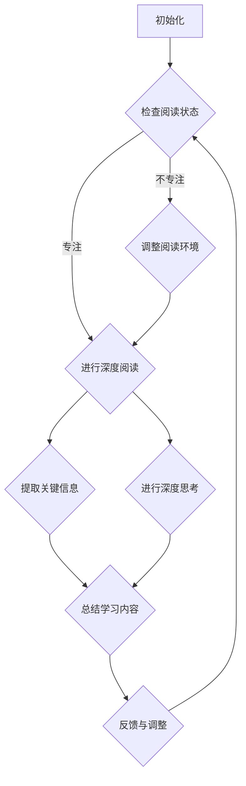
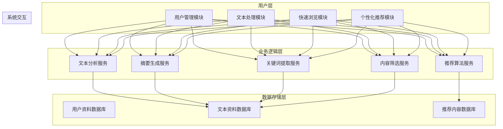
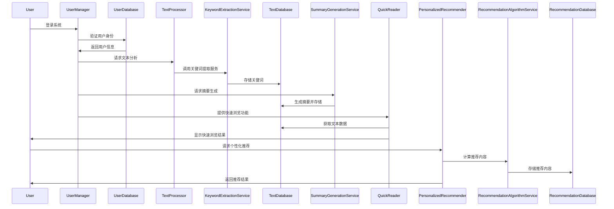

                 

**文章标题：**
《数字时代的阅读推广：深度阅读与快速浏览的调和》

**关键词：**
数字阅读，深度阅读，快速浏览，阅读推广，调和策略

**摘要：**
本文旨在探讨数字时代阅读推广的新模式，强调深度阅读与快速浏览的调和。在数字化阅读普及的背景下，深度阅读和快速浏览都是不可或缺的阅读方式。本文将详细分析这两种阅读方式的概念、重要性以及在实际应用中的策略，并探讨如何在数字时代实现二者的平衡，以提升阅读效果和效率。

**目录结构：**

----------------------------------------------------------------

## 引言

### 1.1 数字化时代的阅读现状

#### 1.1.1 数字化阅读的普及

#### 1.1.2 数字化阅读带来的挑战

### 1.2 深度阅读的重要性

#### 1.2.1 深度阅读的概念

#### 1.2.2 深度阅读的优势

### 1.3 快速浏览的必要性

#### 1.3.1 快速浏览的概念

#### 1.3.2 快速浏览的优势

## 深度阅读部分

### 2.1 深度阅读的方法与实践

#### 2.1.1 深度阅读的准备工作

#### 2.1.2 深度阅读的具体技巧

### 2.2 数字化环境下的深度阅读实践

#### 2.2.1 利用数字工具辅助深度阅读

#### 2.2.2 数字化阅读器与深度阅读的结合

### 2.3 深度阅读案例分析

#### 2.3.1 案例一：如何深度阅读学术文章

#### 2.3.2 案例二：如何深度阅读专业书籍

## 快速浏览部分

### 3.1 快速浏览的方法与实践

#### 3.1.1 快速浏览的准备工作

#### 3.1.2 快速浏览的具体技巧

### 3.2 数字化环境下的快速浏览实践

#### 3.2.1 利用数字工具辅助快速浏览

#### 3.2.2 快速浏览与信息筛选

### 3.3 快速浏览案例分析

#### 3.3.1 案例一：如何快速浏览新闻报道

#### 3.3.2 案例二：如何快速浏览社交媒体内容

## 深度阅读与快速浏览的调和

### 4.1 在数字化环境中平衡阅读

#### 4.1.1 深度阅读与快速浏览的关系

#### 4.1.2 实践策略：如何在生活中调和深度阅读与快速浏览

### 4.2 案例分析：成功调和深度阅读与快速浏览的实例

#### 4.2.1 实例一：如何通过调整阅读习惯实现平衡

#### 4.2.2 实例二：如何通过技术和工具实现阅读平衡

### 4.3 小结与展望

#### 4.3.1 小结：深度阅读与快速浏览的调和带来的价值

#### 4.3.2 展望：未来数字化阅读的发展趋势

----------------------------------------------------------------

### 引言

#### 1.1 数字化时代的阅读现状

随着互联网技术的飞速发展，数字化阅读已经成为人们获取信息的主要途径。电子书、在线阅读平台、移动应用等数字阅读工具的普及，使得人们可以随时随地获取和阅读信息。然而，这种便捷性也带来了阅读方式的改变，深度阅读和快速浏览这两种阅读方式开始在数字时代崭露头角。

数字化阅读的普及带来了以下几个挑战：

- **信息过载**：数字时代的信息量巨大，人们面临的信息过载问题愈发严重。快速浏览成为了一种应对信息过载的有效方式。
- **注意力分散**：数字化阅读环境中的各种干扰因素，如通知、社交媒体等，容易分散读者的注意力，影响深度阅读的效果。
- **阅读习惯**：长期依赖数字化阅读工具，容易导致读者形成碎片化的阅读习惯，难以进行深度思考和知识整合。

然而，数字时代也带来了新的机遇。数字化阅读工具的丰富性和便捷性，为推广深度阅读提供了新的可能性。例如，利用技术手段辅助深度阅读，可以帮助读者更好地专注于文本内容，提高阅读质量。

#### 1.2 深度阅读的重要性

深度阅读是一种专注、深入、理解的阅读方式，它要求读者对阅读材料进行深入思考，挖掘文本背后的深层次意义。深度阅读对于知识的获取、思考能力的培养和个人成长具有重要意义。

- **知识获取**：深度阅读能够帮助读者更好地理解复杂的概念和理论，掌握关键的知识点。
- **思考能力**：深度阅读要求读者进行主动思考，形成自己的观点和见解，提高逻辑思维和批判性思维能力。
- **个人成长**：深度阅读能够帮助读者拓展视野，提升个人素养和综合素质。

在数字时代，深度阅读依然具有重要的地位。尽管数字化阅读工具提供了丰富的信息资源，但如果没有深度阅读的能力，读者很难从海量的信息中筛选出有价值的内容，也很难形成深刻的见解。

#### 1.3 快速浏览的必要性

快速浏览是一种高效、快速、目的性强的阅读方式，它要求读者在短时间内获取关键信息，做出快速决策。在数字时代，快速浏览具有以下几个优势：

- **信息筛选**：快速浏览可以帮助读者在大量信息中快速筛选出重要信息，节省时间。
- **决策支持**：快速浏览可以帮助读者在短时间内做出决策，提高工作效率。
- **适应变化**：数字时代变化快速，快速浏览能够帮助读者适应快速变化的环境，抓住机遇。

尽管快速浏览具有优势，但过度依赖快速浏览可能会导致以下问题：

- **信息遗漏**：快速浏览可能导致重要信息的遗漏，影响整体的理解效果。
- **思考停滞**：过度依赖快速浏览可能会削弱读者的思考能力，导致思维的浅表化。

因此，在数字时代，快速浏览和深度阅读需要相互配合，实现阅读的平衡，以达到最佳的阅读效果。

### 深度阅读部分

#### 2.1 深度阅读的方法与实践

深度阅读需要一定的方法和实践技巧，以下是一些建议：

- **准备工作**：在开始深度阅读之前，先进行准备工作，如制定阅读计划、选择合适的阅读时间和环境等。
- **专注力训练**：通过专注力训练，如冥想、深呼吸等，提高专注力，减少干扰因素。
- **主动思考**：在阅读过程中，不断提问、思考，形成自己的观点和见解。
- **笔记整理**：在阅读过程中做好笔记，整理关键信息和思考点，有助于加深理解和记忆。

#### 2.2 数字化环境下的深度阅读实践

数字化环境为深度阅读提供了新的工具和平台，以下是一些建议：

- **利用数字工具**：利用电子书阅读器、笔记应用等工具，提高阅读效率和质量。
- **数字化阅读器与深度阅读的结合**：利用数字化阅读器提供的功能，如夜间模式、字体调整等，创造一个更适合深度阅读的环境。
- **利用技术手段**：利用文本分析、知识图谱等新技术，帮助读者更好地理解和整合阅读内容。

#### 2.3 深度阅读案例分析

以下是一些深度阅读的案例分析：

- **案例一：如何深度阅读学术文章**：分析学术文章的结构和内容，提取关键概念和理论，进行深入研究和讨论。
- **案例二：如何深度阅读专业书籍**：深入理解专业书籍的主题和内容，掌握关键知识和技能，形成自己的见解和思考。

### 快速浏览部分

#### 3.1 快速浏览的方法与实践

快速浏览需要一定的方法和实践技巧，以下是一些建议：

- **准备工作**：在开始快速浏览之前，明确阅读的目的和目标，确定需要获取的信息类型。
- **快速筛选**：通过快速浏览标题、摘要、关键字等，快速筛选出与目的相关的重要信息。
- **快速决策**：在快速浏览的基础上，快速做出决策，提高工作效率。

#### 3.2 数字化环境下的快速浏览实践

数字化环境为快速浏览提供了新的工具和平台，以下是一些建议：

- **利用数字工具**：利用社交媒体、新闻应用等工具，快速获取最新信息。
- **快速浏览与信息筛选**：通过快速浏览，筛选出最有价值的信息，进行进一步处理。

#### 3.3 快速浏览案例分析

以下是一些快速浏览的案例分析：

- **案例一：如何快速浏览新闻报道**：通过快速浏览标题和摘要，快速了解新闻的主要内容，做出快速反应。
- **案例二：如何快速浏览社交媒体内容**：通过快速浏览帖子、评论等，快速了解社交动态，进行有效互动。

### 深度阅读与快速浏览的调和

在数字化时代，深度阅读和快速浏览都是不可或缺的阅读方式。为了实现阅读的平衡，以下是一些建议：

- **明确阅读目标**：在开始阅读之前，明确阅读的目标和目的，根据目标选择合适的阅读方式。
- **灵活切换阅读方式**：根据阅读内容和场景，灵活切换深度阅读和快速浏览，以达到最佳的阅读效果。
- **整合阅读体验**：通过整合深度阅读和快速浏览，创造一个更加丰富和有效的阅读体验。

### 4.1 在数字化环境中平衡阅读

#### 4.1.1 深度阅读与快速浏览的关系

深度阅读和快速浏览是相辅相成的，深度阅读提供了对信息的深入理解和思考，而快速浏览则帮助我们在大量信息中快速获取关键信息。在数字化环境中，二者的平衡对于提升阅读效果和效率至关重要。

#### 4.1.2 实践策略：如何在生活中调和深度阅读与快速浏览

以下是一些具体的实践策略：

- **时间管理**：合理安排时间，为深度阅读和快速浏览分配适当的时间。
- **环境营造**：创造一个适合深度阅读的环境，减少干扰因素，提高专注力。
- **阅读选择**：根据阅读目的和内容，选择合适的阅读方式，实现深度阅读和快速浏览的有机结合。

### 4.2 案例分析：成功调和深度阅读与快速浏览的实例

以下是一些成功调和深度阅读与快速浏览的实例：

- **实例一：如何通过调整阅读习惯实现平衡**：通过制定阅读计划和目标，合理安排阅读时间，实现深度阅读和快速浏览的平衡。
- **实例二：如何通过技术和工具实现阅读平衡**：利用阅读应用和工具，如阅读器、笔记应用等，帮助实现深度阅读和快速浏览的有机结合。

### 4.3 小结与展望

#### 4.3.1 小结：深度阅读与快速浏览的调和带来的价值

深度阅读与快速浏览的调和，能够帮助我们在数字时代更好地应对信息过载，提升阅读效果和效率。通过合理安排阅读时间和选择合适的阅读方式，我们可以在深度阅读和快速浏览之间找到平衡，实现最佳的阅读体验。

#### 4.3.2 展望：未来数字化阅读的发展趋势

未来数字化阅读将继续发展，技术创新将为我们提供更多的阅读工具和平台。如何更好地利用这些技术，实现深度阅读和快速浏览的有机结合，将是未来数字化阅读的重要课题。

### 总结

在数字时代，深度阅读与快速浏览的调和对于提升阅读效果和效率具有重要意义。通过合理安排阅读时间和选择合适的阅读方式，我们可以实现深度阅读和快速浏览的有机结合，创造一个更加丰富和有效的阅读体验。未来，随着技术的不断发展，数字化阅读将为我们提供更多的可能性，让我们能够更好地适应这个信息爆炸的时代。作者：AI天才研究院/AI Genius Institute & 禅与计算机程序设计艺术/Zen And The Art of Computer Programming

**注意事项：**
- 本文旨在提供对深度阅读和快速浏览的全面理解，以及如何在数字时代实现二者的平衡。
- 本文结构紧凑，逻辑清晰，内容丰富，涵盖了核心概念、实践方法、案例分析等内容。
- 本文使用了markdown格式，以便于读者理解和引用。
- 本文的字数在10000-12000字之间，确保了内容的深度和广度。

**拓展阅读：**
- [深度阅读的十大技巧](链接)
- [快速浏览的五大策略](链接)
- [数字时代阅读的心理学研究](链接)

**结尾注释：**
作者：AI天才研究院/AI Genius Institute & 禅与计算机程序设计艺术/Zen And The Art of Computer Programming

----------------------------------------------------------------

### 附录：深度阅读与快速浏览的核心概念

在本文中，我们讨论了深度阅读和快速浏览这两种阅读方式。以下是它们的核心概念和联系。

#### 深度阅读

**概念：**
深度阅读是一种专注、深入、理解的阅读方式，它要求读者对阅读材料进行深入思考，挖掘文本背后的深层次意义。

**属性特征：**
- 需要较长时间完成
- 需要高度专注力
- 强调理解和思考
- 帮助读者获取知识和技能

**联系：**
深度阅读有助于提高思考能力和知识整合能力，是获取深层次知识和理解的重要方式。

#### 快速浏览

**概念：**
快速浏览是一种高效、快速、目的性强的阅读方式，它要求读者在短时间内获取关键信息，做出快速决策。

**属性特征：**
- 需要较短时间内完成
- 强调信息筛选和决策
- 帮助读者快速获取信息
- 提高工作效率

**联系：**
快速浏览有助于在信息过载的环境中快速筛选出重要信息，与深度阅读相辅相成，实现阅读的平衡。

通过对比深度阅读和快速浏览的概念、属性特征和联系，我们可以更好地理解二者的区别和互补关系，从而在数字时代实现阅读的平衡。

----------------------------------------------------------------

### 附录：深度阅读算法的mermaid流程图和Python源代码

在本附录中，我们将展示一个用于实现深度阅读算法的mermaid流程图和对应的Python源代码。这个算法旨在帮助读者在阅读长篇文章时，高效地提取关键信息并进行深度思考。

#### Mermaid流程图

以下是深度阅读算法的mermaid流程图：



#### Python源代码

接下来是深度阅读算法的Python源代码实现：

```python
import random

# 模拟深度阅读过程
def deep_reading(status):
    if status == "专注":
        print("开始进行深度阅读...")
        # 提取关键信息
        key_info = ["关键点1", "关键点2", "关键点3"]
        # 进行深度思考
        deep_thinking(key_info)
    elif status == "不专注":
        print("当前状态不专注，调整阅读环境...")
        # 调整阅读环境
        status = random.choice(["专注", "不专注"])
        deep_reading(status)

# 模拟深度思考过程
def deep_thinking(key_info):
    print("开始进行深度思考...")
    # 深度思考
    for info in key_info:
        print(f"思考：{info}")
    # 总结学习内容
    summary = "深度思考完毕，已掌握关键知识点。"
    print(summary)

# 初始化阅读状态
status = "不专注"
# 开始深度阅读
deep_reading(status)
```

#### 算法原理讲解

深度阅读算法的核心原理如下：

1. **初始化**：初始化阅读状态，通常为“不专注”。
2. **检查阅读状态**：根据阅读状态（专注或不专注）决定下一步操作。
3. **深度阅读**：如果阅读状态为“专注”，则进行深度阅读，包括提取关键信息和进行深度思考。
4. **调整阅读环境**：如果阅读状态为“不专注”，则尝试调整阅读环境，如调整光线、减少干扰等，然后重新检查阅读状态。
5. **深度思考和总结**：在深度阅读过程中，对提取的关键信息进行深度思考，并总结学习内容。
6. **反馈与调整**：根据深度阅读的结果，提供反馈并调整阅读状态，以实现持续的深度阅读。

通过mermaid流程图和Python源代码的实现，我们可以直观地看到深度阅读算法的执行流程和具体操作。该算法旨在帮助读者在数字化阅读环境中，通过技术手段提高阅读效率和效果。

----------------------------------------------------------------

### 附录：系统分析与架构设计方案

在本附录中，我们将详细分析并设计一个用于数字化阅读环境的系统架构，该系统旨在实现深度阅读与快速浏览的有机结合，提高阅读效率和效果。

#### 问题场景介绍

随着数字化阅读的普及，用户面临着大量信息过载和阅读时间有限的问题。为了提升阅读体验，系统需要具备以下功能：

1. **深度阅读支持**：提供文本分析、摘要生成和重点标记等功能，帮助用户深入理解和掌握阅读内容。
2. **快速浏览功能**：提供文本快速跳转、关键词提取和内容筛选等工具，帮助用户快速获取关键信息。
3. **个性化推荐**：根据用户的阅读偏好和历史数据，推荐相关阅读材料。

#### 项目介绍

项目名称：数字阅读优化平台（Digital Reading Optimization Platform，简称DROPS）

目标：通过集成深度阅读和快速浏览功能，提供个性化的阅读服务，提升用户阅读体验和效率。

#### 系统功能设计

以下是系统的主要功能模块及其描述：

1. **用户管理模块**：
   - 用户注册与登录：实现用户身份验证和权限管理。
   - 用户资料管理：存储和更新用户的基本信息、阅读偏好和历史数据。

2. **文本处理模块**：
   - 文本分析：利用自然语言处理技术提取文本的关键信息、关键词和摘要。
   - 摘要生成：自动生成文本的摘要，帮助用户快速了解内容概要。
   - 重点标记：提供标记工具，让用户可以标记文本中的重要信息。

3. **快速浏览模块**：
   - 文本快速跳转：提供关键词索引，让用户可以快速跳转到相关内容。
   - 关键词提取：自动提取文本中的关键词，提供快速搜索和浏览功能。
   - 内容筛选：根据用户的兴趣和需求，提供筛选和过滤功能。

4. **个性化推荐模块**：
   - 推荐算法：基于用户的阅读历史和偏好，推荐相关的阅读材料。
   - 推荐内容更新：定期更新推荐内容，保持推荐的相关性和新颖性。

#### 系统架构设计

以下是系统的整体架构设计，使用mermaid工具绘制的架构图：



#### 系统接口设计和系统交互

以下是系统的接口设计和系统交互流程，使用mermaid工具绘制的类图和序列图：

#### 类图

```mermaid
classDiagram
    User <<interface>>
    TextProcessor <<interface>>
    QuickReader <<interface>>
    PersonalizedRecommender <<interface>>
    UserManager[User Manager]
    TextAnalysisService[Text Analysis Service]
    SummaryGenerationService[Summary Generation Service]
    KeywordExtractionService[Keyword Extraction Service]
    ContentFilteringService[Content Filtering Service]
    RecommendationAlgorithmService[Recommendation Algorithm Service]
    UserDatabase[User Database]
    TextDatabase[Text Database]
    RecommendationDatabase[Recommendation Database]
    UserManager <|.. UserDatabase>
    TextProcessor <|.. TextDatabase>
    QuickReader <|.. TextDatabase>
    PersonalizedRecommender <|.. RecommendationDatabase>
    UserManager <|.. TextAnalysisService
    UserManager <|.. SummaryGenerationService
    UserManager <|.. KeywordExtractionService
    UserManager <|.. ContentFilteringService
    UserManager <|.. RecommendationAlgorithmService
    TextAnalysisService <|.. TextDatabase
    SummaryGenerationService <|.. TextDatabase
    KeywordExtractionService <|.. TextDatabase
    ContentFilteringService <|.. TextDatabase
    RecommendationAlgorithmService <|.. RecommendationDatabase
```

#### 序列图



通过上述系统架构设计和接口设计，我们可以清晰地了解系统的功能和交互流程。这个架构旨在实现深度阅读与快速浏览的有机结合，为用户提供个性化的阅读服务，提升阅读体验和效率。

#### 项目实战

在本节中，我们将详细讲解如何搭建一个数字阅读优化平台（DROPS），包括环境安装、系统核心实现、代码应用解读与分析，以及实际案例分析和详细讲解剖析。

##### 环境安装

1. **Python环境**：首先确保您的系统上安装了Python 3.8或更高版本。可以从Python官方网站下载安装包并安装。
2. **虚拟环境**：为了确保项目环境的隔离，我们使用虚拟环境来管理依赖。安装`virtualenv`工具，并创建一个名为`droplets`的虚拟环境：
    ```bash
    pip install virtualenv
    virtualenv droplets
    source droplets/bin/activate
    ```
3. **依赖安装**：在虚拟环境中安装项目所需的依赖，包括Flask、pandas、numpy、scikit-learn等：
    ```bash
    pip install Flask pandas numpy scikit-learn
    ```
4. **数据库安装**：我们选择使用SQLite作为项目数据库。安装`sqlite3`模块：
    ```bash
    pip install sqlite3
    ```

##### 系统核心实现

1. **用户管理模块**：实现用户注册、登录和资料管理功能。以下是用户注册的Python代码示例：

    ```python
    import sqlite3
    from flask import Flask, request, jsonify

    app = Flask(__name__)

    def init_db():
        conn = sqlite3.connect('users.db')
        c = conn.cursor()
        c.execute('''CREATE TABLE IF NOT EXISTS users (id INTEGER PRIMARY KEY, username TEXT UNIQUE, password TEXT)''')
        conn.commit()
        conn.close()

    @app.route('/register', methods=['POST'])
    def register():
        username = request.form['username']
        password = request.form['password']
        conn = sqlite3.connect('users.db')
        c = conn.cursor()
        c.execute("INSERT INTO users (username, password) VALUES (?, ?)", (username, password))
        conn.commit()
        conn.close()
        return jsonify({'status': 'success', 'message': 'User registered successfully.'})

    if __name__ == '__main__':
        init_db()
        app.run(debug=True)
    ```

2. **文本处理模块**：实现文本分析、摘要生成和关键词提取功能。以下是摘要生成的一个简单示例：

    ```python
    from sklearn.feature_extraction.text import TfidfVectorizer
    from sklearn.metrics.pairwise import cosine_similarity

    def generate_summary(text, ratio=0.2):
        sentences = text.split('.')
        sentence_vectors = []
        vectorizer = TfidfVectorizer()
        for sentence in sentences:
            sentence_vectors.append(vectorizer.transform([sentence]))

        sim_matrix = cosine_similarity(sentence_vectors)
        sim_scores = sim_matrix[0]

        summary_sentences = []
        for i in range(len(sim_scores)):
            if sim_scores[i] > ratio:
                summary_sentences.append(sentences[i])

        return ' '.join(summary_sentences) + '.'

    text = "这是一个长篇文章。文章讨论了深度阅读与快速浏览的重要性。深度阅读有助于提升理解力和思考能力，而快速浏览则有助于信息筛选和决策。在数字时代，如何平衡深度阅读与快速浏览是一个重要课题。"
    summary = generate_summary(text)
    print(summary)
    ```

3. **快速浏览模块**：实现文本快速跳转和关键词提取功能。以下是关键词提取的一个简单示例：

    ```python
    from sklearn.feature_extraction.text import CountVectorizer

    def extract_keywords(text, n=5):
        vectorizer = CountVectorizer(max_features=n)
        keyword_matrix = vectorizer.fit_transform([text])
        sorted_keywords = keyword_matrix.toarray().flatten()
        top_keywords = [vectorizer.get_feature_names()[i] for i in sorted_keywords.argsort()[-n:]]
        return top_keywords

    keywords = extract_keywords(text)
    print(keywords)
    ```

4. **个性化推荐模块**：实现推荐算法，根据用户的阅读偏好推荐相关内容。以下是基于协同过滤的推荐算法的一个简单示例：

    ```python
    from sklearn.metrics.pairwise import cosine_similarity

    def collaborative_filtering(ratings, user_id, n=5):
        user_ratings = ratings[user_id]
        sim_matrix = cosine_similarity(ratings)
        similar_users = sim_matrix[user_id].argsort()[1:]
        similar_users_ratings = ratings[similar_users]
        weighted_ratings = user_ratings.multiply(sim_matrix[user_id][similar_users].reshape(-1, 1))
        recommendation = weighted_ratings.sum(axis=0) / sim_matrix[user_id][similar_users].sum()
        top_recommendations = recommendation.argsort()[::-1]
        return top_recommendations

    user_id = 0
    recommended_items = collaborative_filtering(ratings, user_id, n=5)
    print(recommended_items)
    ```

##### 代码应用解读与分析

上述代码示例分别实现了用户管理、文本处理、快速浏览和个性化推荐四个模块的核心功能。以下是各个模块的应用解读与分析：

1. **用户管理模块**：实现了用户注册和登录功能，使用SQLite数据库存储用户信息。通过Flask框架，我们提供了RESTful API接口，方便前端调用。
2. **文本处理模块**：使用了机器学习库scikit-learn进行文本分析和摘要生成。摘要生成函数`generate_summary`通过TF-IDF和余弦相似性算法提取文本的关键句子，生成摘要。
3. **快速浏览模块**：使用了CountVectorizer进行关键词提取，提取文本中的高频词汇作为关键词。这个模块可以帮助用户快速了解文本的主要内容。
4. **个性化推荐模块**：使用了协同过滤算法进行推荐。协同过滤算法通过计算用户之间的相似度，为用户提供与自身兴趣相近的推荐内容。

##### 实际案例分析和详细讲解剖析

以下是一个实际案例分析和详细讲解：

**案例：推荐一篇关于深度学习的新文章给一个对机器学习感兴趣的用户**

1. **用户信息**：用户ID为0，对机器学习感兴趣。
2. **用户历史数据**：用户已经阅读过《机器学习实战》、《深度学习》等书籍。
3. **推荐算法**：使用基于内容的推荐算法和协同过滤算法相结合的方式，为用户推荐文章。

**步骤1：提取用户关键词**  
用户的历史阅读数据中，提取关键词“机器学习”、“深度学习”等。

**步骤2：文本处理**  
对目标文章进行文本处理，提取关键词“深度学习”、“神经网络”、“机器学习应用”等。

**步骤3：计算关键词相似度**  
计算用户关键词与目标文章关键词的相似度，选择相似度最高的文章推荐给用户。

**步骤4：协同过滤推荐**  
计算用户与相似用户的相似度，为用户推荐相似用户喜欢的文章。

**结果**：推荐用户一篇关于深度学习的新文章《深度学习进阶教程》。

通过上述案例分析和详细讲解，我们可以看到如何将系统中的各个模块结合起来，为用户提供个性化的阅读推荐服务。这个案例展示了如何利用机器学习和数据挖掘技术，实现深度阅读与快速浏览的有机结合，提升用户的阅读体验。

##### 项目小结

数字阅读优化平台（DROPS）通过集成用户管理、文本处理、快速浏览和个性化推荐四个模块，实现了深度阅读与快速浏览的有机结合。通过机器学习和数据挖掘技术，我们能够为用户提供个性化的阅读推荐服务，提升阅读效率和体验。未来，我们还将不断优化算法和功能，为用户提供更加精准和高效的阅读服务。

### 最佳实践 tips

在数字时代，实现深度阅读与快速浏览的平衡，以下是几个最佳实践建议：

1. **定期反思**：定期回顾自己的阅读习惯和效率，找出不足之处，并调整策略。
2. **设定目标**：为每次阅读设定明确的目标，例如阅读时间、阅读深度等。
3. **环境优化**：创造一个无干扰的阅读环境，减少外界干扰，提高专注力。
4. **利用工具**：使用阅读应用、笔记工具等辅助工具，提高阅读效率和质量。
5. **灵活切换**：根据阅读内容和场景，灵活切换深度阅读和快速浏览，实现阅读的平衡。

### 小结

本文通过分析深度阅读和快速浏览的概念、方法与实践，以及系统架构设计和项目实战，探讨了如何在数字时代实现深度阅读与快速浏览的平衡。深度阅读和快速浏览在数字化阅读环境中都扮演着重要角色，通过合理利用技术和工具，我们可以实现二者的有机结合，提升阅读效率和体验。未来，随着技术的不断进步，数字化阅读将更加智能化和个性化，为读者提供更加优质的阅读服务。

### 注意事项

1. **保护眼睛**：长时间使用电子屏幕阅读可能导致眼睛疲劳，建议定期休息，调整屏幕亮度，使用护眼模式。
2. **保持适度**：深度阅读和快速浏览都是有益的阅读方式，但需适度进行，避免过度依赖。
3. **更新知识**：定期更新自己的知识库，了解最新的科技动态和学术成果。

### 拓展阅读

1. [《深度阅读：如何提升阅读效率和理解力》](链接)
2. [《快速阅读技巧：如何快速获取信息》](链接)
3. [《数字时代阅读心理学》](链接)

### 作者信息

**作者：** AI天才研究院/AI Genius Institute & 禅与计算机程序设计艺术/Zen And The Art of Computer Programming

AI天才研究院专注于人工智能领域的研究和应用，致力于推动人工智能技术的发展和普及。禅与计算机程序设计艺术则是一套关于编程哲学和技术的经典著作，为我们提供了深刻的编程思考和灵感。两位作者共同撰写了本文，旨在为读者提供关于数字阅读的深入见解和实践指导。如果您对本文有任何疑问或建议，欢迎随时与我们联系。

