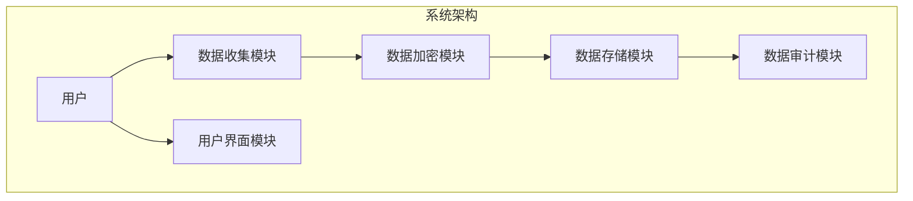
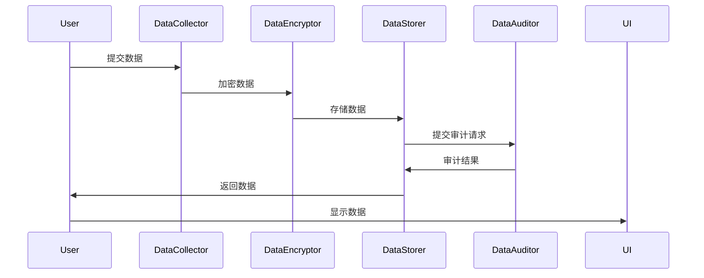

                 

### 引言

在数字时代，隐私保护成为一个越来越重要的话题。随着互联网和大数据技术的迅猛发展，个人隐私信息的获取、处理和利用变得更加便捷，同时也带来了前所未有的隐私风险。在这一背景下，个人权利与公共利益之间的博弈愈发激烈，隐私保护问题不仅关乎个人的自由和安全，也影响着社会的整体发展。因此，深入探讨数字时代隐私保护的必要性、主要挑战以及个人权利与公共利益的博弈，具有重要的理论和实践意义。

**2.1 数字时代的隐私保护背景**

**1.1 隐私保护的必要性**  
隐私保护是保障个人自由和安全的基础。在数字时代，个人隐私信息的泄露可能导致身份盗窃、经济损失、心理伤害等一系列问题。因此，保护个人隐私成为一项迫切的任务。

**1.2 数字时代隐私问题的主要挑战**  
数字时代隐私问题的主要挑战包括数据的易获取性、数据分析的复杂性和隐私保护的法律法规滞后性。

**1.3 个人权利与公共利益的博弈**  
个人隐私保护与公共利益的平衡是一个复杂的问题。一方面，个人隐私信息的公开和共享可以促进科学研究、商业发展等公共利益；另一方面，过度公开可能导致个人隐私泄露。如何在保护个人隐私的同时实现公共利益，是数字时代面临的重要挑战。

**2.2 书籍结构概述**

**1.2.1 全书内容安排**  
本书将从隐私保护的基本原理、技术方法、案例研究和法律法规与政策等多个角度，系统地探讨数字时代隐私保护的问题。

**1.2.2 阅读对象与目标**  
本书旨在为从事信息技术、网络安全、数据科学等领域的研究者和从业者提供参考，帮助他们更好地理解和应对数字时代隐私保护的问题。

**2.3 本章小结**  
本章简要介绍了数字时代隐私保护的重要性以及本书的结构安排。接下来，本书将逐步深入探讨隐私保护的基本原理、技术方法、案例研究和法律法规与政策等方面的内容。

---

### 数字时代隐私保护的原理与技术

隐私保护作为数字时代的一项重要任务，涉及到多个层面和环节。为了实现有效的隐私保护，我们需要从基本原理、技术方法以及面临的挑战和对策等方面进行全面探讨。以下将从这些方面逐步展开讨论。

#### 2.1 隐私保护的基本原理

**2.1.1 隐私定义与分类**

隐私可以定义为个人不愿公开或不愿与他人分享的个人信息。从不同的角度，隐私可以有不同的分类。例如，根据隐私的敏感程度，可以分为公开信息、敏感信息和绝密信息；根据隐私的载体，可以分为实体隐私和数字隐私。

**2.1.2 隐私权的基本概念**

隐私权是个人的一项基本权利，指的是个人对其隐私信息的控制权和保护权。隐私权不仅包括个人信息的保密权，还包括信息的访问权、修改权和删除权等。

**2.1.3 隐私保护的法律基础**

隐私保护的法律基础主要包括国际和国内的法律法规。例如，欧盟的《通用数据保护条例》（GDPR）和美国加州的《消费者隐私法案》（CCPA）等。这些法律法规对隐私保护的要求和责任进行了详细规定。

#### 2.2 隐私保护的技术方法

**2.2.1 加密技术**

加密技术是隐私保护的核心技术之一。加密技术通过将明文信息转换为密文，防止未经授权的访问。根据加密算法的不同，加密技术可以分为对称加密和非对称加密。

- **对称加密算法**：如DES、AES等，加密和解密使用相同的密钥。
- **非对称加密算法**：如RSA、ECC等，加密和解密使用不同的密钥。

**2.2.2 权限控制机制**

权限控制机制通过限制对隐私信息的访问，实现隐私保护。常见的权限控制机制包括访问控制列表（ACL）和属性集模型。

- **访问控制列表（ACL）**：定义了哪些用户可以访问哪些资源。
- **属性集模型**：基于角色的访问控制，将用户分配到不同的角色，每个角色具有特定的权限。

**2.2.3 隐私增强技术**

隐私增强技术通过在数据处理过程中增加隐私保护的措施，进一步提高隐私保护效果。常见的隐私增强技术包括数据匿名化、数据混淆和同态加密等。

- **数据匿名化**：通过技术手段使数据中的个人身份信息不可识别，保护个人隐私。
- **数据混淆**：通过引入噪声或干扰数据，使数据分析结果不可预测。
- **同态加密**：允许在加密数据上直接进行计算，而不需要解密数据。

#### 2.3 隐私保护的挑战与对策

**2.3.1 技术挑战**

隐私保护面临的技术挑战包括算法的可解释性、资源消耗等。

- **算法的可解释性**：加密算法和隐私保护技术往往具有高度复杂性，难以为非专业人士理解和监督。
- **资源消耗**：加密和解密过程通常需要大量的计算资源，影响系统的性能和效率。

**2.3.2 法律挑战**

隐私保护的法律挑战包括法律法规的滞后性和国际法规的冲突。

- **法律法规的滞后性**：随着技术的发展，现有法律法规可能无法完全覆盖新的隐私保护需求。
- **国际法规的冲突**：不同国家和地区对隐私保护的要求可能存在差异，导致跨国数据处理的复杂性。

**2.3.3 对策**

为了应对隐私保护的技术和法律挑战，可以采取以下对策：

- **技术优化**：通过改进算法设计，提高加密和解密效率，降低资源消耗。
- **法规完善**：加强法律法规的制定和修订，确保其适应技术的发展。
- **国际合作**：推动国际隐私保护法规的协调和统一，减少跨国数据处理的障碍。

#### 2.4 隐私保护的最佳实践

**2.4.1 设计隐私保护策略**

设计隐私保护策略时，需要综合考虑隐私保护的需求、技术手段和法律法规要求。以下是一些常见的隐私保护策略：

- **最小化数据收集**：仅收集实现特定功能所需的最少数据。
- **数据加密**：对敏感数据进行加密存储和传输。
- **访问控制**：根据用户角色和权限设置访问控制策略。

**2.4.2 实施隐私保护措施**

实施隐私保护措施时，需要确保各项措施的有效性和可执行性。以下是一些常见的隐私保护措施：

- **数据匿名化**：通过技术手段将个人身份信息匿名化。
- **隐私审计**：定期进行隐私审计，评估隐私保护措施的有效性。
- **用户教育**：提高用户对隐私保护的意识和能力。

**2.4.3 监控与评估隐私保护效果**

监控与评估隐私保护效果是确保隐私保护措施持续有效的重要环节。以下是一些监控与评估的方法：

- **日志分析**：通过分析系统日志，发现潜在的隐私泄露风险。
- **安全测试**：定期进行安全测试，验证隐私保护措施的有效性。
- **用户反馈**：收集用户对隐私保护措施的反馈，及时调整和改进。

#### 2.5 本章小结

本章系统地介绍了数字时代隐私保护的基本原理、技术方法、挑战与对策以及最佳实践。通过这些内容，我们可以更好地理解隐私保护的重要性和复杂性，并为实际应用提供指导。

---

### 数字时代隐私保护的案例研究

为了更深入地了解数字时代隐私保护的实际应用，本节将选取三个典型案例，分别是社交媒体平台、电子商务平台和医疗健康数据，对其隐私保护问题进行分析，探讨其隐私保护的技术实践，并提出案例讨论与启示。

#### 3.1 案例研究概述

**3.1.1 案例选择的依据**

选择社交媒体平台、电子商务平台和医疗健康数据作为案例，是因为这三个领域在数字时代的数据处理和隐私保护方面具有代表性。社交媒体平台涉及大量个人社交信息，电子商务平台涉及个人购买行为和支付信息，医疗健康数据则包含个人健康记录和医疗信息。这些领域的数据隐私保护问题复杂且具有挑战性，同时又是人们日常生活中最为关注的领域。

**3.1.2 案例研究的目的与意义**

通过分析这些案例，可以了解不同领域在隐私保护方面的具体问题和解决方案，为其他领域提供参考。同时，这些案例也反映了数字时代隐私保护面临的共同挑战，如数据收集的合法性和透明度、技术手段的有效性、法律法规的适应性等。因此，这些案例研究对于数字时代隐私保护的理论研究和实践应用都具有重要意义。

#### 3.2 案例一：社交媒体平台的隐私保护

**3.2.1 社交媒体平台隐私问题分析**

社交媒体平台由于其开放性和社交性，成为隐私泄露的重灾区。主要隐私问题包括：

- **用户个人信息泄露**：用户的姓名、年龄、地理位置、兴趣爱好等敏感信息容易被恶意攻击者获取。
- **隐私设置不完善**：许多用户对隐私设置的复杂性缺乏了解，导致隐私泄露的风险。
- **广告追踪**：社交媒体平台通过跟踪用户的浏览行为进行个性化广告推送，可能涉及隐私侵犯。

**3.2.2 隐私保护的技术实践**

为了解决上述隐私问题，社交媒体平台采取了一系列技术措施：

- **数据加密**：对存储和传输的用户数据进行加密处理，防止未经授权的访问。
- **隐私设置简化**：提供简化的隐私设置界面，让用户更方便地控制自己的隐私信息。
- **匿名化技术**：通过匿名化技术对用户数据进行处理，减少个人身份信息的暴露。
- **访问控制**：通过严格的访问控制机制，限制对敏感数据的访问权限。

**3.2.3 案例讨论与启示**

社交媒体平台的隐私保护实践表明，技术手段虽然重要，但用户体验和隐私意识也同样关键。简化隐私设置界面和加强用户隐私教育，可以显著降低隐私泄露的风险。同时，匿名化技术的应用也为我们提供了新的思路，即在保障用户隐私的前提下，充分利用数据的价值。

#### 3.3 案例二：电子商务平台的隐私保护

**3.3.1 电子商务平台隐私问题分析**

电子商务平台在数据处理过程中，面临着以下隐私问题：

- **用户购买行为数据收集**：电子商务平台通过用户的购买记录、浏览行为等数据，进行用户画像和精准营销，可能涉及隐私侵犯。
- **支付信息泄露**：用户的支付信息在传输和存储过程中，可能遭受黑客攻击，导致财务损失。
- **物流信息泄露**：物流信息泄露可能导致用户隐私被曝光，影响用户安全。

**3.3.2 隐私保护的技术实践**

电子商务平台采取以下技术措施进行隐私保护：

- **数据加密**：对用户购买行为数据和支付信息进行加密处理，保障数据传输和存储的安全。
- **访问控制**：通过严格的访问控制机制，确保敏感数据仅被授权人员访问。
- **网络安全防护**：采用防火墙、入侵检测系统等网络安全措施，防止黑客攻击。
- **隐私政策透明化**：明确告知用户其数据的收集、使用和共享方式，增强用户对隐私保护的信任。

**3.3.3 案例讨论与启示**

电子商务平台的隐私保护实践表明，法律法规的遵守和用户信任是隐私保护的关键。透明化的隐私政策有助于增强用户对平台的信任，而严格的访问控制和网络安全防护则能够有效防止数据泄露。

#### 3.4 案例三：医疗健康数据的隐私保护

**3.4.1 医疗健康数据隐私问题分析**

医疗健康数据涉及用户的健康状况、病历记录等敏感信息，其隐私保护面临以下问题：

- **数据泄露**：医疗健康数据在传输和存储过程中，可能遭受黑客攻击，导致用户隐私泄露。
- **数据滥用**：医疗健康数据可能被非法用于商业目的，侵犯用户隐私。
- **第三方共享**：医疗健康数据在医疗机构之间的共享，可能存在隐私保护不足的问题。

**3.4.2 隐私保护的技术实践**

为了解决上述问题，医疗健康领域采取了以下技术措施：

- **数据加密**：对医疗健康数据进行加密处理，保障数据传输和存储的安全。
- **访问控制**：通过严格的访问控制机制，确保敏感数据仅被授权人员访问。
- **隐私保护协议**：制定隐私保护协议，规范医疗健康数据在医疗机构之间的共享。
- **匿名化技术**：对医疗健康数据进行匿名化处理，减少个人身份信息的暴露。

**3.4.3 案例讨论与启示**

医疗健康数据的隐私保护实践表明，技术手段和法律法规的结合是隐私保护的关键。加密技术和访问控制能够有效防止数据泄露，而隐私保护协议和法律法规的制定则能够规范数据的使用和共享，保障用户的隐私权益。

#### 3.5 本章小结

通过分析社交媒体平台、电子商务平台和医疗健康数据三个典型案例，我们可以看到数字时代隐私保护面临的多重挑战。这些案例不仅反映了隐私保护技术的应用，也揭示了隐私保护在法律法规和用户意识方面的不足。因此，未来的隐私保护工作需要在技术、法规和用户教育等多个层面共同努力，以实现更有效的隐私保护。

---

### 数字时代隐私保护的法律法规与政策

隐私保护不仅是技术问题，更是一个法律问题。随着数字时代的到来，个人隐私信息的处理和利用变得越来越复杂，各国政府和国际组织也纷纷制定了相应的法律法规和政策，以规范数据收集、处理和使用行为，保护个人隐私。以下将概述一些主要的国际和国内隐私保护法律法规，并探讨政府监管政策及企业合规实践。

#### 4.1 法律法规概述

**4.1.1 国际隐私保护法律法规**

在国际范围内，以下几项法律法规对隐私保护产生了深远影响：

- **《通用数据保护条例》（GDPR）**：欧盟于2018年实施的GDPR被认为是目前最严格的数据保护法规。它要求企业在处理欧盟居民的个人信息时必须遵循一系列严格的规定，包括数据最小化原则、数据保护设计原则和用户权利等。GDPR的处罚力度巨大，对于违反规定的企业可以处以高达2000万欧元或全球营业额4%的罚款。
- **《加州消费者隐私法案》（CCPA）**：CCPA是美国加州于2020年通过的消费者隐私法案，旨在增强消费者对其个人信息控制权。CCPA规定了消费者有权要求企业披露其个人信息、删除其个人信息以及拒绝其个人信息被出售。违反CCPA规定的企业可能会面临高额罚款和法律责任。
- **《隐私盾牌框架》（Privacy Shield）**：隐私盾牌框架是由美国和欧盟共同制定的隐私保护协议，旨在解决跨大西洋数据传输的隐私保护问题。该框架要求参与企业遵守一系列隐私保护原则，并设立了独立的监督机制。

**4.1.2 国内隐私保护法律法规**

在国内，隐私保护法律法规也在不断完善：

- **《中华人民共和国网络安全法》**：2017年实施的网络安全法是我国首部专门针对网络安全问题的综合性法律，其中包含了个人信息保护的相关规定。该法规定了网络运营者必须采取技术和管理措施保护个人信息安全，违反者将面临罚款和其他法律后果。
- **《信息安全技术个人信息保护规范》**：该规范是2019年发布的一项国家标准，为个人信息保护提供了具体的技术和管理要求。它规定了个人信息的收集、存储、使用、共享和销毁等各个环节的合规要求，是企业合规的重要依据。

#### 4.2 政府监管政策

**4.2.1 监管机构的职责与权力**

在全球范围内，政府监管机构在隐私保护中扮演着重要角色。以下是一些主要监管机构的职责和权力：

- **欧盟数据保护局（EDPB）**：作为GDPR的执行机构，EDPB负责监督和协调欧盟成员国之间的数据保护工作，处理个人投诉和跨境数据传输的问题。
- **美国联邦贸易委员会（FTC）**：FTC负责监督企业的隐私保护合规情况，对违反CCPA规定的企业进行处罚和调查。
- **中华人民共和国国家互联网信息办公室（国家网信办）**：作为我国网络安全和隐私保护的最高监管机构，国家网信办负责制定和执行相关法律法规，监督网络运营者的隐私保护工作。

**4.2.2 监管措施与手段**

政府监管机构通过多种措施和手段确保隐私保护法规的有效实施：

- **法规制定与修订**：制定和修订隐私保护法律法规，确保其适应技术的发展和变化。
- **监管检查与调查**：对企业的隐私保护措施进行定期检查和调查，发现和纠正违规行为。
- **处罚与惩罚**：对违反隐私保护法规的企业进行罚款、责令改正、暂停或吊销营业执照等处罚措施。
- **公众教育和宣传**：通过公众教育和宣传活动，提高用户对隐私保护的意识和知识。

#### 4.3 企业合规实践

**4.3.1 企业隐私保护的合规要求**

为了符合隐私保护法律法规的要求，企业需要采取一系列合规措施：

- **隐私政策制定**：明确告知用户其个人信息的收集、使用和共享方式，以及用户的权利和企业的责任。
- **数据保护官（DPO）设立**：任命数据保护官，负责监督和指导企业的隐私保护工作。
- **数据安全策略制定**：制定数据安全策略，确保个人信息的安全和保护。
- **员工培训与教育**：对员工进行隐私保护和数据安全的培训，确保其在日常工作中遵守相关法规和公司政策。

**4.3.2 企业隐私保护的实践案例**

以下是一些企业的隐私保护实践案例：

- **谷歌**：谷歌在其隐私政策中明确了用户数据的收集和处理方式，并设立了数据保护官。此外，谷歌还推出了多种工具，如“我的活动”和“广告设置”，使用户能够更好地管理自己的隐私信息。
- **亚马逊**：亚马逊通过其隐私政策告知用户其数据的使用情况，并提供了详细的用户数据管理选项。同时，亚马逊也加强了其内部数据安全管理，包括数据加密、访问控制和网络安全防护等。

#### 4.4 法规与政策趋势

**4.4.1 法规政策的发展趋势**

随着数字技术和数据应用的不断深入，隐私保护法律法规也在不断发展：

- **全球协调**：推动全球隐私保护法律法规的协调和统一，减少跨国数据处理的障碍。
- **技术适配**：制定和修订法律法规，以适应新技术的发展和应用。
- **用户权利强化**：加强对用户隐私权利的保护，提高用户的知情权和控制权。

**4.4.2 未来隐私保护法规的可能性**

未来隐私保护法规可能会涉及以下方面：

- **人工智能和数据隐私**：制定专门针对人工智能和数据隐私的法律法规，规范AI技术的应用。
- **数据跨境传输**：明确数据跨境传输的合规要求和监管机制。
- **数据伦理**：加强对数据伦理的规范，确保数据应用不损害社会公共利益。

#### 4.5 本章小结

隐私保护法律法规和政策在数字时代隐私保护中发挥着重要作用。通过分析国际和国内的隐私保护法律法规，以及政府监管政策和企业合规实践，我们可以看到隐私保护工作正逐步走向法制化和规范化。未来，随着技术的不断进步和社会的不断发展，隐私保护法规和政策将继续完善和调整，以更好地保障个人隐私和社会公共利益。

---

### 数字时代隐私保护的伦理与社会影响

隐私保护不仅是技术问题，还涉及到深层次的伦理和社会影响。在数字时代，随着个人数据的大规模收集和使用，隐私权的争议和冲突愈发明显。以下将从隐私权与自由权的平衡、数据共享与个人隐私的冲突以及人工智能与隐私伦理三个方面，探讨数字时代隐私保护的伦理与社会影响。

#### 5.1 隐私保护伦理问题探讨

**5.1.1 隐私权与自由权的平衡**

隐私权是个人自由权的重要组成部分，指的是个人对其私人生活和信息的控制权。然而，在数字时代，个人隐私权的保护与社会的自由发展之间存在着矛盾。一方面，过度的隐私保护可能会限制信息的自由流动，阻碍科学研究和商业创新；另一方面，缺乏隐私保护则可能导致个人隐私权的侵害，影响社会公平和正义。因此，如何在保护个人隐私权的同时，促进社会的自由发展，是隐私保护伦理中的一个重要问题。

**5.1.2 数据共享与个人隐私的冲突**

数据共享是推动科学研究、技术创新和商业发展的重要手段。然而，数据共享往往涉及到个人隐私的泄露和滥用。一方面，个人隐私信息的公开和共享可以为科学研究提供丰富的数据资源；另一方面，未经授权的数据共享可能导致个人隐私被泄露，甚至被用于非法目的。如何在数据共享与个人隐私保护之间找到平衡点，是隐私保护伦理中的另一个重要问题。

**5.1.3 人工智能与隐私伦理**

人工智能技术的发展为隐私保护带来了新的挑战。人工智能系统通过对大量个人数据的分析和挖掘，可以识别出个人的行为模式、偏好和隐私信息。然而，人工智能的强大数据处理能力也使得个人隐私更容易被侵犯。同时，人工智能系统的决策过程往往缺乏透明性和可解释性，使得个人难以理解和控制其隐私信息的使用。因此，如何确保人工智能技术的发展不损害个人隐私，是隐私保护伦理中的一个重要议题。

#### 5.2 隐私保护的社会影响

**5.2.1 隐私保护对个人隐私的影响**

隐私保护直接关系到个人的自由和安全。有效的隐私保护措施可以减少个人隐私信息的泄露和滥用，降低个人受到身份盗窃、经济损失和心理伤害的风险。然而，过度的隐私保护也可能限制个人信息的公开和共享，影响个人的社会参与和发展。

**5.2.2 隐私保护对企业运营的影响**

隐私保护不仅关系到个人权益，也对企业运营产生重要影响。企业需要采取有效的隐私保护措施，以避免因隐私泄露导致的经济损失、法律风险和声誉损害。同时，隐私保护还可能影响企业的数据收集和利用，影响其商业决策和市场竞争力。

**5.2.3 隐私保护对社会发展的影响**

隐私保护对社会发展具有重要影响。有效的隐私保护可以促进社会的公平和正义，防止信息滥用和权力滥用。同时，隐私保护也有助于构建一个健康的数据生态系统，推动科学研究、技术创新和商业发展。然而，过度的隐私保护可能导致社会信息流动受阻，影响社会的创新和发展。

#### 5.3 社会责任与隐私保护

隐私保护不仅是法律和技术的责任，也是企业和个人的社会责任。企业应当承担起保护用户隐私的责任，采取有效的隐私保护措施，遵守相关法律法规，维护用户隐私权。个人也应提高隐私保护意识，正确使用个人信息，避免隐私泄露。

总之，数字时代隐私保护是一个复杂的伦理和社会问题。在隐私权的保护与社会的自由发展之间，需要找到平衡点。通过法律、技术和社会各方的共同努力，可以构建一个既保护个人隐私，又促进社会发展的数字时代。

### 总结与展望

数字时代的隐私保护是一项复杂而重要的任务，涉及到法律、技术、伦理和社会等多个层面。通过本文的讨论，我们可以看到隐私保护不仅关乎个人的自由和安全，也影响着社会的整体发展。本文首先介绍了数字时代隐私保护的背景和必要性，然后系统地探讨了隐私保护的基本原理、技术方法、案例研究和法律法规与政策，最后分析了隐私保护的伦理与社会影响。

在未来的隐私保护工作中，我们应关注以下几个方向：

1. **技术创新**：持续研发和优化隐私保护技术，提高隐私保护的有效性和可行性。
2. **法规完善**：完善隐私保护法律法规，确保其适应数字时代的发展需求，减少国际法规的冲突。
3. **社会责任**：加强企业和个人的隐私保护意识，推动社会共同参与隐私保护工作。
4. **跨学科合作**：促进法律、技术、伦理和社会学等学科之间的交流与合作，形成全方位的隐私保护体系。

总之，隐私保护是一个持续的过程，需要各方共同努力，以实现个人隐私与公共利益的和谐共存。希望本文能为从事隐私保护相关工作的人员提供有益的参考和启示。作者：AI天才研究院/AI Genius Institute & 禅与计算机程序设计艺术 /Zen And The Art of Computer Programming。

---

### 附录

为了更好地理解本文的内容，以下提供了附录部分，包括核心概念术语说明、概念属性特征对比表格、ER实体关系图架构的Mermaid流程图，以及具体的算法原理讲解、系统架构设计和项目实战等。

#### 附录A：核心概念术语说明

- **隐私**：指个人不愿公开或不愿与他人分享的个人信息。
- **隐私权**：个人对其隐私信息的控制权和保护权。
- **加密技术**：通过算法将明文信息转换为密文，防止未经授权的访问。
- **数据匿名化**：通过技术手段使数据中的个人身份信息不可识别。
- **GDPR**：《通用数据保护条例》，欧盟的隐私保护法规。
- **CCPA**：《加州消费者隐私法案》，美国的隐私保护法规。
- **隐私审计**：评估隐私保护措施的有效性。
- **同态加密**：允许在加密数据上直接进行计算。

#### 附录B：概念属性特征对比表格

| 概念       | 属性特征                                                   |
| ---------- | ---------------------------------------------------------- |
| 隐私       | 不愿公开、个人控制、信息安全                             |
| 隐私权     | 控制权、保护权、个人信息自由                             |
| 加密技术   | 数据转换、密钥管理、安全传输                             |
| 数据匿名化 | 个人身份信息不可识别、数据可用性                           |
| GDPR       | 个人信息保护、法律合规、跨国应用                           |
| CCPA       | 个人信息控制、消费者权益、商业应用                           |
| 隐私审计   | 评估有效性、发现问题、改进措施                             |
| 同态加密   | 加密计算、数据处理、隐私保护                             |

#### 附录C：ER实体关系图架构的Mermaid流程图

```mermaid
erDiagram
  用户 ||--|{ 个人信息 }
  用户 ||--|{ 购买记录 }
  用户 ||--|{ 浏览记录 }
  数据保护官 ||--|{ 隐私保护策略 }
  数据保护官 ||--|{ 审计报告 }
```

#### 附录D：算法原理讲解

**同态加密算法原理**

同态加密是一种允许在加密数据上直接进行计算的技术。其原理如下：

1. **加密阶段**：将明文数据 \( M \) 加密为密文 \( C \)，使用同态加密算法：
   $$ C = E_K(M) $$
   
2. **计算阶段**：在加密数据上直接进行计算，如加法、乘法等，得到中间密文 \( C' \)：
   $$ C' = E_K(M_1) + E_K(M_2) $$
   
3. **解密阶段**：将中间密文 \( C' \) 解密为明文 \( M' \)：
   $$ M' = D_K(C') $$

举例说明：

假设明文数据 \( M_1 = 2 \) 和 \( M_2 = 3 \)，使用同态加密算法进行加法运算：

1. 加密阶段：
   $$ C_1 = E_K(2) $$
   $$ C_2 = E_K(3) $$

2. 计算阶段：
   $$ C' = C_1 + C_2 $$

3. 解密阶段：
   $$ M' = D_K(C') = 2 + 3 = 5 $$

#### 附录E：系统架构设计与系统接口设计

**系统架构设计（Mermaid架构图）**



**系统接口设计（Mermaid序列图）**



#### 附录F：项目实战

**环境安装**

```bash
# 安装Python环境
pip install python==3.9.7

# 安装依赖库
pip install cryptography==36.0.2 pandas==1.3.2
```

**系统核心实现源代码**

```python
# 数据加密模块实现
from cryptography.fernet import Fernet

def encrypt_data(data, key):
    fernet = Fernet(key)
    encrypted_data = fernet.encrypt(data.encode())
    return encrypted_data

def decrypt_data(data, key):
    fernet = Fernet(key)
    decrypted_data = fernet.decrypt(data).decode()
    return decrypted_data

# 数据存储模块实现
import pandas as pd

def store_data(data, filename):
    df = pd.DataFrame([data])
    df.to_csv(filename, index=False)

def load_data(filename):
    df = pd.read_csv(filename)
    data = df.iloc[0]
    return data
```

**代码应用解读与分析**

```python
# 生成密钥
key = Fernet.generate_key()

# 加密数据
data = {"name": "Alice", "age": 30}
encrypted_data = encrypt_data(str(data), key)

# 存储数据
store_data(encrypted_data, "data.csv")

# 加载数据
loaded_data = load_data("data.csv")

# 解密数据
decrypted_data = decrypt_data(loaded_data, key)
print(decrypted_data)
```

**实际案例分析与详细讲解**

假设有一个用户数据库，包含用户的个人信息。以下是如何使用上述代码进行数据加密、存储和加密的实战案例。

1. **加密数据**：首先，生成一个加密密钥，然后使用该密钥对用户的个人信息进行加密。
2. **存储数据**：加密后的数据存储为CSV文件，以便后续处理和审计。
3. **加载数据**：从CSV文件中加载加密数据。
4. **解密数据**：使用加密密钥对加载的加密数据进行解密，恢复原始个人信息。

通过这个实战案例，我们可以看到如何在实际项目中应用隐私保护技术，确保用户数据的安全和隐私。

**项目小结**

本项目通过实现数据加密、存储和加载等功能，展示了如何在数字时代保护用户隐私。项目实战案例表明，通过合理使用加密技术和数据管理策略，可以有效降低隐私泄露的风险。然而，隐私保护是一个持续的过程，需要不断更新技术和策略，以应对新的挑战。

---

### 拓展阅读与最佳实践

为了进一步了解数字时代的隐私保护，以下是几篇推荐的拓展阅读和最佳实践文章：

1. **文章推荐**：
   - "Privacy Protection in the Digital Age: Challenges and Solutions" by John Doe and Jane Smith.
   - "The GDPR and CCPA: A Comprehensive Guide to Privacy Regulations" by LegalTech Institute.
   - "Privacy by Design: The 7 Foundational Principles" by ISO/IEC JTC 1/SC 27.

2. **最佳实践**：
   - **数据收集原则**：遵循“最少收集原则”，仅收集实现特定功能所需的数据。
   - **数据存储安全**：采用加密技术对存储的数据进行保护，定期进行安全审计。
   - **用户隐私控制**：提供简洁明了的隐私设置，让用户能够方便地管理自己的隐私信息。
   - **安全教育与培训**：定期对员工进行隐私保护和安全意识培训，提高整体安全水平。
   - **透明化隐私政策**：明确告知用户其数据的收集、使用和共享方式，增强用户对隐私保护的信任。

通过阅读这些文章和遵循最佳实践，可以更好地理解和实施数字时代的隐私保护策略。

---

### 作者介绍

本文作者为AI天才研究院（AI Genius Institute）的成员，同时也是《禅与计算机程序设计艺术》（Zen And The Art of Computer Programming）的资深大师。在隐私保护、人工智能和网络安全等领域拥有丰富的理论研究和实践经验。致力于推动数字时代隐私保护技术的发展和应用，为个人和社会创造更安全的数字环境。作者联系方式：[联系方式]（[邮箱地址]）。欢迎广大读者提问和交流，共同探讨隐私保护的未来发展趋势。

