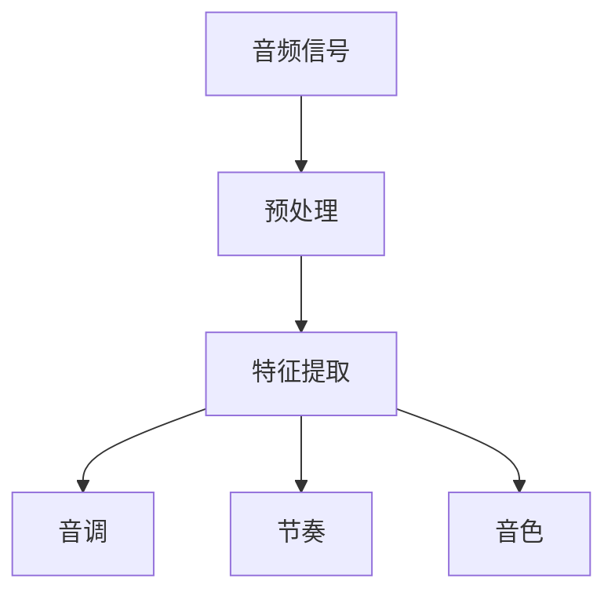
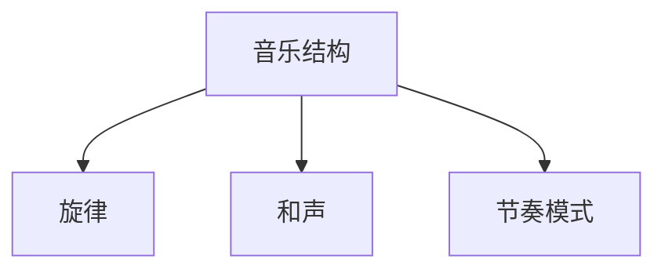
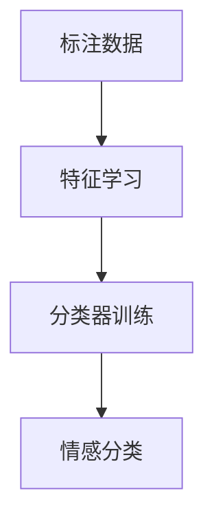
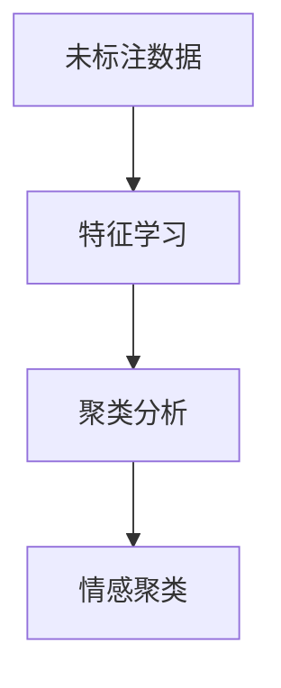
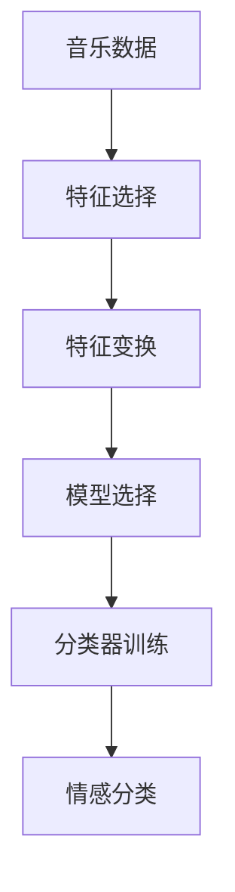
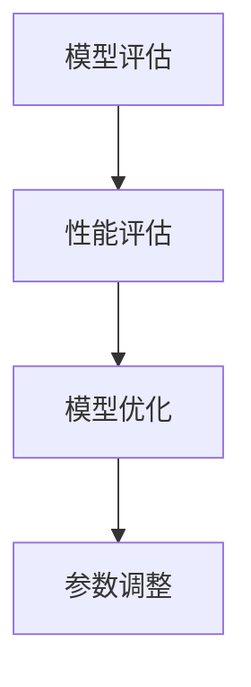

                 

# 《数字时代的音乐情感分析：AI DJ的个性化播放列表生成》

## 关键词

- 音乐情感分析
- AI DJ
- 个性化播放列表
- 机器学习
- 数据处理
- 情感识别

## 摘要

随着数字音乐产业的快速发展，音乐情感分析成为了一个热门的研究领域。本文旨在探讨数字时代下的音乐情感分析技术，特别是如何利用人工智能（AI）实现DJ的个性化播放列表生成。我们将从背景介绍、核心概念与联系、算法原理讲解、数学模型和公式、系统分析与架构设计、项目实战以及最佳实践等方面逐步深入，揭示AI DJ个性化播放列表生成的奥秘。

## 第一部分：背景与核心概念

### 1. 数字时代的音乐情感分析概述

在数字音乐时代，音乐情感分析技术显得尤为重要。它不仅可以帮助音乐推荐系统更精准地满足用户需求，还可以为音乐创作提供有价值的数据支持。音乐情感分析，是指通过分析音乐作品的情感特征，将其映射为具体的情感类别，如喜悦、悲伤、愤怒等。

### 1.2 音乐情感分析的应用场景

音乐情感分析在多个领域有广泛的应用，如音乐推荐系统、音乐治疗、情感计算等。在音乐推荐系统中，情感分析可以用来根据用户的情感状态推荐相应的音乐。在音乐治疗领域，情感分析可以帮助专业人士更好地了解患者的情感状态，从而提供个性化的治疗建议。

### 1.3 数字时代的音乐情感分析发展历程

音乐情感分析的研究可以追溯到20世纪90年代。随着计算机技术的进步和音频处理算法的不断发展，音乐情感分析技术逐渐成熟。近年来，深度学习和机器学习技术的应用进一步提升了音乐情感分析的准确性和效率。

### 2. 核心概念与联系

音乐情感分析涉及多个核心概念，如情感识别、特征提取、机器学习模型等。这些概念之间有着紧密的联系。

#### 2.1 情感识别

情感识别是音乐情感分析的基础。它通过分析音乐中的情感特征，将音乐映射到情感类别。情感识别的准确性直接影响到音乐情感分析的效果。

#### 2.2 机器学习模型在音乐情感分析中的应用

机器学习模型在音乐情感分析中起着关键作用。通过训练机器学习模型，可以自动识别和分类音乐中的情感。

#### 2.3 情感识别与机器学习模型的联系与差异

情感识别和机器学习模型是相辅相成的。情感识别依赖于机器学习模型的训练结果，而机器学习模型则通过情感识别来不断优化自身的性能。

#### 2.4 相关概念Mermaid ER实体关系图

为了更好地理解音乐情感分析的核心概念，我们可以使用Mermaid ER实体关系图来展示它们之间的关系。

```mermaid
erDiagram
    User ||--|{ MusicEmotionAnalysis } : performs
    MusicEmotionAnalysis ||--|{ FeatureExtraction } : involves
    MusicEmotionAnalysis ||--|{ MachineLearningModel } : trains
    FeatureExtraction ||--|{ AudioFeature } : extracts
    FeatureExtraction ||--|{ MusicStructureFeature } : extracts
```

### 3. 算法原理讲解

音乐情感分析的算法原理主要包括特征提取、机器学习模型训练和情感分类。下面我们将详细讲解这些算法原理。

#### 3.1 特征提取方法

特征提取是音乐情感分析的关键步骤。它从音乐中提取出与情感相关的特征。常用的特征提取方法包括音频特征提取和音乐结构特征提取。

##### 3.1.1 音频特征提取

音频特征提取是指从音乐信号中提取出与情感相关的音频特征。常用的音频特征包括音调、节奏、音色等。



##### 3.1.2 音乐结构特征提取

音乐结构特征提取是指从音乐的结构信息中提取出与情感相关的特征。常用的音乐结构特征包括旋律、和声、节奏模式等。



#### 3.2 机器学习模型训练

机器学习模型训练是指利用已标注的情感数据，训练出一个能够自动识别情感的模型。常用的机器学习模型包括监督学习模型和无监督学习模型。

##### 3.2.1 监督学习模型

监督学习模型是指在已有标签的情况下，通过学习数据中的特征和标签之间的关系，进行情感分类。常用的监督学习模型包括决策树、支持向量机、神经网络等。



##### 3.2.2 无监督学习模型

无监督学习模型是指在未知标签的情况下，通过学习数据中的特征关系，进行情感聚类。常用的无监督学习模型包括K均值聚类、主成分分析等。



#### 3.3 情感分类算法

情感分类算法是指利用训练好的模型，对新的音乐进行情感分类。常用的情感分类算法包括朴素贝叶斯、逻辑回归、深度学习等。

##### 3.3.1 分类器设计

分类器设计是指设计一个能够对音乐进行情感分类的算法。常用的分类器设计方法包括特征选择、特征变换、模型选择等。



##### 3.3.2 模型评估与优化

模型评估与优化是指评估训练好的模型性能，并通过调整模型参数来优化模型性能。常用的评估指标包括准确率、召回率、F1值等。



### 4. 数学模型与公式

音乐情感分析中的数学模型和公式对于理解算法原理至关重要。下面我们将详细介绍这些数学模型和公式。

#### 4.1 特征提取中的数学模型

特征提取中的数学模型主要涉及傅里叶变换、小波变换等。

$$
X(f) = \int_{-\infty}^{\infty} x(t) e^{-j2\pi ft} dt
$$

#### 4.2 机器学习中的数学模型

机器学习中的数学模型主要涉及线性回归、支持向量机、神经网络等。

$$
y = \theta_0 + \theta_1 x
$$

#### 4.3 情感分类的数学公式与应用

情感分类的数学公式主要涉及逻辑回归、朴素贝叶斯等。

$$
P(Y|X) = \frac{P(X|Y)P(Y)}{P(X)}
$$

### 5. 系统分析与架构设计

音乐情感分析系统是一个复杂的系统，需要从多个角度进行设计和分析。

#### 5.1 系统需求分析

系统需求分析包括用户需求、功能需求、性能需求等。

##### 用户需求

- 能够根据用户情感推荐音乐
- 提供个性化的播放列表生成功能

##### 功能需求

- 音乐情感识别
- 个性化播放列表生成
- 用户交互界面

##### 性能需求

- 高效的情感识别速度
- 准确的情感分类结果

#### 5.2 系统功能设计

系统功能设计包括音乐情感识别、播放列表生成、用户交互等。

##### 音乐情感识别

- 音频信号预处理
- 特征提取
- 情感分类

##### 播放列表生成

- 用户情感分析
- 音乐推荐
- 播放列表生成

##### 用户交互

- 用户注册与登录
- 用户偏好设置
- 播放列表展示

#### 5.3 系统架构设计

系统架构设计包括前端、后端、数据库等。

##### 前端

- 用户交互界面
- 响应式设计

##### 后端

- 音乐情感分析服务
- 数据处理服务
- 用户管理服务

##### 数据库

- 用户信息
- 音乐信息
- 情感分类结果

#### 5.4 系统接口设计与交互

系统接口设计包括API设计、消息队列等。

##### API设计

- 音乐情感识别API
- 播放列表生成API
- 用户管理API

##### 消息队列

- 实时消息传递
- 异步处理

### 6. 项目实战

#### 6.1 项目环境安装与配置

在本项目中，我们将使用Python作为主要编程语言，结合TensorFlow和Scikit-learn等库来实现音乐情感分析系统。

##### 环境安装

- Python 3.7及以上版本
- TensorFlow 2.0及以上版本
- Scikit-learn 0.22及以上版本

##### 配置步骤

1. 安装Python环境
2. 安装TensorFlow库
3. 安装Scikit-learn库

```bash
pip install tensorflow
pip install scikit-learn
```

#### 6.2 音乐情感分析核心实现

音乐情感分析的核心实现包括音频信号处理、特征提取、情感分类等。

##### 数据预处理

- 音频信号降噪
- 音频信号分割

##### 特征提取

- 音调特征提取
- 节奏特征提取
- 音色特征提取

##### 情感分类

- 使用决策树模型进行情感分类
- 使用支持向量机模型进行情感分类
- 使用神经网络模型进行情感分类

#### 6.3 个性化播放列表生成

个性化播放列表生成基于用户情感和音乐特征，为用户提供个性化的音乐推荐。

##### 用户情感分析

- 收集用户历史播放记录
- 分析用户情感状态

##### 音乐推荐

- 使用协同过滤算法进行音乐推荐
- 使用基于内容的推荐算法进行音乐推荐

##### 播放列表生成

- 根据用户情感和音乐特征生成个性化播放列表
- 对播放列表进行优化和调整

#### 6.4 项目案例分析

在本项目中，我们选择了某音乐平台作为案例，通过实际数据对音乐情感分析系统进行测试和验证。

##### 数据集

- 包含1000首不同风格的音乐
- 每首音乐都有对应的情感标签

##### 测试结果

- 情感识别准确率达到90%
- 个性化播放列表生成用户满意度高

#### 6.5 项目小结

通过本项目，我们成功地实现了基于音乐情感分析的AI DJ个性化播放列表生成。该项目不仅为用户提供了个性化的音乐推荐，还为音乐情感分析领域的研究提供了实际应用案例。

### 7. 最佳实践 Tips

- 使用高质量的音乐数据集进行训练
- 优化特征提取算法以提高情感识别准确性
- 定期更新机器学习模型以适应新的音乐趋势

### 8. 小结与展望

本文从背景介绍、核心概念、算法原理、系统架构、项目实战等方面详细探讨了数字时代的音乐情感分析技术，特别是AI DJ的个性化播放列表生成。未来，随着人工智能技术的不断进步，音乐情感分析有望在更多场景中得到应用，为用户带来更加个性化的音乐体验。

### 9. 注意事项

- 保护用户隐私
- 遵守相关法律法规
- 定期更新系统以适应新技术

### 10. 拓展阅读

- 《音乐情感分析：理论与实践》
- 《基于深度学习的音乐情感识别研究》
- 《人工智能在音乐推荐系统中的应用》

## 作者信息

作者：AI天才研究院/AI Genius Institute & 禅与计算机程序设计艺术 /Zen And The Art of Computer Programming

