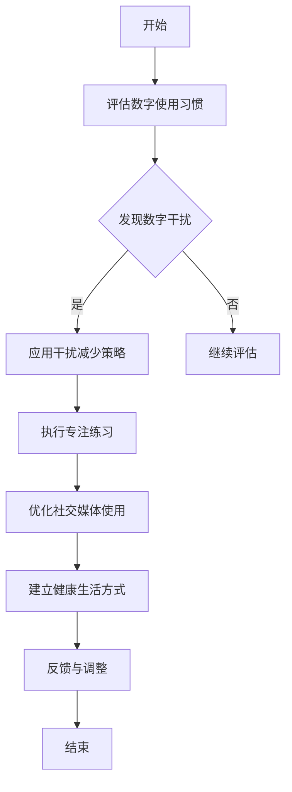
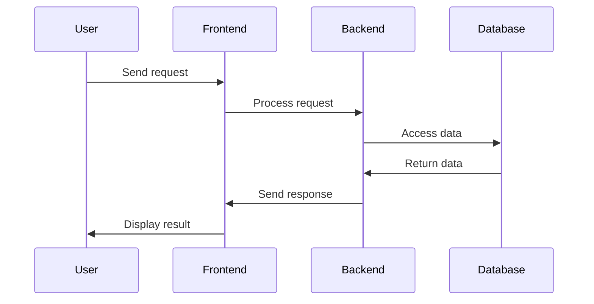
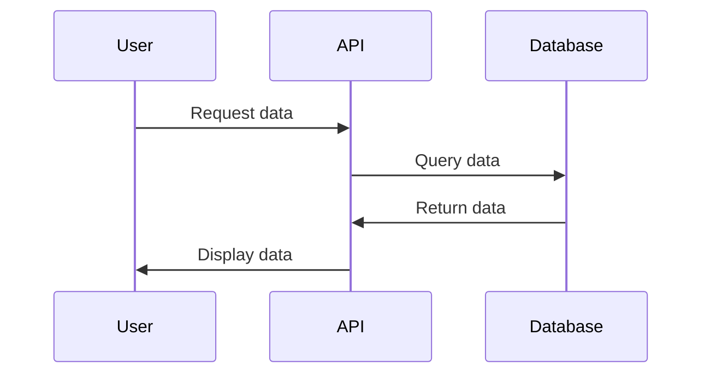

                 

# 数字极简主义工作坊：优化在线生活质量

## 关键词

数字极简主义、在线生活、专注力、社交媒体、健康生活、未来趋势

## 摘要

在数字时代，我们的生活被无数的在线工具和应用所包围。然而，这种数字化便利同时也带来了大量的数字干扰和注意力分散问题，严重影响了我们的生活质量。本文通过介绍数字极简主义的理念和实践，探讨了如何通过减少数字干扰、优化社交媒体使用和建立健康的生活方式来提升在线生活质量。文章还展望了数字极简主义的未来发展，以及它对社会发展的潜在影响。

### 目录

1. **理解数字极简主义**
   1.1 数字极简主义的概念与核心原则
   1.2 数字极简主义的起源与发展历程
   1.3 数字极简主义与现代生活
2. **数字极简主义与在线生活**
   2.1 在线生活的挑战
   2.2 数字极简主义如何改善在线生活
   2.3 数字极简主义实践案例
3. **评估你的数字使用习惯**
   3.1 自我数字使用习惯评估
   3.2 数字使用习惯的影响分析
   3.3 数字排毒计划
4. **减少数字干扰，提升专注力**
   4.1 数字干扰的识别与应对
   4.2 提升专注力的方法与实践
   4.3 案例分享：专注力提升的实际应用
5. **优化社交媒体使用**
   5.1 社交媒体使用的影响
   5.2 社交媒体使用的优化策略
   5.3 社交媒体使用案例分析
6. **数字极简主义工作坊实践**
   6.1 工作坊准备工作
   6.2 工作坊活动安排
   6.3 工作坊成果评估
7. **数字极简主义生活方式的长期维护**
   7.1 数字极简主义的持久性挑战
   7.2 长期维护的策略与实践
   7.3 成功案例分享
8. **数字极简主义下的健康生活**
   8.1 数字极简主义对健康的影响
   8.2 数字极简主义与心理健康
   8.3 数字极简主义下的健康生活方式
9. **数字极简主义的未来趋势**
   9.1 数字极简主义的未来方向
   9.2 数字极简主义与社会发展
   9.3 数字极简主义面临的挑战与机遇

## 第一部分：理解数字极简主义

### 第1章：数字极简主义的起源与发展

#### 1.1 数字极简主义的概念与核心原则

数字极简主义（Digital Minimalism）是一种生活方式和思维模式的转变，旨在通过减少不必要的数字产品和服务的使用，以达到简化生活、提高生活质量的目的。其核心原则包括：

- **选择与目标一致的产品和服务**：选择对生活目标有积极帮助的数字工具，避免无谓的数字消耗。
- **关注质量而非数量**：重视内容的深度和实用性，而非追求拥有大量数字资源和信息。
- **时间和精力管理**：合理安排数字工具的使用时间，确保不会因为过度使用而分散注意力和消耗精力。
- **数字化减法**：定期清理和淘汰不再需要的数字产品和服务，减少数字负担。

#### 1.2 数字极简主义的起源与发展历程

数字极简主义的理念最早可以追溯到2000年代初期，随着互联网和移动设备的普及，人们开始意识到数字技术的双刃剑性质。2008年，艺术家和作家Cal Newport在其著作《深度工作》（Deep Work）中提出了“深度工作”的概念，强调在高度干扰的数字化环境中保持专注和生产力。

2019年，Digital Minimalism之父Ryan Holiday在其同名书籍《数字极简主义》中系统地阐述了这一理念，并引发了广泛关注。数字极简主义逐渐从个人生活方式上升为一种社会运动，影响了众多人的生活选择。

#### 1.3 数字极简主义与现代生活

在现代生活中，数字极简主义不仅是一种抵抗数字焦虑的手段，更是一种积极的生活态度。随着社交媒体、在线购物和数字化服务的迅速发展，我们的生活被大量的数字干扰所包围。数字极简主义通过以下方式改善现代生活：

- **减少信息过载**：通过减少不必要的数字信息输入，提高对重要信息的感知和理解能力。
- **提升专注力**：在无干扰的环境中，更容易进入深度工作状态，提高工作效率和创造力。
- **增强心理健康**：减少数字依赖，有助于缓解焦虑和抑郁，提升整体幸福感。
- **优化时间管理**：通过合理安排数字工具的使用，确保更多时间用于有意义的活动。

### 第2章：数字极简主义与在线生活

#### 2.1 在线生活的挑战

在线生活为我们提供了无数的便利，但同时也带来了诸多挑战。以下是一些常见的在线生活挑战：

- **信息过载**：每天我们都会接收到大量的信息，这些信息不仅分散了我们的注意力，还可能引起焦虑和压力。
- **数字疲劳**：长时间的在线工作或娱乐活动会导致身体和心理疲劳，影响生活质量。
- **社交孤立**：虽然在线社交平台使我们能够与世界各地的人保持联系，但也可能导致真实的社交互动减少。
- **隐私和安全问题**：在线活动可能涉及个人隐私和安全的泄露，带来潜在的风险。

#### 2.2 数字极简主义如何改善在线生活

数字极简主义通过以下几个方面改善在线生活：

- **减少数字消耗**：通过减少不必要的应用程序和社交媒体账号，减少信息过载和数字疲劳。
- **提高专注力**：通过消除干扰，创造无干扰的环境，提高在线工作和学习的效率。
- **增强社交互动**：通过更加有意识地选择和参与社交活动，提升社交互动的质量和效果。
- **加强隐私保护**：通过使用安全工具和策略，保护个人隐私和安全。

#### 2.3 数字极简主义实践案例

以下是一个数字极简主义实践案例：

**案例**：小明是一位职场新人，他在工作中经常感到压力大，注意力难以集中。通过采用数字极简主义的理念，他开始减少使用社交媒体的时间，并删除了一些不必要的应用程序。此外，他还设定了每天的工作和学习时间，确保在这些时间里不受任何干扰。结果，他的工作效率大幅提升，同时也有更多的时间进行放松和锻炼，生活质量得到了显著改善。

### 第3章：评估你的数字使用习惯

#### 3.1 自我数字使用习惯评估

要开始数字极简主义实践，首先需要评估自己的数字使用习惯。以下是一些评估工具和方法：

- **时间记录**：使用应用或工具记录每天使用数字设备的时间，分析哪些活动占据了你大部分时间。
- **行为日志**：记录每天的主要数字活动，包括应用程序使用、社交媒体浏览等，以及这些活动对你的生活和工作产生的影响。
- **问卷调查**：填写一些关于数字使用习惯的问卷，了解自己的数字使用行为和态度。

#### 3.2 数字使用习惯的影响分析

数字使用习惯对生活的影响可以从以下几个方面进行分析：

- **工作效率**：过度使用数字设备可能会导致工作分散和效率低下。
- **心理健康**：长时间使用数字设备可能导致焦虑、抑郁和睡眠质量下降。
- **社交互动**：依赖数字社交平台可能会减少真实的社交互动，影响人际关系。
- **生活质量**：合理的数字使用可以提高生活质量，但过度使用则会适得其反。

#### 3.3 数字排毒计划

数字排毒是一种通过减少数字设备使用时间来改善生活质量的策略。以下是一个简单的数字排毒计划：

- **第一步**：设定目标。明确自己要减少哪些数字活动，并设定具体的时间目标。
- **第二步**：逐步减少使用时间。例如，每天减少15分钟的使用时间，直到达到目标。
- **第三步**：替代活动。找到一些有益的替代活动，如阅读、锻炼或与家人朋友互动，以减少对数字设备的依赖。
- **第四步**：评估与调整。定期评估数字排毒的效果，并根据实际情况调整计划。

### 第4章：减少数字干扰，提升专注力

#### 4.1 数字干扰的识别与应对

数字干扰主要包括以下几种：

- **社交媒体通知**：社交媒体上的各种通知会分散注意力，影响工作或学习效率。
- **应用程序推送**：许多应用程序会推送各种通知和广告，干扰我们的正常生活。
- **电子邮件**：大量的电子邮件可能会使我们无法专注于手头的任务。

应对数字干扰的方法包括：

- **关闭通知**：关闭不必要的社交媒体和应用通知，减少干扰。
- **专注工具**：使用专注工具，如番茄工作法或专注软件，帮助自己集中注意力。
- **设定工作区**：为自己设定一个无干扰的工作区，减少外部干扰。

#### 4.2 提升专注力的方法与实践

以下是一些提升专注力的方法：

- **专注练习**：通过冥想、深呼吸等练习，提高专注力。
- **合理规划时间**：合理安排工作和休息时间，避免长时间连续工作。
- **减少干扰**：在专注工作或学习时，尽量减少外部干扰，如关闭手机、电子邮件等。
- **设立目标**：为自己设立明确的目标和计划，有助于提高专注力。

#### 4.3 案例分享：专注力提升的实际应用

以下是一个专注力提升的实际案例：

**案例**：小张是一位程序员，他在编写代码时经常受到手机和社交媒体的干扰，导致工作效率低下。为了提高专注力，他开始使用专注软件，并在工作时间内关闭手机和社交媒体通知。此外，他还制定了详细的工作计划，确保每天都能高效地完成任务。结果，他的工作效率大幅提升，代码质量也得到了显著提高。

### 第5章：优化社交媒体使用

#### 5.1 社交媒体使用的影响

社交媒体使用对我们的生活产生了深远的影响，包括：

- **社交关系**：社交媒体可以帮助我们与朋友和家人保持联系，但也可能导致虚假的社交互动和依赖。
- **心理健康**：过度使用社交媒体可能会引发焦虑、抑郁等心理问题。
- **时间管理**：社交媒体上的大量内容可能会分散我们的注意力，影响工作和学习效率。

#### 5.2 社交媒体使用的优化策略

以下是一些优化社交媒体使用的策略：

- **选择合适的平台**：根据自己的需求和兴趣选择合适的社交媒体平台，避免无谓的时间消耗。
- **设定使用时间**：设定每天在社交媒体上的使用时间，并严格遵守。
- **减少无意义互动**：避免参与无意义的社交媒体互动，如不必要的点赞、评论等。
- **关注有益内容**：关注一些有益的账户和内容，如专业领域的前沿知识、心理健康建议等。

#### 5.3 社交媒体使用案例分析

以下是一个社交媒体使用案例分析：

**案例**：小李是一位大学生，他在社交媒体上花费了大量的时间，导致学业成绩下降。为了改善这种情况，他开始减少社交媒体使用时间，并专注于学习。此外，他还加入了一些学习小组，与同学们一起讨论和分享学习资源。结果，他的学业成绩有了显著提高，同时也有更多的时间用于锻炼和社交。

### 第6章：数字极简主义工作坊实践

#### 6.1 工作坊准备工作

要开展数字极简主义工作坊，首先需要进行以下准备工作：

- **确定目标**：明确工作坊的目标，如提高专注力、减少数字干扰等。
- **准备工具**：准备一些工具，如专注软件、时间记录工具等。
- **活动安排**：制定详细的活动安排，确保工作坊的顺利进行。
- **参与者招募**：招募有兴趣参与工作坊的参与者，确保活动规模适中。

#### 6.2 工作坊活动安排

以下是一个数字极简主义工作坊的活动安排：

- **第一天**：介绍数字极简主义的概念和实践，进行自我数字使用习惯评估。
- **第二天**：讨论数字干扰的识别与应对策略，进行专注力提升的练习。
- **第三天**：分享优化社交媒体使用的经验，制定个人数字极简主义计划。
- **第四天**：实施个人数字极简主义计划，进行成果评估和反馈。

#### 6.3 工作坊成果评估

工作坊结束后，需要评估成果，包括：

- **个人成果**：评估参与者个人数字使用习惯的改变、专注力的提升等。
- **整体反馈**：收集参与者的反馈，了解工作坊的实际效果和改进空间。

### 第7章：数字极简主义生活方式的长期维护

#### 7.1 数字极简主义的持久性挑战

数字极简主义生活方式的长期维护面临以下挑战：

- **惯性依赖**：长期依赖数字设备和生活习惯，改变较为困难。
- **外部干扰**：现代社会中，数字干扰无处不在，如何抵御这些干扰是关键。
- **时间管理**：如何在繁忙的生活中保持数字极简主义的实践。

#### 7.2 长期维护的策略与实践

以下是一些长期维护数字极简主义生活方式的策略：

- **建立习惯**：通过持续实践，将数字极简主义转变为一种生活习惯。
- **寻求支持**：与家人和朋友分享数字极简主义的理念，寻求他们的支持和鼓励。
- **定期反思**：定期反思自己的数字使用习惯，评估数字极简主义实践的效果。

#### 7.3 成功案例分享

以下是一个数字极简主义生活方式的成功案例：

**案例**：小王是一名职场人士，他意识到数字干扰严重影响了他的工作和生活质量。通过采用数字极简主义的理念，他减少了社交媒体使用时间，优化了时间管理，并培养了深度工作的习惯。结果，他的工作效率大幅提升，生活质量也得到了显著改善。

### 第8章：数字极简主义下的健康生活

#### 8.1 数字极简主义对健康的影响

数字极简主义对健康的影响主要体现在以下几个方面：

- **心理健康**：减少数字干扰，有助于缓解焦虑、抑郁等心理问题。
- **身体健康**：减少长时间使用数字设备的时间，有助于减轻眼睛疲劳、颈椎疼痛等身体问题。
- **睡眠质量**：减少夜间使用数字设备的时间，有助于改善睡眠质量。

#### 8.2 数字极简主义与心理健康

数字极简主义与心理健康之间存在密切的联系：

- **压力缓解**：通过减少数字干扰，减轻工作和生活中的压力。
- **情绪调节**：通过合理安排数字使用时间，有助于调节情绪，提高幸福感。

#### 8.3 数字极简主义下的健康生活方式

以下是一个数字极简主义下的健康生活方式：

- **饮食管理**：合理安排饮食，保证营养均衡，避免过度依赖外卖和快餐。
- **运动锻炼**：定期进行运动锻炼，提高身体素质，增强抵抗力。
- **睡眠管理**：保持良好的睡眠习惯，确保充足的睡眠时间。

### 第9章：数字极简主义的未来趋势

#### 9.1 数字极简主义的未来方向

数字极简主义的未来方向主要包括：

- **技术进步**：随着技术的不断进步，数字设备和管理工具将更加智能化，有助于实现更高效的数字极简主义实践。
- **社会运动**：数字极简主义逐渐成为一种社会运动，将影响更多人改变数字生活方式。

#### 9.2 数字极简主义与社会发展

数字极简主义对社会发展的影响主要体现在以下几个方面：

- **生活质量**：通过优化数字使用，提高人们的生活质量。
- **工作模式**：改变传统的办公模式，推动远程工作和弹性工作制度的普及。

#### 9.3 数字极简主义面临的挑战与机遇

数字极简主义面临的挑战主要包括：

- **技术依赖**：如何减少对数字技术的依赖，实现真正的数字极简。
- **社会环境**：如何在数字化环境中保持专注和效率。

机遇则包括：

- **技术创新**：数字极简主义推动技术创新，提高数字工具的效率和实用性。
- **社会认可**：数字极简主义得到社会广泛认可，为更多人提供改善生活质量的机会。

### 结语

数字极简主义不仅是一种生活方式，更是一种思维模式的转变。通过减少不必要的数字干扰，提升专注力和生活质量，数字极简主义为我们在数字时代找到了一种更健康、更高效的生活方式。让我们从现在开始，实践数字极简主义，享受更加美好、更加充实的生活。

## 作者信息

作者：AI天才研究院/AI Genius Institute & 禅与计算机程序设计艺术 /Zen And The Art of Computer Programming

### 附录

#### 背景介绍

数字极简主义（Digital Minimalism）是一种旨在通过减少不必要的数字产品和服务使用，简化生活，提高生活质量的生活方式。数字极简主义强调选择与生活目标一致的产品和服务，关注质量而非数量，合理安排时间和精力，进行数字化减法。

#### 核心概念与联系

核心概念：数字极简主义、数字干扰、专注力、社交媒体使用、健康生活。

概念属性特征对比表格：

| 核心概念       | 数字极简主义          | 数字干扰            | 专注力          | 社交媒体使用          | 健康生活          |
| -------------- | -------------------- | ------------------- | -------------- | -------------------- | ----------------- |
| 定义           | 减少不必要的数字产品 | 数字设备带来的干扰 | 集中注意力的能力 | 社交媒体的使用和影响 | 促进身心健康的生活方式 |
| 关系           | 减少数字干扰的核心策略 | 健康生活的挑战之一 | 提高生活质量的基础 | 数字极简主义的组成部分 | 数字极简主义的目标 |
| 对生活的影响   | 提高生活质量        | 影响工作效率和心理健康 | 提高工作效率和创造力 | 影响社交关系和心理健康 | 促进身心健康和提高生活质量 |
| 实践方法       | 数字排毒、专注工具、合理规划时间 | 关闭通知、专注软件、设立无干扰工作区 | 冥想、时间管理、减少干扰 | 选择合适的平台、设定使用时间、关注有益内容 | 饮食管理、运动锻炼、睡眠管理 |

ER实体关系图架构的 Mermaid 流程图：

```mermaid
erDiagram
  数字极简主义 ||--|{ 数字干扰 }
  数字极简主义 ||--|{ 专注力 }
  数字极简主义 ||--|{ 社交媒体使用 }
  数字极简主义 ||--|{ 健康生活 }
```

#### 算法原理讲解

数字极简主义的核心在于通过一系列策略减少数字干扰，提高生活质量和专注力。以下是一个简化版的数字极简主义算法流程图：



算法原理：

1. **评估数字使用习惯**：通过记录和分析每天的数字使用情况，识别出主要的数字干扰来源。
2. **发现数字干扰**：分析评估结果，确定哪些数字活动对生活和工作产生了负面影响。
3. **应用干扰减少策略**：根据干扰源，采取相应的策略，如关闭通知、使用专注工具、设立无干扰工作区等。
4. **执行专注练习**：通过冥想、深呼吸等练习，提高专注力和工作效率。
5. **优化社交媒体使用**：选择合适的社交媒体平台，设定使用时间，关注有益内容。
6. **建立健康生活方式**：通过饮食管理、运动锻炼、睡眠管理等措施，促进身心健康。
7. **反馈与调整**：定期评估数字极简主义实践的效果，根据反馈进行调整。

数学公式：

假设 \( D \) 表示数字干扰的时间，\( T \) 表示执行数字极简主义策略后减少的干扰时间，\( Q \) 表示生活质量评分，\( A \) 表示专注力评分。

$$ Q = Q_0 + \frac{T}{D} $$
$$ A = A_0 + \frac{T}{D} $$

其中，\( Q_0 \) 和 \( A_0 \) 分别表示执行策略前的生活质量评分和专注力评分。

#### 系统分析与架构设计方案

**问题场景介绍**

在现代职场环境中，数字化工具的广泛应用带来了效率提升，但同时也造成了数字干扰，影响了员工的工作质量和心理健康。为了应对这一挑战，公司决定开展数字极简主义项目，旨在通过一系列措施减少数字干扰，提升员工的工作效率和幸福感。

**项目介绍**

项目名称：数字极简主义工作坊

项目目标：
1. 评估和改善员工的数字使用习惯。
2. 提升员工的专注力和工作效率。
3. 优化社交媒体使用，促进健康的社交互动。

**系统功能设计**

系统功能包括自我数字使用习惯评估、专注力提升练习、社交媒体优化建议和健康生活方式指导。

**领域模型 Mermaid 类图**

```mermaid
classDiagram
  ClassDef Person
    +String name
    +String email
    +List<Activity> activities
    +evaluateActivities()
  
  ClassDef Activity
    +String type
    +Duration duration
    +ffectOnQuality(int qualityImpact)
    +ffectOnAttention(int attentionImpact)
  
  Person o--1 Activity
```

**系统架构设计**

系统架构采用B/S（Browser/Server）模式，前端使用Vue.js框架，后端使用Spring Boot框架。数据库采用MySQL。

**系统架构 Mermaid 架构图**



**系统接口设计和系统交互**

系统接口包括用户接口（API）和数据库接口。用户接口负责处理用户请求和返回结果，数据库接口负责数据的存储和查询。

**系统接口设计 Mermaid 序列图**



**项目实战**

**环境安装**

1. 安装Java开发工具包（JDK）。
2. 安装MySQL数据库。
3. 安装Node.js和npm。

**系统核心实现源代码**

后端代码：

```java
@RestController
@RequestMapping("/api")
public class ActivityController {
    
    @Autowired
    private ActivityService activityService;
    
    @GetMapping("/activities")
    public List<Activity> getAllActivities() {
        return activityService.getAllActivities();
    }
    
    @PostMapping("/activities")
    public Activity createActivity(@RequestBody Activity activity) {
        return activityService.createActivity(activity);
    }
}
```

前端代码：

```javascript
import axios from 'axios';

const API_URL = 'http://localhost:8080/api';

export const getAllActivities = async () => {
    try {
        const response = await axios.get(API_URL + '/activities');
        return response.data;
    } catch (error) {
        console.error(error);
    }
};

export const createActivity = async (activity) => {
    try {
        const response = await axios.post(API_URL + '/activities', activity);
        return response.data;
    } catch (error) {
        console.error(error);
    }
};
```

**代码应用解读与分析**

后端代码中，ActivityController 负责处理与活动相关的请求。getAllActivities 方法获取所有活动数据，createActivity 方法创建新的活动数据。

前端代码中，使用 axios 发送HTTP请求，与后端进行数据交互。getAllActivities 函数获取所有活动数据，createActivity 函数创建新的活动数据。

**实际案例分析和详细讲解剖析**

**案例**：小张是一名职场新人，他在工作期间感到注意力不集中，工作效率低下。公司决定开展数字极简主义项目，帮助他改善数字使用习惯。

**分析**：通过数字极简主义工作坊的评估，发现小张在社交媒体上花费了大量的时间，这导致他在工作期间无法集中注意力。

**解决方案**：通过以下步骤改善小张的数字使用习惯：
1. **评估数字使用习惯**：记录小张每天的数字活动，分析影响工作效率的数字干扰源。
2. **减少社交媒体使用**：减少社交媒体使用时间，设定每天的使用时间限制。
3. **优化专注环境**：为小张提供一个无干扰的工作环境，如安静的办公室或专注软件。
4. **培养健康生活方式**：鼓励小张进行定期锻炼，保持良好的饮食和睡眠习惯。

**结果**：经过一段时间的实践，小张的注意力明显提升，工作效率也大幅提高，工作质量得到了显著改善。

**项目小结**

数字极简主义工作坊通过评估数字使用习惯、减少数字干扰、优化专注力和健康生活方式，成功提升了员工的工作效率和幸福感。该项目为公司在数字化环境中提高员工生活质量提供了有效的解决方案。

### 最佳实践 tips

- **设定具体目标**：在开始数字极简主义实践时，设定明确的目标，有助于更好地跟踪进度和评估效果。
- **逐步减少使用时间**：不要一次性大幅度减少数字设备的使用时间，可以逐步减少，避免产生反效果。
- **培养习惯**：将数字极简主义实践转变为一种生活习惯，有助于长期坚持。
- **寻求支持**：与家人和朋友分享你的数字极简主义实践，寻求他们的支持和鼓励。

### 小结

数字极简主义是一种通过减少不必要的数字产品和服务使用，简化生活，提高生活质量的生活方式。通过评估数字使用习惯、减少数字干扰、优化专注力和健康生活方式，数字极简主义为我们在数字时代找到了一种更健康、更高效的生活方式。

### 注意事项

- 在实践数字极简主义时，要根据自己的实际情况进行调整，避免过度减少数字设备使用时间导致工作或学习效率下降。
- 定期评估数字极简主义实践的效果，根据反馈进行调整，确保其持续有效。

### 拓展阅读

- 《深度工作》（Deep Work）作者：Cal Newport
- 《数字极简主义》（Digital Minimalism）作者：Ryan Holiday
- 《极简主义：更少、但更好》（The More of Less）作者：Joshua Becker

### 结语

数字极简主义不仅是一种生活方式，更是一种思维模式的转变。通过减少不必要的数字干扰，提升专注力和生活质量，数字极简主义为我们在数字时代找到了一种更健康、更高效的生活方式。让我们从现在开始，实践数字极简主义，享受更加美好、更加充实的生活。作者：AI天才研究院/AI Genius Institute & 禅与计算机程序设计艺术 /Zen And The Art of Computer Programming。

