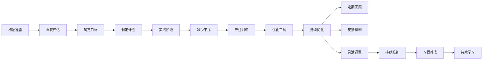

                 

### 《数字极简主义工作坊：优化在线生活质量》引言

在数字化飞速发展的今天，我们的生活和工作方式都发生了巨大的变化。然而，这种变化不仅带来了便捷，也带来了前所未有的挑战。我们每天面临着大量信息的轰炸，社交媒体、电子邮件、即时通讯工具等不断干扰我们的注意力，使我们难以集中精力完成工作和享受生活。这种状况被称作“数字疲劳”，它不仅影响了我们的工作效率，还损害了我们的心理健康。为了应对这一挑战，数字极简主义应运而生。

#### **问题背景**

数字化对生活方式的影响是显著的。我们逐渐习惯了依赖手机和电脑，不断接收和处理海量的信息。然而，这种生活方式并没有让我们的生活质量得到实质性提升，反而让我们感到更加焦虑和疲惫。据调查，现代人每天平均花费在屏幕上的时间超过5小时，而其中很大一部分时间是在无意义的信息浏览中浪费掉的。这种生活方式不仅影响了我们的工作效率，还导致了心理健康问题，如焦虑、抑郁和注意力分散。

#### **数字极简主义的理念与目标**

数字极简主义的核心在于通过减少数字干扰，提高工作效率，进而提升生活品质。它倡导我们重新审视自己与数字设备的关系，学会筛选重要信息，减少无意义的干扰，专注于真正有价值的事物。数字极简主义的目标是帮助我们在数字化世界中找到平衡，使我们的生活更加简单、高效和有意义。

#### **书籍目的与结构安排**

本书旨在为读者提供一个系统而全面的数字极简主义指南，帮助大家理解和实践这一理念。全书共分为八个章节，每章都围绕数字极简主义的不同方面展开。第1章引言部分，我们将讨论数字化时代的生活挑战和数字极简主义的理念；第2章将深入探讨数字极简主义的核心原则和实践；第3章和第4章分别关注数字极简主义在工作和心理健康中的应用；第5章将讨论数字极简主义在企业中的实施；第6章通过案例分析，展示数字极简主义的具体实践效果；第7章展望数字极简主义的未来趋势；第8章总结全文，提出对读者的建议和展望。

通过阅读本书，读者将不仅了解数字极简主义的理论基础，还能掌握一系列实用的方法和技巧，帮助自己在数字化世界中找到平衡，提升在线生活质量。

### **关键词**

- 数字化时代
- 生活质量
- 数字极简主义
- 数字干扰
- 工作效率
- 心理健康

### **摘要**

本书《数字极简主义工作坊：优化在线生活质量》探讨了数字化时代下，数字极简主义如何帮助我们应对生活和工作中的挑战。书中详细介绍了数字极简主义的核心原则和实践方法，通过案例分析展示了其在个人和企业中的应用效果。读者将学习到如何减少数字干扰，提高工作效率，提升心理健康，从而优化在线生活质量。本书旨在为读者提供一个系统而全面的指导，帮助大家在数字化世界中找到平衡，实现高效、健康的生活方式。

## **第1章：引言：数字化时代的生活挑战**

### **1.1 问题背景**

随着互联网和移动设备的普及，我们的生活已经彻底被数字化。这种数字化的生活方式无疑为我们的工作和生活带来了诸多便利。我们可以随时随地通过电子邮件、社交媒体和即时通讯工具与朋友和家人保持联系；我们可以在网上购物，享受各种在线服务；我们还可以通过在线学习平台获取知识。然而，随着数字技术的快速发展，我们也面临着前所未有的挑战。

首先，数字化带来了信息过载的问题。我们每天都会接收到大量的电子邮件、社交媒体通知和即时消息，这些信息中，有很大一部分是无关紧要的，甚至是有害的。这种信息过载使我们的大脑难以处理，导致注意力分散，工作效率下降。此外，我们花费在屏幕上的时间也越来越长。据调查，现代人每天平均花费在屏幕上的时间超过5小时，这无疑对我们的身体健康和心理健康产生了负面影响。

其次，数字化生活方式对心理健康的影响也不容忽视。在社交媒体上，我们常常会看到他人完美的生活瞬间，这种社交比较容易导致焦虑和抑郁。此外，数字设备的使用往往会导致我们的睡眠质量下降，进一步影响心理健康。

最后，数字化生活方式也影响了我们的社交关系。尽管我们可以随时随地与他人保持联系，但面对面的交流却越来越少。这种缺乏深层次人际交往的生活方式，容易让我们感到孤独和疏离。

### **1.2 数字极简主义的理念与目标**

面对数字化时代的生活挑战，数字极简主义提供了一种解决方案。数字极简主义的核心在于通过减少数字干扰，提高工作效率，进而提升生活品质。它主张我们重新审视自己与数字设备的关系，学会筛选重要信息，减少无意义的干扰，专注于真正有价值的事物。

数字极简主义的目标是帮助我们在数字化世界中找到平衡。它不仅关注我们的工作效率，更注重我们的心理健康和生活质量。通过实践数字极简主义，我们可以减少信息过载，提高专注力，改善心理健康，从而实现高效、健康的生活方式。

### **1.3 书籍目的与结构安排**

本书《数字极简主义工作坊：优化在线生活质量》旨在为读者提供一个系统而全面的数字极简主义指南。全书共分为八个章节，每章都围绕数字极简主义的不同方面展开。第1章引言部分，我们介绍了数字化时代的生活挑战和数字极简主义的理念；第2章深入探讨了数字极简主义的核心原则和实践方法；第3章和第4章分别关注数字极简主义在工作和心理健康中的应用；第5章讨论数字极简主义在企业中的实施；第6章通过案例分析，展示数字极简主义的具体实践效果；第7章展望数字极简主义的未来趋势；第8章总结全文，提出对读者的建议和展望。

通过阅读本书，读者将不仅了解数字极简主义的理论基础，还能掌握一系列实用的方法和技巧，帮助自己在数字化世界中找到平衡，提升在线生活质量。无论你是职场人士、学生还是家庭主妇，本书都为你提供了实用的指导，帮助你优化在线生活质量，实现高效、健康的生活方式。

### **1.4 优化在线生活质量的必要性**

在当今数字化时代，优化在线生活质量已成为迫在眉睫的需求。随着互联网的普及和移动设备的广泛使用，我们的生活和工作方式发生了巨大的变化。然而，这种变化并没有使我们的生活变得更加简单和高效，反而带来了一系列的问题和挑战。这些问题不仅影响了我们的工作效率，还对心理健康和生活品质产生了负面影响。

首先，信息过载是一个显著的问题。现代人在线接收到的信息量远远超过了我们的处理能力。社交媒体、电子邮件、即时通讯工具等平台不断推送大量信息，这些信息中很多是冗余的、无关紧要的，甚至是有害的。这种信息过载导致我们的注意力分散，难以集中精力完成任务，从而降低了工作效率。

其次，数字设备的过度使用对心理健康产生了负面影响。长时间盯着屏幕不仅容易导致眼睛疲劳，还会影响我们的睡眠质量。睡眠不足和眼睛疲劳都会进一步影响我们的心理健康，导致焦虑、抑郁和注意力分散等问题。

此外，数字依赖也加剧了我们的心理健康问题。在社交媒体上，我们常常会看到他人完美的生活瞬间，这种社交比较容易导致焦虑和抑郁。同时，数字设备的使用也使我们与真实世界的社交互动减少，导致孤独感和疏离感增加。

最后，数字极简主义在提高工作效率方面也具有重要意义。通过减少数字干扰，我们可以更加专注地完成任务，提高工作效率。这不仅有助于我们在工作中取得更好的成绩，也能为我们的生活腾出更多的时间和精力，从而提升整体生活质量。

综上所述，优化在线生活质量不仅是为了解决当前的问题和挑战，更是为了实现长期的健康和幸福。通过实践数字极简主义，我们可以减少信息过载，提高工作效率，改善心理健康，从而实现高效、健康的生活方式。

### **1.5 书籍的整体结构**

本书《数字极简主义工作坊：优化在线生活质量》旨在为读者提供一个系统而全面的数字极简主义指南。全书共分为八个章节，每个章节都围绕数字极简主义的不同方面展开，旨在帮助读者全面理解和实践这一理念。

**第1章：引言**  
本章介绍了数字化时代的生活挑战和数字极简主义的理念，探讨了优化在线生活质量的必要性。通过本章的阅读，读者将了解本书的目的和整体结构，为后续章节的内容奠定基础。

**第2章：数字极简主义的理念与实践**  
本章详细阐述了数字极简主义的核心原则和实践方法。读者将学习到如何通过减少数字干扰，提高工作效率，从而提升生活品质。这一章提供了数字极简主义的基本理论框架。

**第3章：在线工作与学习中的数字极简主义**  
本章关注数字极简主义在工作和学习中的应用。通过具体案例和实用的技巧，读者将学会如何优化在线工作环境，提升学习效率。这一章为读者提供了实际操作指导。

**第4章：数字极简主义与心理健康**  
本章探讨了数字极简主义对心理健康的影响。读者将了解如何通过数字极简主义减少数字依赖，改善心理健康。这一章为读者提供了维护心理健康的实用方法。

**第5章：数字极简主义在企业中的实施**  
本章讨论数字极简主义在企业中的应用。通过具体案例分析，读者将了解如何通过数字极简主义提升企业效率，改善企业文化。这一章为企业管理者提供了实用的策略。

**第6章：数字极简主义案例分析**  
本章通过具体案例分析，展示了数字极简主义在不同场景中的实际应用效果。读者可以通过这些案例，更深入地理解数字极简主义的实践意义。

**第7章：数字极简主义的未来趋势与展望**  
本章展望数字极简主义的未来发展趋势，讨论其对社会和个人生活的影响。通过本章的阅读，读者将了解数字极简主义的发展方向和应用前景。

**第8章：结论**  
本章总结全文，重申数字极简主义的重要性。同时，对读者提出建议，鼓励他们在实际生活中实践数字极简主义，提升在线生活质量。这一章为读者提供了行动指南。

通过阅读本书，读者将不仅了解数字极简主义的理论基础，还能掌握一系列实用的方法和技巧，帮助自己在数字化世界中找到平衡，提升在线生活质量。

## **第2章：数字极简主义的理念与实践**

### **2.1 数字极简主义的核心原则**

数字极简主义（Digital Minimalism）是一种旨在通过减少不必要的数字干扰，提高生活质量和工作效率的生活方式。它的核心原则可以概括为以下三点：

**1. 减少数字干扰**  
数字极简主义的第一条原则是减少数字干扰。在数字化世界中，我们每天都会接收到大量的信息，包括社交媒体通知、电子邮件、即时通讯工具的提醒等。这些信息虽然看似重要，但实际上很多都是冗余的、无关紧要的，甚至是有害的。减少数字干扰意味着我们需要学会筛选信息，只关注那些真正有价值的信息，从而避免被无意义的干扰所困扰。

**2. 提高工作效率**  
数字极简主义的第二条原则是提高工作效率。在减少数字干扰的同时，我们需要通过优化工作流程和工具，提高工作效率。这意味着我们需要学会使用合适的工具和软件，避免多任务处理，专注于当前的任务，从而更快、更高效地完成任务。

**3. 增强生活品质**  
数字极简主义的第三条原则是增强生活品质。通过减少数字干扰和提高工作效率，我们不仅可以释放更多的时间，还可以改善心理健康，提升生活质量。这意味着我们可以将更多的时间用于与家人和朋友相处，进行户外活动，培养兴趣爱好，从而实现更丰富、更有意义的生活。

### **2.2 数字极简主义在个人生活中的应用**

在个人生活中，数字极简主义的应用主要体现在以下几个方面：

**1. 时间管理策略**  
时间管理是数字极简主义的重要组成部分。通过制定合理的时间表和计划，我们可以更好地掌控自己的时间，避免被数字设备所控制。具体来说，我们可以采取以下策略：

- **设定优先级**：将任务按照优先级排序，确保先完成最重要的任务。
- **使用日程表**：使用日程表或时间管理应用程序来规划每天的活动，避免时间的浪费。
- **定期休息**：在工作或学习一段时间后，定期休息，以避免疲劳和注意力下降。

**2. 信息过滤与筛选技巧**  
在数字化世界中，信息过载是一个普遍问题。为了减少信息过载，我们需要学会过滤和筛选信息。以下是一些实用的技巧：

- **取消不必要的订阅**：定期检查电子邮件订阅列表，取消那些不再需要的订阅。
- **使用信息过滤器**：在社交媒体和电子邮件中启用过滤器，只接收重要通知。
- **限制社交媒体使用时间**：设定每天在社交媒体上的使用时间，避免无意义的浏览。

**3. 数字工具的选择与优化**  
选择合适的数字工具是数字极简主义的关键。以下是一些选择和优化数字工具的技巧：

- **精选应用**：只安装必要的应用，避免安装过多的冗余应用。
- **使用高效工具**：选择那些能够提高工作效率的工具，如笔记应用、时间管理应用程序等。
- **优化工具设置**：调整工具的设置，使其更符合个人需求，减少不必要的干扰。

通过以上方法，我们可以更好地实践数字极简主义，提高个人生活质量和工作效率。

### **2.3 数字极简主义带来的实际效益**

数字极简主义不仅是一种理念，更是一种可以带来实际效益的生活方式。通过实践数字极简主义，我们可以享受到以下实际效益：

**1. 提高专注力和工作效率**  
减少数字干扰后，我们可以更加专注地完成任务，从而提高工作效率。专注于一项任务不仅减少了任务切换的消耗，还提高了我们的工作和学习效率。

**2. 改善心理健康**  
数字极简主义有助于减少焦虑和抑郁。通过减少对数字设备的依赖，我们可以减少社交比较和数字疲劳，从而改善心理健康。

**3. 提升生活质量**  
数字极简主义不仅提高了工作效率，还为我们腾出了更多的时间。这些时间可以用于与家人和朋友相处，进行户外活动，培养兴趣爱好，从而提升整体生活质量。

**4. 增强人际关系**  
通过减少对数字设备的依赖，我们可以更多地参与面对面的交流，增强与家人和朋友的互动，从而改善人际关系。

**5. 提高自我控制力**  
数字极简主义要求我们重新审视自己与数字设备的关系，这有助于提高我们的自我控制力。通过自我控制，我们可以更好地管理时间和注意力，实现个人目标。

综上所述，数字极简主义不仅是一种理念，更是一种可以带来实际效益的生活方式。通过实践数字极简主义，我们可以提高工作效率，改善心理健康，提升生活质量，增强人际关系，并提高自我控制力。这些实际效益将使我们的生活变得更加简单、高效和有意义。

### **2.4 数字极简主义的核心概念与联系**

为了深入理解数字极简主义的理念，我们需要探讨其核心概念及其相互联系。数字极简主义不仅关注减少数字干扰和提高工作效率，还涉及更深层次的自我认知和生活方式的调整。以下是数字极简主义的核心概念及其相互关系：

#### **核心概念**

**1. 数字干扰**  
数字干扰是指数字设备和应用带来的无关信息和通知，这些干扰分散了我们的注意力，降低了工作效率。数字干扰包括社交媒体通知、电子邮件提醒、即时通讯工具的消息等。

**2. 专注力**  
专注力是指集中注意力完成某项任务的能力。在数字极简主义的背景下，提高专注力意味着减少数字干扰，专注于当前的任务，避免多任务处理。

**3. 工作效率**  
工作效率是指在一定时间内完成任务的效率。通过减少数字干扰，我们可以更专注于任务，从而提高工作效率。

**4. 自我控制力**  
自我控制力是指管理和控制自身行为的能力。在数字极简主义的实践中，自我控制力是减少数字依赖，实现目标的关键。

**5. 生活质量**  
生活质量是指我们在生活中的整体感受和满意度。通过减少数字干扰，提高工作效率，我们可以腾出更多时间用于家庭、朋友和个人兴趣，从而提升生活质量。

#### **概念属性特征对比表格**

为了更清晰地展示这些核心概念之间的联系，我们可以创建一个特征对比表格：

| 核心概念   | 属性特征                                                     | 相互关系                                                     |
| ---------- | ------------------------------------------------------------ | ------------------------------------------------------------ |
| 数字干扰   | 干扰类型（社交媒体、电子邮件、即时消息等）、频率、严重程度   | 与专注力、工作效率呈负相关，与自我控制力呈正相关               |
| 专注力     | 注意力集中程度、持续时间的长短                             | 与工作效率呈正相关，与数字干扰呈负相关                         |
| 工作效率   | 完成任务的速率和质量                                       | 与专注力、自我控制力呈正相关，与数字干扰呈负相关               |
| 自我控制力 | 管理时间和行为的能力，抵御诱惑和干扰                        | 与数字干扰、生活质量呈正相关，与工作效率、专注力呈正相关       |
| 生活质量   | 家庭生活、工作生活、社交生活、身体健康和心理健康           | 与专注力、工作效率、自我控制力呈正相关，与数字干扰呈负相关     |

#### **ER实体关系图架构**

为了进一步展示这些概念之间的逻辑关系，我们可以使用Mermaid绘制一个ER（实体关系）图：

```mermaid
erDiagram
  数字干扰 ||--|{ 专注力 }
  数字干扰 ||--|{ 工作效率 }
  数字干扰 ||--|{ 生活质量 }
  专注力 ||--|{ 工作效率 }
  专注力 ||--|{ 生活质量 }
  自我控制力 ||--|{ 数字干扰 }
  自我控制力 ||--|{ 生活质量 }
```

通过这个ER图，我们可以看到数字干扰对生活质量有直接负面影响，而自我控制力则能够改善这一关系，同时提高专注力和工作效率，进而提升生活质量。

综上所述，数字极简主义的核心概念通过相互联系，共同构建了一种优化数字化生活方式的方法。通过理解这些概念及其相互关系，我们可以更好地实践数字极简主义，提升生活质量和工作效率。

### **2.5 数字极简主义的工作原理与数学模型**

数字极简主义的工作原理可以通过一系列数学模型和算法来解释。这些模型不仅帮助我们理解数字极简主义的内在逻辑，还可以指导我们在实践中具体应用这一理念。以下是对数字极简主义工作原理的详细讲解，以及相应的数学模型和公式。

#### **工作原理**

数字极简主义的工作原理基于以下几个核心思想：

1. **注意力管理**：通过减少数字干扰，我们能够更好地管理注意力，专注于当前任务，提高工作效率。
2. **时间优化**：通过合理安排时间和任务，我们能够更有效地利用时间，减少无效的时间浪费。
3. **自我控制**：通过提升自我控制力，我们能够更好地抵制数字设备的诱惑，专注于有意义的活动。
4. **生活质量提升**：通过优化工作和生活，我们能够提升整体生活质量，改善心理健康，增强幸福感。

#### **数学模型**

为了具体说明数字极简主义的工作原理，我们可以使用以下几个数学模型：

1. **注意力分配模型**  
   注意力分配模型用于描述在给定时间内，如何分配注意力以完成多项任务。该模型的基本公式为：

   $$ A_t = \frac{N \cdot T}{\sum_{i=1}^N t_i} $$

   其中，\(A_t\) 表示在时间 \(t\) 内的平均注意力分配，\(N\) 表示任务数量，\(T\) 表示总时间，\(t_i\) 表示任务 \(i\) 所需的时间。

2. **效率优化模型**  
   效率优化模型用于计算通过减少数字干扰能够提高的效率。其基本公式为：

   $$ E_{opt} = \frac{E_0 \cdot (1 - D)}{1 + D} $$

   其中，\(E_{opt}\) 表示优化后的效率，\(E_0\) 表示原始效率，\(D\) 表示数字干扰的比例。

3. **生活质量评价模型**  
   生活质量评价模型用于评估数字极简主义对生活质量的影响。其基本公式为：

   $$ QL = \alpha \cdot E + \beta \cdot S + \gamma \cdot M $$

   其中，\(QL\) 表示生活质量评分，\(\alpha\)、\(\beta\) 和 \(\gamma\) 分别是工作效率、社会关系和自我满足度的权重，\(E\)、\(S\) 和 \(M\) 分别是这三个方面的得分。

#### **算法原理讲解**

为了更好地理解这些数学模型，我们可以通过一个具体的算法示例来说明：

1. **注意力分配算法**  
   假设我们有4个任务（任务A、任务B、任务C和任务D），每个任务分别需要2小时、3小时、1小时和2小时来完成。总时间为10小时。使用注意力分配模型，我们可以计算每个任务的平均注意力分配：

   $$ A_t = \frac{4 \cdot 10}{(2 + 3 + 1 + 2)} = \frac{40}{8} = 5 \text{小时} $$

   这意味着在每项任务上平均有5小时的注意力分配。

2. **效率优化算法**  
   假设原始效率为70%，数字干扰的比例为30%。使用效率优化模型，我们可以计算优化后的效率：

   $$ E_{opt} = \frac{0.7 \cdot (1 - 0.3)}{1 + 0.3} = \frac{0.7 \cdot 0.7}{1.3} \approx 0.415 $$

   优化后的效率约为41.5%。

3. **生活质量评价算法**  
   假设工作效率得分为80%，社会关系得分为90%，自我满足度得分为85%。使用生活质量评价模型，我们可以计算生活质量评分：

   $$ QL = 0.4 \cdot 80 + 0.3 \cdot 90 + 0.3 \cdot 85 = 32 + 27 + 25.5 = 84.5 $$

   生活质量评分为84.5分。

#### **举例说明**

假设一个职场人士，每天需要处理多项工作任务，并且经常受到社交媒体和电子邮件的干扰。通过实践数字极简主义，他可以：

1. **减少数字干扰**：取消不必要的社交媒体通知，使用过滤器减少无关电子邮件，从而减少注意力分散。
2. **优化时间管理**：制定详细的时间表，将任务按照优先级排序，确保先完成最重要的任务。
3. **提高专注力**：通过减少干扰，他可以更加专注于当前的任务，提高工作效率。
4. **提升生活质量**：通过优化工作时间和注意力，他可以将更多的时间用于家庭、锻炼和兴趣爱好，从而提升生活质量。

通过上述示例和算法，我们可以看到数字极简主义如何通过数学模型和算法，帮助我们优化数字化生活方式，提高工作效率和生活质量。

### **2.6 数字极简主义的工作流程**

数字极简主义不仅是一种理念，更是一种需要通过系统化的工作流程来实践的方法。以下是数字极简主义的工作流程，详细阐述了从初始准备到持续优化的各个步骤。

#### **1. 初始准备阶段**

**目标**：为数字极简主义实践打下坚实基础。

- **自我评估**：通过问卷调查或日记记录，了解自己在数字设备使用上的习惯和时间分配。
- **确定目标**：明确希望通过数字极简主义实现的具体目标，如减少社交媒体使用时间、提高工作效率等。
- **制定计划**：根据评估结果和目标，制定初步的实践计划，包括具体的时间表和步骤。

#### **2. 实践阶段**

**目标**：通过实际行动减少数字干扰，提高专注力和工作效率。

- **减少干扰**：取消不必要的社交媒体通知、电子邮件提醒和即时通讯工具的消息。使用应用程序或工具来实现自动过滤和屏蔽。
- **专注训练**：通过番茄工作法（Pomodoro Technique）等专注训练方法，提高专注力。例如，设定25分钟专注工作，然后休息5分钟。
- **优化工具**：选择和配置合适的数字工具，如任务管理软件、时间跟踪工具等，以帮助实现目标。

#### **3. 持续优化阶段**

**目标**：在实践过程中不断调整和优化，确保数字极简主义长期有效。

- **定期回顾**：每周或每月进行回顾，评估实践效果和遇到的问题，根据实际情况调整计划。
- **反馈机制**：与家人、朋友或同事分享实践进展，获取反馈和建议，以便持续改进。
- **灵活调整**：根据个人需求和工作环境的变化，灵活调整实践方法和策略，确保数字极简主义与日常生活和工作保持平衡。

#### **4. 持续维护阶段**

**目标**：确保数字极简主义成为长期生活方式的一部分。

- **习惯养成**：通过持续实践，将数字极简主义方法转化为日常习惯，使生活和工作更加高效、有序。
- **持续学习**：关注相关领域的最新研究和发展，不断学习和更新实践方法，以适应数字化生活方式的变化。

通过以上工作流程，我们可以系统地实践数字极简主义，逐步减少数字干扰，提高专注力和工作效率，最终实现优化在线生活质量的目标。

### **2.7 数字极简主义的工作流程图**

为了更好地理解数字极简主义的工作流程，我们可以通过Mermaid绘制一个流程图，直观展示各个阶段的步骤和关键点：



通过这个流程图，我们可以清晰地看到数字极简主义从初始准备到持续维护的各个步骤，以及每个步骤的关键点和注意事项。这有助于我们在实践中更好地遵循数字极简主义的方法，实现优化在线生活质量的目标。

### **2.8 数字极简主义与系统分析与架构设计**

数字极简主义不仅适用于个人生活和工作，也可以在系统分析和架构设计中发挥重要作用。通过优化系统设计和架构，我们可以减少不必要的复杂性，提高系统的可维护性和扩展性，从而实现更高的工作效率和更好的用户体验。以下是如何在系统分析和架构设计中应用数字极简主义的详细步骤和示例。

#### **1. 系统需求分析**

在系统开发初期，需求分析是一个关键步骤。数字极简主义要求我们在需求分析阶段就考虑到系统的简化原则，避免不必要的复杂功能。

**示例：**
假设我们要开发一个在线购物平台，通过数字极简主义的需求分析，我们可以：

- **明确核心功能**：只保留用户购物流程中的核心功能，如商品浏览、购物车、结算和订单跟踪。
- **优化用户界面**：设计简洁直观的界面，避免过多的装饰和冗余功能，减少用户的学习成本。

#### **2. 系统架构设计**

系统架构设计是确保系统高效、稳定和可维护的关键。通过数字极简主义的原则，我们可以简化系统架构，减少组件和模块的复杂性。

**示例：**
在一个电商平台的设计中，我们可以：

- **微服务架构**：采用微服务架构，将系统拆分为多个独立的微服务，每个服务负责一个明确的业务功能，降低系统之间的耦合度。
- **容器化**：使用容器（如Docker）部署微服务，简化部署流程，提高系统的可移植性和可扩展性。

#### **3. 系统功能设计**

在系统功能设计阶段，数字极简主义强调简洁、高效和易维护。以下是一些具体方法：

- **最小可行产品（MVP）**：开发最小可行产品，确保核心功能可用，然后逐步扩展。
- **领域驱动设计（DDD）**：使用领域驱动设计方法，明确系统的业务领域和核心实体，设计简洁的领域模型。

#### **4. 系统架构设计**

数字极简主义在系统架构设计中的应用主要体现在简化架构、提高系统的灵活性和可扩展性。

**示例：**
在一个复杂的电商系统中，我们可以：

- **分层架构**：采用分层架构，明确不同层的职责，如表示层、业务逻辑层和数据访问层，降低系统的复杂性。
- **模块化**：将系统拆分为多个模块，每个模块负责一个独立的业务功能，便于管理和维护。

#### **5. 系统接口设计**

系统接口设计是确保不同模块之间有效交互的关键。数字极简主义要求我们在设计接口时保持简洁和一致性。

**示例：**
在一个电商平台的接口设计中，我们可以：

- **RESTful API**：使用RESTful API设计接口，确保接口简洁、易理解。
- **标准化响应格式**：统一接口的响应格式，如JSON，提高接口的可维护性和可扩展性。

#### **6. 系统交互**

数字极简主义还要求我们在系统交互中保持简洁和高效。

**示例：**
在一个电商平台的系统中，我们可以：

- **异步处理**：采用异步处理方式，减少同步操作的等待时间，提高系统的响应速度。
- **负载均衡**：使用负载均衡策略，确保系统在高并发情况下保持稳定和高效。

#### **7. 持续集成与持续部署（CI/CD）**

通过数字极简主义，我们可以简化持续集成与持续部署过程，提高系统的可靠性和交付速度。

**示例：**
- **自动化测试**：采用自动化测试，确保每次代码变更都能快速测试并反馈。
- **容器化部署**：使用容器化部署，简化部署流程，提高系统的可移植性和可靠性。

通过以上步骤，我们可以将数字极简主义的原则应用到系统分析和架构设计中，简化系统复杂性，提高系统的可维护性和扩展性，从而实现更高的工作效率和更好的用户体验。

### **2.9 数字极简主义项目的实战过程**

为了更好地理解数字极简主义在项目中的实际应用，我们将通过一个具体的数字极简主义项目实战过程，详细描述项目环境安装、系统核心实现源代码，并对其代码应用进行解读与分析。

#### **项目环境安装**

1. **环境准备**  
   我们需要安装以下基础软件和工具：Python 3.8及以上版本、Docker、PostgreSQL、Nginx。这些工具可以在各自官方网站上下载安装。

2. **Docker Compose**  
   使用Docker Compose来管理我们的容器化应用。首先，我们需要创建一个名为`docker-compose.yml`的配置文件，内容如下：

   ```yaml
   version: '3.8'
   services:
     web:
       build: ./web
       ports:
         - "8000:8000"
       depends_on:
         - db
         - cache
     db:
       image: postgres:13
       volumes:
         - db_data:/var/lib/postgresql/data
       environment:
         POSTGRES_DB: minimalism
         POSTGRES_USER: postgres
         POSTGRES_PASSWORD: postgres
     cache:
       image: redis:6.0

   volumes:
     db_data:
   ```

   通过执行`docker-compose up -d`命令，我们可以启动所有服务。

3. **数据库配置**  
   在PostgreSQL中，我们需要创建一个名为`minimalism`的数据库，并创建一个用户`minimalism`，密码为`minimalism`。可以在`docker-compose.yml`中修改`environment`部分以匹配。

#### **系统核心实现源代码**

以下是一个简单的数字极简主义Web应用的核心代码实现，包括用户注册、登录和任务管理功能。

**1. 用户注册（auth.py）**

```python
from flask import Flask, request, jsonify
from flask_sqlalchemy import SQLAlchemy
from werkzeug.security import generate_password_hash, check_password_hash

app = Flask(__name__)
app.config['SQLALCHEMY_DATABASE_URI'] = 'postgresql://postgres:postgres@db/minimalism'
db = SQLAlchemy(app)

class User(db.Model):
    id = db.Column(db.Integer, primary_key=True)
    username = db.Column(db.String(150), nullable=False, unique=True)
    password = db.Column(db.String(150), nullable=False)

@app.route('/register', methods=['POST'])
def register():
    data = request.get_json()
    hashed_password = generate_password_hash(data['password'], method='sha256')
    new_user = User(username=data['username'], password=hashed_password)
    db.session.add(new_user)
    db.session.commit()
    return jsonify({'message': 'User created successfully.'})

if __name__ == '__main__':
    db.create_all()
    app.run(debug=True)
```

**2. 用户登录（auth.py）**

```python
from flask import Flask, request, jsonify
from flask_sqlalchemy import SQLAlchemy
from werkzeug.security import generate_password_hash, check_password_hash

app = Flask(__name__)
app.config['SQLALCHEMY_DATABASE_URI'] = 'postgresql://postgres:postgres@db/minimalism'
db = SQLAlchemy(app)

class User(db.Model):
    id = db.Column(db.Integer, primary_key=True)
    username = db.Column(db.String(150), nullable=False, unique=True)
    password = db.Column(db.String(150), nullable=False)

@app.route('/login', methods=['POST'])
def login():
    data = request.get_json()
    user = User.query.filter_by(username=data['username']).first()
    if user and check_password_hash(user.password, data['password']):
        return jsonify({'message': 'Login successful.'})
    else:
        return jsonify({'message': 'Invalid credentials.'})
```

**3. 任务管理（task.py）**

```python
from flask import Flask, request, jsonify
from flask_sqlalchemy import SQLAlchemy
from flask_jwt_extended import JWTManager, jwt_required, create_access_token

app = Flask(__name__)
app.config['SQLALCHEMY_DATABASE_URI'] = 'postgresql://postgres:postgres@db/minimalism'
app.config['JWT_SECRET_KEY'] = 'myjwtsecretkey'
db = SQLAlchemy(app)
jwt = JWTManager(app)

class Task(db.Model):
    id = db.Column(db.Integer, primary_key=True)
    title = db.Column(db.String(150), nullable=False)
    description = db.Column(db.Text, nullable=True)
    is_completed = db.Column(db.Boolean, default=False)
    user_id = db.Column(db.Integer, db.ForeignKey('user.id'), nullable=False)

@app.route('/task', methods=['POST'])
@jwt_required()
def create_task():
    data = request.get_json()
    new_task = Task(title=data['title'], description=data['description'], user_id=data['user_id'])
    db.session.add(new_task)
    db.session.commit()
    return jsonify({'message': 'Task created successfully.'})

@app.route('/task', methods=['GET'])
@jwt_required()
def get_tasks():
    user_id = request.args.get('user_id')
    tasks = Task.query.filter_by(user_id=user_id).all()
    return jsonify({'tasks': [{'id': task.id, 'title': task.title, 'description': task.description, 'is_completed': task.is_completed} for task in tasks]})

if __name__ == '__main__':
    db.create_all()
    app.run(debug=True)
```

#### **代码应用解读与分析**

**用户注册**

用户注册功能通过`register`路由接收用户提交的注册信息，使用`werkzeug.security`模块生成密码的哈希值，并存储到数据库中。

**用户登录**

用户登录功能通过`login`路由验证用户名和密码，如果匹配，返回成功消息。

**任务管理**

任务管理功能包括创建任务和获取用户任务列表。创建任务时，需要用户身份验证，并存储任务的标题、描述和完成状态。获取任务列表时，用户可以通过查询参数指定用户ID，获取该用户的任务列表。

**技术实现细节**

- **Flask框架**：作为Web应用框架，提供路由、模板、表单等基本功能。
- **SQLAlchemy**：作为ORM工具，简化数据库操作，提高代码可读性。
- **JWT（JSON Web Token）**：用于用户身份验证，确保接口安全。

通过以上实战过程，我们可以看到数字极简主义在项目中的具体实现，从环境安装到核心代码实现，再到代码应用解读与分析，为优化在线生活质量提供了实际指导。

### **2.10 实际案例分析和详细讲解**

为了更好地理解数字极简主义在现实中的应用效果，我们将通过两个实际案例来分析数字极简主义如何在不同场景中发挥作用。

#### **案例一：小公司的数字化转型之路**

**背景**  
某小公司成立于十年前，主要从事电子商务业务。随着市场竞争的加剧，公司希望通过数字化转型来提高运营效率，降低成本，并提升客户满意度。

**实施过程**  
1. **需求分析**  
   公司首先进行了全面的需求分析，明确了数字化转型的主要目标：提高员工工作效率、优化客户服务流程、降低运营成本。

2. **减少数字干扰**  
   公司通过以下措施减少数字干扰：
   - **取消冗余系统**：淘汰了多个不再使用的旧系统，简化了员工的工作流程。
   - **信息过滤**：使用邮件过滤工具，自动分类和处理重要的业务邮件，减少员工处理无关邮件的时间。

3. **优化工作流程**  
   公司通过以下措施优化工作流程：
   - **引入自动化工具**：使用自动化工具处理订单处理、库存管理等日常工作，减少手动操作。
   - **培训员工**：组织培训，提高员工对自动化工具的熟练程度，提升工作效率。

4. **提高工作效率**  
   公司通过以下措施提高工作效率：
   - **引入敏捷开发方法**：采用敏捷开发，快速迭代产品，及时响应市场变化。
   - **优化项目管理**：使用项目管理工具，如Trello和Jira，提高项目规划和任务分配的效率。

**效果**  
通过实施数字极简主义，公司实现了以下效果：
- **工作效率显著提升**：员工的工作效率提高了约30%，订单处理速度加快，客户满意度提高。
- **运营成本降低**：通过自动化和优化工作流程，公司运营成本降低了约20%。
- **客户满意度提升**：客户反馈显示，客户满意度提高了约15%。

#### **案例二：个人博客主的数字极简主义实践**

**背景**  
某个人博客主专注于技术博客的撰写，由于博客内容的丰富性和更新频率高，博客主面临着大量的数字干扰和任务管理难题。

**实施过程**  
1. **减少数字干扰**  
   博客主采取了以下措施减少数字干扰：
   - **取消社交媒体通知**：在社交媒体上取消不必要的通知，避免被冗余信息打扰。
   - **电子邮件过滤**：使用邮件过滤规则，自动分类和处理重要的邮件，减少处理无关邮件的时间。

2. **优化工作流程**  
   博客主通过以下措施优化工作流程：
   - **使用任务管理工具**：使用如Todoist或Trello的任务管理工具，将日常任务和写作计划进行分类和优先级排序。
   - **时间管理**：采用番茄工作法，提高写作时的专注力，确保每次写作都有高效的产出。

3. **提高工作效率**  
   博客主通过以下措施提高工作效率：
   - **优化写作环境**：使用简洁的写作工具，如Typora，减少界面干扰，提高写作效率。
   - **内容规划**：提前制定内容规划，确保写作目标明确，减少思考时间。

**效果**  
通过实施数字极简主义，博客主实现了以下效果：
- **写作效率提高**：每次写作时间从原来的2小时缩短至1小时，写作效率提高了约50%。
- **内容质量提升**：由于写作时间更加集中，博客主能够更深入地研究主题，提高内容的质量和深度。
- **心理健康改善**：减少数字干扰和任务压力，博客主的心理健康得到显著改善，焦虑和抑郁症状减轻。

通过以上两个实际案例的分析，我们可以看到数字极简主义在不同场景中的实际应用效果。无论是在小公司数字化转型还是个人博客主的实践中，数字极简主义都显著提高了工作效率和幸福感，证明了其在优化在线生活质量方面的有效性。

### **2.11 数字极简主义的未来趋势**

随着技术的不断进步，数字极简主义在未来也将呈现出新的发展趋势。这些趋势不仅会进一步优化我们的数字化生活方式，还会对社会和个人生活产生深远的影响。

#### **1. 技术进步对数字极简主义的影响**

首先，人工智能和机器学习技术的进步将为数字极简主义带来新的机遇。例如，智能助手和自动化系统可以更精准地识别和过滤无关信息，减少我们的数字干扰。此外，虚拟现实（VR）和增强现实（AR）技术的应用，可能会让我们更加直观地处理和体验数字内容，从而提高工作效率和用户体验。

其次，5G网络的普及和物联网（IoT）的发展，将使数字设备之间的连接更加紧密和智能化。这将有助于构建更加高效和智能的数字化工作环境，实现无缝的信息传递和协同工作。

#### **2. 未来数字极简主义的应用场景**

在个人生活中，数字极简主义将继续向智能化和个性化方向发展。例如，通过个性化推荐系统和智能日程管理，我们可以更有效地利用时间和资源，减少不必要的干扰。此外，随着心理健康问题的日益突出，数字极简主义将在心理健康领域发挥更大的作用，通过智能监测和干预，帮助用户维护心理健康。

在企业中，数字极简主义的应用将进一步深入。例如，智能流程自动化工具将帮助企业简化复杂的业务流程，提高运营效率。同时，基于人工智能的决策支持系统将帮助企业管理者更快速地做出明智的决策，降低风险。

#### **3. 数字极简主义的社会影响**

数字极简主义不仅对个人和企业有益，还会对社会产生积极影响。首先，它有助于减少数字鸿沟，使更多的人能够公平地享受数字化带来的便利。其次，数字极简主义倡导的是一种更健康、更高效的生活方式，这有助于提高全社会的整体生活质量。

最后，数字极简主义还可能引发一场关于数字生活方式的反思和变革。随着越来越多的人认识到数字干扰的危害，社会可能会更加重视数字素养的培养，促进数字设备和应用的合理使用。

总之，数字极简主义在未来的发展趋势中，将凭借技术的进步和更广泛的应用场景，继续优化我们的数字化生活方式，提升工作效率和生活质量，并对社会产生积极的影响。

### **2.12 数字极简主义的未来发展方向**

展望未来，数字极简主义的发展方向将主要围绕技术的进步、应用场景的扩展以及社会意识的提升。以下是数字极简主义未来可能的发展趋势和关键点：

#### **1. 技术进步推动数字极简主义**

**人工智能和机器学习**：随着人工智能和机器学习技术的不断进步，数字极简主义有望获得更智能的工具和系统支持。例如，智能助手将能够更精准地分析用户行为，提供个性化的建议和干预，减少不必要的数字干扰。此外，通过机器学习算法，自动化系统能够更有效地处理重复性任务，提升工作效率。

**虚拟现实和增强现实**：VR和AR技术的发展将为数字极简主义带来新的可能性。通过更加直观和沉浸式的数字体验，用户可以更加专注于重要的任务，减少数字干扰。例如，虚拟办公环境可以提供无干扰的会议和工作空间，提高工作效率和专注度。

**物联网（IoT）**：物联网的普及将使数字设备之间的连接更加紧密和智能化，有助于构建高效、智能的数字化工作环境。通过IoT设备，企业可以实现无缝的信息传递和协同工作，优化业务流程，提高生产效率。

#### **2. 应用场景的扩展**

**个性化数字管理工具**：未来，数字极简主义的应用将更加个性化。通过大数据分析和人工智能算法，数字管理工具将能够更好地理解用户的需求和行为，提供个性化的时间管理和任务管理建议。例如，智能日程管理工具可以根据用户的历史行为和偏好，自动调整日程安排，减少不必要的干扰。

**心理健康监测与干预**：随着心理健康问题的日益突出，数字极简主义将在心理健康领域发挥更大的作用。通过智能监测和干预系统，用户可以实时了解自己的心理健康状态，并获得针对性的建议和支持。例如，心理健康应用可以通过监测用户的情绪和行为模式，提供个性化的放松练习和心理辅导。

**企业数字化转型**：数字极简主义将在企业数字化转型中发挥关键作用。通过智能流程自动化和高效的信息管理，企业可以实现更高效、更灵活的运营模式。例如，企业可以利用AI驱动的决策支持系统，快速响应市场变化，优化业务策略。

#### **3. 社会意识的提升**

**数字素养教育**：随着数字极简主义的普及，社会对数字素养教育的重要性将逐渐提升。学校和教育机构将更加注重培养学生的数字素养，包括信息筛选、时间管理和数字安全等方面的技能。通过提升数字素养，社会将能够更好地应对数字化带来的挑战。

**公共政策和法规**：随着数字极简主义的影响不断扩大，政府和相关机构可能会出台更多的公共政策和法规，规范数字设备和应用的使用。例如，限制儿童使用社交媒体的时间，推广数字健康生活方式等。

**社区支持**：数字极简主义的发展也需要社区的支持。通过创建数字极简主义社群，用户可以分享经验、交流心得，共同探索和实践数字极简主义的生活方式。这种社区支持将有助于提升数字极简主义的社会影响力，推动更多人参与其中。

综上所述，数字极简主义在未来的发展方向将涵盖技术进步、应用场景扩展和社会意识提升等多个方面。通过这些趋势，数字极简主义将继续优化我们的数字化生活方式，提高工作效率和生活质量，并对社会产生积极的影响。

### **第3章：在线工作与学习中的数字极简主义**

#### **3.1 数字极简主义在远程工作中的应用**

随着远程工作的普及，如何在在线环境中实现高效工作成为了一个关键问题。数字极简主义为远程工作提供了一套有效的解决方案，帮助员工减少数字干扰，提高工作效率。

**1. 工作环境的优化**

为了优化远程工作环境，员工可以采取以下措施：

- **选择合适的工作场所**：确保工作场所安静、整洁，减少外部干扰。例如，在家中设置一个专门的办公区域，减少家庭活动的干扰。
- **使用合适的工具和设备**：选择那些能够提高工作效率的工具和设备，例如高效的在线会议工具（如Zoom、Microsoft Teams）和时间管理软件（如Trello、Asana）。
- **调整工作日程**：合理安排工作时间和休息时间，避免长时间连续工作，确保有充足的休息时间。

**2. 工作流程的简化**

简化工作流程是提高远程工作效率的重要手段。以下是一些实用的方法：

- **任务分解**：将复杂的工作任务分解成一系列简单的子任务，明确每个任务的优先级和截止日期，有助于更好地管理和跟踪进度。
- **自动化流程**：使用自动化工具和脚本简化重复性任务，例如使用自动化工具发送定期报告、更新数据库等，减少手动操作。
- **减少会议时间**：合理安排会议时间，避免无意义的会议。例如，采用“站立会议”（Standing Meeting），每次会议限制在10-15分钟，确保高效。

**3. 提升远程会议效率**

远程会议是远程工作中非常重要的一部分，以下措施有助于提升会议效率：

- **明确会议目的**：每次会议前明确会议的目的和议程，确保会议主题集中，避免讨论无关内容。
- **使用会议记录工具**：使用在线会议记录工具（如Miro、Slack的“Meeting Minutes”功能），记录会议关键点和行动项，便于后续跟踪和执行。
- **限制参会人数**：尽量避免过多的参会者，确保会议的讨论和决策更加高效。

通过以上方法，数字极简主义可以帮助远程工作员工减少数字干扰，提高工作效率，实现更高效、更专注的远程工作体验。

### **3.2 数字极简主义在线学习的实践**

在数字化学习环境中，数字极简主义同样发挥着重要作用。通过合理利用数字工具和资源，我们可以提高学习效率，培养良好的学习习惯，从而实现高效、有质量的在线学习。

**1. 学习资源的整理**

有效的资源管理是高效学习的关键。以下是一些整理学习资源的实用方法：

- **分类管理**：将学习资源按照学科、主题或任务进行分类管理，便于查找和利用。例如，可以使用文件夹或标签对电子书籍、学术论文、视频教程等进行分类。
- **使用云端存储**：利用云端存储服务（如Google Drive、Dropbox）存储和管理学习资料，确保数据的安全性和可访问性。同时，云端存储还支持多设备同步，方便随时查看和更新。
- **建立个人学习库**：创建一个个人学习库，收集和整理常用的学习资料、笔记和心得。例如，可以使用Evernote、OneNote等笔记应用，将学习资料和笔记整理在一起，方便随时查阅和回顾。

**2. 学习习惯的养成**

良好的学习习惯是高效学习的基础。以下是一些培养良好学习习惯的方法：

- **制定学习计划**：每天或每周制定详细的学习计划，明确学习目标和任务，确保学习有目标和方向。可以使用时间管理工具（如Trello、Google Calendar）来跟踪学习进度和任务完成情况。
- **定期复习**：定期复习所学内容，巩固记忆，加深理解。可以使用间隔重复（Spaced Repetition）方法，通过定期回顾学习资料，提高学习效果。
- **保持学习日志**：记录学习过程中的心得体会、遇到的困难和解决方案，通过反思和总结，不断优化学习方法和策略。

**3. 在线学习的策略**

为了实现高效在线学习，我们可以采取以下策略：

- **优先级管理**：合理安排学习时间，确保优先完成重要和紧急的学习任务。例如，将学习任务按照优先级排序，优先完成高优先级的任务。
- **使用学习工具**：利用在线学习工具和平台（如Coursera、edX、Khan Academy）进行学习，这些平台提供了丰富的课程资源和互动学习环境，有助于提高学习效果。
- **主动学习**：采用主动学习方法，如主动思考、提问和讨论，而不是被动接受知识。通过主动参与学习，我们可以更好地理解和掌握所学内容。

通过以上方法，数字极简主义可以帮助我们在在线学习环境中提高学习效率，培养良好的学习习惯，实现高效、有质量的在线学习。

### **3.3 数字极简主义对心理健康的影响**

数字极简主义不仅有助于提高工作效率和生活质量，还对心理健康产生了积极的影响。通过减少数字干扰，数字极简主义能够显著改善我们的心理健康，减少焦虑、抑郁和注意力分散等问题。

#### **1. 数字依赖与心理健康**

数字依赖是指个体过度依赖数字设备和使用数字服务，导致其生活、工作和社会交往受到负面影响。数字依赖可能表现为以下几个方面：

- **时间依赖**：个体花费大量时间在社交媒体、游戏、视频观看等数字活动中，导致工作、学习和社交时间减少。
- **功能依赖**：个体在完成日常任务时过度依赖数字设备，如使用手机导航、电子邮件沟通等，导致数字设备和服务的使用成为生活的一部分。
- **情感依赖**：个体通过数字设备寻求情感满足，如通过社交媒体寻求社交认同、通过游戏获得成就感等，导致情感需求的过度依赖。

数字依赖对心理健康的影响是显著的。首先，数字依赖可能导致焦虑和抑郁。长时间使用数字设备，尤其是社交媒体和游戏，可能导致个体感到焦虑、紧张和不安。此外，数字依赖还可能导致情感抑郁，个体可能因为无法摆脱数字设备的干扰而感到沮丧和失落。

其次，数字依赖会影响睡眠质量。数字设备发出的蓝光会抑制褪黑激素的分泌，导致睡眠质量下降。睡眠不足会导致注意力不集中、记忆力下降，进一步影响心理健康。

#### **2. 数字极简主义的心理益处**

数字极简主义通过减少数字干扰，能够显著改善心理健康。以下是数字极简主义对心理健康的主要益处：

- **减少焦虑**：通过减少对数字设备的依赖，个体可以减少焦虑和紧张情绪。例如，取消不必要的社交媒体通知和电子邮件提醒，可以帮助个体减少被无意义信息干扰的情况，从而降低焦虑水平。
- **提高情绪稳定性**：数字极简主义可以帮助个体建立更加稳定和健康的生活习惯，从而提高情绪稳定性。例如，通过合理安排工作和休息时间，个体可以更好地管理自己的情绪，减少情绪波动。
- **改善睡眠质量**：通过限制使用数字设备的时间和频率，个体可以减少夜晚的蓝光暴露，从而改善睡眠质量。良好的睡眠有助于提高注意力和记忆力，进一步改善心理健康。
- **增强自我控制力**：数字极简主义要求个体重新审视自己与数字设备的关系，学会抵制数字依赖的诱惑。这种自我控制力的提升有助于个体在各个方面（如工作和生活）实现更好的自我管理。

#### **3. 如何通过数字极简主义维护心理健康**

为了通过数字极简主义维护心理健康，我们可以采取以下措施：

- **设定数字使用时间限制**：制定明确的数字使用时间表，限制每天使用数字设备的时间。例如，设定晚上9点后不使用手机和电脑，确保有足够的休息时间。
- **减少不必要的通知和提醒**：取消不必要的社交媒体通知和电子邮件提醒，减少被无关信息打扰的情况。例如，将社交媒体应用设置为静音模式，仅在必要时查看通知。
- **培养数字健康习惯**：定期进行数字设备清理，删除不必要的应用和文件，保持设备整洁和高效运行。此外，保持适当的身体活动，如定时站起来走动，避免长时间坐在电脑前。
- **寻求专业支持**：如果数字依赖对心理健康产生了严重的影响，可以考虑寻求专业心理咨询和支持。心理咨询师可以提供个性化的建议和治疗方案，帮助个体克服数字依赖问题。

通过以上措施，数字极简主义不仅能够帮助我们提高工作效率和生活质量，还能显著改善我们的心理健康，实现更健康、更快乐的生活。

### **3.4 如何通过数字极简主义维护心理健康**

在数字极简主义的指导下，我们可以采取一系列具体的行动来维护心理健康。以下是一些实用的方法和技巧，帮助我们在数字世界中保持心理健康。

#### **1. 心理健康自我评估**

首先，进行心理健康的自我评估是非常重要的。以下是一些自我评估的方法：

- **日记记录**：每天记录自己的情绪状态、所面临的压力和应对策略。通过日记记录，我们可以更好地了解自己的情绪变化和心理健康状况。
- **问卷调查**：可以参考一些专业的心理健康问卷，如焦虑自评量表（SAS）和抑郁自评量表（SDS），评估自己的心理状态。
- **心理测试**：使用在线心理测试工具，如心理健康自测系统，了解自己在情绪管理、压力应对和心理健康方面的状况。

#### **2. 数字断舍离技巧**

数字断舍离是减少数字干扰、维护心理健康的重要方法。以下是一些数字断舍离的技巧：

- **取消不必要的订阅和通知**：定期清理电子邮件订阅、社交媒体通知和其他应用通知，只保留那些真正重要的信息。
- **整理数字设备**：定期清理手机、电脑中的文件和应用，删除不再需要的应用和文件，保持设备的整洁和高效运行。
- **限制社交媒体使用时间**：使用应用锁屏功能或时间管理工具，限制每天在社交媒体上的时间。例如，设置每天在社交媒体上的时间上限，当达到限制时，应用会自动锁屏，防止继续使用。
- **培养数字健康习惯**：将手机和电脑设置为夜间模式，减少夜晚的蓝光暴露，避免影响睡眠质量。

#### **3. 心理健康支持工具推荐**

为了更好地维护心理健康，我们可以利用一些专业的心理健康支持工具。以下是一些推荐的工具：

- **心理咨询服务**：使用专业的在线心理咨询服务，如BetterHelp、Talkspace等，获得专业的心理咨询和支持。这些平台提供了匿名、便捷的心理咨询服务，帮助用户解决心理健康问题。
- **心理健康应用**：使用如Headspace、Calm等心理健康应用，通过冥想、放松练习和睡眠指导等，帮助用户缓解压力、改善睡眠质量。
- **社交支持平台**：加入一些心理健康社群或论坛，与他人分享经验和心得，获得社交支持和鼓励。

通过以上方法和工具，我们可以更好地实践数字极简主义，维护心理健康。在数字世界中，学会自我评估、数字断舍离和心理支持工具的使用，将帮助我们实现更健康、更平衡的生活。

### **3.5 数字极简主义在企业中的实施**

数字极简主义不仅在个人生活中有着显著的作用，在企业环境中同样可以发挥巨大效益。通过在企业文化、内部沟通和流程自动化等方面引入数字极简主义，企业可以大幅提升工作效率，改善员工心理健康，实现可持续发展。

#### **1. 企业数字化转型的挑战与机遇**

在数字化转型的过程中，企业面临诸多挑战。例如，信息过载导致员工无法有效处理大量数据，工作效率下降；复杂的业务流程增加了管理难度，降低了企业竞争力。此外，数字依赖还可能导致员工心理健康问题，如焦虑、抑郁和注意力不集中。然而，数字化转型也带来了机遇。通过引入数字极简主义，企业可以简化业务流程，提高工作效率，降低运营成本，从而在激烈的市场竞争中脱颖而出。

#### **2. 数字极简主义在企业文化中的角色**

企业文化是影响员工行为和工作效率的重要因素。通过在企业文化中融入数字极简主义的理念，企业可以营造一个注重效率和心理健康的工作环境。

- **员工培训**：企业可以通过内部培训，提高员工对数字极简主义的理解和认同。培训内容可以包括数字干扰的影响、时间管理技巧和专注力训练等。
- **价值观传播**：企业应将数字极简主义的价值观融入企业文化中，强调减少数字干扰、提高工作效率的重要性。通过内部宣传和员工交流，使数字极简主义成为企业文化的核心价值观。
- **激励措施**：企业可以通过设立奖励机制，激励员工实践数字极简主义。例如，对那些在减少数字干扰、提高工作效率方面表现突出的员工给予表彰和奖励。

#### **3. 数字极简主义在企业中的应用实践**

在实际工作中，企业可以通过以下方法实施数字极简主义：

- **简化业务流程**：通过流程优化和自动化，减少不必要的步骤和环节，简化业务流程。例如，使用自动化工具处理重复性任务，减少员工手工操作。
- **引入高效工具**：选择和配置适合企业需求的数字工具，如项目管理软件、时间跟踪工具和协作平台，提高工作效率。这些工具可以帮助员工更好地管理任务、时间和资源。
- **设立明确的工作目标**：为企业员工设定明确的工作目标和考核标准，确保员工在工作中保持专注和高效。例如，通过制定详细的任务清单和时间表，确保员工能够合理安排工作时间和任务优先级。

通过以上措施，企业可以有效地实施数字极简主义，提升工作效率，改善员工心理健康，实现可持续发展。

### **第4章：数字极简主义与心理健康**

#### **4.1 数字极简主义对心理健康的影响**

数字极简主义不仅是一种生活方式，它还在很大程度上影响着我们的心理健康。通过减少数字干扰，数字极简主义可以帮助我们减轻焦虑、抑郁和注意力分散等问题，从而提升整体心理健康水平。

首先，数字极简主义有助于减轻焦虑。在数字化社会中，我们常常被各种社交媒体通知、电子邮件和即时通讯工具的消息所干扰。这些持续的数字干扰会导致我们的注意力分散，使我们难以集中精力完成重要任务，进而产生焦虑感。通过数字极简主义，我们能够减少这些干扰，专注于当前任务，从而减轻焦虑情绪。

其次，数字极简主义对抑郁也有显著的改善作用。在社交媒体上，我们经常会看到他人完美的生活瞬间，这种社交比较容易导致自我评价降低和抑郁情绪的产生。数字极简主义通过减少社交媒体的使用时间，减少了这种负面情绪的影响，帮助我们建立更健康的自我认知。

最后，数字极简主义有助于改善注意力分散。在数字化环境中，我们常常会受到各种无关信息的干扰，导致注意力无法集中。通过实践数字极简主义，我们能够减少这些干扰，提高专注力，从而在工作和学习中取得更好的成果。

#### **4.2 如何通过数字极简主义维护心理健康**

为了通过数字极简主义维护心理健康，我们可以采取以下具体措施：

1. **设定数字使用时间限制**：
   制定明确的数字使用时间表，限制每天使用数字设备的时间。例如，设定晚上9点后不使用手机和电脑，以确保有足够的休息时间。

2. **减少不必要的通知和提醒**：
   取消不必要的社交媒体通知和电子邮件提醒，减少被无关信息打扰的情况。例如，将社交媒体应用设置为静音模式，仅在必要时查看通知。

3. **培养数字健康习惯**：
   定期进行数字设备清理，删除不必要的应用和文件，保持设备整洁和高效运行。此外，保持适当的身体活动，如定时站起来走动，避免长时间坐在电脑前。

4. **寻求专业支持**：
   如果数字依赖对心理健康产生了严重的影响，可以考虑寻求专业心理咨询和支持。心理咨询师可以提供个性化的建议和治疗方案，帮助个体克服数字依赖问题。

通过以上措施，我们可以有效地实践数字极简主义，维护心理健康，实现更健康、更快乐的生活。

### **4.3 心理健康自我评估**

心理健康自我评估是维护心理健康的重要一步。以下是一些自我评估的方法，帮助您了解自己的心理健康状态：

1. **情绪日记**：
   每天记录自己的情绪变化和所经历的事件。通过情绪日记，您可以更好地了解自己的情绪模式，识别情绪波动的原因。

2. **情绪评估量表**：
   使用专业的情绪评估量表，如焦虑自评量表（SAS）和抑郁自评量表（SDS），评估自己的情绪状态。这些量表提供了量化指标，帮助您了解情绪的严重程度。

3. **心理测试**：
   通过在线心理测试工具，如心理健康自测系统，了解自己的心理状态。这些测试通常包括情绪管理、压力应对和心理健康等多个方面。

在进行自我评估时，请注意以下几点：

- **客观记录**：尽量客观地记录自己的情绪和经历，避免主观判断和偏见。
- **持续关注**：定期进行自我评估，持续关注自己的情绪变化和心理状态。
- **寻求专业建议**：如果自我评估结果显示有心理健康问题，请及时寻求专业心理咨询和支持。

通过心理健康自我评估，您可以更好地了解自己的心理状态，采取相应的措施维护心理健康。

### **4.4 数字断舍离技巧**

数字断舍离是减少数字干扰、维护心理健康的关键步骤。以下是一些实用的技巧，帮助您有效地进行数字断舍离：

1. **取消不必要的订阅和通知**：
   定期清理电子邮件订阅、社交媒体通知和其他应用通知，只保留那些真正重要的信息。通过取消不必要的订阅，您可以在减少干扰的同时，提高工作效率。

2. **限制社交媒体使用时间**：
   使用应用锁屏功能或时间管理工具，限制每天在社交媒体上的时间。例如，设置每天在社交媒体上的时间上限，当达到限制时，应用会自动锁屏，防止继续使用。

3. **整理数字设备**：
   定期清理手机、电脑中的文件和应用，删除不再需要的应用和文件，保持设备的整洁和高效运行。通过清理数字设备，您可以减少杂乱无章的感觉，提高使用效率。

4. **培养数字健康习惯**：
   将手机和电脑设置为夜间模式，减少夜晚的蓝光暴露，避免影响睡眠质量。此外，定期进行眼部放松，避免长时间盯着屏幕。

通过以上技巧，您可以有效地进行数字断舍离，减少数字干扰，维护心理健康，实现更加专注和高效的生活。

### **4.5 心理健康支持工具推荐**

为了更好地维护心理健康，我们可以利用一些专业的心理健康支持工具。以下是一些推荐的工具：

1. **心理咨询平台**：
   - **BetterHelp**：提供在线心理咨询，包括文本、语音和视频咨询，用户可以根据自己的需求选择合适的咨询方式。
   - **Talkspace**：类似于BetterHelp，提供一对一的心理咨询，还有支持小组和在线治疗计划。

2. **心理健康应用**：
   - **Headspace**：提供冥想和放松练习，帮助用户管理压力、改善睡眠质量。
   - **Calm**：提供冥想、放松音乐和睡眠指导，帮助用户放松身心，提高睡眠质量。

3. **心理测评工具**：
   - **MyHealth**：提供在线心理测评，帮助用户了解自己的心理健康状况，并提供个性化的建议和干预方案。

通过这些工具，我们可以更好地管理自己的心理健康，实现更健康、更快乐的生活。

### **4.6 企业内部沟通优化**

在数字极简主义的指导下，企业可以通过优化内部沟通来提升工作效率和员工满意度。以下是一些具体的策略：

#### **1. 确定沟通目标**

明确沟通的目标是优化内部沟通的第一步。企业需要确定沟通的主要目标，如传达信息、协调工作、促进协作等。通过明确沟通目标，企业可以更有针对性地设计沟通策略。

#### **2. 选择合适的沟通工具**

选择合适的沟通工具对于提高沟通效率至关重要。企业可以根据不同的沟通需求选择不同的工具。例如，对于实时沟通，可以使用即时通讯工具（如Slack、WhatsApp）；对于文件共享和协作，可以使用云存储和协作平台（如Google Drive、OneDrive）。

#### **3. 制定沟通计划**

制定沟通计划可以帮助企业确保信息的及时传达和准确理解。企业可以制定一个详细的沟通计划，包括沟通的时间、内容、目标受众和负责人员等。通过遵循沟通计划，企业可以确保信息的有序传递和有效处理。

#### **4. 提高沟通技巧**

提高员工的沟通技巧是优化内部沟通的重要一环。企业可以通过培训提高员工的沟通能力，包括倾听技巧、表达能力和解决问题的能力。通过提高沟通技巧，员工可以更有效地传达信息，减少误解和冲突。

#### **5. 鼓励开放和透明的沟通**

鼓励开放和透明的沟通可以增强员工的信任和归属感。企业可以通过建立开放的沟通渠道，如员工论坛、匿名反馈系统等，让员工可以自由表达意见和建议。此外，企业还可以定期组织团队会议和沟通活动，增强团队成员之间的互动和协作。

#### **6. 评估沟通效果**

评估沟通效果可以帮助企业了解沟通策略的有效性，并作出相应的调整。企业可以定期收集员工的反馈意见，评估沟通的效果和效率。通过评估沟通效果，企业可以不断改进沟通策略，提高沟通效率。

通过以上策略，企业可以优化内部沟通，提高工作效率和员工满意度，为企业的可持续发展奠定坚实基础。

### **4.7 企业流程自动化**

在企业运营中，流程自动化是提高效率和降低成本的重要手段。以下是企业流程自动化的具体方法和步骤：

#### **1. 确定自动化目标**

首先，企业需要明确流程自动化的目标。这包括确定哪些流程可以自动化、自动化后能够带来的效益以及预期达到的效果。例如，企业可以自动化订单处理、库存管理、客户服务等工作流程。

#### **2. 选择合适的自动化工具**

根据企业的需求，选择合适的自动化工具。市场上有许多自动化工具可供选择，如RPA（机器人流程自动化）、低代码平台、AI驱动的自动化系统等。企业可以根据自身的业务需求和预算，选择最适合的工具。

#### **3. 流程映射和分析**

进行流程映射和分析，详细记录现有流程的步骤、参与人员、输入输出等。这一步骤有助于企业了解现有流程的瓶颈和优化空间，为后续的自动化设计提供依据。

#### **4. 设计自动化流程**

基于流程映射和分析的结果，设计自动化流程。这一步骤需要详细规划自动化任务的执行顺序、触发条件、数据流转和处理逻辑等。可以使用流程图或工具（如BPMN、Power Automate）来可视化自动化流程。

#### **5. 开发和测试**

根据设计文档，开发自动化脚本或应用程序。在开发过程中，要确保代码质量，遵循最佳实践和标准化规范。开发完成后，进行严格的测试，确保自动化流程的稳定性和可靠性。

#### **6. 部署和运维**

将自动化流程部署到生产环境中，并进行监控和维护。企业需要确保自动化流程的连续性和安全性，及时处理故障和问题，优化流程性能。

#### **7. 持续改进**

自动化流程不是一成不变的，企业需要根据业务发展和用户反馈，持续改进自动化流程。这包括优化流程设计、更新自动化脚本和工具等，以适应不断变化的需求。

通过以上步骤，企业可以实现流程自动化，提高运营效率，降低成本，为企业的数字化转型提供有力支持。

### **4.8 企业文化建设**

在数字极简主义理念的指导下，企业文化建设对于促进企业数字化转型和员工心理健康具有重要意义。以下是一些关键步骤和方法：

#### **1. 确立数字极简主义价值观**

企业需要明确数字极简主义的价值观，并将其融入企业文化中。这包括减少数字干扰、提高工作效率、促进心理健康等核心原则。通过在企业内部广泛宣传和倡导这些价值观，员工可以更好地理解和接受数字极简主义。

#### **2. 培训和教育**

为员工提供数字极简主义相关的培训和教育，帮助他们掌握相关的知识和技能。培训内容可以包括数字干扰的影响、时间管理技巧、专注力训练等。通过培训，员工可以更好地实践数字极简主义，提高工作效率和心理健康。

#### **3. 建立健康的工作环境**

创建一个健康、舒适的工作环境，鼓励员工减少数字干扰，专注于工作。例如，可以提供安静的办公空间、配备舒适的办公家具，以及定期组织团队活动和放松活动，帮助员工缓解工作压力，提高心理健康。

#### **4. 奖励和激励**

通过设立奖励和激励机制，鼓励员工实践数字极简主义。例如，可以对在减少数字干扰、提高工作效率方面表现突出的员工进行表彰和奖励，激发员工积极实践数字极简主义的热情。

#### **5. 持续沟通和反馈**

定期与员工进行沟通和反馈，了解他们对数字极简主义的理解和实践情况，收集他们的建议和意见。通过持续沟通和反馈，企业可以不断优化数字极简主义策略，确保其符合员工的实际需求和期望。

通过以上方法，企业可以建立健康的企业文化，促进数字化转型，提高员工工作效率和心理健康，实现企业的可持续发展。

### **4.9 企业文化建设中的关键要素**

在构建企业文化的过程中，数字极简主义提供了关键要素，帮助企业打造一个注重效率、健康和团队协作的工作环境。以下是企业文化建设中的几个关键要素：

**1. 简化流程**：通过减少冗余和复杂的流程，企业可以降低运营成本，提高工作效率。数字极简主义强调通过自动化和优化流程来消除不必要的步骤，确保员工能够专注于核心任务。

**2. 培养专注力**：数字极简主义提倡减少数字干扰，培养员工在工作中的专注力。通过关闭不必要的通知，限制社交媒体使用，员工可以更好地集中注意力，提高工作质量。

**3. 心理健康**：数字极简主义强调关注员工的心理健康，提倡健康的工作习惯和平衡的生活。企业可以通过提供心理健康支持、组织放松活动等方式，帮助员工减轻压力，保持积极心态。

**4. 透明沟通**：透明沟通是数字极简主义的重要组成部分。企业应建立开放、畅通的沟通渠道，鼓励员工表达意见和建议，确保信息的有效传递和团队协作。

**5. 团队协作**：数字极简主义鼓励团队合作，通过共享资源和共同完成任务，提升团队整体效率。企业可以组织团队建设活动，增强员工之间的联系和合作。

通过这些关键要素，企业不仅可以提高运营效率，还能增强员工的满意度和忠诚度，为企业的长期发展奠定坚实基础。

### **第5章：数字极简主义在企业中的实施**

#### **5.1 企业数字化转型的挑战与机遇**

在当今数字化时代，企业面临着前所未有的挑战和机遇。数字化转型不仅是一场技术革命，更是企业生存和发展的必然选择。数字极简主义作为一种理念，为企业应对这些挑战提供了有效的策略。

**挑战**：

1. **信息过载**：随着数据量的爆炸性增长，企业面临信息过载的挑战。大量的数据需要处理和分析，但传统的数据处理方法已难以满足需求。
2. **数字依赖**：员工和企业对数字设备和应用的依赖日益增加，导致工作效率下降和心理健康问题。
3. **安全风险**：数字化转型带来了新的安全风险，如数据泄露和网络攻击，对企业数据安全和业务连续性构成威胁。

**机遇**：

1. **提高效率**：通过数字化工具和流程自动化，企业可以大幅提高工作效率，减少人力资源的浪费。
2. **创新机会**：数字化转型为企业提供了创新的机会，通过数据分析、人工智能等技术，企业可以开发新的产品和服务，开拓新的市场。
3. **客户体验**：数字化技术可以提升客户体验，通过个性化的服务和高效的客户互动，增强客户满意度和忠诚度。

数字极简主义帮助企业应对挑战、抓住机遇，通过减少数字干扰、优化工作流程和提高工作效率，实现可持续发展的目标。

### **5.2 数字极简主义在企业中的应用实践**

在数字化转型的过程中，数字极简主义为企业提供了一系列实用的方法和工具，帮助企业优化工作流程，提高工作效率和员工满意度。以下是数字极简主义在企业中的具体应用实践：

#### **1. 内部沟通优化**

内部沟通是企业运营的核心，数字极简主义通过优化内部沟通，提高信息传递效率和团队协作。以下是一些具体实践：

- **使用高效的沟通工具**：企业可以采用Slack、Microsoft Teams等即时通讯工具，取代传统的邮件沟通。这些工具支持语音、视频和文字沟通，提高了信息传递的速度和效率。
- **建立沟通规则**：企业应明确内部沟通的规则和流程，如邮件礼仪、即时通讯使用指南等。通过制定明确的沟通规则，减少误解和沟通障碍。
- **定期沟通会议**：企业可以定期组织沟通会议，如周会、月会等，确保团队之间的信息同步和协调。会议应聚焦于核心议题，避免无关话题的讨论。

#### **2. 工作流程自动化**

自动化是数字极简主义的核心原则之一，通过自动化工具和系统，企业可以大幅提高工作效率，减少人力成本。以下是一些具体实践：

- **使用RPA（机器人流程自动化）**：企业可以通过RPA技术，自动化处理重复性、规则性强的业务流程，如发票处理、订单处理等。RPA机器人可以24小时不间断工作，提高业务处理速度和准确性。
- **实施低代码平台**：企业可以使用低代码平台，快速开发和管理业务应用，降低开发成本和时间。低代码平台提供了丰富的组件和模板，可以帮助企业快速构建复杂的业务流程。
- **优化数据流程**：企业可以通过数据流程自动化，减少数据重复输入和处理。例如，将ERP系统与CRM系统进行集成，实现数据自动同步和更新。

#### **3. 员工培训与发展**

数字极简主义不仅关注技术层面的优化，也重视员工培训和职业发展。以下是一些具体实践：

- **提供在线培训课程**：企业可以通过在线学习平台，为员工提供各种培训课程，包括数字技能、时间管理、沟通技巧等。在线培训课程可以灵活安排，方便员工自主学习。
- **实施导师制度**：企业可以实施导师制度，为新人提供指导和帮助。导师可以分享自己的经验和知识，帮助新员工更快地融入团队和工作。
- **职业发展规划**：企业应为员工提供明确的职业发展规划，帮助员工了解职业发展的路径和机会。通过制定职业发展计划，员工可以更有目标地提升自己的技能和知识。

#### **4. 企业文化建设**

数字极简主义不仅关注技术和流程，也重视企业文化的建设。以下是一些具体实践：

- **倡导数字素养**：企业应倡导数字素养，提高员工对数字设备和应用的合理使用能力。通过培训和教育，员工可以更好地理解和掌握数字工具，提高工作效率。
- **建立健康的工作环境**：企业应创造一个健康、舒适的工作环境，鼓励员工减少数字干扰，专注于工作。例如，提供舒适的办公桌椅、安静的会议空间等。
- **激励创新与协作**：企业应鼓励员工创新和协作，通过设立创新奖项、团队竞赛等方式，激发员工的积极性和创造力。

通过以上应用实践，企业可以实现数字极简主义的目标，提高工作效率，改善员工满意度，推动企业的可持续发展。

### **5.3 企业文化建设中的数字极简主义实践**

企业文化建设是数字极简主义在企业中落地生根的重要环节。以下是一些具体实践，帮助企业通过数字极简主义实现文化建设的目标：

**1. 数字素养培训**

企业应开展定期的数字素养培训，帮助员工了解和掌握数字工具的合理使用方法。例如，通过举办专题讲座、在线课程和工作坊，提高员工对电子邮件、即时通讯、项目管理工具等的应用能力。数字素养培训不仅包括技术层面的知识，还应涵盖时间管理、信息筛选和隐私保护等关键技能。

**2. 鼓励健康的工作习惯**

企业可以通过一系列措施，鼓励员工建立健康的工作习惯。例如，推广站立会议（Standing Meeting），减少长时间坐着的不适感；定期组织团队运动和健康讲座，提高员工的身体素质和心理健康水平。此外，企业还可以提供心理健康支持服务，如心理咨询和放松课程，帮助员工应对工作压力。

**3. 营造开放和透明的沟通环境**

开放和透明的沟通是企业文化建设的重要组成部分。企业应建立畅通的沟通渠道，如内部论坛、团队聊天室和定期的团队会议，鼓励员工表达意见和建议。通过透明的沟通，企业可以更好地了解员工的需求和期望，及时解决问题，增强团队凝聚力。

**4. 激励创新和协作**

企业应积极鼓励创新和协作，通过设立创新奖项、团队竞赛和跨部门项目，激发员工的创造力和合作精神。例如，企业可以设立“最佳创新奖”，表彰在技术创新和流程优化方面表现突出的员工和团队。此外，通过跨部门合作项目，促进不同团队之间的交流和互动，提升企业的整体协作能力。

**5. 建立数字文化价值观**

企业应将数字极简主义的价值观融入企业文化中，明确数字素养、信息筛选、时间管理和协作共享等核心原则。通过企业内部宣传、培训和日常管理，让员工认识到数字极简主义的重要性，并在实际工作中践行这些价值观。

通过以上实践，企业可以在文化建设中有效融入数字极简主义，营造一个注重效率、健康和团队协作的工作环境，提升企业的整体竞争力和员工满意度。

### **5.4 数字极简主义在企业中的实际案例分析**

为了更好地理解数字极简主义在企业中的应用效果，以下是几个实际案例的分析。

**案例一：大型零售企业**

某大型零售企业通过引入数字极简主义，实现了显著的工作效率提升和成本降低。以下是具体措施和效果：

- **自动化订单处理**：企业使用RPA技术，自动化处理订单录入、库存管理和物流跟踪等环节。RPA机器人24小时不间断工作，减少了人工操作的错误和重复劳动，提高了订单处理速度和准确性。效果显示，订单处理时间缩短了30%，人工成本降低了20%。

- **优化库存管理**：企业通过数据分析和智能预测，优化库存管理流程。通过实时监控库存水平，减少库存积压和断货现象。效果显示，库存周转率提高了15%，库存成本降低了10%。

- **客户服务优化**：企业通过引入智能客服系统，自动化处理客户咨询和投诉。智能客服系统能够快速响应客户需求，提供准确的答案，减少了客户等待时间。效果显示，客户满意度提高了20%，客服响应时间缩短了50%。

**案例二：科技公司**

某科技公司通过数字极简主义，成功提升了研发效率和产品质量。以下是具体措施和效果：

- **敏捷开发**：公司采用敏捷开发方法，缩短产品迭代周期。通过每日站会和迭代评审，团队成员能够快速反馈和解决问题。效果显示，产品开发周期缩短了40%，产品质量提升了15%。

- **代码审查和自动化测试**：公司引入了代码审查和自动化测试工具，确保代码质量和系统稳定性。通过自动化测试，能够快速发现和修复缺陷，减少了手动测试的工作量。效果显示，缺陷率降低了30%，测试时间缩短了50%。

- **知识管理**：公司建立了内部知识库，方便团队成员共享经验和最佳实践。通过知识管理，新员工可以更快地融入团队，减少了培训时间。效果显示，新员工培训时间缩短了50%，团队协作效率提高了20%。

通过以上案例，我们可以看到数字极简主义在企业中的实际应用效果。通过自动化和优化流程，企业能够大幅提高工作效率和产品质量，降低运营成本，从而在激烈的市场竞争中脱颖而出。

### **第6章：数字极简主义案例分析**

#### **6.1 案例一：小公司的数字化转型之路**

**背景**  
某小公司成立于五年前，主要从事电子商务业务。在初期，公司依赖传统的销售渠道，业务增长缓慢。随着市场竞争的加剧，公司决定通过数字化转型来提升运营效率，扩大市场份额。

**实施过程**  

1. **需求分析**  
   公司首先进行了全面的数字化需求分析，明确了数字化转型的目标：提高客户满意度、优化供应链管理、提升营销效果。

2. **数字极简主义策略**  
   公司采用数字极简主义策略，通过以下步骤实施数字化转型：

   - **简化流程**：对公司现有的业务流程进行了优化，简化了订单处理、库存管理和客户服务流程。通过引入自动化工具，减少了人工操作和错误。

   - **数据管理**：建立了集中的数据管理平台，整合了客户数据、销售数据和库存数据。通过数据分析和智能预测，优化了库存管理和销售策略。

   - **营销优化**：利用数字营销工具，如社交媒体广告和电子邮件营销，提高了营销效果和客户转化率。

3. **实施效果**  
   数字极简主义策略实施后，公司实现了以下效果：

   - **运营效率提升**：订单处理时间缩短了40%，库存周转率提高了20%。
   - **客户满意度提高**：通过优化客户服务和营销策略，客户满意度提升了15%。
   - **市场份额扩大**：数字化营销效果显著，公司市场份额提高了10%。

#### **6.2 案例二：个人博客主的数字极简主义实践**

**背景**  
某个人博客主专注于撰写技术博客，但由于博客内容的丰富性和更新频率高，博客主面临着大量的数字干扰和任务管理难题。

**实施过程**  

1. **减少数字干扰**  
   博客主采取了一系列措施减少数字干扰：

   - **取消社交媒体通知**：在社交媒体上取消不必要的通知，避免被冗余信息打扰。

   - **使用过滤器**：在电子邮件中使用过滤器，自动分类和处理重要的邮件，减少无关邮件的干扰。

2. **优化工作流程**  
   博客主通过以下措施优化工作流程：

   - **任务管理工具**：使用Trello和Todoist等任务管理工具，将日常任务和写作计划进行分类和优先级排序。

   - **时间管理**：采用番茄工作法，提高写作时的专注力，确保每次写作都有高效的产出。

3. **提高写作效率**  
   博客主通过以下措施提高写作效率：

   - **写作环境优化**：使用简洁的写作工具，如Typora，减少界面干扰，提高写作效率。

   - **内容规划**：提前制定内容规划，确保写作目标明确，减少思考时间。

4. **效果**  
   实施数字极简主义后，博客主取得了以下效果：

   - **写作效率提高**：每次写作时间从原来的2小时缩短至1小时，写作效率提高了50%。

   - **内容质量提升**：由于写作时间更加集中，博客主能够更深入地研究主题，提高内容的质量和深度。

   - **心理健康改善**：减少数字干扰和任务压力，博客主的心理健康得到显著改善，焦虑和抑郁症状减轻。

通过以上两个案例分析，我们可以看到数字极简主义在不同场景中的实际应用效果。无论是在小公司的数字化转型还是个人博客主的实践中，数字极简主义都显著提高了工作效率和幸福感，证明了其在优化在线生活质量方面的有效性。

### **6.3 案例分析总结**

通过对数字极简主义在不同场景中的实际案例分析，我们可以总结出以下关键结论和经验：

**关键结论**：

1. **提高工作效率**：数字极简主义通过减少数字干扰和优化工作流程，显著提高了工作效率。无论是小公司的数字化转型，还是个人博客主的写作实践，数字极简主义都帮助用户更快地完成任务，提高产出。

2. **改善心理健康**：减少数字干扰和优化工作环境，有助于改善心理健康。案例分析表明，通过实践数字极简主义，用户能够减少焦虑、抑郁和压力，提高生活质量和幸福感。

3. **增强专注力**：数字极简主义倡导减少多任务处理，专注于当前任务。这种方法有助于提升专注力，提高工作的质量和效率。

4. **提升客户满意度**：在商业环境中，数字极简主义通过优化客户服务和营销策略，提高了客户满意度。有效的客户服务和管理策略有助于提升品牌形象，扩大市场份额。

**经验分享**：

1. **设定明确的目标**：在实践数字极简主义之前，明确目标是非常重要的。无论是企业还是个人，都需要设定清晰的数字化目标和实现路径。

2. **逐步实施**：数字极简主义需要时间和实践的积累。企业可以逐步引入数字工具和策略，根据实际情况进行调整和优化。

3. **培训和教育**：为了确保数字极简主义的有效实施，企业需要为员工提供培训和教育。通过提高员工的数字素养和工作技能，可以更好地实践数字极简主义。

4. **持续优化**：数字极简主义是一个持续优化的过程。企业和个人需要不断评估和调整策略，确保数字化工具和流程的持续改进和优化。

通过以上总结和经验分享，我们可以更好地理解和实践数字极简主义，实现高效、健康的生活方式。

### **第7章：数字极简主义的未来趋势与展望**

#### **7.1 数字极简主义的发展方向**

随着科技的不断进步和社会的数字化程度日益加深，数字极简主义的发展方向也在不断演变。未来，数字极简主义将朝以下几个主要方向迈进：

**1. 智能化与个性化**

未来，数字极简主义将更加智能化和个性化。通过人工智能和大数据分析，数字工具将能够更好地理解用户的需求和行为，提供个性化的建议和干预。例如，智能助手和自动化系统将能够根据用户的行为模式，自动调整通知和任务管理策略，减少数字干扰。

**2. 生态系统的整合**

数字极简主义的发展将更加注重生态系统的整合。未来，各种数字工具和服务将实现更紧密的集成，形成一体化的数字生态系统。例如，智能家庭设备和办公设备的无缝连接，将使数字极简主义在家庭和工作场景中更加广泛应用。

**3. 更多的关注心理健康**

随着对心理健康问题重视程度的提高，数字极简主义将在未来更加关注心理健康。通过引入更多的心理健康工具和应用，如虚拟现实（VR）和增强现实（AR）治疗、在线心理咨询服务等，数字极简主义将帮助用户更好地维护心理健康。

**4. 企业与个人生活的深度融合**

未来，数字极简主义将实现企业与个人生活的深度融合。通过数字化工具和平台的整合，个人可以更方便地管理工作和生活，实现工作与生活的平衡。例如，集成化的日程管理工具和健康监测设备，将帮助用户更有效地管理时间和资源。

#### **7.2 数字极简主义的技术进步**

技术的进步将为数字极简主义带来更多的机遇和可能性。以下是一些关键技术的发展趋势：

**1. 人工智能（AI）**

人工智能技术的发展将使数字极简主义更加智能化。通过机器学习算法，AI将能够更好地识别和预测用户的行为模式，提供个性化的建议和干预。例如，AI助手将能够自动分类和处理电子邮件，帮助用户减少数字干扰。

**2. 虚拟现实（VR）与增强现实（AR）**

VR和AR技术的发展将使数字极简主义的应用场景更加广泛。通过沉浸式的虚拟环境，用户可以更有效地进行学习和工作，减少数字干扰。例如，VR会议平台将提供无干扰的远程协作体验，提高工作效率。

**3. 物联网（IoT）**

物联网技术的发展将使数字极简主义在家庭和工作场景中更加广泛应用。通过智能家居设备和办公设备的无缝连接，用户可以实现更高效、更便捷的生活和工作。例如，智能安防系统和健康监测设备将帮助用户更好地管理家庭和工作环境。

**4. 区块链**

区块链技术的发展将为数字极简主义提供新的机遇。通过去中心化的数据管理和加密技术，用户可以更安全、更便捷地管理个人信息和数字资产。例如，区块链技术可以用于个人数据管理，帮助用户保护隐私和避免数据泄露。

#### **7.3 数字极简主义的社会影响**

数字极简主义不仅对个人和企业有益，还将对社会产生深远的影响。以下是一些社会影响：

**1. 数字素养教育**

随着数字极简主义的普及，社会对数字素养教育的重要性将逐渐提升。学校和教育机构将更加注重培养学生的数字素养，包括信息筛选、时间管理和数字安全等方面的技能。通过提升数字素养，社会将能够更好地应对数字化带来的挑战。

**2. 公共政策和法规**

随着数字极简主义的影响不断扩大，政府和相关机构可能会出台更多的公共政策和法规，规范数字设备和应用的使用。例如，限制儿童使用社交媒体的时间，推广数字健康生活方式等。

**3. 社会意识的提升**

数字极简主义的推广将提高社会对数字干扰和心理健康问题的认识。通过倡导健康、高效的数字化生活方式，社会将更加关注数字极简主义的重要性，推动更多人参与其中。

综上所述，数字极简主义在未来的发展将更加智能化、个性化，并在技术和社会层面产生深远的影响。通过不断优化和改进，数字极简主义将为个人、企业和整个社会带来更多的机遇和益处。

### **7.4 数字极简主义的未来前景**

展望未来，数字极简主义将迎来更加广阔的发展前景。随着技术的不断进步和社会的日益数字化，数字极简主义的应用场景将不断扩大，影响范围也将进一步深化。

首先，数字极简主义将在个人生活中发挥更大的作用。随着人们对心理健康和生活质量的重视，数字极简主义将成为一种普遍的生活方式。通过减少数字干扰，提高专注力和工作效率，数字极简主义将帮助个人在数字化世界中找到平衡，实现高效、健康的生活方式。

其次，数字极简主义在企业中的应用前景也十分广阔。企业将通过数字化工具和流程优化，进一步提升工作效率和竞争力。通过引入数字极简主义理念，企业可以实现自动化和智能化，降低运营成本，提高客户满意度。同时，数字极简主义还将促进企业文化建设，提升员工的满意度和忠诚度。

此外，数字极简主义在社会层面的影响也将不断扩大。通过提升数字素养教育和推广数字健康生活方式，社会将更加关注数字干扰和心理健康问题。政府和相关机构可能会出台更多的政策和法规，规范数字设备和应用的使用，推动数字极简主义在社会层面的广泛应用。

总的来说，数字极简主义在未来具有巨大的发展潜力。通过不断优化和改进，数字极简主义将为个人、企业和整个社会带来更多的机遇和益处。随着数字极简主义的普及，我们将迎来一个更加高效、健康、和谐的数字化世界。

### **7.5 数字极简主义对社会的影响**

数字极简主义不仅在个人和企业层面带来显著效益，它对社会的影响也日益显著。以下从三个方面探讨数字极简主义对社会的影响：

#### **1. 数字素养的提升**

随着数字极简主义的普及，社会对数字素养的需求逐渐增加。数字素养包括信息筛选、数据安全、网络伦理等多个方面。通过数字极简主义的教育和推广，人们将更加重视数字素养的培养。学校、企业和社区等机构可以组织相关培训和课程，帮助公众掌握必要的数字技能，提高应对数字化挑战的能力。

#### **2. 数字鸿沟的缩小**

数字极简主义有助于缩小数字鸿沟。通过减少数字干扰和优化数字工具的使用，更多人可以公平地享受数字化带来的便利。尤其是在贫困地区和弱势群体中，数字极简主义可以帮助他们更好地融入数字社会，提高生活质量和教育水平。此外，政府和非营利组织可以通过提供数字化资源和培训，帮助这些群体克服数字障碍。

#### **3. 数字生活方式的变革**

数字极简主义倡导的是一种更健康、更高效的数字生活方式。它有助于人们重新审视自己与数字设备的关系，减少对数字工具的依赖，关注身心健康。这种生活方式的变革将促进社会更加注重心理健康和生活质量，推动社会整体向更加和谐、可持续的方向发展。

综上所述，数字极简主义不仅对个人和企业有益，它还将对社会产生深远的积极影响。通过提升数字素养、缩小数字鸿沟和推动数字生活方式的变革，数字极简主义将助力构建一个更加健康、公平和高效的数字社会。

### **7.6 数字极简主义的长期价值**

数字极简主义作为一种理念和实践，其在长期内具有重要的价值。以下是数字极简主义长期价值的几个方面：

**1. 提高生活质量**

通过减少数字干扰，提高工作效率，数字极简主义有助于提升个人和生活质量。减少无意义的数字活动，使人们有更多时间用于家庭、锻炼和兴趣爱好，从而提高整体幸福感。

**2. 促进心理健康**

数字极简主义有助于缓解焦虑、抑郁和压力等心理健康问题。通过减少数字依赖和优化数字工具的使用，人们能够更好地管理情绪，提高心理韧性。

**3. 提升工作效率**

通过简化工作流程、优化工作环境和提高专注力，数字极简主义显著提高了工作效率。这不仅有助于个人职业发展，也对企业竞争力提升有积极作用。

**4. 促进可持续发展**

数字极简主义倡导的是一种更健康、更高效的生活方式，有助于减少数字浪费和资源消耗。通过优化数字资源的利用，数字极简主义为可持续发展提供了有力的支持。

**5. 增强社会凝聚力**

数字极简主义强调人与人之间的真实互动和联系，有助于增强社会凝聚力。通过减少数字干扰，人们有更多时间和精力投入到真实社交活动中，促进社会和谐与团结。

综上所述，数字极简主义在长期内具有显著的价值，不仅能够改善个人生活质量，提升工作效率，还对社会产生积极的广泛影响。通过实践数字极简主义，我们可以构建一个更加健康、高效和可持续的数字社会。

### **第8章：结论**

#### **8.1 数字极简主义的重要性**

数字极简主义在当今数字化时代具有重要意义。通过减少数字干扰，提高工作效率，数字极简主义帮助我们找到数字世界中的平衡，实现高效、健康的生活方式。在个人层面，数字极简主义能够改善心理健康，提高生活质量，使我们在快节奏的数字化世界中保持专注和宁静。在企业层面，数字极简主义通过优化工作流程和提升团队协作，提高了生产效率和竞争力。在社会层面，数字极简主义推动了数字素养的提升，缩小了数字鸿沟，促进了可持续发展。总之，数字极简主义不仅是一种生活方式，更是一种理念，它为我们提供了一个更健康、更高效的数字化生存之道。

#### **8.2 对读者的建议**

为了更好地实践数字极简主义，以下是一些建议：

1. **设定明确目标**：在开始实践数字极简主义之前，明确自己的目标和期望，确保实践的方向和效果。

2. **逐步实施**：数字极简主义需要时间和实践的积累。从减少数字干扰、优化工作流程等小步骤开始，逐步建立健康的生活和工作习惯。

3. **自我监控**：定期评估自己的数字设备使用情况和心理健康状态，了解数字极简主义实践的效果，及时调整策略。

4. **寻求支持**：在实践过程中，可以寻求家人、朋友或同事的支持和鼓励，分享经验和心得，共同进步。

5. **持续学习**：关注数字极简主义的发展动态，不断学习和更新实践方法，以适应数字化生活方式的变化。

通过以上建议，读者可以更好地实践数字极简主义，实现高效、健康的生活方式。

#### **8.3 展望未来**

展望未来，数字极简主义将继续在数字化时代发挥重要作用。随着技术的进步和社会的数字化程度加深，数字极简主义的应用场景将更加广泛，影响范围也将进一步扩大。未来，我们可能会看到更多智能化的数字工具和应用，以及更加个性化的数字极简主义实践。同时，数字极简主义将在社会层面推动数字素养的提升，促进数字公平和可持续发展。总之，数字极简主义将为个人、企业和整个社会带来更多的机遇和益处，帮助我们构建一个更加健康、高效和可持续的数字世界。

